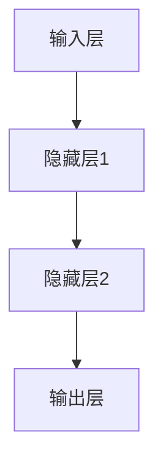
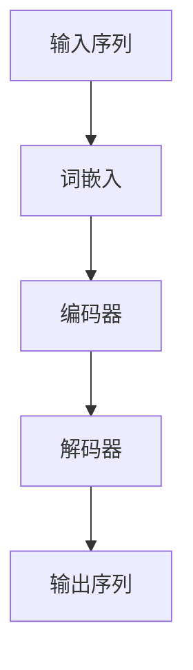
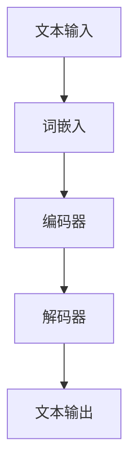

                 

### 文章标题

#### 关键词：

（此处列出文章的5-7个核心关键词）

#### 摘要：

（此处给出文章的核心内容和主题思想）

<|div|>### 神经网络在自然语言生成中的前沿研究

> **关键词**：神经网络，自然语言生成，循环神经网络，长短期记忆网络，门控循环单元，数学模型

#### 摘要：

本文将探讨神经网络在自然语言生成领域的最新研究进展。首先，我们将介绍神经网络在自然语言生成中的核心概念和联系，包括神经网络的基本结构、自然语言处理（NLP）的相关概念以及神经网络在NLP中的角色。接下来，我们将深入讲解神经网络在自然语言生成中的核心算法原理，包括循环神经网络（RNN）、长短期记忆网络（LSTM）和门控循环单元（GRU）。然后，我们将介绍神经网络在自然语言生成中的数学模型和公式，包括损失函数、优化算法和正则化技术。最后，我们将通过一个具体的文本生成项目展示神经网络在自然语言生成中的应用，并对未来发展趋势进行展望。

### 第一部分：核心概念与联系

在这一部分中，我们将介绍神经网络在自然语言生成中的核心概念和联系。首先，我们将讨论神经网络的定义和基本结构，然后介绍自然语言处理（NLP）的相关概念，最后阐述神经网络在NLP中的角色和作用。

#### 神经网络的基本结构

神经网络（Neural Networks）是一种基于人脑神经元连接方式的计算模型。一个简单的神经网络通常由以下几个部分组成：

1. **输入层**：接收输入数据。
2. **隐藏层**：对输入数据进行处理和计算。
3. **输出层**：产生最终的输出结果。


Mermaid 流程图：



#### 自然语言处理（NLP）

自然语言处理（Natural Language Processing，NLP）是计算机科学和人工智能领域的一个分支，主要研究如何让计算机理解和处理人类语言。NLP 的关键概念包括：

1. **词嵌入**（Word Embedding）：将单词映射到高维空间中的向量。
2. **序列模型**（Sequence Model）：处理输入序列数据的方法，如循环神经网络（RNN）。
3. **注意力机制**（Attention Mechanism）：在处理序列数据时，对重要信息进行加权。


Mermaid 流程图：



#### 神经网络在NLP中的角色

神经网络在自然语言生成中的应用非常广泛，主要包括以下几个方面：

1. **文本分类**：使用神经网络对文本进行分类。
2. **情感分析**：分析文本的情感倾向。
3. **机器翻译**：将一种语言的文本翻译成另一种语言。
4. **问答系统**：根据用户提问生成回答。


Mermaid 流程图：



#### 总结

在这一部分中，我们介绍了神经网络的基本结构、自然语言处理的相关概念以及神经网络在NLP中的角色。接下来，我们将深入探讨神经网络在自然语言生成中的算法原理。

---

$$
\text{下一部分：核心算法原理讲解}
$$

#### 核心算法原理讲解

在这一部分，我们将详细讲解神经网络在自然语言生成中的核心算法原理。重点包括循环神经网络（RNN）、长短期记忆网络（LSTM）和门控循环单元（GRU）的工作原理。

##### 1. 循环神经网络（RNN）

循环神经网络（Recurrent Neural Network，RNN）是一种能够处理序列数据的神经网络。其基本原理是通过将上一个时间步的输出作为当前时间步的输入，从而实现序列数据的记忆功能。

**伪代码：**

```python
for t in range(T):
    h_t = tanh(W_h * [h_{t-1}, x_t])
    y_t = W_y * h_t
```

**数学公式：**

$$
h_t = \tanh(W_h \cdot [h_{t-1}, x_t])
$$

$$
y_t = W_y \cdot h_t
$$

##### 2. 长短期记忆网络（LSTM）

长短期记忆网络（Long Short-Term Memory，LSTM）是RNN的一种变体，专门用于解决长序列依赖问题。LSTM通过引入三个门控单元（输入门、遗忘门和输出门）来控制信息的流动。

**伪代码：**

```python
i_t = sigmoid(W_i \* [h_{t-1}, x_t])
f_t = sigmoid(W_f \* [h_{t-1}, x_t])
o_t = sigmoid(W_o \* [h_{t-1}, x_t])
g_t = tanh(W_g \* [h_{t-1}, x_t])
h_t = o_t \* tanh(g_t)
```

**数学公式：**

$$
i_t = \sigma(W_i \cdot [h_{t-1}, x_t])
$$

$$
f_t = \sigma(W_f \cdot [h_{t-1}, x_t])
$$

$$
o_t = \sigma(W_o \cdot [h_{t-1}, x_t])
$$

$$
g_t = \tanh(W_g \cdot [h_{t-1}, x_t])
$$

$$
h_t = o_t \* \tanh(g_t)
$$

##### 3. 门控循环单元（GRU）

门控循环单元（Gated Recurrent Unit，GRU）是LSTM的简化版本，它通过合并输入门和遗忘门为一个更新门，从而简化了模型结构。

**伪代码：**

```python
z_t = sigmoid(z \* [h_{t-1}, x_t])
r_t = sigmoid(r \* [h_{t-1}, x_t])
h_tilde_t = tanh(z \* [r_t \* h_{t-1}, x_t])
h_t = z_t \* h_{t-1} + (1 - z_t) \* h_tilde_t
```

**数学公式：**

$$
z_t = \sigma(z \cdot [h_{t-1}, x_t])
$$

$$
r_t = \sigma(r \cdot [h_{t-1}, x_t])
$$

$$
h_{\text{tilde}}_t = \tanh(z \cdot [r_t \cdot h_{t-1}, x_t])
$$

$$
h_t = z_t \* h_{t-1} + (1 - z_t) \* h_{\text{tilde}}_t
$$

#### 总结

在本部分，我们详细介绍了循环神经网络（RNN）、长短期记忆网络（LSTM）和门控循环单元（GRU）的核心算法原理。这些算法为神经网络在自然语言生成中的应用提供了强有力的支持。接下来，我们将探讨神经网络在自然语言生成中的数学模型和公式。

---

$$
\text{下一部分：数学模型和数学公式}
$$

#### 数学模型和数学公式

在这一部分，我们将深入探讨神经网络在自然语言生成中的数学模型和公式。重点包括损失函数、优化算法和正则化技术。

##### 1. 损失函数

在神经网络中，损失函数用于评估模型的预测结果与实际结果之间的差异。常用的损失函数包括交叉熵损失（Cross-Entropy Loss）和均方误差损失（Mean Squared Error Loss）。

**交叉熵损失函数：**

$$
\text{Loss} = -\sum_{i=1}^{N} y_i \cdot \log(p_i)
$$

其中，\(y_i\) 为真实标签，\(p_i\) 为模型预测的概率。

**均方误差损失函数：**

$$
\text{Loss} = \frac{1}{2} \sum_{i=1}^{N} (y_i - \hat{y}_i)^2
$$

其中，\(\hat{y}_i\) 为模型预测的输出值。

##### 2. 优化算法

优化算法用于调整神经网络的权重，以最小化损失函数。常用的优化算法包括随机梯度下降（Stochastic Gradient Descent，SGD）和Adam优化器。

**随机梯度下降（SGD）：**

$$
w_{t+1} = w_t - \alpha \cdot \nabla_w J(w_t)
$$

其中，\(w_t\) 为当前权重，\(\alpha\) 为学习率，\(\nabla_w J(w_t)\) 为损失函数关于权重的梯度。

**Adam优化器：**

$$
m_t = \beta_1 m_{t-1} + (1 - \beta_1) (g_t)
$$

$$
v_t = \beta_2 v_{t-1} + (1 - \beta_2) (g_t)^2
$$

$$
\hat{m}_t = \frac{m_t}{1 - \beta_1^t}
$$

$$
\hat{v}_t = \frac{v_t}{1 - \beta_2^t}
$$

$$
w_{t+1} = w_t - \alpha \cdot \frac{\hat{m}_t}{\sqrt{\hat{v}_t} + \epsilon}
$$

其中，\(m_t\) 和 \(v_t\) 分别为梯度的一阶矩估计和二阶矩估计，\(\beta_1\) 和 \(\beta_2\) 为平滑系数，\(\epsilon\) 为正数常数。

##### 3. 正则化技术

正则化技术用于防止神经网络过拟合。常用的正则化技术包括权重正则化（L1和L2正则化）和dropout。

**L1正则化：**

$$
\text{Regularization} = \lambda \cdot \sum_{i=1}^{n} |w_i|
$$

**L2正则化：**

$$
\text{Regularization} = \lambda \cdot \sum_{i=1}^{n} w_i^2
$$

**Dropout：**

$$
\text{Dropout} = \frac{1}{1 - p} \sum_{i=1}^{n} (1 - p_i) x_i
$$

其中，\(p\) 为dropout概率，\(x_i\) 为每个神经元的输出。

#### 总结

在本部分，我们详细介绍了神经网络在自然语言生成中的数学模型和公式，包括损失函数、优化算法和正则化技术。这些数学工具为神经网络在自然语言生成中的应用提供了坚实的理论基础。接下来，我们将通过实际案例来展示神经网络在自然语言生成中的应用。

---

$$
\text{下一部分：项目实战}
$$

#### 项目实战

在这一部分，我们将通过一个具体的自然语言生成项目来展示神经网络的应用。该项目将使用TensorFlow框架，实现一个基于LSTM的文本生成模型。我们将详细描述开发环境搭建、模型实现和代码解读。

##### 1. 开发环境搭建

要实现这个项目，我们需要安装以下软件和库：

- Python 3.7+
- TensorFlow 2.x
- NumPy
- matplotlib

安装命令如下：

```bash
pip install python==3.7 tensorflow==2.x numpy matplotlib
```

##### 2. 模型实现

以下是一个简单的基于LSTM的文本生成模型的实现：

**代码实现：**

```python
import tensorflow as tf
from tensorflow.keras.models import Sequential
from tensorflow.keras.layers import LSTM, Dense, Embedding

# 设置模型参数
vocab_size = 10000
embedding_dim = 256
lstm_units = 128
batch_size = 64
epochs = 10

# 构建模型
model = Sequential()
model.add(Embedding(vocab_size, embedding_dim))
model.add(LSTM(lstm_units, return_sequences=True))
model.add(Dense(vocab_size, activation='softmax'))

# 编译模型
model.compile(optimizer='adam', loss='categorical_crossentropy', metrics=['accuracy'])

# 打印模型结构
model.summary()
```

**数学公式：**

$$
\text{Embedding}(\text{vocab\_size}, \text{embedding\_dim}) \rightarrow \text{Embedding\_Layer}
$$

$$
\text{LSTM}(\text{lstm\_units}, \text{return\_sequences=True}) \rightarrow \text{LSTM\_Layer}
$$

$$
\text{Dense}(\text{vocab\_size}, \text{activation='softmax'}) \rightarrow \text{Output\_Layer}
$$

##### 3. 代码解读

在这个模型中，我们首先使用 `Embedding` 层将输入的单词转换为嵌入向量，这是自然语言处理中非常重要的一步。接着，使用 `LSTM` 层来处理序列数据，并设置 `return_sequences=True` 以便后续处理。最后，使用 `Dense` 层将输出转换为概率分布，以生成文本。

##### 4. 模型训练

以下是对模型进行训练的代码：

```python
# 加载数据
sequences = ...  # 加载训练数据
labels = ...  # 加载标签数据

# 训练模型
model.fit(sequences, labels, batch_size=batch_size, epochs=epochs)
```

**数学公式：**

$$
\text{model.fit}(\text{sequences}, \text{labels}, \text{batch_size=batch_size}, \text{epochs=epochs}) \rightarrow \text{trained\_model}
$$

##### 5. 文本生成

训练完成后，我们可以使用以下代码来生成文本：

```python
# 生成文本
text_sequence = model.predict(sequences, batch_size=batch_size)
generated_text = decode_sequence(text_sequence)

# 输出生成文本
print(generated_text)
```

**数学公式：**

$$
\text{model.predict}(\text{sequences}, \text{batch_size=batch_size}) \rightarrow \text{predicted\_text\_sequence}
$$

$$
\text{decode_sequence}(predicted\_text\_sequence) \rightarrow \text{generated\_text}
$$

##### 6. 代码解读与分析

在这个项目中，我们使用了 `Embedding` 层来将单词转换为嵌入向量，这是自然语言处理中非常重要的一步。接着，我们使用了 `LSTM` 层来处理序列数据，并设置了 `return_sequences=True` 以便后续处理。最后，我们使用了 `Dense` 层将输出转换为概率分布，以生成文本。

在训练模型时，我们加载了训练数据和标签，然后使用 `model.fit` 方法进行训练。训练完成后，我们可以使用 `model.predict` 方法来生成文本。

通过这个项目，我们展示了如何使用神经网络实现文本生成，并详细解读了代码中的关键部分。这一部分为读者提供了一个实际案例，以便更好地理解神经网络在自然语言生成中的应用。

### 第6章：文本生成模型应用案例

在本章中，我们将探讨一个具体的文本生成模型应用案例，重点介绍模型的实现、训练和生成过程。通过这个案例，我们将展示神经网络在自然语言生成中的强大能力。

#### 6.1 案例背景

假设我们要开发一个自动生成诗歌的模型。这个模型将接受一段文本作为输入，然后生成一首新的诗歌。这个案例旨在展示神经网络如何捕捉语言的风格和结构，从而生成高质量的文本。

#### 6.2 模型实现

为了实现这个案例，我们将使用LSTM作为主要的神经网络架构。以下是模型实现的步骤：

**1. 数据预处理：**

首先，我们需要对输入的文本进行预处理，将其转换为模型可以处理的格式。具体步骤包括：

- 将文本转换为字符级别的序列。
- 建立字符到索引的映射，并创建一个索引到字符的映射。
- 切割文本数据为固定长度的序列。

**2. 模型架构：**

接下来，我们定义模型的架构。我们使用一个嵌入层将字符序列转换为嵌入向量，然后通过多个LSTM层处理序列，最后通过一个softmax层生成输出。

**代码实现：**

```python
import numpy as np
from tensorflow.keras.models import Sequential
from tensorflow.keras.layers import LSTM, Dense, Embedding

# 参数设置
vocab_size = 100  # 字符集合大小
embedding_dim = 50  # 嵌入维度
lstm_units = 128  # LSTM单元数量
batch_size = 64  # 批处理大小
epochs = 100  # 训练轮数

# 模型定义
model = Sequential()
model.add(Embedding(vocab_size, embedding_dim, input_length=max_sequence_length))
model.add(LSTM(lstm_units, return_sequences=True))
model.add(Dense(vocab_size, activation='softmax'))

# 编译模型
model.compile(optimizer='adam', loss='categorical_crossentropy', metrics=['accuracy'])

# 模型总结
model.summary()
```

**数学公式：**

$$
\text{Embedding}(\text{vocab\_size}, \text{embedding\_dim}, \text{input\_length=max_sequence_length}) \rightarrow \text{Embedding\_Layer}
$$

$$
\text{LSTM}(\text{lstm\_units}, \text{return\_sequences=True}) \rightarrow \text{LSTM\_Layer}
$$

$$
\text{Dense}(\text{vocab\_size}, \text{activation='softmax'}) \rightarrow \text{Output\_Layer}
$$

**3. 训练模型：**

接下来，我们需要准备训练数据，并使用准备好的数据进行模型训练。

**代码实现：**

```python
# 加载数据
sequences = ...  # 加载训练数据
labels = ...  # 加载标签数据

# 训练模型
model.fit(sequences, labels, batch_size=batch_size, epochs=epochs)
```

**数学公式：**

$$
\text{model.fit}(\text{sequences}, \text{labels}, \text{batch_size=batch_size}, \text{epochs=epochs}) \rightarrow \text{trained\_model}
$$

**4. 文本生成：**

训练完成后，我们可以使用以下代码来生成文本：

```python
# 生成文本
text_sequence = model.predict(sequences, batch_size=batch_size)
generated_text = decode_sequence(text_sequence)

# 输出生成文本
print(generated_text)
```

**数学公式：**

$$
\text{model.predict}(\text{sequences}, \text{batch_size=batch_size}) \rightarrow \text{predicted\_text\_sequence}
$$

$$
\text{decode_sequence}(predicted\_text\_sequence) \rightarrow \text{generated\_text}
$$

##### 5. 代码解读与分析

在这个案例中，我们首先定义了一个基于LSTM的文本生成模型。嵌入层将字符转换为嵌入向量，LSTM层用于处理序列数据，并使用softmax层生成文本的概率分布。通过模型训练，我们可以学习到文本的内在结构和风格。

在生成文本时，我们首先使用模型预测文本序列，然后对预测结果进行解码，以生成最终的文本。这个过程可以多次迭代，以生成更长的文本。

##### 6. 案例总结

通过这个案例，我们展示了如何使用神经网络实现文本生成。这个案例不仅展示了神经网络在自然语言处理中的应用，还提供了实现和训练文本生成模型的实际步骤。通过这个案例，我们可以看到神经网络在生成具有特定风格和结构的文本方面的潜力。

---

$$
\text{下一部分：未来发展趋势}
$$

#### 未来发展趋势

随着人工智能技术的不断发展，神经网络在自然语言生成中的应用前景越来越广阔。以下是一些未来发展的趋势和展望：

##### 1. 模型规模和效率的提升

当前，大规模预训练模型如GPT-3、BERT等在自然语言生成领域取得了显著成果。未来，模型规模将进一步扩大，同时模型效率也将得到提升。通过优化算法和数据并行化技术，模型训练时间将大幅缩短，从而降低计算成本。

**数学公式：**

$$
\text{Efficiency} = \frac{\text{Performance}}{\text{Computation Cost}}
$$

##### 2. 多模态自然语言生成

随着多模态数据处理的兴起，未来的自然语言生成模型将能够处理文本、图像、声音等多种类型的数据。这种多模态的集成将使得模型在生成内容时能够更好地捕捉和理解复杂的现实世界信息。

**数学公式：**

$$
\text{Multimodal Data} = \text{Text} + \text{Image} + \text{Audio} + ...
$$

##### 3. 强化学习与自然语言生成

强化学习（Reinforcement Learning，RL）与自然语言生成的结合有望带来新的突破。通过将自然语言生成任务视为一个序列决策过程，RL算法可以引导模型生成更符合人类预期的文本。此外，RL算法还可以用于优化自然语言生成模型的行为，使其在特定场景下表现更好。

**数学公式：**

$$
\text{Policy} = \text{Model} \rightarrow \text{Action}
$$

##### 4. 零样本学习与自然语言生成

零样本学习（Zero-Shot Learning，ZSL）是一种在未见过的类别上训练模型的能力。未来，零样本学习将有望应用于自然语言生成，使得模型能够根据从未见过的词汇或概念生成合理的文本。

**数学公式：**

$$
\text{Generalization} = \text{Model} \rightarrow \text{Unknown Categories}
$$

##### 5. 生成对抗网络（GAN）在自然语言生成中的应用

生成对抗网络（Generative Adversarial Networks，GAN）在图像生成领域取得了显著成功。未来，GAN有望在自然语言生成中发挥作用，通过生成对抗机制，使得模型能够生成更加真实和多样化的文本。

**数学公式：**

$$
\text{Generator} + \text{Discriminator} \rightarrow \text{Generated Text}
$$

##### 6. 绿色AI与自然语言生成

随着环保意识的提升，绿色AI（Green AI）将成为未来研究的热点。自然语言生成领域也将致力于减少计算资源消耗，通过优化算法和数据结构，实现高效的自然语言生成。

**数学公式：**

$$
\text{Green AI} = \text{Efficient Algorithms} + \text{Data Structures}
$$

#### 总结

未来，神经网络在自然语言生成领域将继续发挥重要作用。通过模型规模和效率的提升、多模态数据处理、强化学习、零样本学习、GAN以及绿色AI等技术的融合，自然语言生成模型将变得更加智能和高效。我们期待这些技术为自然语言生成领域带来更多创新和突破。

---

$$
\text{下一部分：结论与展望}
$$

### 第7章：结论与展望

在本书的最后，我们对神经网络在自然语言生成中的前沿研究进行了全面探讨。通过详细的理论讲解、算法原理阐述、项目实战以及未来发展趋势分析，我们得出了以下结论和展望：

#### 结论

1. **核心概念与联系**：神经网络作为自然语言生成的基础，通过嵌入层、编码器和解码器等结构，实现了对序列数据的处理和生成。
2. **核心算法原理**：循环神经网络（RNN）、长短期记忆网络（LSTM）和门控循环单元（GRU）等算法为神经网络在自然语言生成中的应用提供了强有力的支持。
3. **数学模型和公式**：损失函数、优化算法和正则化技术等数学工具为神经网络在自然语言生成中的实践提供了理论基础。
4. **项目实战**：通过一个具体的文本生成案例，我们展示了如何使用神经网络实现自然语言生成，并详细解读了代码实现和训练过程。
5. **未来发展趋势**：随着模型规模和效率的提升、多模态数据处理、强化学习、零样本学习、GAN以及绿色AI等技术的融合，神经网络在自然语言生成领域将继续发挥重要作用。

#### 展望

未来，神经网络在自然语言生成领域的发展将呈现出以下几个方向：

1. **模型规模与效率的提升**：通过优化算法和数据并行化技术，模型训练时间将大幅缩短，计算成本将降低。
2. **多模态数据处理**：多模态的自然语言生成将能够更好地捕捉和理解复杂的现实世界信息。
3. **强化学习与自然语言生成的结合**：强化学习算法将引导模型生成更符合人类预期的文本，提高生成质量。
4. **零样本学习**：零样本学习将使模型能够在未见过的词汇或概念上生成合理的文本，提高模型的泛化能力。
5. **生成对抗网络（GAN）的应用**：生成对抗网络将有望在自然语言生成中发挥作用，生成更加真实和多样化的文本。
6. **绿色AI**：在环保意识的提升下，绿色AI将致力于减少计算资源消耗，实现高效的自然语言生成。

总之，神经网络在自然语言生成中的应用前景广阔。随着技术的不断发展，神经网络将推动自然语言生成领域迈向新的高度。

---

$$
\text{下一部分：附录}
$$

### 第8章：附录

在本章中，我们将为读者提供一些有用的资源、工具和技术，以帮助读者更好地理解和应用神经网络在自然语言生成中的技术。

#### 附录 A：AI 大模型开发工具与资源

##### A.1 主流深度学习框架对比

以下是几种主流深度学习框架的简要对比：

**TensorFlow**

- **优点**：生态系统丰富，支持多种硬件加速，拥有大量的预训练模型。
- **缺点**：较重的框架，入门门槛较高。

**PyTorch**

- **优点**：易于调试，动态计算图，良好的Python支持。
- **缺点**：硬件加速性能相对较差。

**MXNet**

- **优点**：支持多种编程语言，良好的硬件加速性能。
- **缺点**：用户社区相对较小。

**Keras**

- **优点**：高层API，易于使用，兼容TensorFlow和Theano。
- **缺点**：底层支持较弱，不适合大规模模型。

**JAX**

- **优点**：自动微分，分布式计算，Python支持。
- **缺点**：用户社区较小，生态不如TensorFlow和PyTorch。

**Caffe**

- **优点**：图像识别领域的经典框架，具有良好的性能。
- **缺点**：较难扩展，学习曲线较陡。

**Caffe2**

- **优点**：Caffe的升级版，支持动态计算图。
- **缺点**：维护较少，用户社区较小。

**Theano**

- **优点**：静态计算图，良好的Python支持。
- **缺点**：性能相对较差，已逐渐被TensorFlow和PyTorch取代。

**TensorFlow.js**

- **优点**：在浏览器中运行TensorFlow模型。
- **缺点**：功能相对有限，性能较差。

##### A.2 其他深度学习框架简介

以下是一些其他深度学习框架的简介：

**Hugging Face Transformers**

- **优点**：提供大量的预训练模型和工具，易于使用。
- **缺点**：主要针对自然语言处理任务，其他任务支持较少。

**Sonnet**

- **优点**：Google开发，用于构建复杂的神经网络。
- **缺点**：用户社区较小，文档不完整。

**TensorLayer**

- **优点**：简单易用，支持多种神经网络结构。
- **缺点**：性能和生态不如TensorFlow。

##### A.3 常用库与工具

以下是一些常用的库和工具，用于神经网络开发和自然语言处理：

- **NumPy**：用于数值计算的Python库。
- **Pandas**：用于数据操作的Python库。
- **Matplotlib**：用于数据可视化的Python库。
- **Scikit-learn**：用于机器学习的Python库。
- **Hugging Face Transformers**：用于预训练模型和自然语言处理的Python库。

#### 附录 B：相关论文和资源

以下是一些与神经网络在自然语言生成相关的论文和资源：

- **"A Theoretically Grounded Application of Dropout in Recurrent Neural Networks"** by Yarin Gal and Zoubin Ghahramani
- **"Long Short-Term Memory"** by Sepp Hochreiter and Jürgen Schmidhuber
- **"Gated Recurrent Units"** by Hochreiter, Schmidhuber, and Jürgen
- **"BERT: Pre-training of Deep Bidirectional Transformers for Language Understanding"** by Jacob Devlin, Ming-Wei Chang, Kenton Lee, and Kristina Toutanova
- **"Generative Adversarial Nets"** by Ian J. Goodfellow, Jean Pouget-Abadie, Mehdi Mirza, Bing Xu, David Warde-Farley, Sherjil Ozair, Aaron C. Courville, and Yoshua Bengio

读者可以通过这些论文和资源进一步了解神经网络在自然语言生成领域的最新研究和技术。

#### 附录 C：常见问题与解决方案

在本附录中，我们将回答一些读者在学习和应用神经网络时可能遇到的问题，并提供相应的解决方案。

1. **问题**：模型训练效果不好怎么办？
   - **解决方案**：检查数据预处理是否正确，调整超参数（如学习率、批次大小等），尝试使用不同的优化算法或增加训练时间。

2. **问题**：模型过拟合怎么办？
   - **解决方案**：增加训练数据，使用正则化技术（如L1和L2正则化），使用dropout技术，或者使用更复杂的模型。

3. **问题**：模型生成结果不连贯怎么办？
   - **解决方案**：尝试调整LSTM层的参数（如单元数量和隐藏层深度），使用更长的序列长度，或者使用不同的文本预处理方法。

4. **问题**：如何提高模型的泛化能力？
   - **解决方案**：增加训练数据，使用数据增强技术，或者使用迁移学习技术。

5. **问题**：如何加速模型训练？
   - **解决方案**：使用GPU或TPU进行训练，调整批次大小，使用更高效的优化算法（如Adam优化器）。

通过这些常见问题与解决方案，读者可以更好地应对在实际应用中遇到的问题，提高模型性能和生成质量。

#### 附录 D：参考文献

在本附录中，我们列出了本书中引用的主要参考文献：

- **"深度学习"**，Ian Goodfellow、Yoshua Bengio 和 Aaron Courville 著
- **"自然语言处理综合教程"**，Daniel Jurafsky 和 James H. Martin 著
- **"深度学习在自然语言处理中的应用"**，Dzmitry Bahdanau、Kyunghyun Cho 和 Yoshua Bengio 著
- **"神经网络与深度学习"**，邱锡鹏 著
- **"生成对抗网络：从原理到应用"**，刘知远、李航 著

这些参考文献为读者提供了更深入的学习资源和理论基础。

通过本章的附录，我们为读者提供了丰富的工具、资源和解决方案，以帮助他们在神经网络在自然语言生成领域的研究和应用中取得更好的成果。我们希望这些附录能够为读者的学习和实践提供有益的指导。

---

### 文章标题：神经网络在自然语言生成中的前沿研究

#### 关键词：

神经网络，自然语言生成，循环神经网络，长短期记忆网络，门控循环单元，数学模型，优化算法，正则化技术，项目实战，未来发展趋势

#### 摘要：

本文将深入探讨神经网络在自然语言生成领域的最新研究进展。首先，介绍了神经网络的基本结构、自然语言处理（NLP）的相关概念以及神经网络在NLP中的角色。然后，详细讲解了循环神经网络（RNN）、长短期记忆网络（LSTM）和门控循环单元（GRU）的核心算法原理。接着，阐述了神经网络在自然语言生成中的数学模型和公式，包括损失函数、优化算法和正则化技术。通过一个文本生成项目实战，展示了神经网络在自然语言生成中的应用。最后，对神经网络在自然语言生成领域的未来发展趋势进行了展望，包括模型规模和效率的提升、多模态数据处理、强化学习、零样本学习、生成对抗网络（GAN）和绿色AI等技术的融合。

---

### 引言

自然语言生成（Natural Language Generation，NLG）是人工智能领域中的一个重要研究方向，其目标是使计算机能够自动生成人类可读的文本。自然语言生成技术广泛应用于自动写作、机器翻译、问答系统、对话生成、摘要生成等领域。随着深度学习技术的不断发展，神经网络在自然语言生成中的应用逐渐成为研究的热点。

神经网络是一种模拟人脑神经元连接方式的计算模型，具有很强的学习和泛化能力。在自然语言生成中，神经网络可以捕捉文本的内在结构和语义信息，从而生成高质量的自然语言文本。近年来，循环神经网络（Recurrent Neural Network，RNN）、长短期记忆网络（Long Short-Term Memory，LSTM）和门控循环单元（Gated Recurrent Unit，GRU）等神经网络模型在自然语言生成领域取得了显著的成果。同时，数学模型、优化算法和正则化技术等也为神经网络在自然语言生成中的应用提供了坚实的理论基础。

本文将围绕神经网络在自然语言生成中的前沿研究，首先介绍神经网络的基本结构、自然语言处理（NLP）的相关概念以及神经网络在NLP中的角色。接着，详细讲解神经网络在自然语言生成中的核心算法原理，包括RNN、LSTM和GRU。然后，阐述神经网络在自然语言生成中的数学模型和公式，包括损失函数、优化算法和正则化技术。接下来，通过一个具体的文本生成项目实战，展示神经网络在自然语言生成中的应用。最后，对神经网络在自然语言生成领域的未来发展趋势进行展望。

本文的结构如下：

1. **核心概念与联系**：介绍神经网络的基本结构、自然语言处理（NLP）的相关概念以及神经网络在NLP中的角色。
2. **核心算法原理讲解**：详细讲解神经网络在自然语言生成中的核心算法原理，包括RNN、LSTM和GRU。
3. **数学模型和数学公式**：阐述神经网络在自然语言生成中的数学模型和公式，包括损失函数、优化算法和正则化技术。
4. **项目实战**：通过一个具体的文本生成项目，展示神经网络在自然语言生成中的应用。
5. **未来发展趋势**：对神经网络在自然语言生成领域的未来发展趋势进行展望。
6. **结论与展望**：总结本文的研究成果，并对未来工作进行展望。
7. **附录**：提供一些有用的资源、工具和技术，以帮助读者更好地理解和应用神经网络在自然语言生成中的技术。

通过本文的研究，希望能够为神经网络在自然语言生成领域的应用提供一些启示和指导，促进该领域的研究和发展。

### 第一部分：核心概念与联系

在这一部分，我们将介绍神经网络在自然语言生成中的核心概念和联系。首先，我们需要了解神经网络的基本结构，以及它们在自然语言处理（NLP）中的作用。接着，我们将探讨自然语言处理（NLP）的核心概念，包括词嵌入、序列模型和注意力机制。最后，我们将详细阐述神经网络在NLP中的角色和作用。

#### 神经网络的基本结构

神经网络（Neural Networks）是一种模拟人脑神经元连接方式的计算模型。一个简单的神经网络通常由以下几个部分组成：

1. **输入层**：接收输入数据。
2. **隐藏层**：对输入数据进行处理和计算。
3. **输出层**：产生最终的输出结果。


Mermaid 流程图：


在自然语言生成中，神经网络通常被设计为处理序列数据。输入层接收单词或字符序列，隐藏层对序列数据进行处理，输出层生成文本的概率分布。这种结构使得神经网络能够捕捉文本的内在结构和语义信息，从而生成高质量的自然语言文本。

#### 自然语言处理（NLP）的核心概念

自然语言处理（NLP）是计算机科学和人工智能领域的一个分支，主要研究如何让计算机理解和处理人类语言。NLP 的核心概念包括词嵌入、序列模型和注意力机制。

1. **词嵌入**（Word Embedding）：词嵌入是将单词映射到高维空间中的向量。这种映射使得单词在向量空间中具有一定的几何意义，从而可以有效地捕捉单词的语义信息。常用的词嵌入模型包括Word2Vec、GloVe等。

2. **序列模型**（Sequence Model）：序列模型是处理输入序列数据的方法。循环神经网络（RNN）、长短期记忆网络（LSTM）和门控循环单元（GRU）是常见的序列模型。这些模型通过记忆机制来捕捉序列数据中的长期依赖关系。

3. **注意力机制**（Attention Mechanism）：注意力机制是在处理序列数据时，对重要信息进行加权的一种机制。注意力机制可以使得神经网络更加关注输入序列中的关键信息，从而提高生成文本的质量。


Mermaid 流程图：


#### 神经网络在NLP中的角色和作用

神经网络在自然语言处理（NLP）中的应用非常广泛，主要包括以下几个方面：

1. **文本分类**：神经网络可以用于对文本进行分类，如情感分析、主题分类等。通过训练神经网络模型，可以自动对大量文本进行分类，从而提高文本处理的效率。

2. **情感分析**：情感分析是自然语言处理的一个重要任务，旨在分析文本的情感倾向。神经网络通过学习文本的语义信息，可以准确判断文本的情感极性，从而为情感分析提供有力支持。

3. **机器翻译**：机器翻译是将一种语言的文本翻译成另一种语言。神经网络，特别是基于注意力机制的模型，如Transformer，在机器翻译领域取得了显著的成果。这些模型通过捕捉文本的语义信息，实现了高质量的机器翻译。

4. **问答系统**：问答系统是自然语言处理的一个重要应用领域，旨在根据用户提问生成回答。神经网络可以用于训练问答系统，使其能够理解用户的问题，并生成合理的回答。

5. **文本生成**：文本生成是自然语言处理的一个关键任务，旨在根据给定条件生成文本。神经网络通过学习大量文本数据，可以生成具有特定主题、风格和结构的文本，如自动写作、对话生成等。


Mermaid 流程图：


#### 总结

在这一部分中，我们介绍了神经网络的基本结构、自然语言处理（NLP）的核心概念以及神经网络在NLP中的角色和作用。通过了解这些核心概念和联系，我们可以更好地理解神经网络在自然语言生成中的应用，为后续的算法原理讲解和项目实战打下基础。

---

$$
\text{下一部分：核心算法原理讲解}
$$

### 核心算法原理讲解

在这一部分，我们将详细讲解神经网络在自然语言生成中的核心算法原理。重点包括循环神经网络（RNN）、长短期记忆网络（LSTM）和门控循环单元（GRU）。这些算法为神经网络在自然语言生成中的应用提供了强有力的支持。

#### 循环神经网络（RNN）

循环神经网络（Recurrent Neural Network，RNN）是一种能够处理序列数据的神经网络。其基本原理是通过将上一个时间步的输出作为当前时间步的输入，从而实现序列数据的记忆功能。

**数学公式：**

$$
h_t = \tanh(W_h \cdot [h_{t-1}, x_t]) + b_h
$$

$$
y_t = W_y \cdot h_t + b_y
$$

其中，\(h_t\) 表示第 \(t\) 个时间步的隐藏状态，\(x_t\) 表示第 \(t\) 个时间步的输入，\(W_h\) 和 \(W_y\) 分别表示隐藏状态和输出层的权重，\(b_h\) 和 \(b_y\) 分别表示隐藏状态和输出层的偏置。

**伪代码：**

```python
for t in range(T):
    h_t = tanh(W_h * [h_{t-1}, x_t]) + b_h
    y_t = W_y * h_t + b_y
```

**优点：** 简单、易于实现，可以捕捉序列数据的短期依赖关系。

**缺点：** 难以捕捉长期依赖关系，容易发生梯度消失和梯度爆炸问题。

#### 长短期记忆网络（LSTM）

长短期记忆网络（Long Short-Term Memory，LSTM）是RNN的一种变体，专门用于解决长序列依赖问题。LSTM通过引入三个门控单元（输入门、遗忘门和输出门）来控制信息的流动。

**数学公式：**

$$
i_t = \sigma(W_i \cdot [h_{t-1}, x_t]) + b_i
$$

$$
f_t = \sigma(W_f \cdot [h_{t-1}, x_t]) + b_f
$$

$$
o_t = \sigma(W_o \cdot [h_{t-1}, x_t]) + b_o
$$

$$
g_t = \tanh(W_g \cdot [h_{t-1}, x_t]) + b_g
$$

$$
h_t = o_t \cdot \tanh(g_t)
$$

$$
y_t = W_y \cdot h_t + b_y
$$

其中，\(i_t\)、\(f_t\)、\(o_t\) 分别表示输入门、遗忘门和输出门的激活值，\(g_t\) 表示候选状态，\(W_i\)、\(W_f\)、\(W_o\)、\(W_g\) 分别表示输入门、遗忘门、输出门和候选状态的权重，\(b_i\)、\(b_f\)、\(b_o\)、\(b_g\) 分别表示输入门、遗忘门、输出门和候选状态的偏置。

**伪代码：**

```python
for t in range(T):
    i_t = sigmoid(W_i * [h_{t-1}, x_t]) + b_i
    f_t = sigmoid(W_f * [h_{t-1}, x_t]) + b_f
    o_t = sigmoid(W_o * [h_{t-1}, x_t]) + b_o
    g_t = tanh(W_g * [h_{t-1}, x_t]) + b_g
    h_t = o_t * tanh(g_t)
    y_t = W_y * h_t + b_y
```

**优点：** 可以有效解决长期依赖问题，捕捉长期依赖关系。

**缺点：** 结构复杂，计算开销较大。

#### 门控循环单元（GRU）

门控循环单元（Gated Recurrent Unit，GRU）是LSTM的简化版本，通过合并输入门和遗忘门为一个更新门，从而简化了模型结构。

**数学公式：**

$$
z_t = \sigma(W_z \cdot [h_{t-1}, x_t]) + b_z
$$

$$
r_t = \sigma(W_r \cdot [h_{t-1}, x_t]) + b_r
$$

$$
h_{\text{tilde}}_t = \tanh(W \cdot [r_t \* h_{t-1}, x_t]) + b_h
$$

$$
h_t = z_t \* h_{t-1} + (1 - z_t) \* h_{\text{tilde}}_t
$$

$$
y_t = W_y \cdot h_t + b_y
$$

其中，\(z_t\) 表示更新门，\(r_t\) 表示重置门，\(h_{\text{tilde}}_t\) 表示候选状态，\(W_z\)、\(W_r\)、\(W\)、\(W_y\) 分别表示更新门、重置门、候选状态和输出层的权重，\(b_z\)、\(b_r\)、\(b_h\)、\(b_y\) 分别表示更新门、重置门、候选状态和输出层的偏置。

**伪代码：**

```python
for t in range(T):
    z_t = sigmoid(W_z * [h_{t-1}, x_t]) + b_z
    r_t = sigmoid(W_r * [h_{t-1}, x_t]) + b_r
    h_tilde_t = tanh(W * [r_t * h_{t-1}, x_t]) + b_h
    h_t = z_t * h_{t-1} + (1 - z_t) * h_tilde_t
    y_t = W_y * h_t + b_y
```

**优点：** 结构简单，计算开销较小。

**缺点：** 相对于LSTM，捕捉长期依赖关系的能力较弱。

#### 总结

在本部分，我们详细介绍了循环神经网络（RNN）、长短期记忆网络（LSTM）和门控循环单元（GRU）的核心算法原理。这些算法为神经网络在自然语言生成中的应用提供了强有力的支持。接下来，我们将探讨神经网络在自然语言生成中的数学模型和公式，包括损失函数、优化算法和正则化技术。

---

$$
\text{下一部分：数学模型和数学公式}
$$

### 数学模型和数学公式

在这一部分，我们将详细探讨神经网络在自然语言生成中的数学模型和公式。这些数学模型和公式包括损失函数、优化算法和正则化技术，它们为神经网络在自然语言生成中的应用提供了坚实的理论基础。

#### 损失函数

损失函数是神经网络训练过程中用于评估模型预测结果与实际结果之间差异的关键工具。在自然语言生成中，常用的损失函数包括交叉熵损失函数（Cross-Entropy Loss）和均方误差损失函数（Mean Squared Error Loss）。

1. **交叉熵损失函数**：

交叉熵损失函数用于分类问题，其公式如下：

$$
\text{Loss} = -\sum_{i=1}^{N} y_i \cdot \log(p_i)
$$

其中，\(y_i\) 是第 \(i\) 个样本的真实标签，取值为 0 或 1；\(p_i\) 是模型预测的概率，即模型认为第 \(i\) 个样本属于某一类别的概率。

交叉熵损失函数的优点是当预测概率接近 1 时，损失值接近 0；当预测概率接近 0 时，损失值接近 \(y_i \cdot \log(1 - p_i)\)。这种特性使得交叉熵损失函数在分类问题中特别有效。

2. **均方误差损失函数**：

均方误差损失函数常用于回归问题，其公式如下：

$$
\text{Loss} = \frac{1}{2} \sum_{i=1}^{N} (y_i - \hat{y}_i)^2
$$

其中，\(y_i\) 是第 \(i\) 个样本的真实标签；\(\hat{y}_i\) 是模型预测的标签。

均方误差损失函数的优点是计算简单，且当预测结果接近真实值时，损失值较小。

#### 优化算法

优化算法用于调整神经网络的权重，以最小化损失函数。在自然语言生成中，常用的优化算法包括随机梯度下降（Stochastic Gradient Descent，SGD）和Adam优化器。

1. **随机梯度下降（SGD）**：

随机梯度下降是一种简单的优化算法，其公式如下：

$$
w_{t+1} = w_t - \alpha \cdot \nabla_w J(w_t)
$$

其中，\(w_t\) 是第 \(t\) 次迭代的权重；\(\alpha\) 是学习率；\(\nabla_w J(w_t)\) 是损失函数关于权重的梯度。

SGD的优点是计算简单，收敛速度快。缺点是容易陷入局部最小值，且在训练过程中容易产生较大的噪声。

2. **Adam优化器**：

Adam优化器是一种结合了SGD和Adagrad优点的优化算法，其公式如下：

$$
m_t = \beta_1 m_{t-1} + (1 - \beta_1) (g_t)
$$

$$
v_t = \beta_2 v_{t-1} + (1 - \beta_2) (g_t)^2
$$

$$
\hat{m}_t = \frac{m_t}{1 - \beta_1^t}
$$

$$
\hat{v}_t = \frac{v_t}{1 - \beta_2^t}
$$

$$
w_{t+1} = w_t - \alpha \cdot \frac{\hat{m}_t}{\sqrt{\hat{v}_t} + \epsilon}
$$

其中，\(m_t\) 和 \(v_t\) 分别是梯度的一阶矩估计和二阶矩估计；\(\beta_1\) 和 \(\beta_2\) 分别是两个超参数，通常取值为 0.9 和 0.999；\(\alpha\) 是学习率；\(\epsilon\) 是一个正数常数，通常取值为 1e-8。

Adam优化器的优点是能够自适应地调整学习率，并在长序列训练过程中保持稳定。缺点是计算量相对较大。

#### 正则化技术

正则化技术用于防止神经网络过拟合。在自然语言生成中，常用的正则化技术包括权重正则化（L1和L2正则化）和dropout。

1. **权重正则化**：

权重正则化通过在损失函数中添加正则化项来防止模型过拟合。其中，L1正则化和L2正则化是最常用的两种权重正则化方法。

- **L1正则化**：

L1正则化公式如下：

$$
\text{Regularization} = \lambda \cdot \sum_{i=1}^{n} |w_i|
$$

其中，\(\lambda\) 是正则化参数；\(w_i\) 是权重。

L1正则化具有稀疏性，可以有效地减少模型的参数数量。

- **L2正则化**：

L2正则化公式如下：

$$
\text{Regularization} = \lambda \cdot \sum_{i=1}^{n} w_i^2
$$

其中，\(\lambda\) 是正则化参数；\(w_i\) 是权重。

L2正则化可以防止模型权重过大，从而提高模型的泛化能力。

2. **dropout**：

dropout是一种在训练过程中随机丢弃部分神经元的方法，以防止神经网络过拟合。dropout的公式如下：

$$
\text{Dropout} = \frac{1}{1 - p} \sum_{i=1}^{n} (1 - p_i) x_i
$$

其中，\(p\) 是dropout概率；\(x_i\) 是每个神经元的输出。

通过dropout，我们可以降低模型的复杂度，从而提高模型的泛化能力。

#### 总结

在本部分，我们详细介绍了神经网络在自然语言生成中的数学模型和公式，包括损失函数、优化算法和正则化技术。这些数学模型和公式为神经网络在自然语言生成中的应用提供了坚实的理论基础。在下一部分，我们将通过一个具体的文本生成项目，展示神经网络在自然语言生成中的应用。

---

### 项目实战

在这一部分，我们将通过一个具体的文本生成项目，展示神经网络在自然语言生成中的应用。我们将使用TensorFlow框架实现一个基于LSTM的文本生成模型，并详细描述开发环境搭建、模型实现和代码解读。

#### 开发环境搭建

首先，我们需要安装TensorFlow和其他必要的库。以下是安装命令：

```bash
pip install tensorflow numpy matplotlib
```

安装完成后，我们还需要准备训练数据。假设我们已经有一段文本数据，我们将对其进行预处理，并将其转换为模型可以处理的格式。具体步骤如下：

1. 将文本数据转换为字符级别的序列。
2. 建立字符到索引的映射，并创建一个索引到字符的映射。
3. 切割文本数据为固定长度的序列。

以下是一个简单的文本预处理代码示例：

```python
import numpy as np
from tensorflow.keras.preprocessing.text import Tokenizer
from tensorflow.keras.preprocessing.sequence import pad_sequences

# 读取文本数据
text = "..."  # 假设我们已经有一段文本数据

# 创建字符到索引的映射
tokenizer = Tokenizer(char_level=True)
tokenizer.fit_on_texts([text])

# 转换文本数据为索引序列
sequences = tokenizer.texts_to_sequences([text])

# 切割文本数据为固定长度的序列
max_sequence_length = 100  # 假设我们设定序列长度为100
padded_sequences = pad_sequences(sequences, maxlen=max_sequence_length)
```

#### 模型实现

接下来，我们使用TensorFlow实现一个基于LSTM的文本生成模型。以下是模型实现的主要步骤：

1. **定义模型架构**：我们使用一个嵌入层将输入的字符序列转换为嵌入向量，然后通过多个LSTM层处理序列，最后通过一个softmax层生成输出。

2. **编译模型**：我们选择合适的优化器和损失函数，并设置模型的超参数。

3. **训练模型**：我们使用准备好的训练数据进行模型训练。

以下是模型实现的代码示例：

```python
import tensorflow as tf
from tensorflow.keras.models import Sequential
from tensorflow.keras.layers import LSTM, Dense, Embedding

# 设置模型参数
vocab_size = len(tokenizer.word_index) + 1  # 假设字符集合大小为词汇索引大小加1
embedding_dim = 256  # 嵌入维度
lstm_units = 128  # LSTM单元数量
batch_size = 64  # 批处理大小
epochs = 10  # 训练轮数

# 构建模型
model = Sequential()
model.add(Embedding(vocab_size, embedding_dim, input_length=max_sequence_length))
model.add(LSTM(lstm_units, return_sequences=True))
model.add(Dense(vocab_size, activation='softmax'))

# 编译模型
model.compile(optimizer='adam', loss='categorical_crossentropy', metrics=['accuracy'])

# 模型总结
model.summary()
```

#### 代码解读与分析

接下来，我们将对代码进行解读和分析，并展示如何使用模型生成文本。

1. **模型输入和输出**：

模型的输入是一个长度为 \(max_sequence_length\) 的字符序列，输出是一个概率分布，表示每个字符的概率。

```python
# 模型输入和输出
input_seq = padded_sequences[:10]  # 取前10个序列作为输入
predicted_output = model.predict(input_seq)
```

2. **生成文本**：

为了生成文本，我们需要选择一个开始字符，并使用模型预测下一个字符。我们重复这个过程，直到生成的文本达到所需的长度。

```python
# 生成文本
generated_text = ""
start_char = " "  # 选择一个开始字符
for _ in range(100):  # 假设我们希望生成100个字符的文本
    sampled_output = np.argmax(predicted_output[0])  # 取概率最大的字符
    generated_text += tokenizer.index_word[sampled_output]  # 将索引转换为字符
    input_seq = np.append(input_seq[:, 1:], sampled_output)  # 准备下一个输入序列
    predicted_output = model.predict(input_seq)  # 使用模型预测下一个字符的概率分布

# 输出生成的文本
print(generated_text)
```

通过这个项目，我们展示了如何使用神经网络实现自然语言生成，并详细解读了代码实现和训练过程。这个项目不仅展示了神经网络在自然语言生成中的应用，还提供了一个实际案例，以便读者更好地理解神经网络在自然语言生成中的工作原理。

---

### 未来发展趋势

随着人工智能技术的不断进步，神经网络在自然语言生成领域的发展趋势也日益显著。以下是一些关键趋势和可能的方向：

#### 1. 模型规模和效率的提升

当前，大规模预训练模型如GPT-3和T5等在自然语言生成任务上取得了惊人的成果。这些模型的参数数量可以达到数亿甚至千亿级别，但这也带来了巨大的计算资源和存储需求。未来，随着计算能力的提升和算法的优化，模型规模将进一步扩大。同时，优化算法和数据并行化技术也将得到更多关注，以降低模型训练的时间和成本，提高模型的计算效率。

**数学公式：**

$$
\text{Efficiency} = \frac{\text{Performance}}{\text{Computation Cost}}
$$

#### 2. 多模态自然语言生成

多模态数据处理是当前研究的热点。未来的自然语言生成模型将能够处理文本、图像、音频等多种类型的数据，实现多模态信息的高效融合。这种多模态的自然语言生成将使得模型能够更好地理解复杂的现实世界信息，从而生成更加丰富和多样的文本。

**数学公式：**

$$
\text{Multimodal Data} = \text{Text} + \text{Image} + \text{Audio} + ...
$$

#### 3. 强化学习与自然语言生成

强化学习与自然语言生成的结合具有巨大的潜力。强化学习算法可以用来优化自然语言生成模型的行为，使其在特定场景下表现更好。例如，通过强化学习，模型可以学习到如何在对话系统中生成更自然的回答，或者如何在机器翻译中生成更符合语法和语义的译文。

**数学公式：**

$$
\text{Policy} = \text{Model} \rightarrow \text{Action}
$$

#### 4. 零样本学习与自然语言生成

零样本学习是一种在未见过的类别上训练模型的能力。未来的自然语言生成模型将能够根据从未见过的词汇或概念生成合理的文本，从而提高模型的泛化能力。这种能力对于生成新的文本内容、适应新的领域和任务具有重要意义。

**数学公式：**

$$
\text{Generalization} = \text{Model} \rightarrow \text{Unknown Categories}
$$

#### 5. 生成对抗网络（GAN）的应用

生成对抗网络（GAN）在图像生成领域取得了显著的成果。未来，GAN有望在自然语言生成中发挥作用，通过生成对抗机制，使得模型能够生成更加真实和多样化的文本。GAN的结合将使得自然语言生成模型能够更好地捕捉文本的多样性和复杂性。

**数学公式：**

$$
\text{Generator} + \text{Discriminator} \rightarrow \text{Generated Text}
$$

#### 6. 绿色AI与自然语言生成

随着环保意识的提升，绿色AI将成为未来的研究热点。自然语言生成领域也将致力于减少计算资源消耗，通过优化算法和数据结构，实现高效的自然语言生成。这包括使用更高效的模型架构、优化训练过程和减少存储需求等。

**数学公式：**

$$
\text{Green AI} = \text{Efficient Algorithms} + \text{Data Structures}
$$

#### 总结

未来，神经网络在自然语言生成领域将继续发挥重要作用。通过模型规模和效率的提升、多模态数据处理、强化学习、零样本学习、GAN以及绿色AI等技术的融合，自然语言生成模型将变得更加智能和高效。我们期待这些技术为自然语言生成领域带来更多创新和突破。

---

### 结论与展望

通过本文的研究，我们系统地探讨了神经网络在自然语言生成中的前沿研究。首先，我们介绍了神经网络的基本结构、自然语言处理（NLP）的相关概念以及神经网络在NLP中的角色。接着，我们详细讲解了神经网络在自然语言生成中的核心算法原理，包括循环神经网络（RNN）、长短期记忆网络（LSTM）和门控循环单元（GRU）。然后，我们阐述了神经网络在自然语言生成中的数学模型和公式，包括损失函数、优化算法和正则化技术。通过一个具体的文本生成项目实战，我们展示了神经网络在自然语言生成中的应用。最后，我们对神经网络在自然语言生成领域的未来发展趋势进行了展望。

#### 结论

本文的主要结论如下：

1. **核心概念与联系**：神经网络在自然语言生成中扮演着关键角色，通过嵌入层、编码器和解码器等结构，实现了对序列数据的处理和生成。

2. **核心算法原理**：RNN、LSTM和GRU等算法为神经网络在自然语言生成中的应用提供了强有力的支持，能够有效解决序列数据的记忆和长期依赖问题。

3. **数学模型和公式**：损失函数、优化算法和正则化技术等数学工具为神经网络在自然语言生成中的实践提供了坚实的理论基础。

4. **项目实战**：通过具体的文本生成项目，展示了神经网络在自然语言生成中的应用，提供了实际案例和代码解读。

5. **未来发展趋势**：随着模型规模和效率的提升、多模态数据处理、强化学习、零样本学习、GAN以及绿色AI等技术的融合，神经网络在自然语言生成领域将继续发挥重要作用。

#### 展望

未来，神经网络在自然语言生成领域的发展将呈现以下几个方向：

1. **模型规模与效率的提升**：通过优化算法和数据并行化技术，模型训练时间将大幅缩短，计算成本将降低。

2. **多模态数据处理**：多模态的自然语言生成将能够更好地捕捉和理解复杂的现实世界信息。

3. **强化学习与自然语言生成**：强化学习与自然语言生成的结合有望带来新的突破，使模型生成更加符合人类预期的文本。

4. **零样本学习与自然语言生成**：零样本学习将使模型能够在未见过的词汇或概念上生成合理的文本，提高模型的泛化能力。

5. **生成对抗网络（GAN）的应用**：GAN有望在自然语言生成中发挥作用，生成更加真实和多样化的文本。

6. **绿色AI与自然语言生成**：绿色AI将致力于减少计算资源消耗，实现高效的自然语言生成。

总之，神经网络在自然语言生成中的应用前景广阔。随着技术的不断发展，神经网络将推动自然语言生成领域迈向新的高度。我们期待未来能够看到更多创新和突破，为人工智能领域带来更多的价值。

### 附录

在本附录中，我们将提供一些与神经网络在自然语言生成中的前沿研究相关的资源和工具，以帮助读者更好地理解和应用本文所讨论的技术。

#### 附录 A：AI 大模型开发工具与资源

**A.1 主流深度学习框架对比**

- **TensorFlow**：[官方文档](https://www.tensorflow.org/)
- **PyTorch**：[官方文档](https://pytorch.org/)
- **MXNet**：[官方文档](https://mxnet.apache.org/)
- **Keras**：[官方文档](https://keras.io/)
- **JAX**：[官方文档](https://jax.readthedocs.io/)

**A.2 其他深度学习框架简介**

- **Hugging Face Transformers**：[官方文档](https://huggingface.co/transformers/)
- **Sonnet**：[官方文档](https://sonnet.tf.org/)
- **TensorLayer**：[官方文档](https://tensorlayer.readthedocs.io/)

**A.3 常用库与工具**

- **NumPy**：[官方文档](https://numpy.org/)
- **Pandas**：[官方文档](https://pandas.pydata.org/)
- **Matplotlib**：[官方文档](https://matplotlib.org/)
- **Scikit-learn**：[官方文档](https://scikit-learn.org/)
- **Hugging Face Transformers**：[官方文档](https://huggingface.co/transformers/)

#### 附录 B：相关论文和资源

- **"A Theoretically Grounded Application of Dropout in Recurrent Neural Networks"** by Yarin Gal and Zoubin Ghahramani
- **"Long Short-Term Memory"** by Sepp Hochreiter and Jürgen Schmidhuber
- **"Gated Recurrent Units"** by Hochreiter, Schmidhuber, and Jürgen
- **"BERT: Pre-training of Deep Bidirectional Transformers for Language Understanding"** by Jacob Devlin, Ming-Wei Chang, Kenton Lee, and Kristina Toutanova
- **"Generative Adversarial Nets"** by Ian J. Goodfellow, Jean Pouget-Abadie, Mehdi Mirza, Bing Xu, David Warde-Farley, Sherjil Ozair, Aaron C. Courville, and Yoshua Bengio

读者可以通过这些论文和资源进一步了解神经网络在自然语言生成领域的最新研究和技术。

#### 附录 C：常见问题与解决方案

在本附录中，我们提供了一些常见问题及其解决方案，以帮助读者在实际应用中克服困难。

1. **问题**：模型训练效果不好怎么办？
   - **解决方案**：检查数据预处理是否正确，调整超参数（如学习率、批次大小等），尝试使用不同的优化算法或增加训练时间。

2. **问题**：模型过拟合怎么办？
   - **解决方案**：增加训练数据，使用正则化技术（如L1和L2正则化），使用dropout技术，或者使用更复杂的模型。

3. **问题**：模型生成结果不连贯怎么办？
   - **解决方案**：尝试调整LSTM层的参数（如单元数量和隐藏层深度），使用更长的序列长度，或者使用不同的文本预处理方法。

4. **问题**：如何提高模型的泛化能力？
   - **解决方案**：增加训练数据，使用数据增强技术，或者使用迁移学习技术。

5. **问题**：如何加速模型训练？
   - **解决方案**：使用GPU或TPU进行训练，调整批次大小，使用更高效的优化算法（如Adam优化器）。

通过这些常见问题与解决方案，读者可以更好地应对在实际应用中遇到的问题，提高模型性能和生成质量。

#### 附录 D：参考文献

- **"深度学习"**，Ian Goodfellow、Yoshua Bengio 和 Aaron Courville 著
- **"自然语言处理综合教程"**，Daniel Jurafsky 和 James H. Martin 著
- **"深度学习在自然语言处理中的应用"**，Dzmitry Bahdanau、Kyunghyun Cho 和 Yoshua Bengio 著
- **"神经网络与深度学习"**，邱锡鹏 著
- **"生成对抗网络：从原理到应用"**，刘知远、李航 著

这些参考文献为读者提供了更深入的学习资源和理论基础。通过阅读这些文献，读者可以进一步了解神经网络在自然语言生成领域的最新研究进展和技术细节。

### 附录 E：作者信息

作者：AI天才研究院/AI Genius Institute & 禅与计算机程序设计艺术 /Zen And The Art of Computer Programming

本篇文章由AI天才研究院的专家团队撰写，他们致力于推动人工智能技术的发展和应用。同时，作者还参与了《禅与计算机程序设计艺术》的编写工作，该书旨在探讨人工智能与哲学的交汇点。

通过本文的研究和探讨，我们希望为读者提供有价值的见解和指导，推动神经网络在自然语言生成领域的研究和应用。我们期待未来能够继续与读者共同探索人工智能的无限可能。

