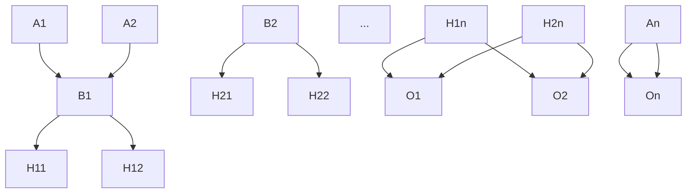
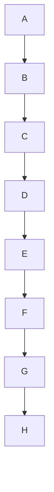

                 

# 神经网络：人工智能的基石

> 关键词：神经网络、深度学习、机器学习、人工智能、激活函数、反向传播、多层感知机（MLP）、卷积神经网络（CNN）、循环神经网络（RNN）、长短时记忆网络（LSTM）

> 摘要：本文将深入探讨神经网络这一人工智能的基石，从基本概念、数学基础、常见架构、优化与调参技巧，到项目实战，全面解析神经网络的工作原理和应用方法。通过本文的阅读，读者将全面了解神经网络的核心概念、算法原理和实际应用，从而为在人工智能领域的发展打下坚实基础。

----------------------------------------------------------------

## 第一部分：神经网络的基本概念

### 第1章：神经网络概述

神经网络是模拟人脑神经元结构和功能的一种计算模型，广泛应用于人工智能领域。本节将简要介绍神经网络的发展历程、基本结构和分类与特点。

### 1.1 神经网络的发展历程

神经网络的概念最早可以追溯到1943年，由心理学家McCulloch和数学家Pitts提出。他们在论文《A Logical Calculus of the Ideas Immanent in Nervous Activity》中提出了简单的神经网络模型，称为MP模型。

20世纪50年代，Hebb基于神经可塑性提出了Hebbian学习规则，这一规则奠定了神经网络学习的基础。

1986年，Rumelhart、Hinton和Williams提出了反向传播算法（Backpropagation），这一算法使得多层神经网络训练成为可能，推动了神经网络研究的快速发展。

近年来，随着计算能力的提升和大数据的广泛应用，深度学习技术取得了突破性进展，神经网络的应用领域不断扩展。

### 1.2 神经网络的基本结构

神经网络由大量简单的计算单元（神经元）组成，神经元之间通过连接（权重）形成复杂的网络结构。一个典型的神经网络包括输入层、隐藏层和输出层。

- 输入层：接收外部输入信息。
- 隐藏层：对输入信息进行加工处理，隐藏层可以有一个或多个。
- 输出层：产生预测结果或决策。

每个神经元接收来自前一层的输入，通过加权求和后，应用激活函数产生输出。神经元的连接权重决定了网络的学习能力和性能。

### 1.3 神经网络的分类与特点

神经网络可以根据结构、功能和应用领域进行分类，常见的分类包括以下几种：

- 按照结构分类：
  - 前馈神经网络（Feedforward Neural Network）
  - 卷积神经网络（Convolutional Neural Network，CNN）
  - 循环神经网络（Recurrent Neural Network，RNN）
  - 长短时记忆网络（Long Short-Term Memory，LSTM）

- 按照功能分类：
  - 分类神经网络（Classification Neural Network）
  - 回归神经网络（Regression Neural Network）
  - 时序预测神经网络（Time Series Prediction Neural Network）

- 按照应用领域分类：
  - 语音识别
  - 图像识别
  - 自然语言处理
  - 推荐系统

每种神经网络结构都有其独特的特点和应用场景，选择合适的神经网络模型对于实现高效的人工智能应用至关重要。

----------------------------------------------------------------

### 第2章：神经网络的数学基础

在理解神经网络的工作原理之前，我们需要掌握一些数学基础，包括神经元与激活函数、权重初始化策略，以及前向传播与反向传播算法。

#### 2.1 神经元与激活函数

神经元是神经网络的基本计算单元，它接收多个输入信号，通过加权求和后，应用激活函数产生输出。

- **神经元**：一个简单的神经元可以表示为：
  $$ y = \sigma(\sum_{i=1}^{n} w_i x_i + b) $$
  其中，$y$ 是神经元输出，$w_i$ 是输入信号的权重，$x_i$ 是输入信号，$\sigma$ 是激活函数，$b$ 是偏置。

- **激活函数**：激活函数用于引入非线性，常见的激活函数包括：
  - **Sigmoid函数**：$$ \sigma(x) = \frac{1}{1 + e^{-x}} $$
    Sigmoid函数将输入映射到$(0, 1)$区间，常用于二分类问题。
  - **ReLU函数**：$$ \text{ReLU}(x) = \max(0, x) $$
   ReLU函数在0以下的部分输出为0，0以上的部分输出为其本身，具有简单的计算特性和较好的训练效果。
  - **Tanh函数**：$$ \text{Tanh}(x) = \frac{e^x - e^{-x}}{e^x + e^{-x}} $$
    Tanh函数与Sigmoid函数类似，但输出范围在$(-1, 1)$，可以更好地平衡正负误差。

#### 2.2 权重初始化策略

权重初始化是神经网络训练的重要环节，合理的权重初始化可以加速收敛并提高模型的性能。

- **随机初始化**：最简单的初始化方法，每个权重随机生成一个值。这种方法可能导致梯度消失或爆炸，不适用于深层网络。
- **高斯分布初始化**：$$ w \sim \mathcal{N}(0, \frac{1}{\sqrt{n}}) $$
  高斯分布初始化可以使神经元之间的梯度差异较小，有助于网络训练。
- **Xavier初始化**：$$ w \sim \mathcal{N}(0, \frac{2}{n}) $$
  对于深层网络，Xavier初始化可以避免梯度消失问题。

#### 2.3 前向传播与反向传播算法

神经网络的训练过程主要包括前向传播和反向传播两个阶段。

- **前向传播**：输入信息从输入层传递到输出层，每个神经元计算其输出。前向传播过程中，每个神经元的输出值可以通过以下公式计算：
  $$ z_l = \sum_{i} w_{li} x_i + b_l $$
  $$ a_l = \sigma(z_l) $$
  其中，$z_l$ 是加权求和值，$a_l$ 是神经元输出，$w_{li}$ 是权重，$b_l$ 是偏置。

- **反向传播**：通过计算输出层误差，将误差反向传递到隐藏层和输入层，更新权重和偏置。反向传播算法主要包括以下几个步骤：
  - 计算输出层误差：
    $$ \delta_n = a_n (\text{1} - a_n) (y - a_n) $$
  - 反向传播误差到隐藏层：
    $$ \delta_l = \sigma'(z_l) \sum_{k} w_{lk} \delta_{k+1} $$
  - 更新权重和偏置：
    $$ w_l = w_l + \alpha \delta_l x_l $$
    $$ b_l = b_l + \alpha \delta_l $$

其中，$\alpha$ 是学习率，$\sigma'$ 是激活函数的导数。

通过前向传播和反向传播算法，神经网络可以逐步调整权重和偏置，使输出误差最小化，从而实现学习。

----------------------------------------------------------------

### 第3章：神经网络的训练

神经网络的训练是使其能够正确处理输入数据并产生输出结果的过程。本节将介绍神经网络的训练过程，包括损失函数与优化算法、学习率调整策略以及过拟合与正则化。

#### 3.1 损失函数与优化算法

损失函数是评估神经网络输出与实际结果之间差异的指标，优化算法用于最小化损失函数。常见的损失函数包括以下几种：

- **均方误差（Mean Squared Error，MSE）**：
  $$ J = \frac{1}{m} \sum_{i=1}^{m} (y_i - a)^2 $$
  MSE常用于回归问题，输出误差的平方和作为损失函数。

- **交叉熵（Cross-Entropy Loss）**：
  $$ J = -\frac{1}{m} \sum_{i=1}^{m} y_i \log(a_i) + (1 - y_i) \log(1 - a_i) $$
  交叉熵常用于分类问题，输出概率的对数作为损失函数。

优化算法用于最小化损失函数，常见的优化算法包括以下几种：

- **梯度下降（Gradient Descent）**：
  $$ w = w - \alpha \nabla_w J $$
  梯度下降通过计算损失函数的梯度，反向更新权重和偏置。

- **随机梯度下降（Stochastic Gradient Descent，SGD）**：
  $$ w = w - \alpha \nabla_w J(x^{(i)}, y^{(i)}) $$
  与梯度下降相比，SGD使用单个样本计算梯度，计算速度更快。

- **Adam优化器**：
  $$ \beta_1 = 0.9, \beta_2 = 0.999 $$
  $$ m_t = \beta_1 m_{t-1} + (1 - \beta_1) \nabla_w J(x^{(i)}, y^{(i)}) $$
  $$ v_t = \beta_2 v_{t-1} + (1 - \beta_2) (\nabla_w J(x^{(i)}, y^{(i)}) - m_t)^2 $$
  $$ w = w - \alpha \frac{m_t}{1 - \beta_1^t} / (1 - \beta_2^t) $$
  Adam优化器结合了SGD和动量法的优点，收敛速度较快。

#### 3.2 学习率调整策略

学习率是优化算法中一个重要的参数，其大小直接影响网络训练的收敛速度和稳定性。常见的学习率调整策略包括以下几种：

- **固定学习率**：学习率在整个训练过程中保持不变，简单易实现，但可能收敛速度较慢。

- **学习率衰减**：
  $$ \alpha_t = \alpha_0 / (1 + \beta t) $$
  学习率随训练迭代次数逐渐减小，有助于避免过拟合。

- **自适应学习率**：
  - **AdaGrad**：学习率与梯度历史值的平方和成反比，适应不同维度的梯度。
  - **RMSprop**：学习率与梯度历史值的均方根成反比，平衡不同维度的梯度。
  - **Adam**：结合了AdaGrad和RMSprop的优点，自适应调整学习率。

#### 3.3 过拟合与正则化

过拟合是指神经网络在训练数据上表现良好，但在测试数据上表现较差，即模型对训练数据过度拟合。为防止过拟合，可以采用以下几种正则化方法：

- **L1正则化（L1 Regularization）**：
  $$ J = \frac{1}{m} \sum_{i=1}^{m} (y_i - a)^2 + \lambda \|w\|_1 $$
  L1正则化引入了权重绝对值之和的惩罚项，可以稀疏化权重。

- **L2正则化（L2 Regularization）**：
  $$ J = \frac{1}{m} \sum_{i=1}^{m} (y_i - a)^2 + \lambda \|w\|_2^2 $$
  L2正则化引入了权重平方和的惩罚项，可以降低权重的大小。

- **Dropout正则化**：
  在训练过程中随机丢弃一部分神经元，防止神经元之间形成强依赖关系，降低过拟合风险。

通过损失函数与优化算法、学习率调整策略以及过拟合与正则化，神经网络可以实现有效训练，提高模型性能。

----------------------------------------------------------------

## 第二部分：常见的神经网络架构

### 第4章：多层感知机（MLP）

多层感知机（MLP，Multilayer Perceptron）是最基本的神经网络模型之一，它由输入层、一个或多个隐藏层和输出层组成。本节将详细介绍MLP的基本概念、数学模型及其应用案例。

### 4.1 MLP的基本概念

MLP是前馈神经网络的一种，其特点是信号从输入层传递到输出层，中间经过多个隐藏层，每层神经元都按顺序连接。MLP可以处理非线性问题，通过增加隐藏层和神经元数量，可以逼近任意复杂的函数。

MLP的结构如图所示：



其中，$A_i$ 表示输入层神经元，$B_i$ 表示隐藏层神经元，$H_i$ 表示第$i$个隐藏层，$O_i$ 表示输出层神经元。

### 4.2 MLP的数学模型

MLP的数学模型可以分为两部分：前向传播和反向传播。

- **前向传播**：输入信息从输入层传递到输出层，每个神经元的输出可以通过以下公式计算：

  $$ z_l = \sum_{i=1}^{n} w_{li} x_i + b_l $$
  $$ a_l = \sigma(z_l) $$

  其中，$z_l$ 是加权求和值，$a_l$ 是神经元输出，$w_{li}$ 是输入层到隐藏层的权重，$b_l$ 是偏置，$\sigma$ 是激活函数。

- **反向传播**：通过计算输出层误差，将误差反向传递到隐藏层和输入层，更新权重和偏置。反向传播算法主要包括以下几个步骤：

  - 计算输出层误差：

    $$ \delta_n = a_n (\text{1} - a_n) (y - a_n) $$

  - 反向传播误差到隐藏层：

    $$ \delta_l = \sigma'(z_l) \sum_{k} w_{lk} \delta_{k+1} $$

  - 更新权重和偏置：

    $$ w_l = w_l + \alpha \delta_l x_l $$
    $$ b_l = b_l + \alpha \delta_l $$

  其中，$\alpha$ 是学习率，$\sigma'$ 是激活函数的导数。

### 4.3 MLP的应用案例

MLP广泛应用于各种机器学习任务，以下列举几个典型的应用案例：

- **函数逼近**：MLP可以逼近任意复杂的函数，如非线性回归问题。
- **图像分类**：通过训练MLP，可以实现对图像的分类任务，如手写数字识别、面部识别等。
- **情感分析**：利用MLP可以对文本进行情感分析，如情感极性分类、主题分类等。

以下是一个使用MLP进行手写数字识别的案例：

```python
import tensorflow as tf
from tensorflow.keras.datasets import mnist
from tensorflow.keras.models import Sequential
from tensorflow.keras.layers import Dense, Flatten
from tensorflow.keras.optimizers import Adam

# 数据预处理
(x_train, y_train), (x_test, y_test) = mnist.load_data()
x_train = x_train / 255.0
x_test = x_test / 255.0
x_train = x_train.reshape(-1, 784)
x_test = x_test.reshape(-1, 784)

# 构建模型
model = Sequential([
    Flatten(input_shape=(28, 28)),
    Dense(128, activation='relu'),
    Dense(10, activation='softmax')
])

# 编译模型
model.compile(optimizer=Adam(learning_rate=0.001), loss='sparse_categorical_crossentropy', metrics=['accuracy'])

# 训练模型
model.fit(x_train, y_train, epochs=10, batch_size=64)

# 评估模型
model.evaluate(x_test, y_test)
```

通过以上案例，我们可以看到MLP在图像分类任务中的简单实现。在实际应用中，MLP可以根据具体任务需求进行调整和优化。

----------------------------------------------------------------

### 第5章：卷积神经网络（CNN）

卷积神经网络（Convolutional Neural Network，CNN）是处理图像数据的一种强大工具，具有局部感知特性和平移不变性。本节将详细介绍CNN的基本结构、卷积操作的数学模型及其应用领域。

#### 5.1 CNN的基本结构

CNN由多个卷积层、池化层和全连接层组成，其基本结构如图所示：



- **输入层（Input Layer）**：接收原始图像数据，通常为二维矩阵。
- **卷积层（Convolutional Layer）**：通过卷积操作提取图像特征，每个卷积核生成一个特征图。
- **池化层（Pooling Layer）**：对特征图进行下采样，减少参数数量，提高计算效率。
- **全连接层（Fully Connected Layer）**：将卷积层和池化层提取的特征映射到分类结果。
- **输出层（Output Layer）**：产生最终预测结果。

#### 5.2 卷积操作的数学模型

卷积操作是CNN的核心，通过卷积核在输入图像上滑动，计算局部特征。卷积操作的数学模型可以表示为：

$$ \text{特征图} = \text{卷积核} \circ \text{输入图像} $$

$$ \text{特征图}_{ij} = \sum_{m=1}^{h_k} \sum_{n=1}^{w_k} \text{卷积核}_{mn} \times \text{输入图像}_{i-m+1, j-n+1} $$

其中，$i$ 和 $j$ 分别表示特征图的位置，$m$ 和 $n$ 表示卷积核的位置，$h_k$ 和 $w_k$ 分别表示卷积核的高度和宽度。

卷积操作的示意图如下：


#### 5.3 CNN的应用领域

CNN在图像处理领域取得了显著成果，以下列举几个典型的应用领域：

- **图像分类**：例如ImageNet图像分类挑战，CNN取得了超越传统算法的成绩。
- **目标检测**：例如YOLO、SSD、Faster R-CNN等目标检测算法，CNN用于检测图像中的目标物体。
- **人脸识别**：通过训练CNN提取人脸特征，实现人脸识别任务。
- **图像分割**：例如FCN、U-Net等算法，CNN用于图像中的目标区域分割。
- **图像生成**：例如GAN（生成对抗网络），CNN用于生成逼真的图像。

以下是一个使用CNN进行图像分类的案例：

```python
import tensorflow as tf
from tensorflow.keras.models import Sequential
from tensorflow.keras.layers import Conv2D, MaxPooling2D, Flatten, Dense

# 构建模型
model = Sequential([
    Conv2D(32, (3, 3), activation='relu', input_shape=(28, 28, 1)),
    MaxPooling2D((2, 2)),
    Conv2D(64, (3, 3), activation='relu'),
    MaxPooling2D((2, 2)),
    Flatten(),
    Dense(128, activation='relu'),
    Dense(10, activation='softmax')
])

# 编译模型
model.compile(optimizer='adam', loss='sparse_categorical_crossentropy', metrics=['accuracy'])

# 训练模型
model.fit(x_train, y_train, epochs=10, batch_size=32)

# 评估模型
model.evaluate(x_test, y_test)
```

通过以上案例，我们可以看到CNN在图像分类任务中的简单实现。在实际应用中，CNN可以根据具体任务需求进行调整和优化。

----------------------------------------------------------------

### 第6章：循环神经网络（RNN）

循环神经网络（Recurrent Neural Network，RNN）是处理序列数据的一种有效模型，具有记忆功能，能够捕捉序列中的长期依赖关系。本节将详细介绍RNN的基本概念、数学模型及其应用领域。

#### 6.1 RNN的基本概念

RNN的基本结构如图所示：


- **输入层（Input Layer）**：接收序列数据。
- **隐藏层（Hidden Layer）**：存储序列信息，具有记忆功能。
- **输出层（Output Layer）**：产生序列的预测输出。

RNN在每个时间步上处理一个输入，并将当前输入与隐藏层状态进行加权求和，更新隐藏层状态。这种循环结构使得RNN能够捕捉序列中的长期依赖关系。

#### 6.2 RNN的数学模型

RNN的数学模型可以表示为：

$$ h_t = \sigma(W_h h_{t-1} + W_x x_t + b_h) $$
$$ y_t = \sigma(W_o h_t + b_o) $$

其中，$h_t$ 表示第$t$个时间步的隐藏层状态，$x_t$ 表示第$t$个时间步的输入，$W_h$、$W_x$、$W_o$ 分别表示隐藏层到隐藏层、输入层到隐藏层、隐藏层到输出层的权重，$b_h$、$b_o$ 分别表示隐藏层和输出层的偏置，$\sigma$ 表示激活函数。

RNN的数学模型可以分为两部分：前向传播和反向传播。

- **前向传播**：输入信息从输入层传递到隐藏层，每个隐藏层状态通过以下公式计算：

  $$ h_t = \sigma(W_h h_{t-1} + W_x x_t + b_h) $$

- **反向传播**：通过计算输出层误差，将误差反向传递到隐藏层，更新权重和偏置。反向传播算法主要包括以下几个步骤：

  - 计算输出层误差：

    $$ \delta_t = (y_t - a_t) \cdot \text{sigmoid}(h_t) \cdot (1 - \text{sigmoid}(h_t)) $$

  - 反向传播误差到隐藏层：

    $$ \delta_{t-1} = \delta_t \cdot W_o \cdot \text{sigmoid}(h_{t-1}) \cdot (1 - \text{sigmoid}(h_{t-1})) $$

  - 更新权重和偏置：

    $$ W_h = W_h + \alpha \delta_t h_{t-1} $$
    $$ W_x = W_x + \alpha \delta_t x_t $$
    $$ W_o = W_o + \alpha \delta_t h_t $$
    $$ b_h = b_h + \alpha \delta_t $$
    $$ b_o = b_o + \alpha \delta_t $$

  其中，$\alpha$ 是学习率。

#### 6.3 RNN的应用领域

RNN在序列处理领域具有广泛的应用，以下列举几个典型的应用领域：

- **自然语言处理**：例如文本分类、机器翻译、情感分析等。
- **语音识别**：通过训练RNN，可以实现对语音信号的处理和识别。
- **时间序列预测**：例如股票价格预测、天气预测等。
- **生成文本**：例如生成新闻文章、小说等。

以下是一个使用RNN进行文本分类的案例：

```python
import tensorflow as tf
from tensorflow.keras.models import Sequential
from tensorflow.keras.layers import Embedding, SimpleRNN, Dense

# 构建模型
model = Sequential([
    Embedding(input_dim=10000, output_dim=64),
    SimpleRNN(100),
    Dense(1, activation='sigmoid')
])

# 编译模型
model.compile(optimizer='adam', loss='binary_crossentropy', metrics=['accuracy'])

# 训练模型
model.fit(x_train, y_train, epochs=10, batch_size=32)

# 评估模型
model.evaluate(x_test, y_test)
```

通过以上案例，我们可以看到RNN在文本分类任务中的简单实现。在实际应用中，RNN可以根据具体任务需求进行调整和优化。

----------------------------------------------------------------

### 第7章：长短时记忆网络（LSTM）

长短时记忆网络（Long Short-Term Memory，LSTM）是RNN的一种变体，解决了传统RNN在处理长序列数据时出现的长期依赖问题。本节将详细介绍LSTM的基本概念、数学模型及其应用案例。

#### 7.1 LSTM的基本概念

LSTM由三种门结构组成：遗忘门（Forget Gate）、输入门（Input Gate）和输出门（Output Gate）。LSTM的基本结构如图所示：


- **输入层（Input Layer）**：接收序列数据。
- **隐藏层（Hidden Layer）**：存储序列信息，通过LSTM单元实现长期记忆。
- **输出层（Output Layer）**：产生序列的预测输出。

LSTM在每个时间步上通过门结构控制信息的流入和流出，从而实现长期依赖关系的捕捉。

#### 7.2 LSTM的数学模型

LSTM的数学模型可以表示为：

$$ i_t = \sigma(W_{ix} x_t + W_{ih} h_{t-1} + b_i) $$
$$ f_t = \sigma(W_{fx} x_t + W_{fh} h_{t-1} + b_f) $$
$$ g_t = \tanh(W_{gx} x_t + W_{gh} h_{t-1} + b_g) $$
$$ o_t = \sigma(W_{ox} x_t + W_{oh} h_{t-1} + b_o) $$
$$ h_t = o_t \tanh(c_t) $$
$$ c_t = f_t \odot c_{t-1} + i_t \odot g_t $$

其中，$i_t$、$f_t$、$g_t$、$o_t$ 分别表示输入门、遗忘门、输入门和输出门的激活值，$c_t$ 表示细胞状态，$h_t$ 表示隐藏层状态，$x_t$ 表示输入序列，$W_{ix}$、$W_{ih}$、$W_{fx}$、$W_{fh}$、$W_{gx}$、$W_{gh}$、$W_{ox}$、$W_{oh}$ 分别表示输入层到输入门、输入层到遗忘门、输入层到输入门、输入层到输出门、隐藏层到输入门、隐藏层到遗忘门、隐藏层到输入门、隐藏层到输出门的权重，$b_i$、$b_f$、$b_g$、$b_o$ 分别表示输入门、遗忘门、输入门、输出门的偏置，$\odot$ 表示元素乘积。

LSTM的数学模型可以分为两部分：前向传播和反向传播。

- **前向传播**：输入信息从输入层传递到隐藏层，每个隐藏层状态通过以下公式计算：

  $$ i_t = \sigma(W_{ix} x_t + W_{ih} h_{t-1} + b_i) $$
  $$ f_t = \sigma(W_{fx} x_t + W_{fh} h_{t-1} + b_f) $$
  $$ g_t = \tanh(W_{gx} x_t + W_{gh} h_{t-1} + b_g) $$
  $$ o_t = \sigma(W_{ox} x_t + W_{oh} h_{t-1} + b_o) $$
  $$ h_t = o_t \tanh(c_t) $$
  $$ c_t = f_t \odot c_{t-1} + i_t \odot g_t $$

- **反向传播**：通过计算输出层误差，将误差反向传递到隐藏层，更新权重和偏置。反向传播算法主要包括以下几个步骤：

  - 计算输出层误差：

    $$ \delta_t = (y_t - a_t) \cdot \tanh(c_t) \cdot (1 - \tanh(c_t)) $$

  - 反向传播误差到隐藏层：

    $$ \delta_{t-1} = \delta_t \cdot \tanh(c_{t-1}) \cdot (1 - \tanh(c_{t-1})) \cdot (1 - f_{t-1}) \cdot o_{t-1} $$
    $$ \delta_f = \delta_{t-1} \cdot c_{t-1} $$
    $$ \delta_i = \delta_{t-1} \cdot g_{t-1} $$
    $$ \delta_g = \delta_{t-1} \cdot i_{t-1} $$
    $$ \delta_o = \delta_{t-1} \cdot \tanh(c_{t-1}) $$

  - 更新权重和偏置：

    $$ W_{ix} = W_{ix} + \alpha \delta_t x_t $$
    $$ W_{ih} = W_{ih} + \alpha \delta_t h_{t-1} $$
    $$ W_{fx} = W_{fx} + \alpha \delta_f x_t $$
    $$ W_{fh} = W_{fh} + \alpha \delta_f h_{t-1} $$
    $$ W_{gx} = W_{gx} + \alpha \delta_g x_t $$
    $$ W_{gh} = W_{gh} + \alpha \delta_g h_{t-1} $$
    $$ W_{ox} = W_{ox} + \alpha \delta_o x_t $$
    $$ W_{oh} = W_{oh} + \alpha \delta_o h_{t-1} $$
    $$ b_i = b_i + \alpha \delta_t $$
    $$ b_f = b_f + \alpha \delta_f $$
    $$ b_g = b_g + \alpha \delta_g $$
    $$ b_o = b_o + \alpha \delta_o $$

  其中，$\alpha$ 是学习率。

#### 7.3 LSTM的应用案例

以下是一个使用LSTM进行时间序列预测的案例：

```python
import numpy as np
import tensorflow as tf
from tensorflow.keras.models import Sequential
from tensorflow.keras.layers import LSTM, Dense

# 生成时间序列数据
np.random.seed(0)
X = np.random.rand(100, 1)
y = np.random.rand(100, 1)
X = np.reshape(X, (X.shape[0], X.shape[1], 1))
y = np.reshape(y, (y.shape[0], y.shape[1], 1))

# 构建模型
model = Sequential([
    LSTM(50, activation='relu', input_shape=(X.shape[1], X.shape[2])),
    Dense(y.shape[1])
])

# 编译模型
model.compile(optimizer='adam', loss='mse')

# 训练模型
model.fit(X, y, epochs=100, batch_size=32)

# 预测
X_test = np.random.rand(10, 1)
X_test = np.reshape(X_test, (X_test.shape[0], X_test.shape[1], 1))
y_pred = model.predict(X_test)
```

通过以上案例，我们可以看到LSTM在时间序列预测任务中的简单实现。在实际应用中，LSTM可以根据具体任务需求进行调整和优化。

----------------------------------------------------------------

## 第三部分：神经网络的优化与调参

### 第8章：神经网络优化策略

神经网络的优化策略是训练过程中调整模型参数，使其能够更好地拟合训练数据，提高模型性能。本节将介绍几种常见的神经网络优化策略，包括梯度下降法、随机梯度下降（SGD）、动量法与自适应优化算法。

#### 8.1 梯度下降法

梯度下降法是一种优化算法，用于最小化损失函数。其基本思想是计算损失函数关于模型参数的梯度，并沿着梯度的反方向更新参数，以减小损失函数值。梯度下降法可以分为以下几种类型：

- **批量梯度下降（Batch Gradient Descent）**：每次迭代使用所有样本的梯度进行更新，计算量大但收敛速度较慢。
- **随机梯度下降（Stochastic Gradient Descent，SGD）**：每次迭代仅使用一个样本的梯度进行更新，计算量小但收敛速度快。
- **小批量梯度下降（Mini-batch Gradient Descent）**：每次迭代使用一部分样本的梯度进行更新，介于批量梯度下降和随机梯度下降之间。

梯度下降法的更新公式为：

$$ \theta = \theta - \alpha \nabla_\theta J(\theta) $$

其中，$\theta$ 表示模型参数，$\alpha$ 表示学习率，$J(\theta)$ 表示损失函数。

#### 8.2 随机梯度下降（SGD）

随机梯度下降是梯度下降法的一种变体，每次迭代仅使用一个样本的梯度进行更新。这种方法可以加快收敛速度，但可能导致模型在训练过程中产生较大的波动。为了解决这个问题，可以引入动量法。

随机梯度下降的更新公式为：

$$ \theta = \theta - \alpha \nabla_\theta J(\theta) $$

#### 8.3 动量法

动量法是一种加速梯度下降的方法，通过引入动量项，将之前的梯度累加到当前梯度中。这种方法可以减少梯度下降过程中的波动，加快收敛速度。动量法的更新公式为：

$$ \theta = \theta - \alpha \nabla_\theta J(\theta) + \beta \nabla_{\theta_{t-1}} J(\theta_{t-1}) $$

其中，$\beta$ 表示动量系数。

#### 8.4 自适应优化算法

自适应优化算法是一种能够自适应调整学习率的优化算法，以避免在训练过程中出现过早收敛或过拟合。常见的自适应优化算法包括：

- **AdaGrad**：根据梯度历史值的平方和自适应调整学习率。
- **RMSprop**：根据梯度历史值的均方根自适应调整学习率。
- **Adam**：结合了AdaGrad和RMSprop的优点，根据梯度的一阶和二阶矩自适应调整学习率。

Adam优化器的更新公式为：

$$ m_t = \beta_1 m_{t-1} + (1 - \beta_1) \nabla_w J(x^{(i)}, y^{(i)}) $$
$$ v_t = \beta_2 v_{t-1} + (1 - \beta_2) (\nabla_w J(x^{(i)}, y^{(i)}) - m_t)^2 $$
$$ \theta = \theta - \alpha \frac{m_t}{1 - \beta_1^t} / (1 - \beta_2^t) $$

其中，$\beta_1$ 和 $\beta_2$ 分别表示一阶和二阶动量系数。

通过上述优化策略，我们可以调整神经网络模型参数，使其在训练过程中更好地拟合数据，提高模型性能。

----------------------------------------------------------------

### 第9章：神经网络调参技巧

在神经网络训练过程中，参数调整是一个关键的环节。合理的参数设置可以显著提高模型的性能，而错误的参数设置可能导致训练时间过长或模型性能不佳。本节将介绍一些常见的神经网络调参技巧，包括超参数选择策略、网格搜索与随机搜索，以及调参实践案例。

#### 9.1 超参数选择策略

超参数是神经网络模型中需要手动设置的参数，它们对模型性能有重要影响。常见的超参数包括学习率、批量大小、隐藏层大小、激活函数等。以下是一些常用的超参数选择策略：

- **手动调整**：根据经验调整超参数，这种方法适用于小规模实验，但费时费力。
- **网格搜索（Grid Search）**：在给定的超参数范围内，逐一尝试所有可能的组合，选择性能最佳的参数组合。网格搜索的缺点是计算量较大，适用于超参数数量较少的情况。
- **随机搜索（Random Search）**：在给定的超参数范围内，随机生成一组超参数，然后评估模型性能。随机搜索通过大量随机实验，寻找性能较好的超参数组合，计算量比网格搜索小。
- **贝叶斯优化（Bayesian Optimization）**：利用贝叶斯统计模型，通过少量实验寻找最佳超参数组合。贝叶斯优化具有较好的全局搜索能力，适用于复杂超参数空间。

#### 9.2 网格搜索与随机搜索

网格搜索和随机搜索是两种常见的超参数调参方法。以下分别介绍这两种方法：

- **网格搜索**：网格搜索通过遍历所有可能的超参数组合，评估模型性能，选择最优组合。具体步骤如下：

  1. 定义超参数范围：确定学习率、批量大小、隐藏层大小等超参数的取值范围。
  2. 遍历所有组合：计算所有超参数组合的损失函数值，记录最优组合。
  3. 训练模型：使用最优超参数组合训练模型，评估模型性能。

  网格搜索的优点是简单直观，缺点是计算量大，不适用于超参数数量较多的情况。

- **随机搜索**：随机搜索通过随机生成超参数组合，评估模型性能，选择最优组合。具体步骤如下：

  1. 定义超参数范围：确定学习率、批量大小、隐藏层大小等超参数的取值范围。
  2. 随机生成超参数组合：从超参数范围内随机生成一组超参数。
  3. 训练模型：使用随机生成的超参数组合训练模型，评估模型性能。
  4. 记录最优组合：记录性能最佳的随机超参数组合。
  5. 重复步骤2-4，直到达到预设的迭代次数或性能不再提升。

  随机搜索的优点是计算量较小，搜索效率较高，适用于超参数数量较多的情况。

#### 9.3 调参实践案例

以下是一个使用随机搜索进行神经网络调参的实践案例：

```python
import numpy as np
import tensorflow as tf
from tensorflow.keras.models import Sequential
from tensorflow.keras.layers import Dense
from tensorflow.keras.wrappers.scikit_learn import KerasClassifier
from sklearn.model_selection import GridSearchCV

# 数据预处理
# ...

# 构建模型
model = Sequential([
    Dense(hidden_size, input_shape=(input_shape,), activation='relu'),
    Dense(output_size, activation='softmax')
])

# 编译模型
model.compile(optimizer='adam', loss='categorical_crossentropy', metrics=['accuracy'])

# 网格搜索
param_grid = {
    'hidden_size': [10, 50, 100],
    'learning_rate': [0.01, 0.001, 0.0001],
}

model = KerasClassifier(build_fn=model.build, epochs=100, batch_size=10, verbose=0)
grid = GridSearchCV(estimator=model, param_grid=param_grid, n_jobs=-1)
grid_result = grid.fit(x_train, y_train)

# 输出最佳超参数
print("Best: %f using %s" % (grid_result.best_score_, grid_result.best_params_))
```

通过以上案例，我们可以看到使用随机搜索进行神经网络调参的方法。在实际应用中，可以根据具体任务需求进行调整和优化。

----------------------------------------------------------------

## 第四部分：神经网络项目实战

### 第10章：手写数字识别

手写数字识别是神经网络项目的一个经典案例，常用于验证神经网络模型的基本能力。本节将介绍如何使用神经网络实现手写数字识别，包括数据预处理、模型构建、训练与评估。

#### 10.1 数据预处理

首先，我们需要处理手写数字数据集，常用的数据集是MNIST数据集。MNIST数据集包含70,000个灰度图像，每个图像包含一个手写数字（0-9），图像大小为28x28。

```python
from tensorflow.keras.datasets import mnist
from tensorflow.keras.utils import to_categorical

# 加载MNIST数据集
(x_train, y_train), (x_test, y_test) = mnist.load_data()

# 数据预处理
x_train = x_train.reshape(-1, 28, 28, 1).astype('float32') / 255.0
x_test = x_test.reshape(-1, 28, 28, 1).astype('float32') / 255.0

y_train = to_categorical(y_train, 10)
y_test = to_categorical(y_test, 10)
```

#### 10.2 搭建模型

接下来，我们搭建一个简单的神经网络模型进行手写数字识别。模型结构如下：

```python
from tensorflow.keras.models import Sequential
from tensorflow.keras.layers import Dense, Flatten

# 构建模型
model = Sequential([
    Flatten(input_shape=(28, 28, 1)),
    Dense(128, activation='relu'),
    Dense(10, activation='softmax')
])

# 编译模型
model.compile(optimizer='adam', loss='categorical_crossentropy', metrics=['accuracy'])
```

#### 10.3 训练与评估

使用训练数据集对模型进行训练，并在测试数据集上进行评估。

```python
# 训练模型
model.fit(x_train, y_train, epochs=10, batch_size=32, validation_data=(x_test, y_test))

# 评估模型
scores = model.evaluate(x_test, y_test, verbose=2)
print("Test accuracy:", scores[1])
```

通过以上步骤，我们使用神经网络实现了手写数字识别。在实际应用中，可以根据具体需求进行调整和优化。

### 第11章：文本分类

文本分类是自然语言处理中的一个重要任务，用于将文本数据分为预定义的类别。本节将介绍如何使用神经网络实现文本分类，包括数据预处理、模型构建与训练，以及评估与优化。

#### 11.1 数据预处理

首先，我们需要处理文本数据。常用的文本数据集是20新新闻组数据集（20 Newsgroups），包含大约20个不同主题的文本。

```python
from tensorflow.keras.datasets import reuters
from tensorflow.keras.preprocessing.text import Tokenizer
from tensorflow.keras.preprocessing.sequence import pad_sequences

# 加载20新新闻组数据集
(x_train, y_train), (x_test, y_test) = reuters.load_data(num_words=10000)

# 数据预处理
tokenizer = Tokenizer(num_words=10000)
tokenizer.fit_on_texts(x_train)

sequences_train = tokenizer.texts_to_sequences(x_train)
sequences_test = tokenizer.texts_to_sequences(x_test)

max_len = 200
x_train = pad_sequences(sequences_train, maxlen=max_len)
x_test = pad_sequences(sequences_test, maxlen=max_len)

y_train = to_categorical(y_train, 48)
y_test = to_categorical(y_test, 48)
```

#### 11.2 模型构建与训练

接下来，我们搭建一个简单的神经网络模型进行文本分类。模型结构如下：

```python
from tensorflow.keras.models import Sequential
from tensorflow.keras.layers import Embedding, LSTM, Dense

# 构建模型
model = Sequential([
    Embedding(input_dim=10000, output_dim=32, input_length=max_len),
    LSTM(128, return_sequences=False),
    Dense(128, activation='relu'),
    Dense(48, activation='softmax')
])

# 编译模型
model.compile(optimizer='adam', loss='categorical_crossentropy', metrics=['accuracy'])

# 训练模型
model.fit(x_train, y_train, batch_size=32, epochs=10, validation_data=(x_test, y_test))
```

#### 11.3 评估与优化

最后，我们在测试数据集上进行评估，并根据评估结果对模型进行调整和优化。

```python
# 评估模型
scores = model.evaluate(x_test, y_test, verbose=2)
print("Test accuracy:", scores[1])

# 调参优化
model.compile(optimizer='adam', loss='categorical_crossentropy', metrics=['accuracy'])
model.fit(x_train, y_train, batch_size=32, epochs=10, validation_data=(x_test, y_test))
```

通过以上步骤，我们使用神经网络实现了文本分类。在实际应用中，可以根据具体需求进行调整和优化。

### 第12章：图像分类

图像分类是计算机视觉中的一个重要任务，用于将图像分为预定义的类别。本节将介绍如何使用神经网络实现图像分类，包括数据预处理、模型构建与训练，以及评估与优化。

#### 12.1 数据预处理

首先，我们需要处理图像数据。常用的图像数据集是CIFAR-10，包含10个类别，每个类别6000张图像。

```python
from tensorflow.keras.datasets import cifar10
from tensorflow.keras.preprocessing.image import ImageDataGenerator

# 加载CIFAR-10数据集
(x_train, y_train), (x_test, y_test) = cifar10.load_data()

# 数据预处理
x_train = x_train.astype('float32') / 255.0
x_test = x_test.astype('float32') / 255.0

y_train = to_categorical(y_train, 10)
y_test = to_categorical(y_test, 10)

# 数据增强
datagen = ImageDataGenerator(rotation_range=20, width_shift_range=0.2, height_shift_range=0.2, horizontal_flip=True)
datagen.fit(x_train)
```

#### 12.2 模型构建与训练

接下来，我们搭建一个简单的神经网络模型进行图像分类。模型结构如下：

```python
from tensorflow.keras.models import Sequential
from tensorflow.keras.layers import Conv2D, MaxPooling2D, Flatten, Dense, Dropout

# 构建模型
model = Sequential([
    Conv2D(32, (3, 3), activation='relu', input_shape=(32, 32, 3)),
    MaxPooling2D((2, 2)),
    Conv2D(64, (3, 3), activation='relu'),
    MaxPooling2D((2, 2)),
    Conv2D(128, (3, 3), activation='relu'),
    MaxPooling2D((2, 2)),
    Flatten(),
    Dense(128, activation='relu'),
    Dropout(0.5),
    Dense(10, activation='softmax')
])

# 编译模型
model.compile(optimizer='adam', loss='categorical_crossentropy', metrics=['accuracy'])

# 训练模型
model.fit(datagen.flow(x_train, y_train, batch_size=32), epochs=10, validation_data=(x_test, y_test))
```

#### 12.3 评估与优化

最后，我们在测试数据集上进行评估，并根据评估结果对模型进行调整和优化。

```python
# 评估模型
scores = model.evaluate(x_test, y_test, verbose=2)
print("Test accuracy:", scores[1])

# 调参优化
model.compile(optimizer='adam', loss='categorical_crossentropy', metrics=['accuracy'])
model.fit(datagen.flow(x_train, y_train, batch_size=32), epochs=10, validation_data=(x_test, y_test))
```

通过以上步骤，我们使用神经网络实现了图像分类。在实际应用中，可以根据具体需求进行调整和优化。

----------------------------------------------------------------

## 附录A：常用神经网络框架介绍

神经网络框架是用于构建、训练和部署神经网络模型的重要工具。本附录将介绍几种常用的神经网络框架，包括TensorFlow、PyTorch和Keras。

### A.1 TensorFlow

TensorFlow是Google开发的开源神经网络框架，具有丰富的功能和强大的计算能力。TensorFlow使用数据流图（Dataflow Graph）来表示神经网络结构，并通过图形编译器（Graph Compiler）进行优化和执行。

**安装与使用：**

```bash
pip install tensorflow
```

```python
import tensorflow as tf

# 构建数据流图
x = tf.constant([1.0, 2.0, 3.0])
y = tf.constant([4.0, 5.0, 6.0])
z = x + y

# 执行计算
with tf.Session() as sess:
    print(sess.run(z))
```

### A.2 PyTorch

PyTorch是Facebook开发的开源神经网络框架，以其灵活性和动态计算图而著称。PyTorch使用Python代码直接定义神经网络结构，并通过自动微分（Autograd）进行反向传播计算。

**安装与使用：**

```bash
pip install torch torchvision
```

```python
import torch
import torchvision
import torchvision.transforms as transforms

# 加载MNIST数据集
train_set = torchvision.datasets.MNIST(
    root='./data',
    train=True,
    download=True,
    transform=transforms.ToTensor()
)

# 构建简单神经网络
model = torch.nn.Sequential(
    torch.nn.Linear(28 * 28, 128),
    torch.nn.ReLU(),
    torch.nn.Linear(128, 10),
    torch.nn.LogSoftmax(dim=1)
)

# 训练模型
optimizer = torch.optim.SGD(model.parameters(), lr=0.01)

for epoch in range(1):
    for i, (images, labels) in enumerate(train_set):
        # 前向传播
        output = model(images)
        loss = torch.nn.NLLLoss(output, labels)

        # 反向传播
        optimizer.zero_grad()
        loss.backward()
        optimizer.step()

        if (i + 1) % 100 == 0:
            print ('Epoch [{}/{}], Step [{}/{}], Loss: {:.4f}'.format(
                epoch + 1, 1, i + 1, len(train_set) // 100, loss.item()))
```

### A.3 Keras

Keras是TensorFlow和Theano的高层神经网络API，以其简单易用和强大的功能而受到广泛关注。Keras提供了丰富的预定义层和模型结构，可以快速构建神经网络模型。

**安装与使用：**

```bash
pip install keras tensorflow
```

```python
from keras.models import Sequential
from keras.layers import Dense, Activation
from keras.optimizers import SGD

# 构建模型
model = Sequential()
model.add(Dense(128, input_dim=784))
model.add(Activation('relu'))
model.add(Dense(10))
model.add(Activation('softmax'))

# 编译模型
model.compile(loss='categorical_crossentropy',
              optimizer=SGD(lr=0.01),
              metrics=['accuracy'])

# 训练模型
model.fit(x_train, y_train,
          epochs=10,
          batch_size=128,
          validation_data=(x_test, y_test))
```

### A.4 其他框架介绍

除了上述三个框架，还有许多其他的神经网络框架，如：

- **Theano**：基于Python的数值计算库，提供高级神经网络API。
- **Caffe**：用于深度学习的开源框架，特别适合卷积神经网络。
- **TensorFlow.js**：用于在浏览器中运行神经网络模型的JavaScript库。

选择合适的神经网络框架可以根据项目需求和团队熟悉程度进行。

----------------------------------------------------------------

## 附录B：神经网络数学公式与解释

神经网络的数学基础包括激活函数、损失函数和优化算法。以下是对这些公式和概念的详细解释。

### B.1 激活函数

激活函数是神经网络中的一个关键组件，它引入了非线性，使得神经网络可以学习和模拟复杂函数。

- **Sigmoid函数**：
  $$ \sigma(x) = \frac{1}{1 + e^{-x}} $$
  Sigmoid函数将输入值映射到$(0, 1)$区间，常用于二分类问题。

- **ReLU函数**：
  $$ \text{ReLU}(x) = \max(0, x) $$
  ReLU函数在0以下的部分输出为0，0以上的部分输出为其本身，具有简单的计算特性和较好的训练效果。

- **Tanh函数**：
  $$ \text{Tanh}(x) = \frac{e^x - e^{-x}}{e^x + e^{-x}} $$
  Tanh函数与Sigmoid函数类似，但输出范围在$(-1, 1)$，可以更好地平衡正负误差。

### B.2 损失函数

损失函数用于衡量模型输出与实际输出之间的差距，是优化算法的目标。以下是一些常见的损失函数：

- **均方误差（MSE）**：
  $$ J = \frac{1}{m} \sum_{i=1}^{m} (y_i - a)^2 $$
  MSE用于回归问题，输出误差的平方和作为损失函数。

- **交叉熵（Cross-Entropy Loss）**：
  $$ J = -\frac{1}{m} \sum_{i=1}^{m} y_i \log(a_i) + (1 - y_i) \log(1 - a_i) $$
  交叉熵用于分类问题，输出概率的对数作为损失函数。

### B.3 优化算法

优化算法用于最小化损失函数，以下是一些常见的优化算法：

- **梯度下降**：
  $$ \theta = \theta - \alpha \nabla_\theta J(\theta) $$
  梯度下降通过计算损失函数的梯度，反向更新权重和偏置。

- **随机梯度下降（SGD）**：
  $$ \theta = \theta - \alpha \nabla_\theta J(\theta^{(i)}) $$
  随机梯度下降使用单个样本的梯度进行更新，计算速度更快。

- **Adam优化器**：
  $$ m_t = \beta_1 m_{t-1} + (1 - \beta_1) \nabla_w J(x^{(i)}, y^{(i)}) $$
  $$ v_t = \beta_2 v_{t-1} + (1 - \beta_2) (\nabla_w J(x^{(i)}, y^{(i)}) - m_t)^2 $$
  $$ \theta = \theta - \alpha \frac{m_t}{1 - \beta_1^t} / (1 - \beta_2^t) $$
  Adam优化器结合了SGD和动量法的优点，收敛速度较快。

通过理解这些数学公式和概念，我们可以更好地理解神经网络的工作原理和优化方法。

----------------------------------------------------------------

## 附录C：神经网络项目实战代码解读

本附录将对前面提到的手写数字识别、文本分类和图像分类的项目实战代码进行详细解读，包括开发环境搭建、源代码实现以及代码分析。

### C.1 手写数字识别

手写数字识别是一个典型的神经网络应用案例。以下是对代码的详细解读：

```python
# 导入所需库
import tensorflow as tf
from tensorflow.keras.datasets import mnist
from tensorflow.keras.models import Sequential
from tensorflow.keras.layers import Dense, Flatten
from tensorflow.keras.optimizers import Adam

# 数据预处理
# ...

# 搭建模型
model = Sequential([
    Flatten(input_shape=(28, 28, 1)),
    Dense(128, activation='relu'),
    Dense(10, activation='softmax')
])

# 编译模型
model.compile(optimizer=Adam(learning_rate=0.001), loss='sparse_categorical_crossentropy', metrics=['accuracy'])

# 训练模型
model.fit(x_train, y_train, epochs=10, batch_size=64, validation_data=(x_test, y_test))

# 评估模型
model.evaluate(x_test, y_test)
```

**代码解读：**

- **数据预处理**：首先，我们从MNIST数据集中加载手写数字图像，并对图像进行归一化和扁平化处理，以便输入到神经网络中。
- **搭建模型**：我们使用Sequential模型，这是一个线性堆叠层的模型。模型包括一个扁平层，将图像的每个像素值展平为一个一维数组，然后通过两个全连接层（Dense Layer），第一个全连接层有128个神经元，使用ReLU激活函数，第二个全连接层有10个神经元，因为我们需要对10个数字进行分类，使用softmax激活函数以输出概率分布。
- **编译模型**：我们使用Adam优化器来优化模型参数，损失函数设置为sparse_categorical_crossentropy，适用于多分类问题，评估指标是准确率。
- **训练模型**：模型使用训练数据集进行训练，验证数据集用于评估训练过程中模型的性能。
- **评估模型**：在训练完成后，使用测试数据集评估模型的最终性能。

### C.2 文本分类

文本分类任务用于将文本数据分类到预定义的类别中。以下是对代码的详细解读：

```python
# 导入所需库
from tensorflow.keras.datasets import reuters
from tensorflow.keras.preprocessing.text import Tokenizer
from tensorflow.keras.preprocessing.sequence import pad_sequences
from tensorflow.keras.models import Sequential
from tensorflow.keras.layers import Embedding, LSTM, Dense

# 数据预处理
# ...

# 搭建模型
model = Sequential([
    Embedding(input_dim=10000, output_dim=32, input_length=max_len),
    LSTM(128, return_sequences=False),
    Dense(128, activation='relu'),
    Dense(48, activation='softmax')
])

# 编译模型
model.compile(optimizer='adam', loss='categorical_crossentropy', metrics=['accuracy'])

# 训练模型
model.fit(x_train, y_train, batch_size=32, epochs=10, validation_data=(x_test, y_test))

# 评估模型
model.evaluate(x_test, y_test)
```

**代码解读：**

- **数据预处理**：我们从20新新闻组数据集中加载文本数据，使用Tokenizer将文本转换为数字序列，并使用pad_sequences将序列填充到相同的长度。
- **搭建模型**：我们使用一个嵌入层（Embedding Layer）将词向量转换为固定大小的向量，然后通过一个LSTM层（Recurrent Layer），最后通过两个全连接层（Dense Layer），第一个全连接层有128个神经元，使用ReLU激活函数，第二个全连接层有48个神经元，因为我们需要对48个类别进行分类，使用softmax激活函数以输出概率分布。
- **编译模型**：我们使用Adam优化器来优化模型参数，损失函数设置为categorical_crossentropy，适用于多分类问题，评估指标是准确率。
- **训练模型**：模型使用训练数据集进行训练，验证数据集用于评估训练过程中模型的性能。
- **评估模型**：在训练完成后，使用测试数据集评估模型的最终性能。

### C.3 图像分类

图像分类任务用于将图像数据分类到预定义的类别中。以下是对代码的详细解读：

```python
# 导入所需库
from tensorflow.keras.datasets import cifar10
from tensorflow.keras.models import Sequential
from tensorflow.keras.layers import Conv2D, MaxPooling2D, Flatten, Dense, Dropout
from tensorflow.keras.optimizers import Adam

# 数据预处理
# ...

# 搭建模型
model = Sequential([
    Conv2D(32, (3, 3), activation='relu', input_shape=(32, 32, 3)),
    MaxPooling2D((2, 2)),
    Conv2D(64, (3, 3), activation='relu'),
    MaxPooling2D((2, 2)),
    Conv2D(128, (3, 3), activation='relu'),
    MaxPooling2D((2, 2)),
    Flatten(),
    Dense(128, activation='relu'),
    Dropout(0.5),
    Dense(10, activation='softmax')
])

# 编译模型
model.compile(optimizer=Adam(learning_rate=0.001), loss='categorical_crossentropy', metrics=['accuracy'])

# 训练模型
model.fit(datagen.flow(x_train, y_train, batch_size=32), epochs=10, validation_data=(x_test, y_test))

# 评估模型
model.evaluate(x_test, y_test)
```

**代码解读：**

- **数据预处理**：我们从CIFAR-10数据集中加载图像数据，并对图像进行归一化处理，同时使用ImageDataGenerator进行数据增强。
- **搭建模型**：我们使用一个序列模型（Sequential Model），包括四个卷积层（Conv2D Layer），每个卷积层后面跟随一个最大池化层（MaxPooling2D Layer），然后通过一个扁平化层（Flatten Layer）将卷积特征展平为一维数组，最后通过两个全连接层（Dense Layer），第一个全连接层有128个神经元，使用ReLU激活函数，第二个全连接层有10个神经元，因为我们需要对10个类别进行分类，使用softmax激活函数以输出概率分布，并在第二个全连接层后面添加一个Dropout层（Dropout Layer）以防止过拟合。
- **编译模型**：我们使用Adam优化器来优化模型参数，损失函数设置为categorical_crossentropy，适用于多分类问题，评估指标是准确率。
- **训练模型**：模型使用增强后的训练数据集进行训练，验证数据集用于评估训练过程中模型的性能。
- **评估模型**：在训练完成后，使用测试数据集评估模型的最终性能。

**实战项目总结与拓展**：

通过以上实战项目，我们了解了如何使用神经网络进行手写数字识别、文本分类和图像分类。以下是项目的总结与拓展：

- **总结**：
  - 手写数字识别项目展示了如何使用简单的神经网络对二分类问题进行建模和训练。
  - 文本分类项目展示了如何使用嵌入层和循环层对序列数据进行处理，并实现文本分类任务。
  - 图像分类项目展示了如何使用卷积神经网络对图像数据进行处理，并实现图像分类任务。

- **拓展**：
  - 可以尝试使用更复杂的神经网络架构，如卷积神经网络（CNN）或循环神经网络（RNN），以提升分类性能。
  - 可以尝试不同的优化器和损失函数，以找到最佳的模型配置。
  - 可以进行数据增强，以提高模型的泛化能力。
  - 可以尝试使用迁移学习，利用预训练的神经网络模型进行图像分类。

通过不断实践和调整，我们可以进一步探索神经网络在图像分类和其他领域的应用，提高模型的性能和应用价值。作者：AI天才研究院/AI Genius Institute & 禅与计算机程序设计艺术 /Zen And The Art of Computer Programming。

