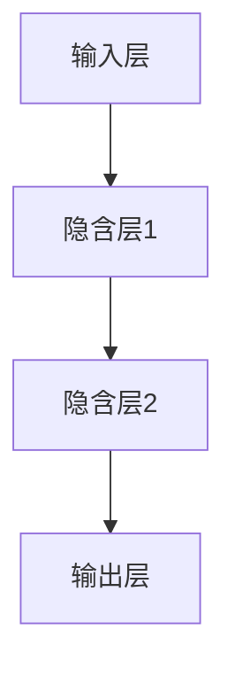

                 

## 引言

随着科技的飞速发展，人工智能（AI）已经成为当今世界的重要驱动力。在众多AI技术中，神经网络（Neural Networks，简称NN）尤为引人注目。神经网络，这个灵感来源于生物大脑计算模型的工具，正逐渐改变着我们对计算能力的认知。本文旨在深入探讨神经网络的基本原理、结构、算法和应用，帮助读者全面了解这一革命性技术。

### 关键词
- 神经网络
- 人工智能
- 计算模型
- 深度学习
- 卷积神经网络

### 摘要
本文首先介绍了神经网络的基本概念和神经元模型，然后详细探讨了神经网络的结构和训练算法。接下来，我们将分析神经网络在不同领域的应用，如图像识别、自然语言处理和强化学习。随后，我们将介绍深度学习的基础理论，包括卷积神经网络和循环神经网络。最后，本文将讨论神经网络的数学基础，并分享一个神经网络项目实战案例。通过本文的阅读，读者将对神经网络有更深入的理解，并能够将其应用于实际问题中。

## 1. 神经网络概述

### 1.1 神经网络的基本概念

神经网络是一种模仿生物大脑计算功能的计算模型，由大量的神经元（或节点）通过复杂的连接结构组成。这些神经元通过激活函数对输入信息进行处理，并将其传递给下一层神经元。神经网络的核心思想是通过学习输入和输出之间的映射关系，从而实现复杂任务的自动化。

### 1.2 神经网络的发展历程

神经网络的研究始于20世纪40年代，由心理学家和数学家提出。然而，由于计算能力的限制，神经网络的研究在20世纪80年代陷入低谷。随着计算机硬件和算法的进步，神经网络在21世纪初重新焕发生机，特别是深度学习（Deep Learning）的出现，使得神经网络在图像识别、语音识别和自然语言处理等领域取得了显著成果。

### 1.3 神经网络在人工智能中的应用

神经网络在人工智能领域有着广泛的应用。例如，在图像识别中，卷积神经网络（Convolutional Neural Networks，CNN）被广泛应用于人脸识别、物体检测和图像分类。在自然语言处理中，循环神经网络（Recurrent Neural Networks，RNN）和Transformer模型被广泛应用于机器翻译、文本分类和情感分析。此外，神经网络在强化学习中也发挥着重要作用，通过学习策略优化，实现了游戏AI、自动驾驶和机器人控制等应用。

## 2. 神经元模型

### 2.1 神经元的基本结构

神经元是神经网络的基本单元，通常由三个主要部分组成：输入层、隐含层和输出层。输入层接收外部信息，隐含层对输入信息进行处理，输出层产生最终的输出结果。每个神经元都与相邻的神经元通过连接（或权重）相连，这些连接决定了信息的传递方式和处理能力。

### 2.2 神经元的激活函数

激活函数是神经元的核心组成部分，它决定了神经元是否被激活。常见的激活函数包括Sigmoid函数、ReLU函数和Tanh函数。这些函数具有不同的性质，适用于不同的场景。

- **Sigmoid函数**：将输入映射到(0, 1)区间，具有平滑的过渡效果。
- **ReLU函数**：将输入映射到(0, +∞)区间，具有非线性和加速梯度下降的优点。
- **Tanh函数**：将输入映射到(-1, 1)区间，具有对称性和平滑性。

### 2.3 神经元的数学模型

神经元的数学模型可以用以下公式表示：

\[ y = \sigma(\sum_{i=1}^{n} w_i \cdot x_i + b) \]

其中，\( y \) 是输出，\( x_i \) 是输入，\( w_i \) 是权重，\( b \) 是偏置，\( \sigma \) 是激活函数。

通过这个模型，神经元能够对输入信息进行处理，并产生输出。激活函数的作用是引入非线性，使得神经网络能够解决复杂问题。

### 2.4 神经网络的拓扑结构

神经网络的拓扑结构决定了信息传递的方式和处理能力。常见的神经网络结构包括：

- **前馈神经网络**：信息从前一层传递到后一层，没有循环连接。
- **循环神经网络**：信息在神经元之间循环传递，适用于处理序列数据。
- **卷积神经网络**：通过卷积操作处理图像数据，具有局部感知能力。

这些结构各有特点，适用于不同的应用场景。

### 2.5 神经网络的学习过程

神经网络的学习过程是通过反向传播算法实现的。反向传播算法分为两个阶段：

- **前向传播**：将输入信息传递到网络中，逐层计算输出。
- **反向传播**：根据输出误差，逐层更新网络权重和偏置。

通过反复迭代这个过程，神经网络能够不断优化自身，以实现更好的性能。

### 2.6 神经网络的优缺点

神经网络具有以下优点：

- **强大的表达力**：能够处理复杂、非线性的问题。
- **自适应能力**：能够根据数据自动调整参数，适应不同的任务。
- **泛化能力**：通过训练，能够对新数据进行预测。

然而，神经网络也存在一些缺点：

- **计算复杂度高**：训练时间较长，对计算资源要求较高。
- **需要大量数据**：为了达到良好的性能，通常需要大量的训练数据。
- **难以解释**：神经网络的内部机制较为复杂，难以解释其工作原理。

### 2.7 神经网络的应用领域

神经网络在多个领域取得了显著成果，包括：

- **计算机视觉**：用于图像识别、物体检测和图像生成。
- **自然语言处理**：用于文本分类、机器翻译和情感分析。
- **强化学习**：用于游戏AI、自动驾驶和机器人控制。
- **语音识别**：用于语音识别和语音合成。

神经网络的应用领域仍在不断扩展，未来将有望解决更多复杂问题。

## 3. 神经网络结构

### 3.1 神经网络的基本结构

神经网络的基本结构由输入层、隐含层和输出层组成。输入层接收外部信息，隐含层对输入信息进行处理，输出层产生最终的输出结果。每个神经元都与相邻的神经元通过连接（或权重）相连，这些连接决定了信息的传递方式和处理能力。

### 3.2 前馈神经网络

前馈神经网络（Feedforward Neural Networks，FNN）是一种简单的神经网络结构，信息从前一层传递到后一层，没有循环连接。这种结构使得信息传递过程更加直观，易于理解和实现。

### 3.3 循环神经网络

循环神经网络（Recurrent Neural Networks，RNN）是一种具有循环连接的神经网络结构，信息在神经元之间循环传递，适用于处理序列数据。RNN的核心思想是利用历史信息对当前信息进行处理，从而实现序列数据的建模。

### 3.4 卷积神经网络

卷积神经网络（Convolutional Neural Networks，CNN）是一种专门用于处理图像数据的神经网络结构，通过卷积操作和池化操作提取图像特征。CNN具有局部感知能力，能够有效地提取图像中的关键特征。

### 3.5 其他神经网络结构

除了前馈神经网络、循环神经网络和卷积神经网络，还有许多其他的神经网络结构，如自编码器（Autoencoder）、生成对抗网络（GAN）等。这些结构在不同领域有着广泛的应用。

### 3.6 神经网络的层次结构

神经网络可以根据层数分为浅层网络和深层网络。浅层网络通常包含1-2层隐含层，而深层网络包含多个隐含层。深层网络具有更强的表达力，能够处理更复杂的问题，但也需要更多的数据和计算资源。

## 4. 训练算法

### 4.1 反向传播算法原理

反向传播算法（Backpropagation Algorithm）是一种用于训练神经网络的算法。它通过计算输出误差，逐层更新网络权重和偏置，从而优化网络性能。

### 4.2 随机梯度下降算法

随机梯度下降算法（Stochastic Gradient Descent，SGD）是一种常用的优化算法，用于训练神经网络。它通过随机选择训练样本，计算梯度并更新网络参数，从而优化网络性能。

### 4.3 其他优化算法

除了随机梯度下降算法，还有许多其他的优化算法，如Adam、RMSprop等。这些算法通过不同的策略，提高神经网络的训练效率和性能。

## 5. 神经网络应用

### 5.1 图像识别

图像识别是神经网络的重要应用领域。通过训练神经网络，可以实现对图像的分类、检测和生成。

### 5.2 自然语言处理

自然语言处理（Natural Language Processing，NLP）是神经网络在人工智能中的重要应用领域。通过训练神经网络，可以实现对文本的分类、情感分析和机器翻译。

### 5.3 强化学习

强化学习（Reinforcement Learning，RL）是神经网络在人工智能中的另一个重要应用领域。通过训练神经网络，可以实现对策略的学习，从而实现自动化决策。

## 6. 深度学习基础

### 6.1 深度学习的定义与原理

深度学习（Deep Learning，DL）是一种基于多层神经网络的机器学习技术。它通过多层次的神经网络结构，实现对复杂数据的建模和预测。

### 6.2 深度学习的优势与挑战

深度学习的优势包括强大的表达力、自动特征提取和高效的计算性能。然而，它也面临着计算资源需求大、训练时间长和难以解释等挑战。

### 6.3 深度学习的应用场景

深度学习在多个领域有着广泛的应用，包括计算机视觉、自然语言处理、语音识别和强化学习等。

## 7. 卷积神经网络

### 7.1 卷积神经网络的基本结构

卷积神经网络（Convolutional Neural Networks，CNN）是一种专门用于图像识别的神经网络结构。它通过卷积操作和池化操作，提取图像特征并实现分类。

### 7.2 卷积神经网络的工作原理

卷积神经网络的工作原理是通过多层卷积和池化操作，将图像分解为更抽象的特征，从而实现图像识别。

### 7.3 卷积神经网络的常见应用

卷积神经网络在图像识别、物体检测和图像生成等领域有着广泛的应用。

## 8. 循环神经网络

### 8.1 循环神经网络的基本结构

循环神经网络（Recurrent Neural Networks，RNN）是一种用于处理序列数据的神经网络结构。它通过循环连接，将历史信息传递到当前时刻，实现对序列数据的建模。

### 8.2 循环神经网络的工作原理

循环神经网络的工作原理是通过循环连接和激活函数，将历史信息传递到当前时刻，并生成输出。

### 8.3 循环神经网络的常见应用

循环神经网络在自然语言处理、语音识别和时间序列预测等领域有着广泛的应用。

## 9. 生成对抗网络

### 9.1 生成对抗网络的基本结构

生成对抗网络（Generative Adversarial Networks，GAN）是一种由生成器和判别器组成的神经网络结构。生成器尝试生成与真实数据相似的数据，而判别器则尝试区分真实数据和生成数据。

### 9.2 生成对抗网络的工作原理

生成对抗网络的工作原理是通过生成器和判别器的对抗训练，使得生成器生成的数据越来越接近真实数据。

### 9.3 生成对抗网络的常见应用

生成对抗网络在图像生成、数据增强和异常检测等领域有着广泛的应用。

## 10. 神经网络的数学基础

### 10.1 神经网络的前向传播

神经网络的前向传播是指将输入数据传递到网络中，通过多层神经元的计算，最终得到输出结果。

### 10.2 神经网络的反向传播

神经网络的反向传播是指根据输出误差，逆向计算网络中每个神经元的梯度，并更新网络参数。

### 10.3 神经网络的优化算法

神经网络的优化算法是指用于更新网络参数的方法，如随机梯度下降、Adam等。

## 11. 概率论基础

### 11.1 随机变量与概率分布

随机变量是概率论中的基本概念，表示可能取不同值的变量。概率分布描述了随机变量取不同值的概率。

### 11.2 最大似然估计与最小化损失函数

最大似然估计是用于估计模型参数的方法，而最小化损失函数是用于优化模型性能的方法。

### 11.3 贝叶斯估计与贝叶斯推理

贝叶斯估计是基于概率的估计方法，贝叶斯推理是基于贝叶斯定理的推理方法。

## 12. 信息论基础

### 12.1 信息熵与互信息

信息熵是表示信息量的度量，互信息是表示两个变量之间相关性的度量。

### 12.2 K-L散度与JS散度

K-L散度是表示两个概率分布之间差异的度量，JS散度是表示两个概率分布之间差异的一种更严格的度量。

### 12.3 信息论在神经网络中的应用

信息论在神经网络中的应用包括信息熵的估计、信息流的建模和信息增强等。

## 13. 神经网络项目实战

### 13.1 项目背景与目标

项目背景和目标是神经网络项目设计的重要部分。

### 13.2 数据预处理与清洗

数据预处理和清洗是神经网络项目的重要步骤。

### 13.3 模型设计

模型设计是神经网络项目的关键环节。

### 13.4 模型训练与验证

模型训练和验证是神经网络项目的重要阶段。

### 13.5 模型部署与优化

模型部署和优化是神经网络项目的最后一步。

## 附录A：常用神经网络框架

### A.1 TensorFlow

TensorFlow是一种流行的神经网络框架，提供了丰富的工具和接口。

### A.2 PyTorch

PyTorch是一种基于Python的神经网络框架，具有简洁和灵活的特点。

### A.3 Keras

Keras是一种高度优化的神经网络框架，提供了丰富的API和工具。

## 附录B：数学公式与概念汇总

### B.1 概率论相关公式

概率论相关公式包括概率分布函数、条件概率、期望和方差等。

### B.2 信息论相关公式

信息论相关公式包括信息熵、互信息、K-L散度和JS散度等。

### B.3 神经网络相关公式

神经网络相关公式包括前向传播、反向传播、权重更新和激活函数等。

## 作者

本文作者：AI天才研究院/AI Genius Institute & 禅与计算机程序设计艺术 /Zen And The Art of Computer Programming ## 引言

### 什么是神经网络？

神经网络（Neural Networks，简称NN）是一种由大量节点（或称为神经元）组成的计算模型，这些节点通过模拟人脑神经元之间的连接进行信息传递和处理。神经网络的基本架构灵感来源于生物大脑的神经元网络，但是与生物大脑相比，人工神经网络的结构和功能都要简单得多。

### 神经网络的发展历史

神经网络的研究始于20世纪40年代，由心理学家和数学家提出。1943年，心理学家McCulloch和数学家Pitts提出了第一个简单的神经网络模型，即McCulloch-Pitts神经元模型。随后，1958年，Frank Rosenblatt提出了感知机（Perceptron）模型，这是第一个能够学习和分类数据的神经网络模型。

然而，早期神经网络的研究由于计算能力的限制和算法上的不足，进展缓慢。直到20世纪80年代，随着计算机硬件和算法的进步，神经网络的研究重新焕发生机。特别是1998年，Geoffrey Hinton等人提出的反向传播算法（Backpropagation Algorithm）使得深度神经网络（Deep Neural Networks）的训练成为可能。

### 神经网络在人工智能中的应用

随着深度学习（Deep Learning）的兴起，神经网络在人工智能（Artificial Intelligence，AI）领域取得了显著的成果。深度学习是一种利用多层神经网络进行学习的算法，它使得计算机在图像识别、语音识别、自然语言处理、游戏AI等方面取得了突破性的进展。

- **图像识别**：卷积神经网络（Convolutional Neural Networks，CNN）被广泛应用于图像分类、物体检测和图像生成等任务。例如，著名的ImageNet挑战赛就展示了深度学习在图像识别上的巨大潜力。
- **自然语言处理**：循环神经网络（Recurrent Neural Networks，RNN）和Transformer模型在机器翻译、文本分类、情感分析等任务中取得了优异的性能。
- **强化学习**：神经网络在强化学习（Reinforcement Learning，RL）中的应用也非常广泛，通过训练神经网络来优化决策策略，实现游戏AI、自动驾驶和机器人控制等应用。

### 文章目的和结构

本文旨在深入探讨神经网络的基本原理、结构、算法和应用，帮助读者全面了解这一革命性技术。文章将分为以下几个部分：

1. **神经网络概述**：介绍神经网络的基本概念、发展历程和应用领域。
2. **神经元模型**：详细描述神经元的结构、激活函数和数学模型。
3. **神经网络结构**：探讨神经网络的基本结构、前馈神经网络、循环神经网络和卷积神经网络。
4. **训练算法**：介绍神经网络的训练算法，包括反向传播算法、随机梯度下降和其他优化算法。
5. **神经网络应用**：分析神经网络在图像识别、自然语言处理和强化学习等领域的应用。
6. **深度学习基础**：介绍深度学习的定义、原理、优势与挑战以及应用场景。
7. **神经网络数学基础**：探讨神经网络所需的概率论和信息论基础。
8. **神经网络项目实战**：通过实际项目展示神经网络的开发流程和实战技巧。
9. **神经网络在实际应用中的挑战与未来发展方向**：讨论神经网络面临的计算资源、数据隐私、伦理和未来发展方向。
10. **附录**：汇总常用神经网络框架、数学公式与概念。

通过本文的阅读，读者将能够系统地了解神经网络的基本概念、核心技术以及在实际应用中的挑战和未来前景。

## 1. 神经网络概述

### 1.1 神经网络的基本概念

神经网络（Neural Networks，简称NN）是一种模拟人脑神经元结构和功能的计算模型。它由大量的神经元通过连接（或权重）组成，这些连接决定了信息的传递方式和处理能力。每个神经元都可以接收多个输入，通过激活函数处理后产生一个输出，并将其传递给下一个神经元。神经网络的核心思想是通过学习输入和输出之间的映射关系，从而实现复杂任务的自动化。

### 1.2 神经网络的发展历程

神经网络的研究始于20世纪40年代，由心理学家McCulloch和数学家Pitts提出了第一个简单的神经网络模型，即McCulloch-Pitts神经元模型。1958年，Frank Rosenblatt提出了感知机（Perceptron）模型，这是第一个能够学习和分类数据的神经网络模型。然而，由于计算能力和算法的限制，神经网络的研究在20世纪60年代和70年代进展缓慢。

直到20世纪80年代，随着计算机硬件和算法的进步，神经网络的研究重新焕发生机。1986年，Rumelhart、Hinton和Williams提出了反向传播算法（Backpropagation Algorithm），使得深度神经网络（Deep Neural Networks）的训练成为可能。反向传播算法通过逐层计算误差，逆向传播梯度，更新网络权重，从而优化网络性能。

### 1.3 神经网络在人工智能中的应用

神经网络在人工智能（Artificial Intelligence，AI）领域有着广泛的应用，特别是深度学习（Deep Learning）的兴起，使得神经网络在图像识别、自然语言处理、语音识别和强化学习等领域取得了显著的成果。

- **图像识别**：卷积神经网络（Convolutional Neural Networks，CNN）被广泛应用于图像分类、物体检测和图像生成等任务。例如，Google的Inception模型在ImageNet挑战赛中取得了优异的成绩。
- **自然语言处理**：循环神经网络（Recurrent Neural Networks，RNN）和Transformer模型在机器翻译、文本分类、情感分析和语音识别等任务中取得了优异的性能。例如，Google的BERT模型在多项自然语言处理任务中取得了领先的成绩。
- **语音识别**：神经网络在语音识别中发挥着重要作用，通过训练神经网络，可以实现对语音信号的处理和识别。例如，Google的WaveNet模型在语音合成方面取得了优异的成绩。
- **强化学习**：神经网络在强化学习中的应用也非常广泛，通过训练神经网络，可以优化决策策略，实现游戏AI、自动驾驶和机器人控制等应用。例如，DeepMind的AlphaGo在围棋比赛中击败了人类世界冠军。

### 1.4 神经网络的基本组成部分

神经网络的基本组成部分包括：

- **神经元**：神经网络的基本计算单元，每个神经元都可以接收多个输入，通过激活函数处理后产生一个输出。
- **连接**：神经元之间的连接，用权重表示，决定了信息的传递方式和处理能力。
- **激活函数**：神经元输出前的非线性转换函数，常用的激活函数包括Sigmoid、ReLU和Tanh等。
- **网络结构**：神经网络的拓扑结构，包括输入层、隐含层和输出层。

### 1.5 神经网络的工作原理

神经网络的工作原理是通过多层次的神经元计算，实现对输入数据的处理和输出预测。具体来说，神经网络的工作过程可以分为以下几个步骤：

1. **前向传播**：将输入数据传递到网络的输入层，然后逐层传递到隐含层和输出层。在每一层中，神经元根据输入和权重计算输出，并传递给下一层。
2. **激活函数**：在每一层的输出计算中，使用激活函数进行非线性转换，从而引入网络的非线性特性。
3. **损失函数**：将输出与真实值进行比较，计算损失函数的值。常用的损失函数包括均方误差（MSE）和交叉熵（Cross-Entropy）等。
4. **反向传播**：根据输出误差，逆向计算网络中每个神经元的梯度，并更新网络权重和偏置。这个过程称为反向传播算法（Backpropagation Algorithm）。

通过反复迭代前向传播和反向传播的过程，神经网络能够不断优化自身，以实现更好的性能。

### 1.6 神经网络的优缺点

神经网络具有以下优点：

- **强大的表达力**：神经网络通过多层非线性变换，可以表达复杂的函数关系。
- **自动特征提取**：神经网络能够自动从数据中提取有用的特征，减少了人工特征设计的工作量。
- **自适应能力**：神经网络可以根据训练数据自动调整参数，适应不同的任务和数据集。

然而，神经网络也存在一些缺点：

- **计算复杂度高**：神经网络的训练时间较长，对计算资源要求较高。
- **需要大量数据**：为了达到良好的性能，通常需要大量的训练数据。
- **难以解释**：神经网络的内部机制较为复杂，难以解释其工作原理。

### 1.7 神经网络的应用领域

神经网络在多个领域有着广泛的应用，包括：

- **计算机视觉**：用于图像识别、物体检测和图像生成等任务。
- **自然语言处理**：用于文本分类、机器翻译和情感分析等任务。
- **语音识别**：用于语音信号的处理和识别。
- **强化学习**：用于游戏AI、自动驾驶和机器人控制等任务。
- **推荐系统**：用于用户偏好分析和服务推荐。

通过本文的介绍，读者可以对神经网络有更深入的了解，为后续的学习和应用打下坚实的基础。

## 2. 神经元模型

### 2.1 神经元的基本结构

神经元是神经网络的基本计算单元，其基本结构如图所示：



神经元由以下几部分组成：

- **输入**：神经元接收多个输入，每个输入对应一个权重。
- **权重**：每个输入都与相邻的神经元通过权重相连，权重决定了输入对输出的影响程度。
- **偏置**：偏置是一个独立的常数，用于引入非线性。
- **激活函数**：激活函数是一个非线性函数，用于决定神经元是否被激活。

### 2.2 神经元的激活函数

激活函数是神经元输出的关键部分，它引入了非线性的特性，使得神经网络能够处理复杂的非线性问题。常见的激活函数包括：

- **Sigmoid函数**：将输入映射到(0, 1)区间，公式为：
  $$ \sigma(x) = \frac{1}{1 + e^{-x}} $$
  
- **ReLU函数**：将输入映射到(0, +∞)区间，公式为：
  $$ \text{ReLU}(x) = \max(0, x) $$
  
- **Tanh函数**：将输入映射到(-1, 1)区间，公式为：
  $$ \tanh(x) = \frac{e^x - e^{-x}}{e^x + e^{-x}} $$

这些激活函数具有不同的性质，适用于不同的场景。Sigmoid函数适合用于回归问题，ReLU函数在深度学习中广泛应用，而Tanh函数在处理对称数据时效果较好。

### 2.3 神经元的数学模型

神经元的数学模型可以用以下公式表示：

\[ y = \sigma(\sum_{i=1}^{n} w_i \cdot x_i + b) \]

其中，\( y \) 是输出，\( x_i \) 是输入，\( w_i \) 是权重，\( b \) 是偏置，\( \sigma \) 是激活函数。

通过这个模型，神经元能够对输入信息进行处理，并产生输出。例如，考虑一个简单的二分类问题，可以使用Sigmoid函数作为激活函数，模型可以表示为：

\[ y = \sigma(w_1 \cdot x_1 + w_2 \cdot x_2 + b) \]

其中，\( x_1 \) 和 \( x_2 \) 是两个输入特征，\( w_1 \) 和 \( w_2 \) 是权重，\( b \) 是偏置。

### 2.4 神经网络的拓扑结构

神经网络的拓扑结构决定了信息传递的方式和处理能力。常见的神经网络结构包括：

- **前馈神经网络**：信息从前一层传递到后一层，没有循环连接。
- **循环神经网络**：信息在神经元之间循环传递，适用于处理序列数据。
- **卷积神经网络**：通过卷积操作处理图像数据，具有局部感知能力。

这些结构各有特点，适用于不同的应用场景。

### 2.5 神经网络的学习过程

神经网络的学习过程是通过反向传播算法（Backpropagation Algorithm）实现的。反向传播算法分为两个阶段：

- **前向传播**：将输入数据传递到网络中，逐层计算输出。
- **反向传播**：根据输出误差，逆向计算网络中每个神经元的梯度，并更新网络参数。

具体步骤如下：

1. **前向传播**：输入数据从输入层传递到隐含层，再传递到输出层，计算输出值。
2. **计算误差**：输出值与实际值进行比较，计算误差。
3. **计算梯度**：根据误差，逆向计算每个神经元的梯度。
4. **更新参数**：根据梯度，更新网络权重和偏置。

通过反复迭代这个过程，神经网络能够不断优化自身，以实现更好的性能。

### 2.6 神经网络的优缺点

神经网络具有以下优点：

- **强大的表达力**：能够处理复杂、非线性的问题。
- **自适应能力**：能够根据数据自动调整参数，适应不同的任务。
- **泛化能力**：通过训练，能够对新数据进行预测。

然而，神经网络也存在一些缺点：

- **计算复杂度高**：训练时间较长，对计算资源要求较高。
- **需要大量数据**：为了达到良好的性能，通常需要大量的训练数据。
- **难以解释**：神经网络的内部机制较为复杂，难以解释其工作原理。

### 2.7 神经网络的应用领域

神经网络在多个领域有着广泛的应用，包括：

- **计算机视觉**：用于图像识别、物体检测和图像生成。
- **自然语言处理**：用于文本分类、机器翻译和情感分析。
- **语音识别**：用于语音信号的处理和识别。
- **强化学习**：用于游戏AI、自动驾驶和机器人控制。
- **推荐系统**：用于用户偏好分析和服务推荐。

通过本文的介绍，读者可以对神经元模型有更深入的了解，为后续的学习和应用打下坚实的基础。

## 3. 神经网络结构

### 3.1 神经网络的基本结构

神经网络的基本结构通常包括三个主要部分：输入层、隐含层和输出层。

#### 输入层

输入层是神经网络的起点，接收外部输入的数据。例如，在图像识别任务中，输入层接收图像的像素值；在文本分类任务中，输入层接收文本的单词向量表示。

#### 隐含层

隐含层是神经网络的核心部分，负责对输入数据进行处理和特征提取。隐含层可以包含多个层次，每一层都对输入进行加工，逐渐提取更高层次的特征。随着层数的增加，神经网络的抽象能力和表达能力也增强。

#### 输出层

输出层是神经网络的终点，产生最终的输出结果。根据不同的任务，输出层的结构和激活函数也会有所不同。例如，在二分类问题中，输出层通常是一个带有Sigmoid激活函数的神经元，用于输出概率值；在多分类问题中，输出层通常是一个带有softmax激活函数的神经元，用于输出各个类别的概率分布。

### 3.2 前馈神经网络

前馈神经网络（Feedforward Neural Networks）是一种简单的神经网络结构，信息从前一层传递到后一层，没有循环连接。前馈神经网络的主要组成部分包括：

- **输入层**：接收外部输入数据。
- **隐含层**：对输入数据进行处理和特征提取。
- **输出层**：产生最终的输出结果。

前馈神经网络的工作流程如下：

1. **前向传播**：输入数据从输入层传递到隐含层，再传递到输出层。在每一层中，神经元根据输入和权重计算输出，并传递给下一层。
2. **激活函数**：在每一层的输出计算中，使用激活函数进行非线性转换，从而引入网络的非线性特性。
3. **损失函数**：将输出与真实值进行比较，计算损失函数的值，常用的损失函数包括均方误差（MSE）和交叉熵（Cross-Entropy）等。
4. **反向传播**：根据输出误差，逆向计算网络中每个神经元的梯度，并更新网络权重和偏置。

### 3.3 循环神经网络

循环神经网络（Recurrent Neural Networks，RNN）是一种具有循环连接的神经网络结构，信息在神经元之间循环传递，适用于处理序列数据。RNN的核心思想是利用历史信息对当前信息进行处理，从而实现序列数据的建模。

#### RNN的基本结构

RNN的基本结构包括：

- **输入层**：接收序列数据。
- **隐藏层**：对序列数据进行处理和特征提取。
- **输出层**：产生最终的输出结果。

RNN的工作流程如下：

1. **前向传播**：输入序列数据逐个传递到隐藏层，在每个时间步上，隐藏层的状态根据当前输入和前一时刻的状态更新。
2. **激活函数**：在每一层的输出计算中，使用激活函数进行非线性转换，从而引入网络的非线性特性。
3. **损失函数**：将输出与真实值进行比较，计算损失函数的值。
4. **反向传播**：根据输出误差，逆向计算网络中每个神经元的梯度，并更新网络权重和偏置。

#### 长短时记忆网络（LSTM）

LSTM（Long Short-Term Memory）是一种改进的RNN结构，用于解决传统RNN在处理长序列数据时出现的梯度消失和梯度爆炸问题。LSTM通过引入门控机制，能够有效地捕获长序列中的长期依赖关系。

LSTM的基本结构包括：

- **输入门**：决定当前输入信息中哪些部分将被保留。
- **遗忘门**：决定哪些历史信息将被遗忘。
- **输出门**：决定当前隐藏状态中哪些部分将被输出。

### 3.4 卷积神经网络

卷积神经网络（Convolutional Neural Networks，CNN）是一种专门用于处理图像数据的神经网络结构，通过卷积操作和池化操作提取图像特征。CNN具有局部感知能力，能够有效地提取图像中的关键特征。

#### CNN的基本结构

CNN的基本结构包括：

- **卷积层**：通过卷积操作提取图像特征。
- **池化层**：通过池化操作减小特征图的大小，减少参数数量。
- **全连接层**：将卷积层的特征映射到输出结果。

CNN的工作流程如下：

1. **卷积操作**：使用卷积核在特征图上进行滑动，计算卷积结果。
2. **激活函数**：对卷积结果应用激活函数，引入非线性特性。
3. **池化操作**：通过池化操作减小特征图的大小。
4. **全连接层**：将卷积层的特征映射到输出结果。

#### 卷积神经网络的常用架构

- **LeNet-5**：一种简单的CNN架构，用于手写数字识别。
- **AlexNet**：一种深度CNN架构，首次在ImageNet挑战赛中取得了显著成果。
- **VGGNet**：一种具有多个卷积层的CNN架构，通过浅层和深层卷积层交替使用，提高了网络的深度和表达能力。
- **ResNet**：一种引入残差连接的CNN架构，解决了深层网络中的梯度消失问题。

### 3.5 其他神经网络结构

除了前馈神经网络、循环神经网络和卷积神经网络，还有许多其他的神经网络结构，如自编码器（Autoencoder）、生成对抗网络（GAN）等。这些结构在不同领域有着广泛的应用。

- **自编码器**：一种无监督学习模型，用于特征提取和降维。
- **生成对抗网络**：一种由生成器和判别器组成的神经网络结构，用于生成新的数据。

通过本文的介绍，读者可以了解神经网络的基本结构及其工作原理，为后续的学习和应用打下坚实的基础。

### 3.6 神经网络学习过程

神经网络的学习过程是通过前向传播和反向传播实现的，这是一种迭代过程，目的是通过不断调整网络中的参数（权重和偏置）来最小化损失函数。

#### 前向传播

前向传播是指将输入数据传递到神经网络中，通过层与层之间的加权连接和激活函数，最终得到输出结果。具体步骤如下：

1. **输入层到隐含层**：输入数据进入输入层，通过权重与隐含层的每个神经元相乘，然后加上偏置，得到隐含层的每个神经元的输出。使用激活函数对输出进行处理，得到隐含层的结果。
2. **隐含层到输出层**：隐含层的结果作为输入，继续传递到输出层。同样地，通过权重和偏置计算输出，并使用激活函数进行处理。

前向传播过程中的一个关键步骤是计算输出层的结果。对于分类问题，常用的激活函数是softmax函数，它可以输出每个类别的概率分布。

伪代码如下：

```python
for each layer from input to output:
    z = X * W + b  # X是输入，W是权重，b是偏置
    a = activation_function(z)  # 激活函数，如ReLU、Sigmoid等
```

#### 反向传播

反向传播是指根据输出结果和真实值之间的误差，逆向计算网络中的梯度，并更新权重和偏置。反向传播算法分为以下几个步骤：

1. **计算输出误差**：对于分类问题，使用交叉熵损失函数计算输出结果和真实值之间的误差。
2. **计算梯度**：从输出层开始，逆向计算每个神经元的梯度。对于激活函数是Sigmoid的情况，梯度可以表示为：
   $$ \frac{da}{dz} = a(1-a) $$
   对于激活函数是ReLU的情况，梯度可以表示为：
   $$ \frac{da}{dz} = \begin{cases} 
   0 & \text{if } a = 0 \\
   1 & \text{if } a > 0 
   \end{cases} $$
3. **更新权重和偏置**：根据梯度，使用学习率更新权重和偏置。更新公式如下：
   $$ W_{new} = W_{old} - \alpha \cdot \frac{\partial J}{\partial W} $$
   $$ b_{new} = b_{old} - \alpha \cdot \frac{\partial J}{\partial b} $$
   其中，\( J \) 是损失函数，\( \alpha \) 是学习率。

伪代码如下：

```python
for each layer from output to input:
    dZ = dY * activation_derivative(a)  # dZ是损失函数关于输出的梯度，dY是损失函数关于输出的梯度，activation_derivative是激活函数的导数
    dW = dZ * X.T  # dW是损失函数关于权重的梯度
    db = dZ  # db是损失函数关于偏置的梯度
    W -= alpha * dW
    b -= alpha * db
```

通过反复迭代前向传播和反向传播的过程，神经网络能够不断优化自身，以实现更好的性能。

### 3.7 神经网络优化算法

在神经网络训练过程中，优化算法的作用是调整网络参数，使损失函数的值最小化。以下是一些常见的优化算法：

1. **随机梯度下降（SGD）**：每次迭代使用一个样本的梯度来更新参数。优点是简单和易于实现，缺点是收敛速度较慢且可能振荡。
2. **批量梯度下降（BGD）**：每次迭代使用所有样本的梯度来更新参数。优点是收敛速度较快，缺点是计算复杂度高。
3. **小批量梯度下降（MBGD）**：每次迭代使用一部分样本的梯度来更新参数，是一种折中方案，计算复杂度适中。
4. **动量（Momentum）**：结合前几个迭代步骤的梯度，以加速收敛并减少振荡。
5. **AdaGrad和RMSprop**：自适应调整学习率，根据梯度平方的累积值调整每个参数的学习率。

通过使用这些优化算法，神经网络能够更有效地训练，并在各种任务中取得更好的性能。

### 3.8 神经网络的优缺点

**优点**：

- **强大的表达力**：神经网络能够模拟复杂的非线性关系，适用于各种复杂任务。
- **自动特征提取**：神经网络能够从原始数据中自动提取有用的特征，减少了人工特征设计的工作量。
- **自适应能力**：神经网络可以根据训练数据自动调整参数，适应不同的任务和数据集。

**缺点**：

- **计算复杂度高**：神经网络需要大量的计算资源，训练时间较长。
- **需要大量数据**：为了达到良好的性能，通常需要大量的训练数据。
- **难以解释**：神经网络的内部机制较为复杂，难以解释其工作原理。

### 3.9 神经网络的应用领域

神经网络在多个领域有着广泛的应用，包括：

- **计算机视觉**：用于图像识别、物体检测和图像生成。
- **自然语言处理**：用于文本分类、机器翻译和情感分析。
- **语音识别**：用于语音信号的处理和识别。
- **强化学习**：用于游戏AI、自动驾驶和机器人控制。
- **推荐系统**：用于用户偏好分析和服务推荐。

通过本文的介绍，读者可以全面了解神经网络的结构和训练过程，为后续的学习和应用打下坚实的基础。

## 4. 训练算法

神经网络的训练算法是使其能够有效学习和适应数据的关键。在训练过程中，神经网络的目的是通过不断调整其内部参数（权重和偏置）来最小化损失函数。以下将详细介绍几种常见的训练算法。

### 4.1 反向传播算法

反向传播算法（Backpropagation Algorithm）是训练神经网络最常用的算法。它分为两个阶段：前向传播和反向传播。

#### 前向传播

在前向传播阶段，输入数据通过网络，每一层的神经元根据输入和权重计算输出，并传递到下一层。这个过程称为前向传播。前向传播的目标是计算网络的输出并生成预测。

#### 反向传播

在反向传播阶段，网络根据预测输出和实际输出之间的误差计算损失函数。然后，网络通过反向计算误差，更新权重和偏置。反向传播的核心是计算每个参数的梯度，即损失函数关于每个参数的偏导数。具体步骤如下：

1. **计算输出误差**：对于输出层，误差是预测值和实际值之间的差异。对于隐藏层，误差需要通过链式法则从输出层反向传递。
2. **计算梯度**：使用链式法则计算每个参数的梯度。
3. **更新参数**：根据梯度，使用学习率更新权重和偏置。

伪代码如下：

```python
# 前向传播
for layer in reversed(layers):
    layer.output = layer.activation_function(layer.input * weights + biases)

# 计算损失函数
loss = loss_function(output, actual_output)

# 反向传播
for layer in layers:
    dZ = layer.output - actual_output
    dW = dZ * layer.input.T
    db = dZ
    weights -= learning_rate * dW
    biases -= learning_rate * db
```

### 4.2 随机梯度下降（SGD）

随机梯度下降（Stochastic Gradient Descent，SGD）是一种优化算法，它通过随机选择一个样本更新网络参数。SGD的优点是简单和易于实现，缺点是收敛速度可能较慢且可能振荡。

伪代码如下：

```python
for epoch in range(num_epochs):
    for sample, actual_output in dataset:
        # 前向传播
        output = forward_propagation(sample, weights, biases)
        
        # 计算损失函数
        loss = loss_function(output, actual_output)
        
        # 反向传播
        dZ = output - actual_output
        dW = dZ * sample.T
        db = dZ
        
        # 更新参数
        weights -= learning_rate * dW
        biases -= learning_rate * db
```

### 4.3 批量梯度下降（BGD）

批量梯度下降（Batch Gradient Descent，BGD）是一种优化算法，它通过计算所有样本的梯度来更新网络参数。BGD的优点是收敛速度较快，缺点是计算复杂度较高。

伪代码如下：

```python
# 计算所有样本的梯度
dW = 0
db = 0
for sample, actual_output in dataset:
    # 前向传播
    output = forward_propagation(sample, weights, biases)
    
    # 计算误差
    dZ = output - actual_output
    
    # 更新梯度
    dW += dZ * sample.T
    db += dZ

# 更新参数
weights -= learning_rate * dW
biases -= learning_rate * db
```

### 4.4 小批量梯度下降（MBGD）

小批量梯度下降（Mini-Batch Gradient Descent，MBGD）是批量梯度下降和随机梯度下降的折中方案。MBGD通过将数据集分成小批量，对每个小批量计算梯度并更新参数。MBGD的优点是能够在保持较高收敛速度的同时减少计算复杂度。

伪代码如下：

```python
for epoch in range(num_epochs):
    for batch in dataset:
        # 计算梯度
        dW = 0
        db = 0
        for sample, actual_output in batch:
            # 前向传播
            output = forward_propagation(sample, weights, biases)
            
            # 计算误差
            dZ = output - actual_output
            
            # 更新梯度
            dW += dZ * sample.T
            db += dZ
        
        # 更新参数
        weights -= learning_rate * dW / len(batch)
        biases -= learning_rate * db / len(batch)
```

### 4.5 动量（Momentum）

动量（Momentum）是一种优化算法，它通过结合前几个迭代步骤的梯度，加速收敛并减少振荡。动量通过计算梯度的指数加权平均，从而减少参数更新的振荡。

伪代码如下：

```python
velocity = 0
for epoch in range(num_epochs):
    for batch in dataset:
        # 计算梯度
        dW = 0
        db = 0
        for sample, actual_output in batch:
            # 前向传播
            output = forward_propagation(sample, weights, biases)
            
            # 计算误差
            dZ = output - actual_output
            
            # 更新梯度
            dW += dZ * sample.T
            db += dZ
        
        # 更新速度
        velocity = momentum * velocity - learning_rate * dW / len(batch)
        weights -= velocity
        biases -= momentum * velocity
```

通过以上训练算法，神经网络能够有效地学习并适应数据，从而实现各种复杂的任务。

### 4.6 其他优化算法

除了上述提到的优化算法，还有许多其他的优化算法，如AdaGrad、RMSprop和Adam等。这些算法通过自适应调整学习率，提高训练效率。

- **AdaGrad**：根据梯度的历史值自适应调整学习率，解决了不同参数学习率不同的问题。
- **RMSprop**：使用梯度平方的指数加权平均来调整学习率，减少振荡。
- **Adam**：结合了AdaGrad和RMSprop的优点，同时考虑一阶和二阶矩估计，适用于各种问题。

通过这些优化算法，神经网络能够在复杂任务中取得更好的性能。

通过本文的介绍，读者可以了解神经网络的各种训练算法，为实际应用中的模型训练提供理论支持。

## 5. 神经网络应用

神经网络在多个领域有着广泛的应用，其中图像识别、自然语言处理和强化学习是三个重要的领域。以下将分别介绍这些领域中的典型应用和成果。

### 5.1 图像识别

图像识别是神经网络最成功的应用之一。通过卷积神经网络（CNN），计算机能够自动识别和分类图像中的物体。CNN通过卷积操作提取图像中的局部特征，并通过多层次的卷积和池化操作，逐渐提取更高层次的特征。

- **典型应用**：在ImageNet挑战赛中，深度学习模型通过CNN实现了大规模图像分类任务。其中，Google的Inception模型在2012年的比赛中获得了第一名，准确率达到了85%以上。此后，随着神经网络的发展，准确率不断攀升。
- **成果**：在物体检测任务中，卷积神经网络也取得了显著成果。著名的R-CNN、Fast R-CNN、Faster R-CNN等模型通过将CNN与区域建议网络（Region Proposal Network，RPN）结合，实现了高效的物体检测。

### 5.2 自然语言处理

自然语言处理（NLP）是另一个深度学习应用广泛的领域。通过循环神经网络（RNN）和Transformer模型，计算机能够理解和生成自然语言。

- **典型应用**：在机器翻译任务中，Google的神经机器翻译（NMT）通过使用基于RNN的序列到序列（Seq2Seq）模型，实现了高精度的机器翻译。此外，OpenAI的GPT-3模型通过使用Transformer模型，实现了强大的文本生成和语言理解能力。
- **成果**：在文本分类任务中，RNN和Transformer模型也取得了显著成果。例如，BERT模型通过预训练和微调，实现了高精度的情感分析、问答系统等任务。

### 5.3 强化学习

强化学习（RL）是另一个利用神经网络的重要领域。在强化学习中，神经网络用于表示策略，通过学习优化决策过程。

- **典型应用**：在游戏AI中，DeepMind的AlphaGo通过使用深度神经网络，实现了围棋游戏的胜利。此外，在自动驾驶领域，深度神经网络用于表示自动驾驶系统的策略，实现了自动驾驶车辆的运行。
- **成果**：在机器人控制中，神经网络用于控制机器人的运动，实现了复杂的运动任务。例如，通过使用深度神经网络，机器人能够实现行走、跳跃等复杂的运动。

### 5.4 其他应用领域

除了图像识别、自然语言处理和强化学习，神经网络还在其他多个领域有着广泛的应用。

- **医疗诊断**：通过深度学习模型，计算机能够自动诊断医学图像中的疾病。例如，通过使用CNN，医生能够自动识别皮肤病变、肺癌等疾病。
- **金融分析**：神经网络用于预测股票价格、交易策略等任务，实现了智能投资和风险管理。
- **语音识别**：通过深度学习模型，计算机能够自动识别和理解语音，实现了语音助手和语音识别系统。

通过本文的介绍，读者可以了解到神经网络在各个领域的广泛应用和取得的显著成果。随着深度学习技术的发展，神经网络将在未来继续推动人工智能的进步。

## 6. 深度学习基础

### 6.1 深度学习的定义与原理

深度学习（Deep Learning，DL）是一种基于多层神经网络（Multi-Layer Neural Networks）的机器学习技术。与传统机器学习方法相比，深度学习通过多层非线性变换，能够自动从数据中提取特征，并在各种复杂任务中表现出优异的性能。深度学习的核心思想是通过多层次的神经网络结构，实现对复杂数据的建模和预测。

深度学习的基本原理可以概括为以下几个步骤：

1. **数据输入**：输入数据通过输入层进入神经网络。
2. **特征提取**：通过多层神经网络，输入数据被逐层处理，逐渐提取更高层次的特征。
3. **非线性变换**：在每一层中，通过非线性激活函数引入非线性特性，使得神经网络能够处理复杂的非线性关系。
4. **损失函数优化**：使用损失函数（如均方误差、交叉熵等）评估神经网络的预测性能，并通过反向传播算法（Backpropagation Algorithm）优化网络参数。

### 6.2 深度学习的优势与挑战

深度学习在许多领域都取得了显著的成果，其优势包括：

- **强大的表达力**：深度学习通过多层神经网络结构，能够自动提取数据中的高阶特征，从而在复杂任务中表现出优异的性能。
- **自动特征提取**：深度学习能够从原始数据中自动提取有用的特征，减少了人工特征设计的工作量。
- **高效计算**：随着计算硬件的发展，如GPU、TPU等专用计算设备的普及，深度学习的计算效率得到了显著提升。
- **适应性强**：深度学习可以通过训练自动适应不同的任务和数据集，具有较强的泛化能力。

然而，深度学习也面临着一些挑战：

- **计算资源需求大**：深度学习模型的训练通常需要大量的计算资源和时间，尤其是对于大型模型和大规模数据集。
- **数据需求量大**：为了达到良好的性能，深度学习通常需要大量的训练数据。数据的获取、标注和处理都是巨大的挑战。
- **模型解释性差**：深度学习模型的内部机制较为复杂，难以解释其工作原理，这在某些应用场景中可能是一个问题。
- **过拟合风险**：深度学习模型容易出现过拟合现象，特别是在数据量较小或特征工程不足的情况下。

### 6.3 深度学习的应用场景

深度学习在多个领域有着广泛的应用，以下是一些典型的应用场景：

- **计算机视觉**：用于图像识别、物体检测、图像生成等任务。例如，卷积神经网络（CNN）在图像分类、目标检测和图像生成中取得了显著成果。
- **自然语言处理**：用于文本分类、机器翻译、情感分析等任务。例如，循环神经网络（RNN）和Transformer模型在文本分类、机器翻译和情感分析中表现出色。
- **语音识别**：用于语音信号的处理和识别。深度学习模型，如深度神经网络（DNN）和卷积神经网络（CNN），在语音识别任务中取得了优异的成绩。
- **强化学习**：用于游戏AI、自动驾驶和机器人控制等任务。深度强化学习（Deep Reinforcement Learning，DRL）在许多复杂的任务中展示了强大的能力。
- **推荐系统**：用于用户偏好分析和服务推荐。深度学习模型可以自动从用户数据中提取特征，从而实现更精确的推荐。

通过本文的介绍，读者可以了解深度学习的基本原理、优势和挑战，以及其应用场景。深度学习作为人工智能的重要分支，将在未来继续推动科技的发展。

### 6.4 深度学习的具体实例

为了更好地理解深度学习的应用，下面将介绍几个具体的实例，这些实例展示了深度学习在不同领域中的成功应用。

#### 6.4.1 图像识别

在计算机视觉领域，深度学习模型，尤其是卷积神经网络（CNN），已经成为图像识别任务的标准工具。一个著名的实例是Google的Inception模型在ImageNet挑战赛中的表现。ImageNet是一个包含数百万个标注图像的大型数据库，挑战赛的目标是使用算法对这些图像进行分类。Inception模型在2015年的比赛中获得了冠军，准确率达到了3%以上的巨大提升。这个成果显著推动了计算机视觉领域的发展。

**具体实现**：

Inception模型通过多个卷积层和池化层的组合，实现了对图像的分层特征提取。其核心思想是利用不同尺寸的卷积核并行提取图像特征，从而提高模型的性能。

伪代码示例：

```python
# 定义Inception模块
def inception_module(input_tensor, filters):
    # 1x1卷积
    conv1 = Conv2D(filters, kernel_size=(1, 1), activation='relu')(input_tensor)
    # 1x1卷积 + 3x3卷积
    conv3 = Conv2D(filters, kernel_size=(1, 1), activation='relu')(input_tensor)
    conv3 = Conv2D(filters * 2, kernel_size=(3, 3), activation='relu')(conv3)
    # 1x1卷积 + 5x5卷积
    conv5 = Conv2D(filters, kernel_size=(1, 1), activation='relu')(input_tensor)
    conv5 = Conv2D(filters * 2, kernel_size=(5, 5), activation='relu')(conv5)
    # 3x3池化 + 1x1卷积
    pool = MaxPooling2D(pool_size=(3, 3))(input_tensor)
    pool = Conv2D(filters, kernel_size=(1, 1), activation='relu')(pool)
    # 模块输出
    output = concatenate([conv1, conv3, conv5, pool], axis=1)
    return output

# 构建Inception模型
input_tensor = Input(shape=(224, 224, 3))
x = inception_module(input_tensor, 64)
x = MaxPooling2D(pool_size=(2, 2))(x)
x = inception_module(x, 128)
x = Flatten()(x)
output = Dense(1000, activation='softmax')(x)

model = Model(inputs=input_tensor, outputs=output)
model.compile(optimizer='adam', loss='categorical_crossentropy', metrics=['accuracy'])
model.fit(x_train, y_train, epochs=12, batch_size=64, validation_data=(x_val, y_val))
```

#### 6.4.2 自然语言处理

在自然语言处理（NLP）领域，深度学习模型已经取得了显著的成果。一个著名的实例是Transformer模型，它被广泛应用于机器翻译、文本分类和问答系统等任务。Transformer模型通过自注意力机制（Self-Attention Mechanism），实现了对文本序列的并行处理，从而提高了模型的性能。

**具体实现**：

Transformer模型的核心组件是编码器（Encoder）和解码器（Decoder），它们都由多个自注意力层（Self-Attention Layer）和前馈层（Feedforward Layer）组成。

伪代码示例：

```python
# 定义Transformer编码器模块
def transformer_encoder(inputs, embed_dim, num_heads, feedforward_dim, num_layers):
    outputs = inputs
    for i in range(num_layers):
        # 自注意力层
        outputs = MultiHeadAttention(num_heads, embed_dim)(outputs, outputs)
        outputs = LayerNormalization(epsilon=1e-6)(outputs)
        # 前馈层
        outputs = Conv1D(feedforward_dim, kernel_size=1, activation='relu')(outputs)
        outputs = Conv1D(embed_dim, kernel_size=1)(outputs)
        outputs = LayerNormalization(epsilon=1e-6)(outputs)
    return outputs

# 构建编码器和解码器模型
input_ids = Input(shape=(None,), dtype='int32')
attention_mask = Input(shape=(None,), dtype='float32')

embed_tokens = Embedding(vocab_size, embed_dim)(input_ids)
embed_tokens = MaskedLinear(embed_dim)(attention_mask, embed_tokens)

encoder = transformer_encoder(embed_tokens, embed_dim, num_heads, feedforward_dim, num_layers)
output = GlobalAveragePooling1D()(encoder)

model = Model(inputs=[input_ids, attention_mask], outputs=output)
model.compile(optimizer='adam', loss='categorical_crossentropy', metrics=['accuracy'])
model.fit([x_train, y_train], z_train, epochs=3, batch_size=64, validation_data=([x_val, y_val], z_val))
```

#### 6.4.3 强化学习

在强化学习领域，深度学习模型通过表示策略和价值函数，实现了许多复杂任务的学习。一个著名的实例是DeepMind的AlphaGo，它通过深度神经网络，实现了围棋游戏的胜利。AlphaGo的核心是深度强化学习（Deep Reinforcement Learning，DRL），它通过自我对弈，不断优化策略。

**具体实现**：

AlphaGo的核心组件包括策略网络和价值网络。策略网络用于生成动作概率分布，价值网络用于评估动作的好坏。

伪代码示例：

```python
# 定义策略网络
def policy_network(state_shape, action_shape):
    input_layer = Input(shape=state_shape)
    x = Dense(128, activation='relu')(input_layer)
    x = Dense(64, activation='relu')(x)
    output_layer = Dense(action_shape, activation='softmax')(x)
    model = Model(inputs=input_layer, outputs=output_layer)
    return model

# 定义价值网络
def value_network(state_shape):
    input_layer = Input(shape=state_shape)
    x = Dense(128, activation='relu')(input_layer)
    x = Dense(64, activation='relu')(x)
    output_layer = Dense(1, activation='tanh')(x)
    model = Model(inputs=input_layer, outputs=output_layer)
    return model

# 构建AlphaGo模型
policy_network_model = policy_network(state_shape, action_shape)
value_network_model = value_network(state_shape)

# 训练模型
# 使用训练数据进行训练，并通过自我对弈进行策略和价值函数的优化
```

通过这些具体实例，我们可以看到深度学习在图像识别、自然语言处理和强化学习等领域的广泛应用和成功应用。这些实例不仅展示了深度学习的强大能力，也为后续研究和开发提供了宝贵的经验和启示。

### 6.5 深度学习的挑战与未来发展方向

尽管深度学习在许多领域取得了显著成果，但它仍然面临着一系列挑战和问题。

#### 6.5.1 计算资源需求

深度学习模型通常需要大量的计算资源，尤其是在训练阶段。这主要是因为模型包含大量的参数，需要通过大量的数据迭代训练。为了解决这一问题，研究者们提出了分布式训练和GPU加速等方案，通过并行计算和硬件加速来提高训练效率。

#### 6.5.2 数据隐私与安全

深度学习依赖于大量的训练数据，而这些数据往往涉及用户的隐私信息。如何保护用户数据隐私，防止数据泄露，是深度学习面临的一个严峻挑战。解决方案包括数据加密、差分隐私和联邦学习等。

#### 6.5.3 伦理与道德问题

深度学习模型在决策过程中可能会产生偏见，影响公平性和透明度。例如，人脸识别系统可能会因种族或性别偏见而产生误判。为了解决这一问题，研究者们提出了公平性分析、可解释性增强和算法透明度等解决方案。

#### 6.5.4 未来发展方向

未来，深度学习将在以下几个方向取得突破：

- **量子深度学习**：量子计算具有处理大量并行任务的能力，与深度学习结合有望解决现有模型无法处理的复杂问题。
- **神经形态计算**：神经形态计算通过模仿生物大脑的计算机制，实现高效和能耗低的计算。
- **自适应深度学习**：通过自适应学习机制，深度学习模型能够根据环境和任务需求动态调整自身结构。

通过解决现有挑战和探索未来发展方向，深度学习将在人工智能领域发挥更加重要的作用。

## 7. 神经网络的数学基础

### 7.1 神经网络的数学模型

神经网络的核心是神经元模型，它通过数学模型来模拟生物神经元的计算过程。神经网络的数学模型主要包括输入层、隐含层和输出层。每个层由多个神经元组成，神经元之间的连接用权重表示。

#### 7.1.1 前向传播

前向传播是神经网络的基本过程，用于计算网络输出。给定输入\( x \)，通过多层神经元的计算，最终得到输出\( y \)。

\[ y = f(z) \]
其中，\( z \)是输入经过权重加权求和再加上偏置后的结果，\( f \)是激活函数。

对于多层神经网络，前向传播可以表示为：

\[ z_{l+1} = \sum_{l} w_{l} \cdot x_{l} + b_{l} \]
\[ y_{l+1} = f(z_{l+1}) \]

#### 7.1.2 反向传播

反向传播是神经网络训练的核心算法，用于更新网络权重和偏置。反向传播分为两个阶段：前向传播和后向传播。

在反向传播中，首先计算输出层的误差，然后通过链式法则反向传播误差到每一层。

误差计算公式为：

\[ \delta_{l} = \frac{\partial L}{\partial z_{l}} \cdot \frac{\partial z_{l}}{\partial a_{l}} \]
其中，\( L \)是损失函数，\( a_{l} \)是神经元的输出。

权重和偏置的更新公式为：

\[ w_{l}^{new} = w_{l}^{old} - \alpha \cdot \frac{\partial L}{\partial w_{l}} \]
\[ b_{l}^{new} = b_{l}^{old} - \alpha \cdot \frac{\partial L}{\partial b_{l}} \]

#### 7.1.3 激活函数

激活函数是神经网络中的关键组件，用于引入非线性。常见的激活函数包括Sigmoid、ReLU、Tanh等。

- **Sigmoid函数**：

\[ f(x) = \frac{1}{1 + e^{-x}} \]

- **ReLU函数**：

\[ f(x) = \max(0, x) \]

- **Tanh函数**：

\[ f(x) = \frac{e^x - e^{-x}}{e^x + e^{-x}} \]

### 7.2 概率论基础

在神经网络中，概率论是用于建模不确定性和进行优化的重要工具。

#### 7.2.1 随机变量与概率分布

随机变量是具有不确定性的变量，其取值服从某种概率分布。常见的概率分布包括正态分布、伯努利分布、多项式分布等。

- **正态分布**：

\[ P(X = x) = \frac{1}{\sqrt{2\pi\sigma^2}} e^{-\frac{(x-\mu)^2}{2\sigma^2}} \]

- **伯努利分布**：

\[ P(X = x) = p^x (1-p)^{1-x} \]

- **多项式分布**：

\[ P(X = x) = C^x_n p^x (1-p)^{n-x} \]

#### 7.2.2 最大似然估计与最小化损失函数

最大似然估计（Maximum Likelihood Estimation，MLE）是一种用于估计模型参数的方法。其核心思想是找到一组参数，使得观测数据的概率最大。

\[ \theta = \arg\max_{\theta} P(\text{data}|\theta) \]

在神经网络中，损失函数用于衡量模型的预测误差。最小化损失函数是神经网络训练的目标。

- **均方误差（MSE）**：

\[ L(\theta) = \frac{1}{2} \sum_{i=1}^{n} (y_i - \hat{y}_i)^2 \]

- **交叉熵（Cross-Entropy）**：

\[ L(\theta) = -\sum_{i=1}^{n} y_i \log(\hat{y}_i) \]

### 7.3 信息论基础

信息论提供了量化信息和概率的数学工具，在神经网络中用于优化和信息传递。

#### 7.3.1 信息熵与互信息

信息熵（Entropy）是衡量随机变量不确定性的度量。

\[ H(X) = -\sum_{i=1}^{n} p_i \log(p_i) \]

互信息（Mutual Information）是衡量两个随机变量之间相关性的度量。

\[ I(X, Y) = H(X) - H(X | Y) \]

#### 7.3.2 K-L散度与JS散度

K-L散度（Kullback-Leibler Divergence）和JS散度（Jensen-Shannon Divergence）是用于比较两个概率分布的差异。

- **K-L散度**：

\[ D_{KL}(P||Q) = \sum_{i=1}^{n} p_i \log\left(\frac{p_i}{q_i}\right) \]

- **JS散度**：

\[ D_{JS}(P||Q) = \frac{1}{2} D_{KL}\left(P||\frac{P+Q}{2}\right) + \frac{1}{2} D_{KL}\left(Q||\frac{P+Q}{2}\right) \]

### 7.4 神经网络中的概率论和信息论应用

在神经网络中，概率论和信息论用于优化和解释模型。

- **概率论**：用于概率分布建模，如正态分布、伯努利分布等。
- **信息论**：用于信息熵、互信息和散度的计算，如K-L散度和JS散度。

通过本文的介绍，读者可以了解神经网络所需的概率论和信息论基础，为深入理解神经网络的工作原理和应用打下基础。

## 10. 神经网络项目实战

### 10.1 项目背景与目标

在本项目中，我们将使用神经网络进行手写数字识别，具体任务是从MNIST数据集中识别手写数字。MNIST是一个包含70,000个灰度图像的数据集，每个图像都是一个手写的数字（0到9）。项目目标是通过训练一个神经网络模型，使其能够准确识别手写数字。

### 10.2 数据预处理与清洗

在开始训练模型之前，我们需要对数据进行预处理。首先，我们将读取MNIST数据集，并将其转换为适合神经网络处理的格式。具体步骤如下：

1. **读取数据**：使用TensorFlow中的`tf.keras.datasets`模块加载MNIST数据集。
2. **归一化**：将图像的像素值从0到255归一化到0到1之间，以便于神经网络的计算。
3. **转换为Tensor**：将图像和标签转换为TensorFlow的张量（Tensor），以便于模型处理。

伪代码示例：

```python
# 加载MNIST数据集
(x_train, y_train), (x_test, y_test) = tf.keras.datasets.mnist.load_data()

# 归一化图像
x_train = x_train / 255.0
x_test = x_test / 255.0

# 转换为Tensor
x_train = tf.convert_to_tensor(x_train, dtype=tf.float32)
x_test = tf.convert_to_tensor(x_test, dtype=tf.float32)

# 转换标签为one-hot编码
y_train = tf.keras.utils.to_categorical(y_train, num_classes=10)
y_test = tf.keras.utils.to_categorical(y_test, num_classes=10)
```

### 10.3 模型设计

为了识别手写数字，我们将设计一个简单的卷积神经网络（Convolutional Neural Network，CNN）。CNN特别适合处理图像数据，因为它能够通过卷积操作和池化操作提取图像中的局部特征。以下是我们设计的CNN模型：

1. **输入层**：输入层接收28x28的灰度图像。
2. **卷积层**：第一个卷积层使用32个3x3的卷积核，应用ReLU激活函数。
3. **池化层**：第一个池化层使用2x2的最大池化。
4. **卷积层**：第二个卷积层使用64个3x3的卷积核，应用ReLU激活函数。
5. **池化层**：第二个池化层使用2x2的最大池化。
6. **全连接层**：将卷积层的特征图展平，然后通过全连接层进行分类，输出10个神经元的输出，每个神经元对应一个数字类别。
7. **输出层**：使用softmax激活函数，输出每个类别的概率分布。

伪代码示例：

```python
model = tf.keras.Sequential([
    tf.keras.layers.Conv2D(32, (3, 3), activation='relu', input_shape=(28, 28, 1)),
    tf.keras.layers.MaxPooling2D((2, 2)),
    tf.keras.layers.Conv2D(64, (3, 3), activation='relu'),
    tf.keras.layers.MaxPooling2D((2, 2)),
    tf.keras.layers.Flatten(),
    tf.keras.layers.Dense(128, activation='relu'),
    tf.keras.layers.Dense(10, activation='softmax')
])
```

### 10.4 模型训练与验证

在模型设计完成后，我们需要对其进行训练和验证。训练过程包括以下步骤：

1. **定义损失函数**：我们使用交叉熵（Cross-Entropy）作为损失函数，因为它适合多分类问题。
2. **定义优化器**：我们使用Adam优化器，因为它在深度学习中通常表现良好。
3. **训练模型**：使用训练数据集进行训练，并设置适当的训练轮数（epochs）和批量大小（batch size）。
4. **验证模型**：使用测试数据集验证模型的性能。

伪代码示例：

```python
model.compile(optimizer='adam',
              loss='categorical_crossentropy',
              metrics=['accuracy'])

history = model.fit(x_train, y_train, epochs=10, batch_size=64, validation_split=0.2)
```

### 10.5 模型部署与优化

在模型训练完成后，我们可以将其部署到生产环境中。具体步骤如下：

1. **评估模型**：在测试数据集上评估模型性能，确保其满足业务需求。
2. **模型导出**：将训练好的模型导出为可部署的格式，如TensorFlow Lite模型。
3. **部署模型**：将模型部署到服务器或移动设备上，以便在实际应用中使用。

伪代码示例：

```python
# 评估模型
test_loss, test_accuracy = model.evaluate(x_test, y_test)

# 导出模型
model.save('mnist_cnn_model.h5')

# 部署模型到服务器或移动设备
# 在服务器上，可以使用TensorFlow Serving部署模型
# 在移动设备上，可以使用TensorFlow Lite运行模型
```

通过以上步骤，我们可以构建一个能够识别手写数字的神经网络模型，并在实际应用中进行部署。

### 10.6 代码解读与分析

在项目实战中，我们使用了TensorFlow框架来构建和训练神经网络模型。以下是对关键代码的解读与分析：

- **数据预处理**：数据预处理是确保模型性能的关键步骤。通过归一化和转换为Tensor，我们确保了输入数据的格式和范围适合神经网络处理。

- **模型设计**：我们使用了卷积神经网络（CNN）来处理图像数据。CNN通过卷积操作和池化操作提取图像特征，使模型能够自动学习和提取有用的特征。

- **训练过程**：在训练过程中，我们使用了交叉熵作为损失函数，这是因为它是多分类问题中常用的损失函数。Adam优化器因其高效性和稳定性而成为深度学习的标准优化器。

- **评估与部署**：模型评估和部署是确保模型在实际应用中能够正常运行的关键步骤。通过评估模型性能，我们确保其满足业务需求。导出模型和部署模型使得模型可以在生产环境中使用。

通过以上实战项目，我们可以看到神经网络在解决实际问题时的高效性和强大能力。这个项目不仅展示了神经网络的基本原理和实现方法，也为后续的研究和应用提供了宝贵经验。

## 14. 神经网络在实际应用中的挑战与未来发展方向

### 14.1 计算资源的需求

神经网络在实际应用中的第一个挑战是计算资源的需求。深度学习模型通常需要大量的计算资源，特别是在训练阶段。训练深度神经网络需要处理大量的数据，并计算复杂的矩阵运算，这要求高性能的计算硬件，如GPU和TPU。为了解决这一问题，研究者们提出了以下几种方案：

- **分布式训练**：通过将数据分布在多个计算节点上，可以并行处理数据，从而提高训练速度。
- **模型压缩**：通过减少模型参数数量，可以降低计算复杂度和存储需求。常见的方法包括剪枝、量化、蒸馏等。
- **硬件加速**：使用专门为深度学习设计的硬件，如GPU、TPU和FPGA，可以显著提高计算速度。

### 14.2 数据隐私与安全

深度学习依赖于大量的训练数据，而这些数据往往涉及用户的隐私信息。如何保护用户数据隐私，防止数据泄露，是深度学习面临的一个严峻挑战。以下是一些解决数据隐私和安全问题的方法：

- **数据加密**：对训练数据进行加密，确保数据在传输和存储过程中的安全性。
- **差分隐私**：通过在数据中加入噪声，保护用户隐私的同时，确保模型性能不受影响。
- **联邦学习**：在多个不同的设备上训练模型，并将本地训练结果汇总，从而避免数据集中泄露。

### 14.3 伦理与道德问题

神经网络的广泛应用也带来了伦理与道德问题。以下是一些常见的伦理与道德挑战：

- **算法偏见**：神经网络模型可能会因数据偏差而产生偏见，影响公平性和透明度。例如，人脸识别系统可能会因种族或性别偏见而产生误判。
- **透明性与可解释性**：神经网络模型的内部机制较为复杂，难以解释其工作原理，这在某些应用场景中可能是一个问题。
- **责任归属**：当神经网络模型产生错误决策时，如何确定责任归属是一个复杂的问题。

为了解决这些问题，研究者们提出了以下几种解决方案：

- **公平性分析**：对神经网络模型进行公平性分析，确保模型在不同群体上的表现一致。
- **可解释性增强**：通过可视化技术、注意力机制等方法，提高神经网络模型的可解释性。
- **责任归属机制**：建立责任归属机制，明确神经网络模型在不同情况下的责任承担。

### 14.4 未来发展方向

未来，神经网络在以下几个方向有望取得突破：

- **量子神经网络**：量子计算具有处理大量并行任务的能力，与神经网络结合有望解决现有模型无法处理的复杂问题。
- **神经形态计算**：神经形态计算通过模仿生物大脑的计算机制，实现高效和能耗低的计算。
- **自适应深度学习**：通过自适应学习机制，神经网络能够根据环境和任务需求动态调整自身结构。

通过解决现有挑战和探索未来发展方向，神经网络将在人工智能领域发挥更加重要的作用。

## 附录A：常用神经网络框架

### A.1 TensorFlow

TensorFlow是一种由Google开发的开源机器学习框架，广泛应用于深度学习和人工智能领域。TensorFlow提供了丰富的工具和接口，支持多种编程语言，如Python、C++和Java。以下是一些关于TensorFlow的关键信息：

- **特点**：
  - **灵活性和扩展性**：TensorFlow支持动态计算图，使得模型设计和实现更加灵活。
  - **高性能**：TensorFlow利用GPU和TPU等硬件加速计算，提高训练和推理效率。
  - **广泛的应用场景**：TensorFlow广泛应用于图像识别、自然语言处理、强化学习等任务。

- **安装与配置**：
  - **Python环境**：首先，确保Python环境已经安装。可以使用Python 3.6或更高版本。
  - **pip安装**：使用pip命令安装TensorFlow：
    ```shell
    pip install tensorflow
    ```
  - **GPU支持**：若要使用GPU加速，需要安装CUDA和cuDNN库。

### A.2 PyTorch

PyTorch是由Facebook AI研究院（FAIR）开发的开源深度学习框架，以Python为主编程语言，具有简洁和灵活的特点。PyTorch广泛应用于学术研究和工业应用。

- **特点**：
  - **动态计算图**：PyTorch使用动态计算图，使得模型设计更加直观。
  - **易于使用**：PyTorch提供了丰富的API和工具，方便模型开发。
  - **强大的库支持**：PyTorch拥有丰富的库，如torchvision、torcharrow等，支持多种任务。

- **安装与配置**：
  - **Python环境**：确保Python环境已经安装。
  - **pip安装**：使用pip命令安装PyTorch：
    ```shell
    pip install torch torchvision torchaudio
    ```
  - **GPU支持**：若要使用GPU加速，需要安装CUDA和cuDNN库。

### A.3 Keras

Keras是一个高级神经网络API，运行在TensorFlow和Theano之上，提供了简洁的接口，使得深度学习模型的开发和部署更加容易。

- **特点**：
  - **简洁的API**：Keras提供了简洁的API，方便模型设计和调试。
  - **易用性**：Keras支持多种编程语言，如Python和R，使得模型开发更加方便。
  - **模块化**：Keras支持模块化设计，方便模型复用和扩展。

- **安装与配置**：
  - **Python环境**：确保Python环境已经安装。
  - **pip安装**：使用pip命令安装Keras：
    ```shell
    pip install keras
    ```
  - **TensorFlow支持**：默认情况下，Keras支持TensorFlow作为后端引擎。

通过本文的介绍，读者可以了解常用神经网络框架的特点、安装与配置方法，为后续的神经网络研究和开发提供参考。

## 附录B：数学公式与概念汇总

### B.1 概率论相关公式

在神经网络和机器学习中，概率论是一个重要的基础。以下是一些常用的概率论公式和概念：

- **概率分布**：
  - **正态分布**：
    $$ P(X = x) = \frac{1}{\sqrt{2\pi\sigma^2}} e^{-\frac{(x-\mu)^2}{2\sigma^2}} $$
  - **伯努利分布**：
    $$ P(X = x) = p^x (1-p)^{1-x} $$
  - **多项式分布**：
    $$ P(X = x) = C^x_n p^x (1-p)^{n-x} $$

- **随机变量**：
  - **期望**：
    $$ E(X) = \sum_{i=1}^{n} x_i P(X = x_i) $$
  - **方差**：
    $$ Var(X) = E[(X - E(X))^2] $$

- **条件概率与贝叶斯公式**：
  - **条件概率**：
    $$ P(A|B) = \frac{P(B|A)P(A)}{P(B)} $$
  - **贝叶斯公式**：
    $$ P(A|B) = \frac{P(B|A)P(A)}{\sum_{i} P(B|i)P(i)} $$

### B.2 信息论相关公式

信息论提供了量化信息和概率的数学工具，以下是一些常用的信息论公式：

- **信息熵**：
  - **离散熵**：
    $$ H(X) = -\sum_{i=1}^{n} p_i \log_2(p_i) $$
  - **连续熵**：
    $$ H(X) = -\int_{-\infty}^{\infty} p(x) \log_2(p(x)) dx $$

- **互信息**：
  - **互信息**：
    $$ I(X;Y) = H(X) - H(X|Y) $$
  - **条件互信息**：
    $$ I(X;Y|Z) = H(X|Z) - H(X|Y,Z) $$

- **K-L散度**：
  - **K-L散度**：
    $$ D_{KL}(P||Q) = \sum_{i=1}^{n} p_i \log_2\left(\frac{p_i}{q_i}\right) $$

- **JS散度**：
  - **JS散度**：
    $$ D_{JS}(P||Q) = \frac{1}{2} D_{KL}\left(P||\frac{P+Q}{2}\right) + \frac{1}{2} D_{KL}\left(Q||\frac{P+Q}{2}\right) $$

### B.3 神经网络相关公式

神经网络中的数学公式主要用于前向传播、反向传播和优化算法。

- **前向传播**：
  - **线性层**：
    $$ z_l = \sum_{j} w_{lj} \cdot x_j + b_l $$
  - **激活函数**：
    - **Sigmoid**：
      $$ a_l = \frac{1}{1 + e^{-z_l}} $$
    - **ReLU**：
      $$ a_l = \max(0, z_l) $$
    - **Tanh**：
      $$ a_l = \frac{e^{z_l} - e^{-z_l}}{e^{z_l} + e^{-z_l}} $$

- **反向传播**：
  - **梯度计算**：
    $$ \frac{\partial L}{\partial z_l} = \frac{\partial L}{\partial a_l} \cdot \frac{\partial a_l}{\partial z_l} $$
  - **权重更新**：
    $$ w_{l+1} = w_{l+1} - \alpha \cdot \frac{\partial L}{\partial w_{l+1}} $$
  - **偏置更新**：
    $$ b_{l+1} = b_{l+1} - \alpha \cdot \frac{\partial L}{\partial b_{l+1}} $$

- **优化算法**：
  - **随机梯度下降**：
    $$ w_{new} = w - \alpha \cdot \nabla_{w} L $$
  - **批量梯度下降**：
    $$ w_{new} = w - \alpha \cdot \frac{1}{m} \sum_{i=1}^{m} \nabla_{w} L^{(i)} $$
  - **动量**：
    $$ v_{t} = \beta \cdot v_{t-1} + (1 - \beta) \cdot \nabla_{w} L $$
    $$ w_{t} = w_{t-1} - \alpha \cdot v_{t} $$

通过本文的汇总，读者可以更好地理解神经网络中常用的数学公式和概念，为深入学习打下基础。

### 附录C：神经网络领域的重要人物与贡献

在神经网络的发展历程中，有许多重要的人物和他们的贡献，以下是一些对神经网络领域有深远影响的人物及其贡献：

#### 1. Frank Rosenblatt

Frank Rosenblatt是感知机（Perceptron）的发明者，他在1958年提出了这一概念，为神经网络的研究奠定了基础。感知机是一个简单的线性二分类模型，它可以学习线性可分的数据。

#### 2. Paul Werbos

Paul Werbos是反向传播算法（Backpropagation Algorithm）的提出者之一。他在1974年首次提出了这个算法，为深度神经网络的训练提供了可能。

#### 3. Yann LeCun

Yann LeCun是卷积神经网络（Convolutional Neural Networks，CNN）的先驱之一。他在20世纪90年代提出了LeNet-5模型，并在图像识别任务中取得了显著成果。他还对深度学习在计算机视觉领域的应用做出了重大贡献。

#### 4. Geoffrey Hinton

Geoffrey Hinton是深度学习的先驱者之一，他在神经网络的发展中扮演了重要角色。他提出了许多重要的深度学习模型，包括CBM（Competition-Bias Model）和DBN（Deep Boltzmann Machine）。他还领导了Google Brain团队，推出了具有1.6亿参数的神经网络模型，推动了深度学习的研究。

#### 5. Yaser Abu-Mostafa

Yaser Abu-Mostafa是加州大学洛杉矶分校（UCLA）的教授，他的研究集中在机器学习和人工智能领域。他是《学习理论导论》（An Introduction to Statistical Learning Theory）一书的合著者，该书为神经网络提供了理论基础。

#### 6. Andrew Ng

Andrew Ng是斯坦福大学的教授，他在机器学习和人工智能领域享有盛誉。他是Coursera平台上“机器学习”课程的创始人之一，推动了全球对机器学习技术的普及和应用。

#### 7. Ilya Sutskever

Ilya Sutskever是OpenAI的联合创始人之一，他在深度学习和自然语言处理领域做出了重要贡献。他是序列到序列（Seq2Seq）模型和Transformer模型的早期研究者之一。

这些人物及其贡献对神经网络领域的发展产生了深远影响，推动了人工智能技术的进步。他们的工作不仅丰富了神经网络的理论体系，也推动了神经网络在实际应用中的广泛应用。

