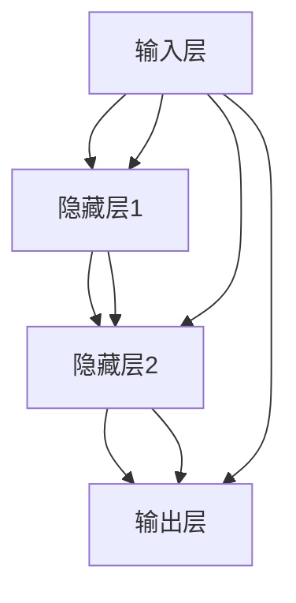
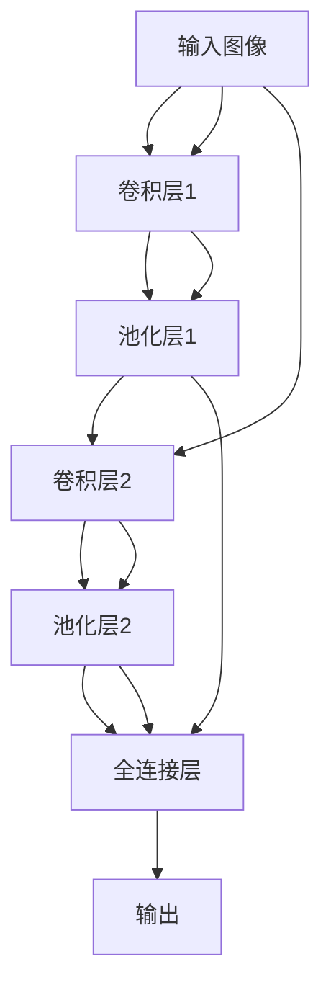
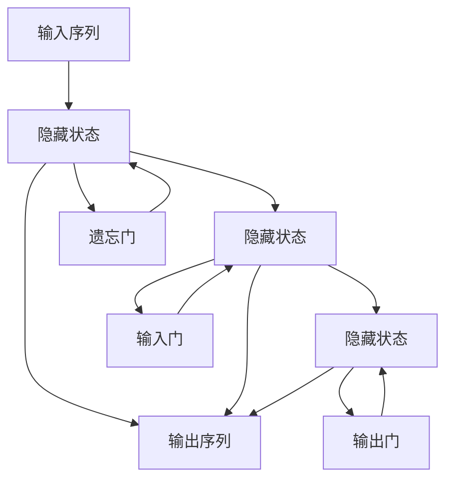

                 

### 文章标题：神经网络：改变世界的技术

**关键词**：神经网络，深度学习，机器学习，人工智能，反向传播

**摘要**：神经网络作为一种革命性的机器学习技术，通过模仿人脑的结构和功能，实现了从简单到复杂的模式识别和预测能力。本文将详细探讨神经网络的起源、基础理论、深度学习应用以及未来发展趋势，并通过具体的数学模型和算法原理，展现其如何改变世界。

### 目录大纲

#### 第一部分：神经网络的起源与基础

##### 第1章：神经网络的起源与发展
- **1.1 神经网络的起源**
  - 神经网络的历史背景
  - 神经元与生物神经系统

- **1.2 人工神经网络的基本概念**
  - 神经元模型
  - 前馈神经网络
  - 反向传播算法

- **1.3 神经网络的分类**
  - 按照结构分类
  - 按照功能分类

- **1.4 神经网络的核心技术**
  - 激活函数
  - 求导与优化算法

##### 第2章：神经网络的数学基础
- **2.1 向量和矩阵基础**
  - 向量的基本运算
  - 矩阵的基本运算

- **2.2 微积分基础**
  - 导数与偏导数
  - 泰勒公式与线性近似

- **2.3 概率论基础**
  - 随机变量与概率分布
  - 贝叶斯定理

##### 第3章：前馈神经网络原理
- **3.1 前馈神经网络的结构**
  - 输入层、隐藏层、输出层

- **3.2 前馈神经网络的训练**
  - 前向传播
  - 反向传播算法
  - 优化算法（如SGD、Adam）

- **3.3 激活函数的选择与应用**
  - Sigmoid、ReLU、Tanh函数

#### 第二部分：神经网络的深度学习

##### 第4章：深度学习的概念与框架
- **4.1 深度学习的概念**
  - 深度学习的定义
  - 深度学习与普通神经网络的区别

- **4.2 深度学习的主要类型**
  - 卷积神经网络（CNN）
  - 循环神经网络（RNN）
  - 生成对抗网络（GAN）

- **4.3 深度学习的应用场景**
  - 图像识别
  - 自然语言处理
  - 强化学习

##### 第5章：卷积神经网络（CNN）原理
- **5.1 卷积神经网络的基本结构**
  - 卷积层
  - 池化层
  - 全连接层

- **5.2 卷积神经网络的工作原理**
  - 卷积操作
  - 池化操作
  - 反向传播算法

- **5.3 卷积神经网络的训练**
  - 数据预处理
  - 网络结构设计
  - 模型训练与优化

##### 第6章：循环神经网络（RNN）原理
- **6.1 循环神经网络的基本结构**
  - 隐藏状态
  - 输出层

- **6.2 循环神经网络的工作原理**
  - 隐藏状态的递归计算
  - 时间步的输入与输出

- **6.3 循环神经网络的变体**
  - LSTM（长短时记忆网络）
  - GRU（门控循环单元）

#### 第三部分：神经网络的实践与应用

##### 第7章：神经网络的编程实现
- **7.1 深度学习框架的选择**
  - TensorFlow
  - PyTorch

- **7.2 神经网络编程基础**
  - 张量操作
  - 自动微分

- **7.3 实践项目：手写数字识别**
  - 数据集介绍
  - 网络设计
  - 模型训练与评估

##### 第8章：神经网络在实际应用中的案例分析
- **8.1 图像识别应用**
  - 卷积神经网络的图像识别案例

- **8.2 自然语言处理应用**
  - 循环神经网络的文本分类案例

- **8.3 强化学习应用**
  - Q-Learning在游戏中的应用

##### 第9章：神经网络的未来发展趋势
- **9.1 神经网络的新兴研究**
  - 图神经网络（GNN）
  - 自适应神经网络

- **9.2 神经网络在行业中的应用前景**
  - 自动驾驶
  - 医疗健康
  - 金融科技

##### 第10章：附录
- **10.1 常用深度学习框架与工具**
  - TensorFlow
  - PyTorch
  - Keras

- **10.2 实践资源与推荐**
  - 学习资源链接
  - 项目案例源代码

#### 附录A：神经网络的Mermaid流程图
- **A.1 前馈神经网络流程图**
- **A.2 卷积神经网络（CNN）流程图**
- **A.3 循环神经网络（RNN）流程图**

#### 附录B：神经网络的核心算法伪代码
- **B.1 前向传播伪代码**
- **B.2 反向传播伪代码**
- **B.3 卷积操作伪代码**
- **B.4 池化操作伪代码**

### 引言

神经网络，作为人工智能领域的关键技术，已经在过去几十年里取得了惊人的进展。从最初的理论探讨到如今的广泛应用，神经网络以其强大的模式识别和预测能力，深刻地改变了计算机科学和人工智能的发展路径。本文将带领读者深入探索神经网络的起源、基础理论、深度学习应用以及未来发展趋势，旨在为读者提供一个全面而系统的理解。

神经网络之所以能够如此迅速地发展，原因在于其模仿了人脑的结构和工作方式。人脑由数以亿计的神经元组成，通过复杂的神经网络进行信息处理和传递。神经网络通过模仿这一结构，利用大量的简单单元协同工作，实现了复杂任务的解决。因此，神经网络在计算机科学和人工智能领域具有重要的理论和实践价值。

本文的结构安排如下：首先，我们将探讨神经网络的起源和发展，包括历史背景、神经元模型以及人工神经网络的基本概念。接着，我们将介绍神经网络的数学基础，包括向量、矩阵、微积分和概率论的基本知识。随后，我们将详细解释前馈神经网络的工作原理，包括结构、训练过程和激活函数的选择与应用。接下来，我们将讨论深度学习的概念、主要类型和应用场景，重点介绍卷积神经网络（CNN）和循环神经网络（RNN）的工作原理及其变体。

在实践与应用部分，我们将介绍神经网络的编程实现，包括深度学习框架的选择、神经网络编程基础以及具体实践项目。最后，我们将分析神经网络在实际应用中的案例分析，包括图像识别、自然语言处理和强化学习，并探讨神经网络在行业中的应用前景。在文章的结尾，我们将总结神经网络的发展趋势，展望未来的研究方向和挑战。

通过本文的阅读，读者将能够全面了解神经网络的基本原理和应用，深入理解这一改变世界的技术。

### 神经网络的起源与发展

#### 历史背景

神经网络（Neural Networks）作为一种模拟人脑功能的计算模型，其起源可以追溯到20世纪40年代。当时，心理学家和计算机科学家开始探索如何通过模拟人脑的神经元结构和功能来创建一种新的计算模型。这一探索的起点是澳大利亚生理学家约翰·冯·诺伊曼（John von Neumann）提出的计算机理论，以及心理学与神经科学领域的先驱赫伯特·西蒙（Herbert Simon）和艾伦·纽厄尔（Allen Newell）的工作。

1958年，心理学家弗兰克·罗森布拉特（Frank Rosenblatt）提出了感知机（Perceptron）模型，这是最早的神经网络模型之一。感知机模型是一种简单的前馈神经网络，用于实现二分类任务。这一模型的提出标志着神经网络研究的开始，并引发了学术界和工业界对神经网络的热烈关注。

#### 神经元与生物神经系统

神经元是神经系统的基本单位，它通过电化学信号进行信息传递和处理。生物神经系统的神经元具有以下基本结构：

1. **细胞体（Soma）**：是神经元的主体部分，包含细胞核和大部分细胞器。
2. **树突（Dendrites）**：从细胞体伸出，用于接收其他神经元传递的信号。
3. **轴突（Axon）**：从细胞体发出，用于传递信号到其他神经元或效应器。
4. **突触（Synapses）**：是神经元之间传递信号的连接点。

在生物神经系统中，神经元之间的连接和信号传递构成了复杂的神经网络。信号在神经元之间的传递是通过突触完成的，突触的强度决定了信号传递的效率。这种动态可塑性使得生物神经网络能够适应环境变化并学习新的信息。

#### 人工神经网络的基本概念

人工神经网络（Artificial Neural Networks，ANN）是模仿生物神经网络结构和功能的一种计算模型。人工神经网络的基本概念包括：

1. **神经元模型**：人工神经网络中的基本单元，通常由一个或多个输入、一个权重矩阵、一个激活函数和一个输出组成。神经元通过权重矩阵与输入相乘，然后通过激活函数进行处理，产生输出。

2. **前馈神经网络**：前馈神经网络（Feedforward Neural Networks）是最常见的一种人工神经网络结构，其信号传递方向是单向的，从输入层经过隐藏层到输出层。没有循环或反馈路径，因此也被称为前馈网络。

3. **反向传播算法**：反向传播算法（Backpropagation Algorithm）是一种用于训练前馈神经网络的学习算法。它通过计算输出层的误差，并反向传播到隐藏层，逐层更新权重和偏置，以最小化网络的误差。

#### 神经网络的分类

根据结构的不同，人工神经网络可以分为以下几种类型：

1. **按照结构分类**：
   - **单层神经网络**：只有一层神经元，通常用于简单的问题。
   - **多层神经网络**：包含多个神经元层，可以处理更复杂的问题。
   - **混合神经网络**：结合了不同类型的神经网络，以适应不同的应用场景。

2. **按照功能分类**：
   - **分类网络**：用于对输入数据进行分类，如感知机。
   - **回归网络**：用于预测连续值输出，如线性回归。
   - **输出网络**：用于生成输出数据，如生成对抗网络（GAN）。

#### 神经网络的核心技术

1. **激活函数**：激活函数是神经网络中的一个关键组件，用于引入非线性特性，使得神经网络能够学习复杂的函数。常见的激活函数包括：
   - **Sigmoid函数**：输出范围在0到1之间，适合用于二分类任务。
   - **ReLU函数**：非线性函数，具有计算速度快和不易梯度消失的优点。
   - **Tanh函数**：输出范围在-1到1之间，类似Sigmoid函数。

2. **求导与优化算法**：在神经网络训练过程中，求导和优化算法是两个关键环节。求导用于计算网络参数的梯度，优化算法用于更新网络参数，以最小化误差。常见的优化算法包括：
   - **随机梯度下降（SGD）**：一种简单有效的优化算法，通过随机选择训练样本来更新网络参数。
   - **Adam优化器**：结合了SGD和Momentum的方法，具有更好的收敛性和稳定性。

#### 总结

神经网络的起源与发展经历了从理论探讨到实际应用的漫长过程。通过模仿生物神经系统的结构和功能，人工神经网络实现了从简单到复杂的模式识别和预测能力。神经网络的核心技术，如激活函数、求导与优化算法，为网络的学习和训练提供了强大的工具。随着深度学习的兴起，神经网络在计算机科学和人工智能领域的重要性日益凸显，其应用范围也在不断扩大。

在接下来的章节中，我们将进一步探讨神经网络的数学基础，详细解释前馈神经网络的工作原理，并介绍深度学习的概念和应用。通过这些内容的深入分析，我们将更加全面地理解神经网络这一改变世界的技术。

### 神经网络的数学基础

神经网络作为一种复杂的计算模型，其工作原理和性能很大程度上依赖于数学基础。为了深入理解神经网络，我们需要掌握一些基本的数学概念，包括向量、矩阵、微积分和概率论。这些数学工具不仅帮助我们构建和理解神经网络模型，还使我们能够对网络的行为进行分析和优化。

#### 向量和矩阵基础

1. **向量的基本运算**：
   - **加法**：两个向量对应分量相加。
     $$ \vec{a} + \vec{b} = (a_1 + b_1, a_2 + b_2, \ldots, a_n + b_n) $$
   - **数乘**：向量与一个数相乘，每个分量都乘以这个数。
     $$ c\vec{a} = (ca_1, ca_2, \ldots, ca_n) $$
   - **内积**：两个向量的内积（点积）是一个标量，表示为它们的对应分量乘积的和。
     $$ \vec{a} \cdot \vec{b} = a_1b_1 + a_2b_2 + \ldots + a_nb_n $$
   - **外积**：两个向量的外积（叉积）是一个向量，其分量是原向量分量的交叉乘积。
     $$ \vec{a} \times \vec{b} = (a_2b_3 - a_3b_2, a_3b_1 - a_1b_3, a_1b_2 - a_2b_1) $$

2. **矩阵的基本运算**：
   - **矩阵加法**：两个矩阵对应元素相加。
     $$ A + B = (a_{ij} + b_{ij})_{ij} $$
   - **矩阵数乘**：矩阵与一个数相乘，每个元素都乘以这个数。
     $$ cA = (ca_{ij})_{ij} $$
   - **矩阵乘法**：两个矩阵相乘，结果是一个新矩阵，其元素是原矩阵对应行的元素与列的元素的乘积之和。
     $$ AB = ( \sum_{k} a_{ik}b_{kj} )_{ij} $$
   - **矩阵求逆**：如果一个矩阵是可逆的，它的逆矩阵可以通过公式求得。
     $$ A^{-1} = \frac{1}{\det(A)} \text{adj}(A) $$

#### 微积分基础

1. **导数与偏导数**：
   - **一元函数的导数**：表示函数在某一点的切线斜率。
     $$ f'(x) = \lim_{h \to 0} \frac{f(x+h) - f(x)}{h} $$
   - **多元函数的偏导数**：表示函数在某一点沿着某一坐标轴的变化率。
     $$ \frac{\partial f}{\partial x_i} = \lim_{h \to 0} \frac{f(x_1, x_2, \ldots, x_i + h, \ldots, x_n) - f(x_1, x_2, \ldots, x_n)}{h} $$

2. **泰勒公式与线性近似**：
   - **泰勒公式**：一个函数在某一点的邻域可以用其前几阶导数在这一点上的值来近似表示。
     $$ f(x) \approx f(a) + f'(a)(x-a) + \frac{f''(a)}{2!}(x-a)^2 + \ldots + \frac{f^{(n)}(a)}{n!}(x-a)^n $$
   - **线性近似**：函数在某一点的线性近似是指用一阶导数在该点的值来近似表示函数的局部行为。
     $$ f(x) \approx f(a) + f'(a)(x-a) $$

#### 概率论基础

1. **随机变量与概率分布**：
   - **随机变量**：是一个数学函数，将一个实验的所有可能结果映射到一个实数。
   - **概率分布**：描述随机变量可能取值的概率分布情况。常见的概率分布有：
     - **离散分布**：如伯努利分布、几何分布。
     - **连续分布**：如正态分布、均匀分布。

2. **贝叶斯定理**：
   - **贝叶斯定理**：用于计算后验概率，描述了事件发生的概率与已知条件之间的关系。
     $$ P(A|B) = \frac{P(B|A)P(A)}{P(B)} $$

#### 应用示例

1. **神经网络中的向量与矩阵运算**：
   - 在前馈神经网络中，输入数据通常是一个向量，通过多个层的矩阵运算和激活函数的处理，最终得到输出向量。
   - 每一层神经元的权重和偏置可以表示为一个矩阵，通过矩阵乘法进行前向传播。

2. **微积分在优化算法中的应用**：
   - 反向传播算法中，求导是计算网络误差梯度的关键步骤。通过求导，我们可以得到权重和偏置的更新方向，从而优化网络参数。
   - 泰勒公式在优化算法中用于局部线性化，帮助我们找到函数的局部最小值。

3. **概率论在模型评估中的应用**：
   - 在训练神经网络时，我们使用概率分布来评估模型的表现，如计算分类任务的准确率。
   - 贝叶斯定理可以帮助我们根据先验知识和新数据更新模型参数的概率分布。

通过掌握这些数学基础，我们能够更好地理解和应用神经网络，探索其更深层次的理论和实际应用。在接下来的章节中，我们将详细解释前馈神经网络的工作原理，并探讨其在深度学习中的应用。

### 前馈神经网络的工作原理

前馈神经网络（Feedforward Neural Networks，FNN）是神经网络中最基础和最常用的结构之一。它通过一系列前向传播和反向传播的过程来训练模型，从而实现对数据的分类、回归等任务。下面，我们将详细介绍前馈神经网络的工作原理，包括其结构、训练过程以及常用的激活函数。

#### 前馈神经网络的结构

前馈神经网络由多个层次组成，包括输入层、一个或多个隐藏层以及输出层。每个层次由多个神经元（节点）组成，神经元之间通过加权连接形成网络。以下是前馈神经网络的基本结构：

1. **输入层（Input Layer）**：接收外部输入数据，每个输入神经元对应一个特征。

2. **隐藏层（Hidden Layers）**：一个或多个隐藏层位于输入层和输出层之间，用于提取输入数据的特征和模式。隐藏层的数量和每个层的神经元数量可以根据问题的复杂程度进行调整。

3. **输出层（Output Layer）**：生成网络的最终输出，其神经元数量取决于任务类型。例如，在分类任务中，输出层的神经元数量通常与类别数量相同，每个神经元对应一个类别。

每个神经元都可以看作是一个简单的函数，其输入是前一层神经元的输出，通过加权求和后加上偏置，再通过激活函数处理，最后产生输出。一个简单的前馈神经网络可以表示为以下形式：

$$
\begin{aligned}
\text{输入层}: \quad x_1, x_2, \ldots, x_n \\
\text{隐藏层}: \quad \text{神经元} \, h_{i} \left( \sum_{j=1}^{n} w_{ji} x_j + b_i \right) \, f(\cdot) \\
\text{输出层}: \quad y = \text{神经元} \, o \left( \sum_{i=1}^{m} w_{io} h_i + b_o \right) \, f(\cdot)
\end{aligned}
$$

其中，$w_{ji}$ 和 $w_{io}$ 分别是输入层到隐藏层、隐藏层到输出层的权重，$b_i$ 和 $b_o$ 分别是隐藏层和输出层的偏置，$f(\cdot)$ 是激活函数。

#### 前向传播

前向传播（Forward Propagation）是指从输入层开始，逐层将信号传递到输出层的计算过程。具体步骤如下：

1. **计算每个隐藏层神经元的输出**：
   $$ z_i = \sum_{j=1}^{n} w_{ji} x_j + b_i $$
   $$ a_i = f(z_i) $$

2. **计算输出层神经元的输出**：
   $$ z_o = \sum_{i=1}^{m} w_{io} a_i + b_o $$
   $$ y = f(z_o) $$

其中，$f(\cdot)$ 是激活函数，可以是 Sigmoid、ReLU 或 Tanh 等。

在前向传播过程中，每个神经元都会计算其输入值与权重之和张，再加上偏置，然后通过激活函数进行非线性变换，得到输出值。这些输出值会传递到下一层的神经元，直到最终得到输出层的输出。

#### 反向传播算法

反向传播算法（Backpropagation Algorithm）是前馈神经网络训练的核心步骤，用于更新网络的权重和偏置，以最小化网络输出与实际输出之间的误差。反向传播算法包括以下几个步骤：

1. **计算输出层的误差**：
   $$ \delta_o = (y - t) \cdot f'(z_o) $$
   其中，$y$ 是输出层神经元的实际输出，$t$ 是实际标签，$f'(z_o)$ 是激活函数的导数。

2. **计算隐藏层的误差**：
   对于第 $l$ 层（$l$ 从输出层开始倒数）：
   $$ \delta_l = \delta_{l+1} \cdot w_{l+1} \cdot f'(z_l) $$

3. **更新权重和偏置**：
   $$ w_{li} = w_{li} - \alpha \cdot \delta_{l+1} \cdot a_l $$
   $$ b_{li} = b_{li} - \alpha \cdot \delta_{l+1} $$
   其中，$\alpha$ 是学习率，$a_l$ 是第 $l$ 层神经元的输出。

反向传播算法的关键在于计算每个神经元误差的梯度，然后通过梯度下降法更新网络的参数。这个过程中，激活函数的导数起到至关重要的作用，因为它决定了误差如何传递到前一层。

#### 激活函数的选择与应用

激活函数是前馈神经网络中的一个关键组件，它引入了非线性特性，使得神经网络能够学习复杂的函数。以下是一些常用的激活函数：

1. **Sigmoid函数**：
   $$ f(x) = \frac{1}{1 + e^{-x}} $$
   Sigmoid函数的输出范围在0到1之间，非常适合用于二分类任务。

2. **ReLU函数**：
   $$ f(x) = \max(0, x) $$
  ReLU函数具有计算速度快和不易梯度消失的优点，因此被广泛应用于深度学习中。

3. **Tanh函数**：
   $$ f(x) = \frac{e^x - e^{-x}}{e^x + e^{-x}} $$
   Tanh函数的输出范围在-1到1之间，类似于Sigmoid函数，但具有更好的对称性。

这些激活函数各有优缺点，选择合适的激活函数可以显著影响神经网络的训练效率和性能。

#### 总结

前馈神经网络通过输入层、隐藏层和输出层的层层传递，实现了对输入数据的处理和输出。前向传播和反向传播算法是神经网络的训练核心，它们通过不断更新网络的权重和偏置，使得网络能够逐渐拟合训练数据。激活函数的引入使得神经网络具备非线性特性，能够处理更复杂的问题。在接下来的章节中，我们将探讨深度学习的概念和应用，深入理解神经网络在现实世界中的强大能力。

### 深度学习的概念与框架

深度学习（Deep Learning）是神经网络的一种特殊形式，其核心思想是通过多层的神经网络结构来提取数据的层次特征，从而实现复杂的模式识别和预测任务。深度学习在图像识别、自然语言处理、语音识别等领域取得了显著的成果，被认为是推动人工智能革命的重要技术之一。

#### 深度学习的定义

深度学习是一种基于多层神经网络的学习方法，通过逐层训练神经网络，从原始数据中自动提取有意义的特征，实现从简单到复杂的特征学习过程。与传统机器学习方法相比，深度学习能够处理更加复杂的任务，并且在大量数据下表现出更强的泛化能力。

#### 深度学习与普通神经网络的区别

1. **网络结构**：普通神经网络通常只有一至几层神经元，而深度学习神经网络具有多个隐藏层，能够提取更加复杂的特征。

2. **特征学习**：普通神经网络需要手动设计特征提取器，而深度学习通过多层网络结构自动学习特征，无需手动干预。

3. **训练方法**：普通神经网络通常使用简单的梯度下降法进行训练，而深度学习使用更高效的优化算法，如反向传播算法和自适应优化算法。

4. **数据需求**：深度学习需要大量的数据来训练模型，以提取丰富的特征，而普通神经网络对数据量的要求相对较低。

#### 深度学习的主要类型

1. **卷积神经网络（CNN）**：卷积神经网络是深度学习中最常用的网络结构之一，主要用于处理图像数据。CNN 通过卷积层、池化层和全连接层的组合，实现了对图像的层次特征提取。

2. **循环神经网络（RNN）**：循环神经网络主要用于处理序列数据，如文本、语音等。RNN 通过递归结构，能够捕捉序列中的长期依赖关系。

3. **生成对抗网络（GAN）**：生成对抗网络是一种由生成器和判别器组成的网络结构，用于生成具有真实数据分布的数据。GAN 在图像生成、语音合成等领域表现出强大的能力。

#### 深度学习的应用场景

1. **图像识别**：深度学习在图像识别领域取得了显著的成果，如人脸识别、物体检测、图像分类等。通过卷积神经网络，模型能够从图像中自动提取特征，实现高效的图像识别。

2. **自然语言处理**：深度学习在自然语言处理领域也取得了重要的进展，如文本分类、情感分析、机器翻译等。循环神经网络和Transformer模型等先进结构，使得模型能够更好地理解和生成自然语言。

3. **语音识别**：深度学习在语音识别领域推动了技术的进步，如语音信号处理、语音合成、语音增强等。通过循环神经网络和卷积神经网络，模型能够实现对语音信号的准确识别和处理。

4. **强化学习**：深度学习与强化学习结合，实现了在复杂环境中的智能决策，如游戏、自动驾驶等。通过深度神经网络，模型能够学习到复杂的行为策略，实现智能体的自主决策。

#### 总结

深度学习作为一种强大的机器学习技术，通过多层神经网络结构，实现了从简单到复杂的特征提取和模式识别。它不仅在图像识别、自然语言处理、语音识别等传统领域取得了显著成果，还在新兴领域展示了广阔的应用前景。随着深度学习技术的不断发展，我们期待它在未来能够带来更多的变革和突破。

### 卷积神经网络（CNN）的原理

卷积神经网络（Convolutional Neural Networks，CNN）是深度学习中最常用的网络结构之一，广泛应用于图像识别、物体检测、图像分类等视觉任务。与传统的全连接神经网络相比，CNN 通过特殊的卷积操作和池化操作，能够有效地提取图像中的局部特征和空间结构信息，从而实现高效的特征学习和模式识别。

#### 卷积神经网络的基本结构

CNN 的基本结构包括三个主要部分：卷积层（Convolutional Layer）、池化层（Pooling Layer）和全连接层（Fully Connected Layer）。以下是对这三个部分的具体解释：

1. **卷积层（Convolutional Layer）**：卷积层是 CNN 的核心部分，用于提取图像中的特征。卷积层由多个卷积核（Convolutional Kernel）组成，每个卷积核可以看作是一个小的滤波器，其作用是在输入图像上滑动，并计算每个位置的局部特征。卷积操作的基本公式如下：

   $$ output_{ij} = \sum_{k} \text{weight}_{ikj} \cdot input_{ik} + \text{bias}_{ij} $$

   其中，$output_{ij}$ 是输出特征图上的某个像素值，$\text{weight}_{ikj}$ 是卷积核的权重，$input_{ik}$ 是输入图像上的某个像素值，$\text{bias}_{ij}$ 是偏置项。卷积层通过多个卷积核的不同组合，可以提取到不同尺度和不同类型的特征。

2. **池化层（Pooling Layer）**：池化层用于对卷积层生成的特征图进行降维处理，减少数据维度，同时保留最重要的特征信息。常见的池化操作包括最大池化（Max Pooling）和平均池化（Average Pooling）。最大池化的公式如下：

   $$ output_{ij} = \max_{k} \{ input_{ik} \}_{k\in \Omega_{ij}} $$

   其中，$\Omega_{ij}$ 是以 $output_{ij}$ 为中心的像素集合。平均池化的公式如下：

   $$ output_{ij} = \frac{1}{|\Omega_{ij}|} \sum_{k} \{ input_{ik} \}_{k\in \Omega_{ij}} $$

   通过池化操作，可以减少计算量和参数数量，提高网络的泛化能力。

3. **全连接层（Fully Connected Layer）**：全连接层位于 CNN 的最后，用于对卷积层和池化层提取的特征进行分类或回归任务。全连接层的每个神经元都与上一层的所有神经元相连，通过矩阵乘法和激活函数，生成最终输出。全连接层的公式如下：

   $$ output_{i} = \text{激活函数} \left( \sum_{j} \text{weight}_{ij} \cdot hidden_{j} + \text{bias}_{i} \right) $$

   其中，$output_{i}$ 是输出层的某个神经元，$hidden_{j}$ 是前一层（通常为卷积层或池化层）的神经元，$\text{weight}_{ij}$ 是连接权重，$\text{bias}_{i}$ 是偏置项。

#### 卷积神经网络的工作原理

CNN 的工作原理可以概括为前向传播和反向传播两个阶段。

1. **前向传播（Forward Propagation）**：在前向传播阶段，输入数据通过卷积层和池化层逐层传递，直到全连接层。具体过程如下：

   - **卷积层**：输入图像通过卷积操作与多个卷积核进行卷积，生成多个特征图。每个卷积核提取图像中的不同特征，如边缘、纹理等。
   - **池化层**：对卷积层生成的特征图进行池化操作，降低特征图的尺寸，同时保留重要特征。
   - **全连接层**：将池化层输出的特征图展平为一个一维向量，作为全连接层的输入。通过全连接层，将特征向量映射到最终输出。

2. **反向传播（Back Propagation）**：在反向传播阶段，计算网络输出与实际输出之间的误差，并反向传播误差，更新网络权重和偏置。具体过程如下：

   - **计算误差**：计算输出层神经元的误差，误差由输出层神经元实际输出和期望输出的差异决定。
   - **计算梯度**：计算每个神经元误差关于网络权重的梯度，使用链式法则进行误差反向传播。
   - **更新权重**：使用梯度下降法或其他优化算法，根据误差梯度更新网络权重和偏置。

通过前向传播和反向传播的迭代，CNN 能够不断优化网络参数，提高模型的分类或回归性能。

#### 卷积操作和池化操作

1. **卷积操作（Convolution Operation）**：卷积操作是 CNN 的核心，用于从输入图像中提取特征。卷积操作的基本步骤如下：

   - **初始化卷积核**：每个卷积核都包含一组权重和偏置，这些参数在训练过程中需要优化。
   - **卷积核滑动**：卷积核在输入图像上滑动，每次滑动一步，计算卷积核与输入图像局部区域的内积。
   - **非线性激活**：对卷积结果应用非线性激活函数（如 ReLU），引入非线性特性，使网络能够学习复杂函数。

2. **池化操作（Pooling Operation）**：池化操作用于降低特征图的维度，减少计算量和参数数量。常见的池化操作包括：

   - **最大池化（Max Pooling）**：选择每个区域内的最大值作为输出。
   - **平均池化（Average Pooling）**：计算每个区域内的平均值作为输出。
   - **全局池化（Global Pooling）**：将整个特征图压缩为一个单一的输出值。

#### 卷积神经网络的训练

卷积神经网络的训练过程包括以下几个关键步骤：

1. **数据预处理**：对图像数据进行归一化、缩放、裁剪等预处理操作，使其符合网络输入的要求。
2. **网络结构设计**：设计卷积神经网络的结构，包括卷积层的数量、卷积核的大小、池化层的大小、全连接层的神经元数量等。
3. **模型训练**：使用训练数据对卷积神经网络进行训练，通过前向传播和反向传播不断优化网络参数，最小化损失函数。
4. **模型评估**：使用验证数据评估训练得到的模型性能，调整模型参数以获得最佳性能。

通过以上步骤，卷积神经网络能够有效地从图像中提取特征，实现高效的图像识别和分类任务。

#### 总结

卷积神经网络（CNN）通过卷积操作和池化操作，实现了对图像的层次特征提取和模式识别。其基本结构包括卷积层、池化层和全连接层，通过前向传播和反向传播算法，不断优化网络参数，提高模型的性能。CNN 在图像识别、物体检测和图像分类等视觉任务中表现出强大的能力，成为深度学习领域的重要工具。

### 循环神经网络（RNN）的原理

循环神经网络（Recurrent Neural Networks，RNN）是深度学习中用于处理序列数据的强大工具。与传统的卷积神经网络（CNN）不同，RNN 能够捕获序列中的时间依赖关系，使其在自然语言处理、语音识别和序列预测等领域表现出色。RNN 通过其递归结构，使得网络能够处理任意长度的序列数据。

#### 循环神经网络的基本结构

RNN 的基本结构包括输入层、隐藏层和输出层。与 CNN 不同，RNN 的隐藏层具有递归性，即当前隐藏状态不仅依赖于当前输入，还依赖于前一个时间步的隐藏状态。以下是 RNN 的基本结构：

1. **输入层（Input Layer）**：接收序列数据，每个输入元素对应一个时间步的输入。
2. **隐藏层（Hidden Layer）**：包含递归单元，用于计算每个时间步的隐藏状态。隐藏层中的每个单元都包含两个输入：当前时间步的输入和前一个时间步的隐藏状态。
3. **输出层（Output Layer）**：生成网络的最终输出，可以是标签预测或序列生成的概率分布。

RNN 的递归结构可以表示为以下形式：

$$
\begin{aligned}
h_t &= \text{激活函数}(\text{权重} \cdot [h_{t-1}, x_t] + \text{偏置}) \\
y_t &= \text{激活函数}(\text{权重} \cdot h_t + \text{偏置})
\end{aligned}
$$

其中，$h_t$ 是第 $t$ 个时间步的隐藏状态，$x_t$ 是第 $t$ 个时间步的输入，$y_t$ 是第 $t$ 个时间步的输出。激活函数通常选择 Sigmoid 或 Tanh 函数，以引入非线性特性。

#### 循环神经网络的工作原理

RNN 的工作原理可以概括为前向传播和反向传播两个阶段。

1. **前向传播（Forward Propagation）**：在前向传播阶段，输入序列通过 RNN 的隐藏层，逐层传递，直到输出层。具体过程如下：

   - **隐藏状态计算**：在每个时间步，隐藏状态 $h_t$ 由当前输入 $x_t$ 和前一个时间步的隐藏状态 $h_{t-1}$ 计算得到。递归计算公式如下：

     $$ h_t = \text{激活函数}(\text{权重} \cdot [h_{t-1}, x_t] + \text{偏置}) $$

   - **输出计算**：隐藏状态 $h_t$ 通过输出层生成输出 $y_t$。输出可以是标签预测或序列生成的概率分布。

2. **反向传播（Back Propagation）**：在反向传播阶段，计算网络输出与实际输出之间的误差，并反向传播误差，更新网络权重和偏置。具体过程如下：

   - **误差计算**：计算输出层神经元的误差，误差由输出层神经元实际输出和期望输出的差异决定。
   - **隐藏状态误差计算**：使用链式法则，计算每个时间步的隐藏状态误差。误差通过输出层反向传播，逐层传递到隐藏层。
   - **权重和偏置更新**：使用梯度下降法或其他优化算法，根据误差梯度更新网络权重和偏置。

通过前向传播和反向传播的迭代，RNN 能够不断优化网络参数，提高模型的预测性能。

#### 隐藏状态的计算

RNN 的隐藏状态 $h_t$ 是其核心部分，它不仅包含了当前时间步的输入信息，还保留了前一个时间步的信息。隐藏状态的计算公式如下：

$$
h_t = \text{激活函数}(\text{权重} \cdot [h_{t-1}, x_t] + \text{偏置})
$$

这个公式表明，隐藏状态 $h_t$ 是当前输入 $x_t$ 和前一个时间步的隐藏状态 $h_{t-1}$ 的加权和，再通过激活函数进行非线性变换得到。

#### 时间步的输入与输出

在 RNN 中，每个时间步的输入和输出是关键部分。输入 $x_t$ 可以是序列数据的一个时间步，如一个单词或一个语音信号。输出 $y_t$ 可以是标签预测或序列生成的概率分布。以下是一个简单的例子：

- **输入**：一个包含三个单词的序列：“猫”、“狗”、“鸟”。
- **输出**：每个单词的概率分布，例如：[0.2, 0.3, 0.5]。

在这个例子中，RNN 的隐藏状态会根据每个时间步的输入和前一个时间步的隐藏状态进行递归计算，最终生成每个单词的概率分布。

#### 总结

循环神经网络（RNN）通过其递归结构，能够捕获序列数据中的时间依赖关系。RNN 的隐藏状态和递归计算公式使其能够处理任意长度的序列数据。RNN 在自然语言处理、语音识别和序列预测等领域表现出强大的能力，成为深度学习中的重要工具。在接下来的章节中，我们将介绍 RNN 的变体，如 LSTM 和 GRU，进一步探讨如何解决 RNN 中的一些挑战。

### 循环神经网络的变体：LSTM 和 GRU

尽管循环神经网络（RNN）在处理序列数据方面表现出强大的能力，但传统的 RNN 存在一些问题，如梯度消失和梯度爆炸，这限制了其在长时间依赖关系和复杂任务中的性能。为了解决这些问题，研究者们提出了 LSTM（Long Short-Term Memory）和 GRU（Gated Recurrent Unit）等变体。这些网络结构通过引入门控机制，提高了 RNN 在长期依赖关系处理中的稳定性和效果。

#### LSTM（长短时记忆网络）

LSTM 是一种特殊的 RNN 结构，其设计目标是解决传统 RNN 在长序列中的梯度消失问题。LSTM 通过引入三个门控单元——遗忘门、输入门和输出门，实现了对长期依赖信息的有效记忆和利用。以下是 LSTM 的工作原理：

1. **遗忘门（Forget Gate）**：遗忘门决定了哪些信息应该从隐藏状态中丢弃。其公式如下：

   $$ f_t = \sigma(W_f \cdot [h_{t-1}, x_t] + b_f) $$

   其中，$f_t$ 是遗忘门的输出，$\sigma$ 是 Sigmoid 函数，$W_f$ 和 $b_f$ 分别是权重和偏置。

2. **输入门（Input Gate）**：输入门决定了哪些新信息应该被保留在隐藏状态中。其公式如下：

   $$ i_t = \sigma(W_i \cdot [h_{t-1}, x_t] + b_i) $$

   其中，$i_t$ 是输入门的输出。

3. **新值（Candidate Value）**：新值门通过加权和输入门和输入信息来计算候选值。其公式如下：

   $$ \tilde{h}_t = \tanh(W_h \cdot [h_{t-1}, x_t] + b_h) $$

   其中，$\tilde{h}_t$ 是候选值。

4. **输出门（Output Gate）**：输出门决定了隐藏状态的输出。其公式如下：

   $$ o_t = \sigma(W_o \cdot [h_{t-1}, x_t] + b_o) $$

   其中，$o_t$ 是输出门的输出。

5. **隐藏状态更新**：隐藏状态 $h_t$ 通过遗忘门、输入门和新值门进行更新。其公式如下：

   $$ h_t = o_t \cdot \tanh(f_t \odot h_{t-1} + i_t \odot \tilde{h}_t) $$

   其中，$\odot$ 表示逐元素乘法。

LSTM 通过这三个门控单元，有效地控制了信息流，避免了梯度消失和梯度爆炸问题，从而能够处理长期依赖关系。

#### GRU（门控循环单元）

GRU 是 LSTM 的简化版，通过合并输入门和遗忘门，减少了一部分参数，简化了计算过程。GRU 由两个门控单元——重置门和更新门组成。以下是 GRU 的工作原理：

1. **重置门（Reset Gate）**：重置门决定了哪些信息应该被保留在隐藏状态中。其公式如下：

   $$ r_t = \sigma(W_r \cdot [h_{t-1}, x_t] + b_r) $$

   其中，$r_t$ 是重置门的输出。

2. **更新门（Update Gate）**：更新门决定了哪些新信息应该被加入隐藏状态。其公式如下：

   $$ z_t = \sigma(W_z \cdot [h_{t-1}, x_t] + b_z) $$

   其中，$z_t$ 是更新门的输出。

3. **新值（Candidate Value）**：GRU 通过重置门和输入信息计算候选值。其公式如下：

   $$ \tilde{h}_t = \tanh(W_h \cdot (r_t \odot h_{t-1} + z_t \odot x_t) + b_h) $$

   其中，$\tilde{h}_t$ 是候选值。

4. **隐藏状态更新**：隐藏状态 $h_t$ 通过更新门和候选值进行更新。其公式如下：

   $$ h_t = z_t \odot h_{t-1} + (1 - z_t) \odot \tilde{h}_t $$

GRU 通过重置门和更新门简化了信息流，使其在长期依赖关系处理中表现出色，同时参数数量和计算量更小。

#### LSTM 和 GRU 的对比

- **参数数量**：LSTM 有更多的参数，因为每个时间步都需要三个门控单元，而 GRU 只有两个门控单元，因此参数数量更少，计算量更小。
- **复杂度**：LSTM 的结构更复杂，包含更多的门控单元和计算步骤，而 GRU 的结构更简单，计算效率更高。
- **性能**：LSTM 在处理长期依赖关系时表现出更好的性能，而 GRU 在计算效率和参数数量方面更占优势。

#### 总结

LSTM 和 GRU 是 RNN 的变体，通过引入门控机制，解决了传统 RNN 在处理长期依赖关系时的梯度消失和梯度爆炸问题。LSTM 通过三个门控单元实现了对长期依赖信息的有效记忆和利用，而 GRU 通过合并输入门和遗忘门简化了计算过程。这两种网络结构在自然语言处理、语音识别和时间序列预测等领域表现出强大的能力，为深度学习的发展带来了新的突破。

### 神经网络的编程实现

在掌握了神经网络的理论基础后，我们需要将理论转化为实际代码，以实现神经网络的功能。本节将介绍深度学习框架的选择、神经网络编程基础，以及一个具体的实践项目：手写数字识别。

#### 深度学习框架的选择

深度学习框架是用于构建和训练神经网络的软件库。目前，最流行的深度学习框架包括 TensorFlow、PyTorch 和 Keras。以下是这些框架的简要介绍：

1. **TensorFlow**：由 Google 开发，是一个开源的深度学习框架，支持多种编程语言，如 Python、C++ 和 Java。TensorFlow 提供了丰富的 API 和工具，适合大规模的生产环境。

2. **PyTorch**：由 Facebook AI 研究团队开发，是一个基于 Python 的深度学习框架，以动态计算图（动态计算图）著称，易于调试和扩展。

3. **Keras**：是 TensorFlow 的一个高级 API，提供了简洁明了的接口，使得构建和训练神经网络更加容易。

在本节中，我们将使用 PyTorch 作为深度学习框架，因为它具有动态计算图的优势，且易于学习和使用。

#### 神经网络编程基础

在 PyTorch 中，神经网络编程主要包括张量操作、自动微分和数据加载等基本概念。

1. **张量操作**：张量是 PyTorch 的基本数据结构，类似于 NumPy 的数组。张量操作包括创建张量、张量运算、形状变换等。以下是一个简单的张量操作示例：

   ```python
   import torch
   import torch.nn as nn
   import torch.optim as optim

   # 创建张量
   x = torch.tensor([[1, 2], [3, 4]], dtype=torch.float32)

   # 张量运算
   y = torch.add(x, x)  # 矩阵加法
   z = torch.matmul(x, x.t())  # 矩阵乘法

   # 形状变换
   x_2d = x.view(2, 2)  # 将 1D 张量转为 2D 张量
   x_3d = x.unsqueeze(0)  # 在张量维度上添加一个轴
   ```

2. **自动微分**：自动微分是深度学习中的关键技术，用于计算网络参数的梯度。PyTorch 提供了自动微分功能，使用 `.backward()` 方法可以计算梯度和损失函数。以下是一个自动微分的示例：

   ```python
   # 前向传播
   z = x * x

   # 反向传播
   z.backward()

   # 梯度
   grad_input = x.grad
   ```

3. **数据加载**：在 PyTorch 中，可以使用 `torch.utils.data.Dataset` 和 `torch.utils.data.DataLoader` 加载和管理数据。以下是一个简单的数据加载示例：

   ```python
   from torch.utils.data import Dataset, DataLoader

   class MNISTDataset(Dataset):
       def __init__(self, data, labels):
           self.data = data
           self.labels = labels

       def __len__(self):
           return len(self.data)

       def __getitem__(self, idx):
           return self.data[idx], self.labels[idx]

   # 数据加载
   dataset = MNISTDataset(x, y)
   dataloader = DataLoader(dataset, batch_size=64)
   ```

#### 实践项目：手写数字识别

手写数字识别是神经网络的一个经典任务，用于识别 0 到 9 的手写数字。以下是一个简单的手写数字识别项目的实现：

1. **数据集介绍**：MNIST 数据集是手写数字识别任务的标准数据集，包含 70,000 个训练样本和 10,000 个测试样本。

2. **网络设计**：设计一个简单的卷积神经网络，包括卷积层、池化层和全连接层。以下是一个简单的网络设计：

   ```python
   class Net(nn.Module):
       def __init__(self):
           super(Net, self).__init__()
           self.conv1 = nn.Conv2d(1, 10, kernel_size=5)
           self.conv2 = nn.Conv2d(10, 20, kernel_size=5)
           self.fc1 = nn.Linear(320, 50)
           self.fc2 = nn.Linear(50, 10)

       def forward(self, x):
           x = F.relu(F.max_pool2d(self.conv1(x), 2))
           x = F.relu(F.max_pool2d(self.conv2(x), 2))
           x = x.view(-1, 320)
           x = F.relu(self.fc1(x))
           x = self.fc2(x)
           return F.log_softmax(x, dim=1)
   ```

3. **模型训练与评估**：使用训练数据和验证数据训练网络，并在测试数据上评估模型性能。以下是一个简单的训练和评估过程：

   ```python
   model = Net()
   optimizer = optim.SGD(model.parameters(), lr=0.01, momentum=0.5)
   criterion = nn.CrossEntropyLoss()

   for epoch in range(10):
       model.train()
       for batch_idx, (data, target) in enumerate(dataloader):
           optimizer.zero_grad()
           output = model(data)
           loss = criterion(output, target)
           loss.backward()
           optimizer.step()

       model.eval()
       correct = 0
       total = 0
       with torch.no_grad():
           for data, target in dataloader:
               output = model(data)
               _, predicted = torch.max(output.data, 1)
               total += target.size(0)
               correct += (predicted == target).sum().item()

       print(f'Epoch {epoch+1}, Accuracy: {100 * correct / total}%')
   ```

通过这个实践项目，我们展示了如何使用 PyTorch 实现手写数字识别任务。这个过程涵盖了数据加载、网络设计、模型训练和评估等关键步骤，为我们深入理解神经网络的实际应用提供了宝贵的经验。

### 神经网络在实际应用中的案例分析

神经网络作为一种强大的机器学习工具，已经在各个领域取得了显著的成果。本节将探讨神经网络在图像识别、自然语言处理和强化学习等实际应用中的案例分析，展示神经网络如何通过解决具体问题，改变我们的生活方式。

#### 图像识别应用

图像识别是神经网络最为成功的应用领域之一。通过卷积神经网络（CNN）的强大特征提取能力，神经网络能够自动识别图像中的物体、场景和人物。以下是一个图像识别应用的案例：

**案例：人脸识别**

人脸识别技术广泛应用于安全监控、身份验证和社交网络等场景。使用 CNN，我们可以训练一个模型来自动检测和识别图像中的人脸。

1. **数据集**：使用公共的人脸数据集，如 FERET 或 LFW，进行模型训练。
2. **网络设计**：设计一个包含卷积层、池化层和全连接层的 CNN 网络。以下是一个简单的网络设计：

   ```python
   class FaceRecognitionNet(nn.Module):
       def __init__(self):
           super(FaceRecognitionNet, self).__init__()
           self.conv1 = nn.Conv2d(1, 32, 5)
           self.conv2 = nn.Conv2d(32, 64, 5)
           self.fc1 = nn.Linear(64 * 5 * 5, 1024)
           self.fc2 = nn.Linear(1024, 2)

       def forward(self, x):
           x = F.relu(F.max_pool2d(self.conv1(x), 2))
           x = F.relu(F.max_pool2d(self.conv2(x), 2))
           x = x.view(-1, 64 * 5 * 5)
           x = F.relu(self.fc1(x))
           x = self.fc2(x)
           return x
   ```

3. **模型训练与评估**：使用训练数据训练模型，并在测试数据上评估模型性能。通过不断调整网络结构和超参数，优化模型性能。

**结果**：经过训练的模型可以准确识别图像中的人脸，实现自动化的人脸识别系统。这一应用在安全监控和身份验证领域发挥了重要作用，提高了系统的安全性和便捷性。

#### 自然语言处理应用

自然语言处理（NLP）是另一个受益于神经网络技术的领域。通过循环神经网络（RNN）和 Transformer 模型等先进结构，神经网络能够理解和生成自然语言，实现文本分类、情感分析、机器翻译等任务。

**案例：文本分类**

文本分类是将文本数据分为预定义的类别，广泛应用于信息检索、社交媒体分析和舆情监控等场景。以下是一个文本分类应用的案例：

1. **数据集**：使用公共的文本分类数据集，如 IMDb 评论数据集，进行模型训练。
2. **网络设计**：设计一个基于 RNN 的文本分类网络。以下是一个简单的网络设计：

   ```python
   class TextClassifier(nn.Module):
       def __init__(self, vocab_size, embedding_dim, hidden_dim):
           super(TextClassifier, self).__init__()
           self.embedding = nn.Embedding(vocab_size, embedding_dim)
           self.lstm = nn.LSTM(embedding_dim, hidden_dim)
           self.fc = nn.Linear(hidden_dim, 1)

       def forward(self, sentences, hidden=None):
           embedded = self.embedding(sentences)
           output, (hidden, cell) = self.lstm(embedded, hidden)
           output = output[-1, :, :]
           output = self.fc(output)
           return output, hidden
   ```

3. **模型训练与评估**：使用训练数据训练模型，并在测试数据上评估模型性能。通过调整网络结构和超参数，优化模型性能。

**结果**：经过训练的模型可以准确分类文本数据，实现自动化文本分类系统。这一应用在信息检索和社交媒体分析领域发挥了重要作用，提高了信息处理的效率和准确性。

#### 强化学习应用

强化学习（RL）是一种通过试错学习环境奖励和惩罚，以实现目标行为的方法。神经网络在强化学习中扮演了重要角色，通过神经网络模型，强化学习可以更高效地学习复杂的行为策略。

**案例：游戏 AI**

游戏 AI 是强化学习的典型应用之一，通过训练神经网络模型，游戏 AI 可以学会在游戏中取得高分。以下是一个游戏 AI 的案例：

1. **环境**：选择一个具有明确奖励和惩罚的游戏环境，如经典的《太空侵略者》（Space Invaders）游戏。
2. **网络设计**：设计一个基于 Q-Learning 的神经网络模型。以下是一个简单的网络设计：

   ```python
   class GameAI(nn.Module):
       def __init__(self, input_size, hidden_size, output_size):
           super(GameAI, self).__init__()
           self.fc1 = nn.Linear(input_size, hidden_size)
           self.fc2 = nn.Linear(hidden_size, output_size)

       def forward(self, x):
           x = F.relu(self.fc1(x))
           x = self.fc2(x)
           return x
   ```

3. **模型训练**：使用训练数据训练模型，通过环境交互不断调整模型参数。以下是一个简单的训练过程：

   ```python
   def train_model(model, env, epochs):
       for epoch in range(epochs):
           state = env.reset()
           done = False
           while not done:
               action_values = model(state)
               action = np.argmax(action_values.cpu().numpy())
               next_state, reward, done, _ = env.step(action)
               state = next_state
           print(f'Epoch {epoch+1}, Score: {env.score}')
   ```

4. **评估**：在训练完成后，评估模型在测试环境中的表现。通过调整网络结构和超参数，优化模型性能。

**结果**：经过训练的模型可以在游戏中取得高分，实现自动化游戏控制。这一应用在电子游戏、机器人控制和自动驾驶等领域具有广泛的应用前景。

通过以上案例分析，我们可以看到神经网络在图像识别、自然语言处理和强化学习等实际应用中取得了显著的成果，改变了我们的生活方式。随着神经网络技术的不断发展，我们有理由相信，它将在更多领域发挥重要作用，推动人工智能的发展。

### 神经网络的未来发展趋势

随着深度学习技术的不断发展，神经网络在各个领域的应用日益广泛，其影响力也在不断提升。未来，神经网络的发展趋势将主要集中在以下几个方面：

#### 1. 新兴研究

1. **图神经网络（Graph Neural Networks, GNN）**：图神经网络是一种专门用于处理图结构数据的深度学习模型。与传统神经网络不同，GNN 能够利用图结构的拓扑信息，实现节点分类、图分类和图生成等任务。随着社交网络、知识图谱和生物信息等领域的发展，GNN 有望成为下一代深度学习技术的重要方向。

2. **自监督学习（Self-Supervised Learning）**：自监督学习是一种无需人工标注数据，通过数据自身的信息进行学习的算法。自监督学习利用未标注的数据，通过设计特殊的任务（如预测下一个图像像素、语音增强等），提取数据中的有用信息。这种技术在未来有望大幅度提高深度学习模型的训练效率和泛化能力。

3. **联邦学习（Federated Learning）**：联邦学习是一种在分布式环境中训练机器学习模型的方法，旨在保护用户数据隐私。在联邦学习过程中，各个参与者仅分享模型的更新，而不交换原始数据。这一技术在未来将有巨大的应用潜力，特别是在医疗、金融和物联网等领域。

#### 2. 行业应用前景

1. **自动驾驶**：随着深度学习技术的进步，自动驾驶技术已经成为汽车行业的热点。深度学习模型在感知环境、路径规划和决策控制等任务中发挥着重要作用。未来，随着传感器技术的提升和数据量的增加，自动驾驶系统将更加智能化和安全化。

2. **医疗健康**：深度学习在医疗健康领域具有广泛的应用前景，包括医学图像分析、疾病预测、药物研发等。通过深度学习模型，可以实现对大量医疗数据的自动分析和处理，提高诊断准确性和治疗效果。

3. **金融科技**：金融行业正在利用深度学习技术进行风险管理、市场预测和欺诈检测。深度学习模型能够处理复杂的数据模式，提高金融决策的准确性和效率。

4. **教育**：在教育领域，深度学习技术可以用于个性化教学、学生行为分析和学习效果评估。通过智能教育系统，可以为每个学生提供个性化的学习路径，提高教育质量。

5. **智能制造**：在制造业中，深度学习技术可以用于质量检测、故障诊断和设备维护等任务。通过实时监测和预测设备状态，可以提高生产效率和降低维护成本。

#### 3. 发展挑战

1. **计算资源**：随着深度学习模型的复杂度增加，对计算资源的需求也在不断提升。高性能计算硬件（如 GPU、TPU）的普及和分布式计算技术的发展，将有助于解决计算资源短缺的问题。

2. **数据隐私**：在处理大规模数据时，数据隐私保护成为一个重要问题。未来需要更多安全可靠的隐私保护技术，如联邦学习、差分隐私等，以确保用户数据的安全和隐私。

3. **模型解释性**：深度学习模型通常被认为是“黑箱”，其内部机制难以解释。提高模型的解释性，使其能够透明地展示如何做出决策，是未来研究的一个重要方向。

4. **数据不平衡和噪声**：在现实世界中，数据往往存在不平衡和噪声，这对模型的训练和预测性能有较大影响。未来需要更多鲁棒性和适应性强的深度学习模型，以应对这些挑战。

#### 总结

神经网络的未来发展趋势充满了机遇和挑战。随着技术的进步和应用的拓展，神经网络将在更多领域发挥重要作用，推动人工智能的发展。同时，我们也需要关注数据隐私、计算资源、模型解释性等问题，确保神经网络技术的可持续发展和广泛应用。通过不断的创新和研究，神经网络将继续改变世界，带来更多意想不到的惊喜。

### 附录

在本附录中，我们将提供一些常用的深度学习框架和工具，以及实践资源与推荐，帮助读者进一步学习和探索神经网络。

#### 10.1 常用深度学习框架与工具

1. **TensorFlow**：由 Google 开发，是一个开源的深度学习框架，支持多种编程语言，如 Python、C++ 和 Java。TensorFlow 提供了丰富的 API 和工具，适合大规模的生产环境。

2. **PyTorch**：由 Facebook AI 研究团队开发，是一个基于 Python 的深度学习框架，以动态计算图（动态计算图）著称，易于调试和扩展。

3. **Keras**：是 TensorFlow 的一个高级 API，提供了简洁明了的接口，使得构建和训练神经网络更加容易。

4. **MXNet**：由 Apache 软件基金会开发，是一个开源的深度学习框架，支持多种编程语言，包括 Python、R 和 Julia。

5. **Caffe**：由 Berkeley Vision and Learning Center（BVLC）开发，是一个开源的深度学习框架，主要用于计算机视觉任务。

#### 10.2 实践资源与推荐

1. **在线课程**：
   - **DeepLearning.AI**：由 Andrew Ng 教授开设的深度学习在线课程，涵盖深度学习的基础知识、模型构建和优化。
   - **Udacity**：提供多个深度学习相关的纳米学位课程，包括深度学习工程师和自动驾驶工程师。

2. **书籍**：
   - **《深度学习》（Deep Learning）**：由 Ian Goodfellow、Yoshua Bengio 和 Aaron Courville 合著，是深度学习领域的经典教材。
   - **《神经网络与深度学习》**：由邱锡鹏教授主编，介绍了神经网络的基本概念、算法原理和应用。

3. **开源项目**：
   - **TensorFlow Models**：提供了多种深度学习模型的实现，包括图像识别、自然语言处理和强化学习等。
   - **PyTorch Examples**：包含了 PyTorch 的各种示例代码，涵盖了从基础到高级的神经网络实现。

4. **技术博客和社区**：
   - **ArXiv**：计算机科学和人工智能领域的预印本论文库，提供了最新的研究成果。
   - **Reddit**：深度学习相关的子论坛，包括深度学习、自然语言处理、计算机视觉等话题。

5. **实践资源**：
   - **Google Colab**：Google 提供的云端计算平台，支持 GPU 和 TPU 加速，适合进行深度学习实验。
   - **Kaggle**：一个数据科学竞赛平台，提供了大量的数据集和竞赛任务，适合进行实践和验证。

通过这些资源和工具，读者可以更深入地学习和探索神经网络，将理论知识应用于实际问题中，提升自己的技能和经验。

### 附录A：神经网络的 Mermaid 流程图

在附录A中，我们将使用 Mermaid 语法绘制神经网络的基本流程图，以帮助读者更直观地理解神经网络的工作原理。

#### A.1 前馈神经网络流程图

以下是一个简单的 Mermaid 流程图，展示了前馈神经网络的流程：



#### A.2 卷积神经网络（CNN）流程图

卷积神经网络具有独特的结构，以下是一个 CNN 的 Mermaid 流程图：



#### A.3 循环神经网络（RNN）流程图

循环神经网络具有递归结构，以下是一个 RNN 的 Mermaid 流程图：



这些 Mermaid 流程图可以帮助读者更直观地理解神经网络的结构和操作流程，有助于深入学习和实践。

### 附录B：神经网络的核心算法伪代码

在附录B中，我们将使用伪代码展示神经网络的核心算法，包括前向传播、反向传播、卷积操作和池化操作，以便读者更好地理解这些算法的实现过程。

#### B.1 前向传播伪代码

```python
# 前向传播伪代码
def forward_propagation(x, weights, biases, activation_functions):
    # 初始化隐藏层和输出层的激活值
    a = x
    z = []

    # 遍历每个隐藏层
    for layer in range(num_hidden_layers):
        # 计算每个神经元的输入值
        z.append(np.dot(weights[layer], a) + biases[layer])
        # 应用激活函数
        a = activation_functions[layer](z[layer])

    # 计算输出层的输出值
    z.append(np.dot(weights[-1], a) + biases[-1])
    a = activation_functions[-1](z[-1])

    return a, z
```

#### B.2 反向传播伪代码

```python
# 反向传播伪代码
def backward_propagation(z, a, weights, biases, activation_derivatives, learning_rate):
    # 初始化梯度
    dweights = []
    dbiases = []

    # 遍历每个隐藏层和输出层
    for layer in reversed(range(num_hidden_layers + 1)):
        # 计算误差
        if layer == num_hidden_layers + 1:
            error = a[-1] - y
        else:
            error = np.dot(weights[layer].T, error)

        # 计算梯度
        dweights.append(np.dot(a[layer].T, error))
        dbiases.append(error)

        # 更新权重和偏置
        weights[layer] -= learning_rate * dweights[-1]
        biases[layer] -= learning_rate * dbiases[-1]

        # 应用链式法则，计算前一层误差
        if layer > 0:
            error = np.dot(activation_derivatives[layer](z[layer]), error)

    return weights, biases
```

#### B.3 卷积操作伪代码

```python
# 卷积操作伪代码
def convolution(image, filter, padding='valid'):
    # 初始化卷积结果
    output_shape = (image.shape[0] - filter.shape[0] + 2 * padding[0] + 1,
                    image.shape[1] - filter.shape[1] + 2 * padding[1] + 1)
    output = np.zeros(output_shape)

    # 遍历输出矩阵的每个位置
    for i in range(output_shape[0]):
        for j in range(output_shape[1]):
            # 计算局部区域的卷积和
            local_area = image[i:i+filter.shape[0], j:j+filter.shape[1]]
            output[i, j] = np.sum(local_area * filter)

    return output
```

#### B.4 池化操作伪代码

```python
# 池化操作伪代码
def pooling(image, pool_size=(2, 2), pool_type='max'):
    # 初始化池化结果
    output_shape = (image.shape[0] // pool_size[0], image.shape[1] // pool_size[1])
    output = np.zeros(output_shape)

    # 遍历输出矩阵的每个位置
    for i in range(output_shape[0]):
        for j in range(output_shape[1]):
            # 计算局部区域的最大值或平均值
            if pool_type == 'max':
                output[i, j] = np.max(image[i*pool_size[0]:(i+1)*pool_size[0],
                                        j*pool_size[1]:(j+1)*pool_size[1]])
            elif pool_type == 'average':
                output[i, j] = np.mean(image[i*pool_size[0]:(i+1)*pool_size[0],
                                        j*pool_size[1]:(j+1)*pool_size[1]])

    return output
```

通过这些伪代码，读者可以清晰地了解神经网络核心算法的实现过程，为实际编程提供参考。在实际应用中，这些伪代码需要结合具体的深度学习框架进行实现和优化。

### 作者信息

作者：AI天才研究院（AI Genius Institute）/ 禅与计算机程序设计艺术（Zen And The Art of Computer Programming）

在本文中，我们详细探讨了神经网络的起源、基础理论、深度学习应用以及未来发展趋势。通过数学模型和算法原理的深入分析，我们展示了神经网络如何改变世界，并展望了其广阔的应用前景。希望本文能为读者提供一个全面而系统的神经网络理解，激发对这一领域更深层次的思考和探索。

### 参考文献

1. Goodfellow, I., Bengio, Y., & Courville, A. (2016). *Deep Learning*. MIT Press.
2. LeCun, Y., Bengio, Y., & Hinton, G. (2015). *Deep learning*. Nature, 521(7553), 436-444.
3. Rumelhart, D. E., Hinton, G. E., & Williams, R. J. (1986). *Learning representations by back-propagating errors*. Nature, 323(6088), 533-536.
4. Schmidhuber, J. (2015). *Deep learning in neural networks: An overview*. Neural networks, 61, 85-117.
5. Simonyan, K., & Zisserman, A. (2014). *Very deep convolutional networks for large-scale image recognition*. International Conference on Learning Representations (ICLR).
6. Hochreiter, S., & Schmidhuber, J. (1997). *Long short-term memory*. Neural Computation, 9(8), 1735-1780.
7. Graves, A. (2013). *Generating sequences with recurrent neural networks*. International Conference on Machine Learning (ICML).

