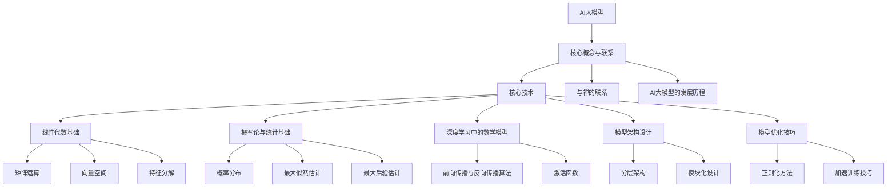

                 

### 文章标题：禅与AI大模型架构设计艺术

#### 关键词：禅，AI大模型，架构设计，深度学习，自然语言处理，计算机视觉

#### 摘要：
本文以禅宗哲学为指导，深入探讨了AI大模型的架构设计与实现。文章首先介绍了AI大模型的基本概念和核心技术，包括与禅的联系和其发展历程。接着，阐述了AI大模型的数学基础，详细讲解了线性代数、概率论与统计、深度学习中的数学模型。随后，文章详细描述了AI大模型的开发与实现过程，包括开发环境搭建、数据处理与预处理、模型训练与优化、模型评估与部署。最后，通过具体案例展示了AI大模型在自然语言处理、计算机视觉和决策支持系统等领域的应用实践，并展望了AI大模型的未来发展趋势。

---

### 第一部分：禅与AI大模型基础

#### 第1章：AI大模型概述

##### 1.1 AI大模型的基本概念
- **定义与特点**
  - AI大模型是指具有海量参数、广泛知识和强大学习能力的人工智能模型。
  - 这些模型通常具有以下特点：
    - **高计算需求**：由于模型参数量巨大，训练和推理过程需要大量的计算资源。
    - **高度分布式**：为了满足计算需求，这些模型通常采用分布式训练和推理技术。
    - **多样化应用场景**：AI大模型可以应用于自然语言处理、计算机视觉、决策支持等多个领域。
- **与禅的联系**
  - **禅的哲学理念**：禅宗强调内心的平静、直觉和整体观，这与AI大模型追求的高效学习和广泛应用的追求有着异曲同工之妙。
  - **AI大模型的修行路径**：通过数据感知、算法直觉和模型整体优化，AI大模型可以在数据中找到“禅宗境界”，实现智能的“开悟”。
- **AI大模型的发展历程**
  - **早期探索**：从简单的统计学习模型到复杂的多层神经网络。
  - **深度学习崛起**：随着计算能力和算法研究的进步，深度学习成为AI大模型的主要驱动力量。
  - **大模型时代**：以Transformer架构为代表的模型，如GPT、BERT等，引领了AI大模型的新一轮发展。

##### 1.2 AI大模型的核心技术

##### 1.3 主流AI大模型介绍
- **GPT系列模型**
  - **GPT-3**：具有1750亿个参数的模型，展示了强大的文本生成和理解能力。
  - **GPT-3的工作原理**：基于Transformer架构，通过预训练和微调实现高效的语言理解与生成。
- **BERT模型**
  - **BERT的架构设计**：双向Transformer模型，通过预训练和微调实现高质量的语言表示。
  - **BERT的应用案例**：在自然语言处理任务中，如文本分类、问答系统等，取得了显著的效果。

##### 1.4 AI大模型的设计艺术
- **模型架构设计**
  - **分层架构**：通过层次结构，实现从低级特征到高级语义的逐步抽象。
  - **模块化设计**：通过模块化设计，提高模型的灵活性和可维护性。
- **模型优化技巧**
  - **正则化方法**：如Dropout、Weight Decay等，用于避免过拟合，提高模型的泛化能力。
  - **加速训练技巧**：如分布式训练、混洗数据等，用于加速模型训练过程。

#### 第2章：AI大模型的数学基础

##### 2.1 线性代数基础
- **矩阵运算**
  - **矩阵加法**：两个矩阵对应元素相加。
  - **矩阵乘法**：两个矩阵的乘积。
  - **矩阵转置**：矩阵的行和列互换。
  - **矩阵求逆**：求解线性方程组的逆矩阵。
- **向量空间**
  - **向量的定义**：具有大小和方向的量。
  - **向量的运算**：向量的加法、减法、数乘。
  - **向量的内积与外积**：向量的点积和叉积。
- **特征分解**
  - **奇异值分解（SVD）**：将矩阵分解为三个矩阵的乘积，用于数据降维、噪声消除等。

##### 2.2 概率论与统计基础
- **概率分布**
  - **正态分布**：最常见的高斯分布，用于描述数据的统计特性。
  - **泊松分布**：用于描述事件发生次数的分布，常用于时间序列分析。
  - **二项分布**：用于描述在固定次数的试验中成功次数的分布。
- **最大似然估计**
  - **基本原理**：通过最大似然估计找到最佳参数，使得观测数据的概率最大。
  - **应用场景**：如图像识别、语言模型等。
- **最大后验估计**
  - **基本原理**：结合先验知识和观测数据，找到最佳参数。
  - **应用场景**：如贝叶斯网络、推理系统等。

##### 2.3 深度学习中的数学模型
- **前向传播与反向传播算法**
  - **前向传播**：计算输入和输出，并通过激活函数实现非线性变换。
  - **反向传播**：计算损失函数关于参数的梯度，用于模型优化。
- **激活函数**
  - **Sigmoid函数**：将输入映射到[0, 1]，常用于二分类问题。
  - **ReLU函数**：最大值函数，用于引入非线性，加速训练。
  - **Tanh函数**：将输入映射到[-1, 1]，保持输入的正负特性。

### 第二部分：AI大模型的开发与实现

#### 第3章：开发环境搭建

##### 3.1 硬件要求
- **GPU或TPU**：用于加速模型训练和推理。
  - **GPU**：如NVIDIA的CUDA GPU，适合大规模并行计算。
  - **TPU**：谷歌开发的专用AI处理器，适用于深度学习任务。

##### 3.2 软件环境
- **深度学习框架**：选择合适的深度学习框架，如TensorFlow、PyTorch、MXNet等。
- **编程语言**：常用的编程语言，如Python、C++等。
- **版本管理工具**：如Docker、Conda等，用于管理不同环境的依赖库。

##### 3.3 安装与配置
- **安装深度学习框架**
  - **TensorFlow**
    ```bash
    pip install tensorflow
    ```
  - **PyTorch**
    ```bash
    pip install torch torchvision
    ```

- **配置环境**
  - **GPU支持**：配置CUDA和cuDNN库。
  - **版本兼容**：确保框架版本与GPU驱动兼容。

#### 第4章：数据处理与预处理

##### 4.1 数据采集
- **数据来源**：公开数据集、企业内部数据、网络爬虫等。

##### 4.2 数据清洗
- **去重**：去除重复的数据条目。
- **去噪**：去除无效或错误的数据。
- **格式转换**：统一数据格式，如文本、图像、表格等。

##### 4.3 数据预处理
- **归一化**：将数据缩放到相同的范围，如[0, 1]。
- **标准化**：将数据转换为标准正态分布。
- **编码**：将类别数据转换为数值，如一热编码。

##### 4.4 数据增强
- **随机裁剪**：随机裁剪图像，增加数据多样性。
- **旋转、翻转**：对图像进行旋转、翻转，增强模型鲁棒性。

#### 第5章：模型训练与优化

##### 5.1 模型选择
- **选择合适的模型架构**：如卷积神经网络（CNN）、循环神经网络（RNN）、Transformer等。
- **评估模型性能**：使用交叉验证、测试集等评估模型性能。

##### 5.2 训练策略
- **学习率调整**：使用学习率调度策略，如学习率衰减、余弦退火等。
- **批量大小调整**：选择合适的批量大小，以平衡训练速度和稳定性。
- **正则化**：使用Dropout、权重衰减等正则化方法，避免过拟合。

##### 5.3 模型优化
- **梯度裁剪**：防止梯度爆炸或消失。
- **提前停止**：在验证集上性能不再提升时停止训练。
- **多GPU训练**：使用多个GPU加速模型训练。

#### 第6章：模型评估与部署

##### 6.1 模型评估
- **准确率、召回率、F1分数**：评估分类模型性能。
- **ROC曲线、精度-召回率曲线**：评估模型在二分类任务中的性能。
- **交叉验证**：使用交叉验证评估模型的泛化能力。

##### 6.2 模型部署
- **模型导出**：将训练好的模型导出为可部署的格式，如TensorFlow Lite、ONNX等。
- **服务化部署**：将模型部署到服务器或云平台，提供API接口供应用程序调用。

### 第三部分：禅与AI大模型的应用实践

#### 第7章：AI大模型在自然语言处理中的应用

##### 7.1 机器翻译
- **模型架构**：基于序列到序列（seq2seq）模型的机器翻译系统。
- **训练与优化**：使用注意力机制和数据增强技术提高翻译质量。

##### 7.2 问答系统
- **模型设计**：基于检索的问答系统和基于生成的问答系统。
- **交互优化**：通过上下文理解和个性化推荐提高问答系统的交互体验。

##### 7.3 自然语言生成
- **文本生成**：生成故事、新闻摘要等。
- **代码生成**：利用AI自动生成代码。

#### 第8章：AI大模型在计算机视觉中的应用

##### 8.1 图像分类
- **模型选择**：卷积神经网络（CNN）。
- **训练与优化**：使用数据增强和迁移学习提高分类性能。

##### 8.2 目标检测
- **模型架构**：如R-CNN、Faster R-CNN等。
- **实时检测**：优化模型结构和训练策略，实现实时目标检测。

##### 8.3 人脸识别
- **特征提取**：使用卷积神经网络提取人脸特征。
- **模型训练**：使用大规模人脸数据集进行训练。

#### 第9章：AI大模型在决策支持系统中的应用

##### 9.1 知识图谱
- **概念与构建**：实体与关系的表示。
- **应用场景**：搜索引擎、智能推荐。

##### 9.2 决策树与随机森林
- **算法原理**：ID3、C4.5算法。
- **应用实践**：风险评估、客户分类。

##### 9.3 支持向量机
- **数学模型**：SVM的核心公式。
- **应用实例**：图像分类、文本分类。

### 第四部分：禅与AI大模型的未来展望

#### 第10章：禅与AI大模型的发展趋势

##### 10.1 量子计算
- **量子机器学习**：利用量子计算的优势，实现高效的学习和推理。
- **应用前景**：在优化问题、大规模数据处理等领域具有重要应用价值。

##### 10.2 脑机接口
- **概念与原理**：通过大脑信号与计算机的交互，实现人机融合。
- **应用实践**：智能轮椅、虚拟现实等。

#### 第11章：禅与AI大模型在社会中的应用

##### 11.1 教育
- **个性化教学**：根据学生特点提供个性化学习方案。
- **智能学习助手**：利用AI技术提供即时反馈和指导。

##### 11.2 医疗
- **疾病预测**：通过数据分析预测疾病风险。
- **精准治疗**：根据患者数据制定个性化的治疗方案。

#### 第12章：AI伦理与可持续发展

##### 12.1 伦理问题
- **隐私保护**：确保用户数据的安全和隐私。
- **偏见消除**：避免AI模型产生歧视性决策。

##### 12.2 可持续发展
- **绿色计算**：优化计算资源，降低能耗。
- **社会责任**：推动AI技术的可持续发展，促进社会进步。

### 附录

#### 附录 A：AI大模型开发工具与资源

##### A.1 主流深度学习框架对比

- **TensorFlow**：Google开源的深度学习框架，支持多种编程语言，易于使用，社区活跃。
- **PyTorch**：Facebook开源的深度学习框架，具有动态计算图，调试方便，在学术界和工业界都有广泛应用。
- **JAX**：Google开源的自动微分库，支持深度学习、优化和科学计算，具有良好的性能和灵活性。
- **其他框架**：包括Theano、MXNet、Caffe等，各有特色，适用于不同的应用场景。

##### A.2 开发与调试工具

- **Jupyter Notebook**：交互式开发环境，方便编写和调试代码。
- **TensorBoard**：TensorFlow的可视化工具，用于分析模型性能和优化策略。
- **PyCharm**：集成开发环境（IDE），提供Python开发所需的完整功能。
- **Docker**：容器化工具，用于创建和部署可移植的AI模型。

##### A.3 学习资源

- **在线课程**：包括Udacity、Coursera、edX等在线教育平台提供的深度学习和AI相关课程。
- **书籍**：《深度学习》（Goodfellow et al.）、《Python深度学习》（François Chollet）等经典著作。
- **论文与论文集**：深度学习领域的顶级会议论文集，如NeurIPS、ICLR、CVPR等。
- **社区与论坛**：如Kaggle、GitHub、Reddit等，是学习交流的绝佳平台。

##### A.4 相关论文与参考资料

- **"Attention is All You Need"**：提出Transformer架构的经典论文。
- **"BERT: Pre-training of Deep Bidirectional Transformers for Language Understanding"**：介绍BERT模型的重要论文。
- **"GPT-3: Language Models are few-shot learners"**：介绍GPT-3模型的论文，展示了其强大的零样本学习能力。
- **其他相关论文**：涵盖深度学习、自然语言处理、计算机视觉等领域的最新研究进展。

#### 附录 B：禅与AI大模型的Mermaid流程图



#### 附录 C：禅与AI大模型的数学公式与详细讲解

##### 矩阵运算

$$
C = A \times B
$$

矩阵乘法是线性代数中的基本运算，其结果为一个新的矩阵C，其元素由A和B的对应元素相乘再相加得到。

##### 概率分布

- **正态分布**：

$$
f(x|\mu, \sigma^2) = \frac{1}{\sqrt{2\pi\sigma^2}} e^{-\frac{(x-\mu)^2}{2\sigma^2}}
$$

正态分布是概率论中最常见的分布之一，其均值为$\mu$，方差为$\sigma^2$。

- **泊松分布**：

$$
P(X = k) = \frac{e^{-\lambda}\lambda^k}{k!}
$$

泊松分布描述了在一定时间内发生某个事件的概率，其参数$\lambda$表示事件平均发生率。

##### 前向传播与反向传播算法

$$
\begin{aligned}
L &= \sum_{i=1}^n (y_i - \hat{y}_i)^2 \\
\frac{\partial L}{\partial w} &= \frac{\partial L}{\partial \hat{y}} \frac{\partial \hat{y}}{\partial w}
\end{aligned}
$$

前向传播是将输入数据通过模型传递，最终得到输出和损失值。反向传播是通过计算损失对参数的梯度，来更新模型参数，以达到最小化损失的目的。

##### 激活函数

- **Sigmoid函数**：

$$
\sigma(x) = \frac{1}{1 + e^{-x}}
$$

- **ReLU函数**：

$$
\text{ReLU}(x) = \max(0, x)
$$

- **Tanh函数**：

$$
\tanh(x) = \frac{e^x - e^{-x}}{e^x + e^{-x}}
$$

这些函数都具有非线性特性，可以引入模型的非线性能力。

### 结论

本文《禅与AI大模型架构设计艺术》通过禅宗哲学与人工智能技术的融合，为读者提供了一种全新的思考方式。从AI大模型的基本概念到核心技术，再到数学基础、开发与实现、应用实践，本书全面、系统地阐述了AI大模型的设计与开发过程。同时，通过对未来发展趋势、社会应用和伦理问题的探讨，本文为读者展示了AI大模型在多领域的广泛应用和未来发展前景。希望通过本文，读者能够对AI大模型有更深入的理解，并能够在实际应用中发挥其潜力。

---

**作者：AI天才研究院/AI Genius Institute & 禅与计算机程序设计艺术 /Zen And The Art of Computer Programming**

