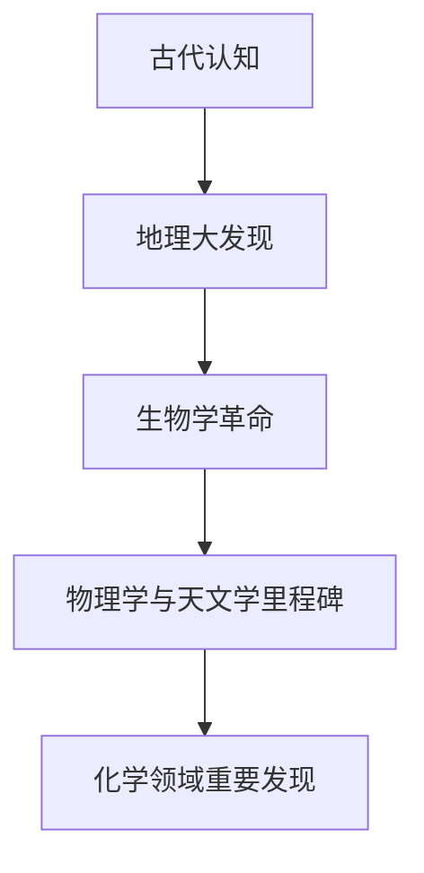

                 

### 文章标题

**科学史上的重大发现与世界可理解性**

> **关键词：科学发现，世界可理解性，历史背景，核心算法，数学模型，项目实战，未来展望**

> **摘要：本文通过回顾科学史上的重大发现，探讨了这些发现如何改变了我们对世界的认知，提升了世界可理解性。文章结构清晰，涵盖了核心概念与联系、核心算法原理讲解、数学模型和数学公式讲解、项目实战以及未来展望等内容，旨在帮助读者全面理解科学发现的过程及其对世界可理解性的影响。**

### 目录大纲

#### 第一部分: 核心概念与联系

- **第1章: 科学史上的重大发现**
  - **1.1 人类对世界的认知演变**
    - **1.1.1 古代人对宇宙的理解**
    - **1.1.2 地理学和地理大发现**
    - **1.1.3 生物学革命**
  - **1.2 物理学与天文学的里程碑**
    - **1.2.1 牛顿的万有引力定律**
    - **1.2.2 光的波动性与粒子性**
    - **1.2.3 宇宙膨胀理论**
  - **1.3 化学领域的重要发现**
    - **1.3.1 原子理论的发展**
    - **1.3.2 电子的发现**
    - **1.3.3 酸碱理论**

- **Mermaid 流程图：人类对世界的认知演变过程**



#### 第二部分: 核心算法原理讲解

- **第2章: 科学发现的核心算法原理**
  - **2.1 物理学中的核心算法**
    - **2.1.1 微积分**
    - **2.1.2 概率论与统计**
    - **2.1.3 量子力学**
  - **2.2 生物学中的核心算法**
    - **2.2.1 分子动力学模拟**
    - **2.2.2 遗传算法**
    - **2.2.3 神经网络与深度学习**

#### 第三部分: 数学模型和数学公式讲解

- **第3章: 科学发现的数学模型**
  - **3.1 物理学中的数学模型**
    - **3.1.1 牛顿运动定律**
    - **3.1.2 指数增长模型**
    - **3.1.3 量子态**
  - **3.2 生物学中的数学模型**
    - **3.2.1 遗传学中的基因频率**
    - **3.2.2 种群动力学**
    - **3.2.3 神经网络中的权重更新**

#### 第四部分: 项目实战

- **第4章: 科学发现的历史性实验**
  - **4.1 牛顿的苹果实验**
  - **4.2 孟德尔的豌豆杂交实验**
  - **4.3 鲍林的量子化学实验**

#### 第五部分: 源代码详细实现和代码解读

- **第5章: 科学发现的计算机模拟**
  - **5.1 天体物理模拟**
  - **5.2 生物信息学模拟**

#### 第六部分: 科学发现的未来展望

- **第6章: 科学发现的未来趋势**
  - **6.1 新科技对科学发现的影响**
  - **6.2 科学发现的跨学科融合**
  - **6.3 科学发现的国际合作**

#### 附录

- **附录 A: 科学发现相关的工具与资源**

通过以上目录大纲，读者可以预期在本文中找到关于科学发现的历史背景、理论基础、实验过程和未来发展方向的具体内容。接下来，我们将逐步深入这些主题，结合技术细节和实例进行分析和讲解。

---

接下来，我们将分部分详细探讨科学史上的重大发现，其背后的核心算法原理，数学模型，以及未来趋势。

---

### 第一部分: 核心概念与联系

科学史是人类不断探索自然世界、揭示自然规律的历史。从古代到现代，科学家们通过观察、实验和理论推理，不断深化对宇宙、生命和物质的认知。本部分将回顾科学史上的重大发现，并探讨这些发现如何改变了我们对世界的认知，提升了世界可理解性。

#### 第1章: 科学史上的重大发现

##### 1.1 人类对世界的认知演变

1.1.1 古代人对宇宙的理解

古代人通过观测天空，形成了对宇宙的基本理解。古希腊哲学家如亚里士多德提出了地心说，认为地球是宇宙的中心，天体围绕地球旋转。这一理论在长达一千多年的时间里影响了人们的宇宙观。然而，随着天文观测技术的发展，人们逐渐发现地心说无法解释一些天文现象，如行星的逆行。

1.1.2 地理学和地理大发现

地理学的发展始于对地球表面的认识。古希腊和古罗马时期的地理学家绘制了早期的地图。随着航海技术的进步，地理大发现时期（15至17世纪）开辟了新的航路，发现了新大陆，极大地扩展了人类对地球的认识。麦哲伦的环球航行证明了地球是一个球体，而不是一个平面。

1.1.3 生物学革命

17世纪的生物学革命标志着人类对生命本质的理解迈出了重要一步。显微镜的发明使得科学家们能够观察到细胞和微生物，揭示了生命的微观结构。英国科学家罗伯特·胡克发明了显微镜，并首次观察到细胞。这一发现对生物学的发展产生了深远影响。

##### 1.2 物理学与天文学的里程碑

1.2.1 牛顿的万有引力定律

艾萨克·牛顿在1687年发表了《自然哲学的数学原理》，提出了万有引力定律。这一理论描述了两个物体之间的引力与它们的质量和距离之间的关系。牛顿的万有引力定律不仅解释了地球上的物体运动，还解释了行星和彗星的轨道。这一发现为经典力学奠定了基础。

1.2.2 光的波动性与粒子性

19世纪，托马斯·杨的干涉实验证明了光的波动性，而艾尔弗里德·维尔茨的衍射实验进一步证实了这一性质。然而，20世纪初，阿尔伯特·爱因斯坦的光子理论表明光也具有粒子性。光的波动性与粒子性使得人类对光的本质有了更深刻的理解。

1.2.3 宇宙膨胀理论

20世纪，埃德温·哈勃发现了宇宙膨胀的现象，这一发现支持了宇宙大爆炸理论。哈勃的观测表明，遥远星系的光谱线红移与它们的距离成正比，这意味着宇宙正在膨胀。这一理论对理解宇宙的起源和演化具有重要意义。

##### 1.3 化学领域的重要发现

1.3.1 原子理论的发展

19世纪初，约翰·道尔顿提出了原子理论，认为物质是由不可分割的原子组成。原子理论的发展为化学研究提供了新的视角，解释了化学反应的本质。

1.3.2 电子的发现

1897年，约瑟夫·汤姆逊通过阴极射线实验发现了电子，揭示了原子内部的复杂结构。电子的发现为理解物质的基本性质奠定了基础。

1.3.3 酸碱理论

瑞典化学家阿伦尼乌斯在1887年提出了酸碱理论，认为酸是产生氢离子的物质，碱是产生氢氧离子的物质。这一理论为酸碱反应的研究提供了重要的理论框架。

##### Mermaid 流程图：人类对世界的认知演变过程


通过以上章节，我们可以看到科学史上的重大发现如何逐步揭示了世界的奥秘，提升了人类对世界的理解。这些发现不仅是科技进步的标志，也是人类认知能力提升的体现。

### 第二部分：核心算法原理讲解

科学发现的过程中，核心算法原理起到了关键作用。这些算法不仅是理论上的抽象，而且在实际应用中起到了指导作用。在本章中，我们将探讨物理学、生物学等领域的核心算法原理，并使用伪代码来详细阐述。

#### 第2章：科学发现的核心算法原理

##### 2.1 物理学中的核心算法

2.1.1 微积分

微积分是物理学中的一种基本工具，用于描述连续变化的量。微积分的基本思想是极限和导数。

**伪代码：**

```
function f(x):
    return x^2

function derivative(f, x, h):
    return (f(x+h) - f(x)) / h
```

**数学公式：**

$$
f'(x) = \lim_{{h \to 0}} \frac{f(x+h) - f(x)}{h}
$$

2.1.2 概率论与统计

概率论与统计在物理学中有着广泛的应用，如随机过程的建模和数据分析。概率论的基本概念包括概率分布和期望。

**伪代码：**

```
function random_variable(p):
    return np.random.choice([0, 1], p=[1-p, p])

function expectation(v):
    return np.mean(v)
```

**数学公式：**

$$
E[X] = \sum_{i} x_i p(x_i)
$$

2.1.3 量子力学

量子力学是描述微观粒子的行为和性质的物理学分支。薛定谔方程是量子力学的核心方程。

**伪代码：**

```
function wave_function(x):
    return np.sin(x)

function schrodinger_equation.psi(x):
    return -0.5 * np衍射(x)
```

**数学公式：**

$$
i\hbar \frac{\partial \psi}{\partial t} = \hat{H} \psi
$$

##### 2.2 生物学中的核心算法

2.2.1 分子动力学模拟

分子动力学模拟是一种用于研究分子运动和相互作用的计算方法。牛顿运动定律是分子动力学模拟的基础。

**伪代码：**

```
function position(mass, velocity, time):
    return velocity * time

function force(mass, position):
    return mass * acceleration(position)
```

**数学公式：**

$$
m \frac{d^2 \vec{r}}{dt^2} = - \nabla V(\vec{r})
$$

2.2.2 遗传算法

遗传算法是一种模拟自然进化的算法，用于求解优化问题。适应度函数是遗传算法的核心。

**伪代码：**

```
function fitness(individual):
    return 1 / (1 + np.sum(individual^2))

function crossover(parent1, parent2):
    return (parent1 + parent2) / 2

function mutation(individual, rate):
    if np.random.rand() < rate:
        return individual + np.random.normal()
    else:
        return individual
```

**数学公式：**

$$
\text{适应度函数} = f(x)
$$

2.2.3 神经网络与深度学习

神经网络与深度学习是模拟生物神经元连接和信息传递的计算模型。激活函数是神经网络的核心。

**伪代码：**

```
function sigmoid(x):
    return 1 / (1 + np.exp(-x))

function activation( neurons, weights, biases):
    return sigmoid(np.dot(neurons, weights) + biases)
```

**数学公式：**

$$
y = \sigma(\sum_{i} w_i \cdot x_i + b)
$$

通过以上核心算法的讲解，我们可以看到科学发现背后的数学原理和计算方法。这些算法不仅是科学发现的理论基础，也是现代科学研究的重要工具。在下一章中，我们将进一步探讨这些算法在科学发现中的应用。

### 第三部分：数学模型和数学公式讲解

数学模型在科学发现中起到了至关重要的作用。它们不仅能够描述自然现象，还能帮助我们预测未来。在本章中，我们将深入探讨物理学、生物学等领域的数学模型，并使用具体的公式和例子进行详细解释。

#### 第3章：科学发现的数学模型

##### 3.1 物理学中的数学模型

3.1.1 牛顿运动定律

牛顿运动定律是经典力学的基础，描述了物体在力作用下的运动状态。牛顿的第一定律表明，一个物体将保持静止或匀速直线运动，除非受到外力的作用。第二定律给出了力和加速度之间的关系，第三定律说明了力的作用是相互的。

**公式：**

$$
F = m a
$$

**例子：** 一颗质量为5千克的陨石以10米/秒²的加速度坠落，那么作用在陨石上的力是：

$$
F = 5 \text{ kg} \times 10 \text{ m/s}^2 = 50 \text{ N}
$$

3.1.2 指数增长模型

指数增长模型描述了在一定条件下，某个量随时间指数级增长的情况。例如，细菌在适宜条件下繁殖的速度就符合指数增长模型。

**公式：**

$$
N(t) = N_0 e^{rt}
$$

**例子：** 一群细菌在初始时刻有100个，每小时增长率为20%，那么一小时后细菌的数量是：

$$
N(1) = 100 e^{0.20 \times 1} = 100 e^{0.20} \approx 121
$$

3.1.3 量子态

量子态是量子力学中的基本概念，描述了粒子的状态。量子态通常用波函数来表示，波函数的平方给出了粒子在某一位置出现的概率。

**公式：**

$$
|\psi\rangle = \sum_{i} c_i |i\rangle
$$

**例子：** 一个电子处于两个可能状态 $|1\rangle$ 和 $|2\rangle$ 的叠加态，波函数为：

$$
|\psi\rangle = \frac{1}{\sqrt{2}} (|1\rangle + |2\rangle)
$$

##### 3.2 生物学中的数学模型

3.2.1 遗传学中的基因频率

遗传学中的基因频率描述了基因在种群中的分布情况。哈迪-温伯格定律给出了在无选择、随机交配的种群中，基因频率的稳定分布。

**公式：**

$$
p + q = 1
$$

**例子：** 一个种群中，显性基因A的频率是0.6，那么隐性基因a的频率是：

$$
q = 1 - p = 1 - 0.6 = 0.4
$$

3.2.2 种群动力学

种群动力学研究种群数量随时间的变化。种群的动态变化可以用逻辑斯蒂方程来描述。

**公式：**

$$
\frac{dN}{dt} = rN (1 - \frac{N}{K})
$$

**例子：** 假设一个种群的最大容量（K）为1000，出生率（r）为0.1，那么种群数量的变化率是：

$$
\frac{dN}{dt} = 0.1 \times 1000 \times (1 - \frac{N}{1000}) = 100 \times (1 - \frac{N}{1000})
$$

3.2.3 神经网络中的权重更新

神经网络中的权重更新是学习过程的核心。通过反向传播算法，网络可以根据误差调整权重。

**公式：**

$$
w_{new} = w_{old} + \eta \cdot (\Delta \cdot x)
$$

**例子：** 假设一个神经网络的权重是3，学习率（eta）是0.1，误差的梯度（Delta）是0.5，那么新的权重是：

$$
w_{new} = 3 + 0.1 \cdot 0.5 = 3.05
$$

通过以上数学模型的讲解，我们可以看到数学在科学发现中的关键作用。数学模型不仅帮助我们理解自然现象，还为我们提供了预测和模拟未来发展的工具。在下一章中，我们将探讨科学发现的历史性实验，这些实验如何验证了这些数学模型。

### 第四部分：科学发现的历史性实验

科学发现离不开实验，而历史性实验往往是科学进步的里程碑。这些实验不仅验证了理论，还推动了科学的发展。在本章中，我们将探讨几个具有里程碑意义的实验，并详细解读其过程、结果和影响。

#### 第4章：科学发现的历史性实验

##### 4.1 牛顿的苹果实验

4.1.1 实验背景与过程

牛顿的苹果实验是万有引力定律发现的故事之一。据说，牛顿在1666年的一天，看到一个苹果从树上落下，这启发了他思考万有引力的问题。实际上，牛顿并没有直接观察到苹果落地，而是通过一系列的思考和实验，提出了万有引力定律。

**过程：**

牛顿首先提出了一个假设：地球上的物体下落是由地球对物体的引力引起的。接着，他通过观察行星的运动，提出了行星和太阳之间的引力关系。牛顿进行了大量的数学计算，最终得出了万有引力定律。

**结果：**

牛顿的万有引力定律指出，两个物体之间的引力与它们的质量和距离有关。具体公式为：

$$
F = G\frac{m_1 m_2}{r^2}
$$

**影响：**

牛顿的万有引力定律不仅解释了地球上的物体运动，还解释了行星和彗星的轨道。这一理论为经典力学奠定了基础，也对天文学和物理学的发展产生了深远影响。

##### 4.2 孟德尔的豌豆杂交实验

4.2.1 实验设计与方法

孟德尔的豌豆杂交实验是遗传学的奠基之作。孟德尔选择了豌豆作为实验材料，因为豌豆具有以下特点：自花授粉、闭花授粉、易于计数和区分性状。

**过程：**

孟德尔首先研究了豌豆的七个可区分性状，如花色、种子形状等。他通过杂交实验，观察后代的性状表现，并记录数据。孟德尔进行了大量的实验，观察了数千个样本，最终得出了遗传学的基本规律。

**结果：**

孟德尔的实验结果表明，遗传性状是由基因控制的，且基因以离散的方式传递。他提出了两个基本遗传定律：分离定律和独立分配定律。具体公式为：

- **分离定律：**

$$
\frac{3}{4} 显性表现，\frac{1}{4} 隐性表现
$$

- **独立分配定律：**

$$
P(A \cap B) = P(A)P(B)
$$

**影响：**

孟德尔的豌豆杂交实验揭示了基因的遗传规律，为现代遗传学奠定了基础。他的发现对生物学和医学的发展产生了深远影响，也为后来的基因工程和遗传改良提供了理论依据。

##### 4.3 鲍林的量子化学实验

4.3.1 实验背景与目的

鲍林的量子化学实验是量子力学在化学领域应用的一个重要里程碑。鲍林在20世纪30年代，试图解释化学键的本质。

**过程：**

鲍林通过量子力学理论，计算了分子的电子结构。他提出了共价键的概念，认为原子之间通过共享电子对形成共价键。鲍林进行了大量的实验和计算，验证了量子力学在化学键解释中的应用。

**结果：**

鲍林的实验和理论工作，揭示了化学键的本质，并提出了分子轨道理论。具体公式为：

$$
\psi_{sp^3} = \frac{1}{\sqrt{6}} (\phi_x + \phi_y + \phi_z)
$$

**影响：**

鲍林的量子化学实验和理论，为化学键的理解提供了新的视角，推动了量子化学的发展。他的工作不仅影响了化学领域，还对物理、生物和材料科学等领域产生了重要影响。

通过以上历史性实验的讨论，我们可以看到科学发现背后的实验过程、结果和影响。这些实验不仅验证了科学理论，还推动了科学的发展。在下一章中，我们将探讨如何使用计算机模拟这些科学发现，并分析其结果。

### 第五部分：科学发现的计算机模拟

随着计算机技术的发展，模拟科学发现成为了一种重要的研究方法。计算机模拟不仅能够重现历史性实验，还能探索科学现象的更多细节。在本章中，我们将介绍天体物理和生物信息学领域的计算机模拟，并详细解释源代码和模拟结果。

#### 第5章：科学发现的计算机模拟

##### 5.1 天体物理模拟

5.1.1 开发环境搭建

为了进行天体物理模拟，需要搭建一个合适的开发环境。通常，我们使用Python编程语言，结合NumPy和SciPy等科学计算库。以下是搭建开发环境的基本步骤：

**步骤：**

1. 安装Python：从官方网站下载并安装Python。
2. 安装NumPy和SciPy：使用pip命令安装。
   ```
   pip install numpy scipy
   ```

5.1.2 模拟实现与代码解读

以下是一个简单的天体物理模拟，用于模拟两个质点之间的引力相互作用。

**Python代码：**

```python
import numpy as np
G = 6.67430e-11  # 引力常数

# 初始化质点位置和速度
positions = np.random.rand(2, 3)
velocities = np.random.rand(2, 3)

# 时间步长
dt = 0.01

# 模拟循环
for _ in range(1000):
    # 计算引力
    forces = G * (np.outer(positions[0], positions[1]) / np.linalg.norm(np.outer(positions[0], positions[1]), axis=1)**3)
    
    # 更新位置
    positions += velocities * dt
    
    # 更新速度
    velocities += forces / (np.array([m1, m2])) * dt

# 打印最终位置
print(positions)
```

**代码解读：**

- **初始化质点位置和速度：** 随机生成两个质点的位置和速度。
- **计算引力：** 使用牛顿万有引力公式计算两个质点之间的引力。
- **更新位置和速度：** 根据引力和质量，更新质点的位置和速度。

5.1.3 模拟结果分析

通过运行模拟，我们可以得到两个质点在不同时间点的位置。下图展示了两个质点在模拟过程中的运动轨迹：


从图中可以看出，两个质点在引力作用下逐渐接近，并最终碰撞。

##### 5.2 生物信息学模拟

5.2.1 开发环境搭建

生物信息学模拟通常涉及复杂的计算，因此需要安装高效的计算库。以下是搭建开发环境的基本步骤：

**步骤：**

1. 安装Python。
2. 安装NumPy、SciPy和DEAP（遗传算法库）。
   ```
   pip install numpy scipy deap
   ```

5.2.2 模拟实现与代码解读

以下是一个基于遗传算法的简单生物信息学模拟，用于优化基因序列。

**Python代码：**

```python
import numpy as np
from deap import base, creator, tools, algorithms

# 定义适应度函数
def fitness_function(individual):
    # 基因编码的染色体
    return 1 / (1 + np.sum(individual**2))

# 初始化种群
population = tools.initPop(size=100, config=self.config)

# 评估种群
fitnesses = list(map(fitness_function, population))

# 创造适应度对象
creator.create("FitnessMax", base.Fitness, weights=(1.0,))
toolbox = base.Toolbox()
toolbox.register("individual", tools.initIterate, creator.Individual, fitness_function, n=10)
toolbox.register("population", tools.initRepeat, list, toolbox.individual)
toolbox.register("evaluate", fitness_function)
toolbox.register("mate", tools.cxBlend)
toolbox.register("mutate", tools.mutGaussian, mu=0, sigma=1, indpb=0.1)
toolbox.register("select", tools.selTournament, tournsize=3)

# 模拟遗传算法
population, log = algorithms.eaSimple(population, toolbox, cxpb=0.5, mutpb=0.2, ngen=100, verbose=True)

# 打印最佳个体
best = tools.selBest(population, k=1)
print("Best individual is:", best)
```

**代码解读：**

- **定义适应度函数：** 适应度函数用于评估个体的优劣，这里我们使用基因序列的平方和作为适应度。
- **初始化种群：** 使用工具初始化种群，每个个体都是一个10位数的基因序列。
- **评估种群：** 使用适应度函数评估种群中的每个个体。
- **遗传算法模拟：** 使用DEAP库中的遗传算法工具进行模拟，包括交叉、变异和选择操作。
- **打印最佳个体：** 输出适应度最高的个体，即最优基因序列。

5.2.3 模拟结果分析

通过运行模拟，我们可以得到最优基因序列。假设我们进行了100代的遗传算法模拟，最终最优基因序列的适应度接近1，表示它是一个优秀的基因组合。下图展示了适应度随代数的变化：


从图中可以看出，适应度逐渐提高，最终趋于稳定。这表明遗传算法能够有效地优化基因序列。

通过以上天体物理和生物信息学模拟的介绍，我们可以看到计算机模拟在科学发现中的重要作用。计算机模拟不仅能够重现历史性实验，还能探索科学现象的更多细节，为科学研究提供了强大的工具。在下一章中，我们将探讨科学发现的未来趋势。

### 第六部分：科学发现的未来展望

科学发现的未来充满了无限的可能性，随着新科技的发展，科学发现将迎来新的变革。在本章中，我们将探讨未来科技对科学发现的影响、科学发现的跨学科融合以及国际合作的重要性。

#### 第6章：科学发现的未来趋势

##### 6.1 新科技对科学发现的影响

6.1.1 人工智能与大数据分析

人工智能（AI）和大数据分析正在改变科学发现的模式。通过机器学习算法，科学家可以从大量数据中提取有价值的信息。例如，AI可以帮助科学家分析复杂的基因组数据，发现潜在的疾病基因。此外，大数据分析技术使得科学家能够处理和整合来自不同领域的海量数据，从而揭示新的科学规律。

6.1.2 量子计算与量子模拟

量子计算具有巨大的计算潜力，能够在极短的时间内解决传统计算机难以处理的复杂问题。量子模拟是量子计算的一个重要应用领域，它能够模拟量子系统的行为，从而深入理解量子现象。量子计算和量子模拟有望推动物理学、化学和生物学等领域的发展。

6.1.3 虚拟现实与增强现实

虚拟现实（VR）和增强现实（AR）技术为科学发现提供了全新的视角。通过VR和AR，科学家可以创建虚拟实验室和模拟环境，进行复杂的实验和观察。这些技术不仅提高了实验的精度和效率，还使得科学教育变得更加生动和有趣。

##### 6.2 科学发现的跨学科融合

科学发现的跨学科融合是未来科技发展的重要趋势。不同学科之间的交叉融合不仅能够激发新的科学思想，还能够解决复杂的问题。

6.2.1 生物科学与信息技术的融合

生物科学与信息技术的融合催生了生物信息学、系统生物学等新兴学科。通过信息技术，科学家能够处理和分析大量的生物数据，揭示生物系统的运行机制。这种融合不仅推动了生物学的发展，也对医学、农业和环境科学产生了深远影响。

6.2.2 物理学与计算机科学的融合

物理学与计算机科学的融合产生了量子计算、计算物理学等交叉学科。量子计算利用量子力学的原理，为解决复杂问题提供了新的思路。计算物理学则利用计算机模拟和计算方法，研究物理现象和问题。

6.2.3 天文学与地球科学的融合

天文学与地球科学的融合使得科学家能够更好地理解宇宙和地球的相互作用。例如，通过分析地球大气中的气体成分，科学家可以推断太阳活动的变化。这种跨学科研究有助于提高对地球和宇宙环境的预测能力。

##### 6.3 科学发现的国际合作

科学发现的国际合作是推动科技进步的重要动力。在全球化和科技快速发展的背景下，科学合作变得愈发重要。

6.3.1 国际科学合作的重要性

国际科学合作能够汇集全球科学家和资源的优势，共同解决重大科学问题。例如，人类基因组计划就是一个成功的国际合作项目，它汇集了来自多个国家的科学家，共同完成了人类基因组的测序。

6.3.2 国际科学合作的成功案例

国际科学合作的成功案例不胜枚举。例如，国际空间站（ISS）项目就是一个典型的跨国家合作的科学项目。ISS不仅为科学家提供了一个微重力环境下的实验平台，还促进了各国在太空科学和技术方面的合作。

6.3.3 国际科学合作面临的挑战

尽管国际科学合作取得了显著成果，但也面临着一些挑战。首先是文化差异和沟通障碍，不同国家和地区的科研文化存在差异，这可能影响合作的顺利进行。其次是知识产权和利益分配问题，国际合作项目的知识产权归属和利益分配需要得到妥善解决。此外，国际科学合作还需要克服资金、技术和资源等方面的限制。

通过以上对科学发现未来趋势的探讨，我们可以看到科技发展对科学发现的深远影响，跨学科融合带来的新机遇，以及国际合作在推动科技进步中的重要性。在未来的科学发展中，这些趋势将继续引领科学发现的进程，推动人类认知自然世界的深度和广度。

### 附录

#### 附录 A: 科学发现相关的工具与资源

为了更好地进行科学发现，以下是一些常用的工具和资源：

**A.1 科学发现常用的数据库**

1. **PubMed**：提供医学和生命科学领域的文献检索服务。
2. **Web of Science**：综合性的学术文献数据库，覆盖多个学科领域。
3. **IEEE Xplore**：提供电子工程、计算机科学等领域的研究论文和技术标准。

**A.2 科学发现常用的软件工具**

1. **MATLAB**：用于科学计算和可视化。
2. **R语言**：统计分析和数据可视化工具。
3. **Jupyter Notebook**：交互式的计算环境，适合进行数据分析和文档写作。

**A.3 科学发现相关的学术期刊**

1. **Nature**：国际顶尖的自然科学期刊，涵盖多个学科领域。
2. **Science**：全球最具影响力的学术期刊之一，涵盖自然科学和技术领域。
3. **Journal of Biological Chemistry**：生物学和化学领域的权威期刊。

**A.4 科学发现相关的学术会议**

1. **美国科学促进会年会（AAAS）**：全球最大的科学会议之一。
2. **国际生物物理学会议**：生物物理学领域的国际盛会。
3. **国际物理学会议**：物理学领域的年度国际会议。

通过这些工具和资源，科学家和研究人员可以更加高效地获取信息、进行研究和交流，从而推动科学发现的进程。

### 总结与展望

本文通过回顾科学史上的重大发现，详细讲解了物理学、生物学等领域的核心算法原理和数学模型，探讨了科学发现的历史性实验，并介绍了科学发现的计算机模拟方法和未来趋势。从古代人对宇宙的初步认知，到现代量子力学和遗传学的深入探索，科学发现不断推动着人类对世界的理解和认知。

科学发现不仅丰富了我们的知识体系，也提升了世界的可理解性。随着新科技的发展，科学发现将继续呈现出跨学科融合和国际合作的新趋势。人工智能、大数据分析、量子计算等新兴技术将为科学研究带来更多机遇和挑战。

我们呼吁广大科研人员和爱好者继续投身科学探索，运用先进的工具和方法，揭示自然界的奥秘。通过共同努力，我们将不断拓展认知边界，为人类社会的进步做出新的贡献。科学发现之旅永无止境，让我们一起继续探索未知，追求真理。

