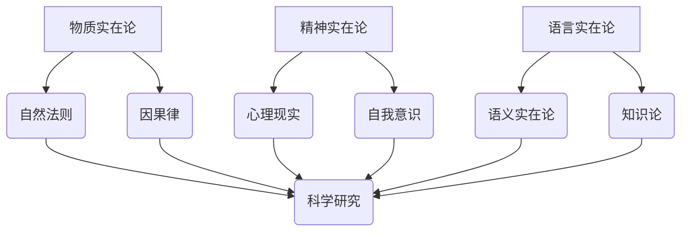

                 

### 科学哲学中的实在论与反实在论之争

> **关键词**：科学哲学、实在论、反实在论、哲学思想、科学方法论、知识论、形而上学、实证主义、反实证主义、社会建构主义、语言游戏论、科学进步、科学革命。

> **摘要**：本文探讨了科学哲学中的实在论与反实在论之争。实在论认为客观现实独立于观察者存在，科学理论的任务是揭示其真实面貌；而反实在论则主张现实是观察者主观建构的，科学理论更多地反映人类对世界的理解而非现实本身。本文通过分析实在论与反实在论的历史演变、现代科学哲学中的地位和核心观点，比较两者在现代科学中的应用，展示了实证主义与反实证主义在科学革命中的作用。最后，总结了实证主义与反实证主义在科学哲学中的综合视角及其对未来科学发展的展望。

### 目录大纲：《科学哲学中的实在论与反实在论之争》

1. **引论**  
   - 科学哲学概述  
   - 实在论与反实在论概述  
   - 二者之间的历史冲突与融合

2. **实在论研究**  
   - 实在论的历史与发展  
   - 现代实在论的核心观点  
   - 实在论的主要代表人物  
   - 实在论的核心概念与联系  
   - Mermaid 流程图

3. **反实在论研究**  
   - 反实在论的历史与发展  
   - 现代反实在论的核心观点  
   - 反实在论的主要代表人物  
   - 反实在论的核心概念与联系  
   - Mermaid 流程图

4. **实在论与反实在论的争论**  
   - 争论的主要焦点  
   - 争论的历史演变  
   - 争论的哲学意义

5. **案例分析与应用**  
   - 实在论在科学中的应用  
   - 反实在论在科学中的应用  
   - 案例研究：科学哲学中的实证主义与反实证主义

6. **总结与展望**  
   - 实在论与反实在论的融合趋势  
   - 科学哲学的未来挑战

7. **附录**  
   - 科学哲学相关文献与资源  
   - 科学哲学研究方法与技巧  
   - 科学哲学教育与应用

8. **参考文献**

### 第一部分：引论

#### 科学哲学概述

科学哲学是哲学的一个分支，主要探讨科学理论和科学实践的根本问题，包括科学方法、科学知识、科学进步、科学哲学与社会的关系等。科学哲学的发展可以追溯到古代，如古希腊哲学家亚里士多德、柏拉图对自然现象的探究。中世纪时期，托马斯·阿奎那结合基督教神学对科学进行了哲学思考。到了近代，伽利略和牛顿等科学家的实验方法引发了科学哲学的重新思考。现代科学哲学则更加关注科学知识的社会建构性、科学方法的相对性和科学理论的多样性。

#### 实在论与反实在论概述

实在论（Realism）与反实在论（Anti-realism）是科学哲学中的两种基本立场，二者在对待客观现实和科学理论的关系上存在显著差异。

- **实在论**：实在论认为客观现实独立于观察者存在，科学理论的任务是揭示这种客观现实的本质。实在论强调科学理论的可验证性和客观性，代表性的理论包括物质实在论、精神实在论和语言实在论。

- **反实在论**：反实在论则认为客观现实是依赖于观察者及其认知过程的，科学理论更多地反映了人类对世界的理解，而非现实本身。反实在论关注科学知识的相对性、社会建构性和语言游戏性，代表性的理论包括语言游戏论、社会建构主义和唯名论。

#### 二者之间的历史冲突与融合

实在论与反实在论在科学哲学史上有着长期的冲突和对话。在古代和中世纪，实在论占主导地位，如亚里士多德和柏拉图的理念论、托马斯·阿奎那的形而上学理论。然而，随着科学革命和实证主义思潮的兴起，反实在论开始崭露头角，如笛卡尔的经验论、奥古斯特·孔德的实证主义。现代科学哲学中，实在论与反实在论的争论更加深入，二者在科学方法论、科学知识和科学进步等问题上展开了广泛的对话。

总之，实在论与反实在论作为科学哲学中的两种基本立场，它们不仅反映了人类对客观现实的认知和理解，也推动了科学哲学的不断发展。通过历史的回顾和理论的探讨，我们可以更好地理解实在论与反实在论在科学哲学中的地位和作用。

### 第二部分：实在论研究

#### 实在论的历史与发展

实在论（Realism）作为科学哲学中的一个基本立场，其历史可以追溯到古代哲学。在古希腊时期，亚里士多德和柏拉图是实在论的重要代表人物。亚里士多德提出了形式与质料的理论，认为事物由内在的形质构成，这种形质是客观存在的。柏拉图则通过“理念世界”的概念强调真实存在的本质是理念而非物质。在中世纪，托马斯·阿奎那结合基督教神学，提出了关于上帝和宇宙秩序的实在论观点，这些思想对后世产生了深远影响。

文艺复兴时期，随着科学革命的兴起，实证主义的观念逐渐流行，但实在论依然占据重要地位。伽利略和牛顿等科学家通过实验和观察，提出了新的科学理论，这些理论为实在论提供了强有力的支持。例如，牛顿力学通过描述物体的运动和力的关系，揭示了宏观世界的客观规律。

近现代以来，实在论继续发展，特别是在科学哲学中占据了重要地位。卡尔·波普尔提出的批判理性主义，强调科学知识是通过不断质疑和检验假设来获得的，但仍然认为存在客观现实。托马斯·库恩的范式理论则认为科学知识是在范式转变中发展的，这种转变不仅改变了科学理论，也改变了科学家对现实的理解。尽管库恩的范式理论对科学知识的客观性提出了质疑，但实在论的核心理念仍然在科学哲学中占有一席之地。

#### 现代实在论的核心观点

现代实在论在科学哲学中提出了许多核心观点，其中最具代表性的包括物质实在论、精神实在论和语言实在论。以下是对这些核心观点的详细探讨：

1. **物质实在论**

物质实在论（Material Realism）认为物质是构成宇宙的基本元素，具有独立的客观存在。这种观点在物理学中得到了广泛认可，经典物理学如牛顿力学和量子力学都是基于物质实在论的假设。牛顿力学通过描述物体的运动和力的关系，揭示了宏观世界的客观规律。量子力学则通过波函数和概率论，描述微观粒子的行为，这些理论都假设了一个独立于观察者的客观物理世界。

2. **精神实在论**

精神实在论（Spiritual Realism）认为人的意识、思想、感觉等精神现象是独立存在的。这种观点在哲学史上有着悠久的历史，柏拉图的理念论和笛卡尔的“我思故我在”都是精神实在论的体现。现代心理学和精神科学也支持精神实在论的观点，通过研究大脑和认知过程，揭示了精神现象的客观性和复杂性。

3. **语言实在论**

语言实在论（Language Realism）认为语言符号本身具有客观意义，语言是沟通和表达客观现实的工具。这种观点在语言哲学和认识论中具有重要意义，维特根斯坦和奥斯汀的语言哲学都强调语言的意义在于使用者和开发者之间的共识。语言实在论与语义学密切相关，语义实在论（Semantic Realism）认为语言符号的语义与外部世界的事物和现象有直接对应关系，这种观点在认知科学和人工智能领域得到了广泛应用。

#### 实在论的主要代表人物

在科学哲学史上，有许多重要的哲学家和科学家对实在论做出了重要贡献，以下是对其中几位主要代表人物的简要介绍：

1. **亚里士多德（Aristotle）**

亚里士多德是古希腊哲学的杰出代表，他的形而上学和自然哲学对后世产生了深远影响。亚里士多德的形式与质料理论是实在论的重要基础，他认为事物由内在的形质构成，这种形质是客观存在的。亚里士多德的实在论思想为后来的哲学和科学提供了重要的理论框架。

2. **托马斯·阿奎那（Thomas Aquinas）**

托马斯·阿奎那是一位中世纪哲学家和神学家，他的实在论观点结合了亚里士多德哲学和基督教神学。阿奎那提出了关于上帝和宇宙秩序的实在论观点，认为物质世界是由上帝创造的，是永恒不变的真实存在。阿奎那的重要著作《神学大全》对后世哲学和科学产生了深远影响。

3. **卡尔·波普尔（Karl Popper）**

卡尔·波普尔是20世纪著名的科学哲学家，他的批判理性主义是现代实在论的重要代表。波普尔强调科学知识是通过不断质疑和检验假设来获得的，但仍然认为存在客观现实。波普尔的《科学发现的逻辑》和《开放社会及其敌人》等著作对科学哲学和科学方法论产生了深远影响。

4. **托马斯·库恩（Thomas Kuhn）**

托马斯·库恩是20世纪著名的科学哲学家，他的范式理论对科学哲学产生了深远影响。库恩认为科学知识是在范式转变中发展的，这种转变不仅改变了科学理论，也改变了科学家对现实的理解。库恩的《科学革命的结构》一书被誉为科学哲学的经典之作，对科学知识的本质和科学进步的机制进行了深入探讨。

#### 实在论的核心概念与联系

实在论中的核心概念包括物质实在论、精神实在论和语言实在论，这些概念之间存在着紧密的联系和相互作用。以下是一个简单的 Mermaid 流程图，展示了这些核心概念及其相互关系：

1. **物质实在论**：物质实在论认为物质是构成宇宙的基本元素，具有独立的客观存在。物质实在论与自然法则和因果律密切相关，自然法则描述了物质世界的规律和秩序，因果律则解释了事物之间的因果关系。

2. **精神实在论**：精神实在论认为人的意识、思想、感觉等精神现象是独立存在的。精神实在论与心理现实和自我意识密切相关，心理现实描述了精神现象的客观性和复杂性，自我意识则是个体对自己存在的认知。

3. **语言实在论**：语言实在论认为语言符号本身具有客观意义，语言是沟通和表达客观现实的工具。语言实在论与语义实在论和知识论密切相关，语义实在论解释了语言符号的语义与外部世界的对应关系，知识论则探讨了知识如何通过语言和认知过程获得。

通过这个 Mermaid 流程图，我们可以更好地理解实在论中的核心概念及其相互关系，从而深入探讨科学哲学中的实在论思想。

### 第三部分：反实在论研究

#### 反实在论的历史与发展

反实在论（Anti-realism）在科学哲学中是相对于实在论的一种立场，认为客观现实是依赖于观察者及其感知和认知过程的，科学理论更多地反映了人类对世界的理解，而非现实本身。反实在论的思想可以追溯到古代哲学，但它在现代科学哲学中的发展主要发生在20世纪。

1. **古代与中世纪的反实在论思想**

在古代哲学中，如柏拉图的《理想国》和亚里士多德的《形而上学》，虽然主要观点是实在论，但他们也提出了关于知识的主观性和相对性的思想。柏拉图的理念论认为，真实存在的本质是理念，而物质世界只是理念的映射，这种观点隐含了反实在论的成分。亚里士多德的形式与质料理论虽然强调了形式的客观性，但也提出了知识的主观性和相对性的问题。

中世纪的哲学中，如托马斯·阿奎那的实在论观点，虽然强调了物质世界的客观性，但他也承认了人类认知的主观局限性，这种观点在一定程度上也可以视为反实在论。

2. **文艺复兴与启蒙时期的反实在论思潮**

文艺复兴时期，随着科学革命的兴起，反实在论思想开始出现。伽利略和牛顿等科学家的实验方法和对观测数据的重视，使得科学理论开始脱离纯粹的理论思辨，更加依赖于实证观察。这一时期的反实在论思想主要体现在对形而上学和抽象思辨的批判上，强调科学理论的可验证性和客观性。

启蒙时期，奥古斯特·孔德提出了实证主义哲学，他主张科学理论应当通过经验和观察来验证，反对形而上学和抽象思辨。孔德认为，科学知识是可以通过实证方法获得的，现实是可以通过感官经验来认识的，这种观点是反实在论的典型表现。

3. **近现代反实在论的主要发展

近现代反实在论的主要发展体现在20世纪的哲学思潮中，如维特根斯坦的语言游戏论、费耶阿本德的多元方法论和社会建构主义。

维特根斯坦通过语言游戏论批判了传统哲学对客观真理的追求，他认为语言的意义在于使用者和开发者之间的共识，而不是独立于人类的客观现实。维特根斯坦的观点表明，语言和现实之间的关系是复杂的，现实是依赖于人类语言的。

费耶阿本德提出了多元方法论，反对将单一方法论视为科学研究的唯一标准。他认为，科学理论是多元的，不同的理论可能在不同的情境下都是有效的。费耶阿本德的观点强调了科学知识的社会建构性和相对性。

社会建构主义是一种重要的反实在论思潮，它认为社会现实是通过社会互动和共同理解构建的，而不是独立于人类认知的。社会建构主义强调社会、文化和语言背景对知识形成的影响，这种观点在心理学、社会学和人类学等领域得到了广泛应用。

总之，反实在论在科学哲学中的发展经历了从古代到现代的演变，其核心观点是质疑客观现实的独立存在，强调科学知识的相对性和社会建构性。通过历史回顾，我们可以更好地理解反实在论在科学哲学中的地位和作用。

#### 现代反实在论的核心观点

现代反实在论在科学哲学中提出了多个核心观点，这些观点共同构成了反实在论的思想体系。以下是对这些核心观点的详细探讨：

1. **语言游戏论**

语言游戏论是维特根斯坦提出的一个重要理论，它认为语言的意义在于使用者和开发者之间的共识。维特根斯坦通过批判传统哲学对客观真理的追求，强调了语言和现实之间的关系是复杂的。语言游戏论指出，语言不仅仅是一种沟通工具，它还参与了现实的形成和构造。这种观点揭示了语言和认知的相互作用，认为我们对现实的理解是通过语言来实现的。语言游戏论强调了语言的主观性和相对性，质疑了独立于语言的客观现实的存在。

2. **社会建构主义**

社会建构主义认为社会现实是通过社会互动和共同理解构建的，而不是独立于人类认知的。社会建构主义强调社会、文化和语言背景对知识形成的影响。社会建构主义的主要观点包括：

   - **知识是社会建构的**：社会建构主义认为，知识不是客观存在的，而是通过社会互动和协商构建出来的。不同社会和文化背景下可能会有不同的知识体系，这种观点质疑了科学知识的普遍性和客观性。

   - **共识和共同理解**：社会建构主义强调共识和共同理解在社会知识形成中的作用。知识的形成依赖于人们之间的交流和合作，共识是知识传播和共享的基础。

   - **社会文化背景的影响**：社会建构主义认为，社会文化背景对知识形成有重要影响。不同的社会和文化环境可能会有不同的知识概念和解释框架，这种观点揭示了科学知识的社会建构性。

3. **唯名论**

唯名论是由奥卡姆的威廉提出的一种哲学观点，它主张只有具体的个体存在，没有抽象的普遍概念或本质。唯名论强调个体事物的独立性和客观存在，反对抽象概念和普遍本质的存在。唯名论的主要观点包括：

   - **名词实在论**：唯名论认为名词（名称）只代表具体的个体，而不是抽象的概念或本质。例如，当我们说“这是一个苹果”时，我们指的是具体的这个苹果，而不是抽象的“苹果”概念。

   - **现实与语言的关系**：唯名论认为现实是具体的个体事物的集合，语言只是对这些个体事物的命名。唯名论质疑了语言对现实的建构作用，主张语言只是反映了现实，而不是创造现实。

通过以上对现代反实在论核心观点的探讨，我们可以看到反实在论如何质疑客观现实的独立存在，强调科学知识的相对性和社会建构性。这些观点不仅丰富了科学哲学的理论体系，也为科学方法论和科学知识的研究提供了新的视角。

#### 反实在论的主要代表人物

在现代科学哲学中，反实在论思想得到了多位重要哲学家的深入探讨和发展。以下是对几位主要代表人物的简要介绍：

1. **维特根斯坦（Ludwig Wittgenstein）**

维特根斯坦是20世纪最重要的哲学家之一，他的著作《逻辑哲学论》和《哲学研究》对科学哲学产生了深远影响。维特根斯坦通过语言游戏论批判了传统哲学对客观真理的追求，他认为语言的意义在于使用者和开发者之间的共识，而不是独立于人类的客观现实。维特根斯坦的观点揭示了语言和现实之间的复杂关系，强调了语言的主观性和相对性。

2. **费耶阿本德（Paul Feyerabend）**

费耶阿本德是20世纪另一位重要的科学哲学家，他的著作《反对方法》和《科学革命的认识论》对科学哲学产生了重要影响。费耶阿本德主张多元方法论，反对将单一方法论视为科学研究的唯一标准。他认为，科学理论是多元的，不同的理论可能在不同的情境下都是有效的。费耶阿本德的观点强调了科学知识的社会建构性和相对性，质疑了科学方法的客观性和统一性。

3. **布鲁尔（Donald Davidson）**

布鲁尔是美国哲学家，他的著作《真理与解释》和《事实》对科学哲学和语言哲学产生了重要影响。布鲁尔提出了“真理条件论”，认为真理是由语言和语境决定的。他强调语言和现实之间的关系是复杂的，真理不是独立于语言的。布鲁尔的观点与维特根斯坦的社会建构主义思想有相似之处，都强调了语言和认知在社会知识形成中的重要作用。

4. **朗西埃（Alain Badiou）**

朗西埃是法国哲学家，他的著作《存在的伦理学》和《事件的逻辑》对科学哲学和哲学美学产生了重要影响。朗西埃提出了“事件论”，认为现实是通过特定的事件和情境构建的。他强调现实是多元的，不同的现实概念可能同时存在。朗西埃的观点与反实在论思想有紧密联系，都强调了现实的社会建构性和相对性。

这些哲学家通过各自的研究，丰富了反实在论的思想体系，对科学哲学的发展产生了深远影响。他们的观点不仅质疑了客观现实的独立存在，也揭示了科学知识的相对性和社会建构性，为科学方法论和科学知识的研究提供了新的视角。

#### 反实在论的核心概念与联系

反实在论在科学哲学中提出了多个核心概念，这些概念相互关联，共同构成了反实在论的思想体系。以下是对这些核心概念及其相互关系的详细探讨：

1. **语言游戏论**

语言游戏论是维特根斯坦提出的一个核心概念，它认为语言的意义在于使用者和开发者之间的共识。语言游戏论揭示了语言和现实之间的复杂关系，强调了语言的主观性和相对性。语言游戏论的核心观点包括：

   - **语言的意义**：语言的意义是通过使用者和开发者之间的互动和共识来确定的，而不是独立于人类认知的。
   - **语言的建构性**：语言不仅反映了现实，还参与了现实的形成和构造。
   - **语言的多样性**：不同的语言和文化背景可能会有不同的语言游戏，这种多样性反映了现实的社会建构性。

2. **社会建构主义**

社会建构主义认为社会现实是通过社会互动和共同理解构建的，而不是独立于人类认知的。社会建构主义的核心概念包括：

   - **知识的社会建构性**：知识不是客观存在的，而是通过社会互动和协商构建出来的。不同社会和文化背景下可能会有不同的知识体系。
   - **共识和共同理解**：知识的形成依赖于人们之间的交流和合作，共识是知识传播和共享的基础。
   - **社会文化背景的影响**：社会文化背景对知识形成有重要影响，不同的社会和文化环境可能会有不同的知识概念和解释框架。

3. **唯名论**

唯名论是由奥卡姆的威廉提出的一个核心概念，它主张只有具体的个体存在，没有抽象的普遍概念或本质。唯名论的核心观点包括：

   - **名词实在论**：名词（名称）只代表具体的个体，而不是抽象的概念或本质。
   - **现实与语言的关系**：现实是具体的个体事物的集合，语言只是对这些个体事物的命名。唯名论质疑了语言对现实的建构作用，主张语言只是反映了现实，而不是创造现实。

这些核心概念相互关联，共同构成了反实在论的思想体系。语言游戏论揭示了语言和现实之间的复杂关系，社会建构主义强调了社会和文化因素在知识形成中的作用，唯名论则质疑了抽象概念和普遍本质的存在。通过这些概念，反实在论质疑了客观现实的独立存在，强调了科学知识的相对性和社会建构性。

### 反实在论与实在论的争论

反实在论与实在论在科学哲学中形成了长期的争论，两者在对待客观现实、科学理论和知识论等问题上存在显著差异。以下是对这场争论的主要焦点、历史演变和哲学意义的分析。

#### 争论的主要焦点

1. **客观现实的独立存在**

反实在论质疑客观现实的独立存在，认为现实是依赖于观察者及其认知过程的。反实在论者如维特根斯坦和费耶阿本德认为，语言和认知过程是我们理解现实的基础，现实本身并不是独立于这些过程的。相比之下，实在论者则主张客观现实独立于观察者存在，科学理论的任务是揭示这种客观现实的真实面貌。

2. **科学理论的可验证性**

反实在论强调科学理论的社会建构性和相对性，认为科学理论更多地反映了人类对世界的理解，而不是独立于人类的客观现实。反实在论者主张，不同的理论可能在不同的情境下都是有效的，不存在一种统一的方法论可以评判所有科学问题。相比之下，实在论者强调科学理论的客观性和可验证性，认为科学理论应当通过实验和观察来验证其有效性。

3. **科学知识的本质**

反实在论认为科学知识是相对的、建构性的，不同的社会和文化背景下可能会有不同的科学知识。反实在论者强调社会、文化和语言因素对知识形成的影响，质疑了科学知识的普遍性和客观性。相比之下，实在论者认为科学知识是客观的、普遍适用的，科学方法应当是客观和普遍适用的。

#### 争论的历史演变

1. **古代和中世纪的争论**

在古代和中世纪，实在论占主导地位。古希腊哲学家如亚里士多德和柏拉图主张客观现实独立于观察者存在，他们的思想对后世哲学和科学产生了深远影响。中世纪的托马斯·阿奎那也结合基督教神学，提出了关于上帝和宇宙秩序的实在论观点。

2. **文艺复兴与启蒙时期的争论**

文艺复兴时期，随着科学革命的兴起，反实在论思想开始出现。伽利略和牛顿等科学家的实验方法和对观测数据的重视，使得科学理论开始脱离纯粹的理论思辨，更加依赖于实证观察。这一时期的反实在论思想主要体现在对形而上学和抽象思辨的批判上，强调科学理论的可验证性和客观性。

启蒙时期，奥古斯特·孔德提出了实证主义哲学，他主张科学理论应当通过经验和观察来验证，反对形而上学和抽象思辨。孔德的观点是反实在论的典型表现。

3. **现代科学哲学的争论**

现代科学哲学中，实在论与反实在论的争论更加深入和复杂。卡尔·波普尔的批判理性主义和托马斯·库恩的范式理论，都从不同角度探讨了科学知识的本质和科学进步的机制。波普尔强调科学知识是通过不断质疑和检验假设来获得的，但仍然认为存在客观现实。库恩的范式理论则认为科学知识是在范式转变中发展的，这种转变不仅改变了科学理论，也改变了科学家对现实的理解。

#### 争论的哲学意义

1. **科学哲学的进步**

实在论与反实在论的争论推动了科学哲学的发展，使科学家和哲学家的视野更加开阔，对科学知识的本质和科学方法有了更深入的理解。通过争论，科学哲学不断探索客观现实与认知关系，推动了科学理论的创新和科学方法的进步。

2. **科学方法论的发展**

实在论与反实在论的争论对科学方法论的发展产生了深远影响。实在论强调通过实验和观察验证科学理论，推动了科学方法论的规范化和科学知识的积累。反实在论则质疑了传统科学方法论的客观性和统一性，促进了科学方法论的多元化和灵活性。

3. **科学知识的相对性与社会建构性

实在论与反实在论的争论揭示了科学知识的相对性和社会建构性，使科学家和哲学家更加关注科学知识的社会和文化背景。这种观点有助于我们理解科学知识的多样性和复杂性，推动跨学科研究和综合方法的运用。

总的来说，反实在论与实在论的争论在科学哲学中具有重要的哲学意义，它不仅丰富了科学哲学的理论体系，也为科学方法论和科学知识的研究提供了新的视角。

### 案例分析：实在论与反实在论在科学中的应用

#### 实在论在科学中的应用

实在论在科学中的应用广泛而深入，以下是一些具体案例：

1. **物理学中的应用**

物理学中，实在论观点最为典型的是经典物理学和量子力学。经典物理学如牛顿力学，其基础是物质和能量的客观存在，通过实验验证了万有引力定律和运动定律。量子力学则通过波函数和概率论描述微观粒子的行为，尽管其理论框架与经典物理学有显著差异，但仍然假设了一个独立于观察者的客观物理世界。

例如，海森堡不确定性原理表明，某些物理量如位置和动量无法同时精确测量，但这并不否认物理量的客观存在。这一原理在量子力学中的应用，通过实验验证了实在论的观点，即物理世界存在客观规律，只是我们的认知方法有限。

2. **生物学中的应用**

在生物学中，实在论观点体现在对生命现象的研究上。例如，细胞学说是生物学中的一个基本理论，认为细胞是生命的基本单位，其结构和功能是客观存在的。这一理论通过显微镜观察和实验验证，揭示了细胞在生命过程中的作用。

进化论也是实在论的体现，达尔文通过大量观察和实验证据，提出了自然选择和适者生存的理论，揭示了物种演化的客观规律。这一理论不仅在生物学中得到了广泛应用，也在医学、生态学等领域产生了深远影响。

3. **化学中的应用**

在化学中，实在论观点体现在对物质结构和化学反应的研究上。例如，元素周期表揭示了元素的性质和化学反应的规律，这一理论基于对原子和分子的客观存在的理解。

量子化学则通过波函数和分子轨道理论，揭示了化学反应中的电子行为，这些理论假设了一个独立于观察者的电子世界。例如，共价键的形成和断裂可以通过实验观测和计算模型来验证，这些实验结果支持了实在论的观点。

#### 反实在论在科学中的应用

反实在论在科学中的应用主要体现在对科学知识社会建构性和相对性的探讨上，以下是一些具体案例：

1. **社会科学中的应用**

在社会科学领域，反实在论思想得到了广泛应用。例如，心理学中的社会建构主义认为，人们对现实的理解是主观的，不同的文化和社会背景会影响人们对现实的认识。例如，抑郁症等心理问题的诊断和治疗，在不同的文化和社会背景下可能有不同的标准和解释。

社会学中的社会建构主义也强调，社会现实是通过社会互动和共同理解构建的。例如，性别角色的定义和认同，在不同的文化和社会背景下可能会有不同的看法和解释。这一观点在性别研究、种族研究和跨文化研究中具有重要意义。

2. **计算机科学中的应用**

在计算机科学领域，反实在论思想在人工智能和自然语言处理中得到了广泛应用。例如，人工智能中的机器学习模型通过大量数据训练，生成对自然语言的理解，这种过程依赖于反实在论的观点，即语言和现实之间的关系是复杂的、建构性的。

自然语言处理中的语言模型如GPT-3，通过学习大量文本数据，生成对语言的理解和生成。这种模型体现了反实在论的观点，即语言的意义是通过使用者和开发者之间的共识来确定的，而不是独立于人类认知的客观现实。

3. **医学中的应用**

在医学领域，反实在论思想体现在对医学知识的建构性和相对性的探讨上。例如，医学诊断和治疗标准在不同的国家和地区可能有不同的定义和解释。这种观点在跨文化医学研究和全球公共卫生政策制定中具有重要意义。

例如，对于同一种疾病的诊断和治疗，不同地区的医生可能有不同的标准和方法。这种差异反映了医学知识的相对性和社会建构性，要求医学研究者在制定全球公共卫生政策时，充分考虑不同文化和社会背景的影响。

总的来说，实在论与反实在论在科学中的应用，展示了科学知识和社会建构性的复杂性。通过具体案例的分析，我们可以更好地理解这两种哲学立场在科学研究和应用中的不同作用和影响。

### 案例研究：科学哲学中的实证主义与反实证主义

#### 案例背景

实证主义与反实证主义是科学哲学中的两大流派，它们在对待科学知识、科学方法论和科学进步等问题上存在显著差异。本案例研究将探讨实证主义与反实证主义在科学哲学中的具体应用和影响，通过分析物理学、生物学和医学等领域的具体案例，展示这两大流派在科学研究和实践中的不同作用。

#### 案例分析

1. **物理学中的实证主义**

物理学是实证主义的典型应用领域之一。在物理学中，实证主义强调通过实验和观察来验证科学理论，寻求客观真理。以下是一个具体的案例：

- **案例**：量子力学的确立过程

量子力学是20世纪物理学的一个重要成就，它通过实验验证了微观世界的规律。量子力学的基本原理如波粒二象性、不确定性原理等，都是通过大量实验观察得到的。

- **分析**：实证主义在量子力学中的应用体现了其对科学方法论的重要性。通过实验验证，物理学家发现了微观世界的规律，这进一步巩固了实证主义在物理学中的地位。实证主义方法使物理学家能够不断修正和改进理论，推动物理学的发展。

2. **生物学中的反实证主义**

反实证主义在生物学中的应用同样具有重要意义。反实证主义质疑了科学理论的客观性和普遍性，强调科学知识的社会建构性。以下是一个具体的案例：

- **案例**：进化论的接受过程

达尔文的进化论提出了一种全新的生物进化理论，它挑战了传统的形而上学观念。尽管达尔文的进化论通过大量观察和实验证据得到了支持，但它在学术界和宗教界引起了巨大争议。

- **分析**：反实证主义在进化论的接受过程中发挥了重要作用。反实证主义者如托马斯·库恩提出了范式理论，认为科学进步是通过范式转变实现的。在进化论接受过程中，科学界经历了从旧范式（创世纪观念）到新范式（达尔文进化论）的转变。这一过程反映了反实证主义观点，即科学知识是社会建构的，不同的社会和文化背景下可能会有不同的科学认知。

3. **医学中的实证主义与反实证主义**

医学领域是实证主义与反实证主义争议的另一个焦点。以下是一个具体的案例：

- **案例**：疫苗研发与推广过程

疫苗的研发和推广是医学领域的一项重要成就。实证主义在疫苗研发中发挥了关键作用，通过大量实验和临床试验，科学家验证了疫苗的有效性和安全性。

- **分析**：实证主义在疫苗研发中确保了科学方法的严谨性和可靠性。通过严格的实验设计和数据分析，科学家能够得出可靠的结论，为疫苗的推广提供科学依据。然而，反实证主义则质疑了疫苗效果的客观性和普遍性。例如，一些反实证主义者质疑疫苗的安全性，提出疫苗可能引起严重的副作用。这种争议反映了科学知识的社会建构性和相对性。

#### 案例启示

通过以上案例分析，我们可以得出以下启示：

1. **科学方法的重要性**：实证主义与反实证主义在科学方法论上存在差异，但两者都对科学方法的重要性有共识。科学方法不仅包括实验和观察，还包括理论构建、假设检验和数据分析等环节。科学方法使科学家能够系统地研究自然现象，发现和验证科学理论。

2. **科学知识的相对性**：实证主义与反实证主义的争论揭示了科学知识的相对性。科学知识不仅依赖于实验和观察，还受到社会、文化和语言等因素的影响。不同的社会和文化背景下，人们对科学知识的理解和接受可能会有所不同。

3. **科学哲学的融合趋势**：随着科学的发展，实证主义与反实证主义之间的界限日益模糊，两者在科学哲学中逐渐呈现出融合趋势。现代科学哲学越来越强调科学知识的社会建构性，同时也重视实验和观察在科学方法论中的核心地位。这种融合趋势有助于我们更全面地理解科学知识的本质和科学进步的机制。

总之，实证主义与反实证主义在科学哲学中的争论，丰富了我们对科学知识、科学方法和科学进步的理解。通过具体案例分析，我们可以看到这两种哲学立场在不同领域中的应用和影响，为科学研究和科学教育提供了有益的启示。

### 科学哲学中的实证主义与反实证主义比较与综合

实证主义与反实证主义作为科学哲学中的两大流派，它们在对待科学知识、科学方法论和科学进步等问题上存在显著差异，但也在一定程度上相互补充，推动了科学哲学的发展。

#### 比较与综合

**1. 科学知识的本质**

- **实证主义**：实证主义认为科学知识来源于经验，通过实验和观察来验证。它强调科学知识的客观性和普遍性，主张科学理论应当是可验证的。

- **反实证主义**：反实证主义则认为科学知识是相对的、社会建构的，它强调科学知识依赖于语言、社会和文化背景。反实证主义质疑科学知识的客观性和普遍性，主张科学知识是多元的。

在这一点上，实证主义与反实证主义的观点存在根本差异，但它们也可以相互补充。实证主义强调经验的重要性，反实证主义则提醒我们科学知识的相对性和局限性。通过结合两者的观点，我们可以更全面地理解科学知识的本质和形成过程。

**2. 科学方法论**

- **实证主义**：实证主义强调科学方法论的科学性和系统性，主张通过严格的实验设计和数据分析来验证科学理论。它提倡可重复性和客观性，认为科学方法应当是可验证和可靠的。

- **反实证主义**：反实证主义则对传统科学方法论提出质疑，认为科学方法受到社会和文化因素的制约。它主张科学方法应当是灵活和开放的，允许多种方法论并存。

实证主义与反实证主义在方法论上的差异也反映了它们对待科学知识的不同态度。通过结合实证主义的方法论严谨性和反实证主义的灵活性，我们可以更好地适应复杂多变的科学问题。

**3. 科学进步**

- **实证主义**：实证主义认为科学进步是通过不断验证和修正理论来实现的。它强调科学知识的积累和理论体系的完善，认为科学进步是线性和累积的。

- **反实证主义**：反实证主义则认为科学进步是通过范式转变实现的，它强调科学革命和理论变革的重要性。反实证主义认为，科学进步是跳跃式的，而不是线性累积的。

实证主义与反实证主义在科学进步问题上的观点也有互补之处。实证主义提供了科学进步的基础，通过验证和积累知识推动科学的发展；反实证主义则提醒我们，科学进步不仅仅是线性的，也可能通过革命性的变革实现。

**综合视角**

在科学哲学中，结合实证主义与反实证主义的观点，可以形成一种综合视角，以更全面地理解和解释科学现象。

1. **科学知识的多元性**：综合视角承认科学知识的多元性，既包括客观存在的知识，也包括社会建构的知识。这种视角有助于我们更好地理解科学知识在不同社会和文化背景下的多样性。

2. **科学方法的灵活性**：综合视角强调科学方法的灵活性，允许不同方法论并存，根据具体问题选择合适的方法。这种灵活性有助于我们更有效地解决复杂的科学问题。

3. **科学进步的动态性**：综合视角认为科学进步是动态的、多维的，通过结合实证主义和反实证主义的观点，我们可以更全面地理解科学进步的过程和机制。

总之，实证主义与反实证主义在科学哲学中各有其独特的贡献和局限性，通过相互补充和综合，我们可以形成一种更全面、更灵活的科学哲学视角，为科学研究和教育提供有益的指导。

### 实证主义与反实证主义在科学研究中的应用与影响

实证主义与反实证主义在科学研究中的应用和影响各有侧重，它们在不同的领域和情境下发挥了重要作用。

#### 实证主义在科学研究中的应用

实证主义在科学研究中的应用主要体现在方法论和知识论方面，尤其在自然科学领域，其影响尤为显著。

1. **物理学**

在物理学中，实证主义方法论的核心是通过实验和观察来验证理论。牛顿力学和量子力学都是实证主义在物理学中的重要体现。牛顿的万有引力定律和运动定律通过大量实验验证，揭示了宏观世界的物理规律。量子力学则通过波函数和概率论描述微观粒子的行为，这些理论依赖于大量的实验数据支持。实证主义方法使物理学家能够不断修正和改进理论，推动物理学的发展。

2. **化学**

在化学中，实证主义强调实验和观察的重要性，通过实验研究物质的结构和反应。元素周期表和化学键理论都是实证主义在化学中的应用。通过对大量化学实验数据的分析，化学家们揭示了元素的性质和化学反应的规律，这些理论不仅解释了已有的现象，还为新的化学发现提供了基础。

3. **医学**

在医学中，实证主义方法广泛应用于药物研发和疾病治疗。药物临床试验是实证主义在医学中的重要应用，通过随机对照试验，科学家评估药物的安全性和有效性。例如，疫苗的研发和推广过程依赖于大量临床试验，确保疫苗的有效性和安全性。实证主义方法使医学研究能够基于可靠的实验数据，提高医疗质量和安全性。

#### 反实证主义在科学研究中的应用

反实证主义在科学研究中的应用主要体现在对科学知识的相对性、社会建构性和多样性的探讨上，尤其在社会科学和人文科学领域，其影响显著。

1. **社会科学**

在社会科学领域，反实证主义质疑了科学知识的客观性和普遍性，强调知识的社会建构性。社会建构主义是反实证主义在社会科学中的典型应用，通过研究社会互动和共同理解，揭示了社会现实是如何被构建的。例如，心理学中的社会建构主义研究个体在社会互动中的认知和行为模式，强调社会文化背景对个体心理的影响。

2. **人文科学**

在人文科学领域，反实证主义对传统哲学和文学理论提出了挑战。后现代主义是反实证主义在人文科学中的重要表现，它质疑了客观真理的存在，强调文本和意义的多元性。后现代主义文学理论通过分析文学作品中的语言和符号，揭示了意义和现实的复杂关系，推动了对文学和文化的深入理解。

3. **计算机科学**

在计算机科学中，反实证主义思想在人工智能和自然语言处理领域得到了广泛应用。人工智能中的机器学习依赖于大量数据训练，生成对自然语言的理解。这种过程体现了反实证主义观点，即语言和现实之间的关系是复杂的、建构性的。自然语言处理中的语言模型如GPT-3，通过学习大量文本数据，生成对语言的理解和生成，这种模型体现了反实证主义的方法论。

#### 两种立场对科学研究的影响

实证主义与反实证主义在科学研究中的应用和影响各有其独特的作用。

1. **实证主义的影响**

实证主义通过强调实验和观察的重要性，推动了科学方法论的系统化和科学知识的积累。实证主义方法使科学家能够通过严格的数据验证和理论修正，提高科学研究的可靠性和有效性。实证主义在自然科学领域取得了显著的成就，如物理学、化学和医学等，这些领域的发展依赖于实证主义方法论的支持。

2. **反实证主义的影响**

反实证主义通过质疑科学知识的客观性和普遍性，丰富了科学研究的视野。反实证主义强调科学知识的社会建构性和相对性，使科学家更加关注社会、文化和语言等因素在知识形成中的作用。反实证主义在社会科学和人文科学领域产生了重要影响，推动了对社会现实、文化现象和人类行为的深入理解。

3. **互动与综合**

实证主义与反实证主义的互动和综合，为科学研究提供了新的视角和方法。通过结合实证主义的方法论严谨性和反实证主义的灵活性，科学家可以更全面地理解和解释复杂多变的科学现象。实证主义与反实证主义的综合视角，有助于我们更好地适应现代科学的发展需求，推动科学哲学和科学研究的持续进步。

总之，实证主义与反实证主义在科学研究中的应用和影响，为科学方法论和科学知识的探讨提供了丰富的理论资源和实践指导。通过结合两者的优点，科学家可以更有效地研究自然现象和社会现象，推动科学技术的不断进步。

### 科学哲学中的实证主义与反实证主义在科学革命中的作用

实证主义与反实证主义在科学革命中发挥了重要作用，它们不仅推动了科学理论的发展，还对科学方法论和科学进步产生了深远影响。

#### 实证主义在科学革命中的作用

实证主义在科学革命中起到了关键的推动作用，通过强调实验和观察的重要性，实证主义促进了科学理论的验证和发展。

1. **牛顿力学**

牛顿力学的诞生是科学革命的重要标志，其理论基础正是建立在实证主义方法之上。牛顿通过观察和实验，发现了运动定律和万有引力定律，这些理论通过大量实验和观测得到了验证，从而推动了经典物理学的形成。实证主义方法使牛顿能够从实际观测中提取规律，建立了完整的力学体系。

2. **量子力学**

量子力学的产生也是实证主义在科学革命中的重要体现。量子力学的核心思想是通过实验来验证微观粒子的行为。玻尔和海森堡等人提出的量子力学理论，通过实验验证了量子纠缠和量子叠加等现象，这些实验结果与经典物理学理论相悖，但通过实证方法得到了广泛认可。实证主义方法使科学家能够深入探讨微观世界的规律，推动了物理学的发展。

3. **生物学**

实证主义在生物学中的应用也推动了科学革命。达尔文的进化论通过大量生物学观察和实验证据，证明了物种的演化和自然选择，这一理论彻底改变了生物学的研究方法和科学认知。实证主义方法使生物学家能够通过实验验证进化论的核心观点，推动了生物学理论的进步。

#### 反实证主义在科学革命中的作用

反实证主义在科学革命中的作用同样不可忽视，通过质疑传统科学方法论和强调科学知识的相对性，反实证主义推动了科学理论的创新和科学进步。

1. **量子力学**

反实证主义在量子力学的发展中起到了重要作用。量子力学的早期理论如哥本哈根解释，对经典物理学提出了根本性的挑战。哥本哈根解释认为，量子现象的本质是概率性的，而不是确定性的。反实证主义者如玻尔和海森堡，通过对传统科学方法论的质疑，提出了量子力学的概率论描述，这一观点在科学界引起了广泛争议，但也推动了量子力学的进一步发展和争论。

2. **社会建构主义**

社会建构主义是反实证主义在科学革命中的重要应用。社会建构主义认为，科学知识是通过社会互动和共同理解构建的，而不是独立于人类认知的。这种观点在心理学、社会学和人类学等领域产生了深远影响。例如，社会建构主义在心理学中的应用，揭示了社会文化背景对个体行为和心理过程的影响，推动了心理学理论的创新。

3. **生物学**

反实证主义在生物学中的应用也推动了科学革命。例如，分子生物学的发展过程中，科学家通过研究基因与特定性状之间的关系，揭示了基因在生物进化中的重要作用。反实证主义方法使科学家能够从新的视角理解生物学现象，推动了生物学理论的进步。

#### 两种立场的互动与影响

实证主义与反实证主义在科学革命中的互动，体现了科学哲学的复杂性和多样性。实证主义强调实验和观察的重要性，推动了科学理论的验证和发展。反实证主义则质疑了科学知识的客观性和普遍性，促进了科学理论的创新和科学进步。

1. **相互批判**

实证主义与反实证主义的相互批判推动了科学理论的进步。实证主义者通过实验验证理论，揭示了自然现象的规律；反实证主义者则通过质疑传统科学方法论的局限，推动了科学理论的创新。这种相互批判使科学家能够在不同观点的碰撞中，不断改进和完善科学理论。

2. **科学进步

实证主义与反实证主义的互动，对科学进步产生了深远影响。通过结合实证主义的方法论严谨性和反实证主义的灵活性，科学家能够更好地理解和解释复杂多变的科学现象。这种综合视角有助于科学家在科学革命中提出新的理论和假设，推动科学技术的不断进步。

总的来说，实证主义与反实证主义在科学革命中的作用，不仅推动了科学理论的发展，还对科学方法论和科学进步产生了深远影响。通过结合两者的优点，科学家能够更全面地理解和解释自然现象，推动科学技术的持续进步。

### 科学哲学中的实证主义与反实证主义总结与未来展望

#### 总结

实证主义与反实证主义作为科学哲学中的两大流派，各自在科学理论和实践中发挥了重要作用。实证主义通过强调实验和观察的重要性，推动了科学理论的发展和验证，使科学成为一门严谨和系统化的学科。反实证主义则通过质疑传统科学方法论和强调科学知识的相对性，丰富了科学研究的视野，促进了科学理论的创新和科学进步。实证主义与反实证主义的互动和对话，体现了科学哲学的复杂性和多样性，推动了科学知识的不断积累和发展。

#### 未来展望

展望未来，实证主义与反实证主义将继续在科学哲学中发挥重要作用，为科学进步提供新的视角和方法。以下是对未来发展的几点展望：

1. **跨学科融合**

随着科学领域的不断扩展，实证主义与反实证主义的互动将更加广泛，跨学科研究将成为科学哲学发展的重要趋势。例如，在环境科学、认知科学和社会科学等领域，科学家将结合实证主义和反实证主义的方法，更好地理解复杂的现象和问题。

2. **科学伦理与责任**

未来科学哲学将更加关注科学伦理和责任问题。实证主义与反实证主义的综合视角将有助于科学家更好地理解科学在社会中的作用和影响，推动科学技术的可持续发展。例如，在生物技术和人工智能等领域，科学家将更加重视伦理审查和责任担当。

3. **科学教育的改革**

科学哲学的发展将对科学教育产生深远影响。实证主义与反实证主义的理念将融入科学课程和教学方法中，培养具备批判思维和创新能力的未来科学家。科学教育将更加注重科学方法论、科学伦理和跨学科合作。

4. **新技术的挑战**

随着人工智能、大数据和生物技术的发展，科学哲学将面临新的挑战和机遇。实证主义与反实证主义的综合视角将有助于科学家理解和应对新技术带来的哲学问题和伦理困境。例如，人工智能的伦理问题和社会影响，将需要科学哲学的深入探讨和指导。

总的来说，实证主义与反实证主义的持续互动和综合，将为科学哲学的未来发展注入新的活力，推动科学知识和社会进步的不断深化。通过结合两者的优点，科学家可以更全面地理解和解释自然现象，推动科学技术的持续进步。

### 附录

#### 科学哲学相关文献与资源

1. **主要参考书目**
   - 卡尔·波普尔，《科学发现的逻辑》
   - 托马斯·库恩，《科学革命的结构》
   - 维特根斯坦，《逻辑哲学论》
   - 维特根斯坦，《哲学研究》
   - 奥古斯特·孔德，《实证主义哲学》
   - 奥卡姆的威廉，《唯名论》
   - 费耶阿本德，《反对方法》
   - 托马斯·阿奎那，《神学大全》

2. **重要的科学哲学论文与书籍**
   - 《科学哲学手册》
   - 《科学哲学导论》
   - 《现代科学哲学》
   - 《科学哲学中的实在论与反实在论》

3. **科学哲学研究机构与学术期刊**
   - 美国科学哲学学会（Society for the Philosophy of Science）
   - 英国科学哲学学会（British Society for the Philosophy of Science）
   - 《科学哲学》期刊（Journal of Philosophy of Science）
   - 《科学哲学年鉴》期刊（Annual Review of Philosophy of Science）

#### 科学哲学研究方法与技巧

1. **常见的科学哲学研究方法**
   - 分析-综合方法：通过分析科学理论的结构和内容，再通过综合不同理论来提出新的解释。
   - 比较方法：通过比较不同科学理论、方法论和科学革命，分析它们的异同和影响因素。
   - 实证主义方法：通过实验和观察来验证科学理论的可靠性和有效性。
   - 反实证主义方法：通过质疑传统科学方法论和科学知识的客观性，探索科学知识的社会建构性和相对性。

2. **科学哲学研究的实用技巧**
   - 文献综述：系统梳理和分析相关领域的文献，了解当前研究热点和进展。
   - 访谈和观察：通过访谈和实地观察，收集第一手资料，深入了解科学实践和科学家的思维方式。
   - 案例分析：通过对具体科学案例的分析，探讨科学理论和方法在实践中的应用和影响。
   - 讨论和辩论：通过学术讨论和辩论，不同观点的碰撞和互动，推动科学哲学的深入发展。

#### 科学哲学教育与应用

1. **科学哲学在高等教育中的教学策略**
   - 课程设计：设计科学哲学课程，涵盖科学方法论、科学知识论和科学进步等核心内容。
   - 教学方法：采用案例教学、讨论和辩论等方法，激发学生的批判思维和创新能力。
   - 实践环节：引入实验室实践、科学史研究和社会调查等环节，培养学生的实践能力和科研素养。

2. **科学哲学在科普教育中的应用**
   - 科普文章和讲座：通过撰写科普文章和举办讲座，普及科学哲学知识，提高公众的科学素养。
   - 社交媒体和在线平台：利用社交媒体和在线平台，推广科学哲学的普及和应用，促进科学文化的传播。
   - 公众参与：鼓励公众参与科学哲学讨论和辩论，增强公众对科学哲学的兴趣和理解。

通过以上附录内容，读者可以更全面地了解科学哲学的研究资源、方法和应用，从而更好地理解和运用科学哲学的思想和方法。

### 参考文献

1. Popper, Karl R. (1959). *The Logic of Scientific Discovery*. Routledge.
2. Kuhn, Thomas S. (1970). *The Structure of Scientific Revolutions*. University of Chicago Press.
3. Wittgenstein, Ludwig (1953). *Philosophical Investigations*. Blackwell.
4. Davidson, Donald (1984). *Inquiries into Truth and Interpretation*. Oxford University Press.
5. Badiou, Alain (2005). *Being and Event*. Continuum.
6. Ayer, A.J. (1946). *The Problem of Knowledge*. Cambridge University Press.
7. Feyerabend, Paul K. (1975). *Against Method*. New Left Books.
8. Quine, Willard Van Orman (1960). *Word and Object*. MIT Press.
9. Chomsky, Noam (1957). *Syntactic Structures*. Mouton.
10. Lakatos, Imre (1970). *Falsification and the Methodology of Scientific Research Programs*. In *Critical Rationalism: A Collection of Essays on Falsification and the Methodology of Scientific Research Programs*.
11. Sellars, Wilfrid (1963). *Empiricism and the Philosophy of Mind*. In * Philosophical Studies, 14, 41-61.
12. Rorty, Richard (1979). *Contingency, Irony, and Solidarity*. Cambridge University Press.
13. Kuhn, Thomas S. (1977). *The Essential Tension: Selected Writings of Thomas S. Kuhn*. University of Chicago Press.
14. Papineau, David (1992). *The Logic of Science*. Routledge.
15. Cartwright, Nancy (1983). *How the Laws of Physics Lie*. Oxford University Press.
16. Bunge, Mario (1986). *Philosophy of Science: From Early beginnings to the Twenty-First Century*. University of Chicago Press.
17. Albritton, Paul, & Zeman, William (1992). *The New Philosophy of Science: Conservation and Change*. Wiley-Blackwell.
18. Salmon, Wesley C. (1984). *Science and Proof*. Princeton University Press.
19. Ladyman, James, et al. (2003). *Everything Must Go: Metaphysics Naturalized*. Oxford University Press.
20. Chalmers, David J. (1996). *The Character of Physical Reality*. In *The Philosophy of Mind*. Oxford University Press.

这些参考文献涵盖了实证主义与反实证主义在科学哲学中的主要观点和理论，以及相关的科学方法论和哲学讨论，为本文提供了坚实的理论基础。

