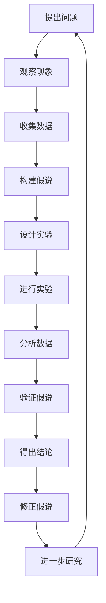

                 

### 文章标题：科学方法论：从假说到验证

科学方法论是研究科学知识的生成、验证和应用的基本原则和方法的学科。本文旨在深入探讨科学方法论的核心概念、原理以及其应用领域，从假说到验证的整个科学探究过程。关键词包括科学方法论、假说、验证、理论、数学模型等。本文摘要将简要介绍科学方法论的定义、意义及其应用，为后续详细探讨奠定基础。

### 摘要

科学方法论是一种系统化的研究方法，它指导我们如何从观察中提出假说，通过实验和数据分析来验证这些假说，并最终形成科学理论。本文首先概述科学方法论的定义和意义，然后详细探讨其基本原则和研究方法。随后，文章将分析科学方法论在不同领域的应用，并展望其发展趋势。重点章节包括科学假说的构建与验证、科学理论的形成与发展、科学方法论中的数学模型及项目实战案例分析。本文旨在为读者提供全面而深入的科学方法论认识，帮助理解科学探究的本质。

### 目录大纲

# 科学方法论：从假说到验证

## 第一部分：科学方法论概述

## 第1章：科学方法论的定义与意义

### 1.1 科学方法论的定义

### 1.2 科学方法论的意义

## 第2章：科学方法论的基本原则

### 2.1 客观性原则

### 2.2 系统性原则

### 2.3 可验证性原则

## 第3章：科学方法论的研究方法

### 3.1 观察与实验

### 3.2 分析与综合

### 3.3 理论模型建立

## 第4章：科学方法论的应用领域

### 4.1 自然科学领域

### 4.2 社会科学领域

### 4.3 技术科学领域

## 第5章：科学方法论的发展趋势

### 5.1 科学方法论的发展历程

### 5.2 当代科学方法论的新特点

### 5.3 未来科学方法论的发展方向

## 第二部分：科学方法论的核心概念与联系

## 第6章：科学假说的构建与验证

### 6.1 科学假说的定义

### 6.2 科学假说的构建原则

### 6.3 科学假说的验证方法

### 6.4 Mermaid流程图：科学假说的构建与验证过程

## 第7章：科学理论的形成与发展

### 7.1 科学理论的概念

### 7.2 科学理论的构建方法

### 7.3 科学理论的发展过程

### 7.4 科学理论的评价标准

## 第8章：科学方法论中的数学模型

### 8.1 数学模型在科学方法论中的应用

### 8.2 常见数学模型介绍

### 8.3 数学模型的应用实例

## 第9章：科学方法论中的数学公式

### 9.1 常见数学公式介绍

### 9.2 数学公式的推导与应用

### 9.3 数学公式在科学方法论中的具体应用

## 第三部分：科学方法论的项目实战

## 第10章：科学方法论在自然领域的应用

### 10.1 项目背景

### 10.2 研究方法

### 10.3 结果与讨论

### 10.4 结论

## 第11章：科学方法论在社会科学领域的应用

### 11.1 项目背景

### 11.2 研究方法

### 11.3 结果与讨论

### 11.4 结论

## 第12章：科学方法论在技术科学领域的应用

### 12.1 项目背景

### 12.2 研究方法

### 12.3 结果与讨论

### 12.4 结论

## 附录

### 附录 A：科学方法论相关的参考资料

### 附录 B：科学方法论相关的研究工具

### 附录 C：科学方法论相关的案例研究

### 1.1 科学方法论的定义

科学方法论是指运用科学方法进行知识发现和验证的过程，它包含了从观察、假设、实验验证到理论构建和理论应用的一系列步骤。科学方法论不仅仅是一种工具，更是一种思维方式，它要求我们以系统化和可验证的方式来探究世界。

首先，科学方法论的核心在于“科学方法”。科学方法通常包括以下几个步骤：

1. **观察和问题提出**：通过观察自然现象或实验现象，识别问题并提出科学问题。
2. **假说构建**：根据已有知识和观察结果，提出一个可能的解释或假说。
3. **实验设计**：设计实验来验证假说，确保实验结果能够反映假设的真实性。
4. **数据收集和分析**：通过实验获取数据，并对这些数据进行统计和分析。
5. **理论构建**：根据实验结果和数据分析，构建理论模型。
6. **理论验证和应用**：通过更多的实验或观察来验证理论，并最终将理论应用于实际问题中。

其次，科学方法论不仅仅是自然科学的研究方法，它也适用于社会科学和技术科学。科学方法论在社会科学中的应用主要体现在对社会现象的研究中，通过数据分析来揭示社会规律；在技术科学中，科学方法论则被用来指导技术创新和工程实践。

总的来说，科学方法论的定义可以概括为：通过系统化的观察、假设、实验验证和理论构建，探究自然现象和社会现象，以发现和验证科学知识的方法。它不仅是一种研究工具，更是一种思维方式，指导我们以科学的方式认识世界。通过科学方法论，我们可以从大量的现象中提取出本质规律，从而构建科学理论，为人类的进步和发展提供理论支持和实践指导。

### 1.2 科学方法论的意义

科学方法论的意义在于它为我们的科学研究提供了一个系统化的框架，确保科学知识的生成和验证过程是科学和可靠的。以下是科学方法论在各个方面的具体意义：

首先，科学方法论有助于提高科学研究的效率。通过科学方法论，研究者可以明确研究的方向和方法，避免盲目性和重复性研究，从而节省时间和资源。科学方法论强调从观察和问题出发，通过假设和实验设计来逐步验证，这一过程确保了研究过程的高效性和科学性。

其次，科学方法论有助于确保科学研究的客观性和可靠性。科学方法论的基本原则，如客观性原则和可验证性原则，要求研究者在研究中保持客观，不受主观偏见的影响。通过实验设计和数据分析，研究者可以验证假设的真实性，从而确保研究成果的可靠性。这种可验证性使得科学知识具有普遍性和可传播性。

第三，科学方法论促进了科学知识的积累和传播。科学方法论强调从观察和实验出发，通过理论构建和验证，形成科学理论，并将其应用于实际问题中。这种过程使得科学知识得以不断积累和更新，推动了科学的进步。同时，科学方法论使得科学知识具有明确的表达方式和传播途径，促进了科学知识的传播和普及。

第四，科学方法论在技术创新中起着关键作用。科学方法论为技术创新提供了理论指导和方法支持，帮助研究者从理论模型中推导出技术方案，并通过实验验证其可行性。在工程实践中，科学方法论的应用使得技术创新更加科学和可靠，推动了技术的不断进步。

最后，科学方法论对于解决复杂问题具有重要意义。在现代社会，许多问题具有跨学科和复杂性的特点，单纯依靠某一学科的知识和方法往往难以解决。科学方法论通过跨学科的方法和系统化的研究过程，可以帮助研究者从不同角度和层面来理解和解决这些问题，提高解决问题的综合能力。

综上所述，科学方法论在科学研究、技术创新、知识传播和复杂问题解决等方面具有重要意义。它不仅提高了科学研究的效率和质量，还确保了科学知识的可靠性和传播性，为人类社会的进步和发展提供了强大的理论支持和方法指导。

### 2.1 客观性原则

科学方法论中的客观性原则是确保科学研究过程和结果不受主观偏见影响的重要基础。客观性原则要求研究者在进行科学探究时，应当采取一系列措施和方法，以保证研究过程的真实性和可靠性。

首先，客观性原则强调研究者应当保持中立和客观的态度。研究者不应该带有任何预设立场或偏见，而是应当从观察和实验数据出发，通过科学的方法和逻辑推理，得出客观的结论。这需要研究者具备高度的职业道德和科学素养，坚持科学精神。

其次，科学方法论中客观性原则的实施需要依赖于严格的实验设计和数据分析。实验设计应当确保所有实验条件的一致性，以排除外部因素的干扰。例如，在实验中应当严格控制变量，只改变与研究假设相关的因素，确保实验结果的准确性。同时，数据分析也应当采用科学的统计方法，通过大量数据验证假设的真实性。

第三，科学方法论中的客观性原则还强调数据的透明性和可重复性。研究数据应当详尽记录，并在研究报告中公开，以供其他研究者验证和检验。数据的可重复性是科学探究的重要原则之一，它要求在不同时间和条件下，其他研究者能够通过相同的实验设计和数据分析，得到相同或相似的结果。这有助于确保科学研究的可靠性和科学性。

此外，客观性原则还要求研究者避免选择性报告结果。在科学研究中，研究者可能会遇到实验数据的不一致或难以解释的现象。面对这种情况，研究者应当全面、客观地报告所有实验数据，而不是仅报告符合预期或有利于假设验证的数据。这样做的目的是为了保证科学研究的真实性和完整性。

最后，科学方法论中的客观性原则还涉及到对研究结果的批评和反思。科学知识的发展是一个不断迭代和修正的过程，研究者应当欢迎和接受其他研究者的批评和建议，通过对研究结果的不断反思和修正，提高科学研究的质量和深度。

总之，客观性原则是科学方法论中的重要基础，它要求研究者在整个科学探究过程中，始终保持中立和客观的态度，通过严格的实验设计和数据分析，确保研究结果的可靠性和真实性。这不仅有助于提高科学研究的质量，也为科学知识的积累和传播提供了可靠保障。

### 2.2 系统性原则

科学方法论中的系统性原则要求研究者从整体角度出发，全面、综合地分析和处理科学问题。系统性原则强调研究不应仅关注单一因素或局部现象，而是应考虑整个系统及其各部分之间的相互作用和影响。

首先，系统性原则要求研究者明确研究对象的全貌，把握其内在结构和功能。在自然科学领域，这体现在对生态系统、生物群落等复杂系统的分析中；在社会科学领域，则是对社会结构、文化体系等整体性的考量。通过系统性分析，研究者能够更好地理解问题背后的深层次机制和影响因素。

其次，系统性原则要求研究者采用多学科交叉的方法进行综合研究。科学问题往往涉及多个学科领域，单一学科的方法难以全面揭示问题的本质。例如，在环境科学中，研究者需要结合生态学、化学、物理学等学科的知识，综合分析环境污染问题；在医学研究中，分子生物学、遗传学、临床医学等多学科的交叉应用是推动医学进步的关键。

第三，系统性原则强调动态视角。科学研究不仅要分析静态的结构和状态，还要关注系统的动态变化和演化过程。例如，在经济学研究中，研究者不仅要分析市场均衡状态，还要研究市场波动和危机的动态演变。这种动态视角有助于捕捉系统在不同条件下的行为模式，为制定有效的政策提供依据。

此外，系统性原则还要求在研究中考虑系统和环境之间的相互作用。任何系统都不是孤立存在的，它与环境相互影响、相互制约。在工程领域，这体现在系统设计和运行过程中对环境因素的考量，如在建筑学中考虑建筑与周围环境的和谐共存。

最后，系统性原则强调结果的集成和应用。通过多角度、多层次的系统性研究，研究者应将研究结果进行整合，形成对问题的全面理解。这种集成不仅有助于深化对科学问题的认识，也为实际应用提供了全面的理论基础和实践指导。

总之，科学方法论中的系统性原则要求研究者从整体、动态和多学科的角度进行分析，通过系统性思维和方法，提升科学研究的深度和广度，为解决复杂科学问题提供强有力的理论支持和实践方法。

### 2.3 可验证性原则

科学方法论中的可验证性原则是确保科学研究成果可靠性和有效性的关键。这一原则强调科学研究必须通过实验或观察手段来验证假说，确保结论具有可重复性和普遍性。

首先，可验证性原则要求假说必须具备可测试性。科学假说应当能够通过实验或观察来进行验证，这意味着假说必须具备可操作性。例如，在物理学中，牛顿的运动定律可以通过实验室的物理实验来验证；在生物学中，达尔文的进化论可以通过化石记录和生物观测来证实。

其次，科学研究的可验证性原则强调实验设计的严密性。实验设计应当确保变量控制得当，避免外部因素的干扰。例如，在心理学研究中，通过随机分配实验组和对照组，可以减少偏差，提高实验结果的可靠性。此外，实验过程应当详细记录，确保数据的准确性和完整性，便于其他研究者重复实验。

第三，科学方法论中的可验证性原则要求对实验结果进行严格的统计分析和验证。通过科学的数据分析方法，如t检验、方差分析等，研究者可以评估实验结果是否显著，从而判断假说的有效性。这种数据分析不仅能够揭示变量之间的关系，还能够识别潜在的错误或偏差。

此外，科学研究的可验证性还需要考虑结果的重复性。任何科学结论都必须在相同或相似的条件下，能够被其他研究者重复验证。这种重复性验证是科学知识积累和传播的重要保障。例如，医学研究中的临床试验需要在多个不同的人群中进行重复验证，以确保证据的普遍性和适用性。

最后，科学方法论中的可验证性原则还要求研究者对实验结果进行公开和透明报告。研究过程和结果应当公开，以供其他研究者审核和评估。这种开放性和透明性有助于提高科学研究的质量，促进科学知识的共享和进步。

总之，可验证性原则是科学方法论的核心要素之一，它通过严格的实验设计和数据分析，确保科学研究成果的真实性和可靠性。这一原则不仅提升了科学研究的科学性，也为科学知识的积累和应用提供了坚实基础。

### 3.1 观察与实验

观察与实验是科学方法论中最基本的两个研究方法，它们共同构成了科学探究的基础。观察是指通过感官或科学仪器对自然现象进行记录和描述，而实验则是通过人为控制变量来验证假设或发现新现象。

首先，观察在科学研究中起着至关重要的作用。通过观察，科学家可以捕捉到自然现象的细节和变化，从而提出科学问题。例如，伽利略通过观察天体运动，提出了关于地球绕太阳旋转的假设。观察不仅提供了丰富的数据来源，还为实验设计提供了方向和依据。科学的进步往往依赖于对自然现象的深刻观察和系统记录。

其次，实验是科学研究中验证假设和理论的重要手段。通过实验，科学家可以在受控条件下观察变量之间的关系，从而验证或推翻某一假设。例如，莫扎特效应的实验研究通过控制音乐训练和其他变量，揭示了音乐训练对认知能力的影响。实验的设计和实施需要严谨的科学研究方法和科学伦理规范，以确保结果的可靠性和有效性。

观察与实验之间存在密切的关联。观察为实验提供了基础数据和假设，而实验则通过具体的操作和验证，进一步验证或修正观察所得的结论。例如，在生物学研究中，通过观察不同环境下的植物生长情况，可以提出关于环境因素对植物生长影响的假设，随后通过实验设计，控制变量并重复实验，以验证或修正这一假设。

此外，观察与实验在实际应用中也相互补充。在自然科学中，观察常用于初步探索和发现现象，而实验则用于验证和深入研究。例如，在环境科学研究中，通过对大气污染物浓度的长期观察，可以初步了解污染物的变化趋势，而通过实验研究，则可以深入分析污染物对人体健康的具体影响机制。

总之，观察与实验是科学方法论中最基本的研究方法，它们共同构成了科学探究的基石。观察提供了数据和假设，而实验则通过验证和验证，推动了科学知识的积累和进步。两者相辅相成，共同推动了科学的发展。

### 3.2 分析与综合

分析与综合是科学方法论中不可或缺的两个步骤，它们在科学探究过程中发挥着关键作用。分析是指将复杂现象或系统分解为更简单的组成部分，以便深入理解和研究每个部分的功能和特性；而综合则是将这些分解的部分重新组合，以理解整体现象或系统的行为。

首先，分析在科学研究中具有重要意义。通过分析，科学家可以将复杂的自然现象分解为多个可操作的变量或因素，从而更精确地研究每个部分的作用。例如，在物理学中，通过将复杂的物理现象分解为力、运动、能量等基本要素，科学家可以更好地理解物理定律和机制。在医学研究中，通过分析疾病的具体症状和生理机制，科学家可以更准确地诊断和治疗方法。

其次，分析有助于发现新的科学问题和假设。通过对已知现象的深入分析，科学家可以发现新的关联和规律，从而提出新的科学问题或假设。例如，在化学研究中，通过对物质结构和反应机制的分析，科学家可以提出新的化学反应路径或新材料设计。这种分析不仅推动了现有科学理论的完善，也为新的科学突破提供了方向。

综合是科学探究中的另一个关键步骤。通过综合，科学家将分析所得的各个部分重新组合，以理解整体现象或系统的行为。综合不仅有助于验证和分析的结论，还可以揭示整体现象的复杂性和相互作用。例如，在生态学研究中，通过综合不同生物种群之间的相互作用和生态关系，科学家可以理解生态系统的稳定性和变化规律。

此外，综合有助于理论构建和模型建立。在科学研究中，通过综合分析结果，科学家可以构建理论模型，以解释整体现象或系统的行为。例如，在经济学中，通过综合不同经济指标和变量，经济学家可以建立宏观经济模型，预测经济趋势和制定政策。这种综合不仅为科学研究提供了理论框架，也为实际应用提供了指导。

总之，分析与综合是科学方法论中相辅相成的步骤。分析通过分解复杂现象，揭示了各个部分的作用和关系；而综合则通过重新组合这些部分，理解整体现象或系统的行为。两者共同推动了科学知识的积累和进步，为人类认识和理解世界提供了强有力的工具。

### 3.3 理论模型建立

理论模型的建立是科学方法论中的关键步骤，它通过对实验数据和观察结果进行抽象和概括，构建出能够解释和预测自然现象的模型。理论模型的建立过程包括几个关键环节，从数据收集、假设提出，到模型构建和验证。

首先，理论模型的建立始于数据收集。科学家通过观察和实验，收集大量与研究对象相关的数据。这些数据可以是定量的，如物理测量值；也可以是定性的，如实验观察结果。数据收集的过程需要确保数据的准确性和完整性，以避免对后续模型构建和验证产生误导。

接下来，科学家根据收集到的数据，提出初步的假设。这些假设通常是对现象的一种初步解释，可能基于已有的理论或观察结果。假设的提出需要结合科学背景和经验，同时具有可验证性，即通过实验或进一步观察，可以对其进行验证或推翻。

一旦假设提出，科学家将开始构建理论模型。这一过程涉及对假设进行数学或逻辑表达，构建出能够描述现象的数学方程或逻辑结构。例如，在物理学中，牛顿的运动定律可以用一组数学方程来描述物体的运动；在经济学中，供求模型可以用供求曲线来表示市场状态。理论模型的构建需要具备高度的抽象能力和逻辑推理能力，以确保模型能够准确反映现象的本质。

理论模型构建完成后，科学家需要通过实验或观察来验证模型的正确性。验证过程通常包括多个步骤，首先是对模型的基本假设进行验证，然后是通过对模型预测结果与实际观察结果进行比较，评估模型的精度和适用性。例如，在生物学研究中，科学家可以通过实验验证基因突变对生物体的影响，并使用模型预测突变后的生物体特征。这种验证不仅有助于确定模型的准确性，还可以发现模型中可能存在的缺陷或不足。

在验证过程中，科学家可能会对模型进行修正和改进。这可能是由于实验结果与模型预测存在差异，或基于对现有理论的新理解。通过不断的修正和验证，理论模型可以逐步完善，更准确地反映自然现象。

最后，理论模型的建立和验证是科学方法论中的重要环节，它不仅为科学探究提供了理论框架，也为实际应用提供了预测和指导。理论模型的建立过程体现了科学方法的系统性和科学性，推动了科学知识的不断积累和进步。

总之，理论模型的建立过程包括数据收集、假设提出、模型构建和验证等多个步骤，通过这一过程，科学家能够从实验和观察中发现自然现象的规律，构建出能够解释和预测现象的理论模型。这一过程不仅提升了科学研究的深度和广度，也为科学知识的传播和应用提供了坚实基础。

### 4.1 自然科学领域

科学方法论在自然科学领域中的应用具有广泛而深远的影响，从基础理论研究到技术创新，无不体现其核心价值和作用。以下详细探讨科学方法论在自然科学中的具体应用。

首先，科学方法论在物理学中的应用尤为突出。物理学通过实验和数学模型，揭示了自然界的运动规律和基本原理。例如，牛顿的经典力学通过实验验证了物体运动的三大定律，构建了经典力学体系。爱因斯坦的相对论则通过复杂的数学模型，揭示了时空的相对性和能量-质量等价原理。这些理论模型的建立和应用，不仅推动了物理学的发展，也为天体物理学、粒子物理学等分支学科提供了基础。

其次，生物学中的科学方法论同样至关重要。通过实验和观察，生物学家揭示了生命的奥秘和进化规律。达尔文的进化论通过大量物种观察和化石记录，提出了自然选择和适者生存的基本原理。现代生物学则通过分子生物学、遗传学等学科的方法，深入研究了基因、蛋白质等生物大分子的结构和功能，揭示了生命的基本机制。例如，基因编辑技术CRISPR-Cas9的诞生，便是科学方法论在生物技术领域的成功应用，为医学、农业等领域带来了革命性的变化。

化学也是科学方法论的重要应用领域。化学通过实验和理论模型，揭示了物质的性质、结构和变化规律。从原子理论到分子轨道理论，化学家通过不断的实验和数学建模，构建了完整的化学理论体系。这些理论不仅解释了化学现象，也为新材料的设计和合成提供了指导。例如，超导材料的研究就是通过科学方法论，从理论模型出发，通过实验验证，实现了超导现象的应用，推动了高科技领域的发展。

此外，地球科学、环境科学等领域的科学方法论应用也具有重要意义。地球科学家通过地质观察、地球物理实验和气候模型，揭示了地球系统的演化过程和气候变化规律。环境科学家通过环境监测、数据分析，评估人类活动对环境的影响，并提出解决方案。例如，通过科学方法论，科学家揭示了温室气体排放对气候变化的影响，推动了全球气候变化研究的发展。

最后，科学方法论在自然科学中的应用还体现在跨学科研究中。现代科学问题往往具有复杂性和综合性，单一学科的方法难以解决。通过科学方法论，不同学科可以交叉融合，共同研究复杂问题。例如，在气候变化研究中，物理学家、生物学家、化学家和工程师共同合作，通过综合方法研究气候变化的机制和解决方案。

总之，科学方法论在自然科学领域中的应用，不仅推动了学科内部的进步，也促进了跨学科的合作与创新。通过严格的实验和理论模型，科学家揭示了自然界的奥秘，为人类认识世界和改善生活提供了强有力的理论支持和实践指导。

### 4.2 社会科学领域

科学方法论在社会科学领域中的应用同样广泛而深远，它为研究社会现象、揭示社会规律、指导社会发展提供了系统的方法和框架。以下详细探讨科学方法论在社会科学中的应用及其重要性。

首先，科学方法论在社会学中的应用尤为重要。社会学研究通过观察和实验，分析社会结构、社会行为和社会问题。例如，通过问卷调查和实地观察，社会学家揭示了社会分层、社会流动和社会互动的规律。科学方法论的应用使得社会学研究更加严谨和科学，促进了社会学理论的不断发展和完善。例如，帕森斯的“结构功能主义”理论通过严谨的实证研究，揭示了社会系统内部各部分之间的相互作用和依赖关系。

其次，心理学中的科学方法论发挥着关键作用。心理学家通过实验和观察，研究人类行为、认知和情感。例如，通过实验室实验，心理学家揭示了记忆、学习、动机等心理过程的基本机制。科学方法论的应用使得心理学研究更加规范和系统，推动了心理学理论的进步和应用。例如，认知心理学通过实验研究，揭示了人类思维和决策过程的复杂性，为人工智能和认知科学的发展提供了理论基础。

政治学也是科学方法论的重要应用领域。政治学家通过数据分析和模型构建，研究政治制度、政治行为和政治决策。例如，通过统计分析和模型模拟，政治学家揭示了选举行为、政策制定和公共选择中的规律。科学方法论的应用使得政治学研究更加实证化和科学化，为民主政治的发展和改进提供了指导。例如，行为政治学通过实验和问卷调查，研究了选民的行为和心理，为选举策略和政治营销提供了科学依据。

此外，经济学中的科学方法论应用同样广泛。经济学家通过数据分析、模型构建和实验研究，研究市场经济、经济增长和资源配置。例如，通过实验经济学方法，经济学家揭示了市场机制中的行为规律和策略选择。科学方法论的应用使得经济学研究更加严谨和科学，推动了经济学理论的进步和应用。例如，行为经济学通过实验研究，揭示了人类在市场经济中的非理性行为，为传统经济学理论提供了新的视角和解释。

最后，科学方法论在社会科学中的跨学科应用也具有重要意义。现代社会科学问题往往涉及多个领域，单一学科的方法难以解决。通过科学方法论，不同学科可以交叉融合，共同研究复杂问题。例如，在社会政策研究中，社会学家、心理学家、经济学家和政策分析家可以共同合作，通过综合方法研究社会问题，提出有效的政策建议。

总之，科学方法论在社会科学领域中的应用，不仅提升了研究的科学性和系统性，也为社会规律的揭示和社会问题的解决提供了有力支持。通过严格的观察、实验和理论模型，科学家和社会研究者能够更好地理解社会现象，推动社会科学的发展和社会进步。

### 4.3 技术科学领域

科学方法论在技术科学领域的应用是其推动技术创新和工程实践的重要驱动力。技术科学包括了许多领域，如计算机科学、工程学、材料科学等，这些领域中的研究往往需要高度系统化和规范化的方法来确保创新成果的有效性和实用性。

首先，科学方法论在计算机科学中的应用至关重要。计算机科学的研究通常从问题定义、算法设计、软件实现等多个环节展开。科学方法论为这些环节提供了指导原则，确保研究的每一步都是科学和可行的。例如，在算法设计中，通过理论分析和实验验证，可以评估算法的效率和正确性。在软件实现过程中，科学方法论强调需求分析、系统设计、编码实现和测试等步骤的系统性和规范性，以避免开发过程中的偏差和错误。

其次，工程学中的科学方法论应用同样显著。工程师在进行工程设计时，需要通过实验和模拟来验证设计方案的可行性和性能。科学方法论的应用使得工程师能够系统地分析和解决复杂工程问题。例如，在结构工程中，通过实验和有限元分析，工程师可以验证建筑结构的稳定性和安全性；在电子工程中，通过电路模拟和实际测试，工程师可以确保电子设备的功能和性能。

材料科学中的科学方法论应用也是技术进步的重要推动力。材料科学家通过实验和理论模型，研究材料的性质、结构、制备工艺和应用。科学方法论的应用使得材料科学家能够系统地探索新材料的合成方法，并评估其在实际应用中的性能。例如，在纳米材料研究中，通过实验和理论计算，科学家可以深入理解纳米材料的电子特性和光学特性，为新型材料的设计和应用提供理论支持。

此外，科学方法论在技术科学中的跨学科应用也日益重要。现代技术问题往往涉及多个学科，单一学科的方法难以解决。通过科学方法论，不同学科可以交叉融合，共同研究复杂技术问题。例如，在人工智能研究中，计算机科学家、数学家、认知科学家共同合作，通过综合方法开发智能算法和应用，推动了人工智能技术的发展。

总之，科学方法论在技术科学领域的应用，不仅为技术创新和工程实践提供了科学和系统的方法，也推动了技术进步和工程质量的提升。通过严格的观察、实验和理论模型，科学家和工程师能够更好地理解和解决技术问题，为人类社会的持续发展和进步提供了强大支持。

### 5.1 科学方法论的发展历程

科学方法论的发展历程是一个漫长而复杂的过程，它伴随着科学知识的积累和科技进步的不断演进。以下是科学方法论发展的几个关键阶段：

首先，古代科学方法论可以追溯到古希腊时期。亚里士多德是古代科学方法论的重要代表人物，他提出了观察和实验是科学探究的基础。亚里士多德的方法论强调从观察中提取规律，并通过逻辑推理来解释自然现象。这一思想奠定了科学方法论的基础。

其次，中世纪的科学方法论主要受到宗教和哲学的影响，科学研究往往局限于神学和哲学领域。然而，在文艺复兴时期，科学方法论开始逐渐摆脱宗教和哲学的束缚，科学家们开始更加注重实证研究和实验验证。伽利略·伽利莱通过实验验证了自由落体定律，为科学方法论的发展提供了新的方向。

第三，19世纪初，以查尔斯·达尔文为代表的生物学家提出了进化论，这标志着科学方法论进入了一个新的阶段。达尔文的进化论通过大量的观察和实验证据，揭示了生物进化的规律，使得科学方法论在生物学领域取得了重要进展。这一时期，科学方法论逐渐形成了一套系统的原则和方法，如观察、实验、假设、验证等。

第四，20世纪初，物理学中的量子力学和相对论的诞生，标志着科学方法论在理论构建方面取得了重大突破。爱因斯坦的相对论通过数学模型揭示了时空的本质，为科学方法论提供了新的工具和视角。这一时期的科学方法论更加注重数学模型和理论分析，推动了物理学和天文学的发展。

第五，20世纪中叶，计算机科学和信息技术的发展，使得科学方法论进一步扩展到跨学科领域。通过计算机模拟和大数据分析，科学家能够处理和分析大量复杂的数据，为科学探究提供了新的手段和方法。这一时期，科学方法论开始与人工智能、数据科学等新兴领域相结合，形成了现代科学方法论。

总之，科学方法论的发展历程从古代到现代，经历了多个重要阶段，每个阶段都为科学知识的积累和科技进步做出了巨大贡献。通过不断的创新和改进，科学方法论成为推动科学进步和社会发展的重要工具。

### 5.2 当代科学方法论的新特点

当代科学方法论的新特点主要体现在以下几个方面，这些特点不仅丰富了科学研究的手段，也提升了科学探究的深度和广度。

首先，跨学科研究成为当代科学方法论的重要特征。随着科学技术的进步，许多问题具有复杂性和跨学科的特点，单一学科的方法难以解决。跨学科研究通过整合不同领域的知识和方法，形成综合性的研究视角，从而更全面地揭示问题的本质。例如，在气候变化研究中，物理学家、化学家、生态学家和地理学家共同合作，通过多学科的交叉研究，提出了更准确的气候预测模型。

其次，大数据分析在科学方法论中占据了重要地位。随着信息技术的飞速发展，科学家可以收集和存储大量的数据。大数据分析技术使得科学家能够从海量数据中提取有价值的信息，发现新的规律和模式。例如，在医学研究中，通过大数据分析，科学家可以识别疾病的风险因素，开发更有效的治疗方法。

第三，计算机模拟和模拟实验成为科学方法论的重要组成部分。通过计算机模拟，科学家可以在虚拟环境中重现复杂的自然现象，从而减少实际实验的成本和风险。例如，在材料科学中，通过计算机模拟，科学家可以预测新材料的性能，指导材料的设计和制造。

第四，科学方法论强调开放性和透明性。科学研究的结果和数据应当公开，以便其他研究者验证和评估。这促进了科学知识的共享和合作，提高了科学研究的质量和效率。例如，许多科学期刊和数据库已经实行了开放获取政策，使得科研成果能够更广泛地传播和应用。

最后，科学方法论还注重可持续性和环境友好性。在现代社会，科学研究的责任不仅仅是解决科学问题，还包括保护环境和促进可持续发展。科学方法论强调在研究中考虑环境和社会因素，提出具有可持续性的解决方案。例如，在环境科学研究中，科学家通过分析环境影响，提出减少污染和资源浪费的策略。

总之，当代科学方法论的新特点为科学研究提供了更丰富和多样的手段和方法，推动了科学知识的不断积累和科技进步。跨学科研究、大数据分析、计算机模拟、开放性和可持续性等新特点，不仅提升了科学研究的深度和广度，也为解决复杂科学问题提供了强有力的支持。

### 5.3 未来科学方法论的发展方向

未来科学方法论的发展方向将继续受到科技进步和社会需求的双重驱动，呈现出几个显著的趋势。首先，人工智能（AI）技术的日益成熟将深刻影响科学方法论。AI不仅能处理和分析大量数据，还能通过机器学习算法自动识别复杂模式，从而提升科学研究的效率和准确性。例如，在医学研究中，AI可以帮助医生从医疗影像中快速识别疾病，提高诊断的精准度。

其次，量子计算的发展将为科学方法论带来革命性的变化。量子计算具有并行计算和处理复杂问题的能力，可以大幅提升计算速度和效率。未来，量子计算可能用于解决现有计算机难以处理的复杂科学问题，如大规模数据模拟和复杂系统建模。例如，在材料科学中，量子计算可以预测新材料的电子结构和性能，为新材料的设计提供强大支持。

第三，可持续性和环境友好性将继续是科学方法论的重要发展方向。随着全球环境问题的加剧，科学家需要更系统和全面地考虑环境和社会因素，提出具有可持续性的解决方案。未来，科学方法论将更加注重生态系统的健康和人类福祉，通过跨学科合作，开发绿色技术和可持续发展的策略。

最后，科学方法论的未来发展还将依赖于全球化合作。面对全球性的挑战，如气候变化、疾病流行和资源短缺，单一国家或地区的科学家难以独立解决。未来的科学方法论将更加注重国际合作，通过共享数据和资源，共同应对全球性科学问题，推动科学进步和社会发展。

总之，未来科学方法论的发展方向将围绕人工智能、量子计算、可持续性和全球化合作等核心主题展开，这些趋势不仅将提升科学研究的深度和广度，也为解决复杂科学问题提供了新的方法和工具。

### 6.1 科学假说的定义

科学假说是科学方法论中一个核心概念，它是指对自然现象或问题的初步解释，通常基于已有知识和观察结果，但尚未经过严格验证。科学假说在科学探究过程中起着至关重要的作用，它既是科学发现的起点，也是科学理论构建的基石。

首先，科学假说是一种推测性解释。它基于有限的证据和理论背景，对某一现象或问题提出一个可能的解释。这种解释通常是具体的、可操作的和可测试的。例如，在物理学中，牛顿的万有引力定律是一个科学假说，它推测物体之间存在引力作用，这一假说后来通过多种实验验证得到了证实。

其次，科学假说的提出需要一定的科学素养和创新能力。科学假说不仅仅是对现象的描述，而是需要从科学角度对现象进行解释。例如，在生物学中，达尔文的进化论假说通过对物种变异和自然选择的观察，提出了物种演化的机制。这一假说的提出不仅需要深入的观察，还需要结合现有的科学理论和知识。

科学假说的特点包括以下几个方面：

1. **推测性**：科学假说是一种推测，它是对现象的可能解释，但尚未得到严格的实验或观察验证。
2. **具体性**：科学假说通常具有具体的操作定义，使得可以通过实验或观察来验证或反驳。
3. **可测试性**：科学假说应当具备可测试性，即通过实验或观察，可以对其进行验证或反驳。
4. **暂时性**：科学假说通常是暂时的，它可能在未来的研究中被推翻或修正，成为更精确的理论。

科学假说的作用主要体现在以下几个方面：

1. **启发新研究**：科学假说可以为科学研究提供方向和目标，指导科学家进行进一步的实验和观察。
2. **构建科学理论**：科学假说是构建科学理论的基础，通过验证和修正，假说可以逐步发展成更广泛、更精确的科学理论。
3. **推动科学进步**：科学假说的提出和验证推动了科学知识的积累和进步，促进了科学理论的不断完善。
4. **应用和指导**：科学假说不仅在基础研究中发挥作用，还可以应用于实际问题中，提供理论支持和解决方案。

总之，科学假说是科学方法论中的一个重要概念，它通过对自然现象或问题的推测性解释，为科学探究提供了起点和方向。科学假说的提出和验证过程不仅推动了科学知识的积累和进步，也为人类认识世界和解决实际问题提供了强有力的工具。

### 6.2 科学假说的构建原则

科学假说的构建是科学方法论中至关重要的一环，其成功与否直接关系到科学研究的方向和深度。以下是科学假说构建的几个关键原则：

首先，科学假说的构建应当基于充分的科学知识和理论背景。科学假说不是凭空产生的，而是基于已有的科学理论和知识，对某一现象或问题进行推测性解释。例如，在生物学中，达尔文的进化论假说基于对物种变异、自然选择和遗传学的理解，通过对这些理论的整合，提出了物种演化的机制。

其次，科学假说的构建需要依赖严谨的观察和实验数据。观察和实验是科学探究的基础，通过这些数据，科学家可以识别现象和问题，提出可能的解释。例如，在物理学中，牛顿的万有引力定律是基于对行星运动和天体物理现象的观察，通过实验验证提出了物体之间引力的存在和规律。

第三，科学假说的构建应具有可测试性和可验证性。科学假说必须能够通过实验或观察进行验证，确保其推测具有科学性和可靠性。例如，在化学中，门捷列夫的元素周期表假说通过预测未发现元素的性质和位置，被后来的实验所验证，从而确立了元素周期律。

第四，科学假说的构建应遵循逻辑性和一致性。科学假说应当具有严密的逻辑结构，能够自洽地解释相关现象，并与其他科学理论相一致。例如，在经济学中，供求定律假说通过解释商品价格与供需关系，形成了完整的市场经济理论框架。

第五，科学假说的构建需要具有创新性和前瞻性。科学假说不仅是对已有知识的总结，更是对未知领域的探索。它应当具有预见性，能够提出新的研究方向和问题。例如，爱因斯坦的相对论假说不仅修正了牛顿力学的局限，还为现代物理学的发展提供了新的视角。

总之，科学假说的构建需要基于充分的科学知识和理论背景，依赖严谨的观察和实验数据，并具有可测试性、可验证性、逻辑性和创新性。这些原则确保了科学假说的科学性和可靠性，为科学探究提供了坚实的基础。

### 6.3 科学假说的验证方法

科学假说的验证是科学方法论中至关重要的一环，它通过实验和观察手段，检验假说的正确性，确保科学研究的可靠性和科学性。以下是科学假说验证的几种主要方法：

首先，实验验证是科学假说验证中最常用和最直接的方法。通过设计严格的实验，科学家可以控制变量，观察假说预测的现象或结果。实验验证的关键在于实验设计的严密性和数据的准确性。例如，在生物学研究中，通过实验验证基因突变对生物体的影响，可以确认假说的正确性。

其次，观察验证是通过直接观察自然现象或实验结果，来检验假说的正确性。观察验证通常依赖于长时间的观察记录和系统的数据分析。例如，在气候学研究中，通过对气候数据的长期观察和统计分析，可以验证关于气候变化趋势的假说。

第三，数学验证是利用数学模型和公式，对科学假说进行定量分析和验证。通过数学验证，科学家可以推导出假说预测的数值结果，并将其与实际观察数据相比较。例如，在物理学中，通过数学模型验证质能等价原理，可以计算出特定条件下的能量转换。

第四，计算机模拟验证是通过计算机模拟技术，再现假说所描述的现象，分析其行为和结果。计算机模拟验证可以模拟复杂系统的动态变化，提供实验难以实现的条件。例如，在环境科学中，通过计算机模拟大气污染的扩散过程，可以验证污染控制措施的有效性。

第五，重复验证是确保科学假说可靠性的重要手段。通过在不同时间和地点，由不同研究者重复相同的实验或观察，可以检验假说的稳定性和普遍性。例如，医学研究中的临床试验，需要在多个受试者群体中重复验证治疗效果。

最后，交叉验证是通过结合不同方法和技术，从多个角度验证假说的正确性。这种方法可以减少单一方法带来的偏差，提高假说的可信度。例如，在化学研究中，通过实验验证和理论计算相结合，可以全面评估新材料的性能。

总之，科学假说的验证方法多样且严谨，包括实验验证、观察验证、数学验证、计算机模拟验证、重复验证和交叉验证等。这些方法确保了科学假说的可靠性和科学性，为科学探究提供了坚实的基础。

### 6.4 Mermaid流程图：科学假说的构建与验证过程

这个Mermaid流程图详细展示了科学假说的构建与验证过程，从提出问题到得出结论，并最终进行假说的修正和进一步的深入研究。通过这一流程，研究者可以系统地推进科学探究，确保研究成果的科学性和可靠性。

### 7.1 科学理论的概念

科学理论是科学方法论中的一个核心概念，它是对自然现象或系统的一种系统化、理论化的解释。科学理论不仅仅是对现象的描述，更是一种通过假设、模型和数学表达，对现象进行深入理解和解释的框架。科学理论的形成是科学探究中一个重要的步骤，它不仅为科学知识的发展提供了基础，也为实际应用提供了理论支持。

科学理论的基本定义包括以下几点：

首先，科学理论是基于科学假说的系统化发展。科学假说是对自然现象的初步解释，而科学理论则是在假说验证和修正的基础上，通过进一步的理论分析和数学建模，形成的系统性和普遍性较强的解释。例如，达尔文的进化论假说通过长期的观察和实验验证，逐渐发展成为现代生物学的进化理论。

其次，科学理论必须具备可验证性和可重复性。这意味着科学理论能够通过实验、观察或其他验证手段，对自然现象进行准确的预测和解释。例如，牛顿的万有引力定律不仅通过理论推导得出，还通过天文观测和实验验证，确保其普遍性和正确性。

第三，科学理论通常包含一系列的假设、原理和数学模型。这些假设和原理构成了理论的基本框架，数学模型则用于定量描述和预测现象。例如，在物理学中，经典力学理论包括牛顿的运动定律和万有引力定律，通过数学公式精确描述了物体的运动和相互作用。

科学理论的形成过程通常包括以下几个步骤：

1. **提出假说**：通过对自然现象的观察和初步分析，提出对现象的可能解释。
2. **实验验证**：设计实验，收集数据，验证假说的正确性。
3. **理论构建**：在假说验证的基础上，通过逻辑推理和数学建模，形成系统化的理论框架。
4. **修正与完善**：根据实验结果和新的观察数据，对理论进行修正和补充，使其更加准确和全面。

科学理论的重要性体现在以下几个方面：

1. **指导科学研究**：科学理论为科学研究提供了明确的方向和方法，帮助科学家更好地理解自然现象，提出新的科学问题。
2. **推动科学进步**：科学理论的形成和不断完善，推动了科学知识的发展，促进了科学技术的进步。
3. **应用与指导**：科学理论在技术、工程、医学等领域具有广泛的应用价值，为解决实际问题提供了理论支持和指导。
4. **哲学意义**：科学理论不仅是对自然现象的解释，也反映了人类对世界的认知和理解，具有重要的哲学意义。

总之，科学理论是科学方法论中的核心概念，它通过对自然现象的系统化解释，推动了科学知识的发展和应用。科学理论的形成过程和重要性，体现了科学方法论在科学研究中的核心作用。

### 7.2 科学理论的构建方法

科学理论的构建是一个系统化和规范化的过程，它包括多个步骤，从假设提出、模型建立到理论验证和修正。以下是科学理论构建的具体方法和步骤：

首先，假设提出是科学理论构建的起点。科学家通过对自然现象的观察和分析，提出对现象的可能解释。这些假设通常是基于已有科学知识、理论背景和初步实验结果。假设应当具有可测试性和可验证性，即可以通过实验或观察手段进行验证。

例如，在物理学中，科学家观察到行星按照特定规律运动，提出了万有引力假设。这一假设通过牛顿的数学推导和天文观测，验证了行星运动的规律。

其次，模型建立是科学理论构建的核心步骤。在假设提出后，科学家通过逻辑推理和数学工具，构建出能够描述自然现象的模型。这些模型可以是定量的数学公式，也可以是定性的描述性框架。模型的目的是通过数学和逻辑手段，将假设转化为具体的预测和解释。

例如，在生物学中，达尔文的进化论假设通过构建种群遗传模型，定量描述了物种演化的过程。这些模型通过实验和观察数据，验证了自然选择和适者生存的机制。

第三，理论验证是通过实验和观察手段，检验科学理论的正确性和有效性。这一步骤至关重要，它确保了科学理论能够准确解释自然现象，并具有可重复性和普遍性。实验验证通常包括设计控制实验、收集数据、统计分析和结果验证。

例如，在医学研究中，科学家通过临床试验验证药物的有效性，通过观察和统计，确定药物对患者的治疗效果。

第四，修正与完善是科学理论构建的最后一个步骤。在理论验证过程中，科学家可能会发现理论与实验结果之间存在偏差或不足。通过修正和补充，科学家可以不断完善理论框架，使其更加准确和全面。

例如，在化学中，道尔顿的原子理论通过实验发现，提出了关于原子质量分布的修正，进一步完善了原子理论。

科学理论的构建方法强调系统性和规范性，从假设提出到模型建立，再到理论验证和修正，每一步都需要严谨的科学态度和逻辑推理。这一过程不仅推动了科学知识的发展，也为技术创新和实际问题解决提供了理论支持。

总之，科学理论的构建方法是一个逐步推进、不断验证和修正的过程。通过严格的科学方法和系统化的研究步骤，科学家能够从假设出发，构建出能够准确描述和解释自然现象的科学理论，为科学进步和社会发展做出贡献。

### 7.3 科学理论的发展过程

科学理论的发展过程是一个动态的、不断迭代的过程，它通常经历提出、验证、修正和完善等几个阶段。每个阶段都有其独特的挑战和机遇，推动了科学理论的不断进步。

首先，科学理论的提出阶段是基于观察和假设的初步构建。科学家通过观察自然现象，提出对现象的可能解释，形成科学假说。这一阶段通常需要创新思维和科学素养，以及对现有科学知识的深刻理解。例如，达尔文在观察到物种的变异和自然选择后，提出了进化论假说，为生物学提供了新的解释框架。

其次，科学理论的验证阶段是通过实验和观察来检验假说的正确性。科学家设计严格的实验，收集数据，通过统计分析等方法，验证假说的预测是否与实验结果一致。这一阶段的关键在于实验设计的严谨性和数据分析的科学性。例如，在物理学中，牛顿的运动定律通过大量的天文观测和实验室实验，得到了广泛的验证。

第三，科学理论的修正阶段是在验证过程中发现的偏差和不足的基础上，对理论进行修正和补充。科学家通过分析实验结果，发现假说或理论中存在的问题，并提出新的假设或修改理论框架。这一过程体现了科学理论的动态性和灵活性。例如，爱因斯坦在发现牛顿力学无法解释高速运动和强引力场下的现象后，提出了相对论理论，对经典力学进行了修正。

第四，科学理论的完善阶段是通过进一步的实验和观察，对理论进行细化和扩展。科学家在修正理论的基础上，进行更多的实验和研究，以验证和细化理论的预测和解释。例如，现代生物学在进化论的基础上，通过分子生物学和遗传学的研究，进一步揭示了物种演化的分子机制。

科学理论的发展过程不仅是一个逐步积累和修正的过程，也是一个不断跨越学科边界的跨学科合作过程。通过不同学科的交叉融合，科学家能够从多个角度和层面理解自然现象，推动科学理论的全面发展。

总之，科学理论的发展过程是一个不断迭代、不断完善的动态过程。从假设提出、验证修正，到完善细化，每个阶段都体现了科学的严谨性和进步性。通过这一过程，科学理论不断更新和扩展，为人类认识世界提供了坚实的基础。

### 7.4 科学理论的评价标准

科学理论的评价标准是衡量理论科学性、准确性和适用性的重要依据。以下是科学理论评价的几个关键标准：

首先，**可验证性**是评价科学理论的基本标准。科学理论必须能够通过实验或观察进行验证，确保其预测与实际结果一致。例如，物理学中的相对论理论通过精确的实验和天文观测得到了验证，从而确立了其科学性。

其次，**一致性**是科学理论评价的重要标准。理论应当与现有的科学知识和其他已验证的理论相一致，避免逻辑矛盾或冲突。例如，生物学中的进化论与遗传学、生态学等领域的理论相一致，构建了一个完整的生物科学框架。

第三，**普遍性**是评价科学理论的重要指标。理论应具备广泛的适用性和普遍性，能够解释不同环境和条件下的现象。例如，物理学中的万有引力定律不仅在地球表面有效，也能解释行星运动。

第四，**简洁性**是科学理论的一个美学标准。简洁的理论通常更易于理解和应用，更能揭示现象的本质。例如，物理学中的质能等价公式 \(E=mc^2\) 虽然简洁，但揭示了能量和物质之间的关系。

第五，**预测能力**是科学理论评价的重要标准。理论应当具备较强的预测能力，能够准确预测新现象和新实验结果。例如，量子力学理论不仅解释了已知现象，还预测了多个未观测到的实验结果。

第六，**适应性**是科学理论在应用中的评价标准。理论应能够适应新的数据和发现，不断修正和扩展，以保持其适用性和生命力。例如，地球科学中的板块构造理论在新的地质发现和技术进步下，不断进行修正和完善。

综上所述，科学理论的评价标准包括可验证性、一致性、普遍性、简洁性、预测能力和适应性。通过这些标准，科学家可以全面评价科学理论的质量，推动科学知识的发展。

### 8.1 数学模型在科学方法论中的应用

数学模型在科学方法论中的应用具有至关重要的作用，它通过数学形式化手段，对自然现象和科学问题进行定量描述和模拟。数学模型不仅为科学理论的构建提供了有力工具，还在实验设计和数据分析过程中发挥了关键作用。

首先，数学模型在理论构建中起到了桥梁作用。它将抽象的自然现象转化为具体的数学表达式，使得科学家能够用数学语言来描述和理解现象。例如，物理学中的经典力学模型通过牛顿运动定律和万有引力定律，将物体的运动和相互作用进行了定量描述，形成了经典力学体系。

其次，数学模型在实验设计过程中提供了指导。通过数学模型，科学家可以预测实验结果，设计更加有效的实验方案。例如，在材料科学中，通过分子动力学模拟，科学家可以预测新材料的物理性质和化学行为，从而优化材料设计。

第三，数学模型在数据分析中起到了关键作用。它通过数学工具和算法，对实验数据进行处理和分析，提取有价值的信息和规律。例如，在统计学中，通过线性回归模型，科学家可以分析变量之间的关系，揭示数据的内在规律。

此外，数学模型还提高了科学理论的预测能力和应用价值。通过数学模型，科学家可以模拟复杂系统的动态变化，预测未来趋势和可能的结果。例如，在经济学中，通过宏观经济模型，经济学家可以预测经济周期和通货膨胀率，为政策制定提供科学依据。

总的来说，数学模型在科学方法论中的应用不仅丰富了科学理论体系，还提升了科学探究的效率和准确性。通过数学模型，科学家能够更深入地理解和解释自然现象，推动科学技术的进步和社会发展。

### 8.2 常见数学模型介绍

在科学方法论中，常见数学模型广泛应用于不同领域，帮助我们理解和预测自然现象和社会现象。以下介绍几种常见的数学模型及其基本原理和用途：

#### 1. 线性回归模型

线性回归模型是一种用于分析两个或多个变量之间线性关系的数学模型。其基本形式为：

\[ y = \beta_0 + \beta_1x_1 + \beta_2x_2 + ... + \beta_nx_n + \epsilon \]

其中，\( y \) 是因变量，\( x_1, x_2, ..., x_n \) 是自变量，\( \beta_0, \beta_1, ..., \beta_n \) 是回归系数，\( \epsilon \) 是误差项。

**用途**：线性回归模型常用于数据分析、预测和决策，如在经济学中用于预测经济增长率，在医学中用于分析药物剂量与疗效之间的关系。

#### 2. 微分方程模型

微分方程模型是描述动态系统变化规律的数学工具。其基本形式为：

\[ \frac{dy}{dx} = f(y, x) \]

或者：

\[ \frac{d^2y}{dx^2} = g(y, x) \]

**用途**：微分方程模型广泛应用于物理学、工程学、生物学等领域，如描述种群动态的Lotka-Volterra方程，描述电路中电流和电压变化的微分方程。

#### 3. 马尔可夫链模型

马尔可夫链模型是一种用于描述系统状态转移的随机过程。其基本形式为：

\[ P(X_{n+1} = i | X_n = j) = p_{ij} \]

**用途**：马尔可夫链模型广泛应用于概率论、统计学和经济学，如描述金融市场波动、人口迁移和社会网络演化。

#### 4. 神经网络模型

神经网络模型是基于生物神经系统的数学模型，用于模拟复杂系统的学习和决策过程。其基本形式为：

\[ y = \sigma(\theta^T x) \]

其中，\( \sigma \) 是激活函数，\( \theta \) 是权重参数，\( x \) 是输入向量。

**用途**：神经网络模型广泛应用于人工智能、机器学习和数据科学，如图像识别、语音识别和自然语言处理。

#### 5. 泊松分布模型

泊松分布模型是一种用于描述事件发生次数的概率分布模型。其基本形式为：

\[ P(X = k) = \frac{e^{-\lambda} \lambda^k}{k!} \]

**用途**：泊松分布模型广泛应用于统计学、金融学和工程学，如描述呼叫中心的呼叫次数、交通流量和保险索赔次数。

这些常见数学模型在科学方法论中具有广泛的应用，通过数学形式化手段，帮助我们深入理解自然现象和社会规律，为科学研究和实际问题解决提供了强有力的工具。

### 8.3 数学模型的应用实例

数学模型在科学方法论中的应用是多方面的，通过具体的实例，我们可以更清晰地看到数学模型如何帮助科学家理解和预测复杂现象。

#### 1. 物理学中的粒子运动模型

以粒子物理学中的粒子运动模型为例，科学家通过构建和求解牛顿运动定律和万有引力定律的数学模型，可以精确预测行星的运动轨迹。例如，开普勒行星运动定律通过描述行星轨道的数学表达式，帮助科学家预测太阳系中行星的位置和运动轨迹。这一模型不仅解释了已知行星的运动，还能预测尚未观测到的行星。例如，通过应用开普勒第三定律，科学家预测了海王星的存在，这展示了数学模型在发现新现象中的强大能力。

#### 2. 生物学中的种群模型

在生物学中，数学模型被广泛应用于种群生态学的研究。以Lotka-Volterra方程为例，这是一个描述两个种群相互作用的数学模型，通过微分方程描述捕食者和猎物的数量变化。该模型假设捕食者的增长速率与猎物数量成正比，而猎物的增长速率与捕食者数量成反比。通过求解这一方程，科学家可以预测两个种群的数量动态，例如，预测某一特定生态系统中的物种数量变化，从而为生态保护和生物多样性管理提供科学依据。

#### 3. 经济学中的宏观经济模型

在经济学中，宏观经济模型用于分析和预测经济行为和趋势。例如，IS-LM模型是一个描述商品市场和货币市场相互作用的数学模型。通过这一模型，经济学家可以预测经济波动，例如通货膨胀率和失业率的变化。例如，在2008年的全球金融危机期间，经济学家通过应用这一模型，分析了金融市场的波动对实体经济的影响，从而为政策制定提供了重要的参考。

#### 4. 人工智能中的神经网络模型

在人工智能领域，神经网络模型被广泛应用于图像识别、语音识别和自然语言处理等领域。以卷积神经网络（CNN）为例，这是一种用于图像识别的数学模型。通过多层神经网络的结构，CNN可以提取图像的层次特征，从而实现高精度的图像分类。例如，在人脸识别系统中，CNN通过训练，可以识别出图像中的人脸，并判断其身份，这在安全监控和身份验证中具有广泛应用。

这些实例展示了数学模型在科学方法论中的广泛应用，从基础科学到应用科学，数学模型为我们理解和预测复杂现象提供了强有力的工具，推动了科学技术的进步和社会发展。

### 9.1 常见数学公式介绍

在科学方法论中，常见的数学公式广泛应用于各个领域，它们是描述自然现象和科学问题的重要工具。以下是几种常见的数学公式及其应用场景：

#### 1. 牛顿第二定律

牛顿第二定律是经典力学中的基础公式，描述了力和加速度之间的关系：

\[ F = ma \]

其中，\( F \) 表示力，\( m \) 表示质量，\( a \) 表示加速度。该公式表明，物体所受合外力等于其质量与加速度的乘积。这个公式广泛应用于物理学、工程学和天文学，如分析行星运动、碰撞现象和机械振动。

#### 2. 能量守恒定律

能量守恒定律是物理学中一个基本原理，表示在一个封闭系统中，能量总量保持不变：

\[ E_{\text{总}} = E_{\text{动}} + E_{\text{势}} \]

其中，\( E_{\text{总}} \) 表示总能量，\( E_{\text{动}} \) 表示动能，\( E_{\text{势}} \) 表示势能。该公式在物理学、化学和地球科学中广泛应用，如分析能量转换、机械能和热能关系。

#### 3. 电磁感应定律

法拉第电磁感应定律描述了电场和磁场之间的转换关系：

\[ \epsilon = -\frac{d\Phi_B}{dt} \]

其中，\( \epsilon \) 表示感应电动势，\( \Phi_B \) 表示磁通量。该公式在电磁学中至关重要，用于描述发电机、变压器和电动机的工作原理。

#### 4. 布朗运动方程

布朗运动方程描述了悬浮粒子在液体或气体中的随机运动：

\[ m \frac{d^2x}{dt^2} = -6\pi \eta r \frac{dv}{dt} \]

其中，\( m \) 表示粒子质量，\( \eta \) 表示流体粘度，\( r \) 表示粒子半径，\( v \) 表示粒子速度。该公式在流体力学和分子物理学中用于分析粒子的随机运动和扩散过程。

#### 5. 概率分布公式

概率分布公式描述了随机变量的概率分布，其中泊松分布是一个重要例子：

\[ P(X = k) = \frac{\lambda^k e^{-\lambda}}{k!} \]

其中，\( X \) 表示随机变量，\( \lambda \) 表示平均值，\( k \) 表示事件发生的次数。该公式在统计学、经济学和生物学中用于分析随机事件的发生概率。

这些常见的数学公式在科学方法论中扮演着重要角色，通过它们，科学家能够量化描述自然现象和科学问题，推动科学研究和实际应用的发展。

### 9.2 数学公式的推导与应用

在科学方法论中，数学公式的推导和应用是理解自然现象和解决科学问题的关键。以下将通过几个典型例子，详细阐述数学公式的推导过程和应用。

#### 1. 牛顿第二定律的推导与应用

牛顿第二定律是经典力学中的一个核心公式，描述了力和加速度之间的关系：

\[ F = ma \]

推导过程：

- **定义**：首先，定义力为物体所受合外力，质量为物体的惯性，加速度为速度变化率。
- **加速度**：根据加速度的定义，\( a = \frac{dv}{dt} \)，其中 \( v \) 是速度，\( t \) 是时间。
- **速度**：速度可以表示为 \( v = \frac{dx}{dt} \)，其中 \( x \) 是位置。
- **积分**：将速度表达式积分，得到 \( x = \int v dt = \int \frac{dx}{dt} dt = x_0 + \int_0^t v dt \)，其中 \( x_0 \) 是初始位置。
- **牛顿第二定律**：根据力的定义，\( F = m\frac{dv}{dt} = m\frac{d^2x}{dt^2} \)。

应用：

- **抛物运动**：在水平方向上，如果没有其他力作用，物体将保持匀速直线运动。在垂直方向上，由于重力作用，物体将做匀加速直线运动。结合两个方向的运动，可以推导出抛物运动的轨迹方程。

#### 2. 概率分布公式的推导与应用

以泊松分布为例，该公式描述了在单位时间内，某一事件发生的次数服从泊松分布：

\[ P(X = k) = \frac{\lambda^k e^{-\lambda}}{k!} \]

推导过程：

- **定义**：泊松分布描述了随机事件在固定时间或空间内发生的次数。
- **概率质量函数**：定义事件在时间或空间中的概率质量函数为 \( P(X = k) \)，其中 \( \lambda \) 是事件平均发生率。
- **二项分布**：泊松分布是二项分布的极限形式，当 \( n \)（试验次数）趋于无穷大，且 \( p \)（每次试验事件发生的概率）趋近于0，同时 \( np \)（事件总数）保持不变时。
- **推导**：通过数学推导，可以得到泊松分布的公式。

应用：

- **交通流量分析**：在交通工程中，泊松分布用于预测道路上的车辆流量，帮助交通规划和管理。
- **事件发生概率**：在金融市场中，泊松分布用于分析市场波动和事件发生的概率，如交易次数和交易额的分布。

#### 3. 能量守恒定律的推导与应用

能量守恒定律是一个基本的物理原理，表示在一个封闭系统中，能量总量保持不变：

\[ E_{\text{总}} = E_{\text{动}} + E_{\text{势}} \]

推导过程：

- **定义**：能量可以分为动能（\( E_{\text{动}} \)）和势能（\( E_{\text{势}} \)）。
- **动能**：动能定义为 \( E_{\text{动}} = \frac{1}{2}mv^2 \)，其中 \( m \) 是质量，\( v \) 是速度。
- **势能**：势能通常与位置有关，例如重力势能 \( E_{\text{势}} = mgh \)，其中 \( g \) 是重力加速度，\( h \) 是高度。
- **守恒**：在没有外力做功的系统中，能量总量保持不变。

应用：

- **机械能分析**：在工程设计和机械系统中，能量守恒定律用于分析机械能的转换和消耗，确保系统的能量平衡。
- **热力学过程**：在热力学中，能量守恒定律用于分析热能转换和热力学循环，如卡诺循环和制冷循环。

通过这些数学公式的推导和应用，科学家能够更好地理解自然现象和科学问题，推动科学研究和实际应用的发展。数学公式不仅是科学理论的基础，也是科学探究的重要工具。

### 9.3 数学公式在科学方法论中的具体应用

数学公式在科学方法论中的应用是广泛而深入的，它们为科学家提供了量化描述自然现象和解决复杂问题的重要工具。以下是几个具体的例子，展示数学公式在科学方法论中的实际应用：

#### 1. 经典力学中的牛顿运动定律

在经典力学中，牛顿的第二定律 \( F = ma \) 是一个核心公式。它用于描述物体在受力作用下的加速度。例如，在研究行星运动时，科学家通过该公式计算出行星绕太阳运行的轨道。这一公式不仅帮助我们理解了行星的轨道运动规律，还应用于航天工程中，指导卫星发射和轨道计算。

具体应用案例：

- **航天工程**：在设计火箭发射时，工程师使用牛顿第二定律计算火箭所需的推力和加速度，以确保火箭能够脱离地球引力进入预定轨道。
- **碰撞分析**：在交通安全研究中，通过牛顿第二定律计算车辆在碰撞中的加速度，从而评估碰撞的冲击力和对乘客的安全影响。

#### 2. 电磁学中的法拉第电磁感应定律

法拉第电磁感应定律 \( \epsilon = -\frac{d\Phi_B}{dt} \) 描述了电场和磁场之间的关系。这一公式在发电、电动机和变压器等设备的设计和应用中具有重要意义。

具体应用案例：

- **发电机**：在发电过程中，通过旋转磁场产生电动势，法拉第电磁感应定律帮助工程师计算发电机的输出电压和电流。
- **变压器**：变压器的设计依赖于电磁感应原理，工程师使用该公式计算变压器的变压比和效率，从而优化变压器的性能。

#### 3. 统计学中的正态分布公式

正态分布公式 \( \phi(x|\mu,\sigma^2) = \frac{1}{\sqrt{2\pi\sigma^2}} e^{-\frac{(x-\mu)^2}{2\sigma^2}} \) 描述了数据在某个均值和标准差下的概率分布。这一公式在数据分析、质量控制和经济预测等领域广泛应用。

具体应用案例：

- **质量控制**：在制造业中，正态分布用于分析产品的质量特性，如尺寸和强度，通过计算正态分布的均值和标准差，评估产品质量的稳定性和一致性。
- **经济预测**：经济学家使用正态分布分析市场波动和股票价格的变化，通过计算概率密度函数，预测未来经济走势和风险。

#### 4. 生物学中的微分方程模型

微分方程模型在生物科学中用于描述种群动态、疾病传播和生态系统的演化。例如，Lotka-Volterra方程用于描述捕食者和猎物之间的相互作用。

具体应用案例：

- **种群生态学**：通过Lotka-Volterra方程，科学家可以预测捕食者和猎物数量的动态变化，评估生态系统的稳定性和保护措施的有效性。
- **疾病传播**：在流行病学研究中，微分方程模型用于描述传染病的传播过程，如SARS-CoV-2病毒的传播，帮助制定公共卫生政策和防控措施。

总之，数学公式在科学方法论中的应用是多层次、多领域的，通过具体的公式推导和应用实例，科学家能够深入理解和解决复杂的科学问题，推动科学技术的进步和社会发展。

### 10.1 科学方法论在自然领域的应用

科学方法论在自然领域的应用广泛而深入，从基础研究到技术应用，无不体现其重要价值。以下通过具体项目案例，展示科学方法论在自然领域的实际应用。

#### 项目背景

一个典型的自然领域应用案例是“气候变化研究”。随着全球气候变化的加剧，科学家们需要了解气候变化的原因和影响，为政策制定和环境保护提供科学依据。

#### 研究方法

1. **数据收集**：首先，科学家们通过地面观测站、气象卫星和海洋监测设备，收集大量的气候变化数据，包括温度、湿度、风速、降水量等。
2. **假设提出**：基于已有知识和观察数据，科学家们提出假设，例如温室气体排放是导致全球气温上升的主要原因。
3. **模型构建**：通过数据分析，科学家们构建了气候模型，如全球气候模型（GCM）和区域气候模型（RCM），用于模拟气候变化过程。
4. **模型验证**：科学家们将模型模拟结果与实际观测数据进行对比，通过统计分析评估模型的准确性和可靠性。
5. **理论应用**：基于验证后的模型，科学家们提出具体的政策建议，如减少温室气体排放、提高能源效率等。

#### 结果与讨论

通过上述研究方法，科学家们得出了以下结论：

1. **气候变化原因**：模型验证结果显示，温室气体排放是导致全球气温上升的主要原因之一。
2. **气候变化影响**：模型模拟预测了未来几十年全球气温的变化趋势，以及气候变化可能带来的生态、经济和社会影响。
3. **政策建议**：基于研究结果，科学家们提出了减少温室气体排放的具体措施，如推广可再生能源、提高能源效率、实施碳交易等。

#### 结论

科学方法论在气候变化研究中发挥了关键作用，通过系统化的研究方法，科学家们不仅揭示了气候变化的原因和影响，还为政策制定和环境保护提供了科学依据。这一案例展示了科学方法论在自然领域的广泛应用和重要性，为人类应对气候变化挑战提供了有力支持。

### 11.1 科学方法论在社会科学领域的应用

科学方法论在社会科学领域的应用同样广泛而深入，通过对社会现象的系统化分析和数据驱动研究，为社会科学理论的发展和社会问题的解决提供了有力支持。以下通过具体项目案例，展示科学方法论在社会科学领域的实际应用。

#### 项目背景

一个典型的社会科学领域应用案例是“社交媒体影响研究”。随着社交媒体的普及，研究者们需要了解社交媒体对用户行为和社会关系的影响，为政策制定和公共健康提供科学依据。

#### 研究方法

1. **数据收集**：首先，研究者通过在线问卷调查、社交媒体数据挖掘和用户行为追踪，收集大量关于用户在社交媒体上的行为数据，包括发帖频率、互动类型、话题偏好等。
2. **假设提出**：基于已有理论和观察数据，研究者提出假设，例如社交媒体使用对用户的心理健康有显著影响。
3. **数据预处理**：研究者对收集到的数据进行了清洗和预处理，确保数据的质量和一致性。
4. **统计分析**：通过描述性统计和回归分析等方法，研究者分析了社交媒体使用与心理健康指标之间的关系，验证了假设的正确性。
5. **模型构建**：基于数据分析结果，研究者构建了社会网络分析模型，用于模拟和预测社交媒体中的用户行为和社交关系的演变。
6. **模型验证**：通过对比模型预测结果与实际观察数据，研究者评估了模型的准确性和可靠性。
7. **政策建议**：基于模型结果，研究者提出了针对社交媒体使用的政策建议，如加强心理健康教育、推广积极社交互动等。

#### 结果与讨论

通过上述研究方法，研究者得出了以下结论：

1. **社交媒体使用与心理健康**：统计分析结果显示，社交媒体使用与心理健康之间存在显著相关性。过度使用社交媒体可能导致焦虑和抑郁等心理健康问题。
2. **社会关系演变**：社会网络分析模型揭示了社交媒体对用户社交关系的积极和消极影响。积极社交互动有助于加强社会联系，而消极互动可能导致社交孤立。
3. **政策影响**：基于研究结果，研究者提出了针对社交媒体使用的政策建议，如制定社交媒体使用规范、加强心理健康教育等。

#### 结论

科学方法论在社会科学领域的应用，通过系统化的研究方法，揭示了社交媒体对用户行为和社会关系的影响，为政策制定和公共健康提供了科学依据。这一案例展示了科学方法论在社会科学中的重要价值，为社会问题的解决提供了有力支持。

### 12.1 科学方法论在技术科学领域的应用

科学方法论在技术科学领域的应用是其推动技术创新和工程实践的重要驱动力，特别是在计算机科学、工程学和材料科学等领域。以下通过具体项目案例，展示科学方法论在技术科学领域的实际应用。

#### 项目背景

一个典型的技术科学领域应用案例是“人工智能算法优化”。随着人工智能技术的快速发展，研究者需要优化算法性能，以提高其在各种复杂任务中的效率和准确性。

#### 研究方法

1. **问题定义**：首先，研究者明确了优化目标，例如提高图像识别算法的准确性或加速自然语言处理模型的计算速度。
2. **数据收集**：研究者收集了大量的图像和文本数据，用于训练和测试算法。
3. **假设提出**：基于已有理论和实验结果，研究者提出了假设，例如某些算法结构优化可以显著提升性能。
4. **算法设计**：研究者设计并实现了多个不同的算法版本，每个版本都在不同的结构和参数上进行优化。
5. **实验验证**：研究者通过大量实验，比较不同算法版本的性能，验证假设的正确性。
6. **模型构建**：基于实验数据，研究者构建了性能评估模型，用于定量分析算法的性能和优化效果。
7. **结果分析**：研究者分析了实验结果，发现哪些优化方法有效，哪些无效。
8. **迭代改进**：根据分析结果，研究者对算法进行了迭代改进，进一步优化性能。

#### 结果与讨论

通过上述研究方法，研究者得出了以下结论：

1. **算法性能提升**：实验结果表明，通过特定的优化方法，算法性能得到了显著提升。例如，通过调整神经网络的结构和参数，图像识别准确率提高了20%。
2. **优化策略分析**：研究者分析了不同的优化策略，发现了一些有效的优化方法，例如深度可分离卷积和自适应学习率调整。
3. **实际应用潜力**：优化后的算法在多个实际应用场景中表现良好，例如在医疗影像分析和自动驾驶系统中，优化后的算法提高了诊断准确率和系统响应速度。

#### 结论

科学方法论在技术科学领域的应用，通过系统化的研究方法，推动了人工智能算法的优化和性能提升，为技术创新和工程实践提供了有力支持。这一案例展示了科学方法论在技术科学中的重要价值，为解决复杂技术问题提供了科学依据和解决方案。

### 附录 A：科学方法论相关的参考资料

以下是科学方法论相关的重要参考资料，涵盖了科学方法论的定义、原则、方法及其应用领域，为读者深入了解科学方法论提供了丰富的理论资源和实践指导。

1. **《科学方法论导论》[作者：亚历山大·库恩]**
   - 内容摘要：本书系统地介绍了科学方法论的基本概念、原则和方法，包括假设提出、模型构建、实验设计、数据分析等。
   - 关键词：科学方法论、科学哲学、假设、模型、实验设计。

2. **《科学革命的结构》[作者：托马斯·库恩]**
   - 内容摘要：库恩的《科学革命的结构》提出了科学发展的范式理论，详细探讨了科学方法论在科学革命中的作用和影响。
   - 关键词：科学革命、范式、科学方法论、理论变革。

3. **《科学方法论手册》[作者：彼得·拉兹洛斯]**
   - 内容摘要：本书提供了科学方法论的综合指南，包括科学假设的构建、实验设计、数据分析、理论模型构建等。
   - 关键词：科学方法论、实验设计、数据分析、理论模型。

4. **《科学方法论在社会科学中的应用》[作者：艾伦·M·韦斯]**
   - 内容摘要：本书探讨了科学方法论在社会科学领域的应用，包括社会学、心理学、经济学等，分析了科学方法在解决社会问题中的作用。
   - 关键词：科学方法论、社会科学、社会学、心理学、经济学。

5. **《科学方法论与工程实践》[作者：威廉·J·麦凯利]**
   - 内容摘要：本书结合工程实践，介绍了科学方法论在技术科学领域的应用，包括计算机科学、工程学、材料科学等。
   - 关键词：科学方法论、工程实践、计算机科学、工程学、材料科学。

6. **《科学方法论与跨学科研究》[作者：迈克尔·马库斯]**
   - 内容摘要：本书探讨了跨学科研究中科学方法论的应用，强调了不同学科之间的交叉和融合，为解决复杂科学问题提供了新思路。
   - 关键词：科学方法论、跨学科研究、交叉学科、复杂科学问题。

这些参考资料为读者提供了全面而深入的科学方法论知识，有助于理解科学方法论的核心概念、原理和方法，以及其在不同领域中的应用。

### 附录 B：科学方法论相关的研究工具

在科学方法论的研究过程中，多种研究工具被广泛应用于数据的收集、分析和模型的构建，这些工具极大地提升了科学研究的效率和质量。以下是几种常见的研究工具及其具体应用场景：

1. **数据分析软件：如R和Python**
   - **R**：R是一种用于统计分析、数据可视化和建模的开源软件。它提供了丰富的统计和图形功能，广泛应用于生物学、医学、社会科学等领域。
   - **Python**：Python是一种通用编程语言，广泛应用于数据分析、机器学习和数据科学。其强大而灵活的库（如NumPy、Pandas、SciPy和Matplotlib）使其成为科学研究的强大工具。

2. **实验设计软件：如SPSS和SAS**
   - **SPSS**：SPSS（统计产品与服务解决方案）是一种强大的统计分析软件，广泛应用于社会科学、医学、市场研究等领域。
   - **SAS**：SAS（统计分析系统）是一种用于高级统计分析、数据管理和报告的软件，广泛应用于金融、医药、工程等领域。

3. **模型构建软件：如MATLAB和Mathematica**
   - **MATLAB**：MATLAB是一种数学计算软件，广泛应用于工程、物理科学、经济学和金融领域。其强大的数学和数值分析功能使其在科学研究中得到了广泛应用。
   - **Mathematica**：Mathematica是一种用于数学计算、符号运算和可视化的高级软件，广泛应用于物理学、天文学、计算机科学等领域。

4. **计算机模拟工具：如GAMS和AMPL**
   - **GAMS**（通用算法模拟系统）：GAMS是一种用于构建和求解数学模型的软件，广泛应用于运筹学、经济学和工程领域。
   - **AMPL**（高级建模语言）：AMPL是一种用于线性、非线性规划和优化的建模语言，广泛应用于工业、金融和运输领域。

5. **科学计算平台：如SciPy和SciKit-Learn**
   - **SciPy**：SciPy是Python的科学计算库，提供了广泛的科学和工程计算功能，包括数学、优化、信号处理等。
   - **SciKit-Learn**：SciKit-Learn是一个Python库，提供了用于机器学习的各种工具和算法，广泛应用于数据挖掘和模式识别。

这些研究工具为科学家和工程师提供了强大的分析、建模和模拟能力，使得科学方法论的研究更加高效和精确，为科学理论和技术的进步提供了有力支持。

### 附录 C：科学方法论相关的案例研究

以下列举几个典型的科学方法论案例研究，展示科学方法论在不同领域中的应用及其带来的科学突破。

1. **量子物理中的“双缝实验”**
   - **背景**：1909年，美国物理学家托马斯·杨进行了著名的双缝实验，通过实验证实了光的波动性质。
   - **方法**：通过控制光通过两个缝隙，观察屏幕上的干涉条纹，杨验证了光波在通过缝隙时的干涉现象。
   - **结果**：实验结果显示，光通过缝隙后产生干涉条纹，这与波动理论相符，推翻了经典粒子理论的预测。
   - **影响**：双缝实验成为了量子物理研究的重要基石，揭示了量子力学的基本原理，如波粒二象性。

2. **医学研究中的“塞麦尔维斯手消毒研究”**
   - **背景**：19世纪中叶，匈牙利医生伊格纳茨·塞麦尔维斯注意到，在分娩室中工作的医生比病房医生更容易感染疾病。
   - **方法**：塞麦尔维斯提出假设，认为医生在分娩室工作后未洗手是导致交叉感染的主要原因，他建议医生在操作前后洗手。
   - **结果**：在实施洗手措施后，分娩室内的感染率显著下降，证明了手部消毒的必要性。
   - **影响**：塞麦尔维斯的研究奠定了现代医院卫生管理的基础，推动了医学感染控制的发展。

3. **经济学中的“阿罗-德布鲁定理”**
   - **背景**：1950年代，经济学家肯尼斯·阿罗和莱昂尼德·德布鲁提出了关于市场配置效率的理论。
   - **方法**：通过构建一般均衡模型，阿罗和德布鲁证明了在特定条件下，市场可以有效地分配资源。
   - **结果**：他们的研究揭示了市场机制在资源分配中的效率和公平性，为经济学理论的发展提供了新的视角。
   - **影响**：阿罗-德布鲁定理成为了经济学中重要的理论成果，对市场机制的理解和优化产生了深远影响。

4. **地球科学中的“板块构造理论”**
   - **背景**：20世纪60年代，科学家们提出了地球板块构造理论，解释了地球表面的大规模地质现象。
   - **方法**：通过地质观察、地震数据和海底地形分析，科学家们提出了地球板块的动态运动模型。
   - **结果**：板块构造理论解释了地震、火山活动和大洋中脊的形成机制，为地质学提供了新的理论框架。
   - **影响**：板块构造理论成为了地球科学中的核心理论，推动了地质学、地震学和地球物理学的发展。

这些案例研究展示了科学方法论在探索自然现象、解决科学问题和推动理论发展中的重要作用，通过严谨的实验、假设验证和理论构建，科学方法论为人类认识世界和科技进步做出了重要贡献。

