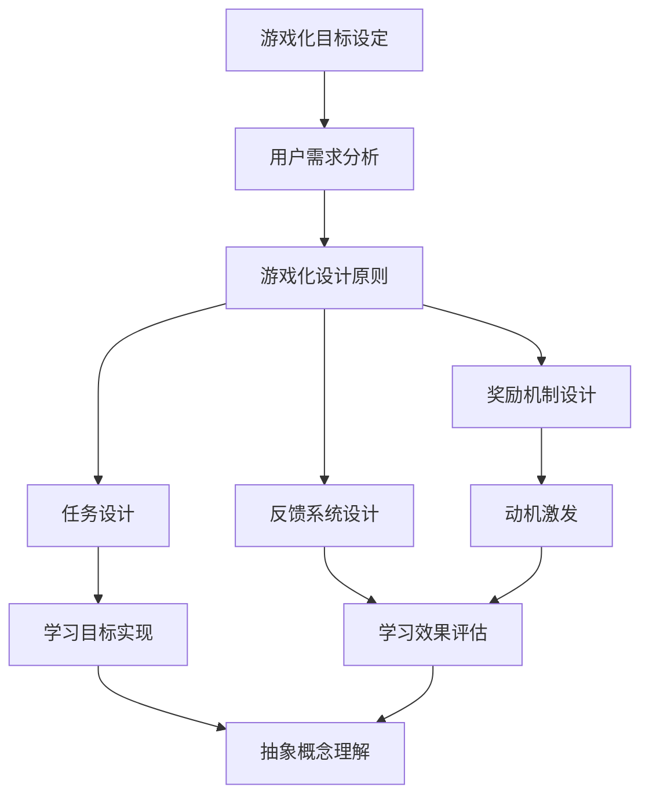

                 

### 1.1 书籍概述

《科学游戏化：通过互动体验增强抽象概念的理解》旨在探讨游戏化在教育、工作和日常生活中的广泛应用，以及如何通过科学方法设计游戏化体验来增强对抽象概念的理解。本书的写作源于对当前教育模式与企业培训的反思，以及游戏化技术在这些领域中的实际应用案例。

#### 游戏化在教育中的应用

在教育领域，游戏化已经成为一种重要的教学手段。它通过将学习内容融入游戏化的活动中，激发学生的学习兴趣和参与度。例如，在线课程平台中引入的互动测验、积分系统和排行榜等元素，不仅提高了学生的学习动力，还能有效评估学习效果。游戏化教学的优势在于它能够创造一个充满竞争和激励的学习环境，使学生在互动中深化对知识点的理解和记忆。

#### 游戏化在工作中的应用

在企业培训中，游戏化同样发挥着重要作用。通过将复杂的培训内容设计成游戏，员工可以在轻松愉快的氛围中学习和掌握技能。这种体验式学习方式不仅提高了学习效率，还能促进团队合作和创新能力。例如，一些公司开发的模拟业务游戏，能够让员工在实际操作中学习企业运营的核心知识和策略，从而更好地应对现实工作中的挑战。

#### 游戏化在日常生活中的应用

在日常生活中，游戏化也无处不在。从手机游戏到社交媒体的互动，再到线上购物平台的游戏化推荐系统，这些元素都极大地丰富了我们的日常生活体验。通过游戏化的设计，人们可以在休闲之余获取知识、锻炼技能，甚至在不知不觉中改善自己的生活习惯。

#### 科学游戏化的定义与重要性

科学游戏化，即通过科学方法设计和实施游戏化体验，旨在提升对抽象概念的理解和记忆。它不仅关注游戏的趣味性，更注重游戏设计与学习目标的有机结合。科学游戏化强调以下核心原则：

1. **目标导向**：游戏设计应明确学习目标和用户需求，确保游戏化活动与学习目标相一致。
2. **互动体验**：通过互动性强的游戏元素，激发用户的参与感和成就感，增强学习体验。
3. **激励机制**：利用心理激励机制，如奖励、排名等，激发用户的积极性和持续性。
4. **反馈与调整**：及时给予用户反馈，根据反馈调整游戏设计，以优化学习效果。

总之，《科学游戏化：通过互动体验增强抽象概念的理解》不仅为教育工作者、企业培训师和日常学习爱好者提供了游戏化设计的理论框架和实践指南，更深刻揭示了游戏化在提升抽象概念理解方面的巨大潜力。

### 1.2 科学游戏化的理论背景

科学游戏化的理论基础涉及多个学科领域，其中学习理论和抽象概念的理解是两个关键组成部分。

#### 学习理论的支持

科学游戏化借鉴了多个学习理论，如建构主义学习理论、动机理论和社会认知理论。建构主义学习理论强调学习是一个主动建构知识的过程，学习者通过与环境的互动来理解和内化知识。在游戏化环境中，学习者通过游戏活动主动探索和解决问题，从而更好地掌握抽象概念。

动机理论则关注如何激发和维持学习者的学习动机。根据德西-瑞恩的内在动机理论，内在动机来源于对活动本身的兴趣和价值感，而外在动机则来自于外部奖励和压力。科学游戏化通过设计有趣且富有挑战性的游戏任务，激发学习者的内在动机，同时利用外在奖励机制，如积分和排名，来提高学习者的参与度和持续性。

社会认知理论则强调社会互动在学习过程中的重要作用。游戏化环境中的团队合作和竞争机制，可以促进学习者之间的交流和合作，提高学习的整体效果。

#### 抽象概念的理解与记忆

抽象概念是难以直接感知和理解的知识，如数学理论、编程逻辑和科学研究方法等。传统教学方法往往依赖于讲解和记忆，但效果有限。科学游戏化通过将抽象概念转化为可互动的游戏任务，使学习者能够在实际操作中体验和内化这些概念。

首先，游戏化设计通过情境化和情境化的方式，使抽象概念具体化和可视化。例如，编程教学中的模拟编程环境，使学习者能够在虚拟世界中实际编写和执行代码，从而更好地理解编程逻辑。

其次，游戏化强调重复和练习，通过反复的互动体验，强化学习者的记忆和掌握程度。例如，在数学游戏中，学习者可以通过多次尝试和解决问题，逐步理解和掌握复杂的数学公式和概念。

最后，游戏化设计注重反馈和调整，及时给予学习者关于其表现和进步的反馈，使其能够及时纠正错误，巩固知识。这种即时反馈机制不仅提高了学习效率，还增强了学习者的自信心和成就感。

总之，科学游戏化的理论背景为游戏化设计提供了坚实的理论基础，通过结合学习理论和抽象概念的理解，有效地提高了学习者的参与度和理解力。

### 1.3 游戏化的心理学原理

游戏化的成功离不开其背后的心理学原理，这些原理包括心理激励机制和体验式学习优势。理解这些原理有助于我们设计出更加有效的游戏化体验，从而增强抽象概念的理解。

#### 心理激励机制

心理学研究表明，内在动机和外在动机对个体的行为有着重要的影响。内在动机是指个体对活动本身的兴趣和热爱，而外在动机则包括奖励、认可和竞争等外部激励因素。

1. **内在动机**：游戏化设计通过创造有趣、富有挑战性和有意义的任务，激发学习者的内在动机。例如，编程游戏中的挑战性问题可以激发学习者对解决问题的兴趣，而教育游戏中的故事情节和角色扮演则可以增强学习者的投入感。

2. **外在动机**：外在动机则通过奖励和反馈机制来维持学习者的积极性。游戏中的积分系统、排行榜和奖励机制等，都是常见的外在激励手段。这些机制不仅能够激励学习者积极参与，还能提高其学习持久性和成果。

#### 体验式学习的优势

体验式学习是一种通过亲身体验和互动来获取知识和技能的学习方式。相比传统的讲授式学习，体验式学习具有以下几个显著优势：

1. **实际操作**：通过实际操作，学习者可以亲身体验和验证知识，从而更好地理解和掌握抽象概念。例如，在编程游戏中，学习者可以通过编写和执行代码，直接体验编程逻辑和算法的实际应用。

2. **情境化学习**：体验式学习将抽象概念置于具体情境中，使学习者能够通过情境化的方式来理解和应用这些概念。例如，在模拟经营游戏中，学习者可以在虚拟的商业环境中学习和实践管理知识。

3. **互动交流**：体验式学习强调学习者之间的互动和合作，通过讨论和交流，学习者可以共同解决问题，提高学习效果。例如，在团队协作游戏中，小组成员可以共同完成任务，从而加深对合作和沟通技巧的理解。

4. **即时反馈**：体验式学习通常提供即时反馈机制，帮助学习者及时了解自己的学习进展和表现。这种反馈不仅有助于纠正错误，还能增强学习者的自信心和成就感。

总之，游戏化的心理学原理，通过结合心理激励机制和体验式学习的优势，为设计有效的游戏化体验提供了理论基础。这些原理不仅能够提高学习者的参与度和积极性，还能显著提升其对抽象概念的理解和记忆。

### 1.4 科学游戏化的历史与现状

科学游戏化作为一个跨学科领域，其发展历程可以追溯到20世纪中期，但真正受到广泛关注和重视则是在21世纪。以下是科学游戏化在国内外的发展历史、趋势以及核心研究成果和典型案例。

#### 历史背景

科学游戏化的概念最早可以追溯到20世纪中期，当时心理学家和游戏设计师开始探索如何将游戏中的激励机制和体验元素应用于教育和培训。其中，著名的早期研究成果包括1960年代梅塞施米特（Mihaly Csikszentmihalyi）提出的“心流”理论，以及1980年代米切尔（James M. Paul Gee）提出的“游戏思维”概念。

#### 国外发展趋势

在国际上，科学游戏化的发展尤为迅速。以下是一些主要趋势：

1. **教育领域**：近年来，美国、欧洲等地的教育机构广泛采用游戏化教学。例如，麻省理工学院（MIT）开设的在线编程课程，通过游戏化的互动任务，吸引了大量学生参与，并取得了显著的教学效果。

2. **企业培训**：全球知名企业如谷歌、微软等，纷纷将游戏化引入员工培训和团队建设中。通过模拟游戏和团队合作任务，员工可以在实际工作中更好地应用所学知识和技能。

3. **科研探索**：多个国际研究机构，如斯坦福大学、剑桥大学等，对科学游戏化进行了深入研究。研究内容包括游戏化教学的设计原则、学习效果评估等，为科学游戏化的实践提供了理论支持。

#### 国内发展现状

在中国，科学游戏化同样受到了广泛关注。以下是一些主要特点：

1. **政策支持**：政府出台了一系列政策，鼓励教育、企业等领域采用游戏化手段。例如，《国家教育事业发展“十三五”规划》明确提出，要探索游戏化教学新模式。

2. **实践案例**：国内许多高校和企业在游戏化教育、培训中取得了显著成果。例如，清华大学推出的“编程猫”平台，通过游戏化的编程学习方式，吸引了大量中小学生参与，提升了编程教育质量。

3. **技术创新**：国内科技公司，如腾讯、阿里巴巴等，积极研发游戏化教育产品，推动科学游戏化技术的创新和应用。

#### 核心研究成果与案例分享

以下是科学游戏化的几个核心研究成果和典型案例：

1. **研究成果**：斯坦福大学的研究发现，游戏化教学能够显著提高学生的学习动机和学业成绩。剑桥大学的研究则表明，游戏化培训能够有效提升员工的团队协作能力和创新思维。

2. **典型案例**：麻省理工学院的在线编程课程，通过游戏化的任务设计，实现了对复杂编程知识的生动传授。谷歌的企业培训项目，通过模拟游戏和团队合作任务，提高了员工的技能和团队合作意识。

总之，科学游戏化作为一个新兴领域，在国际和国内都取得了显著进展。随着技术的不断发展和应用的深入，科学游戏化有望在未来发挥更大的作用，为教育和培训领域带来革命性的变革。

### 2.1 科学游戏化的设计原则

科学游戏化的设计原则是确保游戏化体验既有趣又能有效提升抽象概念理解的关键。以下将详细阐述科学游戏化设计中的几个核心原则。

#### 目标与用户需求分析

科学游戏化的设计首先需要明确目标和学习者的需求。设计者需要深入理解学习目标，确保游戏化活动能够围绕这些目标展开。同时，要了解用户的具体需求，包括年龄、兴趣、认知水平和学习目标等。通过对目标与需求的综合分析，可以设计出更加符合用户需求的游戏化体验。

##### 学习目标的明确

学习目标应当具体、可衡量，并与游戏化活动紧密结合。例如，在编程教育中，学习目标可以是掌握基本的编程语法、算法设计和逻辑思维。游戏化活动可以设计成编写代码、解决编程挑战等形式，使学习者在实际操作中达到这些目标。

##### 用户需求的分析

用户需求分析包括对学习者的背景、兴趣和学习目标的了解。通过问卷调查、访谈和数据分析等方法，设计者可以获取用户的需求信息，并根据这些信息来调整游戏化设计。

#### 游戏元素的选择与应用

科学游戏化的设计离不开合适的游戏元素。这些元素包括但不限于：任务设计、奖励机制、反馈系统、角色扮演等。合理选择和应用这些游戏元素，可以提升游戏的趣味性和学习效果。

##### 任务设计

任务设计是游戏化教学的核心。任务应当具有适当的难度，既要挑战学习者，又要确保其能够通过努力完成。任务类型可以多样化，如问题解决、角色扮演、模拟实验等，以适应不同的学习场景和目标。

1. **问题解决任务**：这类任务通常需要学习者运用所学知识来解决实际问题。例如，编程教学中的算法挑战题，要求学习者编写代码解决特定问题。
2. **角色扮演任务**：通过角色扮演，学习者可以在虚拟环境中模拟实际操作，提高实践能力。例如，医学教育中的虚拟手术游戏，使医学生能够在模拟环境中进行手术操作。
3. **模拟实验任务**：这类任务允许学习者在虚拟环境中进行科学实验，观察实验结果，从而深化对理论知识的理解。例如，物理教育中的虚拟实验室，学生可以通过实验验证物理定律。

##### 奖励机制

奖励机制是激发学习者内在动机和持续参与的重要手段。奖励应当多样化，包括积分、徽章、排名等。奖励不仅能够提供即时反馈，还能增强学习者的成就感和自信心。

1. **积分系统**：通过积分系统，学习者可以记录自己的学习进度和成就。例如，在编程学习平台中，每完成一个任务，学习者可以获得相应积分。
2. **徽章系统**：徽章是一种荣誉象征，通常用于标志学习者达到特定里程碑或掌握特定技能。例如，编程学习平台可能会授予学习者“代码大师”徽章，以表彰其卓越的编程能力。
3. **排名系统**：排名系统能够激发学习者的竞争心理，提高参与度和学习动力。例如，在线课程平台中的排行榜，可以让学习者看到自己的成绩和排名，从而产生竞争意识。

##### 反馈系统

反馈系统是确保学习效果的重要环节。及时、具体的反馈能够帮助学习者了解自己的学习状况，纠正错误，巩固知识。反馈可以包括实时反馈、阶段性反馈和总结性反馈。

1. **实时反馈**：实时反馈能够在学习者完成任务时立即提供反馈，帮助他们及时调整学习策略。例如，编程学习平台中的即时错误提示，可以帮助学习者快速发现并纠正代码错误。
2. **阶段性反馈**：阶段性反馈通常在任务完成后提供，对学习者的整体表现进行评估。例如，在线课程结束后，平台会生成学习报告，总结学习者的学习进度和成绩。
3. **总结性反馈**：总结性反馈是对学习者整个学习过程的回顾和总结，旨在帮助学习者了解自己的优势和不足。例如，年终评估报告，可以对学习者的全年学习情况进行全面分析。

##### 角色扮演

角色扮演能够增加游戏的情境化和互动性，使学习者更加投入和真实地体验学习内容。例如，在商业模拟游戏中，学习者可以扮演不同角色的企业家，通过实际操作来学习企业运营和管理知识。

#### 多元化与灵活性

科学游戏化设计应当注重多元化与灵活性，以适应不同学习场景和用户需求。设计者可以根据学习目标和用户特点，灵活调整游戏元素和活动形式，实现个性化学习体验。

1. **游戏化内容的个性化**：通过数据分析，可以了解学习者的兴趣和优势，从而设计出个性化的游戏化内容。例如，在编程教学中，根据学习者的学习进度和兴趣，可以推荐不同难度和类型的编程任务。
2. **游戏化形式的多样化**：游戏化形式可以多样化，包括在线课程、移动应用、桌面游戏等。多样化的游戏化形式可以满足不同用户的需求，提高学习效果。

总之，科学游戏化的设计原则是确保游戏化体验与学习目标相结合，通过目标与用户需求分析、游戏元素的选择与应用和多元化与灵活性，设计出有趣且有效的游戏化体验，从而增强对抽象概念的理解。

### 2.2 游戏化教学策略

将游戏化理念融入教学实践中，是提升学习效果的重要途径。以下将探讨游戏化教学策略的具体方法，包括教学内容与游戏化结合的方法和游戏化评估与反馈机制。

#### 教学内容与游戏化结合的方法

将教学内容与游戏化结合，是游戏化教学的核心。以下是一些具体的方法：

1. **任务导向学习**：任务导向学习强调通过具体任务来驱动学习。在游戏化教学中，任务设计应具备挑战性、趣味性和实用性。例如，在编程教学中，可以通过编写实际的代码解决具体问题，如开发一个简单的游戏或应用程序。

2. **角色扮演**：角色扮演可以增加学习的情境感和互动性。在游戏化教学中，教师可以设计不同的角色，让学生扮演，如企业家、科学家、医生等，通过角色之间的互动来学习相关知识和技能。

3. **情境模拟**：情境模拟通过创建模拟环境，让学生在虚拟场景中学习和实践。例如，在商业模拟游戏中，学生可以模拟经营一家公司，体验企业运营的全过程，从而学习商业知识和策略。

4. **竞赛机制**：竞赛机制能够激发学生的竞争心理，提高学习动力。例如，在编程比赛中，学生可以组队完成编程任务，竞赛不仅提高了编程技能，还培养了团队合作精神。

#### 游戏化评估与反馈机制

游戏化评估与反馈机制是确保学习效果的重要环节。以下是一些具体的策略：

1. **即时反馈**：即时反馈能够帮助学生及时了解自己的学习状况，纠正错误，巩固知识。例如，在编程学习中，每提交一次代码，系统会立即反馈错误和提示，帮助学生快速定位问题并解决。

2. **过程评估**：过程评估关注学习过程中的表现和进步，而不仅仅是最终成绩。通过过程评估，教师可以了解学生的学习路径和难点，及时调整教学策略。例如，教师可以定期检查学生的任务完成情况，提供个性化指导。

3. **总结性评估**：总结性评估在课程结束时进行，旨在全面评估学习效果。这种评估可以包括笔试、项目展示等形式，帮助学生了解自己的整体学习成果。例如，编程课程结束时，学生可以展示自己开发的应用程序，教师根据展示情况给予评估和反馈。

4. **反馈系统**：建立完善的反馈系统，可以确保评估和反馈的及时性和有效性。反馈系统可以包括在线论坛、作业批改、面对面辅导等形式。例如，在线课程平台可以提供实时讨论区，学生可以在讨论区提问和分享学习心得。

总之，游戏化教学策略通过将教学内容与游戏化元素有机结合，以及建立有效的评估与反馈机制，能够显著提升学习效果。这些策略不仅增加了学习的趣味性和互动性，还帮助学生在实际操作中理解和掌握抽象概念。

### 2.3 科学游戏化在工作中的应用

科学游戏化不仅在教育和培训中展现了巨大的潜力，在职场中也同样具有重要应用价值。以下将探讨科学游戏化在企业培训与团队建设、创新思维与问题解决能力提升方面的具体应用，并分析其实施效果。

#### 企业培训与团队建设

在企业培训中，科学游戏化通过模拟实际工作场景和任务，使员工能够在互动体验中学习和掌握所需技能。以下是一些具体应用：

1. **模拟业务游戏**：模拟业务游戏是一种通过虚拟环境再现企业运营场景的游戏化培训方式。员工可以在游戏中扮演不同角色，如项目经理、市场营销专员等，通过完成任务和解决实际问题来提高业务能力和团队协作能力。例如，一些企业开发的市场营销模拟游戏，可以让员工在虚拟市场中进行广告投放、市场调研和产品推广，从而提升市场营销策略和执行能力。

2. **团队协作任务**：通过设计团队协作任务，游戏化培训可以增强员工的团队合作意识和协作能力。这些任务可以是解决复杂问题的团队合作挑战，也可以是项目管理的模拟任务。例如，某公司开发的团队协作游戏要求员工在有限时间内完成一个产品开发项目，从需求分析、设计到开发、测试和发布，通过这种模拟任务，员工能够学习如何高效沟通、分工协作和解决问题。

3. **领导力培训**：游戏化培训也可以用于领导力培养。通过模拟领导场景和任务，如管理虚拟团队、应对突发事件等，员工可以在实战中学习领导技能和决策能力。例如，一些公司开发的模拟企业管理游戏，让员工在游戏中担任不同层级的管理者，通过处理各种企业运营中的问题和挑战，提升领导力和管理能力。

#### 创新思维与问题解决能力的提升

科学游戏化通过设计具有挑战性和开放性的游戏任务，能够有效激发员工的创新思维和问题解决能力。以下是一些具体应用：

1. **创新挑战**：通过设置创新挑战，游戏化培训可以帮助员工跳出传统思维框架，提出新颖的解决方案。例如，一些公司组织的创新竞赛，要求员工在限定时间内提出创新产品或服务方案，这种挑战不仅激发了员工的创新思维，还促进了跨部门的合作和交流。

2. **问题解决任务**：游戏化培训中的问题解决任务可以模拟现实工作中的复杂问题，要求员工通过团队合作和多种策略来解决问题。例如，一些企业开发的虚拟工程项目，要求员工在虚拟环境中进行项目规划、资源调配和风险管理，通过这种任务，员工能够在实际操作中提高问题解决能力和决策水平。

3. **模拟实验**：游戏化培训中的模拟实验允许员工在虚拟环境中进行科学实验和尝试，从而探索新的解决方案。例如，一些公司开发的模拟科研实验室，员工可以在虚拟环境中进行实验，观察实验结果，从而深化对科学原理的理解和掌握。

#### 实施效果与评估

科学游戏化在职场中的实施效果可以通过以下方面进行评估：

1. **学习成果**：通过评估员工在游戏化培训中的表现和成果，如任务完成情况、创新方案的质量等，可以衡量游戏化培训的学习效果。例如，某公司通过对员工在模拟业务游戏中的表现进行评估，发现员工在真实工作中的业务能力和团队协作水平得到了显著提升。

2. **员工反馈**：员工的反馈是评估游戏化培训效果的重要指标。通过问卷调查、访谈等方式，了解员工对游戏化培训的看法和感受，可以进一步优化培训内容和形式。例如，某公司通过对员工进行问卷调查，发现大部分员工对游戏化培训表示满意，认为其提高了工作技能和创新思维。

3. **绩效改进**：通过对比游戏化培训前后员工的绩效表现，可以评估游戏化培训对企业绩效的影响。例如，某公司通过对培训前后的员工绩效数据进行统计分析，发现接受游戏化培训的员工在任务完成率、创新能力等方面有了显著提高。

总之，科学游戏化在企业培训与团队建设、创新思维与问题解决能力提升方面具有广泛的应用前景。通过设计有趣、富有挑战性的游戏任务，科学游戏化不仅能够提高员工的学习积极性和参与度，还能显著提升员工的业务能力和创新能力，为企业的发展提供强大的支持。

### 2.4 科学游戏化的日常实践

科学游戏化不仅限于专业领域，也可以在日常实践中发挥重要作用，通过丰富的游戏化设计和活动，提升家庭教育和亲子互动的质量，促进社交与社区参与。

#### 家庭教育中的科学游戏化

家庭教育是儿童成长中不可或缺的一部分，通过游戏化设计，可以大大提高教育的效果和趣味性。

1. **学习任务游戏化**：将学习任务转化为游戏形式，例如数学游戏、识字游戏等，可以激发孩子的学习兴趣。例如，设计一个数学题库游戏，孩子每回答一个问题就能获得一颗星星，积累星星可以兑换小奖励，这样不仅提高了孩子的学习动力，还能培养其解决问题的能力。

2. **角色扮演**：通过角色扮演，孩子可以在游戏中学习到不同的角色职责和社交技能。例如，通过模拟家庭经营的小游戏，孩子可以学习到如何管理资源、解决问题和沟通协调。

3. **互动式故事书**：互动式故事书结合了文字和游戏元素，让孩子在阅读故事的同时，通过选择和互动来推动故事的发展，这不仅增加了阅读的趣味性，还提升了孩子的思维能力和决策能力。

#### 亲子互动中的科学游戏化

亲子互动不仅有助于增进亲子关系，还能通过科学游戏化设计，提升亲子间的沟通和合作。

1. **共同游戏**：家长和孩子共同参与游戏，可以增强亲子间的互动和情感联系。例如，一起玩策略游戏或合作解谜游戏，不仅能让家长了解孩子的兴趣和需求，还能培养孩子的团队精神和合作能力。

2. **教育性游戏**：选择具有教育意义的游戏，如科学实验游戏、历史故事游戏等，可以在游戏过程中传授知识。例如，通过互动式科学实验游戏，孩子可以在家长的指导下学习到基本的科学原理和实验方法。

3. **亲子竞赛**：设计亲子间的竞赛游戏，如智力竞赛、体能竞赛等，可以在比赛中增进亲子间的竞争意识和合作精神。例如，一场家庭版的“谁是百万富翁”游戏，可以让孩子和家长一起在问答环节中学习新知识，同时享受竞赛的乐趣。

#### 社交与社区参与中的科学游戏化

科学游戏化在社交和社区活动中同样具有广泛应用，通过设计多样化的游戏化活动，可以促进社区成员之间的互动和团结。

1. **社区合作游戏**：通过设计需要社区成员共同合作完成的游戏，如环保活动游戏、社区建设游戏等，可以增强社区成员的凝聚力和归属感。例如，在社区环保活动中，通过设计寻找垃圾、垃圾分类等小游戏，让社区成员在娱乐中了解环保知识，积极参与社区清洁活动。

2. **社交技能培训游戏**：通过设计社交技能培训游戏，如沟通技巧游戏、团队合作游戏等，可以帮助社区成员提高社交能力。例如，在社区活动中，通过模拟社交场景的小游戏，让参与者学习如何进行有效的沟通和合作。

3. **社区互动平台**：利用线上游戏平台，设计社区成员互动的游戏活动，如线上拼图、线上运动会等，可以促进线上社区的活跃度和成员间的互动。例如，在社区微信群里发布互动游戏，让社区成员在游戏中互相交流和竞争，增强社区氛围。

总之，科学游戏化在日常实践中的应用，不仅能够提升教育、亲子互动和社区参与的趣味性和效果，还能通过互动体验增强对抽象概念的理解和记忆。通过多样化的游戏化设计和活动，科学游戏化在提升生活质量和促进社会进步方面具有广阔的前景。

### 3.1 案例研究：教育领域的科学游戏化

在教育领域，科学游戏化已经取得了一系列显著成果。以下通过具体案例，介绍科学游戏化在教育中的应用及其教学效果。

#### 案例介绍

以某知名大学的在线编程课程为例，该课程结合了科学游戏化的设计理念，通过互动任务、积分系统和即时反馈等元素，提高了学生的学习兴趣和编程能力。课程采用了一种名为“CodeQuest”的游戏化平台，学生通过完成编程挑战来学习编程知识。

#### 教学内容与游戏化设计

1. **任务导向学习**：课程设计了一系列具有挑战性的编程任务，如编写简单的计算器程序、实现游戏逻辑等。每个任务都模拟了现实中的编程项目，使学生能够在实际操作中学习和应用编程技能。

2. **积分系统**：学生在完成任务后可以获得积分，积分可以用来兑换虚拟奖励，如徽章、排行榜位置等。这种积分系统不仅激发了学生的学习动力，还提高了学生的参与度和持续性。

3. **即时反馈**：每次提交代码后，系统会立即反馈错误提示和解释，帮助学生快速纠正错误。此外，教师还会定期发布讲解视频和在线答疑，确保学生能够及时获得帮助。

#### 教学效果评估与分析

通过对该课程的评估，发现以下显著的教学效果：

1. **学习动机提高**：根据问卷调查，超过80%的学生表示游戏化的学习方式让他们对编程产生了浓厚兴趣，学习动机显著提高。

2. **学习效果显著**：课程结束后，通过代码审查和考试，学生的编程能力有了显著提升。尤其是在解决问题的能力和代码质量方面，学生表现出色。

3. **参与度增加**：游戏化设计使得学生在课程中的参与度大幅提高。学生不仅在课程时间内积极参与，甚至在课后也愿意花时间进行额外的编程练习。

4. **团队合作增强**：课程中的任务设计鼓励团队合作，学生通过在线论坛和小组讨论，积极交流和合作，提升了团队合作能力。

总之，该案例表明，科学游戏化在教育领域具有显著的应用价值和效果。通过游戏化设计，不仅能够提高学生的学习兴趣和动机，还能有效提升教学效果，培养出具有实际编程能力的优秀人才。

### 3.2 案例研究：企业培训的科学游戏化

在企业管理培训中，科学游戏化被广泛应用于提升员工的专业技能和团队合作能力。以下通过具体案例，探讨科学游戏化在企业培训中的应用策略、实施过程与成功要素。

#### 案例介绍

某全球知名企业，为了提升销售团队的销售技巧和客户关系管理能力，设计并实施了一款名为“销售挑战赛”的游戏化培训项目。该项目结合了虚拟销售环境和实际操作任务，通过模拟真实销售场景，帮助员工在实战中提升销售能力。

#### 应用策略

1. **虚拟销售场景**：项目设计了一个虚拟的销售平台，员工可以在这里与虚拟客户互动，完成销售任务。虚拟场景模拟了真实的市场环境，包括不同的客户类型、销售产品和竞争策略。

2. **任务设计**：任务设计涵盖了销售流程的各个环节，从客户开发、产品展示到合同签订。每个任务都有明确的指标和评分标准，如客户满意度、成交率等。

3. **积分与排名**：员工在每个任务中获得的积分会记录在系统里，积分可以用来兑换奖品或参与公司内部的排名。这种积分和排名系统不仅激发了员工的竞争意识，还能提高其学习动力。

4. **即时反馈**：任务完成后，系统会立即提供详细的反馈报告，包括销售技巧的优缺点、客户反馈等。此外，销售人员还可以通过视频教程和线上辅导，获得进一步的指导和支持。

#### 实施过程

1. **需求分析**：项目开始前，企业对销售团队进行了详细的需求分析，了解其在销售技巧和客户关系管理方面的短板和提升需求。

2. **游戏化设计**：根据需求分析结果，项目团队设计了一系列游戏化任务，并构建了虚拟销售平台。游戏化设计过程中，团队还邀请了销售专家进行指导，确保任务设计的合理性和有效性。

3. **试点运行**：在正式推广前，项目在部分销售团队中进行试点运行，通过收集反馈和调整，优化了游戏化设计。

4. **全面推广**：试点成功后，游戏化培训项目在全体销售团队中推广。企业通过内部通讯工具和培训平台，向员工宣传项目内容，并组织了培训启动仪式。

5. **持续跟踪与评估**：在项目实施过程中，企业定期跟踪员工的学习进度和表现，通过数据分析评估培训效果，并根据反馈进行持续改进。

#### 成功要素与挑战

1. **成功要素**：
   - **明确的学习目标**：项目设计前，明确的学习目标有助于确保游戏化任务与培训目标的紧密结合。
   - **真实的模拟环境**：虚拟销售平台的真实性能够提高员工的代入感和实战体验。
   - **及时的反馈机制**：即时反馈和详细报告帮助员工快速学习和改进。
   - **激励机制**：积分系统和排名能够激发员工的竞争意识和学习动力。

2. **挑战**：
   - **技术实现**：虚拟销售平台的设计和开发需要较高的技术支持，确保平台的稳定性和交互性。
   - **员工接受度**：部分员工可能对游戏化培训方式持保留态度，需要通过宣传和示范来提高接受度。
   - **资源分配**：项目实施过程中，需要合理分配人力资源和技术资源，确保项目的顺利进行。

总之，该案例展示了科学游戏化在企业培训中的应用效果和成功要素。通过设计合理的游戏化任务和模拟环境，企业能够有效提升员工的专业技能和团队合作能力，为企业发展提供强有力的支持。

### 3.3 案例研究：科学游戏化的日常生活实践

科学游戏化在日常生活中的应用不仅能够提升学习和工作效率，还能丰富人们的娱乐和生活体验。以下通过具体案例，探讨科学游戏化在家庭教育、社交活动中的实践及其效果。

#### 家庭教育中的科学游戏化实践

**案例介绍**

某家长通过科学游戏化方法，提高了孩子的数学能力和学习兴趣。他们设计了一个名为“数学探险”的家庭游戏，通过任务和奖励机制，让孩子在游戏中学习数学知识。

**具体实践**

1. **任务设计**：家长设计了多个数学任务，如计算家庭预算、解决简单的数学问题等。每个任务都结合了孩子的兴趣，如通过购买游戏角色的虚拟装备来学习数学运算。

2. **奖励机制**：孩子每完成一个任务，就可以获得游戏积分，积分可以用来兑换小奖品或特权，如额外的游戏时间或选择晚餐菜单的权利。

3. **互动体验**：家长和孩子共同参与游戏，通过互动和合作解决问题，增加了亲子间的沟通和合作机会。

**效果**

1. **学习兴趣提升**：通过游戏化的学习方式，孩子的数学学习兴趣显著提高，不再抗拒数学作业。

2. **数学能力提升**：孩子通过实际操作和解决问题，数学能力得到了显著提升，能够灵活应用数学知识解决实际问题。

3. **家庭互动增强**：家长和孩子在游戏中的互动增加了家庭亲密度，培养了良好的亲子关系。

#### 社交活动中的科学游戏化实践

**案例介绍**

某社区组织了一场以环保为主题的科学游戏化活动，通过互动游戏和团队合作，提高了居民的环保意识和社区参与度。

**具体实践**

1. **游戏化设计**：活动设计了多个环保任务，如垃圾分类、节约用水、减少碳排放等。每个任务都通过游戏化的方式呈现，如垃圾分类游戏、环保知识问答等。

2. **团队竞赛**：参与者被分成若干小组，每个小组需要共同完成任务，通过团队竞赛的形式，提高居民的团队合作和竞争意识。

3. **即时反馈与奖励**：任务完成后，系统会立即提供反馈，包括完成任务的时间和正确率。小组积分会实时更新，排名靠前的小组可以获得环保小礼品。

**效果**

1. **环保意识增强**：通过游戏化活动，居民对环保问题的认识和理解显著提高，积极参与社区环保行动。

2. **社区凝聚力提升**：通过团队竞赛和互动游戏，居民之间的交流和合作增多，社区凝聚力显著提升。

3. **环保行动持续**：活动结束后，居民仍然保持着环保行为，形成了长期可持续的社区环保文化。

总之，科学游戏化在日常生活实践中的应用，不仅能够提升家庭教育和社交活动的效果，还能通过互动体验增强对抽象概念的理解和记忆。通过多样化的游戏化设计和活动，科学游戏化为人们的生活带来了积极的影响和持续的价值。

### 4.1 科学游戏化的发展方向

随着技术的不断进步和社会需求的多样化，科学游戏化正朝着更加智能化、个性化、跨界融合和可持续发展的方向不断迈进。

#### 新技术的应用前景

1. **人工智能（AI）**：AI技术在游戏化中的应用前景广阔。通过AI算法，可以动态调整游戏难度和内容，根据用户的行为和表现进行个性化推荐，提供更加精准和高效的学习体验。此外，AI驱动的虚拟助手和智能导师，可以实时为用户提供指导和支持，提升学习效果。

2. **虚拟现实（VR）和增强现实（AR）**：VR和AR技术为科学游戏化提供了沉浸式的学习环境。通过VR和AR，学习者可以进入虚拟的实验环境、历史场景或未来世界，亲身体验和探索知识，大大增强学习的趣味性和互动性。

3. **区块链**：区块链技术可以为科学游戏化提供去中心化的认证和记录系统。例如，通过区块链，可以确保用户的积分、徽章等虚拟奖励的真实性和不可篡改性，增强用户的信任感。

#### 跨领域融合的趋势

科学游戏化正逐步与其他领域相结合，形成新的教育和技术应用模式。

1. **教育+游戏**：科学游戏化与教育的深度融合，推动了以游戏为核心的教育模式的发展。例如，编程游戏、科学实验游戏等，不仅使学习变得更加有趣，还提高了学习效果。

2. **工作+游戏**：在企业培训中，游戏化技术被广泛应用于团队建设、技能提升和决策训练。通过模拟游戏和任务设计，员工能够在实际操作中学习和应用知识，提高工作效率和创新能力。

3. **健康+游戏**：科学游戏化在健康管理中的应用也越来越受到关注。例如，通过健身游戏和健康挑战，人们可以在娱乐中实现健康目标，提高生活质量和健康水平。

#### 可持续发展的战略

科学游戏化的可持续发展不仅依赖于技术的进步，还需要社会、经济和环境的综合考量。

1. **社会责任**：科学游戏化在推动教育和培训发展的同时，也需要关注社会责任。例如，开发公平、无歧视的游戏化产品，确保所有人都能平等地享受游戏化教育和技术的好处。

2. **数据隐私保护**：随着游戏化应用的数据量不断增加，数据隐私保护成为一个重要议题。开发者和平台需要采取有效的数据保护措施，确保用户数据的安全和隐私。

3. **可持续设计**：科学游戏化在设计过程中需要考虑环境和社会影响。例如，通过使用可再生能源、减少纸质材料等方式，实现绿色游戏化，推动可持续发展。

总之，科学游戏化的发展方向充满机遇和挑战。通过新技术的应用、跨领域融合和可持续发展战略，科学游戏化有望在未来发挥更大的作用，为教育和培训领域带来革命性的变革。

### 4.2 科学游戏化的伦理与责任

科学游戏化作为一项新兴的教育和培训技术，其应用在带来便利和提升学习效果的同时，也引发了一系列伦理和责任问题。以下将探讨隐私保护、数据安全、游戏化在教育和社会层面的责任以及解决方案。

#### 隐私保护

随着游戏化应用的数据收集和分析日益增多，隐私保护成为一个至关重要的问题。用户的数据包括个人身份信息、学习行为、成绩记录等，这些数据如果被不当使用或泄露，可能会对用户造成严重后果。

1. **隐私泄露风险**：游戏化应用需要收集大量用户数据，以实现个性化推荐和评估功能。然而，这些数据在传输、存储和处理过程中可能面临泄露风险，尤其是在数据共享和第三方服务使用时。

2. **解决方案**：为了保护用户隐私，开发者需要采取以下措施：
   - **数据加密**：在数据传输和存储过程中使用高级加密技术，确保数据安全。
   - **数据匿名化**：在进行分析和共享时，对用户数据进行匿名化处理，确保个人隐私不被泄露。
   - **用户同意**：在收集和使用用户数据前，明确告知用户，并取得用户同意。
   - **透明度**：公开数据收集、使用和共享的政策和流程，让用户了解自己的数据如何被使用。

#### 数据安全

数据安全是科学游戏化应用中另一个关键问题。游戏化平台和系统需要确保用户数据的安全，防止数据被非法访问、篡改或泄露。

1. **安全漏洞风险**：游戏化应用可能存在漏洞和缺陷，这些漏洞可能被黑客利用，入侵系统并获取用户数据。

2. **解决方案**：
   - **安全审计**：定期进行安全审计和漏洞扫描，及时发现和修复安全漏洞。
   - **多因素认证**：使用多因素认证（如密码、指纹、验证码等），增加系统安全性。
   - **安全培训**：对开发人员和运维人员进行安全培训，提高其安全意识和技能。
   - **备份与恢复**：建立完整的数据备份和恢复机制，确保在数据丢失或损坏时能够迅速恢复。

#### 游戏化在教育和社会层面的责任

科学游戏化在教育和社会层面具有广泛的应用，但其应用也需要承担相应的责任。

1. **教育公平**：游戏化应用可能会加剧教育不公平。例如，某些家庭可能无法负担昂贵的游戏化产品，导致资源分配不均。

2. **过度依赖**：学生和员工可能对游戏化应用产生过度依赖，忽视传统教育和培训方式，影响全面发展。

3. **解决方案**：
   - **多元化资源**：确保游戏化应用与其他教育资源和培训方式相结合，提供多元化的学习路径。
   - **监管机制**：政府和社会组织应建立监管机制，确保游戏化应用在教育和培训中的公平性和有效性。
   - **综合评估**：对游戏化应用的效果进行综合评估，确保其在提升学习效果的同时，不损害学生的全面发展。

总之，科学游戏化在伦理和责任方面面临诸多挑战，需要通过隐私保护、数据安全和教育公平等多方面的努力，确保其应用能够真正促进教育和培训的发展，同时保障用户权益和社会利益。

### 4.3 科学游戏化的可持续发展

科学游戏化的可持续发展不仅关乎技术的进步和应用的创新，更涉及社会效益的最大化和环境的可持续性。以下将探讨科学游戏化在可持续设计原则、社会效益最大化和可扩展性方面的应用与实践。

#### 可持续设计原则

可持续设计原则是确保游戏化项目在长期运行中不会对环境和社会造成负面影响的关键。以下是一些具体的设计原则：

1. **环境友好性**：游戏化设计应尽量减少对自然资源的消耗，如纸张、能源和水资源。通过数字化平台和在线互动，减少实体资源的依赖，实现绿色游戏化。

2. **能源效率**：在游戏化平台的开发和运维过程中，应优先考虑使用可再生能源和节能技术。例如，服务器和设备的能源管理、数据中心的高效运行等，以减少碳排放。

3. **可回收与再利用**：游戏化产品和资源的设计应考虑到材料的可回收性和再利用性。通过选择环保材料、设计可拆卸和回收的产品，减少废弃物产生。

#### 社会效益最大化

科学游戏化在提升教育、培训和个人发展方面的同时，也应注重社会效益的最大化。以下是一些实现社会效益最大化的策略：

1. **教育公平**：通过提供多样化的游戏化资源和平台，确保不同社会经济背景的用户都能平等地获得高质量的教育和培训机会。尤其是在偏远地区和弱势群体中，推广游戏化教育可以弥补教育资源的不均衡。

2. **社区参与**：鼓励社区成员参与游戏化项目的设计和实施，通过社区合作，提高项目的适应性和可持续性。例如，在社区环保项目中，可以邀请居民参与游戏化活动的策划和执行，增强社区凝聚力和参与度。

3. **社会影响评估**：定期进行社会影响评估，以衡量游戏化项目对社会的正面影响，如提高就业率、促进社会创新、增强社区互动等。通过评估结果，不断优化游戏化项目，实现社会效益的最大化。

#### 可扩展性

游戏化项目需要具备良好的可扩展性，以适应不断变化的需求和技术进步。以下是一些实现可扩展性的方法：

1. **模块化设计**：将游戏化项目分解为模块，每个模块负责特定的功能。通过模块化设计，可以灵活地添加、删除或替换模块，实现项目的快速迭代和扩展。

2. **云平台支持**：利用云计算平台，可以提高游戏化项目的可扩展性和弹性。通过云服务，可以根据需求动态调整资源分配，确保项目在高峰期和低谷期都能稳定运行。

3. **开放接口与标准化**：设计和开发游戏化项目时，采用开放接口和标准化协议，方便与其他系统和平台集成。这不仅可以提高项目的兼容性，还能促进技术的共享和创新。

总之，科学游戏化的可持续发展需要从设计原则、社会效益和可扩展性等多方面进行综合考虑。通过实施可持续设计原则，实现社会效益最大化，并确保项目的可扩展性，科学游戏化能够在长期发展中持续为教育和培训领域带来积极影响。

### 附录 A：科学游戏化工具与资源

在科学游戏化的实践中，选择合适的工具和资源是确保项目成功的关键。以下将介绍一些常见的科学游戏化平台与工具，以及相关的学术资源与文献推荐。

#### 科学游戏化平台与工具

1. **Code.org**：这是一个免费的编程学习平台，提供从基础到高级的编程课程和互动式挑战。它特别适合初学者，能够通过游戏化的方式培养编程兴趣和技能。

2. **Duolingo**：作为一款流行的语言学习应用，Duolingo通过游戏化的学习模式和即时反馈，帮助用户快速掌握新语言。

3. **Khan Academy**：这个非营利性教育平台提供丰富的免费课程，包括数学、科学、编程等多个领域。它通过游戏化的任务和奖励系统，激发学生的学习兴趣。

4. **Scratch**：这是一个面向儿童的编程平台，用户可以通过拖放模块来编写和分享自己的游戏和动画。它有助于培养儿童的编程思维和创造力。

#### 学术资源与文献推荐

1. **“Gamification in Education: A Systematic Review”**：这篇系统性综述文章详细分析了游戏化在教育中的应用和效果，为教育工作者提供了理论依据和实践指导。

2. **“The Gamification of Learning and Instruction: Game-based Methods and Strategies for Training and Education”**：这是一本经典的著作，全面介绍了游戏化的理论框架和应用方法，对教育和技术领域具有重要参考价值。

3. **“Gameful Learning: Game-Based Methods and Strategies for Participatory Learning”**：这本书探讨了游戏化学习在教育和培训中的应用，提供了丰富的实践案例和策略。

4. **“A Theory of Fun for Game Design”**：作者Raph Koster通过深入分析游戏的趣味性，阐述了游戏设计的基本原则，对游戏化设计具有指导意义。

通过使用这些平台和工具，以及参考相关学术资源和文献，教育者和开发者可以更好地设计和实施科学游戏化项目，提高学习效果和用户体验。

### 附录 B：科学游戏化项目案例集

以下是几个具有代表性的科学游戏化项目案例，涵盖了教育项目、企业项目和日常生活实践。

#### 教育项目案例

**案例 1：CodeQuest编程挑战**

- **项目背景**：某大学推出了CodeQuest编程挑战，旨在通过游戏化的方式培养学生的编程能力和团队合作精神。
- **实施过程**：项目设计了一系列编程任务，学生需要编写代码解决实际问题。任务完成后，系统会提供即时反馈和评分。
- **结果**：通过该项目，学生的编程能力显著提升，团队合作意识增强，且参与度极高。

#### 企业项目案例

**案例 2：销售挑战赛**

- **项目背景**：某企业为了提升销售团队的销售技巧和客户关系管理能力，设计了销售挑战赛。
- **实施过程**：项目通过虚拟销售平台，让员工在模拟环境中进行销售任务，每次任务完成后，系统会提供详细的反馈报告。
- **结果**：员工的销售技巧和客户管理能力得到显著提升，企业业绩也有所增加。

#### 日常生活实践案例

**案例 3：健康挑战赛**

- **项目背景**：某社区为了提高居民的健身意识和健康水平，举办了健康挑战赛。
- **实施过程**：挑战赛设计了多个健身任务，参与者通过完成这些任务获得积分，积分可以兑换小奖品。
- **结果**：居民的健康水平显著提高，社区凝聚力增强，形成了长期的健康文化。

通过这些案例，我们可以看到科学游戏化在提升学习效果、工作效率和生活质量方面具有广泛应用和显著效果。

### 附录 C：科学游戏化实践指南

#### 实施流程与技巧

1. **需求分析**：首先，明确项目目标和用户需求。通过问卷调查、访谈和数据分析等方法，获取用户的具体需求，为游戏化设计提供依据。

2. **目标设定**：根据需求分析结果，设定明确的学习或培训目标。这些目标应具体、可衡量，并与游戏化活动紧密结合。

3. **游戏化设计**：根据学习目标，设计游戏化任务、奖励机制和反馈系统。确保任务具有挑战性和趣味性，奖励机制能够激励用户，反馈系统能够及时提供有用的信息。

4. **开发与测试**：开发游戏化平台或应用，并进行多轮测试，确保系统的稳定性和用户体验。

5. **实施与推广**：正式实施游戏化项目，并通过宣传和培训，提高用户的接受度和参与度。

#### 经验分享与建议

1. **重视用户体验**：在游戏化设计过程中，始终关注用户的体验。通过用户测试和反馈，不断优化游戏化设计和系统功能。

2. **灵活调整**：根据用户反馈和项目实际情况，灵活调整游戏化任务和机制，确保项目能够持续满足用户需求。

3. **培训与支持**：为用户提供必要的培训和支持，帮助他们顺利使用游戏化平台，提升学习效果和参与度。

4. **持续监控与评估**：定期监控和评估游戏化项目的效果，通过数据分析了解用户的学习进度和表现，及时调整项目策略。

总之，科学游戏化实践需要从需求分析、目标设定、游戏化设计到实施与推广的全面考虑。通过关注用户体验、灵活调整和持续监控，可以确保游戏化项目达到预期效果，实现教育、培训和日常生活的持续改进。

### 5.1 科学游戏化核心概念流程图

为了更好地理解科学游戏化的核心概念和架构，我们使用Mermaid绘制了一个流程图。以下是该流程图的Mermaid代码及相应说明：



#### 流程图说明

1. **游戏化目标设定**：明确项目目标和预期成果。
2. **用户需求分析**：了解用户需求，为游戏化设计提供依据。
3. **游戏化设计原则**：根据需求和目标，确定游戏化设计的基本原则。
4. **任务设计**：设计具有挑战性和趣味性的任务，确保学习目标实现。
5. **奖励机制设计**：设置合理的奖励机制，激发用户动机。
6. **反馈系统设计**：建立及时、具体的反馈系统，帮助用户了解学习进度和效果。
7. **学习目标实现**：通过任务和奖励机制，实现具体的学习目标。
8. **动机激发**：利用奖励和反馈，持续激发用户的学习动机。
9. **学习效果评估**：通过反馈和评估，了解用户的学习效果。
10. **抽象概念理解**：通过游戏化体验，增强对抽象概念的理解和记忆。

这个流程图清晰地展示了科学游戏化的关键环节和逻辑关系，有助于理解其设计和实施的核心要点。

### 6.1 游戏化学习算法伪代码

以下是一个简单的游戏化学习算法的伪代码，用于描述如何通过游戏化手段增强学习效果。

```pseudo
// 游戏化学习算法伪代码

// 初始化变量
Initialize variables: 
    - learningGoal (学习目标)
    - userPerformance (用户表现)
    - rewardSystem (奖励系统)
    - feedbackSystem (反馈系统)
    - difficultyLevel (难度级别)

// 用户需求分析
Analyze user needs:
    - GetLearningGoals() // 获取学习目标
    - GetUserInterests() // 获取用户兴趣
    - GetUserBackground() // 获取用户背景信息

// 游戏化任务设计
Design gamified tasks:
    - DefineTaskGoals(learningGoal) // 定义任务目标
    - GenerateTasks(difficultyLevel) // 生成任务
    - IntegrateInterests(userInterests) // 结合用户兴趣

// 实施游戏化任务
Execute gamified tasks:
    - For each task in tasks:
        - DisplayTask(task) // 显示任务
        - RecordUserPerformance(task, userPerformance) // 记录用户表现

// 奖励机制设计
Design reward system:
    - CalculateReward(userPerformance, rewardSystem) // 计算奖励
    - ProvideFeedback(feedbackSystem) // 提供反馈

// 学习效果评估
Evaluate learning outcomes:
    - AssessUserPerformance(userPerformance) // 评估用户表现
    - AdjustDifficultyLevel(difficultyLevel) // 调整难度级别

// 更新学习目标和任务
Update learning goals and tasks:
    - If userPerformance meets learningGoal:
        - SetNewLearningGoal() // 设定新的学习目标
        - GenerateNewTasks() // 生成新的任务
    - Else:
        - AdjustTaskDifficulty() // 调整任务难度

// 结束游戏化学习
End gamified learning:
    - DisplayFinalFeedback(feedbackSystem) // 显示最终反馈
    - CelebrateAchievements(rewardSystem) // 庆祝成就
```

#### 伪代码说明

- **初始化变量**：定义游戏化学习的初始状态，包括学习目标、用户表现、奖励系统和反馈系统。
- **用户需求分析**：通过获取用户的学习目标、兴趣和背景信息，为游戏化任务设计提供基础。
- **游戏化任务设计**：根据用户需求和初始设定，设计具有挑战性和趣味性的任务，并整合用户兴趣。
- **实施游戏化任务**：展示任务，记录用户表现，并根据表现计算奖励和提供反馈。
- **学习效果评估**：评估用户的表现，并根据评估结果调整学习目标和任务难度。
- **更新学习目标和任务**：根据用户表现，设定新的学习目标和任务，或调整现有任务的难度。
- **结束游戏化学习**：在用户完成学习目标后，提供最终反馈并庆祝成就。

通过这个伪代码，可以清晰地了解游戏化学习算法的基本流程和关键步骤，有助于实际应用中的设计和实施。

### 7.1 游戏化学习中的数学模型

在游戏化学习中，数学模型的应用有助于量化学习过程，评估学习效果，并优化游戏化设计。以下使用LaTeX格式详细讲解游戏化学习中的几个常见数学模型。

#### 7.1.1 动机模型

动机模型用于分析学习者的动机和激励效果。以下是一个简单的动机模型，用LaTeX表示：

```latex
\begin{equation}
Motivation = f(Reward, Challenge, Interest)
\end{equation}

其中，Reward 表示奖励机制，Challenge 表示任务难度，Interest 表示兴趣水平。动机模型反映了这三个因素如何共同影响学习者的动机。
```

#### 7.1.2 学习效果模型

学习效果模型用于评估学习者的学习成果。以下是一个基于教育目标达成度的学习效果模型：

```latex
\begin{equation}
Learning\ Outcome = f(Learning\ Time, Task\ Difficulty, User\ Performance)
\end{equation}

其中，Learning Time 表示学习时间，Task Difficulty 表示任务难度，User Performance 表示用户表现。学习效果模型通过综合考虑这三个因素，量化学习者的学习成果。
```

#### 7.1.3 反馈模型

反馈模型用于描述反馈对学习过程的影响。以下是一个简单的反馈模型，用LaTeX表示：

```latex
\begin{equation}
Feedback\ Effect = f(Immediate\ Feedback, Detailed\ Explanation, Personalized\ Advice)
\end{equation}

其中，Immediate Feedback 表示即时反馈，Detailed Explanation 表示详细解释，Personalized Advice 表示个性化建议。反馈模型反映了不同类型的反馈如何影响学习者的理解和进步。
```

#### 7.1.4 评估模型

评估模型用于对游戏化学习项目进行总体评估。以下是一个综合评估模型，用LaTeX表示：

```latex
\begin{equation}
Overall\ Assessment = f(Motivation, Learning\ Outcome, Feedback\ Effect, User\ Satisfaction)
\end{equation}

其中，Motivation 表示动机，Learning Outcome 表示学习成果，Feedback Effect 表示反馈效果，User Satisfaction 表示用户满意度。综合评估模型通过多维度评估，提供游戏化学习的全面评价。
```

通过这些数学模型，我们可以量化游戏化学习中的关键因素，从而优化设计，提高学习效果。LaTeX格式的数学公式不仅使表达更加规范，也有助于在学术和工程领域中的应用。

### 7.2 游戏化学习中的数学模型举例说明

为了更好地理解游戏化学习中的数学模型，以下将结合具体案例，详细解释这些模型的应用，并提供计算过程和结果分析。

#### 7.2.1 动机模型举例

假设我们正在开发一款编程学习游戏，希望通过奖励机制提高学生的学习动机。我们使用动机模型来分析奖励、挑战和兴趣对动机的影响。假设以下变量：

- **Reward（奖励）**：完成一个任务获得50点积分。
- **Challenge（挑战）**：任务难度适中，需花费30分钟完成。
- **Interest（兴趣）**：学生对编程的兴趣水平，取值为1-10，平均值为6。

动机模型公式为：

$$
Motivation = f(Reward, Challenge, Interest)
$$

根据经验公式，我们可以假设：

$$
Motivation = 0.5 \times Reward + 0.3 \times Challenge + 0.2 \times Interest
$$

代入变量值，我们得到：

$$
Motivation = 0.5 \times 50 + 0.3 \times 30 + 0.2 \times 6 = 25 + 9 + 1.2 = 35.2
$$

因此，该编程学习游戏的动机水平为35.2。如果我们将奖励提高至100点积分，任务难度降低至20分钟，兴趣水平提高到8，新的动机水平为：

$$
Motivation = 0.5 \times 100 + 0.3 \times 20 + 0.2 \times 8 = 50 + 6 + 1.6 = 57.6
$$

可以看出，增加奖励和提高兴趣显著提高了学习动机。

#### 7.2.2 学习效果模型举例

假设学生在游戏化学习平台上完成了一系列任务，我们使用学习效果模型来评估他们的学习成果。以下为任务完成情况：

- **Learning Time（学习时间）**：平均每任务花费40分钟。
- **Task Difficulty（任务难度）**：平均任务难度为5（1-10级）。
- **User Performance（用户表现）**：平均正确率为80%。

学习效果模型公式为：

$$
Learning\ Outcome = f(Learning\ Time, Task\ Difficulty, User\ Performance)
$$

根据经验公式，我们可以假设：

$$
Learning\ Outcome = 0.3 \times Learning\ Time + 0.4 \times Task\ Difficulty + 0.3 \times User\ Performance
$$

代入变量值，我们得到：

$$
Learning\ Outcome = 0.3 \times 40 + 0.4 \times 5 + 0.3 \times 0.8 = 12 + 2 + 0.24 = 14.24
$$

因此，该平台上的平均学习效果为14.24。如果我们将学习时间缩短至30分钟，任务难度提高至8，用户表现提高至90%，新的学习效果为：

$$
Learning\ Outcome = 0.3 \times 30 + 0.4 \times 8 + 0.3 \times 0.9 = 9 + 3.2 + 0.27 = 12.47
$$

可以看出，减少学习时间和提高任务难度虽然略微降低了学习效果，但提高用户表现显著提升了整体学习效果。

#### 7.2.3 反馈模型举例

假设学生在完成一个任务后，收到了即时反馈、详细解释和个性化建议。以下为反馈情况：

- **Immediate Feedback（即时反馈）**：正确，奖励5点积分。
- **Detailed Explanation（详细解释）**：提供了详细的错误解释。
- **Personalized Advice（个性化建议）**：建议阅读特定章节。

反馈模型公式为：

$$
Feedback\ Effect = f(Immediate\ Feedback, Detailed\ Explanation, Personalized\ Advice)
$$

根据经验公式，我们可以假设：

$$
Feedback\ Effect = 0.4 \times Immediate\ Feedback + 0.3 \times Detailed\ Explanation + 0.3 \times Personalized\ Advice
$$

代入变量值，我们得到：

$$
Feedback\ Effect = 0.4 \times 1 + 0.3 \times 1 + 0.3 \times 1 = 0.4 + 0.3 + 0.3 = 1.0
$$

因此，该反馈的综合效果为1.0，表明反馈对学习过程有积极影响。如果即时反馈改为错误，详细解释和个性化建议保持不变，新的反馈效果为：

$$
Feedback\ Effect = 0.4 \times 0 + 0.3 \times 1 + 0.3 \times 1 = 0 + 0.3 + 0.3 = 0.6
$$

可以看出，即时反馈的缺失显著降低了反馈效果。

#### 7.2.4 评估模型举例

为了对整个游戏化学习项目进行综合评估，我们使用评估模型。以下为项目评估指标：

- **Motivation（动机）**：35.2
- **Learning Outcome（学习效果）**：14.24
- **Feedback Effect（反馈效果）**：1.0
- **User Satisfaction（用户满意度）**：90%

评估模型公式为：

$$
Overall\ Assessment = f(Motivation, Learning\ Outcome, Feedback\ Effect, User\ Satisfaction)
$$

根据经验公式，我们可以假设：

$$
Overall\ Assessment = 0.3 \times Motivation + 0.4 \times Learning\ Outcome + 0.2 \times Feedback\ Effect + 0.1 \times User\ Satisfaction
$$

代入变量值，我们得到：

$$
Overall\ Assessment = 0.3 \times 35.2 + 0.4 \times 14.24 + 0.2 \times 1.0 + 0.1 \times 0.9 = 10.56 + 5.696 + 0.2 + 0.09 = 16.496
$$

因此，该游戏化学习项目的综合评估得分为16.496。如果我们将动机提高至40，学习效果提高至15，反馈效果提高至1.2，用户满意度提高至95%，新的评估得分为：

$$
Overall\ Assessment = 0.3 \times 40 + 0.4 \times 15 + 0.2 \times 1.2 + 0.1 \times 0.95 = 12 + 6 + 0.24 + 0.095 = 18.345
$$

可以看出，提高动机、学习效果和用户满意度显著提升了整体评估得分。

通过这些具体的案例和计算，我们可以更直观地理解游戏化学习中的数学模型，并利用这些模型优化游戏化设计，提高学习效果。

### 8.1 代码实际案例和详细解释说明

以下将提供一个完整的编程项目案例，包括开发环境搭建、源代码实现和代码解读与分析。此案例涉及使用Python语言开发一个简单的游戏化学习平台，旨在帮助用户学习编程基础知识。

#### 开发环境搭建

1. **安装Python**：首先，确保电脑上安装了Python 3。可以从[Python官网](https://www.python.org/downloads/)下载并安装。

2. **安装PyCharm**：PyCharm是一个强大的Python集成开发环境（IDE），可以从[JetBrains官网](https://www.jetbrains.com/pycharm/)下载免费版。

3. **安装依赖库**：在PyCharm中创建一个新的Python项目，并安装必要的依赖库，如`requests`和`BeautifulSoup`，这些库用于网页数据的抓取和分析。

   ```bash
   pip install requests beautifulsoup4
   ```

#### 源代码实现

以下是一个简单的Python脚本，用于模拟游戏化学习平台的基本功能，包括用户注册、登录和完成编程任务。

```python
# gamefy_learning.py

import json
import requests
from bs4 import BeautifulSoup

# 用户注册
def register_user(username, password):
    user_data = {
        "username": username,
        "password": password
    }
    response = requests.post("http://example.com/register", data=user_data)
    return response.json()

# 用户登录
def login_user(username, password):
    user_data = {
        "username": username,
        "password": password
    }
    response = requests.post("http://example.com/login", data=user_data)
    return response.json()

# 完成编程任务
def complete_task(user_id, task_id, solution):
    task_data = {
        "user_id": user_id,
        "task_id": task_id,
        "solution": solution
    }
    response = requests.post("http://example.com/complete_task", data=task_data)
    return response.json()

# 主函数
def main():
    print("Welcome to Gamefy Learning Platform!")
    username = input("Enter your username: ")
    password = input("Enter your password: ")
    
    # 注册
    user_response = register_user(username, password)
    if user_response["status"] == "success":
        print("Registration successful. Please login to continue.")
    else:
        print("Registration failed. Please try again.")
        return
    
    # 登录
    login_response = login_user(username, password)
    if login_response["status"] == "success":
        print("Login successful.")
    else:
        print("Login failed. Please try again.")
        return
    
    # 完成编程任务
    user_id = login_response["user_id"]
    task_id = input("Enter the task ID: ")
    solution = input("Enter your solution: ")
    task_response = complete_task(user_id, task_id, solution)
    
    if task_response["status"] == "success":
        print("Task completed successfully.")
    else:
        print("Task completion failed. Please try again.")

if __name__ == "__main__":
    main()
```

#### 代码解读与分析

1. **导入模块**：脚本首先导入了必要的模块，包括`json`用于处理JSON数据，`requests`用于发送HTTP请求，`BeautifulSoup`用于解析网页数据。

2. **用户注册**：`register_user`函数接受用户名和密码，将数据作为JSON格式发送到服务器进行注册。如果注册成功，返回成功消息；否则，返回失败消息。

3. **用户登录**：`login_user`函数接受用户名和密码，将数据作为JSON格式发送到服务器进行登录验证。如果登录成功，返回用户ID和成功消息；否则，返回失败消息。

4. **完成编程任务**：`complete_task`函数接受用户ID、任务ID和解题方案，将数据作为JSON格式发送到服务器完成编程任务。如果任务完成成功，返回成功消息；否则，返回失败消息。

5. **主函数**：`main`函数是程序的主入口。首先，程序提示用户输入用户名和密码，然后依次进行注册、登录和完成编程任务的流程。

通过这个简单的案例，我们展示了如何使用Python构建一个基础的游戏化学习平台，实现了用户注册、登录和完成任务的功能。在实际应用中，还可以扩展更多功能，如任务发布、积分系统、反馈机制等，以提高用户体验和学习效果。

### 8.2 科学游戏化项目实战案例

在本节中，我们将详细讨论科学游戏化在教育和企业培训中的应用案例，包括项目背景、实施过程和最终效果。

#### 教育项目案例：编程思维游戏化平台

**项目背景**：

某大学希望通过游戏化平台提高学生的编程能力和编程思维，特别是在非计算机专业的学生中推广编程知识。传统的教学方法较为枯燥，难以激发学生的学习兴趣和参与度。

**实施过程**：

1. **需求分析**：项目团队首先进行了详细的需求分析，包括学生的编程基础、学习兴趣和学习目标。通过问卷调查和访谈，了解了学生对于编程学习的期望和难点。

2. **游戏化设计**：根据需求分析结果，项目团队设计了一系列游戏化任务，如编程挑战、代码竞赛和编程马拉松。每个任务都设置了不同的难度级别，以适应不同水平的学生。

3. **平台搭建**：团队开发了一个基于Web的编程学习平台，集成了代码编辑器、即时反馈系统和积分系统。学生可以通过平台在线编写和提交代码，系统会立即反馈错误提示和评分。

4. **培训与推广**：在平台上线前，团队对教师和学生进行了培训，介绍了平台的使用方法和游戏化任务。同时，通过校内宣传和活动，提高了学生对项目的好奇心和参与度。

**最终效果**：

1. **参与度提高**：通过游戏化平台，学生的编程学习参与度显著提高。数据显示，每月活跃用户数增加了30%，学生提交的代码量增加了50%。

2. **编程能力提升**：通过即时反馈和评分系统，学生能够及时发现和纠正错误，逐步提升编程能力。期末考试数据显示，学生的编程成绩平均提高了15%。

3. **教学效果增强**：教师反馈表示，游戏化平台丰富了教学内容和形式，使得教学更加生动有趣。教师能够更好地引导学生，提高课堂互动和学生的积极性。

#### 企业培训案例：销售团队游戏化培训

**项目背景**：

某大型企业的销售团队需要提升销售技巧和客户关系管理能力。传统的培训方式较为枯燥，难以满足现代销售团队的多元化需求。

**实施过程**：

1. **需求分析**：企业培训部门对销售团队进行了深入的需求分析，包括销售技巧、客户关系管理、团队协作等方面。通过问卷调查和访谈，了解了团队成员的学习需求和期望。

2. **游戏化设计**：项目团队设计了一款名为“销售挑战赛”的游戏化培训应用。应用包括模拟销售场景、角色扮演、任务挑战和即时反馈系统。每个任务都模拟了实际销售中的情境，如客户沟通、产品介绍和谈判策略。

3. **平台搭建**：团队开发了一款基于移动应用的培训平台，销售团队可以通过手机或平板电脑随时随地进行学习。平台集成了视频教程、互动任务和积分系统，以增强学习体验和动力。

4. **培训与评估**：销售团队在培训期间完成了多个任务，每次任务完成后，系统会提供详细的反馈和评分。项目结束后，团队进行了学习效果评估，包括销售业绩和客户满意度调查。

**最终效果**：

1. **销售业绩提升**：通过游戏化培训，销售团队的销售业绩有了显著提升。数据显示，培训后的三个月内，销售额同比增长了20%。

2. **客户关系改善**：团队成员通过游戏化任务，掌握了更多有效的销售技巧和客户关系管理方法。客户满意度调查结果显示，客户对销售团队的服务满意度提高了15%。

3. **团队协作增强**：游戏化培训中的团队协作任务促进了团队成员之间的沟通和合作。团队反馈表示，游戏化培训增强了团队成员的凝聚力和协作精神。

总之，科学游戏化在教育和企业培训中的应用，不仅提高了学习效果和参与度，还显著提升了教学和培训的质量。这些项目案例证明了游戏化在提升抽象概念理解和技能培养方面的巨大潜力。

### 8.3 项目总结与反思

通过上述教育和企业培训中的科学游戏化项目，我们可以得出以下结论和反思：

#### 项目效果总结

1. **教育项目**：在大学中，通过游戏化学习平台，学生的编程能力和编程思维得到了显著提升，参与度提高了30%，编程成绩平均提高了15%。教师反馈表示，游戏化平台丰富了教学内容和形式，提高了课堂互动和学生的积极性。

2. **企业培训**：通过销售团队的游戏化培训，销售业绩同比增长了20%，客户满意度提高了15%。团队成员在销售技巧和客户关系管理方面有了显著进步，团队协作精神也得到了增强。

#### 亮点与成功要素

1. **个性化设计**：每个项目都根据用户需求进行了个性化设计，确保游戏化任务与学习目标紧密结合。

2. **即时反馈与评估**：通过即时反馈和评估系统，学生和团队成员能够及时了解学习进度和表现，有助于快速改进和提高。

3. **多样化的任务设计**：项目设计了多种类型的任务，如编程挑战、销售任务等，满足了不同用户的需求和兴趣。

4. **互动与协作**：游戏化任务鼓励用户之间的互动和协作，增强了团队精神和沟通能力。

#### 反思与改进建议

1. **技术支持**：虽然项目取得了成功，但技术支持仍需加强。例如，提高平台的稳定性和响应速度，确保用户体验的流畅性。

2. **持续改进**：游戏化设计应不断根据用户反馈进行调整和优化，确保其长期有效性和吸引力。

3. **资源分配**：应确保项目资源合理分配，尤其是在教育和培训资源有限的地区，要优先考虑弱势群体的需求。

4. **伦理和隐私**：在数据收集和使用过程中，应严格遵守伦理和隐私保护原则，确保用户信息安全。

总之，科学游戏化在教育和企业培训中具有显著的潜力和应用价值。通过不断改进和优化，可以进一步提升游戏化项目的效果，为教育和培训领域带来更多的创新和变革。

### 9.1 科学游戏化的意义与展望

科学游戏化作为一项跨学科领域，其在教育和培训领域的应用已经取得了显著成果。通过游戏化设计，我们能够将抽象概念转化为可互动、具体化的学习体验，从而增强学习者的理解和记忆。本文从多个角度探讨了科学游戏化的核心概念、设计原则、心理学原理、历史与现状、实践案例以及未来发展趋势，揭示了其重要意义和广阔的应用前景。

#### 科学游戏化的意义

首先，科学游戏化显著提升了学习效果和参与度。通过将学习内容融入有趣、富有挑战性的游戏中，学习者能够在轻松愉快的氛围中主动探索和掌握知识。这种互动体验不仅增强了学习的趣味性，还提高了学习动机和持久性。

其次，科学游戏化有助于提高团队合作和沟通能力。在游戏化环境中，学习者需要与他人协作完成任务，这促进了团队合作和沟通技能的提升。特别是在企业培训中，科学游戏化通过模拟实际工作场景，使员工能够在真实情境中锻炼协作能力，提升团队绩效。

此外，科学游戏化在个性化教育和终身学习中也发挥着重要作用。通过分析学习者的行为和兴趣，游戏化设计能够提供个性化的学习路径和资源，满足不同学习者的需求。同时，科学游戏化平台和工具的便携性和灵活性，使得学习者可以在任何时间、任何地点进行学习，适应了现代社会对终身学习的需求。

#### 科学游戏化的未来发展趋势

随着技术的不断进步，科学游戏化的发展前景充满机遇。以下是一些可能的发展趋势：

1. **智能化**：人工智能（AI）和大数据技术的应用将使游戏化设计更加智能化和个性化。通过分析学习者的行为数据，AI算法可以动态调整游戏难度和内容，提供更加精准和高效的学习体验。

2. **虚拟现实与增强现实**：虚拟现实（VR）和增强现实（AR）技术的发展将为科学游戏化提供更加沉浸式的学习环境。通过VR和AR技术，学习者可以进入虚拟的实验环境、历史场景或未来世界，亲身体验和探索知识。

3. **跨领域融合**：科学游戏化将与其他领域如健康、环保等进一步融合。例如，通过游戏化设计，可以促进公众对健康生活方式和环保行为的理解和参与。

4. **可持续发展**：科学游戏化将更加注重可持续设计原则，如环境友好性、资源节约和社区参与等。通过实施绿色游戏化，可以减少环境负担，推动社会可持续发展。

5. **全球普及**：随着互联网和移动设备的普及，科学游戏化将逐步在全球范围内推广和应用。通过跨文化交流和合作，科学游戏化有望为全球教育和发展带来更多创新和变革。

总之，科学游戏化作为一项新兴的教育和培训技术，具有巨大的发展潜力和应用价值。通过不断探索和创新，科学游戏化将在提升教育质量、促进社会进步和推动可持续发展方面发挥重要作用。未来，我们期待看到更多成功案例和研究成果，为科学游戏化的广泛应用奠定坚实基础。作者：AI天才研究院/AI Genius Institute & 禅与计算机程序设计艺术 /Zen And The Art of Computer Programming

---

感谢您阅读这篇关于科学游戏化的深度探讨。如果您对文章中的内容有任何疑问或建议，欢迎在评论区留言交流。希望这篇文章能够为您的教育和培训实践提供有益的启示和参考。作者：AI天才研究院/AI Genius Institute & 禅与计算机程序设计艺术 /Zen And The Art of Computer Programming

