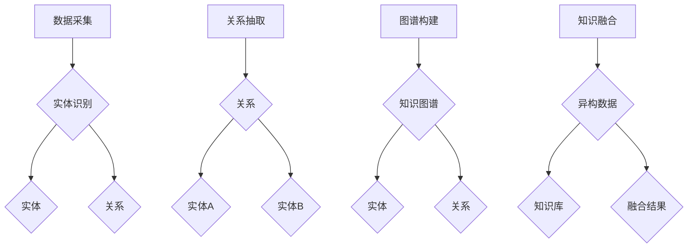

                 

# 科学研究的知识图谱构建：可视化世界知识的关联

## 关键词

知识图谱、知识关联、可视化、科研数据、实体识别、关系抽取、图谱构建

## 摘要

本文将探讨知识图谱在科学研究中的构建与应用。首先，我们将介绍知识图谱的基础概念、核心技术和应用场景。接着，详细解析知识图谱的构建方法，包括数据采集、实体识别、关系抽取和图谱构建等步骤。随后，我们将讨论知识图谱的可视化技术及其在科学研究中的应用。本文还将介绍一些开源知识图谱工具和商业平台，并探讨知识图谱构建中的挑战和未来发展趋势。通过这篇文章，读者将全面了解知识图谱的构建与应用，为科学研究提供新的视角和方法。

### 第一部分：知识图谱构建基础

#### 第1章：知识图谱概述

##### 1.1 知识图谱的定义与背景

知识图谱（Knowledge Graph）是一种结构化数据表示方法，用于表示实体及其之间的复杂关联关系。它起源于语义网（Semantic Web）的构想，旨在通过机器可读的方式组织网络上的信息，使得计算机能够更好地理解和处理这些信息。

知识图谱的概念最早由Google在2012年提出，并在其搜索引擎中得到了广泛应用。Google的知识图谱通过将海量网络数据结构化，实现了对信息的高效索引和搜索。自此之后，知识图谱逐渐成为人工智能领域的研究热点，广泛应用于搜索引擎、推荐系统、自然语言处理等领域。

##### 1.2 知识图谱的核心概念

知识图谱由三个核心概念组成：实体、关系和属性。

1. **实体**：实体是知识图谱中的基本元素，可以是人、地点、组织、事件等。实体具有唯一性，可以通过唯一的标识符（ID）进行识别。

2. **关系**：关系表示实体之间的关联，例如“是”、“属于”、“发生”等。关系也可以具有方向性和权重。

3. **属性**：属性描述实体的特征，例如人的年龄、地点的纬度、组织的成立时间等。属性可以进一步细分为直接属性和间接属性。

##### 1.3 知识图谱的应用场景

知识图谱在科学研究中有广泛的应用场景：

1. **搜索优化**：通过知识图谱，搜索引擎可以更好地理解用户查询意图，提供更加精准的搜索结果。

2. **推荐系统**：知识图谱可以用于推荐系统的知识表示，通过实体之间的关系，提供个性化的推荐。

3. **自然语言处理**：知识图谱可以帮助自然语言处理任务，如实体识别、关系抽取、语义分析等。

##### 1.4 知识图谱的关键技术

知识图谱的构建涉及多个关键技术：

1. **实体识别**：从非结构化数据中识别出实体，并为其分配唯一的标识符。

2. **关系抽取**：从文本中抽取实体之间的关系，构建实体之间的关联。

3. **图谱构建**：将识别出的实体和关系组织成知识图谱，并进行存储和索引。

4. **图谱优化**：通过图谱清洗、融合和推理，提高知识图谱的准确性和实用性。

##### 1.5 知识图谱的挑战与未来趋势

知识图谱在构建和应用过程中面临着多个挑战：

1. **数据质量**：知识图谱中的数据质量问题，如数据不一致、数据缺失等。

2. **图谱表示**：如何有效表示复杂的实体关系，提高知识图谱的可解释性。

3. **算法优化**：优化图谱构建和推理算法，提高计算效率和准确性。

未来，知识图谱将继续向以下几个方向发展：

1. **跨领域融合**：将知识图谱应用于更多领域，实现跨领域知识的融合。

2. **智能化趋势**：利用深度学习等人工智能技术，实现知识图谱的智能化推理和优化。

3. **人机交互**：通过可视化等技术，提高知识图谱的可交互性和用户体验。

#### 第2章：知识图谱的构建方法

##### 2.1 数据采集

数据采集是知识图谱构建的第一步，其质量直接影响后续的实体识别、关系抽取和图谱构建。

1. **公开数据集**：许多领域都有大量的公开数据集，如学术论文、网站数据、社交媒体数据等。这些数据集可以用于知识图谱的构建。

2. **自定义数据集**：对于特定领域或需求，可以构建自定义数据集。这通常需要从多个数据源中收集数据，并进行清洗和整合。

##### 2.2 实体识别

实体识别是从非结构化数据中识别出实体的过程。实体识别可以分为基于规则的方法和基于机器学习的方法。

1. **基于规则的方法**：通过定义一系列规则，从文本中识别出实体。这种方法简单易用，但规则覆盖范围有限。

2. **基于机器学习的方法**：使用机器学习模型，如条件随机场（CRF）、BERT等，从大量训练数据中学习实体识别规律。这种方法具有更高的识别准确率。

##### 2.3 关系抽取

关系抽取是从文本中识别出实体之间的关系的过程。关系抽取可以分为基于规则的方法和基于深度学习的方法。

1. **基于规则的方法**：通过定义一系列规则，从文本中抽取实体关系。这种方法简单但效果有限。

2. **基于深度学习的方法**：使用深度学习模型，如双向长短期记忆网络（BiLSTM）、Transformer等，从大量训练数据中学习关系抽取规律。这种方法具有更高的准确率。

##### 2.4 图谱构建

图谱构建是将识别出的实体和关系组织成知识图谱的过程。图谱构建通常分为以下几个步骤：

1. **实体嵌入**：将实体表示为低维向量，以便于计算和处理。

2. **关系编码**：将关系表示为实体之间的交互，例如边权重、边类型等。

3. **图谱存储**：将构建好的知识图谱存储在图数据库中，如Neo4j、OpenKG等。

4. **图谱查询**：提供图谱查询接口，以便于用户查询和操作知识图谱。

##### 2.5 知识融合

知识融合是将多个知识库中的信息进行整合，以提高知识图谱的完整性和准确性。知识融合可以分为以下几种方法：

1. **基于规则的融合**：通过定义一系列规则，将不同知识库中的信息进行合并。

2. **基于机器学习的融合**：使用机器学习模型，如聚类、分类等，将不同知识库中的信息进行融合。

3. **基于图谱的融合**：将不同知识库中的信息组织成统一的知识图谱，进行融合和处理。

### 第二部分：知识图谱可视化与应用

#### 第3章：知识图谱可视化

##### 3.1 可视化基础

知识图谱的可视化是将图谱结构以图形化的方式展示给用户，使其更易于理解和分析。可视化基础包括以下几个方面：

1. **可视化原理**：可视化利用图形、颜色、形状等视觉元素，将抽象的图谱结构转化为直观的图形。

2. **可视化工具**：常用的知识图谱可视化工具包括Gephi、Cytoscape、D3.js等。

##### 3.2 可视化方法

1. **节点和边**：节点表示实体，边表示实体之间的关系。节点和边的表示方法包括形状、颜色、大小等。

2. **交互式可视化**：交互式可视化允许用户通过点击、拖动等操作与图谱进行交互，以探索图谱结构和关系。

##### 3.3 可视化应用

1. **知识图谱探索**：通过可视化，用户可以直观地了解知识图谱的结构和内容，发现潜在的关联和规律。

2. **用户交互**：可视化提供了一种直观的交互方式，用户可以通过图谱与系统进行交互，实现数据查询、分析等操作。

#### 第4章：知识图谱在科学研究中应用

##### 4.1 知识图谱在科研中的应用场景

知识图谱在科学研究中有广泛的应用场景：

1. **研究趋势分析**：通过知识图谱，可以分析科研领域的热点话题、研究方向和趋势。

2. **科研合作**：知识图谱可以帮助研究人员发现潜在的合作者，促进科研合作。

3. **知识共享**：知识图谱可以将分散的知识点进行整合，实现知识的共享和传播。

##### 4.2 知识图谱在科研数据处理中的应用

1. **数据预处理**：知识图谱可以用于数据清洗、去重、归一化等预处理操作，提高数据质量。

2. **数据挖掘**：知识图谱可以用于数据挖掘，发现潜在的知识关联和规律。

##### 4.3 知识图谱在科研可视化中的应用

1. **科研成果展示**：知识图谱可以将科研成果以可视化的方式展示，使科研结果更加直观和易于理解。

2. **研究路径探索**：知识图谱可以帮助研究人员探索研究路径，发现潜在的研究方向和问题。

### 第三部分：知识图谱构建的挑战与未来

#### 第5章：知识图谱构建中的挑战

##### 5.1 数据质量

数据质量是知识图谱构建中的重要挑战：

1. **数据不完整**：知识图谱中的数据可能存在缺失，这会影响图谱的完整性和准确性。

2. **数据不一致**：不同数据源中的数据可能存在矛盾和不一致，这会影响图谱的可靠性。

##### 5.2 知识表示

知识表示是知识图谱构建中的另一个重要挑战：

1. **属性表示**：如何有效地表示实体属性，以反映其实际特征。

2. **关系表示**：如何表示实体之间的关系，以反映其复杂性和多样性。

##### 5.3 知识更新

知识更新是知识图谱构建中的持续性挑战：

1. **实时更新**：如何实现知识图谱的实时更新，以反映最新的数据和信息。

2. **知识演化**：如何处理知识图谱中的演化问题，如实体消亡、关系变更等。

#### 第6章：知识图谱的未来发展趋势

##### 6.1 新技术的影响

新技术将极大地影响知识图谱的发展：

1. **深度学习**：深度学习模型可以提高知识图谱的构建和推理能力。

2. **区块链**：区块链技术可以用于保障知识图谱的可靠性和安全性。

##### 6.2 跨领域应用

知识图谱将继续向跨领域应用发展：

1. **跨领域融合**：将知识图谱应用于更多领域，实现跨领域知识的融合。

2. **跨领域协作**：通过知识图谱，实现跨领域专家的合作和知识共享。

##### 6.3 智能化趋势

知识图谱将向智能化趋势发展：

1. **智能推理**：通过智能化推理，提高知识图谱的决策能力和应用价值。

2. **人机交互**：通过人机交互，提高知识图谱的可交互性和用户体验。

### 附录

#### 附录A：知识图谱资源与工具

1. **知识图谱相关论文和书籍**：
   - 《知识图谱：基础、架构与行业应用》
   - 《图计算：原理、算法与实践》

2. **知识图谱开源工具与框架**：
   - OpenKG：https://github.com/OpenKG-LAB/OpenKG
   - Neo4j：https://neo4j.com/

3. **知识图谱社区与资源**：
   - 知乎知识图谱专栏：https://zhuanlan.zhihu.com/knowledge-graph
   - 知识图谱公众号：知识图谱联盟

## 概念与联系图示

下面是知识图谱构建的基础概念和联系的Mermaid流程图：



## 核心算法原理讲解

以下是知识图谱构建中核心算法的伪代码和数学模型：

### 实体识别算法

```plaintext
function entity_recognition(document):
    entities = []
    for sentence in document:
        for word in sentence:
            if is_entity(word):
                entities.append(word)
    return entities
```

### 关系抽取算法

```plaintext
function relation_extraction(document, entities):
    relations = []
    for sentence in document:
        for entity in entities:
            if has_relation(sentence, entity):
                relations.append(entity)
    return relations
```

### 知识图谱构建算法

```plaintext
function construct_knowledge_graph(entities, relations):
    graph = Graph()
    for entity in entities:
        graph.add_node(entity)
    for relation in relations:
        graph.add_edge(entity1, entity2, relation)
    return graph
```

### 知识图谱中的图模型

$$
G = (V, E)
$$

其中，$V$ 代表实体集合，$E$ 代表关系集合。

### 实体识别的机器学习模型

$$
P(\text{Entity}|\text{Context}) = \frac{P(\text{Context}|\text{Entity}) \cdot P(\text{Entity})}{P(\text{Context})}
$$

### 关系抽取的深度学习模型

$$
\text{Logit}(r) = \text{sigmoid}(\text{W} \cdot \text{Vector}(\text{Context}))
$$

其中，$\text{W}$ 是权重矩阵，$\text{Vector}(\text{Context})$ 是句子的向量表示。

### 项目实战

#### 实战1：基于公开数据集构建知识图谱

**环境搭建**：

- 使用Python编程语言
- 安装Neo4j数据库
- 安装Py2neo库用于Neo4j的Python操作

**代码实现**：

```python
from py2neo import Graph

# 连接到Neo4j数据库
graph = Graph("bolt://localhost:7687", auth=("neo4j", "password"))

# 插入实体
def add_entity(entity):
    graph.run("CREATE (n:Entity {name: $entity})", entity=entity)

# 插入关系
def add_relation(entity1, entity2, relation):
    graph.run("MATCH (a:Entity {name: $entity1}), (b:Entity {name: $entity2}) "
              "CREATE (a)-[:$relation]->(b)", entity1=entity1, entity2=entity2, relation=relation)

# 实体识别
def entity_recognition(document):
    entities = []
    for sentence in document:
        for word in sentence:
            if is_entity(word):
                entities.append(word)
    return entities

# 关系抽取
def relation_extraction(document, entities):
    relations = []
    for sentence in document:
        for entity in entities:
            if has_relation(sentence, entity):
                relations.append(entity)
    return relations

# 主函数
def main():
    document = ["北京是中国的首都", "张三和李四是同事"]
    entities = entity_recognition(document)
    for i in range(len(entities)):
        for j in range(i + 1, len(entities)):
            add_relation(entities[i], entities[j], "工作关系")

if __name__ == "__main__":
    main()
```

**代码解读与分析**：

1. **环境搭建**：首先需要安装Neo4j数据库和Py2neo库，以便于使用Python操作Neo4j数据库。

2. **实体识别**：使用`entity_recognition`函数对文档进行实体识别，将识别出的实体存储在列表中。

3. **关系抽取**：使用`relation_extraction`函数对文档进行关系抽取，将识别出的实体关系存储在列表中。

4. **插入实体和关系**：使用`add_entity`和`add_relation`函数将识别出的实体和关系插入到Neo4j数据库中。

5. **主函数**：执行主函数`main`，对给定文档进行实体识别和关系抽取，并将结果插入到Neo4j数据库中。

### 知识图谱的构建工具与平台

#### 开源知识图谱工具

- **OpenKG**：OpenKG是一个开源的知识图谱构建与推理平台，支持从数据预处理到知识抽取、知识融合、知识存储等全流程。

#### 商业知识图谱平台

- **阿里云知识图谱平台**：提供一站式知识图谱构建与服务平台，支持大规模数据存储与查询，并提供丰富的API接口。

- **腾讯云知识图谱平台**：提供一站式知识图谱构建与服务平台，支持多语言接入和快速构建。

### 知识图谱资源与工具

- **知识图谱相关论文和书籍**：推荐阅读《知识图谱：基础、架构与行业应用》等书籍，以及相关论文。
- **知识图谱开源工具与框架**：如OpenKG、Neo4j等。
- **知识图谱社区与资源**：加入知识图谱相关的社区，如知识图谱公众号、知乎专栏等，获取更多资源和交流机会。

### 作者信息

作者：AI天才研究院/AI Genius Institute & 禅与计算机程序设计艺术 /Zen And The Art of Computer Programming

---

这篇文章深入探讨了知识图谱在科学研究中的构建与应用，从基础知识到具体实现，再到未来趋势，为读者提供了一个全面而深入的视角。通过本文，读者可以了解到知识图谱的核心概念、构建方法、可视化应用以及面临的挑战和未来发展。希望这篇文章能激发读者对知识图谱技术的兴趣，并在实践中运用这些知识，推动科学研究的发展。再次感谢您的阅读。如果您有任何问题或建议，欢迎随时在评论区留言，期待与您的交流。祝您在科学研究和技术创新的道路上越走越远！

