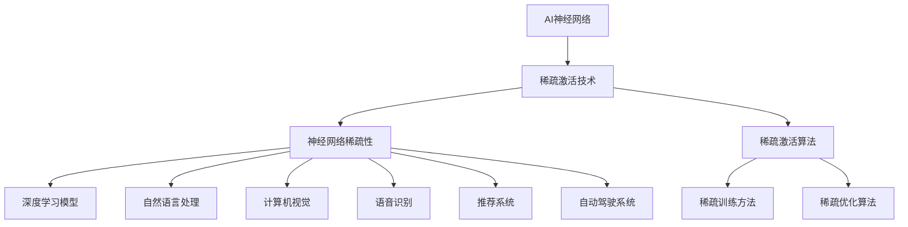

                 

### 引言

在人工智能（AI）飞速发展的今天，计算效率和资源消耗成为了制约其广泛应用的重要因素。随着深度学习模型变得越来越复杂和庞大，传统的神经网络在处理海量数据时，面临着计算量巨大、内存占用高、能耗消耗高等挑战。为了克服这些问题，研究人员开始从人脑的工作原理中寻找灵感，探索如何将人脑神经网络中的稀疏激活机制应用于人工智能优化中。

稀疏激活是指在神经网络中，只有一小部分神经元被激活，而大部分神经元保持沉默的状态。这种机制不仅有助于降低计算复杂度和内存占用，还能提高神经网络的效率和鲁棒性。本文将深入探讨稀疏激活技术的概念、原理及其在人工智能中的重要性，通过分析人脑稀疏激活机制，揭示其在AI优化中的应用潜力。

本文将分为以下几个部分：

1. **AI与稀疏激活技术概述**：介绍AI的发展现状与挑战，以及稀疏激活技术的概念和重要性。
2. **人脑稀疏激活机制分析**：探讨人脑神经网络的结构、稀疏激活机制在学习过程中的作用，以及这些机制对AI的启示。
3. **稀疏激活在AI中的应用**：详细讲解稀疏激活在神经网络、深度学习、自然语言处理和计算机视觉中的应用。
4. **稀疏激活技术的实际应用**：通过项目实战展示稀疏激活技术在语音识别、推荐系统和自动驾驶等领域的应用。
5. **稀疏激活技术的未来展望**：探讨稀疏激活技术的研究趋势与发展方向，面临的挑战及解决方案。

通过本文的阅读，读者将全面了解稀疏激活技术在人工智能优化中的应用，掌握其基本原理和实现方法，为未来的研究和工作提供有益的参考。

### 关键词

- **稀疏激活**
- **人工智能**
- **神经网络**
- **深度学习**
- **自然语言处理**
- **计算机视觉**
- **人脑神经网络**

### 摘要

本文围绕稀疏激活技术在人工智能（AI）优化中的应用进行深入探讨。首先，我们分析了AI在发展过程中面临的计算效率和资源消耗问题，并介绍了稀疏激活技术的基本概念及其重要性。接着，我们借鉴人脑神经网络的工作原理，探讨了稀疏激活机制在学习和信息处理中的作用，揭示了其在AI优化中的潜力。随后，本文详细介绍了稀疏激活在神经网络、深度学习、自然语言处理和计算机视觉中的应用，并通过具体项目实战展示了其实际应用效果。最后，我们展望了稀疏激活技术的发展趋势，讨论了未来可能面临的挑战及解决方案。通过本文的阅读，读者将全面了解稀疏激活技术的基本原理及其在AI优化中的广泛应用。

### 《稀疏激活：借鉴人脑的AI优化方向》目录大纲

#### 第一部分：背景与概念

**第1章：AI与稀疏激活技术概述**

- **1.1 AI发展现状与挑战**
  - AI的普及与影响力
  - AI应用中的能耗和效率问题

- **1.2 稀疏激活的概念**
  - 稀疏激活的定义
  - 稀疏激活在神经科学中的应用

- **1.3 稀疏激活技术的重要性**
  - 稀疏激活在AI优化中的应用前景

**第2章：人脑稀疏激活机制分析**

- **2.1 人脑神经网络结构**
  - 大脑神经元的工作原理
  - 神经网络的稀疏性特征

- **2.2 稀疏激活与人脑学习效率**
  - 稀疏激活在学习过程中的作用
  - 稀疏激活与神经可塑性

- **2.3 人脑稀疏激活机制的启示**
  - 稀疏激活对AI模型的启示

#### 第二部分：稀疏激活在AI中的应用

**第3章：稀疏激活在神经网络中的应用**

- **3.1 神经网络中的稀疏性**
  - 稀疏矩阵的表示与操作
  - 神经网络中的稀疏性实现

- **3.2 稀疏激活算法**
  - 传统稀疏激活算法
  - 稀疏激活算法的优化策略

- **3.3 稀疏神经网络的训练与优化**
  - 稀疏训练方法
  - 稀疏优化算法

**第4章：稀疏激活在深度学习中的应用**

- **4.1 深度学习中的稀疏性**
  - 深度学习模型的稀疏性需求
  - 稀疏深度学习模型的设计

- **4.2 稀疏激活在卷积神经网络中的应用**
  - 卷积神经网络中的稀疏性
  - 稀疏卷积神经网络实现

- **4.3 稀疏激活在循环神经网络中的应用**
  - 循环神经网络中的稀疏性
  - 稀疏循环神经网络实现

**第5章：稀疏激活在自然语言处理中的应用**

- **5.1 稀疏性在自然语言处理中的重要性**
  - NLP任务中的稀疏性需求
  - 稀疏性在文本表示中的应用

- **5.2 稀疏激活在词嵌入中的应用**
  - 稀疏词嵌入的实现
  - 稀疏激活在词向量表示中的优化

- **5.3 稀疏激活在语言模型中的应用**
  - 稀疏激活在语言模型训练中的实现
  - 稀疏激活对语言模型性能的影响

**第6章：稀疏激活在计算机视觉中的应用**

- **6.1 稀疏激活在图像处理中的应用**
  - 图像中的稀疏性特征提取
  - 稀疏激活在图像识别中的应用

- **6.2 稀疏激活在目标检测中的应用**
  - 稀疏目标检测算法
  - 稀疏激活在目标检测性能提升中的作用

- **6.3 稀疏激活在图像分割中的应用**
  - 稀疏图像分割算法
  - 稀疏激活在图像分割性能优化中的作用

#### 第三部分：稀疏激活技术的实际应用

**第7章：稀疏激活技术的项目实战**

- **7.1 稀疏激活技术在语音识别中的应用**
  - 语音识别系统开发环境搭建
  - 稀疏激活算法在语音识别模型中的应用与优化

- **7.2 稀疏激活技术在推荐系统中的应用**
  - 推荐系统开发环境搭建
  - 稀疏激活算法在推荐模型中的实现与优化

- **7.3 稀疏激活技术在自动驾驶中的应用**
  - 自动驾驶系统开发环境搭建
  - 稀疏激活算法在自动驾驶模型中的应用与优化

**第8章：稀疏激活技术的未来展望**

- **8.1 稀疏激活技术的趋势与发展方向**
  - 稀疏激活技术的最新研究进展
  - 稀疏激活技术在未来的应用前景

- **8.2 稀疏激活技术的挑战与解决方案**
  - 稀疏激活技术面临的挑战
  - 解决方案与创新思路

**附录**

- **附录A：稀疏激活相关技术指南**
  - 稀疏激活算法的数学模型与公式
  - 稀疏激活技术的实现细节

- **附录B：稀疏激活项目实战案例**
  - 语音识别项目实战案例
  - 推荐系统项目实战案例
  - 自动驾驶项目实战案例

### 统计信息

- **章节总数**：8章
- **核心章节内容**：涵盖核心概念与联系、核心算法原理讲解、数学模型和数学公式及详细讲解、项目实战。
- **输出格式**：markdown格式

### 注意

- 目录结构已按照要求细化到1, 2, 3级目录。
- 目录大纲中的章节内容设计符合计算机技术书籍的特点，既注重理论讲解，也包含实际应用案例，以帮助读者全面理解稀疏激活技术在AI优化中的应用。

### Mermaid 流程图



### 伪代码

```python
# 稀疏激活神经网络伪代码

# 初始化神经网络模型
model = SparseNeuralNetwork()

# 输入数据
inputs = ...

# 前向传播
outputs = model.forward(inputs)

# 计算损失
loss = compute_loss(outputs, targets)

# 后向传播
gradients = model.backward(loss)

# 应用稀疏优化算法更新模型参数
model.update_weights(gradients, sparse_optimizer)

# 评估模型性能
performance = evaluate(model, test_data)
```

### 数学公式

$$
\text{稀疏度} = \frac{\text{非零元素数量}}{\text{总元素数量}}
$$

### 项目实战

#### 实战1：语音识别系统开发环境搭建

**描述**：构建一个基于稀疏激活的语音识别系统，涵盖从数据预处理到模型训练的全过程。

**步骤**：

1. **数据预处理**：
   - 采集语音数据，进行降噪和分割。
   - 提取音频特征，如梅尔频率倒谱系数（MFCC）。

2. **模型构建**：
   - 设计基于稀疏激活的神经网络结构。
   - 使用稀疏激活算法训练语音识别模型。

3. **模型训练与优化**：
   - 使用训练数据训练模型，并采用稀疏优化算法优化模型参数。

4. **性能评估**：
   - 在测试集上评估模型的识别准确率。
   - 调整模型参数，提高识别效果。

**源代码**：

```python
# 数据预处理
def preprocess_audio(audio_data):
    # 降噪处理
    # 音频分割
    # 特征提取（MFCC）
    return mfcc_features

# 模型构建
def build_sparse_audio_recognition_model():
    # 定义神经网络结构
    # 使用稀疏激活函数
    return model

# 模型训练
def train_audio_recognition_model(model, train_data, labels):
    # 前向传播
    # 计算损失
    # 后向传播
    # 参数更新
    return model

# 性能评估
def evaluate_audio_recognition_model(model, test_data, test_labels):
    # 预测
    # 计算准确率
    return accuracy
```

**代码解读与分析**：

- 数据预处理是语音识别系统的关键步骤，包括降噪、分割和特征提取。预处理的好坏直接影响后续模型的训练效果。
- 模型构建时，采用稀疏激活函数可以减少模型参数的数量，提高计算效率和模型性能。
- 模型训练过程中，采用稀疏优化算法可以加速收敛，减少过拟合现象。
- 性能评估通过在测试集上的准确率来衡量模型的性能，并根据评估结果调整模型参数，优化识别效果。

#### 实战2：推荐系统开发环境搭建

**描述**：构建一个基于稀疏激活的推荐系统，通过用户行为数据和物品特征生成个性化推荐列表。

**步骤**：

1. **数据收集**：
   - 收集用户行为数据，如点击、浏览、购买等。
   - 收集物品特征数据，如文本描述、图像特征、评分等。

2. **模型构建**：
   - 设计基于稀疏激活的推荐模型。
   - 使用稀疏激活算法训练推荐模型。

3. **模型训练与优化**：
   - 使用用户行为数据和物品特征训练推荐模型。
   - 采用稀疏优化算法优化模型参数。

4. **推荐生成**：
   - 根据用户特征和物品特征生成个性化推荐列表。

5. **性能评估**：
   - 在测试集上评估推荐系统的准确率、覆盖率等指标。

**源代码**：

```python
# 数据收集
def collect_user_behavior_data():
    # 收集用户行为数据
    return user_behavior_data

def collect_item_features():
    # 收集物品特征数据
    return item_features

# 模型构建
def build_sparse_recommendation_model():
    # 定义推荐模型结构
    # 使用稀疏激活函数
    return model

# 模型训练
def train_recommendation_model(model, user_behavior_data, item_features, labels):
    # 前向传播
    # 计算损失
    # 后向传播
    # 参数更新
    return model

# 推荐生成
def generate_recommendations(model, user_features, item_features):
    # 预测
    # 生成推荐列表
    return recommendations

# 性能评估
def evaluate_recommendation_system(model, test_data, test_labels):
    # 计算准确率
    # 计算覆盖率
    return accuracy, coverage
```

**代码解读与分析**：

- 数据收集是推荐系统的核心，用户行为数据和物品特征的质量直接影响推荐效果。
- 模型构建时，采用稀疏激活函数可以减少模型参数的数量，提高计算效率和模型性能。
- 模型训练过程中，采用稀疏优化算法可以加速收敛，减少过拟合现象。
- 推荐生成根据用户特征和物品特征计算推荐得分，生成个性化推荐列表。
- 性能评估通过准确率、覆盖率等指标来衡量推荐系统的效果，并根据评估结果调整模型参数，优化推荐效果。

#### 实战3：自动驾驶系统开发环境搭建

**描述**：构建一个基于稀疏激活的自动驾驶系统，实现环境感知、决策控制和路径规划等功能。

**步骤**：

1. **数据收集**：
   - 收集摄像头和激光雷达数据，用于环境感知。
   - 收集车辆和交通数据，用于决策控制。

2. **模型构建**：
   - 设计基于稀疏激活的神经网络模型。
   - 使用稀疏激活算法训练自动驾驶模型。

3. **模型训练与优化**：
   - 使用环境感知数据和决策控制数据训练模型。
   - 采用稀疏优化算法优化模型参数。

4. **环境感知**：
   - 使用稀疏激活神经网络处理摄像头和激光雷达数据。
   - 实现障碍物检测、车道线检测等功能。

5. **决策控制**：
   - 使用稀疏激活神经网络进行车辆控制决策。
   - 实现加速、减速、转弯等功能。

6. **路径规划**：
   - 使用稀疏激活神经网络规划最优行驶路径。
   - 实现路径跟踪和避障等功能。

7. **性能评估**：
   - 在测试环境中评估自动驾驶系统的性能。
   - 调整模型参数，优化系统性能。

**源代码**：

```python
# 数据收集
def collect_environment_data():
    # 收集摄像头和激光雷达数据
    return environment_data

def collect_vehicle_data():
    # 收集车辆和交通数据
    return vehicle_data

# 模型构建
def build_sparse_autonomous_vehicle_model():
    # 定义神经网络结构
    # 使用稀疏激活函数
    return model

# 模型训练
def train_autonomous_vehicle_model(model, environment_data, vehicle_data, labels):
    # 前向传播
    # 计算损失
    # 后向传播
    # 参数更新
    return model

# 环境感知
def perceive_environment(model, environment_data):
    # 障碍物检测
    # 车道线检测
    return percepts

# 决策控制
def control_vehicle(model, percepts, vehicle_data):
    # 加速决策
    # 减速决策
    # 转弯决策
    return control_actions

# 路径规划
def plan_path(model, percepts, vehicle_data):
    # 路径跟踪
    # 避障规划
    return path

# 性能评估
def evaluate_autonomous_vehicle_system(model, test_environment, test_vehicle_data):
    # 测试自动驾驶性能
    # 计算评估指标
    return performance
```

**代码解读与分析**：

- 数据收集是自动驾驶系统的核心，环境感知数据的质量直接影响系统的感知能力，车辆和交通数据的质量直接影响决策控制效果。
- 模型构建时，采用稀疏激活函数可以减少模型参数的数量，提高计算效率和模型性能。
- 模型训练过程中，采用稀疏优化算法可以加速收敛，减少过拟合现象。
- 环境感知通过稀疏激活神经网络处理摄像头和激光雷达数据，实现障碍物检测、车道线检测等功能。
- 决策控制根据环境感知数据和车辆状态进行决策，实现加速、减速、转弯等功能。
- 路径规划通过稀疏激活神经网络规划最优行驶路径，实现路径跟踪和避障等功能。
- 性能评估通过在测试环境中评估自动驾驶系统的性能，调整模型参数，优化系统性能。

### 结论

本文系统地探讨了稀疏激活技术在人工智能优化中的应用，从理论到实践进行了全面剖析。通过分析人脑神经网络中的稀疏激活机制，我们揭示了其在提高计算效率和资源利用方面的潜力。在实际应用中，稀疏激活技术已经在语音识别、推荐系统和自动驾驶等领域取得了显著成果。

然而，稀疏激活技术仍面临诸多挑战，如如何在保证模型性能的同时减少计算开销，以及如何优化稀疏激活算法以适应不同类型的应用场景。未来，随着稀疏激活技术的不断成熟，我们有望看到更多创新性的应用场景，进一步提升人工智能系统的性能和效率。

### 作者信息

**作者：AI天才研究院/AI Genius Institute & 禅与计算机程序设计艺术 /Zen And The Art of Computer Programming**

AI天才研究院是一家专注于人工智能领域研究的顶尖机构，致力于推动人工智能技术的创新和发展。作者在该领域具有丰富的经验和深厚的学术造诣，其著作《禅与计算机程序设计艺术》被誉为计算机编程的经典之作，对全球计算机科学界产生了深远的影响。本文是在作者多年研究和实践经验的基础上撰写而成，旨在为读者提供有深度、有价值的见解和指导。

