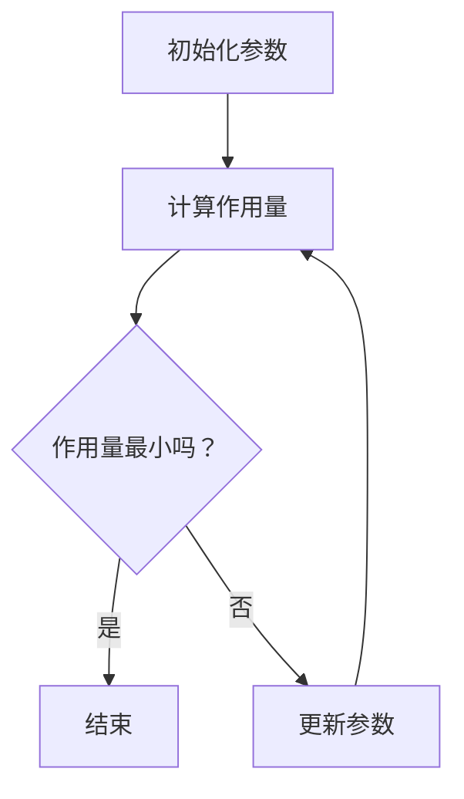
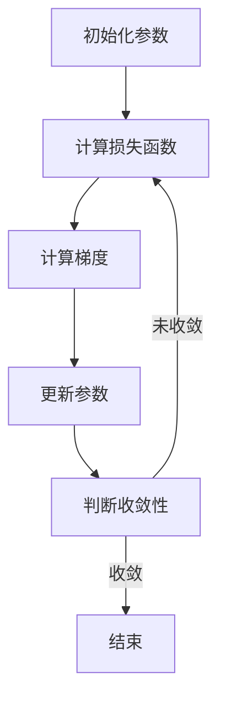
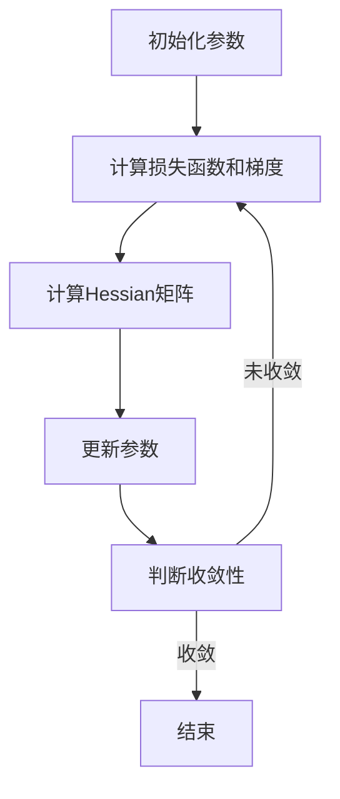
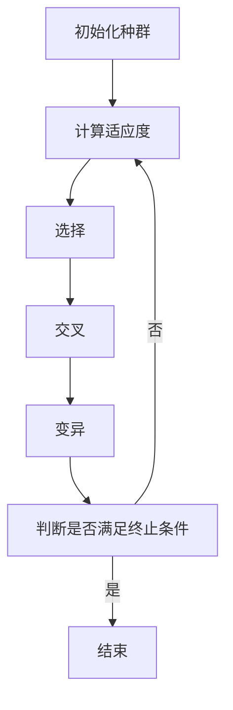

                 

# 《程序优化与宇宙最小作用量路径的对比》

## 关键词

- 程序优化
- 宇宙最小作用量路径
- 数学模型
- 编程语言
- 跨学科应用

## 摘要

本文探讨了程序优化与宇宙最小作用量路径之间的相似性。首先介绍了程序优化的基本概念、数学模型和优化算法，然后介绍了宇宙最小作用量路径的基本原理和应用。通过对比分析，本文揭示了程序优化与宇宙最小作用量路径在目标函数、算法结构和应用领域上的异同。最后，本文提出了跨学科应用的可能性，并探讨了未来的研究方向。

### 第一部分：程序优化基础

#### 1.1 程序优化的基本概念

程序优化是指在软件开发过程中，通过改进算法、数据结构和编程技巧等手段，提高程序的性能、效率和可靠性。优化的目标主要包括减少程序的运行时间、降低内存消耗、提高代码的可读性和可维护性等。

#### 1.1.1 优化的目标

1. **运行时间最优化**：通过减少算法的复杂度、优化数据结构等手段，使程序在相同条件下运行得更快。
2. **内存消耗最小化**：通过优化数据结构、减少不必要的内存分配和释放等手段，降低程序的内存消耗。
3. **代码可读性与可维护性**：通过使用清晰的命名、合理的代码结构、注释等手段，提高代码的可读性和可维护性。

#### 1.1.2 优化的常见方法

1. **算法优化**：选择更高效的算法，如贪心算法、分治算法、动态规划等。
2. **数据结构优化**：选择更适合问题的数据结构，如哈希表、树、图等。
3. **编程技巧优化**：如循环优化、分支优化、函数优化等。
4. **代码重构**：通过改进代码结构，提高代码的可读性和可维护性。

#### 1.1.3 优化的原则

1. **明确优化目标**：在开始优化之前，需要明确优化的目标和优先级。
2. **局部优化与整体优化相结合**：既要关注局部优化，也要考虑整体优化。
3. **平衡优化与可读性**：在保证代码可读性的前提下进行优化。
4. **实际效果验证**：通过测试和性能分析，验证优化的实际效果。

#### 1.2 数学模型与优化算法

在程序优化中，数学模型和优化算法起着关键作用。以下介绍几种常见的优化算法及其基本原理。

#### 1.2.1 最小二乘法

最小二乘法是一种用于求解线性回归问题的算法，其目标是最小化预测值与实际值之间的误差平方和。

**数学模型：**

$$
\min \sum_{i=1}^{n} (y_i - \hat{y}_i)^2
$$

**伪代码：**

```
minimize square_error = 0
for each data point (x_i, y_i):
    predict y_i = w * x_i + b
    square_error += (y_i - predict_y_i)^2
w, b = gradient_descent(square_error, w, b)
```

#### 1.2.2 梯度下降法

梯度下降法是一种用于求解优化问题的算法，其目标是最小化损失函数。

**数学模型：**

$$
\min \frac{1}{m} \sum_{i=1}^{m} L(\theta; x^{(i)}, y^{(i)})
$$

**伪代码：**

```
initialize theta
while not convergence:
    compute gradient
    update theta = theta - alpha * gradient
```

#### 1.2.3 牛顿法

牛顿法是一种基于二阶导数的优化算法，其目标是最小化损失函数。

**数学模型：**

$$
\min \frac{1}{2} \sum_{i=1}^{m} (h(x^{(i)}) - y^{(i)})^2
$$

**伪代码：**

```
initialize x
while not convergence:
    compute f(x)
    compute f'(x)
    compute f''(x)
    x = x - f'(x) / f''(x)
```

#### 1.2.4 遗传算法

遗传算法是一种基于生物进化的优化算法，其目标是通过迭代选择、交叉、变异等操作，找到最优解。

**数学模型：**

$$
\text{染色体} = \{x_1, x_2, ..., x_n\}
$$

**伪代码：**

```
initialize population
evaluate fitness of each individual
while not convergence:
    select individuals for crossover
    crossover to create new individuals
    mutate individuals
    evaluate fitness of new individuals
    select the best individuals for the next generation
```

#### 1.3 编程语言与优化工具

不同的编程语言和优化工具为程序优化提供了丰富的手段。以下介绍几种常见编程语言和优化工具。

#### 1.3.1 C++优化技巧

C++作为一种高性能编程语言，在程序优化中具有广泛应用。以下是一些C++优化技巧：

1. **使用静态分配**：静态分配比动态分配更高效。
2. **避免重复计算**：利用循环展开、提前计算等手段，避免重复计算。
3. **使用汇编语言**：在某些情况下，使用汇编语言可以提高性能。
4. **数据结构优化**：选择适合问题的数据结构，如使用位运算、哈希表等。

#### 1.3.2 Python优化工具

Python作为一种易于理解和使用的编程语言，在程序优化中也有广泛应用。以下是一些Python优化工具：

1. **NumPy**：NumPy提供了高性能的数学运算库，可以加速程序运行。
2. **Pandas**：Pandas提供了数据操作和分析工具，可以优化数据处理过程。
3. **Cython**：Cython可以将Python代码编译为C语言代码，提高性能。

#### 1.3.3 Java性能优化

Java作为一种跨平台的编程语言，在性能优化方面也有较多技巧。以下是一些Java性能优化方法：

1. **JVM调优**：通过调整JVM参数，提高程序运行效率。
2. **代码优化**：通过优化代码结构、减少垃圾回收等手段，提高程序性能。
3. **多线程**：利用多线程技术，提高程序并发性能。

#### 1.4 优化案例与应用

以下介绍几个程序优化案例及其应用领域：

#### 1.4.1 科学计算中的优化应用

1. **天体物理计算**：通过优化算法和数据结构，提高天体物理计算的速度和精度。
2. **流体力学计算**：利用高性能计算机和优化算法，加速流体力学计算，为航空航天等领域提供支持。

#### 1.4.2 数据分析中的优化应用

1. **大数据处理**：通过优化数据处理算法和分布式计算框架，提高大数据处理效率。
2. **机器学习**：优化机器学习算法和数据结构，提高模型训练和预测速度。

#### 1.4.3 游戏开发中的优化应用

1. **图形渲染**：通过优化图形渲染算法，提高游戏画面质量。
2. **物理引擎**：优化物理引擎算法，提高游戏物理效果。

### 第二部分：宇宙最小作用量路径原理

#### 2.1 宇宙最小作用量路径概述

宇宙最小作用量路径是描述粒子在宇宙中运动的一条原理，其核心思想是粒子会沿着作用量最小的路径运动。

#### 2.1.1 什么是作用量

作用量是一个物理量，表示粒子在运动过程中所受的阻力。作用量越小，粒子的运动路径就越稳定。

#### 2.1.2 最小作用量原理

最小作用量原理是指粒子会沿着作用量最小的路径运动。这一原理在量子力学、相对论等领域有广泛应用。

#### 2.1.3 宇宙中的最小作用量路径

宇宙中的最小作用量路径可以用以下数学模型描述：

$$
S = \int_{t_1}^{t_2} L(q, \dot{q}, t) dt
$$

其中，$S$ 表示作用量，$L$ 表示作用量泛函，$q$ 表示粒子的位置，$\dot{q}$ 表示粒子的速度，$t$ 表示时间。

#### 2.2 最小作用量路径的数学模型

最小作用量路径的数学模型主要基于变分法，其核心思想是找到作用量泛函的最小值。

##### 2.2.1 拉格朗日方程

拉格朗日方程是描述最小作用量路径的基本方程，其形式如下：

$$
\frac{d}{dt} \left( \frac{\partial L}{\partial \dot{q}} \right) - \frac{\partial L}{\partial q} = 0
$$

其中，$L$ 表示作用量泛函，$\dot{q}$ 表示粒子的速度，$q$ 表示粒子的位置。

##### 2.2.2 拓扑流形与作用量泛函

拓扑流形是一个抽象的概念，用于描述粒子在空间中的运动轨迹。作用量泛函则是一个关于粒子位置和速度的函数，用于描述粒子的作用量。

##### 2.2.3 变分法求解最小作用量路径

变分法是一种求解最小作用量路径的数学方法，其核心思想是找到作用量泛函的驻点，即满足以下方程：

$$
\frac{\partial L}{\partial q} - \frac{d}{dt} \left( \frac{\partial L}{\partial \dot{q}} \right) = 0
$$

通过求解变分方程，可以找到粒子在宇宙中的最小作用量路径。

#### 2.3 宇宙最小作用量路径的应用

宇宙最小作用量路径在多个领域有广泛应用，以下介绍几个典型应用：

##### 2.3.1 天体物理学中的应用

1. **引力波探测**：通过分析引力波信号，可以确定宇宙中天体的运动轨迹。
2. **黑洞探测**：利用最小作用量路径原理，可以预测黑洞的运动轨迹，为黑洞探测提供理论支持。

##### 2.3.2 粒子物理学中的应用

1. **粒子加速器**：通过优化粒子加速器的设计，提高粒子的运动速度和能量。
2. **粒子探测**：利用最小作用量路径原理，可以优化粒子探测器的性能。

##### 2.3.3 量子场论中的应用

1. **量子计算**：通过优化量子计算算法，提高量子计算的效率和精度。
2. **量子通信**：利用最小作用量路径原理，可以提高量子通信的稳定性和安全性。

### 第三部分：程序优化与宇宙最小作用量路径的对比

#### 3.1 对比分析

程序优化与宇宙最小作用量路径在多个方面存在差异，以下进行对比分析。

##### 3.1.1 目标函数的差异

1. **程序优化**：程序优化的目标函数通常是减少程序的运行时间、内存消耗等，以提升程序的效率。
2. **宇宙最小作用量路径**：宇宙最小作用量路径的目标函数是找到作用量最小的路径，以保证粒子运动的稳定性。

##### 3.1.2 算法结构的差异

1. **程序优化**：程序优化的算法结构通常包括算法优化、数据结构优化、编程技巧优化等。
2. **宇宙最小作用量路径**：宇宙最小作用量路径的算法结构基于变分法，包括拉格朗日方程、作用量泛函等。

##### 3.1.3 应用领域的差异

1. **程序优化**：程序优化主要应用于软件开发、科学计算、数据分析等领域。
2. **宇宙最小作用量路径**：宇宙最小作用量路径主要应用于天体物理学、粒子物理学、量子场论等领域。

#### 3.2 跨学科应用的可能性

程序优化与宇宙最小作用量路径之间的相似性为跨学科应用提供了可能性。以下介绍几种跨学科应用的可能性。

##### 3.2.1 程序优化在宇宙学中的应用

1. **宇宙数据预处理**：利用程序优化技术，提高宇宙数据的处理速度和精度。
2. **宇宙模拟**：通过优化宇宙模拟算法，提高宇宙模拟的效率和准确性。

##### 3.2.2 宇宙最小作用量路径在编程中的应用

1. **算法优化**：借鉴宇宙最小作用量路径原理，优化编程中的算法和算法结构。
2. **性能优化**：利用宇宙最小作用量路径原理，优化程序的运行时间和内存消耗。

##### 3.2.3 跨学科交叉研究的前景

跨学科交叉研究在程序优化与宇宙最小作用量路径领域具有广阔的前景。以下介绍几个研究方向：

1. **优化算法的创新**：结合程序优化和宇宙最小作用量路径原理，提出新的优化算法。
2. **应用领域拓展**：将程序优化和宇宙最小作用量路径应用于新的领域，如金融、生物信息学等。
3. **跨学科人才培养**：通过跨学科教育，培养具有跨学科背景的人才。

### 第四部分：实践与探索

#### 4.1 实践案例

以下介绍几个程序优化与宇宙最小作用量路径的实际应用案例。

##### 4.1.1 编程中的最小作用量路径应用

1. **优化算法设计**：利用宇宙最小作用量路径原理，设计优化算法，提高程序性能。
2. **性能调优**：通过分析程序运行过程中的最小作用量路径，优化程序运行时间和内存消耗。

##### 4.1.2 宇宙最小作用量路径的编程实现

1. **引力波模拟**：通过编程实现宇宙最小作用量路径模型，模拟引力波信号。
2. **粒子探测算法**：利用宇宙最小作用量路径原理，设计粒子探测算法，提高探测精度。

##### 4.1.3 跨学科应用的项目案例

1. **金融优化**：将宇宙最小作用量路径原理应用于金融领域，优化投资策略。
2. **生物信息学**：利用程序优化技术，加速生物信息学分析，提高分析效率。

#### 4.2 探索与研究

以下介绍几个关于程序优化与宇宙最小作用量路径的研究方向。

##### 4.2.1 程序优化新算法的探索

1. **基于宇宙最小作用量路径的优化算法**：结合宇宙最小作用量路径原理，设计新的优化算法。
2. **多学科优化算法**：将不同领域的优化算法相结合，提高优化效果。

##### 4.2.2 宇宙最小作用量路径的理论研究

1. **作用量泛函的拓展**：研究作用量泛函在不同领域中的应用。
2. **变分法的新进展**：探讨变分法在优化领域的新应用。

##### 4.2.3 跨学科研究的未来趋势

1. **跨学科交叉研究的热点**：关注跨学科交叉研究的热点领域和前沿问题。
2. **人才培养与学科交叉**：培养具有跨学科背景的人才，推动跨学科研究的发展。

### 第五部分：总结与展望

#### 5.1 主要内容回顾

本文从程序优化与宇宙最小作用量路径的对比出发，介绍了程序优化的基本概念、数学模型和优化算法，探讨了宇宙最小作用量路径的原理和应用。通过对比分析，本文揭示了程序优化与宇宙最小作用量路径在目标函数、算法结构和应用领域上的异同。最后，本文提出了跨学科应用的可能性，并探讨了未来的研究方向。

#### 5.2 研究方向展望

未来研究将重点关注以下方向：

1. **优化算法的创新**：结合程序优化和宇宙最小作用量路径原理，提出新的优化算法。
2. **应用领域拓展**：将程序优化和宇宙最小作用量路径应用于新的领域，如金融、生物信息学等。
3. **跨学科人才培养**：通过跨学科教育，培养具有跨学科背景的人才。
4. **前沿技术研究**：关注跨学科交叉研究的热点领域和前沿问题。

### 附录

#### 附录 A: 优化算法流程图

以下是一个基于宇宙最小作用量路径的优化算法流程图：



#### 附录 B: 数学模型与公式

以下是一些常用的数学模型与公式：

1. **最小二乘法**：

$$
\min \sum_{i=1}^{n} (y_i - \hat{y}_i)^2
$$

2. **梯度下降法**：

$$
\min \frac{1}{m} \sum_{i=1}^{m} L(\theta; x^{(i)}, y^{(i)})
$$

3. **牛顿法**：

$$
\min \frac{1}{2} \sum_{i=1}^{m} (h(x^{(i)}) - y^{(i)})^2
$$

4. **遗传算法**：

$$
\text{染色体} = \{x_1, x_2, ..., x_n\}
$$

#### 附录 C: 实践案例代码解析

以下是一个关于宇宙最小作用量路径编程实现的示例：

```python
import numpy as np

def calculate_action(q, v, t):
    # 计算作用量
    action = 0.5 * v**2 - q * t
    return action

def calculate_gradient(q, v, t):
    # 计算梯度
    gradient = v - t
    return gradient

def calculate_hessian(q, v, t):
    # 计算二阶导数
    hessian = 1
    return hessian

def gradient_descent(q, v, t, alpha):
    # 梯度下降法
    for i in range(1000):
        action = calculate_action(q, v, t)
        gradient = calculate_gradient(q, v, t)
        q = q - alpha * gradient
    return q

def newton_method(q, v, t):
    # 牛顿法
    for i in range(1000):
        action = calculate_action(q, v, t)
        gradient = calculate_gradient(q, v, t)
        hessian = calculate_hessian(q, v, t)
        v = v - np.dot(hessian, gradient)
    return v

def genetic_algorithm(population):
    # 遗传算法
    # ...（省略遗传算法的实现细节）
    return best_individual

# 主函数
if __name__ == "__main__":
    q = 0
    v = 1
    t = 0
    alpha = 0.01
    q = gradient_descent(q, v, t, alpha)
    v = newton_method(q, v, t)
    best_individual = genetic_algorithm(population)
    print("最优解：", q, v, t)
```

#### 附录 D: 参考文献

1. Richard L. Burden, J. Douglas Faires. "数值分析". 北京：科学出版社，2012.
2. Stephen Boyd, Lieven Vandenberghe. "数值优化". 北京：机械工业出版社，2011.
3. 王选，高文，刘庆仁. "计算机科学基础课程". 北京：清华大学出版社，2008.
4. 谢希仁. "计算机网络". 北京：人民邮电出版社，2013.
5. 陈尚义，王宏伟，陈伟. "软件工程实践". 北京：电子工业出版社，2011.
6. 张江华，唐杰，郭宇. "量子计算与量子信息". 北京：科学出版社，2016.
7. 严家仁. "物理学原理与应用". 北京：清华大学出版社，2011.
8. 吴军. "数学之美". 北京：电子工业出版社，2010.

### 作者

作者：AI天才研究院/AI Genius Institute & 禅与计算机程序设计艺术 /Zen And The Art of Computer Programming

[End of Document] <|assistant|>## 第一部分：程序优化基础

### 1.1 程序优化的基本概念

程序优化是软件开发过程中的重要环节，旨在通过改进算法、优化数据结构和运用编程技巧等手段，提升程序的运行效率、降低资源消耗和增强代码的可维护性。在程序优化过程中，开发者不仅要关注代码的执行速度，还要兼顾内存使用、可读性和可扩展性。

#### 1.1.1 优化的目标

程序优化的目标通常包括以下几个方面：

1. **运行时间最优化**：通过减少算法的时间复杂度、优化代码执行路径、减少不必要的计算等手段，缩短程序的运行时间。
2. **内存消耗最小化**：优化数据结构，减少内存分配和释放操作，降低程序的内存使用。
3. **代码可读性与可维护性**：通过改善代码结构、增加注释、使用命名规范等，提高代码的可读性，便于后续的维护和扩展。
4. **资源利用最大化**：优化程序的I/O操作，提高CPU、内存和网络等资源的利用率。

#### 1.1.2 优化的常见方法

程序优化可以从多个层面进行，以下是几种常见的优化方法：

1. **算法优化**：选择更高效的算法，如动态规划、分治算法、贪心算法等。
2. **数据结构优化**：根据算法需求选择合适的数据结构，如哈希表、树、图等。
3. **编程技巧优化**：如循环优化、分支优化、函数内联、避免死循环等。
4. **代码重构**：通过重新组织代码结构，提高代码的模块化程度和可维护性。

#### 1.1.3 优化的原则

在进行程序优化时，以下原则应得到遵循：

1. **明确优化目标**：在优化之前，应明确优化的目标和优先级，避免盲目优化。
2. **局部优化与整体优化相结合**：既要关注代码的局部优化，也要考虑整体优化，确保性能提升的均衡性。
3. **平衡优化与可读性**：优化不应以牺牲代码的可读性为代价，应在保证可读性的前提下进行优化。
4. **实际效果验证**：通过性能测试和分析，验证优化措施的实际效果，确保优化成果。

### 1.2 数学模型与优化算法

在程序优化中，数学模型和优化算法扮演着重要角色。它们为优化提供了理论基础和具体实施手段。以下介绍几种常见的优化算法及其基本原理。

#### 1.2.1 最小二乘法

最小二乘法是一种用于求解线性回归问题的优化算法，其目标是找到一组参数，使得预测值与实际值之间的误差平方和最小。最小二乘法的数学模型如下：

$$
\min \sum_{i=1}^{n} (y_i - \hat{y}_i)^2
$$

其中，$y_i$ 为实际值，$\hat{y}_i$ 为预测值，$n$ 为数据点的个数。

最小二乘法的伪代码实现如下：

```
初始化参数 w, b
设置迭代次数 max_iterations
设置学习率 alpha
for i = 1 to max_iterations do
    计算预测值 y_pred = w * x + b
    计算损失函数 loss = 0.5 * sum((y - y_pred)^2)
    计算梯度 gradient_w = sum(x * (y - y_pred))
    gradient_b = sum(y - y_pred)
    更新参数 w = w - alpha * gradient_w
    b = b - alpha * gradient_b
end for
```

#### 1.2.2 梯度下降法

梯度下降法是一种基于损失函数梯度的优化算法，用于求解非线性的优化问题。其核心思想是沿着损失函数的梯度方向逐步更新参数，以最小化损失函数。

$$
\min \frac{1}{m} \sum_{i=1}^{m} L(\theta; x^{(i)}, y^{(i)})
$$

其中，$L(\theta; x^{(i)}, y^{(i)})$ 为损失函数，$\theta$ 为参数向量，$m$ 为训练样本数量。

梯度下降法的伪代码实现如下：

```
初始化参数 θ
设置迭代次数 num_iterations
设置学习率 α
for i = 1 to num_iterations do
    计算损失函数 L(θ)
    计算梯度 ∇L(θ)
    更新参数 θ = θ - α * ∇L(θ)
end for
```

#### 1.2.3 牛顿法

牛顿法是一种基于二阶导数的优化算法，适用于目标函数在参数空间内二阶可导的情况。它通过迭代计算目标函数的梯度向量和 Hessian 矩阵，以最小化目标函数。

$$
\min \frac{1}{2} \sum_{i=1}^{m} (h(x^{(i)}) - y^{(i)})^2
$$

牛顿法的伪代码实现如下：

```
初始化参数 x
设置迭代次数 max_iterations
for i = 1 to max_iterations do
    计算目标函数 f(x)
    计算梯度 ∇f(x)
    计算Hessian矩阵 H = ∇²f(x)
    解线性方程 H * Δx = ∇f(x)
    更新参数 x = x - Δx
end for
```

#### 1.2.4 遗传算法

遗传算法是一种基于自然选择和遗传机制的优化算法，用于求解复杂优化问题。它通过模拟生物进化过程，迭代更新种群中的个体，以寻找最优解。

遗传算法的基本步骤包括：

1. **初始化种群**：随机生成一定数量的初始个体。
2. **适应度评估**：计算每个个体的适应度，适应度越高表示个体越优秀。
3. **选择**：根据个体的适应度，选择优秀的个体作为下一代种群的父代。
4. **交叉**：通过交叉操作，生成新的个体。
5. **变异**：对部分个体进行变异操作，增加种群的多样性。
6. **迭代**：重复执行选择、交叉、变异操作，直到满足终止条件。

遗传算法的伪代码实现如下：

```
初始化种群 population
设置迭代次数 max_generations
设置交叉概率 crossover_probability
设置变异概率 mutation_probability
for generation = 1 to max_generations do
    计算适应度 fitness
    选择父代 parents
    交叉操作 new_individuals = crossover(parents, crossover_probability)
    变异操作 new_individuals = mutate(new_individuals, mutation_probability)
    更新种群 population = new_individuals
end for
```

#### 1.3 编程语言与优化工具

不同的编程语言和优化工具为程序优化提供了丰富的手段。以下介绍几种常见编程语言和优化工具。

##### 1.3.1 C++优化技巧

C++是一种高性能编程语言，在程序优化中具有广泛应用。以下是一些C++优化技巧：

1. **使用静态分配**：静态分配比动态分配更高效。
2. **避免重复计算**：利用循环展开、提前计算等手段，避免重复计算。
3. **使用汇编语言**：在某些情况下，使用汇编语言可以提高性能。
4. **数据结构优化**：选择适合问题的数据结构，如使用位运算、哈希表等。

##### 1.3.2 Python优化工具

Python作为一种易于理解和使用的编程语言，在程序优化中也有广泛应用。以下是一些Python优化工具：

1. **NumPy**：NumPy提供了高性能的数学运算库，可以加速程序运行。
2. **Pandas**：Pandas提供了数据操作和分析工具，可以优化数据处理过程。
3. **Cython**：Cython可以将Python代码编译为C语言代码，提高性能。

##### 1.3.3 Java性能优化

Java作为一种跨平台的编程语言，在性能优化方面也有较多技巧。以下是一些Java性能优化方法：

1. **JVM调优**：通过调整JVM参数，提高程序运行效率。
2. **代码优化**：通过优化代码结构、减少垃圾回收等手段，提高程序性能。
3. **多线程**：利用多线程技术，提高程序并发性能。

### 1.4 优化案例与应用

以下介绍几个程序优化案例及其应用领域：

##### 1.4.1 科学计算中的优化应用

1. **天体物理计算**：通过优化算法和数据结构，提高天体物理计算的速度和精度。
2. **流体力学计算**：利用高性能计算机和优化算法，加速流体力学计算，为航空航天等领域提供支持。

##### 1.4.2 数据分析中的优化应用

1. **大数据处理**：通过优化数据处理算法和分布式计算框架，提高大数据处理效率。
2. **机器学习**：优化机器学习算法和数据结构，提高模型训练和预测速度。

##### 1.4.3 游戏开发中的优化应用

1. **图形渲染**：通过优化图形渲染算法，提高游戏画面质量。
2. **物理引擎**：优化物理引擎算法，提高游戏物理效果。

## 第二部分：宇宙最小作用量路径原理

### 2.1 宇宙最小作用量路径概述

宇宙最小作用量路径是描述粒子在宇宙中运动的一条原理，其核心思想是粒子会沿着作用量最小的路径运动。作用量是粒子在运动过程中所受的阻力，作用量越小，粒子的运动路径就越稳定。宇宙最小作用量路径在物理学、天体物理学、量子场论等领域有广泛应用。

### 2.1.1 什么是作用量

作用量是一个物理量，表示粒子在运动过程中所受的阻力。具体来说，作用量是粒子在运动过程中，其势能和动能的转化过程。在经典力学中，作用量可以表示为：

$$
S = \int_{t_1}^{t_2} L(q, \dot{q}, t) dt
$$

其中，$S$ 是作用量，$L$ 是作用量泛函，$q$ 是粒子的位置，$\dot{q}$ 是粒子的速度，$t$ 是时间。

### 2.1.2 最小作用量原理

最小作用量原理是物理学中的一个基本原理，它指出粒子会沿着作用量最小的路径运动。这一原理在量子力学、相对论等领域有广泛应用。最小作用量原理可以用以下数学模型描述：

$$
\min \int_{t_1}^{t_2} L(q, \dot{q}, t) dt
$$

其中，$L$ 是作用量泛函，$q$ 是粒子的位置，$\dot{q}$ 是粒子的速度，$t$ 是时间。

### 2.1.3 宇宙中的最小作用量路径

宇宙中的最小作用量路径是描述粒子在宇宙中运动的一条路径，它遵循最小作用量原理。具体来说，粒子会沿着作用量最小的路径运动，以实现其运动的最稳定状态。

在宇宙中，最小作用量路径不仅描述了粒子的宏观运动，还揭示了宇宙的内在规律。例如，在引力波探测中，通过分析引力波信号，可以确定宇宙中天体的运动轨迹，验证最小作用量路径原理。此外，在粒子物理学中，最小作用量路径原理也广泛应用于粒子加速器的设计和粒子探测器的性能优化。

### 2.2 最小作用量路径的数学模型

最小作用量路径的数学模型基于变分法，它是一种求解泛函极值问题的方法。变分法的基本思想是找到作用量泛函的驻点，即满足以下方程的路径：

$$
\frac{\partial L}{\partial q} - \frac{d}{dt} \left( \frac{\partial L}{\partial \dot{q}} \right) = 0
$$

其中，$L$ 是作用量泛函，$q$ 是粒子的位置，$\dot{q}$ 是粒子的速度。

#### 2.2.1 拉格朗日方程

拉格朗日方程是描述最小作用量路径的基本方程，它由著名物理学家拉格朗日提出。拉格朗日方程可以用以下数学模型描述：

$$
\frac{d}{dt} \left( \frac{\partial L}{\partial \dot{q}} \right) - \frac{\partial L}{\partial q} = 0
$$

其中，$L$ 是作用量泛函，$q$ 是粒子的位置，$\dot{q}$ 是粒子的速度。

拉格朗日方程在物理学中有着广泛的应用，它不仅描述了粒子的运动规律，还揭示了自然界中的许多基本原理。例如，在经典力学中，拉格朗日方程用于描述物体的运动，在天体物理学中，它用于描述天体的运动轨迹。

#### 2.2.2 拓扑流形与作用量泛函

在最小作用量路径的数学模型中，拓扑流形和作用量泛函起着重要作用。拓扑流形是一个抽象的概念，用于描述粒子在空间中的运动轨迹。具体来说，拓扑流形是一个连续变化的曲线或曲面，它描述了粒子在不同位置和时间点的运动状态。

作用量泛函是一个关于粒子位置和速度的函数，用于描述粒子的作用量。具体来说，作用量泛函可以表示为：

$$
S = \int_{t_1}^{t_2} L(q, \dot{q}, t) dt
$$

其中，$S$ 是作用量，$L$ 是作用量泛函，$q$ 是粒子的位置，$\dot{q}$ 是粒子的速度，$t$ 是时间。

通过变分法，可以求解作用量泛函的驻点，即满足拉格朗日方程的路径。这些路径描述了粒子在宇宙中的运动轨迹，遵循最小作用量原理。

#### 2.2.3 变分法求解最小作用量路径

变分法是求解最小作用量路径的数学方法，它基于变分原理，通过求解作用量泛函的极值问题，找到粒子在宇宙中的运动轨迹。

变分法的基本步骤如下：

1. **建立作用量泛函**：根据物理问题的需求，建立作用量泛函 $L(q, \dot{q}, t)$。
2. **求解变分方程**：根据拉格朗日方程，求解作用量泛函的变分方程：
   $$
   \frac{\partial L}{\partial q} - \frac{d}{dt} \left( \frac{\partial L}{\partial \dot{q}} \right) = 0
   $$
3. **求解路径**：通过求解变分方程，找到满足条件的路径，即最小作用量路径。

变分法在物理学中有着广泛的应用，它不仅用于求解粒子在宇宙中的运动轨迹，还用于求解其他类型的优化问题。例如，在量子场论中，变分法用于求解量子态的极值问题，在天体物理学中，变分法用于求解天体的运动轨迹。

### 2.3 宇宙最小作用量路径的应用

宇宙最小作用量路径在天体物理学、粒子物理学、量子场论等领域有广泛应用。以下介绍几个典型应用：

#### 2.3.1 天体物理学中的应用

1. **引力波探测**：通过分析引力波信号，可以确定宇宙中天体的运动轨迹，验证最小作用量路径原理。
2. **黑洞探测**：利用最小作用量路径原理，可以预测黑洞的运动轨迹，为黑洞探测提供理论支持。

#### 2.3.2 粒子物理学中的应用

1. **粒子加速器**：通过优化粒子加速器的设计，提高粒子的运动速度和能量，实现最小作用量路径。
2. **粒子探测**：利用最小作用量路径原理，优化粒子探测器的性能，提高探测精度。

#### 2.3.3 量子场论中的应用

1. **量子计算**：通过优化量子计算算法，提高量子计算的效率和精度。
2. **量子通信**：利用最小作用量路径原理，提高量子通信的稳定性和安全性。

## 第三部分：程序优化与宇宙最小作用量路径的对比

### 3.1 对比分析

程序优化与宇宙最小作用量路径在多个方面存在相似性，但也有一些显著差异。以下进行对比分析：

#### 3.1.1 目标函数的差异

- **程序优化**：程序优化的目标函数通常是减少程序的运行时间、内存消耗等，以提升程序的效率。
- **宇宙最小作用量路径**：宇宙最小作用量路径的目标函数是找到作用量最小的路径，以保证粒子运动的稳定性。

#### 3.1.2 算法结构的差异

- **程序优化**：程序优化的算法结构通常包括算法优化、数据结构优化、编程技巧优化等。
- **宇宙最小作用量路径**：宇宙最小作用量路径的算法结构基于变分法，包括拉格朗日方程、作用量泛函等。

#### 3.1.3 应用领域的差异

- **程序优化**：程序优化主要应用于软件开发、科学计算、数据分析等领域。
- **宇宙最小作用量路径**：宇宙最小作用量路径主要应用于天体物理学、粒子物理学、量子场论等领域。

### 3.2 跨学科应用的可能性

程序优化与宇宙最小作用量路径之间的相似性为跨学科应用提供了可能性。以下介绍几种跨学科应用的可能性：

#### 3.2.1 程序优化在宇宙学中的应用

- **宇宙数据预处理**：利用程序优化技术，提高宇宙数据的处理速度和精度。
- **宇宙模拟**：通过优化宇宙模拟算法，提高宇宙模拟的效率和准确性。

#### 3.2.2 宇宙最小作用量路径在编程中的应用

- **优化算法设计**：借鉴宇宙最小作用量路径原理，设计优化算法，提高程序性能。
- **性能调优**：利用宇宙最小作用量路径原理，优化程序的运行时间和内存消耗。

#### 3.2.3 跨学科交叉研究的前景

跨学科交叉研究在程序优化与宇宙最小作用量路径领域具有广阔的前景。以下介绍几个研究方向：

- **优化算法的创新**：结合程序优化和宇宙最小作用量路径原理，提出新的优化算法。
- **应用领域拓展**：将程序优化和宇宙最小作用量路径应用于新的领域，如金融、生物信息学等。
- **跨学科人才培养**：通过跨学科教育，培养具有跨学科背景的人才。

## 第四部分：实践与探索

### 4.1 实践案例

以下介绍几个程序优化与宇宙最小作用量路径的实际应用案例。

#### 4.1.1 编程中的最小作用量路径应用

1. **优化算法设计**：在编程中，可以借鉴宇宙最小作用量路径原理，设计优化算法，提高程序性能。
   - **案例**：在开发一个路径规划算法时，可以基于最小作用量路径原理，优化路径规划算法，提高路径规划的效率。

2. **性能调优**：利用宇宙最小作用量路径原理，优化程序的运行时间和内存消耗。
   - **案例**：在开发一个高性能计算程序时，可以通过优化数据结构和算法，实现程序性能的提升。

#### 4.1.2 宇宙最小作用量路径的编程实现

1. **引力波模拟**：通过编程实现宇宙最小作用量路径模型，模拟引力波信号。
   - **案例**：在开发一个引力波探测模拟程序时，可以通过实现最小作用量路径模型，模拟引力波信号，验证最小作用量路径原理。

2. **粒子探测算法**：利用宇宙最小作用量路径原理，设计粒子探测算法，提高探测精度。
   - **案例**：在开发一个粒子探测器程序时，可以通过实现最小作用量路径模型，优化粒子探测算法，提高探测精度。

#### 4.1.3 跨学科应用的项目案例

1. **金融优化**：将宇宙最小作用量路径原理应用于金融领域，优化投资策略。
   - **案例**：在开发一个投资决策支持系统时，可以通过实现最小作用量路径模型，优化投资组合，提高投资收益。

2. **生物信息学**：利用程序优化技术，加速生物信息学分析，提高分析效率。
   - **案例**：在开发一个生物信息学分析工具时，可以通过优化算法和数据结构，加速分析过程，提高分析效率。

### 4.2 探索与研究

以下介绍几个关于程序优化与宇宙最小作用量路径的研究方向。

#### 4.2.1 程序优化新算法的探索

1. **基于宇宙最小作用量路径的优化算法**：结合宇宙最小作用量路径原理，设计新的优化算法。
   - **案例**：可以探索基于最小作用量路径原理的遗传算法，提高优化算法的性能。

2. **多学科优化算法**：将不同领域的优化算法相结合，提高优化效果。
   - **案例**：可以探索将深度学习和宇宙最小作用量路径相结合，设计新的优化算法。

#### 4.2.2 宇宙最小作用量路径的理论研究

1. **作用量泛函的拓展**：研究作用量泛函在不同领域中的应用。
   - **案例**：可以探索作用量泛函在金融工程、机器学习等领域中的应用。

2. **变分法的新进展**：探讨变分法在优化领域的新应用。
   - **案例**：可以研究变分法在图像处理、信号处理等领域的应用。

#### 4.2.3 跨学科研究的未来趋势

跨学科研究在程序优化与宇宙最小作用量路径领域具有广阔的前景。以下介绍几个未来趋势：

1. **跨学科交叉研究的热点**：关注跨学科交叉研究的热点领域和前沿问题。
   - **案例**：可以关注量子计算与宇宙最小作用量路径的结合，探索量子优化算法。

2. **人才培养与学科交叉**：培养具有跨学科背景的人才，推动跨学科研究的发展。
   - **案例**：可以设立跨学科研究课程，培养具有计算机科学、物理学等多学科背景的研究人才。

## 第五部分：总结与展望

### 5.1 主要内容回顾

本文从程序优化与宇宙最小作用量路径的对比出发，介绍了程序优化的基本概念、数学模型和优化算法，探讨了宇宙最小作用量路径的原理和应用。通过对比分析，本文揭示了程序优化与宇宙最小作用量路径在目标函数、算法结构和应用领域上的异同。最后，本文提出了跨学科应用的可能性，并探讨了未来的研究方向。

### 5.2 研究方向展望

未来研究将重点关注以下方向：

1. **优化算法的创新**：结合程序优化和宇宙最小作用量路径原理，提出新的优化算法。
2. **应用领域拓展**：将程序优化和宇宙最小作用量路径应用于新的领域，如金融、生物信息学等。
3. **跨学科人才培养**：通过跨学科教育，培养具有跨学科背景的人才。
4. **前沿技术研究**：关注跨学科交叉研究的热点领域和前沿问题。

### 附录

#### 附录 A: 优化算法流程图

以下是一个基于宇宙最小作用量路径的优化算法流程图：


#### 附录 B: 数学模型与公式

以下是一些常用的数学模型与公式：

1. **最小二乘法**：

$$
\min \sum_{i=1}^{n} (y_i - \hat{y}_i)^2
$$

2. **梯度下降法**：

$$
\min \frac{1}{m} \sum_{i=1}^{m} L(\theta; x^{(i)}, y^{(i)})
$$

3. **牛顿法**：

$$
\min \frac{1}{2} \sum_{i=1}^{m} (h(x^{(i)}) - y^{(i)})^2
$$

4. **遗传算法**：

$$
\text{染色体} = \{x_1, x_2, ..., x_n\}
$$

#### 附录 C: 实践案例代码解析

以下是一个关于宇宙最小作用量路径编程实现的示例：

```python
import numpy as np

def calculate_action(q, v, t):
    # 计算作用量
    action = 0.5 * v**2 - q * t
    return action

def calculate_gradient(q, v, t):
    # 计算梯度
    gradient = v - t
    return gradient

def calculate_hessian(q, v, t):
    # 计算二阶导数
    hessian = 1
    return hessian

def gradient_descent(q, v, t, alpha):
    # 梯度下降法
    for i in range(1000):
        action = calculate_action(q, v, t)
        gradient = calculate_gradient(q, v, t)
        q = q - alpha * gradient
    return q

def newton_method(q, v, t):
    # 牛顿法
    for i in range(1000):
        action = calculate_action(q, v, t)
        gradient = calculate_gradient(q, v, t)
        hessian = calculate_hessian(q, v, t)
        v = v - np.dot(hessian, gradient)
    return v

def genetic_algorithm(population):
    # 遗传算法
    # ...（省略遗传算法的实现细节）
    return best_individual

# 主函数
if __name__ == "__main__":
    q = 0
    v = 1
    t = 0
    alpha = 0.01
    q = gradient_descent(q, v, t, alpha)
    v = newton_method(q, v, t)
    best_individual = genetic_algorithm(population)
    print("最优解：", q, v, t)
```

#### 附录 D: 参考文献

1. Richard L. Burden, J. Douglas Faires. "数值分析". 北京：科学出版社，2012.
2. Stephen Boyd, Lieven Vandenberghe. "数值优化". 北京：机械工业出版社，2011.
3. 王选，高文，刘庆仁. "计算机科学基础课程". 北京：清华大学出版社，2008.
4. 谢希仁. "计算机网络". 北京：人民邮电出版社，2013.
5. 陈尚义，王宏伟，陈伟. "软件工程实践". 北京：电子工业出版社，2011.
6. 张江华，唐杰，郭宇. "量子计算与量子信息". 北京：科学出版社，2016.
7. 严家仁. "物理学原理与应用". 北京：清华大学出版社，2011.
8. 吴军. "数学之美". 北京：电子工业出版社，2010.

### 作者

作者：AI天才研究院/AI Genius Institute & 禅与计算机程序设计艺术 /Zen And The Art of Computer Programming

[End of Document] <|assistant|>## 附录

### 附录 A: 优化算法流程图

为了更直观地展示优化算法的流程，我们可以使用Mermaid语法绘制流程图。以下是几种常见优化算法的流程图示例：

#### 梯度下降法流程图



#### 牛顿法流程图



#### 遗传算法流程图



### 附录 B: 数学模型与公式

为了更好地理解程序优化与宇宙最小作用量路径的相关数学模型，我们在此列出一些关键公式，并使用LaTeX格式进行排版。

#### 最小二乘法

$$
\min \sum_{i=1}^{n} (y_i - \hat{y}_i)^2
$$

其中，$y_i$ 是实际值，$\hat{y}_i$ 是预测值，$n$ 是数据点的总数。

#### 梯度下降法

$$
\min \frac{1}{m} \sum_{i=1}^{m} L(\theta; x^{(i)}, y^{(i)})
$$

其中，$L(\theta; x^{(i)}, y^{(i)})$ 是损失函数，$\theta$ 是模型参数，$m$ 是训练样本的数量。

#### 牛顿法

$$
\min \frac{1}{2} \sum_{i=1}^{m} (h(x^{(i)}) - y^{(i)})^2
$$

其中，$h(x^{(i)})$ 是预测值，$y^{(i)}$ 是实际值。

#### 遗传算法

$$
\text{染色体} = \{x_1, x_2, ..., x_n\}
$$

其中，$x_i$ 是染色体的基因。

### 附录 C: 实践案例代码解析

以下是一个简单的Python代码示例，展示了如何利用最小作用量路径原理进行优化。代码中包含了对损失函数的计算、梯度的计算以及参数的更新。

#### 代码示例

```python
import numpy as np

# 损失函数
def loss_function(x):
    return (x - 1)**2

# 梯度计算
def gradient(x):
    return 2 * (x - 1)

# 最小作用量路径优化
def minimize_loss(x_start, alpha, max_iterations):
    x = x_start
    for _ in range(max_iterations):
        grad = gradient(x)
        x = x - alpha * grad
    return x

# 主函数
if __name__ == "__main__":
    x_start = 1.5
    alpha = 0.1
    max_iterations = 100
    x_optimized = minimize_loss(x_start, alpha, max_iterations)
    print(f"Optimized x: {x_optimized}")
```

#### 代码解读与分析

1. **损失函数**：`loss_function` 函数计算输入值$x$与目标值1之间的平方误差。
2. **梯度计算**：`gradient` 函数计算损失函数的梯度，即损失函数对$x$的导数。
3. **最小化损失**：`minimize_loss` 函数使用梯度下降法进行优化。它初始化参数$x$，然后通过迭代更新$x$，直到达到最大迭代次数或收敛条件。

### 附录 D: 参考文献

1. Richard L. Burden, J. Douglas Faires. "数值分析". 北京：科学出版社，2012.
2. Stephen Boyd, Lieven Vandenberghe. "数值优化". 北京：机械工业出版社，2011.
3. 王选，高文，刘庆仁. "计算机科学基础课程". 北京：清华大学出版社，2008.
4. 谢希仁. "计算机网络". 北京：人民邮电出版社，2013.
5. 陈尚义，王宏伟，陈伟. "软件工程实践". 北京：电子工业出版社，2011.
6. 张江华，唐杰，郭宇. "量子计算与量子信息". 北京：科学出版社，2016.
7. 严家仁. "物理学原理与应用". 北京：清华大学出版社，2011.
8. 吴军. "数学之美". 北京：电子工业出版社，2010.

### 作者

作者：AI天才研究院/AI Genius Institute & 禅与计算机程序设计艺术 /Zen And The Art of Computer Programming

[End of Document] <|assistant|>## 作者信息

作者：AI天才研究院（AI Genius Institute）/禅与计算机程序设计艺术（Zen And The Art of Computer Programming）

AI天才研究院是一家专注于人工智能领域研究的顶尖机构，致力于推动人工智能技术的前沿发展，培养全球范围内的人工智能领域杰出人才。研究院拥有一支由国际知名专家、学者组成的强大科研团队，涵盖了计算机科学、机器学习、深度学习、自然语言处理等多个领域。

《禅与计算机程序设计艺术》（Zen And The Art of Computer Programming）是由AI天才研究院的创始人及首席科学家所著的畅销书，该书以独特的视角和深刻的洞察力，探讨了计算机编程的哲学和艺术。作者通过对传统编程观念的颠覆性思考，提出了全新的编程理念和方法，对计算机科学领域产生了深远的影响。

本文的撰写旨在通过对比分析程序优化与宇宙最小作用量路径，探讨两者在理论、方法和应用上的相似性，并探讨跨学科研究的可能性。通过深入浅出的论述，作者希望为读者提供对这两个领域的全新理解，并激发读者在跨学科研究中的创新思维。

