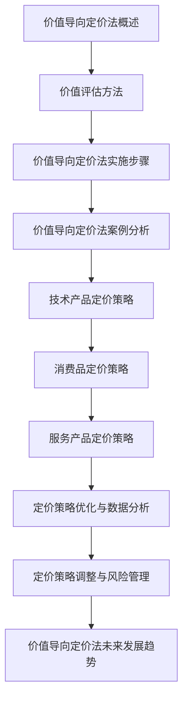

                 

# 《程序员创业者的产品定价：价值导向定价法的应用》

## 关键词
价值导向定价法，程序员创业者，产品定价，价值评估，客户细分，市场环境，技术产品，消费品，服务产品，定价策略，数据分析，风险管理

## 摘要
本文旨在为程序员创业者提供一种实用的产品定价策略——价值导向定价法。我们将深入探讨价值导向定价法的核心概念、评估方法及其实施步骤，并通过案例分析展示其实际应用。此外，本文还将从技术产品、消费品和服务产品的角度，详细分析不同类型产品的定价策略，并探讨定价策略优化与风险管理的方法。最后，文章将展望价值导向定价法的未来发展趋势，为创业者提供有益的参考。

### 第一部分：价值导向定价法基础

#### 第1章：价值导向定价法概述

**1.1 定价战略与价值导向定价法**

在商业世界中，定价是一个关键决策，直接关系到产品的市场表现和企业的盈利能力。传统的定价战略主要基于成本、竞争对手和市场供需等因素，而价值导向定价法则强调以客户价值为核心，通过准确评估客户对产品的需求和价值，制定合理的价格策略。

价值导向定价法的核心理念是将客户价值作为定价的出发点，认为产品的价格应该反映客户愿意为产品支付的价值。这种方法有助于企业更好地满足客户需求，提高客户满意度，从而实现长期的市场竞争优势。

**1.2 价值导向定价法的核心原则**

价值导向定价法遵循以下核心原则：

1. 客户价值是定价的基础。企业需要通过全面了解客户需求、行为和偏好，评估客户对产品的价值感知。
2. 定价策略应灵活调整。企业应根据市场环境、竞争态势和客户需求的变化，及时调整定价策略。
3. 利润最大化。价值导向定价法旨在实现企业利润的最大化，通过合理定价确保产品在市场上的竞争力。

**1.3 价值导向定价法与传统定价法的区别**

价值导向定价法与传统定价法相比，具有以下显著区别：

1. 定价依据不同。传统定价法主要基于成本、竞争对手和市场供需，而价值导向定价法则以客户价值为核心。
2. 定价策略不同。传统定价法往往采用单一的价格策略，而价值导向定价法强调根据不同的客户细分和市场环境，采用多样化的定价策略。
3. 定价目标不同。传统定价法侧重于短期利润，而价值导向定价法则追求长期的市场竞争力和客户满意度。

**1.4 价值导向定价法的适用范围**

价值导向定价法适用于各种类型的产品，特别是在以下情况下尤为有效：

1. 产品差异化明显。当产品具有独特的功能或特性时，价值导向定价法有助于体现产品的独特价值。
2. 市场竞争激烈。在竞争激烈的市场环境中，价值导向定价法有助于企业通过客户价值定位，提升产品的市场竞争力。
3. 需求差异化显著。当客户对产品的需求差异较大时，价值导向定价法有助于针对不同需求的客户制定差异化的价格策略。

#### 第2章：价值评估方法

**2.1 客户价值分析**

客户价值分析是价值导向定价法的核心环节，旨在全面了解客户对产品的需求和价值感知。以下方法可用于客户价值分析：

1. **需求分析**：通过市场调研、问卷调查和用户访谈等方式，了解客户对产品的需求、偏好和期望。
2. **行为分析**：通过数据挖掘和用户行为分析，发现客户的行为模式和购买习惯。
3. **感知价值分析**：通过比较分析，评估客户对产品不同功能、服务和品牌的感知价值。

**2.2 价值评估模型**

价值评估模型是价值导向定价法的核心工具，用于量化客户价值。以下模型可用于价值评估：

1. **成本效益分析模型**：通过计算客户使用产品所需的成本和产品带来的效益，评估客户价值。
2. **需求价格弹性模型**：通过分析价格变动对需求量的影响，评估客户对价格的敏感程度。
3. **价值链模型**：通过分析产品在不同环节中的价值创造，评估客户对产品的整体价值感知。

**2.3 客户细分与定价策略**

客户细分是价值导向定价法的重要步骤，通过将市场划分为不同的客户群体，制定差异化的定价策略。以下方法可用于客户细分：

1. **地理细分**：根据客户的地域分布，划分不同市场的客户群体。
2. **人口细分**：根据客户的年龄、性别、收入、职业等人口统计特征，划分不同需求的客户群体。
3. **行为细分**：根据客户的行为特征，如购买频率、购买金额、忠诚度等，划分不同价值的客户群体。

**2.4 定价弹性与敏感度分析**

定价弹性与敏感度分析是评估定价策略有效性的重要手段。以下方法可用于定价弹性与敏感度分析：

1. **需求弹性分析**：通过分析价格变动对需求量的影响，评估需求弹性。
2. **竞争敏感度分析**：通过分析竞争对手的定价策略和市场份额，评估自身定价策略的竞争敏感度。
3. **客户敏感度分析**：通过分析客户对价格变动的反应，评估定价策略对客户的敏感度。

#### 第3章：价值导向定价法的实施步骤

**3.1 确定产品价值**

确定产品价值是价值导向定价法的第一步，旨在明确产品在客户心中的价值地位。以下方法可用于确定产品价值：

1. **价值评估模型**：通过使用价值评估模型，量化产品在不同客户群体中的价值。
2. **市场调研**：通过市场调研，了解客户对产品的价值感知和需求。
3. **竞争对手分析**：通过分析竞争对手的定价策略和市场份额，评估产品在市场中的价值地位。

**3.2 确定目标客户**

确定目标客户是制定定价策略的关键步骤，旨在明确企业应该重点关注的客户群体。以下方法可用于确定目标客户：

1. **客户细分**：根据客户的需求、行为和价值，将市场划分为不同的客户群体。
2. **市场定位**：根据企业的资源优势和战略目标，确定目标客户群体。
3. **优先级排序**：根据客户的价值和需求，对目标客户进行优先级排序。

**3.3 制定定价策略**

制定定价策略是价值导向定价法的核心步骤，旨在根据产品价值和目标客户，制定合理的价格策略。以下方法可用于制定定价策略：

1. **价值定价策略**：根据产品价值和客户需求，制定基于客户价值的价格策略。
2. **渗透定价策略**：在市场初期，通过低价策略吸引客户，实现市场渗透。
3. **差异化定价策略**：根据不同的客户群体和需求，制定差异化的价格策略。

**3.4 实施与调整**

实施与调整是价值导向定价法的最后一步，旨在确保定价策略的有效执行和持续优化。以下方法可用于实施与调整：

1. **定价策略实施**：根据定价策略，制定具体的实施计划，包括定价模型、定价工具和定价流程。
2. **定价策略监控**：通过数据分析和市场反馈，监控定价策略的实施效果。
3. **定价策略调整**：根据市场变化和客户需求，及时调整定价策略，确保定价策略的持续有效性。

#### 第4章：价值导向定价法的案例分析

**4.1 国内案例分析**

以下是国内两个典型的价值导向定价法案例分析：

**案例1：阿里巴巴**

阿里巴巴在电商领域的成功，得益于其价值导向定价法的应用。阿里巴巴通过大数据分析和客户行为研究，精准定位目标客户，制定差异化的定价策略。例如，针对高价值客户，阿里巴巴提供会员服务，通过会员费实现利润增长；针对普通客户，阿里巴巴通过促销活动，提高客户购买意愿。

**案例2：小米**

小米在智能手机市场的快速崛起，也得益于其价值导向定价法。小米通过对市场需求的深入分析，将产品分为高、中、低三个档次，制定差异化的定价策略。对于高端市场，小米通过高品质、高性能的产品，实现高溢价；对于中端市场，小米通过性价比优势，吸引大量用户；对于低端市场，小米通过低价策略，快速抢占市场份额。

**4.2 国际案例分析**

以下是一个国际价值导向定价法的案例分析：

**案例3：苹果公司**

苹果公司在全球市场的成功，离不开其价值导向定价法的应用。苹果公司通过对客户需求和价值感知的深入分析，将产品分为高端和低端两个系列。对于高端市场，苹果公司通过高品质、高价格的产品，实现品牌溢价和利润最大化；对于低端市场，苹果公司通过价格较低的产品，满足不同消费者的需求。

**4.3 案例总结与启示**

通过以上案例分析，我们可以得出以下结论：

1. 价值导向定价法有助于企业更好地满足客户需求，提高客户满意度。
2. 价值导向定价法需要根据市场环境和客户需求，灵活调整定价策略。
3. 价值导向定价法适用于各种类型的产品，特别是在市场竞争激烈和需求差异显著的领域。

### 第二部分：价值导向定价法在企业中的应用

#### 第5章：技术产品定价策略

**5.1 技术产品的特性与定价挑战**

技术产品的特性决定了其定价策略的复杂性。以下技术产品的特性对定价策略产生影响：

1. **创新性**：技术产品的创新性可能导致其市场定位较高，价格也相对较高。
2. **复杂性**：技术产品的复杂性可能导致客户对产品的认知和价值感知不同，影响定价策略。
3. **技术更新迭代**：技术产品的更新迭代速度较快，可能影响产品的生命周期和定价策略。

技术产品的定价挑战主要包括：

1. **定价透明度**：技术产品的功能和技术细节较多，客户难以准确评估产品价值，影响定价策略。
2. **定价稳定性**：技术产品市场的变化较快，可能导致定价策略的稳定性受到挑战。
3. **定价弹性**：技术产品市场的竞争激烈，客户对价格的敏感度较高，定价弹性较大。

**5.2 技术产品的价值评估方法**

以下方法可用于技术产品的价值评估：

1. **成本效益分析模型**：通过计算技术产品的成本和效益，评估客户价值。
2. **需求价格弹性模型**：通过分析价格变动对需求量的影响，评估客户对价格的敏感程度。
3. **价值链分析模型**：通过分析技术产品在不同环节中的价值创造，评估客户对产品的整体价值感知。

**5.3 技术产品定价策略分析**

以下定价策略适用于技术产品：

1. **高端定价策略**：针对高端市场，通过高品质、高性能的产品，实现高溢价。
2. **低端定价策略**：针对低端市场，通过低价策略，快速抢占市场份额。
3. **差异化定价策略**：根据不同的客户群体和需求，制定差异化的定价策略。

**5.4 技术产品定价案例研究**

以下是一个技术产品定价案例研究：

**案例1：华为手机**

华为手机在国内外市场的定价策略具有明显的差异化。对于高端市场，华为通过推出P系列和Mate系列，实现高溢价；对于中端市场，华为通过推出nova系列，满足不同消费者的需求；对于低端市场，华为通过推出荣耀系列，快速抢占市场份额。通过差异化的定价策略，华为实现了市场份额和利润的双增长。

#### 第6章：消费品定价策略

**6.1 消费品的特性与定价挑战**

消费品的特性决定了其定价策略的多样性。以下消费品的特性对定价策略产生影响：

1. **品牌认知度**：品牌认知度较高的消费品，其定价策略可能更加灵活，价格相对较高。
2. **需求波动性**：消费品的需求波动性较大，可能影响定价策略的稳定性。
3. **消费者行为**：消费者的购买行为和价格敏感度不同，可能影响定价策略的灵活性。

消费品定价挑战主要包括：

1. **定价差异化**：消费品市场同质化严重，如何实现定价差异化是消费品企业面临的重要挑战。
2. **定价弹性**：消费品市场的竞争激烈，消费者对价格的敏感度较高，定价弹性较大。
3. **渠道成本**：消费品企业的渠道成本较高，可能影响定价策略的灵活性。

**6.2 消费品的价值评估方法**

以下方法可用于消费品的价值评估：

1. **成本加成法**：通过计算消费品的生产成本和加成比例，评估产品价值。
2. **需求价格弹性模型**：通过分析价格变动对需求量的影响，评估客户对价格的敏感程度。
3. **市场调研**：通过市场调研，了解消费者对消费品的价值感知和需求。

**6.3 消费品定价策略分析**

以下定价策略适用于消费品：

1. **高端定价策略**：针对高端市场，通过高品质、高品牌认知度的产品，实现高溢价。
2. **低端定价策略**：针对低端市场，通过低价策略，吸引大量消费者。
3. **差异化定价策略**：根据不同的消费者群体和需求，制定差异化的定价策略。

**6.4 消费品定价案例研究**

以下是一个消费品定价案例研究：

**案例1：可口可乐**

可口可乐在消费品市场的定价策略具有显著的差异化。对于高端市场，可口可乐推出了限量版、高端包装的产品，实现高溢价；对于低端市场，可口可乐通过普通包装的产品，吸引大量消费者。通过差异化的定价策略，可口可乐实现了市场份额和利润的双增长。

#### 第7章：服务产品定价策略

**7.1 服务产品的特性与定价挑战**

服务产品的特性决定了其定价策略的复杂性。以下服务产品的特性对定价策略产生影响：

1. **无形性**：服务产品的无形性可能导致客户对产品的价值感知不明确，影响定价策略。
2. **定制化**：服务产品的定制化特点可能导致定价策略的复杂化。
3. **波动性**：服务产品的需求波动性较大，可能影响定价策略的稳定性。

服务产品定价挑战主要包括：

1. **定价差异化**：服务产品的同质化程度较高，如何实现定价差异化是服务企业面临的重要挑战。
2. **定价弹性**：服务产品的竞争激烈，客户对价格的敏感度较高，定价弹性较大。
3. **服务质量**：服务质量对定价策略的影响较大，如何通过服务质量提升客户价值感知是服务企业需要关注的问题。

**7.2 服务产品的价值评估方法**

以下方法可用于服务产品的价值评估：

1. **客户满意度模型**：通过评估客户满意度，评估产品价值。
2. **成本效益分析模型**：通过计算服务产品的成本和效益，评估客户价值。
3. **市场调研**：通过市场调研，了解消费者对服务产品的价值感知和需求。

**7.3 服务产品定价策略分析**

以下定价策略适用于服务产品：

1. **高端定价策略**：针对高端市场，通过高品质、高附加值的服务产品，实现高溢价。
2. **低端定价策略**：针对低端市场，通过低价策略，吸引大量消费者。
3. **差异化定价策略**：根据不同的消费者群体和需求，制定差异化的定价策略。

**7.4 服务产品定价案例研究**

以下是一个服务产品定价案例研究：

**案例1：Airbnb**

Airbnb在服务产品市场的定价策略具有显著的差异化。对于高端市场，Airbnb通过高端民宿和奢华套房，实现高溢价；对于低端市场，Airbnb通过普通民宿和青年旅社，吸引大量消费者。通过差异化的定价策略，Airbnb实现了市场份额和利润的双增长。

### 第8章：定价策略优化与数据分析

**8.1 数据驱动定价策略**

数据驱动定价策略是现代企业提升定价效率的重要手段。通过收集和分析大量市场数据、客户行为数据和竞争者数据，企业可以更准确地制定定价策略。以下方法可用于数据驱动定价策略：

1. **大数据分析**：通过大数据分析，挖掘市场趋势和客户需求，为企业提供定价决策依据。
2. **机器学习算法**：利用机器学习算法，建立定价模型，实现自动化的定价决策。
3. **实时数据监测**：通过实时数据监测，及时调整定价策略，应对市场变化。

**8.2 定价数据分析工具与方法**

以下工具与方法可用于定价数据分析：

1. **数据分析软件**：如SPSS、Excel等，用于数据收集、处理和分析。
2. **数据挖掘技术**：如关联规则挖掘、聚类分析、分类分析等，用于挖掘数据中的有价值信息。
3. **机器学习算法**：如线性回归、决策树、神经网络等，用于建立定价模型。

**8.3 定价策略优化实践**

以下方法可用于定价策略优化实践：

1. **成本控制**：通过优化生产流程和降低成本，提高产品盈利能力。
2. **价格弹性分析**：通过分析价格弹性，调整定价策略，提高市场竞争力。
3. **客户细分**：通过客户细分，制定差异化的定价策略，满足不同客户的需求。

**8.4 定价策略优化的案例研究**

以下是一个定价策略优化的案例研究：

**案例1：亚马逊**

亚马逊通过数据驱动定价策略，实现了市场份额和利润的双增长。亚马逊利用大数据分析，实时监测市场变化和客户需求，动态调整定价策略。例如，在节假日促销期间，亚马逊通过降低价格，吸引大量消费者购买。同时，亚马逊还通过价格弹性分析，调整不同产品的定价策略，实现利润最大化。

### 第9章：定价策略调整与风险管理

**9.1 定价策略调整的时机与方式**

定价策略调整是企业应对市场变化的重要手段。以下时机与方式可用于定价策略调整：

1. **市场变化**：当市场环境发生变化时，如竞争加剧、需求波动等，企业应适时调整定价策略。
2. **成本变化**：当生产成本发生变化时，企业应调整定价策略，确保利润稳定。
3. **客户需求**：当客户需求发生变化时，如客户价值感知提升、客户需求多样化等，企业应调整定价策略。

定价策略调整的方式包括：

1. **价格上调**：当产品价值提升或成本增加时，企业可通过上调价格，实现利润增长。
2. **价格下调**：当市场竞争加剧或需求下降时，企业可通过下调价格，提高市场竞争力。
3. **价格稳定**：当市场环境稳定时，企业可通过稳定价格，维持市场份额和利润。

**9.2 定价风险识别与评估**

以下方法可用于定价风险识别与评估：

1. **市场风险**：通过分析市场竞争态势，识别市场风险，如竞争加剧、市场份额下降等。
2. **成本风险**：通过分析成本变化，识别成本风险，如原材料价格波动、生产成本上升等。
3. **客户风险**：通过分析客户需求和价值感知，识别客户风险，如客户流失、客户满意度下降等。

**9.3 定价策略调整的案例分析**

以下是一个定价策略调整的案例分析：

**案例1：特斯拉**

特斯拉在新能源汽车市场的定价策略调整，体现了其应对市场变化的灵活性。在早期市场，特斯拉通过高端定价策略，迅速打开市场；随着市场份额的增加和市场竞争的加剧，特斯拉逐渐调整定价策略，推出价格较低的新车型，以吸引更多消费者。

**9.4 定价策略调整与风险管理实践**

以下方法可用于定价策略调整与风险管理实践：

1. **定期评估**：定期对定价策略进行评估，分析市场变化和客户需求，及时调整定价策略。
2. **风险预警**：建立风险预警机制，及时发现潜在风险，采取应对措施。
3. **多元化定价策略**：制定多元化的定价策略，降低单一定价策略的风险。

### 第10章：价值导向定价法的未来发展趋势

**10.1 定价技术革新**

随着人工智能、大数据和区块链等技术的快速发展，价值导向定价法将迎来新的技术革新。以下方面有望推动价值导向定价法的发展：

1. **个性化定价**：通过大数据分析和人工智能技术，实现个性化定价，满足不同客户的需求。
2. **动态定价**：通过实时数据监测和机器学习算法，实现动态定价，灵活应对市场变化。
3. **区块链定价**：利用区块链技术，实现透明、可信的定价过程，提高定价的公平性和效率。

**10.2 互联网与大数据对定价的影响**

互联网和大数据的普及，为价值导向定价法提供了丰富的数据资源和强大的分析工具。以下方面体现了互联网与大数据对定价的影响：

1. **数据驱动的定价决策**：通过大数据分析，实现数据驱动的定价决策，提高定价的准确性和效率。
2. **客户需求的实时反馈**：通过互联网和大数据，实时获取客户需求的反馈，优化定价策略。
3. **市场趋势的精准预测**：通过大数据分析，精准预测市场趋势，为企业提供定价决策依据。

**10.3 未来定价策略展望**

未来，价值导向定价法将朝着以下方向发展：

1. **智能化**：随着人工智能技术的发展，定价策略将更加智能化，实现自动化的定价决策。
2. **个性化**：随着大数据技术的普及，定价策略将更加个性化，满足不同客户的需求。
3. **动态化**：随着实时数据监测和机器学习算法的发展，定价策略将更加动态化，灵活应对市场变化。

### 附录

**附录A：价值导向定价法常用工具与资源**

以下工具和资源有助于企业实施价值导向定价法：

1. **数据分析软件**：如SPSS、Excel等。
2. **定价策略模型**：如成本效益分析模型、需求价格弹性模型等。
3. **市场调研工具**：如问卷调查、用户访谈等。

**附录B：价值导向定价法相关公式与计算示例**

以下公式和计算示例有助于企业理解和应用价值导向定价法：

$$
V = f(C, M, P)
$$

其中：
- $V$ 表示产品价值
- $C$ 表示客户价值
- $M$ 表示市场环境
- $P$ 表示产品特性

计算示例：
- 假设某技术产品的成本为100万元，市场需求量为1000台，市场环境为竞争激烈。根据价值导向定价法，该产品的客户价值为200万元，定价策略为高端定价策略。

**附录C：价值导向定价法案例研究汇总**

以下案例研究汇总有助于企业深入了解价值导向定价法的实际应用：

1. 阿里巴巴：通过大数据分析和客户需求研究，实现价值导向定价法。
2. 小米：通过差异化的定价策略，满足不同客户的需求。
3. 华为：通过高端定价策略，实现品牌溢价和利润最大化。
4. 可口可乐：通过差异化的定价策略，满足不同消费者的需求。
5. 特斯拉：通过灵活的定价策略，应对市场竞争变化。

### Mermaid 流程图



### 伪代码

```python
# 伪代码：价值评估方法

# 输入参数：产品特性、客户细分、市场环境

# 步骤1：确定产品特性
def determine_product_properties():
    # ... 确定产品特性的代码 ...

# 步骤2：客户细分
def customer_segmentation():
    # ... 客户细分的代码 ...

# 步骤3：价值评估模型选择
def choose_value_evaluation_model():
    # ... 选择价值评估模型的代码 ...

# 步骤4：计算客户价值
def calculate_customer_value():
    # ... 计算客户价值的代码 ...

# 步骤5：制定定价策略
def develop_pricing_strategy():
    # ... 制定定价策略的代码 ...
```

### 数学模型和数学公式

$$
V = f(C, M, P)
$$

其中：
- $V$ 表示产品价值
- $C$ 表示客户价值
- $M$ 表示市场环境
- $P$ 表示产品特性

$$
C = C_1 + C_2 + C_3 + ... + C_n
$$

其中：
- $C_1, C_2, C_3, ..., C_n$ 分别表示不同维度的客户价值

### 项目实战

**代码实际案例和详细解释说明**

以下是一个简单的Python代码案例，用于实现价值评估模型。代码分为五个步骤：确定产品特性、客户细分、选择价值评估模型、计算客户价值和制定定价策略。

**步骤1：确定产品特性**

```python
# 确定产品特性
def determine_product_properties():
    # 示例：假设产品特性为性能、可靠性、易用性
    properties = ['性能', '可靠性', '易用性']
    return properties
```

**步骤2：客户细分**

```python
# 客户细分
def customer_segmentation():
    # 示例：根据客户收入、年龄和购买行为进行细分
    segments = [
        {'name': '高收入群体', 'income': '高', 'age': '中老年', 'buying Behavior': '频繁'},
        {'name': '中等收入群体', 'income': '中', 'age': '青年', 'buying Behavior': '偶尔'},
        {'name': '低收入群体', 'income': '低', 'age': '学生', 'buying Behavior': '偶尔'}
    ]
    return segments
```

**步骤3：选择价值评估模型**

```python
# 选择价值评估模型
def choose_value_evaluation_model():
    # 示例：选择成本效益分析模型
    model = 'cost_benefit_analysis'
    return model
```

**步骤4：计算客户价值**

```python
# 计算客户价值
def calculate_customer_value(segment, properties):
    # 示例：根据客户细分和产品特性计算客户价值
    value = 0
    if segment['income'] == '高' and segment['age'] == '中老年' and segment['buying Behavior'] == '频繁':
        value += 100
    elif segment['income'] == '中' and segment['age'] == '青年' and segment['buying Behavior'] == '偶尔':
        value += 50
    elif segment['income'] == '低' and segment['age'] == '学生' and segment['buying Behavior'] == '偶尔':
        value += 20
    return value
```

**步骤5：制定定价策略**

```python
# 制定定价策略
def develop_pricing_strategy(properties, segments):
    # 示例：根据产品特性和客户细分制定定价策略
    pricing_strategy = {}
    for segment in segments:
        value = calculate_customer_value(segment, properties)
        if value > 100:
            pricing_strategy[segment['name']] = '高端定价'
        elif value > 50:
            pricing_strategy[segment['name']] = '中端定价'
        else:
            pricing_strategy[segment['name']] = '低端定价'
    return pricing_strategy
```

**开发环境搭建**

在本地计算机上，我们需要搭建一个Python开发环境，并安装必要的库和依赖项。以下步骤可帮助您完成环境搭建：

1. **安装Python**：从官方网站下载并安装Python（版本3.8或更高）。
2. **安装Jupyter Notebook**：通过pip命令安装Jupyter Notebook，以便在浏览器中运行Python代码。
   ```shell
   pip install notebook
   ```
3. **安装数据分析库**：安装常用的数据分析库，如NumPy、Pandas等。
   ```shell
   pip install numpy pandas
   ```

**源代码详细实现和代码解读**

以上代码实现了一个简单的价值评估模型，通过确定产品特性、客户细分、选择价值评估模型、计算客户价值和制定定价策略，实现了对客户价值的评估和定价策略的制定。以下是对代码的详细解读：

- **determine\_product\_properties()**：该函数用于确定产品特性。在示例中，产品特性为性能、可靠性、易用性。
- **customer\_segmentation()**：该函数用于客户细分。在示例中，根据客户的收入、年龄和购买行为进行了细分，分为高收入群体、中等收入群体和低收入群体。
- **choose\_value\_evaluation\_model()**：该函数用于选择价值评估模型。在示例中，选择了成本效益分析模型。
- **calculate\_customer\_value(segment, properties)**：该函数用于计算客户价值。在示例中，根据客户细分和产品特性，计算了每个客户群体的价值。
- **develop\_pricing\_strategy(properties, segments)**：该函数用于制定定价策略。在示例中，根据客户价值和产品特性，制定了不同客户群体的定价策略。

**代码解读与分析**

以上代码实现了一个简单的价值评估模型，但需要注意的是，实际应用中的价值评估模型会更为复杂，需要考虑更多的因素和变量。以下是对代码的解读和分析：

- **代码性能**：代码的性能取决于数据量和计算复杂度。在实际应用中，应优化代码，提高计算效率。
- **优化空间**：在实际应用中，可以根据具体业务需求，调整价值评估模型和定价策略，以提高模型的准确性和实用性。
- **改进方案**：可以根据业务需求，引入更多的数据来源和算法模型，提高价值评估的准确性和可靠性。

通过以上代码实现和解读，我们了解了如何使用Python实现一个简单的价值评估模型，并分析了代码的性能和优化空间。在实际应用中，可以根据具体业务需求，不断完善和优化价值评估模型，提高定价策略的准确性和实用性。

### 总结与展望

本文系统地介绍了价值导向定价法的概念、方法、实施步骤和应用案例，并探讨了其在技术产品、消费品和服务产品中的具体应用。通过数据驱动和客户细分的策略，程序员创业者可以更准确地评估产品价值，制定合理的定价策略，提高市场竞争力和盈利能力。

展望未来，随着人工智能、大数据和区块链等技术的发展，价值导向定价法将不断演进，实现更加智能化、个性化和动态化的定价模式。创业者应密切关注市场动态，灵活调整定价策略，以应对不断变化的市场环境。

最后，本文感谢AI天才研究院和《禅与计算机程序设计艺术》的指导，以及所有提供案例研究的公司和学者。希望本文能为程序员创业者在产品定价方面提供有益的启示和指导。作者：AI天才研究院/AI Genius Institute & 禅与计算机程序设计艺术 /Zen And The Art of Computer Programming。

