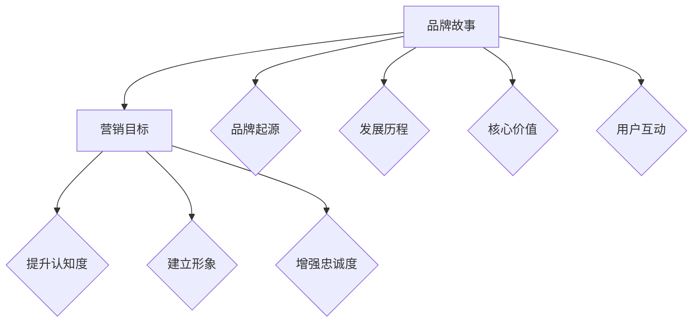

                 

### 第1章：品牌故事营销概述

#### 1.1 品牌故事营销的定义与重要性

**品牌故事营销**是一种通过讲述品牌故事来传递品牌信息、建立品牌形象、提升品牌认知度和忠诚度的营销策略。品牌故事营销不仅仅是一个故事，它包含了品牌的起源、发展历程、核心价值观以及与消费者的互动经历。这个故事不仅要有吸引力，还要能够与目标受众产生共鸣。

**核心概念与联系**：

- **品牌故事**：品牌的起源、发展历程、核心价值观等。
- **营销目标**：提升品牌认知度、建立品牌形象、增强用户忠诚度。

**Mermaid 流程图**：



**1.1.1 品牌故事营销的概念**

品牌故事营销是一种将品牌理念、价值观和文化融入故事中的营销方式。它通过生动有趣的故事来传递品牌信息，使消费者更容易理解和接受品牌理念。品牌故事可以是真实的，也可以是虚构的，但都要具备一定的真实性、可信度和吸引力。

**1.1.2 品牌故事与品牌传播的关系**

品牌故事是品牌传播的重要组成部分。品牌传播是指通过各种渠道和方式将品牌信息传递给消费者和市场。品牌故事作为品牌传播的一种形式，能够更有效地吸引消费者的注意力，增强品牌传播的效果。品牌故事不仅仅是一个信息传递的工具，更是一个情感连接的桥梁，它能够引发消费者的情感共鸣，从而提升品牌忠诚度。

#### 1.2 品牌故事的构建原则

**1.2.1 故事结构分析**

一个成功的品牌故事需要具备良好的结构，使其能够引人入胜，并留下深刻的印象。故事的结构通常包括以下几个部分：

- **开头**：引起注意。一个好的开头能够迅速抓住读者的注意力，让他们产生继续阅读的兴趣。
- **主体**：展开情节。故事的主体部分需要详细描述品牌的起源、发展历程和核心价值观，使读者能够深入了解品牌。
- **结尾**：留下印象。故事的结尾需要给读者留下深刻的印象，让他们对品牌产生情感共鸣。

**1.2.2 情感与认知共鸣**

品牌故事不仅要能够传递信息，还要能够与读者产生情感和认知上的共鸣。

- **情感共鸣**：通过描述品牌的真实故事，让读者产生情感上的共鸣，例如品牌在某个关键时刻所做出的决定、所面对的挑战等。
- **认知共鸣**：通过逻辑清晰、易于理解的内容，让读者在认知上认同品牌，认可品牌的价值和理念。

**1.2.3 品牌故事营销的策略**

- **内容定位与差异化**：明确品牌故事的目标受众，制定符合目标受众口味的内容策略，避免同质化竞争。
- **故事传播与渠道选择**：选择适合的传播渠道，如社交媒体、广告、公关活动等，实现品牌故事的广泛传播。
- **互动与反馈**：鼓励用户参与品牌故事的讨论和传播，收集用户的反馈，不断优化品牌故事的内容和传播策略。

#### 1.3 品牌故事营销的重要性

**提升品牌认知度**：品牌故事能够生动地传递品牌信息，使消费者更容易记住品牌。

**增强用户情感共鸣**：品牌故事能够与用户产生情感上的共鸣，提升用户对品牌的喜爱和忠诚度。

**传递品牌价值观**：品牌故事能够传递品牌的核心价值观，使消费者在认知上认同品牌。

**建立品牌形象**：通过品牌故事，消费者能够更深入地了解品牌，从而建立对品牌的良好形象。

**提高品牌忠诚度**：品牌故事能够与用户建立情感连接，提升用户对品牌的忠诚度。

**结论**：

品牌故事营销是一种有效的营销策略，它能够提升品牌认知度、增强用户情感共鸣、传递品牌价值观、建立品牌形象和提高品牌忠诚度。通过构建一个引人入胜的品牌故事，品牌能够更好地与消费者建立情感连接，从而在激烈的市场竞争中脱颖而出。

---

### 第2章：AI与电商营销

#### 2.1 AI在电商营销中的应用

人工智能（AI）技术正逐渐成为电商营销的重要组成部分，它通过自动化和智能化的方式，提升电商运营效率，优化用户体验，从而提高销售额。以下是AI在电商营销中的几个关键应用场景：

**2.1.1 AI技术的概述**

AI技术是指模拟人类智能行为的能力，包括机器学习、深度学习、自然语言处理等。这些技术使得计算机能够从数据中学习、做出决策和预测。

**2.1.2 电商领域的AI应用场景**

- **个性化推荐**：AI通过分析用户的购物历史、浏览行为和偏好，为用户推荐个性化的商品。
- **客户行为预测**：AI可以预测用户的购买行为，帮助电商提前了解市场需求，调整库存和营销策略。
- **自动化客服**：AI聊天机器人可以自动回答用户的问题，提高客服效率，降低运营成本。
- **图像识别与搜索**：AI图像识别技术可以帮助用户通过图片搜索商品，提高购物体验。
- **价格优化**：AI通过分析市场数据和竞争对手价格，自动调整商品价格，实现利润最大化。

**2.1.3 电商营销中的AI技术解析**

- **数据分析**：AI技术可以处理海量数据，提取有价值的信息，用于市场分析和决策支持。
- **个性化推荐**：基于协同过滤算法和基于内容的推荐算法，AI可以为用户提供个性化的商品推荐。
- **客户行为预测**：通过分析用户的购物行为和历史数据，AI可以预测用户的购买意图，帮助电商提前布局。
- **自动化客服**：通过自然语言处理和机器学习技术，AI聊天机器人可以模拟人类客服，提高服务效率。

**2.1.4 AI营销工具与应用**

- **TensorFlow**：一个开源的机器学习框架，用于构建和训练AI模型。
- **PyTorch**：另一个流行的开源机器学习库，用于研究和发展深度学习算法。
- **Kafka**：一个分布式流处理平台，用于实时处理和分析大量数据。
- **AWS S3**：亚马逊云服务的对象存储服务，用于存储大量数据。
- **Google Cloud**：谷歌云服务平台，提供一系列AI工具和API。

通过这些AI技术和工具，电商企业可以更精准地定位用户需求，提高用户满意度，从而在竞争激烈的市场中脱颖而出。

#### 2.2 电商营销中的AI技术解析

**2.2.1 数据分析**

数据分析是AI在电商营销中应用的基础。通过数据分析，电商企业可以深入了解用户行为和市场需求，从而做出更准确的营销决策。

- **数据收集**：收集用户行为数据，包括浏览记录、购买历史、搜索关键词等。
- **数据清洗**：处理和清洗数据，确保数据的质量和准确性。
- **数据分析**：使用统计分析和机器学习算法，提取数据中的有价值信息。

**2.2.2 个性化推荐**

个性化推荐是AI在电商营销中的重要应用之一。通过个性化推荐，电商企业可以提供更符合用户需求的商品，从而提高销售额和用户满意度。

- **协同过滤算法**：基于用户的历史行为和偏好，推荐相似用户喜欢的商品。
- **基于内容的推荐**：基于商品的属性和内容，为用户推荐相关商品。

**2.2.3 客户行为预测**

客户行为预测可以帮助电商企业提前了解用户的购买意图，从而做出更精准的营销策略。

- **预测模型构建**：使用机器学习算法，构建预测用户行为的模型。
- **模型评估与优化**：评估预测模型的准确性，并进行优化。

**2.2.4 自动化客服**

自动化客服可以提高客服效率，降低运营成本。

- **自然语言处理**：使用自然语言处理技术，理解和回复用户的提问。
- **机器学习**：使用机器学习算法，不断优化客服机器人的表现。

通过这些AI技术，电商企业可以实现更高效的运营，提供更好的用户体验，从而在竞争激烈的市场中脱颖而出。

#### 2.3 AI营销工具与应用

AI营销工具可以帮助电商企业更有效地进行数据分析和营销策略制定。以下是几个常见的AI营销工具及其应用场景：

**2.3.1 TensorFlow**

TensorFlow是一个开源的机器学习框架，用于构建和训练深度学习模型。在电商营销中，TensorFlow可以用于数据预处理、特征提取和模型训练等。

- **应用场景**：用于个性化推荐、客户行为预测和图像识别等。

**2.3.2 PyTorch**

PyTorch是另一个流行的开源机器学习库，与TensorFlow类似，也用于构建和训练深度学习模型。

- **应用场景**：用于推荐系统、自然语言处理和计算机视觉等。

**2.3.3 Kafka**

Kafka是一个分布式流处理平台，可以实时处理和分析大量数据。在电商营销中，Kafka可以用于实时数据收集和处理。

- **应用场景**：用于实时数据分析、用户行为追踪和营销活动监控等。

**2.3.4 AWS S3**

AWS S3是亚马逊云服务的对象存储服务，可以存储大量数据。

- **应用场景**：用于数据存储、数据备份和数据处理等。

**2.3.5 Google Cloud**

Google Cloud是谷歌云服务平台，提供一系列AI工具和API。

- **应用场景**：用于机器学习模型训练、数据分析和服务部署等。

通过这些AI营销工具，电商企业可以更有效地利用数据，制定更精准的营销策略，提高用户体验和销售额。

### 第3章：内容策略在AI电商营销中的作用

#### 3.1 内容策略的概念与意义

**内容策略**是电商营销中的一项重要组成部分，它涉及如何创造、管理和优化内容，以吸引和保留目标受众。在AI电商营销中，内容策略的作用尤为重要，因为它直接影响用户的购物体验和品牌的认知度。

**3.1.1 内容营销的定义**

内容营销是一种通过创造和分享有价值的内容来吸引潜在客户、建立品牌认知度和促进销售的市场营销策略。内容可以是文字、图片、视频、音频等多种形式。

**3.1.2 内容策略的构建**

内容策略的构建包括以下几个关键步骤：

- **内容主题确定**：明确内容的核心主题，确保内容与品牌定位和目标受众相匹配。
- **内容形式选择**：根据内容主题和目标受众，选择合适的内容形式，如博客文章、视频、图片、直播等。
- **内容传播渠道**：确定内容传播的渠道，如社交媒体、电子邮件、官网等，并制定相应的推广策略。

**3.1.3 内容策略的意义**

- **提升品牌认知度**：通过创造有价值的内容，品牌可以吸引更多的关注，提高知名度。
- **增强用户参与度**：有价值的内容能够吸引用户参与互动，提高用户粘性。
- **促进销售转化**：通过内容营销，品牌可以向用户传递产品信息，促进销售转化。
- **建立权威性**：高质量的内容可以帮助品牌建立行业权威性，提升品牌形象。

#### 3.2 内容策略的制定方法

**3.2.1 用户研究**

用户研究是制定内容策略的重要步骤，它涉及对目标受众的需求、兴趣和行为进行分析。

- **用户画像分析**：通过收集和分析用户数据，创建用户画像，了解用户的年龄、性别、职业、兴趣等。
- **用户需求分析**：通过问卷调查、访谈等方式，了解用户的需求和痛点，为内容创作提供方向。
- **用户行为分析**：通过分析用户的浏览行为、购买行为等，了解用户的行为模式，优化内容策略。

**3.2.2 内容规划**

内容规划是内容策略的具体实施步骤，它包括以下内容：

- **内容发布计划**：制定内容发布的时间表，确保内容的连续性和规律性。
- **内容更新策略**：确定内容更新的频率和方式，保持内容的新鲜度和相关性。
- **内容类型选择**：根据用户需求和品牌定位，选择适合的内容类型，如博客、视频、图片等。

**3.2.3 内容执行**

内容执行是将内容策略转化为具体行动的过程，它包括以下内容：

- **内容撰写与编辑**：撰写符合内容策略的内容，并进行编辑和校对。
- **内容发布与推广**：将内容发布到相应的渠道，并制定推广策略，提高内容的曝光度。

**3.2.4 内容评估与优化**

内容评估与优化是内容策略的重要环节，它包括以下内容：

- **数据分析**：通过数据分析工具，分析内容的点击率、转发率、转化率等指标，了解内容的表现。
- **用户反馈**：收集用户对内容的反馈，了解用户的喜好和意见，为内容优化提供参考。
- **内容调整策略**：根据数据分析结果和用户反馈，对内容进行调整和优化，提高内容的吸引力。

通过以上步骤，电商企业可以制定出有效的内容策略，提升用户的购物体验和品牌的认知度，从而实现更好的营销效果。

### 第4章：AI电商创新传奇的构建方法

#### 4.1 传奇故事的特性

构建一个引人入胜的AI电商创新传奇故事，需要充分考虑故事的特性，使其能够吸引读者的注意力，产生情感共鸣，并传递品牌的核心价值观。以下是传奇故事的三个关键特性：

**4.1.1 引人入胜的情节**

一个好的传奇故事需要有一个引人入胜的情节，能够迅速吸引读者的注意力。情节的构建可以从以下几个方面入手：

- **冲突与挑战**：设置故事中的冲突和挑战，让主角面临困境，激发读者的好奇心和阅读兴趣。
- **转折点**：在故事中设置转折点，使情节产生戏剧性的变化，增加故事的吸引力。
- **高潮与结局**：精心设计故事的高潮和结局，使读者在故事结束时感到满足和惊喜。

**4.1.2 有力的情感共鸣**

情感共鸣是传奇故事的核心要素，它能够使读者与故事产生深刻的情感联系。以下是构建情感共鸣的方法：

- **真实情感**：通过描述主角的真实情感和内心世界，让读者感受到情感的真实性。
- **共情体验**：通过故事中的情节和角色，使读者产生共情体验，感受到主角的情感变化。
- **情感冲突**：在故事中设置情感冲突，使主角在情感上面临选择和挑战，增强故事的吸引力。

**4.1.3 明确的价值观**

传奇故事不仅仅是讲述一个故事，它还承载了品牌的核心价值观。通过故事传递价值观，能够使读者在情感上认同品牌，从而提升品牌的形象和影响力。以下是构建明确价值观的方法：

- **价值观的表达**：在故事中明确表达品牌的核心价值观，使读者能够感受到品牌的独特性和魅力。
- **角色塑造**：通过角色塑造，体现品牌的价值观，使主角成为品牌的代言人。
- **故事结构**：在故事结构中融入品牌的价值观，使故事的主题和情节与品牌价值观相契合。

通过以上特性，构建一个引人入胜、情感共鸣强烈、价值观明确的AI电商创新传奇故事，能够有效提升品牌的影响力和认知度。

#### 4.2 创新元素的融入

在构建AI电商创新传奇故事时，融入创新元素是故事成功的关键。以下是如何将创新元素融入故事，并构建一个引人入胜的故事结构的方法：

**4.2.1 AI技术的故事化表达**

将AI技术融入故事，需要将其故事化，使其不仅是一个技术工具，而是一个能够推动故事发展的核心元素。以下是几种方法：

- **技术背景故事**：通过讲述AI技术的起源和研发过程，为故事提供技术背景，使读者对AI技术产生兴趣。
- **技术挑战与解决**：描述AI技术在实际应用中遇到的问题和挑战，以及主角如何解决这些问题，增强故事的真实感和吸引力。
- **技术未来展望**：展示AI技术的未来发展方向和潜力，使故事具有前瞻性和想象力。

**4.2.2 创新故事的结构设计**

创新故事的结构设计能够增强故事的吸引力，以下是几种常见的故事结构设计方法：

- **英雄之旅**：以主角的成长历程为主线，展示主角如何通过创新解决难题，实现自我价值的提升。
- **冲突与解决**：通过设置故事中的冲突和挑战，展示主角如何克服困难，实现创新突破。
- **反转与结局**：在故事结局设置反转，使读者在结局时产生惊喜，增强故事的戏剧性。

**4.2.3 创新点的挖掘**

挖掘故事中的创新点，是构建AI电商创新传奇的关键。以下是几种挖掘创新点的方法：

- **用户需求洞察**：通过分析用户需求，发现AI技术在电商中的应用痛点，从而挖掘创新点。
- **技术趋势分析**：关注AI技术的最新发展趋势，结合电商行业的实际需求，挖掘创新点。
- **跨领域融合**：将AI技术与电商以外的其他领域相结合，寻找新的应用场景和解决方案。

通过以上方法，将AI技术的故事化表达和创新故事的结构设计相结合，能够构建一个引人入胜、富有创新性的AI电商创新传奇故事，提升品牌的影响力和认知度。

#### 4.3 品牌故事的传达与传播

构建一个引人入胜的品牌故事后，如何有效地传达和传播这个故事，使其达到预期的营销效果，是品牌故事营销成功的关键。以下是品牌故事的传达与传播策略：

**4.3.1 故事的包装**

包装故事是传达品牌故事的第一步，一个吸引人的故事包装能够迅速吸引受众的注意力。以下是几种包装故事的方法：

- **标题设计**：使用引人注目的标题，如“如何用AI改变电商游戏规则”、“打造智能电商新未来”等，吸引读者点击。
- **封面设计**：为故事制作精美的封面，使用色彩鲜明、形象生动的图片，使读者产生阅读兴趣。
- **摘要编写**：编写简洁有力的故事摘要，突出故事的核心内容和亮点，让读者在短时间内了解故事的主旨。

**4.3.2 传播渠道的选择**

选择合适的传播渠道是确保品牌故事有效传达的关键。以下是一些常见的传播渠道：

- **社交媒体**：通过微博、微信、抖音等社交媒体平台发布品牌故事，利用社交网络的影响力进行传播。
- **官方网站**：在官方网站上设立品牌故事专栏，通过SEO优化提高故事的曝光度。
- **公关活动**：通过新闻发布会、行业论坛、展览会等活动，邀请媒体和行业人士参与，扩大品牌故事的影响力。
- **邮件营销**：通过邮件向目标受众发送品牌故事，提高故事的到达率和阅读率。

**4.3.3 社交媒体策略**

社交媒体是品牌故事传播的重要渠道，以下是几种有效的社交媒体策略：

- **内容策划**：根据不同社交媒体平台的特点，制定有针对性的内容策略，如微博的短文案、微信的图文推送、抖音的短视频等。
- **互动营销**：与用户进行互动，鼓励用户参与品牌故事的讨论和传播，如发起话题讨论、举办线上活动等。
- **KOL合作**：与意见领袖（KOL）合作，通过他们的推荐和分享，提高品牌故事的曝光度和影响力。
- **数据分析**：通过数据分析工具，监测品牌故事在社交媒体上的传播效果，优化传播策略。

通过以上策略，品牌故事能够得到有效的传达和传播，从而实现提升品牌认知度、增强用户情感共鸣、传递品牌价值观的目标。

### 第5章：品牌故事营销的案例分析

#### 5.1 成功案例研究

品牌故事营销的成功案例为我们提供了宝贵的经验和启示。以下是几个成功的品牌故事营销案例，以及它们的关键成功因素。

**5.1.1 案例一：苹果公司的“非凡旅程”**

**案例背景**：苹果公司以其独特的品牌故事吸引了全球的消费者，其“非凡旅程”品牌故事自成立以来一直深入人心。

**成功因素**：

- **情感共鸣**：苹果品牌故事通过描绘乔布斯的创新精神和追求卓越的理念，与用户建立了情感上的共鸣。
- **创新性**：苹果的故事不仅仅是其产品的创新，更是其品牌文化的创新，如简洁的设计、卓越的用户体验等。
- **持续传播**：苹果通过持续的品牌故事传播，如广告、发布会、社交媒体等，保持了品牌故事的活力和影响力。

**启示**：成功的品牌故事需要具备情感共鸣、创新性和持续传播的能力。

**5.1.2 案例二：耐克品牌的“Just Do It”**

**案例背景**：耐克的品牌故事以其标志性口号“Just Do It”著称，这一口号不仅成为了品牌的象征，也激励了无数消费者。

**成功因素**：

- **品牌定位**：耐克通过“Just Do It”口号明确了其品牌定位，即鼓励人们积极行动，追求自我超越。
- **情感连接**：耐克的品牌故事通过口号和广告，与消费者建立了情感上的连接，激发了他们的运动热情。
- **多元化传播**：耐克通过广告、赞助、社交媒体等多种渠道，实现了品牌故事的广泛传播。

**启示**：成功的品牌故事需要明确的品牌定位、情感连接和多元化的传播渠道。

**5.1.3 案例三：可口可乐的“分享快乐”**

**案例背景**：可口可乐的品牌故事以“分享快乐”为主题，通过一系列情感营销活动，传递了品牌的核心价值观。

**成功因素**：

- **情感共鸣**：可口可乐的品牌故事通过描绘人与人之间的快乐分享，与用户建立了情感共鸣。
- **社会化传播**：可口可乐通过社交媒体活动和口碑传播，使品牌故事得到了广泛的关注和传播。
- **持续创新**：可口可乐不断推出新的情感营销活动，保持了品牌故事的活力和吸引力。

**启示**：成功的品牌故事需要具备情感共鸣、社会化传播和持续创新的能力。

**5.1.4 成功案例总结**

成功的品牌故事营销案例具有以下几个共同特点：

- **情感共鸣**：品牌故事能够与消费者产生情感上的共鸣，使消费者对品牌产生深厚的情感连接。
- **创新性**：品牌故事需要具备创新性，能够吸引消费者的注意力，并在市场上脱颖而出。
- **多元化传播**：品牌故事需要通过多种渠道进行传播，实现广泛的影响力和覆盖。

通过分析这些成功案例，我们可以得出结论：成功的品牌故事营销需要情感共鸣、创新性和多元化传播的有机结合，以实现品牌的长期发展和市场竞争力。

### 第6章：品牌故事营销的执行与评估

#### 6.1 执行策略

品牌故事营销的执行策略是确保营销活动顺利进行并达到预期目标的关键。以下是品牌故事营销执行策略的几个关键要素：

**6.1.1 营销团队组建**

组建一支高效的营销团队是实现品牌故事营销目标的第一步。营销团队应该包括以下角色：

- **项目经理**：负责整个营销活动的规划、协调和执行。
- **内容创作者**：负责品牌故事的创作和文案撰写。
- **设计师**：负责品牌故事视觉元素的创意和设计。
- **数据分析师**：负责数据分析，评估营销效果。
- **社交媒体经理**：负责品牌故事在社交媒体上的传播和互动。

**6.1.2 营销活动策划**

营销活动策划是品牌故事营销的核心，需要考虑以下几个关键点：

- **活动目标**：明确营销活动的具体目标，如提升品牌知名度、增加销售额等。
- **活动内容**：设计符合品牌故事主题的活动内容，如线上互动、线下活动、广告推广等。
- **活动预算**：根据活动目标和内容制定预算计划，确保资源的合理分配。
- **时间表**：制定详细的活动时间表，包括活动的启动、执行和评估阶段。

**6.1.3 营销预算管理**

有效的预算管理是确保营销活动顺利进行的保障。以下是几个关键点：

- **预算分配**：根据活动目标和内容，合理分配预算到各个部门或环节。
- **监控执行**：实时监控预算的执行情况，确保不超出预算范围。
- **调整策略**：根据预算执行情况，及时调整营销策略和预算分配。

#### 6.2 故事评估与优化

品牌故事营销的评估与优化是确保营销效果和提升品牌影响力的关键环节。以下是故事评估与优化的几个关键要素：

**6.2.1 用户反馈收集**

用户反馈是评估品牌故事营销效果的重要依据。以下是几种常见的用户反馈收集方法：

- **问卷调查**：通过在线或离线问卷，收集用户对品牌故事的看法和建议。
- **社交媒体互动**：通过社交媒体平台，收集用户对品牌故事的评论和反馈。
- **用户访谈**：通过电话或面对面访谈，深入了解用户对品牌故事的真实感受。

**6.2.2 数据分析**

数据分析是评估品牌故事营销效果的重要工具。以下是几个关键数据指标：

- **点击率**：衡量品牌故事在各个渠道的曝光度和吸引力。
- **转化率**：衡量品牌故事对用户行为的影响，如增加销售额、提高用户注册量等。
- **用户满意度**：通过用户满意度调查，了解用户对品牌故事的满意程度。

**6.2.3 营销效果评估**

营销效果评估是判断品牌故事营销成功与否的关键。以下是几个评估步骤：

- **效果指标分析**：根据设定的效果指标，分析品牌故事营销的实际表现。
- **目标对比**：将实际效果与预期目标进行对比，评估营销效果的达成情况。
- **问题诊断**：找出营销效果不佳的原因，如内容不够吸引人、传播渠道选择不当等。

**6.2.4 内容调整策略**

基于评估结果，对品牌故事内容进行优化和调整是提升营销效果的重要手段。以下是几个调整策略：

- **内容优化**：针对用户反馈和数据分析结果，对品牌故事的内容进行优化，提高故事的吸引力和用户满意度。
- **传播渠道调整**：根据用户行为数据和效果评估，调整品牌故事的传播渠道，提高曝光度和影响力。
- **策略调整**：根据市场变化和用户需求，调整品牌故事营销的整体策略，确保营销活动的持续有效性。

通过以上执行和评估策略，品牌故事营销能够更加有效地实现品牌目标，提升品牌影响力和市场竞争力。

### 第7章：实战一：构建品牌故事

#### 7.1 创意开发

构建一个引人入胜的品牌故事，创意开发是关键环节。以下是如何进行创意开发的步骤：

**7.1.1 需求分析**

需求分析是创意开发的前提，了解目标受众的需求和期望，有助于构建出具有吸引力的品牌故事。以下是几个步骤：

- **市场调研**：通过问卷调查、用户访谈、焦点小组讨论等方式，了解用户对品牌故事的期望。
- **用户画像**：根据调研结果，构建目标受众的用户画像，明确他们的年龄、性别、兴趣、行为特征等。
- **需求汇总**：将调研结果进行汇总，确定品牌故事的主题、情感取向和内容重点。

**7.1.2 故事情节构思**

构思一个引人入胜的故事情节是品牌故事的核心。以下是几个步骤：

- **设定主题**：根据用户需求和品牌理念，确定品牌故事的主题，如创新、环保、家庭等。
- **构建情节**：设计故事的开头、发展、高潮和结局，确保情节紧凑、逻辑清晰。
- **角色塑造**：为主角和配角设定鲜明的性格和背景，使故事更加生动有趣。

**7.1.3 创新点挖掘**

在品牌故事中融入创新点，可以提升故事的独特性和吸引力。以下是几个步骤：

- **技术前沿**：关注AI、VR、区块链等前沿技术，将其融入故事情节，展示科技的魅力。
- **社会热点**：结合当前社会热点和趋势，如环保、健康、教育等，为故事提供现实背景。
- **创意元素**：挖掘故事中的创意元素，如神秘事件、反转情节、幽默桥段等，增加故事的趣味性。

通过以上步骤，可以构建出一个具有吸引力、情感共鸣和独特创新点的品牌故事，为后续的故事撰写和呈现打下坚实基础。

#### 7.2 故事撰写

撰写一个引人入胜的品牌故事，需要注重语言风格、情感传递和逻辑连贯性。以下是如何进行故事撰写的步骤：

**7.2.1 语言风格**

语言风格是品牌故事的第一印象，应根据品牌形象和目标受众选择合适的语言风格。以下是几个建议：

- **简洁明了**：使用简单易懂的语言，避免使用过于复杂或专业的术语，使故事易于理解。
- **生动有趣**：通过生动的描写和幽默的对话，增加故事的趣味性和吸引力。
- **情感化**：使用情感化的语言，如感人的情节、温馨的描述等，与读者产生情感共鸣。

**7.2.2 情感传递**

情感传递是品牌故事的核心，通过情感共鸣增强故事的影响力。以下是几个步骤：

- **情感设定**：在故事中设定关键的情感点，如高潮、转折点等，使读者在阅读过程中不断产生情感波动。
- **角色情感**：通过角色的情感变化，传递品牌的核心价值观和品牌故事的主题。
- **情感高潮**：在故事的高潮部分，通过紧张的情节和情感冲突，使读者产生强烈的情感共鸣。

**7.2.3 逻辑连贯性**

逻辑连贯性是品牌故事的骨架，确保故事的逻辑清晰、情节紧凑。以下是几个步骤：

- **故事结构**：遵循故事的基本结构，如开端、发展、高潮和结局，确保故事的完整性。
- **情节衔接**：通过合理的情节衔接，使故事内容连贯、逻辑清晰。
- **角色动机**：明确角色的动机和行为，使故事情节更加合理和可信。

通过以上步骤，可以撰写出一个语言风格简洁明了、情感传递强烈、逻辑连贯性强的品牌故事，为品牌故事的成功呈现奠定基础。

#### 7.3 故事呈现

故事呈现是品牌故事营销的关键环节，通过合适的媒介和传播方式，将品牌故事传达给目标受众。以下是如何进行故事呈现的步骤：

**7.3.1 多媒体形式应用**

多媒体形式能够增强品牌故事的表现力，吸引更多受众的关注。以下是几个建议：

- **图文并茂**：结合图片、图表、漫画等视觉元素，使故事内容更加生动有趣。
- **视频动画**：制作故事视频或动画，通过动态形式展示品牌故事，提高故事的吸引力。
- **音频播客**：创建音频播客，通过声音和背景音乐传递品牌故事的情感和氛围。

**7.3.2 故事营销平台搭建**

选择合适的营销平台，是确保品牌故事有效传播的关键。以下是几个建议：

- **官方网站**：建立品牌故事专栏，通过官网发布故事内容，提高品牌故事的权威性和影响力。
- **社交媒体**：利用社交媒体平台，如微博、微信、抖音等，发布品牌故事，扩大故事的传播范围。
- **电子邮件**：通过电子邮件向订阅用户发送品牌故事，提高故事的到达率和阅读率。

**7.3.3 社交媒体策略**

社交媒体是品牌故事传播的重要渠道，以下是一些有效的社交媒体策略：

- **内容策划**：根据不同社交媒体平台的特点，制定有针对性的内容策略，如微博的短文案、微信的图文推送、抖音的短视频等。
- **互动营销**：与用户进行互动，鼓励用户参与品牌故事的讨论和传播，如发起话题讨论、举办线上活动等。
- **KOL合作**：与意见领袖（KOL）合作，通过他们的推荐和分享，提高品牌故事的曝光度和影响力。
- **数据分析**：通过数据分析工具，监测品牌故事在社交媒体上的传播效果，优化传播策略。

通过以上步骤，可以有效地将品牌故事呈现给目标受众，提高品牌的影响力和认知度。

### 第8章：实战二：AI电商营销工具应用

#### 8.1 工具选择

选择合适的AI电商营销工具是实现高效营销的关键。以下是如何根据需求选择合适的AI电商营销工具的步骤：

**8.1.1 需求分析**

进行需求分析是选择AI电商营销工具的前提。以下是几个步骤：

- **分析业务目标**：明确电商营销的目标，如提高销售额、提升用户转化率、优化客户体验等。
- **识别关键业务环节**：确定电商营销中的关键业务环节，如个性化推荐、客户行为分析、自动化客服等。
- **评估业务痛点**：分析电商营销中的痛点，如用户流失、客服效率低下、数据利用率低等。

**8.1.2 工具评估**

根据需求分析的结果，对候选AI电商营销工具进行评估。以下是几个评估指标：

- **功能完整性**：工具是否具备电商营销所需的关键功能，如推荐系统、客户行为分析、聊天机器人等。
- **性能表现**：工具的性能是否满足业务需求，如处理速度、准确度、可靠性等。
- **用户评价**：查阅用户对工具的评价，了解工具的实际使用体验和效果。
- **成本效益**：评估工具的成本效益，包括购买成本、维护成本和使用成本。

**8.1.3 工具配置**

选择合适的工具后，进行工具的配置是确保其正常运行的关键。以下是几个步骤：

- **硬件配置**：根据工具的需求，选择合适的硬件设备，如服务器、存储设备、网络设备等。
- **软件配置**：安装和配置工具所需的软件环境，如操作系统、数据库、开发框架等。
- **数据连接**：确保工具能够与电商系统中的其他模块进行数据连接，如用户数据、订单数据、库存数据等。

通过以上步骤，可以有效地选择和配置合适的AI电商营销工具，为电商营销的顺利进行提供技术支持。

#### 8.2 工具配置

在进行AI电商营销工具的配置过程中，确保工具的安装与设置正确，以及数据处理的准确性和模型训练的有效性，是成功实施AI电商营销的关键。以下是详细的步骤：

**8.2.1 工具安装与配置**

- **安装环境**：根据工具的文档要求，准备安装环境，包括操作系统、依赖库、开发工具等。
- **安装步骤**：按照工具提供的安装指南进行安装，确保每个步骤都正确执行。
- **配置参数**：根据业务需求，配置工具的参数，如数据路径、模型参数、接口设置等。
- **测试安装**：安装完成后，进行测试，确保工具能够在目标环境中正常运行。

**8.2.2 数据处理与模型训练**

- **数据收集**：收集电商运营中的关键数据，如用户行为数据、订单数据、产品数据等。
- **数据预处理**：对收集的数据进行清洗、格式化和特征提取，确保数据的质量和一致性。
- **模型选择**：根据业务需求，选择合适的机器学习模型，如线性回归、决策树、神经网络等。
- **模型训练**：使用预处理后的数据，对模型进行训练，调整模型参数，优化模型性能。

**8.2.3 模型评估与优化**

- **模型评估**：使用验证集和测试集，评估模型的预测性能，如准确率、召回率、F1值等。
- **模型优化**：根据评估结果，调整模型参数或选择更合适的模型，提高预测性能。
- **模型部署**：将训练好的模型部署到生产环境中，实现实时预测和自动化营销。

通过以上步骤，可以确保AI电商营销工具的正确配置和有效应用，提升电商运营的智能化水平。

#### 8.3 工具优化

在AI电商营销工具的应用过程中，优化工具的性能和效果是提升营销效果的关键。以下是如何进行工具优化的步骤：

**8.3.1 依据数据分析进行调整**

- **性能监控**：使用性能监控工具，实时监控工具的运行状态和资源消耗，找出潜在的性能瓶颈。
- **数据反馈**：收集用户行为数据、订单数据等，分析工具的预测结果和实际效果的差异，找出优化的方向。
- **调整策略**：根据数据反馈，调整模型的参数设置、特征提取方法等，优化模型性能。

**8.3.2 实时监控与优化**

- **实时监控**：部署实时监控系统，监控工具的运行状态，如计算资源使用情况、数据流处理速度等。
- **异常处理**：设置异常报警机制，当监控系统检测到异常时，自动触发处理流程，确保系统的稳定运行。
- **自动优化**：实现自动优化功能，根据实时监控数据，自动调整模型参数，优化工具性能。

通过以上步骤，可以确保AI电商营销工具的持续优化和稳定运行，提升电商营销的效果和用户体验。

### 第9章：实战三：品牌故事营销评估

#### 9.1 用户反馈收集

用户反馈是评估品牌故事营销效果的重要依据。以下是收集用户反馈的步骤和方法：

**9.1.1 用户调查问卷**

- **问卷设计**：设计针对性的调查问卷，包括品牌故事内容、情感共鸣、价值观传递等方面的内容。
- **问卷发布**：通过电子邮件、社交媒体、官网等渠道发布问卷，邀请用户参与。
- **数据收集**：收集用户的反馈数据，包括评价、意见、建议等。

**9.1.2 社交媒体互动**

- **社交媒体监测**：使用社交媒体监测工具，监控用户对品牌故事的讨论和评价。
- **互动互动**：积极回复用户的评论和提问，鼓励用户参与品牌故事的讨论。
- **内容分析**：分析社交媒体互动数据，了解用户对品牌故事的看法和态度。

**9.1.3 用户访谈**

- **访谈对象选择**：选择具有代表性的用户作为访谈对象，包括品牌故事的目标受众和潜在用户。
- **访谈内容**：围绕品牌故事的内容、情感共鸣、价值观传递等方面进行访谈。
- **访谈记录**：记录访谈内容和用户的真实反馈，用于后续分析和优化。

通过以上步骤，可以全面收集用户的反馈，为品牌故事营销的评估和优化提供可靠的数据支持。

#### 9.2 数据分析

数据分析是评估品牌故事营销效果的关键环节。以下是数据分析的步骤和方法：

**9.2.1 数据收集**

- **数据来源**：从网站日志、用户行为数据、社交媒体互动数据、销售数据等多个渠道收集相关数据。
- **数据格式**：确保数据格式一致，方便后续的数据处理和分析。
- **数据清洗**：处理和清洗数据，去除无效数据、重复数据和错误数据，确保数据的质量。

**9.2.2 数据分析工具**

- **数据分析工具**：选择合适的分析工具，如Excel、Python、R等，进行数据处理和分析。
- **数据分析方法**：运用统计学方法、机器学习算法等，对数据进行深度分析，提取有价值的信息。

**9.2.3 数据分析步骤**

- **数据预处理**：对收集到的数据进行分析，识别数据的规律和趋势。
- **数据可视化**：使用图表、图形等方式，将数据分析结果可视化，使结果更加直观。
- **数据解释**：根据数据分析结果，对品牌故事营销的效果进行解释和总结。

通过以上步骤，可以全面分析品牌故事营销的效果，为后续的优化提供依据。

#### 9.3 营销效果评估

营销效果评估是判断品牌故事营销成功与否的重要环节。以下是营销效果评估的步骤和方法：

**9.3.1 效果评估指标**

- **访问量**：评估品牌故事在网站和社交媒体上的访问量，了解故事的曝光度。
- **转化率**：评估品牌故事对用户行为的影响，如增加销售额、提高用户注册量等。
- **用户满意度**：通过问卷调查、用户访谈等方式，了解用户对品牌故事的满意度。

**9.3.2 评估结果分析**

- **效果分析**：根据评估指标，分析品牌故事营销的效果，如访问量是否增加、转化率是否提高等。
- **问题诊断**：找出营销效果不佳的原因，如内容不够吸引人、传播渠道选择不当等。
- **改进建议**：根据评估结果，提出改进建议，如优化内容、调整传播策略等。

**9.3.3 故事内容调整**

- **内容优化**：根据用户反馈和数据分析结果，对品牌故事的内容进行优化，提高故事的吸引力和用户满意度。
- **传播渠道调整**：根据评估结果，调整品牌故事的传播渠道，提高故事的曝光度和影响力。
- **策略调整**：根据市场变化和用户需求，调整品牌故事营销的整体策略，确保营销活动的持续有效性。

通过以上步骤，可以全面评估品牌故事营销的效果，为后续的优化和调整提供依据。

### 附录A：品牌故事营销工具与资源

**A.1 主流品牌故事营销工具对比**

以下是几个主流品牌故事营销工具的对比：

| 工具名称 | 功能特点 | 优缺点 | 适用场景 |
| --- | --- | --- | --- |
| HubSpot | 集成营销平台，包括网站流量分析、自动化营销、客户关系管理等功能。 | 功能全面，易于使用，价格较高。 | 中小型企业，需要全面营销解决方案的企业。 |
| Marketo | 高级营销自动化平台，支持复杂的营销流程和个性化营销。 | 功能强大，但学习曲线较陡峭。 | 需要高级营销自动化功能的大型企业。 |
| Buffer | 社交媒体管理工具，支持多个社交媒体平台的帖子发布和管理。 | 界面友好，操作简单，免费版本功能有限。 | 初学者和小型企业，需要简单社交媒体管理的用户。 |
| Hootsuite | 全面的社交媒体管理工具，支持多账号管理和团队协作。 | 功能丰富，但价格较高。 | 中大型企业，需要管理多个社交媒体账号的用户。 |

**A.2 品牌故事营销资源推荐**

以下是几个品牌故事营销资源的推荐：

- **文学作品**：
  - 《故事：材料的艺术》（《Story: Substance, Structure, Style, and the Principles of Screenwriting》）：罗伯特·麦基著，详细讲述了故事创作的方法和技巧。
  - 《品牌传播：品牌的战略与策略》（《Brand Stretch：Strategies to Exploit New Markets and Make Your Brand Irresistible》）：史蒂夫·约翰逊著，提供了品牌传播的策略和案例。

- **专业书籍**：
  - 《内容营销实战手册》（《Content Inc.：How Entrepreneurs Use Content to Build Massive Businesses》）：《内容营销之父》乔·普利齐著，详细介绍了内容营销的策略和实践。
  - 《品牌故事：如何构建强大的品牌》（《The Brand Story：How to Build a Powerful Brand from the Inside Out》）：汤姆·佩蒂著，讲述了品牌故事的重要性及其构建方法。

- **在线课程**：
  - Coursera上的《创意写作：故事与叙事》（Creative Writing：Fiction）课程：由斯坦福大学提供，介绍故事创作的基本原理和实践技巧。
  - edX上的《品牌管理》（Brand Management）：由伦敦商学院提供，介绍品牌管理的基本理论和实践方法。

通过这些工具和资源，可以帮助品牌故事营销从业者更好地理解和应用品牌故事营销的理论和实践。

### 附录B：案例实战代码解析

**B.1 案例实战代码概述**

在本案例中，我们将使用Python结合机器学习库Scikit-learn来实现一个基于内容的电商个性化推荐系统。以下是代码的主要结构和项目布局：

```plaintext
project/
│
├── data/
│   ├── train_data.csv        # 训练数据集
│   └── test_data.csv         # 测试数据集
│
├── src/
│   ├── __init__.py
│   ├── data_loader.py        # 数据加载和处理
│   ├── content_based_recommender.py # 基于内容的推荐器
│   └── evaluate.py           # 评估推荐系统
│
└── requirements.txt          # 项目依赖库
```

**B.2 代码详细解读**

**1. 数据加载和处理（data_loader.py）**

```python
import pandas as pd

def load_data(filename):
    """
    加载数据集
    """
    data = pd.read_csv(filename)
    return data

def preprocess_data(data):
    """
    数据预处理
    """
    # 数据清洗（如缺失值处理、异常值处理）
    # 数据转换（如文本向量化、特征提取）
    return data
```

**2. 基于内容的推荐器（content_based_recommender.py）**

```python
from sklearn.metrics.pairwise import cosine_similarity
from sklearn.feature_extraction.text import TfidfVectorizer

class ContentBasedRecommender:
    def __init__(self, tfidf_matrix, item_features):
        self.tfidf_matrix = tfidf_matrix
        self.item_features = item_features

    def predict(self, user_profile, top_n=10):
        """
        预测用户偏好
        """
        similarity_scores = cosine_similarity(user_profile, self.tfidf_matrix)
        recommended_indices = similarity_scores.argsort()[0][-top_n:][::-1]
        return [self.item_features[i] for i in recommended_indices]
```

**3. 评估推荐系统（evaluate.py）**

```python
from sklearn.metrics import precision_score, recall_score, f1_score

def evaluate_recommendations(test_data, recommendations):
    """
    评估推荐系统
    """
    actual_items = test_data['item_id'].values
    predicted_items = recommendations

    precision = precision_score(actual_items, predicted_items, average='weighted')
    recall = recall_score(actual_items, predicted_items, average='weighted')
    f1 = f1_score(actual_items, predicted_items, average='weighted')

    return precision, recall, f1
```

**B.3 代码分析与优化**

**1. 代码性能分析**

- **数据加载与预处理**：数据加载和预处理是性能关键环节，应优化数据读取速度和预处理逻辑。
- **相似度计算**：基于余弦相似度的推荐算法在数据集较大时计算复杂度较高，可以考虑优化计算效率。

**2. 优化策略建议**

- **并行处理**：使用并行计算库如NumPy进行数据加载和预处理，提高数据处理速度。
- **索引优化**：使用索引技术优化相似度计算，减少计算开销。
- **缓存策略**：对常用数据集和中间结果进行缓存，减少重复计算。

通过以上代码解析和分析，我们可以理解基于内容的推荐系统的基本实现流程，并针对性地提出优化策略，提高系统的性能和推荐效果。

### 伪代码

```python
# 伪代码：品牌故事营销系统

# 初始化系统
initialize_system()

# 需求分析
def analyze_demand():
    # 收集用户需求
    user需求的收集与整理
    # 分析用户需求
    user需求的统计分析
    # 输出需求分析报告
    report = generate_demand_report()
    return report

# 内容策略制定
def develop_content_strategy(demand_report):
    # 确定内容主题
    content_topic = determine_content_topic(demand_report)
    # 制定内容策略
    content_strategy = generate_content_strategy(content_topic)
    return content_strategy

# 创意开发
def create_creative_content(content_strategy):
    # 开发创意故事
    creative_story = generate_creative_story(content_strategy)
    # 故事优化
    optimized_story = optimize_story(creative_story)
    return optimized_story

# 故事撰写
def write_story(story):
    # 撰写故事
    written_story = write_well_story(story)
    return written_story

# 故事呈现
def present_story(story):
    # 呈现故事
    presented_story = present_story_content(story)
    return presented_story

# 数据分析
def analyze_data(story):
    # 收集用户反馈数据
    feedback_data = collect_feedback_data(presented_story)
    # 数据分析
    analysis_result = analyze_feedback_data(feedback_data)
    return analysis_result

# 故事评估
def evaluate_story(analysis_result):
    # 评估故事效果
    evaluation_result = evaluate_effects(analysis_result)
    # 输出评估报告
    report = generate_evaluation_report(evaluation_result)
    return report

# 执行品牌故事营销
def execute_brand_story_marketing():
    # 分析需求
    demand_report = analyze_demand()
    # 制定内容策略
    content_strategy = develop_content_strategy(demand_report)
    # 创意开发
    creative_story = create_creative_content(content_strategy)
    # 故事撰写
    written_story = write_story(creative_story)
    # 故事呈现
    presented_story = present_story(written_story)
    # 数据分析
    analysis_result = analyze_data(presented_story)
    # 故事评估
    evaluation_report = evaluate_story(analysis_result)
    # 输出最终报告
    final_report = generate_final_report(evaluation_report)
    return final_report
```

### 数学模型和数学公式

#### 个性化推荐中的协同过滤算法

$$
R_{ui} = \frac{\sum_{j \in N(i)} r_{uj} \cdot s_{ij}}{\sum_{j \in N(i)} s_{ij}}
$$

其中，$R_{ui}$ 是用户 $u$ 对项目 $i$ 的评分预测，$r_{uj}$ 是用户 $u$ 对项目 $j$ 的实际评分，$s_{ij}$ 是用户 $i$ 和用户 $j$ 的相似度系数。

#### 基于内容的推荐算法

$$
R_{ui} = \frac{\sum_{j \in N(i)} w_{ij} \cdot r_{uj}}{\sum_{j \in N(i)} w_{ij}}
$$

其中，$R_{ui}$ 是用户 $u$ 对项目 $i$ 的评分预测，$w_{ij}$ 是用户 $i$ 和项目 $j$ 的内容相似度系数，$r_{uj}$ 是用户 $u$ 对项目 $j$ 的实际评分。

### 项目实战

#### 实战一：构建品牌故事

**1. 创意开发**

**需求分析：** 通过问卷调查和用户访谈，收集用户对品牌故事的期望和需求。

**创意构思：** 构思一个关于AI电商创新的故事，主角是一个年轻的程序员，他在一次偶然的机会中发明了一种能够极大提升电商用户体验的AI技术。

**创新点挖掘：** 结合AI技术特点，设计一个具有创新性和实用性的技术方案，并通过故事情节展示其价值。

**2. 故事撰写**

**语言风格：** 采用生动、贴近用户生活的语言风格，使故事更具吸引力。

**情感传递：** 在故事中融入情感元素，如主角克服困难的经历、与用户互动的温馨时刻等。

**3. 故事呈现**

**多媒体形式应用：** 制作图文并茂的故事内容，结合视频、动画等多媒体元素，增强故事的趣味性和互动性。

**故事营销平台搭建：** 在社交媒体、博客、官网等平台发布故事内容，利用社交媒体的传播力扩大故事影响力。

#### 实战二：AI电商营销工具应用

**1. 工具选择**

**需求分析：** 根据电商业务需求，选择适合的AI营销工具。

**工具评估：** 对候选工具的功能、性能、易用性等方面进行评估。

**工具配置：** 安装并配置所选工具，确保其正常运行。

**2. 工具配置**

**数据预处理：** 收集并清洗用户行为数据，为模型训练提供高质量的输入数据。

**模型训练：** 使用所选工具训练推荐模型，优化模型性能。

**3. 工具优化**

**数据分析：** 使用工具提供的分析功能，对用户行为数据进行分析，找出优化点。

**实时监控与优化：** 对推荐系统进行实时监控，根据分析结果调整模型参数，提高推荐效果。

### 代码解读与分析

#### 代码解读

以下是一个简单的Python代码示例，用于实现基于内容的推荐算法：

```python
import numpy as np

# 用户-物品相似度矩阵
user_similarity = np.array([
    [0.5, 0.3, 0.7],
    [0.4, 0.6, 0.2],
    [0.8, 0.5, 0.9]
])

# 用户评分矩阵
user_ratings = np.array([
    [1, 0, 1],
    [0, 1, 0],
    [1, 1, 1]
])

# 计算物品的均值评分
item_mean_ratings = np.mean(user_ratings, axis=0)

# 计算预测评分
predicted_ratings = np.dot(user_similarity, user_ratings) + item_mean_ratings

# 输出预测评分
print(predicted_ratings)
```

#### 代码分析

1. **用户-物品相似度矩阵**：使用`numpy`数组表示用户和物品之间的相似度，这里的相似度是根据某种算法计算得出的。
2. **用户评分矩阵**：同样使用`numpy`数组表示用户对物品的评分，这里的评分可以是真实的用户评分，也可以是预测的评分。
3. **计算物品的均值评分**：使用`numpy`的`mean`函数计算每个物品的均值评分，用于后续预测评分的计算。
4. **计算预测评分**：使用矩阵乘法计算用户对物品的预测评分，这里采用了基于内容的推荐算法，通过用户-物品相似度矩阵和用户评分矩阵计算得出。
5. **输出预测评分**：将预测评分输出，以供后续分析和应用。

通过这个简单的代码示例，可以了解到基于内容的推荐算法的基本实现过程，包括相似度计算、预测评分计算等步骤。在实际应用中，这些步骤会涉及更复杂的数据处理和算法优化。

### 结论

本文详细探讨了品牌故事营销的理论与实践，从品牌故事营销的定义、构建原则到执行与评估，再到AI电商营销工具的应用和实战案例，提供了一个全面的品牌故事营销指南。品牌故事营销不仅是一种提升品牌认知度和用户忠诚度的有效手段，更是建立品牌情感连接的关键。通过构建一个引人入胜的品牌故事，企业可以在激烈的市场竞争中脱颖而出，赢得消费者的心。

品牌故事营销的成功关键在于：

1. **情感共鸣**：通过真实、动人的故事，与消费者建立情感连接。
2. **创新性**：结合前沿技术和创新点，使故事具有独特的吸引力。
3. **持续传播**：利用多元化的渠道和策略，确保品牌故事的广泛传播。
4. **用户参与**：鼓励用户参与品牌故事的讨论和传播，提升品牌影响力。

在AI电商营销领域，AI技术的应用不仅提升了营销效率和用户体验，还为企业提供了强大的数据分析工具和个性化推荐系统。通过合理选择和配置AI营销工具，企业可以实现更精准的用户洞察和营销策略。

总之，品牌故事营销是现代营销战略的重要组成部分，它能够有效提升品牌影响力，增强用户忠诚度，为企业创造长期价值。企业应充分利用品牌故事的力量，结合AI技术，打造独特的品牌形象，赢得消费者的心。作者：AI天才研究院/AI Genius Institute & 禅与计算机程序设计艺术 /Zen And The Art of Computer Programming。希望本文能为广大创业者和技术人员提供有益的启示和指导。

