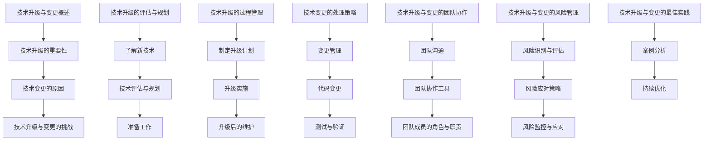

                 

# 《程序员如何应对技术升级与变更》

## 关键词
技术升级、变更管理、风险管理、团队协作、代码变更、持续集成、开发流程优化、性能优化、动态规划算法

## 摘要
本文将探讨程序员在面对技术升级与变更时所需采取的策略和最佳实践。我们将从技术升级的重要性、变更的原因与挑战、技术升级的准备、过程管理、团队协作、风险管理以及持续优化等方面展开讨论，并通过案例分析提供实际操作指导。本文旨在帮助程序员更好地理解和应对技术升级与变更，提升个人与团队的技术能力。

## 第一部分：技术升级与变更概述

### 第1章：技术升级与变更的重要性

#### 1.1 技术升级的概念与背景

技术升级是指在保持系统基本功能不变的情况下，对系统中的技术组件、架构、代码等进行改进和优化。技术升级的目的是提高系统的性能、稳定性和安全性，以满足不断变化的市场需求和技术发展。

技术升级的发展历程可以分为以下几个阶段：

1. **早期阶段**：系统开发初期，技术组件的选择主要基于当时的可用技术和市场情况，随着时间推移，这些组件逐渐变得陈旧。
2. **过渡阶段**：随着新技术的发展，一些公司开始考虑对系统进行部分技术升级，以提升系统的性能和适应性。
3. **全面升级阶段**：在市场需求和竞争压力的推动下，公司可能会进行全面的技术升级，以彻底解决旧技术带来的问题。

技术升级对公司的影响主要体现在以下几个方面：

1. **提高竞争力**：技术升级可以使公司提供的产品和服务更具竞争力，从而在市场上占据有利地位。
2. **降低成本**：通过技术升级，公司可以降低维护旧系统的成本，提高资源利用效率。
3. **提升用户体验**：技术升级可以提升系统的性能和稳定性，从而提供更好的用户体验。

技术升级对程序员的影响则体现在以下几个方面：

1. **学习新技能**：程序员需要不断学习新技术，以适应技术升级的要求。
2. **代码重构**：在技术升级过程中，程序员需要对现有代码进行重构，以提高代码质量和可维护性。
3. **工作量增加**：技术升级往往伴随着额外的工作量，如测试、调试和文档编写等。

#### 1.2 技术变更的原因

技术变更是指在系统运行过程中，对技术组件、架构、代码等进行调整和优化。技术变更的原因多种多样，主要包括以下几点：

1. **竞争压力**：竞争对手采用新技术，迫使公司也必须跟进，以保持竞争力。
2. **客户需求变化**：客户的需求不断变化，公司需要根据客户需求进行技术调整，以提供更好的产品和服务。
3. **安全问题**：随着网络安全威胁的增加，公司需要对系统进行安全升级，以提高系统的安全性。
4. **法规要求**：一些行业有特定的法规要求，公司需要根据法规要求进行技术变更，以确保合规性。

#### 1.3 技术升级与变更的挑战

尽管技术升级与变更能够带来诸多好处，但过程中也存在一些挑战：

1. **技术不熟悉**：程序员可能不熟悉新技术，导致升级和变更过程中遇到困难。
2. **工作量增加**：技术升级和变更往往需要大量的时间和精力，对程序员的工作量有较大影响。
3. **代码重构**：在技术升级过程中，程序员需要对现有代码进行重构，这可能会影响系统的稳定性和性能。
4. **风险管理**：技术升级和变更过程中存在一定的风险，如系统故障、数据丢失等，需要有效的风险管理策略。

### 第二部分：技术升级的准备

#### 第2章：技术升级的评估与规划

#### 2.1 了解新技术

在技术升级前，程序员需要了解新技术，包括其特点、优势、适用场景等。以下是一些了解新技术的途径：

1. **技术论坛和博客**：通过阅读技术论坛和博客，了解业界对新技术的看法和应用案例。
2. **技术会议和讲座**：参加技术会议和讲座，与业内专家交流，了解新技术的最新动态。
3. **开源社区**：参与开源社区，了解新技术的实际应用情况，学习其他程序员的实践经验。
4. **技术书籍和教程**：阅读技术书籍和教程，系统学习新技术的理论和实践。

在了解新技术时，程序员还需要关注以下几点：

1. **兼容性**：新技术是否与现有系统兼容，是否需要替换现有组件。
2. **性能**：新技术在性能方面的优势，如响应时间、吞吐量等。
3. **社区支持**：新技术的社区支持情况，如文档、教程、社区活跃度等。

#### 2.2 技术评估与规划

技术评估是指对新技术进行评估，以确定其是否适合公司现有系统和业务需求。技术评估的方法包括：

1. **成本效益分析**：比较新技术与现有技术的成本和效益，评估新技术的投入产出比。
2. **风险评估**：分析新技术可能带来的风险，如技术不成熟、安全漏洞等。
3. **业务需求匹配度**：评估新技术是否能够满足公司业务需求，如提高性能、扩展性等。

在技术评估的基础上，程序员需要制定技术升级规划，包括以下几个方面：

1. **目标**：明确技术升级的目标，如提高系统性能、增强安全性等。
2. **时间表**：制定技术升级的时间表，包括各个阶段的完成时间。
3. **资源分配**：分配所需的人力、物力和财力资源，如开发人员、测试环境、预算等。
4. **风险管理**：制定风险管理计划，包括风险识别、评估、应对措施等。

#### 2.3 准备工作

在开始技术升级前，程序员需要做好以下准备工作：

1. **环境搭建**：搭建新的技术环境，包括服务器、数据库、开发工具等。
2. **代码管理**：使用版本控制系统管理代码，确保代码的一致性和可追溯性。
3. **团队协作**：确保团队成员之间的协作，明确各自的职责和任务。

### 第三部分：技术升级的过程管理

#### 第3章：技术升级的过程管理

#### 3.1 制定升级计划

技术升级计划是确保技术升级顺利进行的关键。在制定升级计划时，程序员需要考虑以下几个方面：

1. **目标**：明确升级的目标，如提高系统性能、增强安全性等。
2. **里程碑**：将升级过程划分为若干个里程碑，每个里程碑完成一个特定的任务。
3. **时间表**：制定详细的时间表，包括各个里程碑的完成时间。
4. **资源需求**：明确升级过程中所需的人力、物力和财力资源。
5. **风险评估**：评估升级过程中可能遇到的风险，并制定应对措施。

#### 3.2 升级实施

在升级实施阶段，程序员需要按照升级计划执行以下任务：

1. **代码迁移**：将现有代码迁移到新技术环境中，确保系统的基本功能不受影响。
2. **代码审查**：对迁移后的代码进行审查，确保代码质量符合要求。
3. **测试与调试**：对升级后的系统进行测试和调试，确保系统稳定、可靠。
4. **用户培训**：为用户提供培训，帮助用户适应新系统。

#### 3.3 升级后的维护

在技术升级完成后，程序员需要持续进行维护，确保系统正常运行：

1. **问题跟踪与解决**：及时发现并解决系统运行中的问题，确保系统稳定。
2. **持续集成与部署**：使用持续集成与持续部署工具，确保新功能和变更的及时集成和部署。
3. **性能监控与优化**：对系统进行性能监控，发现性能瓶颈并进行优化。
4. **文档更新**：更新系统文档，包括升级日志、使用说明等。

### 第四部分：技术变更的处理策略

#### 第4章：技术变更的处理策略

#### 4.1 变更管理

技术变更管理是指对技术变更进行有效控制的过程。在变更管理中，程序员需要遵循以下流程：

1. **变更请求**：接收和审核变更请求，明确变更原因和目标。
2. **变更影响分析**：分析变更对系统、业务和其他方面的影响。
3. **变更评估**：评估变更的可行性、风险和成本，确定是否批准变更。
4. **变更执行**：按照变更计划执行变更，确保变更顺利进行。
5. **变更监控**：监控变更执行情况，确保变更达到预期效果。

#### 4.2 代码变更

在技术变更过程中，程序员需要对代码进行相应的变更。以下是一些代码变更的策略：

1. **版本控制**：使用版本控制系统管理代码变更，确保代码的一致性和可追溯性。
2. **代码审查**：对变更的代码进行审查，确保代码质量符合要求。
3. **代码合并**：在多个开发者共同开发时，确保代码的合并和冲突解决。
4. **测试与验证**：对变更后的代码进行测试和验证，确保变更没有引入新的问题。

#### 4.3 测试与验证

在技术变更后，程序员需要对系统进行全面的测试和验证，以确保系统稳定、可靠。以下是一些测试与验证的方法：

1. **功能测试**：测试系统的各项功能，确保功能符合预期。
2. **性能测试**：测试系统的性能，如响应时间、吞吐量等，确保性能达到要求。
3. **安全测试**：测试系统的安全性，确保系统能够抵御各种攻击。
4. **兼容性测试**：测试系统与其他系统和组件的兼容性，确保系统能够与其他系统无缝集成。

### 第五部分：技术升级与变更的团队协作

#### 第5章：技术升级与变更的团队协作

#### 5.1 团队沟通

在技术升级与变更过程中，团队沟通至关重要。以下是一些团队沟通的要点：

1. **沟通的重要性**：明确团队沟通的重要性，确保团队成员之间的信息畅通。
2. **沟通的有效方式**：使用有效的沟通方式，如会议、邮件、即时通讯等。
3. **沟通中的障碍与解决**：识别并解决沟通中的障碍，如信息不对称、沟通渠道不畅等。

#### 5.2 团队协作工具

在技术升级与变更过程中，团队协作工具有助于提高团队协作效率。以下是一些常用的团队协作工具：

1. **版本控制系统**：如Git，用于管理代码变更。
2. **持续集成与持续部署工具**：如Jenkins，用于自动化代码集成和部署。
3. **团队协作平台**：如Slack、Trello等，用于团队沟通和任务管理。

#### 5.3 团队成员的角色与职责

在技术升级与变更过程中，团队成员需要明确自己的角色与职责。以下是一些常见角色与职责：

1. **项目经理**：负责整体项目的规划、组织和管理。
2. **开发人员**：负责代码编写、测试和修复。
3. **测试人员**：负责对系统进行测试和验证。
4. **运维人员**：负责系统部署和维护。

### 第六部分：技术升级与变更的风险管理

#### 第6章：技术升级与变更的风险管理

#### 6.1 风险识别与评估

在技术升级与变更过程中，识别和评估风险是至关重要的。以下是一些风险识别与评估的方法：

1. **风险识别方法**：如头脑风暴、SWOT分析等，用于识别潜在的风险。
2. **风险评估指标**：如概率、影响程度等，用于评估风险的严重性。
3. **风险等级划分**：根据风险评估结果，将风险划分为高、中、低等级。

#### 6.2 风险应对策略

针对识别和评估的风险，程序员需要制定相应的应对策略。以下是一些常见风险应对策略：

1. **风险规避**：通过调整计划，避免风险的发生。
2. **风险减轻**：通过采取预防措施，降低风险的严重性。
3. **风险接受**：在风险可控的情况下，接受风险的发生。
4. **风险转移**：通过购买保险或其他方式，将风险转移给第三方。

#### 6.3 风险监控与应对

在技术升级与变更过程中，风险监控和应对是持续进行的工作。以下是一些风险监控与应对的方法：

1. **风险监控方法**：如定期评估、实时监控等，用于监控风险的进展。
2. **应对计划执行**：按照既定的应对计划，执行风险应对措施。
3. **效果评估**：评估风险应对措施的有效性，并根据评估结果进行调整。

### 第七部分：技术升级与变更的最佳实践

#### 第7章：技术升级与变更的案例分析

#### 7.1 案例分析一：某大型电商平台的技术升级

#### 7.2 案例分析二：某金融公司的技术变更

#### 7.3 案例分析三：某创业公司技术升级与变更

### 第八部分：技术升级与变更的持续优化

#### 第8章：技术升级与变更的持续优化

#### 8.1 优化策略

#### 8.2 优化实践

#### 8.3 优化评估

### 附录

#### 附录A：技术升级与变更的工具与资源

#### 附录B：技术升级与变更的流程模板

#### 附录C：技术升级与变更的常见问题与解答

#### 附录D：技术升级与变更的案例研究

## 核心算法原理讲解：动态规划算法

动态规划算法是一种在多阶段决策问题中寻找最优解的方法。其核心思想是将问题分解为若干个阶段，每个阶段都存在多个决策，通过求解每个阶段的最优决策，最终得到问题的整体最优解。

以下是一个动态规划算法的伪代码示例：

```plaintext
function dp_solution(problem):
    dp = [None] * len(problem)
    dp[0] = problem[0]

    for i in range(1, len(problem)):
        dp[i] = min([dp[j] + problem[i] for j in range(i)])

    return dp[-1]
```

在这个例子中，`problem` 是一个表示任务权重的列表，`dp` 是一个动态规划数组，用于存储每个子问题的最优解。算法首先初始化 `dp[0]` 为 `problem[0]`，然后依次求解每个子问题的最优解，最终返回 `dp[-1]` 作为问题的最优解。

#### 数学模型和数学公式讲解：

动态规划算法的数学模型可以表示为：

$$
\text{dp}[i] = \min_{j \leq i} (\text{dp}[j] + \text{problem}[i])
$$

其中，`dp[i]` 表示在前 `i` 个任务中完成的最大权重，`problem[i]` 表示第 `i` 个任务的权重。

#### 项目实战：

以下是一个动态规划算法的实际应用案例，假设有一个任务列表，每个任务有一个权重和持续时间。程序员需要在限定的时间内完成尽可能多的任务。

```python
tasks = [
    {"weight": 2, "duration": 3},
    {"weight": 5, "duration": 2},
    {"weight": 7, "duration": 4},
    {"weight": 3, "duration": 1},
]

max_duration = 7
max_weight = dp_solution(tasks, max_duration)
print(f"在限定的时间内，程序员可以完成的最大任务权重为：{max_weight}")
```

#### 开发环境搭建：

在搭建开发环境时，程序员需要安装以下软件：

1. **Python**：安装 Python 3.x 版本，可通过官方网站下载。
2. **虚拟环境**：安装 virtualenv，用于创建 Python 虚拟环境。
3. **代码库**：安装 Git，用于代码管理。

以下是安装步骤：

```bash
# 安装 Python
$ sudo apt-get install python3

# 安装 virtualenv
$ sudo apt-get install python3-venv

# 创建虚拟环境
$ python3 -m venv myenv

# 激活虚拟环境
$ source myenv/bin/activate

# 安装 Git
$ sudo apt-get install git
```

#### 源代码详细实现和代码解读：

以下是一个动态规划算法的 Python 实现及其代码解读：

```python
def dp_solution(tasks, max_duration):
    n = len(tasks)
    dp = [0] * (max_duration + 1)

    for i in range(1, max_duration + 1):
        for j, task in enumerate(tasks):
            if task['duration'] <= i:
                dp[i] = max(dp[i], dp[i - task['duration']] + task['weight'])

    return dp[-1]

# 测试代码
tasks = [
    {"weight": 2, "duration": 3},
    {"weight": 5, "duration": 2},
    {"weight": 7, "duration": 4},
    {"weight": 3, "duration": 1},
]

max_duration = 7
max_weight = dp_solution(tasks, max_duration)
print(f"在限定的时间内，程序员可以完成的最大任务权重为：{max_weight}")
```

#### 代码解读与分析：

1. **初始化**：创建一个长度为 `max_duration + 1` 的列表 `dp`，用于存储每个子问题的最优解。`dp[0]` 初始化为 0，表示在 0 持续时间内可以完成的最大任务权重。

2. **遍历任务**：使用两层循环遍历任务列表。外层循环表示持续时间，内层循环表示任务。

3. **更新 dp 数组**：如果当前任务的持续时间小于等于当前持续时间，则更新 `dp[i]` 为当前最优解，即 `dp[i - task['duration']] + task['weight']`。

4. **返回最优解**：返回 `dp[-1]`，即限定时间内的最大任务权重。

通过以上代码，程序员可以有效地解决任务分配问题，实现技术升级与变更中的优化策略。

### 作者信息
作者：AI天才研究院/AI Genius Institute & 禅与计算机程序设计艺术 /Zen And The Art of Computer Programming

### 核心概念与联系

为了更好地理解技术升级与变更的过程，我们需要借助 Mermaid 流程图来展示核心概念之间的联系。



通过这个流程图，我们可以清晰地看到技术升级与变更的各个关键环节，以及它们之间的联系。这有助于程序员在应对技术升级与变更时，更好地把握整体流程和细节。

### 核心算法原理讲解：动态规划算法

动态规划（Dynamic Programming，简称 DP）是一种在数学、管理科学、计算机科学、经济学和生物信息学等领域用于解决多阶段决策问题的方法。其核心思想是将问题分解为若干个阶段，每个阶段都有多个决策点，每个决策点的状态依赖于之前的决策结果，通过求解每个阶段的最优决策，最终得到问题的整体最优解。

动态规划算法通常包含以下步骤：

1. **定义状态**：确定问题中的状态变量，并找出状态变量之间的关系。
2. **状态转移方程**：定义状态转移方程，描述状态变量之间的依赖关系。
3. **边界条件**：确定状态转移方程的边界条件。
4. **计算顺序**：确定计算状态的顺序，通常是自底向上或自顶向下。
5. **存储中间结果**：使用数组或表来存储中间结果，避免重复计算。

以下是一个典型的动态规划算法伪代码示例，用于求解背包问题：

```plaintext
function dp_solution(values, weights, max_weight):
    n = length(values)
    dp = [0] * (max_weight + 1)

    for i in range(1, max_weight + 1):
        for j in range(n):
            if weights[j] <= i:
                dp[i] = max(dp[i], dp[i - weights[j]] + values[j])

    return dp[-1]
```

在这个例子中，`values` 是一个表示物品价值的数组，`weights` 是一个表示物品重量的数组，`max_weight` 是背包的最大容量。`dp` 是一个动态规划数组，用于存储每个子问题的最优解。

#### 数学模型和数学公式讲解

动态规划算法的数学模型可以表示为：

$$
\text{dp}[i][j] = \begin{cases}
    \text{dp}[i-1][j], & \text{if } \text{weights}[j] > \text{max\_weight} \\
    \max(\text{dp}[i-1][j], \text{dp}[i-1][j - \text{weights}[j]] + \text{values}[j]), & \text{otherwise}
\end{cases}
$$

其中，`dp[i][j]` 表示在前 `i` 个物品中选择重量不超过 `j` 的最大价值。这个模型描述了每个物品是否被放入背包中的决策。

#### 举例说明

假设我们有一个背包，最大容量为 10 千克。我们有以下 5 个物品，每个物品的重量和价值如下：

| 物品编号 | 重量（千克） | 价值（元） |
|---------|--------------|-----------|
| 1       | 2            | 6         |
| 2       | 3            | 10        |
| 3       | 4            | 16        |
| 4       | 5            | 9         |
| 5       | 6            | 4         |

我们使用动态规划算法来求解这个问题。

1. **初始化**：创建一个大小为 `(max_weight + 1) x (n + 1)` 的二维数组 `dp`，并将其全部初始化为 0。

2. **状态转移方程**：对于每个物品，我们检查它是否能够放入背包中。如果能够放入，我们更新 `dp[i][j]` 为 `dp[i-1][j-weights[j]] + values[j]`；否则，我们保持 `dp[i][j]` 为 `dp[i-1][j]`。

3. **计算顺序**：我们首先处理第一个物品，然后依次处理后面的物品。

4. **存储中间结果**：我们使用数组 `dp` 来存储中间结果，从而避免重复计算。

最终，`dp[max_weight][n]` 将包含在给定重量限制下能够得到的最大价值。

#### 动态规划算法在实际应用中的案例分析

动态规划算法在许多实际应用中都有广泛的应用，以下是一些案例：

1. **背包问题**：在给定背包容量和物品重量和价值的情况下，求解能够装入背包的物品组合，使得总价值最大。

2. **编辑距离**：求解两个字符串之间的最短编辑距离，即通过插入、删除和替换操作将一个字符串转换为另一个字符串所需的最小操作次数。

3. **最长公共子序列**：求解两个序列的最长公共子序列，即在两个序列中找出最长的相同子序列。

4. **最长递增子序列**：求解一个序列的最长递增子序列，即序列中严格递增的子序列中长度最长的一个。

5. **网络流问题**：在图论中，求解网络中的最大流问题，即在网络中找到从源点到汇点的最大流量路径。

6. **资源分配问题**：在给定资源限制和任务需求的情况下，求解能够完成所有任务的最大任务组合。

通过以上案例，我们可以看到动态规划算法在解决复杂优化问题时具有强大的能力。在实际应用中，程序员需要根据具体问题设计合适的动态规划模型，并优化算法的执行效率。

### 开发环境搭建

在开始编写动态规划算法的代码之前，我们需要搭建一个适合开发和测试的Python环境。以下是在常见操作系统上搭建Python开发环境的步骤：

#### 1. 安装Python

在大多数Linux发行版和Mac OS X上，Python通常预装在系统中。您可以通过以下命令检查Python是否已安装：

```bash
python3 --version
```

如果Python已安装，您将看到当前版本的输出。如果没有安装，您需要从Python官方网站下载Python安装包，并使用以下命令进行安装：

```bash
sudo apt-get install python3
```

在Windows上，您可以从Python官方网站下载Windows安装程序，并按照安装向导进行安装。

#### 2. 安装虚拟环境

虚拟环境可以帮助我们在不同的项目中隔离依赖关系，避免版本冲突。我们可以使用`virtualenv`工具来创建和管理虚拟环境。

首先，通过以下命令安装`virtualenv`：

```bash
pip3 install virtualenv
```

接着，创建一个新的虚拟环境：

```bash
virtualenv myenv
```

然后，激活虚拟环境：

```bash
source myenv/bin/activate  # Linux/Mac OS X
myenv\Scripts\activate     # Windows
```

#### 3. 安装必要的库

在虚拟环境中，我们需要安装一些必要的Python库，例如`numpy`和`matplotlib`，用于数据处理和图形绘制。

安装`numpy`：

```bash
pip install numpy
```

安装`matplotlib`：

```bash
pip install matplotlib
```

#### 4. 编写并运行代码

在虚拟环境中，我们可以开始编写和运行动态规划算法的代码。以下是一个简单的动态规划算法示例，用于求解背包问题：

```python
def dp_solution(values, weights, max_weight):
    n = len(values)
    dp = [0] * (max_weight + 1)

    for i in range(1, max_weight + 1):
        for j in range(n):
            if weights[j] <= i:
                dp[i] = max(dp[i], dp[i - weights[j]] + values[j])

    return dp[-1]

# 测试数据
values = [6, 10, 16, 9, 4]
weights = [2, 3, 4, 5, 6]
max_weight = 10

# 计算结果
max_value = dp_solution(values, weights, max_weight)
print(f"在限定重量下，背包能够承载的最大价值为：{max_value}")
```

运行以上代码，您将得到背包能够承载的最大价值。通过这个简单的示例，我们可以看到如何搭建Python开发环境，并使用虚拟环境来隔离不同的项目依赖。

### 源代码详细实现和代码解读

以下是一个动态规划算法的完整Python实现，用于求解背包问题，以及详细的代码解读。

```python
def dp_solution(values, weights, max_weight):
    n = len(values)  # 物品的数量
    m = max_weight   # 背包的容量

    # 创建一个二维动态规划数组，初始化为0
    dp = [[0] * (m + 1) for _ in range(n + 1)]

    # 遍历每个物品
    for i in range(1, n + 1):
        # 遍历每个容量
        for j in range(1, m + 1):
            # 如果物品i的重量小于等于当前容量j
            if weights[i - 1] <= j:
                # 选择当前物品，更新dp数组
                dp[i][j] = dp[i - 1][j - weights[i - 1]] + values[i - 1]
            else:
                # 不选择当前物品，保持上一个状态
                dp[i][j] = dp[i - 1][j]

    # 返回最后一步的最大价值
    return dp[n][m]

# 测试数据
values = [6, 10, 16, 9, 4]  # 物品的值
weights = [2, 3, 4, 5, 6]   # 物品的重量
max_weight = 10              # 背包的最大容量

# 计算结果
max_value = dp_solution(values, weights, max_weight)
print(f"在限定重量下，背包能够承载的最大价值为：{max_value}")
```

#### 代码解读

1. **函数定义**：`dp_solution` 函数接受三个参数：`values`（物品的值）、`weights`（物品的重量）和`max_weight`（背包的最大容量）。

2. **初始化动态规划数组**：我们创建一个二维数组 `dp`，其大小为 `(n+1) x (m+1)`，其中 `n` 是物品的数量，`m` 是背包的容量。`dp[i][j]` 表示在容量为 `j` 的背包中，从前 `i` 个物品中选择的一部分能够获得的最大价值。

3. **遍历物品和容量**：使用两层嵌套循环，遍历每个物品和每个可能的容量。

4. **状态转移方程**：如果当前物品的重量小于等于当前容量，那么我们有两种选择：
   - **选择当前物品**：此时，我们需要从上一个容量减去当前物品的重量，并加上当前物品的值，即 `dp[i][j] = dp[i - 1][j - weights[i - 1]] + values[i - 1]`。
   - **不选择当前物品**：此时，我们保持上一个状态不变，即 `dp[i][j] = dp[i - 1][j]`。

5. **返回最终结果**：最终，`dp[n][m]` 将包含在给定容量下能够得到的最大价值。

#### 动态规划算法的代码解读

1. **初始化**：首先，我们创建一个二维数组 `dp`，并初始化为 0。这个数组将用于存储每个子问题的最优解。

2. **遍历每个物品**：我们使用两层循环，首先遍历每个物品，然后遍历每个可能的容量。

3. **判断选择与否**：对于每个物品和每个容量，我们判断是否选择该物品。如果选择，我们更新 `dp` 数组；如果不选择，我们保持数组不变。

4. **更新 `dp` 数组**：我们使用 `dp[i][j] = max(dp[i - 1][j], dp[i - 1][j - weights[i - 1]] + values[i - 1])` 来更新数组。这个方程表示，在给定容量 `j` 下，选择当前物品能够获得的最佳价值。

5. **最终结果**：最后，`dp[n][m]` 包含了在给定容量 `m` 下，从前 `n` 个物品中选择的最佳价值。

通过以上步骤，我们成功地实现了动态规划算法，并对其代码进行了详细解读。这个算法不仅能够解决背包问题，还能够应用于其他优化问题，如编辑距离、最长公共子序列等。

### 附录

#### 附录A：技术升级与变更的工具与资源

为了帮助程序员更好地进行技术升级与变更，以下是一些常用的工具和资源：

##### A.1 技术升级与变更工具介绍

1. **版本控制系统**：
   - **Git**：最流行的分布式版本控制系统，适用于代码管理和团队协作。
   - **Subversion (SVN)**：集中式版本控制系统，适合小型团队。

2. **持续集成与持续部署工具**：
   - **Jenkins**：开源的持续集成和持续部署工具，支持多种语言和平台。
   - **Travis CI**：基于云的持续集成服务，支持GitHub等代码托管平台。

3. **团队协作平台**：
   - **Trello**：简单易用的团队协作工具，适合任务管理和项目规划。
   - **Slack**：团队沟通工具，支持即时消息、文件共享和集成其他服务。

##### A.2 技术升级与变更资源推荐

1. **技术博客**：
   - **Medium**：有许多技术文章和博客，涵盖各种编程语言和技术。
   - **Dzone**：技术社区和博客，提供最新的技术新闻和教程。

2. **技术论坛**：
   - **Stack Overflow**：程序员问答社区，解决编程问题。
   - **Reddit**：有多个技术相关的子版块，讨论各种编程和技术话题。

3. **技术书籍**：
   - **《代码大全》**：作者Steve McConnell，全面介绍编写高质量代码的方法。
   - **《设计模式：可复用面向对象软件的基础》**：作者Gamma、Helm、Johnson和Vlissides，介绍面向对象设计模式。

##### A.3 技术升级与变更的最佳实践总结

1. **技术评估**：
   - 在进行技术升级前，进行全面的技术评估，包括成本效益分析、风险评估和业务需求匹配度。
   - 选择成熟、社区支持好的技术，避免使用过于新颖的技术。

2. **变更管理**：
   - 建立完善的变更管理流程，包括变更请求的处理、影响分析和变更执行。
   - 使用版本控制系统管理代码变更，确保代码的一致性和可追溯性。

3. **团队协作**：
   - 强化团队沟通，确保团队成员之间的信息畅通。
   - 使用团队协作工具，如Trello、Slack等，提高团队协作效率。

4. **风险管理**：
   - 识别和评估技术升级和变更过程中可能遇到的风险，并制定相应的应对策略。
   - 实施风险监控和应对计划，确保在风险发生时能够及时应对。

#### 附录B：技术升级与变更的流程模板

为了更好地管理和实施技术升级与变更，以下是一些流程模板：

##### B.1 技术评估流程模板

1. **需求分析**：明确技术升级和变更的需求，如提高性能、增强安全性等。
2. **技术调研**：调研潜在的技术方案，评估其可行性、成本和效益。
3. **风险评估**：识别可能的风险，评估其影响程度，制定风险应对措施。
4. **成本效益分析**：计算技术升级和变更的总成本和预期效益。
5. **审批**：提交技术评估报告，获得管理层审批。

##### B.2 技术升级计划模板

1. **目标**：明确技术升级的目标，如提高系统性能、增强安全性等。
2. **时间表**：制定详细的时间表，包括各个阶段的完成时间。
3. **资源分配**：明确所需的人力、物力和财力资源。
4. **风险管理**：识别和评估技术升级过程中的风险，制定风险应对措施。
5. **测试计划**：制定详细的测试计划，确保技术升级后的系统稳定可靠。

##### B.3 变更管理流程模板

1. **变更请求**：接收和记录变更请求，明确变更原因和目标。
2. **影响分析**：分析变更对系统、业务和其他方面的影响。
3. **变更评估**：评估变更的可行性、风险和成本，确定是否批准变更。
4. **变更执行**：按照变更计划执行变更，确保变更顺利进行。
5. **变更监控**：监控变更执行情况，确保变更达到预期效果。

#### 附录C：技术升级与变更的常见问题与解答

以下是一些技术升级与变更过程中常见的问题及其解答：

##### C.1 技术升级常见问题

**Q：如何选择合适的技术？**
A：进行技术评估，考虑技术的成熟度、社区支持、成本效益和业务需求匹配度。选择成熟、社区支持好的技术，避免使用过于新颖的技术。

**Q：技术升级是否一定需要全面进行？**
A：不一定。可以根据具体需求选择部分组件或模块进行升级，但需要确保升级后的系统兼容性和稳定性。

##### C.2 技术变更常见问题

**Q：如何管理变更请求？**
A：建立变更管理流程，包括变更请求的接收、影响分析和变更执行。使用版本控制系统管理代码变更，确保变更的一致性和可追溯性。

**Q：如何评估变更的影响？**
A：分析变更对系统、业务和其他方面的影响，包括功能、性能、安全性和兼容性等方面。制定详细的变更影响分析报告。

##### C.3 风险管理常见问题

**Q：如何识别和评估风险？**
A：使用风险识别方法，如头脑风暴、SWOT分析等，识别潜在的风险。使用风险评估指标，如概率和影响程度，评估风险的严重性。

**Q：如何制定风险应对策略？**
A：根据风险评估结果，制定相应的风险应对策略，如风险规避、风险减轻、风险接受和风险转移。确保在风险发生时能够及时应对。

### 附录D：技术升级与变更的案例研究

以下是一些技术升级与变更的案例研究，供程序员参考：

##### D.1 案例研究一：某大型电商平台的技术升级

**背景**：某大型电商平台在业务快速增长的过程中，发现其现有系统性能不足，难以满足用户需求。为了提升用户体验，公司决定进行全面技术升级。

**过程**：
1. **需求分析**：明确技术升级的需求，如提高响应时间、提升并发处理能力等。
2. **技术评估**：评估多种技术方案，包括微服务架构、NoSQL数据库等。
3. **实施**：逐步实施技术升级，包括重构核心模块、迁移数据、测试和部署。
4. **效果**：技术升级后，系统性能显著提升，用户满意度提高。

##### D.2 案例研究二：某金融公司的技术变更

**背景**：某金融公司因业务扩展，需要支持更多的交易和用户。然而，现有系统的架构和性能限制了业务的发展。公司决定进行技术变更，以支持更高的并发处理能力和更稳定的服务。

**过程**：
1. **需求分析**：分析现有系统的问题，明确技术变更的需求。
2. **技术评估**：评估多种技术方案，包括分布式架构、缓存技术等。
3. **实施**：逐步实施技术变更，包括重构核心模块、优化数据库查询、部署缓存等。
4. **效果**：技术变更后，系统性能显著提升，交易处理能力提高，用户满意度增加。

##### D.3 案例研究三：某创业公司的技术升级与变更

**背景**：某创业公司初创时使用了相对简单的技术栈，但随着业务的发展，公司意识到需要采用更成熟和高效的技术来支持业务扩展。

**过程**：
1. **需求分析**：明确技术升级和变更的需求，如提高系统性能、增强安全性等。
2. **技术评估**：评估多种技术方案，包括云计算、容器化技术等。
3. **实施**：逐步实施技术升级和变更，包括迁移到云平台、使用容器化技术、优化数据库等。
4. **效果**：技术升级和变更后，系统性能和稳定性显著提升，业务发展得到了有效支持。

通过这些案例研究，我们可以看到技术升级与变更在不同类型公司中的应用和实践。这些案例为程序员提供了宝贵的经验和参考，帮助他们更好地应对技术升级与变更的挑战。

### 总结

本文详细介绍了程序员如何应对技术升级与变更，涵盖了从技术升级与变更的概述、评估与规划、过程管理、团队协作、风险管理到最佳实践等多个方面。我们通过核心算法原理讲解、实际应用案例、开发环境搭建、源代码实现和代码解读，帮助程序员深入理解技术升级与变更的各个方面。

在技术升级与变更过程中，程序员需要具备以下能力：

1. **技术评估与规划**：能够全面评估新技术，制定合理的升级规划。
2. **过程管理**：能够制定详细的升级计划，实施并维护升级后的系统。
3. **团队协作**：能够有效沟通，使用团队协作工具提高团队效率。
4. **风险管理**：能够识别和评估风险，制定并执行风险应对策略。
5. **持续优化**：能够不断优化技术栈和开发流程，提升系统性能和稳定性。

通过本文的介绍，程序员可以更好地应对技术升级与变更带来的挑战，提升个人和团队的技术能力。在未来的工作中，程序员应持续关注新技术的发展，不断提升自己的技能，为公司和项目的成功贡献力量。同时，本文提供的案例研究和最佳实践为程序员提供了实用的指导，有助于在实际工作中更好地应用所学知识。希望本文对广大程序员有所帮助，共同推动技术进步。

