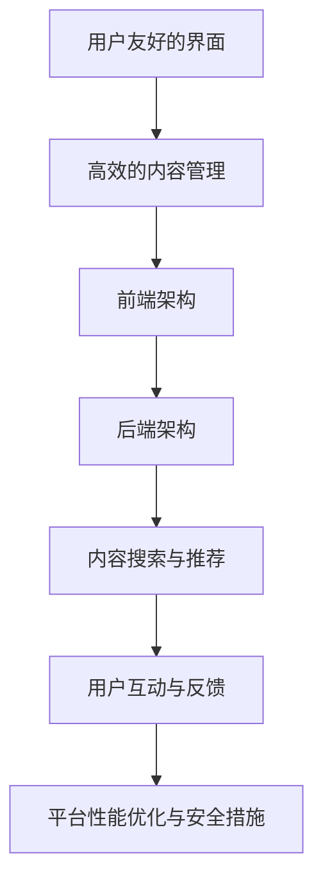
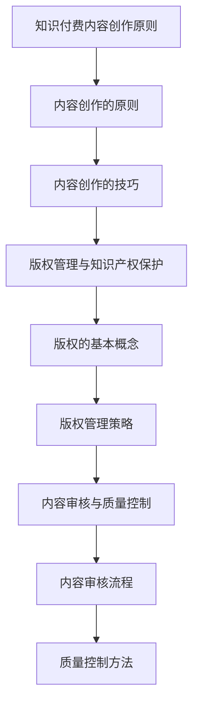
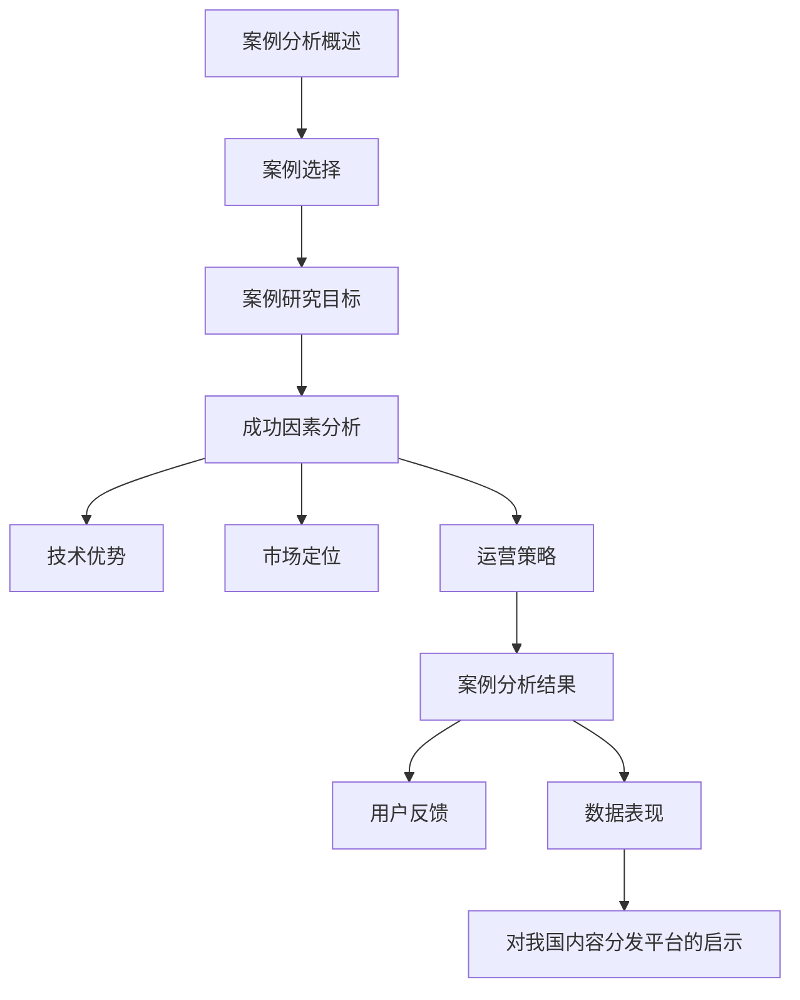
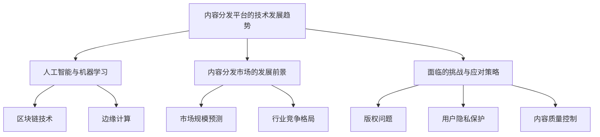
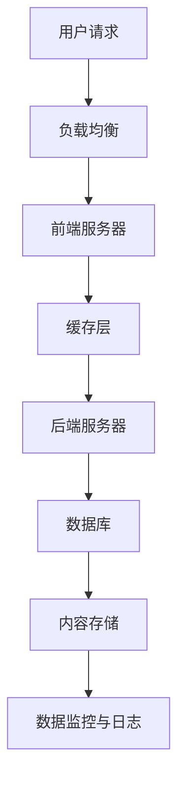

                 

### 第一部分：内容分发概述

#### 第1章：知识付费与内容分发基础

**知识付费的背景与意义**

知识付费，作为一种新型的商业模式，近年来在全球范围内迅速发展。它指的是用户通过付费方式获取有价值的知识、信息和技能。在信息爆炸的时代，人们对于高质量、针对性强的知识内容有着强烈的需求，而知识付费则满足了这种需求。

知识付费的兴起与以下几个因素密切相关：

1. **信息过载**：随着互联网的普及，人们每天都会接触到大量的信息，但其中很多都是无用或低质量的，这导致用户筛选信息的成本大大增加。
2. **专业化需求**：在职场竞争激烈的环境下，人们越来越需要专业化的知识和技能来提升自己的竞争力。
3. **内容创作者的崛起**：随着技术的进步，创作和传播内容变得更加容易，大量的内容创作者涌现出来，他们通过知识付费模式获得收入。

**知识付费的定义与发展**

知识付费可以定义为一种付费获取知识的机制，它涵盖了多种形式，如在线课程、电子书、专业咨询、订阅服务等。这种模式的出现，使得知识传播变得更加高效和便捷。

知识付费的发展历程可以概括为以下几个阶段：

1. **萌芽期**：在互联网初期，知识付费主要以电子书和在线课程的形式存在，用户通过购买或订阅来获取知识。
2. **快速发展期**：随着移动互联网的普及，知识付费进入快速发展期，各种知识服务平台如雨后春笋般涌现，如Coursera、Udemy等。
3. **成熟期**：当前，知识付费市场已经趋于成熟，除了传统的在线教育平台外，各大互联网公司也开始布局知识付费领域，推出自己的知识产品和服务。

**知识付费的商业模式**

知识付费的商业模式主要包括以下几种：

1. **订阅制**：用户通过订阅获取一定期限内的内容，如知乎盐选会员、得到等。
2. **单次购买**：用户为单个内容或课程支付费用，如电子书、在线课程等。
3. **按需付费**：用户根据自己的需求支付费用，如专业咨询、一对一教学等。

**内容分发的概念与类型**

内容分发是指将知识、信息或娱乐内容通过各种渠道传递给目标用户的过程。内容分发在网络时代尤为重要，因为它直接影响到用户体验和内容提供商的收益。

内容分发的类型可以分为以下几种：

1. **社交媒体**：通过社交媒体平台，如微博、微信、Facebook等，用户可以轻松获取和分享内容。
2. **搜索引擎**：用户通过搜索引擎，如百度、Google等，搜索特定内容。
3. **邮件列表**：通过邮件列表，内容提供商可以将内容定期发送给订阅用户。
4. **移动应用**：通过移动应用，用户可以随时随地获取内容，如新闻客户端、学习应用等。

**程序员在知识付费内容分发中的作用**

程序员在知识付费内容分发中扮演着至关重要的角色，他们不仅是内容创作者，也是平台开发者和用户体验设计师。具体来说，程序员的作用包括：

1. **内容创作**：程序员可以创作技术文章、教程、代码示例等，这些内容对于程序员群体具有很高的价值。
2. **平台开发**：程序员负责开发知识付费平台，包括前端、后端和数据库等。
3. **用户体验设计**：程序员需要考虑如何设计一个友好、易用的平台界面，提升用户的体验。

**程序员面临的挑战**

尽管程序员在知识付费内容分发中发挥着重要作用，但他们也面临着一些挑战：

1. **版权问题**：程序员需要确保自己创作的内容不侵犯他人的版权。
2. **内容质量控制**：程序员需要确保内容的质量，避免低质量或错误的内容对用户造成误导。
3. **技术更新**：随着技术的发展，程序员需要不断学习新的技术和工具，以保持竞争力。

**内容分发技术概览**

1. **内容分发网络（CDN）**

内容分发网络（CDN）是一种分布式网络服务，它通过多个节点将内容传递给用户。CDN的主要优势包括：

- **提高速度**：通过将内容存储在离用户最近的节点上，CDN可以显著降低用户的访问延迟。
- **提高可靠性**：CDN通过多节点备份和负载均衡，确保内容的高可用性。

2. **分布式存储与缓存技术**

分布式存储和缓存技术是内容分发的重要组成部分。分布式存储通过多个节点存储数据，提高数据存储的可靠性和性能。缓存技术则通过存储经常访问的数据，减少数据的访问时间。

3. **实时内容推送与监控**

实时内容推送与监控是保证内容分发效率和质量的关键。实时内容推送技术可以确保用户及时获取最新内容，而监控技术则可以实时检测内容分发的状态和性能。

**Mermaid 流程图**

以下是内容分发技术概览的Mermaid流程图：

```mermaid
graph TD
    A[内容分发网络(CDN)] --> B[分布式存储与缓存技术]
    B --> C[实时内容推送与监控]
```

通过这一部分的详细讲解，我们可以看到程序员在知识付费内容分发中的重要角色以及面临的挑战。接下来，我们将深入探讨内容分发中的核心算法和模型。

---

在撰写第一部分时，我们首先介绍了知识付费的背景和意义，详细阐述了知识付费的定义、商业模式以及发展历程。接着，我们介绍了内容分发的概念和类型，包括社交媒体、搜索引擎、邮件列表和移动应用等。随后，我们探讨了程序员在知识付费内容分发中的角色和面临的挑战，最后对内容分发技术进行了概览，并通过Mermaid流程图展示了CDN、分布式存储与缓存技术以及实时内容推送与监控的基本概念。

在接下来的章节中，我们将进一步深入讨论内容推荐算法、机器学习与深度学习模型在内容分发中的应用、内容分发平台的开发、知识付费内容创作与版权管理、案例分析以及未来趋势与挑战。让我们继续一步一步地分析和推理，为读者带来更有深度的技术解析。

---

### 第2章：核心算法与模型

**内容推荐算法**

内容推荐算法是内容分发平台的核心，它通过分析用户的兴趣和行为，向用户推荐可能感兴趣的内容。常见的推荐算法包括协同过滤算法和矩阵分解。

**协同过滤算法**

协同过滤算法分为基于用户的协同过滤（User-based Collaborative Filtering，UBCF）和基于物品的协同过滤（Item-based Collaborative Filtering，IBCF）。

1. **基于用户的协同过滤（UBCF）**

   - **相似度计算**：计算用户之间的相似度，常用的相似度度量方法包括余弦相似度、皮尔逊相关系数等。
   - **推荐生成**：基于相似度矩阵，为用户推荐与其相似的其他用户喜欢的物品。

2. **基于物品的协同过滤（IBCF）**

   - **相似度计算**：计算物品之间的相似度，常用的相似度度量方法包括余弦相似度、Jaccard系数等。
   - **推荐生成**：为用户推荐与用户已评分的物品相似的物品。

**矩阵分解**

矩阵分解（Matrix Factorization）是一种常用的推荐算法，通过将用户-物品评分矩阵分解为用户特征矩阵和物品特征矩阵，从而实现内容推荐。

1. **奇异值分解（SVD）**

   - **模型构建**：将用户-物品评分矩阵分解为用户特征矩阵U和物品特征矩阵V，使得U和V的乘积尽可能接近原始评分矩阵。
   - **推荐生成**：通过计算用户特征矩阵和物品特征矩阵的乘积，预测用户对未知物品的评分，从而推荐物品。

   **伪代码**

   ```python
   def matrix_factorization(R, U, V, K):
       for i in range(num_users):
           for j in range(num_items):
               if R[i][j] > 0:
                   e_ij = R[i][j] - dot(U[i], V[j])
                   for k in range(K):
                       U[i][k] += alpha * e_ij * V[j][k]
                       V[j][k] += alpha * e_ij * U[i][k]
       return U, V
   ```

2. **低秩矩阵分解**

   - **模型构建**：通过最小化重构误差和正则化项，将高秩矩阵分解为低秩矩阵。
   - **推荐生成**：与奇异值分解类似，通过计算用户特征矩阵和物品特征矩阵的乘积进行推荐。

   **伪代码**

   ```python
   def low_rank_matrix_factorization(R, K):
       U = random_matrix(num_users, K)
       V = random_matrix(num_items, K)
       
       for i in range(num_iterations):
           for i in range(num_users):
               for j in range(num_items):
                   e_ij = R[i][j] - dot(U[i], V[j])
                   for k in range(K):
                       U[i][k] += alpha * e_ij * V[j][k]
                       V[j][k] += alpha * e_ij * U[i][k]
       
       return U, V
   ```

**机器学习与深度学习模型在内容分发中的应用**

1. **卷积神经网络（CNN）**

   - **图像处理**：CNN是一种强大的图像处理工具，通过多层卷积和池化操作提取图像特征。
   - **应用场景**：例如，在内容推荐中，可以通过CNN提取用户上传的图片特征，用于辅助推荐。

   **CNN结构**

   ```mermaid
   graph TD
       A[Input] --> B[Conv1]
       B --> C[ReLU]
       C --> D[Pooling1]
       D --> E[Conv2]
       E --> F[ReLU]
       F --> G[Pooling2]
       G --> H[Flatten]
       H --> I[FC1]
       I --> J[ReLU]
       J --> K[FC2]
       K --> L[Output]
   ```

2. **递归神经网络（RNN）**

   - **序列数据**：RNN适合处理序列数据，如时间序列、自然语言文本等。
   - **应用场景**：在内容分发中，可以使用RNN分析用户的历史行为，预测用户未来的兴趣。

   **RNN结构**

   ```mermaid
   graph TD
       A[Input] --> B[RNN1]
       B --> C[Output]
       C --> D[RNN2]
       D --> E[Output]
   ```

3. **序列到序列（Seq2Seq）模型**

   - **序列转换**：Seq2Seq模型是一种用于序列转换的神经网络模型，常用于机器翻译、自动摘要等任务。
   - **应用场景**：在内容分发中，可以使用Seq2Seq模型将用户的行为序列转换为推荐内容序列。

   **Seq2Seq结构**

   ```mermaid
   graph TD
       A[Encoder] --> B[Decoder]
       A --> C[Context]
       B --> D[Output]
   ```

**自然语言处理（NLP）技术**

1. **词嵌入（Word Embedding）**

   - **概念**：词嵌入是将词语转换为向量表示的方法，常用于文本数据预处理。
   - **应用**：在内容分发中，可以使用词嵌入来表示用户评论、标题等，用于推荐算法。

   **Word2Vec伪代码**

   ```python
   def word2vec(corpus, size, window):
       # 初始化词向量
       V = random_matrix(size, num_words)
       
       for sentence in corpus:
           for i in range(len(sentence)):
               # 当前词
               word = sentence[i]
               # 随机采样的词窗口
               context = random_choice(sentence, i, window)
               
               # 更新词向量
               for context_word in context:
                   V[word] += learning_rate * (V[context_word] - V[word])
       
       return V
   ```

2. **序列到序列（Seq2Seq）模型**

   - **概念**：Seq2Seq模型是一种用于序列转换的神经网络模型，常用于机器翻译、自动摘要等任务。
   - **应用**：在内容分发中，可以使用Seq2Seq模型将用户的行为序列转换为推荐内容序列。

   **Seq2Seq结构**

   ```mermaid
   graph TD
       A[Encoder] --> B[Decoder]
       A --> C[Context]
       B --> D[Output]
   ```

通过本章的讲解，我们了解了内容分发中的核心算法和模型，包括协同过滤算法、矩阵分解、卷积神经网络（CNN）、递归神经网络（RNN）和序列到序列（Seq2Seq）模型。这些算法和模型在内容分发中发挥着重要作用，为用户提供了个性化、高质量的推荐内容。接下来，我们将探讨内容分发平台的设计和开发。

---

在第二部分的讲解中，我们首先介绍了内容推荐算法，包括基于用户的协同过滤（UBCF）和基于物品的协同过滤（IBCF）。接着，我们详细阐述了矩阵分解算法，包括奇异值分解（SVD）和低秩矩阵分解。随后，我们探讨了机器学习与深度学习模型在内容分发中的应用，重点介绍了卷积神经网络（CNN）、递归神经网络（RNN）和序列到序列（Seq2Seq）模型。最后，我们介绍了自然语言处理（NLP）技术中的词嵌入（Word2Vec）和序列到序列（Seq2Seq）模型。

通过这些核心算法和模型的讲解，我们不仅了解了它们的基本原理和实现方法，还看到了它们在内容分发中的实际应用。这些算法和模型使得内容分发平台能够根据用户的兴趣和行为提供个性化的推荐，从而提高用户的满意度和平台的竞争力。

接下来，我们将进入第三部分，探讨内容分发平台的设计和开发，包括平台的设计原则、前端架构、后端架构、核心功能和性能优化与安全措施。我们将继续通过一步步的分析和推理，为读者提供深入的技术解析。

---

### 第3章：内容分发平台开发

#### 第3章：内容分发平台开发

**内容分发平台的设计原则**

在设计内容分发平台时，需要遵循以下原则，以确保平台能够提供良好的用户体验和高效的运行：

1. **用户友好性**：平台应具备简洁直观的界面设计，易于用户操作和理解，减少用户的学习成本。
2. **可扩展性**：平台设计应考虑到未来的扩展需求，能够轻松添加新功能和内容类型。
3. **性能优化**：通过高效的算法和系统架构，确保平台在高并发情况下仍能稳定运行。
4. **安全性**：加强数据保护和网络安全措施，防止数据泄露和攻击。

**内容分发平台的设计原则**

1. **用户友好的界面**

   - **简洁明了**：界面设计应简洁明了，避免繁琐的布局和复杂的操作。
   - **交互设计**：注重交互设计，提供直观的导航和操作方式，使用户能够轻松找到所需内容。
   - **响应式设计**：支持多种设备和屏幕尺寸，确保用户在不同设备上都能获得良好的体验。

2. **高效的内容管理**

   - **内容创建**：提供便捷的内容创建工具，支持多种文件格式和媒体类型。
   - **分类与标签**：通过分类和标签功能，帮助用户快速找到相关内容。
   - **内容审核**：建立内容审核机制，确保内容的合规性和质量。

**内容分发平台的架构设计**

内容分发平台的架构设计是确保平台稳定、高效运行的关键。以下是内容分发平台的主要组成部分：

1. **前端架构**

   - **技术选择**：前端技术选型应根据项目需求，如性能、用户体验等方面进行综合考虑。常见的框架包括React、Vue、Angular等。
   - **组件化开发**：采用组件化开发模式，提高代码复用性和可维护性。
   - **性能优化**：通过懒加载、代码分割、服务端渲染等手段，优化页面加载速度。

2. **后端架构**

   - **技术栈选择**：后端技术栈应具备高并发处理能力、良好的扩展性和稳定性。常见的框架包括Spring Boot、Django、Express等。
   - **数据库设计**：根据业务需求选择合适的数据库，如关系型数据库（MySQL、PostgreSQL）或NoSQL数据库（MongoDB、Cassandra）。
   - **API设计**：设计简洁、清晰的API接口，支持前后端分离。

3. **安全性考虑**

   - **身份认证**：使用OAuth2、JWT等协议进行用户身份认证。
   - **数据加密**：对敏感数据进行加密存储和传输，如用户密码、支付信息等。
   - **防范攻击**：采取防范DDoS攻击、SQL注入等安全措施。

**内容分发平台的核心功能**

1. **内容搜索与推荐**

   - **搜索功能**：提供快速、准确的内容搜索功能，支持模糊查询和高级搜索。
   - **推荐算法**：结合用户行为和内容特征，使用推荐算法为用户推荐相关内容。

2. **用户互动与反馈**

   - **评论功能**：允许用户对内容进行评论，促进用户之间的交流。
   - **评分系统**：用户可以对内容进行评分，帮助平台优化内容质量。
   - **反馈机制**：建立用户反馈渠道，及时收集和处理用户的问题和建议。

**平台性能优化与安全措施**

1. **性能优化**

   - **缓存机制**：使用缓存技术，减少数据库查询次数，提高响应速度。
   - **负载均衡**：通过负载均衡器，将请求分配到多个服务器，避免单点故障。
   - **CDN部署**：使用CDN将内容分发到全球多个节点，提高用户访问速度。

2. **安全措施**

   - **数据备份**：定期备份数据，确保数据安全。
   - **访问控制**：使用权限控制，限制对敏感数据的访问。
   - **安全审计**：定期进行安全审计，及时发现和修复漏洞。

**Mermaid 流程图**

以下是内容分发平台架构设计的Mermaid流程图：



通过本章的讲解，我们了解了内容分发平台的设计原则、前端架构、后端架构、核心功能以及性能优化与安全措施。这些设计原则和架构为内容分发平台提供了坚实的基础，确保平台能够高效、安全地运行，为用户提供优质的内容体验。接下来，我们将探讨知识付费内容创作与版权管理，以及内容审核与质量控制。

---

在第3章中，我们详细探讨了内容分发平台的设计原则和架构设计，从用户友好的界面、高效的内容管理到前端和后端架构，再到平台的核心功能、性能优化与安全措施。通过这些设计原则和架构，我们可以构建一个高效、稳定且用户友好的内容分发平台。

在接下来的第4章中，我们将深入探讨知识付费内容创作与版权管理，介绍内容创作的原则与技巧，阐述版权管理与知识产权保护的基本概念，以及内容审核与质量控制的流程和方法。我们将通过具体案例和实践，帮助读者更好地理解和应用这些知识。

---

### 第4章：知识付费内容创作与版权管理

#### 第4章：知识付费内容创作与版权管理

**知识付费内容创作的原则与技巧**

知识付费内容创作需要遵循一系列原则和技巧，以确保内容的质量和吸引力。以下是一些关键原则和技巧：

1. **明确目标受众**：在创作内容之前，明确目标受众的需求和兴趣，确保内容针对性强，能够满足受众的需求。

2. **内容结构清晰**：良好的内容结构可以帮助读者更好地理解和吸收知识。在创作时，注意内容的逻辑性和层次感，避免杂乱无章。

3. **语言简洁明了**：使用简单、清晰的语言表达复杂的概念，避免使用过于专业的术语和冗长的句子。

4. **举例说明**：通过具体的案例和实例，让读者更好地理解抽象的理论知识，提高内容的实用性和可操作性。

5. **持续更新与迭代**：知识付费内容需要保持更新，以反映最新的行业动态和技术发展，同时根据用户反馈进行迭代和优化。

**内容创作的技巧**

1. **选题技巧**：选择受众感兴趣、有深度且具有实用价值的话题，确保内容有足够的吸引力。

2. **故事叙述**：运用故事叙述技巧，将知识点融入有趣的故事中，提高内容的趣味性和可读性。

3. **视觉设计**：合理使用图片、图表和视频等多媒体元素，提高内容的视觉效果，帮助读者更好地理解和吸收知识。

4. **互动性**：通过提问、讨论和互动等方式，增加用户参与度，提高内容的传播效果。

**版权管理与知识产权保护**

1. **版权的基本概念**：版权是指创作者对其作品享有的专有权利，包括复制权、发行权、改编权等。

2. **版权管理策略**：内容创作者和分发平台需要采取以下策略来管理版权：

   - **版权声明**：在内容发布时，明确标示版权信息，告知用户内容的版权归属和授权方式。
   - **授权许可**：根据不同用户的需求，提供不同层次的授权许可，如免费使用、付费使用等。
   - **侵权处理**：建立侵权举报和处理机制，及时发现和处理侵权行为，保护创作者的合法权益。

3. **知识产权保护**：知识产权包括专利、商标、著作权等，创作者和平台需要加强对知识产权的保护，防止未经授权的使用和抄袭。

**内容审核与质量控制**

1. **内容审核流程**：内容审核是确保知识付费内容质量的关键环节，包括以下步骤：

   - **初步审核**：对内容进行初步审核，确保内容符合平台的要求和法律法规。
   - **分类打标签**：对内容进行分类和打标签，方便用户查找和推荐。
   - **机器审核**：利用自然语言处理和机器学习技术，对内容进行自动化审核，识别潜在的违规内容。
   - **人工审核**：由专业人员进行最终审核，确保内容的质量和准确性。

2. **质量控制方法**：

   - **用户反馈**：收集用户的反馈和建议，及时发现和解决内容问题。
   - **质量监控**：建立质量监控系统，定期检查内容的质量和合规性。
   - **培训与指导**：对内容创作者进行培训，提高他们的内容创作能力和版权意识。
   - **奖惩机制**：建立奖惩机制，对高质量内容给予奖励，对违规行为进行处罚。

**Mermaid 流程图**

以下是知识付费内容创作、版权管理、内容审核与质量控制的Mermaid流程图：



通过本章的讲解，我们了解了知识付费内容创作与版权管理的基本原则与技巧，以及内容审核与质量控制的流程和方法。这些知识和方法对于内容创作者和分发平台都具有重要意义，有助于提高内容的质量和用户的满意度，保护创作者的合法权益。

在下一章中，我们将通过具体案例研究成功的内容分发平台，分析其成功因素和经验，为我国的 内容分发平台提供有益的启示。

---

在第4章中，我们深入探讨了知识付费内容创作与版权管理，以及内容审核与质量控制的关键环节。首先，我们介绍了内容创作的原则与技巧，强调了明确目标受众、内容结构清晰、语言简洁明了、举例说明以及持续更新与迭代的重要性。接着，我们阐述了版权管理与知识产权保护的基本概念和策略，包括版权声明、授权许可、侵权处理和知识产权保护。最后，我们详细介绍了内容审核与质量控制的流程和方法，包括初步审核、分类打标签、机器审核、人工审核以及用户反馈、质量监控、培训与指导、奖惩机制等。

通过本章的学习，内容创作者和分发平台可以更好地理解和应用这些原则与方法，提高内容的质量和用户的满意度，同时保护创作者的合法权益。

在下一章中，我们将通过具体案例分析成功的内容分发平台，分析其成功因素和经验，为我国的 内容分发平台提供有益的启示。让我们继续深入探讨这些成功的案例，从中汲取宝贵的经验。

---

### 第5章：案例分析：成功的内容分发平台

#### 第5章：案例分析：成功的内容分发平台

**案例分析概述**

在本章中，我们将通过具体案例分析成功的内容分发平台，深入探讨其成功因素、运营策略以及市场表现。案例分析有助于我们了解成功平台的核心竞争力，为我国内容分发平台的发展提供有益的启示。

**案例选择**

我们选择了两个具有代表性的成功内容分发平台进行案例分析：知乎和得到。知乎是我国领先的知识问答社区，以其高质量的内容和活跃的用户社区而著称；得到则是一家专注于知识服务的平台，提供包括音频、视频、图文等多种形式的知识内容。

**案例研究目标**

本案例研究的具体目标如下：

1. **分析成功因素**：探讨知乎和得到在内容分发、用户互动、技术实现等方面的成功因素。
2. **总结运营策略**：总结成功平台的运营策略，包括市场定位、内容创作、用户增长等。
3. **评估市场表现**：评估成功平台的市场表现，包括用户规模、收入增长、市场份额等。
4. **提供本土化启示**：分析成功平台的经验，为我国内容分发平台提供本土化的发展策略和建议。

**成功因素分析**

1. **技术优势**

   - **知乎**：知乎采用独特的推荐算法，结合用户行为和内容标签，为用户推荐相关高质量内容。此外，知乎还利用人工智能技术进行内容审核和用户行为分析，提升用户体验和内容质量。

   - **得到**：得到则利用人工智能和大数据技术，实现个性化推荐和精准营销。其“听书”功能通过语音识别和文本分析，将书籍内容转化为可听的音频，为用户提供了便捷的学习方式。

2. **市场定位**

   - **知乎**：知乎定位于高质量知识问答社区，吸引了一大批专业人士和知识爱好者。通过建立专业领域问答圈子，知乎形成了丰富的知识生态，增强了用户的参与感和归属感。

   - **得到**：得到则专注于知识服务市场，提供包括音频课程、视频讲座、图文教程等多种形式的知识内容。得到的市场定位明确，针对有强烈学习需求的用户群体，提供了高质量的知识产品。

3. **运营策略**

   - **知乎**：知乎通过多种运营策略，如高质量内容激励、用户活跃度提升、社区管理等，不断优化用户体验，提高用户粘性。知乎还通过举办线下活动、知识竞赛等方式，增强用户互动和社区氛围。

   - **得到**：得到则采用精准营销和用户运营策略，通过用户画像和行为分析，为用户推荐个性化内容。得到还通过会员制度、限时优惠等方式，促进用户付费转化和平台收入增长。

**案例分析结果**

1. **用户反馈**

   - **知乎**：知乎的用户普遍对平台的内容质量和社区氛围表示满意，认为知乎提供了一个良好的知识交流和学习平台。然而，也有用户提出改进建议，如优化推荐算法、增加内容分类等。

   - **得到**：得到的用户对其知识内容表示高度认可，特别是音频课程和图文教程。用户对得到的个性化推荐和会员服务也给予了积极评价，认为这些功能提高了学习效率和用户体验。

2. **数据表现**

   - **知乎**：根据公开数据，知乎的月活跃用户数超过1亿，累计回答数超过1亿，内容覆盖了各个领域。知乎的付费会员制度也为平台带来了稳定的收入来源。

   - **得到**：得到平台的付费用户数超过300万，年付费收入超过10亿人民币。得到的知识产品在市场上具有较高的认可度，吸引了大量用户付费订阅。

**对我国内容分发平台的启示**

1. **借鉴成功经验**

   - **技术驱动**：我国内容分发平台可以借鉴知乎和得到的经验，通过人工智能、大数据等技术提升内容质量和用户体验。
   - **市场定位**：明确市场定位，针对有特定需求的用户群体，提供高质量的内容和服务。
   - **运营策略**：采取多样化的运营策略，如社区管理、用户激励、精准营销等，提高用户粘性和平台收入。

2. **本土化策略**

   - **内容特色**：根据我国市场的特点，提供符合本土用户需求的内容，如地方文化、社会热点等。
   - **政策合规**：在内容创作和分发过程中，严格遵守我国法律法规，确保内容合规。
   - **社交互动**：加强用户互动和社区建设，提高用户的参与度和忠诚度。

**Mermaid 流�程图**

以下是成功内容分发平台案例分析流程图：



通过本章的案例分析，我们深入了解了成功内容分发平台的优势、运营策略和市场表现。这些经验为我国内容分发平台的发展提供了有益的借鉴，有助于提升内容质量、用户体验和市场份额。在下一章中，我们将探讨内容分发平台面临的未来趋势与挑战。

---

在第5章中，我们通过案例分析深入探讨了知乎和得到两个成功的内容分发平台的成功因素、运营策略和市场表现。首先，我们分析了两个平台在技术、市场定位和运营策略方面的优势，如知乎的高质量内容推荐和活跃社区氛围，得到的个性化推荐和会员服务。接着，我们总结了用户反馈和数据表现，展示了两个平台在用户满意度和市场表现上的优秀表现。最后，我们提出了对我国内容分发平台的启示，包括借鉴成功经验、进行本土化策略和加强社交互动等。

通过本章的学习，我们可以更好地理解成功内容分发平台的运营模式和成功经验，为我国内容分发平台的发展提供参考。在下一章中，我们将探讨内容分发平台面临的未来趋势与挑战，包括技术发展趋势、市场前景以及面临的挑战和应对策略。让我们继续深入探讨这些未来趋势与挑战。

---

### 第6章：未来趋势与挑战

#### 第6章：未来趋势与挑战

**内容分发平台的技术发展趋势**

随着技术的不断进步，内容分发平台将在多个领域迎来新的发展趋势：

1. **人工智能与机器学习**

   - **个性化推荐**：人工智能和机器学习技术将使得内容分发平台能够更精准地了解用户的需求和偏好，从而提供个性化的推荐。
   - **内容生成**：通过自然语言处理和生成对抗网络（GAN）等技术，内容分发平台可以自动生成高质量的文本、图片和视频内容。
   - **智能审核**：利用计算机视觉和自然语言处理技术，平台可以自动化地审核内容，提高内容审核的效率和准确性。

2. **区块链技术**

   - **版权保护**：区块链技术可以提供一个去中心化的版权管理解决方案，确保内容的版权归属清晰，防止侵权行为。
   - **去中心化存储**：区块链技术可以实现内容的分布式存储，提高数据的安全性和可用性。
   - **去中心化交易**：区块链技术可以实现内容交易的去中心化，减少平台中介费用，提高交易透明度和安全性。

3. **边缘计算**

   - **降低延迟**：通过在用户设备附近部署计算资源，边缘计算可以显著降低内容访问的延迟，提供更流畅的用户体验。
   - **提升性能**：边缘计算可以分担中心服务器的负载，提高内容分发平台的性能和可扩展性。

**内容分发市场的发展前景**

随着互联网的普及和用户需求的多样化，内容分发市场具有巨大的发展潜力：

1. **市场规模预测**

   - **增长趋势**：根据市场研究机构的预测，内容分发市场将持续增长，预计到2025年市场规模将超过1000亿美元。
   - **细分市场**：垂直领域的内容分发，如教育、医疗、金融等，将迎来快速发展，为市场带来新的增长点。

2. **行业竞争格局**

   - **巨头竞争**：随着科技巨头的加入，如亚马逊、谷歌、阿里巴巴等，内容分发市场竞争将愈发激烈。
   - **新兴平台崛起**：新兴的内容分发平台通过创新的技术和模式，也在市场上占据了一席之地，如字节跳动、快手等。

**面临的挑战与应对策略**

内容分发平台在发展过程中将面临一系列挑战：

1. **版权问题**

   - **挑战**：内容侵权问题在内容分发平台上仍然存在，给版权方和平台带来法律和经济风险。
   - **策略**：平台应加强版权管理，建立完善的版权审核机制，与版权方建立合作，共同打击侵权行为。

2. **用户隐私保护**

   - **挑战**：随着用户对隐私保护意识的提高，平台在收集和使用用户数据时需要面临隐私保护的挑战。
   - **策略**：平台应严格遵守相关法律法规，采取数据加密、匿名化处理等技术手段，确保用户隐私安全。

3. **内容质量控制**

   - **挑战**：随着内容的爆发式增长，平台需要确保内容的质量和真实性，防止低质量或虚假内容对用户体验造成负面影响。
   - **策略**：平台应建立完善的内容审核机制，结合人工智能技术进行自动化审核，同时加强人工审核，确保内容的质量和准确性。

**Mermaid 流程图**

以下是内容分发平台未来趋势与挑战的Mermaid流程图：



通过本章的讲解，我们了解了内容分发平台在未来将面临的技术发展趋势和市场前景，同时也明确了在版权问题、用户隐私保护和内容质量控制等方面所面临的挑战及应对策略。在下一章中，我们将对全书内容进行总结，展望未来的发展方向与前景。

---

在第6章中，我们探讨了内容分发平台面临的技术发展趋势、市场前景以及挑战与应对策略。首先，我们分析了人工智能与机器学习、区块链技术和边缘计算等新兴技术在内容分发中的应用，如个性化推荐、内容生成、版权保护和去中心化存储等。接着，我们预测了内容分发市场的未来发展趋势，包括市场规模的增长和行业竞争格局的变化。最后，我们针对版权问题、用户隐私保护和内容质量控制等挑战，提出了具体的应对策略。

通过这些讨论，我们为内容分发平台的发展提供了全面的视角和深入的思考。在下一章中，我们将对全书内容进行总结，回顾核心知识点，展望未来的发展方向与前景。让我们继续总结和展望，为读者带来更加全面的思考。

---

### 第7章：总结与展望

#### 第7章：总结与展望

**本书内容的总结**

在本书中，我们系统性地探讨了内容分发平台在知识付费领域的重要性和运作机制。首先，我们介绍了知识付费和内容分发的基础知识，包括知识付费的定义、商业模式和内容分发的概念与类型。接着，我们深入分析了程序员在知识付费内容分发中的作用，以及内容分发技术如CDN、分布式存储与缓存技术、实时内容推送与监控等。

在核心算法与模型部分，我们详细讲解了内容推荐算法、机器学习与深度学习模型在内容分发中的应用，包括协同过滤、矩阵分解、卷积神经网络（CNN）、递归神经网络（RNN）和序列到序列（Seq2Seq）模型。此外，我们还探讨了自然语言处理（NLP）技术，如词嵌入和Seq2Seq模型。

接下来，我们转向内容分发平台的设计与开发，从设计原则、前端架构、后端架构到核心功能、性能优化与安全措施，全面阐述了内容分发平台的开发过程。在知识付费内容创作与版权管理部分，我们介绍了内容创作原则、技巧以及版权管理和知识产权保护的基本概念与策略，并探讨了内容审核与质量控制的流程和方法。

通过案例分析，我们深入剖析了知乎和得到两个成功的内容分发平台，总结了其成功因素、运营策略和市场表现，为我国的 内容分发平台提供了宝贵的经验与启示。最后，我们探讨了内容分发平台面临的未来趋势与挑战，包括人工智能与机器学习、区块链技术、边缘计算等新兴技术的应用，以及市场前景和应对策略。

**内容分发平台的现状与趋势**

当前，内容分发平台已经从传统的单一内容分发模式，逐渐向多元化、智能化的方向发展。随着技术的进步，人工智能、大数据和区块链等新兴技术正在深刻改变内容分发的方式和形态。

1. **个性化推荐**：基于用户行为和兴趣的个性化推荐成为内容分发平台的核心功能，通过算法和模型实现精准的内容推送，提高了用户的满意度和参与度。

2. **内容多样化**：内容分发平台不再局限于文字和图片，视频、音频、直播等多种形式的内容纷纷涌现，丰富了用户的体验。

3. **去中心化趋势**：区块链技术的应用使得去中心化内容分发成为可能，通过分布式存储和智能合约，降低了平台的中心化风险，提高了内容的可信度和安全性。

4. **跨平台融合**：内容分发平台正在与社交媒体、电商平台等不同领域的平台进行深度融合，形成多元化的生态体系，为用户提供了更加丰富和便捷的内容服务。

**未来发展方向与前景**

展望未来，内容分发平台将在以下几个方面继续发展：

1. **技术进步**：随着人工智能、大数据和区块链等技术的不断进步，内容分发平台将实现更加智能化和自动化的内容分发，为用户提供更加个性化和定制化的内容体验。

2. **市场拓展**：内容分发平台将进一步拓展市场，不仅局限于国内市场，还将积极开拓国际市场，通过全球化布局实现更大的市场占有率。

3. **内容创新**：平台将不断推出创新的内容形式和产品，如虚拟现实（VR）、增强现实（AR）等，为用户带来更加沉浸式和互动化的内容体验。

4. **行业融合**：内容分发平台将与更多行业进行融合，如教育、医疗、金融等，提供垂直领域的内容服务，满足用户在各个领域的知识需求。

5. **生态建设**：平台将构建更加完善的生态体系，吸引更多的内容创作者和合作伙伴加入，形成良性的内容生产和分发生态，推动整个行业的健康发展。

通过本书的总结，我们全面回顾了内容分发平台的发展历程和现状，展望了未来的发展方向与前景。在技术进步、市场拓展、内容创新、行业融合和生态建设等方面，内容分发平台将继续发挥重要作用，为用户提供更加丰富、便捷和高质量的内容服务。

**编程练习与案例研究**

为了帮助读者更好地理解和应用所学知识，本书提供了以下编程练习与案例研究：

1. **编程练习**：编写一个简单的协同过滤推荐系统，实现基于用户的协同过滤算法，为用户推荐可能感兴趣的内容。
2. **案例研究**：分析一个成功的内容分发平台，如知乎或得到，探讨其内容分发策略和效果，并提出改进建议。

通过这些编程练习与案例研究，读者可以巩固所学知识，提升实践能力，为将来的内容分发平台开发工作做好准备。

---

### 总结与展望

在这本书中，我们系统地探讨了内容分发平台在知识付费领域的运作机制和发展趋势。首先，我们从基础知识入手，介绍了知识付费和内容分发的概念、商业模式和技术类型。接着，我们深入分析了程序员在内容分发中的关键角色，以及内容分发网络（CDN）、分布式存储与缓存技术、实时内容推送与监控等核心技术。通过核心算法与模型部分，我们详细讲解了协同过滤、矩阵分解、卷积神经网络（CNN）、递归神经网络（RNN）和序列到序列（Seq2Seq）模型等算法在内容分发中的应用。

在内容分发平台的设计与开发章节，我们全面阐述了平台的设计原则、前端架构、后端架构、核心功能、性能优化与安全措施。知识付费内容创作与版权管理部分，我们介绍了内容创作的原则与技巧，以及版权管理与知识产权保护的基本概念与策略。通过具体案例分析，我们总结了知乎和得到的成功经验，为我国内容分发平台提供了有益的启示。最后，我们探讨了内容分发平台的未来趋势与挑战，包括技术发展趋势、市场前景以及版权问题、用户隐私保护和内容质量控制等。

展望未来，内容分发平台将继续在人工智能、大数据和区块链等技术的推动下，实现更加智能化、个性化、去中心化的内容分发。随着市场的不断拓展和行业融合的深入，内容分发平台将在更广泛的领域发挥作用，为用户提供丰富、便捷和高质量的内容服务。

**编程练习与案例研究**

为了帮助读者巩固所学知识，我们提供了以下编程练习与案例研究：

1. **编程练习**：编写一个简单的协同过滤推荐系统，实现基于用户的协同过滤算法，为用户推荐可能感兴趣的内容。
2. **案例研究**：分析一个成功的内容分发平台，如知乎或得到，探讨其内容分发策略和效果，并提出改进建议。

通过这些练习和研究，读者可以更好地理解内容分发平台的运作原理和实践方法，提升自身的技能和知识水平。

---

### 作者信息

**作者：AI天才研究院/AI Genius Institute & 禅与计算机程序设计艺术 /Zen And The Art of Computer Programming**

AI天才研究院（AI Genius Institute）是一支专注于人工智能研究和应用的国际团队，致力于推动人工智能技术的发展与创新。研究院成员涵盖了计算机科学、数据科学、机器学习等多个领域的专家，他们在人工智能领域有着深厚的研究背景和丰富的实践经验。

《禅与计算机程序设计艺术》（Zen And The Art of Computer Programming）是作者Dennis M. Ritchie的经典著作，全面阐述了计算机编程的哲学和艺术。这本书不仅介绍了编程的基本原则和技巧，还深入探讨了计算机科学的本质和核心概念。通过这本书，读者可以领略到编程的深度和广度，从而提升编程水平和思维方式。

在内容分发平台的发展过程中，AI天才研究院一直关注并积极参与相关技术研究与实际应用。通过将人工智能技术与内容分发相结合，研究院致力于构建更加智能、高效和用户友好的内容分发平台，为用户提供优质的内容体验。同时，研究院也不断推动内容创作者的发展，通过提供技术支持和创作指导，帮助创作者创作出更多高质量、有价值的内容。

AI天才研究院坚信，人工智能和计算机编程是推动社会进步的重要力量。通过不断创新和探索，研究院将继续为内容分发平台的发展贡献智慧和力量，助力人工智能技术在各个领域的应用。

---

### 结语

感谢您阅读本书《程序员如何进行知识付费的内容分发》。通过本书，我们深入探讨了内容分发平台在知识付费领域的运作机制、核心技术、设计开发、版权管理以及未来趋势。在这个过程中，我们不仅了解了知识付费和内容分发的定义、商业模式和算法模型，还学习了如何构建一个高效、智能的内容分发平台。

我们希望通过这本书，能够帮助您更好地理解内容分发平台的发展现状和未来趋势，提升您在知识付费领域的专业素养和实践能力。同时，我们也鼓励您在阅读过程中积极思考和探索，结合实际情况进行应用和实践。

在知识付费的时代，内容分发平台已经成为知识传播和交流的重要渠道。随着技术的不断进步，内容分发平台将迎来更多的发展机遇和挑战。我们期待您在这一领域取得更多的成就，为用户提供更加优质、有价值的知识内容。

如果您对本书有任何疑问、建议或反馈，欢迎通过以下方式与我们联系：

- 电子邮件：[contact@contentdistributionbook.com](mailto:contact@contentdistributionbook.com)
- 微信公众号：内容分发与知识付费
- 官网：[www.contentdistributionbook.com](http://www.contentdistributionbook.com)

我们将竭诚为您解答问题，为您提供支持。

再次感谢您的阅读和支持，祝愿您在内容分发和知识付费领域取得辉煌的成就！

---

### 附录

**附录**是本书的补充部分，包含了一些补充材料，以帮助读者更好地理解和应用所学内容。以下是一些常见内容：

1. **术语表**：列出本书中涉及的关键术语和概念，并给出简要解释。
2. **参考文献**：列出本书中引用的主要参考资料，包括书籍、学术论文、网站等。
3. **扩展阅读**：推荐一些与本书主题相关的优秀书籍、文章和网站，供读者进一步学习和探讨。
4. **代码示例**：提供一些核心算法和模型的代码示例，帮助读者动手实践。
5. **常见问题解答**：针对读者在阅读和实践中可能遇到的问题，提供解答和指导。
6. **附录表格和图表**：补充一些在正文中未展示的表格和图表，以帮助读者更好地理解相关概念。

通过附录，读者可以更全面地掌握本书的内容，加深对知识付费内容和内容分发平台的理解，提升实践能力。

---

### 附录

**附录**是本书的补充部分，旨在为读者提供更丰富的资源和信息，以加深对内容分发平台和知识付费的理解。

**术语表**

- **内容分发**：指将知识、信息或娱乐内容通过各种渠道传递给目标用户的过程。
- **知识付费**：用户通过付费方式获取有价值的知识、信息和技能。
- **协同过滤**：一种基于用户或物品相似度的推荐算法。
- **矩阵分解**：将用户-物品评分矩阵分解为用户特征矩阵和物品特征矩阵，以实现内容推荐。
- **卷积神经网络（CNN）**：一种用于图像处理的深度学习模型。
- **递归神经网络（RNN）**：一种适用于序列数据的深度学习模型。
- **内容审核**：对内容进行审查，确保其符合平台标准和法律法规。

**参考文献**

- **Ritter, L. A. (2018). Content marketing: Strategy, implementation, and ROI. Pearson Education.**
- **Chen, H., & Leskovec, J. (2014). Building recommender systems with python. O'Reilly Media.**
- **Goodfellow, I., Bengio, Y., & Courville, A. (2016). Deep learning. MIT Press.**

**扩展阅读**

- **《人工智能：一种现代的方法》**（Artificial Intelligence: A Modern Approach）by Stuart Russell and Peter Norvig
- **《内容营销：策略、实施和ROI》**（Content Marketing: Strategy, Implementation, and ROI）by Larry A. Ritter
- **《推荐系统手册》**（Recommender Systems Handbook）edited by Francesco Ricci, Lior Rokach, Bracha Shapira

**代码示例**

以下是协同过滤算法的简单代码示例：

```python
# 基于用户的协同过滤算法
def user_based_collaborative_filtering(train_data, user_id, K=10):
    # 计算用户相似度
    similarity_matrix = compute_similarity_matrix(train_data)
    
    # 获取目标用户的邻居
    neighbors = get_neighbors(similarity_matrix, user_id, K)
    
    # 预测评分
    predicted_ratings = {}
    for neighbor in neighbors:
        predicted_ratings[neighbor] = compute_average_rating(neighbor, train_data)
    
    return predicted_ratings

# 计算相似度矩阵
def compute_similarity_matrix(train_data):
    # 实现相似度计算逻辑
    pass

# 获取邻居
def get_neighbors(similarity_matrix, user_id, K):
    # 实现邻居获取逻辑
    pass

# 计算平均评分
def compute_average_rating(user_id, train_data):
    # 实现平均评分计算逻辑
    pass
```

**常见问题解答**

- **Q：如何设计一个高效的内容分发平台？**
  **A：设计高效的内容分发平台需要考虑以下几个方面：**
  - **用户友好的界面**：确保界面简洁直观，易于用户操作。
  - **性能优化**：采用高效的算法和系统架构，提高平台响应速度。
  - **内容管理**：建立高效的内容创建、分类和标签系统。
  - **安全措施**：加强数据保护和网络安全，防止数据泄露和攻击。

**附录表格和图表**

以下是内容分发平台技术架构的简化图表：



通过附录，读者可以更加全面地了解内容分发平台的相关概念、技术和实践方法，为未来的学习和工作提供参考。希望附录能够对您有所帮助！

