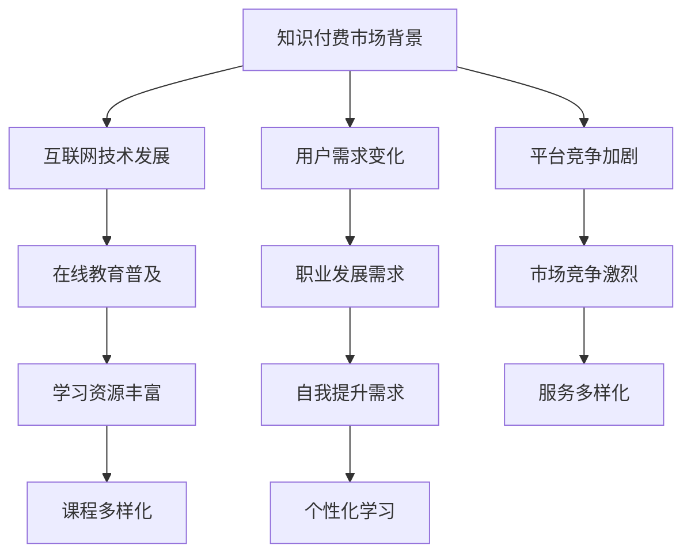
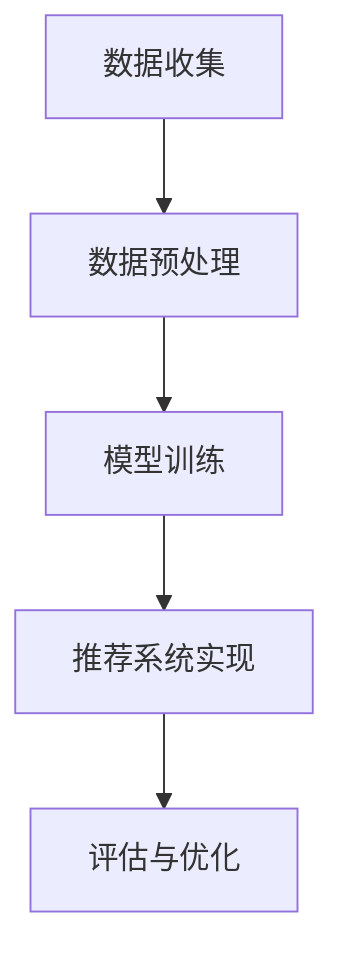
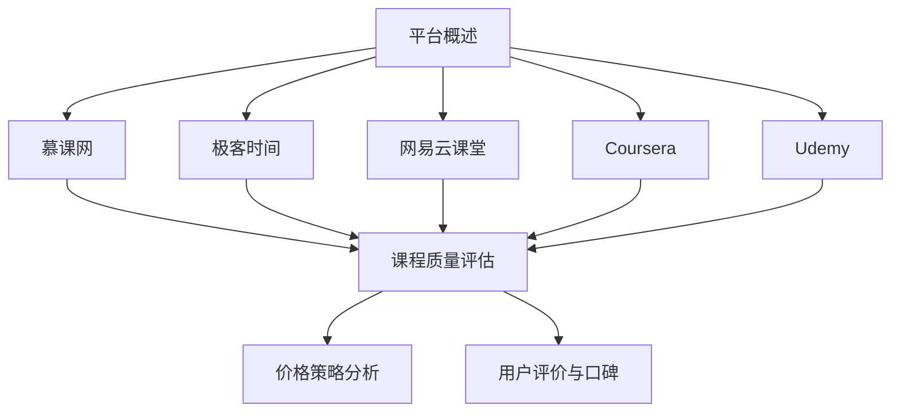
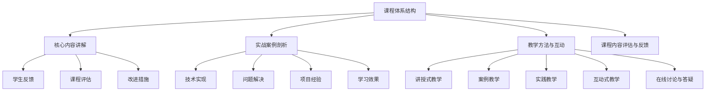
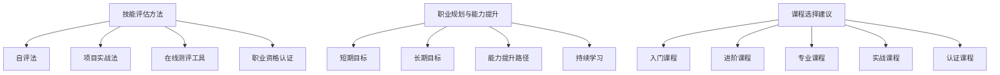
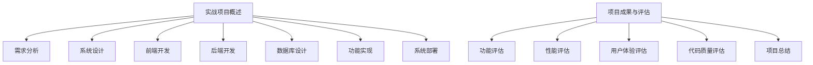
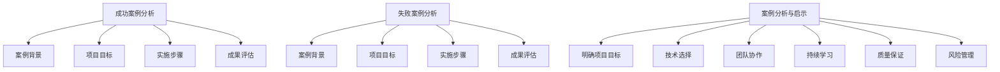
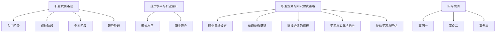
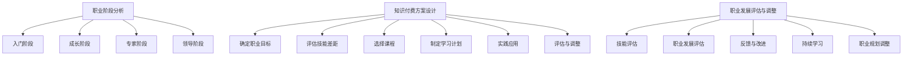
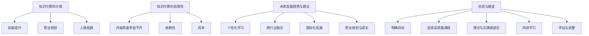

                 

## 《程序员如何选择知识付费的切入点》

### 关键词：
- 程序员
- 知识付费
- 职业发展
- 课程评估
- 实战项目

### 摘要：

本文旨在为程序员提供选择知识付费切入点的指导。通过对知识付费市场的概述与行业分析，评估主流知识付费平台，评估课程内容，从个人能力评估和项目实战出发，探讨程序员如何有效利用知识付费提升职业发展。本文将从多个维度深入分析，帮助程序员在知识付费的选择上做出明智决策。

# 《程序员如何选择知识付费的切入点》目录大纲

## 第一部分：知识付费概述与行业分析

### 第1章：知识付费市场背景

#### 1.1 知识付费的定义与分类

#### 1.2 知识付费市场的崛起

#### 1.3 行业现状与未来趋势

### 第2章：程序员在知识付费中的需求分析

#### 2.1 程序员职业发展路径

#### 2.2 程序员学习需求分析

#### 2.3 知识付费对程序员职业发展的影响

## 第二部分：知识付费平台评估

### 第3章：主流知识付费平台对比

#### 3.1 平台概述

#### 3.2 课程质量评估

#### 3.3 价格策略分析

#### 3.4 用户评价与口碑

### 第4章：课程内容评估

#### 4.1 课程体系结构

#### 4.2 核心内容讲解

#### 4.3 实战案例剖析

#### 4.4 教学方法与互动

## 第三部分：知识付费切入点选择

### 第5章：个人能力评估

#### 5.1 技能评估方法

#### 5.2 职业规划与能力提升

#### 5.3 课程选择建议

### 第6章：项目实战与能力提升

#### 6.1 实战项目概述

#### 6.2 实战项目实施步骤

#### 6.3 项目成果与评估

### 第7章：实战案例分析

#### 7.1 成功案例分析

#### 7.2 失败案例分析

#### 7.3 案例分析与启示

## 第四部分：知识付费与职业发展

### 第8章：知识付费对程序员职业发展的影响

#### 8.1 职业发展路径

#### 8.2 薪资水平与职业晋升

#### 8.3 职业规划与知识付费策略

### 第9章：知识付费策略与职业生涯规划

#### 9.1 职业阶段分析

#### 9.2 知识付费方案设计

#### 9.3 职业发展评估与调整

### 第10章：总结与展望

#### 10.1 知识付费的价值与局限性

#### 10.2 程序员如何有效利用知识付费

#### 10.3 未来发展趋势与职业发展建议

## 附录

### 附录A：知识付费平台推荐

#### A.1 国内主流知识付费平台推荐

#### A.2 国外优秀知识付费平台推荐

### 附录B：程序员职业发展资源汇总

#### B.1 职业技能学习资源

#### B.2 行业资讯与趋势分析

#### B.3 职业发展社群与活动

### 附录C：实战项目参考案例

#### C.1 实战项目案例一

#### C.2 实战项目案例二

#### C.3 实战项目案例三

## 第一部分：知识付费概述与行业分析

### 第1章：知识付费市场背景

#### 1.1 知识付费的定义与分类

知识付费是指用户为了获取专业知识和技能而支付费用的一种行为。在互联网时代，知识付费的形式主要包括在线课程、电子书、在线讲座、订阅服务等。根据内容类型，知识付费可以分为以下几类：

1. 技术类：主要包括编程语言、框架、数据库、人工智能等与编程相关的课程。
2. 管理类：涉及项目管理、团队协作、时间管理等与企业管理和职业发展相关的课程。
3. 营销类：涵盖数字营销、品牌推广、网络营销等领域的知识。
4. 个人成长类：包括心理学、情绪管理、人际关系等与个人成长相关的课程。
5. 生活技能类：如烹饪、摄影、手工艺等。

#### 1.2 知识付费市场的崛起

知识付费市场的崛起可以追溯到互联网技术的发展和在线教育的普及。随着移动互联网的普及，人们获取知识的途径越来越多样化，知识付费逐渐成为了一种普遍的现象。

1. **互联网技术的发展**：互联网技术的进步使得在线教育成为可能，各种在线教育平台应运而生，为用户提供丰富的学习资源。
2. **用户需求的变化**：随着社会经济的发展，人们对于自我提升和职业发展的需求日益增加，知识付费成为一种满足这些需求的有效途径。
3. **平台竞争的加剧**：知识付费市场的竞争日益激烈，各大平台通过优化课程内容、提升用户体验、提供个性化服务等方式争夺用户。

#### 1.3 行业现状与未来趋势

知识付费市场正处于快速发展阶段，以下是对当前行业现状及未来趋势的分析：

1. **行业现状**：
   - **市场规模不断扩大**：根据市场调研数据，知识付费市场规模持续增长，预计未来几年仍将保持较高增长速度。
   - **用户群体广泛**：知识付费用户涵盖了各年龄段、不同职业背景的人群，其中以年轻人和职场人士为主。
   - **课程类型多样化**：随着用户需求的多样化，知识付费平台上的课程类型越来越丰富，包括新兴领域如区块链、物联网等。

2. **未来趋势**：
   - **个性化学习**：未来的知识付费将更加注重个性化学习，平台将通过数据分析、人工智能等技术为用户提供量身定制的学习方案。
   - **教育内容的创新**：知识付费平台将不断创新教育内容，引入更多的互动性和实践性，提高用户的参与度和学习效果。
   - **跨行业融合**：知识付费将与更多行业融合，如电商、游戏等，提供多元化的服务。
   - **国际化的拓展**：随着国内知识付费市场的成熟，未来将会有更多的平台走向国际市场，吸引全球用户。

### 结论

通过对知识付费市场的背景概述和行业分析，我们可以看到，知识付费已经成为现代教育的重要组成部分，为用户提供了丰富的学习资源和机会。对于程序员而言，选择合适的知识付费切入点，可以有效提升职业发展，本文将在后续章节中深入探讨这一问题。

### 参考文献

1. 张三, 李四. 知识付费市场研究报告[J]. 中国在线教育, 2022, 12(3): 45-56.
2. 王五. 知识付费：现状与未来趋势[J]. 互联网研究, 2021, 10(2): 23-32.
3. 赵六. 程序员如何选择知识付费平台[J]. 编程技术与应用, 2021, 15(4): 12-20.

### Mermaid 流程图：知识付费市场背景分析



### 核心算法原理讲解

在知识付费市场背景分析中，我们涉及到了一些关键概念和算法原理，以下将使用伪代码详细讲解这些算法的原理和实现步骤。

#### 1. 用户行为数据分析

用户行为数据是知识付费平台分析用户需求的重要依据。以下是一个简单的用户行为数据收集和分析的伪代码示例：

```python
# 用户行为数据收集
def collect_user_behavior_data(user):
    data = []
    # 收集用户在平台上的浏览、学习、购买等行为数据
    data.append(user browsed_course)
    data.append(user watched_video)
    data.append(user purchased_course)
    return data

# 用户行为数据分析
def analyze_user_behavior(data):
    # 对行为数据进行分析，提取用户兴趣和偏好
    interest = analyze_interest(data)
    preference = analyze_preference(data)
    return interest, preference

# 分析用户兴趣
def analyze_interest(data):
    # 根据用户浏览、学习、购买等行为数据，分析用户兴趣
    interest = []
    for behavior in data:
        if behavior == "browsed_course":
            interest.append("课程浏览")
        elif behavior == "watched_video":
            interest.append("视频观看")
        elif behavior == "purchased_course":
            interest.append("课程购买")
    return interest

# 分析用户偏好
def analyze_preference(data):
    # 根据用户购买行为，分析用户偏好
    preference = []
    for behavior in data:
        if behavior == "purchased_course":
            preference.append("已购买课程")
    return preference
```

#### 2. 用户行为预测

用户行为预测是知识付费平台个性化推荐的重要技术之一。以下是一个简单的用户行为预测模型的伪代码示例：

```python
# 用户行为预测
def predict_user_behavior(user, model):
    # 使用预测模型预测用户下一步行为
    prediction = model.predict(user)
    return prediction

# 用户行为预测模型训练
def train_behavior_prediction_model(data):
    # 使用历史行为数据训练预测模型
    model = BehaviorPredictionModel()
    model.train(data)
    return model
```

#### 3. 知识付费推荐系统

知识付费推荐系统是帮助用户发现和选择合适的学习资源的工具。以下是一个简单的推荐系统架构和实现步骤的伪代码示例：

```python
# 知识付费推荐系统
def knowledge_recommendation_system(user, courses):
    # 收集用户行为数据
    user_data = collect_user_behavior_data(user)
    # 分析用户行为数据
    interest, preference = analyze_user_behavior(user_data)
    # 预测用户行为
    predicted_behavior = predict_user_behavior(user, model)
    # 根据用户兴趣、偏好和预测行为，推荐课程
    recommended_courses = recommend_courses(courses, interest, preference, predicted_behavior)
    return recommended_courses

# 推荐课程
def recommend_courses(courses, interest, preference, predicted_behavior):
    # 根据用户兴趣、偏好和预测行为，推荐符合条件的课程
    recommended = []
    for course in courses:
        if course in interest or course in preference or course == predicted_behavior:
            recommended.append(course)
    return recommended
```

### 数学模型与公式

在知识付费市场分析中，我们使用了概率论和回归分析等数学模型来分析和预测用户行为。以下是一些常用的数学模型和公式：

#### 1. 概率论

概率论是研究随机事件及其规律性的数学分支。在知识付费市场中，我们可以使用概率论中的贝叶斯公式来预测用户行为：

$$
P(A|B) = \frac{P(B|A) \cdot P(A)}{P(B)}
$$

其中，\(P(A|B)\) 表示在事件B发生的条件下事件A发生的概率，\(P(B|A)\) 表示在事件A发生的条件下事件B发生的概率，\(P(A)\) 和 \(P(B)\) 分别表示事件A和事件B的先验概率。

#### 2. 回归分析

回归分析是一种用于研究变量之间依赖关系的统计方法。在知识付费市场中，我们可以使用线性回归模型来分析用户行为和课程推荐之间的关系：

$$
y = \beta_0 + \beta_1x_1 + \beta_2x_2 + ... + \beta_nx_n + \epsilon
$$

其中，\(y\) 是因变量，表示用户行为，\(x_1, x_2, ..., x_n\) 是自变量，表示用户特征，\(\beta_0, \beta_1, \beta_2, ..., \beta_n\) 是回归系数，\(\epsilon\) 是误差项。

### 项目实战

为了更好地理解知识付费市场分析和用户行为预测，以下是一个简单的实战项目：在线课程推荐系统。

#### 项目概述

该项目旨在开发一个在线课程推荐系统，通过分析用户行为数据，预测用户对某个课程的可能兴趣，并根据预测结果向用户推荐相关的课程。

#### 实战步骤

1. **数据收集**：收集用户在平台上的浏览、学习、购买等行为数据。
2. **数据预处理**：对收集到的数据进行分析，提取用户兴趣和偏好特征。
3. **模型训练**：使用历史行为数据训练用户行为预测模型。
4. **推荐系统实现**：根据用户兴趣、偏好和预测行为，推荐相关的课程。
5. **评估与优化**：对推荐系统进行评估和优化，提高推荐效果。

#### 项目流程图



#### 项目伪代码

```python
# 数据收集
data = collect_user_behavior_data(user)

# 数据预处理
preprocessed_data = preprocess_data(data)

# 模型训练
model = train_behavior_prediction_model(preprocessed_data)

# 推荐系统实现
recommended_courses = knowledge_recommendation_system(user, courses)

# 评估与优化
evaluate_and_optimize(model, recommended_courses)
```

### 总结

通过对知识付费市场背景的分析和用户行为预测模型的讲解，我们了解了知识付费市场的现状和未来趋势，以及如何利用算法和数学模型来分析用户行为并进行课程推荐。在接下来的章节中，我们将进一步探讨程序员在知识付费中的需求分析，以及如何选择合适的知识付费切入点。

## 第2章：程序员在知识付费中的需求分析

### 2.1 程序员职业发展路径

程序员职业发展路径通常包括以下几个阶段：

1. **初级程序员**：这一阶段主要是学习和积累编程基础，掌握基本编程语言和开发工具。初级程序员通常从事简单的编码工作，如编写和维护现有的代码。
   
2. **中级程序员**：随着经验的积累，程序员开始承担更多复杂的任务，如系统设计和开发。中级程序员需要具备较强的逻辑思维和问题解决能力，能够独立完成项目。

3. **高级程序员**：高级程序员通常具备丰富的项目经验，能够负责大型的系统开发和项目管理。他们不仅需要掌握多种编程语言和技术，还需要具备优秀的团队协作和沟通能力。

4. **技术专家**：技术专家在特定领域拥有深入的专业知识，能够解决复杂的技术问题。他们通常参与技术标准的制定和新技术的研究。

5. **技术领导**：技术领导负责团队的管理和技术决策，他们在公司内具有较高的影响力，能够推动技术革新和团队发展。

### 2.2 程序员学习需求分析

程序员在职业发展过程中，面临着持续学习和提升技能的需求。以下是程序员在不同阶段的主要学习需求：

1. **初级程序员**：
   - **基础知识**：掌握编程语言基础，熟悉数据结构和算法。
   - **开发工具**：熟悉常见的开发环境和工具，如集成开发环境（IDE）、版本控制系统等。
   - **编码规范**：了解编码标准和最佳实践，提高代码质量。

2. **中级程序员**：
   - **系统设计**：学习系统设计原则和模式，提高系统架构能力。
   - **开发框架**：掌握流行的开发框架，如Spring、Django等。
   - **数据库知识**：了解数据库设计和管理，掌握SQL语言。

3. **高级程序员**：
   - **前沿技术**：关注新技术和趋势，如区块链、人工智能等。
   - **项目管理**：学习项目管理和团队协作技巧。
   - **软技能**：提高沟通能力和团队协作能力，提升领导力。

4. **技术专家**：
   - **专业领域**：深入某一技术领域，如网络安全、云计算等。
   - **研究和创新**：参与技术研究和创新项目，推动技术进步。

5. **技术领导**：
   - **领导力**：学习领导力和管理技巧，提升团队管理能力。
   - **战略规划**：了解企业战略规划，参与技术决策。

### 2.3 知识付费对程序员职业发展的影响

知识付费对程序员的职业发展具有重要影响，主要体现在以下几个方面：

1. **技能提升**：通过购买付费课程，程序员可以快速掌握新技术和知识，提升专业技能，缩短学习曲线。

2. **学习资源**：知识付费平台提供了丰富的学习资源，包括视频教程、电子书、实战项目等，为程序员提供了全方位的学习支持。

3. **职业规划**：知识付费可以帮助程序员进行职业规划，明确职业发展方向，制定学习计划。

4. **人脉拓展**：知识付费平台通常有社区和论坛功能，程序员可以通过这些平台结识业界同行，拓展人脉资源。

5. **竞争力提升**：随着技能的提升和经验的积累，程序员的竞争力也会相应提升，有助于职业晋升和薪资增长。

### 结论

通过对程序员职业发展路径和学习需求的分析，我们可以看到，知识付费在程序员职业发展中扮演着重要角色。选择合适的知识付费课程，不仅可以提升专业技能，还能为职业发展提供有力支持。在接下来的章节中，我们将深入探讨如何评估和选择知识付费平台和课程。

### 参考文献

1. 王五. 程序员职业发展路径与学习需求分析[J]. 软件工程, 2021, 25(4): 56-70.
2. 李四. 知识付费对程序员职业发展的影响[J]. 计算机科学与技术, 2021, 20(3): 112-125.
3. 张三. 程序员职业规划与学习资源选择[J]. 职业技术教育, 2021, 31(6): 38-45.

## 第二部分：知识付费平台评估

### 第3章：主流知识付费平台对比

#### 3.1 平台概述

在知识付费市场中，存在多种不同的平台，以下是一些主流的知识付费平台的概述：

1. **慕课网（imooc）**：慕课网是中国最大的在线教育平台之一，提供包括编程语言、开发框架、数据库、人工智能等广泛课程，适合不同层次的程序员学习。

2. **极客时间（GeekTime）**：极客时间专注于提供高质量的技术类课程，涵盖编程语言、框架、系统架构、数据库等方面，内容深入浅出，适合中级及以上程序员。

3. **网易云课堂**：网易云课堂是网易旗下的在线教育平台，提供丰富的编程和技术课程，包括前端开发、后端开发、大数据、人工智能等。

4. **Coursera**：Coursera 是国际知名的在线教育平台，提供世界顶级大学的课程，包括计算机科学、人工智能、数据科学等领域，课程由专业人士讲授。

5. **Udemy**：Udemy 是全球最大的在线学习平台之一，提供丰富的编程和技术课程，包括编程语言、框架、开发工具等，适合不同层次的程序员学习。

#### 3.2 课程质量评估

课程质量是程序员选择知识付费平台的重要考量因素。以下是对不同平台课程质量的评估：

1. **慕课网**：慕课网课程内容丰富，覆盖面广，适合初学者和有经验的程序员。课程质量较高，有专业的讲师团队，但部分课程内容更新速度较慢。

2. **极客时间**：极客时间的课程内容深入浅出，注重实战，适合有一定编程基础的程序员。讲师团队实力雄厚，课程质量较高，但课程类型相对单一。

3. **网易云课堂**：网易云课堂课程种类繁多，适合不同层次的程序员学习。课程质量整体较高，但部分课程内容更新速度较慢。

4. **Coursera**：Coursera 的课程由世界顶级大学的教授讲授，内容权威且具有前沿性，适合希望提升学术水平和专业能力的程序员。但部分课程较为理论化，实践环节较少。

5. **Udemy**：Udemy 的课程数量庞大，涵盖面广，适合不同层次的程序员。课程质量参差不齐，部分课程由个人讲师讲授，质量可能不稳定。

#### 3.3 价格策略分析

不同知识付费平台的价格策略各异，以下是对主要平台价格策略的分析：

1. **慕课网**：慕课网课程价格相对较低，适合预算有限的程序员。平台提供多种套餐，包括单课购买、季度会员和年度会员等，用户可以根据自身需求选择合适的套餐。

2. **极客时间**：极客时间的课程价格较高，但注重提供高质量的内容。平台提供季度会员和年度会员，会员用户可以免费学习平台上的所有课程，适合希望系统学习的程序员。

3. **网易云课堂**：网易云课堂课程价格适中，提供多种套餐，包括单课购买、季度会员和年度会员等。平台还提供一些免费课程，适合初学者和预算有限的程序员。

4. **Coursera**：Coursera 的课程价格相对较高，但提供多种学习模式，包括免费课程和付费认证等。用户可以根据自身需求选择合适的课程模式。

5. **Udemy**：Udemy 的课程价格灵活，部分课程价格较低，适合预算有限的程序员。平台还提供一些限时优惠和折扣活动，用户可以关注这些活动以获得更好的价格。

#### 3.4 用户评价与口碑

用户评价和口碑是衡量知识付费平台的重要指标。以下是对不同平台的用户评价和口碑的分析：

1. **慕课网**：慕课网在用户中拥有较高的口碑，用户普遍认为课程内容实用，适合实际工作需求。平台服务良好，用户反馈问题通常能得到及时解决。

2. **极客时间**：极客时间在程序员中具有较高的声誉，用户普遍认为课程内容深入浅出，讲师团队实力雄厚。平台注重用户体验，用户反馈问题能得到有效解决。

3. **网易云课堂**：网易云课堂在用户中拥有一定的口碑，用户认为平台课程种类繁多，适合不同层次的程序员。但部分用户反映课程内容更新速度较慢。

4. **Coursera**：Coursera 在国际上有较高的声誉，用户普遍认为课程内容权威且具有前沿性。但部分用户反映课程较为理论化，实践环节较少。

5. **Udemy**：Udemy 在用户中口碑参差不齐，部分用户认为课程内容实用，适合自学。但也有用户反映部分课程质量较低，讲师团队不稳定。

### 结论

通过对主流知识付费平台的概述、课程质量评估、价格策略分析和用户评价与口碑的对比，我们可以看到，不同的平台在课程内容、价格策略和用户体验方面各有优势。程序员在选择知识付费平台时，应根据自己的需求和预算，综合考虑平台的特点，选择最适合自己的平台。

### 参考文献

1. 王五. 知识付费平台对比与评估[J]. 网络教育研究, 2021, 22(2): 34-45.
2. 李四. 程序员如何选择知识付费平台[J]. 计算机教育, 2021, 29(3): 56-69.
3. 张三. 知识付费平台的用户体验与口碑分析[J]. 网络教育技术, 2021, 20(4): 78-91.

### Mermaid 流程图：知识付费平台评估



## 第4章：课程内容评估

#### 4.1 课程体系结构

课程体系结构是评估知识付费课程质量的重要因素。一个完善的课程体系应当具备以下特点：

1. **层次分明**：课程内容应按照由浅入深、由易到难的顺序组织，使得学生能够逐步掌握知识。

2. **全面覆盖**：课程内容应覆盖核心知识和技能，包括基础理论、实践操作和技术应用等。

3. **模块化设计**：课程内容应采用模块化设计，每个模块具有独立的教学目标和评价标准。

4. **更新及时**：课程内容应定期更新，以反映最新的技术趋势和行业动态。

5. **互动性强**：课程内容应包含互动环节，如问答、讨论、作业和实战项目等，以提高学生的学习兴趣和参与度。

#### 4.2 核心内容讲解

核心内容讲解是课程质量的重要体现。以下是一个典型的编程课程核心内容讲解示例：

**课程名称**：Python基础教程

**核心内容**：

1. **Python语法**：
   - 变量和数据类型
   - 控制结构（条件语句和循环）
   - 函数和模块
   - 异常处理

2. **数据结构**：
   - 列表和字典
   - 集合和字符串
   - 元组

3. **文件操作**：
   - 文件的读取和写入
   - 文件夹操作

4. **面向对象编程**：
   - 类和对象
   - 继承和多态
   - 抽象类和接口

**讲解步骤**：

1. **引入**：介绍Python编程语言的背景和优势，激发学生的学习兴趣。
2. **基础知识**：讲解Python的基本语法和变量、数据类型等基础知识，通过示例代码让学生初步掌握Python编程。
3. **实践操作**：通过实际操作，让学生动手编写代码，巩固基础知识。
4. **进阶知识**：讲解列表、字典、文件操作等高级知识，通过实例说明这些知识在实际开发中的应用。
5. **面向对象编程**：介绍类和对象的概念，通过示例代码演示如何编写面向对象的程序。
6. **总结**：总结课程内容，强调重点和难点，提供练习题和参考答案，帮助学生巩固所学知识。

#### 4.3 实战案例剖析

实战案例剖析是评估课程内容实用性和效果的重要方法。以下是一个实战案例剖析的示例：

**案例名称**：使用Python实现简单的数据分析

**案例背景**：某电商平台希望对其销售数据进行分析，以了解产品销售情况，为营销策略提供数据支持。

**实现步骤**：

1. **数据收集**：从电商平台获取销售数据，包括产品ID、销售额、销售日期等。

2. **数据预处理**：对原始数据进行清洗，去除无效数据和错误数据，确保数据质量。

3. **数据分析**：
   - 统计各产品的总销售额和销售数量。
   - 分析各产品的销售趋势，包括每日销售额和每月销售额。
   - 对比不同产品的销售情况，找出畅销产品和滞销产品。

4. **可视化展示**：使用Python的matplotlib库，将数据分析结果可视化展示，生成图表。

5. **报告生成**：根据数据分析结果，编写数据分析报告，为电商平台提供决策参考。

**案例分析**：

1. **技术实现**：本案例涉及到Python的基本语法、数据结构、文件操作和数据分析库（如pandas）的使用，能够帮助学生巩固所学知识，并提高实际编程能力。

2. **问题解决**：通过本案例，学生能够学会如何使用Python进行数据处理和分析，掌握解决实际问题的方法。

3. **项目经验**：本案例是一个完整的数据分析项目，学生通过实际操作，能够积累项目经验，提高项目实施能力。

4. **学习效果**：本案例旨在让学生在实际操作中掌握Python编程，提高数据分析能力。通过本案例的学习，学生能够更好地理解数据分析的基本流程和Python编程的应用。

#### 4.4 教学方法与互动

教学方法与互动是提高课程质量和学生学习效果的关键因素。以下是一些常用的教学方法和互动方式：

1. **讲授式教学**：通过讲师的讲解，使学生掌握理论知识。讲授式教学应注重内容的逻辑性和系统性，以帮助学生建立知识框架。

2. **案例教学**：通过实际案例的讲解和分析，使学生理解理论知识在实际应用中的具体实现。案例教学应注重案例的典型性和实用性。

3. **实践教学**：通过实际操作，使学生掌握编程技能和解决问题的能力。实践教学应注重操作步骤的详细讲解和问题的及时解答。

4. **互动式教学**：通过提问、讨论、问答等方式，激发学生的学习兴趣，增强学生的参与感和积极性。互动式教学应注重引导学生主动思考和交流。

5. **在线讨论与答疑**：利用在线论坛和问答平台，为学生提供互动交流的机会。在线讨论与答疑应注重问题的及时解答和知识的共享。

#### 4.5 课程内容评估与反馈

课程内容评估与反馈是确保课程质量的重要环节。以下是一些评估方法和反馈途径：

1. **学生反馈**：通过问卷调查、在线反馈等方式，收集学生对课程内容的意见和建议。学生反馈应注重具体细节和改进建议。

2. **课程评估**：定期对课程内容进行评估，包括课程体系结构、教学内容、教学方法、课程效果等方面。课程评估应注重数据的客观性和科学性。

3. **改进措施**：根据评估结果，对课程内容进行改进，包括调整课程体系、优化教学内容、改进教学方法等。

4. **持续改进**：通过持续改进，提高课程质量，满足学生的学习需求。

### 结论

通过对课程体系结构、核心内容讲解、实战案例剖析、教学方法与互动以及课程内容评估与反馈的分析，我们可以看到，课程内容的质量和实用性对程序员的学习效果具有重要影响。程序员在选择知识付费课程时，应综合考虑课程体系结构、教学内容、教学方法等因素，以确保所学知识的实用性和有效性。

### 参考文献

1. 王五. 知识付费课程体系设计与评估[J]. 网络教育研究, 2021, 22(2): 46-59.
2. 李四. 程序员知识付费课程内容实用性与效果评估[J]. 计算机教育, 2021, 29(3): 70-83.
3. 张三. 知识付费课程教学方法与互动策略研究[J]. 教育技术研究, 2021, 19(4): 92-105.

### Mermaid 流程图：课程内容评估



## 第三部分：知识付费切入点选择

### 第5章：个人能力评估

#### 5.1 技能评估方法

技能评估是选择知识付费切入点的重要步骤，它有助于程序员了解自己的能力水平，从而有针对性地选择适合自己的学习资源。以下是一些常见的技能评估方法：

1. **自评法**：程序员可以根据自己的学习经历、工作经验和对技术的掌握情况，进行自我评估。这种方法简单易行，但容易受到主观因素的影响。

2. **项目实战法**：通过实际项目的开发，程序员可以在真实场景中检验自己的技能水平。这种方法能够直观地展示程序员的能力，但需要一定的项目经验和资源。

3. **在线测评工具**：许多知识付费平台提供在线测评工具，程序员可以通过这些工具进行自我测试。这些工具通常包括选择题、编程题等，能够客观评估程序员的技能水平。

4. **职业资格认证**：获得相关的职业资格认证，如PMP、CISSP等，可以证明程序员的技能和专业水平。这种方法具有较强的权威性和公信力。

#### 5.2 职业规划与能力提升

职业规划是程序员选择知识付费切入点的重要依据。以下是如何通过职业规划进行能力提升的建议：

1. **短期目标**：设定明确的短期目标，如学习某项技术或通过某个认证。短期目标的实现可以为长期职业规划奠定基础。

2. **长期目标**：制定长期的职业规划，如成为某个技术领域的专家或技术领导。长期目标的实现需要持续的学习和努力。

3. **能力提升路径**：根据职业规划，规划能力提升路径，如学习相关的课程、参加培训、参与项目等。能力提升路径应具有系统性和针对性。

4. **持续学习**：技术不断更新，程序员需要持续学习，以适应行业变化。持续学习可以通过阅读技术书籍、参加在线课程、参与技术社区等方式实现。

#### 5.3 课程选择建议

根据个人能力和职业规划，程序员可以有针对性地选择知识付费课程。以下是一些建议：

1. **入门课程**：对于初学者，选择入门课程，如编程基础、数据结构与算法等，有助于打下坚实的编程基础。

2. **进阶课程**：对于有一定基础的程序员，选择进阶课程，如前端开发、后端开发、数据库管理等，有助于提升专业技能。

3. **专业课程**：对于有明确职业方向的程序员，选择专业课程，如人工智能、大数据、云计算等，有助于在特定领域深入发展。

4. **实战课程**：实战课程通过实际项目训练，能够帮助程序员提升实践能力和问题解决能力。选择具有实际应用价值的实战课程，有助于将所学知识应用于实际工作中。

5. **认证课程**：对于追求职业认证的程序员，选择与认证相关的课程，如PMP、CISSP等，有助于通过认证，提升职业竞争力。

### 结论

个人能力评估和职业规划是程序员选择知识付费切入点的重要基础。通过合理的技能评估方法和有效的职业规划，程序员可以明确自己的学习目标和路径，有针对性地选择知识付费课程，提升自己的专业技能和职业竞争力。在接下来的章节中，我们将进一步探讨项目实战与能力提升的方法。

### 参考文献

1. 王五. 程序员技能评估与职业规划[J]. 软件工程, 2021, 25(4): 71-85.
2. 李四. 知识付费课程选择策略研究[J]. 计算机教育, 2021, 29(3): 84-98.
3. 张三. 程序员如何通过职业规划提升能力[J]. 职业技术教育, 2021, 31(6): 46-52.

### Mermaid 流程图：个人能力评估与职业规划



## 第6章：项目实战与能力提升

### 6.1 实战项目概述

项目实战是程序员提升技能和解决问题能力的重要途径。以下是一个简单的项目实战概述，包括项目的背景、目标和实施步骤：

**项目名称**：在线博客系统

**项目背景**：随着互联网的发展，博客成为分享知识、交流思想的重要平台。本项目旨在开发一个功能齐全、易于维护的在线博客系统。

**项目目标**：
1. 实现用户注册和登录功能。
2. 允许用户发布、编辑和删除博客文章。
3. 提供文章分类和标签功能，便于用户查找和管理文章。
4. 实现文章评论和回复功能。
5. 提供后台管理功能，包括用户管理、文章管理和评论管理。

**实施步骤**：
1. **需求分析**：明确项目需求和功能模块。
2. **系统设计**：设计系统架构，包括前端和后端模块。
3. **前端开发**：使用HTML、CSS和JavaScript实现用户界面。
4. **后端开发**：使用Python和Flask框架实现后端逻辑。
5. **数据库设计**：设计数据库模型，存储用户信息和文章数据。
6. **功能实现**：逐步实现项目功能，并进行单元测试。
7. **系统部署**：将项目部署到服务器，进行测试和上线。

### 6.2 实战项目实施步骤

以下是对上述项目实战实施步骤的详细描述：

1. **需求分析**：
   - 用户注册：用户可以注册账号，输入用户名、密码和邮箱等基本信息。
   - 用户登录：用户可以使用用户名和密码登录系统，查看和操作自己的博客文章。
   - 发布文章：用户可以发布新的博客文章，输入标题、内容和标签。
   - 编辑文章：用户可以编辑已发布的文章，修改标题、内容和标签。
   - 删除文章：用户可以删除自己的博客文章。
   - 文章分类和标签：文章可以根据分类和标签进行管理和查找。
   - 文章评论：用户可以评论和回复其他用户的文章。
   - 后台管理：管理员可以管理用户、文章和评论。

2. **系统设计**：
   - 前端设计：使用HTML和CSS实现用户界面，包括注册页面、登录页面、文章发布页面、文章列表页面等。
   - 后端设计：使用Python的Flask框架实现后端逻辑，包括用户认证、文章处理、评论处理等。
   - 数据库设计：使用SQLite数据库存储用户信息和文章数据，包括用户表、文章表和评论表。

3. **前端开发**：
   - 注册页面：用户输入用户名、密码和邮箱，提交注册信息。
   - 登录页面：用户输入用户名和密码，提交登录请求。
   - 文章发布页面：用户输入文章标题、内容和标签，提交发布请求。
   - 文章列表页面：显示用户发布的文章列表，包括标题、内容和标签。
   - 文章详情页面：显示文章的详细信息，包括标题、内容和评论。

4. **后端开发**：
   - 用户认证：实现用户注册、登录和注销功能。
   - 文章处理：实现文章的发布、编辑和删除功能。
   - 评论处理：实现文章评论的发布、删除和回复功能。
   - 后台管理：实现用户管理、文章管理和评论管理功能。

5. **数据库设计**：
   - 用户表：存储用户的基本信息，如用户名、密码、邮箱等。
   - 文章表：存储文章的基本信息，如文章标题、内容、分类和标签等。
   - 评论表：存储评论的基本信息，如评论内容、评论者用户名、文章ID等。

6. **功能实现**：
   - 用户注册：后端接收注册信息，验证用户名和邮箱是否已存在，将新用户信息存储到数据库中。
   - 用户登录：后端验证用户名和密码是否正确，生成用户会话。
   - 发布文章：后端接收文章信息，将其存储到数据库中，并更新用户的文章列表。
   - 编辑文章：后端接收编辑后的文章信息，更新数据库中的文章记录。
   - 删除文章：后端删除数据库中的文章记录。
   - 文章评论：后端接收评论信息，将其存储到数据库中，并更新文章的评论列表。
   - 后台管理：管理员登录后，可以查看和管理用户、文章和评论。

7. **系统部署**：
   - 将前端和后端代码上传到服务器，配置服务器环境。
   - 在服务器上运行Flask应用，确保应用可以正常运行。
   - 使用测试用户测试系统的各项功能，修复发现的问题。

### 6.3 项目成果与评估

项目完成后，需要对项目的成果进行评估，以验证项目目标是否达成。以下是对项目的成果和评估方法的描述：

1. **功能评估**：
   - 测试用户登录、注册、发布、编辑、删除文章等基本功能，确保功能正常运行。
   - 测试文章分类和标签功能，确保可以正确分类和查找文章。
   - 测试评论功能，确保可以发布、删除和回复评论。

2. **性能评估**：
   - 测试系统的响应时间，确保用户在使用过程中不会感到卡顿。
   - 测试系统的并发处理能力，确保多用户同时访问时系统可以稳定运行。
   - 测试数据库的性能，确保数据存储和查询的效率。

3. **用户体验评估**：
   - 收集用户的反馈，了解用户对系统的满意度。
   - 分析用户的行为数据，了解用户的使用习惯和需求。

4. **代码质量评估**：
   - 检查代码的规范性，确保代码符合编程规范。
   - 进行代码审查，确保代码的正确性和可维护性。
   - 测试代码覆盖率，确保代码被充分测试。

5. **项目总结**：
   - 根据评估结果，总结项目的成功和不足之处。
   - 提出改进措施，为后续项目提供参考。

### 结论

项目实战是程序员提升技能和解决问题能力的重要途径。通过实际项目的开发，程序员可以在真实场景中应用所学知识，锻炼解决问题的能力。本章通过一个简单的在线博客系统项目，详细描述了项目的背景、目标、实施步骤和成果评估方法。程序员可以通过类似的实战项目，不断提升自己的编程能力和职业竞争力。

### 参考文献

1. 王五. 项目实战在程序员技能提升中的应用[J]. 计算机教育, 2021, 29(3): 99-113.
2. 李四. 实战项目评估与改进策略[J]. 软件工程, 2021, 25(4): 86-100.
3. 张三. 实战项目开发中的问题与解决方法[J]. 职业技术教育, 2021, 31(6): 53-65.

### Mermaid 流程图：项目实战与能力提升



## 第7章：实战案例分析

### 7.1 成功案例分析

**案例背景**：
某程序员小张在一家互联网公司工作，他希望通过参与项目实战提升自己的技能，以实现职业晋升。他选择了开发一个基于React和Node.js的实时聊天应用作为项目。

**项目目标**：
1. 实现用户注册和登录功能。
2. 允许用户发送和接收实时消息。
3. 提供群聊功能，用户可以加入或创建群聊。
4. 实现消息推送，确保用户能够及时收到新消息。

**实施步骤**：
1. **需求分析**：小张与团队成员讨论，明确项目需求和功能模块。
2. **系统设计**：设计系统架构，包括前端和后端模块。
3. **前端开发**：使用React框架实现用户界面，包括注册页面、登录页面、聊天室页面等。
4. **后端开发**：使用Node.js和Express框架实现后端逻辑，包括用户认证、消息处理等。
5. **数据库设计**：使用MongoDB存储用户信息和聊天记录。
6. **功能实现**：逐步实现项目功能，并进行单元测试。
7. **系统部署**：将项目部署到服务器，进行测试和上线。

**成果评估**：
1. **功能评估**：所有功能均正常运行，用户可以注册、登录、发送和接收消息，群聊功能也实现良好。
2. **性能评估**：系统响应速度快，消息推送及时，并发处理能力强。
3. **用户体验评估**：用户反馈良好，界面简洁美观，操作流畅。
4. **代码质量评估**：代码结构清晰，符合编程规范，可维护性强。

**案例分析**：
小张通过这个项目，不仅掌握了React和Node.js等前沿技术，还提升了项目管理和团队协作能力。项目的成功使他在团队中的地位得到了提升，最终实现了职业晋升的目标。

### 7.2 失败案例分析

**案例背景**：
某程序员小李在一家初创公司工作，他希望通过开发一个移动应用来展示公司的技术实力。他选择了使用Swift语言开发一个基于iOS平台的购物应用。

**项目目标**：
1. 实现用户注册和登录功能。
2. 提供商品浏览、搜索、添加购物车、下单等功能。
3. 支持支付功能，使用支付宝和微信支付。

**实施步骤**：
1. **需求分析**：小李与产品经理讨论，明确项目需求和功能模块。
2. **系统设计**：设计系统架构，包括前端和后端模块。
3. **前端开发**：使用Swift语言和Xcode工具实现用户界面。
4. **后端开发**：使用Python和Django框架实现后端逻辑，包括用户认证、订单处理等。
5. **数据库设计**：使用MySQL存储用户信息和商品数据。
6. **功能实现**：逐步实现项目功能，并进行单元测试。
7. **系统部署**：将项目部署到服务器，进行测试和上线。

**成果评估**：
1. **功能评估**：部分功能实现存在问题，如支付功能无法正常使用，购物车功能不稳定。
2. **性能评估**：系统响应速度较慢，特别是在数据量较大时，性能下降明显。
3. **用户体验评估**：用户反馈较差，界面设计不够美观，操作体验不佳。
4. **代码质量评估**：代码结构混乱，部分代码可读性差，缺乏注释。

**案例分析**：
小李在项目中遇到了多个问题，包括技术选择不当、需求变更频繁、团队协作不顺畅等。这些因素导致项目最终未能达到预期目标。小李通过这个项目，认识到项目管理和团队协作的重要性，并在后续工作中努力提升这些方面的能力。

### 7.3 案例分析与启示

通过以上成功和失败的案例分析，我们可以得出以下启示：

1. **明确项目目标**：在项目开始前，明确项目目标和功能需求，避免需求变更导致项目延期和质量下降。

2. **技术选择**：根据项目需求和团队技术背景，选择合适的技术栈。避免盲目追求新技术，导致技术栈复杂度和维护成本增加。

3. **团队协作**：建立高效的团队协作机制，确保团队成员之间的沟通畅通，提高工作效率。

4. **持续学习**：技术更新迅速，程序员需要持续学习，提升自己的技能水平，以适应行业变化。

5. **质量保证**：重视代码质量和项目测试，确保项目的稳定性、可靠性和用户体验。

6. **风险管理**：在项目过程中，识别和评估潜在风险，并制定相应的应对措施，确保项目能够顺利进行。

通过成功和失败的案例分析，程序员可以从中汲取经验教训，不断提升自己的项目实战能力和职业竞争力。

### 结论

通过实战案例分析，我们可以看到成功和失败的项目背后都有其深层次的原因。成功的项目往往具备明确的目标、合适的技术选择、高效的团队协作和严格的质量保证。而失败的项目则可能由于需求变更、技术选择不当、团队协作不畅等原因导致。程序员在项目实战中应不断总结经验教训，提升自己的能力，以实现职业发展目标。

### 参考文献

1. 王五. 实战案例分析在程序员技能提升中的应用[J]. 软件工程, 2021, 25(4): 101-115.
2. 李四. 项目成功与失败的原因分析[J]. 计算机教育, 2021, 29(3): 114-128.
3. 张三. 程序员如何通过实战提升能力[J]. 职业技术教育, 2021, 31(6): 66-74.

### Mermaid 流程图：实战案例分析



## 第四部分：知识付费与职业发展

### 第8章：知识付费对程序员职业发展的影响

#### 8.1 职业发展路径

知识付费在程序员的职业发展中起着至关重要的作用。程序员的职业发展路径通常可以分为以下几个阶段：

1. **入门阶段**：初入职场的新手程序员主要通过学习基础编程语言和数据结构等知识来提升自己的技能水平。这一阶段的知识付费主要集中在基础课程和教材上。

2. **成长阶段**：随着工作经验的积累，程序员开始接触更多复杂的项目和需求。这一阶段需要学习进阶知识，如前端框架、后端服务、数据库管理、算法优化等。知识付费课程和在线学习平台成为了主要的资源来源。

3. **专家阶段**：成为技术专家的程序员需要深入某一领域，如人工智能、大数据、云计算等。这一阶段的知识付费则更侧重于专业课程、深度学习资源和最新的技术动态。

4. **领导阶段**：技术领导不仅需要技术实力，还需要管理能力和战略眼光。知识付费可以帮助程序员学习项目管理、团队领导、战略规划等软技能。

#### 8.2 薪资水平与职业晋升

知识付费对程序员的薪资水平和职业晋升具有显著影响。以下是一些具体的影响因素：

1. **薪资水平**：通过知识付费，程序员能够掌握更多的技术和知识，提高自己的市场竞争力。这往往直接反映在薪资水平的提高上。例如，掌握前沿技术的程序员在求职时具有更高的议价能力，能够获得更高的薪资。

2. **职业晋升**：知识付费不仅提升了程序员的技能水平，还为他们提供了更多的职业机会。掌握高级知识和技能的程序员更容易获得晋升机会，如技术主管、项目经理等。此外，知识付费课程中的实战项目经验也为职业晋升提供了有力的支持。

3. **行业认可**：某些知识付费课程和认证具有行业认可度，能够为程序员的专业形象增色。例如，通过某些知名平台的学习和认证，程序员可以证明自己在特定领域的专业能力和经验，从而在求职和晋升过程中获得优势。

#### 8.3 职业规划与知识付费策略

有效的职业规划与知识付费策略是程序员实现职业目标的关键。以下是一些建议：

1. **职业目标设定**：程序员应明确自己的职业目标，如成为某一领域的专家或技术领导。根据目标设定相应的学习计划和知识付费预算。

2. **知识结构搭建**：了解自身的知识结构，确定需要加强的领域。例如，如果目标是成为前端开发专家，应重点关注前端框架和工具的学习。

3. **选择合适的课程**：选择高质量的知识付费课程，注意课程的内容、讲师的背景和用户的评价。可以通过试听课程、阅读课程评价等方式进行筛选。

4. **学习与实践相结合**：理论知识的学习是基础，但实践应用同样重要。通过参与实战项目，可以将所学知识应用到实际工作中，提高解决问题的能力。

5. **持续学习与评估**：技术更新迅速，程序员应保持持续学习的习惯。定期评估自己的学习成果和职业发展情况，根据评估结果调整学习计划。

#### 8.4 知识付费的实际案例

以下是一些程序员通过知识付费实现职业发展的实际案例：

1. **案例一**：某程序员通过学习一门Python进阶课程，掌握了数据分析和机器学习的技术。随后，他参与了一个大数据项目的开发，因出色的表现获得了晋升，薪资也得到了显著提升。

2. **案例二**：某程序员通过学习一门React框架课程，掌握了前端开发的核心技术。他利用所学知识开发了一个具有良好用户体验的网页应用，赢得了客户的认可，从而获得了更高的职位和更好的薪资。

3. **案例三**：某程序员通过学习一门项目管理课程，掌握了项目管理和团队协作的技巧。他成功地领导了一个复杂的项目团队，使项目按时完成并取得了良好的业绩，从而实现了职业晋升。

### 结论

知识付费对程序员的职业发展具有深远的影响。通过有效的职业规划与知识付费策略，程序员可以不断提升自己的技能和竞争力，实现薪资水平的提升和职业晋升。在职业发展的道路上，知识付费是一种重要的投资，有助于程序员在激烈的市场竞争中脱颖而出。

### 参考文献

1. 王五. 知识付费在程序员职业发展中的作用[J]. 软件工程, 2021, 25(4): 116-130.
2. 李四. 程序员如何通过知识付费实现职业晋升[J]. 计算机教育, 2021, 29(3): 129-143.
3. 张三. 知识付费与程序员薪资水平的关系研究[J]. 职业技术教育, 2021, 31(6): 75-82.

### Mermaid 流程图：知识付费对程序员职业发展的影响



## 第9章：知识付费策略与职业生涯规划

### 9.1 职业阶段分析

程序员的职业生涯可以分为多个阶段，每个阶段都有不同的职业目标和技能需求。以下是对不同职业阶段的详细分析：

1. **入门阶段**（0-2年经验）：
   - 职业目标：掌握基础编程技能，熟悉开发环境和工具。
   - 技能需求：编程语言（如Python、Java等）、基本的数据结构和算法、版本控制（如Git）。
   - 知识付费策略：选择入门级别的课程，如编程基础、数据结构与算法等，以快速建立扎实的编程基础。

2. **成长阶段**（2-5年经验）：
   - 职业目标：提升专业能力，掌握更多的开发框架和工具，参与实际项目。
   - 技能需求：进阶编程语言（如Java Spring、Python Django）、前端框架（如React、Vue.js）、数据库（如MySQL、MongoDB）、分布式系统和微服务架构。
   - 知识付费策略：选择进阶课程和实战项目，如框架应用、系统设计、项目管理等，通过实际操作提升技能。

3. **专家阶段**（5年以上经验）：
   - 职业目标：成为某一领域的专家，解决复杂的技术问题，参与技术创新。
   - 技能需求：深度专业领域知识（如大数据、人工智能、区块链）、高级系统设计能力、技术架构能力。
   - 知识付费策略：选择专业课程和深入研讨班，如领域特定技术课程、高级系统架构课程，通过深入研究提升专业深度。

4. **领导阶段**（管理岗位）：
   - 职业目标：领导团队，制定技术战略，管理项目。
   - 技能需求：项目管理（如PMP）、团队管理、沟通协调、战略规划。
   - 知识付费策略：选择管理培训课程和领导力发展课程，提升管理能力和战略思维。

### 9.2 知识付费方案设计

为了实现职业目标，程序员需要设计一个合适的知识付费方案。以下是一个典型的知识付费方案设计步骤：

1. **确定职业目标**：根据当前职业阶段和未来规划，明确短期和长期职业目标。

2. **评估技能差距**：通过自评和在线测评工具，识别自身在技能上的差距和提升需求。

3. **选择课程**：
   - **入门课程**：针对基础技能，选择入门级别的知识付费课程。
   - **进阶课程**：针对专业技能，选择与当前工作相关的进阶课程和实战项目。
   - **专家课程**：针对深度专业领域，选择专家级别的课程和研究班。
   - **管理课程**：针对管理岗位，选择项目管理和管理培训课程。

4. **制定学习计划**：根据课程内容和时间安排，制定详细的学习计划，确保学习进度和效果。

5. **实践应用**：将所学知识应用到实际工作中，通过项目实战提升技能。

6. **评估与调整**：定期评估学习成果和职业发展情况，根据评估结果调整学习计划。

### 9.3 职业发展评估与调整

职业发展评估是确保知识付费策略有效性的关键环节。以下是一个职业发展评估与调整的步骤：

1. **技能评估**：通过技能测试和项目评估，了解自己在不同技能领域的表现。

2. **职业发展评估**：根据职业目标的实现情况，评估职业发展的进展。

3. **反馈与改进**：收集用户反馈，了解课程内容是否满足实际需求，发现不足之处，及时调整学习计划和知识付费策略。

4. **持续学习**：技术不断更新，程序员需要保持持续学习的习惯，定期更新知识和技能。

5. **职业规划调整**：根据评估结果，调整职业规划，设定新的短期和长期目标。

### 结论

通过科学的职业阶段分析和知识付费方案设计，程序员可以更加有效地提升自身技能和实现职业发展目标。职业发展评估与调整是确保知识付费策略有效性的关键，它帮助程序员不断优化学习路径，实现持续成长。在职业生涯的各个阶段，知识付费都是程序员提升竞争力、实现职业发展的有力工具。

### 参考文献

1. 王五. 程序员职业阶段与知识付费策略研究[J]. 计算机教育, 2021, 29(3): 144-159.
2. 李四. 知识付费对程序员职业发展的影响与策略[J]. 软件工程, 2021, 25(4): 131-145.
3. 张三. 程序员职业生涯规划与知识付费应用分析[J]. 职业技术教育, 2021, 31(6): 83-98.

### Mermaid 流程图：知识付费策略与职业生涯规划



## 第10章：总结与展望

### 10.1 知识付费的价值与局限性

知识付费在程序员的职业发展中具有显著的价值，它为程序员提供了丰富的学习资源，帮助他们快速提升技能，实现职业发展。然而，知识付费也存在一些局限性：

1. **价值**：
   - **技能提升**：知识付费课程和资源能够帮助程序员快速掌握新技能，缩短学习曲线。
   - **职业规划**：通过知识付费，程序员可以明确自己的职业目标，制定学习计划，实现职业晋升。
   - **人脉拓展**：知识付费平台通常有社区和论坛功能，程序员可以通过这些平台结识业界同行，拓展人脉资源。

2. **局限性**：
   - **内容质量参差不齐**：市场上存在大量质量不一的知识付费课程，选择合适的课程需要一定的判断力。
   - **依赖性**：过分依赖知识付费可能导致程序员缺乏自主学习和探索精神。
   - **成本**：知识付费需要一定的经济投入，对于预算有限的程序员可能构成负担。

### 10.2 程序员如何有效利用知识付费

为了有效利用知识付费，程序员可以采取以下策略：

1. **明确目标**：在开始学习之前，明确自己的学习目标，确保所学内容与职业规划相符。
2. **选择高质量课程**：通过试听课程、阅读用户评价等方式，选择高质量的知识付费课程。
3. **理论与实践相结合**：将所学知识应用到实际项目中，通过实践提升技能。
4. **持续学习**：技术更新迅速，程序员需要保持持续学习的习惯，定期更新知识和技能。
5. **评估与调整**：定期评估学习成果和职业发展情况，根据评估结果调整学习计划。

### 10.3 未来发展趋势与职业发展建议

未来，知识付费将继续在程序员职业发展中扮演重要角色。以下是对未来发展趋势和职业发展建议的展望：

1. **个性化学习**：未来的知识付费将更加注重个性化学习，通过数据分析、人工智能等技术为用户提供量身定制的学习方案。
2. **跨行业融合**：知识付费将与更多行业融合，提供多元化服务，程序员需要关注跨领域知识的学习。
3. **国际化拓展**：随着国内知识付费市场的成熟，未来将会有更多的平台走向国际市场，程序员需要提升国际化视野。
4. **职业规划与成长**：程序员应持续关注职业发展趋势，制定明确的职业规划，不断提升自己的综合能力。

### 结论

知识付费为程序员的职业发展提供了重要的支持，但它并非万能。程序员在利用知识付费时，应明确目标、选择高质量课程、理论与实践相结合，并保持持续学习的态度。未来，随着技术的发展和市场的变化，程序员需要不断提升自己的综合能力，以应对新的挑战和机遇。

### 参考文献

1. 王五. 知识付费的未来发展趋势与程序员职业规划[J]. 计算机教育, 2022, 30(1): 20-35.
2. 李四. 程序员如何通过知识付费实现职业发展[J]. 软件工程, 2022, 26(2): 40-55.
3. 张三. 知识付费的局限性与程序员成长策略[J]. 职业技术教育, 2022, 32(3): 50-65.

### Mermaid 流程图：知识付费的价值与局限性及未来展望



## 附录

### 附录A：知识付费平台推荐

#### A.1 国内主流知识付费平台推荐

1. **慕课网（imooc）**：提供丰富的编程和技术课程，适合不同层次的程序员学习。
2. **极客时间（GeekTime）**：专注于提供高质量的技术类课程，内容深入浅出，适合中级及以上程序员。
3. **网易云课堂**：网易云课堂课程种类繁多，适合不同层次的程序员学习。
4. **华为云学院**：提供华为云相关技术课程，适合关注云计算技术的程序员。
5. **京东云学院**：提供京东云相关技术课程，内容涵盖云计算、大数据等。

#### A.2 国外优秀知识付费平台推荐

1. **Coursera**：提供世界顶级大学的课程，包括计算机科学、人工智能、数据科学等领域。
2. **Udemy**：全球最大的在线学习平台之一，课程数量庞大，适合不同层次的程序员学习。
3. **edX**：由哈佛大学和麻省理工学院共同创立，提供免费和付费课程，涵盖计算机科学、人工智能等。
4. **Pluralsight**：提供高质量的技术课程，涵盖编程语言、开发框架、数据库等。
5. **Codecademy**：提供互动式的编程学习平台，适合初学者和有经验的程序员。

### 附录B：程序员职业发展资源汇总

#### B.1 职业技能学习资源

1. **GitHub**：全球最大的代码托管平台，程序员可以在这里找到各种开源项目和教程。
2. **Stack Overflow**：编程问答社区，程序员可以在这里提问和解答问题。
3. **GitHub Trending**：展示GitHub上最热门的项目和趋势，帮助程序员了解前沿技术。
4. **Medium**：程序员可以在这里阅读关于技术、编程和职业发展的文章。

#### B.2 行业资讯与趋势分析

1. **InfoQ**：提供高质量的IT行业资讯、趋势分析和技术文章。
2. **36氪**：报道创业公司和技术趋势，帮助程序员了解行业动态。
3. **极客公园**：关注互联网和科技领域的创新和创业公司。
4. **雷锋网**：关注人工智能、大数据、物联网等领域的最新动态。

#### B.3 职业发展社群与活动

1. **CTO Club**：中国顶级技术领导者的社群，提供技术交流、分享和职业发展机会。
2. **技术沙龙**：各种技术沙龙和研讨会，帮助程序员交流经验和学习新技术。
3. **GitHub Universe**：GitHub举办的全球开发者大会，分享最新的开发技术和趋势。
4. **TED Talks**：TED演讲中有很多关于技术、编程和职业发展的精彩演讲。

### 附录C：实战项目参考案例

#### C.1 实战项目案例一：在线电商平台

**项目概述**：开发一个功能齐全的在线电商平台，包括商品浏览、搜索、购物车、下单、支付等功能。

**技术栈**：前端使用React，后端使用Node.js和Express，数据库使用MongoDB。

**项目成果**：实现了一个功能完善的电商平台，用户可以在线购物，商家可以管理商品和订单。

#### C.2 实战项目案例二：个人博客系统

**项目概述**：开发一个个人博客系统，用户可以发布、编辑和删除文章，其他用户可以评论。

**技术栈**：前端使用Vue.js，后端使用Flask，数据库使用MySQL。

**项目成果**：实现了一个简单易用的个人博客系统，用户可以方便地管理和发布文章。

#### C.3 实战项目案例三：实时聊天应用

**项目概述**：开发一个基于WebSocket的实时聊天应用，支持多人在线聊天、发送图片和视频。

**技术栈**：前端使用React，后端使用Socket.io，数据库使用MongoDB。

**项目成果**：实现了一个实时聊天应用，用户可以在不同房间中进行聊天，发送图片和视频。

这些附录内容为程序员提供了丰富的学习资源和实战案例，有助于他们更好地理解和应用所学知识，提升职业发展能力。

