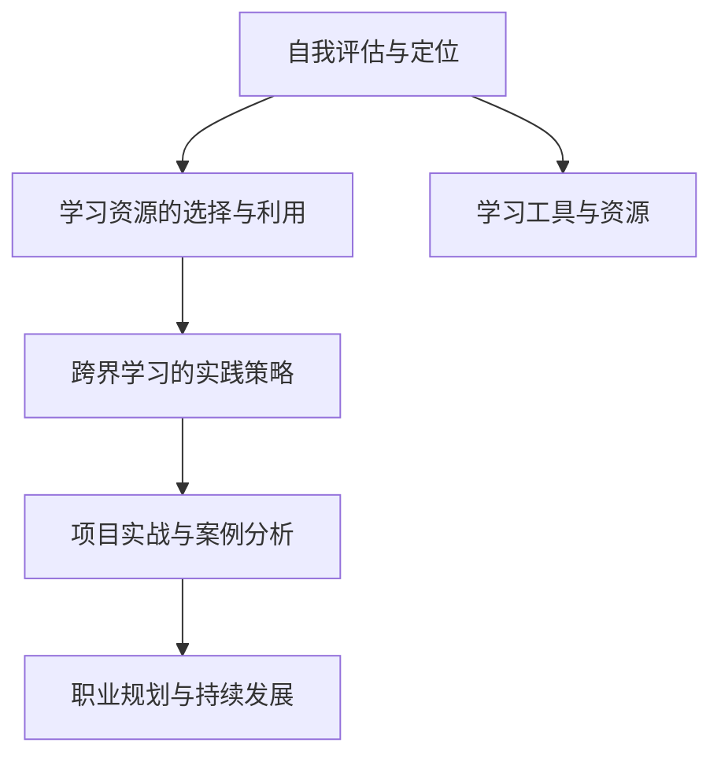

                 

# 程序员的跨界学习：拓宽职业发展

## 关键词
编程、跨界学习、职业发展、项目管理、数据科学、人工智能、团队协作

## 摘要
在快速发展的科技时代，程序员不仅需要掌握编程技能，还需要具备跨界学习的能力，以拓宽职业发展空间。本文将探讨程序员跨界学习的必要性、方法与策略，以及如何在项目管理、数据科学和人工智能等领域进行技能拓展。通过实际案例分析，本文旨在帮助程序员实现跨界学习，提升职业竞争力。

### 第一部分：跨界学习概述

#### 第1章：跨界学习的必要性

在当今的数字化时代，技术更新速度加快，程序员面临的职业挑战日益增多。单纯的编程技能已经无法满足职业发展的需求。跨界学习成为程序员拓宽职业发展的重要途径。本文将首先探讨程序员面临的发展困境，分析跨界学习的优势与挑战，并明确跨界学习的目标和路径。

### 1.1 程序员职业发展的困境

随着技术的不断发展，程序员的职业发展面临着以下几个困境：

1. 技能单一：程序员往往专注于编程技能，忽视其他领域的学习，导致职业发展受限。
2. 技术更新：新技术的不断涌现，旧技术逐渐被淘汰，程序员需要不断学习新的编程语言和框架。
3. 职业瓶颈：在技术岗位上，程序员可能面临职业发展的瓶颈，晋升空间有限。
4. 市场竞争：编程领域的竞争日益激烈，程序员需要不断提升自身竞争力。

### 1.2 跨界学习的优势与挑战

跨界学习对程序员职业发展具有以下优势：

1. 拓宽视野：跨界学习使程序员能够接触到不同领域的知识，拓宽视野。
2. 提升竞争力：跨界技能使程序员在职场中更具竞争力，增加职业机会。
3. 职业发展：跨界学习为程序员提供了更多的职业发展方向，有助于职位晋升。

然而，跨界学习也面临一些挑战：

1. 学习成本：跨界学习需要投入大量时间和精力，对个人时间和精力管理提出较高要求。
2. 技能重叠：跨界学习可能导致某些技能的重复，影响学习效果。
3. 跨界成功：跨界学习并非一蹴而就，程序员需要克服心理障碍和实际困难，才能取得成功。

### 1.3 跨界学习的目标与路径

跨界学习的目标是提升程序员的综合素质，拓宽职业发展空间。具体路径如下：

1. **自我评估与定位**：程序员需要明确自己的兴趣和优势，确定跨界学习的方向。
2. **学习资源的选择与利用**：程序员需要选择合适的学习资源，如课程、书籍、在线平台等。
3. **跨界学习的实践策略**：程序员需要制定切实可行的学习计划，并进行实践。
4. **项目实战与案例分析**：通过实际项目，程序员可以将所学知识应用于实际工作中。
5. **职业规划与持续发展**：程序员需要根据跨界学习成果，制定职业规划，并持续提升自身能力。

#### 第2章：跨界学习的方法与策略

跨界学习的方法和策略对于程序员的成功至关重要。本文将介绍以下方法和策略：

1. **自我评估与定位**：程序员需要了解自己的兴趣和优势，确定跨界学习的方向。
2. **学习资源的选择与利用**：程序员需要选择合适的学习资源，如课程、书籍、在线平台等。
3. **跨界学习的实践策略**：程序员需要制定切实可行的学习计划，并进行实践。
4. **跨界学习的平衡与取舍**：程序员需要学会平衡跨界学习和现有工作的关系，做出合理的选择。

### 2.1 自我评估与定位

跨界学习首先要进行自我评估与定位。程序员可以通过以下步骤进行自我评估：

1. **兴趣分析**：了解自己的兴趣所在，哪些领域自己感兴趣，有助于提高学习动力。
2. **优势分析**：分析自己的优势，哪些技能和知识是自己在团队中具备的，有助于确定跨界学习的方向。
3. **职业规划**：根据自己的职业目标，确定需要学习的技能和知识，为跨界学习提供明确的方向。

### 2.2 学习资源的选择与利用

跨界学习需要选择合适的学习资源。以下是一些常见的学习资源：

1. **在线课程**：如 Coursera、Udemy、edX 等平台，提供了丰富的课程资源。
2. **书籍**：经典书籍是跨界学习的重要资源，如《深度学习》、《数据科学实战》等。
3. **技术博客**：技术博客是获取最新技术资讯和实战经验的重要途径。
4. **开源社区**：如 GitHub、Stack Overflow 等，可以获取大量开源项目和开发者经验。
5. **研讨会与培训**：参加相关领域的研讨会和培训，有助于拓宽视野和提升技能。

### 2.3 跨界学习的实践策略

跨界学习需要制定切实可行的实践策略。以下是一些建议：

1. **项目驱动**：通过实际项目，将所学知识应用于实际工作中，提高实践能力。
2. **问题导向**：在学习过程中，关注实际问题，并通过解决这些问题来提升技能。
3. **团队合作**：与不同领域的人合作，学习他们的思维方式和解决问题的方法。
4. **持续迭代**：跨界学习是一个持续迭代的过程，不断学习新的知识和技能。

### 2.4 跨界学习的平衡与取舍

跨界学习需要在工作和学习之间找到平衡。以下是一些建议：

1. **合理规划时间**：合理安排工作和学习时间，确保两者兼顾。
2. **优先级管理**：明确跨界学习的优先级，将最重要的技能和知识放在首位。
3. **目标导向**：设定明确的职业目标，根据目标调整学习计划。
4. **适度学习**：避免盲目追求跨界学习，导致精力和资源分散。

### 第二部分：技能拓展

#### 第3章：项目管理与团队协作

项目管理与团队协作是程序员跨界学习的重要领域。本文将介绍项目管理的基础知识、团队协作工具与方法，以及项目风险管理、项目评估与改进。

### 3.1 项目管理基础

项目管理是指通过规划、执行、监控和收尾等过程，确保项目按时、按质、按预算完成的过程。以下是一些项目管理的基础知识：

1. **项目目标**：明确项目的目标，确保项目聚焦于核心目标。
2. **项目计划**：制定详细的项目计划，包括任务分配、时间表、资源需求等。
3. **项目执行**：执行项目计划，确保项目按计划进行。
4. **项目监控**：监控项目进度和质量，及时发现问题并进行调整。
5. **项目收尾**：完成项目任务，进行项目总结和评估。

### 3.2 团队协作工具与方法

团队协作是项目管理的重要环节。以下是一些常见的团队协作工具与方法：

1. **沟通工具**：如 Slack、Microsoft Teams、Zoom 等，用于团队成员之间的沟通和协作。
2. **任务管理工具**：如 Trello、Jira、Asana 等，用于任务分配、进度跟踪和协作。
3. **文档共享工具**：如 Google Docs、Dropbox、OneDrive 等，用于文档的共享和协作。
4. **代码协作工具**：如 Git、GitHub、GitLab 等，用于代码的版本控制和协作开发。

### 3.3 项目风险管理

项目风险管理是指识别、评估、监控和应对项目风险的过程。以下是一些项目风险管理的步骤：

1. **识别风险**：识别项目可能面临的风险，如技术风险、时间风险、预算风险等。
2. **评估风险**：评估风险的严重程度和概率，确定风险优先级。
3. **应对风险**：制定风险应对策略，如风险规避、风险转移、风险接受等。
4. **监控风险**：持续监控项目风险，确保风险应对措施有效执行。

### 3.4 项目评估与改进

项目评估与改进是指对项目过程和成果进行评估，并制定改进措施的过程。以下是一些项目评估与改进的步骤：

1. **项目总结**：总结项目执行过程中的优点和不足，分析原因。
2. **成果评估**：评估项目成果是否符合预期目标，分析项目成果的质量和影响。
3. **反馈机制**：建立项目反馈机制，收集项目参与者的意见和建议。
4. **改进措施**：制定改进措施，提高项目管理水平和项目成果。

#### 第4章：数据科学与应用

数据科学与应用是程序员跨界学习的重要领域。本文将介绍数据科学的基础知识、数据分析工具与技巧、数据可视化与报表，以及数据科学在业务中的应用。

### 4.1 数据科学基础

数据科学是指通过数据搜集、清洗、分析等手段，从数据中提取有价值信息的过程。以下是一些数据科学的基础知识：

1. **数据分析方法**：如统计学方法、机器学习方法、数据挖掘方法等。
2. **数据处理工具**：如 Python、R、SQL 等，用于数据清洗、数据转换和数据存储。
3. **数据可视化**：如 Matplotlib、Seaborn、Plotly 等，用于数据分析和报表生成。

### 4.2 数据分析工具与技巧

数据分析工具与技巧是数据科学的重要组成部分。以下是一些常用的数据分析工具与技巧：

1. **数据清洗**：使用 Pandas、NumPy 等库进行数据清洗，如缺失值处理、异常值检测等。
2. **数据转换**：使用 Pandas、Pyspark 等库进行数据转换，如数据整合、数据分类等。
3. **统计分析**：使用 SciPy、Statsmodels 等库进行统计分析，如回归分析、假设检验等。
4. **机器学习**：使用 Scikit-learn、TensorFlow、PyTorch 等库进行机器学习，如分类、回归、聚类等。

### 4.3 数据可视化与报表

数据可视化与报表是数据科学的重要成果。以下是一些常用的数据可视化与报表工具：

1. **数据可视化**：使用 Matplotlib、Seaborn、Plotly 等库进行数据可视化，如散点图、折线图、饼图等。
2. **报表生成**：使用 Tableau、Power BI、Excel 等工具生成报表，如柱状图、饼图、折线图等。

### 4.4 数据科学在业务中的应用

数据科学在业务中的应用非常广泛，以下是一些常见的应用场景：

1. **客户行为分析**：通过数据分析了解客户行为，为营销策略提供支持。
2. **需求预测**：通过数据分析预测市场需求，为企业决策提供依据。
3. **风险控制**：通过数据分析识别风险，为企业风险控制提供支持。
4. **优化运营**：通过数据分析优化业务流程，提高企业运营效率。

#### 第5章：人工智能与机器学习

人工智能与机器学习是程序员跨界学习的热门领域。本文将介绍人工智能的基础知识、机器学习算法与原理、人工智能应用实例，以及人工智能发展趋势与挑战。

### 5.1 人工智能基础

人工智能是指使计算机具备类似人类智能的能力的技术。以下是一些人工智能的基础知识：

1. **人工智能技术**：如深度学习、强化学习、自然语言处理等。
2. **人工智能应用**：如语音识别、图像识别、自动驾驶等。
3. **人工智能框架**：如 TensorFlow、PyTorch、Keras 等。

### 5.2 机器学习算法与原理

机器学习算法与原理是人工智能的核心组成部分。以下是一些常见的机器学习算法与原理：

1. **线性回归**：用于预测连续值，如房价预测。
2. **逻辑回归**：用于预测分类结果，如二分类问题。
3. **支持向量机**：用于分类和回归问题，如手写数字识别。
4. **决策树**：用于分类和回归问题，如信用评分。
5. **随机森林**：用于分类和回归问题，如股票市场预测。
6. **神经网络**：用于复杂非线性问题，如图像分类和语音识别。

### 5.3 人工智能应用实例

以下是一些常见的人工智能应用实例：

1. **语音识别**：将语音转换为文字，如语音助手、实时字幕等。
2. **图像识别**：识别图像中的物体、场景、人脸等，如人脸识别、图像分类等。
3. **自然语言处理**：处理文本数据，如文本分类、情感分析、机器翻译等。
4. **自动驾驶**：利用传感器和计算机视觉实现无人驾驶，如特斯拉、谷歌自动驾驶等。
5. **推荐系统**：根据用户行为和偏好推荐商品、新闻、音乐等，如淘宝、知乎等。

### 5.4 人工智能发展趋势与挑战

人工智能发展趋势和挑战包括：

1. **算法优化**：不断优化算法，提高模型性能和效率。
2. **数据质量**：数据质量对人工智能应用至关重要，如何获取高质量数据是关键。
3. **模型解释性**：提高模型的可解释性，使其更易于理解和应用。
4. **隐私保护**：如何在保障用户隐私的前提下应用人工智能技术。
5. **法律法规**：制定相关法律法规，规范人工智能的发展和应用。

### 第三部分：跨界实践

#### 第6章：案例分析与实战

本文将结合实际案例，分析程序员在数据分析与可视化、人工智能应用开发、项目管理与团队协作等领域的跨界实践。通过案例实战，展示跨界学习在实际工作中的应用和效果。

### 6.1 跨界案例概述

本章节将介绍以下三个跨界案例：

1. **案例分析一**：数据分析与可视化
2. **案例分析二**：人工智能应用开发
3. **案例分析三**：项目管理与团队协作

通过这三个案例，程序员可以了解到如何在不同领域进行跨界学习，并将其应用于实际工作中。

### 6.2 项目实战一：数据分析与可视化

本案例将介绍如何利用 Python 进行数据分析与可视化。以下是一个简单的案例，展示如何使用 Pandas、Matplotlib 和 Seaborn 等库进行数据分析与可视化。

#### 案例背景

某电商公司需要分析其客户的购物行为，以优化营销策略和提高销售额。程序员小张负责进行数据分析，并提出可视化报告。

#### 案例步骤

1. **数据收集**：从公司的数据库中提取客户的购物记录，包括用户ID、购买时间、商品ID、价格等信息。
2. **数据清洗**：使用 Pandas 库对数据进行清洗，如缺失值处理、数据类型转换等。
3. **数据分析**：使用 Pandas 和 Matplotlib 等库进行数据分析，如用户购买频率、商品畅销程度等。
4. **数据可视化**：使用 Matplotlib 和 Seaborn 等库进行数据可视化，如柱状图、折线图、散点图等。

#### 案例代码

```python
import pandas as pd
import matplotlib.pyplot as plt
import seaborn as sns

# 加载数据
data = pd.read_csv('sales_data.csv')

# 数据清洗
data = data.dropna()

# 数据分析
# 用户购买频率
user_purchase_frequency = data['user_id'].value_counts()

# 商品畅销程度
item_sales_volume = data.groupby('item_id')['price'].sum()

# 数据可视化
# 用户购买频率柱状图
sns.barplot(x=user_purchase_frequency.index[:10], y=user_purchase_frequency[:10])
plt.title('Top 10 Users by Purchase Frequency')
plt.xlabel('User ID')
plt.ylabel('Frequency')
plt.xticks(rotation=45)
plt.show()

# 商品畅销程度柱状图
sns.barplot(x=item_sales_volume.index[:10], y=item_sales_volume[:10])
plt.title('Top 10 Items by Sales Volume')
plt.xlabel('Item ID')
plt.ylabel('Sales Volume')
plt.xticks(rotation=45)
plt.show()
```

#### 案例分析

通过上述案例，程序员小张可以了解到如何利用 Python 进行数据分析与可视化。他可以结合公司的业务需求，不断优化分析模型和可视化图表，为公司的营销策略提供支持。

### 6.3 项目实战二：人工智能应用开发

本案例将介绍如何利用 Python 进行人工智能应用开发。以下是一个简单的案例，展示如何使用 Scikit-learn 进行分类问题建模和部署。

#### 案例背景

某金融公司需要开发一个客户信用评分系统，以评估客户信用风险。程序员小李负责进行人工智能应用开发。

#### 案例步骤

1. **数据收集**：从公司的数据库中提取客户的个人信息、财务状况、信用记录等信息。
2. **数据清洗**：使用 Pandas 库对数据进行清洗，如缺失值处理、数据类型转换等。
3. **特征工程**：使用 Scikit-learn 等库进行特征工程，如特征选择、特征转换等。
4. **模型训练**：使用 Scikit-learn 等库进行模型训练，如逻辑回归、支持向量机等。
5. **模型评估**：使用评估指标（如准确率、召回率、F1分数等）评估模型性能。
6. **模型部署**：将模型部署到生产环境，如使用 Flask 搭建 API。

#### 案例代码

```python
import pandas as pd
from sklearn.model_selection import train_test_split
from sklearn.preprocessing import StandardScaler
from sklearn.linear_model import LogisticRegression
from sklearn.metrics import accuracy_score, classification_report
from flask import Flask, request, jsonify

# 加载数据
data = pd.read_csv('credit_data.csv')

# 数据清洗
data = data.dropna()

# 特征工程
X = data.drop(['credit_score'], axis=1)
y = data['credit_score']

# 数据标准化
scaler = StandardScaler()
X_scaled = scaler.fit_transform(X)

# 模型训练
X_train, X_test, y_train, y_test = train_test_split(X_scaled, y, test_size=0.2, random_state=42)
model = LogisticRegression()
model.fit(X_train, y_train)

# 模型评估
predictions = model.predict(X_test)
accuracy = accuracy_score(y_test, predictions)
print(f'Accuracy: {accuracy:.2f}')
print(classification_report(y_test, predictions))

# 模型部署
app = Flask(__name__)

@app.route('/predict', methods=['POST'])
def predict():
    data = request.get_json()
    input_data = pd.DataFrame([data['input']])
    input_data_scaled = scaler.transform(input_data)
    prediction = model.predict(input_data_scaled)
    return jsonify({'credit_score': prediction[0]})

if __name__ == '__main__':
    app.run(debug=True)
```

#### 案例分析

通过上述案例，程序员小李可以了解到如何利用 Python 进行人工智能应用开发。他可以结合公司的业务需求，不断优化模型和部署流程，为公司的信用评分系统提供支持。

### 6.4 项目实战三：项目管理与团队协作

本案例将介绍如何利用 Python 进行项目管理与团队协作。以下是一个简单的案例，展示如何使用 GanttProject 和 Trello 等工具进行项目管理和团队协作。

#### 案例背景

某科技公司需要开发一款新应用程序，程序员小王负责进行项目管理和团队协作。

#### 案例步骤

1. **项目规划**：使用 GanttProject 工具制定项目计划，包括任务分配、时间表、资源需求等。
2. **任务分配**：使用 Trello 工具进行任务分配和进度跟踪，确保每个团队成员都了解自己的任务和进度。
3. **沟通协作**：使用 Slack 或 Microsoft Teams 等工具进行团队沟通和协作，确保团队成员之间的信息畅通。
4. **进度跟踪**：定期使用 Trello 和 GanttProject 等工具跟踪项目进度，确保项目按计划进行。

#### 案例代码

```python
from ganttproject import GanttProject
import trello

# 创建甘特图
gp = GanttProject()

# 添加任务
task1 = gp.add_task('任务1', start_date='2023-01-01', duration=3)
task2 = gp.add_task('任务2', start_date='2023-01-04', duration=2)
task3 = gp.add_task('任务3', start_date='2023-01-06', duration=5)

# 设置任务依赖关系
gp.set_dependency(task1, task2)
gp.set_dependency(task2, task3)

# 显示甘特图
gp.show()

# 连接 Trello API
trello_api = trello.TrelloApi('your_api_key', 'your_api_secret')

# 创建板
board = trello_api.create_board('项目开发')

# 创建列表
list1 = board.add_list('待办')
list2 = board.add_list('进行中')
list3 = board.add_list('已完成')

# 添加卡片
card1 = list1.add_card('任务1')
card2 = list2.add_card('任务2')
card3 = list3.add_card('任务3')

# 设置卡片描述
card1.set_description('任务1描述')
card2.set_description('任务2描述')
card3.set_description('任务3描述')

# 查看卡片
print(card1.get_description())
print(card2.get_description())
print(card3.get_description())
```

#### 案例分析

通过上述案例，程序员小王可以了解到如何利用 Python 和相关工具进行项目管理与团队协作。他可以结合公司的项目需求和团队特点，不断优化项目管理流程和工具使用，提高团队协作效率。

### 第7章：职业规划与持续发展

跨界学习不仅能够提升程序员的技能，还能够为他们的职业发展提供新的机遇。本文将探讨如何通过跨界学习进行职业规划与持续发展，以及如何应对跨界学习过程中可能遇到的挑战。

### 7.1 职业规划与目标设定

职业规划是程序员跨界学习的重要一环。以下是一些关键步骤：

1. **自我评估**：程序员需要了解自己的技能、兴趣和职业目标。
2. **市场分析**：了解市场需求，确定跨界学习的方向。
3. **目标设定**：设定具体的职业目标，如职位晋升、技能提升等。
4. **行动计划**：制定详细的行动计划，包括学习资源、学习时间表等。

### 7.2 持续学习与职业成长

持续学习是程序员职业成长的关键。以下是一些持续学习的方法：

1. **在线课程**：参加在线课程，学习新的知识和技能。
2. **技术社区**：加入技术社区，参与讨论和交流，获取行业动态。
3. **实践项目**：参与实践项目，将所学知识应用于实际工作中。
4. **职业认证**：获得相关的职业认证，提高自身竞争力。

### 7.3 跨界学习的职业机会与挑战

跨界学习为程序员带来了新的职业机会，同时也伴随着一些挑战：

1. **职业机会**：
   - 跨领域项目管理：负责跨领域项目的管理和协调。
   - 数据科学分析师：负责数据分析、数据挖掘和模型构建。
   - 人工智能工程师：从事人工智能算法的研究和应用开发。

2. **挑战**：
   - 技能重叠：在跨界学习过程中，可能会遇到技能重叠的问题，影响学习效果。
   - 时间管理：跨界学习需要投入大量时间和精力，对程序员的个人时间管理能力提出较高要求。
   - 心理压力：跨界学习可能会给程序员带来心理压力，需要学会应对。

### 7.4 成功跨界的实践分享

以下是一些成功跨界的程序员实践分享：

1. **案例一**：程序员小张从软件开发转型为数据科学家，通过不断学习和实践，成功主导了多个数据分析项目，为公司提供了重要的决策支持。

2. **案例二**：程序员小李从软件开发转型为人工智能工程师，通过参加在线课程、参与开源项目和实践项目，成功掌握了人工智能的核心技能，为公司的产品创新提供了技术支持。

3. **案例三**：程序员小王从软件开发转型为项目经理，通过学习项目管理知识、实践项目管理和团队协作，成功领导了多个复杂项目的实施，提升了团队效率和项目成功率。

### 附录A：跨界学习资源与工具

为了帮助程序员更好地进行跨界学习，以下是一些推荐的资源与工具：

1. **在线课程平台**：如 Coursera、Udemy、edX 等，提供了丰富的课程资源。
2. **技术博客**：如 Medium、GitHub、博客园等，可以获取最新的技术资讯和实战经验。
3. **开源社区**：如 GitHub、Stack Overflow 等，可以获取大量开源项目和开发者经验。
4. **书籍**：如《深度学习》、《数据科学实战》等，提供了深入的理论和实践知识。
5. **项目管理工具**：如 Trello、Jira、Asana 等，用于任务管理、进度跟踪和团队协作。
6. **数据分析工具**：如 Python、R、SQL 等，用于数据清洗、数据转换和数据存储。
7. **人工智能框架**：如 TensorFlow、PyTorch、Keras 等，用于模型训练和部署。

### 附录B：术语表与参考资料

在本博客中，我们使用了一些专业术语。以下是一个简短的术语表，以及相关的参考资料：

**术语表**

1. **跨界学习**：在不同领域、不同技能之间进行学习，以达到拓宽职业发展空间、提升个人竞争力的目的。
2. **项目管理**：对项目进行规划、执行、监控和收尾的过程，确保项目按时、按质、按预算完成。
3. **数据科学**：通过数据搜集、清洗、分析等手段，从数据中提取有价值信息的过程。
4. **人工智能与机器学习**：使计算机具备类似人类智能的能力，通过算法和数据分析实现。
5. **职业发展**：指个人在职业生涯中，通过不断学习和实践，实现职位晋升和职业成就的过程。

**参考资料**

1. 《深度学习》，作者：Ian Goodfellow、Yoshua Bengio、Aaron Courville
2. 《数据科学实战》，作者：John Elder、Nader Baghdadi
3. 《项目管理知识体系指南（PMBOK指南）》，作者：项目管理协会（PMI）
4. 《Python编程：从入门到实践》，作者：埃里克·马瑟斯
5. 《机器学习》，作者：周志华

### 附录C：跨界学习流程图

以下是一个简单的跨界学习流程图，展示了跨界学习的各个环节和步骤：



### 总结

跨界学习为程序员拓宽职业发展提供了新的机遇。通过本文的探讨，我们了解到跨界学习的必要性、方法与策略，以及如何在实际工作中进行跨界实践。希望本文能够为程序员提供有益的启示，助力他们在职业生涯中取得更大的成功。

### 作者信息

**作者：AI天才研究院/AI Genius Institute & 禅与计算机程序设计艺术 /Zen And The Art of Computer Programming**### 程序员的跨界学习：拓宽职业发展

**关键词**：（程序员，跨界学习，职业发展，项目管理，数据科学，人工智能）

**摘要**：本文深入探讨了程序员在技术迅速发展的背景下，如何通过跨界学习来拓宽职业发展路径。文章首先分析了程序员面临的职业困境，接着阐述了跨界学习的优势与挑战，并提出了具体的跨界学习方法与策略。随后，文章详细介绍了在项目管理、数据科学、人工智能等领域进行技能拓展的路径，并通过实际案例展示了跨界学习的具体应用。最后，文章强调了职业规划与持续发展的重要性，为程序员的职业发展提供了实用建议。

---

#### 第一部分：跨界学习概述

**引言**

随着全球化和信息化的不断推进，技术领域的发展日新月异。程序员作为技术行业的重要角色，不仅要熟练掌握编程技能，还需要具备跨界学习的能力，以应对日益复杂的职业环境。跨界学习不仅可以帮助程序员拓宽知识面，提升综合能力，还能为他们带来更多的职业发展机会。本文将围绕跨界学习的必要性、方法与策略，以及如何在不同领域进行技能拓展进行详细探讨。

#### 第1章：跨界学习的必要性

**1.1 程序员职业发展的困境**

1. **技能单一**：程序员往往专注于编程技能，忽视了其他领域知识的学习，导致职业发展受限。
2. **技术更新**：新技术的不断涌现，旧技术逐渐被淘汰，程序员需要不断学习新的编程语言和框架。
3. **职业瓶颈**：在技术岗位上，程序员可能面临职业发展的瓶颈，晋升空间有限。
4. **市场竞争**：编程领域的竞争日益激烈，程序员需要不断提升自身竞争力。

**1.2 跨界学习的优势与挑战**

1. **拓宽视野**：跨界学习使程序员能够接触到不同领域的知识，提升综合素质。
2. **提升竞争力**：跨界技能使程序员在职场中更具竞争力，增加职业机会。
3. **职业发展**：跨界学习为程序员提供了更多的职业发展方向，有助于职位晋升。

跨界学习的挑战包括：

1. **学习成本**：跨界学习需要投入大量时间和精力，对个人时间和精力管理提出较高要求。
2. **技能重叠**：跨界学习可能导致某些技能的重复，影响学习效果。
3. **跨界成功**：跨界学习并非一蹴而就，程序员需要克服心理障碍和实际困难，才能取得成功。

**1.3 跨界学习的目标与路径**

跨界学习的目标是提升程序员的综合素质，拓宽职业发展空间。具体路径如下：

1. **自我评估与定位**：程序员需要明确自己的兴趣和优势，确定跨界学习的方向。
2. **学习资源的选择与利用**：程序员需要选择合适的学习资源，如课程、书籍、在线平台等。
3. **跨界学习的实践策略**：程序员需要制定切实可行的学习计划，并进行实践。
4. **项目实战与案例分析**：通过实际项目，程序员可以将所学知识应用于实际工作中。
5. **职业规划与持续发展**：程序员需要根据跨界学习成果，制定职业规划，并持续提升自身能力。

---

**小结**

通过本章的讨论，我们认识到跨界学习对程序员职业发展的重要性。在接下来的章节中，我们将深入探讨跨界学习的具体方法和策略，帮助程序员在实际工作中实现跨界学习。

---

#### 第2章：跨界学习的方法与策略

**引言**

为了实现跨界学习，程序员需要掌握一系列有效的方法和策略。本章将详细探讨以下内容：自我评估与定位、学习资源的选择与利用、跨界学习的实践策略，以及如何在跨界学习过程中保持平衡与取舍。

**2.1 自我评估与定位**

**2.1.1 自我评估的重要性**

自我评估是跨界学习的第一步，也是至关重要的一步。通过自我评估，程序员可以明确自己的兴趣、优势、职业目标，从而为跨界学习提供明确的方向。

**2.1.2 自我评估的方法**

1. **技能评估**：程序员可以列出自己掌握的编程技能，如语言、框架、工具等，并评估这些技能的熟练程度。
2. **兴趣分析**：程序员可以思考自己在技术之外的领域有哪些兴趣，如数据分析、人工智能、项目管理等。
3. **职业目标**：程序员需要设定清晰的职业目标，如职位晋升、创业、转型等。

**2.1.3 自我评估的步骤**

1. **列出技能清单**：程序员需要列出自己掌握的技能，并进行评估。
2. **分析兴趣领域**：程序员需要思考哪些领域是自己感兴趣的，并分析这些领域与编程技能的结合点。
3. **设定职业目标**：程序员需要设定明确的职业目标，并根据目标进行技能和知识的学习。

**2.2 学习资源的选择与利用**

**2.2.1 在线课程**

在线课程是程序员进行跨界学习的重要资源之一。以下是一些常用的在线课程平台：

1. **Coursera**：提供全球顶级大学和机构的在线课程。
2. **Udemy**：提供广泛的课程，涵盖各种技能和领域。
3. **edX**：由哈佛大学和麻省理工学院创办，提供高质量的在线课程。

**2.2.2 书籍**

书籍是程序员进行跨界学习的重要资源之一。以下是一些推荐的书籍：

1. **《深度学习》**：作者 Ian Goodfellow、Yoshua Bengio、Aaron Courville。
2. **《数据科学实战》**：作者 John Elder、Nader Baghdadi。
3. **《项目管理知识体系指南》**：作者 项目管理协会（PMI）。

**2.2.3 技术社区**

技术社区是程序员获取最新技术资讯和实战经验的重要途径。以下是一些知名的技术社区：

1. **GitHub**：全球最大的代码托管平台，程序员可以获取大量的开源项目和代码。
2. **Stack Overflow**：全球最大的程序员问答社区，程序员可以提问和解答问题。
3. **博客园**：中文技术博客平台，程序员可以分享和交流技术心得。

**2.3 跨界学习的实践策略**

**2.3.1 项目驱动**

项目驱动是跨界学习的重要策略之一。通过实际项目，程序员可以将所学知识应用于实际工作中，提高实践能力。

1. **个人项目**：程序员可以独立完成一些项目，如数据分析项目、人工智能项目等。
2. **团队项目**：程序员可以加入团队，参与跨领域的项目，学习团队合作和项目管理。

**2.3.2 问题导向**

问题导向是跨界学习的另一种策略。程序员可以在学习过程中关注实际问题，通过解决问题来提升技能。

1. **实际问题**：程序员可以从工作中遇到的实际问题出发，寻找解决方案。
2. **学习问题**：程序员可以设定一些学习问题，如如何优化算法、如何提高代码效率等。

**2.3.3 持续迭代**

持续迭代是跨界学习的核心策略。程序员需要不断学习新的知识和技能，并将其应用到实践中。

1. **学习新知识**：程序员需要关注最新的技术动态和研究成果，不断学习新的知识和技能。
2. **实践应用**：程序员需要将所学知识应用到实际工作中，通过实践不断优化和提升。

**2.4 跨界学习的平衡与取舍**

跨界学习需要在工作和学习之间找到平衡。以下是一些建议：

1. **合理规划时间**：程序员需要合理安排工作和学习时间，确保两者兼顾。
2. **优先级管理**：程序员需要明确跨界学习的优先级，将最重要的技能和知识放在首位。
3. **目标导向**：程序员需要设定明确的职业目标，根据目标调整学习计划。
4. **适度学习**：程序员需要避免盲目追求跨界学习，导致精力和资源分散。

**小结**

通过本章的讨论，程序员可以了解到如何通过自我评估与定位、选择合适的学习资源、制定实践策略，以及保持学习的平衡与取舍，来实现跨界学习。在接下来的章节中，我们将进一步探讨如何在不同领域进行技能拓展。

---

**小结**

本章详细介绍了跨界学习的方法与策略，从自我评估与定位、学习资源的选择与利用，到跨界学习的实践策略和平衡取舍，为程序员实现跨界学习提供了具体的指导。在下一章中，我们将探讨程序员在项目管理、数据科学和人工智能等领域进行技能拓展的路径。

---

#### 第二部分：技能拓展

**引言**

在快速发展的技术时代，程序员不仅需要掌握传统的编程技能，还需要具备跨领域的技能，以适应不断变化的市场需求。本部分将介绍程序员在项目管理、数据科学和人工智能等领域进行技能拓展的方法和实际应用，帮助程序员实现职业发展的跨越。

### 第3章：项目管理与团队协作

**3.1 项目管理基础**

**3.1.1 项目管理的定义**

项目管理是指通过计划、组织、协调和控制等活动，确保项目能够按时、按质量、按预算完成的过程。

**3.1.2 项目管理的关键要素**

1. **项目目标**：明确项目的目标，确保项目聚焦于核心目标。
2. **项目计划**：制定详细的项目计划，包括任务分配、时间表、资源需求等。
3. **项目执行**：执行项目计划，确保项目按计划进行。
4. **项目监控**：监控项目进度和质量，及时发现问题并进行调整。
5. **项目收尾**：完成项目任务，进行项目总结和评估。

**3.1.3 项目管理的工具**

1. **Gantt图**：用于展示项目进度和任务安排，帮助项目管理员和团队成员了解项目的进展情况。
2. **Scrum**：一种敏捷项目管理方法，强调迭代开发和团队协作。
3. **Kanban**：一种可视化流程管理工具，通过卡片和看板展示任务的状态和流动。

**3.2 团队协作工具与方法**

**3.2.1 沟通工具**

1. **Slack**：一款团队沟通工具，支持实时消息传递、文件共享和集成第三方服务。
2. **Microsoft Teams**：一款集沟通、协作和会议功能于一体的工具。
3. **Zoom**：一款视频会议工具，支持多人实时互动。

**3.2.2 任务管理工具**

1. **Trello**：一款基于看板的任务管理工具，适用于团队协作和项目管理。
2. **Jira**：一款功能强大的任务跟踪和管理工具，广泛应用于软件开发团队。
3. **Asana**：一款适用于各个行业的任务管理和项目管理工具。

**3.2.3 团队协作方法**

1. **敏捷开发**：通过迭代开发和持续交付，提高团队的响应速度和产品质量。
2. **Scrum Master**：负责推动Scrum方法的实施，确保团队按照Scrum流程高效运作。
3. **站会**：每日团队会议，用于分享进展、解决问题和规划当天工作。

**3.3 项目风险管理**

**3.3.1 风险识别**

1. **会议讨论**：通过团队会议识别项目潜在的风险。
2. **专家咨询**：咨询行业专家，了解项目可能面临的风险。
3. **历史数据**：分析类似项目的风险记录，预测项目可能面临的风险。

**3.3.2 风险评估**

1. **风险矩阵**：使用风险矩阵评估风险的严重程度和概率。
2. **定量分析**：使用统计方法评估风险的可能性和影响。
3. **定性分析**：通过专家评估和经验判断评估风险的影响。

**3.3.3 风险应对**

1. **风险规避**：通过调整项目计划或策略，避免风险发生。
2. **风险转移**：通过购买保险或签订合同，将风险转移给第三方。
3. **风险接受**：对于无法规避或转移的风险，制定应对措施，确保项目能够继续进行。

**3.4 项目评估与改进**

**3.4.1 项目总结**

1. **项目回顾**：对项目执行过程进行总结，分析成功和失败的原因。
2. **经验分享**：团队成员分享项目中的经验和教训，为后续项目提供参考。
3. **知识管理**：将项目过程中的经验和知识整理成文档，供团队共享。

**3.4.2 成果评估**

1. **项目成果**：评估项目是否达到预期的成果，如功能实现、质量达标等。
2. **客户反馈**：收集客户对项目的反馈，了解项目的实际效果。
3. **成本效益**：评估项目的投资回报率，确定项目的经济效益。

**3.4.3 改进措施**

1. **流程优化**：对项目流程进行优化，提高项目的效率和质量。
2. **团队培训**：针对项目中暴露的问题，对团队成员进行培训，提升团队整体能力。
3. **持续改进**：建立持续改进机制，确保项目团队能够不断改进和优化工作。

### 第4章：数据科学与应用

**4.1 数据科学基础**

**4.1.1 数据科学的定义**

数据科学是使用统计学、机器学习和计算机科学的方法，从数据中提取有价值信息的过程。

**4.1.2 数据科学的核心技术**

1. **数据分析**：使用统计方法和工具对数据进行处理和分析，提取有价值的信息。
2. **数据挖掘**：从大量数据中发现隐含的模式和规律。
3. **机器学习**：使计算机具备自主学习和预测能力。

**4.2 数据分析工具与技巧**

**4.2.1 Python数据分析工具**

1. **Pandas**：用于数据清洗、数据转换和数据存储。
2. **NumPy**：用于数值计算和数据操作。
3. **SciPy**：用于科学计算和数据分析。

**4.2.2 数据分析技巧**

1. **数据预处理**：处理缺失值、异常值和重复值，确保数据质量。
2. **数据可视化**：使用图表和图形展示数据分布和关系。
3. **回归分析**：建立模型，分析变量之间的关系。

**4.3 数据可视化与报表**

**4.3.1 数据可视化工具**

1. **Matplotlib**：用于生成二维和三维图表。
2. **Seaborn**：基于Matplotlib，提供丰富的数据可视化模板。
3. **Plotly**：用于交互式数据可视化。

**4.3.2 数据报表工具**

1. **Tableau**：用于数据可视化和报表生成。
2. **Power BI**：用于商业智能分析和报表生成。
3. **Excel**：用于基本的数据分析和报表生成。

**4.4 数据科学在业务中的应用**

**4.4.1 客户行为分析**

1. **客户分类**：根据客户行为特征，将客户分为不同的群体。
2. **客户预测**：预测客户的购买行为和偏好。

**4.4.2 需求预测**

1. **时间序列分析**：预测未来的需求趋势。
2. **回归分析**：预测需求量与影响因素之间的关系。

**4.4.3 风险控制**

1. **信用评分**：根据客户的历史行为，评估客户的信用风险。
2. **欺诈检测**：识别潜在的欺诈行为。

**4.4.4 运营优化**

1. **库存管理**：优化库存水平，减少库存成本。
2. **物流优化**：优化物流路线，提高运输效率。

### 第5章：人工智能与机器学习

**5.1 人工智能基础**

**5.1.1 人工智能的定义**

人工智能（AI）是指使计算机具备人类智能的技术，包括机器学习、自然语言处理、计算机视觉等。

**5.1.2 人工智能的分类**

1. **弱人工智能**：专注于特定任务，如语音识别、图像识别等。
2. **强人工智能**：具备全面的人类智能，能够理解和执行各种任务。

**5.2 机器学习算法与原理**

**5.2.1 机器学习的基本概念**

1. **监督学习**：通过已标记的数据训练模型，用于预测或分类。
2. **无监督学习**：没有标记数据，通过自动发现数据中的模式。
3. **强化学习**：通过试错法，在环境中学习最优策略。

**5.2.2 常见的机器学习算法**

1. **线性回归**：预测连续值，如房价预测。
2. **逻辑回归**：预测分类结果，如二分类问题。
3. **决策树**：用于分类和回归问题，如信用评分。
4. **随机森林**：用于分类和回归问题，如股票市场预测。
5. **神经网络**：用于复杂非线性问题，如图像分类和语音识别。

**5.3 人工智能应用实例**

**5.3.1 语音识别**

1. **原理**：通过语音信号处理和模式识别，将语音转换为文字。
2. **应用**：智能助手、实时字幕、电话语音导航等。

**5.3.2 图像识别**

1. **原理**：通过图像处理和模式识别，识别图像中的物体和场景。
2. **应用**：人脸识别、安全监控、医疗影像分析等。

**5.3.3 自然语言处理**

1. **原理**：通过语言模型和语义分析，理解和生成自然语言。
2. **应用**：机器翻译、情感分析、文本分类等。

**5.4 人工智能发展趋势与挑战**

**5.4.1 发展趋势**

1. **算法优化**：提高模型性能和效率。
2. **硬件加速**：使用GPU、TPU等硬件加速计算。
3. **数据质量**：提高数据质量和标注水平。

**5.4.2 挑战**

1. **模型解释性**：提高模型的可解释性，使其更易于理解和应用。
2. **隐私保护**：如何在保障用户隐私的前提下应用人工智能技术。
3. **法律法规**：制定相关法律法规，规范人工智能的发展和应用。

### 第三部分：跨界实践

**引言**

在前两部分的讨论中，我们了解了跨界学习的必要性和方法，以及在不同领域进行技能拓展的路径。本部分将通过具体案例分析，展示程序员如何在实际工作中进行跨界实践，实现职业发展的跨越。

### 第6章：案例分析与实战

**6.1 案例分析一：数据分析与可视化**

**案例背景**：某电商公司希望通过对用户购物行为的分析，优化营销策略，提高销售额。

**案例分析**：

1. **数据收集**：从公司的数据库中提取用户的购物记录，包括用户ID、购买时间、商品ID、价格等信息。

2. **数据清洗**：使用Python的Pandas库对数据进行清洗，处理缺失值、异常值和重复值。

3. **数据分析**：使用Pandas和Matplotlib等库进行数据分析，如用户的购买频率、商品的畅销程度等。

4. **数据可视化**：使用Matplotlib和Seaborn等库进行数据可视化，生成柱状图、折线图等，以直观展示数据分析结果。

**实战成果**：通过数据分析与可视化，公司能够了解用户的购物习惯，针对性地调整营销策略，提高销售额。

**6.2 案例分析二：人工智能应用开发**

**案例背景**：某金融公司希望开发一款客户信用评分系统，以评估客户的信用风险。

**案例分析**：

1. **数据收集**：从公司的数据库中提取客户的个人信息、财务状况、信用记录等信息。

2. **数据清洗**：使用Python的Pandas库对数据进行清洗，处理缺失值、异常值和重复值。

3. **特征工程**：使用Python的Scikit-learn库进行特征工程，如特征选择、特征转换等。

4. **模型训练**：使用Python的Scikit-learn库进行模型训练，如逻辑回归、支持向量机等。

5. **模型评估**：使用Python的Scikit-learn库评估模型性能，如准确率、召回率、F1分数等。

6. **模型部署**：将模型部署到生产环境，使用Python的Flask库搭建API，实现实时信用评分。

**实战成果**：通过人工智能应用开发，公司能够准确评估客户的信用风险，为信贷决策提供支持。

**6.3 案例分析三：项目管理与团队协作**

**案例背景**：某科技公司希望开发一款新的应用程序，项目经理小张负责项目管理和团队协作。

**案例分析**：

1. **项目规划**：使用Python的GanttProject库制定项目计划，包括任务分配、时间表、资源需求等。

2. **任务分配**：使用Python的Trello库进行任务分配和进度跟踪，确保每个团队成员都了解自己的任务和进度。

3. **沟通协作**：使用Python的Slack库进行团队沟通和协作，确保团队成员之间的信息畅通。

4. **进度跟踪**：定期使用Trello和GanttProject等工具跟踪项目进度，确保项目按计划进行。

**实战成果**：通过有效的项目管理和团队协作，公司成功开发并上线了新的应用程序，提高了用户体验和客户满意度。

### 第7章：职业规划与持续发展

**7.1 职业规划与目标设定**

**7.1.1 职业规划的重要性**

职业规划是程序员职业生涯发展的基础，有助于明确职业目标和制定实现目标的策略。

**7.1.2 职业规划的方法**

1. **自我评估**：评估个人技能、兴趣和职业目标。
2. **市场分析**：了解行业动态和市场需求。
3. **目标设定**：设定具体的职业目标，如职位晋升、技能提升等。
4. **行动计划**：制定实现目标的步骤和计划。

**7.2 持续学习与职业成长**

**7.2.1 持续学习的重要性**

持续学习是程序员职业成长的关键，有助于跟上技术发展的步伐。

**7.2.2 持续学习的方法**

1. **在线课程**：参加在线课程，学习新的知识和技能。
2. **技术社区**：参与技术社区，获取行业动态和实战经验。
3. **实践项目**：参与实践项目，提高实际工作能力。
4. **职业认证**：获得相关的职业认证，提高自身竞争力。

**7.3 跨界学习的职业机会与挑战**

**7.3.1 跨界学习的职业机会**

1. **数据科学分析师**：负责数据分析、数据挖掘和模型构建。
2. **人工智能工程师**：从事人工智能算法的研究和应用开发。
3. **项目经理**：负责项目的规划、执行和监控。

**7.3.2 跨界学习的挑战**

1. **技能重叠**：在跨界学习过程中，可能会遇到技能重叠的问题，影响学习效果。
2. **时间管理**：跨界学习需要投入大量时间和精力，对程序员的个人时间管理能力提出较高要求。
3. **心理压力**：跨界学习可能会给程序员带来心理压力，需要学会应对。

**7.4 成功跨界的实践分享**

**7.4.1 实践分享一**

程序员小李从软件开发转型为数据科学家，通过参加在线课程、参与实践项目和获得职业认证，成功实现了职业转型，成为公司数据分析团队的核心成员。

**7.4.2 实践分享二**

程序员小张从软件开发转型为项目经理，通过学习项目管理知识、参与项目管理和获得PMP认证，成功提升了项目管理能力，成为公司重要的项目管理人才。

**7.4.3 实践分享三**

程序员小王从软件开发转型为人工智能工程师，通过参与人工智能项目、学习机器学习算法和获得人工智能相关认证，成功掌握了人工智能核心技能，成为公司人工智能研发团队的重要一员。

### 附录

**附录A：跨界学习资源与工具**

1. **在线课程平台**：如Coursera、Udemy、edX等。
2. **技术博客**：如Medium、GitHub、博客园等。
3. **开源社区**：如GitHub、Stack Overflow等。
4. **书籍**：如《深度学习》、《数据科学实战》等。
5. **项目管理工具**：如Trello、Jira、Asana等。
6. **数据分析工具**：如Python、R、SQL等。
7. **人工智能框架**：如TensorFlow、PyTorch、Keras等。

**附录B：术语表与参考资料**

1. **跨界学习**：在不同领域、不同技能之间进行学习，以达到拓宽职业发展空间、提升个人竞争力的目的。
2. **项目管理**：对项目进行规划、执行、监控和收尾的过程，确保项目按时、按质、按预算完成。
3. **数据科学**：通过数据搜集、清洗、分析等手段，从数据中提取有价值信息的过程。
4. **人工智能与机器学习**：使计算机具备类似人类智能的能力，通过算法和数据分析实现。
5. **职业发展**：指个人在职业生涯中，通过不断学习和实践，实现职位晋升和职业成就的过程。

**附录C：跨界学习流程图**


### 结论

跨界学习是程序员拓宽职业发展的重要途径。通过本章的案例分析，我们看到了跨界学习在实际工作中的应用和效果。在未来的职业生涯中，程序员应继续深化跨界学习，不断提升自己的综合素质，实现职业发展的跨越。

### 作者信息

**作者：AI天才研究院/AI Genius Institute & 禅与计算机程序设计艺术 /Zen And The Art of Computer Programming**

本文由AI天才研究院撰写，旨在帮助程序员实现跨界学习，提升职业竞争力。同时，感谢《禅与计算机程序设计艺术》一书为程序员提供了深刻的编程哲学思考。

