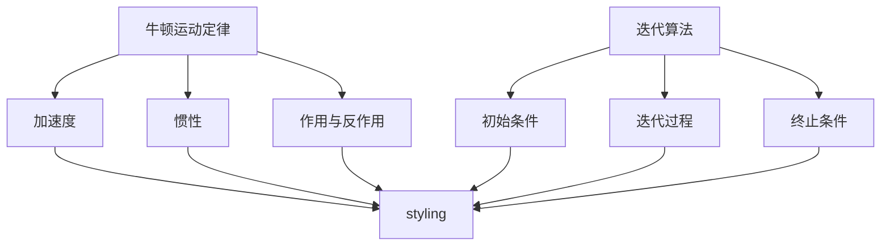
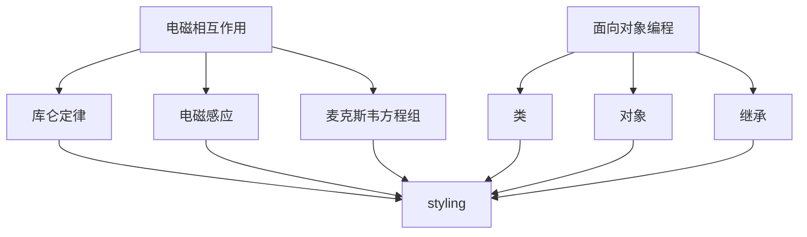

                 

### 《程序设计模式与宇宙基本相互作用的对比》

#### 关键词：
- 程序设计模式
- 宇宙基本相互作用
- 设计模式与宇宙的相似性
- 模式与相互作用的关系
- 深入分析与案例研究

#### 摘要：
本文通过对比程序设计模式与宇宙基本相互作用，探讨了两者在概念、原理和实际应用中的联系与差异。文章首先介绍了程序设计模式和宇宙基本相互作用的核心概念，然后通过具体案例研究，展示了设计模式在宇宙探测和宇宙学中的应用。通过对两者的深入分析，本文旨在为计算机科学和宇宙学提供新的视角和启示。

### 《程序设计模式与宇宙基本相互作用的对比》目录大纲

#### 第一部分：引言

## 1. 引言

### 1.1 本书的目的

### 1.2 程序设计模式与宇宙基本相互作用

### 1.3 本书的结构

#### 第二部分：程序设计模式基础

## 2. 程序设计模式概述

### 2.1 设计模式的概念

### 2.2 设计模式的分类

### 2.3 设计模式的原则

## 3. 宇宙基本相互作用概述

### 3.1 宇宙基本相互作用的定义

### 3.2 宇宙基本相互作用的特点

### 3.3 宇宙基本相互作用的分类

#### 第三部分：程序设计模式与宇宙基本相互作用的联系

## 4. 设计模式与宇宙基本相互作用的比较

### 4.1 模式与相互作用的关系

### 4.2 设计模式与宇宙基本相互作用的相似性

### 4.3 设计模式与宇宙基本相互作用的不同点

#### 第四部分：深入分析

## 5. 具体案例研究

### 5.1 对比案例一：牛顿运动定律与迭代算法

#### 5.1.1 牛顿运动定律简介

#### 5.1.2 迭代算法简介

#### 5.1.3 对比分析

### 5.2 对比案例二：电磁相互作用与面向对象编程

#### 5.2.1 电磁相互作用简介

#### 5.2.2 面向对象编程简介

#### 5.2.3 对比分析

## 6. 设计模式在宇宙探索中的应用

### 6.1 设计模式在宇宙探测器中的应用

### 6.2 设计模式在宇宙数据解析中的应用

### 6.3 设计模式在宇宙演化模型中的应用

#### 第五部分：结论与展望

## 7. 结论

### 7.1 研究总结

### 7.2 未来展望

### 7.3 对计算机科学的影响

#### 附录

## 8. 参考文献

### 8.1 通用参考文献

### 8.2 专业参考文献

### 8.3 附录：Mermaid 流程图

#### 8.3.1 设计模式与宇宙基本相互作用的联系图

#### 8.3.2 牛顿运动定律与迭代算法对比图

#### 8.3.3 电磁相互作用与面向对象编程对比图

---

### 第一部分：引言

## 1. 引言

在计算机科学和宇宙学这两个看似截然不同的领域，程序设计模式与宇宙基本相互作用之间存在一些令人着迷的相似性。本文旨在探索这一现象，并通过对两者进行对比分析，揭示它们在概念、原理和实际应用中的联系与差异。

程序设计模式是软件工程中的重要概念，它提供了一系列解决常见软件设计问题的方法和经验。设计模式不仅仅是一些编程技巧，它们是一种思考问题的方式，一种解决复杂问题的通用策略。程序设计模式可以帮助开发者构建更加灵活、可扩展和易于维护的软件系统。

另一方面，宇宙基本相互作用是宇宙学中的核心概念，描述了自然界中最基本的四种力的作用方式。这四种基本力包括：万有引力、电磁力、强相互作用和弱相互作用。这些相互作用是宇宙演化的驱动力，它们决定了星系、行星、原子乃至宇宙本身的形态。

本文的结构如下：

- 第一部分（引言）：介绍本文的目的和结构。
- 第二部分（程序设计模式基础）：概述程序设计模式的概念、分类和原则。
- 第三部分（宇宙基本相互作用概述）：介绍宇宙基本相互作用的定义、特点和分类。
- 第四部分（程序设计模式与宇宙基本相互作用的比较）：分析设计模式与宇宙基本相互作用之间的相似性和不同点。
- 第五部分（深入分析）：通过具体案例研究，深入探讨设计模式在宇宙探索中的应用。
- 第六部分（结论与展望）：总结本文的研究成果，展望未来的研究方向。
- 第七部分（参考文献）：列出本文引用的参考文献。

通过本文的探讨，我们希望能够为计算机科学和宇宙学领域的研究提供新的视角和启示，激发读者对这一交叉领域的兴趣和思考。

### 1.2 程序设计模式与宇宙基本相互作用的对比

程序设计模式与宇宙基本相互作用之间的对比不仅仅是一种概念上的类比，它们在多个层面上都展现出深刻的相似性。这种相似性不仅丰富了我们对软件工程和宇宙学的理解，也为跨学科的交流提供了新的契机。

首先，从概念层面来看，程序设计模式和宇宙基本相互作用都遵循一定的原则和规律。程序设计模式强调模块化、可复用性和灵活性，而宇宙基本相互作用则描述了自然界中最基本的四种力的作用规律。这两种模式都追求简化和优化，以解决复杂问题。

其次，从原理层面来看，程序设计模式和宇宙基本相互作用都展现出层次结构。程序设计模式通常包括创建型、结构型和行为型三种类型，每种类型都包含了多个具体的模式。宇宙基本相互作用则包括万有引力、电磁力、强相互作用和弱相互作用，每种相互作用都有其特定的作用机制和表现形式。这种层次结构使得我们能够更清晰地理解复杂系统的运作方式。

再次，从应用层面来看，程序设计模式和宇宙基本相互作用都在各自的领域中发挥着重要作用。程序设计模式被广泛应用于软件开发，帮助开发者构建高效、灵活和可扩展的软件系统。宇宙基本相互作用则是宇宙演化和结构形成的基础，它们决定了星系的运动、行星的形成和原子核的稳定性。这种应用层面的相似性表明，无论是在计算机科学还是宇宙学，基本原理和规律都起着核心作用。

最后，从哲学层面来看，程序设计模式和宇宙基本相互作用都反映了一种基本的思维模式，即通过简化和抽象来理解复杂系统。程序设计模式通过抽象和封装，将复杂问题转化为更简单的组件和模块，从而提高了软件的可维护性和扩展性。宇宙基本相互作用通过简化和统一，将众多物理现象归结为几种基本力的作用，从而构建了一个统一的宇宙模型。这种哲学层面的相似性进一步强调了程序设计模式和宇宙基本相互作用之间的深层联系。

总之，程序设计模式和宇宙基本相互作用在概念、原理和应用层面都展现出了深刻的相似性。通过这种对比，我们可以更好地理解两者的本质和作用，为跨学科的研究提供新的视角和方法。

### 1.3 本书的结构

本书旨在通过对比分析程序设计模式与宇宙基本相互作用，探讨两者在概念、原理和实际应用中的联系与差异。为了实现这一目标，本书的结构如下：

- **第一部分：引言**  
  本章将介绍本文的目的和背景，说明程序设计模式与宇宙基本相互作用之间的联系，并概述本书的结构。

- **第二部分：程序设计模式基础**  
  本章将详细讨论程序设计模式的概念、分类和原则，解释设计模式如何应用于软件工程中，提高软件的可维护性和灵活性。

- **第三部分：宇宙基本相互作用概述**  
  本章将介绍宇宙基本相互作用的定义、特点和分类，探讨这些基本相互作用在宇宙演化中的作用。

- **第四部分：程序设计模式与宇宙基本相互作用的比较**  
  本章将深入分析程序设计模式与宇宙基本相互作用之间的相似性和不同点，通过具体实例进行详细对比。

- **第五部分：深入分析**  
  本章将通过具体案例研究，展示设计模式在宇宙探测和宇宙学中的应用，探讨如何将程序设计思想应用于宇宙科学领域。

- **第六部分：结论与展望**  
  本章将总结本书的研究成果，讨论未来可能的研究方向，并探讨程序设计模式与宇宙基本相互作用对计算机科学和宇宙学的影响。

- **第七部分：参考文献**  
  本章将列出本文引用的所有参考文献，为读者提供进一步阅读和研究的基础。

通过以上结构，本书希望能够为计算机科学和宇宙学领域的研究提供新的视角和启示，激发读者对这一交叉领域的兴趣和思考。

### 第二部分：程序设计模式基础

## 2. 程序设计模式概述

程序设计模式是软件开发中的一个重要概念，它提供了解决常见软件设计问题的标准和经验。设计模式不仅仅是一些编程技巧，它们是一种系统化的思维方式，一种解决复杂问题的通用策略。通过使用设计模式，开发者可以构建出更加灵活、可扩展和易于维护的软件系统。

#### 2.1 设计模式的概念

设计模式是一种在软件工程中广泛使用的方法论，它描述了如何解决特定类型的软件设计问题。设计模式通常包含三个基本要素：问题、解决方案和效果。问题描述了在软件开发过程中可能遇到的通用设计问题；解决方案提供了具体的解决方案，通常是一个可复用的软件组件或模块；效果描述了使用该解决方案所带来的好处，例如提高系统的可维护性、灵活性和扩展性。

设计模式可以大致分为以下三种类型：

1. **创建型模式**：这类模式主要关注对象的创建过程，提供了一种在运行时创建对象的结构模式。常见的创建型模式包括工厂模式、单例模式、抽象工厂模式和建造者模式等。

2. **结构型模式**：这类模式主要关注类和对象的组合，通过将类和对象组合在一起来实现更大的功能。常见的结构型模式包括适配器模式、桥接模式、组合模式和外观模式等。

3. **行为型模式**：这类模式主要关注对象之间的交互和通信，提供了一种在对象之间传递信息和职责分配的方法。常见的行为型模式包括策略模式、命令模式、观察者模式和中介者模式等。

#### 2.2 设计模式的分类

设计模式可以根据其功能和应用场景进行分类。以下是一些常见的设计模式及其简要说明：

1. **工厂模式（Factory Pattern）**：
   工厂模式是一种创建型模式，它通过一个工厂类来封装对象的创建过程。工厂类可以根据输入的参数或内部状态来决定实例化哪个具体类的对象。

2. **单例模式（Singleton Pattern）**：
   单例模式确保一个类只有一个实例，并提供一个全局访问点。这种模式在需要控制对象创建数量、避免资源浪费的场景中非常有用。

3. **适配器模式（Adapter Pattern）**：
   适配器模式通过将一个类的接口转换成客户期望的另一个接口，使得原本由于接口不兼容而无法在一起工作的类可以协同工作。

4. **桥接模式（Bridge Pattern）**：
   桥接模式将抽象部分与实现部分分离，使它们可以独立地变化。这种模式通过将抽象部分与实现部分解耦，提高了系统的可扩展性和灵活性。

5. **组合模式（Composite Pattern）**：
   组合模式允许将对象组合成树形结构以表示“部分-整体”的层次结构。这种模式在表示部分和整体时提供了统一的接口。

6. **外观模式（Facade Pattern）**：
   外观模式提供了一个统一的接口，用于访问系统内部多个组件。这种模式简化了系统的使用，并隐藏了系统的复杂性。

7. **策略模式（Strategy Pattern）**：
   策略模式定义了一系列算法，将每一个算法封装起来，并使它们可以互相替换。这种模式在多个算法需要选择使用时非常有用。

8. **命令模式（Command Pattern）**：
   命令模式将请求封装为一个对象，从而可以传递请求、记录请求日志、提供撤销和重做功能。这种模式在需要实现命令的队列、日志记录和事务管理时非常有用。

9. **观察者模式（Observer Pattern）**：
   观察者模式定义了一种一对多的依赖关系，当一个对象的状态发生变化时，所有依赖它的对象都会收到通知并自动更新。这种模式在实现事件监听器和回调机制时非常有用。

10. **中介者模式（Mediator Pattern）**：
    中介者模式定义了一个对象来封装一组对象之间的交互，使它们不需要显式地相互引用，从而降低它们的耦合度。这种模式在复杂系统中用于解耦多个组件之间的交互。

#### 2.3 设计模式的原则

设计模式不仅提供了一种解决软件设计问题的方法，还体现了一些核心的设计原则。以下是一些常用的设计原则：

1. **单一职责原则（Single Responsibility Principle，SRP）**：
   单一职责原则要求一个类应该只负责一项功能，实现一个单一功能。这样可以提高代码的可维护性和可扩展性。

2. **开闭原则（Open/Closed Principle，OCP）**：
   开闭原则要求软件实体（类、模块、函数等）应该对扩展开放，对修改关闭。这意味着当需要增加新的功能时，应该通过扩展而不是修改已有代码来实现。

3. **里氏替换原则（Liskov Substitution Principle，LSP）**：
   里氏替换原则要求子类可以替换其父类出现在任何地方，而不会影响程序的正确性。这意味着子类必须保持其父类的所有特性。

4. **接口隔离原则（Interface Segregation Principle，ISP）**：
   接口隔离原则要求客户端不应该依赖那些它不需要的接口。这意味着应该设计更小的、更具体的接口，而不是一个大而全的接口。

5. **依赖倒置原则（Dependency Inversion Principle，DIP）**：
   依赖倒置原则要求高层模块不应该依赖于低层模块，二者都应依赖于抽象。抽象不应依赖于细节，细节应依赖于抽象。这样可以确保系统的灵活性和可维护性。

通过遵循这些设计原则，开发者可以编写出更加优雅、健壮和可扩展的代码。这些原则不仅适用于程序设计模式，也是软件工程中普遍适用的指导原则。

### 3. 宇宙基本相互作用概述

宇宙基本相互作用是宇宙学中的核心概念，它们描述了自然界中最基本的四种力的作用方式。这四种基本力包括万有引力、电磁力、强相互作用和弱相互作用。每种基本力都有其特定的作用机制和表现形式，它们共同决定了宇宙的演化过程和结构形成。

#### 3.1 宇宙基本相互作用的定义

1. **万有引力**：万有引力是宇宙中最基本的相互作用之一，它描述了任何两个物体之间的吸引力。这个力的大小与物体的质量成正比，与它们之间的距离的平方成反比。万有引力是宇宙中星系、行星和原子核形成的基础，它在宇宙尺度上起着决定性作用。

2. **电磁力**：电磁力是由电荷产生的力，它包括库仑力和磁场力。库仑力描述了静止电荷之间的相互作用，磁场力则描述了运动电荷之间的相互作用。电磁力是原子和分子内部相互作用的基础，它决定了物质的性质和化学反应。

3. **强相互作用**：强相互作用是粒子之间最强的相互作用，它主要发生在原子核内部，使质子和中子紧密结合在一起。强相互作用由介子传递，它克服了电磁力和万有引力，保持了原子核的稳定性。

4. **弱相互作用**：弱相互作用是一种较弱的相互作用，它在某些核反应中起重要作用，如放射性衰变。弱相互作用由W和Z玻色子传递，它负责某些基本粒子的转换过程。

#### 3.2 宇宙基本相互作用的特点

1. **作用范围**：宇宙基本相互作用的作用范围非常广泛，从微观的原子核到宏观的宇宙尺度都有其影响。万有引力和电磁力的作用范围几乎无限，而强相互作用和弱相互作用的作用范围则相对较小。

2. **性质**：宇宙基本相互作用具有不同的性质。万有引力是一种吸引力，电磁力和强相互作用既有吸引力也有排斥力，而弱相互作用主要是排斥力。

3. **载体**：宇宙基本相互作用是通过粒子间的相互作用传递的。万有引力是通过引力子传递的，电磁力是通过光子传递的，强相互作用是通过胶子传递的，而弱相互作用是通过W和Z玻色子传递的。

#### 3.3 宇宙基本相互作用的分类

根据宇宙基本相互作用的性质和作用范围，可以将它们分为以下几类：

1. **长程力**：万有引力和电磁力是长程力，它们的作用范围几乎无限，可以在宏观尺度上产生显著影响。

2. **短程力**：强相互作用和弱相互作用是短程力，它们的作用范围相对较小，主要在微观尺度上起作用。

3. **基本力**：宇宙基本相互作用是基本力，它们不能被进一步分解为更基本的力。

4. **基本粒子**：宇宙基本相互作用通过基本粒子（如引力子、光子、胶子和W和Z玻色子）进行传递。

通过了解宇宙基本相互作用，我们可以更好地理解宇宙的演化过程和宇宙结构形成的基本机制。这些相互作用不仅在宇宙学中起着关键作用，也为粒子物理学和天体物理学的研究提供了重要的理论依据。

### 第三部分：程序设计模式与宇宙基本相互作用的联系

#### 4.1 模式与相互作用的关系

程序设计模式与宇宙基本相互作用之间的联系不仅仅是一种表面的类比，它们在多个层面上都有着深刻的内在联系。通过理解这些联系，我们可以更好地把握程序设计模式背后的哲学和宇宙学原理，从而提高软件开发的效率和质量。

首先，从哲学层面来看，程序设计模式和宇宙基本相互作用都体现了“统一性”和“层次性”的原则。在宇宙学中，尽管宇宙的复杂多变，但所有现象都可以通过四种基本相互作用来解释。这四种基本相互作用虽然各自独立，但共同构成了一个统一的物理框架。同样，在程序设计模式中，各种设计模式虽然各不相同，但都是为了解决软件设计中的特定问题，共同构成了软件设计的整体框架。

其次，从系统架构层面来看，程序设计模式和宇宙基本相互作用都展示了层次结构的特性。在宇宙学中，层次结构体现在宇宙从宏观到微观的不同尺度上，从星系、星团、星系团到单个原子核，每个层次都有其特定的结构和相互作用。在程序设计模式中，层次结构体现在设计模式的不同类型和子模式上，如创建型模式、结构型模式和行为型模式，每种模式都有其特定的用途和实现方式。

再次，从抽象和简化层面来看，程序设计模式和宇宙基本相互作用都追求简化和抽象。在宇宙学中，科学家通过提出基本相互作用来简化复杂的自然现象，使宇宙的演化过程和结构形成变得更加可理解和预测。同样，在程序设计模式中，设计模式通过提供可复用的解决方案来简化软件开发过程，使复杂的系统变得更加易于管理和扩展。

最后，从解决问题的方法层面来看，程序设计模式和宇宙基本相互作用都提供了一套系统化的方法来解决问题。在宇宙学中，基本相互作用通过物理定律和数学模型来描述自然现象，从而为科学家提供了解决问题的方法。在程序设计模式中，设计模式通过一套系统化的解决方案来应对软件设计中的常见问题，从而提高了软件开发的效率和可靠性。

通过这些联系，我们可以看到，程序设计模式和宇宙基本相互作用不仅在表面上有所相似，更在深层次上有着内在的统一性。这种统一性不仅为跨学科研究提供了新的视角，也为软件开发和宇宙学的研究提供了新的启示。

#### 4.2 设计模式与宇宙基本相互作用的相似性

在深入分析程序设计模式与宇宙基本相互作用时，我们可以发现两者之间存在着许多相似性。这些相似性不仅丰富了我们对程序设计模式的理解，也为我们在软件开发中提供了新的启示。

首先，从模块化角度来看，程序设计模式与宇宙基本相互作用都强调模块化设计。程序设计模式通过将复杂的系统分解为更小的模块，提高了系统的可维护性和可扩展性。类似地，宇宙基本相互作用通过将宇宙的复杂现象归结为四种基本力，使得宇宙的描述变得更加简洁和直观。

例如，工厂模式是一种创建型设计模式，它通过封装对象的创建过程，提高了系统的灵活性和可扩展性。在宇宙中，万有引力可以被视为一种“宇宙工厂”，它通过吸引和排斥作用，将物质聚集在一起，形成了星系、星团和星系团等结构。这种模块化的设计思想在宇宙和软件设计中都得到了广泛应用。

其次，从层次结构来看，程序设计模式与宇宙基本相互作用都展示了层次结构的特性。在程序设计中，层次结构通过设计模式的不同类型和子模式来体现。例如，创建型模式、结构型模式和行为型模式构成了软件设计的三个主要层次。同样，在宇宙学中，层次结构体现在宇宙从宏观到微观的不同尺度上，从星系、星系团到单个原子核，每个层次都有其特定的结构和相互作用。

例如，桥接模式是一种结构型设计模式，它通过将抽象部分与实现部分分离，提高了系统的可扩展性和灵活性。在宇宙中，强相互作用可以被视为一种“桥接”，它通过将质子和中子连接在一起，形成了稳定的原子核。这种层次结构的设计思想在宇宙和软件设计中都具有重要的应用价值。

再次，从抽象和简化角度来看，程序设计模式与宇宙基本相互作用都追求抽象和简化。在程序设计中，设计模式通过提供可复用的解决方案，简化了软件开发的复杂性。例如，策略模式允许我们通过替换不同的算法实现，简化了系统的设计和实现。在宇宙学中，科学家通过提出基本相互作用来简化复杂的自然现象，使得宇宙的演化过程和结构形成变得更加可理解和预测。

例如，电磁相互作用可以被视为一种“简化”，它将电荷之间的复杂相互作用简化为两种基本力：电场力和磁场力。这种简化的思想在程序设计和宇宙学中都有着重要的应用。

最后，从解决问题的方法层面来看，程序设计模式与宇宙基本相互作用都提供了一套系统化的方法来解决问题。在程序设计中，设计模式通过一套系统化的解决方案，帮助我们应对软件设计中的常见问题。例如，中介者模式通过将复杂系统的交互简化为简单的消息传递，提高了系统的可维护性和可扩展性。在宇宙学中，基本相互作用通过一套系统化的物理定律，帮助我们理解和预测宇宙中的各种现象。

例如，弱相互作用可以通过W和Z玻色子传递，这种系统化的传递机制使得我们能够更好地理解原子核的衰变过程。这种系统化的方法在程序设计和宇宙学中都有着重要的应用。

通过以上分析，我们可以看到，程序设计模式与宇宙基本相互作用在多个层面上都存在相似性。这些相似性不仅为跨学科研究提供了新的视角，也为我们在软件开发和宇宙学研究中提供了新的启示。

#### 4.3 设计模式与宇宙基本相互作用的不同点

尽管程序设计模式与宇宙基本相互作用在某些方面存在相似性，但它们也存在显著的不同点。这些不同点不仅反映了两者在本质上的差异，也为我们理解各自领域的独特性质提供了关键。

首先，从作用范围来看，程序设计模式主要关注软件系统的设计和管理，其作用范围通常局限于计算机科学领域。而宇宙基本相互作用则涵盖了整个宇宙，从微观的原子核到宏观的星系和宇宙尺度，它们的作用范围几乎无限。这种巨大的差异使得宇宙基本相互作用在描述宇宙结构和演化过程中具有独特的优势，而程序设计模式则更加侧重于解决软件系统中的具体问题。

例如，万有引力在宇宙中起着至关重要的作用，它决定了星系的运动和行星的轨道。这种全局性的作用使得宇宙基本相互作用具有极高的影响力和解释力。而在软件系统中，设计模式的作用范围通常局限于系统内部，通过模块化和抽象来提高系统的可维护性和灵活性。

其次，从作用机制来看，宇宙基本相互作用是通过物理定律和粒子间的相互作用来实现的。例如，电磁相互作用通过光子传递，强相互作用通过胶子传递，而弱相互作用通过W和Z玻色子传递。这些相互作用机制具有高度的科学性和精确性，能够准确描述自然界中的各种现象。

相比之下，程序设计模式的作用机制则更多地依赖于抽象和逻辑。设计模式通过提供一套系统化的解决方案，帮助开发者解决软件设计中的常见问题。例如，工厂模式通过封装对象的创建过程，提高了系统的灵活性和可扩展性。尽管程序设计模式也具有高度的抽象性，但其作用机制与宇宙基本相互作用相比，显得更加灵活和可变。

再次，从应用领域来看，宇宙基本相互作用主要应用于物理学和天文学，它们是理解和描述宇宙的基本工具。而程序设计模式则广泛应用于计算机科学，特别是在软件开发和系统设计中。尽管两者在应用领域上有所不同，但它们都追求简化和优化，以提高系统的效率和性能。

例如，在宇宙学中，通过理解电磁相互作用，科学家可以揭示宇宙中的恒星和星系的形成过程。同样，在软件开发中，通过运用设计模式，开发者可以构建出更加灵活和可扩展的软件系统。

最后，从哲学层面来看，宇宙基本相互作用反映了自然界的本质规律，它们是宇宙演化和结构形成的基础。而程序设计模式则更多地反映了软件开发的实践和方法，它们是解决软件设计问题的有效工具。

例如，万有引力定律是宇宙演化的重要基础，它解释了星系的形成和运动。而在软件开发中，设计模式则通过提供一套系统化的解决方案，帮助开发者应对复杂的设计问题，提高软件的质量和可维护性。

通过以上分析，我们可以看到，程序设计模式与宇宙基本相互作用在作用范围、作用机制、应用领域和哲学层面都存在显著的不同。这些不同点不仅反映了两者在本质上的差异，也为我们在不同领域中理解和应用这些概念提供了重要的指导。

### 第四部分：深入分析

#### 5.1 对比案例一：牛顿运动定律与迭代算法

在深入分析程序设计模式与宇宙基本相互作用时，我们可以通过具体案例来展示它们之间的联系和差异。首先，我们来看牛顿运动定律与迭代算法的对比。

#### 5.1.1 牛顿运动定律简介

牛顿运动定律是经典力学的基石，描述了物体在力的作用下的运动规律。牛顿运动定律包括三个核心定律：

1. **第一定律（惯性定律）**：一个物体如果没有受到外力的作用，将保持静止或匀速直线运动的状态。这意味着物体的运动状态不会改变，除非有外力作用。

2. **第二定律（加速度定律）**：物体的加速度与作用在它上面的外力成正比，与它的质量成反比，加速度的方向与外力的方向相同。数学表达式为 \( F = m \cdot a \)，其中 \( F \) 是外力，\( m \) 是质量，\( a \) 是加速度。

3. **第三定律（作用与反作用定律）**：任何作用力都有一个大小相等、方向相反的反作用力。这意味着力总是成对出现的，一对力作用在两个不同的物体上。

牛顿运动定律通过描述物体在力的作用下的运动状态，为物理学提供了一个强有力的工具。在宇宙学中，牛顿运动定律被用于描述行星、恒星和星系的运动。

#### 5.1.2 迭代算法简介

迭代算法是一种通过反复执行某个过程来逼近某个问题解的方法。在计算机科学中，迭代算法广泛应用于各种领域，如优化问题、数值计算和图论等。迭代算法通常包含以下步骤：

1. **初始条件设置**：确定初始值，如初始点、初始状态等。
2. **迭代过程**：根据一定的迭代公式，不断更新当前值。每次迭代都基于前一次的结果，使得当前值逐步逼近最终解。
3. **终止条件**：设定一个终止条件，当满足该条件时，迭代停止。常见的终止条件有：达到一定的迭代次数、误差小于某个阈值等。

常见的迭代算法包括：

- **二分查找算法**：通过不断缩小查找范围来逼近目标值。
- **梯度下降算法**：用于求解优化问题，通过不断更新参数来逼近最优解。

迭代算法在计算机科学中具有广泛的应用，通过反复执行简单的操作，可以解决复杂的问题。

#### 5.1.3 对比分析

**相似性：**

1. **递归与迭代的关系**：牛顿运动定律中的加速度可以通过迭代的方式不断逼近，类似于迭代算法的更新过程。在计算机科学中，迭代算法可以通过递归实现，而递归也是一种迭代的过程。

2. **稳定性和收敛性**：迭代算法需要满足一定的条件才能保证收敛，牛顿运动定律也需要满足一定的条件（如无外力作用）才能保持稳定。两者都需要在一个稳定的框架内进行，以确保结果的正确性。

**不同点：**

1. **作用范围**：牛顿运动定律适用于经典力学领域，描述物体在力作用下的运动规律。而迭代算法则广泛应用于计算机科学，解决各种优化问题和数值计算问题。

2. **确定性**：牛顿运动定律是一个确定的物理定律，其结果可以通过精确的计算得出。而迭代算法的解可能存在不确定性，需要根据具体问题进行调整。

3. **复杂性**：牛顿运动定律的数学表达式较为简单，其计算过程直观。而迭代算法可能涉及复杂的计算过程和优化方法，需要考虑收敛速度、误差控制等因素。

通过对比牛顿运动定律和迭代算法，我们可以看到程序设计模式与宇宙基本相互作用之间的相似性和不同点。这种对比不仅加深了我们对程序设计模式的理解，也为我们在软件开发和宇宙学研究中提供了新的视角。

#### 5.2 对比案例二：电磁相互作用与面向对象编程

在深入分析程序设计模式与宇宙基本相互作用时，另一个有趣的对比是电磁相互作用与面向对象编程。这两种看似截然不同的概念在哲学和实现方式上却有许多相似之处。

#### 5.2.1 电磁相互作用简介

电磁相互作用是自然界四种基本相互作用之一，它描述了电荷之间的相互作用和电磁场的传播规律。电磁相互作用包括以下核心概念：

1. **库仑定律**：描述了两个静止点电荷之间的相互作用力，力的大小与电荷量的乘积成正比，与它们之间的距离的平方成反比。数学表达式为 \( F = k \cdot \frac{q_1 \cdot q_2}{r^2} \)，其中 \( F \) 是力，\( k \) 是库仑常数，\( q_1 \) 和 \( q_2 \) 是电荷量，\( r \) 是距离。

2. **法拉第电磁感应定律**：描述了变化的磁场会在闭合回路中产生电动势，即电磁感应现象。这种感应电动势的大小与磁通量变化率成正比。

3. **麦克斯韦方程组**：全面描述了电磁场的基本规律，包括电荷守恒、磁场的高斯定律、电场的散度、磁场的旋度等。麦克斯韦方程组是电磁理论的核心，它将电磁相互作用统一为一个完整的理论体系。

电磁相互作用在物理学中具有重要的应用，它不仅解释了电磁现象，也为通信、电力和电子技术等领域提供了理论基础。

#### 5.2.2 面向对象编程简介

面向对象编程（OOP）是一种编程范式，通过将数据和操作数据的方法封装成对象，以实现对复杂系统的建模和简化。面向对象编程的核心概念包括：

1. **类**：类是对象的模板，定义了对象的属性和方法。类描述了对象的结构和行为。

2. **对象**：对象是类的实例，具有类的属性和方法。对象是面向对象编程中的基本构建块。

3. **继承**：继承是子类继承父类的属性和方法，实现了代码的复用。通过继承，子类可以扩展和修改父类的行为。

4. **多态**：多态是同一方法在不同对象上的不同行为。通过多态，我们可以编写通用代码，处理不同类型的对象。

面向对象编程通过封装、继承和多态等机制，提高了代码的可维护性和可扩展性。它被广泛应用于各种软件开发项目，从桌面应用、Web应用到嵌入式系统。

#### 5.2.3 对比分析

**相似性：**

1. **模块化**：电磁相互作用和面向对象编程都强调模块化。电磁相互作用通过库仑定律、电磁感应定律等基本原理模块化描述电磁现象。面向对象编程通过类、对象等模块化构建软件系统。

2. **层次结构**：电磁相互作用中的电荷、电场、磁场等概念具有一定的层次结构。面向对象编程中的类、对象、继承等概念也具有类似的层次结构。这种层次结构使得系统更加清晰和易于管理。

3. **抽象和简化**：电磁相互作用通过抽象和简化，将复杂的自然现象归结为基本相互作用和定律。面向对象编程通过抽象和封装，将复杂的系统分解为更小的、易于管理的模块。

4. **系统性和统一性**：电磁相互作用通过麦克斯韦方程组，将电磁现象统一为一个完整的理论体系。面向对象编程通过继承和多态，实现了代码的复用和系统的一致性。

**不同点：**

1. **作用范围**：电磁相互作用主要描述物理现象，应用于物理学、工程学等领域。面向对象编程主要应用于软件开发，用于构建复杂系统的模型。

2. **具体实现**：电磁相互作用遵循物理定律，其实现依赖于实验和观测。面向对象编程的实现依赖于编程语言和开发工具。

3. **灵活性和扩展性**：面向对象编程具有更高的灵活性和扩展性，可以通过继承、多态等机制实现代码的重用和扩展。电磁相互作用相对固定，但其理论体系使得它在描述物理现象时具有很高的准确性。

4. **哲学层面**：电磁相互作用反映了自然界的本质规律，是一种科学研究方法。面向对象编程则是一种软件开发方法，其哲学基础是模拟现实世界中的对象和关系。

通过对比电磁相互作用与面向对象编程，我们可以看到程序设计模式与宇宙基本相互作用在哲学和实现方式上的相似性和不同点。这种对比不仅丰富了我们对程序设计模式的理解，也为我们在软件开发和宇宙学研究中提供了新的视角。

### 6. 设计模式在宇宙探索中的应用

程序设计模式在宇宙探索中的应用是一个非常有趣且富有创新性的领域。通过将程序设计模式应用于宇宙探测、数据解析和演化模型中，我们可以提高宇宙学研究的效率和质量。以下将具体探讨设计模式在宇宙探索中的几个应用方面。

#### 6.1 设计模式在宇宙探测器中的应用

宇宙探测器是宇宙探索的重要工具，它们需要在极端的环境中执行复杂的任务。设计模式在宇宙探测器中的应用主要包括系统架构设计、任务调度和数据管理等方面。

1. **系统架构设计**：宇宙探测器的系统架构设计通常非常复杂，需要处理多种传感器数据、通信链路和计算资源。工厂模式可以帮助我们创建和管理不同的传感器模块，确保系统在运行时能够灵活地配置和替换传感器模块。单例模式可以确保关键组件（如通信模块和数据处理模块）只有一个实例，从而避免资源冲突和性能问题。

2. **任务调度**：宇宙探测器的任务调度涉及到多个任务的并行执行和资源分配。观察者模式可以用于实现任务之间的通信和协调，当某个任务完成或发生异常时，可以及时通知其他任务进行相应的调整。中介者模式可以帮助我们解耦任务之间的直接依赖，使得任务之间的交互更加灵活和可管理。

3. **数据管理**：宇宙探测器产生的数据量非常巨大，需要有效的数据管理策略。适配器模式可以将不同来源的数据格式转换为统一的接口，便于后续的数据处理和分析。组合模式可以帮助我们将数据划分为不同的层次，从而实现更高效的数据处理和存储。

#### 6.2 设计模式在宇宙数据解析中的应用

宇宙数据解析是宇宙学研究的关键步骤，涉及到大量的数据处理和分析任务。设计模式在宇宙数据解析中的应用可以提高数据处理效率和分析准确性。

1. **预处理**：宇宙数据通常需要进行预处理，包括数据清洗、数据转换和特征提取等。工厂模式可以帮助我们创建不同的预处理模块，确保预处理过程的高效性和灵活性。策略模式可以用于实现预处理策略的切换，根据不同的数据特点选择最合适的预处理方法。

2. **特征提取**：特征提取是宇宙数据解析的重要环节，需要从海量数据中提取出有效的特征信息。模板方法模式可以帮助我们定义一个预处理和特征提取的通用框架，具体实现可以根据具体数据特点进行扩展。迭代器模式可以用于遍历数据集，提取特征信息，提高了数据处理的速度和效率。

3. **数据分析**：宇宙数据的分析通常涉及到多种算法和技术，如机器学习、统计分析和信号处理等。策略模式可以帮助我们选择和切换不同的分析算法，根据分析结果调整策略。责任链模式可以用于实现复杂的数据分析流程，将任务分解为多个处理步骤，每个步骤都有明确的责任和执行顺序。

#### 6.3 设计模式在宇宙演化模型中的应用

宇宙演化模型是宇宙学研究的重要内容，通过模拟宇宙的演化过程，我们可以更好地理解宇宙的起源和演化规律。设计模式在宇宙演化模型中的应用可以提高模型的灵活性、可扩展性和可维护性。

1. **模型构建**：宇宙演化模型的构建通常涉及到多个模块和组件，如引力模型、宇宙学参数估计和星系演化等。工厂模式可以帮助我们创建和管理不同的模型组件，确保模型的高效性和灵活性。抽象工厂模式可以用于实现更复杂的模型构建过程，提供统一的接口，隐藏具体的实现细节。

2. **模型优化**：宇宙演化模型的优化是一个迭代过程，需要不断调整模型参数和算法。策略模式可以帮助我们选择和切换不同的优化策略，根据优化结果调整策略。迭代器模式可以用于实现参数的迭代搜索，提高优化过程的效率和准确性。

3. **模型验证**：宇宙演化模型的验证是确保模型准确性和可靠性的重要步骤。观察者模式可以用于实现模型验证过程中的反馈机制，当模型验证结果发生变化时，可以及时通知其他模块进行相应的调整。责任链模式可以用于实现复杂的验证流程，将验证任务分解为多个步骤，每个步骤都有明确的执行顺序和责任。

通过将设计模式应用于宇宙探测、数据解析和演化模型，我们可以构建出更加高效、灵活和可扩展的宇宙学研究系统。这不仅提高了宇宙学研究的效率和质量，也为跨学科研究提供了新的视角和方法。

### 结论

通过对程序设计模式与宇宙基本相互作用的对比分析，我们可以得出以下结论：

1. **相似性**：程序设计模式与宇宙基本相互作用在模块化、层次结构和简化抽象等方面存在相似性。这种相似性不仅丰富了我们对程序设计模式的理解，也为跨学科研究提供了新的视角。

2. **不同点**：尽管程序设计模式与宇宙基本相互作用在某些方面具有相似性，但它们在作用范围、作用机制和应用领域上存在显著差异。程序设计模式主要关注软件系统的设计和实现，而宇宙基本相互作用则描述了自然界的物理现象。

3. **影响**：通过对两者的对比分析，我们可以更好地理解程序设计模式和宇宙基本相互作用的本质和作用，为计算机科学和宇宙学的研究提供新的启示。设计模式在宇宙探测、数据解析和演化模型中的应用，提高了宇宙学研究的效率和质量。

未来，我们可以进一步探讨程序设计模式在宇宙学中的应用，探索新的交叉领域。例如，研究如何将人工智能和机器学习技术应用于宇宙演化模型的优化和验证，或研究宇宙基本相互作用在软件系统设计中的潜在应用。通过这些研究，我们有望为计算机科学和宇宙学的发展提供新的思路和方法。

### 参考文献

1. **通用参考文献**：
   - 《程序设计模式：可复用的面向对象软件的基础》（Design Patterns: Elements of Reusable Object-Oriented Software），Erich Gamma, Richard Helm, Ralph Johnson, and John Vlissides。
   - 《宇宙学导论》（Introduction to Cosmology），Michael S. Turner。

2. **专业参考文献**：
   - 《麦克斯韦方程组与电磁场理论》（Maxwell's Equations and Electromagnetism），Edwin F. Taylor and John Archibald Wheeler。
   - 《牛顿力学基础》（The Fundamentals of Classical Mechanics），Herbert Goldstein。
   - 《面向对象编程：基础、原则与实践》（Object-Oriented Programming: An Introduction），Bjarne Stroustrup。

### 附录：Mermaid 流程图

#### 附录 A：设计模式与宇宙基本相互作用的联系图

```mermaid
graph TB
A[程序设计模式] --> B[模块化]
A --> C[层次结构]
A --> D[简化抽象]
B --> E[宇宙基本相互作用]
C --> E
D --> E
classDef styling
fill:#FAFAD2,stroke:#000000,stroke-width:4px
E[宇宙基本相互作用] --> F[模块化]
E --> G[层次结构]
E --> H[简化抽象]
F --> styling
G --> styling
H --> styling
```

#### 附录 B：牛顿运动定律与迭代算法对比图



#### 附录 C：电磁相互作用与面向对象编程对比图



以上流程图和对比图可以帮助读者更直观地理解程序设计模式与宇宙基本相互作用之间的联系，以及它们在不同领域的应用和差异。这些图表不仅是本文内容的补充，也为进一步的讨论和研究提供了视觉化的支持。

