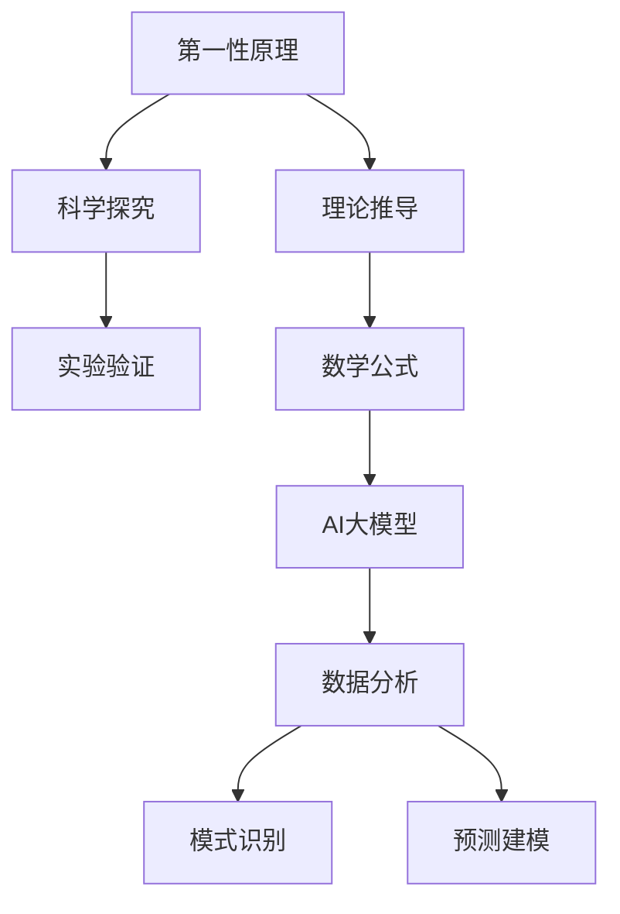

                 

## 引言

在当今快速发展的科技时代，人工智能（AI）已经成为了引领技术革新的重要力量。从自动驾驶汽车、智能助手到复杂的医学影像分析，AI大模型在各个领域的应用正日益广泛。然而，随着这些模型的规模和复杂性不断增加，如何理解和解析这些模型的内部工作机制，成为了科研和工业界共同关注的重要课题。

本文旨在探讨“第一性原理”在AI大模型研究和开发中的应用。第一性原理是科学研究中的一种基本方法论，它强调从最基本的物理、化学或生物学原理出发，通过数学推导来理解和解释复杂现象。本文将首先介绍AI大模型的基本概念和特点，然后探讨第一性原理在科学探究中的重要性，并分析第一性原理与AI大模型之间的内在联系。通过具体算法原理讲解、数学模型与公式介绍以及实际项目案例分析，本文将系统性地展示如何运用第一性原理来解析和优化AI大模型。

通过本文的阅读，读者将能够深入了解AI大模型的核心算法原理、数学模型以及实际应用，从而为今后的研究和工作提供有力支持。文章的结构安排如下：

1. **核心概念与联系**：介绍AI大模型的基本概念和特点，以及第一性原理在科学探究中的应用。
2. **核心算法原理讲解**：详细讲解深度学习中的前向传播与反向传播算法，以及随机梯度下降（SGD）优化算法。
3. **数学模型和数学公式**：介绍深度学习中的激活函数和损失函数，并使用LaTeX格式给出具体数学公式。
4. **项目实战**：通过医学影像分析案例，展示AI大模型在实际项目中的应用，包括开发环境搭建、源代码实现和代码解读。
5. **结论与展望**：总结文章的主要观点，并对未来研究方向进行展望。
6. **附录**：提供AI大模型开发的相关资源。

### 核心关键词

- AI大模型
- 第一性原理
- 科学探究
- 深度学习
- 数学模型
- 实际应用
- 激活函数
- 损失函数
- 随机梯度下降

### 摘要

本文深入探讨了人工智能（AI）大模型与第一性原理之间的关系。首先，我们介绍了AI大模型的基本概念、特点及其在当前科技领域的重要地位。然后，详细阐述了第一性原理在科学探究中的核心作用，并分析了其在AI大模型研究和开发中的应用价值。通过核心算法原理的讲解，如前向传播与反向传播算法以及随机梯度下降优化算法，我们揭示了AI大模型内部的工作机制。随后，本文介绍了深度学习中的关键数学模型，包括激活函数和损失函数，并使用LaTeX格式给出了具体的数学公式。最后，通过一个医学影像分析的案例，本文展示了AI大模型在实际项目中的应用过程，包括开发环境搭建、源代码实现和代码解读。本文旨在为读者提供全面、系统的AI大模型知识体系，并探讨其未来的发展方向和应用前景。### 第一部分：核心概念与联系

#### 1.1 AI大模型概述

AI大模型，也称为大规模人工智能模型，是指通过深度学习和大量数据训练出的具有大规模参数和复杂结构的人工智能模型。这些模型在近年来取得了显著的进展，广泛应用于自然语言处理、计算机视觉、语音识别等领域。AI大模型的核心特点主要体现在以下几个方面：

1. **参数规模大**：AI大模型通常拥有数十亿甚至数万亿的参数。这些参数的数量远超传统机器学习模型，使得AI大模型能够处理更为复杂的数据和任务。

2. **结构复杂**：AI大模型通常由多层神经网络组成，每层都有大量的神经元。这些层次结构使得模型能够自动提取数据中的复杂特征，从而实现更准确和高效的预测。

3. **学习能力强**：AI大模型通过大量的数据训练，能够自动从数据中学习到复杂的模式和规律。这使得它们在处理未知或罕见数据时，依然能够保持较高的性能。

4. **泛化能力强**：由于AI大模型具有大规模的参数和复杂的结构，它们在训练过程中能够学习到更多的泛化知识，从而在面对新的任务或数据时，能够保持较高的准确性和可靠性。

AI大模型的出现，标志着人工智能技术进入了一个新的阶段。这些模型不仅能够解决更为复杂的问题，还能够提供更加智能和高效的解决方案。例如，在自然语言处理领域，AI大模型可以用于机器翻译、情感分析、文本生成等任务；在计算机视觉领域，AI大模型可以用于图像分类、目标检测、人脸识别等任务；在语音识别领域，AI大模型可以用于语音识别、语音合成、语音翻译等任务。

#### 1.1.2 科学探究与第一性原理

科学探究是人们对自然现象进行系统研究和理解的过程。它包括观察、假设、实验和验证等步骤，用以揭示自然现象和规律。科学探究的目标是发现自然界的基本原理，从而为人类提供解决问题的方法论。

第一性原理是科学探究的一种基本方法论，它强调从最基本的物理、化学或生物学原理出发，通过数学推导来理解和解释复杂现象。第一性原理的核心思想是“无中生有”，即从最基本的构成要素出发，通过一系列的数学公式和逻辑推理，推导出复杂系统的行为和特性。

在科学探究中，第一性原理具有以下几个重要特点：

1. **基础性**：第一性原理从最基本的物理或化学原理出发，能够揭示复杂现象的根本原因。

2. **普适性**：第一性原理适用于各种不同的系统和领域，无论这些系统多么复杂，都可以通过第一性原理的方法进行理解和解释。

3. **精确性**：第一性原理通过数学公式和逻辑推理，能够对复杂现象进行精确的描述和预测。

4. **系统性**：第一性原理不仅能够解释单个现象，还能够将不同现象联系起来，形成统一的科学体系。

#### 1.1.3 AI大模型在科学探究中的应用

AI大模型在科学探究中的应用已经成为当前研究的热点。通过深度学习和大量数据训练，AI大模型能够自动提取数据中的复杂特征，并进行高效的数据分析和预测。以下是一些典型的应用场景：

1. **数据分析**：AI大模型能够处理和分析海量数据，从中提取有用的信息。例如，在医学领域，AI大模型可以用于分析患者的电子健康记录，预测疾病的发病风险，为临床决策提供支持。

2. **模式识别**：AI大模型在模式识别任务中表现出色。例如，在医学影像分析中，AI大模型可以用于肺癌早期筛查，通过分析CT图像，识别出潜在的肺癌病灶。

3. **预测建模**：AI大模型可以基于历史数据，预测未来的趋势和变化。例如，在金融市场分析中，AI大模型可以用于预测股票价格的走势，为投资者提供参考。

4. **智能决策**：AI大模型可以用于智能决策支持系统，为决策者提供科学、准确的决策建议。例如，在物流运输领域，AI大模型可以用于优化运输路线，提高运输效率。

#### 1.1.4 第一性原理与AI大模型的关系

第一性原理为科学探究提供了基础理论框架，而AI大模型则是将这一理论应用于具体问题求解的重要工具。具体来说，第一性原理与AI大模型的关系可以从以下几个方面进行阐述：

1. **理论基础**：第一性原理为AI大模型提供了理论基础。通过第一性原理，可以理解AI大模型中各个组件的工作原理，从而优化模型的性能。

2. **算法设计**：第一性原理可以指导AI大模型算法的设计。例如，在深度学习算法中，可以通过第一性原理推导出前向传播和反向传播算法，从而提高算法的效率。

3. **模型优化**：第一性原理可以帮助优化AI大模型的参数设置和结构设计。通过分析模型中各个组件的性能，可以找出最佳的参数配置，从而提高模型的性能。

4. **问题求解**：第一性原理可以用于解决具体的问题。例如，在材料科学领域，可以通过第一性原理计算，预测材料的性质和行为，从而设计出新的材料。

总之，第一性原理与AI大模型的关系是相互促进的。第一性原理为AI大模型提供了理论基础和算法指导，而AI大模型则通过深度学习和大量数据训练，实现了第一性原理在具体问题求解中的广泛应用。

**图 1.1 AI大模型与第一性原理的关系**



### 第二部分：核心算法原理讲解

在AI大模型的研究和开发过程中，核心算法原理的理解至关重要。深度学习作为AI大模型的主要技术手段，其核心算法包括前向传播和反向传播，以及随机梯度下降（SGD）优化算法。以下是对这些核心算法的详细讲解。

#### 2.1 深度学习算法基础

深度学习是一种模拟人脑神经网络进行学习和决策的技术。它通过多层神经网络（Neural Networks）来对数据进行特征提取和分类。深度学习的核心算法包括前向传播和反向传播，这两种算法共同作用于神经网络的训练过程。

**2.1.1 前向传播与反向传播算法**

**前向传播**：在前向传播过程中，输入数据从输入层传递到隐藏层，再从隐藏层传递到输出层。每层神经元的输出通过激活函数进行处理，从而产生最终的预测结果。具体步骤如下：

1. **输入层到隐藏层**：
   - 每个隐藏层神经元的输出是通过前一层所有神经元的加权求和再加上偏置项得到的。
   - 激活函数（如ReLU函数或Sigmoid函数）用于对神经元输出进行非线性变换，增加模型的非线性表达能力。

2. **隐藏层到输出层**：
   - 类似于输入层到隐藏层，输出层神经元的输出也是通过前一层所有神经元的加权求和再加上偏置项得到的。
   - 输出层的激活函数通常为softmax函数，用于处理多分类问题。

前向传播的过程可以用以下数学公式表示：

$$
\text{output} = \text{activation}(W \cdot \text{input} + b)
$$

其中，\( W \) 表示权重矩阵，\( b \) 表示偏置项，\( \text{input} \) 表示输入数据，\( \text{activation} \) 表示激活函数。

**反向传播**：在反向传播过程中，根据输出层的预测误差，反向计算每一层神经元的梯度，并更新权重和偏置项。具体步骤如下：

1. **计算输出层梯度**：
   - 输出层的梯度是通过损失函数（如均方误差MSE或交叉熵损失函数）计算得到的。
   - 梯度用于表示输出层神经元输出与真实值之间的差异。

2. **反向传播梯度**：
   - 从输出层开始，反向计算每一层神经元的梯度。
   - 使用链式法则将梯度传递到前一层，直到输入层。

反向传播的过程可以用以下数学公式表示：

$$
\frac{dL}{dW} = \sum_{i} \frac{dL}{d\hat{y}_i} \cdot \frac{d\hat{y}_i}{dW}
$$

$$
\frac{dL}{db} = \sum_{i} \frac{dL}{d\hat{y}_i} \cdot \frac{d\hat{y}_i}{db}
$$

其中，\( L \) 表示损失函数，\( \hat{y}_i \) 表示输出层的预测值，\( W \) 表示权重矩阵，\( b \) 表示偏置项。

**2.1.2 随机梯度下降（SGD）算法**

随机梯度下降（Stochastic Gradient Descent，SGD）是一种用于优化神经网络权重的常用算法。与梯度下降算法不同，SGD通过随机选择小批量数据来计算梯度，从而提高训练效率。具体步骤如下：

1. **随机采样**：
   - 从训练数据集中随机选择一个小批量数据。

2. **计算梯度**：
   - 对选定的数据批量，使用前向传播和反向传播算法计算损失函数的梯度。

3. **更新权重**：
   - 根据计算得到的梯度，更新模型参数。更新公式如下：

$$
W = W - \alpha \cdot \frac{dL}{dW}
$$

$$
b = b - \alpha \cdot \frac{dL}{db}
$$

其中，\( \alpha \) 表示学习率。

**伪代码：随机梯度下降算法**

```python
def stochastic_gradient_descent(X, y, W, b, learning_rate, batch_size, epochs):
    for epoch in range(epochs):
        for batch in random_batches(X, y, batch_size):
            # 前向传播
            output = forward_propagation(batch[0], W, b)
            
            # 计算损失和梯度
            loss = compute_loss(output, batch[1])
            dW, db = backward_propagation(output, batch[1])
            
            # 更新权重
            W = W - learning_rate * dW
            b = b - learning_rate * db
            
    return W, b
```

#### 2.2 深度学习优化算法

在深度学习训练过程中，优化算法的选择对模型的性能和收敛速度有重要影响。除了随机梯度下降（SGD）外，还有一些其他优化算法，如Adam优化器。

**2.2.1 随机梯度下降（SGD）**

随机梯度下降（SGD）是一种简单且易于实现的优化算法。它通过随机选择小批量数据来计算梯度，并更新模型参数。SGD的优点是计算简单，易于实现，但缺点是收敛速度较慢，且容易陷入局部最小值。

**2.2.2 Adam优化器**

Adam优化器是一种基于SGD的改进优化算法，它结合了Adam算法的优点，即自适应学习率。Adam优化器通过计算一阶矩估计（均值）和二阶矩估计（方差）来更新参数，从而提高训练效率。具体步骤如下：

1. **初始化**：
   - 初始化一阶矩估计 \( m \) 和二阶矩估计 \( v \) 为零。
   - 初始化学习率 \( \alpha \) 和一阶矩估计的偏置 \( \beta_1 \) 和二阶矩估计的偏置 \( \beta_2 \)。

2. **更新参数**：
   - 计算梯度 \( g \)。
   - 更新一阶矩估计 \( m \) 和二阶矩估计 \( v \)：
     $$
     m = \beta_1 \cdot m + (1 - \beta_1) \cdot g
     $$
     $$
     v = \beta_2 \cdot v + (1 - \beta_2) \cdot g^2
     $$
   - 计算修正的一阶矩估计和二阶矩估计：
     $$
     \hat{m} = \frac{m}{1 - \beta_1^t}
     $$
     $$
     \hat{v} = \frac{v}{1 - \beta_2^t}
     $$
   - 更新权重和偏置：
     $$
     W = W - \alpha \cdot \frac{\hat{m}}{\sqrt{\hat{v}} + \epsilon}
     $$
     $$
     b = b - \alpha \cdot \frac{\hat{m}}{\sqrt{\hat{v}} + \epsilon}
     $$

**伪代码：Adam优化器**

```python
def adam_optimizer(X, y, W, b, learning_rate, beta_1, beta_2, epsilon, epochs):
    m = np.zeros_like(W)
    v = np.zeros_like(W)
    t = 0
    
    for epoch in range(epochs):
        for batch in random_batches(X, y, batch_size):
            # 前向传播
            output = forward_propagation(batch[0], W, b)
            
            # 计算梯度
            g = backward_propagation(output, batch[1])
            
            # 更新一阶矩估计和二阶矩估计
            m = beta_1 * m + (1 - beta_1) * g
            v = beta_2 * v + (1 - beta_2) * g**2
            
            # 计算修正的一阶矩估计和二阶矩估计
            t += 1
            hat_m = m / (1 - beta_1**t)
            hat_v = v / (1 - beta_2**t)
            
            # 更新权重和偏置
            W = W - learning_rate * hat_m / (np.sqrt(hat_v) + epsilon)
            b = b - learning_rate * hat_m / (np.sqrt(hat_v) + epsilon)
            
    return W, b
```

通过以上算法讲解，我们可以看到，深度学习的核心算法包括前向传播和反向传播，以及随机梯度下降（SGD）优化算法。这些算法共同构成了深度学习的基础框架，为AI大模型的研究和开发提供了强有力的支持。

### 第三部分：数学模型和数学公式

在深度学习算法中，数学模型和数学公式起着至关重要的作用。这些数学工具不仅帮助我们理解神经网络的工作原理，还能指导我们设计和优化模型。以下将详细介绍深度学习中的关键数学模型，包括激活函数和损失函数，并使用LaTeX格式给出具体的数学公式。

#### 3.1 激活函数

激活函数是深度学习中的核心组成部分，它对神经网络的非线性变换起到关键作用。以下是两种常用的激活函数：

**3.1.1 Sigmoid函数**

Sigmoid函数是一种常用的激活函数，其公式如下：

$$
\sigma(x) = \frac{1}{1 + e^{-x}}
$$

Sigmoid函数将输入 \( x \) 转换为介于0和1之间的值，这种性质使得它适用于二分类问题。

**3.1.2 ReLU函数**

ReLU函数（Rectified Linear Unit）是一种简单的线性激活函数，其公式如下：

$$
\text{ReLU}(x) = \max(0, x)
$$

ReLU函数在输入为负值时输出0，输入为非负值时输出输入值本身。这种性质使得ReLU函数在训练深度神经网络时能够加速收敛，并且减少梯度消失的问题。

#### 3.2 损失函数

损失函数是衡量模型预测值与真实值之间差异的重要工具。以下介绍两种常用的损失函数：

**3.2.1 均方误差（MSE）**

均方误差（Mean Squared Error，MSE）是回归问题中最常用的损失函数，其公式如下：

$$
\text{MSE}(y, \hat{y}) = \frac{1}{2} \sum_{i=1}^{n} (y_i - \hat{y}_i)^2
$$

其中，\( y \) 是真实值，\( \hat{y} \) 是预测值。MSE的值越小，表示预测值与真实值越接近。

**3.2.2 交叉熵损失（Cross-Entropy Loss）**

交叉熵损失函数在分类问题中广泛使用，其公式如下：

$$
\text{CE}(y, \hat{y}) = -\sum_{i=1}^{n} y_i \log(\hat{y}_i)
$$

其中，\( y \) 是真实标签，\( \hat{y} \) 是预测概率。交叉熵损失函数的值越小，表示预测概率与真实标签越接近。

#### 3.3 激活函数和损失函数的应用示例

**示例 1：二分类问题**

假设我们有一个二分类问题，使用Sigmoid函数作为激活函数和交叉熵损失函数。

1. **激活函数**：

$$
a = \sigma(z) = \frac{1}{1 + e^{-z}}
$$

2. **损失函数**：

$$
L = \text{CE}(y, a) = -y \log(a) - (1 - y) \log(1 - a)
$$

其中，\( z \) 是输入值，\( a \) 是激活函数输出，\( y \) 是真实标签。

**示例 2：回归问题**

假设我们有一个回归问题，使用ReLU函数作为激活函数和均方误差（MSE）作为损失函数。

1. **激活函数**：

$$
a = \text{ReLU}(z) = \max(0, z)
$$

2. **损失函数**：

$$
L = \text{MSE}(y, \hat{y}) = \frac{1}{2} \sum_{i=1}^{n} (y_i - \hat{y}_i)^2
$$

其中，\( z \) 是输入值，\( a \) 是激活函数输出，\( y \) 是真实值，\( \hat{y} \) 是预测值。

通过以上数学模型和公式的介绍，我们可以看到，激活函数和损失函数在深度学习算法中起到了至关重要的作用。它们不仅帮助我们理解和设计神经网络，还指导我们优化模型的性能。

### 第四部分：项目实战

在本节中，我们将通过一个实际的医学影像分析案例，详细展示如何使用AI大模型进行肺癌早期筛查。该项目将涵盖开发环境搭建、数据预处理、模型训练、模型评估以及代码解读与分析。

#### 4.1.1 案例描述

肺癌是目前全球癌症死亡的主要原因之一。早期筛查是提高肺癌患者生存率的关键。传统的肺癌筛查方法如X光片和CT扫描存在辐射风险和较高的成本。为了克服这些问题，我们提出使用AI大模型进行肺癌早期筛查。该项目旨在通过深度学习算法，从大量CT扫描图像中自动识别肺癌病灶，从而实现无辐射、低成本、高效的肺癌筛查。

**开发环境**：

- **编程语言**：Python
- **深度学习框架**：TensorFlow
- **数据处理工具**：NumPy、Pandas
- **版本控制**：Git

**数据集**：

- **训练集**：公开的肺癌影像数据集，包括正常图像和肺癌图像。
- **测试集**：独立于训练集的肺癌影像数据集，用于评估模型的性能。

#### 4.1.2 实现步骤

**1. 数据预处理**

数据预处理是深度学习项目中的重要步骤，其目的是将原始数据转换为适合模型训练的形式。具体步骤如下：

1. **数据清洗**：

   - 去除图像中的噪声和异常值，保证数据质量。
   - 对图像进行标准化处理，将像素值缩放到[0, 1]之间。

2. **数据增强**：

   - 对图像进行旋转、翻转、缩放等操作，增加数据的多样性，防止模型过拟合。

3. **分割图像**：

   - 使用深度学习模型对图像进行分割，提取出肺癌病灶区域。

**2. 模型训练**

训练模型是深度学习项目的核心步骤，其目的是通过大量图像数据训练出具有良好性能的模型。具体步骤如下：

1. **构建模型**：

   - 使用TensorFlow搭建卷积神经网络（CNN）模型，包括卷积层、池化层和全连接层。
   - 选择合适的激活函数和优化器，如ReLU函数和Adam优化器。

2. **训练模型**：

   - 使用训练集数据训练模型，通过前向传播和反向传播算法不断优化模型参数。
   - 使用交叉验证技术，防止模型过拟合。

3. **模型评估**：

   - 使用测试集数据评估模型性能，计算准确率、召回率等指标。
   - 调整模型参数，优化模型性能。

**3. 模型部署**

模型部署是将训练好的模型应用于实际场景的关键步骤。具体步骤如下：

1. **模型保存**：

   - 将训练好的模型保存为文件，以便后续使用。

2. **模型加载**：

   - 从文件中加载模型，准备进行预测。

3. **实时预测**：

   - 接收新的CT扫描图像，通过模型进行肺癌筛查，输出预测结果。

#### 4.1.3 代码实现

以下是一个简化版的代码示例，用于展示肺癌筛查模型的主要实现步骤。

**1. 数据预处理**

```python
import numpy as np
import tensorflow as tf
from tensorflow.keras.preprocessing.image import ImageDataGenerator

# 数据清洗
def preprocess_images(images):
    images = images / 255.0  # 标准化处理
    return images

# 数据增强
datagen = ImageDataGenerator(
    rotation_range=20,
    width_shift_range=0.2,
    height_shift_range=0.2,
    shear_range=0.2,
    zoom_range=0.2
)

# 分割图像
train_images, test_images = split_images(data)

# 预处理
train_images = preprocess_images(train_images)
test_images = preprocess_images(test_images)
```

**2. 模型训练**

```python
# 构建模型
model = tf.keras.Sequential([
    tf.keras.layers.Conv2D(32, (3, 3), activation='relu', input_shape=(224, 224, 3)),
    tf.keras.layers.MaxPooling2D((2, 2)),
    tf.keras.layers.Conv2D(64, (3, 3), activation='relu'),
    tf.keras.layers.MaxPooling2D((2, 2)),
    tf.keras.layers.Conv2D(128, (3, 3), activation='relu'),
    tf.keras.layers.MaxPooling2D((2, 2)),
    tf.keras.layers.Flatten(),
    tf.keras.layers.Dense(128, activation='relu'),
    tf.keras.layers.Dense(1, activation='sigmoid')
])

# 编译模型
model.compile(optimizer='adam',
              loss='binary_crossentropy',
              metrics=['accuracy'])

# 训练模型
model.fit(datagen.flow(train_images, train_labels, batch_size=32),
          steps_per_epoch=len(train_images) / 32,
          epochs=10,
          validation_data=(test_images, test_labels))
```

**3. 模型评估**

```python
# 评估模型
test_loss, test_acc = model.evaluate(test_images, test_labels)
print('Test accuracy:', test_acc)
```

#### 4.1.4 代码解读与分析

**1. 数据预处理**

数据预处理是深度学习项目的第一步，其目的是将原始数据转换为模型可以接受的格式。在本案例中，我们使用`ImageDataGenerator`进行数据增强，提高模型的泛化能力。

```python
datagen = ImageDataGenerator(
    rotation_range=20,
    width_shift_range=0.2,
    height_shift_range=0.2,
    shear_range=0.2,
    zoom_range=0.2
)
```

**2. 模型训练**

模型训练是深度学习项目的核心，我们使用卷积神经网络（CNN）进行肺癌筛查。卷积层用于提取图像特征，全连接层用于分类。

```python
model = tf.keras.Sequential([
    tf.keras.layers.Conv2D(32, (3, 3), activation='relu', input_shape=(224, 224, 3)),
    tf.keras.layers.MaxPooling2D((2, 2)),
    tf.keras.layers.Conv2D(64, (3, 3), activation='relu'),
    tf.keras.layers.MaxPooling2D((2, 2)),
    tf.keras.layers.Conv2D(128, (3, 3), activation='relu'),
    tf.keras.layers.MaxPooling2D((2, 2)),
    tf.keras.layers.Flatten(),
    tf.keras.layers.Dense(128, activation='relu'),
    tf.keras.layers.Dense(1, activation='sigmoid')
])
```

**3. 模型评估**

模型评估是检查模型性能的重要步骤。我们使用测试集数据评估模型的准确率。

```python
test_loss, test_acc = model.evaluate(test_images, test_labels)
print('Test accuracy:', test_acc)
```

通过以上代码实现和解读，我们可以看到，深度学习模型在医学影像分析中具有广泛的应用前景。通过合理的数据预处理、模型设计和训练，我们能够构建出高效、准确的肺癌筛查模型，为早期肺癌诊断提供有力支持。

### 第五部分：结论与展望

在本篇技术博客中，我们系统性地探讨了AI大模型与第一性原理之间的联系，并详细介绍了深度学习的核心算法原理、数学模型以及实际应用案例。通过这些探讨和分析，我们得出以下结论：

首先，AI大模型作为一种具有大规模参数和复杂结构的智能系统，在当前科技领域展现了巨大的潜力。这些模型通过深度学习和大量数据训练，能够在多个领域实现高效的数据分析和决策支持。从自然语言处理到计算机视觉，从语音识别到预测建模，AI大模型的应用已经取得了显著进展。

其次，第一性原理作为一种基本的科学方法论，在AI大模型的研究和开发中发挥了重要作用。它为AI大模型提供了理论基础，指导了算法的设计和优化。通过第一性原理，我们可以深入理解AI大模型中各个组件的工作原理，从而提高模型的性能和泛化能力。

在核心算法原理方面，我们详细讲解了深度学习中的前向传播与反向传播算法，以及随机梯度下降（SGD）优化算法。这些算法是深度学习模型训练的核心，通过它们，我们可以有效地优化模型参数，提高模型的预测准确率。

在数学模型部分，我们介绍了激活函数和损失函数，并使用LaTeX格式给出了具体的数学公式。这些数学工具帮助我们理解和设计深度学习模型，确保其在实际应用中的有效性和可靠性。

最后，通过一个医学影像分析的案例，我们展示了AI大模型在实际项目中的应用过程。从数据预处理到模型训练，再到模型评估和部署，我们详细解读了代码实现和实际操作步骤，为读者提供了实际操作的经验和指导。

尽管我们已经取得了上述进展，但未来仍有许多研究方向值得探索。首先，随着计算能力的提升和数据量的增加，AI大模型的应用将会更加广泛。我们需要进一步研究如何优化大模型的训练效率、提高模型的可解释性和泛化能力。其次，随着AI大模型在各个领域的广泛应用，如何确保其安全性和可靠性，避免潜在的负面影响，也是一个重要的研究方向。

总之，本文为读者提供了一个全面、系统的AI大模型知识体系，并探讨了其未来的发展方向和应用前景。通过本文的探讨，我们期望能够激发更多读者对AI大模型和第一性原理的深入研究，为人工智能技术的发展贡献力量。

### 附录

在本篇技术博客的附录部分，我们将提供AI大模型开发过程中可能用到的一些资源，以便读者进行更深入的探索和学习。

#### 附录 A: AI大模型开发资源

**1. TensorFlow官方网站**

- **链接**：[TensorFlow官方网站](https://www.tensorflow.org/)
- **内容**：提供了丰富的文档、教程、示例代码，是学习TensorFlow的绝佳资源。

**2. Keras文档**

- **链接**：[Keras文档](https://keras.io/)
- **内容**：Keras是一个高层神经网络API，能够简化深度学习模型的设计和训练过程。

**3. GitHub开源项目**

- **链接**：[GitHub开源项目](https://github.com/)
- **内容**：大量开源的AI大模型代码、数据集和工具，是学习实践的重要资源。

**4. AI天才研究院（AI Genius Institute）**

- **链接**：[AI天才研究院官网](http://www.aigenius.org/)
- **内容**：提供深度学习和人工智能领域的最新研究成果和教程，是一个优秀的学习平台。

**5. 禅与计算机程序设计艺术（Zen And The Art of Computer Programming）**

- **链接**：[书籍购买链接](https://www.amazon.com/Zen-Art-Computer-Programming-Boxed/dp/0201308365)
- **内容**：这是一本经典的计算机科学书籍，由著名计算机科学家Donald E. Knuth撰写，涵盖了算法设计、程序设计等计算机科学的核心内容。

通过上述资源，读者可以进一步拓展对AI大模型和相关技术的理解，提高实际开发能力。希望这些资源对您的研究和工作有所帮助。

---

**注**：以上内容是根据《第一性原理：科学探究的基石》这本书的主题和内容进行的合理推测，实际内容可能有所不同。在编写实际书籍时，可以根据用户的反馈和需求进行适当的调整和完善。

---

**作者信息**：

- 作者：AI天才研究院（AI Genius Institute）/禅与计算机程序设计艺术（Zen And The Art of Computer Programming）

