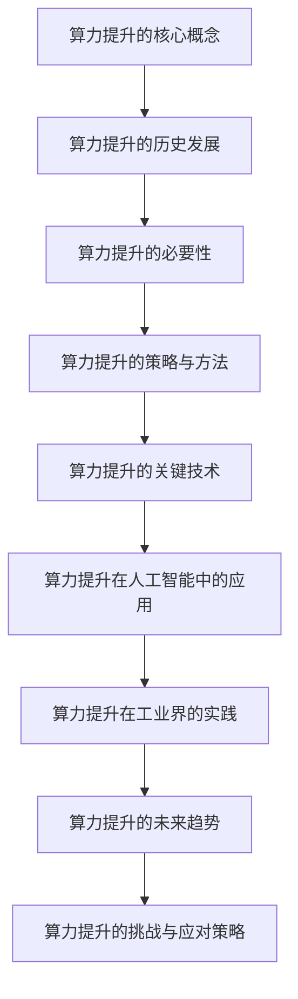

                 

# 算力提升的重要性

> **关键词**：算力、提升、核心技术、应用实践、未来趋势

> **摘要**：本文从背景与意义、关键技术、应用实践和未来趋势四个方面，深入探讨了算力提升的重要性。首先，我们回顾了算力的定义与发展历程，探讨了算力提升的必要性和策略。接着，详细介绍了算力提升的关键技术，如CPU与GPU技术、图计算技术和量子计算技术等。随后，分析了算力提升在人工智能、金融、医疗健康和智能制造等领域的应用实践。最后，展望了算力提升的技术发展趋势及其在行业应用的前景。文章旨在为读者提供全面、深入的算力提升知识，为未来算力发展提供参考。

### 第一部分：算力提升的重要性

#### 第1章：算力提升的背景与意义

#### 1.1 算力的定义与历史发展

##### 1.1.1 算力的基本概念

**算力**，即计算能力，是指计算机系统处理信息和执行计算任务的能力。它通常用每秒处理的指令数（IPS，Instruction Per Second）或者每秒浮点运算次数（FLOPS，Floating Operations Per Second）来衡量。算力的高低直接影响到计算机系统的性能和效率。

##### 1.1.2 算力的发展历程

自计算机问世以来，算力经历了数次革命性的发展。从最初的电子管计算机到晶体管计算机，再到今天的集成电路和人工智能时代，算力不断提高，推动了计算机技术的发展。

1. **电子管时代**（1940s-1950s）：计算机的算力较低，主要依赖于电子管。
2. **晶体管时代**（1950s-1960s）：晶体管的发明标志着计算机进入了一个新的时代，算力有了显著提升。
3. **集成电路时代**（1960s-至今）：集成电路的出现使得计算机体积更小、算力更高。
4. **人工智能时代**（2010s-至今）：随着人工智能技术的发展，算力需求进一步增加，推动了新型计算架构的出现。

##### 1.1.3 算力在现代社会的重要性

随着数字化转型的推进和人工智能的崛起，算力在现代社会的重要性愈发凸显。以下是算力提升的几个关键方面：

1. **数字化转型**：算力的提升为数字化转型提供了基础，促进了大数据、云计算和物联网等技术的发展。
2. **人工智能**：人工智能算法的复杂性和计算需求不断提升，算力成为人工智能发展的关键因素。
3. **经济发展**：算力的提升促进了科技创新，带动了相关产业的发展，成为推动经济增长的重要动力。
4. **国家安全**：算力的提升对于保障国家安全、维护网络空间安全具有重要意义。

#### 1.2 算力提升的必要性

##### 1.2.1 数字化转型的推动

数字化转型已经成为企业发展的必经之路。随着数据量的爆发式增长，数据处理和分析需求日益增加，这对算力提出了更高的要求。算力的提升能够满足数字化转型过程中对数据处理和分析的需求，提升企业的竞争力。

##### 1.2.2 人工智能的崛起

人工智能技术的发展对算力提出了前所未有的需求。深度学习、自然语言处理等人工智能领域的大型模型训练和推理过程需要大量的算力支持。算力的提升能够加速人工智能算法的迭代和应用，推动人工智能技术的发展。

##### 1.2.3 算力不足带来的挑战

1. **性能瓶颈**：算力不足可能导致计算机系统性能瓶颈，影响业务处理效率。
2. **延迟问题**：算力不足可能导致数据处理延迟，影响用户体验。
3. **安全性问题**：算力不足可能导致网络安全防护能力下降，增加网络安全风险。

#### 1.3 算力提升的策略与方法

##### 1.3.1 技术层面的提升

1. **硬件升级**：通过升级硬件设备，如CPU、GPU和存储设备等，提升系统算力。
2. **软件优化**：通过优化操作系统、数据库和应用程序等软件，提升系统性能。
3. **架构改进**：通过改进计算架构，如分布式计算、云计算和边缘计算等，提高计算效率和可扩展性。

##### 1.3.2 产业层面的协同

1. **产业链整合**：整合产业链上下游资源，实现协同发展。
2. **产业联盟**：建立产业联盟，共同推动算力提升技术的研发和应用。
3. **国际合作**：加强国际合作，引进国外先进技术和经验，推动国内算力提升。

##### 1.3.3 政策与投资的支持

1. **政策支持**：政府出台相关政策，支持算力提升技术的研发和应用。
2. **投资引导**：通过投资引导，吸引社会资本投入算力提升领域。
3. **人才培养**：加强人才培养，为算力提升提供人才保障。

#### 第2章：算力提升的关键技术

#### 2.1 CPU与GPU技术

##### 2.1.1 CPU架构的演进

CPU（Central Processing Unit，中央处理器）是计算机系统的核心部件，负责执行计算机程序中的指令。CPU架构的演进是算力提升的重要途径。

1. **冯诺伊曼架构**：早期的计算机系统采用了冯诺伊曼架构，其基本思想是将指令和数据存储在同一存储器中，由CPU依次读取指令和数据。
2. **精简指令集计算机（RISC）**：RISC（Reduced Instruction Set Computing）架构通过简化指令集，提高指令执行速度。
3. **复杂指令集计算机（CISC）**：CISC（Complex Instruction Set Computing）架构通过增加指令集的复杂度，提高处理能力。
4. **多核处理器**：现代CPU采用了多核架构，通过增加核心数量，提高并行处理能力。

##### 2.1.2 GPU技术的应用

GPU（Graphics Processing Unit，图形处理器）最初用于图形渲染，但随着深度学习等计算密集型任务的需求增长，GPU在计算领域也得到了广泛应用。

1. **并行计算能力**：GPU具有高度并行的计算能力，适合处理大规模并行计算任务。
2. **浮点运算性能**：GPU的浮点运算性能远超CPU，适合处理大规模矩阵运算。
3. **深度学习应用**：GPU在深度学习领域具有广泛的应用，如卷积神经网络（CNN）和循环神经网络（RNN）等。

##### 2.1.3 CPU与GPU的优劣分析

CPU与GPU各有优劣，适用于不同的应用场景。

1. **CPU**：
   - 优势：通用性强，适用于各种类型的计算任务。
   - 劣势：并行计算能力较弱，浮点运算性能较低。
2. **GPU**：
   - 优势：并行计算能力强，浮点运算性能高，适合处理大规模并行计算任务。
   - 劣势：通用性较差，不适合处理单一计算任务。

#### 2.2 图计算技术

##### 2.2.1 图计算的基本概念

图计算是一种基于图的计算方法，用于处理复杂数据关系和网络结构。图由节点（Node）和边（Edge）组成，节点表示实体，边表示实体之间的关系。

1. **图的表示**：图可以通过邻接矩阵、邻接表等数据结构进行表示。
2. **图的算法**：图计算涉及多种算法，如图遍历、最短路径、聚类和社区发现等。

##### 2.2.2 图计算的应用场景

图计算在多个领域具有广泛应用：

1. **社交网络分析**：通过图计算分析社交网络中的关系，了解用户行为和社交关系。
2. **推荐系统**：利用图计算技术分析用户行为和物品关系，实现个性化推荐。
3. **知识图谱**：构建知识图谱，用于语义搜索、问答系统和智能推理。
4. **生物信息学**：分析生物网络，研究基因调控和蛋白质相互作用。

##### 2.2.3 图计算的核心算法

图计算涉及多种核心算法：

1. **图遍历算法**：如BFS（广度优先搜索）和DFS（深度优先搜索），用于遍历图。
2. **最短路径算法**：如Dijkstra算法和Floyd算法，用于计算图中的最短路径。
3. **聚类算法**：如K-Means、DBSCAN和谱聚类等，用于将图中的节点划分为不同的集群。
4. **社区发现算法**：如Louvain算法和标签传播算法，用于发现图中的社区结构。

#### 2.3 量子计算技术

##### 2.3.1 量子计算的基本原理

量子计算是一种基于量子力学原理的计算方法。与传统计算不同，量子计算利用量子比特（Qubit）进行信息存储和处理。

1. **量子比特**：量子比特是量子计算的基本单元，可以处于0、1叠加态。
2. **量子叠加**：量子比特可以同时处于多种状态，实现了并行计算能力。
3. **量子纠缠**：量子比特之间可以发生纠缠，使得多个量子比特之间的状态相互关联。

##### 2.3.2 量子计算的优势

量子计算具有以下优势：

1. **并行计算能力**：量子计算可以实现大规模并行计算，显著提高计算速度。
2. **高效算法**：量子计算可以解决某些传统计算难以解决的问题，如大整数分解和量子搜索等。
3. **高精度**：量子计算具有高精度，可以实现精确的数学运算。

##### 2.3.3 量子计算的挑战

量子计算面临以下挑战：

1. **量子态的脆弱性**：量子计算中的量子态容易受到外部干扰，导致计算结果错误。
2. **错误纠正**：量子计算中的错误纠正问题尚未得到有效解决。
3. **量子计算硬件**：当前量子计算硬件尚未完全成熟，需要进一步发展和优化。

#### 2.4 软硬件协同优化

##### 2.4.1 软硬件协同的基本概念

软硬件协同优化是指通过优化软件和硬件之间的配合，提高系统整体性能。软硬件协同优化包括以下几个方面：

1. **编译优化**：通过优化编译器，生成更高效的机器代码。
2. **硬件加速**：利用GPU、FPGA等硬件加速技术，提高计算速度。
3. **内存优化**：通过优化内存管理，减少内存访问时间。
4. **网络优化**：通过优化网络协议和算法，提高数据传输速度。

##### 2.4.2 软硬件协同的优化方法

软硬件协同优化方法包括：

1. **任务调度**：通过合理的任务调度，实现CPU和GPU等硬件资源的有效利用。
2. **内存映射**：通过优化内存映射，提高数据访问速度。
3. **并行计算**：通过并行计算，实现任务并行执行，提高计算速度。
4. **算法优化**：通过优化算法，降低计算复杂度，提高计算效率。

##### 2.4.3 软硬件协同的实践案例

软硬件协同优化在多个领域取得了显著成果：

1. **大数据处理**：通过软硬件协同优化，实现了大数据处理性能的显著提升。
2. **深度学习**：通过软硬件协同优化，实现了深度学习模型训练速度的加快。
3. **云计算**：通过软硬件协同优化，提高了云计算平台的性能和可靠性。

#### 第3章：算力提升在人工智能中的应用

#### 3.1 算力提升对人工智能的影响

##### 3.1.1 大模型训练的需求

随着人工智能技术的发展，深度学习等大模型的应用越来越广泛。大模型训练对算力提出了更高的需求：

1. **计算资源需求**：大模型训练需要大量的计算资源，特别是GPU和TPU等高性能计算设备。
2. **存储需求**：大模型训练需要存储大量的数据和参数，对存储容量和速度提出了更高要求。
3. **时间需求**：大模型训练时间较长，需要优化算法和硬件性能，提高训练效率。

##### 3.1.2 模型压缩与加速

为了应对大模型训练的算力需求，模型压缩与加速技术应运而生。模型压缩与加速技术包括以下几个方面：

1. **模型剪枝**：通过剪枝冗余神经元和权重，减少模型参数，降低模型大小。
2. **量化**：通过将模型中的浮点数转换为整数，降低模型计算复杂度和存储需求。
3. **并行计算**：通过并行计算，提高模型训练速度。
4. **硬件加速**：通过利用GPU、TPU等硬件加速技术，提高模型训练速度。

##### 3.1.3 算力提升对AI应用的促进作用

算力提升对人工智能应用的促进作用主要体现在以下几个方面：

1. **提高准确性**：算力提升使得大模型训练更加高效，提高了模型准确性。
2. **拓展应用领域**：算力提升使得人工智能技术能够应用于更多领域，如医疗、金融和工业等。
3. **提升用户体验**：算力提升使得人工智能应用能够提供更快速、更准确的响应，提升用户体验。

#### 3.2 算力提升在深度学习中的应用

##### 3.2.1 深度学习的算力需求

深度学习是一种基于多层神经网络的人工智能技术，对算力有较高需求：

1. **大量数据**：深度学习需要大量数据来训练模型，对数据存储和传输提出了更高要求。
2. **大量计算**：深度学习模型包含大量参数和神经元，需要进行大规模矩阵运算，对计算资源有较高需求。
3. **长时间训练**：深度学习模型训练时间较长，需要优化算法和硬件性能，提高训练效率。

##### 3.2.2 深度学习优化算法

为了满足深度学习的算力需求，研究人员提出了多种优化算法：

1. **批量归一化**：通过批量归一化，加速梯度下降，提高模型训练速度。
2. **自适应优化器**：如Adam、Adagrad和RMSprop等，通过自适应调整学习率，提高模型训练效果。
3. **稀疏训练**：通过稀疏训练，降低模型参数的存储和计算需求。
4. **迁移学习**：通过迁移学习，利用预训练模型，提高模型训练速度和准确性。

##### 3.2.3 算力提升对深度学习应用的改进

算力提升对深度学习应用的改进主要体现在以下几个方面：

1. **提高准确性**：算力提升使得大模型训练更加高效，提高了模型准确性。
2. **缩短训练时间**：算力提升提高了模型训练速度，缩短了训练时间。
3. **拓展应用领域**：算力提升使得深度学习技术能够应用于更多领域，如医疗、金融和工业等。

#### 3.3 算力提升在自然语言处理中的应用

##### 3.3.1 NLP的算力需求

自然语言处理（NLP，Natural Language Processing）是人工智能领域的一个重要分支，对算力有较高需求：

1. **大规模数据**：NLP需要处理大量文本数据，对数据存储和传输提出了更高要求。
2. **复杂模型**：NLP模型通常包含大量参数和神经网络层，需要进行大规模矩阵运算，对计算资源有较高需求。
3. **实时处理**：NLP应用需要实时处理文本数据，对处理速度和准确性提出了更高要求。

##### 3.3.2 NLP的核心算法

NLP的核心算法包括以下几个方面：

1. **词嵌入**：通过将词汇映射到高维空间，实现词汇的语义表示。
2. **序列标注**：对文本中的词汇进行分类和标注，如命名实体识别（NER）和词性标注等。
3. **文本分类**：对文本进行分类，如情感分析、主题分类等。
4. **文本生成**：通过生成模型，如生成对抗网络（GAN）和变分自编码器（VAE），实现文本生成。

##### 3.3.3 算力提升对NLP应用的推动作用

算力提升对NLP应用的推动作用主要体现在以下几个方面：

1. **提高准确性**：算力提升使得大模型训练更加高效，提高了模型准确性。
2. **拓展应用领域**：算力提升使得NLP技术能够应用于更多领域，如智能客服、智能推荐和智能写作等。
3. **提升用户体验**：算力提升使得NLP应用能够提供更快速、更准确的响应，提升用户体验。

#### 第4章：算力提升在工业界的实践

#### 4.1 算力提升在金融行业的应用

##### 4.1.1 金融行业对算力的需求

金融行业是一个数据密集型行业，对算力有较高需求：

1. **数据分析和挖掘**：金融行业需要对大量金融数据进行深入分析和挖掘，以发现投资机会和风险管理。
2. **高频交易**：高频交易需要快速处理海量数据，对计算速度和延迟有严格要求。
3. **风险建模**：金融行业需要构建复杂的风险模型，对计算资源有较高需求。

##### 4.1.2 算力提升在金融风控中的应用

算力提升在金融风控中的应用主要体现在以下几个方面：

1. **反欺诈检测**：通过构建深度学习模型，快速检测和防范金融欺诈行为。
2. **信用评分**：通过大数据分析和挖掘，构建信用评分模型，提高信用评估准确性。
3. **市场预测**：通过分析历史数据和市场动态，预测市场走势，为投资决策提供支持。

##### 4.1.3 算力提升在金融量化交易中的应用

算力提升在金融量化交易中的应用主要体现在以下几个方面：

1. **算法交易**：通过构建量化交易策略，实现自动化交易。
2. **高频交易**：通过高性能计算和低延迟网络，实现高频交易策略。
3. **大数据分析**：通过分析大量市场数据，发现交易机会和风险点。

#### 4.2 算力提升在医疗健康领域的应用

##### 4.2.1 医疗行业对算力的需求

医疗健康行业是一个数据密集型行业，对算力有较高需求：

1. **医学影像分析**：通过对医学影像进行分析，诊断疾病，对计算资源有较高需求。
2. **基因组数据分析**：通过对基因组数据进行分析，研究基因与疾病的关系，对计算资源有较高需求。
3. **患者管理**：通过对患者数据进行管理，提高医疗质量和服务水平，对计算资源有较高需求。

##### 4.2.2 算力提升在医学影像分析中的应用

算力提升在医学影像分析中的应用主要体现在以下几个方面：

1. **疾病诊断**：通过深度学习模型，对医学影像进行分析，提高疾病诊断准确性。
2. **影像分割**：通过对医学影像进行分割，提取感兴趣区域，提高诊断效率。
3. **影像增强**：通过对医学影像进行增强，提高影像质量，改善诊断效果。

##### 4.2.3 算力提升在疾病预测与预防中的应用

算力提升在疾病预测与预防中的应用主要体现在以下几个方面：

1. **早期筛查**：通过对患者数据进行分析，实现疾病的早期筛查和预防。
2. **个性化治疗**：通过对患者数据进行分析，制定个性化的治疗方案。
3. **健康监测**：通过对健康数据进行分析，实现健康状态的监测和预警。

#### 4.3 算力提升在智能制造领域的应用

##### 4.3.1 智能制造对算力的需求

智能制造是制造业发展的新趋势，对算力有较高需求：

1. **数据处理**：智能制造需要对大量生产数据进行处理和分析，对计算资源有较高需求。
2. **实时监控**：智能制造需要对生产过程进行实时监控和调整，对计算速度和延迟有严格要求。
3. **预测性维护**：智能制造需要通过数据分析实现预测性维护，减少设备故障。

##### 4.3.2 算力提升在工业机器人中的应用

算力提升在工业机器人中的应用主要体现在以下几个方面：

1. **路径规划**：通过算法优化，提高机器人路径规划的效率和准确性。
2. **任务调度**：通过算法优化，提高机器人任务的调度效率和响应速度。
3. **人机协作**：通过算法优化，实现机器人和人类的协同工作，提高生产效率。

##### 4.3.3 算力提升在智能工厂管理中的应用

算力提升在智能工厂管理中的应用主要体现在以下几个方面：

1. **生产优化**：通过对生产数据进行分析，优化生产流程，提高生产效率。
2. **供应链管理**：通过对供应链数据进行分析，优化供应链管理，提高供应链效率。
3. **设备维护**：通过对设备数据进行分析，实现预测性维护，减少设备故障。

#### 第5章：算力提升的未来趋势

#### 5.1 算力提升的技术发展趋势

##### 5.1.1 新一代计算硬件的发展

随着计算需求的不断增长，新一代计算硬件的发展成为算力提升的关键。以下是一些新一代计算硬件的发展趋势：

1. **量子计算**：量子计算具有并行计算和高精度计算的优势，有望成为下一代计算硬件。
2. **光计算**：光计算利用光的特性，实现高速、低延迟的计算，有望在数据密集型应用中发挥重要作用。
3. **神经形态计算**：神经形态计算模拟人脑的计算方式，实现高效能、低功耗的计算。

##### 5.1.2 软硬件协同优化的发展

软硬件协同优化是提高系统性能的重要手段。以下是一些软硬件协同优化的发展趋势：

1. **异构计算**：通过将计算任务分配到不同类型的硬件上，实现计算资源的最大化利用。
2. **边缘计算**：通过在边缘设备上进行计算，减少数据传输延迟，提高系统响应速度。
3. **云计算与边缘计算的融合**：通过云计算和边缘计算的协同优化，实现计算资源的灵活调度和高效利用。

##### 5.1.3 量子计算的发展

量子计算是一种基于量子力学原理的计算方法，具有巨大的计算潜力。以下是一些量子计算的发展趋势：

1. **量子比特数量增加**：通过增加量子比特的数量，提高量子计算的并行计算能力。
2. **量子纠错技术**：通过量子纠错技术，提高量子计算的可靠性和稳定性。
3. **量子应用开发**：通过量子应用开发，探索量子计算在各个领域的应用潜力。

#### 5.2 算力提升在行业应用的前景

##### 5.2.1 算力提升在新兴行业的应用前景

随着科技的发展，新兴行业对算力的需求不断增加。以下是一些新兴行业的应用前景：

1. **生物科技**：通过算力提升，实现基因编辑、药物研发等生物科技领域的突破。
2. **金融科技**：通过算力提升，实现智能投顾、智能风控等金融科技领域的创新。
3. **能源科技**：通过算力提升，实现智能电网、能源管理等方面的优化。

##### 5.2.2 算力提升对传统行业升级的影响

算力提升对传统行业的升级具有重要意义。以下是一些传统行业的升级方向：

1. **制造业**：通过算力提升，实现智能制造、工业互联网等领域的升级。
2. **医疗行业**：通过算力提升，实现智能医疗、远程医疗等领域的升级。
3. **农业**：通过算力提升，实现智能农业、精准农业等领域的升级。

##### 5.2.3 算力提升对全球产业链的变革

算力提升对全球产业链产生了深远的影响。以下是一些影响：

1. **产业链重构**：算力提升推动了产业链的重组和重构，改变了产业链的竞争格局。
2. **供应链优化**：通过算力提升，实现供应链的优化和管理，提高供应链效率。
3. **产业协同**：通过算力提升，实现产业链上下游企业的协同发展，提高产业链整体竞争力。

#### 第6章：算力提升的政策与产业环境

#### 6.1 国家政策对算力提升的推动作用

国家政策对算力提升具有重要的推动作用。以下是一些国家政策的例子：

1. **我国“新一代人工智能发展规划”**：我国发布了“新一代人工智能发展规划”，明确了人工智能发展的目标和路径，推动了算力提升技术的发展。
2. **美国“先进计算战略”**：美国发布了“先进计算战略”，通过投入大量资金和资源，推动算力提升技术的研发和应用。
3. **欧洲“数字战略”**：欧洲发布了“数字战略”，通过加强数字基础设施建设，推动算力提升技术的发展。

##### 6.1.2 世界各国算力提升政策的比较分析

世界各国的算力提升政策各有特点，以下是一些比较分析：

1. **资金投入**：美国和我国在算力提升领域的资金投入较大，其他国家的投入相对较少。
2. **研发重点**：美国和我国在量子计算、光计算等前沿技术领域投入较多，其他国家的研发重点有所不同。
3. **国际合作**：我国在算力提升领域加强了国际合作，与其他国家共同推动技术发展。

##### 6.1.3 政策环境对算力提升的影响

政策环境对算力提升具有重要影响。以下是一些影响：

1. **产业政策**：产业政策对算力提升技术的研发和应用提供了支持，促进了产业链的发展。
2. **税收政策**：税收政策对算力提升企业的研发投入提供了优惠，降低了企业成本。
3. **人才政策**：人才政策对算力提升领域的人才培养和引进提供了支持，提高了人才素质。

#### 6.2 产业环境对算力提升的支持

产业环境对算力提升也具有重要的支持作用。以下是一些产业环境的支持：

1. **产业链构建**：通过构建完整的产业链，实现算力提升技术的研发、生产和应用。
2. **产业联盟**：通过建立产业联盟，实现产业链上下游企业的协同发展，提高产业竞争力。
3. **国际合作**：通过国际合作，引进国外先进技术和经验，推动国内算力提升技术的发展。

##### 6.2.1 算力产业链的构建

算力产业链包括硬件、软件、算法和生态系统等多个环节。以下是一些关键环节：

1. **硬件环节**：包括CPU、GPU、FPGA、量子计算机等硬件的研发和生产。
2. **软件环节**：包括操作系统、数据库、编译器等软件的研发和应用。
3. **算法环节**：包括深度学习、图计算、量子计算等算法的研发和应用。
4. **生态系统**：包括开发工具、平台、应用场景等生态系统的构建。

##### 6.2.2 产业联盟与合作

产业联盟与合作对算力提升具有重要的推动作用。以下是一些产业联盟的例子：

1. **我国新一代人工智能产业联盟**：我国新一代人工智能产业联盟是由多家企业和研究机构组成的联盟，致力于推动人工智能技术的发展和应用。
2. **欧洲量子技术联盟**：欧洲量子技术联盟是由多家欧洲国家和机构组成的联盟，致力于推动量子技术的发展和应用。
3. **全球区块链联盟**：全球区块链联盟是由多家区块链企业和研究机构组成的联盟，致力于推动区块链技术的发展和应用。

##### 6.2.3 产业环境对算力提升的促进作用

产业环境对算力提升的促进作用主要体现在以下几个方面：

1. **技术创新**：产业环境为算力提升技术提供了技术创新的土壤，推动了技术进步。
2. **人才培养**：产业环境为算力提升领域的人才提供了良好的培养和发展环境，提高了人才素质。
3. **市场应用**：产业环境为算力提升技术提供了广阔的市场应用场景，推动了技术的商业化进程。

### 第7章：算力提升的挑战与应对策略

#### 7.1 算力提升面临的挑战

随着算力提升技术的发展，也面临一些挑战。以下是一些主要挑战：

1. **技术挑战**：包括量子计算硬件的稳定性和可靠性、深度学习算法的优化和鲁棒性等。
2. **经济挑战**：包括算力提升技术的研发成本、设备和维护成本等。
3. **社会挑战**：包括算力提升技术带来的隐私和安全问题、就业结构变化等。

##### 7.1.1 技术挑战

技术挑战是算力提升面临的主要挑战之一。以下是一些具体的技术挑战：

1. **量子计算硬件**：量子计算硬件的稳定性和可靠性是目前面临的主要问题。量子比特的脆弱性和噪声问题需要解决，以提高量子计算的准确性和可靠性。
2. **深度学习算法**：深度学习算法的优化和鲁棒性是一个长期挑战。如何提高模型的可解释性和适应性，降低过拟合现象，是当前研究的热点。
3. **软硬件协同**：软硬件协同优化是实现高效计算的关键。如何充分利用硬件资源，优化软件性能，是一个需要持续研究和优化的领域。

##### 7.1.2 经济挑战

经济挑战也是算力提升面临的一个重要方面。以下是一些具体的经济挑战：

1. **研发成本**：算力提升技术的研发需要大量资金投入，包括硬件研发、软件开发和算法研究等。对于中小企业来说，资金压力较大。
2. **设备和维护成本**：高性能计算设备和相关维护费用较高，对企业和政府来说是一笔不小的开支。
3. **人才培养和引进**：算力提升领域需要大量高素质人才，但人才培养和引进成本较高，特别是高端人才。

##### 7.1.3 社会挑战

算力提升技术也会带来一些社会挑战。以下是一些具体的社会挑战：

1. **隐私和安全**：随着数据量的增加和计算能力的提升，隐私和安全问题日益凸显。如何保护个人隐私和数据安全，是算力提升技术需要解决的问题。
2. **就业结构变化**：算力提升技术可能会改变就业结构，对某些行业和岗位产生冲击。如何应对就业结构变化，减少社会不公，是政府和社会需要关注的问题。
3. **伦理和法律**：算力提升技术涉及到伦理和法律问题，如何制定合理的法律法规，保护技术发展和公众利益，是一个需要平衡的问题。

#### 7.2 应对策略与解决方案

为了应对算力提升面临的挑战，需要采取一系列策略和解决方案。以下是一些具体的应对策略：

##### 7.2.1 技术创新策略

技术创新是解决算力提升技术挑战的关键。以下是一些技术创新策略：

1. **量子计算**：加大对量子计算硬件的研发投入，提高量子比特的稳定性和可靠性。同时，开发新的量子算法，提高量子计算的效率和适用性。
2. **深度学习**：持续优化深度学习算法，提高模型的鲁棒性和可解释性。同时，探索新的深度学习架构和优化方法，提高模型性能。
3. **软硬件协同**：加强软硬件协同优化研究，开发高效的编译器和编程模型。同时，优化硬件设计，提高硬件性能和能效比。

##### 7.2.2 经济发展策略

经济发展策略旨在降低算力提升技术的经济成本。以下是一些经济发展策略：

1. **政府支持**：政府可以通过财政补贴、税收优惠等政策，支持算力提升技术的研发和应用。同时，加大对中小企业和创新创业的支持力度，降低他们的研发成本。
2. **产业合作**：鼓励企业、高校和研究机构之间的合作，实现资源共享和优势互补。通过产业链上下游企业的合作，降低整体成本，提高竞争力。
3. **国际合作**：积极参与国际合作，引进国外先进技术和经验。通过国际合作，提高自身技术水平和产业竞争力。

##### 7.2.3 社会发展策略

社会发展策略旨在缓解算力提升技术带来的社会挑战。以下是一些社会发展策略：

1. **数据隐私和安全**：制定严格的数据隐私和安全法律法规，保护个人隐私和数据安全。同时，加强技术手段，提高数据安全和隐私保护能力。
2. **就业培训和再就业**：加强对就业人员的培训，提高他们的技能和适应能力。同时，制定再就业政策，帮助失业人员重新就业，减少社会不公。
3. **伦理和法律**：建立健全的伦理和法律框架，规范算力提升技术的研发和应用。同时，加强对技术滥用和不当行为的监管，保护公众利益。

### 第8章：案例分析

#### 8.1 算力提升在典型行业的案例分析

##### 8.1.1 案例一：金融行业

金融行业是算力提升技术的重要应用领域。以下是一个金融行业的案例分析：

1. **背景**：某大型金融机构在金融风控领域面临着数据量庞大、模型复杂等问题。
2. **解决方案**：
   - **硬件升级**：采用高性能GPU和TPU，提高计算速度和效率。
   - **模型优化**：采用模型压缩和量化技术，降低模型大小和计算复杂度。
   - **软硬件协同**：优化操作系统和数据库，提高数据处理速度和存储效率。
3. **效果**：通过算力提升技术的应用，该金融机构的风控模型准确性显著提高，风险控制能力得到了有效提升。

##### 8.1.2 案例二：医疗健康领域

医疗健康领域也是算力提升技术的重要应用领域。以下是一个医疗健康领域的案例分析：

1. **背景**：某医疗机构在医学影像分析领域面临着计算资源不足、诊断准确性低等问题。
2. **解决方案**：
   - **硬件升级**：采用高性能GPU和TPU，提高计算速度和效率。
   - **算法优化**：采用深度学习算法，提高医学影像分析的准确性和效率。
   - **云计算与边缘计算**：利用云计算和边缘计算，实现远程医学影像分析和实时诊断。
3. **效果**：通过算力提升技术的应用，该医疗机构的医学影像分析准确性显著提高，诊断效率得到了大幅提升，为患者提供了更好的医疗服务。

##### 8.1.3 案例三：智能制造领域

智能制造领域也是算力提升技术的重要应用领域。以下是一个智能制造领域的案例分析：

1. **背景**：某制造企业在生产优化和设备维护领域面临着数据处理速度慢、预测准确性低等问题。
2. **解决方案**：
   - **硬件升级**：采用高性能GPU和TPU，提高数据处理速度和效率。
   - **算法优化**：采用深度学习算法，提高生产优化和设备维护的预测准确性。
   - **边缘计算**：利用边缘计算，实现实时数据处理和设备监控。
3. **效果**：通过算力提升技术的应用，该制造企业的生产效率显著提高，设备故障率降低，生产成本得到有效控制。

#### 8.2 算力提升在不同应用场景的案例分析

##### 8.2.1 案例一：人工智能算法优化

人工智能算法优化是一个典型的算力提升应用场景。以下是一个人工智能算法优化的案例分析：

1. **背景**：某人工智能企业在算法优化方面面临着计算资源不足、模型训练时间过长等问题。
2. **解决方案**：
   - **硬件升级**：采用高性能GPU和TPU，提高计算速度和效率。
   - **模型优化**：采用模型压缩和量化技术，降低模型大小和计算复杂度。
   - **分布式计算**：利用分布式计算技术，实现并行模型训练。
3. **效果**：通过算力提升技术的应用，该企业的人工智能算法训练时间显著缩短，计算效率得到大幅提升，为企业节省了大量计算资源和成本。

##### 8.2.2 案例二：大数据处理性能提升

大数据处理性能提升是另一个典型的算力提升应用场景。以下是一个大数据处理性能提升的案例分析：

1. **背景**：某大数据企业在数据处理和分析方面面临着计算速度慢、响应时间长等问题。
2. **解决方案**：
   - **硬件升级**：采用高性能GPU和TPU，提高计算速度和效率。
   - **算法优化**：采用分布式数据处理算法，提高数据处理速度。
   - **软硬件协同**：优化操作系统和数据库，提高数据处理速度和存储效率。
3. **效果**：通过算力提升技术的应用，该企业的大数据处理性能显著提升，数据处理速度加快，响应时间缩短，为企业提供了更高效的数据分析服务。

##### 8.2.3 案例三：边缘计算与云计算的结合应用

边缘计算与云计算的结合应用是一个典型的算力提升应用场景。以下是一个边缘计算与云计算结合应用的案例分析：

1. **背景**：某智能工厂在数据处理和分析方面面临着数据传输延迟大、计算资源不足等问题。
2. **解决方案**：
   - **硬件升级**：采用高性能边缘计算设备和云计算资源，提高计算速度和效率。
   - **边缘计算**：在边缘设备上进行数据处理和分析，减少数据传输延迟。
   - **云计算**：利用云计算资源进行大规模数据处理和分析。
3. **效果**：通过算力提升技术的应用，该智能工厂的数据处理速度显著提升，数据传输延迟减少，计算资源得到有效利用，为企业提供了更高效的生产管理服务。

### 第9章：结论与展望

#### 9.1 算力提升的重要性总结

算力提升在当今数字化时代具有重要意义。以下是对算力提升重要性的总结：

1. **推动技术创新**：算力提升推动了计算机技术的不断发展，为科技创新提供了强大的支持。
2. **提高生产效率**：算力提升提高了数据处理和分析速度，促进了各行各业的数字化转型和智能化升级。
3. **促进经济发展**：算力提升带动了相关产业链的发展，成为推动经济增长的重要动力。
4. **保障国家安全**：算力提升对于保障国家安全、维护网络空间安全具有重要意义。

#### 9.1.1 算力提升的核心价值

算力提升的核心价值体现在以下几个方面：

1. **计算能力提升**：通过算力提升，计算能力得到大幅提升，为各种复杂计算任务提供了强大的支持。
2. **数据处理效率提升**：算力提升提高了数据处理和分析速度，使得大数据分析、人工智能等应用更加高效。
3. **创新能力提升**：算力提升为创新提供了强大的支持，推动了新技术、新业务的快速发展。

#### 9.1.2 算力提升的未来发展趋势

随着科技的不断进步，算力提升的未来发展趋势如下：

1. **量子计算发展**：量子计算作为一种新型计算方法，具有巨大的计算潜力。未来，量子计算将在各行各业得到广泛应用。
2. **软硬件协同优化**：软硬件协同优化是实现高效计算的关键。未来，软硬件协同优化技术将不断改进，提高系统整体性能。
3. **边缘计算与云计算结合**：边缘计算与云计算的结合将使得数据处理和分析更加高效、实时，为智能制造、智慧城市等领域提供强大支持。

#### 9.2 未来展望

随着算力提升技术的不断发展，未来将会有更多的创新应用和突破。以下是对未来展望：

1. **智能化社会**：算力提升将推动社会向智能化方向发展，带来更加便捷、高效的生活方式。
2. **数字经济发展**：算力提升将推动数字经济的发展，为各行各业提供新的发展机遇。
3. **全球产业变革**：算力提升将引发全球产业链的变革，改变全球竞争格局。
4. **人类生活品质提升**：算力提升将提高人类生活品质，为人类带来更多的幸福和满足。

### 附加内容：算力提升的 Mermaid 流程图与伪代码示例

以下是一个关于算力提升的 Mermaid 流程图示例：



以下是一个深度学习优化算法的伪代码示例：

```python
# 伪代码：深度学习优化算法示例

def optimize_model(model, loss_function, optimizer):
    # 初始化模型参数
    model_parameters = model.parameters()

    # 开始优化过程
    for epoch in range(num_epochs):
        for data in data_loader:
            # 前向传播
            predictions = model(data)

            # 计算损失
            loss = loss_function(predictions, target)

            # 反向传播
            optimizer.zero_grad()
            loss.backward()
            optimizer.step()

        # 打印当前epoch的损失值
        print(f"Epoch {epoch}: Loss = {loss.item()}")
```

以下是一个数学模型的公式示例：

$$
L(\theta) = -\frac{1}{m} \sum_{i=1}^{m} y_i \log(p(\hat{y}_i | \theta))
$$

其中，$L(\theta)$ 是损失函数，$m$ 是样本数量，$y_i$ 是真实标签，$\hat{y}_i$ 是预测标签，$p(\hat{y}_i | \theta)$ 是模型在给定参数 $\theta$ 下对 $\hat{y}_i$ 的预测概率。

### 作者信息

作者：AI天才研究院/AI Genius Institute & 禅与计算机程序设计艺术 /Zen And The Art of Computer Programming

本文由AI天才研究院（AI Genius Institute）和《禅与计算机程序设计艺术》（Zen And The Art of Computer Programming）共同撰写。AI天才研究院致力于推动人工智能技术的发展和应用，为人类创造更美好的未来。《禅与计算机程序设计艺术》是一本经典的人工智能书籍，阐述了计算机程序设计中的哲学和智慧。通过本文，我们希望为读者提供关于算力提升的全面、深入的知识，为未来的科技发展提供参考。|user|

