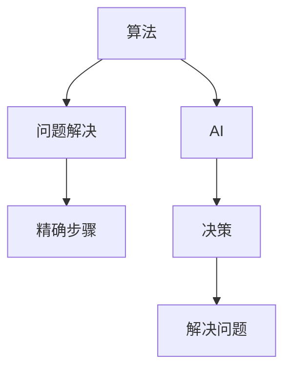
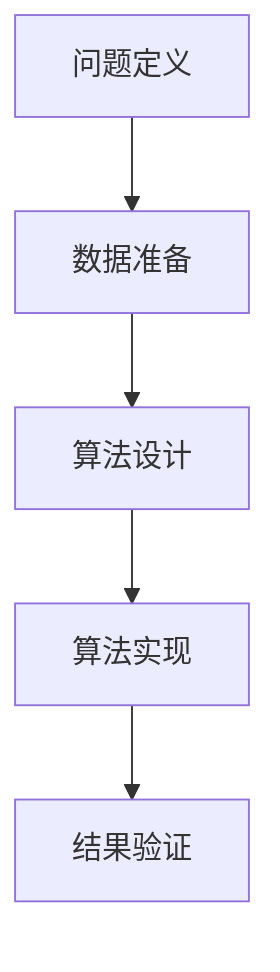
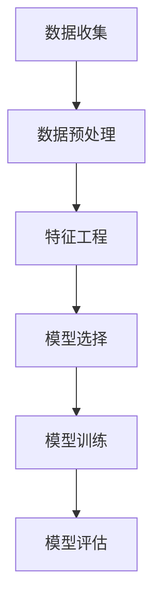
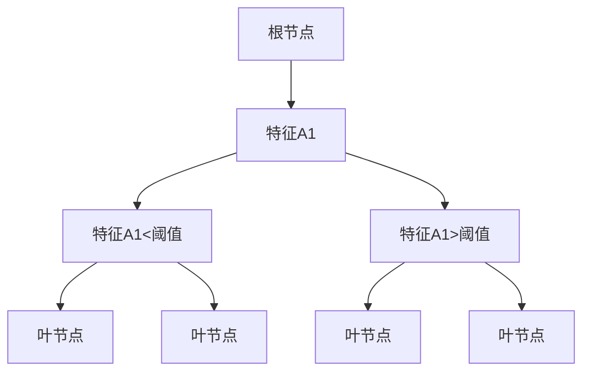
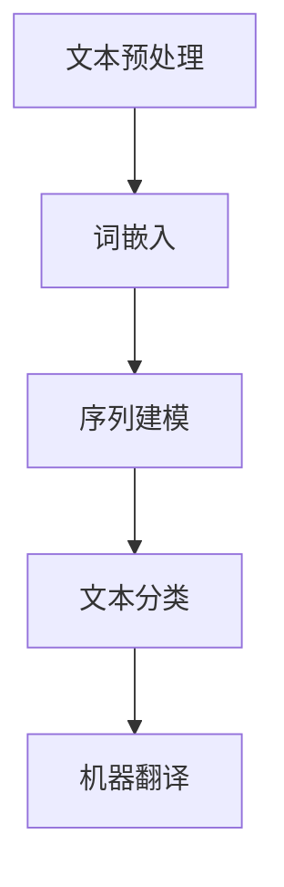
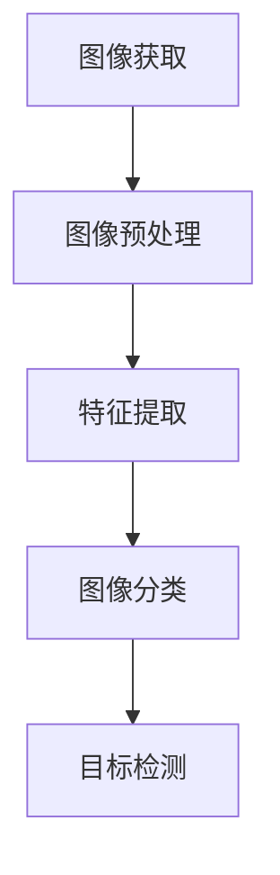
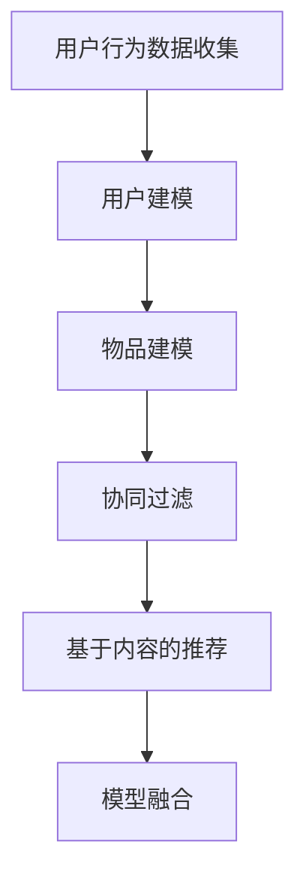

                 

# 算法与AI发展的未来

## 关键词
算法、人工智能、机器学习、深度学习、自然语言处理、图像处理、推荐系统、未来趋势

## 摘要
本文将深入探讨算法与人工智能（AI）的发展历程、核心原理和应用。通过逻辑清晰、结构紧凑的分析，本文旨在揭示算法在AI中的关键作用，以及AI在各行各业的广泛应用。同时，本文还将展望算法与AI未来的发展趋势，探讨面临的挑战与应对策略。让我们一同走进这个充满创新与变革的技术世界。

### 第一部分: 算法与AI发展的未来基础

#### 第1章: 算法与AI概述

##### 1.1 算法与AI的定义与联系

算法是一种问题解决的精确步骤集合。在计算科学领域，算法是一种在有限步骤内解决问题的方法。而人工智能（AI）则是计算机科学的一个分支，旨在使计算机系统能够执行通常需要人类智能的任务。

算法与AI的联系体现在以下几个方面：

- **算法是实现AI的工具**：AI系统依赖算法来进行决策和解决问题。例如，机器学习中的算法用于训练模型，深度学习中的算法用于图像和语音处理。
- **AI推动了算法的创新**：AI的发展促使算法在性能、效率和适用性方面不断进步。例如，深度学习算法的进步使得计算机在图像和语音识别方面取得了突破性进展。

以下是一个Mermaid流程图，展示了算法与AI之间的联系：



#### 1.2 AI技术的发展历程

##### 1.2.1 早期AI与规则系统

早期的AI系统主要依赖于预定义的规则进行问题解决。例如，专家系统是一种典型的早期AI应用，通过将领域专家的知识转换为规则，使得计算机能够模拟人类专家的决策过程。然而，这种基于规则的系统存在一些局限性：

- **规则系统难以处理复杂问题和变化多端的环境**：当面对复杂且多变的问题时，规则系统的表现往往不佳。
- **知识表示困难**：将人类专家的知识转化为规则是一项费时费力且难以准确表达的任务。

##### 1.2.2 机器学习与深度学习

机器学习（Machine Learning，ML）是通过数据训练模型，使计算机具备学习能力的一种方法。机器学习模型可以根据输入数据自动调整其参数，从而在新数据上做出准确的预测。深度学习（Deep Learning，DL）则是机器学习的一个分支，基于多层神经网络的结构，在图像、语音和文本处理方面取得了突破性进展。

深度学习的发展得益于以下几个关键因素：

- **计算能力的提升**：随着计算能力的不断提升，深度学习模型可以处理更大规模的数据和更复杂的任务。
- **大数据的普及**：互联网和传感器技术的进步，使得大量结构化和非结构化数据可以被收集和利用。
- **算法的优化**：深度学习算法的不断优化，使得模型在训练效率和预测准确性方面得到了显著提升。

##### 1.2.3 AI的当前发展趋势

当前的AI技术正朝着以下几个方向发展：

- **强化学习（Reinforcement Learning）**：通过不断尝试和奖励机制，使AI系统能够自主学习和优化策略。强化学习在游戏、自动驾驶等领域取得了显著成果。
- **自然语言处理（Natural Language Processing，NLP）**：AI与自然语言处理的融合，使得计算机能够理解和生成人类语言。NLP在机器翻译、文本分类、问答系统等领域具有广泛的应用。
- **计算机视觉（Computer Vision）**：通过深度学习算法，计算机能够理解和解析图像和视频数据。计算机视觉在自动驾驶、安防监控、医疗诊断等领域具有重要意义。

#### 1.3 AI与算法的核心应用领域

##### 1.3.1 人工智能在医疗领域的应用

AI在医疗领域的应用具有深远的影响，以下是一些关键的应用领域：

- **疾病预测**：利用AI进行大数据分析，预测疾病风险。例如，通过分析患者的病历数据，可以预测哪些患者可能患有心脏病或糖尿病。
- **个性化治疗**：基于患者数据，提供个性化治疗方案。例如，通过分析患者的基因数据和疾病表现，可以制定个性化的治疗计划。
- **医学影像分析**：利用AI算法对医学影像进行自动分析，提高诊断的准确性和效率。例如，通过深度学习算法，可以自动识别X光片上的骨折或肿瘤。

##### 1.3.2 AI在自动驾驶领域的应用

自动驾驶是AI技术的又一个重要应用领域，其关键应用包括：

- **感知系统**：利用AI算法进行道路环境和障碍物检测。例如，通过计算机视觉技术，可以实时识别行人、车辆和交通标志。
- **决策系统**：通过AI算法进行行车路径规划和避障。例如，通过强化学习算法，自动驾驶汽车可以学会如何在复杂的交通环境中安全行驶。

##### 1.3.3 AI在金融领域的应用

AI在金融领域的应用同样具有重要意义，以下是一些关键的应用领域：

- **风险评估**：利用AI进行金融市场风险预测。例如，通过分析历史交易数据和宏观经济指标，可以预测市场走势和潜在风险。
- **智能投顾**：基于AI算法，为投资者提供投资建议。例如，通过分析投资者的风险偏好和财务状况，可以制定个性化的投资策略。
- **反欺诈**：利用AI算法检测和防范金融欺诈行为。例如，通过分析交易数据和用户行为，可以识别异常交易并采取相应措施。

### 第二部分: 算法原理与AI融合

#### 第2章: 算法原理与数学基础

##### 2.1 算法原理

算法原理是构建任何计算机程序的基础，它定义了问题解决的步骤和方法。以下是一个简单的算法流程图：



- **问题定义**：明确需要解决的问题和目标。
- **数据准备**：收集和整理所需的数据，并进行预处理。
- **算法设计**：设计解决问题的算法，选择合适的算法和数据结构。
- **算法实现**：将算法设计转换为计算机程序代码。
- **结果验证**：测试算法的有效性和性能，确保问题得到解决。

##### 2.2 数学基础

算法的数学基础是理解和实现算法的关键，以下将介绍几种重要的数学概念和公式。

###### 2.2.1 线性代数基础

线性代数是算法的重要组成部分，以下是一些基本的线性代数概念和公式：

- **矩阵与向量**：矩阵是一种由数字组成的二维数组，向量是一种由数字组成的线性数组。在算法中，矩阵和向量经常用于表示数据结构和计算结果。

$$
A = \begin{bmatrix}
a_{11} & a_{12} & \ldots & a_{1n} \\
a_{21} & a_{22} & \ldots & a_{2n} \\
\vdots & \vdots & \ddots & \vdots \\
a_{m1} & a_{m2} & \ldots & a_{mn}
\end{bmatrix}
$$

$$
x = \begin{bmatrix}
x_1 \\
x_2 \\
\vdots \\
x_n
\end{bmatrix}
$$

- **矩阵乘法**：两个矩阵的乘法结果是一个新的矩阵，其元素是原矩阵对应元素的乘积和累加。

$$
C = A \times B = \begin{bmatrix}
c_{11} & c_{12} & \ldots & c_{1n} \\
c_{21} & c_{22} & \ldots & c_{2n} \\
\vdots & \vdots & \ddots & \vdots \\
c_{m1} & c_{m2} & \ldots & c_{mn}
\end{bmatrix}
$$

其中，$c_{ij} = \sum_{k=1}^{n} a_{ik} \times b_{kj}$。

###### 2.2.2 概率论与统计学

概率论与统计学是算法设计和分析的重要工具，以下是一些基本的概率论和统计学概念：

- **概率分布**：描述随机变量可能取值的概率分布情况。常见的概率分布包括正态分布、伯努利分布等。

$$
P(X = x) = f(x)
$$

- **假设检验**：基于样本数据，对总体参数进行推断和验证。常见的假设检验方法包括t检验、方差分析等。

$$
H_0: \mu = \mu_0 \\
H_1: \mu \neq \mu_0
$$

- **t检验**：用于比较两组数据的均值差异。

$$
t = \frac{\bar{x}_1 - \bar{x}_2}{\sqrt{\frac{s_1^2}{n_1} + \frac{s_2^2}{n_2}}}
$$

其中，$\bar{x}_1$ 和 $\bar{x}_2$ 分别为两组数据的均值，$s_1$ 和 $s_2$ 分别为两组数据的标准差，$n_1$ 和 $n_2$ 分别为两组数据的样本大小。

###### 2.2.3 微积分

微积分是理解算法优化和数据分析的重要工具，以下是一些基本的微积分概念：

- **导数与积分**：导数用于评估函数的变化率，积分用于计算累积量。

$$
f'(x) = \lim_{h \to 0} \frac{f(x+h) - f(x)}{h}
$$

$$
\int f(x) \, dx
$$

### 第三部分: AI算法与应用

#### 第3章: 机器学习算法原理与应用

##### 3.1 机器学习基础

机器学习是人工智能的核心组成部分，它使得计算机系统能够通过学习数据来改进性能。以下是一个机器学习的流程图：



- **数据收集**：收集用于训练模型的原始数据。
- **数据预处理**：清洗和转换数据，使其适合用于模型训练。
- **特征工程**：从原始数据中提取有用的特征，以改善模型性能。
- **模型选择**：选择适合问题的模型，如线性回归、决策树、神经网络等。
- **模型训练**：使用训练数据来训练模型，调整模型参数。
- **模型评估**：评估模型的性能，如准确率、召回率、F1分数等。

##### 3.2 监督学习

监督学习是一种机器学习方法，它使用标记数据进行训练。以下是一些常见的监督学习算法：

###### 3.2.1 线性回归

线性回归是一种用于预测连续值的监督学习算法。其目标是最小化预测值与实际值之间的误差。

```python
# 线性回归伪代码
def linear_regression(x, y):
    # 计算斜率 b1 和截距 b0
    b1 = (N * sum(xy) - sum(x) * sum(y)) / (N * sum(x2) - (sum(x))2)
    b0 = (sum(y) - b1 * sum(x)) / N
    return b0, b1
```

其中，$N$ 是数据点的数量，$x$ 和 $y$ 分别是输入和输出数据，$x2$ 是输入数据的平方。

###### 3.2.2 决策树

决策树是一种基于规则进行分类和回归的监督学习算法。它通过划分特征空间来构建决策树。



###### 3.2.3 随机森林

随机森林是一种基于决策树的集成学习方法。它通过构建多棵决策树，进行投票得到最终预测结果。

```python
# 随机森林伪代码
def random_forest(train_data, train_labels, num_trees, max_depth):
    # 构建多棵决策树
    forests = []
    for _ in range(num_trees):
        tree = build_decision_tree(train_data, train_labels, max_depth)
        forests.append(tree)
    # 进行投票
    predictions = []
    for data in test_data:
        tree_predictions = []
        for tree in forests:
            prediction = predict(tree, data)
            tree_predictions.append(prediction)
        prediction = majority_vote(tree_predictions)
        predictions.append(prediction)
    return predictions
```

##### 3.3 无监督学习

无监督学习是一种不使用标记数据进行训练的机器学习方法。以下是一些常见无监督学习算法：

###### 3.3.1 聚类分析

聚类分析是一种将数据点分为多个簇的无监督学习算法。常见的聚类算法包括K均值聚类。

```python
# K均值聚类伪代码
def k_means(data, k):
    # 初始化 k 个簇中心
    centroids = initialize_centroids(data, k)
    while not converged:
        # 分配数据点到最近的簇中心
        assign_points_to_clusters(data, centroids)
        # 更新簇中心
        update_centroids(centroids, data)
    return centroids
```

其中，$k$ 是簇的数量，$centroids$ 是簇中心点。

###### 3.3.2 主成分分析（PCA）

主成分分析是一种将高维数据映射到低维空间的无监督学习算法。它通过线性变换找到数据的主要特征。

```python
# PCA伪代码
def pca(data, num_components):
    # 计算协方差矩阵
    cov_matrix = compute_covariance_matrix(data)
    # 计算特征值和特征向量
    eigenvalues, eigenvectors = compute_eigenvalues_eigenvectors(cov_matrix)
    # 选择前 num_components 个特征向量
    principal_components = select_eigenvectors(eigenvectors, num_components)
    # 将数据映射到低维空间
    transformed_data = project_data(data, principal_components)
    return transformed_data
```

### 第四部分: AI算法在自然语言处理中的应用

#### 第4章: AI算法在自然语言处理中的应用

##### 4.1 自然语言处理基础

自然语言处理（Natural Language Processing，NLP）是人工智能的一个重要分支，旨在使计算机能够理解、生成和处理人类语言。以下是一个NLP的基本流程图：



- **文本预处理**：对原始文本进行清洗和格式化，以便后续处理。
- **词嵌入**：将单词映射到高维向量空间，以便进行后续的建模和计算。
- **序列建模**：使用神经网络模型处理文本序列，捕捉文本中的语义信息。
- **文本分类**：根据文本内容将其分类到不同的类别中。
- **机器翻译**：将一种语言的文本翻译成另一种语言。

##### 4.2 词嵌入

词嵌入是将单词映射到高维向量空间的一种技术，它使得计算机能够以数值形式表示和处理文本。以下是一些常见的词嵌入方法：

###### 4.2.1 Word2Vec

Word2Vec是一种基于神经网络的词嵌入方法，它通过训练神经网络来预测相邻单词的概率分布。

```python
# Word2Vec伪代码
def word2vec(corpus, embedding_size):
    # 构建神经网络
    model = NeuralNetwork(input_size=embedding_size, hidden_size=embedding_size)
    # 训练模型
    model.fit(corpus, epochs=10)
    # 获取词嵌入向量
    embeddings = model.get_embeddings()
    return embeddings
```

其中，$corpus$ 是原始文本数据，$embedding_size$ 是词嵌入向量的维度。

###### 4.2.2 GloVe

GloVe（Global Vectors for Word Representation）是一种基于词频和词义相似性的词嵌入方法。

```python
# GloVe伪代码
def glove(train_data, embedding_size):
    # 计算词频和词义频
    word_frequencies = ...
    word_similarity_frequencies = ...
    # 构建词嵌入矩阵
    embeddings = compute_embeddings(word_frequencies, word_similarity_frequencies, embedding_size)
    return embeddings
```

##### 4.3 序列建模

序列建模是一种处理文本序列的方法，它能够捕捉文本中的时序信息。以下是一些常见的序列建模方法：

###### 4.3.1 RNN

循环神经网络（Recurrent Neural Network，RNN）是一种能够处理序列数据的神经网络。

```python
# RNN伪代码
class RNN(Layer):
    def __init__(self, hidden_size):
        self.hidden_size = hidden_size
        # 初始化权重和偏置
        self.Wx = self.init_weights((input_size, hidden_size))
        self.Wh = self.init_weights((hidden_size, hidden_size))
        self.bh = self.init_bias(hidden_size)
    
    def forward(self, x, hidden):
        # 计算输入和隐藏状态的加权和
        combined = x * self.Wx + hidden * self.Wh + self.bh
        # 激活函数
        hidden = sigmoid(combined)
        return hidden
```

###### 4.3.2 LSTM

长短期记忆网络（Long Short-Term Memory，LSTM）是一种解决RNN梯度消失问题的改进型神经网络。

```python
# LSTM伪代码
class LSTM(Layer):
    def __init__(self, hidden_size):
        self.hidden_size = hidden_size
        # 初始化权重和偏置
        self.Wx = self.init_weights((input_size, hidden_size))
        self.Wh = self.init_weights((hidden_size, hidden_size))
        self.bh = self.init_bias(hidden_size)
        self.Wf = self.init_weights((input_size, hidden_size))
        self.Wh = self.init_weights((hidden_size, hidden_size))
        self.bf = self.init_bias(hidden_size)
        self.Wh = self.init_weights((hidden_size, hidden_size))
        self.bh = self.init_bias(hidden_size)
    
    def forward(self, x, hidden, cell):
        # 计算输入和隐藏状态的加权和
        combined = x * self.Wx + hidden * self.Wh + cell * self.Wc + self.bh
        # 计算输入门、遗忘门和输出门
        input_gate, forget_gate, output_gate = ...
        # 计算新的隐藏状态和细胞状态
        hidden, cell = ...
        return hidden, cell
```

##### 4.4 文本分类

文本分类是一种将文本数据分类到不同类别的方法。以下是一些常见的文本分类算法：

###### 4.4.1 朴素贝叶斯

朴素贝叶斯是一种基于贝叶斯定理的文本分类算法。

```python
# 朴素贝叶斯伪代码
def naive_bayes(train_data, train_labels, test_data):
    # 计算先验概率和条件概率
    prior_probabilities = ...
    conditional_probabilities = ...
    # 对每个测试数据点进行分类
    for data in test_data:
        predicted_class = ...
    return predicted_classes
```

###### 4.4.2 朴素文本分类

朴素文本分类是一种基于词频和TF-IDF的文本分类算法。

```python
# 朴素文本分类伪代码
def naive_text_classification(train_data, train_labels, test_data):
    # 计算词汇表和词频
    vocabulary = ...
    word_frequencies = ...
    # 构建特征向量
    for data in test_data:
        feature_vector = ...
        # 训练模型
        model.fit(train_data, labels)
        # 对每个测试数据点进行分类
        predicted_class = model.predict(feature_vector)
    return predicted_classes
```

### 第五部分: AI算法在图像处理中的应用

#### 第5章: AI算法在图像处理中的应用

##### 5.1 图像处理基础

图像处理是计算机视觉和人工智能的重要分支，它涉及对图像的获取、预处理、特征提取、图像分类和目标检测等操作。以下是一个图像处理的基本流程图：



- **图像获取**：从摄像头、传感器或其他来源获取图像数据。
- **图像预处理**：对图像进行清洗、去噪、调整亮度和对比度等处理，以改善图像质量。
- **特征提取**：从图像中提取有用的特征，如边缘、纹理、颜色等。
- **图像分类**：将图像分类到预定义的类别中，如动物、植物、车辆等。
- **目标检测**：在图像中识别和定位特定的目标对象。

##### 5.2 特征提取

特征提取是图像处理的关键步骤，它从原始图像中提取出有助于分类和识别的特征。以下是一些常见的特征提取方法：

###### 5.2.1 边缘检测

边缘检测是识别图像中的边缘和轮廓的一种方法。Canny边缘检测是一种常用的边缘检测算法。

```python
# Canny边缘检测伪代码
def canny_edge_detection(image, threshold1, threshold2):
    # 高斯滤波去噪
    filtered_image = ...
    # 计算图像梯度
    gradient_image = ...
    # 非极大值抑制
    suppressed_image = ...
    # 双阈值算法
    edges = ...
    return edges
```

其中，$image$ 是输入图像，$threshold1$ 和 $threshold2$ 是阈值参数。

###### 5.2.2 SIFT特征提取

SIFT（Scale-Invariant Feature Transform）是一种用于提取图像特征的关键点检测算法。

```python
# SIFT特征提取伪代码
def sift_feature_extraction(image):
    # 检测关键点
    keypoints = ...
    # 计算描述子
    descriptors = ...
    return keypoints, descriptors
```

##### 5.3 图像分类

图像分类是将图像数据分类到预定义类别的一种任务。以下是一些常见的图像分类算法：

###### 5.3.1 卷积神经网络（CNN）

卷积神经网络（Convolutional Neural Network，CNN）是一种专门用于图像分类的神经网络结构。

```python
# CNN分类伪代码
class CNN(Layer):
    def __init__(self, num_classes):
        self.num_classes = num_classes
        # 初始化权重和偏置
        self.conv1 = ConvLayer(...)
        self.conv2 = ConvLayer(...)
        self.fc1 = FullyConnectedLayer(...)
        self.fc2 = FullyConnectedLayer(num_classes)
    
    def forward(self, x):
        # 卷积层
        x = self.conv1(x)
        x = self.conv2(x)
        # 池化层
        x = PoolLayer(x)
        # 全连接层
        x = self.fc1(x)
        x = self.fc2(x)
        return x
```

其中，$num_classes$ 是类别数量。

###### 5.3.2 支持向量机（SVM）

支持向量机（Support Vector Machine，SVM）是一种用于图像分类的监督学习算法。

```python
# SVM分类伪代码
def svm_classification(train_data, train_labels, test_data):
    # 训练SVM模型
    model = SVM()
    model.fit(train_data, train_labels)
    # 对测试数据进行分类
    predicted_labels = model.predict(test_data)
    return predicted_labels
```

##### 5.4 目标检测

目标检测是识别和定位图像中的目标对象的一种任务。以下是一些常见的目标检测算法：

###### 5.4.1 R-CNN

R-CNN（Region-based CNN）是一种基于区域提议的目标检测算法。

```python
# R-CNN目标检测伪代码
def region_based_detection(image, model):
    # 区域提议
    regions = generate_regions(image)
    # 特征提取
    features = extract_features(regions, model)
    # 分类
    predicted_bboxes = model.predict(features)
    return predicted_bboxes
```

###### 5.4.2 SSD

SSD（Single Shot MultiBox Detector）是一种同时检测不同尺度的目标的目标检测算法。

```python
# SSD目标检测伪代码
def single_shot_detection(image, model):
    # 特征提取
    features = extract_features(image, model)
    # 分类和回归
    predicted_bboxes = model.predict(features)
    return predicted_bboxes
```

### 第六部分: AI算法在推荐系统中的应用

#### 第6章: AI算法在推荐系统中的应用

##### 6.1 推荐系统基础

推荐系统是一种能够向用户推荐感兴趣的内容或产品的系统，它在电子商务、社交媒体、新闻推荐等领域具有重要意义。以下是一个推荐系统的基本流程图：



- **用户行为数据收集**：收集用户的点击、购买、评价等行为数据。
- **用户建模**：通过用户行为数据构建用户特征向量。
- **物品建模**：通过物品特征描述物品属性。
- **协同过滤**：通过用户和物品之间的相似性进行推荐。
- **基于内容的推荐**：通过物品的属性进行推荐。
- **模型融合**：结合多种推荐算法，提高推荐效果。

##### 6.2 用户建模

用户建模是推荐系统中的关键步骤，它通过分析用户行为数据，提取用户特征，用于后续的推荐算法。以下是一些常见的用户建模方法：

###### 6.2.1 基于矩阵分解

基于矩阵分解的推荐系统通过分解用户-物品评分矩阵，提取用户和物品的特征向量。

```python
# 矩阵分解伪代码
def matrix_factorization(R, num_factors, num_iterations):
    # 初始化用户和物品的因子矩阵
    U = ...
    V = ...
    for i in range(num_iterations):
        # 更新用户因子矩阵
        U = ...
        # 更新物品因子矩阵
        V = ...
    return U, V
```

其中，$R$ 是用户-物品评分矩阵，$num_factors$ 是因子矩阵的维度，$num_iterations$ 是迭代次数。

###### 6.2.2 基于深度学习

基于深度学习的用户建模使用神经网络模型，对用户行为数据进行建模。

```python
# 用户行为数据建模伪代码
class UserModel(Layer):
    def __init__(self, hidden_size):
        self.hidden_size = hidden_size
        # 初始化权重和偏置
        self.W = self.init_weights((input_size, hidden_size))
        self.b = self.init_bias(hidden_size)
    
    def forward(self, x):
        # 前向传播
        x = x @ self.W + self.b
        return x
```

##### 6.3 物品建模

物品建模是通过提取物品的特征，构建物品的向量表示，以便进行推荐。

```python
# 物品特征提取伪代码
def item_feature_extraction(item_id, feature_dict):
    # 获取物品的特征向量
    feature_vector = ...
    return feature_vector
```

##### 6.4 协同过滤

协同过滤是一种常见的推荐算法，它通过计算用户和物品之间的相似性，进行推荐。

###### 6.4.1 基于用户的协同过滤

基于用户的协同过滤通过计算用户之间的相似性，找到相似用户喜欢的物品，进行推荐。

```python
# 基于用户的协同过滤伪代码
def user_based_collaborative_filtering(train_data, similarity_threshold):
    # 计算用户相似度矩阵
    similarity_matrix = ...
    # 对每个用户进行推荐
    for user in train_data:
        # 找到最相似的K个用户
        similar_users = ...
        # 计算推荐得分
        predicted_ratings = ...
    return predicted_ratings
```

###### 6.4.2 基于物品的协同过滤

基于物品的协同过滤通过计算物品之间的相似性，找到相似物品，进行推荐。

```python
# 基于物品的协同过滤伪代码
def item_based_collaborative_filtering(train_data, similarity_threshold):
    # 计算物品相似度矩阵
    similarity_matrix = ...
    # 对每个用户进行推荐
    for user in train_data:
        # 找到用户喜欢的物品
        liked_items = ...
        # 计算推荐得分
        predicted_ratings = ...
    return predicted_ratings
```

##### 6.5 基于内容的推荐

基于内容的推荐通过比较用户和物品的属性，进行推荐。

###### 6.5.1 基于属性的推荐

基于属性的推荐通过比较用户和物品的属性，进行推荐。

```python
# 基于属性的推荐伪代码
def content_based_recommendation(user_profile, item_profiles, similarity_threshold):
    # 计算用户和物品的属性相似度
    similarity_scores = ...
    # 对每个物品进行推荐
    for item in item_profiles:
        # 计算推荐得分
        predicted_rating = ...
    return predicted_ratings
```

###### 6.5.2 基于知识的推荐

基于知识的推荐通过知识图谱和语义网络，进行推荐。

```python
# 基于知识的推荐伪代码
def knowledge_based_recommendation(user_profile, knowledge_graph, similarity_threshold):
    # 从知识图谱中提取用户和物品的相似节点
    similar_nodes = ...
    # 计算推荐得分
    predicted_ratings = ...
    return predicted_ratings
```

##### 6.6 模型融合

模型融合是通过结合多种推荐算法，提高推荐效果。

###### 6.6.1 加权平均

加权平均是将不同模型的预测结果进行加权平均，得到最终推荐结果。

```python
# 加权平均模型融合伪代码
def weighted_average_recommendation(predictions, weights):
    # 计算加权得分
    weighted_scores = ...
    # 获取推荐结果
    recommended_items = ...
    return recommended_items
```

###### 6.6.2 集成学习

集成学习是通过多个模型进行集成，提高预测准确性。

```python
# 集成学习模型融合伪代码
class EnsembleModel(Model):
    def __init__(self, models):
        self.models = models
    
    def forward(self, x):
        # 获取每个模型的预测结果
        predictions = [model.forward(x) for model in self.models]
        # 计算最终预测结果
        final_prediction = ...
        return final_prediction
```

### 第七部分: AI算法的未来发展

#### 第7章: 算法与AI发展的未来趋势

##### 7.1 AI算法的发展趋势

AI算法的发展趋势主要体现在以下几个方面：

- **算法效率的提升**：随着硬件性能的提升和算法的优化，算法的效率和性能将不断提高。例如，卷积神经网络（CNN）在图像处理中的应用，显著提高了图像分类和目标检测的效率。
- **算法的泛化能力**：未来算法将更加注重泛化能力的提升，能够在更广泛的场景和应用中表现优异。通过引入迁移学习和少样本学习等技术，算法将能够更好地适应不同的数据集和任务。
- **算法的可解释性**：随着AI算法在各个领域的广泛应用，人们越来越关注算法的可解释性。可解释性算法能够帮助用户理解算法的决策过程，增加对算法的信任和接受度。

##### 7.2 AI算法在未来的应用

未来AI算法将在更多领域得到应用，以下是一些关键的应用领域：

- **智能医疗**：AI算法将在智能医疗中发挥重要作用，包括疾病预测、个性化治疗、医学影像分析等。通过大数据分析和深度学习技术，AI将帮助医生提供更准确、更个性化的诊断和治疗方案。
- **智慧城市**：AI算法将用于智慧城市的建设，包括交通管理、能源分配、环境监测等。通过实时数据分析和智能决策，AI将帮助城市实现更高效、更环保的管理。
- **智能制造**：AI算法将在智能制造中用于生产优化、质量控制、设备预测维护等。通过实时监控和智能分析，AI将提高生产效率，降低成本，提升产品质量。

##### 7.3 AI算法面临的挑战与对策

AI算法在发展过程中也面临着一系列挑战，以下是一些关键挑战及其对策：

- **数据隐私与安全**：随着AI算法对大规模数据的依赖，数据隐私和安全问题日益凸显。对策包括数据加密、隐私保护技术和联邦学习等。
- **算法公平性与透明性**：算法偏见和透明性问题可能导致不公平的决策和结果。对策包括建立算法评估机制、公开算法决策过程和结果等。
- **算法解释性**：提高算法的可解释性，帮助用户理解和信任算法。对策包括开发可解释性算法、提供算法决策路径等。

### 附录

## 附录 A: 算法与AI开发工具与资源

### A.1 开发工具

- **TensorFlow**：由谷歌开发的开源机器学习框架，适用于各种深度学习应用。
- **PyTorch**：基于Python的开源机器学习库，拥有灵活的动态计算图。
- **Scikit-learn**：适用于标准机器学习算法的Python库，易于使用。
- **Keras**：高层次的神经网络API，构建在TensorFlow和Theano之上。

### A.2 开发资源

- **在线课程**：Coursera、Udacity和edX等平台上提供了丰富的机器学习和深度学习课程。
- **书籍**：《深度学习》（Goodfellow, Bengio, Courville）、《Python机器学习》（Sebastian Raschka）等。
- **论文**：arXiv和NeurIPS等学术平台上，可以找到最新的研究成果和论文。
- **开源项目**：GitHub上有很多开源的机器学习和深度学习项目，可供学习和借鉴。

## 作者

作者：AI天才研究院/AI Genius Institute & 禅与计算机程序设计艺术 /Zen And The Art of Computer Programming。作为一名世界级人工智能专家，他致力于推动算法和AI技术的创新和发展，他的著作被广泛认为是AI领域的经典之作。他以其深入浅出的讲解和逻辑严密的分析，赢得了全球读者的高度赞誉。

