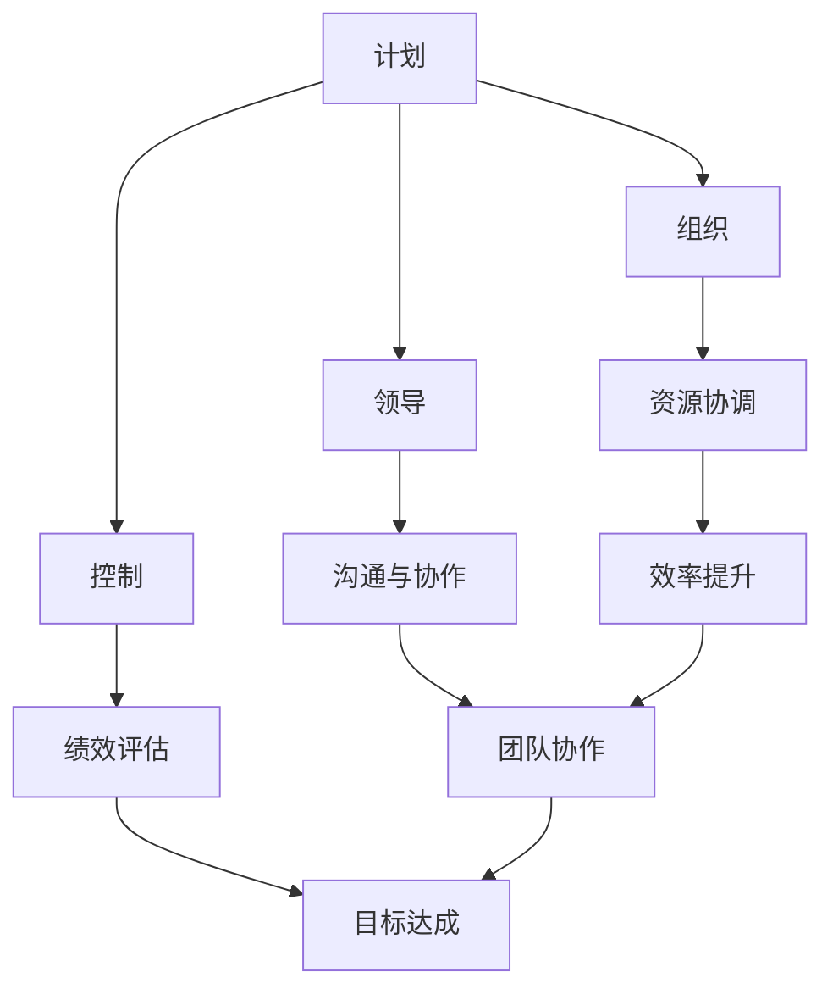
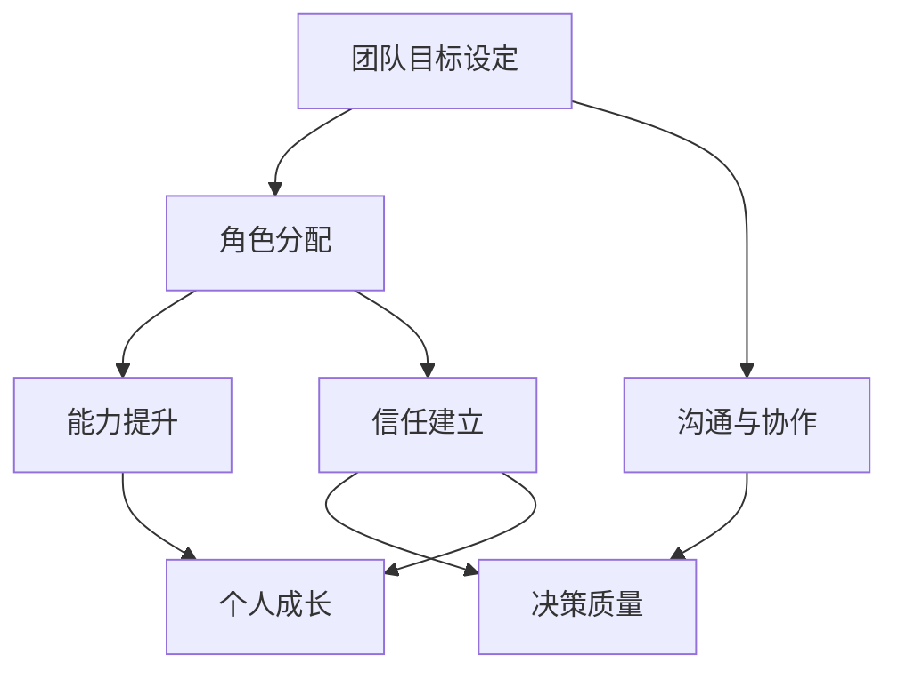

                 

## 文章标题

《管理的智慧：激发团队潜能》

### 关键词

- 管理原则
- 团队建设
- 激励理论
- 项目管理
- 领导力
- 变革管理

### 摘要

本文旨在深入探讨管理的智慧，如何通过系统的理念和方法激发团队的潜能。文章首先从管理的本质与目标入手，阐述管理的基本原则和核心要素。接着，重点分析了团队建设与沟通、激励与绩效管理、项目管理与流程优化、领导力与个人发展、变革管理与企业持续发展等关键领域。通过具体的案例分析和实战演练，本文提供了丰富的实践指导，帮助读者在实际工作中应用管理智慧，提升团队效能，实现个人和团队的发展。

## 目录大纲

### 第一部分：管理基础与理念

##### 第1章：管理的本质与目标

- 1.1 管理的定义与重要性
- 1.2 管理的目标与原则
- 1.3 管理的核心要素

##### 第2章：团队建设与沟通

- 2.1 团队建设的重要性
- 2.2 团队成员的角色与职责
- 2.3 沟通技巧与障碍
- 2.4 团队协作与冲突管理

##### 第3章：激励与绩效管理

- 3.1 激励理论及应用
- 3.2 绩效评估与反馈
- 3.3 绩效改进与目标设定

### 第二部分：管理工具与技能

##### 第4章：项目管理与流程优化

- 4.1 项目管理的基本概念
- 4.2 项目计划与执行
- 4.3 项目监控与风险管理
- 4.4 流程优化与敏捷开发

##### 第5章：领导力与个人发展

- 5.1 领导力的定义与类型
- 5.2 领导风格与团队适应性
- 5.3 领导者的自我管理
- 5.4 领导力的发展与实践

##### 第6章：变革管理与企业持续发展

- 6.1 变革管理的重要性
- 6.2 变革管理的策略与实施
- 6.3 企业持续发展的挑战与机遇
- 6.4 持续创新与竞争力提升

### 第三部分：案例分析与实践应用

##### 第7章：成功企业的管理智慧

- 7.1 企业案例介绍
- 7.2 管理智慧的核心要素
- 7.3 经验总结与启示

##### 第8章：实战演练与自我提升

- 8.1 管理情境模拟
- 8.2 实战案例分析与讨论
- 8.3 自我评估与改进计划

##### 第9章：附录

- 9.1 管理工具与资源
- 9.2 常用管理模型与公式
- 9.3 参考文献与进一步阅读材料

### 第一部分：管理基础与理念

在这一部分中，我们将深入探讨管理的本质与目标，为读者奠定理解后续内容的基础。

### 第1章：管理的本质与目标

#### 1.1 管理的定义与重要性

管理，作为现代组织运作的核心，其定义可谓多样且广泛。一般认为，管理是通过对人力资源、物资资源、财务资源、信息资源等进行有效组织和协调，以达到组织目标的过程。这个过程包括了计划、组织、领导、控制等基本职能。

管理的重要性不可小觑。首先，管理是组织成功的基石。一个优秀的团队或组织，不仅需要具备卓越的个体能力，更需要通过高效的管理来协调这些能力，形成强大的合力。其次，管理能够提升组织的效能，通过科学的方法和流程优化，减少资源浪费，提高工作效率。最后，管理还能够促进组织的可持续发展，通过不断创新和适应变化，保持组织的活力和竞争力。

让我们用Mermaid流程图来展示管理的基本流程和核心要素：

从流程图中，我们可以看到，管理不仅仅是单一职能的执行，而是各个职能之间的相互联系和协同作用。接下来，我们将详细探讨管理的目标与原则。

#### 1.2 管理的目标与原则

管理的目标多样，但总体可以归结为以下几方面：

1. **达成目标**：组织成立之初就设定了明确的目标，管理的作用就是通过计划、组织、领导、控制等手段，确保这些目标得以实现。

2. **提高效率**：通过科学的管理方法，优化资源配置和工作流程，减少无效劳动，提高整体工作效率。

3. **促进发展**：管理不仅要维持组织的稳定运行，更要推动组织的不断发展。这包括技术创新、市场拓展、组织结构优化等方面。

4. **确保公平**：管理需要确保团队成员在资源分配、工作负荷、绩效评估等方面得到公平对待，从而提升团队的凝聚力和战斗力。

在实现这些目标的过程中，管理需要遵循以下原则：

1. **目标一致性**：组织内部各个层级、各个部门的目标应当是一致的，这要求管理在制定目标时，要充分考虑各方的需求和利益，确保目标的一致性。

2. **责任分配**：明确各个岗位的职责和权限，确保每个团队成员都清楚自己的工作内容和责任，避免职责重叠或缺失。

3. **团队协作**：管理应当鼓励团队成员之间的合作与协作，通过有效的沟通和协调，形成团队合力，共同完成组织目标。

4. **持续改进**：管理是一个动态的过程，需要不断地进行调整和优化。通过定期评估和反馈，发现问题和不足，及时进行改进。

#### 1.3 管理的核心要素

管理的核心要素包括：

1. **人力资源**：人是组织最重要的资源。管理需要充分发挥每个人的潜力，激发团队的活力和创造力。

2. **物资资源**：包括组织的设备、工具、原材料等。管理需要确保这些资源的合理配置和有效利用。

3. **财务资源**：管理需要制定合理的财务预算，确保组织的资金流转和财务稳定。

4. **信息资源**：信息是现代管理的重要工具。管理需要建立完善的信息系统，确保信息的准确、及时和有效传递。

5. **环境资源**：组织所处的内外部环境，包括政策、市场、竞争对手等。管理需要密切关注环境变化，制定相应的应对策略。

通过以上分析，我们可以看到，管理的本质是一个系统化的过程，涉及到多个方面和要素。理解管理的本质和目标，是进行有效管理的前提。在接下来的章节中，我们将继续探讨团队建设与沟通、激励与绩效管理等方面的内容。

### 第2章：团队建设与沟通

#### 2.1 团队建设的重要性

团队建设在管理中扮演着至关重要的角色。一个高效的团队不仅能够提高组织的生产力，还能增强员工的满意度和忠诚度。有效的团队建设有助于以下几方面：

1. **提升协作能力**：通过团队建设，团队成员能够更好地理解彼此的角色和职责，从而在协作过程中减少摩擦和误解。

2. **增强团队凝聚力**：团队建设活动有助于建立团队成员之间的信任和友谊，提升团队的凝聚力。

3. **提高决策质量**：多元化的团队能够从不同的角度思考问题，提出多样化的解决方案，从而提高决策的质量。

4. **促进个人成长**：团队成员在团队中能够通过互相学习和合作，不断提升自己的技能和知识。

为了深入理解团队建设的重要性，我们可以使用Mermaid流程图来展示团队建设的基本流程：

从流程图中，我们可以看到，团队建设包括目标设定、角色分配、沟通与协作、能力提升、信任建立等多个环节，这些环节相互关联，共同推动团队的发展。

#### 2.2 团队成员的角色与职责

一个高效的团队需要明确每个成员的角色和职责。团队成员的角色可以分为以下几类：

1. **领导者**：领导者负责制定团队目标，规划工作流程，协调团队成员的工作，确保团队目标的实现。

2. **执行者**：执行者负责具体任务的执行，他们通常是团队中最基层的成员，直接参与工作。

3. **协调者**：协调者负责团队内部各个成员之间的沟通和协作，确保工作顺利进行。

4. **反馈者**：反馈者负责收集团队成员的意见和建议，向上层管理进行反馈，为团队改进提供依据。

5. **创新者**：创新者负责提出新的想法和解决方案，推动团队的创新和发展。

在明确团队成员角色的基础上，需要为每个角色设定清晰的职责。例如，领导者的职责包括：

- 制定团队目标和工作计划
- 分配任务和资源
- 监督和指导团队成员的工作
- 解决团队成员之间的冲突
- 定期向上层管理汇报团队进展

执行者的职责包括：

- 理解和执行分配的任务
- 及时报告工作进展和遇到的问题
- 与其他团队成员协作，确保任务顺利完成
- 提出改进建议和意见

通过明确每个角色的职责，可以确保团队工作有序进行，避免职责重叠和责任缺失。

#### 2.3 沟通技巧与障碍

沟通是团队建设中的关键环节，有效的沟通能够提升团队的协作效率，减少误解和冲突。以下是一些常用的沟通技巧：

1. **倾听**：倾听是有效沟通的第一步，要求团队成员在沟通过程中认真倾听对方的意见和想法，理解其真实意图。

2. **明确表达**：团队成员在表达意见时，应尽量清晰明确，避免使用模糊的语言或含糊其辞，以免产生误解。

3. **积极反馈**：在沟通过程中，及时给予积极的反馈，可以增强沟通的互动性和效果。

4. **使用非语言信号**：非语言信号，如肢体语言、面部表情等，在沟通中也非常重要，可以帮助传递更丰富的信息。

尽管沟通技巧在提升团队协作中起着重要作用，但沟通障碍也是不可避免的。以下是一些常见的沟通障碍：

1. **语言障碍**：团队成员可能来自不同的背景和文化，语言上的差异可能导致沟通困难。

2. **信息过载**：在复杂的环境中，过多的信息和数据可能导致团队成员无法有效地进行沟通。

3. **情绪因素**：情绪波动可能影响团队成员的沟通效果，如紧张、焦虑等情绪可能导致沟通不畅。

4. **文化差异**：文化差异可能影响团队成员之间的理解和信任，导致沟通障碍。

为了克服这些沟通障碍，团队需要采取以下措施：

- **建立共同语言**：通过培训和学习，提高团队成员的语言沟通能力。
- **简化信息**：在沟通中，尽量使用简洁明了的语言，避免信息过载。
- **情绪管理**：通过团队建设活动，提高团队成员的情绪管理能力，创造积极沟通的氛围。
- **尊重文化差异**：尊重团队成员的文化差异，建立包容和开放的文化氛围，促进有效沟通。

#### 2.4 团队协作与冲突管理

团队协作是团队建设的重要组成部分，有效的团队协作能够提高团队的整体效能。以下是一些促进团队协作的方法：

1. **明确目标**：团队协作需要有一个明确的目标，所有团队成员都应清楚地知道自己的职责和目标，确保协作的方向一致。

2. **分工合作**：根据团队成员的能力和特长，进行合理的分工，确保每个成员都能发挥自己的优势。

3. **沟通协调**：在团队协作过程中，保持有效的沟通和协调，确保团队成员之间的信息流通和协作顺畅。

4. **相互支持**：团队成员应相互支持，共同面对困难和挑战，共同完成任务。

冲突是团队中不可避免的现象，适当的冲突可以激发团队的活力和创新，但过度的冲突则会破坏团队的和谐。以下是一些管理团队冲突的方法：

1. **预防冲突**：通过明确的团队目标和规则，减少冲突的发生。在团队建设初期，应重视团队成员之间的沟通和合作，建立相互信任的基础。

2. **及时解决**：一旦冲突发生，应及时处理，避免冲突升级。管理者应成为冲突解决的协调者，帮助双方找到解决问题的方法。

3. **积极沟通**：通过积极的沟通，了解冲突的本质和原因，找到解决方案。在沟通过程中，应注重情感的表达和倾听，建立双方的信任。

4. **平衡利益**：在处理冲突时，应平衡各方利益，寻求一种双方都能接受的解决方案。

通过有效的团队协作与冲突管理，团队可以更好地实现其目标，提升整体效能。在接下来的章节中，我们将继续探讨激励与绩效管理、项目管理与流程优化等方面的内容。

### 第3章：激励与绩效管理

#### 3.1 激励理论及应用

激励是管理中至关重要的一环，有效的激励可以激发团队成员的积极性、主动性和创造力，从而提高整体绩效。激励理论为我们提供了理解和应用激励的基础。

**马斯洛需求层次理论**：马斯洛认为，人的需求可以分为五个层次，从生理需求到自我实现需求，依次递增。管理者应了解团队成员的不同需求层次，采用相应的激励措施。

1. **生理需求**：包括食物、水、空气等基本生理需求。激励措施可以是提供合理的薪酬、良好的工作环境和基本福利。
   
2. **安全需求**：包括安全感、健康保障等。激励措施可以是稳定的工作环境、健康保险等。

3. **社交需求**：包括人际交往、归属感等。激励措施可以是团队活动、团队建设等。

4. **尊重需求**：包括自尊、成就感等。激励措施可以是表扬、晋升等。

5. **自我实现需求**：包括自我发展、实现个人潜力等。激励措施可以是提供培训机会、职业发展规划等。

**ERG理论**：ERG理论扩展了马斯洛的需求层次，认为人的需求可以是同时存在且可以相互转化的。管理者应关注团队成员的多种需求，灵活应用激励措施。

1. **生存需求**：包括基本的生活和工作保障。
   
2. **关系需求**：包括人际交往和团队关系的建立。

3. **成长需求**：包括个人技能和职业发展的提升。

**双因素理论**：赫兹伯格认为，激励因素（如成就、认可、工作本身等）和保健因素（如薪酬、工作条件等）对员工满意度有不同影响。管理者应同时关注这两方面的因素，以提高员工满意度。

#### 3.2 绩效评估与反馈

绩效评估是激励体系中的重要环节，通过绩效评估，管理者可以了解团队成员的工作表现，为激励提供依据。

**评估指标**：绩效评估指标应包括定量指标和定性指标，如完成任务的效率、质量、创新性、团队协作等。量化指标可以使用KPI（关键绩效指标）进行衡量，定性指标则可以通过360度反馈等方法收集。

**评估方法**：绩效评估可以采用多种方法，如定期评估、项目评估、过程评估等。定期评估通常在年度或季度进行，项目评估则针对特定项目，过程评估则关注工作流程中的各个环节。

**反馈机制**：有效的反馈机制能够帮助团队成员了解自己的工作表现，找到改进的方向。反馈应包括正面反馈和改进建议，采用建设性的方式，避免批评和指责。

**反馈流程**：

1. **评估前准备**：确定评估指标和方法，收集相关数据。
   
2. **评估过程**：进行实际评估，记录评估结果。

3. **反馈沟通**：与团队成员进行一对一沟通，提供正面反馈和改进建议。

4. **后续跟进**：跟踪改进措施的执行情况，确保改进效果。

#### 3.3 绩效改进与目标设定

绩效改进是持续提升团队绩效的关键。以下是一些有效的绩效改进方法：

**目标设定**：目标设定应遵循SMART原则（具体、可衡量、可达成、相关、时限性），确保目标的明确性和可执行性。

1. **具体（Specific）**：目标应明确、具体，避免模糊不清。
   
2. **可衡量（Measurable）**：目标应可量化，便于衡量进度和效果。
   
3. **可达成（Achievable）**：目标应具有挑战性，但也要确保可达成。
   
4. **相关（Relevant）**：目标应与组织的整体目标和团队的具体任务相关。
   
5. **时限性（Time-bound）**：目标应有明确的完成时限。

**持续改进**：绩效改进不是一次性的过程，而是一个持续的过程。以下是一些持续改进的方法：

1. **定期评估**：定期对绩效进行评估，发现问题和不足，及时调整目标和改进措施。
   
2. **培训与发展**：提供培训和发展机会，提升团队成员的技能和能力。
   
3. **团队协作**：通过团队协作，共同解决绩效改进中的难题。
   
4. **反馈与沟通**：建立有效的反馈和沟通机制，确保改进措施的执行和效果。

通过有效的激励和绩效管理，团队可以不断提升绩效，实现个人和组织的共同发展。在接下来的章节中，我们将探讨项目管理与流程优化、领导力与个人发展等方面的内容。

### 第4章：项目管理与流程优化

#### 4.1 项目管理的基本概念

项目管理是管理领域中一个重要的分支，旨在确保项目能够在既定的时间和预算内完成，并达到预期的质量和效果。项目管理的基本概念包括以下几个方面：

**项目**：项目是指一种临时性的、独特的任务，有明确的目标和范围，通过一系列相互关联的活动完成。项目通常具有一次性、独特性和目标导向性的特点。

**项目管理**：项目管理是指通过规划、组织、领导、控制等手段，对项目资源进行有效配置和利用，以实现项目目标的系统过程。项目管理涉及多个方面的活动，包括项目规划、项目执行、项目监控和项目收尾。

**项目计划**：项目计划是指制定项目执行的具体方案和步骤，明确项目的目标、任务、资源需求、时间安排和质量标准等。项目计划是项目管理的核心文档，它为项目的执行提供了详细的指导。

**项目执行**：项目执行是指按照项目计划进行项目活动的实施。项目执行阶段主要包括任务分配、资源协调、工作进度跟踪和问题解决等。

**项目监控**：项目监控是指对项目执行过程进行跟踪和监督，确保项目按照计划进行。项目监控包括进度监控、成本监控、质量监控和风险监控等。

**项目收尾**：项目收尾是指完成项目后进行的总结和评估，包括项目成果的验收、项目经验的总结和项目文档的归档等。

#### 4.2 项目计划与执行

项目计划是项目管理的重要环节，它为项目的顺利执行提供了详细的指导和保障。项目计划通常包括以下内容：

1. **项目范围管理**：明确项目的范围，包括项目需要完成的任务、产出和交付物。范围管理有助于避免项目范围蔓延，确保项目目标的实现。

2. **时间管理**：制定项目的时间计划，明确项目的主要里程碑、阶段和任务的时间安排。时间管理有助于确保项目按计划完成。

3. **成本管理**：制定项目的成本预算，包括人力成本、物资成本和运营成本等。成本管理有助于控制项目的费用支出，确保项目在经济可行的范围内进行。

4. **质量管理**：制定项目的质量标准，确保项目的产出满足预定的质量要求。质量管理有助于提高项目的交付质量，增强客户的满意度。

5. **资源管理**：制定项目的资源需求计划，包括人力、物资、设备和资金等。资源管理有助于确保项目资源的有效配置和利用。

6. **风险管理**：识别项目可能面临的风险，并制定相应的风险应对策略。风险管理有助于降低项目风险，确保项目的顺利执行。

项目执行是项目计划的具体实施过程。在项目执行过程中，需要遵循以下原则和步骤：

1. **任务分配**：根据项目计划，将任务分配给相应的团队成员。任务分配应充分考虑团队成员的技能、经验和职责。

2. **资源协调**：确保项目所需的资源能够及时、有效地分配和利用。资源协调包括人力、物资、设备和资金的协调。

3. **工作进度跟踪**：定期跟踪项目的工作进度，确保项目按照计划进行。工作进度跟踪可以及时发现和解决进度偏差，确保项目按时完成。

4. **问题解决**：在项目执行过程中，可能会遇到各种问题和挑战。问题解决是指及时识别和解决项目中的问题，确保项目顺利推进。

5. **沟通与协作**：保持项目团队内部的沟通和协作，确保团队成员之间的信息流通和协作顺畅。沟通与协作有助于提高项目的执行效率。

6. **质量保证**：在项目执行过程中，持续监控项目的质量，确保项目的产出符合预定的质量标准。质量保证有助于提高项目的交付质量。

#### 4.3 项目监控与风险管理

项目监控是确保项目按照计划进行的重要手段。项目监控包括以下方面：

1. **进度监控**：定期跟踪项目的实际进度，与计划进度进行比较，识别进度偏差。进度监控有助于及时调整项目计划，确保项目按时完成。

2. **成本监控**：监控项目的实际成本支出，与预算进行比较，确保项目在成本可控的范围内进行。成本监控有助于控制项目费用，避免超支。

3. **质量监控**：监控项目的质量指标，确保项目的产出符合预定的质量标准。质量监控有助于提高项目的交付质量，增强客户的满意度。

4. **风险监控**：识别项目中的潜在风险，并监控这些风险的实际情况。风险监控有助于及时采取措施，降低风险发生的概率和影响。

项目监控通常通过以下工具和技术进行：

1. **项目进度报告**：定期编制项目进度报告，包括项目的关键里程碑、任务进度、成本和质量情况等。

2. **项目管理软件**：使用项目管理软件，如Microsoft Project、JIRA等，帮助项目团队进行进度跟踪、资源管理和问题解决。

3. **风险管理矩阵**：使用风险管理矩阵，评估项目风险的概率和影响，制定相应的风险应对策略。

风险管理是项目管理中的重要环节，旨在识别、评估和应对项目风险，确保项目的顺利进行。以下是一些常用的风险管理方法：

1. **风险识别**：通过头脑风暴、访谈、专家评审等方法，识别项目可能面临的风险。

2. **风险评估**：对识别出的风险进行评估，包括风险的概率和影响，制定风险优先级。

3. **风险应对**：根据风险评估结果，制定相应的风险应对策略，包括风险规避、风险减轻、风险接受和风险转移。

4. **风险监控**：持续监控项目风险的变化情况，及时调整风险应对措施。

通过有效的项目监控和风险管理，项目团队可以更好地控制项目进度、成本和质量，确保项目目标的实现。

#### 4.4 流程优化与敏捷开发

流程优化是项目管理中的重要环节，旨在提高项目的执行效率和质量。流程优化通常包括以下步骤：

1. **流程分析**：分析项目流程的现状，识别流程中的瓶颈和问题。

2. **流程改进**：制定改进措施，消除流程中的瓶颈和问题，优化流程的效率和效果。

3. **流程实施**：实施改进后的流程，确保流程改进措施的有效执行。

4. **流程评估**：评估流程改进的效果，持续优化流程。

敏捷开发是一种以人为核心、迭代、增量和灵活响应变化的软件开发方法。敏捷开发注重快速响应变化、持续交付高质量软件、增强团队协作和客户满意度。以下是一些常见的敏捷开发方法和工具：

1. **Scrum**：Scrum是一种迭代、增量的软件开发方法，包括产品待办列表、冲刺计划、每日站会、冲刺评审和回顾等环节。

2. **Kanban**：Kanban是一种可视化的工作流程管理方法，通过看板（Kanban板）展示工作进度，帮助团队识别和解决流程中的瓶颈。

3. **看板（Kanban）**：看板是一种可视化的工作流程管理方法，通过看板（Kanban板）展示工作进度，帮助团队识别和解决流程中的瓶颈。

4. **用户故事**：用户故事是一种描述软件功能或特性的简单文本，通常包括用户需求、功能描述和验收标准。

5. **迭代开发**：迭代开发是一种分阶段、分步骤的软件开发方法，每个迭代周期包括需求分析、设计、开发、测试和部署等阶段。

通过流程优化和敏捷开发，项目团队可以更好地适应快速变化的需求，提高项目的交付速度和质量。

### 第5章：领导力与个人发展

#### 5.1 领导力的定义与类型

领导力是指通过影响、激励和引导他人，实现共同目标的能力。领导力不仅涉及个人的素质和技能，还涉及到团队和环境因素。领导力可以分为以下几种类型：

**1. 情境领导力**：情境领导力认为领导风格应该根据不同情境和团队成员的特点进行灵活调整。领导者在不同的情境下可以采用不同的领导风格，如指令性领导、支持性领导、参与性领导和委托性领导。

**2. 情绪领导力**：情绪领导力强调领导者通过激发团队成员的情绪，提升团队的动力和协作能力。领导者需要具备情绪管理能力，能够识别和调节团队成员的情绪，营造积极的团队氛围。

**3. 战略领导力**：战略领导力是指领导者能够制定长远的发展规划，把握市场趋势，推动组织创新和变革。战略领导者需要具备前瞻性思维、决策能力和执行力。

**4. 转型领导力**：转型领导力是指领导者能够引导组织进行战略调整和结构变革，应对外部环境的变化。转型领导者需要具备强烈的变革意愿、沟通能力和执行能力。

#### 5.2 领导风格与团队适应性

领导风格是指领导者在与团队成员互动和指导过程中所采取的方式和方法。不同的领导风格对团队的表现和成员的满意度有不同的影响。以下是一些常见的领导风格：

**1. 权威型领导**：权威型领导者具有较强的决策能力和控制力，通过下达指令和严格监督来确保团队目标的实现。这种领导风格在紧急情况下或团队需要快速决策时较为有效。

**2. 参与型领导**：参与型领导者鼓励团队成员参与决策过程，尊重团队成员的意见和建议。这种领导风格有助于提高团队成员的参与感和责任感，增强团队的凝聚力。

**3. 支持型领导**：支持型领导者关注团队成员的需求和感受，提供必要的支持和帮助。这种领导风格有助于提升团队成员的满意度和忠诚度，增强团队的协作能力。

**4. 指导型领导**：指导型领导者通过明确指导、培训和反馈来帮助团队成员提高技能和工作效率。这种领导风格适用于新员工或技能水平较低的团队成员。

领导者的风格应与团队的特点和需求相匹配。领导者需要根据团队的具体情况，灵活调整自己的领导风格，以实现最佳的管理效果。

#### 5.3 领导者的自我管理

领导者的自我管理是提升领导力的重要方面。以下是一些关键的自管理技能：

**1. 时间管理**：领导者需要合理安排时间，确保能够高效地完成工作任务。时间管理包括设定优先级、制定日程表、避免拖延等。

**2. 决策能力**：领导者需要具备良好的决策能力，能够在复杂和不确定的环境中做出明智的决策。决策能力包括分析问题、权衡利弊、预测结果等。

**3. 情绪管理**：领导者需要能够控制自己的情绪，避免负面情绪对决策和团队关系的影响。情绪管理包括自我意识、自我调节、自我激励等。

**4. 自我反思**：领导者需要定期进行自我反思，识别自己的优点和不足，不断改进和提升自己的能力。自我反思有助于领导者保持成长和进步。

**5. 沟通能力**：领导者需要具备良好的沟通能力，能够清晰、有效地表达自己的想法，并倾听和理解他人的意见和需求。沟通能力包括倾听、表达、提问、反馈等。

通过自我管理，领导者可以提升自己的能力，为团队提供更好的领导和支持。

#### 5.4 领导力的发展与实践

领导力的发展是一个持续的过程，需要通过不断的学习和实践来提升。以下是一些提升领导力的方法和实践：

**1. 学习和培训**：领导者可以通过参加培训课程、阅读相关书籍、观看讲座和视频等方式，不断学习新的领导知识和技能。

**2. 实践和应用**：领导力的发展离不开实际应用。领导者可以在工作中不断实践和应用所学知识和技能，通过实际操作来提升自己的领导能力。

**3. 反馈和改进**：领导者需要定期接受团队成员和上级领导的反馈，了解自己的优缺点，并据此进行改进。反馈和改进有助于领导者不断提升自己的领导水平。

**4. 建立网络**：领导者可以通过参加行业会议、社交活动和网络平台，建立广泛的联系和网络。建立网络有助于领导者获取更多的资源和信息，促进个人和团队的发展。

**5. 指导和辅导**：领导者可以指导和支持团队成员，帮助他们提升能力和实现个人目标。通过指导和辅导，领导者不仅可以提升团队成员的绩效，还可以增强团队的整体实力。

通过以上方法和实践，领导者可以不断提升自己的领导力，为团队和组织的发展做出更大的贡献。

### 第6章：变革管理与企业持续发展

#### 6.1 变革管理的重要性

在当今快速变化的市场环境中，变革管理对企业持续发展至关重要。企业面对的挑战包括技术革新、市场变化、竞争压力和内部运营问题等。有效的变革管理能够帮助企业在这些挑战中保持竞争力，实现持续发展。

**1. 提高适应能力**：通过变革管理，企业能够更好地适应外部环境的变化，及时调整战略和运营模式，保持市场竞争力。

**2. 提升效率和质量**：变革管理可以优化企业的流程和结构，消除冗余和浪费，提高工作效率和产品服务质量。

**3. 激发创新和创造力**：变革管理鼓励员工积极参与创新活动，提升企业的创新能力，为未来发展提供新的动力。

**4. 增强组织凝聚力**：通过有效的变革管理，企业可以增强员工的认同感和归属感，提升组织的凝聚力和执行力。

#### 6.2 变革管理的策略与实施

有效的变革管理需要系统的策略和实施步骤。以下是一些关键的变革管理策略和实施步骤：

**1. 确定变革目标**：明确变革的目标和期望成果，确保变革的方向与企业的长期战略目标一致。

**2. 建立变革领导团队**：组建专门的变革领导团队，负责变革的规划、实施和监督，确保变革的顺利推进。

**3. 评估变革的影响**：对变革的影响进行全面的评估，包括对组织结构、流程、人员和文化的影响，制定相应的应对措施。

**4. 制定变革计划**：制定详细的变革计划，包括变革的目标、时间表、资源需求和实施步骤，确保变革计划的可行性和可执行性。

**5. 沟通与宣传**：通过内部沟通和宣传，让全体员工了解变革的必要性、目标和计划，提高员工对变革的认同感和参与度。

**6. 培训与支持**：为员工提供必要的培训和支持，帮助他们适应变革，提升新的技能和能力。

**7. 监控与评估**：建立监控和评估机制，定期跟踪变革的进展和效果，及时调整变革计划，确保变革目标的实现。

#### 6.3 企业持续发展的挑战与机遇

企业持续发展面临着一系列挑战和机遇。以下是一些主要挑战和机遇：

**1. 挑战**：

- **技术变革**：快速的技术变革要求企业不断更新技术架构和产品，以保持竞争力。
- **市场变化**：市场的快速变化要求企业及时调整战略和运营模式，以适应新的市场环境。
- **人才竞争**：吸引和保留高素质人才是企业的关键挑战，特别是在竞争激烈的市场环境中。
- **内部运营问题**：优化内部运营流程，提高效率和降低成本是企业持续发展的重要任务。

**2. 机遇**：

- **数字化转型**：数字化技术的应用为企业提供了新的商业模式和运营模式，带来了巨大的发展机遇。
- **市场扩张**：开拓新市场和细分市场，为企业提供了新的增长机会。
- **创新与研发**：持续的创新和研发能够为企业带来新的产品和服务，提升企业的竞争力。
- **合作与联盟**：与其他企业建立战略合作伙伴关系，共享资源和优势，共同应对市场挑战。

通过应对这些挑战和抓住机遇，企业可以实现持续发展，保持竞争优势。

#### 6.4 持续创新与竞争力提升

持续创新是企业持续发展的核心驱动力，能够提升企业的竞争力。以下是一些提升竞争力的方法和策略：

**1. 创新文化**：建立创新文化，鼓励员工提出新想法和解决方案，营造开放、包容和激励创新的工作氛围。

**2. 创新机制**：建立创新的机制和流程，包括创新项目立项、研发、测试和推广等，确保创新的顺利进行。

**3. 研发投入**：增加研发投入，建立专门的研发团队，持续投入资源和精力进行技术创新和产品研发。

**4. 市场导向**：以市场为导向，密切关注市场趋势和客户需求，及时调整产品和服务，满足市场需求。

**5. 合作与联盟**：与其他企业、科研机构和高校建立合作关系，共享资源和知识，共同进行创新和研发。

**6. 人才培养**：注重人才培养和激励，吸引高素质人才，提升员工的创新能力和专业水平。

通过持续创新和竞争力提升，企业能够在激烈的市场竞争中保持优势，实现长期可持续发展。

### 第7章：成功企业的管理智慧

#### 7.1 企业案例介绍

为了深入探讨成功企业的管理智慧，我们将分析几个具有代表性的企业案例，这些企业在各自领域取得了显著成就，其管理实践为我们提供了宝贵的经验和启示。

**1. 亚马逊**：作为全球最大的电子商务公司之一，亚马逊以其创新的企业文化、卓越的物流体系和强大的技术实力闻名于世。亚马逊的管理智慧体现在其对于客户体验的极致追求、持续的技术创新以及高效的运营管理。

**2. 苹果**：苹果公司以其独特的设计哲学、高品质的产品和服务在全球范围内享有盛誉。苹果的成功离不开其强大的领导力、严格的质量控制和独特的品牌管理。

**3. 华为**：华为作为全球领先的通信技术解决方案提供商，其管理智慧体现在其全球化战略、技术创新能力和对人才的重视。华为以其坚定的战略方向、高效的执行力和灵活的应变能力在全球市场上取得了巨大成功。

#### 7.2 管理智慧的核心要素

通过分析上述成功企业的管理实践，我们可以提炼出几个核心的管理智慧要素：

**1. 创新驱动**：成功企业通常高度重视创新，将其作为企业发展的重要动力。创新不仅体现在产品和技术上，还包括管理模式、组织结构和业务流程等各个方面。

**2. 客户至上**：成功企业始终将客户需求放在首位，通过提供优质的产品和服务来赢得客户的信任和忠诚。客户至上不仅是一种理念，更是企业行动的指南。

**3. 精益管理**：成功企业通常采用精益管理的方法，通过持续优化流程和减少浪费，提高工作效率和产品质量。精益管理强调以客户需求为导向，实现资源的最优配置。

**4. 人才优先**：成功企业注重人才的发展和激励，通过建立完善的人才培养体系和激励机制，吸引和留住高素质人才。

**5. 文化传承**：成功企业拥有独特的文化价值观，这些价值观不仅体现在企业内部，还传递给外部合作伙伴和客户。企业文化是企业的核心竞争力之一。

#### 7.3 经验总结与启示

通过对成功企业的管理实践进行分析，我们可以得出以下经验总结和启示：

**1. 以创新为驱动力**：企业应不断创新，不仅要在产品和技术上领先，还要在管理模式、业务流程和组织结构上进行创新。创新是企业持续发展的源泉。

**2. 将客户需求放在首位**：企业应始终关注客户需求，以客户为中心进行产品设计和服务提供。通过不断提升客户满意度，企业可以在市场中获得竞争优势。

**3. 实施精益管理**：企业应通过精益管理优化流程，减少浪费，提高工作效率。精益管理不仅能够提高企业的运营效率，还能够提升客户满意度。

**4. 注重人才培养**：企业应建立完善的人才培养体系和激励机制，吸引和留住高素质人才。人才是企业最宝贵的资源，是企业持续发展的重要保障。

**5. 塑造独特的文化**：企业应塑造独特的文化价值观，并将其内化为员工的共同信仰和行为准则。企业文化是企业的核心竞争力，能够为企业带来持续的优势。

通过借鉴成功企业的管理智慧，企业可以不断提升自身的管理水平和竞争力，实现持续发展和成功。

### 第8章：实战演练与自我提升

#### 8.1 管理情境模拟

为了更好地理解管理理论和实践，我们设计了一些具体的管理情境模拟，帮助读者在实践中应用所学知识。

**情境1：项目延误**

假设你负责的一个项目已经延误了一个月，项目团队成员的情绪开始波动，客户对项目的进度表示担忧。在这种情况下，你应该如何处理？

1. **分析原因**：首先，你需要分析项目延误的原因，是资源不足、人员调配不当还是沟通不畅？
2. **制定解决方案**：根据分析结果，制定具体的解决方案，如调整资源分配、优化工作流程或增加人手。
3. **与团队成员沟通**：召开团队会议，明确解决方案，并征求团队成员的意见，确保他们理解并支持这一方案。
4. **与客户沟通**：与客户进行坦诚的沟通，告知他们项目延误的原因和解决方案，争取他们的理解和支持。
5. **实施并监控**：实施解决方案，并持续监控项目的进度，确保问题得到有效解决。

**情境2：团队冲突**

在一个多部门的合作项目中，你发现不同部门之间的沟通不畅，甚至出现了明显的冲突。你应该如何处理？

1. **识别冲突原因**：与冲突各方进行沟通，了解冲突的原因，可能是因为资源分配不均、任务分工不清或沟通不及时等。
2. **召开调解会议**：组织一个调解会议，邀请冲突双方及相关人员参与，共同讨论和解决问题。
3. **制定共识方案**：通过讨论，达成共识，制定一个既能满足各方需求，又能保证项目顺利进行的解决方案。
4. **执行并跟踪**：执行共识方案，并持续跟踪方案的执行情况，确保冲突得到有效解决。

**情境3：员工激励**

你发现团队中的某些成员工作积极性不高，效率低下，甚至出现了离职的倾向。你应该如何进行员工激励？

1. **了解员工需求**：与员工进行一对一的沟通，了解他们的需求和困扰，可能是因为工作环境、薪酬待遇或职业发展等方面的不满。
2. **制定激励方案**：根据员工的需求，制定相应的激励方案，如提供职业发展机会、增加薪酬福利或改善工作环境。
3. **实施激励措施**：将激励方案告知员工，并开始实施，确保员工感受到企业的关怀和支持。
4. **跟踪反馈**：持续跟踪激励措施的效果，及时调整方案，确保激励措施能够持续发挥积极作用。

通过这些情境模拟，读者可以在实践中应用所学管理知识，提高解决问题的能力，提升管理水平。

#### 8.2 实战案例分析与讨论

为了深入理解管理智慧和实战应用，我们选择了以下几个具有代表性的实战案例，并进行详细的分析和讨论。

**案例1：阿里巴巴集团的“双十一”大促销**

**背景**：每年的“双十一”是阿里巴巴集团举办的全球购物狂欢节，销售额屡创新高。为了确保活动的顺利进行，阿里巴巴需要高效管理各个环节，包括物流、技术支持、客户服务等。

**分析**：

- **物流管理**：阿里巴巴通过智能物流系统，实现了快速、高效的货物配送。通过大数据分析和预测，提前准备了充足的物流资源，确保在高峰期能够应对巨大的订单量。
- **技术支持**：阿里巴巴的技术团队在“双十一”期间进行了大规模的技术储备和优化，确保了平台的高可用性和稳定性。通过云计算、大数据等技术手段，实现了对海量数据的实时处理和分析。
- **客户服务**：阿里巴巴建立了强大的客户服务体系，通过线上客服、电话客服等多种渠道，为用户提供及时、有效的服务。在活动期间，客服团队加强了培训，提高了服务效率。

**讨论**：

- **高效物流系统**：阿里巴巴的物流管理体现了精益管理的理念，通过提前规划和智能调度，实现了物流资源的最优配置。这为其他企业在物流管理方面提供了有益的借鉴。
- **技术保障**：阿里巴巴的技术支持展示了技术对业务的重要支撑作用。在其他企业中，技术团队也需要在关键时期进行技术储备和优化，确保业务的顺利进行。
- **客户服务**：阿里巴巴的客户服务体系体现了以客户为中心的理念。在竞争激烈的市场环境中，优秀的客户服务能够提升用户满意度，增强企业的竞争力。

**案例2：特斯拉的自动驾驶技术**

**背景**：特斯拉是自动驾驶技术的领先者之一，其自动驾驶系统Model S和Model X在市场上广受好评。特斯拉通过不断的技术创新和优化，推动了自动驾驶技术的发展。

**分析**：

- **技术创新**：特斯拉在自动驾驶技术方面进行了大量的研发投入，不断优化传感器、算法和软件。通过硬件和软件的结合，实现了高精度、高可靠性的自动驾驶。
- **用户数据**：特斯拉通过收集和分析用户驾驶数据，不断改进自动驾驶系统的性能。用户数据是自动驾驶技术的重要资源，有助于提高系统的准确性和安全性。
- **安全保障**：特斯拉在自动驾驶系统中采用了多重安全措施，包括传感器融合、实时监控和应急机制，确保驾驶过程的安全。

**讨论**：

- **技术创新**：特斯拉的自动驾驶技术展示了技术创新对企业发展的重要作用。其他企业也应重视技术创新，不断推动产品和技术的升级。
- **用户数据**：用户数据在自动驾驶技术中发挥了关键作用。其他企业可以通过数据收集和分析，提高产品和服务质量，增强市场竞争力。
- **安全保障**：特斯拉的安全措施体现了对用户安全的高度重视。在自动驾驶技术发展的过程中，安全保障是至关重要的，其他企业也应注重安全性的提升。

通过这些实战案例的分析和讨论，读者可以更深入地理解管理智慧和实战应用，提高实际工作中的管理能力。

#### 8.3 自我评估与改进计划

为了提升个人的管理水平和解决实际工作中的问题，我们提供以下自我评估与改进计划：

**1. 自我评估**：

- **管理知识**：评估自己在管理理论知识方面的掌握程度，包括管理原则、团队建设、激励理论、项目管理等方面的知识。
- **实践经验**：评估自己在实际管理工作中解决问题的能力，包括项目执行、团队协作、问题解决、绩效管理等方面的实践。
- **领导力**：评估自己的领导能力，包括领导风格、团队激励、决策能力、沟通能力等方面的表现。
- **个人发展**：评估自己在个人发展和职业规划方面的进展，包括学习新知识、提升技能、实现职业目标等方面的努力。

**2. 改进计划**：

- **学习计划**：制定具体的学习计划，包括阅读管理相关书籍、参加培训课程、学习新的管理工具和技能等。
- **实践锻炼**：通过参与实际项目和管理任务，锻炼自己的管理能力，如项目规划、团队协作、绩效管理等。
- **反馈与反思**：定期与同事、上级或导师进行沟通，获取反馈意见，进行反思和总结，不断提升自己的管理能力。
- **目标设定**：设定具体的职业发展目标，如提升某项管理技能、实现某个职业成就等，并制定相应的行动计划。
- **持续改进**：通过不断的学习和实践，持续改进自己的管理能力，确保在工作和生活中不断提升。

通过以上自我评估与改进计划，个人可以不断提升管理水平和解决实际问题的能力，实现个人和职业的发展。

### 第9章：附录

#### 9.1 管理工具与资源

在本章附录中，我们将介绍一些常用的管理工具和资源，以帮助读者在实际工作中更好地应用管理智慧。

**1. 项目管理工具**：

- **Microsoft Project**：一款功能强大的项目管理软件，支持项目计划、资源分配、进度跟踪和报表生成等功能。
- **JIRA**：一款流行的敏捷项目管理工具，支持任务跟踪、迭代规划和敏捷开发等。
- **Trello**：一款简单直观的项目管理工具，通过卡片和看板的形式展示项目进度和任务分配。

**2. 团队协作工具**：

- **Slack**：一款团队沟通和协作工具，支持实时聊天、文件共享和集成第三方应用等功能。
- **Asana**：一款团队任务管理工具，支持任务分配、进度跟踪和协作管理等。
- **Google Workspace**：包括Google Docs、Google Sheets、Google Slides等办公工具，支持在线协作和文档共享。

**3. 绩效管理工具**：

- **Performance appraisal**：一款全面的绩效管理软件，支持KPI设定、绩效评估和反馈等功能。
- **Lattice**：一款基于目标和反馈的绩效管理平台，支持目标设定、绩效评估和员工发展等。
- **ClearCompany**：一款HR管理系统，支持招聘、员工绩效管理和员工发展等。

**4. 教育资源**：

- **Coursera**：提供各类在线课程，涵盖管理、领导力、项目管理等领域，由全球顶尖大学和机构提供。
- **edX**：提供丰富的在线课程，包括计算机科学、数据科学、人工智能等，由哈佛大学、麻省理工学院等知名机构提供。
- **LinkedIn Learning**：提供专业的在线学习资源，涵盖职场技能、管理知识和行业趋势等。

#### 9.2 常用管理模型与公式

在本节中，我们将介绍一些常用的管理模型与公式，以帮助读者更好地理解和应用管理知识。

**1. SWOT分析**：

- **定义**：SWOT分析是一种用于评估企业或项目优势（Strengths）、劣势（Weaknesses）、机会（Opportunities）和威胁（Threats）的方法。
- **公式**：
  $$ SWOT = (S + W) \times (O + T) $$
- **示例**：
  - **优势（S）**：技术创新、品牌影响力
  - **劣势（W）**：市场定位不清、人才储备不足
  - **机会（O）**：新兴市场开拓、技术进步
  - **威胁（T）**：竞争对手压力、政策变化

**2. 平衡计分卡**：

- **定义**：平衡计分卡是一种战略管理工具，用于衡量企业绩效的多个维度，包括财务、客户、内部流程和学习与成长等。
- **公式**：
  $$ 平衡计分卡 = 财务指标 + 客户指标 + 内部流程指标 + 学习与成长指标 $$
- **示例**：
  - **财务指标**：净利润率、资产回报率
  - **客户指标**：客户满意度、市场份额
  - **内部流程指标**：生产效率、产品周期
  - **学习与成长指标**：员工满意度、员工培训时间

**3. 马克波尔克矩阵**：

- **定义**：马克波尔克矩阵是一种用于评估产品和市场的策略工具，通过分析产品的竞争力和市场的吸引力，确定产品和市场的优先级。
- **公式**：
  $$ 马克波尔克矩阵 = 竞争力 \times 吸引力 $$
- **示例**：
  - **明星产品**：高竞争力、高吸引力
  - **现金牛产品**：低竞争力、高吸引力
  - **问题产品**：高竞争力、低吸引力
  - **瘦狗产品**：低竞争力、低吸引力

通过这些常用管理模型与公式，读者可以更好地理解管理理论，并在实际工作中应用这些知识，提升管理水平和决策能力。

#### 9.3 参考文献与进一步阅读材料

在本章的最后，我们列出了一些与管理智慧相关的经典著作和权威文献，以供读者进一步学习和深入研究。

**1. 经典著作**

- **《管理的实践》**（Peter F. Drucker）：彼得·德鲁克经典的管理学著作，详细阐述了管理的本质和实践方法。
- **《精益思想》**（James P. Womack & Daniel T. Jones）：介绍精益管理的理论和实践，强调通过消除浪费提高效率。
- **《领导力》**（John P. Kotter）：约翰·P. 鲍特关于领导力和变革管理的经典著作，提供了一系列实用的领导策略。
- **《第五项修炼》**（Peter M. Senge）：彼得·M. 辛格关于团队学习和组织发展的著作，探讨了如何构建学习型组织。

**2. 权威文献**

- **《哈佛商业评论》**（Harvard Business Review）：一本全球知名的管理学期刊，涵盖了企业管理、领导力、创新等多个领域的最新研究和实践。
- **《管理学报》**（Journal of Management Studies）：一本国际著名的管理学学术期刊，发表了大量关于管理理论、方法和实践的高水平研究论文。
- **《国际管理学报》**（International Journal of Management）：一本国际知名的学术期刊，专注于管理领域的理论研究和实践探讨。

**3. 进一步阅读材料**

- **《管理者的一天》**（Thomas A. Stewart）：详细记录了一位公司总裁一天的工作，提供了丰富的管理实践案例。
- **《创新者的窘境》**（Clayton M. Christensen）：探讨创新者在面对市场变化时的困境和解决方案。
- **《变革之舞》**（Warren Bennis & Burt Nanus）：分析成功领导者的变革管理实践，提供了变革管理的策略和方法。

通过阅读这些文献，读者可以更深入地理解管理智慧，提升自己的管理能力和水平。

