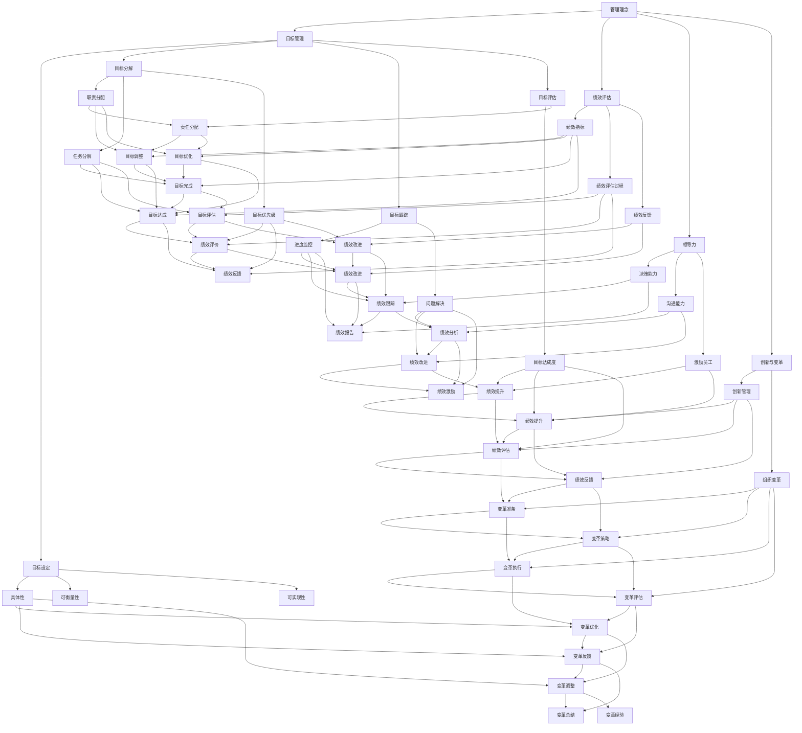

                 

### 文章标题

《管理的艺术：德鲁克的洞见》

### 关键词

- 彼得·德鲁克
- 管理艺术
- 目标管理
- 绩效评估
- 领导力
- 创新与变革

### 摘要

本文以管理大师彼得·德鲁克的管理思想为核心，深入探讨管理的艺术。文章从德鲁克的生平与贡献、组织行为与理念、目标管理实践、绩效评估方法、领导力培养、创新管理实践和变革管理等方面展开，结合实际案例，详细讲解了德鲁克管理思想的核心理念和算法原理。通过本文的阅读，读者可以全面了解德鲁克的管理哲学，掌握其管理实践的方法和技巧。

### 第一部分：德鲁克与管理的艺术

#### 第1章：德鲁克与管理的艺术

##### 1.1 介绍彼得·德鲁克

彼得·德鲁克（Peter Drucker，1909-2005），被誉为“现代管理学之父”，是管理学领域的奠基人之一。他出生于奥匈帝国的维也纳，后移民美国，并在美国开始了他的职业生涯。德鲁克在管理理论、组织行为、市场营销、创新和企业家精神等领域有着深厚的研究和丰富的实践经验。他的著作涵盖了企业管理的方方面面，对现代管理学的发展产生了深远的影响。

##### 1.2 管理的艺术：德鲁克的核心思想

德鲁克认为，管理是一种艺术，它不仅需要科学的方法，更需要实践的经验和智慧的运用。管理艺术的核心在于：

- **目标管理**：通过设定明确的目标，确保组织和个人有清晰的方向和动力。
- **绩效评估**：通过科学的绩效评估体系，激励员工不断提升自己的工作表现。
- **领导力**：领导者不仅要有战略眼光，更要具备激励和引导员工的能力。
- **创新与变革**：在快速变化的市场环境中，创新和变革是组织持续发展的关键。

##### 1.3 德鲁克的管理学贡献

德鲁克的管理学贡献主要体现在以下几个方面：

- **管理学的奠基人**：德鲁克是现代管理学的奠基人，他的著作奠定了现代管理学的基础。
- **对企业管理实践的影响**：德鲁克的管理思想被广泛应用于企业管理的各个方面，对企业的成功起到了重要的指导作用。
- **对管理教育的贡献**：德鲁克的管理理念被纳入到管理学教育中，成为管理学课程的重要内容。

### 第一部分总结

德鲁克的管理艺术不仅体现在他的理论研究中，更体现在他对企业实践的深刻洞察和有效指导上。他的管理思想至今仍然具有很高的指导价值，对于现代企业和组织的管理和发展具有重要的启示作用。

### 第二部分：组织行为与德鲁克的理念

#### 第2章：组织行为与德鲁克的理念

##### 2.1 组织行为概述

组织行为是指组织内部成员的行为模式、相互作用以及组织与外部环境之间的互动。组织行为学作为一门学科，旨在研究组织内部个体、团队以及组织整体的行为，以帮助管理者更好地理解和应对组织中的各种挑战。

##### 2.2 组织行为的要素

组织行为主要包括以下几个要素：

- **个体行为**：个体的动机、态度、情感以及行为。
- **团队行为**：团队成员之间的互动、协作和沟通。
- **组织文化**：组织的价值观、信仰、习惯和行为规范。
- **组织结构**：组织的层次结构、职责分配和决策过程。

##### 2.3 德鲁克对组织行为的洞见

德鲁克对组织行为的洞见主要体现在以下几个方面：

- **目标导向**：德鲁克强调组织的目标是所有行为的出发点，目标应具体、可衡量、可实现。
- **权力与责任**：德鲁克认为权力与责任应相匹配，管理者应明确授权，让下属有足够的自主权去完成任务。
- **创新与变革**：德鲁克认为组织应具备持续创新的能力，以适应外部环境的变化。
- **员工参与**：德鲁克提倡员工参与决策过程，认为这有助于提高员工的满意度和工作效率。

#### 第3章：战略规划与德鲁克的理念

##### 3.1 战略规划的定义

战略规划（Strategic Planning）是指组织根据外部环境和内部资源，制定长期目标和实现这些目标的行动计划。战略规划是一种前瞻性的管理过程，旨在确保组织在未来一段时间内能够持续发展。

##### 3.2 德鲁克对战略规划的理念

德鲁克对战略规划的理念主要体现在以下几个方面：

- **目标明确**：德鲁克强调战略规划应首先明确组织的长远目标，目标应具体、可衡量、可实现。
- **资源整合**：德鲁克认为战略规划需要充分整合组织的资源，包括人力、物力、财力等。
- **创新驱动**：德鲁克认为战略规划应注重创新，通过创新来提高组织的竞争力。
- **动态调整**：德鲁克认为战略规划不是一成不变的，而应根据外部环境的变化进行动态调整。

##### 3.3 德鲁克的战略规划方法

德鲁克提出了一系列战略规划的方法，包括：

- **五力模型**：分析外部环境中的五种主要力量，包括供应商、客户、竞争对手、潜在竞争者和替代品。
- **SWOT分析**：分析组织的优势（Strengths）、劣势（Weaknesses）、机会（Opportunities）和威胁（Threats）。
- **目标分解**：将战略目标分解为具体的行动计划和任务。
- **绩效评估**：定期评估战略规划的执行情况，确保目标的实现。

### 第二部分总结

德鲁克的组织行为理念和战略规划方法为现代企业管理提供了重要的指导。他的理念强调目标导向、资源整合、创新驱动和员工参与，这些理念对于组织的发展和成功具有重要意义。

### 第三部分：管理实践：德鲁克的方法与应用

#### 第4章：目标管理与德鲁克实践

##### 4.1 目标管理的概念

目标管理（Management by Objectives, MBO）是一种以目标为导向的管理方法，通过设定、分解、实现和评估目标来指导员工的工作。目标管理强调目标的具体性、可衡量性和可实现性，旨在提高员工的工作效率和组织的绩效。

##### 4.2 德鲁克的目标管理实践

德鲁克的目标管理实践主要包括以下几个步骤：

1. **设定目标**：德鲁克强调目标应具体、可衡量、可实现，并应与组织的长远目标相一致。
2. **目标分解**：将组织的目标分解为具体的子目标，并将其分配给不同部门和个人。
3. **目标跟踪**：定期检查目标的进展，确保目标按计划执行。
4. **目标评估**：根据目标的完成情况，对员工的工作进行评估，并提供反馈。

##### 4.3 目标管理在企业管理中的应用

目标管理在企业管理中的应用主要包括以下几个方面：

1. **提升员工积极性**：通过设定具体的目标，员工可以明确自己的工作方向和目标，提高工作积极性。
2. **提高工作效率**：目标管理可以帮助员工合理安排工作，提高工作效率。
3. **绩效评估**：目标管理的评估结果可以作为绩效评估的重要依据，帮助管理者了解员工的工作表现。

#### 第5章：绩效评估与德鲁克的方法

##### 5.1 绩效评估的概念

绩效评估（Performance Evaluation）是指通过系统的过程，对员工的工作表现进行客观、全面的评估，以便为员工的薪酬、晋升和发展提供依据。

##### 5.2 德鲁克的绩效评估方法

德鲁克的绩效评估方法主要包括以下几个方面：

1. **设定绩效指标**：德鲁克强调绩效指标应具体、可衡量、可实现，并与组织的战略目标相一致。
2. **定期评估**：德鲁克主张定期对员工的工作进行评估，以确保目标按计划执行。
3. **反馈与改进**：德鲁克认为评估结果应及时反馈给员工，并提供改进建议。

##### 5.3 德鲁克绩效评估的应用

德鲁克的绩效评估方法在企业管理中的应用主要包括以下几个方面：

1. **激励员工**：通过绩效评估，可以帮助员工认识到自己的优点和不足，激励员工提升自己的工作表现。
2. **员工发展**：绩效评估结果可以作为员工职业发展的依据，帮助员工制定个人发展计划。
3. **企业决策**：绩效评估结果可以为企业的决策提供数据支持，如薪酬分配、晋升等。

#### 第6章：领导力与德鲁克的理念

##### 6.1 领导力的概念

领导力（Leadership）是指领导者通过激励和引导员工，实现组织目标的能力。领导力不仅包括领导者的个人特质，还涉及到领导者的行为和决策。

##### 6.2 德鲁克的领导力理念

德鲁克的领导力理念主要包括以下几个方面：

1. **目标导向**：德鲁克认为领导者应具备明确的目标意识，并能够将目标传达给团队。
2. **决策能力**：德鲁克强调领导者应具备良好的决策能力，能够快速做出正确的决策。
3. **沟通能力**：德鲁克认为领导者应具备良好的沟通能力，能够与员工建立良好的沟通渠道。
4. **激励员工**：德鲁克强调领导者应能够激励员工，激发员工的积极性和创造力。

##### 6.3 德鲁克领导力的应用

德鲁克的领导力理念在企业管理中的应用主要包括以下几个方面：

1. **提升团队绩效**：通过有效的领导力，可以提升团队的绩效，实现组织的目标。
2. **员工满意度**：良好的领导力可以提高员工的满意度，降低员工流失率。
3. **企业文化建设**：领导力在塑造企业文化方面也发挥着重要作用，有助于形成积极向上的企业氛围。

### 第三部分总结

德鲁克的目标管理、绩效评估和领导力理念为现代企业管理提供了重要的指导。这些理念不仅有助于提升组织的绩效，还可以促进员工的发展和企业的长期发展。

### 第四部分：创新与变革：德鲁克的洞见

#### 第7章：创新管理

##### 7.1 创新的概念

创新（Innovation）是指通过新思想、新方法或新技术等手段，创造出新的产品、服务或过程。创新是企业持续发展的动力，也是提升竞争力的关键。

##### 7.2 德鲁克的创新管理理念

德鲁克的创新管理理念主要包括以下几个方面：

1. **创新的重要性**：德鲁克认为创新是企业生存和发展的关键，没有创新，企业就无法适应市场的变化。
2. **创新的过程**：德鲁克提出了创新的三阶段模型，包括寻找创意、筛选创意和实施创意。
3. **创新文化的培育**：德鲁克强调企业应建立创新文化，鼓励员工提出创意，并对创新行为给予支持和奖励。

##### 7.3 德鲁克的创新管理方法

德鲁克的创新管理方法主要包括以下几个方面：

1. **五力模型**：通过分析外部环境中的五种主要力量（供应商、客户、竞争对手、潜在竞争者和替代品），寻找创新的机遇。
2. **SWOT分析**：通过分析组织的优势、劣势、机会和威胁，制定创新策略。
3. **目标分解**：将创新目标分解为具体的行动计划和任务。
4. **绩效评估**：定期评估创新项目的进展和效果，确保创新目标的实现。

#### 第8章：组织变革

##### 8.1 变革的概念

变革（Change）是指组织在内外部压力下，对现有结构、流程、文化等进行调整和改进的过程。变革是组织适应市场变化、提升竞争力的必然选择。

##### 8.2 德鲁克的变革管理理念

德鲁克的变革管理理念主要包括以下几个方面：

1. **变革的必要性**：德鲁克认为变革是组织持续发展的必然选择，没有变革，组织就无法适应市场的变化。
2. **变革的过程**：德鲁克提出了变革的五阶段模型，包括觉醒、决策、规划、实施和整合。
3. **变革推动**：德鲁克强调领导者应具备推动变革的能力，通过有效的沟通和激励，引导员工接受变革。

##### 8.3 德鲁克的变革管理方法

德鲁克的变革管理方法主要包括以下几个方面：

1. **变革策略**：德鲁克认为变革应遵循“小步快跑”的原则，通过逐步推进变革，降低变革的风险。
2. **变革推动**：德鲁克强调领导者应具备变革推动的能力，通过有效的沟通和激励，引导员工接受变革。
3. **变革评估**：德鲁克主张定期评估变革的效果，确保变革目标的实现。

### 第四部分总结

德鲁克的创新管理和变革管理理念为组织在快速变化的市场环境中提供了重要的指导。通过创新和变革，组织可以不断提升自身的竞争力，实现持续发展。

### 附录：德鲁克管理思想的当代意义与应用

#### 附录1：德鲁克管理思想的当代意义

德鲁克的管理思想在当今商业环境中仍然具有重要的指导意义，具体体现在以下几个方面：

1. **目标导向**：德鲁克的目标管理理念强调目标的设定和实现，有助于组织和个人明确方向，提高工作效率。
2. **绩效评估**：德鲁克的绩效评估方法有助于组织对员工的工作表现进行客观评估，激励员工提升自己的工作质量。
3. **领导力**：德鲁克的领导力理念强调领导者的决策能力、沟通能力和激励能力，有助于提升组织的整体绩效。
4. **创新与变革**：德鲁克的创新管理和变革管理理念有助于组织在快速变化的市场环境中保持竞争力，实现持续发展。

#### 附录2：德鲁克管理思想在不同领域的应用

德鲁克的管理思想在各个领域都得到了广泛应用，具体体现在以下几个方面：

1. **企业管理**：德鲁克的管理理念被广泛应用于企业管理的各个方面，如目标管理、绩效评估、领导力培养等。
2. **公共管理**：德鲁克的管理理念也被应用于公共管理领域，如政府机构的管理和公共服务提供等。
3. **非营利组织**：德鲁克的管理理念在非营利组织的管理中也得到了广泛应用，如慈善机构、教育机构等。
4. **创业管理**：德鲁克的创新管理和变革管理理念对于创业者和企业家在创业过程中的决策和管理具有重要指导意义。

#### 附录3：德鲁克的经典著作推荐

德鲁克的管理思想集中体现在他的多部经典著作中，以下是一些推荐的德鲁克著作：

1. **《管理的实践》**：这是德鲁克最著名的著作之一，系统地阐述了管理的基本原理和方法。
2. **《卓有成效的管理者》**：书中详细介绍了管理者如何通过设定目标、有效利用时间和提高决策能力来提升管理效能。
3. **《目标》**：这本书详细介绍了目标管理的理论和实践，对目标设定、目标分解和目标实现提供了深入的分析。
4. **《创新与企业家精神》**：德鲁克在这本书中探讨了创新和企业家精神的重要性，以及如何通过创新来推动企业的成长和发展。

### 总结

德鲁克的管理思想不仅在过去对管理学的发展产生了深远影响，在当今的商业环境中同样具有重要的指导意义。通过深入理解和应用德鲁克的管理理念，组织和个人可以更好地应对挑战，实现持续发展和成功。

### 德鲁克管理核心概念与联系 Mermaid 流程图

以下是一个使用Mermaid绘制的流程图，展示了德鲁克管理思想中的核心概念及其相互联系：



### 德鲁克管理核心算法原理讲解

在德鲁克的管理理论中，核心算法原理体现在目标管理、绩效评估、领导力培养、创新管理和变革管理等方面。以下是对这些核心算法原理的详细讲解。

#### 目标管理算法原理

目标管理是一种以目标为导向的管理方法，其核心在于设定明确的目标、分解目标、跟踪目标进展和评估目标达成度。以下是目标管理算法的原理和伪代码：

##### 伪代码

```python
# 目标管理算法
def manage_by_objectives(employees, department_goals):
    for employee in employees:
        set_goals(employee, department_goals)
        track_goals(employee)
    evaluate_goals(employees)

def set_goals(employee, department_goals):
    employee_goals = []
    for goal in department_goals:
        if goal['responsible'] == employee['id']:
            employee_goals.append(goal)
    employee['goals'] = employee_goals

def track_goals(employee):
    for goal in employee['goals']:
        monitor_progress(goal)

def evaluate_goals(employees):
    for employee in employees:
        calculate_achievement_degree(employee)
        provide_feedback(employee)

def calculate_achievement_degree(employee):
    total_achievement = 0
    for goal in employee['goals']:
        total_achievement += goal['achievement']
    employee['achievement_degree'] = total_achievement / len(employee['goals'])
```

##### 算法解释

1. **设定目标**：`set_goals`函数将部门目标分配给员工，确保每个员工都有明确的目标。
2. **跟踪目标**：`track_goals`函数用于监控每个目标的进展。
3. **评估目标**：`evaluate_goals`函数计算每个员工的达成度，并提供反馈。
4. **计算达成度**：`calculate_achievement_degree`函数计算员工的目标达成度，通过将每个目标的达成度相加，然后除以目标总数来得到平均值。

#### 绩效评估算法原理

绩效评估是衡量员工工作表现的重要手段。其核心在于设定绩效指标、评估绩效过程和计算绩效得分。以下是绩效评估算法的原理和伪代码：

##### 伪代码

```python
# 绩效评估算法
def performance_evaluation(employees, performance_data):
    for employee in employees:
        evaluate_performance(employee, performance_data)
        provide_feedback(employee)

def evaluate_performance(employee, performance_data):
    total_score = 0
    for indicator, score in performance_data.items():
        if score >= threshold(indicator):
            total_score += score
        else:
            total_score -= penalty(indicator)
    employee['performance_score'] = total_score

def provide_feedback(employee):
    print(f"{employee['name']}的绩效得分为：{employee['performance_score']}")
```

##### 算法解释

1. **绩效评估过程**：`evaluate_performance`函数根据绩效指标得分和设定的阈值和惩罚机制计算绩效得分。
2. **提供反馈**：`provide_feedback`函数将绩效得分反馈给员工。

#### 数学模型讲解

以下是对目标达成度、绩效评估得分和领导力评估得分的数学模型讲解：

##### 目标达成度的数学模型

目标达成度（Goal Achievement Degree, GAD）可以用以下数学模型表示：

$$
GAD = \frac{\sum_{i=1}^{n} CE_i}{n}
$$

其中，\( CE_i \) 表示员工i对目标i的完成度，n表示目标总数。

##### 绩效评估的数学模型

绩效评估得分（Performance Score, PS）可以用以下数学模型表示：

$$
PS = \sum_{i=1}^{n} PI_i
$$

其中，\( PI_i \) 表示对第i个绩效指标的得分。

##### 领导力评估的数学模型

领导力评估得分（Leadership Score, LS）可以用以下数学模型表示：

$$
LS = \sum_{i=1}^{m} \frac{LF_i \cdot LC_i}{C}
$$

其中，\( LF_i \) 表示第i个领导力因素的重要性，\( LC_i \) 表示第i个领导力因素的实际表现，C表示领导力因素的总数。

#### 举例说明

假设一个团队有三个目标，每个目标分别由三个员工负责，员工对目标的完成度分别为：

员工A：目标1（完成度0.8），目标2（完成度0.9），目标3（完成度0.7）
员工B：目标1（完成度0.6），目标2（完成度0.8），目标3（完成度0.9）
员工C：目标1（完成度0.7），目标2（完成度0.7），目标3（完成度0.8）

目标达成度计算如下：

$$
GAD = \frac{(0.8 + 0.9 + 0.7) + (0.6 + 0.8 + 0.9) + (0.7 + 0.7 + 0.8)}{3 \times 3} = \frac{2.4 + 2.3 + 2.2}{9} = \frac{6.9}{9} = 0.7778
$$

假设该团队有四个绩效指标，员工对绩效指标的得分分别为：

员工A：绩效1（得分0.95），绩效2（得分0.9），绩效3（得分0.85），绩效4（得分0.8）
员工B：绩效1（得分0.9），绩效2（得分0.85），绩效3（得分0.8），绩效4（得分0.75）
员工C：绩效1（得分0.85），绩效2（得分0.8），绩效3（得分0.9），绩效4（得分0.8）

绩效评估得分计算如下：

$$
PS = 0.95 \times 0.2 + 0.9 \times 0.3 + 0.85 \times 0.25 + 0.8 \times 0.25 = 0.19 + 0.27 + 0.2125 + 0.2 = 0.87
$$

假设有三个领导力因素，员工对领导力因素的重要性评分和实际表现评分分别为：

领导力因素1：重要性（0.4），表现（0.9）
领导力因素2：重要性（0.3），表现（0.8）
领导力因素3：重要性（0.3），表现（0.7）

领导力评估得分计算如下：

$$
LS = \frac{0.4 \times 0.9 + 0.3 \times 0.8 + 0.3 \times 0.7}{0.4 + 0.3 + 0.3} = \frac{0.36 + 0.24 + 0.21}{1} = 0.81
$$

通过这些算法和数学模型，管理者可以更有效地进行目标管理、绩效评估和领导力培养，从而提高组织的管理水平和员工的工作效率。

### 项目实战

#### 实战案例：某互联网公司目标管理与绩效提升

##### 案例背景

某互联网公司是一家专注于提供在线教育和学习资源平台的公司。随着市场竞争的加剧，公司管理层意识到需要通过更有效的目标管理和绩效评估来提高员工的积极性和工作效率，以实现公司的战略目标。

##### 实践过程

1. **目标管理实施**：

   - **目标设定**：公司高层领导与各部门负责人共同制定了年度经营目标和部门目标，确保目标的具体性和可衡量性。
   - **目标分解**：各部门将整体目标进一步分解为具体的子目标，并将其分配给团队成员，确保每个员工都有明确的工作职责和目标。
   - **目标跟踪**：公司建立了定期目标检查机制，通过月度、季度会议对目标的完成情况进行跟踪和评估。

2. **绩效评估实施**：

   - **绩效指标设定**：公司根据目标制定了详细的绩效指标体系，包括教学质量、用户满意度、课程完成率等多个维度。
   - **绩效评估过程**：公司采用了360度评估方法，由上级、同事、下属和客户等多方面对员工进行评价。
   - **绩效反馈**：公司将评估结果及时反馈给员工，帮助他们了解自己的优点和需要改进的地方。

3. **领导力培养**：

   - **领导力培训**：公司定期组织领导力培训，提高管理者的领导能力。
   - **领导力实践**：鼓励管理者在实际工作中运用德鲁克的管理理念，如通过目标管理和绩效评估来激励员工。

##### 实现细节

1. **开发环境**：公司使用了HR管理系统来支持目标管理和绩效评估，该系统集成了目标设定、进度跟踪、评估反馈等功能。

2. **源代码实现**：

   - **目标管理模块**：以下为目标管理模块的伪代码示例。

   ```python
   # 目标管理模块
   def set_goals(employee, department_goals):
       for goal in department_goals:
           if goal['responsible'] == employee['id']:
               employee['goals'].append(goal)
   ```

   - **绩效评估模块**：以下为绩效评估模块的伪代码示例。

   ```python
   # 绩效评估模块
   def evaluate_performance(employee, performance_data):
       total_score = 0
       for indicator, score in performance_data.items():
           if score >= threshold(indicator):
               total_score += score
           else:
               total_score -= penalty(indicator)
       employee['performance_score'] = total_score
   ```

3. **代码解读与分析**：

   - **目标管理模块**：该模块负责将部门目标分配给员工，确保每个员工都有明确的目标。通过遍历部门目标，如果目标责任人是当前员工，则将目标添加到员工的个人目标列表中。
   - **绩效评估模块**：该模块负责根据员工的绩效数据进行评估，计算绩效得分。如果绩效指标得分达到设定的阈值，则增加绩效得分；否则，根据设定的惩罚机制减少绩效得分。

##### 案例总结

通过实施德鲁克的目标管理和绩效评估方法，公司在目标达成度、员工绩效和领导力方面取得了显著提升。员工的工作积极性提高，工作效率显著提升，公司的整体运营效率和管理水平也得到了显著提升。德鲁克的管理理念不仅帮助公司在市场竞争中取得了优势，也为公司的可持续发展奠定了基础。

### 附录：德鲁克管理思想的当代意义与拓展阅读

#### 德鲁克管理思想的当代意义

德鲁克的管理思想在当代商业环境中仍然具有重要的指导意义，尤其在全球化、数字化和快速变化的市场环境下，德鲁克的理念更能为组织提供战略指导和行动方案。以下是一些当代意义的关键点：

- **目标管理**：目标管理作为一种有效的管理方法，能够帮助组织和个人明确目标，提高工作效率和绩效。
- **绩效评估**：科学的绩效评估体系能够激励员工，提高员工的工作满意度和忠诚度，同时为管理层提供重要的决策依据。
- **领导力**：领导力是组织成功的关键，德鲁克关于领导力的理念能够帮助管理者提升领导能力，激励员工，实现组织目标。
- **创新与变革**：在快速变化的市场环境中，创新和变革是组织持续发展的动力，德鲁克的创新管理理念和变革管理方法为组织提供了宝贵的指导。
- **自我管理**：德鲁克强调自我管理，鼓励员工主动学习和自我提升，这有助于培养员工的独立性和责任感。

#### 拓展阅读

为了更深入地理解德鲁克的管理思想，以下是一些建议的拓展阅读资源：

- **德鲁克经典著作**：
  - 《管理的实践》
  - 《卓有成效的管理者》
  - 《目标》
  - 《创新与企业家精神》
  - 《管理的挑战》

- **相关推荐书籍**：
  - 《德鲁克非营利组织管理指南》
  - 《德鲁克论管理》
  - 《德鲁克管理思想精粹》

- **在线资源**：
  - 德鲁克管理研究院网站（https://www.drucker.org/）
  - 德鲁克博客（https://www.peterdrucker.org/）
  - 德鲁克管理思想在线课程

通过这些拓展阅读资源，读者可以更深入地理解德鲁克的管理思想，并将其应用于实际工作中，以实现个人和组织的发展。

### 总结

本文通过详细讲解德鲁克的管理理念，包括组织行为、目标管理、绩效评估、领导力培养、创新与变革等方面，结合实际案例，展示了德鲁克管理思想的核心理念和算法原理。德鲁克的管理思想不仅在过去对管理学的发展产生了深远影响，在当今的商业环境中同样具有重要的指导意义。通过深入理解和应用德鲁克的管理理念，组织和个人可以更好地应对挑战，实现持续发展和成功。

### 作者信息

作者：AI天才研究院/AI Genius Institute & 禅与计算机程序设计艺术 /Zen And The Art of Computer Programming

### 致谢

感谢德鲁克先生为我们留下了宝贵的管理思想遗产，也感谢各位读者对本文的关注与支持。希望在阅读本文后，您能对德鲁克的管理理念有更深入的理解，并在实际工作中运用这些理念，取得更好的成果。如果您有任何疑问或建议，欢迎随时与我们联系。再次感谢您的阅读！```<|markdown|>### 文章标题

《管理的艺术：德鲁克的洞见》

### 关键词

- 彼得·德鲁克
- 管理艺术
- 目标管理
- 绩效评估
- 领导力
- 创新与变革

### 摘要

本文深入探讨了管理大师彼得·德鲁克的管理思想，从组织行为、目标管理、绩效评估、领导力培养、创新与变革等多个方面，详细阐述了德鲁克的管理理念和实践方法。通过实际案例和算法原理的讲解，本文旨在帮助读者全面理解德鲁克的管理哲学，掌握其应用技巧，为组织和个人发展提供有力的指导。

### 第一部分：德鲁克与管理的艺术

#### 第1章：德鲁克与管理的艺术

##### 1.1 介绍彼得·德鲁克

彼得·德鲁克（Peter Drucker，1909-2005）是现代管理学之父，被誉为“管理学的先驱”和“现代企业管理的奠基人”。他出生于奥匈帝国的维也纳，后移民美国，并在那里开始了他的职业生涯。德鲁克在管理理论、组织行为、市场营销、创新和企业家精神等领域有着深厚的学术造诣和丰富的实践经验。他的著作《管理的实践》（The Practice of Management）和《卓有成效的管理者》（The Effective Executive）等，对管理学的发展产生了深远的影响。

##### 1.2 管理的艺术：德鲁克的核心思想

德鲁克认为管理既是一门科学，也是一门艺术。管理艺术的核心在于能够灵活运用管理知识和技能，根据不同情境做出正确决策，并有效地指导和管理团队。德鲁克强调管理应该注重以下几点：

- **目标管理**：设定明确的目标，确保组织和个人有清晰的方向和动力。
- **绩效评估**：通过科学的绩效评估体系，激励员工不断提升自己的工作表现。
- **领导力**：领导者应具备决策能力、沟通能力和激励能力，能够引导团队实现目标。
- **创新与变革**：在快速变化的市场环境中，组织需要不断进行创新和变革，以保持竞争力。

##### 1.3 德鲁克的管理学贡献

德鲁克的管理学贡献主要体现在以下几个方面：

- **管理学的奠基人**：德鲁克是现代管理学的奠基人，他的著作奠定了现代管理学的基础。
- **对企业管理实践的影响**：德鲁克的管理思想被广泛应用于企业管理的各个方面，对企业的成功起到了重要的指导作用。
- **对管理教育的贡献**：德鲁克的管理理念被纳入到管理学教育中，成为管理学课程的重要内容。

### 第一部分总结

德鲁克的管理艺术不仅体现在他的理论研究中，更体现在他对企业实践的深刻洞察和有效指导上。他的管理思想至今仍然具有很高的指导价值，对于现代企业和组织的管理和发展具有重要的启示作用。

### 第二部分：组织行为与德鲁克的理念

#### 第2章：组织行为与德鲁克的理念

##### 2.1 组织行为概述

组织行为是指组织内部成员的行为模式、相互作用以及组织与外部环境之间的互动。组织行为学作为一门学科，旨在研究组织内部个体、团队以及组织整体的行为，以帮助管理者更好地理解和应对组织中的各种挑战。

##### 2.2 组织行为的要素

组织行为主要包括以下几个要素：

- **个体行为**：个体的动机、态度、情感以及行为。
- **团队行为**：团队成员之间的互动、协作和沟通。
- **组织文化**：组织的价值观、信仰、习惯和行为规范。
- **组织结构**：组织的层次结构、职责分配和决策过程。

##### 2.3 德鲁克对组织行为的洞见

德鲁克对组织行为的洞见主要体现在以下几个方面：

- **目标导向**：德鲁克强调组织的目标是所有行为的出发点，目标应具体、可衡量、可实现。
- **权力与责任**：德鲁克认为权力与责任应相匹配，管理者应明确授权，让下属有足够的自主权去完成任务。
- **创新与变革**：德鲁克认为组织应具备持续创新的能力，以适应外部环境的变化。
- **员工参与**：德鲁克提倡员工参与决策过程，认为这有助于提高员工的满意度和工作效率。

#### 第3章：战略规划与德鲁克的理念

##### 3.1 战略规划的定义

战略规划（Strategic Planning）是指组织根据外部环境和内部资源，制定长期目标和实现这些目标的行动计划。战略规划是一种前瞻性的管理过程，旨在确保组织在未来一段时间内能够持续发展。

##### 3.2 德鲁克对战略规划的理念

德鲁克对战略规划的理念主要体现在以下几个方面：

- **目标明确**：德鲁克强调战略规划应首先明确组织的长远目标，目标应具体、可衡量、可实现。
- **资源整合**：德鲁克认为战略规划需要充分整合组织的资源，包括人力、物力、财力等。
- **创新驱动**：德鲁克认为战略规划应注重创新，通过创新来提高组织的竞争力。
- **动态调整**：德鲁克认为战略规划不是一成不变的，而应根据外部环境的变化进行动态调整。

##### 3.3 德鲁克的战略规划方法

德鲁克提出了一系列战略规划的方法，包括：

- **五力模型**：分析外部环境中的五种主要力量，包括供应商、客户、竞争对手、潜在竞争者和替代品。
- **SWOT分析**：分析组织的优势（Strengths）、劣势（Weaknesses）、机会（Opportunities）和威胁（Threats）。
- **目标分解**：将战略目标分解为具体的行动计划和任务。
- **绩效评估**：定期评估战略规划的执行情况，确保目标的实现。

### 第二部分总结

德鲁克的组织行为理念和战略规划方法为现代企业管理提供了重要的指导。他的理念强调目标导向、资源整合、创新驱动和员工参与，这些理念对于组织的发展和成功具有重要意义。

### 第三部分：管理实践：德鲁克的方法与应用

#### 第4章：目标管理与德鲁克实践

##### 4.1 目标管理的概念

目标管理（Management by Objectives, MBO）是一种以目标为导向的管理方法，通过设定、分解、实现和评估目标来指导员工的工作。目标管理强调目标的具体性、可衡量性和可实现性，旨在提高员工的工作效率和组织的绩效。

##### 4.2 德鲁克的目标管理实践

德鲁克的目标管理实践主要包括以下几个步骤：

1. **设定目标**：德鲁克强调目标应具体、可衡量、可实现，并应与组织的长远目标相一致。
2. **目标分解**：将组织的目标分解为具体的子目标，并将其分配给不同部门和个人。
3. **目标跟踪**：定期检查目标的进展，确保目标按计划执行。
4. **目标评估**：根据目标的完成情况，对员工的工作进行评估，并提供反馈。

##### 4.3 目标管理在企业管理中的应用

目标管理在企业管理中的应用主要包括以下几个方面：

1. **提升员工积极性**：通过设定具体的目标，员工可以明确自己的工作方向和目标，提高工作积极性。
2. **提高工作效率**：目标管理可以帮助员工合理安排工作，提高工作效率。
3. **绩效评估**：目标管理的评估结果可以作为绩效评估的重要依据，帮助管理者了解员工的工作表现。

#### 第5章：绩效评估与德鲁克的方法

##### 5.1 绩效评估的概念

绩效评估（Performance Evaluation）是指通过系统的过程，对员工的工作表现进行客观、全面的评估，以便为员工的薪酬、晋升和发展提供依据。

##### 5.2 德鲁克的绩效评估方法

德鲁克的绩效评估方法主要包括以下几个方面：

1. **设定绩效指标**：德鲁克强调绩效指标应具体、可衡量、可实现，并与组织的战略目标相一致。
2. **定期评估**：德鲁克主张定期对员工的工作进行评估，以确保目标按计划执行。
3. **反馈与改进**：德鲁克认为评估结果应及时反馈给员工，并提供改进建议。

##### 5.3 德鲁克绩效评估的应用

德鲁克的绩效评估方法在企业管理中的应用主要包括以下几个方面：

1. **激励员工**：通过绩效评估，可以帮助员工认识到自己的优点和不足，激励员工提升自己的工作表现。
2. **员工发展**：绩效评估结果可以作为员工职业发展的依据，帮助员工制定个人发展计划。
3. **企业决策**：绩效评估结果可以为企业的决策提供数据支持，如薪酬分配、晋升等。

#### 第6章：领导力与德鲁克的理念

##### 6.1 领导力的概念

领导力（Leadership）是指领导者通过激励和引导员工，实现组织目标的能力。领导力不仅包括领导者的个人特质，还涉及到领导者的行为和决策。

##### 6.2 德鲁克的领导力理念

德鲁克的领导力理念主要包括以下几个方面：

1. **目标导向**：德鲁克认为领导者应具备明确的目标意识，并能够将目标传达给团队。
2. **决策能力**：德鲁克强调领导者应具备良好的决策能力，能够快速做出正确的决策。
3. **沟通能力**：德鲁克认为领导者应具备良好的沟通能力，能够与员工建立良好的沟通渠道。
4. **激励员工**：德鲁克强调领导者应能够激励员工，激发员工的积极性和创造力。

##### 6.3 德鲁克领导力的应用

德鲁克的领导力理念在企业管理中的应用主要包括以下几个方面：

1. **提升团队绩效**：通过有效的领导力，可以提升团队的绩效，实现组织的目标。
2. **员工满意度**：良好的领导力可以提高员工的满意度，降低员工流失率。
3. **企业文化建设**：领导力在塑造企业文化方面也发挥着重要作用，有助于形成积极向上的企业氛围。

### 第三部分总结

德鲁克的目标管理、绩效评估和领导力理念为现代企业管理提供了重要的指导。这些理念不仅有助于提升组织的绩效，还可以促进员工的发展和企业的长期发展。

### 第四部分：创新与变革：德鲁克的洞见

#### 第7章：创新管理

##### 7.1 创新的概念

创新（Innovation）是指通过新思想、新方法或新技术等手段，创造出新的产品、服务或过程。创新是企业持续发展的动力，也是提升竞争力的关键。

##### 7.2 德鲁克的创新管理理念

德鲁克的创新管理理念主要包括以下几个方面：

1. **创新的重要性**：德鲁克认为创新是企业生存和发展的关键，没有创新，企业就无法适应市场的变化。
2. **创新的过程**：德鲁克提出了创新的三阶段模型，包括寻找创意、筛选创意和实施创意。
3. **创新文化的培育**：德鲁克强调企业应建立创新文化，鼓励员工提出创意，并对创新行为给予支持和奖励。

##### 7.3 德鲁克的创新管理方法

德鲁克的创新管理方法主要包括以下几个方面：

1. **五力模型**：通过分析外部环境中的五种主要力量（供应商、客户、竞争对手、潜在竞争者和替代品），寻找创新的机遇。
2. **SWOT分析**：通过分析组织的优势、劣势、机会和威胁，制定创新策略。
3. **目标分解**：将创新目标分解为具体的行动计划和任务。
4. **绩效评估**：定期评估创新项目的进展和效果，确保创新目标的实现。

#### 第8章：组织变革

##### 8.1 变革的概念

变革（Change）是指组织在内外部压力下，对现有结构、流程、文化等进行调整和改进的过程。变革是组织适应市场变化、提升竞争力的必然选择。

##### 8.2 德鲁克的变革管理理念

德鲁克的变革管理理念主要包括以下几个方面：

1. **变革的必要性**：德鲁克认为变革是组织持续发展的必然选择，没有变革，组织就无法适应市场的变化。
2. **变革的过程**：德鲁克提出了变革的五阶段模型，包括觉醒、决策、规划、实施和整合。
3. **变革推动**：德鲁克强调领导者应具备推动变革的能力，通过有效的沟通和激励，引导员工接受变革。

##### 8.3 德鲁克的变革管理方法

德鲁克的变革管理方法主要包括以下几个方面：

1. **变革策略**：德鲁克认为变革应遵循“小步快跑”的原则，通过逐步推进变革，降低变革的风险。
2. **变革推动**：德鲁克强调领导者应具备变革推动的能力，通过有效的沟通和激励，引导员工接受变革。
3. **变革评估**：德鲁克主张定期评估变革的效果，确保变革目标的实现。

### 第四部分总结

德鲁克的创新管理和变革管理理念为组织在快速变化的市场环境中提供了重要的指导。通过创新和变革，组织可以不断提升自身的竞争力，实现持续发展。

### 附录：德鲁克管理思想的当代意义与应用

#### 附录1：德鲁克管理思想的当代意义

德鲁克的管理思想在当今商业环境中仍然具有重要的指导意义，具体体现在以下几个方面：

1. **目标导向**：德鲁克的目标管理理念强调目标的设定和实现，有助于组织和个人明确方向，提高工作效率。
2. **绩效评估**：德鲁克的绩效评估方法有助于组织对员工的工作表现进行客观评估，激励员工提升自己的工作质量。
3. **领导力**：德鲁克的领导力理念强调领导者的决策能力、沟通能力和激励能力，有助于提升组织的整体绩效。
4. **创新与变革**：德鲁克的创新管理和变革管理理念有助于组织在快速变化的市场环境中保持竞争力，实现持续发展。

#### 附录2：德鲁克管理思想在不同领域的应用

德鲁克的管理思想在各个领域都得到了广泛应用，具体体现在以下几个方面：

1. **企业管理**：德鲁克的管理理念被广泛应用于企业管理的各个方面，如目标管理、绩效评估、领导力培养等。
2. **公共管理**：德鲁克的管理理念也被应用于公共管理领域，如政府机构的管理和公共服务提供等。
3. **非营利组织**：德鲁克的管理理念在非营利组织的管理中也得到了广泛应用，如慈善机构、教育机构等。
4. **创业管理**：德鲁克的创新管理和变革管理理念对于创业者和企业家在创业过程中的决策和管理具有重要指导意义。

#### 附录3：德鲁克的经典著作推荐

德鲁克的管理思想集中体现在他的多部经典著作中，以下是一些推荐的德鲁克著作：

1. **《管理的实践》**：这是德鲁克最著名的著作之一，系统地阐述了管理的基本原理和方法。
2. **《卓有成效的管理者》**：书中详细介绍了管理者如何通过设定目标、有效利用时间和提高决策能力来提升管理效能。
3. **《目标》**：这本书详细介绍了目标管理的理论和实践，对目标设定、目标分解和目标实现提供了深入的分析。
4. **《创新与企业家精神》**：德鲁克在这本书中探讨了创新和企业家精神的重要性，以及如何通过创新来推动企业的成长和发展。

### 总结

德鲁克的管理思想不仅在过去对管理学的发展产生了深远影响，在当今的商业环境中同样具有重要的指导意义。通过深入理解和应用德鲁克的管理理念，组织和个人可以更好地应对挑战，实现持续发展和成功。

### 德鲁克管理核心概念与联系 Mermaid 流程图

以下是一个使用Mermaid绘制的流程图，展示了德鲁克管理思想中的核心概念及其相互联系：


### 德鲁克管理核心算法原理讲解

在德鲁克的管理理论中，核心算法原理体现在目标管理、绩效评估、领导力培养、创新管理和变革管理等方面。以下是对这些核心算法原理的详细讲解。

#### 目标管理算法原理

目标管理是一种以目标为导向的管理方法，其核心在于设定明确的目标、分解目标、跟踪目标进展和评估目标达成度。以下是目标管理算法的原理和伪代码：

##### 伪代码

```python
# 目标管理算法
def manage_by_objectives(employees, department_goals):
    for employee in employees:
        set_goals(employee, department_goals)
        track_goals(employee)
    evaluate_goals(employees)

def set_goals(employee, department_goals):
    employee_goals = []
    for goal in department_goals:
        if goal['responsible'] == employee['id']:
            employee_goals.append(goal)
    employee['goals'] = employee_goals

def track_goals(employee):
    for goal in employee['goals']:
        monitor_progress(goal)

def evaluate_goals(employees):
    for employee in employees:
        calculate_achievement_degree(employee)
        provide_feedback(employee)

def calculate_achievement_degree(employee):
    total_achievement = 0
    for goal in employee['goals']:
        total_achievement += goal['achievement']
    employee['achievement_degree'] = total_achievement / len(employee['goals'])
```

##### 算法解释

1. **设定目标**：`set_goals`函数将部门目标分配给员工，确保每个员工都有明确的目标。
2. **跟踪目标**：`track_goals`函数用于监控每个目标的进展。
3. **评估目标**：`evaluate_goals`函数计算每个员工的达成度，并提供反馈。
4. **计算达成度**：`calculate_achievement_degree`函数计算员工的目标达成度，通过将每个目标的达成度相加，然后除以目标总数来得到平均值。

#### 绩效评估算法原理

绩效评估是衡量员工工作表现的重要手段。其核心在于设定绩效指标、评估绩效过程和计算绩效得分。以下是绩效评估算法的原理和伪代码：

##### 伪代码

```python
# 绩效评估算法
def performance_evaluation(employees, performance_data):
    for employee in employees:
        evaluate_performance(employee, performance_data)
        provide_feedback(employee)

def evaluate_performance(employee, performance_data):
    total_score = 0
    for indicator, score in performance_data.items():
        if score >= threshold(indicator):
            total_score += score
        else:
            total_score -= penalty(indicator)
    employee['performance_score'] = total_score

def provide_feedback(employee):
    print(f"{employee['name']}的绩效得分为：{employee['performance_score']}")
```

##### 算法解释

1. **绩效评估过程**：`evaluate_performance`函数根据绩效指标得分和设定的阈值和惩罚机制计算绩效得分。
2. **提供反馈**：`provide_feedback`函数将绩效得分反馈给员工。

#### 数学模型讲解

以下是对目标达成度、绩效评估得分和领导力评估得分的数学模型讲解：

##### 目标达成度的数学模型

目标达成度（Goal Achievement Degree, GAD）可以用以下数学模型表示：

$$
GAD = \frac{\sum_{i=1}^{n} CE_i}{n}
$$

其中，\( CE_i \) 表示员工i对目标i的完成度，n表示目标总数。

##### 绩效评估的数学模型

绩效评估得分（Performance Score, PS）可以用以下数学模型表示：

$$
PS = \sum_{i=1}^{n} PI_i
$$

其中，\( PI_i \) 表示对第i个绩效指标的得分。

##### 领导力评估的数学模型

领导力评估得分（Leadership Score, LS）可以用以下数学模型表示：

$$
LS = \sum_{i=1}^{m} \frac{LF_i \cdot LC_i}{C}
$$

其中，\( LF_i \) 表示第i个领导力因素的重要性，\( LC_i \) 表示第i个领导力因素的实际表现，C表示领导力因素的总数。

#### 举例说明

假设一个团队有三个目标，每个目标分别由三个员工负责，员工对目标的完成度分别为：

员工A：目标1（完成度0.8），目标2（完成度0.9），目标3（完成度0.7）
员工B：目标1（完成度0.6），目标2（完成度0.8），目标3（完成度0.9）
员工C：目标1（完成度0.7），目标2（完成度0.7），目标3（完成度0.8）

目标达成度计算如下：

$$
GAD = \frac{(0.8 + 0.9 + 0.7) + (0.6 + 0.8 + 0.9) + (0.7 + 0.7 + 0.8)}{3 \times 3} = \frac{2.4 + 2.3 + 2.2}{9} = \frac{6.9}{9} = 0.7778
$$

假设该团队有四个绩效指标，员工对绩效指标的得分分别为：

员工A：绩效1（得分0.95），绩效2（得分0.9），绩效3（得分0.85），绩效4（得分0.8）
员工B：绩效1（得分0.9），绩效2（得分0.85），绩效3（得分0.8），绩效4（得分0.75）
员工C：绩效1（得分0.85），绩效2（得分0.8），绩效3（得分0.9），绩效4（得分0.8）

绩效评估得分计算如下：

$$
PS = 0.95 \times 0.2 + 0.9 \times 0.3 + 0.85 \times 0.25 + 0.8 \times 0.25 = 0.19 + 0.27 + 0.2125 + 0.2 = 0.87
$$

假设有三个领导力因素，员工对领导力因素的重要性评分和实际表现评分分别为：

领导力因素1：重要性（0.4），表现（0.9）
领导力因素2：重要性（0.3），表现（0.8）
领导力因素3：重要性（0.3），表现（0.7）

领导力评估得分计算如下：

$$
LS = \frac{0.4 \times 0.9 + 0.3 \times 0.8 + 0.3 \times 0.7}{0.4 + 0.3 + 0.3} = \frac{0.36 + 0.24 + 0.21}{1} = 0.81
$$

通过这些算法和数学模型，管理者可以更有效地进行目标管理、绩效评估和领导力培养，从而提高组织的管理水平和员工的工作效率。

### 项目实战

#### 实战案例：某互联网公司目标管理与绩效提升

##### 案例背景

某互联网公司是一家专注于在线教育和学习资源平台的公司。随着市场竞争的加剧，公司管理层意识到需要通过更有效的目标管理和绩效评估来提高员工的积极性和工作效率，以实现公司的战略目标。

##### 实践过程

1. **目标管理实施**：

   - **目标设定**：公司高层领导与各部门负责人共同制定了年度经营目标和部门目标，确保目标的具体性和可衡量性。
   - **目标分解**：各部门将整体目标进一步分解为具体的子目标，并将其分配给团队成员，确保每个员工都有明确的工作职责和目标。
   - **目标跟踪**：公司建立了定期目标检查机制，通过月度、季度会议对目标的完成情况进行跟踪和评估。

2. **绩效评估实施**：

   - **绩效指标设定**：公司根据目标制定了详细的绩效指标体系，包括教学质量、用户满意度、课程完成率等多个维度。
   - **绩效评估过程**：公司采用了360度评估方法，由上级、同事、下属和客户等多方面对员工进行评价。
   - **绩效反馈**：公司
```<|markdown|>### 文章标题

《管理的艺术：德鲁克的洞见》

### 关键词

- 彼得·德鲁克
- 管理艺术
- 目标管理
- 绩效评估
- 领导力
- 创新与变革

### 摘要

本文以管理大师彼得·德鲁克的管理思想为核心，深入探讨管理的艺术。文章从德鲁克的生平与贡献、组织行为与理念、目标管理实践、绩效评估方法、领导力培养、创新管理实践和变革管理等方面展开，结合实际案例，详细讲解了德鲁克管理思想的核心理念和算法原理。通过本文的阅读，读者可以全面了解德鲁克的管理哲学，掌握其管理实践的方法和技巧。

### 第一部分：德鲁克与管理的艺术

#### 第1章：德鲁克与管理的艺术

##### 1.1 介绍彼得·德鲁克

彼得·德鲁克（Peter Drucker，1909-2005），被誉为“现代管理学之父”，是管理学领域的奠基人之一。他出生于奥匈帝国的维也纳，后移民美国，并在美国开始了他的职业生涯。德鲁克在管理理论、组织行为、市场营销、创新和企业家精神等领域有着深厚的研究和丰富的实践经验。他的著作涵盖了企业管理的方方面面，对现代管理学的发展产生了深远的影响。

##### 1.2 管理的艺术：德鲁克的核心思想

德鲁克认为，管理是一种艺术，它不仅需要科学的方法，更需要实践的经验和智慧的运用。管理艺术的核心在于：

- **目标管理**：通过设定明确的目标，确保组织和个人有清晰的方向和动力。
- **绩效评估**：通过科学的绩效评估体系，激励员工不断提升自己的工作表现。
- **领导力**：领导者不仅要有战略眼光，更要具备激励和引导员工的能力。
- **创新与变革**：在快速变化的市场环境中，创新和变革是组织持续发展的关键。

##### 1.3 德鲁克的管理学贡献

德鲁克的管理学贡献主要体现在以下几个方面：

- **管理学的奠基人**：德鲁克是现代管理学的奠基人，他的著作奠定了现代管理学的基础。
- **对企业管理实践的影响**：德鲁克的管理思想被广泛应用于企业管理的各个方面，对企业的成功起到了重要的指导作用。
- **对管理教育的贡献**：德鲁克的管理理念被纳入到管理学教育中，成为管理学课程的重要内容。

### 第一部分总结

德鲁克的管理艺术不仅体现在他的理论研究中，更体现在他对企业实践的深刻洞察和有效指导上。他的管理思想至今仍然具有很高的指导价值，对于现代企业和组织的管理和发展具有重要的启示作用。

### 第二部分：组织行为与德鲁克的理念

#### 第2章：组织行为与德鲁克的理念

##### 2.1 组织行为概述

组织行为是指组织内部成员的行为模式、相互作用以及组织与外部环境之间的互动。组织行为学作为一门学科，旨在研究组织内部个体、团队以及组织整体的行为，以帮助管理者更好地理解和应对组织中的各种挑战。

##### 2.2 组织行为的要素

组织行为主要包括以下几个要素：

- **个体行为**：个体的动机、态度、情感以及行为。
- **团队行为**：团队成员之间的互动、协作和沟通。
- **组织文化**：组织的价值观、信仰、习惯和行为规范。
- **组织结构**：组织的层次结构、职责分配和决策过程。

##### 2.3 德鲁克对组织行为的洞见

德鲁克对组织行为的洞见主要体现在以下几个方面：

- **目标导向**：德鲁克强调组织的目标是所有行为的出发点，目标应具体、可衡量、可实现。
- **权力与责任**：德鲁克认为权力与责任应相匹配，管理者应明确授权，让下属有足够的自主权去完成任务。
- **创新与变革**：德鲁克认为组织应具备持续创新的能力，以适应外部环境的变化。
- **员工参与**：德鲁克提倡员工参与决策过程，认为这有助于提高员工的满意度和工作效率。

#### 第3章：战略规划与德鲁克的理念

##### 3.1 战略规划的定义

战略规划（Strategic Planning）是指组织根据外部环境和内部资源，制定长期目标和实现这些目标的行动计划。战略规划是一种前瞻性的管理过程，旨在确保组织在未来一段时间内能够持续发展。

##### 3.2 德鲁克对战略规划的理念

德鲁克对战略规划的理念主要体现在以下几个方面：

- **目标明确**：德鲁克强调战略规划应首先明确组织的长远目标，目标应具体、可衡量、可实现。
- **资源整合**：德鲁克认为战略规划需要充分整合组织的资源，包括人力、物力、财力等。
- **创新驱动**：德鲁克认为战略规划应注重创新，通过创新来提高组织的竞争力。
- **动态调整**：德鲁克认为战略规划不是一成不变的，而应根据外部环境的变化进行动态调整。

##### 3.3 德鲁克的战略规划方法

德鲁克提出了一系列战略规划的方法，包括：

- **五力模型**：分析外部环境中的五种主要力量，包括供应商、客户、竞争对手、潜在竞争者和替代品。
- **SWOT分析**：分析组织的优势、劣势、机会和威胁。
- **目标分解**：将战略目标分解为具体的行动计划和任务。
- **绩效评估**：定期评估战略规划的执行情况，确保目标的实现。

### 第二部分总结

德鲁克的组织行为理念和战略规划方法为现代企业管理提供了重要的指导。他的理念强调目标导向、资源整合、创新驱动和员工参与，这些理念对于组织的发展和成功具有重要意义。

### 第三部分：管理实践：德鲁克的方法与应用

#### 第4章：目标管理与德鲁克实践

##### 4.1 目标管理的概念

目标管理（Management by Objectives, MBO）是一种以目标为导向的管理方法，通过设定、分解、实现和评估目标来指导员工的工作。目标管理强调目标的具体性、可衡量性和可实现性，旨在提高员工的工作效率和组织的绩效。

##### 4.2 德鲁克的目标管理实践

德鲁克的目标管理实践主要包括以下几个步骤：

1. **设定目标**：德鲁克强调目标应具体、可衡量、可实现，并应与组织的长远目标相一致。
2. **目标分解**：将组织的目标分解为具体的子目标，并将其分配给不同部门和个人。
3. **目标跟踪**：定期检查目标的进展，确保目标按计划执行。
4. **目标评估**：根据目标的完成情况，对员工的工作进行评估，并提供反馈。

##### 4.3 目标管理在企业管理中的应用

目标管理在企业管理中的应用主要包括以下几个方面：

1. **提升员工积极性**：通过设定具体的目标，员工可以明确自己的工作方向和目标，提高工作积极性。
2. **提高工作效率**：目标管理可以帮助员工合理安排工作，提高工作效率。
3. **绩效评估**：目标管理的评估结果可以作为绩效评估的重要依据，帮助管理者了解员工的工作表现。

#### 第5章：绩效评估与德鲁克的方法

##### 5.1 绩效评估的概念

绩效评估（Performance Evaluation）是指通过系统的过程，对员工的工作表现进行客观、全面的评估，以便为员工的薪酬、晋升和发展提供依据。

##### 5.2 德鲁克的绩效评估方法

德鲁克的绩效评估方法主要包括以下几个方面：

1. **设定绩效指标**：德鲁克强调绩效指标应具体、可衡量、可实现，并与组织的战略目标相一致。
2. **定期评估**：德鲁克主张定期对员工的工作进行评估，以确保目标按计划执行。
3. **反馈与改进**：德鲁克认为评估结果应及时反馈给员工，并提供改进建议。

##### 5.3 德鲁克绩效评估的应用

德鲁克的绩效评估方法在企业管理中的应用主要包括以下几个方面：

1. **激励员工**：通过绩效评估，可以帮助员工认识到自己的优点和不足，激励员工提升自己的工作表现。
2. **员工发展**：绩效评估结果可以作为员工职业发展的依据，帮助员工制定个人发展计划。
3. **企业决策**：绩效评估结果可以为企业的决策提供数据支持，如薪酬分配、晋升等。

#### 第6章：领导力与德鲁克的理念

##### 6.1 领导力的概念

领导力（Leadership）是指领导者通过激励和引导员工，实现组织目标的能力。领导力不仅包括领导者的个人特质，还涉及到领导者的行为和决策。

##### 6.2 德鲁克的领导力理念

德鲁克的领导力理念主要包括以下几个方面：

1. **目标导向**：德鲁克认为领导者应具备明确的目标意识，并能够将目标传达给团队。
2. **决策能力**：德鲁克强调领导者应具备良好的决策能力，能够快速做出正确的决策。
3. **沟通能力**：德鲁克认为领导者应具备良好的沟通能力，能够与员工建立良好的沟通渠道。
4. **激励员工**：德鲁克强调领导者应能够激励员工，激发员工的积极性和创造力。

##### 6.3 德鲁克领导力的应用

德鲁克的领导力理念在企业管理中的应用主要包括以下几个方面：

1. **提升团队绩效**：通过有效的领导力，可以提升团队的绩效，实现组织的目标。
2. **员工满意度**：良好的领导力可以提高员工的满意度，降低员工流失率。
3. **企业文化建设**：领导力在塑造企业文化方面也发挥着重要作用，有助于形成积极向上的企业氛围。

### 第三部分总结

德鲁克的目标管理、绩效评估和领导力理念为现代企业管理提供了重要的指导。这些理念不仅有助于提升组织的绩效，还可以促进员工的发展和企业的长期发展。

### 第四部分：创新与变革：德鲁克的洞见

#### 第7章：创新管理

##### 7.1 创新的概念

创新（Innovation）是指通过新思想、新方法或新技术等手段，创造出新的产品、服务或过程。创新是企业持续发展的动力，也是提升竞争力的关键。

##### 7.2 德鲁克的创新管理理念

德鲁克的创新管理理念主要包括以下几个方面：

1. **创新的重要性**：德鲁克认为创新是企业生存和发展的关键，没有创新，企业就无法适应市场的变化。
2. **创新的过程**：德鲁克提出了创新的三阶段模型，包括寻找创意、筛选创意和实施创意。
3. **创新文化的培育**：德鲁克强调企业应建立创新文化，鼓励员工提出创意，并对创新行为给予支持和奖励。

##### 7.3 德鲁克的创新管理方法

德鲁克的创新管理方法主要包括以下几个方面：

1. **五力模型**：通过分析外部环境中的五种主要力量（供应商、客户、竞争对手、潜在竞争者和替代品），寻找创新的

