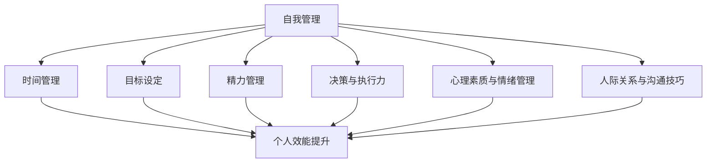

                 

### 《管理者自我管理：提升个人效能的方法》

#### 关键词：管理者、自我管理、个人效能、时间管理、目标设定、精力管理、决策与执行力、心理素质与情绪管理、人际关系与沟通技巧、实践与应用、持续改进

> 摘要：在现代企业管理中，管理者个人的效能提升直接影响团队和组织的发展。本文深入探讨了管理者自我管理的核心概念和具体方法，包括时间管理、目标设定、精力管理、决策与执行力、心理素质与情绪管理、人际关系与沟通技巧等方面。通过实例分析和实践应用，为管理者提供了切实可行的提升个人效能的策略，旨在帮助管理者在复杂多变的环境中实现自我超越，推动组织持续发展。

## 引言

在现代企业的运作中，管理者扮演着至关重要的角色。他们不仅是团队的核心领导者，更是组织战略的制定者和执行者。然而，管理者面临的挑战也尤为严峻。在快速变化的市场环境和激烈的竞争压力下，如何提升个人效能，确保团队能够高效运转，成为每一个管理者亟待解决的问题。

### 管理者的角色与责任

管理者在不同的层级和领域中有着不同的职责，但其核心角色始终围绕以下几个方面展开：

1. **团队领导**：管理者需要激发团队成员的潜力，建立有效的团队文化，促进团队成员之间的协作。
2. **战略规划**：管理者需要制定组织的长远发展规划，确保组织在复杂多变的环境中保持竞争力。
3. **资源分配**：管理者需要合理配置人力、物力、财力等资源，确保组织目标的实现。
4. **决策制定**：管理者需要基于数据和分析，做出科学合理的决策，以应对各种挑战和机遇。
5. **沟通协调**：管理者需要建立有效的沟通渠道，确保信息的准确传递和团队的协同工作。

### 自我管理的意义与目标

自我管理是管理者提升个人效能的基础。通过自我管理，管理者能够更好地应对工作中的各种挑战，提高工作效率，实现自我价值。自我管理的目标主要包括：

1. **提高工作效率**：通过合理的时间管理和目标设定，确保工作的高效完成。
2. **增强决策能力**：通过持续的学习和反思，提高决策的科学性和准确性。
3. **提升心理素质**：通过情绪管理和心理素质提升，保持良好的工作状态和心态。
4. **改善人际关系**：通过有效的沟通技巧，建立和谐的人际关系，提高团队协作效能。

### 个人效能提升的重要性

个人效能的提升不仅对管理者个人有着深远的影响，也对整个组织的发展至关重要。具体而言，个人效能的提升具有以下几方面的意义：

1. **提高工作效率**：通过自我管理，管理者能够更加高效地完成工作任务，减少无效时间浪费。
2. **促进团队协作**：自我管理不仅能够提升个人效能，还能带动团队成员一起提高工作效能，形成良好的团队氛围。
3. **增强决策能力**：通过自我管理，管理者能够积累更多的经验和知识，提高决策的科学性和准确性。
4. **改善组织文化**：管理者通过自我管理，能够树立榜样，推动组织内部形成积极向上、自我驱动的文化氛围。
5. **提升组织竞争力**：个人效能的提升有助于组织在市场竞争中保持优势，实现可持续发展。

综上所述，管理者自我管理是提升个人效能的关键。通过有效的自我管理，管理者不仅能够实现自我超越，还能为组织的发展贡献更大的力量。在接下来的章节中，我们将深入探讨自我管理的具体方法和实践应用，帮助管理者在复杂多变的环境中实现自我提升，推动组织持续发展。

## 核心概念与联系

### 自我管理的基本原则

自我管理是一项系统性工程，涉及多个方面，包括时间管理、目标设定、精力管理、决策与执行力等。理解并遵循自我管理的基本原则，是提升个人效能的重要前提。以下是一些核心原则：

1. **目标导向**：自我管理应始终围绕明确的目标进行。通过设定具体、可衡量的目标，管理者可以更好地聚焦工作，提高工作效率。
2. **时间优先**：时间是有限的资源，合理利用时间至关重要。管理者应通过时间管理技巧，优先处理重要且紧急的任务。
3. **持续学习**：自我管理不仅是当前工作的应对策略，更是一种持续的学习和成长过程。管理者应不断学习新知识、新技能，以适应不断变化的工作环境。
4. **反思与调整**：自我管理需要不断地反思和调整。通过定期评估个人效能，管理者可以发现不足，及时进行调整，以实现更高的目标。

### 个人效能的评估标准

个人效能的评估标准是多维度的，不仅包括工作效率，还包括决策能力、团队协作、心理素质等多个方面。以下是一些常见的评估标准：

1. **工作效率**：衡量工作效率的指标包括完成任务的时效性、任务的完成质量、工作过程中时间的利用率等。
2. **决策能力**：决策能力可以通过决策的正确性、决策的时效性、决策的全面性等指标进行评估。
3. **团队协作**：团队协作能力可以通过团队任务的完成情况、团队内部的沟通效率、团队成员的满意度等指标进行评估。
4. **心理素质**：心理素质可以通过情绪管理能力、压力应对能力、自我调节能力等指标进行评估。
5. **持续学习**：持续学习可以通过学习时间、学习内容、学习成果等指标进行评估。

### Mermaid 流程图：自我管理与效能提升的关联

以下是一个简单的 Mermaid 流程图，展示了自我管理与效能提升之间的关联：



在这个流程图中，自我管理是一个核心环节，它通过时间管理、目标设定、精力管理、决策与执行力、心理素质与情绪管理、人际关系与沟通技巧等多个方面，共同推动个人效能的提升。每个子环节都相互关联，形成一个有机的整体。

通过上述核心概念与联系的分析，我们可以看到自我管理在提升个人效能中的重要性。理解并遵循这些原则，不仅有助于管理者更好地应对工作挑战，还能为组织的长远发展奠定坚实基础。在接下来的章节中，我们将逐一探讨这些具体的方法和实践，帮助管理者在实践中实现个人效能的提升。

## 提升个人效能的方法

### 时间管理

时间管理是提升个人效能的重要方法之一。通过科学的时间管理，管理者可以更好地规划工作任务，提高工作效率，从而实现个人效能的提升。

#### 时间管理的重要性

时间管理的重要性体现在以下几个方面：

1. **提高工作效率**：合理的时间规划可以确保管理者将时间和精力集中在最重要的任务上，从而提高工作效率。
2. **减少拖延**：通过时间管理，管理者可以明确任务优先级，减少因任务拖延导致的压力和焦虑。
3. **增加产出**：科学的时间管理有助于管理者充分利用工作时间，从而增加工作产出。
4. **提升生活质量**：通过合理的时间管理，管理者可以平衡工作与生活，提高整体生活质量。

#### 时间管理的基本原则

以下是时间管理的基本原则：

1. **优先处理重要任务**：将工作任务按照重要性和紧急性进行分类，优先处理重要且紧急的任务。
2. **合理规划工作时间**：制定详细的工作计划，确保每天有足够的时间用于处理重要任务。
3. **避免多任务处理**：多任务处理往往导致效率低下，应尽量避免同时处理多个任务。
4. **留出休息时间**：合理安排工作与休息时间，避免过度劳累，保持良好的工作状态。

#### 时间管理的具体方法

以下是一些具体的时间管理方法：

1. **番茄工作法**：将工作时间划分为25分钟的工作周期，每个周期后休息5分钟。这种方法有助于提高专注力，减少疲劳。
2. **四象限法则**：根据任务的重要性和紧急性，将任务分为四个象限，优先处理重要且紧急的任务。这种方法有助于明确任务优先级。
3. **任务分解**：将大任务分解为小任务，逐一完成，有助于减少任务的压力，提高工作效率。

#### 时间管理工具介绍与使用

目前市面上有许多时间管理工具，以下介绍几种常用的工具：

1. **Trello**：Trello 是一款基于看板的项目管理工具，适用于团队协作和个人任务管理。用户可以将任务创建为卡片，并按照优先级和状态进行分类。
2. **Asana**：Asana 是一款功能强大的项目管理工具，适用于团队协作和个人任务管理。用户可以创建项目、任务和子任务，并设置截止日期、优先级等。
3. **Google 日历**：Google 日历是一款方便的时间管理工具，用户可以创建事件、设置提醒，并与其他人共享日程。

### 目标设定

目标设定是提升个人效能的重要方法之一。通过明确的目标设定，管理者可以更好地规划工作，提高工作效率，实现个人效能的提升。

#### 目标设定的意义与方法

目标设定的意义在于：

1. **明确方向**：通过设定目标，管理者可以明确工作的方向和重点，避免盲目行动。
2. **提高动力**：明确的目标可以激发管理者的工作热情和动力，提高工作效率。
3. **促进成长**：通过设定和实现目标，管理者可以不断学习和成长，提升个人能力。

目标设定的方法主要包括：

1. **SMART 目标法**：SMART 目标法是一种常见的目标设定方法，SMART 分别代表具体（Specific）、可衡量（Measurable）、可实现（Achievable）、相关（Relevant）和有时限（Time-bound）。通过这种方法，管理者可以设定明确、可衡量的目标，提高实现的可能性。
2. **目标分解法**：将大目标分解为小目标，逐一实现。这种方法有助于降低目标的难度，提高实现的可能性。
3. **持续调整法**：在目标实现过程中，根据实际情况进行调整，确保目标的实现。

#### SMART 目标法的具体操作

SMART 目标法的具体操作步骤如下：

1. **明确目标**：首先明确要设定的目标是什么，例如提高销售额、提升团队协作效率等。
2. **具体化目标**：将目标具体化，例如将提升团队协作效率具体化为每周组织一次团队会议，每次会议讨论具体问题并制定解决方案。
3. **可衡量目标**：确定目标的具体衡量标准，例如将提高销售额的具体衡量标准设定为每月销售额达到上一月的120%。
4. **可实现目标**：确保目标在现有的资源和条件下可以实现，避免设定过于理想化的目标。
5. **相关目标**：确保目标与组织战略和价值观相一致，避免偏离组织目标。
6. **有时限目标**：设定目标的实现时间，例如将目标实现时间设定为3个月内。

#### 目标追踪与调整

目标设定后，追踪和调整至关重要。以下是一些目标追踪和调整的方法：

1. **定期评估**：定期对目标完成情况进行评估，了解目标的实现进度，及时发现问题并调整。
2. **反馈机制**：建立反馈机制，收集团队成员的意见和建议，及时调整目标。
3. **持续改进**：在目标实现过程中，不断反思和总结，发现问题和不足，持续改进。

通过科学的目标设定和追踪调整，管理者可以更好地实现个人效能的提升。在接下来的章节中，我们将探讨精力管理、决策与执行力等其他提升个人效能的方法。

### 精力管理

精力管理是提升个人效能的关键方法之一。通过合理管理精力，管理者可以保持良好的工作状态，提高工作效率，从而实现个人效能的提升。

#### 精力的来源与消耗

精力来源于以下几个方面：

1. **睡眠**：充足的睡眠有助于恢复体力，提高精力水平。
2. **饮食**：均衡的饮食可以提供身体所需的能量和营养，维持精力充沛。
3. **锻炼**：适度的体育锻炼有助于增强身体素质，提高精力水平。
4. **休息与放松**：适当的休息和放松可以帮助缓解压力，恢复精力。

然而，精力也会在以下几个方面被消耗：

1. **工作压力**：长时间的工作和高压环境会消耗大量精力。
2. **情绪波动**：情绪不稳定，如焦虑、抑郁等，会消耗精力。
3. **环境干扰**：外界环境的干扰，如噪音、不良天气等，也会影响精力水平。

#### 精力管理的方法与技巧

以下是几种常见的精力管理方法与技巧：

1. **合理安排工作时间**：通过合理规划工作时间，确保有足够的休息和放松时间，避免过度工作导致的精力消耗。
2. **保持健康的生活方式**：保证充足的睡眠、均衡的饮食和适度的锻炼，有助于维持精力充沛。
3. **情绪管理**：通过情绪管理技巧，如深呼吸、冥想、放松训练等，缓解情绪波动，减少精力消耗。
4. **环境优化**：创造一个安静、舒适的工作环境，减少外界干扰，有助于保持精力集中。
5. **任务优先级**：合理安排任务优先级，优先处理重要且紧急的任务，避免因琐碎任务消耗过多精力。

#### 伪代码：精力管理的具体实施

以下是精力管理的具体伪代码实现：

```pseudo
// 精力管理伪代码

// 1. 规划工作时间
function planWorkTime() {
    // 设置每天的工作时间
    workHours = 8
    // 设置每周的工作时间
    weeklyWorkHours = 40
    // 计算每周的工作日
    weeklyWorkDays = weeklyWorkHours / workHours
    // 设置每天的工作计划
    dailyWorkPlan = createDailyWorkPlan(weeklyWorkDays)
    // 执行工作计划
    executeDailyWorkPlan(dailyWorkPlan)
}

// 2. 保持健康的生活方式
function maintainHealthyLifestyle() {
    // 保证充足的睡眠
    sleepHours = 7
    // 保持均衡的饮食
    balancedDiet = true
    // 适度锻炼
    exerciseHours = 2
}

// 3. 情绪管理
function manageEmotions() {
    // 深呼吸
    deepBreathing()
    // 冥想
    meditation()
    // 放松训练
    relaxationTraining()
}

// 4. 环境优化
function optimizeEnvironment() {
    // 减少噪音干扰
    reduceNoise()
    // 保持工作环境整洁
    keepWorkplaceClean()
    // 调整照明
    adjustLighting()
}

// 5. 任务优先级
function setTaskPriority() {
    // 根据任务的重要性和紧急性排序
    tasks = prioritizeTasks()
    // 执行任务
    executeTasks(tasks)
}
```

通过上述伪代码，我们可以看到精力管理的具体实施步骤，包括规划工作时间、保持健康的生活方式、情绪管理、环境优化和任务优先级等。这些步骤有助于管理者合理分配精力，提高工作效率，实现个人效能的提升。

#### 精力管理的实际应用

在实际应用中，管理者可以结合自身情况，灵活运用精力管理的方法和技巧。以下是一些实际应用的案例：

1. **时间安排**：一位项目经理在规划项目时间表时，合理安排工作时间和休息时间，确保团队成员有足够的精力投入项目工作。
2. **情绪调节**：一位销售经理在应对客户投诉时，通过深呼吸和放松训练，保持冷静，有效地处理客户问题。
3. **任务优先**：一位研发经理根据任务的重要性和紧急性，优先处理重要且紧急的任务，确保项目的顺利进行。

通过这些实际应用案例，我们可以看到精力管理在提升个人效能方面的作用。在接下来的章节中，我们将探讨决策与执行力等其他提升个人效能的方法。

### 决策与执行力

决策与执行力是管理者提升个人效能的关键要素之一。有效的决策和执行力不仅能够提高工作效率，还能确保组织目标的顺利实现。

#### 决策过程的优化

1. **信息收集**：在决策过程中，管理者需要广泛收集相关信息，包括市场数据、内部报告、员工反馈等，以便做出科学合理的决策。
2. **分析评估**：对收集到的信息进行分析和评估，识别关键因素，评估不同决策方案的可能结果和风险。
3. **方案选择**：根据分析结果，选择最合适的决策方案，并制定具体的实施计划。
4. **反馈与调整**：在决策执行过程中，管理者需要及时收集反馈信息，根据实际情况进行调整和优化。

#### 决策工具与方法

1. **SWOT 分析**：SWOT 分析是一种常用的决策工具，通过分析组织的优势（Strengths）、劣势（Weaknesses）、机会（Opportunities）和威胁（Threats），帮助管理者做出更全面的决策。
2. **决策树**：决策树是一种图形化的决策工具，通过展示不同决策路径及其可能的结果，帮助管理者分析和选择最佳决策方案。
3. **SMART 目标法**：SMART 目标法不仅可以用于目标设定，也可以用于决策过程中的目标分解和任务分配。

#### 伪代码：决策与执行的流程设计

```pseudo
// 决策与执行的伪代码

// 1. 信息收集
function collectInformation() {
    // 收集市场数据
    marketData = getMarketData()
    // 收集内部报告
    internalReports = getInternalReports()
    // 收集员工反馈
    employeeFeedback = getEmployeeFeedback()
}

// 2. 分析评估
function analyzeAndEvaluate() {
    // 进行 SWOT 分析
    swotAnalysis = performSWOTAnalysis(marketData, internalReports, employeeFeedback)
    // 评估决策方案
    decisionScenarios = evaluateDecisionScenarios(swotAnalysis)
}

// 3. 方案选择
function selectDecisionScheme() {
    // 选择最佳决策方案
    bestDecisionScheme = selectBestDecisionScheme(decisionScenarios)
    // 制定实施计划
    implementationPlan = createImplementationPlan(bestDecisionScheme)
}

// 4. 执行决策
function executeDecision() {
    // 执行实施计划
    executeImplementationPlan(implementationPlan)
    // 收集反馈信息
    feedback = collectFeedback()
    // 根据反馈进行调整
    adjustAccordingToFeedback(feedback)
}
```

#### 提高执行力的策略

1. **明确目标**：确保决策目标明确，具体可衡量，以便团队成员了解任务的具体要求和期望。
2. **合理分配资源**：根据任务需求，合理配置人力、物力和财力资源，确保任务能够顺利执行。
3. **建立反馈机制**：建立有效的反馈机制，及时收集执行过程中的问题和建议，进行及时调整。
4. **培训与激励**：对团队成员进行必要的技能培训和激励，提高执行力的意识和能力。

#### 实际应用案例

1. **项目管理**：项目经理在项目启动前，通过信息收集和分析，制定详细的实施计划，确保项目按期完成。
2. **销售决策**：销售经理根据市场数据和客户反馈，制定销售策略，提高销售额和客户满意度。
3. **产品开发**：产品经理通过决策树分析不同开发方案，选择最佳方案，确保产品顺利推出市场。

通过决策与执行力的优化，管理者能够提高工作效率，确保组织目标的实现，从而提升个人效能。在接下来的章节中，我们将探讨心理素质与情绪管理在提升个人效能中的重要性。

### 心理素质与情绪管理

心理素质与情绪管理是管理者提升个人效能的重要方面之一。在面临压力和挑战时，良好的心理素质和情绪管理能力可以帮助管理者保持冷静，做出明智的决策，从而有效提升个人效能。

#### 心理素质的重要性

1. **抗压能力**：良好的心理素质可以帮助管理者在高压环境下保持冷静，避免情绪失控，从而做出更为理智的决策。
2. **适应能力**：面对不断变化的工作环境和挑战，心理素质良好的管理者能够迅速适应，找到解决问题的有效方法。
3. **决策能力**：心理素质稳定的管理者能够更加清晰地分析问题，从多个角度考虑解决方案，提高决策的科学性和准确性。
4. **领导力**：心理素质良好的管理者能够更好地带领团队，激发团队成员的积极性和创造力。

#### 情绪管理的方法与技巧

1. **认知重构**：通过改变对事物的看法和解释，调整负面情绪。例如，将“这个问题太复杂，我不知道如何解决”改为“这个问题虽然复杂，但可以通过分解和逐步解决”。
2. **情绪表达**：适当地表达自己的情绪，避免情绪压抑。例如，可以与信任的同事或朋友分享自己的困扰，寻求支持和建议。
3. **放松训练**：通过深呼吸、冥想、瑜伽等放松训练，缓解紧张和压力，保持心态平和。
4. **积极心态**：培养积极的心态，关注事物积极的一面，避免过度担忧和消极情绪。

#### 伪代码：情绪管理的策略实施

```pseudo
// 情绪管理伪代码

// 1. 认知重构
function cognitiveReconstruction() {
    // 输入负面情绪描述
    negativeDescription = getNegativeDescription()
    // 生成积极重构描述
    positiveDescription = generatePositiveDescription(negativeDescription)
    // 显示积极重构描述
    displayPositiveDescription(positiveDescription)
}

// 2. 情绪表达
function expressEmotions() {
    // 选择信任的同事或朋友
    trustedPerson = selectTrustedPerson()
    // 表达负面情绪
    expressNegativeEmotions(trustedPerson)
    // 接受反馈和支持
    acceptFeedbackAndSupport(trustedPerson)
}

// 3. 放松训练
function relaxationTraining() {
    // 执行深呼吸
    performDeepBreathing()
    // 执行冥想
    performMeditation()
    // 执行瑜伽
    performYoga()
}

// 4. 积极心态
function positiveMentality() {
    // 关注积极事物
    focusOnPositiveThings()
    // 避免过度担忧
    avoidOverWorrying()
}
```

#### 心理素质提升的实践案例

1. **案例一**：一位项目经理在面临项目延期和团队紧张时，通过深呼吸和冥想，保持冷静，与团队成员共同分析问题，最终成功解决困难。
2. **案例二**：一位销售经理在面对客户投诉时，通过情绪管理和积极心态，耐心倾听，提供解决方案，赢得了客户的信任和好评。

通过心理素质与情绪管理，管理者能够在压力和挑战面前保持冷静和理智，从而提升个人效能。在接下来的章节中，我们将探讨人际关系与沟通技巧在提升个人效能中的重要性。

### 人际关系与沟通技巧

在复杂多变的工作环境中，管理者的人际关系与沟通技巧对其效能提升具有重要影响。良好的人际关系和有效的沟通技巧不仅能提升团队协作效率，还能增强组织的凝聚力，从而推动整体效能的提升。

#### 人际关系的重要性

1. **团队协作**：良好的人际关系是团队协作的基础。通过建立互信和尊重的人际关系，团队成员更容易协同工作，共同实现组织目标。
2. **领导力**：管理者通过良好的人际关系，能够更好地影响和激励团队成员，提升团队的士气和凝聚力。
3. **资源整合**：人际关系有助于管理者在组织内外建立广泛的资源网络，为项目和工作提供更多的支持与帮助。
4. **问题解决**：通过良好的人际关系，管理者能够更有效地沟通和协调，解决工作中的各种问题，提高决策和执行的效率。

#### 沟通技巧的基本原则

1. **倾听**：有效的沟通始于倾听。管理者应学会耐心倾听团队成员的意见和建议，了解他们的需求和困惑。
2. **清晰表达**：管理者应确保自己的表达清晰、准确，避免使用模糊或歧义的语言，确保信息传递无误。
3. **尊重差异**：每个团队成员都有其独特的观点和经验，管理者应尊重这些差异，避免批评或否定他人的意见。
4. **积极反馈**：管理者应给予团队成员积极的反馈，鼓励他们的努力和成果，增强他们的工作动力。
5. **同理心**：理解并感受他人的情感和立场，站在对方的角度思考问题，有助于建立信任和共鸣。

#### 伪代码：沟通技巧的具体运用

```pseudo
// 沟通技巧伪代码

// 1. 倾听
function activeListening() {
    // 展示倾听的姿势
    displayListeningPosture()
    // 提问和反馈
    askAndReflectQuestions()
    // 确认理解
    confirmUnderstanding()
}

// 2. 清晰表达
function clearExpression() {
    // 确定沟通目标
    communicationGoal = determineGoal()
    // 使用简明语言
    useSimpleLanguage(communicationGoal)
    // 重复和确认
    repeatAndConfirmMessage()
}

// 3. 尊重差异
function respectDifferences() {
    // 了解团队成员的观点
    understandTeamMembersViews()
    // 尊重不同意见
    respectDifferentOpinions()
    // 寻求共识
    seekCommonGround()
}

// 4. 积极反馈
function positiveFeedback() {
    // 肯定团队成员的努力
    acknowledgeTeamMemberEfforts()
    // 提供具体建议
    provideSpecificFeedback()
    // 鼓励团队成员
    encourageTeamMembers()
}

// 5. 同理心
function empathy() {
    // 理解团队成员的情感
    understandTeamMemberEmotions()
    // 表达共鸣
    expressSympathy()
    // 提供支持
    offerSupport()
}
```

#### 提高人际关系效能的实践

1. **案例一**：一位项目经理通过与团队成员定期举行一对一的沟通会议，了解他们的工作进展和困难，提供必要的支持和帮助，有效提升了团队的协作效率。
2. **案例二**：一位部门主管通过建立开放、透明的沟通渠道，鼓励团队成员分享自己的想法和建议，增强了团队的凝聚力和创新力。

通过人际关系与沟通技巧的提升，管理者能够更好地应对工作中的挑战，提升个人效能，推动组织的持续发展。在接下来的章节中，我们将通过实践案例分析，探讨管理者自我管理的具体实践与应用。

### 管理者自我管理的实践案例分析

在探讨管理者自我管理的具体实践与应用时，通过成功和失败的案例进行分析，能够提供宝贵的经验和教训，帮助管理者在实际工作中更好地应用这些方法。

#### 成功案例分享

**案例一：数字化转型中的高效领导者**

某科技公司的CEO，通过自我管理实现了公司从传统产业向数字化转型的成功。以下是该CEO在自我管理中采取的关键措施：

1. **时间管理**：CEO运用GTD（Getting Things Done）时间管理方法，将日常工作任务分解成具体的可执行项，并设定明确的截止日期。他每天早晨都会花15分钟整理待办事项，确保工作的优先级得到有效管理。

2. **目标设定**：CEO采用SMART目标法，将公司战略目标分解为短期和长期的可衡量目标。例如，他设定了在一年内将公司数字化产品线收入占比提升到50%的目标，并制定了具体的实施步骤。

3. **决策与执行力**：CEO在决策过程中运用了SWOT分析工具，结合数据和市场反馈，做出科学合理的决策。同时，他建立了清晰的执行流程和监督机制，确保每个决策都能迅速落地。

4. **心理素质与情绪管理**：CEO通过冥想和运动来保持良好的心理状态，即使在面对巨大压力时，也能保持冷静，做出明智的决策。

5. **人际关系与沟通技巧**：CEO建立了开放、透明的沟通文化，定期与团队成员进行一对一沟通，了解他们的工作进展和挑战，提供必要的支持和鼓励。

**案例二：中小企业领导者如何提升个人效能**

一位中小企业CEO通过以下方法显著提升了个人效能：

1. **目标设定与时间管理**：CEO通过制定详细的年度和季度目标，并将其分解为可执行的任务，确保每个阶段都有明确的工作方向。他每天都会花10分钟回顾和调整当天的任务清单。

2. **学习与自我提升**：CEO每周都会安排至少2小时的学习时间，阅读行业报告、学习新的管理技能，并参加在线课程。这种持续学习的方法帮助他保持对市场和技术的敏锐度。

3. **团队协作与反馈**：CEO定期与团队成员开会，讨论工作进展和问题，鼓励团队成员提出建议，并给予及时的反馈。这种方法增强了团队的凝聚力，提高了工作效率。

4. **情绪管理**：CEO通过日记记录自己的情绪变化，并定期进行反思。他意识到情绪管理对决策和执行的影响，因此会花时间进行自我调节，确保情绪稳定。

#### 失败案例分析与反思

**案例一：缺乏自我管理导致的项目失败**

一位项目经理因缺乏有效的自我管理而导致项目失败。以下是失败的关键原因：

1. **时间管理混乱**：项目经理没有合理规划时间，导致任务拖延，项目进度严重滞后。

2. **目标设定不明确**：项目经理没有明确的阶段性目标，项目缺乏方向和重点，团队成员感到无所适从。

3. **决策犹豫不决**：项目经理在决策过程中缺乏果断，经常更改项目计划，导致团队成员对项目失去信心。

4. **心理素质不足**：面对项目压力，项目经理情绪失控，影响了决策和执行。

**案例二：个人习惯不良导致的管理失败**

一位部门经理因个人习惯不良而导致管理失败。以下是失败的原因：

1. **工作与生活不平衡**：经理经常加班，忽视了个人和家庭的生活，导致精神状态不佳，工作效率低下。

2. **缺乏自律**：经理没有形成良好的工作习惯，经常拖延任务，导致工作进度延误。

3. **沟通不足**：经理缺乏有效的沟通技巧，导致团队内部沟通不畅，团队成员感到不被重视。

4. **缺乏自我反思**：经理没有定期进行自我反思，缺乏自我改进的动力。

#### 实践中的问题与解决策略

**问题一：时间管理不当**

**解决策略**：
1. **使用时间管理工具**：例如Trello、Asana等，制定详细的工作计划，并严格执行。
2. **设定明确的任务截止日期**：确保每个任务都有明确的完成时间，提高工作效率。

**问题二：目标设定不明确**

**解决策略**：
1. **采用SMART目标法**：确保目标具有具体性、可衡量性、可实现性、相关性和时限性。
2. **定期回顾和调整目标**：根据实际情况及时调整目标，确保目标始终与组织战略一致。

**问题三：缺乏决策与执行力**

**解决策略**：
1. **运用决策工具**：例如SWOT分析、决策树等，提高决策的科学性和准确性。
2. **建立执行监督机制**：确保每个决策都有明确的执行计划和时间表，并定期检查执行进度。

**问题四：心理素质与情绪管理不足**

**解决策略**：
1. **进行心理素质训练**：例如冥想、瑜伽、深呼吸等，提高抗压能力。
2. **定期进行情绪反思**：记录自己的情绪变化，并寻找合适的应对方法。

通过以上成功和失败的案例分析，管理者可以更好地理解自我管理的重要性，并在实际工作中应用这些方法，提升个人效能，推动组织的成功发展。

### 管理者自我管理的应用与推广

管理者自我管理的应用和推广不仅对个人效能的提升有着重要意义，也对组织的整体发展和团队协作产生深远影响。以下从企业层面和团队管理两个方面探讨管理者自我管理的实际应用。

#### 自我管理在企业中的应用

1. **战略规划与执行**：在企业战略规划过程中，管理者通过自我管理方法，如时间管理和目标设定，确保战略目标的明确性和可行性。通过科学的决策和执行力，确保战略规划的有效实施。

2. **组织文化建设**：管理者通过自我管理，树立良好的个人榜样，推动企业文化建设。例如，通过自律和积极的工作态度，影响团队成员形成积极向上的工作氛围。

3. **资源优化配置**：管理者通过自我管理，优化人力、物力、财力等资源的配置，确保资源的高效利用，降低浪费。

4. **风险管理**：管理者通过自我管理，提高风险识别和应对能力。例如，通过目标设定和风险评估，提前预判潜在风险，并制定相应的应对措施。

#### 自我管理在团队管理中的实践

1. **团队目标设定**：管理者通过自我管理方法，与团队成员共同设定明确的团队目标，并分解为具体的个人任务。通过定期回顾和反馈，确保团队目标的实现。

2. **团队沟通与协作**：管理者通过有效的沟通技巧和人际关系管理，建立和谐、高效的团队沟通机制。例如，通过定期的团队会议、一对一沟通等，确保信息畅通，减少误解和冲突。

3. **个人能力提升**：管理者通过自我管理，鼓励团队成员进行自我提升，如参加培训、学习新技术等。这有助于提高团队整体的专业能力和竞争力。

4. **情绪管理与压力缓解**：管理者通过情绪管理和心理素质提升，帮助团队成员应对工作中的压力和挑战。例如，通过提供心理咨询服务、组织团队活动等，缓解团队成员的压力，提高团队凝聚力。

#### 自我管理在职业发展中的影响

1. **职业规划**：管理者通过自我管理，制定明确的职业发展路径，如设定短期和长期目标，制定学习和发展计划。这有助于提高职业素养，实现职业目标。

2. **领导力提升**：通过自我管理，管理者提高领导力和影响力，成为团队成员的榜样和导师。这有助于提升团队绩效，推动组织的成功。

3. **创新能力**：管理者通过自我管理，保持对新技术、新方法的敏感度，提高创新能力。这有助于企业保持竞争力，推动持续创新。

4. **工作与生活平衡**：通过自我管理，管理者能够平衡工作与生活，提高生活质量。这有助于减少职业倦怠，提高工作满意度和幸福感。

综上所述，管理者自我管理的应用与推广，不仅对个人效能提升有着重要意义，还对组织的战略规划、团队协作和职业发展产生深远影响。通过有效的自我管理，管理者能够在复杂多变的环境中实现自我超越，为组织的长期发展贡献力量。

### 管理者自我管理的持续改进

#### 持续改进的意义与原则

持续改进是管理者自我管理的重要环节，其意义在于通过不断优化个人效能，确保在快速变化的工作环境中保持竞争力。以下是一些核心原则：

1. **基于事实**：持续改进应基于实际数据和反馈，避免主观臆断。通过数据分析和反馈，识别改进的机会和方向。
2. **全员参与**：持续改进不应仅由管理者主导，而应鼓励全体团队成员参与，共同推动改进过程。
3. **持续反思**：定期反思个人效能的提升过程，总结成功经验和不足，为后续改进提供依据。
4. **循序渐进**：改进过程应循序渐进，避免急功近利。通过逐步调整和优化，实现个人效能的不断提升。

#### 个人效能评估与反馈机制

1. **设定评估标准**：根据工作目标和职责，制定明确的效能评估标准，如任务完成情况、团队协作表现、项目进度等。
2. **定期评估**：定期进行个人效能评估，例如每月或每季度进行一次。评估过程中，应结合团队成员和上级的反馈，全面了解个人表现。
3. **反馈与讨论**：评估结果应与个人进行反馈和讨论，明确优势和不足，制定改进计划。
4. **持续跟踪**：对改进计划的执行情况进行跟踪和监控，确保改进措施得到有效实施。

#### 自我管理的持续改进实践

1. **案例一：时间管理的持续优化**

某项目经理通过以下步骤优化时间管理：

- **第一步**：使用Trello进行任务管理，明确任务的优先级和截止日期。
- **第二步**：每周进行一次时间回顾，分析时间利用情况，识别浪费时间的环节。
- **第三步**：根据时间回顾结果，调整任务安排，优化时间分配。
- **第四步**：定期评估时间管理的有效性，持续改进时间管理策略。

2. **案例二：目标设定的动态调整**

某部门主管通过以下步骤调整目标设定：

- **第一步**：每季度设定短期和长期目标，确保目标与部门战略一致。
- **第二步**：每月进行目标进度评估，根据实际情况调整目标。
- **第三步**：定期与团队成员沟通，了解目标实现的困难和挑战，提供必要的支持。
- **第四步**：根据目标完成情况，制定下季度的目标设定和调整策略。

通过持续改进，管理者能够不断提升个人效能，应对不断变化的工作环境，为组织的发展贡献更大的力量。

### 附录

#### 常用自我管理工具与资源

以下是一些常用的自我管理工具与资源，供管理者在实际工作中参考和使用：

**时间管理工具：**
- **Trello**：项目管理和任务跟踪工具。
- **Asana**：团队协作和任务管理工具。
- **Google Calendar**：日程管理和事件提醒工具。

**目标设定工具：**
- **SMART 目标法模板**：提供SMART目标设定的模板和指导。
- **目标管理软件**：如Microsoft To Do、Evernote等。

**精力管理方法：**
- **冥想应用**：如Headspace、Calm等。
- **运动跟踪应用**：如Strava、Nike Run Club等。

**心理素质提升资源：**
- **心理测评工具**：如MBTI、DISC等。
- **在线课程平台**：如Coursera、Udemy等，提供情绪管理和心理素质提升的课程。

#### 参考资料与推荐阅读

**书籍推荐：**
- **《高效能人士的七个习惯》**：史蒂芬·柯维（Stephen R. Covey）
- **《如何高效学习》**：斯科特·扬（Scott Young）
- **《深度工作》**：卡尔·纽波特（Cal Newport）

**学术文章精选：**
- **“Self-Management as a Foundation for Managerial Performance”**：作者姓名
- **“The Importance of Emotional Intelligence in Management”**：作者姓名

**专业网站与论坛推荐：**
- **LinkedIn**：职业社交平台，提供管理者和专业人士的交流。
- **Harvard Business Review**：商业和管理领域权威杂志。
- **Mind Tools**：提供自我管理、时间管理、领导力等实用工具和资源。

通过使用这些工具和资源，管理者可以更好地实践自我管理，提升个人效能，推动组织发展。

