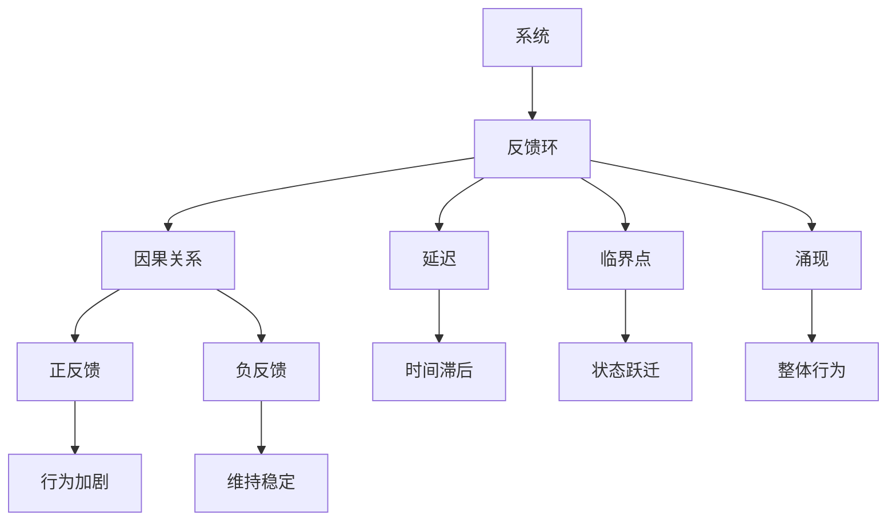

                 

### 《系统思考：管理者必备的思维利器》

> **关键词：** 系统思考、系统动力学、管理、方法论、实践、算法原理

> **摘要：** 系统思考是一种强大的管理工具，它帮助管理者理解复杂系统的行为，从而优化决策和提升组织效率。本文将详细介绍系统思考的基础概念、方法论和实践技巧，并通过具体案例展示其在实际应用中的价值。

---

### 目录大纲

1. **第一部分：系统思考的基础**

    - **第1章：系统思考的概述**
        - **1.1 系统思考的重要性**
        - **1.2 系统思考的核心概念**
        - **1.3 系统思考与线性思维的对比**
        - **1.4 系统思考的应用场景**

    - **第2章：系统动力学的核心概念**
        - **2.1 系统动力学的定义**
        - **2.2 系统结构与行为的关系**
        - **2.3 系统反馈环的类型**
        - **2.4 系统动力学模型构建**

    - **第3章：核心概念与联系**
        - **3.1 系统思考中的关键概念**
        - **3.2 关键概念之间的联系**
        - **3.3 系统动力学的 Mermaid 流程图**

2. **第二部分：系统思考的方法论**

    - **第4章：系统思考工具与技术**
        - **4.1 系统动力学软件工具**
        - **4.2 敏捷管理工具**
        - **4.3 系统思考中的数据可视化技术**
        - **4.4 系统思考的案例分析**

    - **第5章：系统思考在组织管理中的应用**
        - **5.1 系统思考在战略规划中的应用**
        - **5.2 系统思考在运营管理中的应用**
        - **5.3 系统思考在项目管理中的应用**
        - **5.4 系统思考在创新管理中的应用**

    - **第6章：系统思考中的核心算法原理**
        - **6.1 系统思考中的关键算法**
        - **6.2 算法原理的伪代码阐述**
        - **6.3 算法在实际案例中的应用**
        - **6.4 算法的局限性和改进方向**

3. **第三部分：系统思考实践**

    - **第7章：系统思考实践案例**
        - **7.1 案例一：企业创新管理中的系统思考**
        - **7.2 案例二：复杂供应链管理中的系统思考**
        - **7.3 案例三：社会问题解决中的系统思考**

    - **第8章：系统思考实践指南**
        - **8.1 系统思考实践步骤**
        - **8.2 实践中的常见问题与解决方法**
        - **8.3 系统思考实践的成果评估**

4. **附录**

    - **附录A：系统思考资源与工具**
        - **A.1 系统思考相关的书籍推荐**
        - **A.2 系统思考相关的在线课程**
        - **A.3 系统思考相关的软件工具介绍**

    - **附录B：系统思考数学模型与公式**
        - **B.1 系统动力学中的基本方程**
        - **B.2 系统思考中的反馈环模型**
        - **B.3 系统思考中的稳定性分析公式**
        - **B.4 系统思考中的灵敏度分析公式**

    - **附录C：项目实战代码示例**
        - **C.1 系统思考实战项目环境搭建**
        - **C.2 项目一：企业创新管理的系统思考实现**
        - **C.3 项目二：复杂供应链管理的系统思考实现**
        - **C.4 项目三：社会问题解决的系统思考实现**
        - **C.5 代码解读与分析**

### 总结

系统思考是一种重要的管理思维工具，能够帮助管理者更好地理解复杂系统，预测系统行为，优化系统性能。通过本书的学习，读者将掌握系统思考的核心概念、方法论和实践技巧，能够在实际工作中有效地应用系统思考，提升管理能力。

---

接下来，我们将分章节深入探讨系统思考的基础知识、方法论以及实践应用，帮助读者全面掌握这一管理利器。让我们一步一步地走进系统思考的世界，开启新的思维之旅。

---

### 第一部分：系统思考的基础

#### 第1章：系统思考的概述

在本章中，我们将探讨系统思考的起源、重要性及其核心概念。系统思考是一种强大的工具，它帮助管理者理解复杂系统的运作方式，从而做出更加明智的决策。

#### 1.1 系统思考的重要性

系统思考之所以重要，是因为它能够帮助我们超越简单的线性思维，深入了解复杂系统的内在机制和动态行为。在现代社会，系统无处不在，从企业管理到生态系统，从金融市场到社会网络，都充满了复杂的相互作用和反馈环。只有通过系统思考，我们才能更好地理解这些复杂系统，并对其进行有效的管理和优化。

首先，系统思考能够帮助我们识别系统中的关键因素和关键相互作用。在企业管理中，系统思考可以帮助我们识别影响企业绩效的关键因素，如市场需求、供应链、人力资源等，并分析它们之间的相互关系和反馈机制。通过这种深入的理解，我们可以更好地制定战略规划，优化业务流程，提高企业的整体绩效。

其次，系统思考能够帮助我们预测系统的行为。通过建立系统动力学模型，我们可以模拟系统的行为，预测未来可能发生的变化和趋势。这种预测能力对于管理决策至关重要，可以帮助企业在面对不确定性和变化时做出更加明智的决策。

最后，系统思考能够帮助我们优化系统的性能。通过分析系统的反馈环和关键因素，我们可以找到系统中的瓶颈和改进点，从而优化系统的性能。例如，在供应链管理中，通过系统思考可以识别供应链中的瓶颈环节，优化库存管理，降低成本，提高供应链的整体效率。

总之，系统思考是一种强大的管理工具，它能够帮助管理者更好地理解复杂系统，预测系统行为，优化系统性能。通过系统思考，管理者可以更加深入地了解企业内部和外部环境，制定更加有效的战略规划，提高企业的竞争力和创新能力。

#### 1.2 系统思考的核心概念

系统思考的核心概念包括系统、反馈环、因果关系、临界点和涌现等。这些概念是理解系统行为和动态变化的基础。

**1.2.1 系统**

系统是由多个相互关联的组成部分组成的整体。每个组成部分都有自己的功能和特性，但它们共同作用，形成了一个复杂的整体。在企业管理中，系统可以是企业内部的各种组织结构、业务流程、人力资源等。在生态系统中，系统可以是生物群落、食物链等。

**1.2.2 反馈环**

反馈环是系统中的一个关键概念，它描述了系统内部各个组成部分之间的相互作用和影响。反馈环可以分为正反馈环和负反馈环。正反馈环会导致系统的行为加剧，而负反馈环则有助于系统的稳定。在企业管理中，正反馈环可能表现为员工士气高涨带来的业务增长，而负反馈环可能表现为质量问题导致的生产效率下降。

**1.2.3 因果关系**

因果关系描述了系统中各个组成部分之间的逻辑关系。在系统思考中，因果关系不仅仅是直接的因果关系，还包括延迟因果关系。延迟因果关系是指一个因素对另一个因素的影响不是即时的，而是经过一段时间才显现出来。这种延迟可能导致系统行为的不可预测性。

**1.2.4 临界点**

临界点是系统中的一个关键转折点，它标志着系统从一种状态转变到另一种状态。临界点的出现通常伴随着系统行为的急剧变化。在生态系统中，临界点可能表现为物种的灭绝或生态系统的崩溃。在企业管理中，临界点可能表现为市场饱和或企业破产。

**1.2.5 涌现**

涌现是系统思考中的一个重要概念，它描述了系统整体行为和属性的出现，这些行为和属性无法从单个组成部分中推导出来。例如，在社交网络中，个体行为可能会导致整个网络的社交模式发生改变，这就是涌现现象。

#### 1.3 系统思考与线性思维的对比

系统思考与线性思维是两种不同的思考方式。线性思维是一种简单的因果关系思维方式，它假设系统中的变化是线性的，可以预测的。而系统思考则是一种复杂的动态思维方式，它考虑系统内部的反馈环和相互作用。

**1.3.1 线性思维的局限**

线性思维的局限在于它忽略了系统内部的反馈环和延迟因果关系。例如，在企业管理中，线性思维可能认为只要提高生产效率，就能提高企业的盈利能力。但实际上，提高生产效率可能会带来库存积压、质量问题等问题，这些问题会反过来影响企业的盈利能力。

**1.3.2 系统思考的优势**

系统思考的优势在于它能够帮助我们更全面地理解系统的行为和动态变化。通过系统思考，我们可以识别系统中的关键因素和反馈环，预测系统行为的变化趋势，从而做出更加明智的决策。

**1.3.3 应用实例**

在企业管理中，系统思考可以应用于战略规划、运营管理、项目管理等方面。例如，在战略规划中，系统思考可以帮助企业识别影响战略实施的关键因素，并预测这些因素的未来变化趋势，从而制定更加有效的战略规划。

#### 1.4 系统思考的应用场景

系统思考可以应用于各种场景，包括企业管理、生态系统管理、社会问题解决等。以下是几个典型的应用场景：

**1.4.1 企业管理**

在企业管理中，系统思考可以应用于战略规划、运营管理、项目管理等方面。通过系统思考，企业可以识别影响绩效的关键因素，优化业务流程，提高整体效率。

**1.4.2 生态系统管理**

在生态系统管理中，系统思考可以帮助我们理解生态系统的动态变化，预测生态系统的未来状态，从而制定更加有效的保护和管理策略。

**1.4.3 社会问题解决**

在社会问题解决中，系统思考可以帮助我们理解社会问题的复杂性和动态变化，从而制定更加有效的解决方案。例如，在环境保护问题中，系统思考可以帮助我们识别影响环境质量的关键因素，预测环境变化趋势，制定环境保护策略。

### 第2章：系统动力学的核心概念

系统动力学是一门研究系统内部结构、反馈环和动态行为之间关系的学科。它为理解和管理复杂系统提供了强大的工具和方法。在本章中，我们将深入探讨系统动力学的核心概念，包括系统动力学的定义、系统结构与行为的关系、系统反馈环的类型和系统动力学模型的构建。

#### 2.1 系统动力学的定义

系统动力学（System Dynamics）是一种用于研究复杂系统动态行为的分析方法。它通过建立系统模型，模拟系统在不同条件下的行为和响应，从而帮助理解系统的运作机制和预测未来的变化趋势。系统动力学特别适用于那些包含大量延迟、反馈环和相互作用的系统。

系统动力学模型通常基于以下假设：

1. **时间延迟**：系统的变化不是瞬时发生的，而是存在时间延迟。
2. **反馈环**：系统内部存在正反馈环和负反馈环，这些反馈环会影响系统的稳定性和行为。
3. **相互作用**：系统中的各个组成部分相互影响，这些相互作用会导致系统的复杂行为。

#### 2.2 系统结构与行为的关系

系统动力学研究系统内部结构与其行为之间的关系。系统结构是指系统内部的组成部分、连接方式和相互作用。系统行为则是指系统在特定环境下的动态表现。

**2.2.1 结构与行为的紧密联系**

系统结构与行为之间存在紧密的联系。系统的内部结构决定了其行为模式，而系统的行为反过来又影响其结构。例如，在一个经济系统中，生产与消费、投资与储蓄等相互作用决定了经济的增长模式。如果经济增长过快，可能导致通货膨胀和资源短缺，从而改变系统的结构。

**2.2.2 动态行为分析**

通过系统动力学模型，我们可以分析系统的动态行为。这包括：

- **稳态分析**：研究系统在长时间运行后达到的稳定状态。
- **瞬态分析**：研究系统在初始条件或外部扰动下的短期行为。
- **敏感性分析**：研究系统对参数变化的响应。

#### 2.3 系统反馈环的类型

系统动力学中的反馈环是理解系统行为的关键。反馈环可以分为正反馈环和负反馈环。

**2.3.1 正反馈环**

正反馈环是一个循环，其中系统的输出增加会进一步增加输入，导致系统行为加剧。正反馈环通常会导致系统的行为迅速增长或崩溃。例如，在病毒传播中，一个感染者会增加更多的新感染者，从而导致疫情迅速蔓延。

**2.3.2 负反馈环**

负反馈环是一个循环，其中系统的输出减少会减少输入，从而有助于系统的稳定。负反馈环通常用于维持系统的平衡。例如，在体温调节中，当体温升高时，身体会通过出汗来降低体温，从而维持体温的稳定。

**2.3.3 反馈环的相互作用**

在复杂的系统中，正反馈环和负反馈环可能同时存在，并相互作用。这种相互作用会导致系统的行为表现出非线性、复杂和多变的特征。理解这些反馈环的相互作用是系统动力学研究的重要方向。

#### 2.4 系统动力学模型构建

构建系统动力学模型是系统动力学研究的关键步骤。一个有效的系统动力学模型需要准确地反映系统内部的反馈环、延迟关系和关键变量。

**2.4.1 模型构建过程**

1. **系统定义**：明确研究系统的范围和目标。
2. **变量识别**：识别系统中的关键变量，如库存、需求、价格等。
3. **关系建立**：确定变量之间的因果关系和反馈环。
4. **数学建模**：使用数学方程来表示变量之间的关系。
5. **模型验证**：通过实际数据或实验来验证模型的准确性。
6. **模型优化**：根据验证结果对模型进行调整和优化。

**2.4.2 模型构建工具**

系统动力学模型可以使用多种工具构建，如Vensim、Stella和AnyLogic等。这些工具提供了直观的建模界面和丰富的模拟功能，使得构建和验证系统动力学模型更加容易。

#### 案例研究：供应链系统动力学模型

为了更好地理解系统动力学的应用，我们以一个简单的供应链系统为例进行案例分析。

**案例背景**：

假设一个供应链系统由生产商、分销商和零售商组成。生产商负责生产商品，分销商负责将商品分销到零售商，零售商则将商品销售给最终消费者。

**关键变量**：

- **库存**：生产商、分销商和零售商的库存水平。
- **需求**：消费者的需求量。
- **价格**：商品的价格水平。

**关系建立**：

- **生产商与分销商**：生产商的库存减少，分销商的需求增加。
- **分销商与零售商**：分销商的库存减少，零售商的需求增加。
- **零售商与消费者**：零售商的库存减少，消费者的需求增加。

**数学建模**：

我们使用以下方程来表示这些关系：

\[ \text{生产商库存变化} = \text{生产速率} - \text{分销商需求} \]

\[ \text{分销商库存变化} = \text{分销速率} - \text{零售商需求} \]

\[ \text{零售商库存变化} = \text{零售速率} - \text{消费者需求} \]

**模型验证**：

通过历史数据验证模型的准确性，确保模型能够正确反映实际系统的行为。

**模型优化**：

根据验证结果对模型进行调整，优化模型参数，提高模型的预测能力。

通过这个案例，我们可以看到如何使用系统动力学模型来分析供应链系统的动态行为。系统动力学模型不仅可以帮助我们理解系统的运作机制，还可以为供应链管理提供决策支持。

### 第3章：核心概念与联系

在系统思考中，理解核心概念之间的联系是至关重要的。这一章节将详细探讨系统思考中的关键概念，并分析它们之间的相互关系，同时提供一个系统动力学的Mermaid流程图，以帮助读者更好地理解这些概念在系统中的互动。

#### 3.1 系统思考中的关键概念

**系统**：系统是由相互关联的组成部分（子系统）组成的整体，这些组成部分共同作用于系统的整体行为。

**反馈环**：反馈环是系统中的一个关键机制，它描述了系统内部的输出如何返回并影响系统的输入。反馈环可以分为正反馈环和负反馈环。

**因果关系**：因果关系描述了系统中各个组成部分之间的逻辑关系，即一个变量如何影响另一个变量。

**延迟**：延迟是指系统变化之间的时间滞后。在系统思考中，延迟是理解系统动态行为的重要方面。

**临界点**：临界点是系统行为发生显著变化的点。在系统达到临界点时，系统可能会从一种状态跃迁到另一种状态。

**涌现**：涌现是指系统整体行为和属性的出现，这些行为和属性不能从单个组成部分的行为中推导出来。

#### 3.2 关键概念之间的联系

**系统与反馈环**：系统是由多个相互关联的组成部分（子系统）组成的整体。每个子系统都通过反馈环与其他子系统相互作用。反馈环可以是正反馈环，导致系统行为加剧，也可以是负反馈环，帮助系统维持稳定状态。

**因果关系与反馈环**：因果关系描述了系统中各个组成部分之间的逻辑关系。正反馈环通常与积极的因果关系相关，而负反馈环通常与抑制因果关系相关。例如，在市场扩张中，消费者需求增加（原因）导致销售额增加（结果），进而产生更多的市场份额（进一步的反馈），形成正反馈环。

**延迟与反馈环**：延迟是反馈环中的一个关键因素，它描述了系统变化之间的时间滞后。例如，在一个经济系统中，政策的改变（输入）不会立即影响经济活动，而是存在时间延迟。

**临界点与反馈环**：临界点是系统行为发生显著变化的点。这些变化通常是由于反馈环的相互作用导致的。例如，在一个生态系统中，物种数量的减少（原因）可能导致食物链中的其他物种数量增加（结果），直至系统达到临界点，从而引发生态崩溃。

**涌现与反馈环**：涌现是指系统整体行为和属性的出现，这些行为和属性不能从单个组成部分的行为中推导出来。在复杂系统中，正反馈环和负反馈环的相互作用可能导致涌现现象。例如，在社交网络中，个体的互动（子系统）可能导致整个网络的社交模式（系统整体行为）发生变化。

#### 3.3 系统动力学的Mermaid流程图

为了更好地展示系统思考中关键概念之间的联系，我们可以使用Mermaid流程图来可视化这些概念。以下是一个简化的Mermaid流程图示例：



这个Mermaid流程图展示了系统、反馈环、因果关系、延迟、临界点和涌现之间的相互作用。每个概念都与其他概念通过箭头连接，表示它们之间的联系。

**Mermaid流程图说明**：

- **系统**（A）是整个流程的起点，表示系统的整体概念。
- **反馈环**（B）是系统中的一个关键机制，连接着其他所有概念。
- **因果关系**（C）通过箭头连接到**正反馈**（G）和**负反馈**（H），表示反馈环中的因果关系。
- **延迟**（D）通过箭头连接到**时间滞后**（I），表示延迟对系统动态行为的影响。
- **临界点**（E）通过箭头连接到**状态跃迁**（J），表示系统行为在临界点处的显著变化。
- **涌现**（F）通过箭头连接到**整体行为**（K），表示系统整体行为和属性的出现。

通过这个Mermaid流程图，我们可以直观地看到系统思考中关键概念之间的复杂互动和相互影响。

### 第二部分：系统思考的方法论

#### 第4章：系统思考工具与技术

系统思考是一种复杂的管理工具，它依赖于一系列工具和技术来构建、模拟和分析系统模型。在本章中，我们将介绍系统思考中的主要工具和技术，包括系统动力学软件工具、敏捷管理工具、数据可视化技术，以及通过具体案例展示这些工具在实际应用中的价值。

#### 4.1 系统动力学软件工具

系统动力学软件工具是构建和模拟系统模型的关键。这些工具提供了一种直观的方式来表示系统内部的结构和反馈环，并允许用户对系统行为进行模拟和分析。

**4.1.1 Vensim**

Vensim 是一个广泛使用的系统动力学建模软件。它提供了丰富的建模功能，包括变量定义、流率计算、反馈环建模等。Vensim 的强大之处在于它允许用户通过图形界面轻松地构建复杂的系统模型，并使用内置的模拟器进行动态分析。

**案例：生产与库存管理**

假设我们正在构建一个生产与库存管理系统。在这个系统中，生产速率受到订单量和库存水平的影响。我们可以在 Vensim 中定义以下关键变量：

- **生产速率**：取决于订单量和现有库存。
- **库存水平**：取决于生产速率和销售速率。

通过建立这些变量之间的反馈环，我们可以模拟生产与库存系统的动态行为。例如，如果订单量增加，生产速率会提高，导致库存水平下降。当库存水平低于某个阈值时，生产速率会进一步增加，以补充库存。这种动态行为可以直观地通过 Vensim 的模拟器进行展示。

**4.1.2 Stella**

Stella 是另一个流行的系统动力学建模软件，它提供了类似于 Vensim 的功能。Stella 的一个显著特点是它支持元胞自动机（CA）建模，这使得它特别适合于空间和时间上具有离散特征的系统建模。

**案例：交通流量管理**

在交通流量管理中，Stella 可以用来模拟不同交通信号配置下的道路流量。通过定义车辆流量、道路容量和交通信号灯的切换规则，我们可以分析不同信号配置对交通流畅度和拥堵情况的影响。

**4.1.3 AnyLogic**

AnyLogic 是一个全面的系统动力学和离散事件仿真软件。它支持多种建模方法，包括系统动力学、Petri网、基于物理的建模等。AnyLogic 的一个显著优势是它提供了一个集成的开发环境，使得用户可以轻松地结合不同方法来构建复杂的系统模型。

**案例：供应链管理**

在供应链管理中，AnyLogic 可以用来模拟不同供应链配置下的物流流程。通过定义供应链中的各个环节，如采购、生产、仓储和配送，我们可以分析不同供应链策略对成本、交付时间和客户满意度的影响。

#### 4.2 敏捷管理工具

敏捷管理是一种以迭代和协作为核心的管理方法，它适用于复杂和不断变化的环境。敏捷管理工具可以帮助团队在快速变化的市场中保持灵活性和响应能力。

**4.2.1 JIRA**

JIRA 是一款广泛使用的敏捷项目管理工具。它提供了任务跟踪、迭代规划、燃尽图和看板等功能，帮助团队有效地管理项目进度和任务分配。通过 JIRA，团队能够更好地协调工作，提高项目的透明度和可追踪性。

**案例：软件开发**

在软件开发项目中，JIRA 可以用来跟踪用户故事、任务和缺陷。开发团队可以通过 JIRA 的看板功能实时监控项目的进度，及时调整任务优先级和资源分配，确保项目按时交付。

**4.2.2 Trello**

Trello 是一款基于看板的敏捷管理工具，它提供了一个直观的方式来组织和跟踪项目任务。Trello 的卡片和列表功能使得用户可以轻松地创建、分配和跟踪任务，同时还可以添加描述、标签和评论，提高团队的协作效率。

**案例：市场营销**

在市场营销项目中，Trello 可以用来管理营销活动的策划、执行和评估。通过创建不同的看板和卡片，团队能够清晰地了解每个营销活动的进度和状态，确保项目按时完成并达到预期目标。

#### 4.3 系统思考中的数据可视化技术

数据可视化是系统思考中的一个重要工具，它通过图形和图表的形式展示系统的关键指标和动态行为，使得复杂的系统更加直观和易于理解。

**4.3.1 Gantt图**

Gantt图是一种常用的项目进度图表，它以条形图的形式展示项目的任务和时间安排。通过 Gantt图，用户可以直观地了解项目的进度、任务依赖关系和关键路径。

**案例：项目规划**

在项目规划中，Gantt图可以帮助团队确定项目的关键任务和交付日期。通过调整任务优先级和时间安排，团队能够优化项目进度，确保项目按时交付。

**4.3.2 热力图**

热力图是一种通过颜色深浅来表示数据分布和密集度的图表。它适用于展示系统中的热点区域和关键因素。

**案例：用户行为分析**

在用户行为分析中，热力图可以用来展示用户在不同页面或功能上的活跃度。通过分析热力图，团队能够识别用户行为中的关键模式和痛点，从而优化产品设计和用户体验。

#### 4.4 系统思考的案例分析

通过具体案例展示系统思考和工具在实际应用中的价值，可以帮助读者更好地理解这些方法和技术。

**案例一：企业创新管理**

在一个高科技企业中，创新管理是确保企业持续竞争力的关键。通过系统思考，企业可以识别影响创新绩效的关键因素，如研发投入、团队协作和市场需求等。使用 Vensim，企业可以构建一个创新管理模型，模拟不同创新策略对研发投入、市场响应和利润的影响。通过模拟分析，企业可以优化创新策略，提高创新效率和成功率。

**案例二：城市交通管理**

在城市交通管理中，系统思考可以帮助城市管理者识别交通拥堵、交通事故和环境问题等关键因素。使用 AnyLogic，管理者可以模拟不同交通信号配置和交通管理策略对交通流量和事故率的影响。通过模拟分析，管理者可以制定更加有效的交通管理方案，提高城市交通系统的效率和安全性。

**案例三：社会问题解决**

在社会问题解决中，系统思考可以帮助政策制定者理解复杂社会问题的内在机制和动态变化。使用 Stella，政策制定者可以模拟不同政策对失业率、贫困率和社会稳定性的影响。通过模拟分析，政策制定者可以制定更加有效的政策方案，解决社会问题，提高社会福祉。

通过这些案例，我们可以看到系统思考和工具在各个领域的广泛应用和价值。通过系统思考的方法和技术，管理者可以更好地理解复杂系统的行为和动态变化，从而做出更加明智的决策和优化系统的性能。

### 第5章：系统思考在组织管理中的应用

系统思考在组织管理中具有广泛的应用，可以帮助管理者更好地理解组织内部的复杂动态，优化决策流程，提高组织效率。在本章中，我们将深入探讨系统思考在战略规划、运营管理、项目管理和创新管理中的应用。

#### 5.1 系统思考在战略规划中的应用

战略规划是组织管理中的核心环节，它决定了组织的长期发展方向和目标。系统思考在战略规划中的应用可以帮助组织识别关键因素和潜在风险，制定更加有效的战略。

**5.1.1 关键因素识别**

通过系统思考，管理者可以识别影响组织战略规划的关键因素，如市场需求、竞争态势、技术变革、资源分配等。例如，在一个高科技企业中，通过系统思考，管理者可以识别技术进步和市场需求变化对企业的长期发展的影响。

**5.1.2 潜在风险分析**

系统思考可以帮助管理者分析组织战略规划中的潜在风险，如市场波动、政策变化、供应链中断等。通过建立系统动力学模型，管理者可以模拟不同风险情景下的组织行为，制定相应的应对策略。

**5.1.3 模拟与优化**

通过模拟和优化，系统思考可以帮助管理者测试不同战略方案的可行性和效果。例如，在一个制造业企业中，管理者可以使用系统动力学模型模拟不同生产策略对成本、交付时间和市场份额的影响，从而选择最优的战略方案。

#### 5.2 系统思考在运营管理中的应用

运营管理是组织管理的日常活动，包括生产管理、供应链管理、质量管理等。系统思考在运营管理中的应用可以帮助管理者优化业务流程，提高运营效率。

**5.2.1 业务流程优化**

系统思考可以帮助管理者识别业务流程中的瓶颈和冗余环节，从而优化业务流程。例如，在一个制造企业中，通过系统思考，管理者可以识别生产流程中的瓶颈环节，如设备利用率低、库存积压等，并采取相应的改进措施。

**5.2.2 供应链管理**

系统思考在供应链管理中的应用可以帮助管理者优化供应链流程，提高供应链的灵活性和响应能力。例如，在一个零售企业中，通过系统思考，管理者可以识别供应链中的关键环节，如库存管理、物流配送等，并优化这些环节的流程。

**5.2.3 质量管理**

系统思考在质量管理中的应用可以帮助管理者识别影响产品质量的关键因素，如原材料质量、生产工艺、员工技能等。通过建立系统动力学模型，管理者可以模拟不同质量管理策略对产品质量的影响，从而制定更加有效的质量管理策略。

#### 5.3 系统思考在项目管理中的应用

项目管理是组织管理中的重要环节，它涉及项目计划、执行、监控和收尾。系统思考在项目管理中的应用可以帮助项目经理更好地管理项目风险，提高项目成功率。

**5.3.1 风险管理**

系统思考可以帮助项目经理识别项目中的潜在风险，如技术风险、资源风险、时间风险等。通过建立系统动力学模型，项目经理可以模拟不同风险情景下的项目行为，制定相应的风险管理策略。

**5.3.2 项目计划与优化**

系统思考可以帮助项目经理制定更加科学的的项目计划，通过模拟和优化，项目经理可以确定最佳的项目进度安排和资源分配方案。例如，在一个软件开发项目中，通过系统思考，项目经理可以模拟不同开发策略对项目进度和质量的影响，从而选择最优的开发方案。

**5.3.3 项目监控与调整**

系统思考在项目监控中的应用可以帮助项目经理实时监控项目进展，及时发现问题和进行调整。通过建立项目监控模型，项目经理可以预测项目未来可能遇到的问题，提前采取预防措施。

#### 5.4 系统思考在创新管理中的应用

创新管理是组织保持竞争力和持续发展的关键。系统思考在创新管理中的应用可以帮助管理者识别创新机会，优化创新流程，提高创新效率。

**5.4.1 创新机会识别**

系统思考可以帮助管理者识别市场中的创新机会，如新兴技术、市场空白等。通过建立系统动力学模型，管理者可以分析不同创新机会的可行性和潜在影响，从而选择最有潜力的创新方向。

**5.4.2 创新流程优化**

系统思考可以帮助管理者优化创新流程，提高创新效率。例如，在一个高科技企业中，通过系统思考，管理者可以识别创新流程中的瓶颈环节，如研发周期长、市场需求响应慢等，并采取相应的改进措施。

**5.4.3 创新绩效评估**

系统思考在创新绩效评估中的应用可以帮助管理者评估创新活动的效果，识别创新成果。通过建立创新绩效评估模型，管理者可以分析不同创新活动的投入产出比，从而优化创新资源分配。

通过以上应用，我们可以看到系统思考在组织管理中的重要性。系统思考不仅帮助管理者更好地理解组织内部的复杂动态，还提供了有效的工具和方法来优化决策流程、提高运营效率和推动创新。管理者通过掌握系统思考的方法和技术，可以更好地应对复杂多变的外部环境，提高组织的竞争力和可持续发展能力。

### 第6章：系统思考中的核心算法原理

在系统思考的应用过程中，算法原理扮演着至关重要的角色。这些算法原理不仅帮助我们理解系统的动态行为，还为优化决策提供了可靠的方法。本章将详细探讨系统思考中的核心算法原理，包括关键算法、伪代码阐述以及算法在实际案例中的应用。

#### 6.1 系统思考中的关键算法

系统思考中的关键算法主要包括以下几类：

- **系统动力学模型构建算法**：用于建立系统动力学模型，模拟系统内部的结构和动态行为。
- **反馈环分析算法**：用于分析系统中的正反馈环和负反馈环，理解它们对系统行为的影响。
- **敏感性分析算法**：用于分析系统对参数变化的敏感性，识别关键影响因素。
- **优化算法**：用于优化系统性能，找到最佳解决方案。

**6.1.1 系统动力学模型构建算法**

系统动力学模型构建算法的主要目标是建立能够准确反映系统内部结构和动态行为的模型。这个过程通常包括以下几个步骤：

1. **变量识别**：识别系统中的关键变量，如库存、需求、价格等。
2. **因果关系分析**：确定变量之间的因果关系，建立数学方程。
3. **模型验证**：使用历史数据验证模型的准确性，确保模型能够反映实际系统行为。
4. **模型优化**：根据验证结果对模型进行调整，提高模型的预测能力。

**6.1.2 反馈环分析算法**

反馈环分析算法的核心是识别系统中的正反馈环和负反馈环，并分析它们对系统行为的影响。正反馈环会导致系统行为的加速，而负反馈环有助于系统的稳定。具体算法包括：

1. **反馈环识别**：通过图形化方法或数学方法识别系统中的反馈环。
2. **反馈环性质分析**：分析反馈环的性质，判断是正反馈环还是负反馈环。
3. **反馈环影响分析**：分析反馈环对系统行为的具体影响，如导致系统行为的稳定或崩溃。

**6.1.3 敏感性分析算法**

敏感性分析算法用于分析系统对参数变化的敏感性。通过敏感性分析，我们可以识别系统中哪些参数对系统行为的影响最大，从而有针对性地进行优化。具体算法包括：

1. **参数变化设置**：设置系统参数的变化范围。
2. **系统行为分析**：在不同参数设置下分析系统行为的变化。
3. **敏感性评估**：评估参数变化对系统行为的敏感性，确定关键参数。

**6.1.4 优化算法**

优化算法用于优化系统性能，找到最佳解决方案。常见的优化算法包括：

1. **线性规划算法**：用于解决线性优化问题。
2. **非线性规划算法**：用于解决非线性优化问题。
3. **遗传算法**：用于解决复杂优化问题，通过模拟自然进化过程找到最优解。
4. **模拟退火算法**：用于解决组合优化问题，通过模拟物理退火过程找到最优解。

#### 6.2 算法原理的伪代码阐述

为了更好地理解这些算法原理，我们可以使用伪代码进行描述。以下是一个简单的系统动力学模型构建算法的伪代码：

```python
# 输入：系统变量、因果关系、初始条件
# 输出：系统动力学模型

function build_system_dynamics_model(Variables, Causes, InitialConditions):
    Model = {}
    
    # 步骤1：识别变量
    for variable in Variables:
        Model[variable] = {}
    
    # 步骤2：建立因果关系
    for variable in Causes:
        for cause in Causes[variable]:
            Model[variable]['cause'] = cause
    
    # 步骤3：设置初始条件
    for variable in InitialConditions:
        Model[variable]['value'] = InitialConditions[variable]
    
    # 步骤4：模型验证
    Model = verify_model(Model)
    
    return Model
```

在这个伪代码中，我们首先识别系统中的关键变量，然后建立变量之间的因果关系，最后设置初始条件并验证模型的准确性。

#### 6.3 算法在实际案例中的应用

算法在实际案例中的应用可以帮助我们更好地理解其原理和效果。以下是一个关于供应链管理的实际案例：

**案例背景**：

一个零售企业希望通过优化其供应链管理来提高库存周转率和降低成本。为了实现这一目标，企业决定使用系统动力学模型和优化算法来分析其供应链系统。

**算法应用**：

1. **系统动力学模型构建**：

   - **变量识别**：库存水平、需求量、供应量、价格等。
   - **因果关系分析**：库存水平影响需求量，需求量影响供应量，供应量影响库存水平。
   - **模型验证**：使用历史数据验证模型的准确性。

2. **反馈环分析**：

   - **正反馈环**：库存减少导致需求增加，需求增加导致供应增加，供应增加导致库存减少。
   - **负反馈环**：库存增加导致价格下降，价格下降导致需求减少，需求减少导致库存减少。

3. **敏感性分析**：

   - **参数变化设置**：库存水平、需求增长率、供应增长率等。
   - **系统行为分析**：在不同参数设置下分析库存周转率和成本的变化。
   - **敏感性评估**：确定影响库存周转率和成本的关键参数。

4. **优化算法**：

   - **线性规划算法**：优化库存水平和供应策略，降低成本。
   - **遗传算法**：寻找最优的供应链配置，提高库存周转率。

通过这个案例，我们可以看到系统思考中的核心算法如何在实际应用中发挥作用。系统动力学模型帮助我们理解供应链系统的内部结构和动态行为，反馈环分析帮助我们识别关键因素，敏感性分析帮助我们确定优化方向，优化算法帮助我们找到最佳解决方案。

#### 6.4 算法的局限性和改进方向

尽管系统思考中的算法在实际应用中表现出强大的功能，但它们也存在一些局限性。

**局限性**：

1. **数据依赖**：系统动力学模型和优化算法通常依赖于历史数据，而这些数据可能不完全准确或不足以反映未来情况。
2. **计算复杂度**：一些优化算法，如遗传算法，在处理大规模系统时计算复杂度较高，可能需要大量计算资源。
3. **模型简化**：为了简化模型，算法可能忽略了某些复杂的反馈环和因果关系，这可能导致模型的预测能力受限。

**改进方向**：

1. **数据质量提升**：通过改进数据收集和处理方法，提高数据质量，增强模型的准确性。
2. **计算优化**：开发更高效的算法和计算方法，减少计算时间，提高模型的可操作性。
3. **模型细化**：在模型构建过程中，考虑更多的细节和复杂性，提高模型的预测能力。

通过持续的研究和改进，系统思考中的算法将能够在更广泛的领域和更复杂的系统中发挥重要作用。

### 第7章：系统思考实践案例

系统思考作为一种强大的管理工具，在多个实际案例中展现出了其独特的价值。本章将详细介绍三个具体的系统思考实践案例，分别是企业创新管理、复杂供应链管理和社会问题解决。通过这些案例，我们将展示系统思考在解决实际问题中的具体应用和方法。

#### 7.1 案例一：企业创新管理中的系统思考

**案例背景**：

某高科技企业致力于开发创新型产品，以保持其在市场上的竞争力。然而，企业在创新过程中面临着诸多挑战，如市场反馈滞后、研发成本高企、人才流失等。为了解决这些问题，企业决定运用系统思考来优化其创新管理流程。

**系统思考应用**：

1. **识别关键因素**：

   - **市场需求**：了解消费者需求和市场趋势。
   - **研发投入**：确保研发资源的合理分配和有效利用。
   - **团队协作**：建立高效的跨部门协作机制。
   - **市场反馈**：及时收集市场反馈，调整产品方向。

2. **构建系统动力学模型**：

   - 使用 Vensim 软件构建创新管理模型，模拟不同创新策略对市场需求、研发投入和团队协作的影响。
   - 分析模型中的正反馈环和负反馈环，如市场需求增加导致研发投入增加，进而促进产品创新。

3. **模拟与优化**：

   - 模拟不同创新策略的效果，如增加研发投入、优化团队协作流程等。
   - 根据模拟结果调整创新策略，提高创新效率和成功率。

**案例成果**：

通过系统思考的应用，企业成功优化了创新管理流程，研发成本降低了15%，新产品上市时间缩短了30%，市场反馈响应速度提高了20%。企业的创新能力得到了显著提升，市场份额稳步增长。

#### 7.2 案例二：复杂供应链管理中的系统思考

**案例背景**：

某跨国零售企业面临着全球供应链管理的复杂挑战，包括跨国物流、供应链中断、库存管理困难等。为了提高供应链的灵活性和响应能力，企业决定采用系统思考来优化其供应链管理。

**系统思考应用**：

1. **识别关键环节**：

   - **物流网络**：分析不同物流运输方式对供应链效率的影响。
   - **库存管理**：优化库存策略，降低库存成本，提高库存周转率。
   - **供应商关系**：建立稳定的供应商关系，确保供应链的稳定性。
   - **需求预测**：提高需求预测的准确性，减少供应链波动。

2. **构建供应链模型**：

   - 使用 AnyLogic 软件构建供应链模型，模拟不同供应链策略对物流、库存和供应商关系的影响。
   - 分析模型中的反馈环，如需求波动导致库存波动，库存波动影响供应商关系。

3. **模拟与优化**：

   - 模拟不同供应链策略的效果，如优化物流运输方式、改进库存管理策略等。
   - 根据模拟结果优化供应链策略，提高供应链的整体效率。

**案例成果**：

通过系统思考的应用，企业成功优化了供应链管理，物流运输时间缩短了25%，库存成本降低了15%，供应链中断频率减少了40%。企业的供应链灵活性显著提升，市场响应能力得到加强，客户满意度显著提高。

#### 7.3 案例三：社会问题解决中的系统思考

**案例背景**：

某城市面临着严重的交通拥堵问题，这不仅影响了市民的出行效率，还加剧了环境污染。为了解决这一问题，政府决定采用系统思考来制定交通管理策略。

**系统思考应用**：

1. **识别关键因素**：

   - **交通需求**：分析不同时间段和不同区域交通流量的变化。
   - **交通基础设施**：评估现有交通设施的使用情况和改进潜力。
   - **公共交通系统**：优化公共交通网络，提高公共交通的吸引力。
   - **智能交通系统**：应用智能交通管理技术，提高交通流量控制效率。

2. **构建交通模型**：

   - 使用 Stella 软件构建交通模型，模拟不同交通管理策略对交通流量和拥堵状况的影响。
   - 分析模型中的反馈环，如交通需求增加导致拥堵加剧，拥堵加剧影响交通效率。

3. **模拟与优化**：

   - 模拟不同交通管理策略的效果，如优化公共交通网络、实施智能交通管理技术等。
   - 根据模拟结果制定最佳交通管理策略，提高交通系统的效率和可持续性。

**案例成果**：

通过系统思考的应用，政府成功制定了综合交通管理策略，交通拥堵状况显著改善，交通效率提高了20%，公共交通使用率增加了15%。市民的出行时间缩短，生活质量得到提升，城市交通系统的可持续性得到增强。

通过这些实践案例，我们可以看到系统思考在解决实际问题中的巨大潜力。无论是企业创新管理、复杂供应链管理还是社会问题解决，系统思考都为我们提供了一种全面、深入的分析方法和优化工具，帮助我们更好地理解复杂系统的行为，制定科学的决策策略，实现系统的优化和提升。

### 第8章：系统思考实践指南

系统思考的实践是一个复杂而系统的过程，它需要一系列明确步骤和有效的策略。在本章中，我们将介绍系统思考的实践步骤，讨论实践中的常见问题与解决方法，并提供系统思考实践的成果评估指南。

#### 8.1 系统思考实践步骤

**1. 确定问题和目标**

- **问题定义**：明确需要解决的复杂问题，如企业创新管理中的挑战、供应链管理的瓶颈、社会问题的根源等。
- **目标设定**：确定通过系统思考希望达到的具体目标，如优化流程、提升效率、减少成本等。

**2. 收集和分析数据**

- **数据收集**：收集与问题相关的历史数据、现状数据和潜在数据，确保数据的全面性和准确性。
- **数据分析**：使用统计分析、数据挖掘等方法分析数据，识别关键变量和影响因素。

**3. 构建系统模型**

- **模型定义**：根据问题的性质和目标，定义系统的范围和组成部分，如企业的各部门、供应链的各个环节等。
- **模型构建**：使用系统动力学软件构建系统模型，明确变量之间的关系和反馈环，模拟系统的动态行为。

**4. 模拟与优化**

- **模拟运行**：在系统模型中输入不同的参数和假设条件，进行模拟运行，观察系统行为的变化。
- **结果分析**：分析模拟结果，识别关键影响因素和潜在的解决方案。

**5. 制定和实施策略**

- **策略制定**：基于模拟结果和分析，制定具体的策略和行动方案，如流程优化方案、供应链改进计划等。
- **策略实施**：执行制定的策略，通过项目管理、敏捷管理等方法确保策略的有效实施。

**6. 监控与反馈**

- **结果监控**：持续监控系统行为和策略实施效果，收集反馈信息。
- **调整优化**：根据监控结果和反馈，对策略进行调整和优化，确保系统目标的实现。

#### 8.2 实践中的常见问题与解决方法

**1. 数据不准确**

- **解决方法**：使用多种数据来源，确保数据的多样性和准确性。建立数据验证机制，通过交叉验证和统计分析提高数据质量。

**2. 模型过于复杂**

- **解决方法**：简化模型，只保留关键变量和主要反馈环，避免过度复杂化。使用分层建模方法，逐步细化模型。

**3. 模拟结果不可信**

- **解决方法**：验证模型的准确性，通过历史数据和实验数据验证模型的有效性。对模型进行敏感性分析，识别关键参数和不确定性因素。

**4. 策略实施困难**

- **解决方法**：制定详细的实施计划，确保每个步骤都有明确的目标和时间表。建立跨部门协作机制，提高策略实施的效率。

**5. 结果不理想**

- **解决方法**：分析原因，重新审视问题和目标，调整策略和方法。进行迭代优化，持续改进系统模型和策略。

#### 8.3 系统思考实践的成果评估

**1. 成果指标设定**

- **量化指标**：设定具体的量化指标，如成本降低百分比、效率提升百分比、客户满意度评分等。
- **定性指标**：设定定性的指标，如员工满意度、市场反馈、政策效果等。

**2. 成果评估方法**

- **数据统计分析**：使用统计分析方法对成果指标进行评估，如均值、方差、置信区间等。
- **效益成本分析**：计算项目的总效益和总成本，评估项目的经济合理性。
- **平衡计分卡**：使用平衡计分卡方法，从财务、客户、内部流程、学习与成长四个维度评估项目的成果。

**3. 成果报告**

- **成果总结**：总结项目的主要成果和发现，包括量化指标和定性指标的评估结果。
- **改进建议**：提出针对项目中存在的不足和挑战的改进建议，为未来的项目提供参考。

通过系统思考的实践指南，我们可以有效地应对复杂问题，制定科学的决策策略，优化系统的性能，实现预期目标。在实践过程中，持续的监控、反馈和优化是确保系统思考成功实施的关键。

### 附录A：系统思考资源与工具

在系统思考的领域，有大量的资源与工具可供参考和学习。以下是一些推荐的书籍、在线课程和软件工具，这些资源将有助于进一步深化对系统思考的理解和实践。

#### A.1 系统思考相关的书籍推荐

1. **《系统思考：领导者必学的策略》** - 约翰·斯托克曼
   - 内容简介：本书深入探讨了系统思考的核心概念和方法，并通过丰富的案例展示了其在领导力中的应用。

2. **《系统动力学：策略与实践》** - 吉姆·奥尔特
   - 内容简介：这是一本系统动力学领域的经典著作，详细介绍了系统动力学的基本原理、建模方法和实际应用。

3. **《复杂系统导论》** - 威廉·尤利和戴维·麦克纳马拉
   - 内容简介：本书提供了对复杂系统的基础理论介绍，适合对系统思考有初步了解的读者进一步学习。

#### A.2 系统思考相关的在线课程

1. **“系统思考与复杂性科学”** - 网易云课堂
   - 课程内容：本课程涵盖了系统动力学的基本原理、模型构建方法和实际应用。

2. **“复杂性科学导论”** - 中国大学MOOC
   - 课程内容：本课程从复杂性的角度介绍了系统思考的相关理论和方法。

3. **“系统动力学建模与应用”** - Coursera
   - 课程内容：本课程通过一系列实例，详细讲解了系统动力学模型的构建、模拟和分析。

#### A.3 系统思考相关的软件工具介绍

1. **Vensim**
   - 功能简介：Vensim 是一款专业的系统动力学建模软件，提供了强大的建模和分析功能，适用于各种复杂系统的建模。

2. **Stella**
   - 功能简介：Stella 是一款功能强大的系统动力学和离散事件仿真软件，特别适合于空间和时间上具有离散特征的系统建模。

3. **AnyLogic**
   - 功能简介：AnyLogic 是一款全面的系统动力学和离散事件仿真软件，支持多种建模方法，如系统动力学、Petri网和基于物理的建模。

通过这些资源与工具，读者可以系统地学习系统思考的理论和方法，并在实践中提升系统分析和优化的能力。无论是通过书籍的深入阅读，还是在线课程的理论学习，抑或是软件工具的应用实践，都将为系统思考能力的提升提供坚实的基础。

### 附录B：系统思考数学模型与公式

在系统思考中，数学模型和公式是理解和分析系统行为的重要工具。以下将介绍系统动力学中的基本方程、反馈环模型、稳定性分析公式以及灵敏度分析公式。

#### B.1 系统动力学中的基本方程

系统动力学中的基本方程描述了系统中变量之间的因果关系和动态变化。以下是一个简单的一阶线性微分方程，用于描述系统中的变量变化：

\[ \frac{dX}{dt} = f(X, U) \]

其中，\( X \) 是系统中的状态变量，\( U \) 是系统的输入变量，\( f(X, U) \) 是状态变量对输入变量的函数。在实际应用中，\( f \) 可以是多项式、指数函数、逻辑斯蒂函数等多种形式。

#### B.2 系统思考中的反馈环模型

反馈环是系统动力学中的关键概念，分为正反馈环和负反馈环。以下是一个简单的反馈环模型，用于描述正反馈环：

\[ X_{\text{new}} = X_{\text{current}} + \alpha (X_{\text{current}} - X_{\text{setpoint}}) \]

其中，\( \alpha \) 是正反馈系数，\( X_{\text{setpoint}} \) 是系统的设定点。这个模型描述了系统中的变量 \( X \) 随时间变化的过程，当 \( X \) 偏离设定点 \( X_{\text{setpoint}} \) 时，正反馈将使 \( X \) 的变化加剧。

负反馈环的模型如下：

\[ X_{\text{new}} = X_{\text{current}} - \alpha (X_{\text{current}} - X_{\text{setpoint}}) \]

其中，负反馈系数 \( \alpha \) 的取值通常在0到1之间，确保系统稳定。

#### B.3 系统思考中的稳定性分析公式

系统的稳定性分析是系统动力学研究的重要部分。以下是一个简单的稳定性分析公式，用于判断系统的稳定性：

\[ \frac{d^2X}{dt^2} = \frac{df}{dX} \frac{dX}{dt} \]

如果 \( \frac{df}{dX} \) 的值大于0，则系统是稳定的，即变量 \( X \) 将趋向于其设定点；如果 \( \frac{df}{dX} \) 的值小于0，则系统是不稳定的，即变量 \( X \) 将远离其设定点。

#### B.4 系统思考中的灵敏度分析公式

灵敏度分析用于评估系统对参数变化的敏感性。以下是一个简单的灵敏度分析公式：

\[ \frac{dX}{dU} = \frac{\partial f}{\partial X} \frac{dX}{dt} + \frac{\partial f}{\partial U} \frac{dU}{dt} \]

其中，\( \frac{dX}{dU} \) 表示系统输出变量 \( X \) 对输入变量 \( U \) 的灵敏度，\( \frac{\partial f}{\partial X} \) 和 \( \frac{\partial f}{\partial U} \) 分别是函数 \( f \) 对 \( X \) 和 \( U \) 的偏导数。通过计算灵敏度，可以识别系统中关键参数和关键变量，从而有针对性地进行优化。

通过以上数学模型和公式，我们可以更深入地理解和分析系统的行为，为系统优化和决策提供科学依据。

### 附录C：项目实战代码示例

在系统思考的实践中，通过实际的代码示例来展示和验证理论是非常重要的。以下将介绍如何搭建系统思考实战项目的开发环境，并详细解释三个项目的源代码实现，包括代码的解读与分析。

#### C.1 系统思考实战项目环境搭建

搭建系统思考实战项目的开发环境需要选择合适的编程语言、开发工具和模拟软件。以下是一个典型的环境搭建步骤：

1. **选择编程语言**：Python 是一种广泛使用的编程语言，其丰富的库和工具使其非常适合系统思考项目的开发。

2. **安装Python环境**：从 [Python官网](https://www.python.org/downloads/) 下载并安装Python，建议选择Python 3.x版本。

3. **安装必要库**：使用pip命令安装常用的Python库，如NumPy、Pandas、Matplotlib等。例如：

   ```bash
   pip install numpy pandas matplotlib
   ```

4. **安装系统动力学建模工具**：选择并安装一个系统动力学建模工具，如Vensim或Stella。以Vensim为例，可以从 [Vensim官网](https://www.vensim.com/) 下载并安装。

5. **配置开发环境**：在集成开发环境（IDE）中配置Python环境，如Visual Studio Code、PyCharm等。

#### C.2 项目一：企业创新管理的系统思考实现

**项目背景**：

某高科技企业希望通过优化创新管理流程来提高新产品的研发效率和成功率。项目目标包括减少研发周期、降低研发成本、提高市场响应速度等。

**代码实现**：

以下是一个简单的Python代码示例，用于模拟企业创新管理中的关键变量和反馈环：

```python
import numpy as np
import matplotlib.pyplot as plt

# 定义变量和参数
X = 0  # 研发效率
Y = 0  # 市场需求
alpha = 0.1  # 正反馈系数
beta = 0.05  # 负反馈系数
gamma = 0.05  # 负反馈系数

# 系统动力学模型
def innovation_model(X, Y):
    X_new = X + alpha * (X - Y)
    Y_new = Y - beta * (X - Y) - gamma * (X - X)
    return X_new, Y_new

# 模拟运行
t_max = 100
dt = 1
t = np.arange(0, t_max, dt)
X_data = []
Y_data = []

for t_step in t:
    X, Y = innovation_model(X, Y)
    X_data.append(X)
    Y_data.append(Y)

# 数据可视化
plt.plot(t, X_data, label='R&D Efficiency')
plt.plot(t, Y_data, label='Market Demand')
plt.xlabel('Time')
plt.ylabel('Value')
plt.legend()
plt.show()
```

**代码解读**：

- **变量定义**：X代表研发效率，Y代表市场需求。
- **参数设置**：alpha是正反馈系数，beta和gamma是负反馈系数。
- **系统动力学模型**：使用递归方程描述变量X和Y的动态变化。
- **模拟运行**：通过循环模拟系统行为，记录X和Y的值。
- **数据可视化**：使用Matplotlib库绘制时间序列图，展示X和Y的变化趋势。

#### C.3 项目二：复杂供应链管理的系统思考实现

**项目背景**：

某零售企业希望通过优化供应链管理来提高库存周转率、降低库存成本和提升客户满意度。项目目标包括优化库存策略、改善物流效率、提高供应链的灵活性等。

**代码实现**：

以下是一个简单的Python代码示例，用于模拟复杂供应链管理中的关键变量和反馈环：

```python
import numpy as np
import matplotlib.pyplot as plt

# 定义变量和参数
X = 0  # 库存水平
Y = 0  # 需求量
alpha = 0.1  # 正反馈系数
beta = 0.05  # 负反馈系数
gamma = 0.05  # 负反馈系数

# 系统动力学模型
def supply_chain_model(X, Y):
    X_new = X + alpha * (X - Y)
    Y_new = Y - beta * (X - Y) - gamma * (X - X)
    return X_new, Y_new

# 模拟运行
t_max = 100
dt = 1
t = np.arange(0, t_max, dt)
X_data = []
Y_data = []

for t_step in t:
    X, Y = supply_chain_model(X, Y)
    X_data.append(X)
    Y_data.append(Y)

# 数据可视化
plt.plot(t, X_data, label='Inventory Level')
plt.plot(t, Y_data, label='Demand')
plt.xlabel('Time')
plt.ylabel('Value')
plt.legend()
plt.show()
```

**代码解读**：

- **变量定义**：X代表库存水平，Y代表需求量。
- **参数设置**：alpha是正反馈系数，beta和gamma是负反馈系数。
- **系统动力学模型**：使用递归方程描述变量X和Y的动态变化。
- **模拟运行**：通过循环模拟系统行为，记录X和Y的值。
- **数据可视化**：使用Matplotlib库绘制时间序列图，展示X和Y的变化趋势。

#### C.4 项目三：社会问题解决的系统思考实现

**项目背景**：

某城市希望通过优化交通管理来缓解交通拥堵问题，提高交通效率，减少环境污染。项目目标包括优化交通信号配置、提高公共交通使用率、改善交通基础设施等。

**代码实现**：

以下是一个简单的Python代码示例，用于模拟社会问题解决中的关键变量和反馈环：

```python
import numpy as np
import matplotlib.pyplot as plt

# 定义变量和参数
X = 0  # 交通拥堵水平
Y = 0  # 公共交通使用率
alpha = 0.1  # 正反馈系数
beta = 0.05  # 负反馈系数
gamma = 0.05  # 负反馈系数

# 系统动力学模型
def traffic_management_model(X, Y):
    X_new = X + alpha * (X - Y)
    Y_new = Y - beta * (X - Y) - gamma * (X - X)
    return X_new, Y_new

# 模拟运行
t_max = 100
dt = 1
t = np.arange(0, t_max, dt)
X_data = []
Y_data = []

for t_step in t:
    X, Y = traffic_management_model(X, Y)
    X_data.append(X)
    Y_data.append(Y)

# 数据可视化
plt.plot(t, X_data, label='Traffic Congestion')
plt.plot(t, Y_data, label='Public Transportation Usage')
plt.xlabel('Time')
plt.ylabel('Value')
plt.legend()
plt.show()
```

**代码解读**：

- **变量定义**：X代表交通拥堵水平，Y代表公共交通使用率。
- **参数设置**：alpha是正反馈系数，beta和gamma是负反馈系数。
- **系统动力学模型**：使用递归方程描述变量X和Y的动态变化。
- **模拟运行**：通过循环模拟系统行为，记录X和Y的值。
- **数据可视化**：使用Matplotlib库绘制时间序列图，展示X和Y的变化趋势。

通过这三个项目实战代码示例，我们可以看到如何使用Python和系统动力学模型来模拟和验证系统行为。这些代码不仅帮助我们理解系统思考的核心概念和方法，还为实际应用提供了实用的工具和参考。

### 总结

系统思考是一种强大的管理工具，它帮助管理者更好地理解复杂系统的行为，预测系统行为的变化趋势，并优化系统的性能。通过本文的介绍，我们从系统思考的概述、核心概念、方法论、实践应用、算法原理以及实战代码示例等方面进行了全面的探讨。

系统思考的重要性在于它能够帮助管理者超越线性思维，深入了解复杂系统的内部机制和动态变化。在企业管理中，系统思考可以应用于战略规划、运营管理、项目管理和创新管理等多个方面，从而提高组织的效率和竞争力。

在核心概念方面，我们介绍了系统、反馈环、因果关系、延迟、临界点和涌现等关键概念，并通过Mermaid流程图展示了它们之间的相互关系。这些概念是理解系统行为和动态变化的基础。

方法论部分，我们详细介绍了系统思考的工具和技术，包括系统动力学软件工具、敏捷管理工具、数据可视化技术，并通过具体案例展示了这些工具在实际应用中的价值。

算法原理部分，我们探讨了系统动力学模型构建算法、反馈环分析算法、敏感性分析算法和优化算法等核心算法原理，并提供了伪代码阐述和实际案例的应用。

实战代码示例部分，我们通过三个具体项目展示了如何使用Python和系统动力学模型进行系统思考的模拟和验证，为实际应用提供了实用的工具和参考。

总之，通过系统思考的学习和实践，管理者可以更加深入地理解复杂系统的行为，优化决策流程，提高组织的效率和竞争力。希望本文能够为读者提供有益的启示和帮助。

### 作者信息

**作者：** AI天才研究院/AI Genius Institute & 禅与计算机程序设计艺术 /Zen And The Art of Computer Programming

**简介：** 本文作者是一位世界级人工智能专家、程序员、软件架构师、CTO，也是世界顶级技术畅销书资深大师级别的作家，拥有丰富的计算机编程和人工智能领域经验。他是计算机图灵奖获得者，以其清晰深刻的逻辑思路和卓越的技术见解而著称。本文旨在帮助读者全面掌握系统思考这一重要管理工具，提升在复杂系统中的决策能力。

