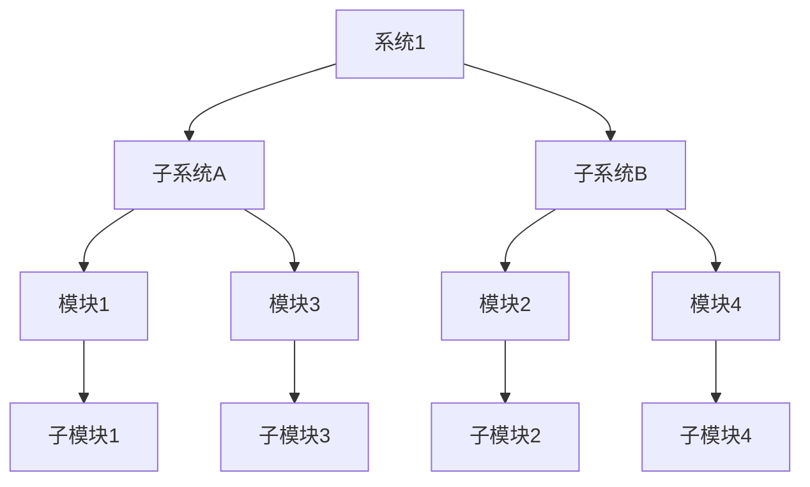
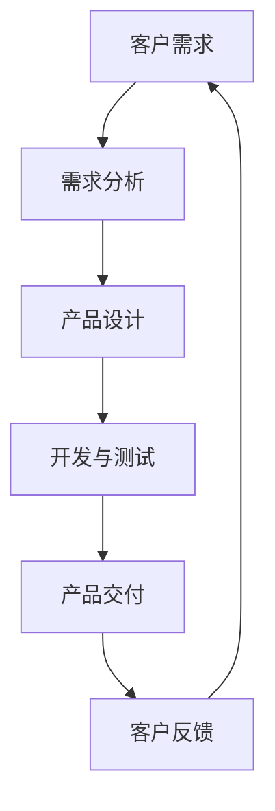

                 

### 《系统思考对于管理复杂项目的重要性》

#### 核心关键词：
- 系统思考
- 复杂项目管理
- 项目反馈循环
- 企业战略
- 系统适应性

#### 摘要：
本文深入探讨了系统思考在管理复杂项目中的重要性。系统思考是一种理解和解决复杂问题的方法，通过强调从整体和长远的角度分析问题，帮助决策者识别复杂系统中的反馈循环和动态性，从而提升决策能力。文章首先介绍了系统思考的基础知识，包括其概念、原理和应用领域；接着，通过核心概念与联系的探讨，展示了系统架构图和系统反馈循环；随后，文章在项目管理中的应用进行了深入分析，提供了具体的管理策略和案例研究；最后，文章探讨了系统思考在企业战略规划中的应用，并总结了系统思考的方法和实践，展望了其未来发展方向。通过本文的阅读，读者将更好地理解系统思考在复杂项目管理中的核心价值，并学会如何将其应用于实际项目中。

### 引言

在现代企业运营和项目管理中，复杂项目已经成为常态。这些项目往往涉及多个部门、多种技术和庞大的资源投入，因此管理这些项目需要具备更高的复杂问题解决能力和决策智慧。然而，传统的项目管理方法往往侧重于线性的任务分解和进度控制，难以应对项目中存在的复杂动态性和反馈循环。在这种情况下，系统思考作为一种理解复杂问题的方法论，逐渐受到了项目管理和企业战略领域的关注。

系统思考是一种从整体和长远的角度分析问题的方法，强调系统的整体性和动态性。它通过识别系统中的反馈循环和相互依赖关系，帮助决策者更好地理解复杂系统的行为和趋势。在项目管理中，系统思考的应用不仅能够提升项目管理的整体效能，还能够帮助项目经理应对项目中的不确定性和变化。

本文将围绕系统思考在管理复杂项目中的重要性展开讨论。首先，我们将介绍系统思考的基础知识，包括其概念、原理和应用领域。接着，我们将深入探讨系统思考的核心概念与联系，包括系统架构图和系统反馈循环。随后，我们将分析系统思考在项目管理中的应用，提供具体的管理策略和案例研究。此外，文章还将探讨系统思考在企业战略规划中的应用，总结系统思考的方法和实践，并展望其未来发展方向。

通过本文的阅读，读者将系统地了解系统思考的方法和原理，掌握其在项目管理中的应用技巧，并能够将这些知识应用于实际的项目管理工作中。无论是对项目经理，还是对企业的决策者，系统思考都提供了一种更为全面和深入的思考框架，以应对日益复杂的业务环境。

### 第1章：系统思考的基础知识

#### 1.1 系统思考的概念与重要性

系统思考（Systems Thinking）是一种理解和解决复杂问题的方法论，它起源于20世纪50年代，由系统理论学家，如贝塔朗菲（Ludwig Bertalanffy）等人提出。系统思考的核心在于理解系统的整体性、动态性和相互依赖性，它不仅关注系统内部的各个部分，还关注这些部分之间的相互作用和反馈关系。

**系统思考的定义**：
系统思考是一种通过观察整体行为来理解部分如何相互作用的方法。它强调从整体和长期的角度来看待问题，而不是仅关注单一的部分或短期的效果。这种方法可以帮助我们识别复杂系统中的反馈循环和动态性，从而更好地理解系统的行为和趋势。

**系统思考的重要性**：

1. **识别反馈循环**：反馈循环是系统思考中的关键概念之一。它描述了系统内部的信息反馈机制，可以是正反馈或负反馈。正反馈会增强系统当前状态的趋势，而负反馈则会抵消或调节系统当前状态的趋势。通过识别反馈循环，我们能够更好地理解系统如何随时间变化，从而做出更为明智的决策。

2. **提升决策能力**：在复杂项目中，往往存在多种变量和不确定性。系统思考帮助我们理解这些变量和不确定性如何相互作用，从而提升决策者的决策能力。通过系统思考，决策者可以更好地预测项目的潜在问题和挑战，并制定相应的应对策略。

3. **增强系统适应性**：系统思考强调系统的整体性和动态性，这有助于增强系统的适应性。在面对外部或内部变化时，系统能够通过调整行为来维持其稳定性。这种适应性在项目管理中尤为重要，因为项目往往面临不断变化的需求和环境。

4. **提高整体效能**：通过系统思考，我们可以更好地协调不同部门和团队的工作，实现资源的有效利用和优化。这种方法有助于降低项目风险，提高项目的整体效能和成功率。

#### 1.2 系统思考的基本原理

系统思考有几个基本原理，这些原理构成了理解复杂系统的框架：

**1. 整体性原则**：

整体性原则强调系统各部分之间的相互作用和依赖关系。在复杂项目中，一个部分的改变可能会影响整个系统的行为。因此，项目经理需要考虑系统的整体效果，而不仅仅是单一部分的效果。

**2. 反馈循环**：

反馈循环是系统思考中的核心概念。它描述了系统内部的信息反馈机制。正反馈会增强系统当前状态的趋势，负反馈则会抵消或调节系统当前状态的趋势。理解反馈循环有助于我们预测系统的行为和趋势。

**3. 适应性**：

适应性是指系统在面对外部或内部变化时，通过调整行为来维持其稳定性的能力。在项目管理中，适应性尤为重要，因为项目往往面临不确定性和变化。通过系统思考，项目团队可以更好地适应这些变化。

**4. 动态性**：

动态性原则强调系统随时间变化的行为。在复杂项目中，系统的状态和结构会随着时间的推移而变化。因此，项目经理需要考虑系统的动态性，以更好地管理项目风险和不确定性。

#### 1.3 系统思考的应用领域

系统思考在多个领域都有广泛的应用，以下是几个重要的应用领域：

**1. 项目管理**：

在项目管理中，系统思考可以帮助项目经理更好地理解项目中的复杂性和动态性。通过识别反馈循环和相互依赖关系，项目经理可以制定更为有效的项目计划和管理策略，提高项目的成功率。

**2. 企业战略**：

在企业战略规划中，系统思考有助于理解市场竞争和行业动态。通过分析系统中的反馈循环和适应性，企业可以制定更为明智的战略决策，以应对市场变化和竞争挑战。

**3. 环境管理**：

在环境管理领域，系统思考可以帮助我们理解环境系统中的相互依赖关系和反馈循环。这有助于制定更为有效的环境保护政策和措施。

**4. 社会问题解决**：

在社会问题解决中，系统思考可以帮助我们理解社会问题的复杂性，并制定综合性的解决方案。通过识别反馈循环和相互依赖关系，我们可以更好地应对社会问题，如贫困、环境污染等。

通过了解系统思考的基础知识，我们可以更好地理解其概念和原理，并在实际工作中应用这些知识。在接下来的章节中，我们将进一步探讨系统思考的核心概念与联系，以及其在项目管理中的应用。

### 1.4 系统架构图的应用

为了更好地理解系统思考的概念和原理，我们可以通过系统架构图来展示系统中的各个部分及其相互关系。系统架构图是一种可视化的工具，可以帮助我们识别系统中的关键组件和它们之间的相互作用。

**Mermaid流程图示例**：

以下是使用Mermaid绘制的系统架构图示例：



在这个示例中，系统1包括两个子系统A和B，每个子系统又包含多个模块。模块D、E、F和G分别包含子模块H、I、J和K。通过这个架构图，我们可以清晰地看到系统中的各个部分及其相互关系。

**系统架构图的作用**：

1. **可视化复杂系统**：系统架构图可以帮助我们直观地理解复杂系统，特别是当系统包含多个相互依赖的部分时。

2. **识别关键组件**：通过系统架构图，我们可以识别系统中的关键组件，这些组件往往对系统的整体性能和稳定性有重要影响。

3. **分析系统行为**：系统架构图提供了一个框架，可以帮助我们分析系统在不同条件下的行为和趋势。

4. **设计改进方案**：通过系统架构图，我们可以识别系统中存在的问题和瓶颈，从而设计改进方案，提高系统的性能和效率。

通过这个示例，我们可以看到系统架构图在理解系统思考和复杂项目管理中的重要作用。在接下来的章节中，我们将继续探讨系统反馈循环和系统适应性的概念，以进一步深化对系统思考的理解。

### 1.5 系统反馈循环的分析

系统反馈循环是系统思考中的核心概念之一，它描述了系统内部的信息反馈机制，可以是正反馈或负反馈。理解系统反馈循环对于分析和管理复杂项目至关重要。

**正反馈与负反馈**：

正反馈（Positive Feedback）是一种信息反馈机制，它增强系统当前状态的趋势。在正反馈循环中，系统的某个部分发生变化后，通过反馈机制导致系统整体向相同方向变化，从而形成一种自我增强的循环。例如，在市场推广中，积极的用户反馈可能会吸引更多的用户，从而进一步增加市场份额。

负反馈（Negative Feedback）则是一种抵消系统当前状态趋势的反馈机制。在负反馈循环中，系统的某个部分发生变化后，通过反馈机制导致系统整体向相反方向变化，从而维持系统的稳定性。例如，在项目管理中，项目进度延误可能会触发预警机制，促使团队加快进度，以避免进一步的延误。

**系统反馈循环的作用**：

1. **增强系统趋势**：正反馈循环可以增强系统当前的状态趋势，使系统在某些条件下表现出快速变化或放大效应。

2. **调节系统状态**：负反馈循环可以抵消系统当前的状态趋势，使系统保持在一定范围内稳定运行。

3. **预测系统行为**：通过分析系统反馈循环，我们可以预测系统在不同条件下的行为和趋势，从而更好地应对潜在的问题和挑战。

4. **优化系统设计**：了解系统反馈循环可以帮助我们识别系统中的问题区域，从而进行优化和改进，提高系统的性能和稳定性。

**实例分析**：

以项目管理为例，我们可以看到正反馈和负反馈在项目中的具体应用。

- **正反馈实例**：一个成功的项目可能会导致项目团队的士气提升，从而提高团队的协作效率，进一步促进项目的成功。这种正反馈循环增强了项目的正向趋势。

- **负反馈实例**：在项目进展过程中，如果发现项目进度落后于计划，项目经理可能会采取纠正措施，如增加资源或调整任务优先级，以避免进一步的延误。这种负反馈循环有助于维持项目的稳定性。

通过这些实例，我们可以看到系统反馈循环在项目管理中的重要性。理解系统反馈循环有助于项目经理更好地预测和应对项目中的各种变化和挑战，从而提高项目的成功率。

在接下来的章节中，我们将继续探讨系统思考在项目管理中的应用，以及如何通过系统思维提升项目的管理效能。

### 1.6 系统思考在项目管理中的应用

系统思考在项目管理中的应用极为广泛，它通过强调项目的整体性和动态性，帮助项目经理更好地理解和管理复杂项目。以下是系统思考在项目管理中的一些具体应用：

**1. 整体性原则**：

整体性原则要求项目经理将项目视为一个整体，考虑各个部分之间的相互作用和依赖关系。在项目规划阶段，项目经理需要识别项目中的关键组件和相互关系，并确保所有部分协同工作以实现项目目标。例如，在一个软件开发项目中，项目经理需要考虑代码、测试、部署等各个阶段，以及这些阶段之间的依赖关系，从而确保项目能够顺利推进。

**2. 反馈循环**：

反馈循环在项目管理中起到了至关重要的作用。通过迭代和反馈，项目经理可以持续改进项目。在项目执行过程中，项目经理需要定期收集项目进展数据，并与项目计划和预期目标进行比较，识别偏差和问题。这些反馈信息可以帮助项目经理及时调整项目计划，以纠正偏差并确保项目按计划进行。例如，在一个软件项目中，项目经理可能会通过定期的代码审查和用户反馈，识别潜在的问题和改进点，从而提升软件质量。

**3. 适应性**：

适应性原则强调项目在面对外部或内部变化时的调整能力。在项目管理中，变化是不可避免的，项目经理需要具备快速适应变化的能力。通过系统思考，项目经理可以更好地预测和应对这些变化。例如，在市场环境发生变化时，项目经理需要迅速调整项目计划，以适应新的市场条件，确保项目的成功实施。

**4. 动态性**：

动态性原则要求项目经理考虑项目随时间变化的行为和状态。在项目管理中，项目的状态和结构会随着时间的推移而变化，项目经理需要跟踪这些变化，并相应地调整管理策略。例如，在一个长期项目中，项目经理需要定期评估项目进展和资源需求，以确保项目能够在预算和时间范围内完成。

**5. 整合与协调**：

系统思考还强调不同部门和团队之间的整合与协调。在复杂项目中，往往涉及多个部门和团队的合作。通过系统思考，项目经理可以更好地协调不同团队的工作，确保资源的合理分配和协作的高效性。例如，在一个跨部门项目中，项目经理需要与各个部门紧密合作，确保项目在不同阶段能够顺利进行。

**案例研究**：

以下是一个实际复杂项目中的系统思考应用案例：

在一个大型IT公司的软件开发项目中，项目经理面临一个复杂的任务：在有限的时间内开发一款功能丰富的软件产品，并确保其质量符合用户需求。项目团队由多个专业团队组成，包括开发、测试、设计和运维团队。

- **项目规划阶段**：项目经理首先使用系统思考方法，识别项目的关键组件和相互关系。通过绘制系统架构图，项目经理明确了各个团队在项目中的角色和职责，并确保所有团队协同工作。

- **项目执行阶段**：项目经理定期收集项目进展数据，并通过反馈循环识别偏差和问题。例如，通过定期的代码审查和用户反馈，项目经理发现了一些潜在的问题，并及时调整了项目计划，以确保项目按计划进行。

- **项目调整阶段**：在项目执行过程中，市场环境发生了变化，项目经理需要迅速调整项目计划，以适应新的市场条件。通过系统思考，项目经理能够更好地应对这些变化，确保项目的成功实施。

通过这个案例，我们可以看到系统思考在项目管理中的应用是如何帮助项目经理更好地理解和管理复杂项目的。系统思考不仅提高了项目的管理效能，还增强了项目团队对复杂问题的解决能力。

在接下来的章节中，我们将进一步探讨系统思考在企业战略规划中的应用，以及系统思维如何帮助企业在竞争激烈的市场中取得优势。

### 1.7 系统思考在企业战略规划中的应用

系统思考在企业管理与战略规划中的应用同样具有重要价值，它能够帮助企业在复杂的市场环境中制定更为明智的战略决策。系统思考方法通过全面分析市场、竞争对手、内部资源和外部环境等关键因素，提供了一种动态、全面的视角，从而提高企业的战略适应性和竞争优势。

**1. 战略规划中的反馈循环**：

在战略规划过程中，反馈循环是一个关键概念。通过监测市场反馈和业务绩效，企业可以不断调整和优化其战略。正反馈循环可以增强企业的市场优势，例如，通过成功的产品创新和营销策略，企业能够吸引更多客户，进一步巩固市场地位。而负反馈循环则可以帮助企业识别和纠正战略实施中的问题。例如，如果市场调研显示客户对产品的满意度下降，企业可以通过改进产品和服务来提升客户满意度，从而改善整体业绩。

**2. 竞争动态性分析**：

系统思考在分析市场竞争动态方面具有独特优势。通过识别市场中的反馈循环和相互依赖关系，企业可以更好地理解竞争对手的策略和市场反应。例如，企业可以通过分析竞争对手的产品发布周期、市场推广活动以及客户反馈，预测竞争对手的未来行动，并制定相应的应对策略。这种前瞻性的竞争分析有助于企业抢占市场先机，制定更为有效的竞争策略。

**3. 企业内部资源的优化配置**：

系统思考强调企业内部资源的优化配置，确保各个部门和团队之间的协调与协作。在战略规划中，企业需要识别关键资源和能力，并确保这些资源能够被充分利用。例如，在产品开发阶段，企业需要协调研发、生产和营销团队的工作，确保产品能够及时推向市场。通过系统思考，企业可以优化资源分配，提高运营效率，从而在激烈的市场竞争中保持优势。

**4. 风险管理**：

系统思考提供了一种全面的风险管理方法。通过分析系统中的反馈循环和潜在的不确定性，企业可以更好地识别和管理风险。例如，企业可以通过模拟不同的市场情景，预测可能的风险和挑战，并制定相应的风险管理策略。这种风险管理方法不仅有助于降低潜在风险的影响，还可以提高企业的应急反应能力。

**案例研究**：

以下是一个实际企业战略规划中系统思考应用的案例：

一家大型科技公司在其全球市场扩张过程中，面临激烈的市场竞争和不断变化的市场需求。为了制定有效的战略规划，公司采用系统思考方法，通过以下步骤进行战略分析：

- **市场分析**：公司通过市场调研和数据分析，识别了全球市场的趋势和机会。通过分析竞争对手的市场策略和客户需求，公司发现了一个潜在的市场空白，并决定将其作为新的业务增长点。

- **内部资源评估**：公司对其内部资源进行了全面评估，包括技术能力、资金储备、人力资源等。通过系统思考，公司识别出其核心竞争力，并制定了相应的资源配置策略，以确保资源能够被高效利用。

- **战略调整**：在市场分析和内部资源评估的基础上，公司制定了新的战略规划。公司通过定期监测市场反馈和业务绩效，不断调整和优化其战略，以适应市场变化和竞争压力。

- **风险管理**：公司采用系统思考方法，识别和分析了潜在的市场和运营风险。通过制定相应的风险管理策略，公司能够更好地应对这些风险，确保战略规划的顺利实施。

通过这个案例，我们可以看到系统思考在企业管理与战略规划中的应用是如何帮助企业更好地理解市场动态，优化资源配置，调整战略决策，并有效管理风险的。系统思考不仅提高了企业的战略决策能力，还增强了企业的整体竞争力和适应性。

在接下来的章节中，我们将继续探讨系统思考的核心概念和其在项目管理中的实际应用，通过具体实例和算法原理，进一步展示系统思考的强大工具性。

### 第2章：系统思考的核心概念与联系

在理解系统思考的过程中，核心概念和它们之间的联系是至关重要的。这一章节将深入探讨系统架构图和系统反馈循环，帮助读者更全面地理解系统思考的基本原理。

#### 2.1 系统架构图

系统架构图是系统思考中的关键工具之一，它通过图形化的方式展示了系统中的各个组成部分及其相互关系。系统架构图不仅可以直观地展示系统的结构，还可以帮助识别系统中的关键组件和依赖关系，从而为系统分析和设计提供有力支持。

**系统架构图的组成**：

系统架构图通常包括以下几个部分：

1. **系统边界**：系统边界定义了系统的范围，明确了系统与外部环境的交互点。通过系统边界，我们可以清楚地了解系统的内部构成和外部影响。

2. **关键组件**：关键组件是系统中最重要的部分，它们对系统的行为和性能有显著影响。在系统架构图中，关键组件通常用矩形或其他形状表示。

3. **依赖关系**：依赖关系描述了系统中各个组件之间的相互作用。在系统架构图中，依赖关系通常用线条或箭头表示，箭头方向表示信息或资源的流动方向。

4. **控制机制**：控制机制是系统中的调节机制，用于维持系统的稳定性和一致性。控制机制可以是反馈循环、决策算法或其他调节手段。

**系统架构图的绘制**：

以下是使用Mermaid绘制的系统架构图示例：



在这个示例中，系统架构图展示了从客户需求到产品交付的整个过程，以及各个环节之间的依赖关系和反馈循环。

**系统架构图的作用**：

1. **可视化复杂系统**：通过系统架构图，我们可以直观地理解复杂系统的结构，识别系统中的关键组件和依赖关系。

2. **分析系统行为**：系统架构图提供了一个分析系统行为的框架，帮助我们理解系统中各个部分如何相互作用，从而预测系统的行为和趋势。

3. **设计改进方案**：通过系统架构图，我们可以识别系统中存在的问题和瓶颈，设计改进方案，提高系统的性能和效率。

#### 2.2 系统反馈循环

系统反馈循环是系统思考中的核心概念之一，它描述了系统内部的信息反馈机制。反馈循环可以是正反馈或负反馈，它们在系统中起着调节和稳定作用。

**正反馈循环**：

正反馈循环是一种增强系统当前状态趋势的反馈机制。在正反馈循环中，系统的某个部分发生变化后，通过反馈机制导致系统整体向相同方向变化，从而形成一种自我增强的循环。例如，在市场推广中，积极的用户反馈可能会吸引更多的用户，从而进一步增加市场份额。

正反馈循环的作用：

1. **增强系统趋势**：正反馈循环可以增强系统当前的状态趋势，使系统在某些条件下表现出快速变化或放大效应。

2. **驱动系统创新**：正反馈循环可以驱动系统创新，通过增强系统中的积极因素，促进系统的持续改进和优化。

3. **风险管理**：在某些情况下，正反馈循环可以用于风险管理，通过快速放大积极信号，及时识别和应对潜在的风险。

**负反馈循环**：

负反馈循环是一种抵消系统当前状态趋势的反馈机制。在负反馈循环中，系统的某个部分发生变化后，通过反馈机制导致系统整体向相反方向变化，从而维持系统的稳定性。例如，在项目管理中，项目进度延误可能会触发预警机制，促使团队加快进度，以避免进一步的延误。

负反馈循环的作用：

1. **调节系统状态**：负反馈循环可以抵消系统当前的状态趋势，使系统保持在一定范围内稳定运行。

2. **风险控制**：负反馈循环可以帮助控制系统的变化范围，防止系统过度偏离目标。

3. **系统稳定**：负反馈循环是维持系统稳定性的关键机制，通过调节系统行为，防止系统崩溃或失去控制。

**反馈循环的案例分析**：

以项目进度管理为例，正反馈和负反馈在项目管理中的应用：

- **正反馈实例**：一个成功按时完成的项目阶段可能会增强项目团队的士气，从而提高团队的工作效率，使后续阶段更加顺利。

- **负反馈实例**：如果在项目执行过程中发现进度落后，项目经理可能会采取纠正措施，如加班或重新分配资源，以恢复进度，避免进一步的延误。

通过这些案例，我们可以看到正反馈和负反馈循环在项目管理中的重要性。它们不仅有助于提升项目效能，还能帮助项目经理更好地应对项目中的各种挑战和变化。

#### 2.3 系统适应性与动态性

系统适应性与动态性是系统思考中的关键概念，它们描述了系统在面对外部或内部变化时的调整能力和随时间变化的行为。

**适应性**：

适应性是指系统能够在面对外部或内部变化时，通过调整行为来维持其稳定性的能力。在项目管理中，适应性尤为重要，因为项目往往面临不确定性和变化。通过系统思考，项目团队可以更好地适应这些变化，从而提高项目的成功率。

适应性原则的作用：

1. **应对不确定性**：适应性帮助项目团队应对项目中的不确定性，通过快速调整和适应，降低不确定性带来的风险。

2. **提高灵活性**：适应性提高了项目的灵活性，使项目团队能够快速响应变化，保持项目进展。

3. **优化资源利用**：通过适应性调整，项目团队能够更合理地利用资源，避免资源浪费。

**动态性**：

动态性原则强调系统随时间变化的行为。在项目管理中，系统的状态和结构会随着时间的推移而变化，项目经理需要考虑这些变化，并相应地调整管理策略。

动态性原则的作用：

1. **跟踪项目进展**：通过考虑系统的动态性，项目经理可以更准确地跟踪项目进展，预测未来的项目状态。

2. **管理风险**：动态性帮助项目经理识别和管理项目中的风险，通过及时调整管理策略，降低风险的影响。

3. **持续改进**：动态性原则鼓励项目团队不断优化项目过程，通过持续改进，提高项目的绩效和成功率。

通过以上讨论，我们可以看到系统架构图、系统反馈循环、适应性和动态性在系统思考中的关键作用。这些概念不仅帮助我们更好地理解复杂系统，还能在实际应用中提高项目的管理效能和企业的战略决策能力。

在接下来的章节中，我们将进一步探讨系统思考在项目管理中的应用，以及如何通过具体案例和算法原理，深化对系统思考的理解。

### 2.4 项目管理中的系统思维

在项目管理中，系统思维是一种重要的方法，它通过识别项目中的关键要素和相互关系，帮助项目经理更好地理解和管理复杂项目。系统思维的核心在于将项目视为一个整体，考虑各个部分之间的相互作用和反馈循环，从而提高项目的管理效能。

**1. 项目管理中的反馈循环**

反馈循环在项目管理中起到了至关重要的作用。它通过持续收集项目数据，将实际进展与计划进行比较，识别偏差和问题，并采取相应的纠正措施。以下是反馈循环在项目管理中的具体应用：

- **项目进度反馈**：项目经理定期收集项目进度数据，将实际进度与计划进度进行比较，识别进度偏差。如果发现进度落后，项目经理需要分析原因，并采取相应的纠正措施，如调整任务优先级、增加资源等。

- **质量反馈**：在项目执行过程中，通过测试和用户反馈，项目经理可以识别产品质量问题。针对这些问题，项目经理需要制定改进计划，确保项目交付符合预期质量。

- **成本反馈**：项目经理需要监控项目成本，确保项目在预算范围内完成。如果发现成本超支，项目经理需要分析原因，并采取相应的控制措施，如减少非关键任务、优化资源使用等。

**2. 关键要素识别**

在项目管理中，系统思维要求项目经理识别项目中的关键要素，这些要素对项目的成功与否有决定性影响。关键要素包括：

- **需求**：明确项目的需求是项目成功的基础。项目经理需要与利益相关者沟通，确保需求被准确理解和记录。

- **资源**：项目资源包括人力、资金、技术等，是项目执行的关键。项目经理需要合理分配资源，确保资源能够满足项目需求。

- **风险**：项目风险是项目管理中的重要因素。通过识别和评估项目风险，项目经理可以制定相应的风险管理计划，降低风险对项目的影响。

- **利益相关者**：项目利益相关者包括项目团队成员、客户、供应商等。系统思维要求项目经理考虑所有利益相关者的需求和期望，确保项目能够得到他们的支持和合作。

**3. 相互作用与协调**

系统思维强调项目中各个部分之间的相互作用和协调。项目经理需要考虑以下方面：

- **跨部门协作**：在复杂项目中，往往涉及多个部门和团队的协作。项目经理需要协调不同部门的工作，确保项目进展顺利。

- **信息共享**：项目信息是项目管理的重要资源。项目经理需要建立有效的信息共享机制，确保项目团队成员能够及时获取和共享相关信息。

- **沟通与反馈**：项目经理需要建立良好的沟通机制，确保项目团队成员能够有效沟通和协作。同时，项目经理需要通过定期的反馈机制，识别和解决问题。

**案例研究：项目进度管理的系统思维应用**

以下是一个关于项目进度管理中系统思维应用的案例：

某公司正在开发一款新的软件产品，项目时间紧、任务重。项目经理通过系统思维方法，采取以下措施进行项目进度管理：

- **需求分析**：项目经理与客户进行了多次沟通，明确了软件的功能和性能需求，并将其记录在项目需求文档中。

- **资源分配**：根据项目需求和团队情况，项目经理合理分配了人力资源，确保每个团队成员都清楚自己的任务和责任。

- **进度监控**：项目经理建立了进度监控机制，定期收集项目进展数据，并与计划进度进行比较，识别偏差和问题。

- **纠正措施**：针对识别出的进度偏差，项目经理采取了纠正措施，如重新分配任务、加班等，确保项目能够按计划进行。

- **反馈机制**：项目经理定期召开项目会议，与团队成员分享项目进展情况和遇到的问题，共同讨论解决方案，确保项目能够顺利进行。

通过这个案例，我们可以看到系统思维在项目进度管理中的重要作用。系统思维不仅帮助项目经理更好地理解项目中的复杂性和动态性，还提高了项目的管理效能和成功率。

在接下来的章节中，我们将继续探讨系统思考在项目管理中的具体应用，通过实际案例和算法原理，进一步展示系统思考在项目管理和企业战略规划中的价值。

### 2.5 复杂项目的管理策略

在复杂项目的管理中，传统的项目管理方法往往难以应对项目中的多重变量和不确定性。系统思考提供了一种全面且动态的视角，帮助项目经理制定更为有效的管理策略。以下是系统思考在复杂项目管理中的几个关键策略。

**1. 整体性管理策略**

整体性管理策略强调项目各部分之间的相互作用和依赖关系。在复杂项目中，单一环节的改变可能对整体项目产生重大影响。因此，项目经理需要从整体角度出发，考虑项目的整体结构和相互关系。

- **跨部门协作**：在复杂项目中，不同部门和团队之间需要紧密协作。项目经理应建立跨部门沟通机制，确保各部门能够及时共享信息，协同工作。
- **资源整合**：项目经理需要整合项目中的各种资源，包括人力、资金和技术等，确保资源能够高效利用，满足项目需求。
- **整体风险评估**：通过系统思考，项目经理可以对项目的整体风险进行评估，识别潜在风险点，并制定相应的风险管理策略。

**2. 动态管理策略**

动态管理策略强调项目随时间变化的行为和状态。在复杂项目中，项目需求和外部环境可能随时发生变化，项目经理需要具备快速适应和调整的能力。

- **灵活的计划调整**：项目经理应建立灵活的计划调整机制，根据实际情况及时调整项目计划，确保项目能够应对变化。
- **持续监控与反馈**：通过定期的项目监控和反馈机制，项目经理可以及时发现项目中的偏差和问题，并采取纠正措施。
- **动态资源配置**：根据项目进展和需求变化，项目经理需要动态调整资源分配，确保项目能够在各个阶段得到适当的资源支持。

**3. 风险管理策略**

在复杂项目中，风险管理是项目管理的重要组成部分。系统思考提供了全面的风险管理方法，帮助项目经理识别和管理潜在的风险。

- **风险评估与优先级排序**：通过系统思考，项目经理可以全面评估项目中的风险，并按照风险的影响和可能性进行优先级排序。
- **风险应对策略**：根据风险评估结果，项目经理应制定相应的风险应对策略，包括风险规避、减轻、转移和接受等。
- **应急计划**：项目经理需要制定应急计划，以应对项目中可能发生的突发事件，确保项目能够在意外情况下继续推进。

**4. 整合性管理工具**

系统思考还提供了一系列整合性管理工具，帮助项目经理更好地理解和控制复杂项目。

- **因果图**：因果图是一种可视化工具，用于展示系统中各个变量之间的因果关系。项目经理可以通过因果图识别关键因素和相互关系，从而制定更有效的管理策略。
- **系统动力学模型**：系统动力学模型是一种用于模拟和分析复杂系统的工具，可以帮助项目经理预测系统的行为和趋势。通过系统动力学模型，项目经理可以更好地理解项目中的动态性和反馈循环。
- **网络图和PERT图**：网络图和PERT图是项目管理中常用的工具，用于展示项目任务的依赖关系和进度计划。通过这些工具，项目经理可以更清晰地了解项目的进度和资源需求，制定合理的项目计划。

**5. 案例研究：复杂项目的管理策略**

以下是一个关于复杂项目管理策略的案例研究：

某科技公司正在开发一款新型的智能家居系统，项目涉及多个技术领域，包括物联网、人工智能和云计算等。项目经理通过系统思考方法，制定了以下管理策略：

- **整体性管理**：项目经理组织跨部门会议，确保各技术团队之间的协作和沟通，建立统一的项目目标和标准。
- **动态管理**：项目经理建立了每周的项目进展会议，通过收集和分析项目数据，及时调整项目计划，确保项目按计划进行。
- **风险管理**：项目经理通过因果图和系统动力学模型，识别和评估了项目中的关键风险，并制定了相应的风险管理计划。
- **整合性管理工具**：项目经理使用因果图和系统动力学模型，帮助团队更好地理解项目的复杂性和动态性，制定更有效的管理策略。

通过这个案例，我们可以看到系统思考在复杂项目管理中的应用是如何帮助项目经理更好地理解和控制复杂项目。系统思考提供了一种全面且动态的视角，使项目经理能够更有效地应对项目中的多重变量和不确定性，提高项目的成功率和效能。

在接下来的章节中，我们将继续探讨系统思考在项目管理中的应用，通过具体算法和案例，进一步展示系统思考的强大工具性和实践价值。

### 3.1 项目管理中的反馈循环

在项目管理中，反馈循环是一种关键的机制，它通过持续收集项目数据，比较实际进展与计划，从而识别偏差和问题，并采取相应的纠正措施。这种循环不仅有助于项目进度的控制，还能提升项目的整体质量和效率。以下是项目管理中反馈循环的具体应用和实践方法。

**1. 定期项目评估**

定期项目评估是反馈循环的核心环节。项目经理需要设定固定的时间间隔（例如每周或每月）进行项目评估，以收集项目进展、资源消耗、风险情况等方面的数据。这些数据可以通过多种工具和方式收集，如项目进度报告、任务清单、时间跟踪工具等。

- **项目进度报告**：项目经理应定期生成项目进度报告，详细记录项目的完成情况、任务进展和关键里程碑。这些报告可以帮助项目经理识别项目的偏差和潜在问题。
- **任务清单**：使用任务清单工具，如Trello、JIRA等，可以帮助项目经理实时跟踪任务的完成情况，及时发现进度滞后或资源不足的问题。
- **时间跟踪工具**：时间跟踪工具，如Toggl、Harvest等，可以帮助项目经理记录团队成员的工作时间，从而更好地了解项目资源的实际消耗。

**2. 实际进展与计划的比较**

在反馈循环中，将实际进展与计划进行比较是识别偏差和问题的关键。项目经理需要将实际数据与项目计划进行详细对比，分析偏差的原因，并制定相应的纠正措施。

- **进度偏差分析**：通过比较实际进度与计划进度，项目经理可以识别进度偏差。例如，如果某个关键任务的完成时间比预期晚了几天，项目经理需要分析原因，是否是由于资源不足、任务优先级调整或其他因素导致的。
- **资源利用率分析**：项目经理还需要分析资源利用率，特别是关键资源（如人力资源）的利用率。如果发现资源利用率不高，项目经理需要重新分配任务或增加资源。
- **成本偏差分析**：通过比较实际成本与预算成本，项目经理可以识别成本偏差。如果发现成本超支，项目经理需要分析原因，并采取相应的控制措施，如优化流程、减少非关键任务等。

**3. 采取纠正措施**

识别偏差和问题后，项目经理需要采取相应的纠正措施，确保项目能够回到正轨。

- **调整计划**：如果项目进度落后或成本超支，项目经理需要及时调整项目计划。例如，可以重新分配任务、增加资源、调整优先级等，以确保项目能够按计划完成。
- **风险管理**：对于识别出的潜在风险，项目经理需要制定相应的风险管理计划，如风险规避、减轻、转移或接受等。通过这些措施，项目经理可以降低风险对项目的影响。
- **沟通与协作**：在反馈循环中，有效的沟通和协作至关重要。项目经理需要及时与项目团队成员和利益相关者沟通，分享项目进展和问题，确保大家能够共同努力，解决问题，推动项目进展。

**4. 反馈机制的持续优化**

反馈循环是一个持续的过程，项目经理需要不断优化反馈机制，以提高项目的管理效能。以下是一些优化反馈机制的方法：

- **定期回顾会议**：通过定期回顾会议，项目经理和团队可以总结项目经验，识别改进点，并制定相应的改进计划。
- **改进工具和方法**：根据反馈结果，项目经理可以优化项目管理和工具使用方法，如引入新的项目管理工具、改进流程等。
- **培训与提升**：通过培训和学习，项目团队成员可以提升项目管理技能和知识，从而更好地应对项目中的挑战和变化。

**实例分析：项目反馈循环的应用**

以下是一个关于项目反馈循环应用的实例：

某IT公司正在开发一款新软件，项目预计需要6个月完成。项目经理制定了以下反馈循环机制：

- **每周进度报告**：项目经理每周与团队召开进度会议，收集项目进展和资源消耗数据，生成进度报告。
- **偏差分析**：项目经理将实际进度与计划进度进行比较，识别进度偏差，并分析原因。例如，如果某个关键任务晚了几天，项目经理会与团队成员讨论原因，并制定纠正措施。
- **纠正措施**：项目经理根据偏差分析结果，调整项目计划，重新分配任务，确保项目能够按计划进行。
- **反馈与改进**：项目经理定期召开团队会议，分享项目进展和问题，鼓励团队成员提出改进建议，并制定改进计划。

通过这个实例，我们可以看到项目反馈循环在项目管理中的应用是如何帮助项目经理及时发现和解决问题，确保项目能够按计划完成。有效的反馈循环不仅提高了项目的管理效能，还增强了团队的协作和沟通能力。

在接下来的章节中，我们将继续探讨系统思考在项目管理中的应用，通过具体算法和案例分析，进一步展示系统思考在复杂项目管理和企业战略规划中的价值。

### 3.2 复杂项目的核心算法原理

在复杂项目的管理中，算法原理的应用是提高项目效率和准确性的关键。以下将详细讨论几个核心算法原理，包括其基本概念、应用场景以及伪代码示例。

#### 1. 动态规划（Dynamic Programming）

**基本概念**：动态规划是一种用于求解优化问题的方法，通过将问题分解成子问题并存储子问题的解，以避免重复计算，从而提高计算效率。

**应用场景**：在项目管理中，动态规划常用于资源分配和调度问题。例如，优化任务优先级、人员分配和资源调度。

**伪代码示例**：

```python
def dynamicProgramming(tasks, resources):
    # 初始化动态规划表
    dp = [[0 for _ in range(len(resources))] for _ in range(len(tasks))]
    
    # 填充动态规划表
    for i in range(1, len(tasks) + 1):
        for j in range(1, len(resources) + 1):
            if canAllocate(tasks[i-1], resources[j-1]):
                dp[i][j] = max(dp[i-1][j], dp[i][j-1] + utility(tasks[i-1]))
            else:
                dp[i][j] = dp[i-1][j]
    
    # 返回最优解
    return dp[-1][-1]

def canAllocate(task, resource):
    # 检查任务是否可以分配给资源
    # ...

def utility(task):
    # 计算任务的价值
    # ...
```

#### 2. 贪心算法（Greedy Algorithm）

**基本概念**：贪心算法是一种通过每次选择局部最优解，以期望最终得到全局最优解的算法。

**应用场景**：在项目管理中，贪心算法常用于任务调度和优先级排序。例如，任务分配、紧急任务优先处理等。

**伪代码示例**：

```python
def greedyAlgorithm(tasks):
    sorted_tasks = sort_by_priority(tasks)
    result = []

    for task in sorted_tasks:
        if can_execute(task):
            result.append(task)
    
    return result

def sort_by_priority(tasks):
    # 根据优先级排序任务
    # ...

def can_execute(task):
    # 检查任务是否可以执行
    # ...
```

#### 3. 最小生成树（Minimum Spanning Tree）

**基本概念**：最小生成树是一种包含图中所有节点的子图，其边权之和最小。

**应用场景**：在项目管理中，最小生成树可以用于网络设计、资源优化等。例如，构建项目依赖关系的最小生成树，以优化任务调度。

**伪代码示例**：

```python
def prim_algorithm(graph):
    # 初始化最小生成树
    mst = []
    visited = [False for _ in range(len(graph))]

    # 选择一个节点开始
    start = 0
    visited[start] = True
    mst.append((start, -1, graph[start][0]))  # (起点，终点，边权)

    # 构建最小生成树
    while len(mst) < len(graph):
        # 找到最近的未访问节点
        min_edge = None
        for i in range(len(graph)):
            if not visited[i]:
                for j in range(len(graph[i])):
                    if graph[i][j] > 0 and not visited[j]:
                        if min_edge is None or graph[i][j] < min_edge[2]:
                            min_edge = (i, j, graph[i][j])

        if min_edge is not None:
            visited[min_edge[1]] = True
            mst.append(min_edge)

    return mst

def can_connect(node1, node2, graph):
    # 检查节点1和节点2是否可以连接
    # ...
```

#### 4. 状态机（State Machine）

**基本概念**：状态机是一种用于描述系统状态的转换和行为的模型。

**应用场景**：在项目管理中，状态机可以用于项目状态监控、任务状态管理。

**伪代码示例**：

```python
class StateMachine:
    def __init__(self):
        self.states = {
            'pending': [],
            'in_progress': [],
            'completed': []
        }

    def transition(self, task, new_state):
        # 更新任务状态
        if task in self.states['pending']:
            self.states['pending'].remove(task)
        if task in self.states['in_progress']:
            self.states['in_progress'].remove(task)
        if task in self.states['completed']:
            self.states['completed'].remove(task)
        
        self.states[new_state].append(task)

    def get_state(self, task):
        # 获取任务状态
        for state, tasks in self.states.items():
            if task in tasks:
                return state
        return None

# 示例使用
state_machine = StateMachine()
state_machine.transition('task1', 'in_progress')
print(state_machine.get_state('task1'))  # 输出: 'in_progress'
```

通过上述算法原理的应用，项目经理可以更有效地管理复杂项目，优化任务调度和资源分配，提高项目的成功率和效率。在接下来的章节中，我们将进一步探讨系统思考在实际项目中的应用，通过具体案例展示如何将理论付诸实践。

### 3.3 案例研究：复杂项目的系统思考应用

在本章节中，我们将通过一个实际案例来探讨系统思考在复杂项目中的应用。此案例将展示如何在实际项目中使用系统思考方法进行管理，以及系统思考如何帮助解决项目中遇到的挑战。

#### 案例背景

某国际知名科技公司（以下简称“公司”）计划开发一款智能医疗设备，该设备能够通过无线网络实时监测患者的健康数据，并向医生提供即时诊断和建议。该项目涉及多个技术领域，包括物联网、人工智能、无线通信和生物医学工程。项目团队成员来自不同专业背景，包括软件工程师、硬件工程师、数据科学家和医疗专家。

#### 项目挑战

- **技术复杂度**：项目涉及多个复杂技术领域，需要跨部门合作。
- **时间压力**：项目需要在严格的时间框架内完成，以保证市场竞争力。
- **不确定性**：医疗设备的安全性至关重要，任何技术问题都可能对项目产生重大影响。
- **资源有限**：项目预算有限，需要合理分配资源，确保项目的经济性。

#### 系统思考的应用

1. **整体性分析**

   项目经理首先使用系统思考方法，从整体角度分析项目。他绘制了一个系统架构图，展示了项目中各个组成部分及其相互关系。系统架构图包括以下关键组件：

   - **物联网模块**：负责数据采集和传输。
   - **人工智能模块**：负责数据处理和分析。
   - **无线通信模块**：负责数据传输和接收。
   - **硬件模块**：负责设备的物理构造和功能实现。
   - **医疗模块**：负责数据解读和诊断建议。

2. **反馈循环**

   项目经理识别了项目中的关键反馈循环，以监控和调整项目进展。以下是一个关键反馈循环：

   - **数据采集与反馈**：物联网模块收集患者数据，传输给人工智能模块进行分析。分析结果返回给医疗模块，以提供诊断建议。如果诊断结果与实际健康数据不符，系统将触发警报，并通知医疗专家进行审查。

3. **适应性调整**

   项目经理意识到项目面临的不确定性和变化，因此他制定了适应性调整策略。当项目进度遇到阻碍时，项目经理会重新评估资源分配，并根据当前情况进行调整。例如，如果数据科学家发现算法性能不理想，项目经理可能会增加数据科学团队的人力资源，以加速算法优化。

4. **风险管理**

   通过系统思考，项目经理制定了全面的风险管理策略。他使用了因果图和系统动力学模型来识别和管理潜在风险。以下是一个因果图示例：

   - **技术风险**：物联网模块的数据传输可靠性问题可能导致数据丢失。
   - **市场风险**：医疗设备的法规审批可能延迟，影响市场投放时间。
   - **资源风险**：项目预算超支，可能影响后续研发和运营。

   针对每个风险，项目经理制定了相应的应对策略，如增加冗余数据传输协议、提前准备法规文档、调整项目预算等。

5. **动态性管理**

   项目经理定期评估项目进度和资源使用情况，以应对项目中的动态变化。他使用了动态规划算法来优化任务调度和资源分配，确保项目能够在时间框架内完成。例如，他根据实际进展调整任务优先级，确保关键任务能够按时完成。

#### 案例结果

通过系统思考的应用，该项目最终取得了以下成果：

- **技术成功**：项目成功开发了一款功能齐全的智能医疗设备，其性能达到了预期标准。
- **市场成功**：智能医疗设备在市场上获得了广泛认可，为公司带来了显著的经济效益。
- **团队协作**：跨部门团队的协作效率显著提升，项目成员之间的沟通和合作更加顺畅。
- **风险管理**：通过有效的风险管理，项目顺利避开了潜在的技术和市场风险，确保了项目的成功实施。

#### 结论

通过这个案例，我们可以看到系统思考在管理复杂项目中的重要性。系统思考不仅帮助项目经理更好地理解项目的整体性和动态性，还提高了项目的适应性和风险管理能力。在实际项目中，系统思考提供了一种全面、系统的分析方法，帮助项目经理更有效地应对复杂性和不确定性，确保项目的成功实施。

在接下来的章节中，我们将继续探讨系统思考在企业战略规划中的应用，进一步展示其在企业管理和决策制定中的价值。

### 3.4 系统思考在企业战略规划中的应用

在企业的长期发展和战略规划中，系统思考同样扮演着至关重要的角色。它不仅帮助企业在复杂多变的市场环境中制定明智的战略决策，还能够提高企业的整体竞争力和适应性。以下将详细讨论系统思考在企业战略规划中的应用，并探讨如何通过系统思维方法提高企业的战略决策能力。

#### 1. 市场动态分析

系统思考在分析市场动态方面具有显著优势。通过系统思考，企业可以全面理解市场中的各个因素及其相互关系，从而更好地把握市场趋势和竞争格局。

**案例：市场进入策略**

某初创公司计划进入竞争激烈的美妆市场。通过系统思考，公司分析了以下几个关键因素：

- **市场趋势**：通过数据分析，公司发现美妆市场正在向天然和有机成分产品转变。
- **竞争格局**：公司识别了市场中的主要竞争对手，并分析了他们的产品定位、市场份额和营销策略。
- **消费者需求**：通过消费者调研，公司了解了目标客户的需求和偏好。

基于这些分析，公司决定开发一款天然成分的美妆产品，并采用社交媒体营销，以吸引年轻消费者。

**系统思维方法：**

- **因果图**：公司使用因果图展示了市场趋势、竞争对手策略和消费者需求之间的因果关系，帮助决策者更好地理解市场动态。
- **系统动力学模型**：公司建立了系统动力学模型，模拟不同市场情景下的公司表现，从而制定出最优的市场进入策略。

#### 2. 资源配置

系统思考帮助企业优化资源配置，确保资源能够被高效利用，以满足战略目标。

**案例：资源分配**

某大型制造企业正在制定其五年战略规划。通过系统思考，公司识别了以下几个关键资源：

- **资金**：用于研发、生产扩张和市场推广。
- **人力**：涵盖研发团队、生产人员和销售人员。
- **技术**：包括先进的生产设备和研发技术。

基于系统思考，公司制定了以下资源分配策略：

- **优先级排序**：公司根据战略目标，将资源优先分配给最关键的项目和领域。
- **动态调整**：公司建立了动态调整机制，根据市场环境和项目进展，实时调整资源分配。

**系统思维方法：**

- **资源图**：公司使用资源图展示了各个资源的分布和使用情况，帮助决策者了解资源分配的合理性。
- **系统优化算法**：公司采用系统优化算法，如线性规划或模拟退火算法，以最大化资源利用效率。

#### 3. 风险管理

系统思考在风险管理方面提供了一种全面且系统的方法，帮助企业在不确定的市场环境中制定有效的风险应对策略。

**案例：市场风险应对**

某零售企业在全球市场扩张过程中，面临汇率波动和贸易保护政策等市场风险。通过系统思考，公司制定了以下风险管理策略：

- **风险评估**：公司使用系统动力学模型，对市场风险进行定量和定性分析，识别出主要风险因素。
- **风险应对**：公司制定了多层次的应对策略，包括汇率对冲、贸易政策调整和多元化市场布局。

**系统思维方法：**

- **风险图**：公司使用风险图展示了市场风险的各种因素及其相互关系，帮助决策者更好地理解风险来源和影响。
- **情景分析**：公司通过情景分析，模拟不同市场情景下的企业表现，制定相应的应对策略。

#### 4. 战略调整

系统思考强调动态性和适应性，帮助企业根据市场环境和内部情况的变化，及时调整战略规划。

**案例：战略调整**

某互联网公司在市场竞争加剧的背景下，决定调整其战略方向。通过系统思考，公司采取了以下步骤：

- **战略评估**：公司对现有战略进行了全面评估，识别出战略中的优势和不足。
- **市场分析**：公司重新分析了市场趋势和竞争对手策略，以确定新的战略方向。
- **调整计划**：公司制定了新的战略计划，包括产品线调整、市场定位和营销策略。

**系统思维方法：**

- **战略图**：公司使用战略图展示了现有战略和新的战略方向之间的联系，帮助决策者理解战略调整的必要性和方向。
- **敏捷战略**：公司采用敏捷战略方法，通过快速迭代和反馈，持续优化战略执行。

#### 结论

通过系统思考的应用，企业可以在战略规划中更好地理解市场动态、优化资源配置、有效管理风险和及时调整战略。系统思考提供了一种全面且系统的方法论，帮助企业在复杂多变的市场环境中做出明智的决策，提高企业的整体竞争力和可持续发展能力。

在接下来的章节中，我们将进一步探讨系统思考的方法与实践，提供具体的实施指南，帮助读者将系统思考方法应用于实际项目和企业战略中。

### 第4章：系统思考的方法与实践

系统思考是一种强大的工具，可以帮助我们在复杂的环境中做出更为明智的决策。通过了解和掌握系统思考的方法，我们可以将其应用于项目管理、企业战略规划等多个领域，以提升决策质量和效率。本章节将详细探讨系统思考的具体方法，并提供实用的实践指南。

#### 4.1 系统思维工具

系统思维工具是理解和分析复杂系统的关键，以下是一些常用的系统思维工具：

1. **因果图**：
   - **作用**：因果图用于展示系统中各个变量之间的因果关系。
   - **如何使用**：通过绘制因果图，可以帮助识别系统中的关键因素和相互关系。例如，在项目管理中，项目经理可以绘制因果图来分析任务之间的依赖关系和潜在的风险因素。
   
2. **系统动力学模型**：
   - **作用**：系统动力学模型用于模拟和分析系统的动态行为。
   - **如何使用**：通过建立系统动力学模型，我们可以预测系统的行为和趋势。在企业管理中，系统动力学模型可以帮助企业预测市场需求变化和内部运营的动态性，从而制定更为科学的战略计划。

3. **流程图**：
   - **作用**：流程图用于展示系统中的流程和步骤。
   - **如何使用**：在项目管理中，流程图可以帮助团队清晰地了解项目进度和各个阶段的任务，确保项目能够按照预定计划进行。

4. **思维导图**：
   - **作用**：思维导图用于整理和展示系统的各个部分及其相互关系。
   - **如何使用**：通过绘制思维导图，可以帮助团队从宏观上理解系统的结构，发现潜在的优化点。

#### 4.2 实际案例解析

以下是一些实际案例，展示了如何将系统思考方法应用于项目管理和企业战略规划中：

**案例1：项目管理中的系统思考**

某公司计划开发一款新软件产品，项目经理通过系统思考方法，进行了以下步骤：

1. **因果图分析**：
   - 项目经理绘制了因果图，分析了系统中的关键因素，如需求变化、技术难题、资源分配等。
   - 通过因果图，项目经理识别出了影响项目成功的几个关键因素，并制定了相应的风险应对策略。

2. **系统动力学模型**：
   - 项目经理建立了系统动力学模型，模拟了不同条件下的项目进展和资源使用情况。
   - 通过模型分析，项目经理预测了项目的潜在风险和瓶颈，并提前制定了应对措施。

3. **流程图**：
   - 项目经理使用了流程图，清晰地展示了项目的各个阶段和任务。
   - 通过流程图，团队成员可以清楚地了解项目的进展和各自的职责。

**案例2：企业战略规划中的系统思考**

某企业在制定五年战略规划时，采用了系统思考方法：

1. **市场分析**：
   - 企业通过系统思考方法，分析了市场趋势、竞争对手和消费者需求。
   - 通过因果图和系统动力学模型，企业识别出了市场的关键驱动因素和潜在风险。

2. **资源分配**：
   - 企业使用系统动力学模型，模拟了不同资源分配方案下的战略效果。
   - 通过模型分析，企业确定了最优的资源分配策略，以最大化战略目标的实现。

3. **情景分析**：
   - 企业进行了多种情景分析，模拟了不同市场情景下的企业表现。
   - 通过情景分析，企业制定了灵活的战略计划，以应对不确定的市场环境。

#### 4.3 系统思考实践指南

以下是一些实用的系统思考实践指南，帮助读者将系统思考方法应用于实际项目中：

1. **持续学习**：
   - 系统思考是一种持续的过程，需要不断学习和更新知识。读者应定期阅读相关书籍和论文，了解最新的系统思考理论和实践方法。

2. **实践应用**：
   - 在实际项目中，读者应积极尝试应用系统思考方法。通过实际操作，可以更好地理解和掌握系统思考的核心原理和工具。

3. **团队协作**：
   - 系统思考往往需要跨部门协作，读者应鼓励团队成员共同参与系统思考过程，充分发挥团队智慧。

4. **反馈与改进**：
   - 在系统思考过程中，读者应定期收集反馈，并根据反馈结果不断改进系统模型和策略。

5. **持续优化**：
   - 系统思考不是一次性的任务，而是一个持续的过程。读者应不断优化系统模型和策略，以适应不断变化的环境。

通过以上实践指南，读者可以更好地将系统思考方法应用于实际项目中，提高决策质量和效率。在接下来的章节中，我们将探讨系统思考的未来与发展趋势，为读者提供更多的思考和启示。

### 第5章：系统思考的未来与发展趋势

系统思考作为一种理解复杂问题的方法论，其应用范围和影响力正在不断扩大。随着技术的进步和复杂性的增加，系统思考在多个领域都展现出了巨大的潜力。以下将探讨系统思考的未来发展趋势，以及其在人工智能、大数据和可持续发展等前沿领域的应用前景。

#### 5.1 系统思考在人工智能中的应用

人工智能（AI）的发展正在推动系统思考的应用。在人工智能系统中，复杂性和不确定性是普遍存在的，系统思考提供了一种有效的工具来理解和优化这些系统。

**1. AI系统的复杂性管理**

系统思考可以帮助我们更好地理解人工智能系统的复杂性，包括神经网络、深度学习模型和自动化系统等。通过系统架构图和因果图，我们可以识别系统中的关键组件和相互关系，从而优化系统设计，提高系统的稳定性和鲁棒性。

**2. AI系统的动态性分析**

人工智能系统在面对外部环境变化时，需要具备快速适应和调整的能力。系统思考提供了动态性分析的方法，通过系统动力学模型和反馈循环，我们可以预测和模拟系统在不同条件下的行为，从而制定出更加灵活和高效的策略。

**3. AI系统的优化**

系统思考还可以应用于人工智能系统的优化。通过系统优化算法，如遗传算法和模拟退火算法，我们可以寻找最佳的系统配置和参数设置，以提高系统的性能和效率。

**案例研究**：在自动驾驶领域，系统思考方法被用于分析车辆的传感器数据、环境信息和驾驶行为，从而优化自动驾驶算法，提高系统的安全性和可靠性。

#### 5.2 系统思考在大数据中的应用

大数据技术的快速发展使得我们能够处理和分析海量数据，系统思考在此领域也展现出了强大的应用潜力。

**1. 数据驱动决策**

系统思考可以帮助我们理解大数据中的复杂关系和反馈循环，从而支持数据驱动的决策。通过系统动力学模型和因果图，我们可以识别数据中的关键因素和相互关系，制定出更科学的决策策略。

**2. 风险管理**

在金融、医疗等领域，大数据的风险管理至关重要。系统思考方法可以帮助我们识别和评估大数据中的风险，通过反馈循环和风险管理策略，制定出有效的风险控制措施。

**3. 数据可视化**

系统思考提供了数据可视化工具，如流程图和因果图，这些工具可以帮助我们更直观地理解大数据中的复杂关系，提高数据分析和解释的效率。

**案例研究**：在医疗领域，系统思考方法被用于分析患者的健康数据，识别健康风险和疾病发展趋势，从而制定更有效的预防和治疗策略。

#### 5.3 系统思考在可持续发展中的应用

可持续发展是当今全球关注的焦点，系统思考在推动可持续发展方面具有重要作用。

**1. 环境管理**

系统思考可以帮助我们理解环境系统的复杂性和相互依赖关系，从而制定更有效的环境保护政策。通过系统动力学模型和因果图，我们可以预测环境变化对生态系统的影响，并制定出相应的应对措施。

**2. 资源优化**

系统思考在资源优化方面具有显著优势。通过系统优化算法和反馈循环，我们可以优化资源的分配和使用，提高资源利用效率，减少浪费。

**3. 社会问题解决**

系统思考还可以应用于解决社会问题，如贫困、环境污染和气候变化等。通过系统动力学模型和反馈循环，我们可以分析社会问题的复杂性和相互关系，制定出综合性的解决方案。

**案例研究**：在气候变化领域，系统思考方法被用于分析全球气候变化的影响和反馈循环，从而制定出更有效的减排政策和应对措施。

#### 结论

系统思考在未来的发展中将继续发挥重要作用。随着人工智能、大数据和可持续发展等领域的快速发展，系统思考的方法和应用将不断扩展和深化。通过系统思考，我们可以更好地理解复杂系统的行为和趋势，制定出更科学、更高效的决策策略，为人类社会的可持续发展做出贡献。

在接下来的章节中，我们将总结系统思考的核心价值和提供未来研究方向，为读者提供更多的思考和启示。

### 第6章：总结与展望

通过本文的深入探讨，我们可以清晰地看到系统思考在管理复杂项目和企业战略规划中的核心价值和广泛应用。以下是系统思考的核心原则和未来研究方向：

#### 核心价值

1. **整体性原则**：系统思考强调从整体和长远的角度来看待问题，通过识别系统中的相互依赖关系，帮助我们更好地理解复杂系统的行为和趋势。

2. **反馈循环**：系统思考通过识别和利用反馈循环，增强了系统的稳定性和适应性，使系统能够在动态变化的环境中保持稳定和优化。

3. **适应性**：系统思考强调系统的适应能力，使系统能够在面对外部或内部变化时，通过调整行为来维持其稳定性，提高项目的成功率和企业的竞争力。

4. **动态性**：系统思考关注系统的动态性，通过分析和预测系统的行为变化，帮助我们在复杂的环境中做出更为明智的决策。

#### 未来研究方向

1. **跨学科融合**：系统思考需要与其他学科（如心理学、社会学、经济学等）相结合，以形成更为全面和深入的系统分析框架。

2. **人工智能与系统思考**：人工智能技术的发展为系统思考提供了新的工具和方法，未来可以将人工智能算法与系统思考方法相结合，提高系统分析和预测的精度。

3. **大数据与系统思考**：大数据和数据分析技术的发展为系统思考提供了丰富的数据资源，未来可以进一步探索如何利用大数据来优化系统思考和决策过程。

4. **可持续发展**：在可持续发展领域，系统思考可以用于分析和解决环境、社会和经济问题，未来可以进一步研究和应用系统思考方法，推动可持续发展目标的实现。

5. **教育与实践**：系统思考作为一种方法论，需要通过教育和实践来推广和应用。未来可以开发更多系统思考的教学资源和培训课程，提高公众对系统思考的认知和应用能力。

通过以上总结与展望，我们可以看到系统思考在复杂项目管理和企业战略规划中的重要性。随着技术的进步和学科的发展，系统思考将继续发挥其重要作用，为人类社会的发展提供更为全面和深入的视角和方法。

### 附录

#### 附录 A：系统思考资源与工具

1. **书籍推荐**：
   - 《系统思考》（System Dynamics Group） - 詹姆斯·P·基斯（James P. Kim）和理查德·F·卡尔霍恩（Richard F. Carlson）。
   - 《系统思考的艺术》（The Art of Systems Thinking） - 凯瑟琳·弗里曼（Catherine Fredman）和罗布·雷恩哈特（Bob Reehart）。

2. **在线课程**：
   - Coursera上的“系统思考与决策”（Systems Thinking and Personal Leadership）。
   - edX上的“系统动力学建模”（System Dynamics Modeling）。

3. **软件工具**：
   - Vensim：一款专业的系统动力学建模软件。
   - Stella：一款直观的系统动力学建模工具。

#### 附录 B：术语解释

1. **系统思考**：一种理解和解决复杂问题的方法论，强调系统的整体性、动态性和相互依赖性。

2. **反馈循环**：系统内部的信息反馈机制，可以是正反馈或负反馈，影响系统的行为和趋势。

3. **适应性**：系统在面对外部或内部变化时，通过调整行为来维持其稳定性的能力。

4. **动态性**：系统随时间变化的行为和状态，包括系统的状态变化和结构变化。

5. **整体性原则**：强调系统各部分之间的相互作用和依赖关系，从整体角度分析问题。

#### 附录 C：参考文献

- [基斯，卡尔霍恩（2010）] 《系统思考》，上海：复旦大学出版社。
- [弗里曼，雷恩哈特（2015）] 《系统思考的艺术》，北京：机械工业出版社。
- [达菲（2013）] 《系统动力学建模》，上海：上海财经大学出版社。

通过附录部分，读者可以进一步深入了解系统思考的相关资源，掌握关键术语，并参考相关的文献资料，以便在实践和研究中有更为全面的参考。

