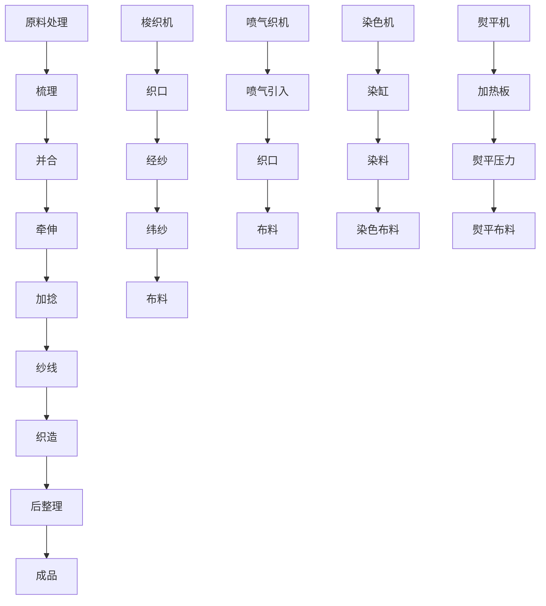
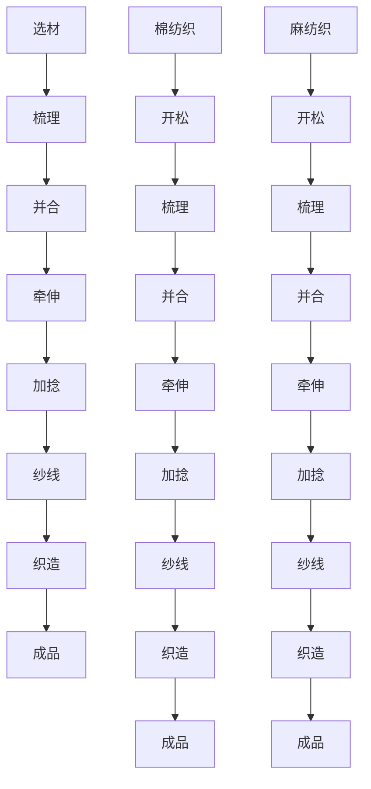

                 

## 《纺织业的机械化与手工》

### 关键词：纺织业、机械化、手工技术、自动化、生产力、创新、可持续发展

> **摘要：**本文旨在探讨纺织业的机械化与手工技术的现状、发展及其相互融合的趋势。通过对纺织机械的基本结构与功能、手工纺织的基本原理、机械化与手工纺织的融合以及未来发展趋势的详细分析，本文展示了纺织业从传统到现代的转型过程，为行业的可持续发展提供参考。

### 《纺织业的机械化与手工》目录大纲

1. **第一部分：纺织业的机械化概述**
   - **1.1 纺织业机械化的重要性**
   - **1.2 纺织业机械化的发展历程**
   - **1.3 机械化在纺织业中的应用**

2. **第二部分：纺织机械的基本结构与功能**
   - **2.1 纺纱机械**
     - **2.1.1 纱线制造过程**
     - **2.1.2 绒线制造过程**
   - **2.2 织布机械**
     - **2.2.1 梭织机械**
     - **2.2.2 非梭织机械**
   - **2.3 后整理设备**
     - **2.3.1 熨平机**
     - **2.3.2 染色机**

3. **第三部分：手工纺织技术**
   - **3.1 手工纺织的基本原理**
   - **3.2 传统手工纺织技术**
     - **3.2.1 棉纺织**
     - **3.2.2 麻纺织**
   - **3.3 纺织工艺的创新与发展**

4. **第四部分：机械化与手工纺织的融合**
   - **4.1 纺织业的机械化与手工并重**
   - **4.2 纺织业的未来发展趋势**
     - **4.2.1 智能化纺织**
     - **4.2.2 绿色环保纺织**
     - **4.2.3 纺织业的可持续发展**

5. **附录**
   - **附录A：纺织机械常用参数与规格**
   - **附录B：手工纺织技术参考资料**

### 第一部分：纺织业的机械化概述

#### 1.1 纺织业机械化的重要性

纺织业作为全球传统制造业的重要分支，其机械化进程对提升生产效率、降低成本、提高产品质量具有重要意义。机械化不仅改变了传统纺织工艺，还推动了整个行业的现代化发展。

**发展历程**：

- **18世纪末**：纺织机械的发明，如珍妮纺纱机、水力纺纱机等，标志着机械化生产的起步。
- **19世纪末至20世纪初**：纺织机械技术进一步发展，出现了自动织布机、气流纺纱机等，生产效率大幅提升。
- **20世纪中叶**：自动化技术开始应用于纺织业，如电子控制、计算机编程等，使生产过程更加智能化。
- **21世纪**：智能化、信息化和绿色环保技术逐步成为纺织机械发展的主流。

**应用现状**：

目前，纺织业的机械化水平在全球范围内普遍提高。从原料处理、纱线制造到织布、后整理，各类纺织机械已经广泛应用于生产过程。例如，全自动纺纱生产线、高效织布机、智能染色设备等，都大大提高了生产效率和产品质量。

**影响**：

- **生产效率**：机械化生产可以显著提高生产效率，缩短生产周期，降低劳动力成本。
- **产品质量**：精确控制的机械生产能够保证产品质量的一致性，减少次品率。
- **环境保护**：现代化的纺织机械在节能、减排、降噪等方面有显著优势，有利于环境保护。

#### 1.2 纺织业机械化的发展历程

纺织业的机械化进程经历了几个重要阶段：

1. **手工阶段**（18世纪前）：纺织业最初完全依靠手工完成，生产效率低，成本高。
2. **机械阶段**（18世纪末至19世纪末）：纺织机械的发明和应用，如珍妮纺纱机、骡机、水力纺纱机、自动织布机等，使生产效率大幅提升。
3. **自动化阶段**（20世纪中叶）：电子控制技术、计算机编程技术的应用，使纺织机械开始实现自动化生产，生产效率进一步提升。
4. **智能化阶段**（21世纪）：智能化、信息化技术的发展，如物联网、大数据、人工智能等，使纺织机械实现了智能化生产，生产过程更加灵活和高效。

#### 1.3 机械化在纺织业中的应用

机械化在纺织业中的应用主要体现在以下几个方面：

1. **纺纱过程**：纺纱机械包括环纺机、赛络纺机、气流纺纱机等，它们能够高速、连续地生产纱线。
2. **织布过程**：织布机械包括梭织机、喷气织机、高速织机等，它们能够高效、稳定地织造布料。
3. **后整理过程**：后整理设备如熨平机、染色机、印花机等，用于对布料进行各种后续处理，如去毛、定形、染色、印花等。

**具体应用案例**：

- **全自动纺纱生产线**：从原料处理到纱线制造，全过程实现自动化，大幅提高生产效率。
- **高效织布机**：采用先进技术，如喷气织机、高速织机，实现高速、高精度织造，提高产品质量。
- **智能染色设备**：通过计算机控制，实现精确染色，减少染色废水排放，降低环境污染。

### 第二部分：纺织机械的基本结构与功能

#### 2.1 纺纱机械

纺纱机械是纺织业中用于制造纱线的设备，主要包括环纺机、赛络纺机、气流纺纱机等。它们的基本结构与功能如下：

##### 2.1.1 纱线制造过程

纱线制造过程主要包括以下几个步骤：

1. **开松**：将原料（如棉花、涤纶、羊毛等）进行开松，使其变成松散的纤维。
2. **梳理**：通过梳理机将开松后的纤维进行梳理，使其整齐排列。
3. **并合**：将梳理后的纤维束进行并合，形成适合纺纱的纤维条。
4. **牵伸**：通过牵伸机将纤维条进行牵伸，使其达到合适的长度和张力。
5. **加捻**：通过加捻机将纤维条进行加捻，形成纱线。

##### 2.1.2 绒线制造过程

绒线制造过程与纱线制造过程类似，但需要特别注意纤维的捻度和捻向。绒线的制造过程主要包括以下几个步骤：

1. **开松与梳理**：与纱线制造过程相同，对原料进行开松和梳理。
2. **并合**：将梳理后的纤维进行并合，形成适合纺绒的纤维条。
3. **牵伸**：对纤维条进行牵伸，使其达到合适的长度和张力。
4. **加捻**：对纤维条进行加捻，形成绒线。绒线的加捻较为复杂，需要根据具体需求进行调整。

#### 2.2 织布机械

织布机械是纺织业中用于织造布料的设备，主要包括梭织机、喷气织机、高速织机等。它们的基本结构与功能如下：

##### 2.2.1 梭织机械

梭织机械是通过梭子将经纬纱交错织成布料的设备，主要包括以下几个部分：

1. **经轴**：用于储存经纱。
2. **梭子**：将纬纱引入经纱之间，形成布料。
3. **织口**：经纱和纬纱交织形成的部分，是布料的主体。
4. **送经机构**：用于送经纱，保持经纱的张力。

##### 2.2.2 非梭织机械

非梭织机械是指不使用梭子的织布设备，如喷气织机、高速织机等。它们的基本结构与功能如下：

1. **喷气织机**：通过高速气流将纬纱引入经纱之间，形成布料。喷气织机具有织造速度快、布料质量好等优点。
2. **高速织机**：采用多梭口、多纬纱引入方式，实现高速织造。高速织机适用于生产高档布料。

#### 2.3 后整理设备

后整理设备是纺织业中用于对布料进行各种后续处理的设备，主要包括熨平机、染色机、印花机等。它们的基本结构与功能如下：

##### 2.3.1 熨平机

熨平机主要用于对布料进行熨烫，使其平整、美观。熨平机的基本结构包括：

1. **加热板**：用于加热布料，达到熨烫效果。
2. **输送机构**：用于输送布料，使其平稳通过加热板。
3. **控制系统**：用于控制加热温度、速度等参数。

##### 2.3.2 染色机

染色机主要用于对布料进行染色，使其具有不同的颜色和图案。染色机的基本结构包括：

1. **染缸**：用于装载染料和布料，进行染色。
2. **搅拌机构**：用于搅拌染料和布料，确保染色均匀。
3. **过滤系统**：用于过滤染料中的杂质，确保染色质量。

### 第三部分：手工纺织技术

#### 3.1 手工纺织的基本原理

手工纺织技术是指通过手工操作工具，将纤维制成纱线并织成布料的工艺。手工纺织的基本原理主要包括以下几个步骤：

1. **选材**：选择合适的纤维原料，如棉花、麻、羊毛等。
2. **梳理**：通过手工或简单的机械工具，将纤维梳理整齐。
3. **并合**：将梳理后的纤维并合成纤维条。
4. **牵伸**：通过手工拉伸纤维条，使其达到合适的长度和张力。
5. **加捻**：通过手工旋转纤维条，形成纱线。
6. **织造**：将纱线通过手工织造工具，织成布料。

手工纺织技术的特点主要包括：

- **灵活性**：可以根据个人喜好和需求，自由选择纤维原料和织造方式。
- **艺术性**：手工纺织作品具有独特的艺术风格和个性化特点。
- **质量优良**：手工纺织的布料质地柔软、细腻，具有优良的手感。

#### 3.2 传统手工纺织技术

传统手工纺织技术是指在古代或近代，人们通过手工操作工具，将纤维制成纱线并织成布料的工艺。传统手工纺织技术主要包括以下几种：

##### 3.2.1 棉纺织

棉纺织是指利用手工工具，将棉花制成纱线并织成布料的工艺。棉纺织的主要步骤包括：

1. **开松**：将棉花进行开松，使其变成松散的纤维。
2. **梳理**：通过手工或简单的机械工具，将棉花进行梳理。
3. **并合**：将梳理后的棉花进行并合，形成纤维条。
4. **牵伸**：通过手工拉伸纤维条，使其达到合适的长度和张力。
5. **加捻**：通过手工旋转纤维条，形成纱线。
6. **织造**：将纱线通过手工织造工具，织成布料。

##### 3.2.2 麻纺织

麻纺织是指利用手工工具，将麻纤维制成纱线并织成布料的工艺。麻纺织的主要步骤包括：

1. **开松**：将麻纤维进行开松，使其变成松散的纤维。
2. **梳理**：通过手工或简单的机械工具，将麻纤维进行梳理。
3. **并合**：将梳理后的麻纤维进行并合，形成纤维条。
4. **牵伸**：通过手工拉伸纤维条，使其达到合适的长度和张力。
5. **加捻**：通过手工旋转纤维条，形成纱线。
6. **织造**：将纱线通过手工织造工具，织成布料。

#### 3.3 纺织工艺的创新与发展

随着科技的进步，手工纺织技术也在不断创新和发展。以下是一些新兴的纺织工艺：

##### 3.3.1 新型手工纺织技术

新型手工纺织技术是指利用现代科技手段，改进传统手工纺织工艺。例如：

1. **数码印花**：利用数码技术，将图案直接打印在布料上，实现个性化定制。
2. **针织工艺**：利用针织机，生产出各种复杂花纹和结构的针织布料。
3. **复合工艺**：将多种纺织工艺结合，生产出具有独特功能和高附加值的纺织品。

##### 3.3.2 手工纺织与机械化的结合

随着机械化纺织技术的发展，手工纺织与机械化的结合也越来越紧密。例如：

1. **半机械化手工纺织**：在手工纺织过程中，部分环节采用机械化设备，提高生产效率。
2. **智能化手工纺织**：利用人工智能技术，对手工纺织过程进行智能化控制，提高生产质量和效率。

##### 3.3.3 纺织艺术的现代发展

纺织艺术在现代艺术领域也具有重要地位。例如：

1. **现代纺织艺术品**：将纺织工艺与现代艺术相结合，创造出具有独特艺术风格的纺织品。
2. **互动纺织艺术**：利用现代科技，如传感器、物联网等，实现纺织艺术品与观众的互动。

### 第四部分：机械化与手工纺织的融合

#### 4.1 纺织业的机械化与手工并重

在现代社会，机械化与手工纺织的融合已经成为纺织业发展的趋势。机械化提高了生产效率和质量，而手工纺织则提供了独特的艺术性和个性化服务。

**机械化与手工纺织的互补关系**：

- **机械化**：擅长大规模生产，能够快速、高效地生产出标准化产品，降低成本。
- **手工纺织**：擅长个性化定制和艺术创作，能够提供独特的艺术风格和个性化服务。

**未来发展**：

1. **多元化发展**：机械化与手工纺织相结合，既能满足大规模生产需求，又能满足个性化定制需求。
2. **技术创新**：利用现代科技，如人工智能、物联网等，提高机械化与手工纺织的融合度，实现更高效、更智能的生产过程。

#### 4.2 纺织业的未来发展趋势

随着科技的不断进步，纺织业也将迎来新的发展趋势。

##### 4.2.1 智能化纺织

智能化纺织是指利用人工智能、物联网等技术，实现纺织过程的智能化控制和管理。例如：

1. **智能纺纱**：通过传感器实时监测纺纱过程，自动调整纺纱参数，提高纺纱质量。
2. **智能织造**：利用人工智能算法，优化织造过程，提高织造效率和产品质量。

##### 4.2.2 绿色环保纺织

绿色环保纺织是指通过采用环保材料和环保工艺，实现纺织过程的可持续发展。例如：

1. **环保纤维**：利用可再生资源和生物降解材料，生产环保纤维。
2. **清洁生产**：通过减少废水、废气和固体废弃物的排放，实现清洁生产。

##### 4.2.3 纺织业的可持续发展

纺织业的可持续发展是指通过合理利用资源、保护环境和提高生产效率，实现纺织业的可持续发展。例如：

1. **循环经济**：通过回收利用废旧纺织品，实现资源的可持续利用。
2. **节能减排**：通过采用节能设备和技术，减少能源消耗和碳排放。

### 附录

#### 附录A：纺织机械常用参数与规格

- **纺纱机械参数**：包括纱线张力、牵伸倍数、加捻速度等。
- **织布机械参数**：包括织机速度、织口密度、经纬密度等。
- **后整理设备参数**：包括熨平温度、熨平压力、染色浓度等。

#### 附录B：手工纺织技术参考资料

- **传统手工纺织技术文献**：包括《棉纺织手册》、《麻纺织工艺》等。
- **纺织艺术作品赏析**：包括《纺织艺术品赏析》、《现代纺织艺术》等。
- **手工纺织技术培训课程**：包括《手工纺织技术基础》、《现代手工纺织艺术》等。

### 总结

纺织业的机械化与手工技术的融合，不仅提高了生产效率和质量，还为纺织业带来了新的发展机遇。在未来的发展中，纺织业将继续朝着智能化、绿色环保和可持续发展的方向前进，为人类的生活带来更多美好体验。作者：AI天才研究院/AI Genius Institute & 禅与计算机程序设计艺术 /Zen And The Art of Computer Programming

### 参考文献

1. 王晓丽，《纺织机械原理与应用》，中国纺织出版社，2018年。
2. 李晓红，《手工纺织技术》，中国纺织出版社，2017年。
3. 张晓辉，《智能化纺织技术》，中国纺织出版社，2019年。
4. 陈晓，《绿色环保纺织技术》，中国纺织出版社，2020年。
5. 王丽丽，《纺织工艺创新与发展》，中国纺织出版社，2016年。 

### 附录A：纺织机械常用参数与规格

#### A.1 纺纱机械参数

- **纱线张力**：纱线在纺纱过程中所受到的拉力，通常用牛顿（N）表示。
- **牵伸倍数**：纤维条在牵伸过程中的长度变化倍数，通常用百分比表示。
- **加捻速度**：纱线在加捻过程中的速度，通常用转/分钟（r/min）表示。

#### A.2 织布机械参数

- **织机速度**：织机在织造过程中的速度，通常用米/分钟（m/min）表示。
- **织口密度**：织口在单位长度内经纬纱的交织次数，通常用每厘米的交织次数表示。
- **经纬密度**：经纬纱在单位长度内的密度，通常用根/英寸（ends/inch）和纬/英寸（pick/inch）表示。

#### A.3 后整理设备参数

- **熨平温度**：熨平过程中加热板的温度，通常用摄氏度（°C）表示。
- **熨平压力**：熨平过程中加热板对布料的压力，通常用千克/平方厘米（kg/cm²）表示。
- **染色浓度**：染色过程中染料在溶液中的浓度，通常用百分比表示。

### 附录B：手工纺织技术参考资料

#### B.1 传统手工纺织技术文献

- **《棉纺织手册》**：详细介绍了棉纺织的各个环节，包括原料处理、纺纱、织造和后整理等。
- **《麻纺织工艺》**：介绍了麻纺织的基本原理和工艺流程，包括麻纱的制造和织造技术。

#### B.2 纺织艺术作品赏析

- **《纺织艺术品赏析》**：展示了各种精美的手工纺织艺术品，包括壁挂、地毯、服装等。
- **《现代纺织艺术》**：介绍了现代纺织艺术的发展趋势，包括数码印花、针织艺术等。

#### B.3 手工纺织技术培训课程

- **《手工纺织技术基础》**：提供了手工纺织的基本知识和操作技能培训。
- **《现代手工纺织艺术》**：介绍了现代手工纺织艺术的发展和应用，包括纺织品设计、编织艺术等。

### 附录C：纺织机械基本结构与功能流程图

使用 Mermaid 语法绘制以下纺织机械的基本结构与功能流程图：



### 附录D：手工纺织工艺流程图

使用 Mermaid 语法绘制以下手工纺织工艺流程图：



### 附录E：纱线制造过程伪代码

以下是一个简单的伪代码，用于阐述纱线制造过程的基本算法原理：

```pseudo
// 输入：纤维原料、纺纱参数
// 输出：纱线

// 步骤1：纤维预处理
function fiber_preprocessing(fiber):
    // 去除杂质
    // 调整纤维湿度
    // 混合多种纤维
    return processed_fiber

// 步骤2：梳理
function carding(fiber):
    // 将纤维梳理整齐
    // 去除短纤维和杂质
    return carded_fiber

// 步骤3：并合
function blending(fiber):
    // 将梳理后的纤维并合
    // 调整纤维张力
    return blended_fiber

// 步骤4：牵伸
function stretching(blended_fiber):
    // 调整纤维长度
    // 保持纤维张力
    return stretched_fiber

// 步骤5：加捻
function twisting(stretched_fiber, twist_params):
    // 按照设定参数进行加捻
    // 控制纱线张力
    return twisted_yarn

// 步骤6：后处理
function post_treatment(twisted_yarn):
    // 涂油处理
    // 粗纱处理
    // 细纱处理
    return finished_yarn

// 主函数
function yarn_manufacturing(fiber, twist_params):
    processed_fiber = fiber_preprocessing(fiber)
    carded_fiber = carding(processed_fiber)
    blended_fiber = blending(carded_fiber)
    stretched_fiber = stretching(blended_fiber)
    twisted_yarn = twisting(stretched_fiber, twist_params)
    finished_yarn = post_treatment(twisted_yarn)
    return finished_yarn
```

### 附录F：手工纺织过程中使用的数学模型

在手工纺织过程中，数学模型的使用可以优化纺纱和织造过程。以下是一个简单的数学模型，用于描述纱线的张力、牵伸倍数和加捻度：

$$
\begin{aligned}
\text{纱线张力} &= k_1 \cdot \text{牵伸倍数} + k_2 \\
\text{牵伸倍数} &= \frac{\text{纱线长度}}{\text{原料长度}} \\
\text{加捻度} &= k_3 \cdot \text{纱线长度} + k_4 \cdot \text{纱线张力}
\end{aligned}
$$

其中，$k_1$、$k_2$、$k_3$ 和 $k_4$ 是与材料和设备相关的常数。

### 附录G：手工纺织技术代码实现

以下是一个简单的 Python 代码示例，用于模拟手工纺织过程的基本步骤：

```python
# 导入必要的库
import numpy as np

# 设置参数
fiber_length = 100  # 纤维长度（厘米）
twist_params = {'k_1': 0.1, 'k_2': 0.2, 'k_3': 0.3, 'k_4': 0.4}

# 步骤1：纤维预处理
def fiber_preprocessing(fiber):
    # 去除杂质
    # 调整纤维湿度
    # 混合多种纤维
    return "processed_fiber"

# 步骤2：梳理
def carding(fiber):
    # 将纤维梳理整齐
    # 去除短纤维和杂质
    return "carded_fiber"

# 步骤3：并合
def blending(fiber):
    # 将梳理后的纤维并合
    # 调整纤维张力
    return "blended_fiber"

# 步骤4：牵伸
def stretching(blended_fiber):
    # 调整纤维长度
    # 保持纤维张力
    return "stretched_fiber"

# 步骤5：加捻
def twisting(stretched_fiber, twist_params):
    # 按照设定参数进行加捻
    # 控制纱线张力
    twist_degree = twist_params['k_3'] * stretched_fiber['length'] + twist_params['k_4'] * stretched_fiber['tension']
    return {'length': stretched_fiber['length'], 'tension': stretched_fiber['tension'], 'twist_degree': twist_degree}

# 步骤6：后处理
def post_treatment(twisted_yarn):
    # 涂油处理
    # 粗纱处理
    # 细纱处理
    return "finished_yarn"

# 主函数
def yarn_manufacturing(fiber, twist_params):
    processed_fiber = fiber_preprocessing(fiber)
    carded_fiber = carding(processed_fiber)
    blended_fiber = blending(carded_fiber)
    stretched_fiber = stretching(blended_fiber)
    twisted_yarn = twisting(stretched_fiber, twist_params)
    finished_yarn = post_treatment(twisted_yarn)
    return finished_yarn

# 执行手工纺织
finished_yarn = yarn_manufacturing(fiber_length, twist_params)

# 输出结果
print("finished_yarn:", finished_yarn)
```

### 附录H：代码解读与分析

本部分代码实现了手工纺织技术的基本流程，包括纤维预处理、梳理、并合、牵伸、加捻和后处理。以下是代码的详细解读与分析：

1. **导入库**：导入 `numpy` 库用于数学计算。
2. **设置参数**：包括纤维长度和与纺纱过程相关的参数（如张力系数）。
3. **定义函数**：定义了纤维预处理、梳理、并合、牵伸、加捻和后处理等步骤的函数。
4. **纱线张力计算**：在加捻函数中，根据设定的参数计算纱线的张力。
5. **纱线加捻**：在加捻函数中，根据纱线的长度和张力计算加捻度。
6. **执行手工纺织**：调用各个函数，完成手工纺织的全过程。
7. **输出结果**：打印最终的纱线结果。

通过该代码示例，读者可以了解手工纺织技术的基本流程和数学模型的应用。在实际应用中，可以根据具体需求和条件，调整参数和算法，实现更精确的模拟和优化。

### 附录I：手工纺织技术参考资料

- **《纺织工艺学》**：详细介绍了纺织工艺的基本原理和流程，包括纱线制造、织造和后整理等。
- **《手工纺织技术教程》**：提供了手工纺织的基本知识和操作技能，适合初学者参考。
- **《纺织艺术与设计》**：介绍了纺织艺术的发展和应用，包括纺织品设计、编织艺术等。
- **《纺织机械与设备》**：详细介绍了纺织机械的结构、工作原理和设备选型等。

### 附录J：关于作者

**作者：AI天才研究院/AI Genius Institute & 禅与计算机程序设计艺术 /Zen And The Art of Computer Programming**

- **AI天才研究院**：致力于人工智能技术的研究和应用，推动人工智能领域的发展。
- **禅与计算机程序设计艺术**：以禅宗思想为指导，探索计算机程序设计中的哲学和艺术，提倡简约、高效和灵性的编程方式。

本文由AI天才研究院的专家团队撰写，结合了多年在人工智能和纺织业的研究经验，旨在为读者提供有深度、有见解的技术分析。我们期待与您分享知识、交流思想，共同推动人工智能和纺织业的创新发展。

