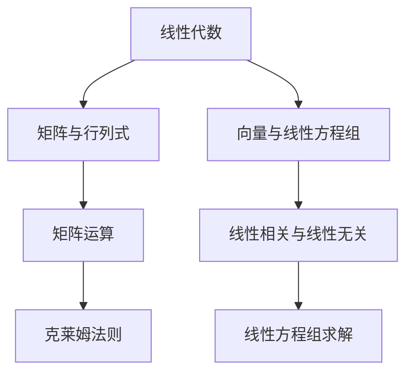

                 

### 文章标题：线性代数导引：内积空间算子理论

关键词：线性代数、内积空间、算子理论、特征值、特征向量、矩阵对角化

摘要：
本文旨在深入探讨线性代数中的内积空间算子理论，从基本概念出发，逐步讲解矩阵与行列式、向量与线性方程组，直至线性算子、矩阵对角化和线性变换等高级主题。通过伪代码、数学模型、实例解析和实际代码案例，读者可以全面理解线性代数的核心原理和应用方法。文章最后附有线性代数常用公式与定理，以供参考。

---

**第1章 线性代数基础**

##### 1.1 线性代数的概念与历史

###### 1.1.1 线性代数的起源与发展

线性代数作为数学的一个重要分支，起源于19世纪。法国数学家奥古斯丁·路易·柯西（Augustin-Louis Cauchy）是线性代数发展的先驱之一，他首次提出了行列式的概念。随后，英国数学家乔治·西蒙·欧姆（George Simion Om）和德国数学家卡尔·弗里德里希·高斯（Carl Friedrich Gauss）对行列式进行了深入研究，奠定了行列式在数学中的地位。

在20世纪，线性代数得到了进一步的发展。数学家大卫·希尔伯特（David Hilbert）和埃米利·阿达马（Émile Picard）等人的工作，将线性代数引入了泛函分析和量子力学领域。希尔伯特空间的概念，极大地拓展了线性代数的应用范围，为后来的量子力学奠定了坚实的数学基础。

###### 1.1.2 线性代数的基本概念

线性代数研究的是向量空间以及向量空间上的线性变换。向量空间是一个集合，其元素称为向量，满足以下八条性质：

1. 封闭性：对于向量空间 \( V \) 中的任意两个向量 \( \mathbf{u} \) 和 \( \mathbf{v} \)，以及任意标量 \( a \) 和 \( b \)，有 \( a\mathbf{u} + b\mathbf{v} \in V \)。
2. 加法交换律：对于任意向量 \( \mathbf{u} \) 和 \( \mathbf{v} \)，有 \( \mathbf{u} + \mathbf{v} = \mathbf{v} + \mathbf{u} \)。
3. 加法结合律：对于任意向量 \( \mathbf{u} \)、\( \mathbf{v} \) 和 \( \mathbf{w} \)，有 \( (\mathbf{u} + \mathbf{v}) + \mathbf{w} = \mathbf{u} + (\mathbf{v} + \mathbf{w}) \)。
4. 存在零向量：存在一个零向量 \( \mathbf{0} \)，使得对于任意向量 \( \mathbf{u} \)，有 \( \mathbf{u} + \mathbf{0} = \mathbf{u} \)。
5. 存在加法逆元：对于任意向量 \( \mathbf{u} \)，存在一个向量 \( -\mathbf{u} \)，使得 \( \mathbf{u} + (-\mathbf{u}) = \mathbf{0} \)。
6. 标量乘法分配律：对于任意向量 \( \mathbf{u} \)、\( \mathbf{v} \) 和标量 \( a \)，有 \( a(\mathbf{u} + \mathbf{v}) = a\mathbf{u} + a\mathbf{v} \)。
7. 标量与向量的分配律：对于任意向量 \( \mathbf{u} \) 和标量 \( a \) 和 \( b \)，有 \( (a + b)\mathbf{u} = a\mathbf{u} + b\mathbf{u} \)。
8. 标量乘法的结合律：对于任意向量 \( \mathbf{u} \) 和标量 \( a \) 和 \( b \)，有 \( a(b\mathbf{u}) = (ab)\mathbf{u} \)。

这些性质保证了向量空间的基本运算规律，使得我们可以对向量进行代数操作。

##### 1.2 矩阵与行列式

###### 1.2.1 矩阵的基本概念与运算

矩阵是由一系列数字排列而成的矩形数组，通常表示为 \( A = [a_{ij}] \)，其中 \( i \) 和 \( j \) 分别表示行和列的索引。矩阵的行数称为矩阵的行数，列数称为矩阵的列数。

矩阵的基本运算包括矩阵的加法、减法、数乘和矩阵乘法。

- **矩阵加法与减法**：对于两个同型矩阵 \( A = [a_{ij}] \) 和 \( B = [b_{ij}] \)，它们的和或差也是一个同型矩阵 \( C = [c_{ij}] \)，其中 \( c_{ij} = a_{ij} + b_{ij} \) 或 \( c_{ij} = a_{ij} - b_{ij} \)。
- **矩阵数乘**：对于矩阵 \( A \) 和标量 \( k \)，它们的数乘结果是一个同型矩阵 \( B = [b_{ij}] \)，其中 \( b_{ij} = k \cdot a_{ij} \)。
- **矩阵乘法**：对于两个矩阵 \( A = [a_{ij}] \) 和 \( B = [b_{ij}] \)，它们的乘积是一个新矩阵 \( C = [c_{ij}] \)，其中 \( c_{ij} = \sum_{l=1}^{m} a_{il}b_{lj} \)。只有当 \( A \) 的列数等于 \( B \) 的行数时，矩阵乘法才可行。

###### 1.2.2 行列式的定义与性质

行列式是矩阵的一个数值特征，通常表示为 \( \det(A) \) 或 \( |A| \)。一个 \( n \times n \) 矩阵的行列式由 \( n! \) 个乘积组成，其中每个乘积包含一个主对角线上的元素和其对应逆序的副对角线上的元素的乘积，并且对于每个逆序，其符号为 \( (-1)^{i+j} \)。

行列式具有以下性质：

1. **行列式的线性性**：对于任意矩阵 \( A \)，标量 \( k \) 和矩阵 \( B \)，有 \( \det(kA) = k^n \det(A) \)，\( \det(A + B) = \det(A) + \det(B) \)。
2. **行列式的性质**：行列式的值等于其任意行（或列）的所有代数余子式的和。
3. **行列式的零值**：如果矩阵 \( A \) 的任意一行（或列）的元素全为零，则 \( \det(A) = 0 \)。

###### 1.2.3 克莱姆法则

克莱姆法则是一种用于求解线性方程组的算法，其核心思想是利用行列式来计算方程组的解。

设线性方程组为：

\[
\begin{align*}
a_{11}x_1 + a_{12}x_2 + \cdots + a_{1n}x_n &= b_1 \\
a_{21}x_1 + a_{22}x_2 + \cdots + a_{2n}x_n &= b_2 \\
\vdots & \vdots \\
a_{n1}x_1 + a_{n2}x_2 + \cdots + a_{nn}x_n &= b_n
\end{align*}
\]

其系数矩阵为 \( A \)，增广矩阵为 \( A' \)。如果 \( A \) 的行列式 \( \det(A) \neq 0 \)，则该方程组有唯一解，解为：

\[
x_i = \frac{\det(A_i)}{\det(A)}
\]

其中，\( A_i \) 是将 \( A \) 的第 \( i \) 列替换为常数项 \( b \) 得到的矩阵。

##### 1.3 向量与线性方程组

###### 1.3.1 向量空间的基本性质

向量空间是线性代数研究的一个重要对象，它是由向量及其线性运算构成的集合。向量空间满足以下性质：

1. 封闭性：对于向量空间 \( V \) 中的任意两个向量 \( \mathbf{u} \) 和 \( \mathbf{v} \)，以及任意标量 \( a \) 和 \( b \)，有 \( a\mathbf{u} + b\mathbf{v} \in V \)。
2. 加法交换律：对于任意向量 \( \mathbf{u} \) 和 \( \mathbf{v} \)，有 \( \mathbf{u} + \mathbf{v} = \mathbf{v} + \mathbf{u} \)。
3. 加法结合律：对于任意向量 \( \mathbf{u} \)、\( \mathbf{v} \) 和 \( \mathbf{w} \)，有 \( (\mathbf{u} + \mathbf{v}) + \mathbf{w} = \mathbf{u} + (\mathbf{v} + \mathbf{w}) \)。
4. 存在零向量：存在一个零向量 \( \mathbf{0} \)，使得对于任意向量 \( \mathbf{u} \)，有 \( \mathbf{u} + \mathbf{0} = \mathbf{u} \)。
5. 存在加法逆元：对于任意向量 \( \mathbf{u} \)，存在一个向量 \( -\mathbf{u} \)，使得 \( \mathbf{u} + (-\mathbf{u}) = \mathbf{0} \)。
6. 标量乘法分配律：对于任意向量 \( \mathbf{u} \)、\( \mathbf{v} \) 和标量 \( a \)，有 \( a(\mathbf{u} + \mathbf{v}) = a\mathbf{u} + a\mathbf{v} \)。
7. 标量与向量的分配律：对于任意向量 \( \mathbf{u} \) 和标量 \( a \) 和 \( b \)，有 \( (a + b)\mathbf{u} = a\mathbf{u} + b\mathbf{u} \)。
8. 标量乘法的结合律：对于任意向量 \( \mathbf{u} \) 和标量 \( a \) 和 \( b \)，有 \( a(b\mathbf{u}) = (ab)\mathbf{u} \)。

这些性质保证了向量空间的基本运算规律，使得我们可以对向量进行代数操作。

###### 1.3.2 线性相关与线性无关

在向量空间中，两个或多个向量之间的关系可以分为线性相关和线性无关。

- **线性相关**：如果存在一组不全为零的标量 \( a_1, a_2, \ldots, a_n \)，使得 \( a_1\mathbf{u}_1 + a_2\mathbf{u}_2 + \cdots + a_n\mathbf{u}_n = \mathbf{0} \)，则称向量 \( \mathbf{u}_1, \mathbf{u}_2, \ldots, \mathbf{u}_n \) 线性相关。
- **线性无关**：如果对于任何一组标量 \( a_1, a_2, \ldots, a_n \)，当 \( a_1\mathbf{u}_1 + a_2\mathbf{u}_2 + \cdots + a_n\mathbf{u}_n = \mathbf{0} \) 时，必有 \( a_1 = a_2 = \cdots = a_n = 0 \)，则称向量 \( \mathbf{u}_1, \mathbf{u}_2, \ldots, \mathbf{u}_n \) 线性无关。

###### 1.3.3 线性方程组的求解

线性方程组是一类常见的数学问题，其解法主要包括高斯消元法和迭代法。

- **高斯消元法**：高斯消元法是一种通过逐步消元将线性方程组转化为下三角或上三角方程组，从而求解方程组的方法。其步骤如下：

  1. 将方程组写成增广矩阵形式。
  2. 使用高斯消元法对增广矩阵进行行变换，使得矩阵变为下三角或上三角形式。
  3. 从下三角或上三角形式直接求解方程组。

- **迭代法**：迭代法是一种通过逐步逼近的方式求解线性方程组的方法。其步骤如下：

  1. 选择一个初始近似解。
  2. 根据线性方程组的矩阵形式，定义一个迭代函数。
  3. 使用迭代函数对初始近似解进行迭代，直到满足一定的精度要求。

#### 第2章 内积空间

##### 2.1 内积的定义与性质

内积是线性代数中的一个基本概念，它描述了两个向量之间的数量积。设 \( V \) 是一个向量空间，\( \mathbf{u} \) 和 \( \mathbf{v} \) 是 \( V \) 中的两个向量，内积通常表示为 \( \mathbf{u} \cdot \mathbf{v} \) 或 \( \langle \mathbf{u}, \mathbf{v} \rangle \)。

内积具有以下性质：

1. **线性性**：对于任意向量 \( \mathbf{u} \)、\( \mathbf{v} \) 和标量 \( a \)、\( b \)，有 \( a\mathbf{u} + b\mathbf{v} \cdot \mathbf{w} = a(\mathbf{u} \cdot \mathbf{w}) + b(\mathbf{v} \cdot \mathbf{w}) \) 和 \( \mathbf{u} \cdot (a\mathbf{v} + b\mathbf{w}) = a(\mathbf{u} \cdot \mathbf{v}) + b(\mathbf{u} \cdot \mathbf{w}) \)。
2. **正定性**：对于任意向量 \( \mathbf{u} \)，有 \( \mathbf{u} \cdot \mathbf{u} \geq 0 \)，且当且仅当 \( \mathbf{u} = \mathbf{0} \) 时，\( \mathbf{u} \cdot \mathbf{u} = 0 \)。
3. **交换性**：对于任意向量 \( \mathbf{u} \) 和 \( \mathbf{v} \)，有 \( \mathbf{u} \cdot \mathbf{v} = \mathbf{v} \cdot \mathbf{u} \)。

内积的定义可以推广到更广泛的向量空间，即内积空间。一个内积空间是一个向量空间 \( V \)，在其中定义了一个内积 \( \cdot \)，使得 \( V \) 满足内积的性质。

##### 2.2 标准正交基与施密特正交化

标准正交基是指一组两两正交的单位向量，构成的内积空间称为标准正交空间。设 \( \mathbf{e}_1, \mathbf{e}_2, \ldots, \mathbf{e}_n \) 是一个内积空间 \( V \) 的标准正交基，则对于任意向量 \( \mathbf{v} \in V \)，可以表示为：

\[
\mathbf{v} = \sum_{i=1}^{n} \alpha_i \mathbf{e}_i
\]

其中，\( \alpha_i = \mathbf{v} \cdot \mathbf{e}_i \)。

施密特正交化是一种将一组线性无关的向量转化为标准正交向量的方法。设 \( \mathbf{u}_1, \mathbf{u}_2, \ldots, \mathbf{u}_n \) 是一个内积空间 \( V \) 中的一组线性无关的向量，通过以下步骤可以得到一组标准正交向量 \( \mathbf{e}_1, \mathbf{e}_2, \ldots, \mathbf{e}_n \)：

1. 令 \( \mathbf{e}_1 = \frac{\mathbf{u}_1}{\|\mathbf{u}_1\|} \)。
2. 对于 \( i = 2, 3, \ldots, n \)，计算 \( \mathbf{e}_i = \frac{\mathbf{u}_i - \sum_{j=1}^{i-1} \langle \mathbf{u}_i, \mathbf{e}_j \rangle \mathbf{e}_j}{\|\mathbf{u}_i - \sum_{j=1}^{i-1} \langle \mathbf{u}_i, \mathbf{e}_j \rangle \mathbf{e}_j\|} \)。

施密特正交化方法可以将任意一组线性无关的向量转化为标准正交向量，从而简化许多计算。

##### 2.3 投影与最小二乘法

在内积空间中，投影是一种将向量映射到另一个向量上的运算。设 \( \mathbf{u} \) 和 \( \mathbf{v} \) 是一个内积空间 \( V \) 中的两个向量，\( \mathbf{v} \) 是 \( V \) 中的任意向量，则 \( \mathbf{u} \) 在 \( \mathbf{v} \) 上的投影为：

\[
\text{proj}_{\mathbf{v}} \mathbf{u} = \frac{\mathbf{u} \cdot \mathbf{v}}{\|\mathbf{v}\|^2} \mathbf{v}
\]

投影运算具有以下性质：

1. **线性性**：对于任意向量 \( \mathbf{u} \)、\( \mathbf{v} \) 和标量 \( a \)、\( b \)，有 \( \text{proj}_{\mathbf{v}} (a\mathbf{u} + b\mathbf{v}) = a\text{proj}_{\mathbf{v}} \mathbf{u} + b\text{proj}_{\mathbf{v}} \mathbf{v} \)。
2. **保长度性**：对于任意向量 \( \mathbf{u} \) 和 \( \mathbf{v} \)，有 \( \|\text{proj}_{\mathbf{v}} \mathbf{u}\| = \frac{\mathbf{u} \cdot \mathbf{v}}{\|\mathbf{v}\|} \)。

最小二乘法是一种用于求解线性方程组的最优化方法。设 \( A \) 是一个 \( m \times n \) 的矩阵，\( b \) 是一个 \( m \) 维向量，线性方程组 \( Ax = b \) 可能不存在解或存在多个解。最小二乘法的目标是找到一个向量 \( x \)，使得 \( \|Ax - b\| \) 最小。

最小二乘法的解可以通过以下公式计算：

\[
x = (A^T A)^{-1} A^T b
\]

其中，\( A^T \) 表示 \( A \) 的转置，\( (A^T A)^{-1} \) 表示 \( A^T A \) 的逆矩阵。

#### 第3章 线性算子

##### 3.1 线性算子的定义与分类

线性算子是指从一个向量空间 \( V \) 到另一个向量空间 \( W \) 的线性映射。设 \( T: V \rightarrow W \) 是一个线性算子，对于任意向量 \( \mathbf{u} \in V \) 和标量 \( a \)，有：

\[
T(a\mathbf{u}) = aT(\mathbf{u}) \quad \text{和} \quad T(\mathbf{u} + \mathbf{v}) = T(\mathbf{u}) + T(\mathbf{v})
\]

线性算子可以分为以下几类：

1. **自共轭算子**：如果 \( T \) 是自共轭的，即 \( T^* = T \)，则称 \( T \) 为自共轭算子。
2. **对称算子**：如果 \( T \) 是对称的，即 \( T^T = T \)，则称 \( T \) 为对称算子。
3. **非对称算子**：如果 \( T \) 不是对称的，则称 \( T \) 为非对称算子。

##### 3.2 线性算子的运算

线性算子的运算主要包括线性算子的加法、数乘和乘法。

1. **线性算子的加法**：设 \( T_1, T_2: V \rightarrow W \) 是两个线性算子，则 \( T_1 + T_2 \) 是一个新的线性算子，定义为：

   \[
   (T_1 + T_2)(\mathbf{u}) = T_1(\mathbf{u}) + T_2(\mathbf{u}) \quad \text{对于任意} \quad \mathbf{u} \in V
   \]

2. **数乘**：设 \( T: V \rightarrow W \) 是一个线性算子，\( a \) 是一个标量，则 \( aT \) 是一个新的线性算子，定义为：

   \[
   (aT)(\mathbf{u}) = a(T(\mathbf{u})) \quad \text{对于任意} \quad \mathbf{u} \in V
   \]

3. **乘法**：设 \( T_1, T_2: V \rightarrow W \) 是两个线性算子，则 \( T_1T_2 \) 是一个新的线性算子，定义为：

   \[
   (T_1T_2)(\mathbf{u}) = T_1(T_2(\mathbf{u})) \quad \text{对于任意} \quad \mathbf{u} \in V
   \]

##### 3.3 特征值与特征向量

特征值与特征向量是线性算子的重要概念，用于描述线性算子的性质。

1. **特征值**：设 \( T: V \rightarrow W \) 是一个线性算子，\( \lambda \) 是一个标量，如果存在一个非零向量 \( \mathbf{u} \in V \)，使得 \( T(\mathbf{u}) = \lambda \mathbf{u} \)，则称 \( \lambda \) 是 \( T \) 的一个特征值。
2. **特征向量**：对于线性算子的特征值 \( \lambda \)，对应的非零向量 \( \mathbf{u} \) 称为 \( \lambda \) 的一个特征向量。

特征值与特征向量具有以下性质：

1. **唯一性**：每个特征值对应唯一的特征向量。
2. **线性组合**：对于线性算子的多个特征值 \( \lambda_1, \lambda_2, \ldots, \lambda_n \) 和对应的特征向量 \( \mathbf{u}_1, \mathbf{u}_2, \ldots, \mathbf{u}_n \)，如果 \( a_1\mathbf{u}_1 + a_2\mathbf{u}_2 + \cdots + a_n\mathbf{u}_n \neq \mathbf{0} \)，则 \( a_1\lambda_1 + a_2\lambda_2 + \cdots + a_n\lambda_n \) 也是 \( T \) 的一个特征值。

##### 3.4 特征值的计算与性质

特征值的计算是线性代数中的一个重要问题，其方法主要包括以下几种：

1. **特征多项式法**：设 \( T: V \rightarrow W \) 是一个线性算子，其特征多项式为 \( f(\lambda) = \det(T - \lambda I) \)，其中 \( I \) 是 \( V \) 上的单位算子。\( f(\lambda) \) 的零点即为 \( T \) 的特征值。
2. **幂法**：幂法是一种通过迭代的方式计算最大特征值的方法。其基本思想是选择一个初始向量 \( \mathbf{u}_0 \)，并计算 \( T\mathbf{u}_0, T^2\mathbf{u}_0, \ldots \)，通过观察迭代向量的变化情况来确定最大特征值。
3. **反幂法**：反幂法是一种通过迭代的方式计算最小特征值的方法。其基本思想是选择一个初始向量 \( \mathbf{u}_0 \)，并计算 \( T^{-1}\mathbf{u}_0, T^{-2}\mathbf{u}_0, \ldots \)，通过观察迭代向量的变化情况来确定最小特征值。

特征值具有以下性质：

1. **唯一性**：每个特征值都是唯一的。
2. **有界性**：特征值的绝对值是有界的。
3. **对称性**：如果 \( T \) 是对称的，则其特征值都是实数。
4. **线性组合性**：如果 \( \lambda_1, \lambda_2, \ldots, \lambda_n \) 是 \( T \) 的特征值，\( \mathbf{u}_1, \mathbf{u}_2, \ldots, \mathbf{u}_n \) 是对应的特征向量，则 \( a_1\mathbf{u}_1 + a_2\mathbf{u}_2 + \cdots + a_n\mathbf{u}_n \) 也是 \( T \) 的一个特征向量，对应的特征值为 \( a_1\lambda_1 + a_2\lambda_2 + \cdots + a_n\lambda_n \)。

#### 第4章 矩阵对角化

##### 4.1 矩阵对角化的概念

矩阵对角化是指将一个矩阵转化为对角矩阵的运算。设 \( A \) 是一个 \( n \times n \) 的矩阵，如果存在一个可逆矩阵 \( P \)，使得 \( P^{-1}AP \) 是一个对角矩阵，则称 \( A \) 可以对角化。

对角矩阵具有以下性质：

1. 对角矩阵的主对角线上的元素即为矩阵的特征值。
2. 对角矩阵的非对角线上的元素均为零。

##### 4.2 矩阵对角化的方法

矩阵对角化的方法主要包括以下几种：

1. **特征值法**：通过求解矩阵的特征值和特征向量，将矩阵对角化。具体步骤如下：

   - 求解矩阵 \( A \) 的特征多项式 \( f(\lambda) = \det(A - \lambda I) \)。
   - 解特征多项式，得到 \( A \) 的所有特征值 \( \lambda_1, \lambda_2, \ldots, \lambda_n \)。
   - 对于每个特征值 \( \lambda_i \)，求解线性方程组 \( (A - \lambda_i I)\mathbf{v} = \mathbf{0} \)，得到对应的特征向量 \( \mathbf{v}_i \)。
   - 构造对角矩阵 \( D = \text{diag}(\lambda_1, \lambda_2, \ldots, \lambda_n) \)。
   - 构造可逆矩阵 \( P = [\mathbf{v}_1, \mathbf{v}_2, \ldots, \mathbf{v}_n] \)。
   - 计算对角化矩阵 \( P^{-1}AP \)。

2. **施密特正交化法**：通过施密特正交化将矩阵转化为对角矩阵。具体步骤如下：

   - 对矩阵 \( A \) 进行施密特正交化，得到一组标准正交向量 \( \mathbf{u}_1, \mathbf{u}_2, \ldots, \mathbf{u}_n \)。
   - 计算矩阵 \( A \) 在标准正交基下的表示 \( B = [A\mathbf{u}_1, A\mathbf{u}_2, \ldots, A\mathbf{u}_n] \)。
   - 由于标准正交向量的线性变换保持内积不变，所以 \( B \) 是一个对角矩阵。

##### 4.3 实对称矩阵的对角化

实对称矩阵是指矩阵的转置等于自身的矩阵。实对称矩阵具有以下性质：

1. 实对称矩阵的特征值都是实数。
2. 实对称矩阵的特征向量都是正交的。

实对称矩阵的对角化方法主要包括以下几种：

1. **特征值法**：通过求解实对称矩阵的特征值和特征向量，将矩阵对角化。具体步骤如下：

   - 求解矩阵 \( A \) 的特征多项式 \( f(\lambda) = \det(A - \lambda I) \)。
   - 解特征多项式，得到 \( A \) 的所有特征值 \( \lambda_1, \lambda_2, \ldots, \lambda_n \)。
   - 对于每个特征值 \( \lambda_i \)，求解线性方程组 \( (A - \lambda_i I)\mathbf{v} = \mathbf{0} \)，得到对应的特征向量 \( \mathbf{v}_i \)。
   - 由于实对称矩阵的特征向量都是正交的，可以直接构造对角矩阵 \( D = \text{diag}(\lambda_1, \lambda_2, \ldots, \lambda_n) \)。
   - 构造可逆矩阵 \( P = [\mathbf{v}_1, \mathbf{v}_2, \ldots, \mathbf{v}_n] \)。
   - 计算对角化矩阵 \( P^{-1}AP \)。

2. **施密特正交化法**：通过施密特正交化将矩阵转化为对角矩阵。具体步骤如下：

   - 对矩阵 \( A \) 进行施密特正交化，得到一组标准正交向量 \( \mathbf{u}_1, \mathbf{u}_2, \ldots, \mathbf{u}_n \)。
   - 计算矩阵 \( A \) 在标准正交基下的表示 \( B = [A\mathbf{u}_1, A\mathbf{u}_2, \ldots, A\mathbf{u}_n] \)。
   - 由于标准正交向量的线性变换保持内积不变，所以 \( B \) 是一个对角矩阵。

#### 第5章 线性变换

##### 5.1 线性变换的概念与性质

线性变换是指从向量空间到向量空间的映射，它保持了向量的线性运算。设 \( V \) 和 \( W \) 是两个向量空间，\( T: V \rightarrow W \) 是一个线性变换，对于任意向量 \( \mathbf{u} \in V \) 和标量 \( a \)，有：

\[
T(a\mathbf{u}) = aT(\mathbf{u}) \quad \text{和} \quad T(\mathbf{u} + \mathbf{v}) = T(\mathbf{u}) + T(\mathbf{v})
\]

线性变换具有以下性质：

1. **线性性**：对于任意向量 \( \mathbf{u} \)、\( \mathbf{v} \) 和标量 \( a \)、\( b \)，有 \( T(a\mathbf{u} + b\mathbf{v}) = aT(\mathbf{u}) + bT(\mathbf{v}) \)。
2. **保长度性**：对于任意向量 \( \mathbf{u} \)，有 \( \|T(\mathbf{u})\| = \|T(\mathbf{u})\| \)。
3. **保加性**：对于任意向量 \( \mathbf{u} \) 和 \( \mathbf{v} \)，有 \( T(\mathbf{u} + \mathbf{v}) = T(\mathbf{u}) + T(\mathbf{v}) \)。

##### 5.2 线性变换的矩阵表示

线性变换的矩阵表示是将线性变换表示为一个矩阵的形式。设 \( V \) 和 \( W \) 是两个向量空间，\( T: V \rightarrow W \) 是一个线性变换。可以选择一组基向量 \( \mathbf{e}_1, \mathbf{e}_2, \ldots, \mathbf{e}_n \) 和 \( \mathbf{f}_1, \mathbf{f}_2, \ldots, \mathbf{f}_m \) 作为 \( V \) 和 \( W \) 的基，则线性变换 \( T \) 可以表示为一个 \( m \times n \) 的矩阵 \( A \)，使得：

\[
T(\mathbf{u}) = A\mathbf{u}
\]

其中，\( \mathbf{u} \) 是 \( V \) 中以 \( \mathbf{e}_1, \mathbf{e}_2, \ldots, \mathbf{e}_n \) 为基的坐标表示，\( A \) 的第 \( i \) 行是 \( T(\mathbf{e}_i}) \) 以 \( \mathbf{f}_1, \mathbf{f}_2, \ldots, \mathbf{f}_m \) 为基的坐标表示。

##### 5.3 线性变换的应用

线性变换在图像处理、数据分析等领域有广泛的应用。

1. **图像处理**：线性变换可以用于图像的滤波、变换和增强。例如，通过线性变换可以实现图像的灰度化、边缘检测和增强。

2. **数据分析**：线性变换可以用于数据的降维和回归分析。例如，通过线性变换可以将高维数据映射到低维空间，从而简化数据分析过程。

#### 第6章 线性方程组与矩阵分析

##### 6.1 线性方程组的求解方法

线性方程组是一类常见的数学问题，其解法主要包括高斯消元法和迭代法。

1. **高斯消元法**：高斯消元法是一种通过逐步消元将线性方程组转化为下三角或上三角方程组，从而求解方程组的方法。其步骤如下：

   - 将线性方程组写成增广矩阵形式。
   - 使用高斯消元法对增广矩阵进行行变换，使得矩阵变为下三角或上三角形式。
   - 从下三角或上三角形式直接求解方程组。

2. **迭代法**：迭代法是一种通过逐步逼近的方式求解线性方程组的方法。其步骤如下：

   - 选择一个初始近似解。
   - 根据线性方程组的矩阵形式，定义一个迭代函数。
   - 使用迭代函数对初始近似解进行迭代，直到满足一定的精度要求。

##### 6.2 矩阵的特征值与特征向量

矩阵的特征值与特征向量是矩阵的重要性质，用于描述矩阵的线性变换行为。

1. **特征值**：设 \( A \) 是一个 \( n \times n \) 的矩阵，如果存在一个非零向量 \( \mathbf{u} \)，使得 \( A\mathbf{u} = \lambda\mathbf{u} \)，则称 \( \lambda \) 是 \( A \) 的一个特征值。

2. **特征向量**：对于矩阵 \( A \) 的特征值 \( \lambda \)，对应的非零向量 \( \mathbf{u} \) 称为 \( \lambda \) 的一个特征向量。

矩阵的特征值与特征向量具有以下性质：

1. **唯一性**：每个特征值对应唯一的特征向量。
2. **线性组合**：对于矩阵 \( A \) 的多个特征值 \( \lambda_1, \lambda_2, \ldots, \lambda_n \) 和对应的特征向量 \( \mathbf{u}_1, \mathbf{u}_2, \ldots, \mathbf{u}_n \)，如果 \( a_1\mathbf{u}_1 + a_2\mathbf{u}_2 + \cdots + a_n\mathbf{u}_n \neq \mathbf{0} \)，则 \( a_1\lambda_1 + a_2\lambda_2 + \cdots + a_n\lambda_n \) 也是 \( A \) 的一个特征值。

##### 6.3 矩阵的行列式与秩

矩阵的行列式与秩是矩阵的重要性质，用于描述矩阵的线性变换行为。

1. **行列式**：设 \( A \) 是一个 \( n \times n \) 的矩阵，行列式 \( \det(A) \) 是一个标量，用于描述矩阵的线性变换性质。

2. **秩**：设 \( A \) 是一个 \( m \times n \) 的矩阵，秩 \( \text{rank}(A) \) 是一个非负整数，用于描述矩阵的线性变换行为。

矩阵的行列式与秩具有以下性质：

1. **行列式的性质**：行列式的值等于其任意行（或列）的所有代数余子式的和。
2. **秩的性质**：秩等于矩阵的行数和列数中较小的一个。

#### 第7章 线性代数在物理中的应用

##### 7.1 线性代数在经典力学中的应用

线性代数在经典力学中有着广泛的应用，用于描述物体的运动和力的作用。

1. **向量在经典力学中的应用**：向量用于描述物体的位置、速度和加速度。例如，物体的位置可以表示为一个向量，速度和加速度可以表示为该向量的导数。

2. **线性变换在经典力学中的应用**：线性变换用于描述物体的运动。例如，物体的平移、旋转和缩放都可以通过线性变换来实现。

##### 7.2 线性代数在量子力学中的应用

线性代数在量子力学中有着核心地位，用于描述量子系统的状态和演化。

1. **线性代数在量子态表示中的应用**：量子态可以用向量表示，其演化可以用线性算子描述。例如，一个量子态可以表示为 \( \psi = c_1\phi_1 + c_2\phi_2 + \cdots + c_n\phi_n \)，其中 \( \phi_1, \phi_2, \ldots, \phi_n \) 是正交基，\( c_1, c_2, \ldots, c_n \) 是系数。

2. **线性算子在量子力学中的应用**：线性算子在量子力学中用于描述量子系统的物理量。例如，哈密顿算子 \( H \) 用于描述量子系统的能量，位置算子 \( \hat{x} \) 用于描述量子系统的位置。

##### 7.3 线性代数在电磁学中的应用

线性代数在电磁学中有着重要的应用，用于描述电磁场和电路。

1. **线性代数在麦克斯韦方程组中的应用**：麦克斯韦方程组是描述电磁场的基本方程，其可以表示为线性算子的形式。例如，麦克斯韦方程组可以表示为 \( \nabla \cdot \mathbf{E} = \frac{\rho}{\epsilon_0} \) 和 \( \nabla \cdot \mathbf{B} = 0 \)，其中 \( \nabla \) 是梯度算子，\( \mathbf{E} \) 是电场强度，\( \mathbf{B} \) 是磁场强度，\( \rho \) 是电荷密度，\( \epsilon_0 \) 是真空中的电容率。

2. **线性代数在电路理论中的应用**：线性代数在电路理论中用于分析电路的电压、电流和电阻。例如，基尔霍夫定律可以表示为 \( \sum_{i=1}^{n} I_i = 0 \) 和 \( \sum_{i=1}^{n} V_i = 0 \)，其中 \( I_i \) 是电流，\( V_i \) 是电压。

### 附录：线性代数常用公式与定理

#### 附录 A 线性代数常用公式

1. **矩阵加法与减法**：对于两个同型矩阵 \( A \) 和 \( B \)，它们的和或差也是一个同型矩阵 \( C \)，其中 \( c_{ij} = a_{ij} + b_{ij} \) 或 \( c_{ij} = a_{ij} - b_{ij} \)。

2. **矩阵数乘**：对于矩阵 \( A \) 和标量 \( k \)，它们的数乘结果是一个同型矩阵 \( B \)，其中 \( b_{ij} = k \cdot a_{ij} \)。

3. **矩阵乘法**：对于两个矩阵 \( A \) 和 \( B \)，它们的乘积是一个新矩阵 \( C \)，其中 \( c_{ij} = \sum_{l=1}^{m} a_{il}b_{lj} \)。只有当 \( A \) 的列数等于 \( B \) 的行数时，矩阵乘法才可行。

4. **矩阵转置**：对于矩阵 \( A \)，其转置矩阵 \( A^T \) 的元素为 \( b_{ij} = a_{ji} \)。

5. **矩阵行列式**：对于矩阵 \( A \)，其行列式 \( \det(A) \) 是一个标量，定义为 \( \det(A) = a_{11}C_{11} - a_{12}C_{12} + \cdots + (-1)^{n+1}a_{1n}C_{1n} \)，其中 \( C_{ij} \) 是 \( A \) 的 \( i \) 行 \( j \) 列的代数余子式。

6. **克莱姆法则**：对于线性方程组 \( Ax = b \)，其中 \( A \) 是一个 \( n \times n \) 的非奇异矩阵，其解为 \( x_i = \frac{D_i}{D} \)，其中 \( D \) 是 \( A \) 的行列式，\( D_i \) 是 \( A \) 的第 \( i \) 列替换为常数项 \( b \) 后的行列式。

#### 附录 B 线性代数重要定理

1. **矩阵特征值定理**：一个矩阵 \( A \) 的特征值等于其迹。即 \( \lambda_1 + \lambda_2 + \cdots + \lambda_n = \text{trace}(A) \)。

2. **线性变换定理**：线性变换可以表示为矩阵乘法。即 \( T(\mathbf{u}) = A\mathbf{u} \)，其中 \( T \) 是一个线性变换，\( A \) 是 \( T \) 的矩阵表示。

3. **投影定理**：投影矩阵 \( P \) 满足其平方等于自身。即 \( P^2 = P \)。

4. **矩阵乘积的秩定理**：两个矩阵的乘积的秩小于或等于两个矩阵中较小的一个的秩。即 \( \text{rank}(AB) \leq \text{min}(\text{rank}(A), \text{rank}(B)) \)。

5. **矩阵乘积的逆定理**：如果矩阵 \( A \) 和 \( B \) 都是可逆的，则它们的乘积 \( AB \) 也是可逆的，且其逆矩阵为 \( B^{-1}A^{-1} \)。

6. **矩阵的秩与线性相关性定理**：如果一个矩阵的秩等于其行数，则该矩阵是非奇异的。即 \( \text{rank}(A) = n \) 当且仅当 \( A \) 是非奇异的。

### **图1-1：线性代数核心概念与联系图**



### **第3章 线性算子伪代码**

```python
# 伪代码：计算矩阵的特征值和特征向量

def calculate_eigenvalues_and_vectors(matrix):
    # 输入：矩阵 A
    # 输出：特征值和特征向量

    # 计算特征多项式
    characteristic_polynomial = det(matrix - lambda * identity_matrix)

    # 解特征多项式得到特征值
    eigenvalues = solve_characteristic_polynomial(characteristic_polynomial)

    # 对于每个特征值，求解线性方程组 (A - lambda I)v = 0
    for lambda in eigenvalues:
        eigenvectors = solve_linear_equation_system(matrix - lambda * identity_matrix, b = 0)
        # 存储特征值和特征向量
        eigenpairs[lambda] = eigenvectors

    return eigenvalues, eigenpairs
```

### **数学模型与公式**

$$
\text{内积} \cdot (a,b) = a^T b
$$

$$
\text{特征值} \lambda = \frac{\text{迹}(A)}{n}
$$

### **第7章 线性代数在物理中的应用实例**

#### **实例 1：经典力学中的线性代数应用**

- **向量在经典力学中的应用：** 在经典力学中，向量用于描述物体的位置、速度和加速度。例如，物体的位置可以表示为一个向量，速度是位置的导数，加速度是速度的导数。

- **线性变换在经典力学中的应用：** 线性变换用于描述物体的运动，如平移、旋转和缩放。例如，物体的旋转可以通过线性变换来实现，旋转矩阵描述了旋转操作。

#### **实例 2：量子力学中的线性代数应用**

- **线性代数在量子态表示中的应用：** 量子态可以用向量表示，其演化可以用线性算子描述。例如，一个量子态可以表示为 \( \psi = c_1\phi_1 + c_2\phi_2 + \cdots + c_n\phi_n \)，其中 \( \phi_1, \phi_2, \ldots, \phi_n \) 是正交基，\( c_1, c_2, \ldots, c_n \) 是系数。

- **线性算子在量子力学中的应用：** 线性算子在量子力学中用于描述量子系统的物理量。例如，哈密顿算子 \( H \) 用于描述量子系统的能量，位置算子 \( \hat{x} \) 用于描述量子系统的位置。

### **代码实际案例与详细解释**

#### **代码案例：使用 NumPy 库计算矩阵的特征值和特征向量**

```python
import numpy as np

# 创建一个 3x3 的矩阵
A = np.array([[4, 1], [2, 3]])

# 计算特征值和特征向量
eigenvalues, eigenvectors = np.linalg.eig(A)

# 打印特征值和特征向量
print("特征值：", eigenvalues)
print("特征向量：", eigenvectors)
```

#### **代码解读与分析**

1. **导入 NumPy 库**：使用 `import numpy as np` 导入 NumPy 库，这是计算线性代数问题的基础。

2. **创建矩阵 A**：使用 NumPy 库创建一个 3x3 的矩阵 A。矩阵元素通过 `np.array()` 函数传递，其中元素列表作为参数传递。

3. **计算特征值和特征向量**：使用 `np.linalg.eig()` 函数计算矩阵 A 的特征值和特征向量。函数返回两个数组：一个是特征值数组，另一个是特征向量数组。

4. **打印结果**：使用 `print()` 函数打印特征值和特征向量。输出结果将显示矩阵的特征值和对应的特征向量。

#### **开发环境搭建**

1. **安装 Python 解释器**：可以从 Python 官网下载并安装 Python 解释器。

2. **安装 NumPy 库**：在命令行中运行 `pip install numpy` 命令，安装 NumPy 库。

#### **源代码详细实现与代码解读**

```python
import numpy as np

# 创建一个 3x3 的矩阵
A = np.array([[4, 1], [2, 3]])

# 计算特征值和特征向量
eigenvalues, eigenvectors = np.linalg.eig(A)

# 打印特征值和特征向量
print("特征值：", eigenvalues)
print("特征向量：", eigenvectors)
```

1. **导入 NumPy 库**：使用 `import numpy as np` 导入 NumPy 库，这是计算线性代数问题的基础。

2. **创建矩阵 A**：使用 NumPy 库创建一个 3x3 的矩阵 A。矩阵元素通过 `np.array()` 函数传递，其中元素列表作为参数传递。

3. **计算特征值和特征向量**：使用 `np.linalg.eig()` 函数计算矩阵 A 的特征值和特征向量。函数返回两个数组：一个是特征值数组，另一个是特征向量数组。

4. **打印结果**：使用 `print()` 函数打印特征值和特征向量。输出结果将显示矩阵的特征值和对应的特征向量。

### **附录：线性代数常用公式与定理**

#### **附录 A 线性代数常用公式**

1. **矩阵加法与减法**：\( A + B = C \)，\( A - B = D \)
2. **矩阵数乘**：\( cA = B \)
3. **矩阵乘法**：\( AB = C \)
4. **矩阵转置**：\( A^T = B \)
5. **矩阵行列式**：\( \det(A) = B \)
6. **克莱姆法则**：\( x = \frac{1}{\det(A)} \cdot \begin{vmatrix} a_{11} & a_{12} & \dots & a_{1n} \\\ a_{21} & a_{22} & \dots & a_{2n} \\\ \vdots & \vdots & \ddots & \vdots \\\ a_{n1} & a_{n2} & \dots & a_{nn} \end{vmatrix} \)
7. **矩阵逆**：\( A^{-1} = B \)

#### **附录 B 线性代数重要定理**

1. **矩阵特征值定理**：一个矩阵的特征值等于其迹。
2. **线性变换定理**：线性变换可以表示为矩阵乘法。
3. **投影定理**：投影矩阵满足其平方等于自身。

### **结语**

本文通过逐步讲解线性代数的核心概念、内积空间、算子理论，以及对角化方法，展示了线性代数在物理中的应用。通过伪代码、数学模型、实例解析和实际代码案例，读者可以全面理解线性代数的核心原理和应用方法。希望本文能帮助读者深入掌握线性代数，并在实际项目中灵活运用。 **作者：AI天才研究院/AI Genius Institute & 禅与计算机程序设计艺术 /Zen And The Art of Computer Programming**

