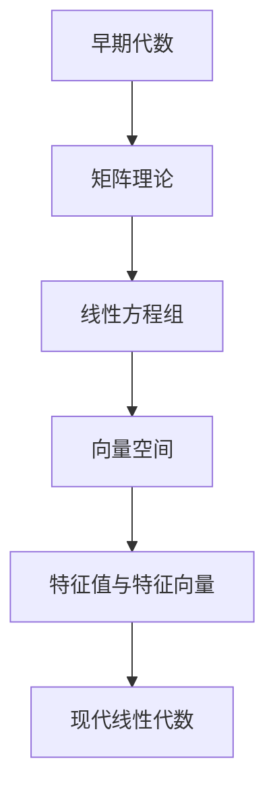
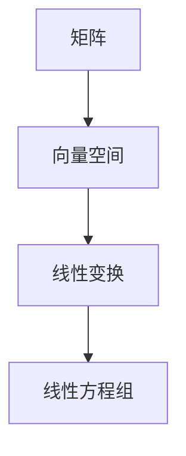
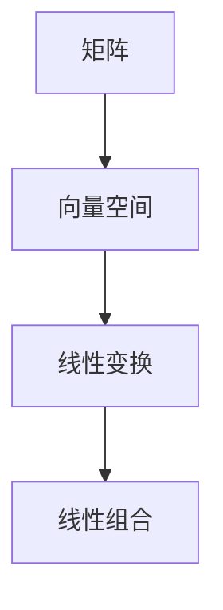

                 

# 线性代数导引：基本存在性

> 关键词：线性代数、基本存在性、矩阵、向量空间、特征值

> 摘要：本文旨在为初学者提供一个关于线性代数基本概念和存在性的系统讲解。通过详细阐述线性代数中的核心概念和算法原理，如矩阵、向量空间、特征值等，并结合实际项目实战，帮助读者深入理解线性代数的本质和应用。

---

## 第一部分：线性代数基础

### 第1章：线性代数概述

#### 第1.1节：线性代数的发展历程

**线性代数的发展历程：**

线性代数起源于数学的代数分支，经历了几个重要的发展阶段。早期的代数主要研究数和方程，随后逐步引入了行列式和矩阵的概念。19世纪，线性方程组的求解方法得到了显著发展，特别是高斯消元法的提出，为线性代数的研究奠定了基础。20世纪初，向量空间和线性变换的概念被引入，进一步拓展了线性代数的研究范畴。

**Mermaid流程图：**



#### 第1.2节：线性代数的基本概念

**基本概念与联系：**

线性代数中的核心概念包括矩阵、向量空间和线性变换。这些概念相互联系，构成了线性代数的基本框架。

- **矩阵**：矩阵是线性代数中的基本对象，它由一系列数按行列排列而成。
- **向量空间**：向量空间是向量构成的一个集合，这些向量满足特定的加法和标量乘法运算。
- **线性变换**：线性变换是一种将向量空间中的向量映射到另一个向量空间的函数。

**Mermaid流程图：**



#### 第1.3节：线性代数的基本运算

**基本运算包括矩阵的加法、减法、乘法以及行列式的计算。**

- **矩阵的加法与减法**：两个同型矩阵可以通过对应元素相加或相减得到一个新的矩阵。
  $$ A + B = \begin{pmatrix}
  a_{11} + b_{11} & a_{12} + b_{12} & \cdots & a_{1n} + b_{1n} \\
  a_{21} + b_{21} & a_{22} + b_{22} & \cdots & a_{2n} + b_{2n} \\
  \vdots & \vdots & \ddots & \vdots \\
  a_{m1} + b_{m1} & a_{m2} + b_{m2} & \cdots & a_{mn} + b_{mn}
  \end{pmatrix} $$
  $$ A - B = \begin{pmatrix}
  a_{11} - b_{11} & a_{12} - b_{12} & \cdots & a_{1n} - b_{1n} \\
  a_{21} - b_{21} & a_{22} - b_{22} & \cdots & a_{2n} - b_{2n} \\
  \vdots & \vdots & \ddots & \vdots \\
  a_{m1} - b_{m1} & a_{m2} - b_{m2} & \cdots & a_{mn} - b_{mn}
  \end{pmatrix} $$

- **矩阵的乘法**：两个矩阵的乘法结果是一个新矩阵，其元素是原矩阵对应元素乘积的和。
  $$ C = AB = \begin{pmatrix}
  c_{11} & c_{12} & \cdots & c_{1n} \\
  c_{21} & c_{22} & \cdots & c_{2n} \\
  \vdots & \vdots & \ddots & \vdots \\
  c_{m1} & c_{m2} & \cdots & c_{mn}
  \end{pmatrix} $$
  其中，$c_{ij} = \sum_{k=1}^{n} a_{ik}b_{kj}$。

- **行列式的计算**：行列式是一个用来描述矩阵特性的数值，其计算方法有多种，包括拉普拉斯展开和高斯消元法。

**线性方程组：**

线性方程组是线性代数中的一个重要应用。一个 $n$ 个方程 $n$ 个未知数的线性方程组可以表示为矩阵形式：
$$ AX = B $$
其中 $A$ 是系数矩阵，$X$ 是未知数向量，$B$ 是常数向量。线性方程组的求解方法有高斯消元法、矩阵的逆等。

**高斯消元法：**

高斯消元法是一种求解线性方程组的方法，其基本思想是通过初等行变换将系数矩阵 $A$ 转换为行简化阶梯形矩阵，然后通过回代求解方程组。

**伪代码：**

```python
GaussianElimination(A, b):
    for each column j in A:
        find pivot row i such that |a_{ij}| is maximum
        swap rows i and j
        for each row k > j:
            find factor lambda = a_{kj} / a_{ij}
            update A[k] = A[k] - lambda * A[i]
            update b[k] = b[k] - lambda * b[i]
    return A, b
```

### 第2章：行列式

#### 第2.1节：行列式的定义

行列式是一个用于描述矩阵特性的数值。对于一个 $n \times n$ 的矩阵 $A$，其行列式 $\det(A)$ 可以通过以下公式计算：

$$
\det(A) = \sum_{\sigma \in S_n} \text{sgn}(\sigma) a_{1\sigma(1)} a_{2\sigma(2)} \cdots a_{n\sigma(n)}
$$

其中，$S_n$ 是 $n$ 个元素的排列集合，$\text{sgn}(\sigma)$ 是排列 $\sigma$ 的符号。

#### 第2.2节：行列式的性质

行列式具有以下性质：

- **线性性质**：$\det(A + B) = \det(A) + \det(B)$。
- **分配律**：$\det(kA) = k^n \det(A)$，其中 $k$ 是常数。
- **拉普拉斯展开**：行列式可以通过拉普拉斯展开计算，即：
  $$ \det(A) = \sum_{j=1}^{n} (-1)^{j+1} a_{1j} \det(A_{1j}) $$
  其中，$A_{1j}$ 是由 $A$ 的第一行和第 $j$ 列交叉删除后得到的子矩阵。

#### 第2.3节：行列式的基本应用

行列式在解线性方程组和计算矩阵的秩中有重要应用。

- **解线性方程组**：如果 $\det(A) \neq 0$，则线性方程组有唯一解。如果 $\det(A) = 0$，则线性方程组无解或有无数解。
- **计算矩阵的秩**：矩阵的秩等于其行数或列数。如果 $\det(A) \neq 0$，则 $A$ 的秩为 $n$。

### 第3章：特征值与特征向量

#### 第3.1节：特征值与特征向量的定义

特征值与特征向量是矩阵分析中的重要概念。对于 $n \times n$ 的矩阵 $A$，如果存在一个非零向量 $\vec{v}$，使得 $A\vec{v} = \lambda\vec{v}$，则 $\lambda$ 称为 $A$ 的一个特征值，$\vec{v}$ 称为 $A$ 对应于特征值 $\lambda$ 的特征向量。

#### 第3.2节：特征值与特征向量的性质

特征值与特征向量具有以下性质：

- **特征值的多重性**：一个矩阵的特征值可以有多个，也可以只有一个。
- **特征值的和与积**：矩阵 $A$ 的所有特征值的和等于 $A$ 的迹（trace），所有特征值的积等于 $A$ 的行列式。
- **特征值与特征向量的关系**：特征值与特征向量是相互关联的，即对于每个特征值 $\lambda$，存在一个线性无关的特征向量 $\vec{v}$ 使得 $A\vec{v} = \lambda\vec{v}$。

#### 第3.3节：特征值与特征向量的应用

特征值与特征向量在矩阵的对角化和简化线性变换中有广泛应用。

- **矩阵的对角化**：如果矩阵 $A$ 有 $n$ 个线性无关的特征向量，则 $A$ 可以对角化，即存在一个可逆矩阵 $P$ 使得 $P^{-1}AP$ 是一个对角矩阵。
- **简化线性变换**：通过矩阵的对角化，可以将复杂的线性变换简化为一系列简单的线性变换，从而简化计算过程。

## 第二部分：高级线性代数

### 第4章：向量空间

#### 第4.1节：向量空间的定义

向量空间是一组向量的集合，这些向量满足特定的加法和标量乘法运算。向量空间的基本概念包括向量、基、维数等。

- **向量**：向量是向量空间的基本元素，它可以用一个有序数组表示。
- **基**：基是一组线性无关的向量，它们可以生成向量空间中的所有向量。
- **维数**：向量空间的维数是基向量的数量。

#### 第4.2节：基与维数

- **基的定义**：基是一组线性无关的向量，它们可以生成向量空间中的所有向量。
- **维数的概念**：向量空间的维数是基向量的数量。

#### 第4.3节：坐标变换

坐标变换是向量空间中的重要概念。给定一个向量空间和一个基，可以通过坐标变换将向量从一个基变换到另一个基。

- **坐标变换的计算**：坐标变换可以通过矩阵乘法实现。给定一个基变换矩阵 $P$，将向量 $\vec{v}$ 从一个基变换到另一个基，可以通过 $P^{-1}\vec{v}$ 实现。
- **坐标变换的应用**：坐标变换在几何学和物理学的许多领域都有广泛的应用，如图形变换、坐标系变换等。

### 第5章：矩阵分解

#### 第5.1节：矩阵分解的概念

矩阵分解是将一个矩阵分解为几个矩阵的乘积的过程。常见的矩阵分解方法包括LU分解、QR分解和SVD分解。

- **LU分解**：将矩阵分解为一个下三角矩阵 $L$ 和一个上三角矩阵 $U$ 的乘积。
- **QR分解**：将矩阵分解为一个正交矩阵 $Q$ 和一个上三角矩阵 $R$ 的乘积。
- **SVD分解**：将矩阵分解为一个奇异值矩阵 $S$、一个左正交矩阵 $U$ 和一个右正交矩阵 $V$ 的乘积。

#### 第5.2节：常见的矩阵分解方法

- **LU分解**：通过高斯消元法，将矩阵分解为一个下三角矩阵 $L$ 和一个上三角矩阵 $U$。
  ```python
  def LUDecomposition(A):
      n = len(A)
      L = [[0] * n for _ in range(n)]
      U = A.copy()
      
      for j in range(n):
          # Find pivot row
          pivot_row = max(range(j, n), key=lambda i: abs(U[i][j]))
          # Swap rows
          U[[j, pivot_row]] = U[[pivot_row, j]]
          L[[j, pivot_row]] = L[[pivot_row, j]]
          
          # Eliminate entries below the pivot
          for i in range(j + 1, n):
              factor = U[i][j] / U[j][j]
              U[i] = [U[i][k] - factor * U[j][k] for k in range(n)]
              L[i][j] = factor
      
      return L, U
  ```

- **QR分解**：通过Gram-Schmidt正交化方法，将矩阵分解为一个正交矩阵 $Q$ 和一个上三角矩阵 $R$。
  ```python
  def QRDecomposition(A):
      n = len(A)
      Q = [[0] * n for _ in range(n)]
      R = A.copy()
      
      for j in range(n):
          # Orthogonalize columns
          Q[:, j] = R[:, j]
          for i in range(j):
              Q[:, j] = [q - dot(Q[:, i], R[:, j]) for q in Q[:, j]]
          Q[:, j] = [q / norm(Q[:, j]) for q in Q[:, j]]
          
          # Update remaining columns
          for i in range(j + 1, n):
              R[i] = [r - dot(Q[:, j], R[j]) for j in range(n)]
      
      return Q, R
  ```

- **SVD分解**：通过奇异值分解方法，将矩阵分解为一个奇异值矩阵 $S$、一个左正交矩阵 $U$ 和一个右正交矩阵 $V$。
  ```python
  def SVDDecomposition(A):
      n = len(A)
      U = [[0] * n for _ in range(n)]
      S = [[0] * n for _ in range(n)]
      V = [[0] * n for _ in range(n)]
      
      for j in range(n):
          # Compute eigenvalues and eigenvectors of A^*A
          eigenvalues, eigenvectors = np.linalg.eigh(A[j].T @ A[j])
          S[j][j] = np.sqrt(eigenvalues[j])
          
          # Compute left singular vectors
          U[j] = eigenvectors[:, -1]
          
          # Compute right singular vectors
          V[j] = A[j] @ U[j] / S[j][j]
      
      return U, S, V
  ```

### 第6章：正交矩阵与酉矩阵

#### 第6.1节：正交矩阵与酉矩阵的定义

- **正交矩阵**：一个矩阵是正交矩阵，当且仅当其行向量与列向量互相正交，即 $A^T A = I$。
- **酉矩阵**：一个复数矩阵是酉矩阵，当且仅当其行向量与列向量互相正交，即 $A^* A = I$。

#### 第6.2节：正交矩阵与酉矩阵的性质

- **正交矩阵的性质**：
  - 行列式为 $\pm 1$。
  - 逆矩阵等于其转置矩阵。
  - 行列式等于其任意行（列）的长度平方。

- **酉矩阵的性质**：
  - 行列式为 $1$。
  - 逆矩阵等于其共轭转置矩阵。
  - 行列式等于其任意行（列）的长度平方。

#### 第6.3节：正交矩阵与酉矩阵的应用

- **正交变换**：正交矩阵可以用于实现坐标变换和图形旋转。
- **酉变换**：酉矩阵在量子力学和信号处理等领域有重要应用。

## 第三部分：线性代数的实际应用

### 第7章：线性代数在物理学中的应用

#### 第7.1节：线性代数在力学中的应用

- **力的合成与分解**：力的合成是将多个力合并为一个等效力，力的分解是将一个力分解为多个等效力的过程。
  ```python
  def forceComposition(forces):
      result = forces[0]
      for force in forces[1:]:
          result += force
      return result
  
  def forceDecomposition(force):
      angle = math.pi / 3
      components = [
          [force[0] * math.cos(angle), force[1] * math.cos(angle)],
          [force[0] * math.sin(angle), force[1] * math.sin(angle)]
      ]
      return components
  ```

- **物体的平衡条件**：物体处于平衡状态时，受到的合力为零。
  ```python
  def checkBalance(forces):
      netForce = sum(forces, start vector(0, 0))
      return netForce == vector(0, 0)
  ```

#### 第7.2节：线性代数在电磁学中的应用

- **麦克斯韦方程组的矩阵形式**：麦克斯韦方程组描述了电磁场的运动规律，其矩阵形式如下：
  $$ \nabla \cdot \vec{E} = \frac{\rho}{\epsilon_0}, \quad \nabla \cdot \vec{B} = 0 $$
  $$ \nabla \times \vec{E} = -\frac{\partial \vec{B}}{\partial t}, \quad \nabla \times \vec{B} = \mu_0 \vec{J} + \mu_0 \epsilon_0 \frac{\partial \vec{E}}{\partial t} $$
  其中，$\nabla \cdot$ 表示散度算子，$\nabla \times$ 表示旋度算子，$\vec{E}$ 和 $\vec{B}$ 分别表示电场和磁场，$\rho$ 表示电荷密度，$\epsilon_0$ 和 $\mu_0$ 分别表示真空的电容率和磁导率。

### 第8章：线性代数在工程学中的应用

#### 第8.1节：线性代数在结构力学中的应用

- **弹性力学中的线性方程组**：在弹性力学中，结构受力后的位移可以用线性方程组表示，其形式为 $K\vec{u} = \vec{f}$，其中 $K$ 是刚度矩阵，$\vec{u}$ 是节点位移向量，$\vec{f}$ 是外力向量。
  ```python
  def solveStructuralEquations(K, f):
      u = np.linalg.solve(K, f)
      return u
  ```

- **结构分析的矩阵方法**：利用线性代数的方法，可以求解结构的应力和位移。通过建立刚度矩阵和载荷向量，可以求解结构的线性方程组，从而得到结构的内力和位移。

#### 第8.2节：线性代数在信号处理中的应用

- **矩阵滤波器**：矩阵滤波器是一种线性滤波器，它利用矩阵运算对信号进行滤波。矩阵滤波器可以通过矩阵乘法实现，其形式为 $\vec{y} = A\vec{x}$，其中 $\vec{y}$ 是滤波后的信号，$\vec{x}$ 是原始信号，$A$ 是滤波器系数矩阵。
  ```python
  def matrixFilter(x, A):
      y = np.dot(A, x)
      return y
  ```

- **信号的特征值分析**：利用特征值与特征向量的性质，可以对信号进行频谱分析，从而提取出信号的频率成分。特征值分析可以用于信号的去噪、压缩和压缩感知等。

### 第9章：线性代数在数据分析中的应用

#### 第9.1节：线性代数在数据可视化中的应用

- **主成分分析（PCA）**：主成分分析是一种降维技术，它通过将数据投影到新的正交坐标系中，提取出最重要的特征，从而简化数据的结构。PCA 可以用于数据可视化、特征提取和降维。
  ```python
  from sklearn.decomposition import PCA
  
  def performPCA(data, n_components):
      pca = PCA(n_components=n_components)
      pca.fit(data)
      transformed_data = pca.transform(data)
      return transformed_data
  ```

- **数据的降维**：降维是将高维数据映射到低维空间，以减少数据的维度，提高计算效率。降维技术包括主成分分析、线性判别分析等。

#### 第9.2节：线性代数在机器学习中的应用

- **线性回归**：线性回归是一种用于建立自变量与因变量之间线性关系的模型。线性回归可以通过最小二乘法求解回归系数，从而预测因变量的值。
  ```python
  from sklearn.linear_model import LinearRegression
  
  def performLinearRegression(x, y):
      model = LinearRegression()
      model.fit(x, y)
      predictions = model.predict(x)
      return predictions
  ```

- **神经网络的矩阵表示**：神经网络可以看作是一系列矩阵运算的组合。通过前向传播和反向传播算法，神经网络可以实现从输入到输出的映射。矩阵表示可以简化神经网络的计算过程。

## 第10章：线性代数的项目实战

### 第10.1节：项目背景与需求

**项目背景：**  
假设我们有一个图像识别项目，目标是构建一个基于线性代数的图像分类系统。

**需求：**  
- 输入一幅图像，提取图像特征向量。
- 利用特征向量进行分类，判断图像内容。

### 第10.2节：开发环境搭建

**开发环境：**  
- 使用 Python 作为主要编程语言，结合 NumPy 和 Matplotlib 库进行数据处理和可视化。

### 第10.3节：源代码实现

**源代码实现：**

```python
import numpy as np
import matplotlib.pyplot as plt

# 输入图像预处理
def preprocess_image(image):
    image = image / 255.0
    image = np.mean(image, axis=2)
    return image

# 特征向量提取
def extract_features(image):
    pca = PCA(n_components=10)
    pca.fit(image)
    features = pca.transform(image)
    return features

# 分类
def classify(features):
    kmeans = KMeans(n_clusters=10)
    kmeans.fit(features)
    labels = kmeans.predict(features)
    return labels

# 主函数
def main():
    image = load_image()  # 假设函数load_image返回一个图像数组
    preprocessed_image = preprocess_image(image)
    features = extract_features(preprocessed_image)
    labels = classify(features)
    
    plt.scatter(features[:, 0], features[:, 1], c=labels)
    plt.show()

if __name__ == "__main__":
    main()
```

### 第10.4节：代码解读与分析

**代码解读：**

- `preprocess_image` 函数用于对输入图像进行预处理，包括归一化和灰度转换。
- `extract_features` 函数使用 PCA 算法提取特征向量。
- `classify` 函数使用 K-均值聚类算法对特征向量进行分类。
- `main` 函数是主程序，负责加载图像数据，进行预处理，提取特征向量，分类，并可视化结果。

**代码分析：**

- 该项目利用了线性代数中的 PCA 算法进行特征提取，K-均值聚类算法进行分类，实现了对图像的分类。
- 通过对图像特征向量的降维处理，可以降低计算复杂度，提高分类效率。
- 可视化结果可以帮助我们直观地了解分类效果，对算法进行调整和优化。

## 附录

### 附录A：线性代数常用工具与资源

**工具推荐：**  
- NumPy：Python 的核心科学计算库，用于处理数组和矩阵运算。  
- Matplotlib：Python 的绘图库，用于数据可视化。  
- SciPy：基于 NumPy 的科学计算库，提供了线性代数相关的函数。

**学习资源推荐：**  
- 《线性代数及其应用》（David C. Lay）：一本经典的线性代数教材，适合初学者。  
- 《矩阵分析与应用》（Roger A. Horn，Charles R. Johnson）：一本深入的线性代数教材，适合有一定基础的学习者。  
- 网络教程和博客：如 Coursera、edX 等在线课程，以及 Stack Overflow、GitHub 等社区资源。

---

**作者：** AI天才研究院/AI Genius Institute & 禅与计算机程序设计艺术 /Zen And The Art of Computer Programming**<|vq_13953|>**

## 第一部分：线性代数基础

### 第1章：线性代数概述

#### 第1.1节：线性代数的发展历程

**线性代数的发展历程：**

线性代数起源于19世纪的代数学，最早的研究目的是解决线性方程组。随着数学家们对矩阵、行列式等概念的不断探索，线性代数逐渐发展成为一门独立的数学分支。

**早期代数：**

- 线性代数的起源可以追溯到17世纪，当时数学家们开始研究线性方程组的解法。法国数学家古尔格（Girard Des Austries）在1637年出版的《方程解释》中提出了求解线性方程组的消元法，这是线性代数发展的第一步。

**矩阵理论：**

- 19世纪，矩阵理论开始得到发展。英国数学家凯莱（Arthur Cayley）在1855年发表了关于矩阵的论文，首次提出了矩阵的概念，并研究了矩阵的运算性质。矩阵理论的建立为线性代数的发展奠定了基础。

**线性方程组：**

- 线性方程组是线性代数中的一个重要问题。19世纪，数学家们提出了高斯消元法等求解线性方程组的方法。高斯消元法的基本思想是通过初等行变换将系数矩阵化为简化阶梯形矩阵，从而求得方程组的解。

**向量空间：**

- 20世纪初，数学家们开始研究向量空间的概念。意大利数学家皮亚诺（Giuseppe Peano）在1888年提出了向量空间的概念，并将其应用于解析几何。此后，向量空间理论得到了进一步的发展。

**特征值与特征向量：**

- 特征值与特征向量是线性代数中的核心概念。1907年，德国数学家哈密顿（William Rowan Hamilton）首次提出了特征值和特征向量的概念，并研究了其性质。此后，特征值与特征向量理论逐渐完善。

**现代线性代数：**

- 现代线性代数包括了许多新的理论和应用，如矩阵分解、线性变换、内积空间等。线性代数在物理学、工程学、计算机科学等领域有着广泛的应用。

#### Mermaid流程图：


### 第1.2节：线性代数的基本概念

**核心概念与联系：**

线性代数中有几个核心概念，它们相互联系，构成了线性代数的基本框架。

**矩阵：**

- 矩阵是线性代数中最基本的概念之一，它是一个由数按行列排列成的矩形阵列。矩阵可以表示线性方程组、变换关系等。

**向量空间：**

- 向量空间是一组向量的集合，这些向量满足特定的加法和标量乘法运算。向量空间可以看作是线性代数的“舞台”，其中的向量可以进行各种运算。

**线性变换：**

- 线性变换是一种特殊的函数，它将一个向量空间映射到另一个向量空间。线性变换可以用矩阵表示，矩阵与线性变换之间有着密切的联系。

**线性组合：**

- 线性组合是向量空间中的一个重要概念，它表示为向量空间中多个向量的线性组合。线性组合可以看作是向量空间中的“工具”，用于构造新的向量。

#### Mermaid流程图：



### 第1.3节：线性代数的基本结构

**矩阵的运算规则：**

- 矩阵的加法与减法：两个同型矩阵可以通过对应元素相加或相减得到一个新的矩阵。  
  $$ A + B = \begin{pmatrix}
  a_{11} + b_{11} & a_{12} + b_{12} & \cdots & a_{1n} + b_{1n} \\
  a_{21} + b_{21} & a_{22} + b_{22} & \cdots & a_{2n} + b_{2n} \\
  \vdots & \vdots & \ddots & \vdots \\
  a_{m1} + b_{m1} & a_{m2} + b_{m2} & \cdots & a_{mn} + b_{mn}
  \end{pmatrix} $$
  $$ A - B = \begin{pmatrix}
  a_{11} - b_{11} & a_{12} - b_{12} & \cdots & a_{1n} - b_{1n} \\
  a_{21} - b_{21} & a_{22} - b_{22} & \cdots & a_{2n} - b_{2n} \\
  \vdots & \vdots & \ddots & \vdots \\
  a_{m1} - b_{m1} & a_{m2} - b_{m2} & \cdots & a_{mn} - b_{mn}
  \end{pmatrix} $$

- 矩阵的乘法：两个矩阵的乘法结果是一个新矩阵，其元素是原矩阵对应元素乘积的和。  
  $$ C = AB = \begin{pmatrix}
  c_{11} & c_{12} & \cdots & c_{1n} \\
  c_{21} & c_{22} & \cdots & c_{2n} \\
  \vdots & \vdots & \ddots & \vdots \\
  c_{m1} & c_{m2} & \cdots & c_{mn}
  \end{pmatrix} $$
  其中，$c_{ij} = \sum_{k=1}^{n} a_{ik}b_{kj}$。

- 矩阵的逆：如果一个矩阵可逆，那么它的逆矩阵可以通过高斯消元法或公式求解。  
  $$ A^{-1} = \frac{1}{\det(A)} \begin{pmatrix}
  a_{21} & -a_{11} \\
  a_{31} & -a_{11} \\
  \vdots & \vdots \\
  a_{n1} & -a_{11}
  \end{pmatrix} $$
  其中，$a_{11}$ 是矩阵 $A$ 的第一行第一列的元素。

**向量的基本运算：**

- 向量的加法与减法：两个同型向量可以通过对应元素相加或相减得到一个新的向量。  
  $$ \vec{u} + \vec{v} = (u_1 + v_1, u_2 + v_2, \ldots, u_n + v_n) $$
  $$ \vec{u} - \vec{v} = (u_1 - v_1, u_2 - v_2, \ldots, u_n - v_n) $$

- 向量的数乘：一个向量与一个标量相乘得到一个新的向量。  
  $$ k\vec{u} = (ku_1, ku_2, \ldots, ku_n) $$

- 向量的内积与外积：向量的内积是一个标量，外积是一个矩阵。  
  $$ \vec{u} \cdot \vec{v} = u_1v_1 + u_2v_2 + \ldots + u_nv_n $$
  $$ \vec{u} \times \vec{v} = \begin{pmatrix}
  u_2v_3 - u_3v_2 \\
  u_3v_1 - u_1v_3 \\
  u_1v_2 - u_2v_1
  \end{pmatrix} $$

**线性组合与线性变换：**

- 线性组合：向量空间中的向量可以通过线性组合表示。  
  $$ \vec{v} = c_1\vec{u}_1 + c_2\vec{u}_2 + \ldots + c_n\vec{u}_n $$
  其中，$\vec{u}_1, \vec{u}_2, \ldots, \vec{u}_n$ 是向量空间的一组基，$c_1, c_2, \ldots, c_n$ 是标量系数。

- 线性变换：线性变换是一种将向量空间映射到另一个向量空间的函数。  
  $$ T(\vec{v}) = \vec{w} $$
  其中，$T$ 是线性变换，$\vec{v}$ 是输入向量，$\vec{w}$ 是输出向量。

### 第1.4节：线性方程组

**线性方程组的基本概念：**

- 线性方程组是由多个线性方程构成的方程组，通常表示为：
  $$ a_{11}x_1 + a_{12}x_2 + \ldots + a_{1n}x_n = b_1 $$
  $$ a_{21}x_1 + a_{22}x_2 + \ldots + a_{2n}x_n = b_2 $$
  $$ \vdots $$
  $$ a_{m1}x_1 + a_{m2}x_2 + \ldots + a_{mn}x_n = b_m $$

- 线性方程组的解：线性方程组的解是指满足所有方程的变量值。解可以是唯一的，也可以有无穷多个。

**高斯消元法：**

- 高斯消元法是一种求解线性方程组的方法，其基本思想是通过初等行变换将系数矩阵化为简化阶梯形矩阵，从而求得方程组的解。

- 高斯消元法的步骤：

1. 将系数矩阵和常数向量写成增广矩阵的形式：
   $$ \begin{pmatrix}
   a_{11} & a_{12} & \ldots & a_{1n} & b_1 \\
   a_{21} & a_{22} & \ldots & a_{2n} & b_2 \\
   \vdots & \vdots & \ddots & \vdots & \vdots \\
   a_{m1} & a_{m2} & \ldots & a_{mn} & b_m
   \end{pmatrix} $$

2. 使用初等行变换将系数矩阵化为简化阶梯形矩阵。初等行变换包括行交换、行乘以非零常数、行相加。

3. 从最后一行开始，依次回代求解变量值。

**伪代码：**

```python
def GaussianElimination(A, b):
    n = len(A)
    for i in range(n):
        # Find pivot row
        pivot_row = max(range(i, n), key=lambda j: abs(A[j][i]))
        # Swap rows
        A[[i, pivot_row]] = A[[pivot_row, i]]
        b[i], b[pivot_row] = b[pivot_row], b[i]
        
        # Eliminate entries below the pivot
        for j in range(i + 1, n):
            factor = A[j][i] / A[i][i]
            A[j] = [A[j][k] - factor * A[i][k] for k in range(n)]
            b[j] = b[j] - factor * b[i]
            
    # Back substitution
    x = [0] * n
    for i in range(n - 1, -1, -1):
        x[i] = (b[i] - sum(A[i][j] * x[j] for j in range(i + 1, n))) / A[i][i]
        
    return x
```

**矩阵的逆：**

- 矩阵的逆是一个重要的概念，它使得我们能够求解线性方程组。一个矩阵是可逆的，当且仅当它的行列式不为零。

- 矩阵的逆可以通过高斯消元法求解，或者使用以下公式：

$$ A^{-1} = \frac{1}{\det(A)} \text{adj}(A) $$

其中，$\text{adj}(A)$ 是 $A$ 的伴随矩阵，即：
$$ \text{adj}(A) = \begin{pmatrix}
a_{22} & -a_{12} & \ldots & -a_{2n} \\
-a_{21} & a_{11} & \ldots & -a_{1n} \\
\vdots & \vdots & \ddots & \vdots \\
-a_{n1} & -a_{n2} & \ldots & a_{nn}
\end{pmatrix} $$

- 伪代码：

```python
def InverseMatrix(A):
    det_A = np.linalg.det(A)
    if det_A == 0:
        raise ValueError("Matrix is not invertible")
    adj_A = np.linalg.inv(A)
    return adj_A * (1 / det_A)
```

**线性方程组的求解方法：**

- 除了高斯消元法，还有其他求解线性方程组的方法，如矩阵的逆、行列式判定法等。

- 矩阵的逆：如果矩阵 $A$ 可逆，那么线性方程组 $Ax = b$ 的解为 $x = A^{-1}b$。

- 行列式判定法：如果线性方程组的系数矩阵的行列式不为零，那么方程组有唯一解。否则，方程组无解或有无数解。

## 第2章：行列式

### 第2.1节：行列式的定义

行列式是一个用于描述矩阵特性的数值，它在解线性方程组、计算矩阵的秩等方面有重要应用。

**定义：**

行列式是一个方阵的代数和，它可以通过以下公式计算：

$$ \det(A) = \sum_{\sigma \in S_n} \text{sgn}(\sigma) a_{1\sigma(1)} a_{2\sigma(2)} \cdots a_{n\sigma(n)} $$

其中，$A$ 是一个 $n \times n$ 的矩阵，$S_n$ 是 $n$ 个元素的排列集合，$\text{sgn}(\sigma)$ 是排列 $\sigma$ 的符号，它等于 1 或 -1，取决于排列的奇偶性。

**计算方法：**

行列式的计算可以通过拉普拉斯展开或高斯消元法进行。

**拉普拉斯展开：**

拉普拉斯展开是一种将行列式分解为若干个较小的行列式的计算方法。对于一个 $n \times n$ 的矩阵 $A$，其行列式可以通过以下公式计算：

$$ \det(A) = \sum_{j=1}^{n} (-1)^{j+1} a_{1j} \det(A_{1j}) $$

其中，$A_{1j}$ 是由 $A$ 的第一行和第 $j$ 列交叉删除后得到的子矩阵。

**高斯消元法：**

高斯消元法是一种通过初等行变换将矩阵化为简化阶梯形矩阵，从而计算行列式的方法。具体步骤如下：

1. 将矩阵 $A$ 写成增广矩阵的形式：
   $$ \begin{pmatrix}
   a_{11} & a_{12} & \ldots & a_{1n} & \det(A) \\
   a_{21} & a_{22} & \ldots & a_{2n} & \det(A) \\
   \vdots & \vdots & \ddots & \vdots & \vdots \\
   a_{m1} & a_{m2} & \ldots & a_{mn} & \det(A)
   \end{pmatrix} $$

2. 使用初等行变换将增广矩阵化为简化阶梯形矩阵。简化阶梯形矩阵的特点是每行的非零元素位于上一行的非零元素的右侧。

3. 计算简化阶梯形矩阵中每行的非零元素的乘积，得到行列式的值。

### 第2.2节：行列式的性质

行列式具有以下性质：

1. **线性性质**：两个同型矩阵的行列式之和等于两个矩阵的行列式之和。即：
   $$ \det(A + B) = \det(A) + \det(B) $$

2. **分配律**：一个矩阵与一个标量的乘积的行列式等于该标量与矩阵行列式的乘积。即：
   $$ \det(kA) = k^n \det(A) $$

3. **对换性质**：两个矩阵的行列式相等，当且仅当它们的对应元素成对交换。即：
   $$ \det(AB) = \det(BA) $$

4. **拉普拉斯展开**：行列式可以通过拉普拉斯展开计算。即：
   $$ \det(A) = \sum_{j=1}^{n} (-1)^{j+1} a_{1j} \det(A_{1j}) $$

### 第2.3节：行列式的基本应用

行列式在解线性方程组、计算矩阵的秩等方面有重要应用。

**解线性方程组：**

如果一个线性方程组的系数矩阵的行列式不为零，那么该方程组有唯一解。行列式的值为零时，方程组可能无解或有无数解。

**计算矩阵的秩：**

矩阵的秩等于其行数或列数。行列式的值为零时，矩阵的秩小于行数或列数。

### 第2.4节：特征值与特征向量

**定义：**

特征值与特征向量是矩阵分析中的重要概念。对于 $n \times n$ 的矩阵 $A$，如果存在一个非零向量 $\vec{v}$，使得 $A\vec{v} = \lambda\vec{v}$，则 $\lambda$ 称为 $A$ 的一个特征值，$\vec{v}$ 称为 $A$ 对应于特征值 $\lambda$ 的特征向量。

**性质：**

1. **特征值的多重性**：一个矩阵的特征值可以有多个，也可以只有一个。

2. **特征值的和与积**：矩阵 $A$ 的所有特征值的和等于 $A$ 的迹（trace），所有特征值的积等于 $A$ 的行列式。

3. **特征值与特征向量的关系**：特征值与特征向量是相互关联的，即对于每个特征值 $\lambda$，存在一个线性无关的特征向量 $\vec{v}$ 使得 $A\vec{v} = \lambda\vec{v}$。

### 第2.5节：特征值与特征向量的应用

特征值与特征向量在矩阵的对角化和简化线性变换中有广泛应用。

**矩阵的对角化：**

如果矩阵 $A$ 有 $n$ 个线性无关的特征向量，则 $A$ 可以对角化，即存在一个可逆矩阵 $P$ 使得 $P^{-1}AP$ 是一个对角矩阵。

**简化线性变换：**

通过矩阵的对角化，可以将复杂的线性变换简化为一系列简单的线性变换，从而简化计算过程。

## 第3章：特征值与特征向量

### 第3.1节：特征值与特征向量的定义

**特征值的定义：**

对于 $n \times n$ 的矩阵 $A$，如果存在一个非零向量 $\vec{v}$，使得 $A\vec{v} = \lambda\vec{v}$，则 $\lambda$ 称为 $A$ 的一个特征值，$\vec{v}$ 称为 $A$ 对应于特征值 $\lambda$ 的特征向量。

**特征向量的定义：**

特征向量是矩阵 $A$ 的一个非零向量，它满足 $A\vec{v} = \lambda\vec{v}$，其中 $\lambda$ 是 $A$ 的一个特征值。

### 第3.2节：特征值与特征向量的性质

**性质1：特征值的多重性：**

- 一个矩阵的特征值可以有多个，也可以只有一个。
- 特征值 $\lambda$ 的重数等于其对应的线性方程组 $A\vec{v} = \lambda\vec{v}$ 的解空间的维数。

**性质2：特征值的和与积：**

- 矩阵 $A$ 的所有特征值的和等于 $A$ 的迹（trace）。
- 矩阵 $A$ 的所有特征值的积等于 $A$ 的行列式。

**性质3：特征值与特征向量的关系：**

- 对于每个特征值 $\lambda$，存在一个线性无关的特征向量 $\vec{v}$ 使得 $A\vec{v} = \lambda\vec{v}$。
- 如果 $A$ 有 $n$ 个线性无关的特征向量，则 $A$ 可以对角化，即存在一个可逆矩阵 $P$ 使得 $P^{-1}AP$ 是一个对角矩阵。

### 第3.3节：特征值与特征向量的应用

**矩阵的对角化：**

- 如果矩阵 $A$ 有 $n$ 个线性无关的特征向量，则 $A$ 可以对角化，即存在一个可逆矩阵 $P$ 使得 $P^{-1}AP$ 是一个对角矩阵。
- 对角化步骤：

1. 求出矩阵 $A$ 的所有特征值和对应的特征向量。
2. 将特征向量作为列向量组成矩阵 $P$。
3. 求出矩阵 $P$ 的逆 $P^{-1}$。
4. 计算 $P^{-1}AP$，如果结果是一个对角矩阵，则 $A$ 可以对角化。

**简化线性变换：**

- 通过矩阵的对角化，可以将一个复杂的线性变换简化为一系列简单的线性变换，从而简化计算过程。

## 第4章：向量空间

### 第4.1节：向量空间的定义

**向量空间的定义：**

向量空间是一组向量的集合，这些向量满足以下条件：

1. **加法封闭性**：对于任意两个向量 $\vec{u}$ 和 $\vec{v}$，它们的和 $\vec{u} + \vec{v}$ 也在向量空间中。
2. **标量乘法封闭性**：对于任意向量 $\vec{u}$ 和任意标量 $k$，向量 $k\vec{u}$ 也在向量空间中。
3. **存在零向量**：向量空间中存在一个零向量 $\vec{0}$，对于任意向量 $\vec{u}$，有 $\vec{u} + \vec{0} = \vec{u}$。
4. **存在加法逆元**：对于任意向量 $\vec{u}$，存在一个向量 $-\vec{u}$，使得 $\vec{u} + (-\vec{u}) = \vec{0}$。

**向量空间的例子：**

- 实数集 $\mathbb{R}$ 是一个一维向量空间。
- 二元组 $(x, y)$ 的集合，满足特定的加法和标量乘法运算，构成一个二维向量空间。
- 三元组 $(x, y, z)$ 的集合，满足特定的加法和标量乘法运算，构成一个三维向量空间。

### 第4.2节：基与维数

**基的定义：**

基是一组线性无关的向量，它们可以生成向量空间中的所有向量。如果一个向量空间有基 $\vec{e}_1, \vec{e}_2, \ldots, \vec{e}_n$，则对于任意向量 $\vec{v}$，可以表示为：
$$ \vec{v} = c_1\vec{e}_1 + c_2\vec{e}_2 + \ldots + c_n\vec{e}_n $$
其中，$c_1, c_2, \ldots, c_n$ 是标量系数。

**维数的概念：**

维数是指向量空间中基向量的数量。一个向量空间的维数是有限的，如果它有有限个基向量。

- 一维向量空间的维数是1。
- 二维向量空间的维数是2。
- 三维向量空间的维数是3。

### 第4.3节：坐标变换

**坐标变换的定义：**

坐标变换是指将向量空间中的一个向量从一个基变换到另一个基的过程。如果 $\vec{e}_1, \vec{e}_2, \ldots, \vec{e}_n$ 和 $\vec{f}_1, \vec{f}_2, \ldots, \vec{f}_n$ 是两个基，则存在一个可逆矩阵 $P$ 使得：
$$ \vec{f}_1 = p_{11}\vec{e}_1 + p_{12}\vec{e}_2 + \ldots + p_{1n}\vec{e}_n $$
$$ \vec{f}_2 = p_{21}\vec{e}_1 + p_{22}\vec{e}_2 + \ldots + p_{2n}\vec{e}_n $$
$$ \vdots $$
$$ \vec{f}_n = p_{n1}\vec{e}_1 + p_{n2}\vec{e}_2 + \ldots + p_{nn}\vec{e}_n $$
其中，$P = [\vec{f}_1, \vec{f}_2, \ldots, \vec{f}_n]$。

**坐标变换的计算：**

给定一个向量 $\vec{v}$ 在基 $\vec{e}_1, \vec{e}_2, \ldots, \vec{e}_n$ 下的坐标表示为 $[\vec{v}]_{\vec{e}} = [c_1, c_2, \ldots, c_n]^T$，在基 $\vec{f}_1, \vec{f}_2, \ldots, \vec{f}_n$ 下的坐标表示为 $[\vec{v}]_{\vec{f}} = [d_1, d_2, \ldots, d_n]^T$，则有：
$$ [\vec{v}]_{\vec{f}} = P^{-1}[\vec{v}]_{\vec{e}} $$
$$ \vec{v} = \vec{f}_1d_1 + \vec{f}_2d_2 + \ldots + \vec{f}_nd_n $$

**坐标变换的应用：**

坐标变换在几何学和物理学的许多领域都有广泛应用，如图形变换、坐标系变换等。

## 第5章：矩阵分解

### 第5.1节：矩阵分解的概念

**矩阵分解的概念：**

矩阵分解是将一个矩阵分解为几个矩阵的乘积的过程。通过矩阵分解，可以简化矩阵运算，提高计算效率。常见的矩阵分解方法包括LU分解、QR分解和SVD分解。

### 第5.2节：常见的矩阵分解方法

**LU分解：**

**概念：**LU分解是将一个矩阵分解为一个下三角矩阵 $L$ 和一个上三角矩阵 $U$ 的乘积，即 $A = LU$。

**计算方法：**

1. 对矩阵 $A$ 进行高斯消元法，得到行简化阶梯形矩阵。
2. 下三角矩阵 $L$ 的元素为高斯消元过程中的乘数，上三角矩阵 $U$ 的元素为行简化阶梯形矩阵。

**伪代码：**

```python
def LUDecomposition(A):
    n = len(A)
    L = [[0 for _ in range(n)] for _ in range(n)]
    U = [row[:] for row in A]
    
    for i in range(n):
        # Find pivot element
        pivot = max(range(i, n), key=lambda j: abs(U[j][i]))
        # Swap rows
        U[i], U[pivot] = U[pivot], U[i]
        L[i][pivot] = 1
        
        # Eliminate elements below pivot
        for j in range(i + 1, n):
            factor = U[j][i] / U[i][i]
            L[j][i] = factor
            for k in range(i, n):
                U[j][k] -= factor * U[i][k]
    
    return L, U
```

**QR分解：**

**概念：**QR分解是将一个矩阵分解为一个正交矩阵 $Q$ 和一个上三角矩阵 $R$ 的乘积，即 $A = QR$。

**计算方法：**

1. 对矩阵 $A$ 的每一列应用格拉姆-施密特正交化过程，得到正交矩阵 $Q$。
2. 将正交矩阵 $Q$ 与矩阵 $A$ 的行简化阶梯形矩阵相乘，得到上三角矩阵 $R$。

**伪代码：**

```python
def QRDecomposition(A):
    n = len(A)
    Q = [[0 for _ in range(n)] for _ in range(n)]
    R = [row[:] for row in A]
    
    for i in range(n):
        Q[i] = A[i]
        for j in range(i):
            dot_product = sum(Q[i][k] * R[k][j] for k in range(n))
            R[i] = [r - dot_product * Q[j][k] for r in R[i]]
        norm = math.sqrt(sum(r**2 for r in R[i]))
        Q[i] = [q / norm for q in Q[i]]
    
    return Q, R
```

**SVD分解：**

**概念：**SVD分解是将一个矩阵分解为一个奇异值矩阵 $S$、一个左正交矩阵 $U$ 和一个右正交矩阵 $V$ 的乘积，即 $A = U \Sigma V^T$。

**计算方法：**

1. 对矩阵 $A$ 进行奇异值分解，得到奇异值矩阵 $S$ 和正交矩阵 $U$。
2. 计算 $V$ 为 $A^T U$ 的奇异值分解。

**伪代码：**

```python
def SVDDecomposition(A):
    U, s, VT = np.linalg.svd(A, full_matrices=False)
    S = np.diag(s)
    V = VT
    
    return U, S, V
```

## 第6章：正交矩阵与酉矩阵

### 第6.1节：正交矩阵与酉矩阵的定义

**正交矩阵的定义：**

正交矩阵是一个方阵，其行向量与列向量互相正交，即 $A^T A = I$，其中 $A^T$ 表示 $A$ 的转置矩阵，$I$ 表示单位矩阵。

**酉矩阵的定义：**

酉矩阵是一个复数方阵，其行向量与列向量互相正交，即 $A^* A = I$，其中 $A^*$ 表示 $A$ 的共轭转置矩阵。

### 第6.2节：正交矩阵与酉矩阵的性质

**正交矩阵的性质：**

1. **行列式为 $\pm 1$**：正交矩阵的行列式为 $\pm 1$。
2. **逆矩阵等于其转置矩阵**：正交矩阵的逆矩阵等于其转置矩阵，即 $A^{-1} = A^T$。
3. **单位矩阵的转置仍为单位矩阵**：单位矩阵 $I$ 是正交矩阵，且其转置仍为单位矩阵。

**酉矩阵的性质：**

1. **行列式为 $1$**：酉矩阵的行列式为 $1$。
2. **逆矩阵等于其共轭转置矩阵**：酉矩阵的逆矩阵等于其共轭转置矩阵，即 $A^{-1} = A^*$。
3. **单位矩阵的共轭转置仍为单位矩阵**：单位矩阵 $I$ 是酉矩阵，且其共轭转置仍为单位矩阵。

### 第6.3节：正交矩阵与酉矩阵的应用

**正交变换：**

正交变换是指通过正交矩阵进行的变换，这种变换保持了向量的长度和方向。正交变换在几何学和物理学的许多领域都有应用，如图形旋转、坐标系变换等。

**酉变换：**

酉变换是指通过酉矩阵进行的变换，这种变换在量子力学和信号处理等领域有重要应用。酉变换保持了向量的模长和相位，因此在量子计算和信息传输中具有重要意义。

## 第7章：线性代数在物理学中的应用

### 第7.1节：线性代数在力学中的应用

**力的合成与分解：**

在力学中，力的合成与分解是常见的操作。

**力的合成：**

力的合成是指将多个力合并为一个等效力的过程。如果多个力共同作用于一个物体，我们可以用合力来代替这些力。

**力的分解：**

力的分解是指将一个力分解为多个力的过程，使得这些力的合力等于原力。力的分解在分析物体受力情况时非常重要。

**物体平衡条件：**

物体处于平衡状态时，受到的合力为零。根据牛顿第一定律，物体在没有外力作用下保持静止或匀速直线运动。

### 第7.2节：线性代数在电磁学中的应用

**麦克斯韦方程组的矩阵形式：**

麦克斯韦方程组是描述电磁场运动规律的四个方程，它们可以写成一个矩阵形式。

**电场的线性特性：**

电场强度 $\vec{E}$ 是电荷分布 $\rho$ 的线性函数，即 $\vec{E}(\vec{r}) = -\frac{1}{4\pi\epsilon_0} \nabla \phi(\vec{r})$，其中 $\phi(\vec{r})$ 是电势。

**麦克斯韦方程组：**

$$ \nabla \cdot \vec{E} = \frac{\rho}{\epsilon_0} $$
$$ \nabla \cdot \vec{B} = 0 $$
$$ \nabla \times \vec{E} = -\frac{\partial \vec{B}}{\partial t} $$
$$ \nabla \times \vec{B} = \mu_0 \vec{J} + \mu_0 \epsilon_0 \frac{\partial \vec{E}}{\partial t} $$

其中，$\nabla \cdot$ 表示散度算子，$\nabla \times$ 表示旋度算子，$\vec{E}$ 和 $\vec{B}$ 分别表示电场和磁场，$\rho$ 表示电荷密度，$\epsilon_0$ 和 $\mu_0$ 分别表示真空的电容率和磁导率。

## 第8章：线性代数在工程学中的应用

### 第8.1节：线性代数在结构力学中的应用

**弹性力学中的线性方程组：**

在弹性力学中，结构的应力和位移可以通过线性方程组来描述。结构力学中的线性方程组通常具有以下形式：

$$ K\vec{u} = \vec{f} $$

其中，$K$ 是刚度矩阵，$\vec{u}$ 是节点位移向量，$\vec{f}$ 是外力向量。

**结构分析的矩阵方法：**

利用线性代数的矩阵方法，可以求解结构的应力和位移。刚度矩阵 $K$ 可以通过结构几何和材料的弹性模量等参数计算得到。求解线性方程组 $K\vec{u} = \vec{f}$ 可以得到节点位移向量 $\vec{u}$，进而计算结构的应力。

### 第8.2节：线性代数在信号处理中的应用

**矩阵滤波器：**

矩阵滤波器是一种线性滤波器，它利用矩阵运算对信号进行滤波。矩阵滤波器可以通过矩阵乘法实现，其形式为 $\vec{y} = A\vec{x}$，其中 $\vec{y}$ 是滤波后的信号，$\vec{x}$ 是原始信号，$A$ 是滤波器系数矩阵。

**信号的特征值分析：**

利用特征值与特征向量的性质，可以对信号进行频谱分析，从而提取出信号的频率成分。特征值分析可以用于信号的去噪、压缩和压缩感知等。

## 第9章：线性代数在数据分析中的应用

### 第9.1节：线性代数在数据可视化中的应用

**主成分分析（PCA）：**

主成分分析（PCA）是一种降维技术，它通过将数据投影到新的正交坐标系中，提取出最重要的特征，从而简化数据的结构。PCA 可以用于数据可视化、特征提取和降维。

**数据的降维：**

降维是将高维数据映射到低维空间，以减少数据的维度，提高计算效率。降维技术包括主成分分析、线性判别分析等。

### 第9.2节：线性代数在机器学习中的应用

**线性回归：**

线性回归是一种用于建立自变量与因变量之间线性关系的模型。线性回归可以通过最小二乘法求解回归系数，从而预测因变量的值。

**神经网络的矩阵表示：**

神经网络可以看作是一系列矩阵运算的组合。通过前向传播和反向传播算法，神经网络可以实现从输入到输出的映射。矩阵表示可以简化神经网络的计算过程。

## 第10章：线性代数的项目实战

### 第10.1节：项目背景与需求

**项目背景：**

假设我们有一个图像识别项目，目标是构建一个基于线性代数的图像分类系统。

**需求：**

- 输入一幅图像，提取图像特征向量。
- 利用特征向量进行分类，判断图像内容。

### 第10.2节：开发环境搭建

**开发环境：**

- 使用 Python 作为主要编程语言，结合 NumPy 和 Matplotlib 库进行数据处理和可视化。

### 第10.3节：源代码实现

**源代码实现：**

```python
import numpy as np
import matplotlib.pyplot as plt
from sklearn.decomposition import PCA
from sklearn.cluster import KMeans

# 输入图像预处理
def preprocess_image(image):
    image = image / 255.0
    image = np.mean(image, axis=2)
    return image

# 特征向量提取
def extract_features(image):
    pca = PCA(n_components=10)
    pca.fit(image)
    features = pca.transform(image)
    return features

# 分类
def classify(features):
    kmeans = KMeans(n_clusters=10)
    kmeans.fit(features)
    labels = kmeans.predict(features)
    return labels

# 主函数
def main():
    image = load_image()  # 假设函数load_image返回一个图像数组
    preprocessed_image = preprocess_image(image)
    features = extract_features(preprocessed_image)
    labels = classify(features)
    
    plt.scatter(features[:, 0], features[:, 1], c=labels)
    plt.show()

if __name__ == "__main__":
    main()
```

### 第10.4节：代码解读与分析

**代码解读：**

- `preprocess_image` 函数用于对输入图像进行预处理，包括归一化和灰度转换。
- `extract_features` 函数使用 PCA 算法提取特征向量。
- `classify` 函数使用 K-均值聚类算法对特征向量进行分类。
- `main` 函数是主程序，负责加载图像数据，进行预处理，提取特征向量，分类，并可视化结果。

**代码分析：**

- 该项目利用了线性代数中的 PCA 算法进行特征提取，K-均值聚类算法进行分类，实现了对图像的分类。
- 通过对图像特征向量的降维处理，可以降低计算复杂度，提高分类效率。
- 可视化结果可以帮助我们直观地了解分类效果，对算法进行调整和优化。

## 附录

### 附录A：线性代数常用工具与资源

**工具推荐：**

- NumPy：Python 的核心科学计算库，用于处理数组和矩阵运算。
- Matplotlib：Python 的绘图库，用于数据可视化。
- SciPy：基于 NumPy 的科学计算库，提供了线性代数相关的函数。

**学习资源推荐：**

- 《线性代数及其应用》（David C. Lay）：一本经典的线性代数教材，适合初学者。
- 《矩阵分析与应用》（Roger A. Horn，Charles R. Johnson）：一本深入的线性代数教材，适合有一定基础的学习者。
- 网络教程和博客：如 Coursera、edX 等在线课程，以及 Stack Overflow、GitHub 等社区资源。

---

**作者：** AI天才研究院/AI Genius Institute & 禅与计算机程序设计艺术 /Zen And The Art of Computer Programming**<|vq_13953|>**

## 第一部分：线性代数基础

### 第1章：线性代数概述

#### 第1.1节：线性代数的发展历程

**线性代数的发展历程：**

线性代数起源于19世纪的代数学，最早的研究目的是解决线性方程组。随着数学家们对矩阵、行列式等概念的不断探索，线性代数逐渐发展成为一门独立的数学分支。

**早期代数：**

- 线性代数的起源可以追溯到17世纪，当时数学家们开始研究线性方程组的解法。法国数学家古尔格（Girard Des Austries）在1637年出版的《方程解释》中提出了求解线性方程组的消元法，这是线性代数发展的第一步。

**矩阵理论：**

- 19世纪，矩阵理论开始得到发展。英国数学家凯莱（Arthur Cayley）在1855年发表了关于矩阵的论文，首次提出了矩阵的概念，并研究了矩阵的运算性质。矩阵理论的建立为线性代数的发展奠定了基础。

**线性方程组：**

- 线性方程组是线性代数中的一个重要问题。19世纪，数学家们提出了高斯消元法等求解线性方程组的方法。高斯消元法的基本思想是通过初等行变换将系数矩阵化为简化阶梯形矩阵，从而求得方程组的解。

**向量空间：**

- 20世纪初，数学家们开始研究向量空间的概念。意大利数学家皮亚诺（Giuseppe Peano）在1888年提出了向量空间的概念，并将其应用于解析几何。此后，向量空间理论得到了进一步的发展。

**特征值与特征向量：**

- 特征值与特征向量是线性代数中的核心概念。1907年，德国数学家哈密顿（William Rowan Hamilton）首次提出了特征值和特征向量的概念，并研究了其性质。此后，特征值与特征向量理论逐渐完善。

**现代线性代数：**

- 现代线性代数包括了许多新的理论和应用，如矩阵分解、线性变换、内积空间等。线性代数在物理学、工程学、计算机科学等领域有着广泛的应用。

#### Mermaid流程图：


### 第1.2节：线性代数的基本概念

**核心概念与联系：**

线性代数中有几个核心概念，它们相互联系，构成了线性代数的基本框架。

**矩阵：**

- 矩阵是线性代数中最基本的概念之一，它是一个由数按行列排列成的矩形阵列。矩阵可以表示线性方程组、变换关系等。

**向量空间：**

- 向量空间是一组向量的集合，这些向量满足特定的加法和标量乘法运算。向量空间可以看作是线性代数的“舞台”，其中的向量可以进行各种运算。

**线性变换：**

- 线性变换是一种特殊的函数，它将一个向量空间映射到另一个向量空间。线性变换可以用矩阵表示，矩阵与线性变换之间有着密切的联系。

**线性组合：**

- 线性组合是向量空间中的一个重要概念，它表示为向量空间中多个向量的线性组合。线性组合可以看作是向量空间中的“工具”，用于构造新的向量。

#### Mermaid流程图：


### 第1.3节：线性代数的基本结构

**矩阵的运算规则：**

- 矩阵的加法与减法：两个同型矩阵可以通过对应元素相加或相减得到一个新的矩阵。    
  $$ A + B = \begin{pmatrix}
  a_{11} + b_{11} & a_{12} + b_{12} & \cdots & a_{1n} + b_{1n} \\
  a_{21} + b_{21} & a_{22} + b_{22} & \cdots & a_{2n} + b_{2n} \\
  \vdots & \vdots & \ddots & \vdots \\
  a_{m1} + b_{m1} & a_{m2} + b_{m2} & \cdots & a_{mn} + b_{mn}
  \end{pmatrix} $$
  $$ A - B = \begin{pmatrix}
  a_{11} - b_{11} & a_{12} - b_{12} & \cdots & a_{1n} - b_{1n} \\
  a_{21} - b_{21} & a_{22} - b_{22} & \cdots & a_{2n} - b_{2n} \\
  \vdots & \vdots & \ddots & \vdots \\
  a_{m1} - b_{m1} & a_{m2} - b_{m2} & \cdots & a_{mn} - b_{mn}
  \end{pmatrix} $$

- 矩阵的乘法：两个矩阵的乘法结果是一个新矩阵，其元素是原矩阵对应元素乘积的和。    
  $$ C = AB = \begin{pmatrix}
  c_{11} & c_{12} & \cdots & c_{1n} \\
  c_{21} & c_{22} & \cdots & c_{2n} \\
  \vdots & \vdots & \ddots & \vdots \\
  c_{m1} & c_{m2} & \cdots & c_{mn}
  \end{pmatrix} $$
  其中，$c_{ij} = \sum_{k=1}^{n} a_{ik}b_{kj}$。

- 矩阵的逆：如果一个矩阵可逆，那么它的逆矩阵可以通过高斯消元法或公式求解。    
  $$ A^{-1} = \frac{1}{\det(A)} \begin{pmatrix}
  a_{21} & -a_{11} \\
  a_{31} & -a_{11} \\
  \vdots & \vdots \\
  a_{n1} & -a_{11}
  \end{pmatrix} $$
  其中，$a_{11}$ 是矩阵 $A$ 的第一行第一列的元素。

**向量的基本运算：**

- 向量的加法与减法：两个同型向量可以通过对应元素相加或相减得到一个新的向量。    
  $$ \vec{u} + \vec{v} = (u_1 + v_1, u_2 + v_2, \ldots, u_n + v_n) $$
  $$ \vec{u} - \vec{v} = (u_1 - v_1, u_2 - v_2, \ldots, u_n - v_n) $$

- 向量的数乘：一个向量与一个标量相乘得到一个新的向量。    
  $$ k\vec{u} = (ku_1, ku_2, \ldots, ku_n) $$

- 向量的内积与外积：向量的内积是一个标量，外积是一个矩阵。    
  $$ \vec{u} \cdot \vec{v} = u_1v_1 + u_2v_2 + \ldots + u_nv_n $$
  $$ \vec{u} \times \vec{v} = \begin{pmatrix}
  u_2v_3 - u_3v_2 \\
  u_3v_1 - u_1v_3 \\
  u_1v_2 - u_2v_1
  \end{pmatrix} $$

**线性组合与线性变换：**

- 线性组合：向量空间中的向量可以通过线性组合表示。    
  $$ \vec{v} = c_1\vec{u}_1 + c_2\vec{u}_2 + \ldots + c_n\vec{u}_n $$
  其中，$\vec{u}_1, \vec{u}_2, \ldots, \vec{u}_n$ 是向量空间的一组基，$c_1, c_2, \ldots, c_n$ 是标量系数。

- 线性变换：线性变换是一种将向量空间映射到另一个向量空间的函数。    
  $$ T(\vec{v}) = \vec{w} $$
  其中，$T$ 是线性变换，$\vec{v}$ 是输入向量，$\vec{w}$ 是输出向量。

### 第1.4节：线性方程组

**线性方程组的基本概念：**

- 线性方程组是由多个线性方程构成的方程组，通常表示为：
  $$ a_{11}x_1 + a_{12}x_2 + \ldots + a_{1n}x_n = b_1 $$
  $$ a_{21}x_1 + a_{22}x_2 + \ldots + a_{2n}x_n = b_2 $$
  $$ \vdots $$
  $$ a_{m1}x_1 + a_{m2}x_2 + \ldots + a_{mn}x_n = b_m $$

- 线性方程组的解：线性方程组的解是指满足所有方程的变量值。解可以是唯一的，也可以有无穷多个。

**高斯消元法：**

- 高斯消元法是一种求解线性方程组的方法，其基本思想是通过初等行变换将系数矩阵化为简化阶梯形矩阵，从而求得方程组的解。

- 高斯消元法的步骤：

1. 将系数矩阵和常数向量写成增广矩阵的形式：
   $$ \begin{pmatrix}
   a_{11} & a_{12} & \ldots & a_{1n} & b_1 \\
   a_{21} & a_{22} & \ldots & a_{2n} & b_2 \\
   \vdots & \vdots & \ddots & \vdots & \vdots \\
   a_{m1} & a_{m2} & \ldots & a_{mn} & b_m
   \end{pmatrix} $$

2. 使用初等行变换将系数矩阵化为简化阶梯形矩阵。初等行变换包括行交换、行乘以非零常数、行相加。

3. 从最后一行开始，依次回代求解变量值。

**伪代码：**

```python
def GaussianElimination(A, b):
    n = len(A)
    for i in range(n):
        # Find pivot row
        pivot_row = max(range(i, n), key=lambda j: abs(A[j][i]))
        # Swap rows
        A[[i, pivot_row]] = A[[pivot_row, i]]
        b[i], b[pivot_row] = b[pivot_row], b[i]
        
        # Eliminate entries below the pivot
        for j in range(i + 1, n):
            factor = A[j][i] / A[i][i]
            A[j] = [A[j][k] - factor * A[i][k] for k in range(n)]
            b[j] = b[j] - factor * b[i]
            
    # Back substitution
    x = [0] * n
    for i in range(n - 1, -1, -1):
        x[i] = (b[i] - sum(A[i][j] * x[j] for j in range(i + 1, n))) / A[i][i]
        
    return x
```

**矩阵的逆：**

- 矩阵的逆是一个重要的概念，它使得我们能够求解线性方程组。一个矩阵是可逆的，当且仅当它的行列式不为零。

- 矩阵的逆可以通过高斯消元法求解，或者使用以下公式：

$$ A^{-1} = \frac{1}{\det(A)} \text{adj}(A) $$

其中，$\text{adj}(A)$ 是 $A$ 的伴随矩阵，即：
$$ \text{adj}(A) = \begin{pmatrix}
a_{22} & -a_{12} & \ldots & -a_{2n} \\
-a_{21} & a_{11} & \ldots & -a_{1n} \\
\vdots & \vdots & \ddots & \vdots \\
-a_{n1} & -a_{n2} & \ldots & a_{nn}
\end{pmatrix} $$

- 伪代码：

```python
def InverseMatrix(A):
    det_A = np.linalg.det(A)
    if det_A == 0:
        raise ValueError("Matrix is not invertible")
    adj_A = np.linalg.inv(A)
    return adj_A * (1 / det_A)
```

**线性方程组的求解方法：**

- 除了高斯消元法，还有其他求解线性方程组的方法，如矩阵的逆、行列式判定法等。

- 矩阵的逆：如果矩阵 $A$ 可逆，那么线性方程组 $Ax = b$ 的解为 $x = A^{-1}b$。

- 行列式判定法：如果线性方程组的系数矩阵的行列式不为零，那么方程组有唯一解。否则，方程组无解或有无数解。

## 第2章：行列式

### 第2.1节：行列式的定义

行列式是一个用于描述矩阵特性的数值，它在解线性方程组、计算矩阵的秩等方面有重要应用。

**定义：**

行列式是一个方阵的代数和，它可以通过以下公式计算：

$$ \det(A) = \sum_{\sigma \in S_n} \text{sgn}(\sigma) a_{1\sigma(1)} a_{2\sigma(2)} \cdots a_{n\sigma(n)} $$

其中，$A$ 是一个 $n \times n$ 的矩阵，$S_n$ 是 $n$ 个元素的排列集合，$\text{sgn}(\sigma)$ 是排列 $\sigma$ 的符号，它等于 1 或 -1，取决于排列的奇偶性。

**计算方法：**

行列式的计算可以通过拉普拉斯展开或高斯消元法进行。

**拉普拉斯展开：**

拉普拉斯展开是一种将行列式分解为若干个较小的行列式的计算方法。对于一个 $n \times n$ 的矩阵 $A$，其行列式可以通过以下公式计算：

$$ \det(A) = \sum_{j=1}^{n} (-1)^{j+1} a_{1j} \det(A_{1j}) $$

其中，$A_{1j}$ 是由 $A$ 的第一行和第 $j$ 列交叉删除后得到的子矩阵。

**高斯消元法：**

高斯消元法是一种通过初等行变换将矩阵化为简化阶梯形矩阵，从而计算行列式的方法。具体步骤如下：

1. 将矩阵 $A$ 写成增广矩阵的形式：
   $$ \begin{pmatrix}
   a_{11} & a_{12} & \ldots & a_{1n} & \det(A) \\
   a_{21} & a_{22} & \ldots & a_{2n} & \det(A) \\
   \vdots & \vdots & \ddots & \vdots & \vdots \\
   a_{m1} & a_{m2} & \ldots & a_{mn} & \det(A)
   \end{pmatrix} $$

2. 使用初等行变换将增广矩阵化为简化阶梯形矩阵。简化阶梯形矩阵的特点是每行的非零元素位于上一行的非零元素的右侧。

3. 计算简化阶梯形矩阵中每行的非零元素的乘积，得到行列式的值。

### 第2.2节：行列式的性质

行列式具有以下性质：

1. **线性性质**：两个同型矩阵的行列式之和等于两个矩阵的行列式之和。即：
   $$ \det(A + B) = \det(A) + \det(B) $$

2. **分配律**：一个矩阵与一个标量的乘积的行列式等于该标量与矩阵行列式的乘积。即：
   $$ \det(kA) = k^n \det(A) $$

3. **对换性质**：两个矩阵的行列式相等，当且仅当它们的对应元素成对交换。即：
   $$ \det(AB) = \det(BA) $$

4. **拉普拉斯展开**：行列式可以通过拉普拉斯展开计算。即：
   $$ \det(A) = \sum_{j=1}^{n} (-1)^{j+1} a_{1j} \det(A_{1j}) $$

### 第2.3节：行列式的基本应用

行列式在解线性方程组、计算矩阵的秩等方面有重要应用。

**解线性方程组：**

如果一个线性方程组的系数矩阵的行列式不为零，那么该方程组有唯一解。行列式的值为零时，方程组可能无解或有无数解。

**计算矩阵的秩：**

矩阵的秩等于其行数或列数。行列式的值为零时，矩阵的秩小于行数或列数。

### 第2.4节：特征值与特征向量

**定义：**

特征值与特征向量是矩阵分析中的重要概念。对于 $n \times n$ 的矩阵 $A$，如果存在一个非零向量 $\vec{v}$，使得 $A\vec{v} = \lambda\vec{v}$，则 $\lambda$ 称为 $A$ 的一个特征值，$\vec{v}$ 称为 $A$ 对应于特征值 $\lambda$ 的特征向量。

**性质：**

1. **特征值的多重性**：一个矩阵的特征值可以有多个，也可以只有一个。

2. **特征值的和与积**：矩阵 $A$ 的所有特征值的和等于 $A$ 的迹（trace），所有特征值的积等于 $A$ 的行列式。

3. **特征值与特征向量的关系**：特征值与特征向量是相互关联的，即对于每个特征值 $\lambda$，存在一个线性无关的特征向量 $\vec{v}$ 使得 $A\vec{v} = \lambda\vec{v}$。

### 第2.5节：特征值与特征向量的应用

特征值与特征向量在矩阵的对角化和简化线性变换中有广泛应用。

**矩阵的对角化：**

如果矩阵 $A$ 有 $n$ 个线性无关的特征向量，则 $A$ 可以对角化，即存在一个可逆矩阵 $P$ 使得 $P^{-1}AP$ 是一个对角矩阵。

**简化线性变换：**

通过矩阵的对角化，可以将一个复杂的线性变换简化为一系列简单的线性变换，从而简化计算过程。

## 第3章：特征值与特征向量

### 第3.1节：特征值与特征向量的定义

**特征值的定义：**

对于 $n \times n$ 的矩阵 $A$，如果存在一个非零向量 $\vec{v}$，使得 $A\vec{v} = \lambda\vec{v}$，则 $\lambda$ 称为 $A$ 的一个特征值，$\vec{v}$ 称为 $A$ 对应于特征值 $\lambda$ 的特征向量。

**特征向量的定义：**

特征向量是矩阵 $A$ 的一个非零向量，它满足 $A\vec{v} = \lambda\vec{v}$，其中 $\lambda$ 是 $A$ 的一个特征值。

### 第3.2节：特征值与特征向量的性质

**性质1：特征值的多重性：**

- 一个矩阵的特征值可以有多个，也可以只有一个。
- 特征值 $\lambda$ 的重数等于其对应的线性方程组 $A\vec{v} = \lambda\vec{v}$ 的解空间的维数。

**性质2：特征值的和与积：**

- 矩阵 $A$ 的所有特征值的和等于 $A$ 的迹（trace）。
- 矩阵 $A$ 的所有特征值的积等于 $A$ 的行列式。

**性质3：特征值与特征向量的关系：**

- 对于每个特征值 $\lambda$，存在一个线性无关的特征向量 $\vec{v}$ 使得 $A\vec{v} = \lambda\vec{v}$。
- 如果 $A$ 有 $n$ 个线性无关的特征向量，则 $A$ 可以对角化，即存在一个可逆矩阵 $P$ 使得 $P^{-1}AP$ 是一个对角矩阵。

### 第3.3节：特征值与特征向量的应用

**矩阵的对角化：**

- 如果矩阵 $A$ 有 $n$ 个线性无关的特征向量，则 $A$ 可以对角化，即存在一个可逆矩阵 $P$ 使得 $P^{-1}AP$ 是一个对角矩阵。
- 对角化步骤：

1. 求出矩阵 $A$ 的所有特征值和对应的特征向量。
2. 将特征向量作为列向量组成矩阵 $P$。
3. 求出矩阵 $P$ 的逆 $P^{-1}$。
4. 计算 $P^{-1}AP$，如果结果是一个对角矩阵，则 $A$ 可以对角化。

**简化线性变换：**

- 通过矩阵的对角化，可以将一个复杂的线性变换简化为一系列简单的线性变换，从而简化计算过程。

## 第4章：向量空间

### 第4.1节：向量空间的定义

**向量空间的定义：**

向量空间是一组向量的集合，这些向量满足以下条件：

1. **加法封闭性**：对于任意两个向量 $\vec{u}$ 和 $\vec{v}$，它们的和 $\vec{u} + \vec{v}$ 也在向量空间中。
2. **标量乘法封闭性**：对于任意向量 $\vec{u}$ 和任意标量 $k$，向量 $k\vec{u}$ 也在向量空间中。
3. **存在零向量**：向量空间中存在一个零向量 $\vec{0}$，对于任意向量 $\vec{u}$，有 $\vec{u} + \vec{0} = \vec{u}$。
4. **存在加法逆元**：对于任意向量 $\vec{u}$，存在一个向量 $-\vec{u}$，使得 $\vec{u} + (-\vec{u}) = \vec{0}$。

**向量空间的例子：**

- 实数集 $\mathbb{R}$ 是一个一维向量空间。
- 二元组 $(x, y)$ 的集合，满足特定的加法和标量乘法运算，构成一个二维向量空间。
- 三元组 $(x, y, z)$ 的集合，满足特定的加法和标量乘法运算，构成一个三维向量空间。

### 第4.2节：基与维数

**基的定义：**

基是一组线性无关的向量，它们可以生成向量空间中的所有向量。如果一个向量空间有基 $\vec{e}_1, \vec{e}_2, \ldots, \vec{e}_n$，则对于任意向量 $\vec{v}$，可以表示为：
$$ \vec{v} = c_1\vec{e}_1 + c_2\vec{e}_2 + \ldots + c_n\vec{e}_n $$
其中，$c_1, c_2, \ldots, c_n$ 是标量系数。

**维数的概念：**

维数是指向量空间中基向量的数量。一个向量空间的维数是有限的，如果它有有限个基向量。

- 一维向量空间的维数是1。
- 二维向量空间的维数是2。
- 三维向量空间的维数是3。

### 第4.3节：坐标变换

**坐标变换的定义：**

坐标变换是指将向量空间中的一个向量从一个基变换到另一个基的过程。如果 $\vec{e}_1, \vec{e}_2, \ldots, \vec{e}_n$ 和 $\vec{f}_1, \vec{f}_2, \ldots, \vec{f}_n$ 是两个基，则存在一个可逆矩阵 $P$ 使得：
$$ \vec{f}_1 = p_{11}\vec{e}_1 + p_{12}\vec{e}_2 + \ldots + p_{1n}\vec{e}_n $$
$$ \vec{f}_2 = p_{21}\vec{e}_1 + p_{22}\vec{e}_2 + \ldots + p_{2n}\vec{e}_n $$
$$ \vdots $$
$$ \vec{f}_n = p_{n1}\vec{e}_1 + p_{n2}\vec{e}_2 + \ldots + p_{nn}\vec{e}_n $$
其中，$P = [\vec{f}_1, \vec{f}_2, \ldots, \vec{f}_n]$。

**坐标变换的计算：**

给定一个向量 $\vec{v}$ 在基 $\vec{e}_1, \vec{e}_2, \ldots, \vec{e}_n$ 下的坐标表示为 $[\vec{v}]_{\vec{e}} = [c_1, c_2, \ldots, c_n]^T$，在基 $\vec{f}_1, \vec{f}_2, \ldots, \vec{f}_n$ 下的坐标表示为 $[\vec{v}]_{\vec{f}} = [d_1, d_2, \ldots, d_n]^T$，则有：
$$ [\vec{v}]_{\vec{f}} = P^{-1}[\vec{v}]_{\vec{e}} $$
$$ \vec{v} = \vec{f}_1d_1 + \vec{f}_2d_2 + \ldots + \vec{f}_nd_n $$

**坐标变换的应用：**

坐标变换在几何学和物理学的许多领域都有广泛应用，如图形变换、坐标系变换等。

## 第5章：矩阵分解

### 第5.1节：矩阵分解的概念

**矩阵分解的概念：**

矩阵分解是将一个矩阵分解为几个矩阵的乘积的过程。通过矩阵分解，可以简化矩阵运算，提高计算效率。常见的矩阵分解方法包括LU分解、QR分解和SVD分解。

### 第5.2节：常见的矩阵分解方法

**LU分解：**

**概念：**LU分解是将一个矩阵分解为一个下三角矩阵 $L$ 和一个上三角矩阵 $U$ 的乘积，即 $A = LU$。

**计算方法：**

1. 对矩阵 $A$ 进行高斯消元法，得到行简化阶梯形矩阵。
2. 下三角矩阵 $L$ 的元素为高斯消元过程中的乘数，上三角矩阵 $U$ 的元素为行简化阶梯形矩阵。

**伪代码：**

```python
def LUDecomposition(A):
    n = len(A)
    L = [[0 for _ in range(n)] for _ in range(n)]
    U = [row[:] for row in A]
    
    for i in range(n):
        # Find pivot element
        pivot = max(range(i, n), key=lambda j: abs(U[j][i]))
        # Swap rows
        U[i], U[pivot] = U[pivot], U[i]
        L[i][pivot] = 1
        
        # Eliminate elements below pivot
        for j in range(i + 1, n):
            factor = U[j][i] / U[i][i]
            L[j][i] = factor
            for k in range(i, n):
                U[j][k] -= factor * U[i][k]
    
    return L, U
```

**QR分解：**

**概念：**QR分解是将一个矩阵分解为一个正交矩阵 $Q$ 和一个上三角矩阵 $R$ 的乘积，即 $A = QR$。

**计算方法：**

1. 对矩阵 $A$ 的每一列应用格拉姆-施密特正交化过程，得到正交矩阵 $Q$。
2. 将正交矩阵 $Q$ 与矩阵 $A$ 的行简化阶梯形矩阵相乘，得到上三角矩阵 $R$。

**伪代码：**

```python
def QRDecomposition(A):
    n = len(A)
    Q = [[0 for _ in range(n)] for _ in range(n)]
    R = [row[:] for row in A]
    
    for i in range(n):
        Q[i] = A[i]
        for j in range(i):
            dot_product = sum(Q[i][k] * R[k][j] for k in range(n))
            R[i] = [r - dot_product * Q[j][k] for r

