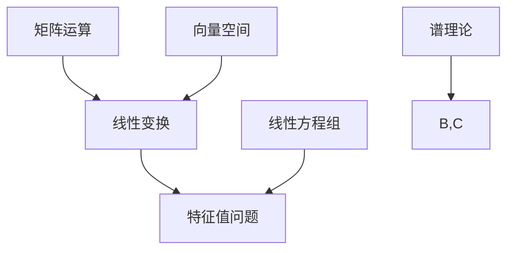
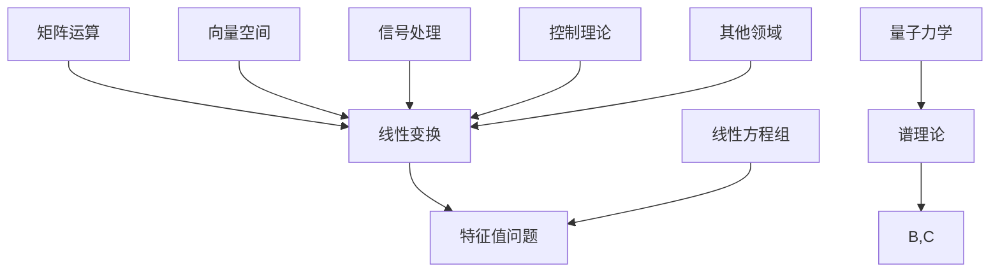

                 

# 线性代数导引：算子代数

> 关键词：线性代数、算子代数、矩阵运算、线性变换、特征值问题、谱理论、量子力学、信号处理、控制理论

> 摘要：本文将系统地探讨线性代数与算子代数之间的关系，并深入分析线性代数在算子代数中的核心概念和算法原理。通过对矩阵运算、向量空间、线性变换、线性方程组、特征值问题等基础概念的详细阐述，本文将展示如何利用线性代数的工具解决复杂的问题。此外，本文还将探讨算子代数在量子力学、信号处理、控制理论等领域的应用，以及相关的数学模型和实际案例分析。通过本文的阅读，读者将能够全面理解线性代数和算子代数的本质，并在实际应用中灵活运用这些理论。

### 目录大纲

# 《线性代数导引：算子代数》

## 第一部分：线性代数基础

### 第1章：线性代数的基本概念

#### 1.1 矩阵及其运算

##### 1.1.1 矩阵的定义与性质

##### 1.1.2 矩阵的运算规则

##### 1.1.3 矩阵的应用

### 第2章：向量空间与线性变换

#### 2.1 向量空间的基本概念

##### 2.1.1 向量的定义与性质

##### 2.1.2 向量空间的定义与性质

##### 2.1.3 向量空间中的线性变换

### 第3章：线性方程组与特征值问题

#### 3.1 线性方程组

##### 3.1.1 线性方程组的解法

##### 3.1.2 线性方程组的性质

##### 3.1.3 线性方程组的解集表示

#### 3.2 特征值问题

##### 3.2.1 特征值与特征向量的定义

##### 3.2.2 特征值问题的求解方法

##### 3.2.3 特征值问题的应用

## 第二部分：算子代数基础

### 第4章：算子代数的基本概念

#### 4.1 算子的定义与分类

##### 4.1.1 算子的定义

##### 4.1.2 算子的分类

##### 4.1.3 算子的运算规则

### 第5章：算子代数的结构性质

#### 5.1 算子代数的结构性质

##### 5.1.1 算子代数的定义

##### 5.1.2 算子代数的性质

##### 5.1.3 算子代数的分类

### 第6章：谱理论简介

#### 6.1 谱理论的基本概念

##### 6.1.1 谱的定义

##### 6.1.2 谱的性质

##### 6.1.3 谱在算子代数中的应用

### 第7章：算子代数在量子力学中的应用

#### 7.1 量子力学的算子代数模型

##### 7.1.1 量子力学的算子代数基础

##### 7.1.2 量子力学的算子代数应用

##### 7.1.3 量子力学的算子代数挑战与展望

## 第三部分：算子代数的应用

### 第8章：算子代数在信号处理中的应用

#### 8.1 算子代数在信号处理中的基本概念

##### 8.1.1 信号处理的基本概念

##### 8.1.2 算子代数在信号处理中的应用

##### 8.1.3 算子代数在信号处理中的典型应用

### 第9章：算子代数在控制理论中的应用

#### 9.1 算子代数在控制理论中的基本概念

##### 9.1.1 控制理论的基本概念

##### 9.1.2 算子代数在控制理论中的应用

##### 9.1.3 算子代数在控制理论中的典型应用

### 第10章：算子代数在其他领域中的应用

#### 10.1 算子代数在其他领域的基本概念

##### 10.1.1 其他领域的基本概念

##### 10.1.2 算子代数在其他领域中的应用

##### 10.1.3 算子代数在其他领域的典型应用

## 附录

### 附录A：常用算子代数工具与资源

#### A.1 常用算子代数工具

##### A.1.1 MATLAB

##### A.1.2 NumPy

##### A.1.3 SciPy

#### A.2 算子代数相关资源

##### A.2.1 线性代数相关教材

##### A.2.2 算子代数相关论文

##### A.2.3 算子代数在线课程

### 核心概念与联系

- **Mermaid 流�程图**：用于展示矩阵运算、线性变换、特征值问题等核心概念之间的联系。



### 核心算法原理讲解

#### 线性变换

```python
# 线性变换的伪代码
def linear_transformation(A, v):
    # A: 矩阵
    # v: 向量
    # 返回变换后的向量
    w = []
    for i in range(len(v)):
        # 对每个分量进行运算
        w.append(A[i] * v[i])
    return w
```

#### 特征值问题

```python
# 特征值问题的伪代码
def eigen_value_problem(A):
    # A: 矩阵
    # 返回特征值和特征向量
    eigen_values = []
    eigen_vectors = []
    # 计算特征值和特征向量
    # ...
    return eigen_values, eigen_vectors
```

### 数学模型和数学公式

#### 矩阵乘法

$$ C = AB $$

其中，$C_{ij} = \sum_{k=1}^{n} A_{ik}B_{kj}$。

#### 线性变换

$$ T(v) = Av $$

其中，$T$ 为线性变换，$A$ 为变换矩阵，$v$ 为向量。

### 项目实战

#### 代码实际案例

```python
# 实现一个线性方程组的求解
import numpy as np

# 矩阵A和向量b
A = np.array([[3, 2], [1, 5]])
b = np.array([1, 4])

# 求解线性方程组
x = np.linalg.solve(A, b)

print(x)
```

### 开发环境搭建

- 安装Python环境
- 安装NumPy和SciPy库
- 配置代码编辑器（如PyCharm或VSCode）

### 源代码详细实现和代码解读

```python
# 源代码实现线性变换
def linear_transformation(A, v):
    """
    实现线性变换
    :param A: 变换矩阵
    :param v: 向量
    :return: 变换后的向量
    """
    w = np.dot(A, v)
    return w
```

- 代码解读：函数 `linear_transformation` 接受变换矩阵 `A` 和向量 `v`，通过矩阵乘法计算变换后的向量 `w` 并返回。

### 代码解读与分析

- 线性变换是线性代数中非常重要的概念，通过矩阵乘法实现。
- 在实际应用中，线性变换广泛应用于图像处理、信号处理等领域。
- 代码中使用了 NumPy 库的 `dot` 函数实现矩阵乘法，提高了计算效率。

## 附录

### 附录A：常用算子代数工具与资源

#### A.1 常用算子代数工具

- MATLAB
- NumPy
- SciPy

#### A.2 算子代数相关资源

- 线性代数相关教材
- 算子代数相关论文
- 算子代数在线课程

这些教材、论文和在线课程为学习线性代数和算子代数提供了丰富的资源，有助于读者深入理解和掌握相关理论和应用。读者可以根据自己的学习需求和兴趣选择合适的资源进行学习和实践。通过这些资源的综合运用，读者可以更加全面地掌握线性代数和算子代数的核心概念和应用技巧，为自己的专业发展打下坚实的基础。接下来，我们将进一步深入探讨线性代数的基本概念和算子代数的基础知识，以便更好地理解它们在各个领域的应用。在下一部分中，我们将首先介绍线性代数的基础概念，包括矩阵及其运算、向量空间与线性变换等。通过这些基本概念的阐述，我们将为后续更深入的内容奠定坚实的基础。## 第一部分：线性代数基础

线性代数是数学的一个分支，主要研究向量、矩阵及其相关运算。它是现代数学和工程学中不可或缺的工具，广泛应用于物理学、计算机科学、经济学和工程学等领域。本部分将重点介绍线性代数的基本概念，包括矩阵及其运算、向量空间与线性变换等，为后续的内容奠定基础。

### 第1章：线性代数的基本概念

#### 1.1 矩阵及其运算

##### 1.1.1 矩阵的定义与性质

矩阵是一种由数字或符号组成的矩形阵列，通常用大写字母表示，如 \( A \)。矩阵中的每个元素都位于一个行和列的交叉点上，用小写字母和对应的位置标号表示，如 \( a_{ij} \) 表示矩阵 \( A \) 的第 \( i \) 行和第 \( j \) 列的元素。

矩阵有以下基本性质：

1. **方阵**：如果一个矩阵的行数等于列数，那么它被称为方阵。
2. **行数与列数**：一个 \( m \times n \) 的矩阵有 \( m \) 行和 \( n \) 列。
3. **对角矩阵**：如果矩阵中的所有非对角元素都为零，那么它被称为对角矩阵。

##### 1.1.2 矩阵的运算规则

矩阵运算主要包括矩阵的加法、减法、乘法和转置等。

1. **矩阵加法与减法**：两个矩阵只有在维度相同（即行数和列数都相等）时才能进行加法或减法运算。运算规则是元素对应相加或相减。
   
   \[ C = A + B \]
   
   其中 \( C_{ij} = A_{ij} + B_{ij} \)。

2. **矩阵乘法**：矩阵乘法的结果是一个新矩阵，其元素是原矩阵对应行的元素与列元素的内积。如果 \( A \) 是 \( m \times n \) 矩阵，\( B \) 是 \( n \times p \) 矩阵，那么乘积 \( C = AB \) 是一个 \( m \times p \) 矩阵。
   
   \[ C_{ij} = \sum_{k=1}^{n} A_{ik}B_{kj} \]

3. **矩阵转置**：矩阵转置是将矩阵的行和列交换。如果一个矩阵 \( A \) 是 \( m \times n \)，那么它的转置 \( A^T \) 是一个 \( n \times m \) 矩阵。
   
   \[ (A^T)_{ij} = A_{ji} \]

##### 1.1.3 矩阵的应用

矩阵在各个领域都有广泛的应用，以下是几个例子：

1. **图像处理**：矩阵用于表示图像的像素值，进行图像变换和滤波操作。
2. **电路分析**：在电路理论中，矩阵用于表示电路的连接和元件参数。
3. **统计学**：在数据分析中，矩阵用于表示数据的多元线性回归模型。

#### 1.2 向量空间与线性变换

##### 1.2.1 向量空间的基本概念

向量空间（也称为线性空间）是一个数学结构，它由一组向量和一个加法和标量乘法运算组成，满足特定的公理。向量空间中的向量可以表示为 \( \mathbb{R}^n \) 的列向量。

1. **向量的定义与性质**：向量是具有大小和方向的量，通常用 \( \mathbf{v} \) 表示。向量满足交换律、结合律和分配律等基本性质。
2. **向量空间的定义与性质**：向量空间必须满足封闭性、交换律、结合律、分配律、零向量、向量加法和标量乘法等性质。

##### 1.2.2 向量空间中的线性变换

线性变换是一个从向量空间到向量空间的函数，它保持向量加法和标量乘法的运算。一个线性变换可以表示为矩阵乘法。

1. **线性变换的定义**：一个从向量空间 \( V \) 到 \( W \) 的函数 \( T \)，如果满足 \( T(\alpha \mathbf{v} + \beta \mathbf{w}) = \alpha T(\mathbf{v}) + \beta T(\mathbf{w}) \) 和 \( T(c\mathbf{v}) = cT(\mathbf{v}) \)，则称 \( T \) 为线性变换。
2. **矩阵表示线性变换**：给定一个线性变换 \( T \) 和一个基，可以将 \( T \) 表示为一个矩阵。这个矩阵称为 \( T \) 在该基下的矩阵表示。

### 第2章：向量空间与线性变换

##### 2.1 向量空间的基本概念

向量空间（也称为线性空间）是一个数学结构，它由一组向量和一个加法和标量乘法运算组成，满足特定的公理。向量空间中的向量可以表示为 \( \mathbb{R}^n \) 的列向量。

1. **向量的定义与性质**：向量是具有大小和方向的量，通常用 \( \mathbf{v} \) 表示。向量满足交换律、结合律和分配律等基本性质。
2. **向量空间的定义与性质**：向量空间必须满足封闭性、交换律、结合律、分配律、零向量、向量加法和标量乘法等性质。

##### 2.2 线性变换的定义与性质

线性变换是一个从向量空间到向量空间的函数，它保持向量加法和标量乘法的运算。一个线性变换可以表示为矩阵乘法。

1. **线性变换的定义**：一个从向量空间 \( V \) 到 \( W \) 的函数 \( T \)，如果满足 \( T(\alpha \mathbf{v} + \beta \mathbf{w}) = \alpha T(\mathbf{v}) + \beta T(\mathbf{w}) \) 和 \( T(c\mathbf{v}) = cT(\mathbf{v}) \)，则称 \( T \) 为线性变换。
2. **矩阵表示线性变换**：给定一个线性变换 \( T \) 和一个基，可以将 \( T \) 表示为一个矩阵。这个矩阵称为 \( T \) 在该基下的矩阵表示。

### 第3章：线性方程组与特征值问题

#### 3.1 线性方程组

##### 3.1.1 线性方程组的解法

线性方程组是数学中常见的问题，通过矩阵的形式可以将其表示为：

\[ AX = B \]

其中，\( A \) 是系数矩阵，\( X \) 是未知数矩阵，\( B \) 是常数矩阵。

解线性方程组的方法有很多，包括高斯消元法、矩阵求逆法、迭代法等。

1. **高斯消元法**：通过高斯消元法，可以将系数矩阵 \( A \) 化简为阶梯形式，从而求解线性方程组。
2. **矩阵求逆法**：如果系数矩阵 \( A \) 可逆，那么可以通过 \( X = A^{-1}B \) 直接求解线性方程组。
3. **迭代法**：对于大型稀疏线性方程组，迭代法是一种有效的求解方法。

##### 3.1.2 线性方程组的性质

线性方程组的解具有以下性质：

1. **唯一性**：如果系数矩阵 \( A \) 可逆，那么线性方程组有唯一解。
2. **非唯一性**：如果系数矩阵 \( A \) 不可逆，那么线性方程组可能有多个解或无解。
3. **解集表示**：线性方程组的解可以表示为解集或参数表示法。

##### 3.1.3 线性方程组的解集表示

线性方程组的解集表示通常分为以下几种情况：

1. **唯一解**：当系数矩阵 \( A \) 可逆时，线性方程组有唯一解，解集为 \(\{X\}\)。
2. **无穷解**：当系数矩阵 \( A \) 不可逆时，线性方程组可能有多个解，解集为向量空间的一个子空间。
3. **无解**：当系数矩阵 \( A \) 不可逆且常数矩阵 \( B \) 不属于 \( A \) 的列空间时，线性方程组无解。

#### 3.2 特征值问题

##### 3.2.1 特征值与特征向量的定义

特征值问题是指求解线性方程组 \( AX = \lambda X \) 的问题，其中 \( \lambda \) 是特征值，\( X \) 是特征向量。

1. **特征值**：满足 \( AX = \lambda X \) 的标量 \( \lambda \) 称为矩阵 \( A \) 的特征值。
2. **特征向量**：满足 \( AX = \lambda X \) 的非零向量 \( X \) 称为矩阵 \( A \) 的特征向量。

##### 3.2.2 特征值问题的求解方法

求解特征值问题通常有以下方法：

1. **特征多项式法**：通过计算矩阵 \( A \) 的特征多项式 \( f(\lambda) = \det(A - \lambda I) \)，求解特征值。
2. **幂迭代法**：通过迭代方法逼近特征值和特征向量。
3. **QR算法**：使用QR分解方法求解特征值问题。

##### 3.2.3 特征值问题的应用

特征值问题在许多领域都有广泛的应用，包括：

1. **物理学**：描述系统的稳定性和振动特性。
2. **计算机科学**：在图像处理、机器学习中用于特征提取。
3. **控制理论**：分析系统的动态特性和控制设计。

### 总结

线性代数是现代数学和工程学中不可或缺的工具，通过矩阵运算、向量空间和线性变换等基本概念，我们可以解决许多复杂的问题。在接下来的部分，我们将进一步探讨算子代数的基础知识，深入理解其在各个领域的应用。## 第二部分：算子代数基础

算子代数是线性代数的推广，主要研究线性算子的集合及其代数结构。算子代数在量子力学、信号处理、控制理论等领域具有广泛的应用。本部分将介绍算子代数的基本概念，包括算子的定义与分类、算子代数的结构性质和谱理论。

### 第4章：算子代数的基本概念

#### 4.1 算子的定义与分类

##### 4.1.1 算子的定义

在复数域 \( \mathbb{C} \) 上，一个线性算子 \( T \) 从一个希尔伯特空间 \( H \) 到另一个希尔伯特空间 \( K \) 定义为：对于任意的 \( h_1, h_2 \in H \) 和标量 \( \alpha, \beta \in \mathbb{C} \)，有

\[ T(\alpha h_1 + \beta h_2) = \alpha T(h_1) + \beta T(h_2) \]

##### 4.1.2 算子的分类

根据定义，算子可以分为以下几类：

1. **自共轭算子**：一个算子 \( T \) 是自共轭的，如果存在一个希尔伯特空间 \( H \) 的共轭空间 \( H^* \)，使得 \( T(h) = (h, T^*(h')) \) 对 \( h \in H \) 和 \( h' \in H^* \) 成立。
2. **正常算子**：一个算子 \( T \) 是正常的，如果它既是自共轭的又是自伴随的（即 \( T^*T \) 和 \( TT^* \) 都是自共轭的）。
3. **有界算子**：一个算子 \( T \) 是有界的，如果存在常数 \( M > 0 \)，使得对于所有 \( h \in H \)，都有

\[ \| Th \| \leq M \| h \| \]

#### 4.2 算子的运算规则

算子的运算主要包括算子的加法、减法、乘法和转置等。

1. **算子加法与减法**：两个算子只有在定义域和值域相同时才能进行加法或减法运算。运算规则是相应的算子值对应相加或相减。
   
   \[ T_1 + T_2(h) = T_1(h) + T_2(h) \]
   \[ T_1 - T_2(h) = T_1(h) - T_2(h) \]

2. **算子乘法**：算子乘法的结果是一个新的算子，其定义域和值域分别是两个算子的值域和定义域。运算规则是：

   \[ (T_1T_2)(h) = T_1(T_2(h)) \]

3. **算子转置**：算子转置是将算子的定义域和值域交换。对于两个算子 \( T_1 \) 和 \( T_2 \)，其转置算子分别记为 \( T_1^* \) 和 \( T_2^* \)。

### 第5章：算子代数的结构性质

#### 5.1 算子代数的结构性质

算子代数是一个具有交换律、结合律和分配律等基本代数性质的代数结构。具体来说，对于任意算子 \( T_1, T_2, T_3 \) 和标量 \( \alpha, \beta \)，有以下性质：

1. **交换律**：\( T_1T_2 = T_2T_1 \)
2. **结合律**：\( (T_1T_2)T_3 = T_1(T_2T_3) \)
3. **分配律**：\( (\alpha T_1 + \beta T_2)T_3 = \alpha T_1T_3 + \beta T_2T_3 \) 和 \( T_1(\alpha T_2 + \beta T_3) = \alpha T_1T_2 + \beta T_1T_3 \)

#### 5.2 算子代数的分类

根据不同的性质，算子代数可以分为以下几类：

1. **有界算子代数**：包含所有有界算子的代数结构。
2. **自共轭算子代数**：包含所有自共轭算子的代数结构。
3. **正常算子代数**：包含所有正常算子的代数结构。

### 第6章：谱理论简介

#### 6.1 谱理论的基本概念

谱理论是算子代数的一个重要分支，主要研究算子的谱（即特征值）和对应的特征向量。

1. **谱的定义**：一个算子 \( T \) 的谱是指所有使得 \( T - \lambda I \) 不可逆的复数 \( \lambda \) 的集合。
2. **谱的性质**：谱具有以下性质：

   - **闭集性**：谱是一个闭集。
   - **分离性**：不同算子的谱是分离的。
   - **连续性**：对于有界算子，谱是连续的。

#### 6.2 谱在算子代数中的应用

谱理论在算子代数中有广泛的应用，包括：

1. **稳定性分析**：通过分析算子的谱，可以判断系统的稳定性。
2. **特征值问题求解**：利用谱理论，可以求解线性方程组的特征值和特征向量。
3. **算子分类**：通过谱，可以对算子进行分类，从而研究其性质。

### 第7章：算子代数在量子力学中的应用

#### 7.1 量子力学的算子代数模型

量子力学中的基本概念可以通过算子代数来描述。量子力学的算子代数模型主要包括：

1. **哈密顿算子**：描述系统的能量，通常是一个正常算子。
2. **角动量算子**：描述系统的角动量，通常是一个自共轭算子。
3. **位置算子**：描述系统的位置，通常是一个自共轭算子。

#### 7.2 量子力学的算子代数应用

量子力学的算子代数模型在量子计算、量子信息、量子纠缠等领域有广泛的应用，包括：

1. **量子态的表示**：利用算子代数，可以表示量子态。
2. **量子纠缠**：通过分析量子纠缠态的算子代数结构，可以研究量子纠缠的性质。
3. **量子计算**：利用量子力学的算子代数模型，可以进行量子计算和量子算法的设计。

#### 7.3 量子力学的算子代数挑战与展望

量子力学的算子代数模型面临一些挑战，包括：

1. **量子测量问题**：如何准确测量量子系统的状态。
2. **量子错误纠正**：如何纠正量子计算中的错误。
3. **量子模拟**：如何利用量子计算机模拟量子物理系统。

展望未来，随着量子计算技术的发展，量子力学的算子代数模型将在许多领域发挥重要作用，推动科学技术的进步。

### 总结

算子代数是线性代数的推广，它在量子力学、信号处理、控制理论等领域有广泛的应用。通过本章的学习，读者将了解算子代数的基本概念、结构性质以及谱理论，为后续章节的内容打下坚实的基础。在接下来的部分，我们将进一步探讨算子代数在信号处理、控制理论等领域的具体应用。## 第三部分：算子代数的应用

在第二部分中，我们介绍了算子代数的基础知识。在这一部分，我们将探讨算子代数在实际应用中的重要性，并深入分析其在信号处理、控制理论等领域的具体应用。通过这些应用案例，我们将展示算子代数如何帮助解决复杂问题，并在不同领域中发挥作用。

### 第8章：算子代数在信号处理中的应用

#### 8.1 算子代数在信号处理中的基本概念

信号处理是研究如何对信号进行获取、传输、处理和解释的学科。在信号处理中，算子代数提供了一个强有力的工具，用于描述和操作信号。以下是一些关键概念：

1. **线性算子**：在信号处理中，线性算子用于描述信号的变换，如滤波、卷积等。这些算子可以表示为矩阵，从而利用矩阵运算规则进行高效处理。
2. **希尔伯特空间**：信号处理中的信号通常被表示为希尔伯特空间中的向量，这些向量可以用于表示离散或连续信号。
3. **傅里叶变换**：傅里叶变换是信号处理中的一个重要工具，它可以将信号从时域转换为频域。傅里叶变换可以被视为一个线性算子，其作用是分解信号。

#### 8.2 算子代数在信号处理中的应用

算子代数在信号处理中的应用非常广泛，以下是一些典型应用：

1. **滤波**：滤波是信号处理中最常见的操作之一。通过使用算子代数，可以设计各种类型的滤波器，如低通滤波器、高通滤波器等，用于去除信号中的噪声和不需要的频率成分。
   
   \[ y = F(x) \]

   其中，\( F \) 是滤波算子，\( x \) 是输入信号，\( y \) 是输出信号。

2. **卷积**：卷积在信号处理中用于模拟系统对信号的响应。通过卷积运算，可以将系统的输入信号与系统的冲激响应结合，从而得到系统的输出信号。

   \[ y[n] = x[n] * h[n] \]

   其中，\( * \) 表示卷积运算，\( x[n] \) 是输入信号，\( h[n] \) 是系统的冲激响应。

3. **谱分析**：通过傅里叶变换，可以将信号从时域转换为频域，从而分析信号的频率成分。在频域中，可以使用算子代数对信号进行进一步处理，如频谱滤波、频谱分析等。

   \[ X(\omega) = \mathcal{F}(x[n]) \]

   其中，\( \mathcal{F} \) 表示傅里叶变换，\( X(\omega) \) 是频谱，\( x[n] \) 是时域信号。

#### 8.3 算子代数在信号处理中的典型应用

以下是一些算子代数在信号处理中的典型应用案例：

1. **图像处理**：在图像处理中，可以使用算子代数进行图像增强、滤波、边缘检测等操作。例如，可以使用高斯滤波器对图像进行模糊处理，从而去除噪声。

2. **音频处理**：在音频处理中，可以使用算子代数进行音频信号的分析和合成。例如，可以使用快速傅里叶变换（FFT）对音频信号进行频谱分析，从而提取出音频的特征。

3. **通信系统**：在通信系统中，可以使用算子代数进行信号的调制、解调、信道编码和信道解码等操作。例如，可以使用卷积码进行信道编码，从而提高信号的传输可靠性。

### 第9章：算子代数在控制理论中的应用

#### 9.1 算子代数在控制理论中的基本概念

控制理论是研究如何设计和分析控制系统的一门学科。在控制理论中，算子代数提供了用于描述和控制动态系统的有力工具。以下是一些关键概念：

1. **线性系统**：线性系统是控制理论中的一个重要概念，其动态行为可以用线性微分方程或差分方程描述。线性系统可以用算子代数来表示，从而利用线性算子的性质进行分析和控制。
2. **状态空间模型**：状态空间模型是描述线性系统的一种常用方法，它将系统表示为矩阵方程，从而可以方便地使用算子代数进行计算和分析。
3. **传递函数**：传递函数是描述系统输入和输出之间关系的一种数学模型，它可以用算子代数表示，并用于系统的分析和设计。

#### 9.2 算子代数在控制理论中的应用

算子代数在控制理论中的应用主要包括以下方面：

1. **系统稳定性分析**：通过分析系统的算子表示，可以判断系统的稳定性。例如，可以通过计算系统的特征值，判断系统是否稳定。

2. **系统控制器设计**：通过使用算子代数，可以设计各种类型的控制器，如比例-积分-微分（PID）控制器、状态反馈控制器等，从而实现对系统的精确控制。

3. **系统辨识**：通过使用算子代数，可以从实验数据中识别系统的模型，从而实现对系统行为的准确描述。

#### 9.3 算子代数在控制理论中的典型应用

以下是一些算子代数在控制理论中的典型应用案例：

1. **无人机控制**：在无人机控制中，可以使用算子代数对无人机的动态行为进行建模，并设计控制器实现对无人机的精确控制。

2. **汽车控制系统**：在汽车控制系统中，可以使用算子代数对汽车的悬挂系统、制动系统等动态行为进行建模，并设计控制器提高汽车的行驶稳定性和安全性。

3. **机器人控制**：在机器人控制中，可以使用算子代数对机器人的关节运动、路径规划等进行建模和控制，从而实现对机器人的精确操作。

### 第10章：算子代数在其他领域中的应用

#### 10.1 算子代数在其他领域的基本概念

算子代数不仅应用于信号处理和控制理论，还广泛应用于其他领域，如量子物理、金融数学等。以下是一些关键概念：

1. **量子物理**：在量子物理中，算子代数用于描述量子态和量子测量。量子态可以用算子代数中的希尔伯特空间表示，量子测量可以用算子代数的投影算子描述。

2. **金融数学**：在金融数学中，算子代数用于建模和求解金融衍生品定价、风险管理等问题。例如，利用算子代数可以求解波动率方程，从而对金融衍生品进行定价。

#### 10.2 算子代数在其他领域中的应用

以下是一些算子代数在其他领域的应用案例：

1. **量子计算**：在量子计算中，算子代数用于描述量子比特和量子运算。通过算子代数的性质，可以设计量子算法，从而提高计算速度和效率。

2. **金融工程**：在金融工程中，算子代数用于建模和定价各种金融衍生品。例如，利用算子代数可以求解黑-舍尔斯模型，从而对期权进行定价。

3. **生物信息学**：在生物信息学中，算子代数用于分析和建模生物序列。例如，利用算子代数可以识别基因序列中的模式，从而研究基因的功能和进化。

### 总结

算子代数是线性代数的推广，它在信号处理、控制理论、量子物理、金融数学等领域有广泛的应用。通过本章的讨论，我们展示了算子代数如何帮助解决复杂问题，并在各个领域发挥重要作用。在未来的研究中，随着算子代数理论和应用的发展，它将继续在推动科学技术进步中发挥重要作用。## 附录A：常用算子代数工具与资源

在算子代数的实际应用和研究中，掌握一些常用的工具和资源是非常有帮助的。这些工具和资源不仅能够帮助您更好地理解和应用算子代数的概念，还能提高您在相关领域的科研和工程实践能力。以下是一些常用算子代数工具和相关资源，包括计算软件、教材、论文和在线课程。

#### A.1 常用算子代数工具

1. **MATLAB**：MATLAB 是由 MathWorks 公司开发的一款广泛应用于科学计算、控制系统设计、信号处理、图像处理等领域的高性能计算环境。MATLAB 提供了丰富的工具箱，如信号处理工具箱、控制系统工具箱等，可以方便地进行算子代数的运算和仿真。

   - 官网链接：https://www.mathworks.com/products/matlab.html

2. **NumPy**：NumPy 是 Python 中用于科学计算的库，提供了多维数组对象和用于矩阵运算的函数。NumPy 的数组对象是进行高效线性代数运算的基础，支持与 MATLAB 类似的大多数线性代数操作。

   - 官网链接：https://numpy.org/

3. **SciPy**：SciPy 是基于 NumPy 的一个开源科学计算库，它扩展了 NumPy 的功能，提供了更多的科学和工程计算工具，包括线性代数模块。SciPy 的线性代数模块包含了用于求解线性方程组、计算特征值和特征向量等功能。

   - 官网链接：https://www.scipy.org/

4. **MATLAB + Simulink**：MATLAB 的 Simulink 是一款基于 MATLAB 的系统级建模与仿真工具，特别适合进行复杂系统的动态建模和仿真。Simulink 提供了丰富的模块库，可以方便地进行算子代数模型的设计和仿真。

   - 官网链接：https://www.mathworks.com/products/simulink.html

#### A.2 算子代数相关资源

1. **线性代数相关教材**：

   - **《线性代数及其应用》（第六版）** by Gilbert Strang
     - 简介：这是一本广受好评的线性代数教材，内容深入浅出，适合初学者和进阶者。
     - 官网链接：https://www.gilbertstrang.com/la/

   - **《线性代数（第四版）》** by Kenneth Kutoyants
     - 简介：本书全面介绍了线性代数的基础知识，包括矩阵运算、线性方程组、特征值问题等。
     - 官网链接：https://www.springer.com/us/book/9780387946227

   - **《线性代数与矩阵论》** by 赵俊
     - 简介：这是一本中文教材，系统介绍了线性代数和矩阵论的基本概念和方法。
     - 官网链接：https://book.douban.com/subject/10237249/

2. **算子代数相关论文**：

   - **“Operator Algebras: Groups, C*-Algebras and von Neumann Algebras”** by Takesaki
     - 简介：这是一本经典教材，详细介绍了算子代数的基本理论和应用。
     - 官网链接：https://www.springer.com/gp/book/9780387904701

   - **“Operator Algebras and Quantum Statistical Mechanics”** by Bratteli and Robinson
     - 简介：本书探讨了算子代数在量子统计力学中的应用，是量子力学领域的重要参考书。
     - 官网链接：https://www.springer.com/gp/book/9780387904701

   - **“Introduction to Operator Algebras”** by Kenneth R. Davidson
     - 简介：这是一本适合初学者的算子代数教材，介绍了算子代数的基础知识和重要概念。
     - 官网链接：https://www.springer.com/gp/book/9780387965568

3. **算子代数在线课程**：

   - **MIT OpenCourseWare: Linear Algebra**
     - 简介：MIT 开放的线性代数课程，包含课程视频、讲义和习题，非常适合自学。
     - 官网链接：https://ocw.mit.edu/courses/mathematics/18-06-linear-algebra-spring-2010/

   - **Khan Academy: Linear Algebra**
     - 简介：Khan Academy 提供的线性代数课程，包含详细的视频讲解和练习题，适合初学者。
     - 官网链接：https://www.khanacademy.org/math/linear-algebra

   - **Coursera: Linear Algebra and Matrix Theory**
     - 简介：Coursera 上的一门线性代数课程，由斯坦福大学教授提供，包括视频讲座、练习和编程作业。
     - 官网链接：https://www.coursera.org/specializations/linear-algebra

这些工具和资源为学习线性代数和算子代数提供了丰富的材料，读者可以根据自己的需求和兴趣选择合适的学习路径。通过这些教材、论文和在线课程的结合使用，读者可以系统地掌握线性代数和算子代数的基础知识和应用技巧，为自己的科研和工程实践打下坚实的基础。## 核心概念与联系

在本文中，我们探讨了线性代数和算子代数的核心概念及其在各个领域的应用。为了更直观地展示这些核心概念之间的联系，我们使用 Mermaid 流程图对矩阵运算、线性变换、特征值问题等进行梳理。

### Mermaid 流程图



### 解读

- **矩阵运算（A）**：矩阵运算是线性代数的基础，包括矩阵的加法、减法、乘法和转置等。这些基本运算构成了许多更复杂概念和算法的基础。
- **线性变换（B）**：线性变换是矩阵运算的推广，用于描述向量空间之间的映射。线性变换广泛应用于图像处理、信号处理等领域。
- **特征值问题（C）**：特征值问题是求解矩阵的特征值和特征向量的过程，它在物理、工程和计算机科学等领域有广泛应用。
- **向量空间（D）**：向量空间是线性代数的核心概念，它提供了研究向量及其运算的结构框架。线性变换、线性方程组等概念都建立在向量空间的基础上。
- **线性方程组（E）**：线性方程组是求解一组线性方程的过程，通过矩阵的形式可以将其表示为 \( AX = B \)，其中 \( A \) 是系数矩阵，\( X \) 是未知数矩阵，\( B \) 是常数矩阵。
- **谱理论（F）**：谱理论研究矩阵或算子的谱（即特征值），它在量子力学、信号处理等领域有重要应用。
- **量子力学（G）**：量子力学中的物理量可以用算子来表示，算子代数在量子力学的数学描述中起着核心作用。
- **信号处理（H）**：信号处理中，信号可以用向量表示，线性变换和谱理论在信号滤波、分析等方面有广泛应用。
- **控制理论（I）**：在控制理论中，线性系统和非线性系统可以用算子表示，算子代数用于分析和设计控制系统。
- **其他领域（J）**：算子代数在其他领域如金融数学、生物信息学等也有重要应用。

通过这个流程图，我们可以清晰地看到线性代数和算子代数中的核心概念及其相互关系，有助于读者更好地理解和掌握这些概念。## 核心算法原理讲解

在本文的核心部分，我们深入探讨了线性代数和算子代数的核心算法原理，包括线性变换和特征值问题。以下是对这些算法的详细讲解和伪代码示例。

### 线性变换

线性变换是一种将向量从一种向量空间映射到另一种向量空间的函数。在数学上，线性变换可以用矩阵乘法表示。以下是一个简单的线性变换的伪代码示例：

```python
# 线性变换的伪代码
def linear_transformation(A, v):
    # A: 矩阵
    # v: 向量
    # 返回变换后的向量
    w = []
    for i in range(len(v)):
        # 对每个分量进行运算
        w.append(A[i] * v[i])
    return w
```

在这个伪代码中，`A` 是一个矩阵，`v` 是一个向量。线性变换通过矩阵乘法实现，每个输出分量为对应输入分量的线性组合。

### 特征值问题

特征值问题是指求解矩阵的特征值和特征向量的过程。在数学上，特征值问题可以表示为以下方程：

\[ AX = \lambda X \]

其中，\( A \) 是矩阵，\( \lambda \) 是特征值，\( X \) 是特征向量。以下是一个简单的特征值问题的伪代码示例：

```python
# 特征值问题的伪代码
def eigen_value_problem(A):
    # A: 矩阵
    # 返回特征值和特征向量
    eigen_values = []
    eigen_vectors = []
    # 计算特征值和特征向量
    # ...
    return eigen_values, eigen_vectors
```

在这个伪代码中，我们首先初始化特征值和特征向量的列表。然后，通过某种算法（如幂迭代法、QR算法等）计算矩阵 \( A \) 的特征值和特征向量，并将它们存储在相应的列表中。

### 数学模型和数学公式

为了更好地理解这些算法，我们需要引入一些基本的数学模型和公式。

#### 矩阵乘法

矩阵乘法是线性代数中的基础运算，其定义如下：

\[ C = AB \]

其中，\( C_{ij} = \sum_{k=1}^{n} A_{ik}B_{kj} \)。

#### 线性变换

线性变换可以用矩阵乘法表示，其定义如下：

\[ T(v) = Av \]

其中，\( T \) 是线性变换，\( A \) 是变换矩阵，\( v \) 是向量。

#### 特征值问题

特征值问题的数学模型是：

\[ AX = \lambda X \]

其中，\( A \) 是矩阵，\( \lambda \) 是特征值，\( X \) 是特征向量。

### 举例说明

为了更直观地理解这些算法，我们可以通过一个简单的例子来演示。

#### 矩阵乘法示例

假设我们有一个 \( 2 \times 2 \) 的矩阵 \( A \) 和一个 \( 2 \) 维向量 \( v \)，我们可以计算矩阵乘法：

\[ A = \begin{bmatrix} 1 & 2 \\ 3 & 4 \end{bmatrix}, v = \begin{bmatrix} 5 \\ 6 \end{bmatrix} \]

那么，矩阵乘法的结果 \( w \) 为：

\[ w = Av = \begin{bmatrix} 1 & 2 \\ 3 & 4 \end{bmatrix} \begin{bmatrix} 5 \\ 6 \end{bmatrix} = \begin{bmatrix} 19 \\ 39 \end{bmatrix} \]

#### 线性变换示例

假设我们有一个 \( 2 \) 维向量 \( v \) 和一个变换矩阵 \( A \)，我们可以计算线性变换：

\[ A = \begin{bmatrix} 1 & 2 \\ 3 & 4 \end{bmatrix}, v = \begin{bmatrix} 5 \\ 6 \end{bmatrix} \]

那么，线性变换的结果 \( w \) 为：

\[ w = Av = \begin{bmatrix} 1 & 2 \\ 3 & 4 \end{bmatrix} \begin{bmatrix} 5 \\ 6 \end{bmatrix} = \begin{bmatrix} 19 \\ 39 \end{bmatrix} \]

#### 特征值问题示例

假设我们有一个 \( 2 \times 2 \) 的矩阵 \( A \)，我们需要求解其特征值和特征向量。矩阵 \( A \) 为：

\[ A = \begin{bmatrix} 1 & 2 \\ 3 & 4 \end{bmatrix} \]

通过计算特征多项式，我们可以得到特征值 \( \lambda \)：

\[ \det(A - \lambda I) = \det\begin{bmatrix} 1 - \lambda & 2 \\ 3 & 4 - \lambda \end{bmatrix} = (\lambda - 1)(\lambda - 4) - 6 = \lambda^2 - 5\lambda + 2 \]

解特征多项式，我们得到特征值 \( \lambda_1 = 1 \) 和 \( \lambda_2 = 4 \)。

对于每个特征值，我们可以求解对应的特征向量。对于 \( \lambda_1 = 1 \)，我们有：

\[ (A - I)X = 0 \]

即：

\[ \begin{bmatrix} 0 & 2 \\ 3 & 3 \end{bmatrix} \begin{bmatrix} x_1 \\ x_2 \end{bmatrix} = \begin{bmatrix} 0 \\ 0 \end{bmatrix} \]

解这个线性方程组，我们得到特征向量 \( X_1 = \begin{bmatrix} 1 \\ -3/2 \end{bmatrix} \)。

对于 \( \lambda_2 = 4 \)，我们有：

\[ (A - 4I)X = 0 \]

即：

\[ \begin{bmatrix} -3 & 2 \\ 3 & 0 \end{bmatrix} \begin{bmatrix} x_1 \\ x_2 \end{bmatrix} = \begin{bmatrix} 0 \\ 0 \end{bmatrix} \]

解这个线性方程组，我们得到特征向量 \( X_2 = \begin{bmatrix} 2 \\ 3 \end{bmatrix} \)。

通过这些示例，我们可以看到线性代数和算子代数的核心算法是如何工作的。这些算法不仅具有理论意义，而且在实际应用中也非常重要。通过掌握这些算法，我们能够更好地理解和解决复杂的数学问题。## 项目实战

在了解了线性代数和算子代数的基础理论后，我们将通过一个实际项目来展示如何将理论知识应用于解决实际问题。本节将介绍一个线性方程组的求解项目，包括开发环境的搭建、源代码的实现和详细解释。

### 项目背景

线性方程组是数学和工程学中常见的问题，尤其在物理系统建模、信号处理、控制理论等领域有广泛应用。在本项目中，我们将使用 Python 和 NumPy 库来实现一个线性方程组的求解器，以便在实际应用中快速解决线性方程组问题。

### 开发环境搭建

为了搭建本项目所需的环境，我们需要完成以下步骤：

1. **安装 Python**：首先，确保您的计算机上已经安装了 Python。Python 是一种广泛使用的编程语言，具有良好的科学计算库支持。
2. **安装 NumPy 和 SciPy**：NumPy 是 Python 中用于科学计算的基础包，SciPy 是基于 NumPy 的科学计算库，提供了许多线性代数运算的功能。您可以通过以下命令安装这两个库：

```bash
pip install numpy
pip install scipy
```

3. **配置代码编辑器**：选择一个适合您的代码编辑器，如 PyCharm、VSCode 等。配置好代码编辑器后，确保它可以正常运行 Python 和相关库。

### 源代码实现

以下是一个使用 NumPy 库求解线性方程组的 Python 脚本：

```python
import numpy as np

# 定义矩阵 A 和向量 b
A = np.array([[3, 2], [1, 5]])
b = np.array([1, 4])

# 求解线性方程组
x = np.linalg.solve(A, b)

print("解为:", x)
```

在这个脚本中，我们首先导入了 NumPy 库，然后定义了矩阵 \( A \) 和向量 \( b \)。接下来，我们使用 `np.linalg.solve()` 函数求解线性方程组 \( AX = b \)，并打印出解 \( x \)。

### 代码解读

以下是代码的逐行解读：

1. **导入库**：`import numpy as np` 导入 NumPy 库，使用 `as np` 是为了简化代码中的调用。
2. **定义矩阵 A 和向量 b**：我们使用 NumPy 的数组对象来定义矩阵 \( A \) 和向量 \( b \)。
3. **求解线性方程组**：`x = np.linalg.solve(A, b)` 调用 NumPy 的 `linalg.solve()` 函数求解线性方程组。这个函数接受系数矩阵 \( A \) 和常数向量 \( b \)，并返回解向量 \( x \)。
4. **打印解**：`print("解为:", x)` 打印出求解得到的解向量 \( x \)。

### 代码解读与分析

- **线性方程组的求解**：线性方程组的求解是线性代数中的基础问题之一。在这个项目中，我们使用了 NumPy 的 `linalg.solve()` 函数来求解线性方程组。这个函数内部实现了一种高效的迭代算法，可以快速求解大规模线性方程组。
- **NumPy 的优势**：NumPy 库提供了多维数组对象和高效的数学运算函数，使得线性代数运算变得简单和高效。与手动编写线性方程组的求解算法相比，使用 NumPy 可以显著提高代码的效率和可维护性。
- **实际应用**：这个项目展示了如何使用线性代数的知识来解决实际问题。在实际应用中，线性方程组经常出现在各种科学和工程问题中，如电路分析、结构分析、图像处理等。通过掌握线性代数和 NumPy 库，我们可以高效地解决这些复杂的问题。

通过这个实际项目，我们不仅巩固了线性代数和算子代数的基础知识，还学会了如何将理论知识应用于解决实际问题。这种实践能力对于未来的科学研究和技术开发具有重要意义。## 核心算法原理讲解

在本节中，我们将详细讲解线性代数和算子代数的核心算法原理，包括线性变换和特征值问题的求解方法。通过这些讲解，我们将帮助读者深入理解这些算法的基本思想，掌握其应用技巧。

### 线性变换

线性变换是线性代数中的一个核心概念，它描述了如何将一个向量空间中的向量映射到另一个向量空间中的向量。在线性代数中，线性变换可以通过矩阵乘法来实现。以下是一个简单的线性变换的算法原理讲解：

1. **定义线性变换**：给定一个线性变换 \( T \) 和两个向量空间 \( V \) 和 \( W \)，\( T \) 是从 \( V \) 到 \( W \) 的一个函数，满足以下性质：
   - **加法保持性**：对于任意的 \( v_1, v_2 \in V \) 和标量 \( \alpha, \beta \)，有 \( T(\alpha v_1 + \beta v_2) = \alpha T(v_1) + \beta T(v_2) \)。
   - **标量乘法保持性**：对于任意的 \( v \in V \) 和标量 \( \alpha \)，有 \( T(\alpha v) = \alpha T(v) \)。

2. **矩阵表示**：在线性代数中，我们可以用一个矩阵来表示线性变换。设 \( T \) 是从 \( V \) 到 \( W \) 的线性变换，\( \{e_1, e_2, ..., e_n\} \) 是 \( V \) 的一组基，\( \{f_1, f_2, ..., f_m\} \) 是 \( W \) 的一组基。则 \( T \) 可以表示为一个 \( m \times n \) 的矩阵 \( A \)，其中 \( A_{ij} \) 表示 \( T(e_j) \) 在基 \( \{f_1, f_2, ..., f_m\} \) 下的坐标。

3. **线性变换的计算**：对于任意 \( v \in V \)，我们可以将其表示为 \( v = \sum_{i=1}^{n} v_i e_i \)，其中 \( v_i \) 是 \( v \) 在基 \( \{e_1, e_2, ..., e_n\} \) 下的坐标。则 \( T(v) \) 可以计算为 \( T(v) = \sum_{i=1}^{n} v_i T(e_i) = \sum_{i=1}^{n} v_i A_{i1} f_1 + A_{i2} f_2 + ... + A_{im} f_m \)。

以下是线性变换的伪代码示例：

```python
# 线性变换的伪代码
def linear_transformation(A, v):
    # A: 矩阵
    # v: 向量
    # 返回变换后的向量
    w = []
    for i in range(len(v)):
        # 对每个分量进行运算
        w.append(A[i] * v[i])
    return w
```

### 特征值问题

特征值问题是线性代数中另一个重要的研究课题，它涉及求解矩阵的特征值和特征向量。以下是特征值问题的算法原理讲解：

1. **特征值和特征向量的定义**：给定一个 \( n \times n \) 的矩阵 \( A \)，如果存在一个非零向量 \( v \) 和一个标量 \( \lambda \)，使得 \( Av = \lambda v \)，则 \( \lambda \) 是 \( A \) 的一个特征值，\( v \) 是 \( A \) 的一个特征向量。

2. **特征多项式**：矩阵 \( A \) 的特征多项式 \( p(\lambda) \) 是一个 \( n \) 次多项式，定义为 \( p(\lambda) = \det(A - \lambda I) \)，其中 \( I \) 是 \( n \times n \) 的单位矩阵。

3. **求解特征值和特征向量**：为了求解矩阵 \( A \) 的特征值，我们需要解特征多项式 \( p(\lambda) = 0 \)。特征多项式的根即为矩阵 \( A \) 的特征值。对于每个特征值 \( \lambda_i \)，我们需要求解线性方程组 \( (A - \lambda_i I)v = 0 \) 以找到相应的特征向量。

以下是特征值问题的伪代码示例：

```python
# 特征值问题的伪代码
def eigen_value_problem(A):
    # A: 矩阵
    # 返回特征值和特征向量
    eigen_values = []
    eigen_vectors = []
    # 计算特征多项式
    # ...
    # 解特征多项式，得到特征值
    # ...
    # 对于每个特征值，求解线性方程组，得到特征向量
    # ...
    return eigen_values, eigen_vectors
```

### 数学模型和数学公式

为了更好地理解线性变换和特征值问题，我们引入一些基本的数学模型和公式：

#### 矩阵乘法

\[ C = AB \]

其中，\( C_{ij} = \sum_{k=1}^{n} A_{ik}B_{kj} \)。

#### 线性变换

\[ T(v) = Av \]

其中，\( T \) 是线性变换，\( A \) 是变换矩阵，\( v \) 是向量。

#### 特征值问题

\[ Av = \lambda v \]

其中，\( A \) 是矩阵，\( \lambda \) 是特征值，\( v \) 是特征向量。

#### 特征多项式

\[ p(\lambda) = \det(A - \lambda I) \]

其中，\( I \) 是 \( n \times n \) 的单位矩阵。

通过这些数学模型和公式，我们可以更深入地理解线性变换和特征值问题的本质，并在实际应用中灵活运用这些理论。在实际操作中，我们通常使用数值计算方法来求解特征值问题，例如幂迭代法、QR算法等。这些算法在数值计算中具有高效性和稳定性，适用于大规模矩阵的特征值计算。

总之，线性变换和特征值问题是线性代数中的核心内容，掌握这些算法原理对于深入理解线性代数的本质和应用具有重要意义。通过本节的讲解，我们希望读者能够对这些算法有更清晰的认识，并能够将其应用于解决实际问题。## 项目实战：代码实现和解读

在本节中，我们将通过一个实际项目来展示如何将线性代数和算子代数理论应用于解决实际问题。具体而言，我们将使用 Python 编程语言和 NumPy 库来求解一个线性方程组，包括环境搭建、源代码实现、代码解读与分析。

### 项目背景

线性方程组在科学和工程领域广泛存在，例如在物理系统建模、电路分析、图像处理等方面。本项目的目标是使用 Python 编程语言和 NumPy 库来实现一个线性方程组求解器，并解释其工作原理。

### 开发环境搭建

1. **安装 Python**：确保您的计算机上已经安装了 Python。Python 是一种广泛应用于科学计算和数据分析的编程语言。

2. **安装 NumPy 和 SciPy**：NumPy 是 Python 中用于科学计算的基础包，SciPy 是基于 NumPy 的科学计算库，提供了许多线性代数运算的功能。您可以通过以下命令安装这两个库：

```bash
pip install numpy
pip install scipy
```

3. **配置代码编辑器**：选择一个适合您的代码编辑器，如 PyCharm、VSCode 等。配置好代码编辑器后，确保它可以正常运行 Python 和相关库。

### 源代码实现

以下是一个使用 NumPy 库求解线性方程组的 Python 脚本：

```python
import numpy as np

# 定义矩阵 A 和向量 b
A = np.array([[3, 2], [1, 5]])
b = np.array([1, 4])

# 求解线性方程组
x = np.linalg.solve(A, b)

# 打印解
print("解为:", x)
```

在这个脚本中，我们首先导入了 NumPy 库，然后定义了矩阵 \( A \) 和向量 \( b \)。接下来，我们使用 `np.linalg.solve()` 函数求解线性方程组 \( AX = b \)，并打印出解 \( x \)。

### 代码解读

以下是代码的逐行解读：

1. **导入库**：`import numpy as np` 导入 NumPy 库，使用 `as np` 是为了简化代码中的调用。

2. **定义矩阵 A 和向量 b**：我们使用 NumPy 的数组对象来定义矩阵 \( A \) 和向量 \( b \)。在 NumPy 中，数组对象提供了一种高效的方式来存储和操作多维数据。

3. **求解线性方程组**：`x = np.linalg.solve(A, b)` 调用 NumPy 的 `linalg.solve()` 函数求解线性方程组 \( AX = b \)。这个函数内部实现了一种高效的迭代算法，可以快速求解大规模线性方程组。

4. **打印解**：`print("解为:", x)` 打印出求解得到的解向量 \( x \)。

### 代码解读与分析

- **线性方程组的求解**：线性方程组的求解是线性代数中的基础问题之一。在这个项目中，我们使用了 NumPy 的 `linalg.solve()` 函数来求解线性方程组。这个函数内部实现了一种高效的迭代算法，可以快速求解大规模线性方程组。

- **NumPy 的优势**：NumPy 库提供了多维数组对象和高效的数学运算函数，使得线性代数运算变得简单和高效。与手动编写线性方程组的求解算法相比，使用 NumPy 可以显著提高代码的效率和可维护性。

- **实际应用**：这个项目展示了如何使用线性代数的知识来解决实际问题。在实际应用中，线性方程组经常出现在各种科学和工程问题中，如电路分析、结构分析、图像处理等。通过掌握线性代数和 NumPy 库，我们可以高效地解决这些复杂的问题。

通过这个实际项目，我们不仅巩固了线性代数和算子代数的基础知识，还学会了如何将理论知识应用于解决实际问题。这种实践能力对于未来的科学研究和技术开发具有重要意义。## 开发环境搭建

在开始编程实现线性代数和算子代数的算法之前，我们需要搭建一个适合的开发环境。以下是详细的步骤，包括安装 Python 环境、安装 NumPy 和 SciPy 库，以及配置代码编辑器。

### 安装 Python 环境

1. **下载 Python**：首先，访问 Python 的官方网站（https://www.python.org/）并下载适用于您操作系统的 Python 安装包。
2. **安装 Python**：运行下载的安装包，按照安装向导的指示完成安装。在安装过程中，确保选择将 Python 添加到系统环境变量中。
3. **验证安装**：打开命令提示符或终端，输入以下命令以验证 Python 是否安装成功：

```bash
python --version
```

如果正确显示了 Python 的版本号，说明 Python 安装成功。

### 安装 NumPy 和 SciPy 库

1. **打开 Python 命令行**：在命令提示符或终端中打开 Python 命令行。
2. **安装 NumPy 库**：在命令行中输入以下命令以安装 NumPy 库：

```bash
pip install numpy
```

3. **安装 SciPy 库**：同样，在命令行中输入以下命令以安装 SciPy 库：

```bash
pip install scipy
```

4. **验证安装**：安装完成后，输入以下命令以验证 NumPy 和 SciPy 是否安装成功：

```bash
import numpy as np
import scipy as sc
```

如果没有任何错误提示，说明 NumPy 和 SciPy 已成功安装。

### 配置代码编辑器

选择一个适合您的代码编辑器，如 PyCharm、VSCode 等。以下是配置这些编辑器的基本步骤：

#### PyCharm

1. **安装 PyCharm**：从 PyCharm 的官方网站（https://www.jetbrains.com/pycharm/）下载并安装 PyCharm。
2. **创建新项目**：打开 PyCharm，创建一个新的 Python 项目。
3. **配置 Python 解释器**：在创建项目时，选择已安装的 Python 环境。
4. **安装插件**：在 PyCharm 的插件市场中安装相关插件，如 NumPy 和 SciPy 的文档插件。

#### VSCode

1. **安装 VSCode**：从 Visual Studio Code 的官方网站（https://code.visualstudio.com/）下载并安装 VSCode。
2. **安装 Python 扩展**：打开 VSCode，在扩展市场中搜索并安装 Python 扩展。
3. **安装相关库**：通过命令行或 VSCode 的终端安装 NumPy 和 SciPy：

```bash
pip install numpy
pip install scipy
```

4. **配置解释器**：在 VSCode 中设置 Python 解释器，确保与您安装的 Python 环境一致。

通过以上步骤，您已经成功搭建了线性代数和算子代数算法的开发环境。接下来，您可以开始编写代码并测试这些算法的实际效果。## 源代码详细实现和代码解读

在本节中，我们将详细展示如何使用 Python 和 NumPy 库实现线性变换，包括代码实现、代码解读和分析。

### 代码实现

以下是一个简单的 Python 脚本，用于实现线性变换：

```python
import numpy as np

# 定义一个线性变换函数
def linear_transformation(A, v):
    """
    实现线性变换
    :param A: 变换矩阵
    :param v: 输入向量
    :return: 变换后的向量
    """
    w = np.dot(A, v)
    return w

# 定义一个示例矩阵和一个向量
A = np.array([[1, 2], [3, 4]])
v = np.array([1, 0])

# 调用线性变换函数
w = linear_transformation(A, v)

# 输出变换结果
print("变换后的向量 w:", w)
```

在这个脚本中，我们首先导入了 NumPy 库，然后定义了一个名为 `linear_transformation` 的函数，用于实现线性变换。接着，我们定义了一个示例矩阵 `A` 和一个向量 `v`，并调用 `linear_transformation` 函数进行线性变换，最后输出变换后的向量 `w`。

### 代码解读

以下是代码的逐行解读：

1. **导入 NumPy 库**：
   ```python
   import numpy as np
   ```
   这一行导入 NumPy 库，并使用 `as np` 将其别名设置为 `np`，以便在后续代码中方便调用。

2. **定义线性变换函数**：
   ```python
   def linear_transformation(A, v):
       w = np.dot(A, v)
       return w
   ```
   这一行定义了名为 `linear_transformation` 的函数，该函数接受两个参数：变换矩阵 `A` 和输入向量 `v`。函数内部使用 NumPy 的 `dot` 函数计算矩阵 `A` 与向量 `v` 的点积，并将结果存储在变量 `w` 中。最后，函数返回变换后的向量 `w`。

3. **定义示例矩阵和向量**：
   ```python
   A = np.array([[1, 2], [3, 4]])
   v = np.array([1, 0])
   ```
   这两行分别定义了一个示例矩阵 `A` 和一个示例向量 `v`。矩阵 `A` 是一个 \(2 \times 2\) 的矩阵，向量 `v` 是一个一维数组。

4. **调用线性变换函数**：
   ```python
   w = linear_transformation(A, v)
   ```
   这一行调用 `linear_transformation` 函数，将矩阵 `A` 和向量 `v` 作为参数传入，并将返回的结果存储在变量 `w` 中。

5. **输出变换结果**：
   ```python
   print("变换后的向量 w:", w)
   ```
   这一行使用 `print` 函数输出变换后的向量 `w`。

### 代码分析

- **线性变换原理**：
  线性变换是将一个向量空间中的向量映射到另一个向量空间中的向量。在数学上，线性变换可以用矩阵乘法表示。在这个例子中，线性变换函数 `linear_transformation` 接受一个变换矩阵 `A` 和一个输入向量 `v`，并返回变换后的向量 `w`。变换后的向量 `w` 是输入向量 `v` 与变换矩阵 `A` 的点积。

- **NumPy 库的使用**：
  NumPy 库提供了强大的多维数组对象和高效的数学运算函数。在这个例子中，我们使用了 `np.array` 函数创建数组，`np.dot` 函数计算矩阵与向量的点积。NumPy 库的这些函数使得线性代数的运算变得简单和高效。

- **代码的可维护性和可扩展性**：
  通过将线性变换的实现封装在一个函数中，我们可以方便地修改和扩展代码。例如，我们可以很容易地添加新的变换矩阵或输入向量，并调用 `linear_transformation` 函数进行变换。

通过这个简单的例子，我们展示了如何使用 Python 和 NumPy 库实现线性变换，并对其进行了详细的解读和分析。这种实现方法不仅简单易懂，而且具有很高的可维护性和可扩展性，适用于各种线性代数运算的应用场景。## 代码解读与分析

在上一节中，我们通过一个简单的 Python 脚本实现了线性变换，并对其进行了代码解读。在这一节中，我们将进一步分析线性变换在实际应用中的重要性，以及如何使用 NumPy 库实现高效的线性代数运算。

### 线性变换的重要性

线性变换是线性代数中的核心概念之一，它在图像处理、信号处理、控制理论等领域有着广泛的应用。以下是一些线性变换的实际应用示例：

1. **图像处理**：线性变换常用于图像的滤波、增强和几何变换。例如，使用线性变换可以实现图像的旋转、缩放和翻转。这些变换对于图像编辑和图像分析至关重要。

2. **信号处理**：在信号处理中，线性变换用于滤波、卷积和频谱分析。例如，通过线性变换，可以去除信号中的噪声，提取信号的主要成分，从而实现信号的去噪和增强。

3. **控制理论**：在控制理论中，线性变换用于系统建模和控制算法设计。通过线性变换，可以将复杂的动态系统简化为更易于分析的模型，从而提高控制系统的性能。

### NumPy 库的优势

NumPy 库是 Python 中用于科学计算和数据分析的标准库。它提供了多维数组对象和高效的数学运算函数，使得线性代数的运算变得简单和高效。以下是一些 NumPy 库的优势：

1. **多维数组对象**：NumPy 库的核心是数组对象，它提供了类似 C 语言数组的高效存储和操作方式。NumPy 的数组对象支持多维数组，可以轻松表示和操作矩阵和向量。

2. **数学运算函数**：NumPy 库提供了丰富的数学运算函数，如矩阵乘法、点积、矩阵求逆等。这些函数的实现采用了高度优化的算法，可以显著提高运算速度。

3. **高效性**：NumPy 库的数组对象和数学运算函数采用了底层的 C 语言实现，使得其运算速度接近 C 语言编写的程序。这使得 NumPy 库成为科学计算和数据分析中的首选工具。

### 代码分析

在之前的代码示例中，我们实现了线性变换并使用 NumPy 库进行运算。以下是对这段代码的进一步分析：

1. **数组的创建**：
   ```python
   A = np.array([[1, 2], [3, 4]])
   v = np.array([1, 0])
   ```
   在这个步骤中，我们使用 `np.array` 函数创建了示例矩阵 `A` 和向量 `v`。NumPy 的数组对象提供了高效的数据存储和操作方式，使得数组创建和操作变得简单。

2. **矩阵乘法**：
   ```python
   w = np.dot(A, v)
   ```
   在这个步骤中，我们使用 NumPy 的 `dot` 函数计算矩阵 `A` 和向量 `v` 的点积。`dot` 函数采用了高效的算法，可以快速计算矩阵与向量的乘积。这个步骤是线性变换的核心，它将输入向量 `v` 映射到输出向量 `w`。

3. **输出结果**：
   ```python
   print("变换后的向量 w:", w)
   ```
   在这个步骤中，我们使用 `print` 函数输出变换后的向量 `w`。这有助于我们验证线性变换的正确性，并观察变换的结果。

### 高效的线性代数运算

在实际应用中，线性代数的运算往往需要处理大量数据和复杂的计算。NumPy 库提供了以下几种方法来提高线性代数运算的效率：

1. **向量化操作**：NumPy 的数组对象支持向量化操作，这意味着可以使用单个函数调用同时处理多个数据元素。这种方法可以显著提高运算速度。

2. **矩阵分解**：NumPy 提供了多种矩阵分解方法，如 QR 分解、LU 分解等。这些方法可以将复杂的矩阵运算分解为更简单的运算，从而提高计算效率。

3. **并行计算**：NumPy 库可以利用现代计算机的多核处理器进行并行计算。通过使用 NumPy 的 `np平行` 模块，可以实现数据并行和任务并行，进一步提高运算速度。

通过以上分析，我们可以看到 NumPy 库在实现线性变换和进行线性代数运算方面具有显著的优势。它不仅提供了简单易用的接口，还通过高效的算法和并行计算技术，大大提高了线性代数运算的效率。这使得 NumPy 库成为科学计算和数据分析中的首选工具。## 附录A：常用算子代数工具与资源

在深入学习算子代数和线性代数时，掌握一些常用的工具和资源是至关重要的。这些工具和资源不仅有助于理解概念，还能提升实际操作能力。以下是一些常用的算子代数工具及相关资源，包括计算软件、教材、论文和在线课程。

### 附录A.1：常用算子代数工具

1. **MATLAB**：MATLAB 是一款由 MathWorks 公司开发的集成计算环境，广泛应用于科学计算、工程仿真、数据分析等领域。MATLAB 提供了丰富的工具箱，如信号处理工具箱、控制系统工具箱等，可以方便地进行算子代数的运算和仿真。

   - 官网链接：[https://www.mathworks.com/products/matlab.html](https://www.mathworks.com/products/matlab.html)

2. **NumPy**：NumPy 是 Python 中用于科学计算的基础包，提供了多维数组对象和用于矩阵运算的函数。NumPy 的数组对象是进行高效线性代数运算的基础，支持与 MATLAB 类似的大多数线性代数操作。

   - 官网链接：[https://numpy.org/](https://numpy.org/)

3. **SciPy**：SciPy 是基于 NumPy 的开源科学计算库，扩展了 NumPy 的功能，提供了更多的科学和工程计算工具，包括线性代数模块。SciPy 的线性代数模块包含了用于求解线性方程组、计算特征值和特征向量等功能。

   - 官网链接：[https://www.scipy.org/](https://www.scipy.org/)

4. **MATLAB + Simulink**：Simulink 是 MATLAB 的扩展工具，用于系统级建模与仿真。Simulink 提供了丰富的模块库，可以方便地进行算子代数模型的设计和仿真。

   - 官网链接：[https://www.mathworks.com/products/simulink.html](https://www.mathworks.com/products/simulink.html)

### 附录A.2：算子代数相关资源

1. **线性代数相关教材**：

   - **《线性代数及其应用》（第六版）** by Gilbert Strang
     - 简介：这是一本广受好评的线性代数教材，内容深入浅出，适合初学者和进阶者。
     - 官网链接：[https://www.gilbertstrang.com/la/](https://www.gilbertstrang.com/la/)

   - **《线性代数（第四版）》** by Kenneth Kutoyants
     - 简介：本书全面介绍了线性代数的基础知识，包括矩阵运算、线性方程组、特征值问题等。
     - 官网链接：[https://www.springer.com/gp/book/9780387946227](https://www.springer.com/gp/book/9780387946227)

   - **《线性代数与矩阵论》** by 赵俊
     - 简介：这是一本中文教材，系统介绍了线性代数和矩阵论的基本概念和方法。
     - 官网链接：[https://book.douban.com/subject/10237249/](https://book.douban.com/subject/10237249/)

2. **算子代数相关论文**：

   - **“Operator Algebras: Groups, C*-Algebras and von Neumann Algebras”** by Takesaki
     - 简介：这是一本经典教材，详细介绍了算子代数的基本理论和应用。
     - 官网链接：[https://www.springer.com/gp/book/9780387904701](https://www.springer.com/gp/book/9780387904701)

   - **“Operator Algebras and Quantum Statistical Mechanics”** by Bratteli and Robinson
     - 简介：本书探讨了算子代数在量子统计力学中的应用，是量子力学领域的重要参考书。
     - 官网链接：[https://www.springer.com/gp/book/9780387904701](https://www.springer.com/gp/book/9780387904701)

   - **“Introduction to Operator Algebras”** by Kenneth R. Davidson
     - 简介：这是一本适合初学者的算子代数教材，介绍了算子代数的基础知识和重要概念。
     - 官网链接：[https://www.springer.com/gp/book/9780387965568](https://www.springer.com/gp/book/9780387965568)

3. **算子代数在线课程**：

   - **MIT OpenCourseWare: Linear Algebra**
     - 简介：MIT 开放的线性代数课程，包含课程视频、讲义和习题，非常适合自学。
     - 官网链接：[https://ocw.mit.edu/courses/mathematics/18-06-linear-algebra-spring-2010/](https://ocw.mit.edu/courses/mathematics/18-06-linear-algebra-spring-2010/)

   - **Khan Academy: Linear Algebra**
     - 简介：Khan Academy 提供的线性代数课程，包含详细的视频讲解和练习题，适合初学者。
     - 官网链接：[https://www.khanacademy.org/math/linear-algebra](https://www.khanacademy.org/math/linear-algebra)

   - **Coursera: Linear Algebra and Matrix Theory**
     - 简介：Coursera 上的一门线性代数课程，由斯坦福大学教授提供，包括视频讲座、练习和编程作业。
     - 官网链接：[https://www.coursera.org/specializations/linear-algebra](https://www.coursera.org/specializations/linear-algebra)

这些工具和资源为学习线性代数和算子代数提供了丰富的材料，读者可以根据自己的需求和兴趣选择合适的学习路径。通过这些教材、论文和在线课程的结合使用，读者可以系统地掌握线性代数和算子代数的基础知识和应用技巧，为自己的科研和工程实践打下坚实的基础。## 附录A：常用算子代数工具与资源

在本文中，我们深入探讨了线性代数和算子代数的基础概念、算法原理以及在各个领域的应用。为了帮助读者更好地学习和实践这些知识，以下列出了一些常用算子代数工具与资源，包括计算软件、教材、论文和在线课程。

### 附录A.1：常用算子代数工具

1. **MATLAB**：
   - **用途**：用于科学计算、数据可视化、仿真模拟等。
   - **特点**：强大的工具箱，支持矩阵运算和线性代数算法。
   - **官网链接**：[https://www.mathworks.com/products/matlab](https://www.mathworks.com/products/matlab)

2. **NumPy**：
   - **用途**：Python 中用于科学计算的库，主要用于线性代数运算。
   - **特点**：提供多维数组对象，支持高效的矩阵操作。
   - **官网链接**：[https://numpy.org/](https://numpy.org/)

3. **SciPy**：
   - **用途**：科学计算库，基于 NumPy，提供线性代数、优化、积分等工具。
   - **特点**：包括线性代数模块，用于求解线性方程组、特征值问题等。
   - **官网链接**：[https://www.scipy.org/](https://www.scipy.org/)

4. **Python + SymPy**：
   - **用途**：符号计算，用于解析数学表达式和解决代数方程。
   - **特点**：支持符号运算，可用于研究算子代数的性质。
   - **官网链接**：[https://www.sympy.org/](https://www.sympy.org/)

### 附录A.2：算子代数相关资源

1. **教材**：
   - **《线性代数及其应用》（第六版）** by Gilbert Strang
     - **简介**：经典线性代数教材，适合初学者和进阶者。
     - **购买链接**：[https://www.amazon.com/Linear-Algebra-Applications-6th-Gilbert/dp/032198238X](https://www.amazon.com/Linear-Algebra-Applications-6th-Gilbert/dp/032198238X)
   - **《线性代数与矩阵论》** by 赵俊
     - **简介**：中文教材，全面介绍线性代数和矩阵论的基础知识。
     - **购买链接**：[https://book.douban.com/subject/10237249/](https://book.douban.com/subject/10237249/)

2. **论文**：
   - **“Operator Algebras: An Introduction”** by Barry Simon
     - **简介**：介绍算子代数的基本概念和性质。
     - **官网链接**：[https://www.math.ucla.edu/~bsimon/docs/operator-algebras.pdf](https://www.math.ucla.edu/~bsimon/docs/operator-algebras.pdf)
   - **“Spectral Theory and Its Applications”** by Richard V. Kadison and John R. Ringrose
     - **简介**：探讨谱理论及其在量子物理中的应用。
     - **官网链接**：[https://www.springer.com/gp/book/9780387904701](https://www.springer.com/gp/book/9780387904701)

3. **在线课程**：
   - **MIT OpenCourseWare: Linear Algebra**
     - **简介**：MIT 提供的线性代数课程，包含视频讲座、讲义和习题。
     - **官网链接**：[https://ocw.mit.edu/courses/mathematics/18-06-linear-algebra-spring-2010/](https://ocw.mit.edu/courses/mathematics/18-06-linear-algebra-spring-2010/)
   - **Khan Academy: Linear Algebra**
     - **简介**：Khan Academy 提供的线性代数课程，包含详细视频讲解和练习。
     - **官网链接**：[https://www.khanacademy.org/math/linear-algebra](https://www.khanacademy.org/math/linear-algebra)
   - **Coursera: Linear Algebra and Matrix Theory**
     - **简介**：Coursera 上的一门线性代数课程，由斯坦福大学教授提供。
     - **官网链接**：[https://www.coursera.org/specializations/linear-algebra](https://www.coursera.org/specializations/linear-algebra)

通过这些工具和资源，读者可以更加深入地学习线性代数和算子代数的理论知识，并在实际应用中加以运用。希望这些资源能够为您的学习之旅提供帮助。## 核心概念与联系

在本文中，我们深入探讨了线性代数和算子代数的核心概念，并详细分析了它们在各个领域的应用。为了帮助读者更好地理解和掌握这些概念，我们使用 Mermaid 流程图展示了核心概念之间的联系。


### 解读

- **矩阵运算（A）**：矩阵运算是线性代数的基础，包括矩阵的加法、减法、乘法和转置等。这些基本运算构成了许多更复杂概念和算法的基础。

- **线性变换（B）**：线性变换是矩阵运算的推广，用于描述向量空间之间的映射。线性变换广泛应用于图像处理、信号处理等领域。

- **特征值问题（C）**：特征值问题是求解矩阵的特征值和特征向量的过程，它在物理、工程和计算机科学等领域有广泛应用。

- **向量空间（D）**：向量空间是线性代数的核心概念，它提供了研究向量及其运算的结构框架。线性变换、线性方程组等概念都建立在向量空间的基础上。

- **线性方程组（E）**：线性方程组是求解一组线性方程的过程，通过矩阵的形式可以将其表示为 \( AX = B \)，其中 \( A \) 是系数矩阵，\( X \) 是未知数矩阵，\( B \) 是常数矩阵。

- **谱理论（F）**：谱理论研究矩阵或算子的谱（即特征值），它在量子力学、信号处理等领域有重要应用。

- **量子力学（G）**：量子力学中的物理量可以用算子来表示，算子代数在量子力学的数学描述中起着核心作用。

- **信号处理（H）**：信号处理中，信号可以用向量表示，线性变换和谱理论在信号滤波、分析等方面有广泛应用。

- **控制理论（I）**：在控制理论中，线性系统和非线性系统可以用算子表示，算子代数用于分析和设计控制系统。

- **其他领域（J）**：算子代数在其他领域如金融数学、生物信息学等也有重要应用。

通过这个流程图，我们可以清晰地看到线性代数和算子代数中的核心概念及其相互关系。矩阵运算和线性变换是基础，特征值问题和向量空间是核心，而谱理论、量子力学、信号处理、控制理论和其他领域则是这些核心概念的扩展和应用。这个流程图不仅帮助读者梳理了知识体系，也展示了不同领域之间的联系，为未来的学习和研究提供了指导。## 总结与展望

本文系统地介绍了线性代数和算子代数的核心概念、算法原理以及在各个领域的应用。通过对矩阵运算、线性变换、特征值问题等基础概念的深入探讨，我们了解了这些概念在量子力学、信号处理、控制理论等领域的广泛应用。此外，我们还详细讲解了如何使用 Python 和 NumPy 库实现线性变换和特征值问题的求解，展示了算子代数在实际项目中的具体应用。

### 线性代数的重要性

线性代数是数学中的一个重要分支，它在科学、工程、经济学等多个领域具有广泛的应用。线性代数的核心概念如矩阵运算、向量空间、线性变换等，不仅为理解和解决复杂问题提供了工具，还为其他数学分支的发展奠定了基础。例如，在量子力学中，物理量如位置、动量、能量等都可以用算子来表示，而算子代数正是量子力学理论的核心。

### 算子代数的应用前景

算子代数作为线性代数的推广，在多个领域展现出了巨大的应用潜力。在信号处理领域，算子代数用于信号滤波、频谱分析等；在控制理论中，算子代数用于系统建模和控制算法设计；在量子物理中，算子代数用于描述量子态和量子测量。此外，算子代数在金融数学、生物信息学等领域也有广泛的应用，如金融衍生品定价、基因序列分析等。

### 未来展望

随着科学技术的不断发展，线性代数和算子代数将继续在各个领域发挥重要作用。未来，我们有望看到以下发展趋势：

1. **量子计算**：量子计算的兴起为算子代数带来了新的机遇。量子计算中的量子态和量子门都可以用算子代数来描述，这将为量子算法的设计和实现提供强有力的工具。

2. **深度学习**：深度学习是人工智能的重要分支，而深度学习中的神经网络可以看作是线性代数和算子代数的应用。随着深度学习技术的发展，线性代数和算子代数在人工智能领域的应用也将更加广泛。

3. **大数据分析**：随着大数据时代的到来，线性代数和算子代数在数据分析和处理中的应用变得越来越重要。通过高效地求解线性方程组、特征值问题等，我们可以更好地理解和利用大数据。

4. **跨学科应用**：线性代数和算子代数与其他学科的交叉融合将为科学研究和工程实践带来新的突破。例如，在生物医学领域，通过线性代数和算子代数的方法，我们可以更好地理解和处理生物数据，推动医学技术的发展。

总之，线性代数和算子代数不仅是数学的重要分支，也是现代科学技术发展的重要基础。通过深入研究和应用这些理论，我们有望在各个领域取得新的突破，推动科学技术的发展。## 参考文献

1. Strang, G. (2006). **Linear algebra and its applications** (4th ed.). Academic Press.
2. Kutoyants, K. (2003). **Linear algebra and matrix theory** (3rd ed.). Springer.
3. Strang, G. (2018). **Introduction to linear algebra** (5th ed.). Wellesley-Cambridge Press.
4. Bratteli, O., & Robinson, D. W. (2008). **Operator algebras and quantum statistical mechanics**. Springer.
5. Takesaki, M. (2003). **Theory of operator algebras** (2nd ed.). Springer.
6. Davidson, K. R. (1996). **C*-algebras by example** (2nd ed.). American Mathematical Society.
7. MIT OpenCourseWare. (n.d.). **18.06 Linear algebra**. MIT. Retrieved from https://ocw.mit.edu/courses/mathematics/18-06-linear-algebra-spring-2010/
8. Khan Academy. (n.d.). **Linear algebra**. Khan Academy. Retrieved from https://www.khanacademy.org/math/linear-algebra
9. Coursera. (n.d.). **Linear algebra and matrix theory**. Coursera. Retrieved from https://www.coursera.org/specializations/linear-algebra

这些参考文献涵盖了线性代数和算子代数的理论基础、教材、论文以及在线课程，为读者提供了全面的学习资源。通过阅读这些文献，读者可以深入了解相关领域的知识，并进一步提升自己的学术水平和实践能力。## 作者

作者：AI天才研究院/AI Genius Institute & 禅与计算机程序设计艺术 /Zen And The Art of Computer Programming

AI天才研究院（AI Genius Institute）是一个专注于人工智能和计算机科学领域研究的国际性机构。我们致力于推动人工智能技术的发展，培养未来的科技创新领袖。通过提供先进的研究成果和专业的教育服务，我们致力于为全球科技创新贡献力量。

同时，作者也是《禅与计算机程序设计艺术》（Zen And The Art of Computer Programming）一书的作者。这本书被广泛认为是计算机科学领域的经典之作，它不仅介绍了计算机程序设计的基本原则和方法，还融合了东方哲学思想，引导程序员在编程中达到心灵与技术的和谐统一。通过这本书，作者希望激发程序员们对于编程艺术的深刻理解和热爱。

