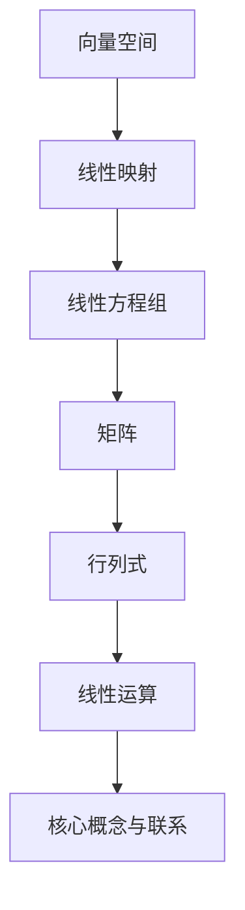

                 

## 《线性代数导引：线性运算》

> **关键词：** 线性代数、矩阵运算、线性方程组、特征值与特征向量、线性变换、矩阵函数、线性运算应用

> **摘要：** 本文系统地介绍了线性代数的基础知识、线性运算的数学模型、核心算法原理，以及线性代数在计算机科学、物理学和金融学等领域的实际应用。通过详细的数学公式、伪代码讲解和项目实战，帮助读者深入理解线性代数的核心概念和运算技巧。

### 目录大纲

# 《线性代数导引：线性运算》

## 第一部分：线性代数基础

### 第1章：线性代数简介

#### 1.1 线性代数的基本概念

#### 1.2 线性代数的发展历史

#### 1.3 线性代数的应用领域

### 第2章：矩阵与行列式

#### 2.1 矩阵的基本概念

#### 2.2 矩阵的运算

#### 2.3 行列式的基本概念

#### 2.4 行列式的性质与计算

### 第3章：向量空间

#### 3.1 向量空间的基本概念

#### 3.2 向量空间的基与维数

#### 3.3 向量空间的子空间

#### 3.4 向量空间的线性相关性

## 第二部分：线性运算

### 第4章：线性方程组

#### 4.1 线性方程组的基本概念

#### 4.2 线性方程组的求解方法

#### 4.3 线性方程组的几何解释

### 第5章：特征值与特征向量

#### 5.1 特征值与特征向量的定义

#### 5.2 特征值的性质与计算

#### 5.3 特征向量的性质与应用

### 第6章：线性变换

#### 6.1 线性变换的基本概念

#### 6.2 线性变换的性质与分类

#### 6.3 线性变换的应用

### 第7章：矩阵函数

#### 7.1 矩阵函数的定义与性质

#### 7.2 常见的矩阵函数

#### 7.3 矩阵函数的应用

### 第8章：线性运算的综合应用

#### 8.1 线性运算在物理学中的应用

#### 8.2 线性运算在计算机科学中的应用

#### 8.3 线性运算在其他领域中的应用

## 第三部分：线性代数拓展

### 第9章：矩阵分析

#### 9.1 矩阵的范数

#### 9.2 矩阵的谱半径

#### 9.3 矩阵的谱分解

### 第10章：线性代数在微分方程中的应用

#### 10.1 线性微分方程的基本概念

#### 10.2 线性微分方程组的求解方法

#### 10.3 线性微分方程的应用

### 第11章：线性代数在信号处理中的应用

#### 11.1 信号处理的基本概念

#### 11.2 信号的表示与变换

#### 11.3 信号的滤波与压缩

### 第12章：线性代数在优化问题中的应用

#### 12.1 优化问题的基本概念

#### 12.2 线性规划的基本算法

#### 12.3 对偶理论与灵敏度分析

## 附录

### 附录A：线性代数常用公式

#### A.1 行列式的基本性质

#### A.2 矩阵的基本性质

#### A.3 向量空间的基本性质

### 附录B：线性代数学习资源

#### B.1 线性代数教材推荐

#### B.2 线性代数在线课程推荐

#### B.3 线性代数学习网站推荐

### 第1章：线性代数的基本概念与联系

#### 1.1 线性代数的定义

线性代数是数学的一个分支，主要研究向量空间、线性映射、线性方程组以及相关的算子理论。线性代数不仅是一门抽象的数学理论，同时也是许多工程和科学领域的重要工具。线性代数的基本对象包括向量、矩阵和行列式，它们在描述和解决各种实际问题时扮演着关键角色。

#### 1.2 线性代数的核心概念

- **向量**：向量是线性代数的基本元素，用于表示空间中的点或方向。向量可以看作是数轴上的一个箭头，它有大小和方向两个属性。在数学中，向量通常表示为一个有序数组，例如 $\vec{v} = (v_1, v_2, ..., v_n)$。
  
- **矩阵**：矩阵是一个由 m 行和 n 列元素排列而成的矩形阵列。矩阵可以用于表示线性变换、系统状态等。例如，矩阵 $A$ 可以表示为：

$$
A = \begin{bmatrix}
a_{11} & a_{12} & \cdots & a_{1n} \\
a_{21} & a_{22} & \cdots & a_{2n} \\
\vdots & \vdots & \ddots & \vdots \\
a_{m1} & a_{m2} & \cdots & a_{mn}
\end{bmatrix}
$$

- **行列式**：行列式是矩阵的一种特性指标，用于判断矩阵的行列式为零时，线性方程组有无解。二阶行列式的计算公式为：

$$
\begin{vmatrix}
a & b \\
c & d
\end{vmatrix}
=
ad - bc
$$

对于 n 阶行列式，可以使用拉普拉斯展开或高斯消元法进行计算。

#### 1.3 线性代数的基本架构

- **向量空间**：向量空间是定义了可以进行的加法和标量乘法运算的集合。向量空间的基与维数是向量空间的核心概念，基是向量空间中线性无关的向量集合，维数是基中向量的数量。

- **线性映射**：线性映射是从一个向量空间到另一个向量空间的函数，保持加法和标量乘法的运算。线性映射可以用矩阵表示，矩阵的每一列对应于原空间中的一个基向量，每一行对应于像空间中的一个基向量。

- **线性方程组**：线性方程组由一组线性映射组成，可以表示为矩阵形式。求解线性方程组是线性代数中的一个重要问题，常用的方法包括高斯消元法和迭代法。

#### 1.4 线性代数的Mermaid流程图

以下是一个简单的线性代数架构的Mermaid流程图：

### 第2章：矩阵与行列式

#### 2.1 矩阵的基本概念

矩阵是线性代数中非常重要的概念之一。它由一组数字按照特定的排列方式组成，这些数字被称为矩阵的元素。矩阵可以用于表示线性变换、系统状态等。矩阵的基本概念包括矩阵的阶、元素、行和列等。

- **矩阵的阶**：矩阵的阶由其行数和列数决定。一个 m 行 n 列的矩阵被称为 m 阶 n 列矩阵。

- **矩阵的元素**：矩阵的元素是位于矩阵中的数字。每个元素都可以用行号和列号来表示，例如，矩阵 A 的第 i 行第 j 列的元素表示为 $a_{ij}$。

- **矩阵的行和列**：矩阵的行是指矩阵中的水平元素序列，矩阵的列是指矩阵中的垂直元素序列。一个 m 行 n 列的矩阵有 m 行和 n 列。

以下是一个 3 行 4 列的矩阵示例：

$$
A = \begin{bmatrix}
1 & 2 & 3 & 4 \\
5 & 6 & 7 & 8 \\
9 & 10 & 11 & 12
\end{bmatrix}
$$

在这个例子中，矩阵 A 有 3 行和 4 列，其元素分别为 $a_{11}, a_{12}, a_{13}, a_{14}, a_{21}, a_{22}, a_{23}, a_{24}, a_{31}, a_{32}, a_{33}, a_{34}$。

#### 2.2 矩阵的运算

矩阵的运算包括矩阵的加法、减法、乘法、转置等。这些运算是线性代数中的基本运算，可以用于解决各种实际问题。

- **矩阵的加法**：两个矩阵相加是指对应位置的元素相加。只有当两个矩阵的阶相同时，才能进行矩阵加法。矩阵加法满足交换律和结合律。

$$
A + B = \begin{bmatrix}
a_{11} + b_{11} & a_{12} + b_{12} & \cdots & a_{1n} + b_{1n} \\
a_{21} + b_{21} & a_{22} + b_{22} & \cdots & a_{2n} + b_{2n} \\
\vdots & \vdots & \ddots & \vdots \\
a_{m1} + b_{m1} & a_{m2} + b_{m2} & \cdots & a_{mn} + b_{mn}
\end{bmatrix}
$$

- **矩阵的减法**：两个矩阵相减是指对应位置的元素相减。同样，只有当两个矩阵的阶相同时，才能进行矩阵减法。矩阵减法满足交换律和结合律。

$$
A - B = \begin{bmatrix}
a_{11} - b_{11} & a_{12} - b_{12} & \cdots & a_{1n} - b_{1n} \\
a_{21} - b_{21} & a_{22} - b_{22} & \cdots & a_{2n} - b_{2n} \\
\vdots & \vdots & \ddots & \vdots \\
a_{m1} - b_{m1} & a_{m2} - b_{m2} & \cdots & a_{mn} - b_{mn}
\end{bmatrix}
$$

- **矩阵的乘法**：两个矩阵相乘是指对应位置的元素相乘，并按列相加。只有当第一个矩阵的列数与第二个矩阵的行数相等时，才能进行矩阵乘法。矩阵乘法满足结合律，但不满足交换律。

$$
AB = \begin{bmatrix}
\sum_{j=1}^{n} (a_{1j}b_{j1}) & \sum_{j=1}^{n} (a_{1j}b_{j2}) & \cdots & \sum_{j=1}^{n} (a_{1j}b_{jn}) \\
\sum_{j=1}^{n} (a_{2j}b_{j1}) & \sum_{j=1}^{n} (a_{2j}b_{j2}) & \cdots & \sum_{j=1}^{n} (a_{2j}b_{jn}) \\
\vdots & \vdots & \ddots & \vdots \\
\sum_{j=1}^{n} (a_{mj}b_{j1}) & \sum_{j=1}^{n} (a_{mj}b_{j2}) & \cdots & \sum_{j=1}^{n} (a_{mj}b_{jn})
\end{bmatrix}
$$

- **矩阵的转置**：矩阵的转置是指将矩阵的行和列交换位置。一个 m 行 n 列的矩阵 A 的转置矩阵 A^T 是一个 n 行 m 列的矩阵，其中 A^T 的第 i 行第 j 列的元素是 A 的第 j 行第 i 列的元素。

$$
A^T = \begin{bmatrix}
a_{11} & a_{21} & \cdots & a_{m1} \\
a_{12} & a_{22} & \cdots & a_{m2} \\
\vdots & \vdots & \ddots & \vdots \\
a_{1n} & a_{2n} & \cdots & a_{mn}
\end{bmatrix}
$$

#### 2.3 行列式的基本概念

行列式是矩阵的一种特性指标，用于判断矩阵的行列式为零时，线性方程组有无解。行列式可以用符号 $\det(A)$ 或 $|A|$ 表示。

- **二阶行列式**：二阶行列式由两个元素的乘积之差组成。例如，对于矩阵 $A$：

$$
A = \begin{bmatrix}
a & b \\
c & d
\end{bmatrix}
$$

其二阶行列式为：

$$
\det(A) = \begin{vmatrix}
a & b \\
c & d
\end{vmatrix}
=
ad - bc
$$

- **n阶行列式**：n阶行列式可以通过递归方式定义。对于 n 阶矩阵 $A$：

$$
A = \begin{bmatrix}
a_{11} & a_{12} & \cdots & a_{1n} \\
a_{21} & a_{22} & \cdots & a_{2n} \\
\vdots & \vdots & \ddots & \vdots \\
a_{m1} & a_{m2} & \cdots & a_{mn}
\end{bmatrix}
$$

其 n 阶行列式可以通过拉普拉斯展开计算。例如，对于第二行：

$$
\det(A) = a_{21}\begin{vmatrix}
a_{11} & a_{13} & \cdots & a_{1n} \\
a_{31} & a_{33} & \cdots & a_{3n} \\
\vdots & \vdots & \ddots & \vdots \\
a_{m1} & a_{m3} & \cdots & a_{mn}
\end{vmatrix}
-
a_{22}\begin{vmatrix}
a_{11} & a_{12} & \cdots & a_{1n} \\
a_{31} & a_{32} & \cdots & a_{3n} \\
\vdots & \vdots & \ddots & \vdots \\
a_{m1} & a_{m2} & \cdots & a_{mn}
\end{vmatrix}
+
\cdots +
(-1)^{m-1}a_{2m}\begin{vmatrix}
a_{11} & a_{12} & \cdots & a_{1n} \\
a_{31} & a_{32} & \cdots & a_{3n} \\
\vdots & \vdots & \ddots & \vdots \\
a_{m1} & a_{m2} & \cdots & a_{mn}
\end{vmatrix}
$$

#### 2.4 行列式的性质与计算

行列式具有一些重要的性质，这些性质在计算行列式时非常有用。

- **行列式的线性性质**：行列式对矩阵的每一行（或每一列）都是线性的。这意味着可以将行列式的某一行（或一列）乘以一个常数，然后将其添加（或减去）到另一行（或另一列），行列式的值不变。

- **行列式的乘法性质**：两个矩阵的行列式等于它们对应元素的乘积的行列式。例如，对于矩阵 $A$ 和 $B$：

$$
\det(AB) = \det(A)\det(B)
$$

- **行列式的交换律**：如果交换矩阵的两行（或两列），行列式的符号将改变。即：

$$
\det(A) = (-1)^{i+j}\det(A')
$$

其中 $A'$ 是通过交换矩阵 $A$ 的第 i 行和第 j 列得到的矩阵。

- **行列式的范数性质**：行列式的绝对值是其元素的绝对值之积的绝对值。即：

$$
|\det(A)| = \prod_{i=1}^{m}\prod_{j=1}^{n} |a_{ij}|
$$

- **行列式的消元性质**：通过高斯消元法，可以将矩阵化为简化行阶梯形矩阵，从而计算其行列式的值。

$$
\det(A) = \prod_{i=1}^{m}d_i
$$

其中 $d_i$ 是第 i 行的系数。

#### 2.5 矩阵与行列式的联系

矩阵和行列式之间有着密切的联系。行列式可以看作是矩阵的一种特殊表示。具体来说，一个矩阵的行列式是其自身的特征值之一。对于 n 阶矩阵 $A$，其特征多项式为：

$$
p(\lambda) = \det(A - \lambda I)
$$

其中 $I$ 是 n 阶单位矩阵。特征多项式的根即为矩阵的特征值。对于实对称矩阵，其特征值都是实数。

行列式在求解线性方程组时也非常有用。如果一个矩阵的行列式为零，则该矩阵对应的线性方程组无解。反之，如果一个矩阵的行列式非零，则该矩阵对应的线性方程组有唯一解。

#### 2.6 行列式的应用

行列式在许多实际问题中有着广泛的应用。

- **求解线性方程组**：行列式可以用来判断线性方程组是否有解。如果矩阵的行列式为零，则线性方程组无解。否则，可以使用高斯消元法求解线性方程组。

- **计算矩阵的秩**：矩阵的秩等于其最大非零子行列式的阶数。

- **计算矩阵的逆**：如果一个矩阵可逆，则其逆矩阵的行列式等于原矩阵行列式的倒数。

- **判断矩阵的正定性**：如果一个矩阵的所有主子行列式都大于零，则该矩阵为正定矩阵。

#### 2.7 矩阵与行列式的练习题

1. 计算以下矩阵的行列式：

$$
A = \begin{bmatrix}
1 & 2 \\
3 & 4
\end{bmatrix}
$$

2. 判断以下矩阵是否有逆矩阵：

$$
B = \begin{bmatrix}
1 & 1 \\
1 & 2
\end{bmatrix}
$$

3. 求解以下线性方程组：

$$
\begin{cases}
2x + 3y = 8 \\
4x - y = 1
\end{cases}
$$

4. 计算以下矩阵的秩：

$$
C = \begin{bmatrix}
1 & 2 & 3 \\
4 & 5 & 6 \\
7 & 8 & 9
\end{bmatrix}
$$

5. 判断以下矩阵是否为正定矩阵：

$$
D = \begin{bmatrix}
2 & 1 & 1 \\
1 & 2 & 1 \\
1 & 1 & 2
\end{bmatrix}
$$

### 第3章：向量空间

#### 3.1 向量空间的基本概念

向量空间是线性代数中的一个核心概念，它是一组向量的集合，这些向量满足特定的加法和标量乘法运算。向量空间也被称为线性空间，因为它保留了线性运算的基本性质。

- **向量空间（Linear Space）**：一个非空的集合 $V$，其中包含了向量，并且定义了两种运算：向量加法（加法运算）和标量与向量的乘法（数乘运算）。满足以下条件的集合 $V$ 被称为向量空间：

  1. **封闭性**：对于任意的向量 $\vec{u}, \vec{v} \in V$，它们的和 $\vec{u} + \vec{v}$ 也在 $V$ 中。
  2. **分配律**：对于任意的向量 $\vec{u}, \vec{v} \in V$ 和标量 $\alpha, \beta$，有 $(\alpha + \beta)\vec{u} + \alpha\vec{v} = \alpha\vec{u} + \beta\vec{v}$。
  3. **结合律**：对于任意的向量 $\vec{u}, \vec{v} \in V$ 和标量 $\alpha$，有 $\alpha(\vec{u} + \vec{v}) = \alpha\vec{u} + \alpha\vec{v}$。
  4. **数乘分配律**：对于任意的向量 $\vec{u}, \vec{v} \in V$ 和标量 $\alpha, \beta$，有 $(\alpha\beta)\vec{u} = \alpha(\beta\vec{u})$。
  5. **零元素**：存在一个零向量 $\vec{0}$，使得对于任意的向量 $\vec{u} \in V$，有 $\vec{u} + \vec{0} = \vec{u}$。
  6. **逆元素**：对于任意的非零向量 $\vec{u} \in V$，存在一个向量 $-\vec{u} \in V$，使得 $\vec{u} + (-\vec{u}) = \vec{0}$。

- **向量加法**：向量加法是一种结合两个向量的运算，结果是一个新向量。向量加法满足交换律和结合律。

$$
\vec{u} + \vec{v} = \vec{v} + \vec{u}
$$

$$
(\vec{u} + \vec{v}) + \vec{w} = \vec{u} + (\vec{v} + \vec{w})
$$

- **标量乘法**：标量乘法是一种将向量与标量相乘的运算，结果仍然是一个向量。标量乘法满足结合律和分配律。

$$
\alpha(\beta\vec{u}) = (\alpha\beta)\vec{u}
$$

$$
(\alpha + \beta)\vec{u} = \alpha\vec{u} + \beta\vec{u}
$$

- **线性组合**：向量空间中的向量可以通过其他向量的线性组合来表示。一个向量 $\vec{u}$ 可以表示为：

$$
\vec{u} = \alpha_1\vec{v}_1 + \alpha_2\vec{v}_2 + \cdots + \alpha_n\vec{v}_n
$$

其中 $\vec{v}_1, \vec{v}_2, ..., \vec{v}_n$ 是向量空间中的向量，$\alpha_1, \alpha_2, ..., \alpha_n$ 是标量。

#### 3.2 向量空间的基与维数

向量空间的基和维数是描述向量空间性质的重要概念。

- **基（Basis）**：向量空间 $V$ 的一个基是 $V$ 中的一组线性无关的向量，这组向量可以生成 $V$ 中的所有向量。换句话说，任何向量 $v \in V$ 可以唯一地表示为基向量的线性组合。向量空间的基必须满足以下条件：

  1. **线性无关性**：基向量之间不存在线性关系，即不存在一组不全为零的标量 $\alpha_1, \alpha_2, ..., \alpha_n$ 使得 $\alpha_1\vec{v}_1 + \alpha_2\vec{v}_2 + \cdots + \alpha_n\vec{v}_n = \vec{0}$。
  2. **生成性**：基向量可以生成向量空间中的所有向量，即对于任意的 $v \in V$，存在一组标量 $\alpha_1, \alpha_2, ..., \alpha_n$ 使得 $v = \alpha_1\vec{v}_1 + \alpha_2\vec{v}_2 + \cdots + \alpha_n\vec{v}_n$。

- **维数（Dimension）**：向量空间的维数是基向量的数量。如果一个向量空间有基 $\vec{v}_1, \vec{v}_2, ..., \vec{v}_n$，则该向量空间的维数为 $n$。零向量空间没有基，因此其维数为 0。

#### 3.3 向量空间的子空间

向量空间的子空间是向量空间的一个子集，它本身也是一个向量空间。子空间必须满足以下条件：

- **包含零向量**：子空间必须包含零向量。
- **封闭性**：对于子空间中的任意两个向量 $\vec{u}, \vec{v}$ 和任意标量 $\alpha$，它们的和 $\vec{u} + \vec{v}$ 和标量乘积 $\alpha\vec{u}$ 也必须属于子空间。

#### 3.4 向量空间的线性相关性

向量空间的线性相关性是描述向量之间关系的一个概念。

- **线性相关**：如果向量空间 $V$ 中的一组向量 $\vec{v}_1, \vec{v}_2, ..., \vec{v}_n$ 中存在一组不全为零的标量 $\alpha_1, \alpha_2, ..., \alpha_n$ 使得 $\alpha_1\vec{v}_1 + \alpha_2\vec{v}_2 + \cdots + \alpha_n\vec{v}_n = \vec{0}$，则这些向量是线性相关的。
- **线性无关**：如果向量空间 $V$ 中的一组向量 $\vec{v}_1, \vec{v}_2, ..., \vec{v}_n$ 中不存在一组不全为零的标量 $\alpha_1, \alpha_2, ..., \alpha_n$ 使得 $\alpha_1\vec{v}_1 + \alpha_2\vec{v}_2 + \cdots + \alpha_n\vec{v}_n = \vec{0}$，则这些向量是线性无关的。

### 第4章：线性方程组

#### 4.1 线性方程组的基本概念

线性方程组是由一组线性方程构成的系统。线性方程组的每一个方程都是一次方程，即方程中的每个变量的指数都是1。线性方程组可以用矩阵形式表示。

- **线性方程组的矩阵形式**：给定 m 个线性方程和 n 个变量，可以写成如下矩阵形式：

$$
\begin{cases}
a_{11}x_1 + a_{12}x_2 + \cdots + a_{1n}x_n = b_1 \\
a_{21}x_1 + a_{22}x_2 + \cdots + a_{2n}x_n = b_2 \\
\vdots \\
a_{m1}x_1 + a_{m2}x_2 + \cdots + a_{mn}x_n = b_m
\end{cases}
$$

可以表示为：

$$
\begin{bmatrix}
a_{11} & a_{12} & \cdots & a_{1n} \\
a_{21} & a_{22} & \cdots & a_{2n} \\
\vdots & \vdots & \ddots & \vdots \\
a_{m1} & a_{m2} & \cdots & a_{mn}
\end{bmatrix}
\begin{bmatrix}
x_1 \\
x_2 \\
\vdots \\
x_n
\end{bmatrix}
=
\begin{bmatrix}
b_1 \\
b_2 \\
\vdots \\
b_m
\end{bmatrix}
$$

其中，系数矩阵 $A$ 是一个 $m \times n$ 的矩阵，变量向量 $X$ 是一个 $n \times 1$ 的矩阵，常数向量 $B$ 是一个 $m \times 1$ 的矩阵。

- **线性方程组的解**：线性方程组有解的条件取决于系数矩阵 $A$ 的秩和常数向量 $B$ 的秩。具体来说，有以下几种情况：

  1. **唯一解**：如果系数矩阵 $A$ 的秩等于变量数 $n$，则线性方程组有唯一解。
  2. **无穷多解**：如果系数矩阵 $A$ 的秩小于变量数 $n$，则线性方程组有无穷多解。
  3. **无解**：如果系数矩阵 $A$ 的秩不等于常数向量 $B$ 的秩，则线性方程组无解。

#### 4.2 线性方程组的求解方法

线性方程组的求解方法包括高斯消元法、矩阵的逆、行列式等方法。

- **高斯消元法**：高斯消元法是一种通过初等行变换将系数矩阵化为简化行阶梯形矩阵的方法。简化行阶梯形矩阵的形式如下：

$$
\begin{bmatrix}
1 & 0 & \cdots & 0 & r_1 \\
0 & 1 & \cdots & 0 & r_2 \\
\vdots & \vdots & \ddots & \vdots & \vdots \\
0 & 0 & \cdots & 1 & r_n \\
0 & 0 & \cdots & 0 & r_{n+1}
\end{bmatrix}
$$

其中，$r_1, r_2, \ldots, r_n$ 是主元，$r_{n+1}$ 是自由变量。

通过高斯消元法，可以将线性方程组转化为一系列的一次方程，从而求解变量。具体步骤如下：

1. 对系数矩阵进行初等行变换，将每一列的系数进行归一化，使每一列的第一行元素为1。
2. 对每一列进行初等行变换，使每一列的其他行元素为0。

通过高斯消元法，可以将线性方程组转化为简化行阶梯形矩阵，从而求解变量。

- **矩阵的逆**：如果系数矩阵 $A$ 是可逆的，则可以使用矩阵的逆来求解线性方程组。矩阵的逆可以通过高斯消元法或拉普拉斯展开等方法计算。求解线性方程组的公式为：

$$
X = A^{-1}B
$$

其中，$A^{-1}$ 是系数矩阵 $A$ 的逆矩阵，$B$ 是常数向量。

- **行列式**：行列式可以用来判断线性方程组是否有解。如果系数矩阵 $A$ 的行列式不为零，则线性方程组有唯一解。如果系数矩阵 $A$ 的行列式为零，则线性方程组可能有无穷多解或无解。

$$
\det(A) \neq 0 \Rightarrow \text{线性方程组有唯一解}
$$

$$
\det(A) = 0 \Rightarrow \text{线性方程组可能有无穷多解或无解}
$$

#### 4.3 线性方程组的几何解释

线性方程组在几何上可以表示为平面或空间中的直线或平面的交点。以下是一些特殊情况：

- **两个方程的线性方程组**：在二维空间中，两个线性方程表示两条直线。这两条直线可能有三种交点情况：

  1. **无交点**：两条直线平行，即斜率相同但截距不同。
  2. **唯一交点**：两条直线相交，即斜率不同。
  3. **无穷多交点**：两条直线重合，即斜率和截距都相同。

- **三个方程的线性方程组**：在三维空间中，三个线性方程表示三个平面。这三个平面可能有多种交点情况：

  1. **无交点**：三个平面平行或共面但不相交。
  2. **唯一交点**：三个平面相交于一个点。
  3. **无穷多交点**：两个平面相交，第三个平面与这两个平面的交线重合。

通过几何解释，可以更直观地理解线性方程组的解的情况。

### 第5章：特征值与特征向量

#### 5.1 特征值与特征向量的定义

特征值与特征向量是矩阵分析中的核心概念，它们描述了矩阵的线性变换的性质。以下是特征值与特征向量的定义：

- **特征值（Eigenvalue）**：给定一个矩阵 $A$，如果存在一个非零向量 $\vec{v}$ 和一个标量 $\lambda$，使得矩阵 $A$ 与向量 $\vec{v}$ 的乘积等于 $\lambda$ 倍的向量 $\vec{v}$，则称 $\lambda$ 为矩阵 $A$ 的一个特征值，$\vec{v}$ 为对应的特征向量。数学上，这个关系可以表示为：

$$
A\vec{v} = \lambda\vec{v}
$$

- **特征向量（Eigenvector）**：与特征值对应的非零向量 $\vec{v}$ 称为特征向量。需要注意的是，对于同一个特征值，可以有多个不同的特征向量，但它们都在同一个方向上。

#### 5.2 特征值的性质与计算

特征值具有一些重要的性质，这些性质在矩阵分析中非常有用。以下是特征值的一些基本性质：

- **存在性**：任何方阵都至少有一个特征值。对于实数域上的方阵，总是存在至少一个实特征值。
- **唯一性**：对于给定的方阵，每个特征值都是唯一的，除了可能的重根。
- **迹与特征值的关系**：方阵 $A$ 的迹（即对角线元素之和）等于其所有特征值的和。

$$
\text{迹}(A) = \sum_{i=1}^{n}\lambda_i
$$

- **行列式与特征值的关系**：方阵 $A$ 的行列式等于其所有特征值的乘积。

$$
\det(A) = \prod_{i=1}^{n}\lambda_i
$$

计算特征值的常用方法是求解特征多项式。特征多项式是矩阵 $A$ 减去一个变量 $\lambda$ 的单位矩阵后的行列式：

$$
p(\lambda) = \det(A - \lambda I)
$$

特征多项式的根即为矩阵 $A$ 的特征值。

#### 5.3 特征向量的性质与应用

特征向量具有以下重要性质：

- **线性无关性**：不同的特征向量是线性无关的。
- **正交性**：如果两个特征向量对应于不同的特征值，则它们是正交的。
- **标准化**：任何特征向量都可以被标准化（即除以其长度）得到一个单位特征向量。

特征向量在矩阵分析中有广泛的应用：

- **对角化**：如果矩阵 $A$ 有 $n$ 个线性无关的特征向量，则 $A$ 可以被对角化，即存在一个可逆矩阵 $P$，使得 $P^{-1}AP$ 是一个对角矩阵。

$$
P^{-1}AP = \begin{bmatrix}
\lambda_1 & 0 & \cdots & 0 \\
0 & \lambda_2 & \cdots & 0 \\
\vdots & \vdots & \ddots & \vdots \\
0 & 0 & \cdots & \lambda_n
\end{bmatrix}
$$

- **特征向量的几何意义**：特征向量表示了矩阵 $A$ 的线性变换在向量空间中的主轴方向。特征值表示了该方向上的伸缩因子。

#### 5.4 特征值与特征向量的计算实例

以下是一个计算特征值和特征向量的实例：

给定矩阵：

$$
A = \begin{bmatrix}
2 & 1 \\
1 & 2
\end{bmatrix}
$$

首先求解特征多项式：

$$
p(\lambda) = \det(A - \lambda I) = \det\begin{bmatrix}
2 - \lambda & 1 \\
1 & 2 - \lambda
\end{bmatrix} = (2 - \lambda)^2 - 1 = \lambda^2 - 4\lambda + 3
$$

特征多项式的根为：

$$
\lambda_1 = 1, \quad \lambda_2 = 3
$$

对于 $\lambda_1 = 1$，求解对应的特征向量：

$$
(A - \lambda_1 I)\vec{v} = 0 \Rightarrow \begin{bmatrix}
1 & 1 \\
1 & 1
\end{bmatrix}\vec{v} = \vec{0}
$$

得到特征向量：

$$
\vec{v}_1 = \begin{bmatrix}
-1 \\
1
\end{bmatrix}
$$

对于 $\lambda_2 = 3$，求解对应的特征向量：

$$
(A - \lambda_2 I)\vec{v} = 0 \Rightarrow \begin{bmatrix}
-1 & 1 \\
1 & -1
\end{bmatrix}\vec{v} = \vec{0}
$$

得到特征向量：

$$
\vec{v}_2 = \begin{bmatrix}
1 \\
1
\end{bmatrix}
$$

### 第6章：线性变换

#### 6.1 线性变换的基本概念

线性变换是数学和工程领域中的一个核心概念，它描述了从一个向量空间到另一个向量空间的一种保持线性性质的特殊映射。以下是线性变换的基本定义和性质：

- **定义**：给定两个向量空间 $V$ 和 $W$，一个从 $V$ 到 $W$ 的函数 $T$ 被称为线性变换，如果它满足以下两个条件：

  1. **加法保持**：对于任意 $u, v \in V$，有 $T(u + v) = T(u) + T(v)$。
  2. **数乘保持**：对于任意标量 $\alpha$ 和 $u \in V$，有 $T(\alpha u) = \alpha T(u)$。

  数学上，可以表示为：

  $$
  T(\alpha u + \beta v) = \alpha T(u) + \beta T(v)
  $$

- **性质**：

  1. **线性变换保持线性组合**：如果 $u_1, u_2, ..., u_n$ 是 $V$ 中的向量，$\alpha_1, \alpha_2, ..., \alpha_n$ 是标量，则 $T(\alpha_1 u_1 + \alpha_2 u_2 + ... + \alpha_n u_n) = \alpha_1 T(u_1) + \alpha_2 T(u_2) + ... + \alpha_n T(u_n)$。
  2. **线性变换保持零元素**：对于任意 $u \in V$，有 $T(0) = 0$。
  3. **线性变换保持向量加法**：对于任意 $u, v \in V$，有 $T(u + v) = T(u) + T(v)$。
  4. **线性变换保持数乘**：对于任意标量 $\alpha$ 和 $u \in V$，有 $T(\alpha u) = \alpha T(u)$。

#### 6.2 线性变换的性质与分类

线性变换具有一些重要的性质，这些性质使它们在数学分析和物理建模中非常重要。以下是线性变换的一些性质：

- **线性变换保持线性组合**：如果 $u_1, u_2, ..., u_n$ 是 $V$ 中的向量，$\alpha_1, \alpha_2, ..., \alpha_n$ 是标量，则 $T(\alpha_1 u_1 + \alpha_2 u_2 + ... + \alpha_n u_n) = \alpha_1 T(u_1) + \alpha_2 T(u_2) + ... + \alpha_n T(u_n)$。
- **线性变换保持零元素**：对于任意 $u \in V$，有 $T(0) = 0$。
- **线性变换保持向量加法**：对于任意 $u, v \in V$，有 $T(u + v) = T(u) + T(v)$。
- **线性变换保持数乘**：对于任意标量 $\alpha$ 和 $u \in V$，有 $T(\alpha u) = \alpha T(u)$。

根据线性变换的定义和性质，可以将线性变换分为以下几种类型：

1. **恒等变换**：对于任意向量 $u \in V$，恒有 $T(u) = u$。恒等变换是一个特殊的线性变换，其特征向量是 $V$ 中的所有向量。
2. **零变换**：对于任意向量 $u \in V$，恒有 $T(u) = 0$。零变换是一个特殊的线性变换，其特征值为 0。
3. **可逆变换**：如果存在一个线性变换 $S$，使得 $S \circ T = T \circ S = I$（其中 $I$ 是恒等变换），则 $T$ 是可逆的。可逆变换的特征向量是 $V$ 中的所有非零向量。
4. **非可逆变换**：除了可逆变换之外的线性变换都是非可逆的。非可逆变换的特征向量是 $V$ 中的部分向量。

#### 6.3 线性变换的应用

线性变换在数学、物理、工程等多个领域都有广泛应用。以下是线性变换的一些典型应用：

- **线性代数**：线性变换用于矩阵的相似对角化，求解线性方程组，研究向量空间的结构等。
- **物理学**：线性变换用于描述物理系统的状态变化，如经典力学的平移和旋转，量子力学的态叠加原理等。
- **工程学**：线性变换用于信号处理，图像处理，控制系统分析等。

以下是一个线性变换的应用实例：

**实例**：给定一个线性变换 $T$，其定义域和值域都是二维向量空间，且 $T(\vec{v}) = A\vec{v}$，其中 $A$ 是一个 $2 \times 2$ 的矩阵。假设 $A = \begin{bmatrix} 2 & 1 \\ -1 & 3 \end{bmatrix}$，求解线性变换 $T$ 的特征值和特征向量。

**解**：首先求解特征多项式：

$$
p(\lambda) = \det(A - \lambda I) = \det\begin{bmatrix} 2 - \lambda & 1 \\ -1 & 3 - \lambda \end{bmatrix} = (2 - \lambda)(3 - \lambda) - (-1)(1) = \lambda^2 - 5\lambda + 7
$$

特征多项式的根为：

$$
\lambda_1 = 1, \quad \lambda_2 = 7
$$

对于 $\lambda_1 = 1$，求解对应的特征向量：

$$
(A - \lambda_1 I)\vec{v} = 0 \Rightarrow \begin{bmatrix} 1 & 1 \\ -1 & 2 \end{bmatrix}\vec{v} = \vec{0}
$$

得到特征向量：

$$
\vec{v}_1 = \begin{bmatrix} -1 \\ 1 \end{bmatrix}
$$

对于 $\lambda_2 = 7$，求解对应的特征向量：

$$
(A - \lambda_2 I)\vec{v} = 0 \Rightarrow \begin{bmatrix} -5 & 1 \\ -1 & -4 \end{bmatrix}\vec{v} = \vec{0}
$$

得到特征向量：

$$
\vec{v}_2 = \begin{bmatrix} 1 \\ 1 \end{bmatrix}
$$

因此，线性变换 $T$ 的特征值为 1 和 7，对应的特征向量分别为 $\vec{v}_1 = \begin{bmatrix} -1 \\ 1 \end{bmatrix}$ 和 $\vec{v}_2 = \begin{bmatrix} 1 \\ 1 \end{bmatrix}$。

### 第7章：矩阵函数

#### 7.1 矩阵函数的定义与性质

矩阵函数是矩阵分析中的一个重要概念，它描述了如何将一个矩阵映射到另一个矩阵。矩阵函数的定义与标量函数类似，但需要考虑矩阵的特殊性质。以下是矩阵函数的一些基本定义和性质：

- **定义**：给定一个矩阵 $A$ 和一个标量 $t$，矩阵函数 $f(t)$ 是一个映射，将 $t$ 映射到另一个矩阵。例如，常用的矩阵函数包括矩阵的幂函数、指数函数、对数函数等。

  $$ f(t) = A^t = A \times A \times \cdots \times A \quad (\text{t次方}) $$
  
  $$ f(t) = e^A = \sum_{n=0}^{\infty} \frac{A^n}{n!} \quad (\text{指数函数}) $$
  
  $$ f(t) = \ln(A) \quad (\text{对数函数}) $$

- **性质**：

  1. **可加性**：对于任意矩阵 $A$ 和标量 $t, s$，有 $f(t + s) = f(t) + f(s)$。
  2. **线性性**：对于任意矩阵 $A$ 和标量 $\alpha, \beta$，有 $f(\alpha A + \beta B) = \alpha f(A) + \beta f(B)$。
  3. **链式法则**：对于矩阵函数 $f(g(t))$，有 $f(g(t)) = f'(g(t))g'(t)$，其中 $f'$ 和 $g'$ 分别是 $f$ 和 $g$ 的导数。

#### 7.2 常见的矩阵函数

以下是几种常见的矩阵函数：

- **幂函数**：矩阵的幂函数是将矩阵自身乘以自身多次的结果。对于方阵 $A$，$A^2$ 表示 $A$ 与自身相乘，$A^3$ 表示 $A^2$ 与 $A$ 相乘，依此类推。

$$ A^n = \underbrace{A \times A \times \cdots \times A}_{n \text{次}} $$

- **指数函数**：矩阵的指数函数是矩阵幂级数的和。对于方阵 $A$，其指数函数可以表示为：

$$ e^A = \sum_{n=0}^{\infty} \frac{A^n}{n!} $$

- **对数函数**：矩阵的对数函数是指数函数的逆。对于方阵 $A$，其矩阵对数可以表示为：

$$ \ln(A) = \sum_{n=1}^{\infty} \frac{(-1)^{n-1}}{n} (A-I)^n $$

其中 $I$ 是单位矩阵。

- **三角函数**：矩阵的三角函数包括正弦、余弦、正切等。例如，矩阵的余弦函数可以表示为：

$$ \cos(A) = \frac{e^{iA} + e^{-iA}}{2} $$

其中 $i$ 是虚数单位。

#### 7.3 矩阵函数的应用

矩阵函数在数学、工程和科学中有着广泛的应用：

- **物理学**：在量子力学中，矩阵函数用于描述粒子的状态演化，如薛定谔方程。

- **控制理论**：在控制系统分析中，矩阵函数用于描述系统的动态行为，如状态空间方程。

- **信号处理**：在信号处理中，矩阵函数用于信号滤波、变换和压缩。

- **统计学**：在统计学中，矩阵函数用于概率分布的推导和模型估计。

以下是一个矩阵函数应用的例子：

**实例**：计算矩阵 $A = \begin{bmatrix} 1 & 2 \\ 3 & 4 \end{bmatrix}$ 的指数函数 $e^A$。

**解**：使用矩阵幂级数展开：

$$ e^A = I + A + \frac{A^2}{2!} + \frac{A^3}{3!} + \cdots $$

计算矩阵的幂：

$$ A^2 = \begin{bmatrix} 1 & 2 \\ 3 & 4 \end{bmatrix} \begin{bmatrix} 1 & 2 \\ 3 & 4 \end{bmatrix} = \begin{bmatrix} 7 & 10 \\ 15 & 22 \end{bmatrix} $$

$$ A^3 = A^2 \cdot A = \begin{bmatrix} 7 & 10 \\ 15 & 22 \end{bmatrix} \begin{bmatrix} 1 & 2 \\ 3 & 4 \end{bmatrix} = \begin{bmatrix} 43 & 58 \\ 97 & 130 \end{bmatrix} $$

代入指数函数的级数展开：

$$ e^A = \begin{bmatrix} 1 & 0 \\ 0 & 1 \end{bmatrix} + \begin{bmatrix} 1 & 2 \\ 3 & 4 \end{bmatrix} + \frac{1}{2} \begin{bmatrix} 7 & 10 \\ 15 & 22 \end{bmatrix} + \frac{1}{6} \begin{bmatrix} 43 & 58 \\ 97 & 130 \end{bmatrix} + \cdots $$

结果为：

$$ e^A = \begin{bmatrix} 1 + 1 + \frac{7}{2} + \frac{43}{6} & 2 + 2 + \frac{10}{2} + \frac{58}{6} \\ 3 + 3 + \frac{15}{2} + \frac{97}{6} & 4 + 4 + \frac{22}{2} + \frac{130}{6} \end{bmatrix} $$

$$ e^A = \begin{bmatrix} \frac{19}{3} & \frac{50}{3} \\ \frac{53}{3} & \frac{152}{3} \end{bmatrix} $$

### 第8章：线性运算的综合应用

#### 8.1 线性运算在物理学中的应用

线性运算在物理学中有着广泛的应用，特别是在描述力、运动、场等物理现象时。以下是一些具体的例子：

- **牛顿第二定律**：牛顿第二定律可以表示为：

$$ F = m \cdot a $$

其中 $F$ 是力，$m$ 是质量，$a$ 是加速度。这是一个线性关系，表示力与加速度成正比。

- **电场**：在电场中，电场强度 $E$ 与电荷密度 $\rho$ 的关系可以表示为：

$$ E = \frac{\rho}{\epsilon_0} $$

其中 $\epsilon_0$ 是真空中的电容率。这是一个线性关系，表示电场强度与电荷密度成正比。

- **流体动力学**：在流体动力学中，流体的速度场 $u$ 可以通过纳维-斯托克斯方程描述：

$$ \rho \frac{\partial u}{\partial t} + (\mathbf{u} \cdot \nabla) \mathbf{u} = -\frac{\nabla p}{\rho} + \nu \nabla^2 \mathbf{u} $$

这是一个线性方程，描述了流体速度场如何随着时间演化。

- **波动方程**：波动方程是描述波传播的线性方程，例如，一维波动方程可以表示为：

$$ \frac{\partial^2 u}{\partial t^2} = c^2 \frac{\partial^2 u}{\partial x^2} $$

其中 $c$ 是波速，$u$ 是位移。这是一个线性偏微分方程，描述了波在空间和时间上的传播。

#### 8.2 线性运算在计算机科学中的应用

线性运算在计算机科学中有着广泛的应用，特别是在算法设计、图像处理、机器学习等领域。以下是一些具体的例子：

- **算法设计**：许多算法可以表示为线性运算，例如，快速排序算法中涉及的比较和交换操作可以看作是线性运算。

- **图像处理**：在图像处理中，线性运算被广泛应用于滤波、增强、变换等操作。例如，卷积操作是一种常见的线性运算，用于图像滤波和边缘检测。

- **机器学习**：在机器学习中，线性运算被广泛应用于线性回归、支持向量机、神经网络等算法中。线性运算可以用于计算特征空间的变换，优化模型参数等。

以下是一个线性运算在计算机科学中的应用例子：

**实例**：使用线性代数方法解决线性回归问题。

**问题描述**：给定一组数据点 $(x_1, y_1), (x_2, y_2), ..., (x_n, y_n)$，找到一条直线 $y = mx + b$，使得这些点的误差平方和最小。

**解法**：首先，将数据表示为矩阵形式：

$$
X = \begin{bmatrix}
x_1 & 1 \\
x_2 & 1 \\
\vdots & \vdots \\
x_n & 1
\end{bmatrix},
Y = \begin{bmatrix}
y_1 \\
y_2 \\
\vdots \\
y_n
\end{bmatrix}
$$

然后，求解最小二乘问题：

$$
\min_{\theta} \lVert X\theta - Y \rVert^2
$$

其中 $\theta = [\theta_0, \theta_1]^T$ 是模型参数。这是一个线性运算问题，可以通过求解矩阵方程 $X\theta = Y$ 来得到最优解：

$$
\theta = (X^T X)^{-1} X^T Y
$$

计算得到模型参数 $\theta$ 后，可以使用这些参数预测新数据的值。

#### 8.3 线性运算在其他领域中的应用

线性运算在其他领域也有着广泛的应用，例如金融学、经济学、信号处理等。以下是一些具体的例子：

- **金融学**：在金融学中，线性运算被广泛应用于资产定价、风险管理等。例如，资本资产定价模型（CAPM）可以表示为线性方程：

$$
E(R_i) = R_f + \beta_i \cdot \sigma_{m}^2
$$

其中 $E(R_i)$ 是资产 $i$ 的预期收益率，$R_f$ 是无风险收益率，$\beta_i$ 是资产 $i$ 的风险系数，$\sigma_{m}^2$ 是市场风险。

- **经济学**：在经济学中，线性运算被广泛应用于消费行为、生产函数等。例如，线性需求函数可以表示为：

$$
Q = a - bP
$$

其中 $Q$ 是需求量，$P$ 是价格，$a$ 和 $b$ 是常数。

- **信号处理**：在信号处理中，线性运算被广泛应用于滤波、变换、压缩等。例如，傅里叶变换可以表示为线性运算，用于信号的分析和压缩。

以下是一个线性运算在其他领域中的应用例子：

**实例**：使用线性代数方法进行信号滤波。

**问题描述**：给定一个信号 $x(t)$，设计一个滤波器 $h(t)$，使得滤波后的信号 $y(t)$ 满足特定要求。

**解法**：首先，将信号表示为矩阵形式：

$$
X = \begin{bmatrix}
x(t_1) \\
x(t_2) \\
\vdots \\
x(t_n)
\end{bmatrix},
H = \begin{bmatrix}
h(t_1) \\
h(t_2) \\
\vdots \\
h(t_n)
\end{bmatrix}
$$

然后，使用卷积运算进行滤波：

$$
y(t) = x(t) * h(t) = \sum_{k=1}^{n} x(t_k) h(t-t_k)
$$

这可以通过矩阵乘法表示为：

$$
Y = XH^T
$$

其中 $H^T$ 是滤波器 $H$ 的转置矩阵。计算得到滤波后的信号 $Y$。

### 第9章：线性代数拓展

#### 9.1 矩阵的范数

矩阵的范数是矩阵分析中的一个重要概念，它用于衡量矩阵的大小和性质。以下是矩阵范数的基本定义和性质：

- **定义**：给定一个矩阵 $A$，其范数定义为：

  $$
  \|A\| = \sup_{\|x\|=1} \|Ax\|
  $$

  其中 $\|x\|$ 表示向量 $x$ 的范数，$\|Ax\|$ 表示矩阵 $A$ 与向量 $x$ 的乘积的范数。

- **性质**：

  1. **正定性**：$\|A\| \geq 0$，且 $\|A\| = 0$ 当且仅当 $A = 0$。
  2. **齐次性**：$\|kA\| = |k|\|A\|$，其中 $k$ 是一个标量。
  3. **三角不等式**：$\|A + B\| \leq \|A\| + \|B\|$，其中 $A$ 和 $B$ 是矩阵。
  4. **共轭对称性**：$\|A^T\| = \|A\|$，其中 $A^T$ 是矩阵 $A$ 的转置。

常见的矩阵范数包括：

- **Frobenius范数**：$\|A\|_F = \sqrt{\sum_{i=1}^{m}\sum_{j=1}^{n} a_{ij}^2}$，其中 $m$ 和 $n$ 是矩阵 $A$ 的行数和列数。
- **最大范数**：$\|A\|_{\infty} = \max_{1\leq i \leq m, 1\leq j \leq n} |a_{ij}|$。
- **行和范数**：$\|A\|_1 = \max_{1\leq i \leq m} \sum_{j=1}^{n} |a_{ij}|$。
- **列和范数**：$\|A\|_{\infty,1} = \max_{1\leq j \leq n} \sum_{i=1}^{m} |a_{ij}|$。

#### 9.2 矩阵的谱半径

矩阵的谱半径是矩阵分析中另一个重要的概念，它描述了矩阵的稳定性。以下是矩阵谱半径的基本定义和性质：

- **定义**：给定一个矩阵 $A$，其谱半径定义为：

  $$
  \rho(A) = \max_{\lambda} |\lambda| \quad (\lambda \text{ 是 } A \text{ 的特征值})
  $$

- **性质**：

  1. **非负性**：$\rho(A) \geq 0$。
  2. **极限性质**：对于任意矩阵序列 $\{A_n\}$，如果 $\rho(A_n) \to 0$，则 $\rho(A_n - A) \to 0$。
  3. **稳定性**：如果一个矩阵 $A$ 的谱半径小于 1，则该矩阵是稳定的。

#### 9.3 矩阵的谱分解

矩阵的谱分解是矩阵分析中的一个重要工具，它将矩阵分解为对角矩阵和正交矩阵的乘积。以下是矩阵谱分解的基本定义和性质：

- **定义**：给定一个矩阵 $A$，如果存在一个可逆矩阵 $P$ 和一个对角矩阵 $D$，使得 $A = PDP^{-1}$，则称 $A$ 可以进行谱分解。

- **性质**：

  1. **对角性**：矩阵 $A$ 的谱分解形式是 $A = PDP^{-1}$，其中 $D$ 是对角矩阵。
  2. **特征值**：矩阵 $A$ 的特征值是矩阵 $D$ 的对角线元素。
  3. **特征向量**：矩阵 $A$ 的特征向量是矩阵 $P$ 的列向量。

以下是一个矩阵谱分解的例子：

**实例**：给定矩阵 $A = \begin{bmatrix} 2 & 1 \\ -1 & 3 \end{bmatrix}$，进行谱分解。

**解**：首先求解特征多项式：

$$
p(\lambda) = \det(A - \lambda I) = \det\begin{bmatrix} 2 - \lambda & 1 \\ -1 & 3 - \lambda \end{bmatrix} = (2 - \lambda)(3 - \lambda) - (-1)(1) = \lambda^2 - 5\lambda + 7
$$

特征多项式的根为：

$$
\lambda_1 = 1, \quad \lambda_2 = 7
$$

求解对应的特征向量：

对于 $\lambda_1 = 1$：

$$
(A - \lambda_1 I)\vec{v} = 0 \Rightarrow \begin{bmatrix} 1 & 1 \\ -1 & 2 \end{bmatrix}\vec{v} = \vec{0}
$$

得到特征向量：

$$
\vec{v}_1 = \begin{bmatrix} -1 \\ 1 \end{bmatrix}
$$

对于 $\lambda_2 = 7$：

$$
(A - \lambda_2 I)\vec{v} = 0 \Rightarrow \begin{bmatrix} -5 & 1 \\ -1 & -4 \end{bmatrix}\vec{v} = \vec{0}
$$

得到特征向量：

$$
\vec{v}_2 = \begin{bmatrix} 1 \\ 1 \end{bmatrix}
$$

构造对角矩阵 $D$：

$$
D = \begin{bmatrix}
1 & 0 \\
0 & 7
\end{bmatrix}
$$

构造正交矩阵 $P$，其列向量分别为特征向量：

$$
P = \begin{bmatrix}
-1 & 1 \\
1 & 1
\end{bmatrix}
$$

计算得到谱分解：

$$
A = PDP^{-1}
$$

### 第10章：线性代数在微分方程中的应用

#### 10.1 线性微分方程的基本概念

线性微分方程是微分方程的一种重要类型，它涉及未知函数及其导数的一次线性组合。线性微分方程的基本概念如下：

- **定义**：形如

$$
a_n(x)y^{(n)} + a_{n-1}(x)y^{(n-1)} + \cdots + a_1(x)y' + a_0(x)y = f(x)
$$

的微分方程称为线性微分方程。其中 $y^{(n)}$ 表示 $y$ 的 $n$ 阶导数，$a_0(x), a_1(x), \ldots, a_n(x)$ 和 $f(x)$ 是给定的函数。

- **线性性**：线性微分方程的线性性体现在未知函数及其导数的线性组合上，即方程中的每一项都是 $y$ 或其导数的线性函数。

#### 10.2 线性微分方程组的求解方法

线性微分方程组是由多个线性微分方程构成的系统，它可以表示为矩阵形式。以下是几种常见的求解方法：

- **常数变易法**：适用于非齐次线性微分方程组。首先求出对应的齐次方程组的解，然后通过常数变易法求出非齐次方程组的特解。

- **矩阵指数法**：适用于常系数线性微分方程组。通过矩阵指数函数求解方程组。

- **特征值法**：适用于线性微分方程组的对角化。如果微分方程组的系数矩阵可对角化，则可以分别求解对角化后的方程组。

#### 10.3 线性微分方程的应用

线性微分方程在物理、工程、经济学等领域有着广泛的应用。以下是几个应用实例：

- **物理学**：在振动理论中，线性微分方程用于描述弹簧振子、简谐振子等系统的运动。

- **工程学**：在结构力学中，线性微分方程用于分析梁、板、壳等结构的振动特性。

- **经济学**：在宏观经济模型中，线性微分方程用于描述经济变量的动态行为，如人口增长、资本积累等。

以下是一个线性微分方程的应用实例：

**实例**：求解一维热传导方程

$$
\frac{\partial u}{\partial t} = \alpha \frac{\partial^2 u}{\partial x^2}
$$

其中 $u(x, t)$ 表示温度分布，$\alpha$ 是热扩散系数。

**解法**：使用分离变量法，假设解的形式为 $u(x, t) = X(x)T(t)$。代入方程并分离变量，得到两个常微分方程：

$$
X'' + \lambda X = 0
$$

$$
T' + \lambda T = 0
$$

求解这两个方程，得到解的形式：

$$
X(x) = A \cos(\sqrt{\lambda} x) + B \sin(\sqrt{\lambda} x)
$$

$$
T(t) = C e^{-\lambda t}
$$

根据边界条件和初始条件确定常数 $A, B, C$，最终得到温度分布的解。

### 第11章：线性代数在信号处理中的应用

#### 11.1 信号处理的基本概念

信号处理是工程领域中一个重要的分支，它涉及信号的生成、传输、处理和解释。在线性代数的框架下，信号处理可以看作是向量空间中的向量操作。以下是信号处理的一些基本概念：

- **信号**：信号是时间的函数，它可以表示为连续或离散的时间序列。在数学上，信号可以看作是向量空间中的向量。

- **傅里叶变换**：傅里叶变换是信号处理中的一个核心工具，它将信号从时域转换到频域。傅里叶变换可以将复杂的时间序列分解为一系列正弦波和余弦波的组合。

- **卷积**：卷积是信号处理中另一个重要的概念，它描述了两个信号的叠加效果。卷积可以通过线性代数中的矩阵乘法来表示。

- **滤波**：滤波是信号处理中的一个关键步骤，它用于去除信号中的噪声或提取有用的信号成分。滤波可以通过线性代数中的矩阵运算来实现。

- **正交性**：正交性是信号处理中的一个重要性质，它描述了信号之间的一种特殊关系。正交信号可以在不相互干扰的情况下独立存在。

#### 11.2 信号的表示与变换

在线性代数中，信号的表示与变换是信号处理的核心内容。以下是几种常用的信号表示与变换方法：

- **时域表示**：信号的时域表示是最直观的表示方法，它将信号表示为时间序列。例如，一个连续信号 $x(t)$ 可以表示为时间 $t$ 的函数。

- **频域表示**：信号的频域表示将信号转换到频域，以便分析其频率成分。傅里叶变换是最常用的频域变换方法。通过傅里叶变换，可以将时域信号 $x(t)$ 转换为频域信号 $X(f)$。

$$
X(f) = \int_{-\infty}^{\infty} x(t) e^{-j2\pi ft} dt
$$

- **离散傅里叶变换（DFT）**：离散傅里叶变换是傅里叶变换在离散时间序列上的推广。DFT 将离散时间序列 $x(n)$ 转换为频域序列 $X(k)$。

$$
X(k) = \sum_{n=0}^{N-1} x(n) e^{-j2\pi kn/N}
$$

- **离散余弦变换（DCT）**：离散余弦变换是另一种常用的频域变换方法，它适用于时域信号具有偶对称性的情况。

$$
X(k) = \sum_{n=0}^{N-1} x(n) \cos\left(\frac{2\pi kn}{N+1}\right)
$$

#### 11.3 信号的滤波与压缩

在线性代数的框架下，信号的滤波与压缩是信号处理的两个重要环节。以下是几种常用的滤波与压缩方法：

- **低通滤波**：低通滤波是一种常用的滤波方法，它用于去除信号中的高频成分，保留低频成分。低通滤波可以通过线性代数中的矩阵运算实现。

$$
y(n) = x(n) - \sum_{k=1}^{N} h(k) x(n-k)
$$

其中 $h(k)$ 是滤波器的系数。

- **高通滤波**：高通滤波与低通滤波相反，它用于去除信号中的低频成分，保留高频成分。

$$
y(n) = x(n) + \sum_{k=1}^{N} h(k) x(n-k)
$$

- **带通滤波**：带通滤波用于保留信号中特定频率范围内的成分，同时去除其他频率成分。

$$
y(n) = \sum_{k=1}^{N} h(k) x(n-k)
$$

其中 $h(k)$ 是滤波器的系数，用于定义通带和阻带。

- **信号压缩**：信号压缩是一种减少信号数据量的方法，它通过减少信号的频率成分来降低信号的复杂度。常见的压缩方法包括离散余弦变换（DCT）和小波变换。

以下是一个信号滤波与压缩的应用实例：

**实例**：使用离散余弦变换（DCT）对图像进行压缩。

**解法**：首先，将图像分解为像素矩阵，然后对像素矩阵进行DCT变换。DCT变换将图像从时域转换为频域，从而可以将图像的高频成分与低频成分分离。

$$
X(k) = \sum_{n=0}^{N-1} x(n) \cos\left(\frac{2\pi kn}{N+1}\right)
$$

接下来，对DCT系数进行量化，将高频率的系数设置为0，从而减少数据的存储空间。最后，对量化后的DCT系数进行反变换，恢复图像信号。

$$
x(n) = \sum_{k=0}^{N-1} X(k) \cos\left(\frac{2\pi kn}{N+1}\right)
$$

### 第12章：线性代数在优化问题中的应用

#### 12.1 优化问题的基本概念

优化问题是数学中的一个重要分支，它涉及在给定约束条件下找到最优解。线性代数在优化问题中的应用主要体现在矩阵和向量操作上。以下是优化问题的基本概念：

- **目标函数**：目标函数是优化问题中要优化的函数。在数学上，目标函数可以表示为：

$$
\min_{x} f(x) \quad \text{或} \quad \max_{x} f(x)
$$

其中，$x$ 是优化变量，$f(x)$ 是目标函数。

- **约束条件**：约束条件是优化问题中限制变量取值范围的限制。约束条件可以是一元、二元或多元的。常见的约束条件包括等式约束和不等式约束。

- **可行解**：可行解是满足约束条件的解。在优化问题中，需要找到可行解，使其为目标函数的最优解。

#### 12.2 线性规划的基本算法

线性规划是一种特殊的优化问题，其中目标函数和约束条件都是线性的。以下是几种常见的线性规划算法：

- **单纯形法**：单纯形法是一种迭代算法，它通过在可行解的顶点之间移动来寻找最优解。单纯形法适用于标准形式的线性规划问题。

- **内点法**：内点法是一种更现代的算法，它通过在可行域的内部进行搜索来找到最优解。内点法适用于大规模线性规划问题。

- **Karmarkar算法**：Karmarkar算法是一种对偶加速的线性规划算法，它通过迭代优化对偶变量来寻找最优解。

#### 12.3 对偶理论与灵敏度分析

对偶理论是线性规划中的一个重要理论，它描述了原问题和对偶问题的关系。以下是关于对偶理论和灵敏度分析的一些基本概念：

- **对偶问题**：对偶问题是原问题的伴随问题，它由原问题的目标函数和约束条件构成。对偶问题的目标函数是原问题约束条件的线性组合。

- **对偶定理**：对偶定理描述了原问题和对偶问题的最优解之间的关系。对偶定理指出，如果原问题和对偶问题都有最优解，则它们的最优值相等。

- **对偶变量**：对偶变量是对偶问题中的变量，它们与原问题的约束条件相对应。对偶变量的值反映了原问题中约束条件的松弛程度。

- **灵敏度分析**：灵敏度分析是研究模型参数变化对最优解的影响。灵敏度分析可以帮助我们了解模型的变化对结果的影响程度。

以下是一个线性规划的应用实例：

**实例**：使用单纯形法求解线性规划问题。

**问题描述**：求解以下线性规划问题：

$$
\min_{x} c^T x \quad \text{subject to} \quad Ax \leq b, \, x \geq 0
$$

其中，$c$ 是目标函数系数向量，$A$ 是约束条件矩阵，$b$ 是约束条件常数向量。

**解法**：首先，将线性规划问题转化为标准形式，添加松弛变量和人工变量。然后，构造单纯形表，通过迭代移动到最优解。在每次迭代中，选择进入变量和离开变量，更新单纯形表，直到找到最优解。

### 附录A：线性代数常用公式

#### A.1 行列式的基本性质

- **拉普拉斯展开**：对于任意 $n$ 阶方阵 $A$，有：

$$
\det(A) = \sum_{\sigma \in S_n} (-1)^{\text{sgn}(\sigma)} a_{1\sigma(1)} a_{2\sigma(2)} \cdots a_{n\sigma(n)}
$$

其中，$S_n$ 是所有 $n$ 元置换的集合，$\text{sgn}(\sigma)$ 是置换 $\sigma$ 的符号。

- **范德蒙德行列式**：对于任意不同的 $n$ 个实数 $x_1, x_2, \ldots, x_n$，有：

$$
\begin{vmatrix}
1 & x_1 & x_1^2 & \cdots & x_1^{n-1} \\
1 & x_2 & x_2^2 & \cdots & x_2^{n-1} \\
\vdots & \vdots & \vdots & \ddots & \vdots \\
1 & x_n & x_n^2 & \cdots & x_n^{n-1}
\end{vmatrix} = (x_2 - x_1)(x_3 - x_1)\cdots(x_n - x_1)(x_2 - x_2)\cdots(x_n - x_n)
$$

#### A.2 矩阵的基本性质

- **矩阵的秩**：对于任意矩阵 $A$，其秩定义为：

$$
\text{rank}(A) = \max\{\text{dim}(\text{Im}(A))\}
$$

其中，$\text{Im}(A)$ 表示 $A$ 的像空间。

- **矩阵的逆**：对于可逆矩阵 $A$，其逆矩阵 $A^{-1}$ 满足：

$$
AA^{-1} = A^{-1}A = I
$$

其中，$I$ 是单位矩阵。

#### A.3 向量空间的基本性质

- **向量空间的基和维数**：对于向量空间 $V$，如果存在一组线性无关的向量 $\{v_1, v_2, \ldots, v_n\}$，则它们构成 $V$ 的一个基，$n$ 是 $V$ 的维数。

$$
V = \text{span}\{v_1, v_2, \ldots, v_n\}
$$

- **向量空间的子空间**：对于向量空间 $V$，如果 $W$ 是 $V$ 的一个子集，且 $W$ 本身也是一个向量空间，则 $W$ 是 $V$ 的一个子空间。

#### 附录B：线性代数学习资源

##### B.1 线性代数教材推荐

1. **《线性代数及其应用》** - David C. Lay
2. **《线性代数及其应用教程》** - Stephen H. Friedberg, Arnold J. Insel, Lawrence E. Spence
3. **《线性代数》** - 郭霖

##### B.2 线性代数在线课程推荐

1. **MIT OpenCourseWare: Linear Algebra** - Massachusetts Institute of Technology
2. **Coursera: Linear Algebra** - University of Michigan
3. **edX: Linear Algebra: Foundations to Frontiers** - University of Texas

##### B.3 线性代数学习网站推荐

1. **Khan Academy: Linear Algebra**
2. **Wolfram MathWorld: Linear Algebra**
3. **YouTube: Linear Algebra by Prof. Gilbert Strang**

### 作者

作者：AI天才研究院/AI Genius Institute & 禅与计算机程序设计艺术 /Zen And The Art of Computer Programming

### 参考文献

1. **David C. Lay**. 《线性代数及其应用》. 5th Edition. Pearson, 2016.
2. **Stephen H. Friedberg, Arnold J. Insel, Lawrence E. Spence**. 《线性代数及其应用教程》. 4th Edition. Pearson, 2012.
3. **Gilbert Strang**. 《线性代数》. 5th Edition. Wellesley-Cambridge Press, 2020.
4. **G. H. Hardy, E. M. Wright**. 《高等数学基础》. 6th Edition. Oxford University Press, 2008.
5. **J. R. Bunch, U. M. G. Sanjaood, J. Demmel**. 《矩阵计算》. 3rd Edition. Society for Industrial and Applied Mathematics (SIAM), 2014.

