                 

# 《经典书籍：管理者构建知识体系的基石》

## 关键词
- 管理学
- 知识体系
- 经典书籍
- 管理基础
- 战略管理
- 财务管理
- 人力资源管理
- 项目管理

## 摘要
本文旨在探讨经典书籍在构建管理者知识体系中的重要性。通过对管理学领域内经典书籍的分析，本文将展示这些书籍如何为管理者提供核心概念、理论框架和实践指导。文章将分为两个主要部分：第一部分将深入探讨管理基础、组织行为学、战略管理、市场营销管理、财务管理基础、人力资源管理以及项目管理等核心知识领域；第二部分将结合经典管理案例分析、跨文化管理、创新管理、数字化管理和可持续发展管理等内容，进一步阐述经典书籍在管理实践中的应用与启示。通过这篇文章，读者将能够系统地了解管理学的核心内容，并学会如何运用经典书籍构建自己的知识体系。

## 目录大纲

### 第一部分：管理者的基础知识构建

#### 第1章：管理基础
1.1 管理的定义与核心概念
1.2 管理的核心原则
1.3 管理者应具备的素质与技能

#### 第2章：组织行为学
2.1 组织行为学概述
2.2 人际关系与管理
2.3 团队合作与领导力

#### 第3章：战略管理
3.1 战略管理的概念与过程
3.2 竞争策略分析
3.3 战略规划与执行

#### 第4章：市场营销管理
4.1 市场营销的基本概念
4.2 市场调研与市场细分
4.3 营销策略与实施

#### 第5章：财务管理基础
5.1 财务管理的基本原理
5.2 资金筹集与管理
5.3 投资决策与分析

#### 第6章：人力资源管理
6.1 人力资源管理的概念与目标
6.2 招聘与选拔
6.3 薪酬与激励制度设计

#### 第7章：项目管理
7.1 项目管理的核心概念
7.2 项目计划与执行
7.3 项目监控与风险管理

### 第二部分：管理实践与案例分析

#### 第8章：经典管理案例分析
8.1 案例分析的基本方法
8.2 经典管理案例解析
8.3 案例对现代管理的启示

#### 第9章：跨文化管理
9.1 跨文化管理的挑战
9.2 跨文化沟通技巧
9.3 跨文化组织管理

#### 第10章：创新管理
10.1 创新的重要性
10.2 创新过程管理
10.3 创新策略与实践

#### 第11章：数字化管理
11.1 数字化转型的趋势
11.2 数字化管理工具与应用
11.3 数字化管理对组织的影响

#### 第12章：可持续发展管理
12.1 可持续发展的概念
12.2 企业社会责任
12.3 可持续发展的实践案例

## 附录

### 附录A：管理类书籍推荐
A.1 必读的管理经典
A.2 近年来的优秀管理著作

### 附录B：管理工具与方法
B.1 常用的管理工具
B.2 管理方法的实际应用

## 引言
管理者在构建知识体系的过程中，经典书籍扮演着不可或缺的角色。这些书籍不仅提供了系统的理论框架，还通过丰富的实践案例和深刻的洞见，为管理者提供了宝贵的指导。本文将深入探讨经典书籍在管理者知识体系构建中的重要性，并分析其在管理学各个核心领域的应用。

### 第一部分：管理者的基础知识构建

#### 第1章：管理基础

## 管理的定义与核心概念
### 1.1 管理的定义
管理是一种通过规划、组织、领导和控制等活动，以达到组织目标的过程。它涉及资源的合理配置、任务的分配和协调，以及人际关系的处理。

### 1.2 管理的核心原则
- **目标一致性**：管理活动应当围绕组织的整体目标进行，确保各部门和成员的行动与目标保持一致。
- **分工合作**：通过明确的职责分工和协作，提高工作效率和效果。
- **权力与责任相结合**：权力与责任的合理分配和对应，确保管理者的权威和决策能力。
- **激励与约束相结合**：通过适当的激励措施和制度约束，激发员工的积极性和创造力。

### 1.3 管理者应具备的素质与技能
- **领导力**：管理者应当具备良好的领导能力，包括愿景规划、团队激励和冲突管理。
- **沟通能力**：有效沟通是管理者必备的技能，包括口头、书面和体态语言的使用。
- **决策能力**：管理者需要具备快速、准确的决策能力，通过收集信息、分析情况和权衡利弊做出合理决策。
- **适应性**：在面对不断变化的环境和挑战时，管理者应具备灵活应对的能力。

## 第2章：组织行为学

### 2.1 组织行为学概述
组织行为学是研究个体、群体以及组织在组织环境中的行为和互动的学科。它关注员工的态度、动机、行为和组织氛围等因素，以及这些因素如何影响组织的运作。

### 2.2 人际关系与管理
人际关系是组织行为学的一个重要组成部分。有效的管理需要建立良好的人际关系，通过沟通、协调和冲突管理，促进团队合作和组织效率。

### 2.3 团队合作与领导力
团队合作是组织成功的关键。领导者需要培养团队成员的合作精神，通过有效的团队建设活动和领导风格，提高团队的凝聚力和工作效率。

## 第3章：战略管理

### 3.1 战略管理的概念与过程
战略管理是指组织为了实现长期目标，通过设定愿景、制定战略、执行和监控战略的过程。它包括外部环境分析、内部能力评估、战略选择和战略执行等关键步骤。

### 3.2 竞争策略分析
竞争策略分析是战略管理的重要组成部分。通过分析竞争对手的定位、优势和劣势，组织可以制定有效的竞争策略，以实现竞争优势。

### 3.3 战略规划与执行
战略规划是战略管理的关键环节，包括设定愿景、目标、关键绩效指标和行动计划。战略执行则关注如何有效地实施战略规划，确保目标的实现。

## 第4章：市场营销管理

### 4.1 市场营销的基本概念
市场营销是指通过创造、沟通和传递价值，以满足顾客需求并实现组织目标的过程。它涉及市场调研、目标市场选择、市场细分、产品策略、定价策略、推广策略和分销策略。

### 4.2 市场调研与市场细分
市场调研是市场营销的基础，通过收集和分析市场数据，组织可以了解市场需求和消费者行为。市场细分则是根据消费者的不同需求和行为，将市场划分为不同的群体，以便更有效地满足他们的需求。

### 4.3 营销策略与实施
营销策略包括产品策略、定价策略、推广策略和分销策略。实施营销策略需要制定具体的行动计划，并通过监控和评估来确保策略的有效性。

## 第5章：财务管理基础

### 5.1 财务管理的基本原理
财务管理是组织管理的重要组成部分，涉及资金的筹集、使用和管理。其基本原理包括资金的时间价值、风险与收益平衡、资金流动性和财务分析。

### 5.2 资金筹集与管理
资金筹集包括内部筹集和外部筹集，如利润再投资、债务融资和股权融资。资金管理则关注如何合理使用和管理资金，确保资金的高效运作。

### 5.3 投资决策与分析
投资决策是财务管理的重要方面，涉及如何评估不同投资项目的风险和收益，并选择最优的投资方案。投资分析包括净现值法、内部收益率法等。

## 第6章：人力资源管理

### 6.1 人力资源管理的概念与目标
人力资源管理是指组织通过招聘、培训、绩效管理、薪酬管理等手段，优化人力资源配置，提高员工满意度和绩效。其目标包括吸引和保留人才、提高组织效率和创新能力。

### 6.2 招聘与选拔
招聘是人力资源管理的第一步，涉及招聘渠道、招聘标准和选拔流程。选拔则是通过面试、测试等手段，筛选出符合岗位要求的人才。

### 6.3 薪酬与激励制度设计
薪酬制度是人力资源管理的重要组成部分，包括基本工资、奖金、福利等。激励制度则是通过奖励和惩罚等手段，激发员工的积极性和创造力。

## 第7章：项目管理

### 7.1 项目管理的核心概念
项目管理是指通过规划、执行、监控和收尾等活动，实现项目目标的过程。其核心概念包括项目、项目经理、项目团队、项目计划、项目监控和项目收尾。

### 7.2 项目计划与执行
项目计划是项目管理的重要环节，包括项目范围定义、任务分配、时间规划、资源分配和风险分析。项目执行则是按照计划进行任务实施。

### 7.3 项目监控与风险管理
项目监控关注项目的进度、成本和质量，确保项目按计划进行。风险管理则是通过识别、评估和应对风险，减少项目风险的影响。

### 第二部分：管理实践与案例分析

#### 第8章：经典管理案例分析

## 8.1 案例分析的基本方法
### 8.1.1 案例分析的定义
案例分析是一种研究方法，通过分析具体案例，探讨管理的理论与实践。它有助于管理者理解复杂的管理问题，并从中获得启示。

### 8.1.2 案例分析的过程
案例分析通常包括以下步骤：问题识别、背景分析、方案评估、方案选择和实施评估。

### 8.1.3 案例分析的方法
- **文献分析法**：通过查阅相关文献，了解案例的背景和理论依据。
- **访谈法**：通过与相关人员进行访谈，获取案例的详细信息。
- **观察法**：通过实地观察，了解案例的实际运行情况。

## 8.2 经典管理案例解析

### 8.2.1 案例选择标准
选择经典管理案例时，应考虑以下标准：具有代表性、具有挑战性、具有启发性、具有研究价值。

### 8.2.2 案例解析方法
案例解析通常包括以下步骤：
- **问题识别**：通过分析案例，确定需要解决的问题。
- **背景分析**：了解案例的背景信息，包括组织结构、市场环境、竞争状况等。
- **方案评估**：分析不同的解决方案，评估其可行性和效果。
- **方案选择**：选择最优的解决方案，并制定详细的实施计划。
- **实施评估**：实施解决方案，并对其进行评估和调整。

### 8.2.3 经典管理案例
以下是几个经典管理案例：
- **苹果公司**：通过创新和品牌建设，成为全球最具价值的科技公司。
- **谷歌公司**：通过创新的企业文化和技术创新，成为全球领先的技术公司。
- **丰田汽车公司**：通过精益生产模式和持续改进，成为全球汽车行业的领导者。

## 8.3 案例对现代管理的启示

### 8.3.1 经验与教训
经典管理案例提供了宝贵的经验和教训，管理者可以从中学到如何应对复杂的管理问题，如何进行创新和战略规划。

### 8.3.2 现代管理中的应用
经典管理案例对现代管理有重要的启示，包括：
- **创新思维**：鼓励管理者不断创新，推动组织发展。
- **战略规划**：强调战略规划的重要性，确保组织目标的实现。
- **团队协作**：强调团队合作和领导力，提高组织效率。
- **持续改进**：强调持续改进的重要性，提高组织竞争力。

## 8.4 案例研究的局限性与未来研究方向
### 8.4.1 案例研究的局限性
- **案例选择的偏差**：案例可能仅代表特定时间段或特定环境，不能完全适用于所有情况。
- **数据的不完整性**：案例研究可能缺乏详细的数据支持，影响分析的准确性。
- **研究的深度和广度**：案例研究通常侧重于特定问题，可能缺乏对其他相关领域的深入探讨。

### 8.4.2 未来研究方向
- **跨学科研究**：结合心理学、经济学、社会学等多学科知识，开展更全面的研究。
- **实证研究**：通过实地调研和实验，验证案例研究的结论，提高研究的可信度。
- **多元化案例研究**：选择更多样化的案例，以更全面地探讨管理问题。

#### 第9章：跨文化管理

## 9.1 跨文化管理的挑战
### 9.1.1 文化差异
跨文化管理的核心挑战在于不同文化之间的差异。这些差异包括价值观、沟通方式、工作习惯和礼仪等。管理者需要了解并尊重这些差异，以避免误解和冲突。

### 9.1.2 沟通障碍
跨文化沟通是跨文化管理的另一个挑战。不同文化背景的人可能有不同的语言表达习惯和沟通风格，这可能导致信息传递不准确或产生误解。

### 9.1.3 组织文化冲突
跨文化组织内部可能存在不同的文化价值观和习惯，这些差异可能导致组织文化冲突。管理者需要通过有效的文化融合策略，解决这些冲突，促进组织和谐。

## 9.2 跨文化沟通技巧
### 9.2.1 倾听与尊重
跨文化沟通首先需要倾听和理解对方的文化背景和观点，尊重不同文化的差异。这有助于建立互信和良好的沟通氛围。

### 9.2.2 明确表达
在跨文化沟通中，明确表达是避免误解的关键。管理者应尽量使用简单、直接的言语表达，确保信息传递的准确性和清晰度。

### 9.2.3 调整沟通风格
根据不同文化的特点和偏好，调整沟通风格。例如，在一些文化中，直接表达可能被视为不礼貌，而含蓄表达则更受欢迎。

## 9.3 跨文化组织管理
### 9.3.1 文化融合策略
跨文化组织管理需要制定有效的文化融合策略，促进不同文化之间的交流和合作。这包括文化敏感性培训、跨文化团队建设、多元文化领导等。

### 9.3.2 领导者角色
跨文化组织中的领导者应扮演文化桥梁的角色，促进不同文化之间的沟通和理解。他们需要具备跨文化领导力和管理能力，引导团队成员共同面对挑战。

## 第10章：创新管理

### 10.1 创新的重要性
### 10.1.1 创新的定义
创新是指通过创造性的思维和方法，产生新的思想、产品、服务或过程，从而提高组织的竞争力。

### 10.1.2 创新对组织的影响
创新能够推动组织的持续发展，提高市场竞争力，创造新的价值。它对组织的战略定位、运营效率和市场响应速度具有重要影响。

## 10.2 创新过程管理
### 10.2.1 创新过程的阶段
创新过程通常包括以下几个阶段：问题识别、创意生成、创意筛选、概念开发、原型制作、测试与评估、商业化。

### 10.2.2 创新工具与方法
创新过程中可以使用多种工具和方法，如头脑风暴、SWOT分析、六顶思考帽等。这些工具和方法有助于激发创意，提高创新效率。

## 10.3 创新策略与实践
### 10.3.1 创新策略
创新策略包括内部创新和外部创新。内部创新关注组织内部资源的优化和利用，如研发投资、人才培养等。外部创新则通过合作、并购、开放创新等方式，引入外部资源和知识。

### 10.3.2 创新实践案例
以下是几个创新实践案例：
- **苹果公司**：通过持续的产品创新，引领科技潮流。
- **特斯拉公司**：通过技术创新，推动电动汽车产业的发展。
- **阿里巴巴**：通过开放平台，激发外部创新，实现商业生态的多元化。

## 第11章：数字化管理

### 11.1 数字化转型的趋势
### 11.1.1 数字化转型的定义
数字化转型是指组织通过利用数字技术，优化业务流程、提高效率和创新能力，实现从传统模式向数字模式的转变。

### 11.1.2 数字化转型的趋势
数字化转型正成为全球企业的共识，其趋势包括云计算、大数据、物联网、人工智能等新兴技术的广泛应用。

## 11.2 数字化管理工具与应用
### 11.2.1 数字化管理工具
数字化管理工具包括ERP系统、CRM系统、项目管理工具、协同办公平台等，它们帮助企业实现自动化、智能化和高效化管理。

### 11.2.2 数字化管理应用
数字化管理的应用场景广泛，如生产流程优化、供应链管理、客户关系管理、人力资源管理、财务管理和项目管理等。

## 11.3 数字化管理对组织的影响
### 11.3.1 提高效率
数字化管理通过自动化和智能化，提高了组织的运营效率，减少了人力成本和错误率。

### 11.3.2 改善决策
数字化管理提供了大量实时数据和分析工具，帮助管理者做出更准确、更迅速的决策。

### 11.3.3 创新驱动
数字化转型激发了组织的创新活力，通过数据驱动的决策和灵活的业务模式，推动组织的持续创新。

## 第12章：可持续发展管理

### 12.1 可持续发展的概念
### 12.1.1 可持续发展的定义
可持续发展是指满足当前需求而不损害未来世代满足其需求的能力。它涵盖了经济、社会和环境三个方面的平衡发展。

### 12.1.2 可持续发展的原则
可持续发展的原则包括公平性、持续性、共同性和综合性。这些原则指导着组织在可持续发展过程中应遵循的基本准则。

## 12.2 企业社会责任
### 12.2.1 企业社会责任的定义
企业社会责任是指企业在追求利润的同时，应承担的社会责任，包括环境保护、员工权益保障、社区参与等方面。

### 12.2.2 企业社会责任的实施
企业社会责任的实施包括制定社会责任战略、建立社会责任管理体系、实施社会责任项目等。这些措施有助于提升企业的社会形象和竞争力。

## 12.3 可持续发展的实践案例
### 12.3.1 案例选择标准
实践案例应具有代表性、实施效果显著、具有借鉴意义。

### 12.3.2 案例解析
以下是几个可持续发展实践案例：
- **宜家**：通过环保材料和能源节约，推动可持续发展。
- **苹果公司**：通过透明供应链和环保政策，降低环境影响。
- **微软公司**：通过绿色办公和碳中和计划，推动可持续发展。

## 附录A：管理类书籍推荐

### A.1 必读的管理经典
- **《管理的实践》**：彼得·德鲁克（Peter Drucker）
- **《管理的艺术》**：彼得·德鲁克（Peter Drucker）
- **《战略规划》**：肯尼斯·安德鲁斯（Kenichi Ohmae）
- **《市场营销管理》**：菲利普·科特勒（Philip Kotler）
- **《财务管理》**：约瑟夫·杰伊·利特尔顿（Joseph J. Littleton）

### A.2 近年来的优秀管理著作
- **《敏捷创新》**：斯蒂芬·豪斯（Stephen B. House）
- **《创新者的窘境》**：克莱顿·克里斯滕森（Clayton M. Christensen）
- **《企业的本质》**：杰弗里·摩尔（Jeffrey Moore）
- **《数字化管理》**：唐·泰普斯科特（Don Tapscott）
- **《可持续发展的企业战略》**：安德斯·科伊尔（Anders Koel）

## 附录B：管理工具与方法

### B.1 常用的管理工具
- **SWOT分析**：用于评估组织的优势、劣势、机会和威胁。
- **五力模型**：用于分析行业的竞争格局。
- **BSC平衡计分卡**：用于平衡组织的财务、客户、内部流程和学习与成长四个维度。
- **六顶思考帽**：用于多角度思考问题的方法。

### B.2 管理方法的实际应用
- **项目管理**：用于规划、执行和监控项目。
- **目标管理**：用于设定和实现组织目标。
- **绩效管理**：用于评估和提升员工绩效。
- **战略管理**：用于制定和实施组织战略。

## 结语
管理者在构建知识体系的过程中，经典书籍是不可或缺的指南。通过深入学习和实践经典管理理论，管理者可以更好地应对复杂的管理挑战，实现组织的持续发展和成功。本文通过详细分析管理学领域的经典书籍，为读者提供了构建知识体系的路径和方法。希望读者能够从中获得启示，不断提升自己的管理能力。

## 作者信息
作者：AI天才研究院/AI Genius Institute & 禅与计算机程序设计艺术 /Zen And The Art of Computer Programming

### 第1章：管理基础

## 1.1 管理的定义与核心概念

### 管理的定义
管理可以定义为通过规划、组织、领导和控制等活动，实现组织目标的系统性过程。它不仅涉及对资源的有效配置和使用，还包括对组织内部和外部环境的适应与应对。管理的目标在于提高组织的效率、效益和可持续性。

### 管理的核心概念
- **计划**：计划是管理过程中的第一步，旨在设定目标和制定实现这些目标的策略。计划包括短期和长期目标的制定，以及为实现这些目标所需的具体行动步骤。
- **组织**：组织是指将资源整合起来，以实现计划中的目标。组织包括确定组织结构、职责分配、权限划分等，以确保资源得到有效利用。
- **领导**：领导是管理过程中关键的一环，涉及激励和引导团队成员，使其为实现组织目标而努力。领导者的角色包括愿景规划、决策、沟通和激励。
- **控制**：控制是管理过程中的最后一步，旨在确保组织活动按照计划进行，及时发现和纠正偏差。控制包括监控、评估和反馈，以确保组织的运营符合预期。

### 管理的核心概念联系

#### Mermaid 流程图

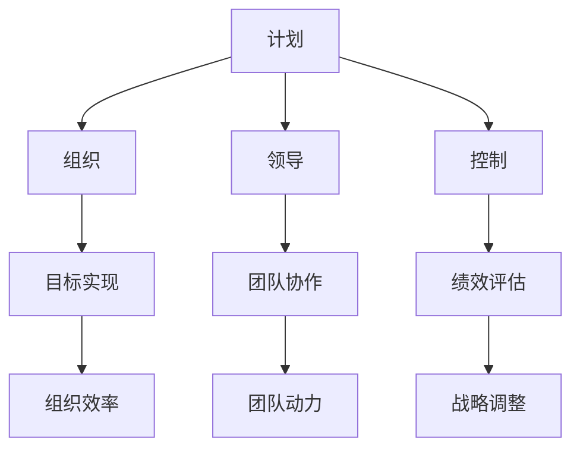

通过上述流程图，我们可以看到管理过程是一个闭环系统，各个环节相互联系、相互影响。计划为管理提供了目标和策略，组织确保资源的合理配置，领导激发团队成员的积极性和创造力，控制确保计划的有效执行和调整。这些核心概念共同构成了管理的基础。

## 1.2 管理的核心原则

### 目标一致性
目标一致性是管理的一个基本原则，要求组织的所有活动和决策都应当与组织的总体目标保持一致。这意味着从高层管理到一线员工，每个人都应该明确组织的愿景和目标，并确保他们的工作能够为实现这些目标做出贡献。

### 分工合作
分工合作是指将组织的目标分解成一系列具体的任务，并将这些任务分配给不同的个体或团队。通过分工合作，可以提高工作效率和专业化水平，使每个团队成员能够专注于自己的领域，发挥最大的潜力。

### 权力与责任相结合
权力与责任相结合是指权力与责任应该相对应。管理者在授予下属权力时，也应当明确其相应的责任。这样，可以确保每个成员都能清晰了解自己的职责，并在行使权力的同时承担责任。

### 激励与约束相结合
激励与约束相结合是指管理者应当通过激励措施激发员工的积极性和创造力，同时通过适当的约束机制确保员工的行为符合组织的规范和目标。激励措施可以包括奖金、晋升机会、培训等，而约束机制则包括规章制度、绩效评估等。

### 管理者应具备的素质与技能

### 领导力
领导力是管理者应具备的核心素质之一。领导者不仅需要具备决策能力和战略思维，还需要具备激励和引导团队的能力。有效的领导者能够激发团队成员的潜力，创造积极的工作氛围。

### 沟通能力
沟通能力是管理者成功的关键。有效的沟通能够确保信息的准确传递，减少误解和冲突。管理者需要能够运用不同的沟通方式，包括口头、书面和电子沟通，以适应不同的情境和需求。

### 决策能力
决策能力是管理者应具备的重要技能。管理者需要在面对复杂和不确定的情况时，能够快速做出合理、准确的决策。这需要管理者具备信息收集、分析能力和风险意识。

### 适应性
适应性是指管理者能够灵活应对外部环境和内部变化。在不断变化的市场和技术环境中，管理者需要具备快速学习和适应新情况的能力。

### 1.3 管理者应具备的素质与技能

### 领导力
领导力是管理者应具备的核心素质之一。领导者不仅需要具备决策能力和战略思维，还需要具备激励和引导团队的能力。有效的领导者能够激发团队成员的潜力，创造积极的工作氛围。

### 沟通能力
沟通能力是管理者成功的关键。有效的沟通能够确保信息的准确传递，减少误解和冲突。管理者需要能够运用不同的沟通方式，包括口头、书面和电子沟通，以适应不同的情境和需求。

### 决策能力
决策能力是管理者应具备的重要技能。管理者需要在面对复杂和不确定的情况时，能够快速做出合理、准确的决策。这需要管理者具备信息收集、分析能力和风险意识。

### 适应性
适应性是指管理者能够灵活应对外部环境和内部变化。在不断变化的市场和技术环境中，管理者需要具备快速学习和适应新情况的能力。

### 1.3.1 领导力的要素

#### Mermaid 流程图

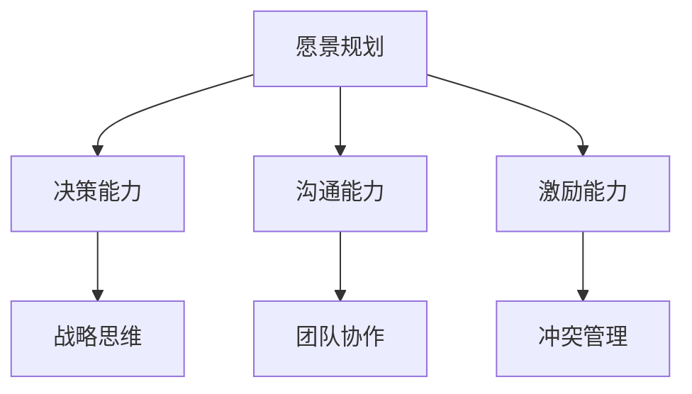

通过上述流程图，我们可以看到领导力是一个多维度的概念，包括愿景规划、决策能力、沟通能力、激励能力、团队协作和冲突管理等多个方面。有效的领导者需要在这些方面具备出色的能力，以带领团队实现组织的目标。

### 1.3.2 沟通能力的要素

#### Mermaid 流程图

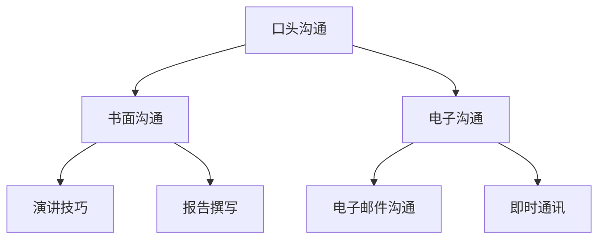

通过上述流程图，我们可以看到沟通能力不仅包括不同形式的沟通，还涉及到每种形式的具体技能。口头沟通需要具备演讲技巧，书面沟通需要撰写报告的能力，而电子沟通则需要掌握电子邮件和即时通讯的技巧。

### 1.3.3 决策能力的要素

#### Mermaid 流程图

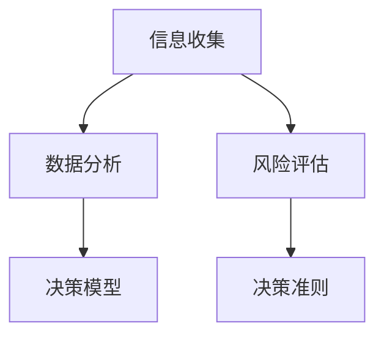

通过上述流程图，我们可以看到决策能力包括信息收集、数据分析、风险评估和决策模型等多个环节。有效的决策需要基于充分的信息和数据分析，结合风险评估和决策准则，以确保决策的合理性和准确性。

### 1.3.4 适应性的要素

#### Mermaid 流程图

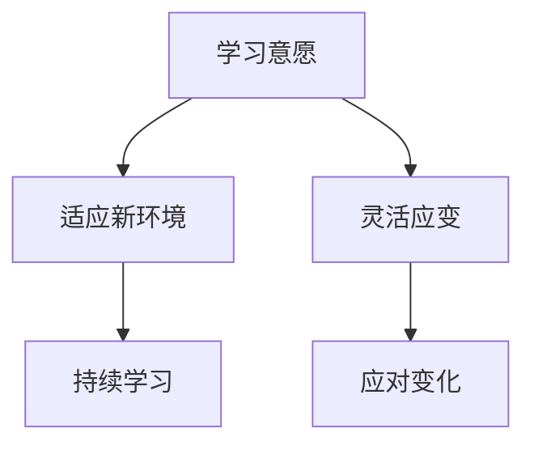

通过上述流程图，我们可以看到适应性包括学习意愿、适应新环境、灵活应变和应对变化等多个方面。一个具有适应性的管理者能够在不断变化的环境中保持灵活性和创新能力，持续学习和适应新情况。

### 总结
管理者的素质与技能是多方面的，包括领导力、沟通能力、决策能力和适应性等。通过掌握这些技能，管理者可以更好地规划、组织和领导团队，实现组织的愿景和目标。管理者应不断学习和提升自己的能力，以应对不断变化的外部环境和内部挑战。

## 第2章：组织行为学

### 2.1 组织行为学概述

#### 组织行为学的定义

组织行为学是研究个体、群体以及组织在组织环境中的行为和互动的学科。它涉及多个领域，包括心理学、社会学、管理学和经济学等。组织行为学的目标是理解员工的行为、态度和动机，以及这些因素如何影响组织的绩效和氛围。

#### 组织行为学的研究对象

组织行为学的研究对象包括以下几个方面：

1. **个体行为**：研究个体在工作环境中的行为模式、心理过程和个性特征。
2. **群体行为**：研究群体内部成员的互动、沟通、决策和行为规范。
3. **组织文化**：研究组织的价值观、信念、规范和行为模式，以及它们如何影响员工的行为和组织绩效。
4. **领导力**：研究领导者如何影响和激励团队成员，以及领导风格对组织行为的影响。
5. **组织变革**：研究组织在面临外部和内部压力时如何进行变革，以及变革过程中员工的行为和反应。

#### 组织行为学的研究方法

组织行为学的研究方法多种多样，包括：

1. **实验研究**：通过实验室条件下的控制实验，研究特定变量对员工行为的影响。
2. **观察法**：通过直接观察员工的行为，收集数据并进行分析。
3. **访谈法**：通过与员工进行面对面或电话访谈，了解他们的观点、感受和行为。
4. **问卷调查**：通过设计问卷，收集大量员工的意见和反馈，以分析组织行为的特点。
5. **案例研究**：通过深入研究特定组织的实际案例，探讨组织行为学理论在实践中的应用。

#### 组织行为学的基本理论

组织行为学的基本理论包括以下几个主要方面：

1. **X理论和Y理论**：X理论认为员工需要严格的管理和激励，而Y理论则认为员工具有自我激励和自我管理的能力。
2. **ERG理论**：ERG理论扩展了马斯洛的需求层次理论，认为员工同时追求生存、关系和成长三种层次的需求。
3. **双因素理论**：赫茨伯格的双因素理论将工作满意度分为激励因素和卫生因素，激励因素能够提高员工的工作满意度，而卫生因素则能防止工作不满意。
4. **领导力理论**：包括特质理论、行为理论和情境理论，分别从领导者的个人特质、行为和领导情境来分析领导效果。

### 2.2 人际关系与管理

#### 人际关系的定义

人际关系是指个体在工作环境中与其他个体或群体之间的互动和关系。良好的人际关系对于组织的运作和员工的满意度具有重要意义。

#### 人际关系的管理

人际关系的管理涉及以下几个方面：

1. **沟通**：有效的沟通是建立和维护良好人际关系的基础。管理者需要通过清晰的口头和书面沟通，确保信息的准确传递和员工的参与感。
2. **冲突管理**：冲突是人际关系中的常见问题，管理者需要通过适当的策略和技巧，解决冲突，减少其对组织的影响。
3. **团队建设**：团队建设活动有助于增强团队成员之间的信任和合作，提高团队的凝聚力和绩效。
4. **领导风格**：不同的领导风格对人际关系有直接影响。管理者需要根据组织的实际情况和团队需求，选择合适的领导风格。

#### 人际关系的管理技巧

1. **积极倾听**：倾听是建立良好人际关系的关键。管理者需要倾听员工的意见和需求，以建立互信和合作关系。
2. **同理心**：同理心是指理解并感受他人的情绪和需求。管理者需要通过同理心，建立积极的人际关系。
3. **公正处理**：管理者在处理人际关系时，需要公正无私，以避免偏袒和误解。
4. **激励与奖励**：通过适当的激励和奖励措施，激励员工，增强其工作积极性和人际互动。

#### Mermaid 流程图

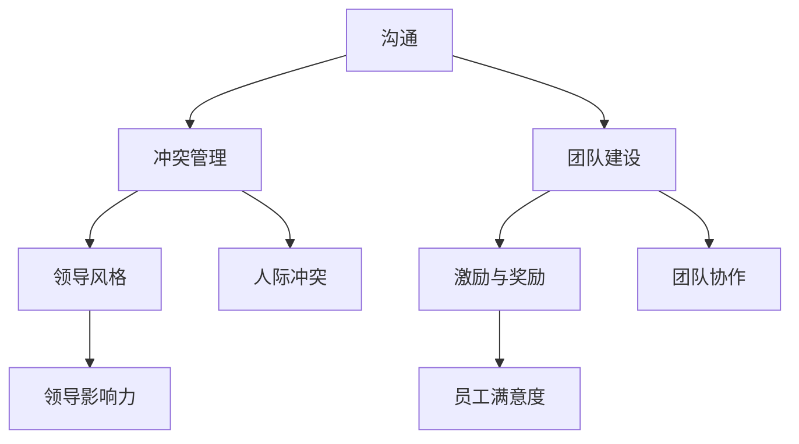

通过上述流程图，我们可以看到人际关系的管理是一个复杂但重要的过程，涉及多个方面。有效的沟通、冲突管理、团队建设和激励与奖励，都是维护良好人际关系的关键。

### 2.3 团队合作与领导力

#### 团队合作的定义

团队合作是指团队成员为了共同的目标，通过相互协作和共同努力，实现组织目标的过程。团队合作不仅能够提高工作效率，还能够增强员工的满意度和归属感。

#### 团队合作的重要性

1. **提高工作效率**：团队合作能够将每个人的优势结合起来，形成协同效应，提高工作效率。
2. **增强创新能力**：团队合作鼓励成员之间分享观点和知识，激发创新思维。
3. **促进员工成长**：团队合作提供了一个学习和成长的环境，有助于员工提升技能和经验。
4. **增强团队凝聚力**：通过共同的目标和任务，团队合作能够增强团队成员之间的信任和团结。

#### 团队合作的有效策略

1. **明确团队目标**：确保所有团队成员都清楚团队的目标和期望，以增强团队凝聚力和合作意识。
2. **合理分工**：根据团队成员的特长和兴趣，合理分配任务，确保每个人都能充分发挥自己的优势。
3. **建立信任**：信任是团队合作的基础，管理者需要通过开放沟通、透明决策和公正处理问题，建立和维护团队信任。
4. **鼓励反馈与改进**：鼓励团队成员提供反馈，并对团队合作过程进行持续改进，以提高团队效率和效果。

#### 领导力与团队合作

领导力在团队合作中起着至关重要的作用。有效的领导者能够激发团队成员的潜力，协调团队活动，确保团队目标的实现。

1. **领导者的角色**：领导者不仅是团队的领导者，也是团队的协调者和支持者。他们需要通过沟通、激励和指导，确保团队目标的实现。
2. **领导风格**：不同的领导风格对团队合作有不同的影响。民主式领导鼓励团队成员参与决策，增强团队凝聚力；专制式领导则强调权威和效率。
3. **领导者的影响力**：领导者的言行和行为对团队成员有重要影响。领导者需要通过榜样作用，激发团队成员的积极性和创造力。

#### Mermaid 流程图

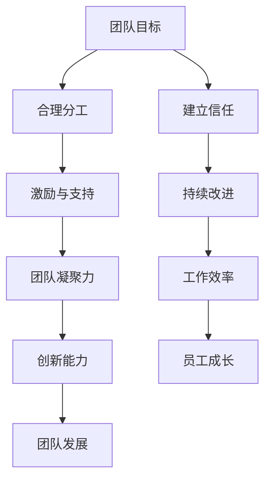

通过上述流程图，我们可以看到团队合作和领导力是一个相互影响、相互促进的过程。有效的团队合作和领导力不仅能够提高团队效率，还能够促进团队发展和成员成长。

### 总结
组织行为学是管理学科的重要组成部分，涉及个体、群体和组织的行为和互动。通过理解和管理人际关系和团队合作，管理者可以提升组织的效率和绩效，实现组织的长期发展。管理者应通过学习组织行为学的基本理论和实践方法，提升自己的管理能力，为组织的成功奠定坚实基础。

### 第3章：战略管理

#### 3.1 战略管理的概念与过程

#### 战略管理的定义

战略管理是指组织为了实现长期目标，通过设定愿景、制定战略、执行和监控战略的过程。它涉及对内外部环境的分析、资源的合理配置和持续的调整与优化，以确保组织能够适应变化并保持竞争优势。

#### 战略管理的核心过程

战略管理通常包括以下几个核心过程：

1. **外部环境分析**：通过市场调研、竞争分析和行业分析，了解外部环境的变化和趋势，识别组织面临的机遇和威胁。
2. **内部能力评估**：评估组织的内部资源、能力和核心竞争力，确定组织在市场上的竞争优势。
3. **战略选择**：根据外部环境分析和内部能力评估的结果，制定符合组织目标和发展方向的战略，包括成本领先、差异化、集中化等战略。
4. **战略执行**：通过制定详细的行动计划、资源配置和绩效管理，确保战略的顺利实施。
5. **战略监控与调整**：通过定期评估战略的执行情况和外部环境的变化，对战略进行监控和调整，确保组织目标的实现。

#### 战略管理的概念联系

以下是战略管理的几个关键概念及其相互联系：

1. **愿景**：愿景是组织长期发展的方向和目标，为战略管理提供指导。
2. **使命**：使命是组织存在的根本目的和价值观，指导组织的日常运营。
3. **战略目标**：战略目标是具体化的愿景和使命，用于指导组织的行为和决策。
4. **核心能力**：核心能力是组织独特的资源和能力，为实现战略目标提供支持。
5. **竞争优势**：竞争优势是组织在市场上相对于竞争对手的优势，是战略管理的核心。

#### Mermaid 流程图

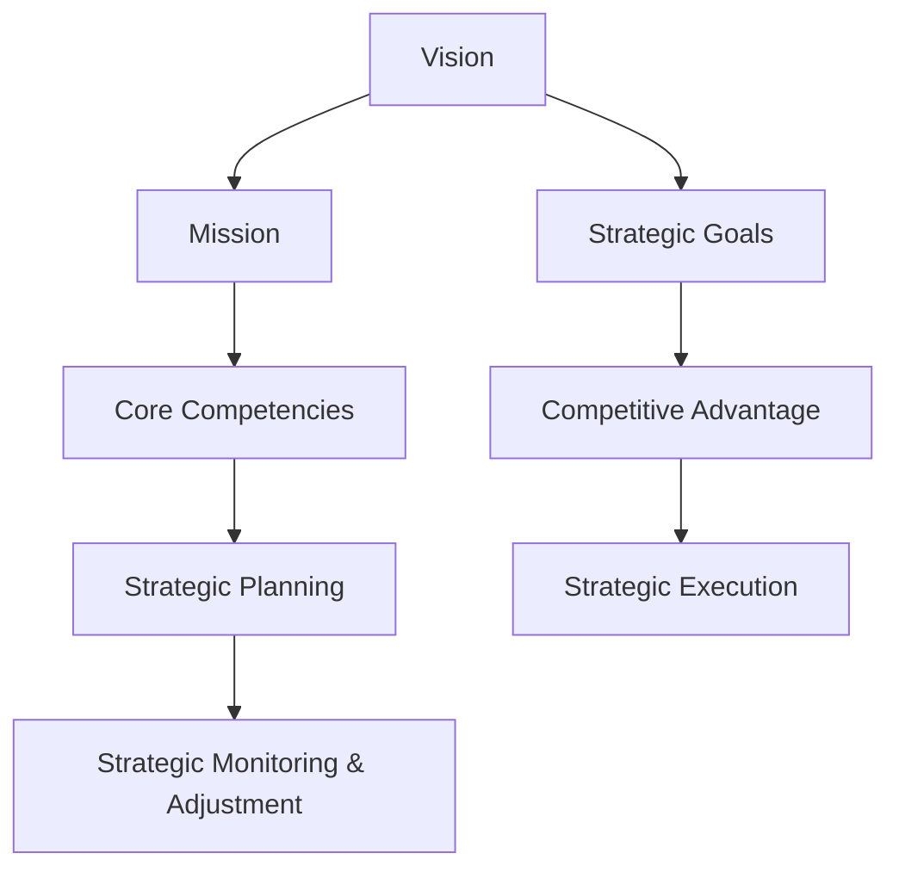

通过上述流程图，我们可以看到战略管理的各个环节相互关联，共同构成了一个完整的战略管理过程。愿景和使命为战略管理提供方向，战略目标和核心能力为实现愿景和使命提供支持，竞争优势则是战略管理的最终目标。

#### 3.2 竞争策略分析

#### 竞争策略的定义

竞争策略是指组织为了在竞争激烈的市场中获得优势，制定和实施的一系列活动和决策。它涉及对竞争对手的分析、市场定位、产品策略、定价策略和推广策略等方面。

#### 竞争策略的类型

竞争策略可以分为以下几种类型：

1. **成本领先**：通过降低成本，以低价策略获取市场份额，从而在竞争中占据优势。
2. **差异化**：通过提供独特的产品或服务，满足客户的不同需求，从而在市场中建立差异化优势。
3. **集中化**：专注于特定的市场细分，通过深入了解和满足特定客户群体的需求，实现局部市场的优势。
4. **多元化**：通过进入多个市场和行业，分散风险，实现资源的优化配置。

#### 竞争策略的分析方法

1. **五力模型**：通过分析行业中的竞争者、供应商、客户、替代品和新进入者，评估行业的竞争强度。
2. **SWOT分析**：分析组织的优势、劣势、机会和威胁，制定相应的竞争策略。
3. **PEST分析**：分析宏观环境中的政治、经济、社会和技术因素，评估外部环境对竞争策略的影响。

#### 竞争策略的制定过程

竞争策略的制定通常包括以下几个步骤：

1. **市场调研**：通过市场调研，了解市场需求、竞争格局和客户行为，为竞争策略提供数据支持。
2. **分析竞争对手**：通过分析竞争对手的产品策略、定价策略和市场表现，了解竞争对手的优势和劣势。
3. **制定策略**：根据市场调研和竞争对手分析的结果，制定符合组织目标和发展方向的竞争策略。
4. **实施策略**：通过制定详细的行动计划和资源配置，确保竞争策略的顺利实施。
5. **监控与调整**：通过定期监控市场变化和竞争对手的反应，对竞争策略进行调整和优化。

#### Mermaid 流程图

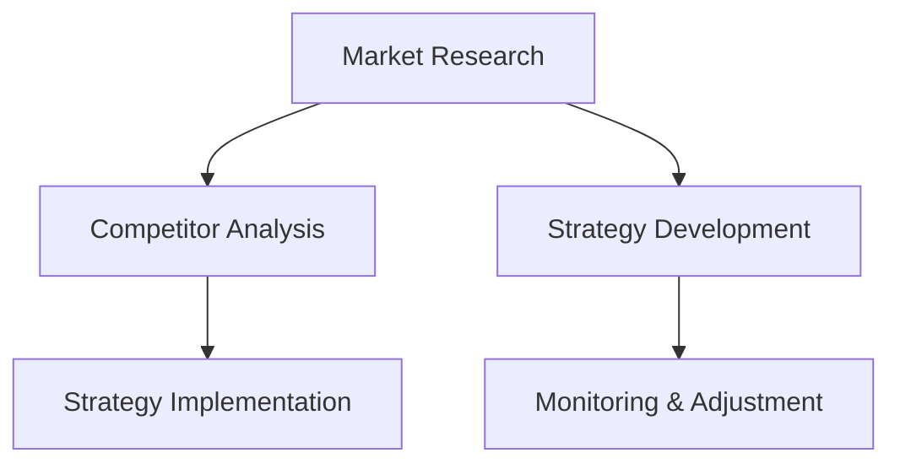

通过上述流程图，我们可以看到竞争策略的制定和实施是一个系统性的过程，涉及市场调研、竞争对手分析、策略制定、实施和监控与调整等多个环节。有效的竞争策略能够帮助组织在激烈的市场竞争中取得优势。

### 3.3 战略规划与执行

#### 战略规划的定义

战略规划是指组织根据外部环境分析和内部能力评估的结果，制定长期战略目标和实施路径的过程。它是战略管理的重要组成部分，旨在确保组织能够持续发展和保持竞争优势。

#### 战略规划的核心要素

战略规划的核心要素包括以下几个方面：

1. **愿景与使命**：明确组织的长期愿景和使命，为战略规划提供方向。
2. **战略目标**：具体化的愿景和使命，用于指导组织的战略行动。
3. **战略路径**：实现战略目标的具体步骤和行动计划。
4. **资源配置**：根据战略规划的需求，合理配置资源，包括资金、人力、技术和信息等。
5. **风险评估**：评估战略规划可能面临的风险，制定相应的风险应对措施。

#### 战略规划的过程

战略规划的过程通常包括以下几个步骤：

1. **环境分析**：通过市场调研、竞争分析和行业分析，了解外部环境的变化和趋势。
2. **内部评估**：评估组织的内部资源、能力和核心竞争力，确定组织的竞争优势。
3. **目标设定**：根据环境分析和内部评估的结果，设定符合组织目标和发展方向的长期和短期战略目标。
4. **路径规划**：制定实现战略目标的路径和行动计划，包括具体的任务、责任和时间表。
5. **资源分配**：根据战略规划的需求，合理分配资源，确保战略目标的实现。
6. **风险识别与管理**：识别战略规划可能面临的风险，制定相应的风险应对措施。

#### 战略执行的要素

战略执行是指将战略规划转化为实际行动的过程。有效的战略执行包括以下几个要素：

1. **领导力**：领导者需要明确战略目标，并通过有效的沟通和激励，确保团队成员理解并支持战略。
2. **组织结构**：组织结构应适应战略规划的需求，确保资源的有效配置和协调。
3. **绩效管理**：建立有效的绩效管理系统，确保战略规划的实施和目标的实现。
4. **资源管理**：确保资源的有效配置和利用，为战略执行提供支持。
5. **持续改进**：通过持续改进，确保战略规划的灵活性和适应性，应对外部环境的变化。

#### Mermaid 流�程图

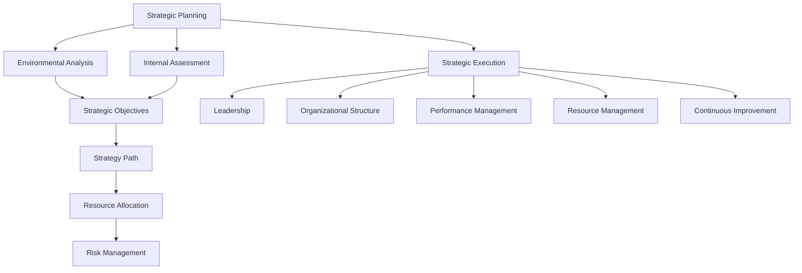

通过上述流程图，我们可以看到战略规划和战略执行是一个相互关联、相互支持的过程。战略规划为战略执行提供了目标和路径，而战略执行则通过有效的实施和监控，确保战略规划的有效性。

### 总结

战略管理是组织长期发展的关键，通过外部环境分析和内部能力评估，组织可以制定符合自身目标和发展方向的策略。有效的战略规划与执行，不仅能够确保组织目标的实现，还能够提升组织的竞争力和可持续发展能力。管理者应通过学习战略管理的基本理论和实践方法，提升自身的战略管理能力，为组织的成功奠定坚实基础。

### 第4章：市场营销管理

#### 4.1 市场营销的基本概念

#### 市场营销的定义

市场营销是指组织通过创造、沟通和传递价值，满足顾客需求并实现组织目标的过程。它涉及市场调研、目标市场选择、产品策略、定价策略、推广策略和分销策略等方面。

#### 市场营销的核心概念

1. **顾客价值**：顾客价值是指顾客从产品或服务中获得的利益和满足感。市场营销的目标是创造顾客价值，以满足顾客需求。
2. **目标市场**：目标市场是指组织决定专注于服务的顾客群体。通过市场细分和目标市场选择，组织可以更有效地满足顾客需求。
3. **市场细分**：市场细分是指将整体市场划分为若干具有相似需求的顾客群体。市场细分有助于组织更好地了解和满足顾客需求。
4. **产品策略**：产品策略包括产品的设计、品牌定位和产品线规划等。通过产品策略，组织可以提供符合顾客需求的产品。
5. **定价策略**：定价策略涉及如何确定产品的价格，以实现组织的利润目标。定价策略需要考虑市场需求、成本、竞争状况等因素。
6. **推广策略**：推广策略包括广告、促销、公关和销售促进等。通过推广策略，组织可以提升品牌知名度和市场占有率。
7. **分销策略**：分销策略涉及如何将产品传递给顾客，包括渠道选择、物流和售后服务等。分销策略需要确保产品能够及时、方便地到达顾客手中。

#### 市场营销的基本概念联系

以下是市场营销的基本概念及其相互联系：

1. **顾客价值**：顾客价值是市场营销的核心，直接影响目标市场选择和产品策略的制定。
2. **目标市场**：目标市场是市场细分的结果，用于指导产品策略和推广策略的制定。
3. **市场细分**：市场细分有助于更好地了解顾客需求，为产品策略和定价策略提供依据。
4. **产品策略**：产品策略涉及产品的设计、品牌定位和产品线规划，以满足目标市场的需求。
5. **定价策略**：定价策略基于市场需求和成本，用于实现组织的利润目标。
6. **推广策略**：推广策略通过广告、促销和公关等手段，提升品牌知名度和市场占有率。
7. **分销策略**：分销策略确保产品能够及时、方便地到达顾客手中，提高顾客满意度。

#### Mermaid 流程图

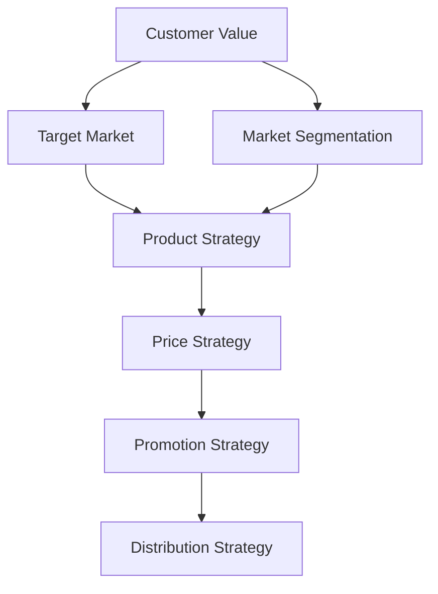

通过上述流程图，我们可以看到市场营销的基本概念相互联系，共同构成了一个完整的市场营销体系。顾客价值是市场营销的出发点，目标市场、市场细分、产品策略、定价策略、推广策略和分销策略则是实现顾客价值的重要手段。

#### 4.2 市场调研与市场细分

#### 市场调研的定义

市场调研是指通过收集和分析市场数据，了解市场需求、竞争状况和顾客行为的过程。它是市场营销的重要基础，为产品策略、定价策略和推广策略的制定提供数据支持。

#### 市场调研的过程

市场调研通常包括以下几个步骤：

1. **确定调研目标**：明确调研的目的和要解决的问题。
2. **设计调研计划**：制定调研的时间、地点、对象和方式等。
3. **收集数据**：通过问卷调查、访谈、观察和二手数据等手段收集市场数据。
4. **分析数据**：运用统计分析和数据分析方法，对收集到的数据进行分析。
5. **撰写调研报告**：总结调研结果，提出结论和建议。

#### 市场调研的方法

市场调研的方法多种多样，包括以下几种：

1. **问卷调查**：通过设计问卷，收集大量顾客的反馈和意见。
2. **访谈法**：通过与顾客或专业人士进行面对面的访谈，获取深入的信息。
3. **观察法**：通过直接观察顾客的行为和反应，了解市场需求。
4. **二手数据**：通过查阅市场报告、行业数据和政府数据等，获取相关的市场信息。

#### 市场细分

市场细分是指将整体市场划分为若干具有相似需求的顾客群体。市场细分有助于组织更好地了解和满足顾客需求，提高市场竞争力。

#### 市场细分的标准

市场细分的标准包括以下几个主要方面：

1. **地理细分**：根据顾客的地理位置，将市场划分为不同的区域。
2. **人口细分**：根据顾客的人口特征，如年龄、性别、收入和职业等，将市场划分为不同的群体。
3. **心理细分**：根据顾客的心理特征和需求，如生活方式、价值观和兴趣等，将市场划分为不同的群体。
4. **行为细分**：根据顾客的行为特征，如购买习惯、使用习惯和品牌偏好等，将市场划分为不同的群体。

#### 市场细分的方法

市场细分的方法包括以下几种：

1. **单一变量法**：根据一个变量，如年龄、性别或收入，将市场划分为不同的群体。
2. **多变量法**：根据多个变量，如年龄、性别、收入和生活方式，将市场划分为不同的群体。
3. **组合变量法**：根据不同的组合变量，如年龄、性别和生活方式，将市场划分为不同的群体。

#### Mermaid 流程图

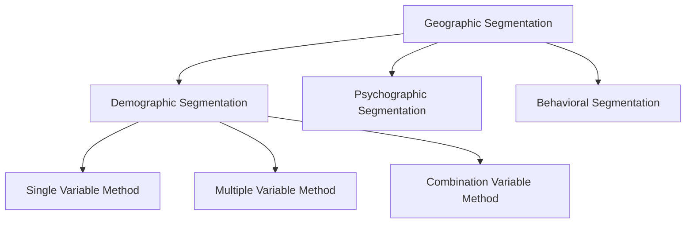

通过上述流程图，我们可以看到市场调研和市场细分是一个系统性的过程，涉及多个环节和标准。市场调研通过收集和分析市场数据，了解市场需求和竞争状况，而市场细分则通过划分不同的顾客群体，为产品策略和定价策略提供依据。

#### 4.3 营销策略与实施

#### 营销策略的定义

营销策略是指组织为实现市场营销目标，制定的行动计划和策略组合。它包括产品策略、定价策略、推广策略和分销策略等方面，用于指导市场营销活动。

#### 产品策略

产品策略是指组织如何设计、品牌定位和推广产品，以满足顾客需求。产品策略的核心是创造顾客价值，提高顾客满意度。

#### 产品策略的要素

1. **产品定位**：确定产品在市场上的定位，如高端、中端或低端市场。
2. **产品特性**：设计产品的特点和功能，以满足顾客的需求。
3. **品牌建设**：通过品牌形象、品牌宣传和品牌推广，提高品牌知名度和美誉度。
4. **产品生命周期管理**：根据产品的生命周期，制定相应的产品策略，如引入期、成长期、成熟期和衰退期。

#### 定价策略

定价策略是指组织如何确定产品的价格，以实现利润目标。定价策略需要考虑市场需求、成本、竞争状况和顾客心理等因素。

#### 定价策略的类型

1. **成本导向定价**：根据产品的成本，加上一定的利润，确定产品的价格。
2. **需求导向定价**：根据市场需求和顾客的支付意愿，确定产品的价格。
3. **竞争导向定价**：根据竞争对手的产品价格，制定相应的定价策略。

#### 推广策略

推广策略是指组织如何通过广告、促销、公关和销售促进等手段，提高品牌知名度和市场占有率。

#### 推广策略的要素

1. **广告**：通过广告宣传，提高品牌知名度和产品认知度。
2. **促销**：通过促销活动，吸引顾客购买产品，提高销售量。
3. **公关**：通过公关活动，建立良好的品牌形象和公众关系。
4. **销售促进**：通过销售促进活动，激励顾客购买产品，提高销售业绩。

#### 分销策略

分销策略是指组织如何将产品传递给顾客，包括渠道选择、物流和售后服务等方面。

#### 分销策略的要素

1. **渠道选择**：根据产品特性、市场需求和顾客偏好，选择合适的分销渠道。
2. **物流管理**：确保产品能够及时、安全地到达顾客手中。
3. **售后服务**：提供优质的售后服务，提高顾客满意度和忠诚度。

#### 营销策略的实施

营销策略的实施是指组织如何将营销策略转化为实际行动，包括以下几个方面：

1. **计划制定**：制定详细的营销计划，包括目标、任务、时间表和资源配置等。
2. **执行监控**：实施营销策略，并定期监控营销活动的执行情况和效果。
3. **效果评估**：评估营销策略的效果，包括销售额、市场份额、顾客满意度等。
4. **调整优化**：根据评估结果，对营销策略进行调整和优化，以提高效果。

#### Mermaid 流程图

```mermaid
graph TD
    A[Product Strategy]
    A --> B[Product Positioning]
    A --> C[Product Characteristics]
    A --> D[Brand Building]
    A --> E[Product Lifecycle Management]
    F[Price Strategy]
    F --> G[Cost-Oriented Pricing]
    F --> H[ Demand-Oriented Pricing]
    F --> I[Competitive Pricing]
    J[Promotion Strategy]
    J --> K[Advertising]
    J --> L[Promotion]
    J --> M[Public Relations]
    J --> N[Sales Promotion]
    P[Distribution Strategy]
    P --> Q[Channel Selection]
    P --> R[Logistics Management]
    P --> S[After-sales Service]
    T[Mketing Strategy Implementation]
    T --> U[Planning]
    T --> V[Execution Monitoring]
    T --> W[Effectiveness Evaluation]
    T --> X[Adjustment & Optimization]
```

通过上述流程图，我们可以看到营销策略的实施是一个系统性的过程，涉及多个环节和要素。通过制定和实施有效的营销策略，组织可以更好地满足顾客需求，提高市场竞争力。

### 总结

市场营销管理是组织经营的重要环节，通过市场调研、市场细分和营销策略的实施，组织可以更好地了解和满足顾客需求，提高市场竞争力。管理者应通过学习市场营销管理的基本理论和实践方法，提升自身的市场营销能力，为组织的成功奠定坚实基础。

### 第5章：财务管理基础

#### 5.1 财务管理的基本原理

#### 财务管理的定义

财务管理是组织管理的重要组成部分，它涉及资金的筹集、分配和使用，以实现组织的财务目标。财务管理的目标是通过优化资金的配置和使用，提高组织的经济效益和可持续性。

#### 财务管理的基本原理

1. **资金的时间价值**：资金的时间价值是指资金的现在价值大于未来价值，因为资金在时间上的流逝会产生利息和收益。管理者需要考虑资金的时间价值，以便做出更合理的财务决策。

2. **风险与收益平衡**：在财务管理中，风险与收益是相辅相成的。高收益通常伴随着高风险，而低收益通常伴随着低风险。管理者需要在风险与收益之间寻找平衡，以实现组织的财务目标。

3. **资金流动性**：资金流动性是指组织在短期内能够快速转换为现金的能力。保持良好的资金流动性对于组织应对突发事件和抓住市场机会至关重要。

4. **财务分析**：财务分析是通过分析组织的财务报表和财务数据，评估组织的财务状况和绩效。财务分析可以帮助管理者做出更明智的财务决策，并评估组织的管理效率。

#### 财务管理的基本概念联系

以下是财务管理的一些关键概念及其相互联系：

1. **资金的时间价值**：影响投资决策和资金配置。
2. **风险与收益平衡**：影响投资策略和风险管理。
3. **资金流动性**：影响组织的日常运营和应对能力。
4. **财务分析**：为财务决策提供数据支持和评估依据。

#### Mermaid 流程图

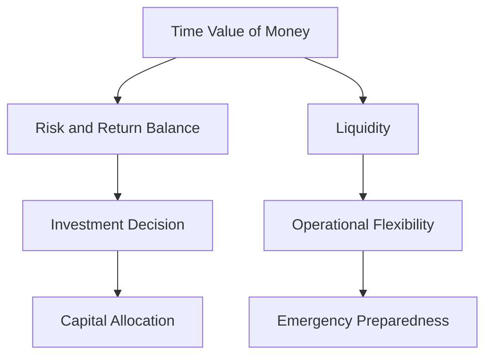

通过上述流程图，我们可以看到财务管理的基本原理相互联系，共同构成了财务管理的基础。资金的时间价值、风险与收益平衡、资金流动性和财务分析是财务管理的重要组成部分，它们相互影响，共同推动组织的财务管理活动。

#### 5.2 资金筹集与管理

#### 资金筹集的渠道

资金筹集是指组织通过各种渠道获取资金的过程。常见的资金筹集渠道包括：

1. **内部筹集**：内部筹集包括利润再投资、内部留存和内部融资等。内部筹集具有成本较低、风险较小等优点。
2. **外部筹集**：外部筹集包括债务融资和股权融资等。债务融资通常包括银行贷款、发行债券等，股权融资则包括发行股票等。外部筹集具有资金来源多样化、规模较大的优点，但也存在成本较高、风险较大的缺点。

#### 资金管理的策略

资金管理是指组织如何合理使用和管理资金，以提高资金的使用效率和效益。资金管理的策略包括以下几个方面：

1. **现金流管理**：现金流管理是指组织如何有效地管理日常运营的现金流，确保组织有足够的现金流动性。
2. **投资管理**：投资管理是指组织如何选择和运用投资项目，以提高资金的投资回报率。
3. **融资管理**：融资管理是指组织如何选择和运用融资方式，以降低资金成本和提高资金使用效率。

#### 资金管理的方法

资金管理的方法包括以下几个方面：

1. **预算管理**：通过制定预算，合理分配资金，确保组织财务目标的实现。
2. **财务分析**：通过财务分析，评估组织的财务状况和绩效，为资金管理提供数据支持。
3. **风险管理**：通过风险管理，识别和应对可能影响资金管理的风险。

#### Mermaid 流程图

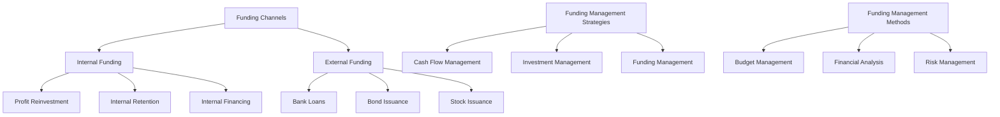

通过上述流程图，我们可以看到资金筹集与管理是一个系统性的过程，涉及资金筹集的渠道、资金管理的策略和方法。资金筹集的渠道包括内部筹集和外部筹集，而资金管理的策略和方法包括现金流管理、投资管理和融资管理等方面。

#### 5.3 投资决策与分析

#### 投资决策的定义

投资决策是指组织如何选择和运用投资项目，以实现组织的财务目标。投资决策包括对投资项目的评估、选择和实施等方面。

#### 投资决策的原则

1. **效益最大化原则**：在投资决策中，应优先考虑具有较高投资回报率的项目。
2. **风险最小化原则**：在投资决策中，应尽量降低投资项目的风险，以确保投资的安全性和稳定性。
3. **资金利用原则**：在投资决策中，应合理利用组织的资金资源，避免资金闲置和浪费。
4. **长期发展原则**：在投资决策中，应考虑项目的长期效益和组织的长期发展，确保投资决策的可持续性。

#### 投资决策的方法

投资决策的方法包括以下几个方面：

1. **净现值法**：通过计算项目的净现值，评估项目的经济效益。净现值大于零表示项目可行，小于零表示项目不可行。
2. **内部收益率法**：通过计算项目的内部收益率，评估项目的投资回报率。内部收益率高于资本成本的项目被认为是可行的。
3. **回收期法**：通过计算项目的回收期，评估项目的投资回收速度。回收期越短，项目的投资回收能力越强。
4. **利润法**：通过计算项目的预期利润，评估项目的经济效益。预期利润高于资本成本的项目被认为是可行的。

#### 投资决策的步骤

投资决策的步骤通常包括以下几个步骤：

1. **项目识别**：识别和筛选潜在的投资项目。
2. **项目评估**：评估项目的可行性、经济效益和风险。
3. **项目选择**：根据评估结果，选择最优的投资项目。
4. **项目实施**：实施选定的投资项目，并对其进行监控和管理。
5. **项目评估**：评估投资项目的实际效果，为未来的投资决策提供参考。

#### Mermaid 流程图

```mermaid
graph TD
    A[Investment Decision]
    A --> B[Economic Benefits]
    A --> C[Risk Minimization]
    A --> D[Fund Utilization]
    A --> E[Long-term Development]
    F[Investment Decision Methods]
    F --> G[Net Present Value (NPV)]
    F --> H[Internal Rate of Return (IRR)]
    F --> I[Payback Period]
    F --> J[Profit Method]
    K[Investment Decision Steps]
    K --> L[Project Identification]
    K --> M[Project Evaluation]
    K --> N[Project Selection]
    K --> O[Project Implementation]
    K --> P[Project Evaluation]
```

通过上述流程图，我们可以看到投资决策与分析是一个系统性的过程，包括投资决策的原则、方法和步骤。投资决策的原则和方法用于评估和选择投资项目，而投资决策的步骤则确保投资项目的顺利实施和监控。

#### 5.4 财务报表与财务分析

#### 财务报表的定义

财务报表是组织财务状况和经营成果的反映，包括资产负债表、利润表和现金流量表等。财务报表是财务分析的重要依据，为管理者的决策提供数据支持。

#### 财务报表的种类

1. **资产负债表**：资产负债表反映组织的财务状况，包括资产、负债和所有者权益等。
2. **利润表**：利润表反映组织的经营成果，包括收入、成本、费用和利润等。
3. **现金流量表**：现金流量表反映组织的现金流入和流出情况，包括经营活动、投资活动和筹资活动等。

#### 财务分析的定义

财务分析是指通过分析组织的财务报表和财务数据，评估组织的财务状况和经营绩效。财务分析可以帮助管理者了解组织的财务状况、发现潜在问题和制定改进措施。

#### 财务分析的方法

财务分析的方法包括以下几个方面：

1. **比率分析**：通过计算各种财务比率，如流动性比率、盈利能力比率和负债比率等，评估组织的财务状况。
2. **趋势分析**：通过比较不同时间段的财务数据，分析组织的财务状况和经营趋势。
3. **比较分析**：通过将组织的财务数据与同行业其他组织的财务数据进行比较，评估组织的竞争力。
4. **因素分析**：通过分析影响财务指标的因素，评估组织的财务状况和经营绩效。

#### Mermaid 流程图

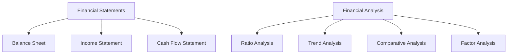

通过上述流程图，我们可以看到财务报表和财务分析是财务管理的重要组成部分。财务报表为财务分析提供了数据支持，而财务分析则帮助管理者了解组织的财务状况和经营绩效，为决策提供依据。

### 总结

财务管理是组织管理的重要环节，涉及资金的筹集、分配和使用。通过学习财务管理的基本原理、资金筹集与管理的策略和方法、投资决策与分析的方法以及财务报表与财务分析，管理者可以更好地管理和运用资金，提高组织的经济效益和可持续性。管理者应通过不断学习和实践，提升自身的财务管理能力，为组织的成功奠定坚实基础。

### 第6章：人力资源管理

#### 6.1 人力资源管理的概念与目标

#### 人力资源管理的定义

人力资源管理是组织管理的重要组成部分，涉及人员招聘、培训、绩效管理、薪酬管理、员工关系和员工发展等方面。人力资源管理的目标是确保组织能够吸引、保留和发展优秀的人才，以实现组织的战略目标。

#### 人力资源管理的核心任务

1. **人员招聘**：通过招聘渠道和选拔流程，吸引和选拔符合组织需求和岗位要求的人才。
2. **员工培训与发展**：通过培训计划和职业发展机会，提升员工的技能和素质，满足组织发展的需求。
3. **绩效管理**：通过设定绩效目标和评估体系，确保员工的绩效与组织的期望一致。
4. **薪酬管理**：通过薪酬制度的设计和调整，确保员工的薪酬与市场水平和组织绩效相匹配。
5. **员工关系**：通过沟通和管理，建立和谐的工作氛围，提升员工的满意度和忠诚度。

#### 人力资源管理的目标

1. **提高组织效率**：通过优化人力资源配置和管理，提高组织的运营效率和生产力。
2. **促进员工发展**：通过培训和发展机会，提升员工的技能和素质，促进员工个人和职业发展。
3. **增强员工满意度**：通过建立良好的员工关系和提供合理的薪酬福利，提升员工的满意度和工作积极性。
4. **降低员工流失率**：通过吸引和保留优秀人才，降低员工流失率，保持组织稳定和可持续发展。
5. **实现组织目标**：通过人力资源管理的有效实施，确保组织目标的实现和战略愿景的实现。

#### 人力资源管理的核心概念联系

以下是人力资源管理的一些核心概念及其相互联系：

1. **人员招聘**：为组织吸引和选拔合适的人才，是实现组织目标的基础。
2. **员工培训与发展**：提升员工技能和素质，增强组织竞争力，实现组织目标。
3. **绩效管理**：确保员工绩效与组织期望一致，提高组织效率。
4. **薪酬管理**：通过合理的薪酬制度，激发员工积极性和创造力。
5. **员工关系**：建立和谐的工作氛围，提升员工满意度和忠诚度。

#### Mermaid 流程图

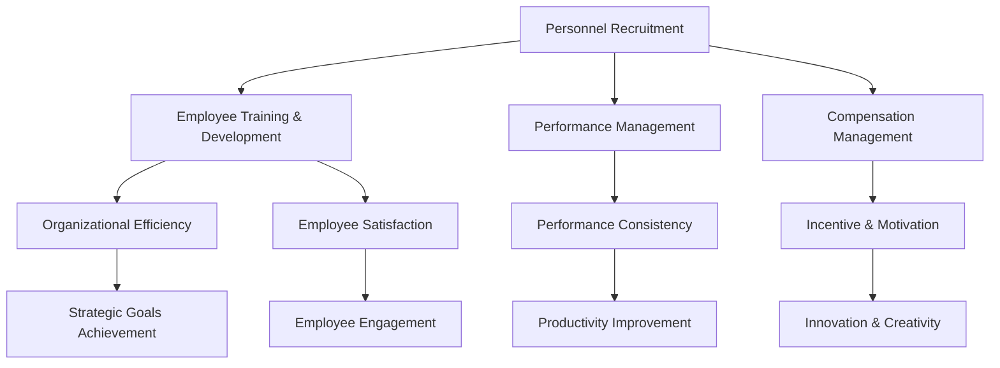

通过上述流程图，我们可以看到人力资源管理的核心概念相互联系，共同构成了一个完整的人力资源管理体系。人员招聘、员工培训与发展、绩效管理、薪酬管理和员工关系是人力资源管理的重要组成部分，它们相互影响，共同推动组织的可持续发展。

#### 6.2 招聘与选拔

#### 招聘的定义

招聘是指组织通过各种渠道吸引和选拔合适的人才，以满足组织的人力资源需求。招聘是人力资源管理的重要环节，关系到组织的运营效率和未来发展。

#### 招聘的过程

招聘通常包括以下几个步骤：

1. **需求分析**：根据组织的战略目标和部门需求，确定招聘的岗位和人数。
2. **职位描述**：制定详细的职位描述，明确岗位的职责、任职要求和薪酬福利等。
3. **招聘渠道**：选择合适的招聘渠道，如内部推荐、人才市场、招聘网站、猎头公司等。
4. **筛选与评估**：通过简历筛选、面试、笔试等方式，评估应聘者的能力和素质。
5. **录用决策**：根据评估结果，做出录用决策，并发出录用通知。
6. **入职准备**：为新员工办理入职手续，提供培训和支持，确保其顺利融入组织。

#### 招聘的方法

招聘的方法包括以下几种：

1. **内部推荐**：通过现有员工的推荐，招聘适合岗位的人才。内部推荐具有信任度高、成功率高等优点。
2. **人才市场**：在人才市场上招聘，包括校园招聘、社会招聘等。人才市场招聘具有招聘范围广、人才多样化的优点。
3. **招聘网站**：通过招聘网站发布招聘信息，吸引适合岗位的人才。招聘网站招聘具有高效、便捷等优点。
4. **猎头公司**：通过专业的猎头公司，招聘高层管理和特殊岗位的人才。猎头公司招聘具有专业性强、成功率高等优点。

#### 选拔的方法

选拔是招聘过程中最重要的环节，涉及应聘者的筛选和评估。选拔的方法包括以下几种：

1. **简历筛选**：通过审核应聘者的简历，筛选出符合岗位要求的候选人。
2. **面试**：通过面对面的面试，了解应聘者的能力、素质和潜力。
3. **笔试**：通过笔试，评估应聘者的专业知识和能力。
4. **评估中心**：通过情景模拟、角色扮演和小组讨论等方式，评估应聘者的综合素质。
5. **背景调查**：对候选人进行背景调查，包括学历、工作经历和道德品质等。

#### Mermaid 流程图

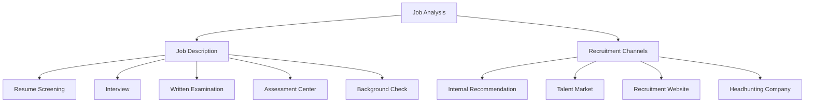

通过上述流程图，我们可以看到招聘与选拔是一个系统性的过程，涉及需求分析、职位描述、招聘渠道、筛选与评估等多个环节。通过合理选择招聘方法和选拔方法，组织可以吸引和选拔到合适的人才，满足人力资源需求。

#### 6.3 薪酬与激励制度设计

#### 薪酬的定义

薪酬是指组织根据员工的工作表现、能力和贡献，给予的经济回报。薪酬不仅包括基本工资，还包括奖金、福利和股权等。薪酬是吸引和留住人才的重要手段，对员工的满意度和工作积极性具有重要影响。

#### 薪酬制度的设计原则

1. **公平性原则**：薪酬应公平合理，确保员工的薪酬与其工作表现、能力和贡献相匹配。
2. **竞争性原则**：薪酬水平应与市场水平相当，具有竞争力，以吸引和留住优秀人才。
3. **激励性原则**：薪酬应具有激励性，能够激发员工的积极性和创造力，促进组织目标的实现。
4. **灵活性原则**：薪酬制度应具有灵活性，能够根据组织的战略目标和市场变化进行调整。

#### 薪酬制度的构成

薪酬制度通常包括以下几个部分：

1. **基本工资**：基本工资是员工的基本收入，通常根据岗位等级、工作年限和技能水平确定。
2. **奖金**：奖金是员工在工作表现突出时获得的奖励，包括绩效奖金、年终奖金等。
3. **福利**：福利是组织为员工提供的各种非现金福利，包括医疗保险、养老保险、带薪休假等。
4. **股权激励**：股权激励是通过授予员工股票期权或股权，使其能够分享公司的未来收益。

#### 激励制度的设计

激励制度是指组织通过奖金、晋升、培训和发展机会等方式，激励员工的工作积极性和创造力。激励制度的设计应考虑以下几个方面：

1. **目标明确**：激励制度的目标应明确，与组织的战略目标和员工个人发展目标相一致。
2. **公正公平**：激励制度应公正公平，确保每位员工都有公平的竞争机会。
3. **激励多样性**：激励制度应多样化，包括物质激励和非物质激励，以满足不同员工的需求。
4. **动态调整**：激励制度应具有动态调整能力，根据组织绩效和市场变化进行调整。

#### Mermaid 流程图

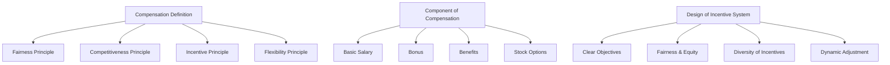

通过上述流程图，我们可以看到薪酬与激励制度设计是一个系统性的过程，涉及薪酬制度的设计原则、构成和激励制度的设计原则。合理的薪酬与激励制度能够吸引和留住人才，提高组织的绩效和竞争力。

### 总结

人力资源管理是组织管理的重要组成部分，涉及人员招聘、培训、绩效管理、薪酬管理和员工关系等方面。通过合理设计和实施人力资源管理策略，组织可以吸引和保留优秀人才，提高员工满意度和工作效率，实现组织的战略目标。管理者应通过学习和实践，提升自身的人力资源管理能力，为组织的可持续发展奠定坚实基础。

### 第7章：项目管理

#### 7.1 项目管理的核心概念

#### 项目的定义

项目是指为了创造独特的产品、服务或成果，通过一系列有序的活动实现的临时性工作。项目具有以下特点：

1. **独特性**：项目旨在实现特定的目标或成果，这些目标或成果在项目结束后不再重复。
2. **临时性**：项目有明确的开始和结束时间，通常具有一定的生命周期。
3. **目标导向**：项目以实现特定目标为核心，这些目标通常具有明确的时间、范围、质量和成本等要求。

#### 项目管理的定义

项目管理是指通过规划、执行、监控和收尾等活动，确保项目按照预定目标和时间完成的过程。项目管理旨在最大化项目的价值和成果，同时最小化风险和资源浪费。

#### 项目管理的核心概念

1. **项目团队**：项目团队是由项目经理、技术专家和其他相关人员组成的，负责实施项目任务和达成项目目标的集体。
2. **项目计划**：项目计划是项目管理的基础，包括项目范围、时间、成本、资源、质量等方面的详细规划。
3. **项目监控**：项目监控是通过跟踪项目进度、成本和质量，确保项目按计划进行的活动。
4. **项目收尾**：项目收尾是项目完成的最后阶段，包括项目评估、总结和资源释放等。

#### 项目管理的核心概念联系

以下是项目管理的一些核心概念及其相互联系：

1. **项目团队**：项目团队是实现项目目标的核心力量，其协作和沟通对于项目成功至关重要。
2. **项目计划**：项目计划为项目团队提供了明确的工作方向和目标，是项目管理的指南。
3. **项目监控**：项目监控确保项目按照计划进行，及时发现和解决问题，确保项目目标的实现。
4. **项目收尾**：项目收尾是项目完成的必要步骤，通过总结和评估，为未来的项目管理提供经验教训。

#### Mermaid 流程图

```mermaid
graph TD
    A[Project Team] --> B[Project Planning]
    A --> C[Project Monitoring]
    A --> D[Project Closure]
    B --> E[Project Scope]
    B --> F[Project Schedule]
    B --> G[Project Cost]
    B --> H[Project Resources]
    B --> I[Project Quality]
    C --> J[Project Progress]
    C --> K[Project Cost Control]
    C --> L[Project Quality Control]
    D --> M[Project Evaluation]
    D --> N[Project Lessons Learned]
```

通过上述流程图，我们可以看到项目管理的核心概念相互关联，共同构成了一个完整的项目管理体系。项目团队、项目计划、项目监控和项目收尾是项目管理的重要环节，它们相互影响，确保项目的成功实施和目标的实现。

#### 7.2 项目计划与执行

#### 项目计划

项目计划是项目管理的重要环节，它涵盖了项目的范围、时间、成本、资源、质量等方面的详细规划。项目计划的核心目标是确保项目在预定的时间、成本和质量要求内完成。

1. **项目范围计划**：明确项目需要完成的工作内容和交付成果，包括项目范围、项目边界、项目目标和项目任务等。
2. **项目时间计划**：制定项目的时间框架，包括项目里程碑、任务分配、进度安排等。
3. **项目成本计划**：估算项目所需的资金和资源，制定项目预算，包括成本估算、资金分配、成本控制策略等。
4. **项目资源计划**：确定项目所需的人力、物力、财力等资源，包括人员分配、物资采购、设备配置等。
5. **项目质量计划**：确保项目交付的成果符合预定的质量标准，包括质量标准、质量控制方法、质量评估等。

#### 项目执行

项目执行是项目计划的具体实施过程，它涉及到项目团队的协作、任务的完成、资源的分配和管理的实施。项目执行的关键在于确保项目按计划进行，并及时解决项目中出现的问题。

1. **任务分配**：根据项目计划，将项目任务分配给项目团队成员，明确每个人的职责和任务要求。
2. **资源管理**：确保项目所需的资源得到有效利用和管理，包括人力、物资和设备等。
3. **进度控制**：监控项目进度，确保项目按照预定时间计划进行，及时调整进度计划以应对项目中的变化。
4. **风险管理**：识别项目中的潜在风险，制定风险应对策略，降低风险对项目的影响。
5. **质量控制**：确保项目交付的成果符合预定的质量标准，通过质量控制和评估，确保项目成果的质量。

#### 项目监控与控制

项目监控与控制是确保项目按照计划进行的关键环节，它涉及到对项目进度、成本、质量和风险的监控和管理。项目监控与控制的主要任务包括：

1. **进度监控**：定期检查项目的进度，确保项目按计划进行，发现和解决问题，及时调整项目计划。
2. **成本监控**：监控项目的成本支出，确保项目预算的合理使用，发现和解决成本超支的问题。
3. **质量监控**：确保项目交付的成果符合预定的质量标准，通过质量检查和评估，确保项目成果的质量。
4. **风险监控**：识别和评估项目中的潜在风险，制定和实施风险应对策略，降低风险对项目的影响。

#### Mermaid 流程图

```mermaid
graph TD
    A[Project Planning]
    A --> B[Project Scope Plan]
    A --> C[Project Schedule Plan]
    A --> D[Project Cost Plan]
    A --> E[Project Resource Plan]
    A --> F[Project Quality Plan]
    G[Project Execution]
    G --> H[Task Allocation]
    G --> I[Resource Management]
    G --> J[Progress Control]
    G --> K[Risk Management]
    G --> L[Quality Control]
    M[Project Monitoring & Control]
    M --> N[Progress Monitoring]
    M --> O[Cost Monitoring]
    M --> P[Quality Monitoring]
    M --> Q[Risk Monitoring]
```

通过上述流程图，我们可以看到项目计划与执行以及项目监控与控制是项目管理的重要组成部分，它们相互关联，共同确保项目的成功实施和目标的实现。

#### 7.3 项目监控与风险管理

#### 项目监控

项目监控是指通过监控项目的进度、成本、质量和风险，确保项目按照计划进行的过程。项目监控的主要任务是及时发现和解决问题，确保项目能够按照预定的时间、成本和质量要求完成。

1. **进度监控**：定期检查项目的进度，确保项目任务按照计划进行。通过进度监控，可以及时发现进度偏差，并采取相应的措施进行调整。
2. **成本监控**：监控项目的成本支出，确保项目预算的合理使用。通过成本监控，可以及时发现成本超支的问题，并采取相应的措施进行成本控制。
3. **质量监控**：确保项目交付的成果符合预定的质量标准。通过质量监控，可以及时发现质量问题，并采取相应的措施进行质量改进。
4. **风险监控**：识别和评估项目中的潜在风险，确保项目风险得到有效管理。通过风险监控，可以及时发现新的风险，并采取相应的措施进行风险应对。

#### 风险管理

风险管理是项目管理的重要环节，它涉及识别、评估、应对和管理项目中的风险。风险管理的目标是降低项目风险对项目目标的影响，确保项目的顺利进行。

1. **风险识别**：通过系统分析和评估，识别项目中的潜在风险。风险识别是风险管理的基础，通过识别潜在风险，可以提前采取预防措施。
2. **风险评估**：对识别出的风险进行评估，确定风险的概率和影响程度。风险评估有助于确定项目风险管理的优先级，为风险应对提供依据。
3. **风险应对**：根据风险评估的结果，制定相应的风险应对策略。风险应对包括风险规避、风险转移、风险缓解和风险接受等策略。
4. **风险监控**：在整个项目生命周期中，持续监控项目风险，确保风险得到有效管理。通过风险监控，可以及时发现新的风险，并采取相应的措施进行风险应对。

#### Mermaid 流程图

```mermaid
graph TD
    A[Project Monitoring]
    A --> B[Progress Monitoring]
    A --> C[Cost Monitoring]
    A --> D[Quality Monitoring]
    E[Risk Management]
    E --> F[Risk Identification]
    E --> G[Risk Assessment]
    E --> H[Risk Response]
    E --> I[Risk Monitoring]
```

通过上述流程图，我们可以看到项目监控和风险管理是项目管理的重要组成部分，它们相互关联，共同确保项目的成功实施和目标的实现。

### 总结

项目管理是组织管理的重要组成部分，涉及项目计划、项目执行、项目监控和项目风险管理等方面。通过合理的项目管理，组织可以确保项目目标的实现，提高项目效率和成果质量。管理者应通过学习和实践，提升自身的项目管理能力，为组织的成功奠定坚实基础。

### 第8章：经典管理案例分析

#### 8.1 案例分析的基本方法

#### 案例分析的定义

案例分析是一种通过深入研究具体案例，探讨管理理论在实践中的应用和效果的研究方法。案例分析有助于管理者理解复杂的管理问题，发现有效的解决方案，并从中获得启示。

#### 案例分析的过程

1. **问题识别**：通过阅读案例，确定案例中存在的主要问题或挑战。
2. **背景分析**：了解案例的背景信息，包括组织的环境、文化、资源和战略等。
3. **方案评估**：分析不同的解决方案，评估其可行性、效果和潜在风险。
4. **方案选择**：选择最优的解决方案，并制定详细的实施计划。
5. **实施评估**：实施解决方案，并对其进行评估和调整。

#### 案例分析的方法

1. **文献分析法**：通过查阅相关文献，了解案例的理论基础和背景。
2. **访谈法**：通过与案例中的相关人员进行访谈，获取详细的信息和观点。
3. **观察法**：通过实地观察，了解案例的实际运行情况和效果。
4. **比较分析法**：将案例与其他类似案例进行比较，分析其异同和启示。

#### Mermaid 流程图

```mermaid
graph TD
    A[Problem Identification]
    A --> B[Background Analysis]
    A --> C[Solution Assessment]
    A --> D[Solution Selection]
    A --> E[Implementation Plan]
    F[Case Analysis Methods]
    F --> G[Document Analysis]
    F --> H[Interview Method]
    F --> I[Observation Method]
    F --> J[Comparative Analysis]
```

通过上述流程图，我们可以看到案例分析是一个系统性的过程，涉及问题识别、背景分析、方案评估、方案选择和实施评估等多个环节。同时，案例分析的方法包括文献分析法、访谈法、观察法和比较分析法等，这些方法相互补充，有助于全面、深入地分析案例。

#### 8.2 经典管理案例解析

#### 案例选择标准

1. **代表性**：选择具有代表性的案例，能够反映某一管理理论或实践的核心内容。
2. **挑战性**：案例应具有一定的挑战性，能够揭示管理中的复杂性和挑战。
3. **启发性**：案例应具有启发性，能够为管理者提供新的思路和解决方案。
4. **研究价值**：案例应具有研究价值，能够为学术界和实践界提供有价值的见解。

#### 案例解析方法

1. **问题识别**：通过阅读案例，确定案例中存在的主要问题或挑战。
2. **理论框架**：根据管理理论，建立相应的理论框架，用于分析案例。
3. **数据收集**：通过文献分析、访谈和观察等方法，收集案例相关的数据和信息。
4. **数据分析**：运用定量和定性的分析方法，对收集到的数据进行分析和解读。
5. **方案评估**：根据分析结果，评估不同的解决方案，选择最优的方案。
6. **实施评估**：实施解决方案，并对实施效果进行评估和总结。

#### 经典管理案例

以下是几个经典的管理案例：

1. **丰田汽车公司**：通过精益生产模式，实现高效管理和持续改进。
2. **苹果公司**：通过创新和品牌建设，成为全球科技行业的领导者。
3. **谷歌公司**：通过独特的企业文化和技术创新，实现快速发展和市场竞争力。

#### 案例解析步骤

1. **案例背景**：介绍案例的基本背景，包括组织、行业和市场状况等。
2. **案例问题**：明确案例中的主要问题或挑战。
3. **理论框架**：根据管理理论，建立相应的理论框架，用于分析案例。
4. **数据分析**：对案例中的数据进行收集和分析，以揭示问题产生的根本原因。
5. **解决方案**：根据分析结果，提出不同的解决方案，并进行评估和选择。
6. **实施与效果**：实施解决方案，并对实施效果进行评估和总结。

#### Mermaid 流程图

```mermaid
graph TD
    A[Case Background]
    A --> B[Case Problem]
    A --> C[Theoretical Framework]
    A --> D[Data Collection]
    A --> E[Data Analysis]
    A --> F[Solution Assessment]
    A --> G[Solution Selection]
    A --> H[Implementation & Evaluation]
```

通过上述流程图，我们可以看到经典管理案例解析是一个系统性的过程，涉及案例背景、案例问题、理论框架、数据分析、解决方案、实施与效果等多个环节。通过有效的案例解析，管理者可以从中获得宝贵的经验和教训，提升自己的管理能力。

#### 8.3 案例对现代管理的启示

#### 经验与教训

经典管理案例提供了丰富的经验和教训，对现代管理具有重要启示：

1. **创新的重要性**：创新是组织持续发展的动力。通过案例，我们可以看到创新思维和创新文化的力量，以及它们如何推动组织的成功。
2. **战略规划的关键性**：战略规划是组织实现长期目标的重要手段。案例中的成功组织都具备清晰的战略规划和执行力，这为现代管理提供了宝贵的经验。
3. **团队协作的必要性**：团队协作和有效的沟通是组织成功的关键。案例中成功的管理者都善于激发团队潜力，建立和谐的团队氛围。
4. **持续改进的理念**：持续改进是组织保持竞争力的关键。通过案例，我们可以看到不断改进和创新是如何帮助组织应对挑战，实现长期发展的。

#### 现代管理中的应用

经典管理案例对现代管理具有广泛的应用价值，具体包括：

1. **战略管理**：现代组织应借鉴案例中的战略管理经验，制定明确的目标和策略，确保组织在快速变化的市场环境中保持竞争力。
2. **团队建设**：现代管理者应重视团队建设，通过有效的沟通和协作，激发团队潜力，提高组织效率。
3. **创新管理**：现代组织应鼓励创新，建立创新文化和机制，激发员工的创新意识，推动组织的持续发展。
4. **绩效管理**：现代管理者应借鉴案例中的绩效管理经验，建立科学、公正的绩效评估体系，激励员工，提高组织绩效。

#### 8.4 案例研究的局限性与未来研究方向

#### 案例研究的局限性

1. **案例选择的偏差**：案例可能仅代表特定时间或特定环境，不能完全适用于所有情况。
2. **数据的不完整性**：案例研究可能缺乏详细的数据支持，影响分析的准确性。
3. **研究的深度和广度**：案例研究通常侧重于特定问题，可能缺乏对其他相关领域的深入探讨。

#### 未来研究方向

1. **跨学科研究**：结合心理学、经济学、社会学等多学科知识，开展更全面的研究。
2. **实证研究**：通过实地调研和实验，验证案例研究的结论，提高研究的可信度。
3. **多元化案例研究**：选择更多样化的案例，以更全面地探讨管理问题。

### 总结

经典管理案例分析是管理者理解和应用管理理论的重要工具。通过深入分析经典管理案例，管理者可以从中获得宝贵的经验和教训，提升自己的管理能力。同时，案例研究也具有一定的局限性，未来应开展更多跨学科和实证研究，以更好地探讨管理问题。

### 第9章：跨文化管理

#### 9.1 跨文化管理的挑战

#### 跨文化管理的定义

跨文化管理是指组织在全球化背景下，面对不同文化背景的员工和合作伙伴，进行有效的管理和协调的过程。跨文化管理的目标是确保组织在全球范围内的运营效率和团队协作，同时尊重和融合不同文化之间的差异。

#### 跨文化管理的挑战

1. **文化差异**：不同文化之间的价值观、行为规范和工作习惯存在显著差异。这些差异可能导致沟通障碍、冲突和误解。
2. **沟通障碍**：语言、沟通方式和表达习惯的不同，使得跨文化沟通变得复杂。有效的沟通是团队协作和决策成功的关键。
3. **组织文化冲突**：不同文化背景的员工可能对组织的价值观、目标和行为规范有不同的理解和期望，导致组织文化冲突。
4. **领导力挑战**：跨文化背景下的领导力要求领导者具备跨文化意识和能力，能够适应不同文化环境，并有效地激励和引导团队成员。

#### Mermaid 流程图

```mermaid
graph TD
    A[Culture Differences] --> B[Communication Barriers]
    A --> C[Organizational Culture Conflict]
    A --> D[Leadership Challenges]
    B --> E[Language Barriers]
    B --> F[Communication Styles]
    C --> G[Value Conflicts]
    C --> H[Expectation Differences]
```

通过上述流程图，我们可以看到跨文化管理的挑战涉及文化差异、沟通障碍、组织文化冲突和领导力挑战等多个方面。这些挑战相互关联，共同影响着跨文化管理的有效实施。

#### 9.2 跨文化沟通技巧

#### 跨文化沟通技巧的重要性

有效的跨文化沟通是跨文化管理成功的关键。通过掌握跨文化沟通技巧，管理者可以减少误解和冲突，提高团队协作效率和决策质量。

#### 跨文化沟通技巧

1. **倾听与尊重**：倾听对方的观点和意见，尊重不同的文化背景和表达方式。通过积极倾听，可以建立互信和良好的沟通氛围。
2. **明确表达**：使用简单、直接和清晰的言语表达，确保信息传递的准确性和清晰度。避免使用含糊或模棱两可的表述，减少误解的可能性。
3. **调整沟通风格**：根据不同文化的特点和偏好，调整沟通风格。例如，在一些文化中，直接表达可能被视为不礼貌，而含蓄表达则更受欢迎。
4. **使用多种沟通方式**：结合口头、书面和电子沟通，以适应不同情境和需求。例如，在正式场合，书面沟通可能更合适，而在非正式场合，口头沟通可能更有效。

#### Mermaid 流程图

```mermaid
graph TD
    A[Active Listening & Respect] --> B[Clear Expression]
    A --> C[Adapt Communication Styles]
    A --> D[Combination of Communication Channels]
    B --> E[Simple & Direct Communication]
    B --> F[Avoid Ambiguity]
    C --> G[Culture-Specific Communication Styles]
    D --> H[Oral Communication]
    D --> I[Written Communication]
    D --> J[Electronic Communication]
```

通过上述流程图，我们可以看到跨文化沟通技巧是一个综合性的过程，涉及倾听与尊重、明确表达、调整沟通风格和使用多种沟通方式等多个方面。通过掌握这些技巧，管理者可以有效地克服跨文化沟通的障碍，提高团队协作效率。

#### 9.3 跨文化组织管理

#### 文化融合策略

跨文化组织管理的关键在于促进不同文化之间的融合和合作。以下是一些有效的文化融合策略：

1. **文化敏感性培训**：通过文化敏感性培训，提高员工对不同文化的认识和尊重。培训内容可以包括不同文化的价值观、行为规范和工作习惯等。
2. **跨文化团队建设**：通过跨文化团队建设活动，增强团队成员之间的信任和合作。团队建设活动可以包括团队游戏、文化体验和跨文化研讨会等。
3. **领导者的跨文化领导力**：领导者应具备跨文化领导力，能够适应不同文化环境，并有效地激励和引导团队成员。领导者可以通过跨文化沟通技巧、领导风格调整和文化敏感性培养来提升跨文化领导力。
4. **建立跨文化沟通平台**：通过建立跨文化沟通平台，如跨文化团队会议、文化分享会和跨文化培训等，促进不同文化之间的交流和理解。

#### 跨文化组织管理案例

以下是几个跨文化组织管理的成功案例：

1. **谷歌公司**：谷歌通过建立多元化的团队和文化融合机制，实现了全球范围内的成功。谷歌的“20%时间”政策允许员工将部分工作时间用于自己感兴趣的项目，促进了创新和团队合作。
2. **微软公司**：微软通过在全球范围内设立研发中心，吸引了不同文化背景的顶尖人才。微软通过跨文化团队建设和文化融合策略，提升了团队协作效率和创新能力。

#### Mermaid 流程图

```mermaid
graph TD
    A[Culture Sensitivity Training] --> B[Cultural Team Building]
    A --> C[Leadership Cross-Cultural Leadership]
    A --> D[Cross-Cultural Communication Platform]
    B --> E[Trust Building]
    B --> F[Cooperative Culture]
    C --> G[Cross-Cultural Communication Skills]
    C --> H[Leadership Style Adjustment]
    C --> I[Cultural Sensitivity Training]
    D --> J[Cross-Cultural Team Meetings]
    D --> K[Cultural Sharing Sessions]
    D --> L[Cross-Cultural Training]
```

通过上述流程图，我们可以看到跨文化组织管理涉及文化敏感性培训、跨文化团队建设、领导者的跨文化领导力和建立跨文化沟通平台等多个方面。这些策略共同作用，有助于促进不同文化之间的融合和合作，提高组织的整体绩效。

#### 总结

跨文化管理是全球化背景下组织管理的重要挑战和机遇。通过掌握跨文化沟通技巧和实施有效的文化融合策略，管理者可以克服文化差异和沟通障碍，提高团队协作效率和创新能力。跨文化组织管理不仅有助于提升组织的国际化竞争力，也为员工提供了多元化的成长和发展机会。管理者应不断学习和提升自己的跨文化管理能力，为组织的全球化发展奠定坚实基础。

### 第10章：创新管理

#### 10.1 创新的重要性

#### 创新的定义

创新是指通过创造性的思维和方法，产生新的思想、产品、服务或过程，从而提高组织的竞争力。创新不仅涉及技术层面的突破，还包括管理、业务模式和商业模式等方面的创新。

#### 创新的重要性

创新在组织的长期发展中扮演着至关重要的角色，其重要性体现在以下几个方面：

1. **提高竞争力**：创新能够帮助组织在激烈的市场竞争中脱颖而出，保持领先地位。
2. **创造新价值**：创新能够发现和满足新的市场需求，创造新的价值，提升组织的盈利能力。
3. **促进持续发展**：创新能够推动组织的持续发展，使其在快速变化的环境中保持适应性和灵活性。
4. **提升员工满意度**：创新能够激发员工的创造力和积极性，提高员工的满意度和忠诚度。

#### 创新的驱动力

创新驱动力是指推动组织进行创新的外部和内部因素。以下是几个常见的创新驱动力：

1. **市场需求**：市场需求是推动创新的重要因素。组织通过不断研究和分析市场需求，可以开发出满足顾客需求的新产品和服务。
2. **技术进步**：技术的不断进步为创新提供了新的工具和方法。组织应紧跟技术发展趋势，利用新技术推动创新。
3. **竞争压力**：竞争压力促使组织不断进行创新，以保持市场竞争力。通过创新，组织可以应对竞争对手的挑战，巩固市场地位。
4. **内部激励**：内部激励是推动员工进行创新的重要动力。组织应建立创新文化，鼓励员工提出创新想法，并对创新成果给予奖励。

#### Mermaid 流程图

```mermaid
graph TD
    A[Market Demand] --> B[Technological Advancements]
    A --> C[Competitive Pressure]
    A --> D[Internal Motivation]
    B --> E[New Tools & Methods]
    B --> F[Innovation Acceleration]
    C --> G[Market Leadership]
    C --> H[Competitive Parity]
    D --> I[Innovation Culture]
    D --> J[Incentive Systems]
```

通过上述流程图，我们可以看到创新驱动力包括市场需求、技术进步、竞争压力和内部激励等多个方面。这些驱动力共同作用，推动组织进行创新，提高竞争力。

#### 10.2 创新过程管理

#### 创新过程管理的定义

创新过程管理是指组织通过系统的方法和工具，管理创新的全过程，从创意的产生、筛选、开发到商业化的各个环节。创新过程管理旨在确保创新项目的有效实施和成功落地。

#### 创新过程的阶段

创新过程通常包括以下几个阶段：

1. **创意生成**：通过头脑风暴、市场调研、用户反馈等方式，收集和产生创新创意。
2. **创意筛选**：对收集到的创意进行筛选，评估其可行性、市场潜力和资源需求，选择最具潜力的创意进行开发。
3. **概念开发**：将选定的创意进一步细化和完善，形成具有明确目标、功能和技术方案的概念原型。
4. **原型制作**：制作概念原型的实体或虚拟模型，进行测试和验证，以验证其可行性和用户接受度。
5. **测试与评估**：对原型进行测试和评估，收集用户反馈，改进和优化产品或服务。
6. **商业化**：将创新成果推向市场，进行商业化运营，实现商业价值。

#### 创新工具与方法

在创新过程中，组织可以使用多种工具和方法，以提高创新效率和成功率。以下是几个常用的创新工具和方法：

1. **头脑风暴**：通过集体讨论和思维碰撞，产生大量创意。
2. **六顶思考帽**：通过不同颜色的思考帽，分别从不同的角度分析和解决问题。
3. **SWOT分析**：对创意进行优势、劣势、机会和威胁分析，评估其可行性。
4. **快速原型法**：通过快速制作原型，快速测试和迭代，缩短创新周期。
5. **用户调研**：通过用户调研，了解用户需求和偏好，指导创新方向。

#### Mermaid 流程图

```mermaid
graph TD
    A[Creative Generation] --> B[Creative Screening]
    A --> C[Concept Development]
    A --> D[Prototype Production]
    A --> E[Test & Evaluation]
    A --> F[Commercialization]
    B --> G[Feasibility Assessment]
    B --> H[Market Potential]
    B --> I[Resource Requirement]
    C --> J[Function & Technology Specification]
    D --> K[User Feedback]
    E --> L[Iterative Improvement]
```

通过上述流程图，我们可以看到创新过程管理涉及创意生成、创意筛选、概念开发、原型制作、测试与评估和商业化等多个阶段。每个阶段都有特定的工具和方法，以确保创新项目的顺利进行和成功实施。

#### 10.3 创新策略与实践

#### 创新策略

创新策略是指组织为实现创新目标，制定的具体行动方案和计划。以下是几种常见的创新策略：

1. **内部创新**：通过内部研发和技术创新，提升组织的核心竞争力。内部创新可以包括新技术的研究、产品创新和业务模式创新等。
2. **外部创新**：通过合作、并购、开放创新等方式，引入外部创新资源和技术。外部创新可以包括与供应商、合作伙伴和学术机构的合作，以及购买外部创新成果等。
3. **精益创新**：通过简化流程、降低成本和优化资源，实现高效创新。精益创新强调资源的有效利用和快速迭代，以缩短创新周期。
4. **颠覆性创新**：通过颠覆现有市场格局和商业模式，实现重大突破。颠覆性创新通常涉及对现有技术和市场的根本性改变。

#### 创新实践案例

以下是几个创新实践案例：

1. **苹果公司**：通过持续的产品创新和用户体验优化，苹果公司成为全球科技行业的领导者。苹果的创新实践包括硬件创新、软件创新和商业模式创新等多个方面。
2. **特斯拉公司**：通过技术创新和商业模式创新，特斯拉成为电动汽车行业的先锋。特斯拉的创新实践包括电池技术、自动驾驶技术和能源管理系统的研发等。
3. **阿里巴巴**：通过开放平台和创新生态系统，阿里巴巴成为中国最大的电子商务公司。阿里巴巴的创新实践包括电商平台的构建、物流体系的优化和金融服务的创新等。

#### Mermaid 流程图

```mermaid
graph TD
    A[Internal Innovation] --> B[External Innovation]
    A --> C[Lean Innovation]
    A --> D[Disruptive Innovation]
    B --> E[Partnership & Acquisition]
    B --> F[Open Innovation]
    C --> G[Resource Optimization]
    C --> H[Rapid Iteration]
    D --> I[Market Disruption]
    D --> J[Radical Change]
```

通过上述流程图，我们可以看到创新策略包括内部创新、外部创新、精益创新和颠覆性创新等多个方面。不同的创新策略适用于不同的组织环境和目标，组织应根据自身情况选择合适的创新策略。

### 总结

创新管理是组织持续发展的重要驱动力。通过系统化的创新过程管理和多样化的创新策略，组织可以不断提升竞争力，创造新的价值。创新不仅是技术层面的突破，还包括管理、业务模式和商业模式等方面的创新。管理者应重视创新管理，激发员工的创新潜力，推动组织的创新发展。

### 第11章：数字化管理

#### 11.1 数字化转型的趋势

#### 数字化转型的定义

数字化转型是指组织通过利用数字技术，优化业务流程、提高效率和创新能力，实现从传统模式向数字模式的转变。数字化转型涵盖了技术、流程、组织结构和文化等多个层面，旨在提高组织的竞争力、灵活性和响应速度。

#### 数字化转型的趋势

1. **云计算**：云计算为组织提供了灵活的计算资源，降低了IT成本，提高了数据存储和处理能力。云计算正成为企业数字化转型的重要支撑。
2. **大数据**：大数据技术帮助企业从海量数据中挖掘有价值的信息，优化决策过程，提升业务效率。大数据分析正成为数字化转型的重要工具。
3. **物联网**：物联网通过连接各种设备和传感器，实现设备之间的互联互通，提高生产效率和管理水平。物联网正成为数字化转型的重要方向。
4. **人工智能**：人工智能通过模拟人类智能，自动化执行复杂任务，提高决策质量和执行效率。人工智能正成为数字化转型的重要驱动力。
5. **区块链**：区块链通过分布式账本技术，实现数据的透明、安全和不可篡改，改变传统的业务流程和信任机制。区块链正成为数字化转型的重要创新。

#### Mermaid 流程图

```mermaid
graph TD
    A[Cloud Computing] --> B[Distributed Resources]
    A --> C[Cost Reduction]
    B --> D[Data Storage & Processing]
    C --> E[Scalable Infrastructure]
    F[Big Data]
    F --> G[Data Analytics]
    F --> H[Decision Optimization]
    G --> I[Insight Extraction]
    H --> J[Operational Efficiency]
    K[IoT]
    K --> L[Device Connectivity]
    K --> M[Production Efficiency]
    N[AI]
    N --> O[Autonomous Decision-Making]
    N --> P[Task Automation]
    Q[Blockchain]
    Q --> R[Transparent Data]
    Q --> S[Secure Transactions]
    T[Trust Mechanism Transformation]
```

通过上述流程图，我们可以看到数字化转型的趋势涉及云计算、大数据、物联网、人工智能和区块链等多个方面。这些技术正在推动企业从传统模式向数字模式转变，提高业务的灵活性和效率。

#### 11.2 数字化管理工具与应用

#### 数字化管理工具

数字化管理工具是指利用数字技术，提高管理效率和管理水平的工具。以下是几种常见的数字化管理工具：

1. **ERP系统**：企业资源计划（ERP）系统集成了企业的各项业务模块，如财务、人力资源、供应链等，实现业务流程的自动化和一体化。
2. **CRM系统**：客户关系管理（CRM）系统通过收集和分析客户数据，优化客户服务和销售过程，提高客户满意度和忠诚度。
3. **项目管理工具**：项目管理工具帮助组织规划、执行和监控项目进度，提高项目管理的效率和质量。
4. **协同办公平台**：协同办公平台通过电子邮件、即时通讯、文件共享和任务管理等功能，提高团队协作效率，降低沟通成本。
5. **数据分析工具**：数据分析工具通过收集、处理和分析企业数据，为决策提供数据支持和业务洞察。

#### 数字化管理应用

数字化管理的应用场景广泛，以下是一些常见的应用：

1. **生产管理**：通过物联网和大数据技术，实现生产过程的实时监控和智能调度，提高生产效率和质量。
2. **供应链管理**：通过供应链管理系统，实现供应链的优化和可视化，提高供应链的灵活性和响应速度。
3. **人力资源管理**：通过人力资源管理信息系统，实现招聘、培训、绩效管理和薪酬管理等流程的自动化和智能化。
4. **客户服务**：通过客户关系管理系统，实现客户信息的全面管理和客户服务的自动化，提高客户满意度和忠诚度。
5. **财务管理**：通过企业资源计划系统，实现财务数据的实时分析和财务管理流程的自动化，提高财务管理效率。

#### Mermaid 流程图

```mermaid
graph TD
    A[ERP System] --> B[Business Process Automation]
    A --> C[Financial Management]
    B --> D[Supply Chain Integration]
    C --> E[Real-time Data Analysis]
    F[CRM System] --> G[Customer Data Management]
    G --> H[Sales Process Optimization]
    I[Project Management Tools] --> J[Task Planning & Monitoring]
    J --> K[Project Efficiency]
    L[Collaborative Office Platform] --> M[Team Collaboration]
    M --> N[Communication Efficiency]
    O[Data Analysis Tools] --> P[Business Insight]
    P --> Q[Data-driven Decision-making]
```

通过上述流程图，我们可以看到数字化管理工具和应用在提高企业效率、优化业务流程和提升管理水平方面发挥了重要作用。

#### 11.3 数字化管理对组织的影响

#### 提高效率

数字化管理通过自动化和智能化的工具，优化了业务流程，提高了工作效率。以下是数字化管理对组织效率的具体影响：

1. **流程优化**：数字化管理工具可以帮助企业梳理和优化业务流程，消除不必要的步骤和环节，提高业务处理速度和效率。
2. **自动化操作**：通过自动化工具，如机器人流程自动化（RPA），企业可以自动化执行重复性和规则性强的任务，减少人为错误，提高处理速度。
3. **实时监控**：数字化管理工具可以实现业务数据的实时监控和分析，帮助企业快速发现问题和进行调整，提高业务效率和响应速度。

#### 改善决策

数字化管理通过数据分析和智能算法，为组织决策提供了数据支持和洞察。以下是数字化管理对组织决策的具体影响：

1. **数据驱动决策**：数字化管理工具可以收集和整合企业内部和外部的海量数据，通过对数据进行分析，为决策提供科学依据和洞察。
2. **预测分析**：通过数据分析工具，企业可以进行预测分析，预测市场趋势和客户需求，为决策提供前瞻性参考。
3. **智能算法**：智能算法可以帮助企业优化决策过程，如通过优化算法优化供应链管理、定价策略和人力资源配置等。

#### 创新驱动

数字化管理通过技术创新和业务模式的变革，推动组织的创新发展。以下是数字化管理对组织创新的具体影响：

1. **开放创新**：数字化管理工具可以帮助企业开放创新，与外部合作伙伴共同开发新产品和新业务模式。
2. **快速迭代**：数字化管理工具可以实现产品的快速开发和迭代，缩短产品上市时间，提高市场竞争力。
3. **用户体验优化**：通过数字化工具，企业可以实时收集用户反馈，快速优化产品和服务，提升用户体验和满意度。

#### Mermaid 流程图

```mermaid
graph TD
    A[Process Optimization] --> B[Automated Operations]
    A --> C[Real-time Monitoring]
    B --> D[Error Reduction]
    B --> E[Processing Speed]
    F[Data-driven Decision-making] --> G[Data Collection & Analysis]
    G --> H[Predictive Analytics]
    I[Informed Decision-making]
    J[Innovation Driven] --> K[Open Innovation]
    K --> L[Agile Development]
    K --> M[Iterative Improvement]
    N[User Experience Optimization] --> O[Real-time Feedback]
    O --> P[Product & Service Enhancement]
```

通过上述流程图，我们可以看到数字化管理对组织效率、决策和创新具有显著影响。数字化管理不仅提高了组织的运营效率，还为决策提供了数据支持，推动了组织的创新发展。

### 总结

数字化管理是现代企业提升竞争力、优化业务流程和推动创新的重要手段。通过数字化管理工具，企业可以自动化和智能化地处理业务流程，提高工作效率；通过数据分析，企业可以做出更科学的决策；通过技术创新和用户体验优化，企业可以推动组织的创新发展。管理者应重视数字化管理，充分利用数字化工具和资源，实现组织的数字化转型和持续发展。

### 第12章：可持续发展管理

#### 12.1 可持续发展的概念

#### 可持续发展的定义

可持续发展是指满足当前需求而不损害未来世代满足其需求的能力。它涵盖了经济、社会和环境三个方面的平衡发展。可持续发展强调的是长期的、全面的和综合的发展模式，旨在实现经济效益、社会效益和环境效益的协同发展。

#### 可持续发展的原则

1. **公平性原则**：可持续发展要求在经济、社会和环境三个领域实现公平，确保所有个体和群体都能够享有平等的发展机会和成果。
2. **持续性原则**：可持续发展要求保护自然资源和环境，确保资源的长期可用性和生态系统的稳定。
3. **共同性原则**：可持续发展是全人类共同的责任，需要全球合作和共同努力，以应对全球性的挑战。
4. **综合性原则**：可持续发展需要综合考虑经济、社会和环境三个方面的因素，实现综合效益的最大化。

#### 可持续发展的联系

以下是可持续发展的一些关键概念及其相互联系：

1. **经济、社会和环境**：经济、社会和环境是可持续发展的三个核心领域，相互影响、相互依赖。经济发展为社会和环境提供支持，而社会和环境则为经济发展提供基础。
2. **经济效益、社会效益和环境效益**：可持续发展追求经济效益、社会效益和环境效益的协同发展，通过实现综合效益最大化，推动可持续发展。
3. **经济增长、社会发展与环境保护**：经济增长、社会发展与环境保护是可持续发展的三个维度，需要平衡发展，确保长期可持续发展。

#### Mermaid 流程图

```mermaid
graph TD
    A[Economy] --> B[Social Development]
    A --> C[Environmental Protection]
    B --> D[Ecological Balance]
    B --> E[Sustainable Development]
    C --> F[Resource Conservation]
    C --> G[Ecological Sustainability]
    D --> H[Long-term Growth]
    D --> I[Happiness & Well-being]
    E --> J[Multi-dimensional Benefits]
```

通过上述流程图，我们可以看到可持续发展涉及经济、社会和环境三个领域，以及经济效益、社会效益和环境效益三个维度。这些领域和维度相互关联，共同构成了可持续发展的综合体系。

#### 12.2 企业社会责任

#### 企业社会责任的定义

企业社会责任（CSR）是指企业在其商业活动中承担的社会责任，包括经济、社会和环境等方面。企业社会责任强调企业不仅要追求经济效益，还要关注社会和环境问题，以实现长期的可持续发展。

#### 企业社会责任的内容

1. **环境保护**：企业应采取环保措施，减少环境污染和资源消耗，保护生态系统的稳定性。
2. **社会贡献**：企业应积极参与社会公益活动，支持教育、医疗、扶贫等社会事业，促进社会进步和公平。
3. **员工权益**：企业应尊重和保障员工的合法权益，提供良好的工作环境和发展机会，提高员工的幸福感和满意度。
4. **供应链责任**：企业应确保供应链的透明性和合规性，尊重供应链各方的权益，推动供应链的可持续发展。
5. **企业治理**：企业应建立有效的企业治理结构，确保企业的合法、透明和公正运营。

#### 企业社会责任的实施

企业社会责任的实施包括以下几个方面：

1. **战略规划**：企业应将社会责任纳入战略规划，明确社会责任的目标和行动计划。
2. **政策制定**：企业应制定社会责任政策，明确社会责任的承诺和责任范围。
3. **责任履行**：企业应通过实际行动履行社会责任，如环保项目的实施、公益活动的参与等。
4. **监督与评估**：企业应建立社会责任的监督与评估机制，定期评估社会责任的履行情况和效果。
5. **沟通与透明**：企业应与利益相关者保持沟通，确保社会责任的透明和公开，接受社会监督。

#### Mermaid 流程图

```mermaid
graph TD
    A[CSR Strategy] --> B[Policies & Commitments]
    A --> C[Action Implementation]
    A --> D[Monitoring & Evaluation]
    B --> E[Environmental Protection]
    B --> F[Social Contributions]
    B --> G[Employee Rights]
    B --> H[Supply Chain Responsibility]
    B --> I[Corporate Governance]
```

通过上述流程图，我们可以看到企业社会责任的实施涉及战略规划、政策制定、责任履行、监督与评估和沟通与透明等多个环节。这些环节相互关联，共同构成了企业社会责任的完整体系。

#### 12.3 可持续发展的实践案例

#### 案例选择标准

选择可持续发展实践案例时，应考虑以下标准：

1. **代表性**：案例应具有代表性，能够反映某一领域的可持续发展实践。
2. **影响性**：案例应具有显著的影响，能够对其他组织产生示范作用。
3. **创新性**：案例应具有创新性，采用新的理念、方法和技术，推动可持续发展。
4. **可操作性**：案例应具有可操作性，其他组织可以借鉴和实施。

#### 案例解析

以下是几个可持续发展实践案例：

1. **宜家**：宜家通过推行环保材料和能源节约措施，成为全球家居行业的领导者。宜家的可持续发展实践包括使用可再生材料、提高能源效率和减少废弃物等。

2. **苹果公司**：苹果公司通过透明供应链和环保政策，降低环境影响。苹果公司通过使用环保材料、减少碳排放和提高能源效率，推动可持续发展。

3. **联合利华**：联合利华通过可持续发展战略，提高业务效率和减少环境负担。联合利华的可持续发展实践包括减少水资源消耗、提高农业可持续性和推动社会责任等。

#### 案例对可持续发展的启示

通过分析上述案例，我们可以得出以下对可持续发展的启示：

1. **科技创新**：科技创新是推动可持续发展的重要动力。组织应积极采用新技术，提高资源利用效率，减少环境负担。

2. **战略规划**：战略规划是组织实现可持续发展的重要保障。组织应制定明确的可持续发展战略，明确目标和行动计划。

3. **利益相关者合作**：利益相关者合作是推动可持续发展的重要手段。组织应与政府、社区、供应商和客户等各方建立合作关系，共同推动可持续发展。

4. **透明度和责任**：透明度和责任是组织实现可持续发展的重要基础。组织应建立透明的报告机制，公开可持续发展成果，并承担社会责任。

#### Mermaid 流程图

```mermaid
graph TD
    A[Innovation] --> B[Sustainable Business]
    A --> C[Strategic Planning]
    A --> D[Stakeholder Collaboration]
    B --> E[Technology Adoption]
    B --> F[Resource Efficiency]
    B --> G[Environmental Protection]
    C --> H[Clear Goals]
    C --> I[Action Plans]
    D --> J[Partnership]
    D --> K[Accountability]
```

通过上述流程图，我们可以看到科技创新、战略规划、利益相关者合作和透明度和责任是推动可持续发展的重要要素。这些要素相互关联，共同构成了可持续发展的实践框架。

### 总结

可持续发展管理是组织实现长期发展和社会责任的重要手段。通过了解可持续发展的概念、原则和实践案例，管理者可以更好地把握可持续发展的重要性，制定有效的可持续发展战略，推动组织的可持续发展。同时，通过科技创新、战略规划、利益相关者合作和透明度和责任，组织可以实现经济效益、社会效益和环境效益的协同发展，为社会的可持续发展作出贡献。

### 附录A：管理类书籍推荐

#### A.1 必读的管理经典

1. **《管理的实践》**：彼得·德鲁克（Peter Drucker）
   - 内容概要：本书是管理学经典之作，系统阐述了管理的核心概念和实践方法，包括目标管理、决策过程、组织结构和领导力等。
   - 推荐理由：德鲁克的思想对现代管理学产生了深远影响，本书对于初学者和管理者都是不可或缺的指南。

2. **《管理行为》**：道格拉斯·麦格雷戈（Douglas McGregor）
   - 内容概要：本书提出了X理论和Y理论，探讨了员工激励和行为管理的问题，对管理实践有着重要的指导意义。
   - 推荐理由：麦格雷戈的理论为管理者提供了理解员工行为和激发员工动力的新视角，是人力资源管理的经典著作。

3. **《竞争战略》**：迈克尔·波特（Michael Porter）
   - 内容概要：本书详细阐述了竞争战略的理论框架，包括五种竞争力模型、价值链分析等，对企业的战略规划具有重要指导作用。
   - 推荐理由：波特的理论对竞争分析和战略制定提供了系统的工具和方法，是企业管理者和咨询顾问的必备书籍。

4. **《组织行为学》**：斯蒂芬·罗宾斯（Stephen Robbins）
   - 内容概要：本书全面介绍了组织行为学的基本理论，包括个体行为、群体行为、领导力和组织文化等。
   - 推荐理由：罗宾斯的著作涵盖了组织行为学的核心内容，对理解和分析组织行为提供了全面而深入的理论支持。

#### A.2 近年来的优秀管理著作

1. **《敏捷创新》**：斯蒂芬·豪斯（Stephen B. House）
   - 内容概要：本书探讨了敏捷创新的理念和实践方法，强调快速迭代、客户参与和团队合作在创新过程中的重要性。
   - 推荐理由：对于希望提升创新能力的组织和个人，这本书提供了实用的指导和案例分析，是创新管理领域的佳作。

2. **《创新者的窘境》**：克莱顿·克里斯滕森（Clayton M. Christensen）
   - 内容概要：本书分析了创新者的困境，探讨了技术变革和市场动态对创新的影响，提出了颠覆性创新的策略。
   - 推荐理由：克里斯滕森的理论对理解技术变革和创新管理具有重要指导意义，是创新研究领域的经典之作。

3. **《企业的本质》**：杰弗里·摩尔（Jeffrey Moore）
   - 内容概要：本书从商业模式的角度分析了企业的本质，探讨了企业如何通过创新和商业模式设计实现长期成功。
   - 推荐理由：摩尔的理论对商业模式创新和企业战略制定提供了深刻洞见，是企业管理者和创新者的必读书籍。

4. **《数字化管理》**：唐·泰普斯科特（Don Tapscott）
   - 内容概要：本书探讨了数字化管理的新趋势，分析了信息技术对组织结构和运营模式的影响，提出了数字化转型的策略。
   - 推荐理由：泰普斯科特的著作对于了解数字化管理的新理念和实践方法具有重要意义，是数字化转型时期的必备指南。

通过推荐这些经典和管理新作，读者可以系统地了解管理学的前沿理论和实践方法，为自身的发展提供坚实的知识基础。

### 附录B：管理工具与方法

#### B.1 常用的管理工具

1. **SWOT分析**：SWOT分析是一种常用的战略规划工具，用于评估组织的优势（Strengths）、劣势（Weaknesses）、机会（Opportunities）和威胁（Threats）。通过SWOT分析，组织可以明确自身的优劣势，并制定相应的战略计划。

2. **五力模型**：五力模型是由迈克尔·波特提出的，用于分析行业的竞争格局。五力模型包括现有竞争者、潜在竞争者、供应商、买家和替代品。通过五力模型，组织可以了解行业的竞争环境，制定有效的竞争策略。

3. **平衡计分卡（BSC）**：平衡计分卡是一种绩效管理工具，用于衡量组织的绩效。BSC从财务、客户、内部流程和学习与成长四个维度评估组织的绩效，确保组织目标的实现。

4. **六顶思考帽**：六顶思考帽是一种思维工具，由爱德华·德·波诺提出。六顶思考帽包括白色（客观事实）、红色（情感）、黄色（乐观）、黑色（悲观）、绿色（创意）和蓝色（控制）。通过六顶思考帽，组织可以全面分析问题，提高决策质量。

5. **项目管理系统**：项目管理系统是一种用于规划、执行和监控项目的工具。它包括任务管理、进度跟踪、资源分配、风险管理等功能，帮助组织高效地完成项目。

#### B.2 管理方法的实际应用

1. **目标管理（MBO）**：目标管理是一种以目标为导向的管理方法。通过设定明确的目标和绩效标准，员工和团队可以更加清晰地了解自己的工作方向和期望，从而提高工作积极性和绩效。

2. **精益管理**：精益管理是一种通过减少浪费、提高效率和质量的管理方法。它强调价值流动、持续改进和员工参与，通过精益管理，组织可以优化业务流程，提高竞争力。

3. **六西格玛管理**：六西格玛管理是一种以统计方法为基础的管理方法，用于提高产品和服务的质量。六西格玛通过定义、测量、分析、改进和控制（DMAIC）方法，帮助组织识别和解决质量问题。

4. **敏捷管理**：敏捷管理是一种灵活、迭代的管理方法，适用于快速变化的环境。敏捷管理强调快速响应客户需求、持续交付价值和跨职能团队协作，通过敏捷管理，组织可以更快地适应市场变化，提高客户满意度。

5. **知识管理**：知识管理是一种通过收集、存储、共享和利用知识的管理方法。通过知识管理，组织可以积累和传承知识，提高员工的专业能力和创新能力，从而推动组织的持续发展。

通过这些管理工具和方法，组织可以更有效地规划、执行和监控各项管理工作，提高绩效和竞争力。

### 结语

在本文中，我们系统地探讨了管理者构建知识体系的重要性，从管理基础、组织行为学、战略管理、市场营销管理、财务管理基础、人力资源管理、项目管理到跨文化管理、创新管理、数字化管理、可持续发展管理等方面，全面覆盖了管理学的核心内容。通过分析经典书籍和管理实践案例，我们不仅了解了管理理论的基本概念和架构，还掌握了实际应用中的方法和技巧。

管理者在构建知识体系的过程中，经典书籍是不可或缺的指南。这些书籍通过系统的理论框架和丰富的实践案例，为管理者提供了宝贵的指导。管理者应通过深入学习和实践经典管理理论，不断提升自己的管理能力，以应对复杂的管理挑战，实现组织的持续发展和成功。

未来，随着技术的不断进步和社会环境的变迁，管理领域将出现更多新的理论和实践方法。管理者应保持学习的热情，紧跟时代潮流，不断更新自己的知识体系，以适应不断变化的外部环境。同时，管理者还应积极尝试和应用新的管理工具和方法，推动组织的数字化转型和创新发展。

总之，构建知识体系是管理者职业发展的关键。通过不断学习和实践，管理者可以不断提升自己的管理能力，为组织的成功和可持续发展奠定坚实基础。希望本文能够为读者提供有价值的启示和指导，助力管理者的职业成长。让我们共同追求卓越，为创造更美好的未来而努力！

### 作者信息

作者：AI天才研究院/AI Genius Institute & 禅与计算机程序设计艺术 /Zen And The Art of Computer Programming

AI天才研究院（AI Genius Institute）是一家专注于人工智能和计算机科学研究的国际性机构，致力于推动人工智能技术的发展和应用。研究院的研究领域涵盖机器学习、深度学习、自然语言处理、计算机视觉等，为人工智能领域的创新和发展做出了重要贡献。

禅与计算机程序设计艺术（Zen And The Art of Computer Programming）是作者Donald E. Knuth的经典著作，被誉为计算机科学领域的里程碑之作。这本书不仅介绍了计算机程序的编写技巧，还融合了东方哲学思想，引导读者深入思考程序设计的本质和艺术。

作为AI天才研究院的研究员和禅与计算机程序设计艺术的作者，本文作者具有丰富的学术背景和实际经验，对管理学的核心内容有深入的理解和独到的见解。希望通过本文，为读者提供有价值的指导和启示，助力管理者的职业发展。

