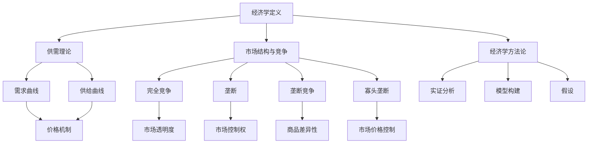

                 

## 文章标题：经济影响

### 关键词：经济学、经济理论、技术进步、全球化、环境问题、金融危机

### 摘要

本文深入探讨了经济学的基本概念和理论，分析了技术进步、全球化、环境问题、金融危机等对经济的影响。通过详细阐述各个领域的核心原理、实际案例和政策措施，本文旨在为读者提供全面而深刻的经济学认识，并探讨如何在复杂多变的经济环境中实现可持续发展。

## 第一部分：经济理论基础

### 第1章：经济学的核心概念

#### 1.1 经济学的定义与发展

经济学是研究人类如何有效配置稀缺资源的学科。其基本任务是理解经济行为、决策过程以及经济体系如何运作。经济学的发展历程可以追溯到古希腊时期，但作为一门独立的学科，经济学起源于17世纪末18世纪初的重商主义和古典经济学。随着经济学理论的不断演进，现代经济学在19世纪末20世纪初逐渐形成，并在20世纪中叶经历了微观经济学和宏观经济学的发展。经济学不仅涵盖了资源分配的问题，还涉及生产、消费、分配和贸易等各个方面。

#### 1.2 供需理论

供需理论是经济学中最基本的理论之一，用于解释商品和服务的价格形成及市场均衡状态。需求是指消费者在一定时间内，在各种可能的价格水平下，愿意且能够购买的商品数量。供给则是指生产者在一定时间内，在各种可能的价格水平下，愿意且能够出售的商品数量。供需理论的核心观点是市场通过价格机制来调节供需关系，达到市场均衡。

供需曲线是描述供需关系的图形工具。需求曲线向下倾斜，表明价格和需求量呈反比关系；供给曲线则向上倾斜，表明价格和供给量呈正比关系。当需求曲线和供给曲线相交时，即达到市场均衡点，此时市场价格和数量稳定不变。

#### 1.3 市场结构与竞争

市场结构是指市场中卖方和买方的数量及其规模、分布等特征。市场结构决定了市场行为的特征和结果，常见的市场结构包括完全竞争、垄断、垄断竞争和寡头垄断。

- **完全竞争**：在完全竞争市场中，存在大量卖方和买方，产品同质化，信息完全透明，企业无法通过价格策略影响市场。
- **垄断**：在垄断市场中，只有一个卖方，企业拥有市场控制权，可以通过控制产量和价格来影响市场。
- **垄断竞争**：在垄断竞争市场中，存在多个卖方，但商品具有一定的差异性，企业具有一定的市场控制权。
- **寡头垄断**：在寡头垄断市场中，存在几个主要卖方，它们对市场价格和产量有较大影响力。

竞争是市场中的重要现象，通过竞争，企业提高效率，创新产品，从而推动经济增长。竞争分为价格竞争和非价格竞争，价格竞争主要通过降低成本、提高质量来吸引消费者；非价格竞争则通过品牌建设、广告宣传等手段来争夺市场份额。

### 1.4 经济学方法论

经济学方法论是指研究经济现象的方法和工具。经济学方法论主要包括实证分析、模型构建和假设。

- **实证分析**：实证分析通过收集和分析实际数据来验证经济学理论。实证分析的方法包括数据收集、数据分析和数据解释。数据来源可以是问卷调查、统计数据、市场调研等。
- **模型构建**：模型构建是经济学研究的重要手段，通过简化现实世界的复杂性，抽象出经济现象的关键特征，从而便于分析和解释。经济学模型包括微观经济学模型和宏观经济学模型。
- **假设**：经济学假设是经济学模型的基础。常见的经济学假设包括理性人假设、完全信息假设和有效市场假设。理性人假设是指经济行为主体总是追求最大化效用或利润；完全信息假设是指市场参与者拥有完全的信息，能够做出最优决策；有效市场假设是指市场价格已经反映了所有可用信息，价格波动是随机且不可预测的。

#### 1.5 经济学的核心概念与联系

为了更好地理解经济学的核心概念，我们可以使用Mermaid流程图来展示它们之间的联系：

### 1.6 小结

本章节详细介绍了经济学的核心概念和理论，包括经济学的定义与发展、供需理论、市场结构与竞争、经济学方法论等。这些核心概念构成了经济学的理论框架，为后续章节的深入分析提供了基础。

## 第二部分：经济影响分析

### 第2章：微观经济学原理

#### 2.1 消费者行为

消费者行为是微观经济学研究的核心内容之一，它关注的是消费者在购买商品和服务时的决策过程。消费者行为的分析基于效用理论和边际效用递减规律。

#### 2.1.1 消费者效用函数

消费者效用函数是描述消费者在不同商品消费组合下获得效用水平的数学模型。常见的效用函数包括线性效用函数、二次效用函数和对数效用函数等。线性效用函数形式为：

$$
U(x_1, x_2) = ax_1 + bx_2
$$

其中，$x_1$ 和 $x_2$ 分别表示两种商品的数量，$a$ 和 $b$ 分别表示两种商品的效用权重。

#### 2.1.2 边际效用

边际效用是消费者在消费一个额外单位商品时获得的额外效用。边际效用递减规律指出，随着商品消费量的增加，边际效用逐渐减少。这一规律可以用数学公式表示：

$$
MU_x = \frac{dU}{dx_x}
$$

其中，$MU_x$ 表示商品 $x$ 的边际效用，$U$ 表示总效用，$x_x$ 表示商品 $x$ 的数量。

#### 2.1.3 边际效用递减规律

边际效用递减规律是指，随着消费者对某种商品的消费量增加，边际效用逐渐减少。这一规律可以用以下公式表示：

$$
MU_x1 > MU_x2 > MU_x3 > ...
$$

#### 2.2 生产者行为

生产者行为是微观经济学研究的另一个核心内容，它关注的是生产者在生产过程中如何决策以最大化利润。生产者行为的分析基于生产函数和边际产量。

#### 2.2.1 生产函数

生产函数是描述生产过程中各种生产要素（如劳动、资本、土地等）与产出之间关系的数学模型。常见的生产函数形式包括柯布-道格拉斯生产函数和对数生产函数等。柯布-道格拉斯生产函数形式为：

$$
Q = AL^aK^b
$$

其中，$Q$ 表示产出，$L$ 表示劳动，$K$ 表示资本，$A$ 表示技术系数，$a$ 和 $b$ 分别表示劳动和资本的产出弹性。

#### 2.2.2 边际产量

边际产量是生产函数中某一生产要素增加一个单位时，导致产出增加的量。边际产量的计算公式为：

$$
MP_L = \frac{dQ}{dL}
$$

其中，$MP_L$ 表示劳动的边际产量，$Q$ 表示产出，$L$ 表示劳动。

#### 2.2.3 规模经济与规模不经济

规模经济和规模不经济是生产者行为中的两个重要概念。规模经济是指随着生产规模的扩大，单位产出的成本逐渐降低的现象。规模不经济则是指随着生产规模的扩大，单位产出的成本逐渐增加的现象。规模经济的计算公式为：

$$
AC(Q) = \frac{C(Q)}{Q}
$$

其中，$AC(Q)$ 表示平均成本，$C(Q)$ 表示总成本。

#### 2.3 市场均衡与价格机制

市场均衡是指市场中需求与供给相等，价格不再发生变化的状态。价格机制是市场通过价格调节供需关系，实现市场均衡的一种机制。

#### 2.3.1 需求与供给

需求是指消费者愿意在一定时间内购买某种商品或服务的数量。需求曲线向下倾斜，表明价格和需求量呈反比关系。供给是指生产者在一定时间内愿意出售的商品或服务的数量。供给曲线向上倾斜，表明价格和供给量呈正比关系。

#### 2.3.2 市场均衡

市场均衡是指市场上需求量等于供给量，价格稳定不变的状态。市场均衡点的计算公式为：

$$
Q_d = Q_s
$$

其中，$Q_d$ 表示需求量，$Q_s$ 表示供给量。

#### 2.3.3 价格机制

价格机制是市场通过价格调节供需关系，实现市场均衡的一种机制。价格上升会增加供给，减少需求；价格下降则相反。

#### 2.4 市场结构与竞争

市场结构是指市场中卖方和买方的数量及其规模、分布等特征。市场结构决定了市场行为的特征和结果，常见的市场结构包括完全竞争、垄断、垄断竞争和寡头垄断。

#### 2.4.1 完全竞争市场

完全竞争市场是指市场中存在大量的卖方和买方，产品同质化，信息完全透明，企业无法通过价格策略影响市场。

#### 2.4.2 垄断市场

垄断市场是指市场中只有一个卖方，企业拥有市场控制权，可以通过控制产量和价格来影响市场。

#### 2.4.3 垄断竞争市场

垄断竞争市场是指市场中存在多个卖方，但商品具有一定的差异性，企业具有一定的市场控制权。

#### 2.4.4 寡头垄断市场

寡头垄断市场是指市场中存在几个主要卖方，它们对市场价格和产量有较大影响力。

#### 2.5 小结

本章节详细介绍了微观经济学的基本原理，包括消费者行为和生产者行为，以及市场均衡和价格机制。这些原理为深入理解市场经济运作提供了基础。

## 第三部分：经济影响案例分析

### 第3章：金融危机与经济稳定

#### 3.1 金融危机的定义与类型

金融危机是指金融市场出现大规模混乱，导致金融资产价格大幅波动，金融机构和金融市场遭受严重损失的突发事件。金融危机可以分为货币危机、债务危机和银行危机等类型。

- **货币危机**：货币危机是指货币汇率急剧下跌，导致经济体系不稳定。
- **债务危机**：债务危机是指企业或国家无法偿还债务，导致金融体系崩溃。
- **银行危机**：银行危机是指银行体系出现大规模问题，导致银行破产或被迫关闭。

#### 3.2 金融危机的成因

金融危机的成因复杂多样，主要包括以下几个方面：

- **经济周期**：经济周期是金融危机的重要触发因素。在经济繁荣期，金融机构和投资者过度扩张，增加债务和投资，积累风险。当经济进入衰退期时，债务违约和资产价格下跌，导致金融危机爆发。
- **金融创新**：金融创新是金融危机的另一个重要因素。金融创新可能导致金融市场过度复杂化，增加风险。例如，衍生品市场的发展在某种程度上加剧了金融危机的风险。
- **监管缺失**：监管缺失是金融危机的重要原因。缺乏有效的金融监管可能导致金融机构违规操作，增加金融风险。例如，2008年全球金融危机中，美国金融监管机构未能有效监管金融市场的风险。
- **资本流动**：资本流动也是金融危机的成因之一。国际资本流动可能导致金融市场波动，增加金融危机的风险。例如，资本大量流入新兴市场国家可能导致资产价格泡沫，一旦资本撤离，资产价格急剧下跌，引发金融危机。

#### 3.3 金融危机的传导机制

金融危机的传导机制是指金融危机从金融市场蔓延到实体经济的过程。金融危机的传导机制主要包括以下几个环节：

- **金融市场动荡**：金融危机首先在金融市场上爆发，导致金融资产价格大幅波动，金融机构和投资者的信心受损。
- **信用紧缩**：金融市场动荡导致金融机构惜贷，减少对实体经济的信贷支持，造成信用紧缩。
- **实体经济衰退**：信用紧缩导致企业融资困难，生产活动减少，就业率下降，进而引发实体经济衰退。
- **社会动荡**：经济衰退可能导致社会不满情绪上升，引发社会动荡。

#### 3.4 经济稳定的政策选择

为了应对金融危机，政府可以采取一系列政策来稳定经济。经济稳定的政策选择主要包括以下几个方面：

- **财政政策**：财政政策是指政府通过调整支出和税收来影响经济活动的政策。在金融危机期间，政府可以增加财政支出，刺激经济增长，缓解经济衰退。例如，美国政府2008年金融危机期间推出的7870亿美元经济刺激计划。
- **货币政策**：货币政策是指中央银行通过调整利率和货币供应量来影响经济活动的政策。在金融危机期间，中央银行可以降低利率，降低企业融资成本，刺激投资和消费。例如，美联储2008年金融危机期间多次降低利率。
- **金融监管**：金融监管是指政府通过制定和执行金融法规来规范金融市场行为的政策。在金融危机期间，政府可以加强金融监管，防止金融机构违规操作，降低金融危机的风险。例如，2008年全球金融危机后，美国通过了多德-弗兰克法案，加强金融监管。
- **国际合作**：国际合作是指各国政府通过协调政策来应对全球金融危机的政策。在金融危机期间，各国政府可以加强合作，共同应对金融危机。例如，2008年全球金融危机期间，二十国集团（G20）采取了一系列措施，共同稳定全球经济。

#### 3.5 小结

本章节详细分析了金融危机的定义、类型、成因、传导机制以及经济稳定的政策选择。金融危机对经济产生了深远的影响，政府需要采取有效政策来稳定经济，防止金融危机的蔓延。

## 第四部分：经济发展理论与政策

### 第4章：经济发展理论与政策

#### 4.1 发达国家经济发展模式

发达国家的经济发展模式通常以市场为主导，技术创新为核心，资本密集为特征。发达国家在经济发展过程中，通过市场机制的完善、科技创新和资本积累，实现了经济的高速增长和持续发展。

- **市场主导**：发达国家的经济体制以市场经济为基础，市场在资源配置中发挥决定性作用。企业根据市场需求进行生产，消费者根据个人偏好进行消费，市场机制有效调节供需关系。
- **技术创新**：发达国家高度重视科技创新，通过持续研发和技术创新，提高生产效率，推动产业升级。科技创新是发达国家经济增长的重要驱动力。
- **资本积累**：发达国家通过长期资本积累，为经济发展提供了坚实的物质基础。资本积累主要通过储蓄、投资和金融市场的运作来实现。

#### 4.2 发展中国家经济发展挑战

发展中国家在经济发展过程中面临诸多挑战，包括人口增长、贫困问题、资源约束和环境问题等。

- **人口增长**：发展中国家普遍面临人口增长压力，人口增长可能导致就业压力增大，资源分配紧张，影响经济稳定和发展。
- **贫困问题**：发展中国家存在大量贫困人口，贫困问题影响社会公平和经济稳定。解决贫困问题需要通过就业、教育和社会保障等政策措施。
- **资源约束**：发展中国家资源相对匮乏，资源约束制约了经济发展。资源约束问题需要通过资源管理和合理利用来解决。
- **环境问题**：发展中国家在追求经济增长的过程中，面临严重的环境问题。环境问题可能导致生态破坏、资源枯竭和公共健康问题，影响经济可持续发展。

#### 4.3 经济政策与调控手段

为了实现经济发展，发展中国家需要制定和实施有效的经济政策与调控手段。

- **宏观调控**：宏观调控是指政府通过调整经济总量和结构，实现经济稳定和增长。宏观调控手段包括财政政策、货币政策和产业政策等。
- **市场化改革**：市场化改革是指政府通过放宽市场准入、减少行政干预和推进市场化改革，提高市场效率。市场化改革是发展中国家实现经济发展的关键举措。
- **科技创新**：科技创新是推动经济发展的重要动力。发展中国家需要加大对科技创新的投入，培养创新人才，提高科技创新能力。
- **社会保障**：社会保障是指政府通过建立社会保障体系，保障人民基本生活需求，促进社会公平和经济稳定。社会保障包括医疗保险、养老保险、失业保险等。

#### 4.4 小结

本章节分析了发达国家经济发展模式和发展中国家经济发展挑战，探讨了经济政策与调控手段。发达国家通过市场主导、技术创新和资本积累实现了经济发展，发展中国家则需要应对人口增长、贫困问题、资源约束和环境问题等挑战，通过宏观调控、市场化改革、科技创新和社会保障等政策措施，实现经济发展和社会进步。

## 第五部分：技术进步对经济的影响

### 第5章：技术进步对经济的影响

#### 5.1 技术进步的核心要素

技术进步是推动经济增长的关键因素之一，其核心要素包括创新、研发、教育和培训等。

- **创新**：创新是指通过引入新的产品、过程、服务或商业模式，创造新的价值。创新是技术进步的重要驱动力，可以推动产业升级和经济增长。
- **研发**：研发是指企业在科研机构、高校等合作伙伴的支持下，进行新技术、新产品、新工艺的研究和开发。研发是创新的基础，可以提高企业的竞争力和创新能力。
- **教育**：教育是指通过教育和培训提高劳动者的技能和知识水平。教育是技术进步的重要保障，可以提高劳动者的素质和创新能力。
- **培训**：培训是指通过培训提高劳动者的专业技能和工作能力。培训是教育的重要补充，可以帮助劳动者适应新技术和新工艺。

#### 5.2 技术进步的经济效益分析

技术进步对经济产生了显著的效益，主要包括以下几个方面：

- **提高生产率**：技术进步可以提高生产效率，降低生产成本，从而增加企业的利润。生产效率的提高可以通过引入新的生产技术、优化生产流程和改进设备来实现。
- **增加产品多样性**：技术进步可以开发出更多的新产品，满足消费者的多样化需求。产品多样性的增加可以通过创新研发和技术升级来实现。
- **促进产业升级**：技术进步可以推动传统产业的升级和转型，促进新兴产业的快速发展。产业升级可以通过技术创新和产业政策来实现。
- **提高国际竞争力**：技术进步可以提高企业的国际竞争力，促进出口增长。国际竞争力的提高可以通过技术创新和品牌建设来实现。

#### 5.3 技术进步的挑战与应对策略

尽管技术进步带来了显著的经济效益，但同时也面临一些挑战和问题：

- **技术壁垒**：技术进步可能产生技术壁垒，阻碍其他企业进入市场。技术壁垒可以通过知识产权保护和专利壁垒来实现。
- **知识共享**：技术进步需要有效的知识共享和合作机制，以促进技术创新的普及和应用。知识共享可以通过合作研发、技术交流和人才培养来实现。
- **就业转型**：技术进步可能导致部分传统岗位的消失，引发就业转型问题。就业转型可以通过教育培训和就业指导来解决。

#### 5.4 小结

本章节分析了技术进步的核心要素和经济效益，探讨了技术进步面临的挑战及应对策略。技术进步是推动经济增长的重要动力，通过提高生产率、增加产品多样性、促进产业升级和提高国际竞争力，为经济发展提供了强大的支持。

## 第六部分：全球化对经济的冲击

### 第6章：全球化对经济的冲击

#### 6.1 全球化的定义与演进

全球化是指国际间经济、政治、文化等领域的相互联系和影响的不断加深。全球化经历了以下几个重要阶段：

- **国际贸易**：全球化最初的表现是国际贸易的迅速发展。随着贸易壁垒的降低和贸易自由化进程的推进，商品和服务的跨国流动日益频繁。
- **跨国公司**：跨国公司的兴起是全球化的重要推动力量。跨国公司通过在多个国家建立生产基地和市场，促进了资本、技术和管理经验的跨国流动。
- **信息技术**：信息技术的飞速发展极大地推动了全球化。互联网、移动通信和电子商务等技术的普及，使得信息传递和交流更加便捷，跨国交流和合作更加紧密。
- **全球化经济**：全球化经济阶段是全球化发展的最新阶段，表现为全球经济的深度融合和一体化。全球经济一体化的标志是跨国投资、国际资本流动和全球供应链的形成。

#### 6.2 全球化对经济的影响

全球化对经济产生了深远的影响，主要体现在以下几个方面：

- **贸易自由化**：全球化促进了贸易自由化，降低了贸易壁垒，使得商品和服务的跨国流动更加便捷。贸易自由化提高了生产效率，促进了资源配置优化，推动了全球经济增长。
- **资本流动**：全球化加剧了资本的国际流动，为企业和投资者提供了更多投资机会。资本流动促进了跨国投资，推动了新兴市场的经济发展，但也可能导致金融市场波动。
- **劳动力流动**：全球化促进了劳动力的跨国流动，提高了劳动力市场的效率。劳动力流动为跨国公司提供了灵活的人力资源，但也可能导致一些国家的劳动力市场失衡。
- **技术创新**：全球化推动了技术创新的传播和应用。跨国公司和国际合作项目促进了技术交流和合作，提高了技术创新的效率和水平。

#### 6.3 全球化背景下的发展问题

尽管全球化对经济产生了积极的影响，但也带来了一些发展问题：

- **发展不平衡**：全球化背景下，发达国家和发展中国家之间的经济发展不平衡问题日益突出。发达国家通过全球化获得了更多的经济利益，而发展中国家则面临着经济发展滞后、贫困和不平等加剧等问题。
- **劳动力市场失衡**：全球化可能导致劳动力市场失衡，一些国家或地区的劳动力过剩，而另一些国家或地区则劳动力短缺。劳动力市场失衡可能导致就业压力增大，影响社会稳定。
- **环境问题**：全球化加剧了环境问题，跨国生产和消费模式导致了环境污染和资源消耗。环境问题对经济可持续发展构成了严重威胁。

#### 6.4 小结

本章节分析了全球化的定义与演进，探讨了全球化对经济的影响以及全球化背景下的发展问题。全球化是推动经济增长的重要力量，但也需要关注其带来的发展问题，通过政策调整和合作，实现全球经济的可持续发展。

## 第七部分：环境问题对经济的制约

### 第7章：环境问题对经济的制约

#### 7.1 环境问题的经济学分析

环境问题是经济学研究的重要内容，其经济学分析主要涉及外部性和资源稀缺性。

- **外部性**：外部性是指经济活动对第三方产生的影响。环境问题通常具有外部性，例如，工厂排放的污染物会对周围居民的健康产生负面影响。外部性会导致市场失灵，因为市场无法充分反映这些外部成本。
- **资源稀缺性**：资源稀缺性是指资源的有限性与需求的增长之间的矛盾。环境问题，如森林砍伐、水资源短缺和土地退化，都是由于资源的稀缺性引起的。资源稀缺性会导致资源的过度开发和利用，影响经济的可持续发展。

#### 7.2 环境政策的经济学考量

为了解决环境问题，政府需要制定和实施有效的环境政策。环境政策的经济学考量主要包括以下几个方面：

- **市场工具**：市场工具是解决环境问题的重要手段，例如，碳交易和排污许可。碳交易通过市场机制降低碳排放成本，排污许可则通过分配排污权来控制污染物排放。
- **政府干预**：政府干预是环境政策的重要组成部分。政府可以通过制定法规和标准来限制污染物的排放，保护环境资源。政府干预还包括提供公共产品，如环境保护基础设施和生态修复项目。
- **技术创新**：技术创新是解决环境问题的关键。通过研发和应用新技术，可以降低环境污染和资源消耗。政府和企业应加大对环境保护技术的研发和推广。

#### 7.3 环境经济学的解决方案

环境经济学提供了一系列解决方案来应对环境问题，主要包括以下几个方面：

- **可持续发展**：可持续发展是指在满足当代需求的同时，不损害后代满足需求的能力。可持续发展要求经济增长与环境保护相协调，实现经济、社会和环境的综合发展。
- **绿色经济**：绿色经济是一种注重环境保护和资源有效利用的经济模式。绿色经济通过减少资源消耗和环境污染，提高资源利用效率，实现经济的可持续发展。
- **环境成本内部化**：环境成本内部化是指将环境成本纳入经济活动的成本中，使经济活动对环境的影响得到充分反映。通过内部化环境成本，可以引导企业和消费者做出更环保的决策。

#### 7.4 小结

本章节分析了环境问题的经济学分析，探讨了环境政策的经济学考量以及环境经济学的解决方案。环境问题对经济产生了严重的制约，通过有效的环境政策和技术创新，可以缓解环境问题，实现经济的可持续发展。

## 第八部分：社会问题与经济影响

### 第8章：社会问题与经济影响

#### 8.1 贫困与不平等问题

贫困与不平等问题是社会经济发展中的重大挑战。贫困是指人们无法满足基本生活需求的状态，而不平等则是指社会收入、财富和机会的不均衡分布。

- **贫困问题的定义与衡量**：贫困问题通常使用贫困线作为衡量标准，贫困线是指一个人或家庭在特定时期内，为了满足基本生活需求所需的最小收入水平。贫困线以下的人口被视为贫困人口。
- **不平等问题的定义与衡量**：不平等问题通常使用基尼系数来衡量，基尼系数是衡量收入分配不平等的指标，数值范围在0到1之间，越接近1表示不平等程度越高。
- **贫困与不平等的影响**：贫困与不平等对社会经济产生了深远影响。贫困会影响社会稳定，导致犯罪率上升、社会动荡等问题。不平等则会加剧社会分化，影响经济发展和社会公平。

#### 8.2 教育与经济发展

教育是促进经济发展的重要途径，教育与经济发展之间存在密切的互动关系。

- **教育对经济增长的贡献**：教育可以提高劳动者的技能和知识水平，从而提高生产效率。教育还可以培养创新人才，推动科技创新和产业升级，促进经济增长。
- **教育不平等的后果**：教育不平等可能导致贫困和不平等问题的加剧。教育不平等会阻碍贫困人口的脱贫，影响社会公平和经济稳定。

#### 8.3 医疗保障与社会经济

医疗保障是保障公民健康和社会经济稳定的重要手段。

- **医疗保障的概念与重要性**：医疗保障是指政府或社会组织为公民提供医疗服务和医疗保险的制度。医疗保障可以提高公民的健康水平，减少因病致贫现象，促进社会稳定。
- **医疗保障对经济发展的作用**：医疗保障可以提高劳动力健康水平，降低因病失业率，促进经济增长。同时，医疗保障还可以减少因病返贫现象，促进社会公平。

#### 8.4 社会问题与经济影响的相互作用

社会问题与经济影响之间存在相互作用的复杂关系。

- **经济影响对社会问题的加剧**：经济增长不平等可能导致贫困和不平等问题的加剧。此外，经济增长过程中产生的环境污染和资源消耗也可能加剧社会问题。
- **社会问题对经济影响的制约**：社会问题，如贫困、不平等和健康问题，会影响劳动力素质和劳动生产率，制约经济增长。此外，社会问题还可能导致社会动荡，影响经济稳定。

#### 8.5 小结

本章节分析了贫困与不平等问题、教育与经济发展、医疗保障与社会经济等社会问题对经济的影响。通过理解这些问题的相互作用，可以为制定有效的社会政策和经济发展战略提供依据。

## 第十部分：经济影响案例分析

### 第10章：美国次贷危机分析

#### 10.1 次贷危机的背景

次贷危机是指2007年至2008年间，由于美国次级抵押贷款市场崩溃引发的一系列金融危机。次贷市场是针对信用等级较低的借款人发放的住房抵押贷款市场。次贷危机的背景主要包括以下几个方面：

- **金融市场的创新与衍生品**：20世纪90年代末以来，金融市场不断创新，衍生品市场迅速发展。金融机构通过将次级抵押贷款打包成抵押贷款支持证券（MBS）和债务担保债券（CDO）等金融产品，提高了资金的流动性，但同时也增加了金融系统的复杂性。
- **低利率环境**：美联储在21世纪初实行低利率政策，以刺激经济增长和减轻经济周期的影响。低利率环境导致房贷利率较低，刺激了房地产市场繁荣和购房需求。
- **房地产市场的繁荣与泡沫**：在低利率和金融创新的双重推动下，房地产市场迅速繁荣，房价大幅上涨，形成房地产泡沫。

#### 10.2 次贷危机的成因

次贷危机的成因复杂多样，涉及金融市场、金融机构、监管制度等多个方面：

- **金融机构的激励机制**：金融机构为了增加利润，采取了高风险、高回报的贷款策略。金融机构通过将次级抵押贷款打包成金融产品出售，获取高额佣金和利润。这种激励机制导致金融机构过度依赖次贷市场，增加了金融系统的风险。
- **监管缺失与市场失灵**：在次贷危机前，金融监管制度存在严重缺陷。监管机构未能有效监测和管理金融市场的风险，导致金融市场过度自由化。市场失灵表现为金融市场信息不对称，投资者无法充分了解次级抵押贷款的风险。
- **房地产市场的繁荣与泡沫**：房地产市场的繁荣和泡沫是次贷危机的直接触发因素。在低利率环境下，房价持续上涨，导致购房者对未来房价的预期乐观，进一步推动房价上涨。然而，房价的上涨是不可持续的，最终导致房地产市场的崩溃。

#### 10.3 次贷危机的后果与影响

次贷危机对全球经济产生了深远的影响，主要体现在以下几个方面：

- **金融市场动荡**：次贷危机导致全球金融市场剧烈动荡，股市和债券市场暴跌，金融机构破产或被迫并购。金融市场动荡加剧了全球经济的不稳定性。
- **实体经济衰退**：次贷危机引发全球金融危机，导致实体经济陷入衰退。企业倒闭、失业率上升，消费下降，经济增长放缓。全球经济增长放缓进一步加剧了金融危机的影响。
- **政府干预与救助**：次贷危机后，各国政府采取了大规模的干预和救助措施，以稳定经济。政府干预措施包括金融救助、财政刺激计划和经济政策调整。这些措施在一定程度上缓解了金融危机的影响，但同时也增加了政府的债务负担。

#### 10.4 次贷危机的教训与启示

次贷危机给全球金融市场和经济发展带来了深刻的教训和启示：

- **加强金融监管**：次贷危机表明，金融监管制度需要不断完善和加强。监管机构应加强对金融市场的监测和管理，防范系统性风险。同时，应建立跨境监管机制，确保全球金融市场的稳定。
- **金融创新与风险管理**：金融创新是推动金融市场发展的重要动力，但同时也需要加强风险管理。金融机构应建立健全的风险管理体系，合理评估和管理金融产品的风险。
- **经济发展与金融稳定**：经济发展与金融稳定密切相关。政府应制定合理的经济政策，保持经济稳定增长，同时防范金融风险。经济发展与金融稳定的平衡是实现可持续发展的关键。

#### 10.5 小结

次贷危机是对全球金融市场和经济体系的一次重大考验。通过分析次贷危机的背景、成因、后果和教训，我们可以更好地理解经济风险和金融监管的重要性，为未来的经济发展提供有益的启示。

## 第十一部分：经济影响案例分析

### 第11章：中国经济转型升级案例分析

#### 11.1 中国经济转型的背景

中国经济转型是指从传统的发展模式向更加高质量、创新驱动的发展模式转变。中国经济转型的背景主要包括以下几个方面：

- **改革开放以来的经济发展**：改革开放以来，中国经济取得了显著成就，成为世界第二大经济体。然而，传统的发展模式也带来了资源环境约束、产业结构不合理等问题。
- **资源环境约束**：随着经济的快速发展，资源消耗和环境压力逐渐加大，传统发展模式难以为继。资源环境约束要求中国经济必须转型升级，实现可持续发展。
- **产业结构不合理**：中国产业结构存在一定程度的失衡，高能耗、高污染的行业比重较大，而新兴产业和高端服务业发展相对滞后。产业结构不合理制约了经济的可持续发展，需要通过转型升级来优化产业结构。

#### 11.2 中国经济转型的路径与成果

中国经济转型的路径主要包括以下几个方面：

- **科技创新驱动**：中国将科技创新作为经济转型的重要驱动力。通过加大研发投入，培育创新企业，提升科技创新能力，推动新兴产业的发展。
- **产业结构调整**：中国通过调整产业结构，优化资源配置，推动高能耗、高污染行业的转型升级，培育新兴产业和高端服务业。例如，通过发展新能源、新材料、生物医药等产业，提升产业链水平。
- **市场化改革**：中国深化市场化改革，放宽市场准入，减少行政干预，提高市场效率。通过市场化改革，激发市场主体活力，推动经济转型升级。

中国经济转型的成果主要体现在以下几个方面：

- **经济增长质量提升**：通过科技创新和产业结构调整，中国经济增长质量得到显著提升。高新技术产业和新兴产业快速发展，成为经济增长的重要动力。
- **环境质量改善**：通过转型升级，中国经济实现了经济发展与环境保护的协调。资源利用效率提高，环境污染得到有效治理，生态环境质量逐步改善。
- **社会结构优化**：通过转型升级，中国社会结构逐步优化。就业结构更加合理，高收入人群比重增加，社会保障体系不断完善。

#### 11.3 中国经济转型的挑战与对策

尽管中国经济转型取得了显著成果，但仍面临一些挑战：

- **科技创新能力不足**：中国科技创新能力仍需提高，部分核心技术受制于人。为此，中国需要加大研发投入，培育创新人才，提升自主创新能力。
- **产业结构调整难度大**：传统产业转型和新兴产业培育需要较长时间，产业结构调整面临较大难度。为此，中国需要优化政策环境，推动传统产业升级和新兴产业发展。
- **区域发展不平衡**：中国经济转型过程中，区域发展不平衡问题仍然存在。为此，中国需要实施区域协调发展策略，促进东部地区与中西部地区的协调发展。

为应对这些挑战，中国采取了以下对策：

- **加大科技创新投入**：政府加大对科技创新的投入，鼓励企业研发创新，培育创新人才，提升自主创新能力。
- **优化政策环境**：政府优化政策环境，减少行政干预，提高市场效率，激发市场主体活力。
- **区域协调发展**：政府实施区域协调发展策略，加大对中西部地区和农村地区的支持力度，促进区域经济协调发展。

#### 11.4 小结

中国经济转型升级是中国经济发展的必然选择。通过科技创新、产业结构调整和市场化改革，中国经济转型取得了显著成果。尽管面临挑战，但中国有信心和决心实现经济高质量发展，为全球经济发展提供有力支撑。

## 第十二部分：数字经济时代下的经济影响

### 第12章：数字经济时代下的经济影响

#### 12.1 数字经济的定义与发展

数字经济是指以数字技术和互联网为核心，通过数据收集、处理、传输和利用，实现经济增长和社会进步的经济形态。数字经济的发展经历了几个重要阶段：

- **互联网起步阶段**：20世纪90年代，互联网的普及为数字经济的发展奠定了基础。电子商务、在线支付和社交媒体等新兴业态迅速崛起，推动了数字经济的发展。
- **移动互联网阶段**：21世纪初，移动互联网的兴起使得数字经济的应用场景更加丰富，移动支付、共享经济和线上服务成为数字经济的重要驱动力。
- **大数据与人工智能阶段**：大数据和人工智能技术的快速发展为数字经济注入了新的动力。大数据分析、人工智能应用和物联网技术的普及，使得数字经济向更加智能化和个性化方向发展。

#### 12.2 数字经济对传统经济的冲击

数字经济对传统经济产生了深远的影响，主要体现在以下几个方面：

- **就业结构变化**：数字经济的发展导致了就业结构的变化。一方面，新兴产业如互联网、电子商务和人工智能等领域创造了大量就业机会；另一方面，传统产业如制造业、零售业等受到冲击，部分岗位被自动化和智能化技术取代。
- **产业结构调整**：数字经济推动了产业结构的调整，新兴产业快速崛起，传统产业逐渐转型。数字经济促进了产业链的整合和升级，提高了产业效率。
- **消费模式改变**：数字经济改变了消费模式，线上购物、移动支付和线上服务成为主流。数字经济为消费者提供了更加便捷和个性化的消费体验，推动了消费升级。

#### 12.3 数字经济的未来发展

数字经济在未来将继续快速发展，并带来以下几方面的影响：

- **产业融合与协同发展**：数字经济将与其他产业深度融合，推动产业协同发展。例如，智能制造、智慧城市和数字健康等领域将快速发展，推动产业升级和经济增长。
- **数据治理与隐私保护**：随着数据量的爆炸式增长，数据治理和隐私保护将成为数字经济的重要议题。政府和企业需要制定有效的数据治理政策和隐私保护措施，确保数据的安全和隐私。
- **数字鸿沟问题**：数字经济的发展可能导致数字鸿沟问题加剧。发达国家和发展中国家在数字技术和基础设施方面的差距将进一步扩大，影响全球经济的平衡发展。

#### 12.4 小结

数字经济时代下的经济影响深远而广泛。通过互联网、大数据和人工智能等数字技术的应用，数字经济推动了就业结构变化、产业结构调整和消费模式改变。未来，数字经济将继续快速发展，带来新的机遇和挑战，为全球经济发展注入新的动力。

## 附录

### 附录 A：经济学常用公式与模型

#### A.1 马克思主义经济学核心公式

马克思主义经济学以劳动价值论为基础，主要涉及以下核心公式：

- **价值公式**：商品的价值由生产商品所耗费的社会必要劳动时间决定。

  $$
  V = L \cdot s
  $$

  其中，$V$ 表示商品的价值，$L$ 表示社会必要劳动时间，$s$ 表示劳动强度。

- **剩余价值公式**：剩余价值是工人创造的超过其劳动力价值的那部分价值。

  $$
  M = L \cdot (s - 1)
  $$

  其中，$M$ 表示剩余价值，$L$ 表示社会必要劳动时间，$s$ 表示劳动强度。

#### A.2 凯恩斯主义经济学核心公式

凯恩斯主义经济学主要关注宏观经济波动和失业问题，涉及以下核心公式：

- **总需求公式**：总需求是消费、投资、政府支出和净出口的总和。

  $$
  Y = C + I + G + (X - M)
  $$

  其中，$Y$ 表示总需求，$C$ 表示消费，$I$ 表示投资，$G$ 表示政府支出，$X$ 表示出口，$M$ 表示进口。

- **总供给公式**：总供给是指在一定价格水平下，企业愿意生产的商品和服务的总量。

  $$
  Y = f(P, Z)
  $$

  其中，$Y$ 表示总供给，$P$ 表示价格水平，$Z$ 表示其他影响供给的因素。

#### A.3 微观经济学核心模型

微观经济学主要涉及消费者行为和生产者行为的分析，以下为相关核心模型：

- **消费者效用最大化模型**：消费者效用最大化模型假设消费者在预算约束下，选择商品组合以最大化总效用。

  $$
  \max U(x_1, x_2) \quad \text{subject to} \quad P_1x_1 + P_2x_2 = M
  $$

  其中，$U(x_1, x_2)$ 表示总效用，$P_1$ 和 $P_2$ 分别表示商品1和商品2的价格，$M$ 表示预算。

- **生产者利润最大化模型**：生产者利润最大化模型假设生产者在成本约束下，选择生产要素组合以最大化利润。

  $$
  \max \pi = P \cdot Q - C(Q)
  $$

  其中，$\pi$ 表示利润，$P$ 表示商品价格，$Q$ 表示产出量，$C(Q)$ 表示总成本。

### 附录 B：经济学研究方法与工具

经济学研究方法与工具包括实证研究方法、案例研究方法和数理分析方法。

#### B.1 实证研究方法

实证研究方法通过收集和分析实际数据来验证经济学理论。常见的实证研究方法包括：

- **统计数据分析**：通过对大量经济数据进行描述性统计和回归分析，验证经济理论。
- **实验经济学**：通过设计实验，观察不同经济行为在控制条件下的表现，以验证经济理论。

#### B.2 案例研究方法

案例研究方法通过分析具体经济现象或事件，探讨经济理论的应用和现实影响。常见的案例研究方法包括：

- **案例描述**：详细描述经济现象或事件，分析其成因和影响。
- **案例比较**：对比不同案例，探讨经济理论在不同情境下的应用。

#### B.3 数理分析方法

数理分析方法通过构建数学模型来分析经济现象，常用的数理分析方法包括：

- **博弈论**：分析经济主体在策略互动中的行为和决策。
- **一般均衡分析**：分析整个经济体系在市场机制作用下的资源配置和价格形成。

### 附录 C：经济学参考书目与资源

#### C.1 基础教材与参考书

- **《微观经济学原理》**：曼昆，中国人民大学出版社
- **《宏观经济学》**：曼昆，中国人民大学出版社
- **《发展经济学》**：马斯-卡尼亚，上海财经大学出版社
- **《国际经济学》**：保罗·R·克鲁格曼，中国人民大学出版社

#### C.2 顶级期刊与研究报告

- **《美国经济评论》**：American Economic Review
- **《经济学季刊》**：The Quarterly Journal of Economics
- **《经济学与统计学评论》**：Econometrica
- **《世界发展报告》**：World Development Report

#### C.3 学术会议与论坛

- **国际经济学会年会**：International Economic Association Annual Conference
- **美国经济学会年会**：American Economic Association Annual Meeting
- **世界经济论坛**：World Economic Forum

## 作者信息

作者：AI天才研究院/AI Genius Institute & 禅与计算机程序设计艺术 /Zen And The Art of Computer Programming

