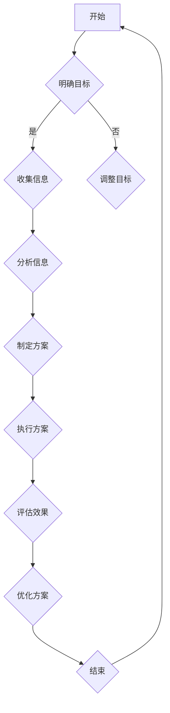
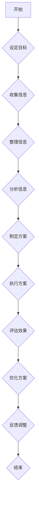

                 

### 文章标题：结构化思维原理与应用：思维有结构，表达才有结构。思维有结构，成长才有节奏

### 关键词：
- 结构化思维
- 思维模式
- 逻辑分析
- 个人成长
- 工作效率

### 摘要：
本文旨在探讨结构化思维原理及其在实际中的应用。通过分析结构化思维的定义、重要性、起源与发展，本文将详细阐述结构化思维的基本原则、核心概念和方法论。同时，本文还将展示结构化思维在个人成长、工作、决策解决问题和教育等方面的应用，并通过案例分析、实践指南和项目实战，提供具体的操作方法和实用工具。通过本文的阅读，读者将深入了解结构化思维的原理与应用，从而在个人和职业生活中实现更高效、有序的成长。

---

### 第一部分：引论

#### 1.1 结构化思维概述

**1.1.1 结构化思维的定义**

结构化思维是一种系统性、有序的思考方式，旨在将复杂的信息和问题分解为更小、更易于管理的部分，并建立它们之间的逻辑关系。它强调对信息的分类、整理和分析，从而形成一个清晰、完整的思维框架。

**1.1.2 结构化思维的重要性**

在现代社会，信息爆炸和复杂性不断增加，结构化思维成为应对各种挑战的关键能力。它有助于提高工作效率、优化决策过程、增强团队协作和推动个人成长。

**1.1.3 本书的目标与结构**

本书的目标是深入探讨结构化思维的原理与应用，帮助读者掌握这种有效的思考工具。本文分为五大部分：引论、原理、应用、案例与实践和扩展阅读与资源。通过逐步分析，读者将能够全面理解结构化思维的精髓，并学会将其应用于实际生活中。

#### 1.2 结构化思维的起源与发展

**1.2.1 结构化思维的起源**

结构化思维的起源可以追溯到古代哲学和逻辑学的探索。在古希腊，亚里士多德提出了形式逻辑，奠定了结构化思维的基础。随着时间的推移，结构化思维逐渐发展，并在工业革命后得到广泛应用。

**1.2.2 结构化思维的发展历程**

20世纪中叶，随着计算机科学的兴起，结构化思维在工程领域得到进一步发展。设计模式、模块化编程和软件工程方法论的兴起，为结构化思维提供了新的应用场景。

**1.2.3 结构化思维的现代应用**

在当今信息时代，结构化思维的应用范围广泛。从商业战略规划、项目管理到个人成长和心理健康，结构化思维无处不在，成为提升竞争力的关键因素。

---

### 第二部分：原理

#### 2.1 结构化思维的基本原则

**2.1.1 目标导向**

目标导向是结构化思维的核心原则之一。在进行思考和解决问题时，明确目标至关重要。通过设定具体、可衡量的目标，有助于集中精力、提高效率和实现预期成果。

**2.1.2 信息分类**

信息分类是结构化思维的重要组成部分。通过将信息按照特定标准进行分类，可以更好地整理和提取关键信息，从而提高思维的清晰度和逻辑性。

**2.1.3 系统性思考**

系统性思考强调将问题视为一个整体，分析其各个组成部分及其相互关系。通过系统性思考，可以更全面地理解问题，并制定有效的解决方案。

**2.1.4 模块化思维**

模块化思维是将复杂问题分解为更小、更易于管理的模块，然后分别解决。这种方法有助于降低问题的复杂度，提高解决问题的效率和质量。

#### 2.2 结构化思维的核心概念

**2.2.1 知识结构**

知识结构是指知识的组织和分类方式。通过建立合理的知识结构，可以更好地存储、检索和应用知识，从而提高思维效率。

**2.2.2 思维框架**

思维框架是结构化思维的工具，用于指导思考和解决问题的过程。常见的思维框架包括SWOT分析、PEST分析、5W1H等。

**2.2.3 思维模式**

思维模式是指人们在思考和解决问题时采用的固定方法和习惯。常见的思维模式包括因果思维、逆向思维、系统思维等。

#### 2.3 结构化思维的方法论

**2.3.1 决策思维**

决策思维是结构化思维在决策过程中的应用。通过设定决策目标、收集信息、评估风险和制定备选方案，可以更科学、有效地做出决策。

**2.3.2 解决问题的思维**

解决问题的思维是结构化思维在解决问题过程中的应用。通过明确问题、分析原因、制定解决方案和验证效果，可以高效地解决各种问题。

**2.3.3 创新思维**

创新思维是结构化思维在创新过程中的应用。通过激发想象力、组合现有资源、探索新方法和不断试错，可以创造出有价值的创新成果。

**2.3.4 沟通与合作思维**

沟通与合作思维是结构化思维在沟通与合作过程中的应用。通过明确沟通目标、倾听他人意见、表达清晰观点和建立共同目标，可以更好地实现团队合作。

#### 2.4 结构化思维的 Mermaid 流程图

**2.4.1 整体流程图**

**2.4.2 分步骤流程图**

---

### 第三部分：应用

#### 3.1 结构化思维在个人成长中的应用

**3.1.1 提升自我认知**

结构化思维有助于提升自我认知。通过分析自己的优势、劣势、兴趣和价值观，可以更清晰地认识自己，从而制定符合个人特点的发展计划。

**3.1.2 制定个人发展计划**

结构化思维可以帮助制定个人发展计划。通过设定具体目标、分解任务、制定行动计划和时间表，可以更高效地实现个人成长。

**3.1.3 增强时间管理能力**

结构化思维有助于增强时间管理能力。通过将任务按照重要性和紧急性分类，并设定优先级，可以更合理地安排时间，提高工作效率。

#### 3.2 结构化思维在工作中的应用

**3.2.1 提高工作效率**

结构化思维可以提高工作效率。通过明确工作目标、优化工作流程、分解任务和分工合作，可以减少无效劳动，提高工作效率。

**3.2.2 团队协作与沟通**

结构化思维有助于团队协作和沟通。通过建立清晰的沟通渠道、明确分工和责任、共享信息和资源，可以更好地实现团队合作。

**3.3.3 项目管理与优化**

结构化思维在项目管理和优化中具有重要作用。通过设定项目目标、制定项目计划、监控项目进度和评估项目效果，可以确保项目顺利完成。

#### 3.3 结构化思维在决策与解决问题中的应用

**3.3.1 决策分析方法**

结构化思维提供了多种决策分析方法，如SWOT分析、PEST分析、5W1H等。通过这些方法，可以更全面地评估决策因素，提高决策质量。

**3.3.2 问题诊断与解决**

结构化思维有助于问题诊断与解决。通过明确问题、分析原因、制定解决方案和验证效果，可以高效地解决各种问题。

**3.3.3 风险评估与管理**

结构化思维在风险评估与管理中具有重要作用。通过识别风险、评估风险影响、制定风险应对策略和监控风险变化，可以有效地降低风险。

#### 3.4 结构化思维在教育中的应用

**3.4.1 教学方法**

结构化思维可以应用于教学方法。通过建立知识结构、设计思维框架、引导学生思考和解决问题，可以激发学生的思维潜能。

**3.4.2 学生学习策略**

结构化思维有助于学生制定有效的学习策略。通过分类学习内容、制定学习计划、采用记忆方法和复习策略，可以提升学习效果。

**3.4.3 教育改革**

结构化思维在教育改革中具有重要作用。通过优化课程设计、创新教学方法、评估学生能力和促进教育公平，可以推动教育质量的提升。

---

### 第四部分：案例与实践

#### 4.1 结构化思维案例分析

**4.1.1 企业成功案例**

某大型企业在实施结构化思维后，通过明确目标、优化流程和加强团队合作，大幅提高了工作效率和竞争力。

**4.1.2 团队协作案例**

某技术团队在项目开发过程中，采用结构化思维进行团队协作，通过明确分工、共享资源和定期反馈，成功完成了多个复杂项目。

**4.1.3 个人成长案例**

某技术专家通过结构化思维进行自我成长，通过明确目标、制定计划、不断学习和反思，实现了从普通程序员到技术领导者的转变。

#### 4.2 结构化思维实践指南

**4.2.1 实践步骤**

1. 明确目标和问题。
2. 收集和分析信息。
3. 制定解决方案和行动计划。
4. 执行方案并监控效果。
5. 反馈和优化。

**4.2.2 实践工具**

1. 思维导图软件（如MindManager、XMind）。
2. 项目管理工具（如Trello、JIRA）。
3. 评估工具（如KPI、SWOT分析）。

**4.2.3 实践反馈与优化**

通过定期反馈和评估，识别问题和不足，并采取相应措施进行优化，以不断提高实践效果。

#### 4.3 项目实战

**4.3.1 项目背景**

某企业计划开发一款在线教育平台，以提高教育质量和用户体验。

**4.3.2 项目目标**

1. 设计并实现一个功能齐全的在线教育平台。
2. 提供优质的课程内容和教学资源。
3. 优化用户体验，提高用户满意度。

**4.3.3 项目实施**

1. 明确项目目标和需求。
2. 采用结构化思维进行需求分析和设计。
3. 分解任务并分配给团队成员。
4. 定期召开会议，沟通进展和解决问题。
5. 持续优化和改进，确保项目顺利完成。

**4.3.4 项目评估与优化**

1. 收集用户反馈，评估用户体验。
2. 分析项目进度和成果，评估项目效果。
3. 识别问题和不足，并采取优化措施。
4. 持续改进和优化，提高项目质量和用户满意度。

---

### 第五部分：扩展阅读与资源

#### 5.1 扩展阅读

**5.1.1 相关书籍推荐**

1. 《结构化思维与表达》
2. 《思维导图》
3. 《决策与判断》

**5.1.2 学术论文精选**

1. "The Role of Structured Thinking in Decision Making"
2. "Application of Structured Thinking in Project Management"
3. "Structured Thinking in Education: A Review"

**5.1.3 在线课程推荐**

1. "Introduction to Structured Thinking"
2. "Structured Thinking for Problem Solving"
3. "Structured Thinking in Business and Management"

#### 5.2 资源链接

**5.2.1 思维工具与软件**

1. MindManager
2. XMind
3. Trello

**5.2.2 思维训练资源**

1. "Critical Thinking Exercises"
2. "Mindfulness and Mindset"
3. "The Power of Positive Thinking"

**5.2.3 专业论坛与社群**

1. "LinkedIn Structured Thinking Group"
2. "Reddit Structured Thinking Community"
3. "Facebook Structured Thinking Page"

---

### 附录

#### 附录 A：思维框架与模板

**附录 A.1 常用思维框架**

1. SWOT分析
2. PEST分析
3. 5W1H
4. 创新思维框架
5. 决策思维框架

**附录 A.2 思维模板示例**

1. 个人成长计划模板
2. 项目管理模板
3. 决策分析模板
4. 风险评估模板
5. 教学方法模板

#### 附录 B：参考文献

**附录 B.1 主要参考文献**

1. 《结构化思维与表达》
2. 《思维导图》
3. 《决策与判断》

**附录 B.2 辅助参考文献**

1. "The Role of Structured Thinking in Decision Making"
2. "Application of Structured Thinking in Project Management"
3. "Structured Thinking in Education: A Review"
4. "Mindfulness and Mindset"
5. "The Power of Positive Thinking"

---

### 作者信息：

**作者：AI天才研究院/AI Genius Institute & 禅与计算机程序设计艺术 /Zen And The Art of Computer Programming**

