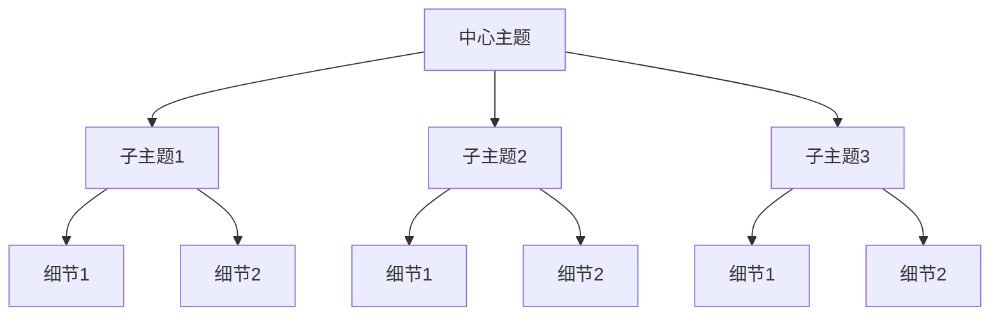

                 

# 《结构化思维的应用：从理论到实践》

## 概述

结构化思维是一种逻辑严谨、层次分明、系统化的思考方式。它不仅可以帮助我们更有效地解决问题，还能提高决策质量和创新效率。本文旨在探讨结构化思维在理论层面的应用，并进一步将其延伸到实践领域，旨在为读者提供一个全面、系统的理解和应用框架。

关键词：结构化思维、理论应用、实践应用、思维训练、决策、创新

### 摘要

本文首先概述了结构化思维的基本概念和重要性，接着详细分析了它在心理学、管理学和教育领域的应用。随后，文章探讨了结构化思维在项目管理、决策和创新中的应用，并通过实际案例进行了深入剖析。最后，本文提出了结构化思维的实践方法和技术工具，为读者提供了具体可行的操作指南。

## 《结构化思维的应用：从理论到实践》目录大纲

### 第一部分：引言

#### 1.1 研究背景与意义

#### 1.2 研究目的与内容概述

#### 1.3 研究方法与数据来源

#### 1.4 研究框架与结构安排

### 第二部分：结构化思维概述

#### 2.1 结构化思维的概念与内涵

#### 2.2 结构化思维的基本原理

#### 2.3 结构化思维与相关概念的联系与区别

#### 2.4 结构化思维的重要性

### 第三部分：结构化思维在理论层面的应用

#### 3.1 结构化思维在心理学中的应用

##### 3.1.1 结构化思维在认知心理学中的应用

##### 3.1.2 结构化思维在发展心理学中的应用

#### 3.2 结构化思维在管理学中的应用

##### 3.2.1 结构化思维在组织行为学中的应用

##### 3.2.2 结构化思维在人力资源管理中的应用

#### 3.3 结构化思维在教育领域的应用

##### 3.3.1 结构化思维在课程设计中的应用

##### 3.3.2 结构化思维在教学评估中的应用

### 第四部分：结构化思维在实践层面的应用

#### 4.1 结构化思维在工作中的应用

##### 4.1.1 结构化思维在项目管理中的应用

##### 4.1.2 结构化思维在团队协作中的应用

#### 4.2 结构化思维在决策中的应用

##### 4.2.1 结构化思维在商业决策中的应用

##### 4.2.2 结构化思维在公共政策决策中的应用

#### 4.3 结构化思维在创新中的应用

##### 4.3.1 结构化思维在产品创新中的应用

##### 4.3.2 结构化思维在技术创新中的应用

### 第五部分：案例分析

#### 5.1 案例一：企业战略规划中的结构化思维应用

#### 5.2 案例二：项目管理工作中的结构化思维应用

#### 5.3 案例三：公共政策制定中的结构化思维应用

### 第六部分：结构化思维的实践方法

#### 6.1 结构化思维训练方法

##### 6.1.1 结构化思维训练的理论基础

##### 6.1.2 结构化思维训练的实践方法

#### 6.2 结构化思维的工具与技术

##### 6.2.1 思维导图在结构化思维中的应用

##### 6.2.2 SWOT分析在结构化思维中的应用

##### 6.2.3 PEST分析在结构化思维中的应用

### 第七部分：结论与展望

#### 7.1 研究结论

#### 7.2 研究贡献

#### 7.3 研究局限与未来展望

### 附录

#### 附录 A：结构化思维相关的参考资料

#### 附录 B：本书使用的符号和术语说明

#### 附录 C：结构化思维案例分析的数据来源说明

#### 附录 D：本书中的 Mermaid 流程图及代码清单

#### 附录 E：本书中的伪代码示例列表及解释说明

#### 附录 F：本书中的数学公式列表及解释说明

#### 附录 G：本书中的项目实战案例代码清单及解释说明

## 第一部分：引言

### 1.1 研究背景与意义

在当今快速变化的社会和经济环境中，复杂问题层出不穷，人们需要更高的思维能力和解决问题的效率。结构化思维作为一种系统化的思考方式，能够在这种复杂环境中发挥重要作用。它的核心在于通过逻辑清晰、层次分明的分析，将复杂问题简化，帮助个体和组织做出更明智的决策。

研究结构化思维的应用，不仅有助于提升个体的认知能力和解决问题的效率，还能为组织的管理和运营提供有效的工具。随着信息技术和人工智能的快速发展，如何在复杂系统中应用结构化思维成为了一个重要的研究方向。本文旨在探讨结构化思维的理论基础和应用，并为其在实践中的应用提供指导。

### 1.2 研究目的与内容概述

本文的研究目的在于：

1. 深入探讨结构化思维的基本概念和原理。
2. 分析结构化思维在各个领域的应用，包括心理学、管理学和教育。
3. 探索结构化思维在实践层面的应用，如项目管理、决策和创新。
4. 通过案例分析，展示结构化思维在实际问题中的应用效果。
5. 提出结构化思维的训练方法和工具，以促进其在实际中的应用。

文章内容将分为以下几个部分：

1. 引言：介绍研究的背景和目的。
2. 结构化思维概述：阐述结构化思维的概念、原理和应用重要性。
3. 理论层面的应用：分析结构化思维在心理学、管理学和教育领域的应用。
4. 实践层面的应用：探讨结构化思维在工作、决策和创新中的应用。
5. 案例分析：通过实际案例展示结构化思维的应用效果。
6. 结构化思维的实践方法：提出结构化思维的训练方法和工具。
7. 结论与展望：总结研究成果，并提出未来研究方向。

### 1.3 研究方法与数据来源

本研究采用文献综述和案例分析相结合的方法。首先，通过查阅大量相关文献，梳理结构化思维的理论基础和应用现状。其次，选取具有代表性的案例，分析结构化思维在实际问题中的应用。数据来源主要包括学术论文、专业书籍、行业报告和实际案例数据。

### 1.4 研究框架与结构安排

本文的研究框架和结构安排如下：

1. 引言：介绍研究背景、目的、方法和框架。
2. 结构化思维概述：定义结构化思维，阐述其基本原理和应用重要性。
3. 理论层面的应用：分析结构化思维在心理学、管理学和教育领域的应用。
4. 实践层面的应用：探讨结构化思维在工作、决策和创新中的应用。
5. 案例分析：展示结构化思维的实际应用效果。
6. 结构化思维的实践方法：提出训练方法和工具。
7. 结论与展望：总结研究成果，提出未来研究方向。

通过这样的结构安排，本文旨在为读者提供一个全面、系统的结构化思维应用指南。

## 第二部分：结构化思维概述

### 2.1 结构化思维的概念与内涵

结构化思维是一种通过逻辑分析和系统化方法来理解和解决问题的思维方式。它强调思考的层次性和系统性，通过分解复杂问题，逐步细化，最终找到解决问题的最优路径。结构化思维不仅是一种思考方法，更是一种解决问题的工具，它可以帮助个体和组织在面对复杂问题时，保持清晰的思路，提高解决问题的效率。

结构化思维的核心概念包括以下几个方面：

1. **分解问题**：将复杂问题分解为若干个相对简单的子问题，以便于分析和解决。
2. **逻辑分析**：通过逻辑推理和分析，确保每个子问题的解决都是合理的，并且符合整体问题的要求。
3. **系统化方法**：通过系统化的方法，确保问题的解决不仅针对当前问题，还能为未来类似问题提供参考。
4. **层次分明**：确保思考过程和结果层次清晰，便于理解和实施。

### 2.2 结构化思维的基本原理

结构化思维的基本原理可以概括为以下三个方面：

1. **分解与组合**：将复杂问题分解为多个子问题，然后分别解决，最后将这些子问题的解决方案组合起来，形成对整体问题的解决方案。
2. **逻辑推理**：通过逻辑推理，确保每个步骤都是合理的，并能够推导出最终的结论。
3. **系统化**：将解决问题的过程和结果进行系统化，以便于未来的应用和扩展。

结构化思维的应用流程可以概括为以下几个步骤：

1. **明确问题**：首先，需要明确要解决的问题是什么，以及问题的重要性和紧迫性。
2. **分解问题**：将问题分解为若干个子问题，并确定每个子问题的解决目标和标准。
3. **分析问题**：对每个子问题进行分析，找出关键因素和解决方案。
4. **解决问题**：根据分析结果，选择合适的解决方案，并进行实施。
5. **评估与反馈**：对解决方案的效果进行评估，并收集反馈信息，以便进行改进。

### 2.3 结构化思维与相关概念的联系与区别

结构化思维与其他相关概念如系统思维、批判性思维、创造性思维等密切相关，但它们之间也存在明显的区别。

1. **系统思维**：系统思维关注整体和部分之间的相互作用，强调系统的稳定性和动态性。而结构化思维则更侧重于对问题的层次分解和逻辑分析。
2. **批判性思维**：批判性思维强调对信息的质疑和分析，关注逻辑的严密性和证据的充分性。结构化思维则在此基础上，进一步强调系统性和层次性。
3. **创造性思维**：创造性思维关注创新和发明，强调思维的灵活性和开放性。而结构化思维则强调在创新过程中的系统化和逻辑性。

尽管存在这些区别，但结构化思维与其他思维方式并不是孤立的，而是相辅相成的。在实际应用中，结构化思维往往与其他思维方式结合使用，以达到更好的效果。

### 2.4 结构化思维的重要性

结构化思维的重要性体现在以下几个方面：

1. **提高解决问题的效率**：通过系统化的分析和逻辑推理，结构化思维能够帮助个体和组织更快地找到解决问题的方法，提高工作效率。
2. **提升决策质量**：结构化思维能够确保决策过程中考虑到的各种因素都得到充分考虑，从而提高决策的质量。
3. **促进知识管理**：结构化思维有助于将零散的知识进行整合和系统化，提高知识管理的效率。
4. **增强团队协作**：结构化思维能够帮助团队成员更好地理解问题的本质，提高团队协作的效果。

总之，结构化思维是一种重要的思维方式，它不仅能够提高个体和组织的认知能力和决策效率，还能为复杂问题的解决提供有力的工具。在当今复杂多变的环境中，掌握和应用结构化思维具有重要的现实意义。

### 第三部分：结构化思维在理论层面的应用

结构化思维作为一种系统化的思考方式，不仅在理论上具有深厚的学术基础，而且在实际应用中展现了其独特的价值。本部分将深入探讨结构化思维在心理学、管理学和教育领域的应用。

#### 3.1 结构化思维在心理学中的应用

在心理学领域，结构化思维的应用主要体现在认知心理学和发展心理学中。

1. **认知心理学中的应用**：

   认知心理学研究人的认知过程，包括感知、记忆、思维和语言等。结构化思维在认知心理学中的应用主要体现在以下几个方面：

   - **问题解决**：认知心理学家发现，结构化思维能够帮助个体在问题解决过程中更好地分解问题，识别关键因素，从而提高解决问题的效率。

   - **决策制定**：在决策过程中，结构化思维可以帮助个体全面考虑各种因素，减少决策偏差，提高决策质量。

   - **学习与记忆**：结构化思维有助于个体在学习过程中将知识进行系统化整理，提高记忆效果。

2. **发展心理学中的应用**：

   发展心理学研究个体从出生到老年的心理发展过程。结构化思维在这一领域中的应用主要体现在以下几个方面：

   - **儿童教育**：通过结构化思维，教师可以更有效地设计课程和教学活动，帮助儿童建立系统的知识结构，提高学习效果。

   - **青少年发展**：在青少年阶段，结构化思维可以帮助个体更好地应对复杂的社会问题，提高自我管理和决策能力。

   - **老年心理**：老年人在面对认知障碍时，结构化思维可以帮助他们更好地组织和处理信息，提高生活质量。

#### 3.2 结构化思维在管理学中的应用

在管理学领域，结构化思维的应用非常广泛，特别是在组织行为学和人力资源管理中。

1. **组织行为学中的应用**：

   组织行为学研究组织中的个体、团队以及组织整体的行为。结构化思维在组织行为学中的应用主要体现在以下几个方面：

   - **团队协作**：结构化思维可以帮助团队成员明确各自的角色和任务，提高团队协作效率。

   - **领导力培养**：结构化思维有助于领导者更好地理解组织的运作机制，制定科学的决策，提高领导力。

   - **组织变革**：在组织变革过程中，结构化思维可以帮助组织明确变革的目标和步骤，减少变革过程中的不确定性。

2. **人力资源管理中的应用**：

   人力资源管理涉及招聘、培训、绩效评估和员工关系等多个方面。结构化思维在人力资源管理中的应用主要体现在以下几个方面：

   - **招聘与选拔**：结构化思维可以帮助企业在招聘过程中全面评估应聘者的能力，提高选拔效率。

   - **培训与发展**：结构化思维有助于企业设计系统的培训计划，确保员工在不同阶段都能得到有效的培训和发展。

   - **绩效评估**：结构化思维可以帮助企业在绩效评估过程中更客观、公正地评价员工的表现，提高评估的准确性。

#### 3.3 结构化思维在教育领域的应用

在教育领域，结构化思维的应用主要体现在课程设计和教学评估中。

1. **课程设计中的应用**：

   课程设计是教育活动中至关重要的一环。结构化思维在课程设计中的应用主要体现在以下几个方面：

   - **课程体系构建**：结构化思维可以帮助教育者构建系统的课程体系，确保课程内容之间的逻辑性和连贯性。

   - **教学目标设定**：结构化思维有助于教育者明确教学目标，确保教学活动围绕目标进行，提高教学效果。

   - **教学方法选择**：结构化思维可以帮助教育者根据课程目标和内容选择合适的教学方法，提高教学效果。

2. **教学评估中的应用**：

   教学评估是衡量教学效果的重要手段。结构化思维在教学评估中的应用主要体现在以下几个方面：

   - **评估指标设计**：结构化思维可以帮助教育者设计科学的评估指标，确保评估的全面性和客观性。

   - **评估过程管理**：结构化思维有助于教育者在评估过程中保持清晰的思路，确保评估过程的顺利进行。

   - **评估结果分析**：结构化思维可以帮助教育者对评估结果进行系统分析，发现教学中的问题，为改进提供依据。

总之，结构化思维在心理学、管理学和教育领域具有广泛的应用价值。通过系统化的分析和逻辑推理，结构化思维不仅能够提高个体和组织的认知能力和决策效率，还能为复杂问题的解决提供有力的工具。在当今复杂多变的环境中，掌握和应用结构化思维具有重要的现实意义。

### 第四部分：结构化思维在实践层面的应用

结构化思维不仅在理论层面具有重要价值，更在实践中的应用中展现出其实际操作性和广泛适用性。本部分将深入探讨结构化思维在工作、决策和创新中的应用，并通过具体的案例进行分析。

#### 4.1 结构化思维在工作中的应用

在工作环境中，结构化思维可以帮助个体和组织提高工作效率，优化工作流程，提升决策质量。

1. **项目管理中的应用**：

   在项目管理中，结构化思维的应用尤为突出。项目经理通过结构化思维，可以更好地制定项目计划，管理项目风险，协调团队成员。

   - **项目计划**：项目经理可以通过结构化思维，将项目目标分解为若干个可执行的子任务，并为每个任务设定明确的时间表和责任人。
   
   ```mermaid
   graph TD
   A[项目目标] --> B[子任务1]
   A --> C[子任务2]
   B --> D[子任务1.1]
   C --> E[子任务2.1]
   D --> F[子任务1.1.1]
   E --> G[子任务2.1.1]
   ```

   - **风险管理**：项目经理可以通过结构化思维，分析项目中的潜在风险，制定相应的风险应对策略。

   ```mermaid
   graph TD
   A[项目风险] --> B[风险识别]
   B --> C[风险评估]
   C --> D[风险应对]
   ```

   - **团队协作**：项目经理可以通过结构化思维，确保团队成员明确各自的任务和职责，提高团队协作效率。

   ```mermaid
   graph TD
   A[项目经理] --> B[团队成员1]
   A --> C[团队成员2]
   B --> D[任务1]
   C --> E[任务2]
   ```

2. **日常工作中的应用**：

   在日常工作中，结构化思维可以帮助员工更好地安排工作任务，提高工作效率。

   - **任务分解**：员工可以通过结构化思维，将复杂的工作任务分解为若干个可执行的子任务，逐步完成。

   ```mermaid
   graph TD
   A[工作任务] --> B[子任务1]
   A --> C[子任务2]
   B --> D[子任务1.1]
   C --> E[子任务2.1]
   ```

   - **时间管理**：员工可以通过结构化思维，合理安排工作时间，确保重要任务优先完成。

   ```mermaid
   graph TD
   A[工作任务] --> B[重要任务]
   A --> C[次要任务]
   B --> D[优先级1]
   C --> E[优先级2]
   ```

#### 4.2 结构化思维在决策中的应用

在决策过程中，结构化思维可以帮助决策者全面考虑各种因素，减少决策偏差，提高决策质量。

1. **商业决策中的应用**：

   在商业环境中，结构化思维可以帮助企业家和经理人在复杂的市场环境中做出明智的决策。

   - **市场分析**：企业家可以通过结构化思维，分析市场趋势、竞争环境和潜在机会，制定市场策略。

   ```mermaid
   graph TD
   A[市场分析] --> B[趋势分析]
   A --> C[竞争分析]
   A --> D[机会分析]
   ```

   - **投资决策**：企业家可以通过结构化思维，评估投资项目，分析风险和收益，做出合理的投资决策。

   ```mermaid
   graph TD
   A[投资项目] --> B[风险评估]
   A --> C[收益分析]
   B --> D[风险高]
   C --> E[收益高]
   ```

2. **公共政策决策中的应用**：

   在公共政策决策中，结构化思维可以帮助政策制定者全面考虑社会、经济和环境等各种因素，制定科学的政策。

   - **政策分析**：政策制定者可以通过结构化思维，分析政策的目标、影响和政策选项。

   ```mermaid
   graph TD
   A[政策分析] --> B[目标分析]
   A --> C[影响分析]
   A --> D[选项分析]
   ```

   - **成本效益分析**：政策制定者可以通过结构化思维，评估政策的成本和效益，确保政策的有效性。

   ```mermaid
   graph TD
   A[成本效益分析] --> B[成本分析]
   A --> C[效益分析]
   ```

#### 4.3 结构化思维在创新中的应用

在创新过程中，结构化思维可以帮助创新者更好地发掘创意，优化创新流程，提高创新成功率。

1. **产品创新中的应用**：

   在产品创新中，结构化思维可以帮助产品经理和设计师系统地分析用户需求，设计创新产品。

   - **用户需求分析**：产品经理可以通过结构化思维，分析用户需求，确定产品的核心功能和特点。

   ```mermaid
   graph TD
   A[用户需求] --> B[功能需求]
   A --> C[非功能需求]
   ```

   - **产品规划**：产品经理可以通过结构化思维，制定产品规划，确保产品开发过程的有序进行。

   ```mermaid
   graph TD
   A[产品规划] --> B[功能规划]
   A --> C[非功能规划]
   ```

2. **技术创新中的应用**：

   在技术创新中，结构化思维可以帮助科研人员和工程师系统地分析技术问题，提出创新的解决方案。

   - **技术分析**：科研人员可以通过结构化思维，分析技术问题，确定技术路径。

   ```mermaid
   graph TD
   A[技术分析] --> B[问题分析]
   A --> C[路径分析]
   ```

   - **创新设计**：工程师可以通过结构化思维，设计创新方案，确保技术实现的可行性。

   ```mermaid
   graph TD
   A[创新设计] --> B[方案设计]
   A --> C[验证设计]
   ```

#### 案例分析

为了更好地展示结构化思维在实际中的应用效果，以下我们通过几个具体案例进行分析。

1. **企业战略规划**：

   一家大型制造企业通过结构化思维，制定了一套全面的企业战略规划。首先，企业明确了战略目标，并将目标分解为若干个关键指标。接着，企业通过结构化思维，分析了市场趋势、竞争对手和自身优势，制定了具体的战略路径。最终，企业通过实施战略规划，实现了业务增长和市场份额的提升。

2. **项目管理工作**：

   一家软件开发公司在项目管理中广泛应用了结构化思维。项目经理通过结构化思维，将项目目标分解为多个子任务，并为每个任务制定了详细的时间表和责任人。在项目实施过程中，项目经理通过结构化思维，及时识别和解决项目中出现的问题，确保项目按计划进行。最终，项目成功交付，并得到了客户的高度评价。

3. **公共政策制定**：

   一家地方政府在制定公共政策时，采用了结构化思维。政策制定者首先明确了政策目标，并通过结构化思维，分析了政策的影响和成本效益。在政策制定过程中，政策制定者充分考虑了社会、经济和环境等各种因素，确保政策的科学性和可行性。最终，政策得到了广泛认可，并取得了显著的社会效益。

通过以上案例分析，我们可以看到，结构化思维在实际中的应用取得了显著的效果。它不仅帮助个体和组织更好地解决问题，还提高了决策质量和创新效率。在当今复杂多变的环境中，掌握和应用结构化思维具有重要的现实意义。

### 第五部分：案例分析

为了更好地展示结构化思维在实际应用中的效果，我们将通过几个具体的案例进行深入分析。这些案例涵盖了企业战略规划、项目管理和公共政策制定等多个领域，展示了结构化思维在不同场景下的应用和价值。

#### 5.1 案例一：企业战略规划中的结构化思维应用

一家大型制造企业面临着激烈的市场竞争和不断变化的市场环境。为了保持竞争力，企业决定进行战略规划。首先，企业运用结构化思维明确了战略目标，将目标分解为短期和长期两个阶段。在短期阶段，企业专注于提高生产效率和市场占有率；在长期阶段，企业致力于技术创新和市场扩张。

- **问题分解**：企业将战略目标分解为多个关键指标，包括生产效率、市场占有率、研发投入和市场扩展。通过结构化思维，企业确定了每个指标的具体实现路径。

  ```mermaid
  graph TD
  A[战略目标] --> B[生产效率]
  A --> C[市场占有率]
  A --> D[研发投入]
  A --> E[市场扩展]
  B --> F[生产流程优化]
  C --> G[市场调研]
  D --> H[技术创新]
  E --> I[市场拓展策略]
  ```

- **风险分析**：企业运用结构化思维，对每个关键指标进行了风险分析，并制定了相应的应对策略。例如，在市场扩展方面，企业分析了市场进入壁垒、竞争对手和市场接受度等因素，制定了多元化的市场进入策略。

  ```mermaid
  graph TD
  A[市场扩展] --> B[市场进入壁垒]
  A --> C[竞争对手]
  A --> D[市场接受度]
  B --> E[市场调研]
  C --> F[竞争策略]
  D --> G[营销策略]
  ```

- **执行与监控**：企业将战略规划分解为具体的行动计划，并设定了执行时间和责任人。通过结构化思维，企业建立了监控和评估机制，定期检查战略实施情况，并根据反馈进行动态调整。

  ```mermaid
  graph TD
  A[战略实施] --> B[执行计划]
  A --> C[监控机制]
  A --> D[评估反馈]
  B --> E[时间表]
  C --> F[进度报告]
  D --> G[调整方案]
  ```

通过结构化思维的系统性应用，企业成功地制定了战略规划，并在实施过程中保持了清晰的思路和有效的监控。最终，企业实现了生产效率和市场占有率的双提升，为未来的发展奠定了坚实的基础。

#### 5.2 案例二：项目管理工作中的结构化思维应用

一家软件开发公司在承接一个大型IT项目时，面临着项目复杂度高、时间紧迫和资源有限的挑战。为了确保项目的顺利进行，项目经理决定运用结构化思维进行项目管理。

- **需求分析**：项目经理首先运用结构化思维，详细分析了项目需求，将需求分解为功能需求和非功能需求。通过结构化思维，项目经理明确了项目的核心功能和性能指标。

  ```mermaid
  graph TD
  A[项目需求] --> B[功能需求]
  A --> C[非功能需求]
  B --> D[用户界面]
  B --> E[数据处理]
  C --> F[系统性能]
  C --> G[安全性]
  ```

- **项目规划**：项目经理运用结构化思维，制定了详细的项目计划，包括任务分解、时间表和资源分配。通过结构化思维，项目经理确保了项目各阶段的清晰性和逻辑性。

  ```mermaid
  graph TD
  A[项目计划] --> B[任务分解]
  A --> C[时间表]
  A --> D[资源分配]
  B --> E[需求分析]
  B --> F[设计]
  B --> G[开发]
  B --> H[测试]
  ```

- **风险管理**：项目经理运用结构化思维，分析了项目中的潜在风险，包括技术风险、市场风险和资源风险。通过结构化思维，项目经理制定了详细的风险应对计划。

  ```mermaid
  graph TD
  A[项目风险] --> B[技术风险]
  A --> C[市场风险]
  A --> D[资源风险]
  B --> E[技术评估]
  C --> F[市场调研]
  D --> G[资源调配]
  ```

- **执行与监控**：项目经理通过结构化思维，建立了监控和评估机制，定期检查项目进度和风险情况，并根据反馈进行动态调整。通过结构化思维，项目经理确保了项目的顺利进行和按计划完成。

  ```mermaid
  graph TD
  A[项目执行] --> B[监控机制]
  A --> C[评估反馈]
  A --> D[调整方案]
  B --> E[进度报告]
  C --> F[风险报告]
  ```

通过结构化思维的系统性应用，项目经理成功地管理了复杂的项目，并在规定时间内完成了项目交付。最终，项目获得了客户的高度评价，为公司赢得了良好的口碑和市场机会。

#### 5.3 案例三：公共政策制定中的结构化思维应用

一家地方政府在制定一项重要的公共政策时，面临着复杂的利益相关者和多样的社会需求。为了确保公共政策的科学性和可行性，地方政府决定运用结构化思维进行政策制定。

- **问题分析**：地方政府首先运用结构化思维，分析了政策问题，确定了政策的目标和背景。通过结构化思维，地方政府明确了政策的核心问题和解决思路。

  ```mermaid
  graph TD
  A[政策问题] --> B[目标分析]
  A --> C[背景分析]
  B --> D[环境保护]
  B --> E[经济发展]
  ```

- **利益相关者分析**：地方政府运用结构化思维，分析了政策制定中的利益相关者，包括政府、企业、公民和非政府组织。通过结构化思维，地方政府明确了每个利益相关者的需求和期望。

  ```mermaid
  graph TD
  A[利益相关者] --> B[政府]
  A --> C[企业]
  A --> D[公民]
  A --> E[非政府组织]
  B --> F[政策支持]
  C --> G[经济利益]
  D --> H[生活质量]
  E --> I[政策监督]
  ```

- **政策方案设计**：地方政府运用结构化思维，设计了多个政策方案，并分析了每个方案的优缺点。通过结构化思维，地方政府选择了最符合社会需求和实现政策目标的方案。

  ```mermaid
  graph TD
  A[政策方案] --> B[方案1]
  A --> C[方案2]
  A --> D[方案3]
  B --> E[优点1]
  B --> F[缺点1]
  C --> G[优点2]
  C --> H[缺点2]
  D --> I[优点3]
  D --> J[缺点3]
  ```

- **政策评估与反馈**：地方政府运用结构化思维，建立了政策评估和反馈机制，定期收集公众和政策实施情况的反馈，并根据反馈进行政策调整。通过结构化思维，地方政府确保了政策的有效性和可持续性。

  ```mermaid
  graph TD
  A[政策评估] --> B[评估机制]
  A --> C[反馈收集]
  A --> D[调整方案]
  B --> E[效果评估]
  C --> F[公众反馈]
  ```

通过结构化思维的系统性应用，地方政府成功地制定了科学的公共政策，并在实施过程中保持了高度的透明度和公众参与。最终，政策取得了显著的社会效益，提高了政府的公信力和居民满意度。

通过以上案例分析，我们可以看到，结构化思维在实践中的应用不仅提高了决策和管理的效率，还确保了决策和管理的科学性和系统性。无论是在企业战略规划、项目管理工作还是公共政策制定中，结构化思维都发挥着至关重要的作用。在当今复杂多变的环境中，掌握和应用结构化思维具有重要的现实意义。

### 第六部分：结构化思维的实践方法

为了有效应用结构化思维，提高个体和组织的认知能力和决策效率，本部分将详细介绍结构化思维的实践方法，包括思维训练方法和相关工具。

#### 6.1 结构化思维训练方法

1. **思维导图（Mind Mapping）**

   思维导图是一种将思考内容以图形化的方式呈现的工具，能够帮助我们更好地组织和整理思路。以下是使用思维导图进行结构化思维训练的方法：

   - **确定主题**：选择一个具体的问题或主题，作为思维导图的中心。
   - **分支扩展**：从中心主题出发，逐一扩展出与主题相关的子主题，每个子主题作为一条分支。
   - **细节填充**：在分支上填充更多的细节信息，进一步细化每个子主题。

   ```mermaid
   graph TD
   A[中心主题] --> B[子主题1]
   A --> C[子主题2]
   A --> D[子主题3]
   B --> E[细节1]
   B --> F[细节2]
   C --> G[细节1]
   C --> H[细节2]
   D --> I[细节1]
   D --> J[细节2]
   ```

2. **SWOT分析（Strengths, Weaknesses, Opportunities, Threats）**

   SWOT分析是一种常用的战略规划工具，用于评估一个组织或项目的优势、劣势、机会和威胁。以下是进行SWOT分析的方法：

   - **优势（Strengths）**：分析组织或项目的优势，包括资源、能力、经验等。
   - **劣势（Weaknesses）**：分析组织或项目的劣势，包括缺陷、不足、挑战等。
   - **机会（Opportunities）**：分析外部环境中可能带来的机会，如市场需求、技术进步等。
   - **威胁（Threats）**：分析外部环境中可能带来的威胁，如竞争、政策变化等。

   ```mermaid
   graph TD
   A[SWOT分析] --> B[优势]
   A --> C[劣势]
   A --> D[机会]
   A --> E[威胁]
   B --> F[资源丰富]
   B --> G[经验丰富]
   C --> H[资源有限]
   C --> I[经验不足]
   D --> J[市场需求增长]
   D --> K[技术进步]
   E --> L[竞争激烈]
   E --> M[政策变化]
   ```

3. **PEST分析（Political, Economic, Social, Technological）**

   PEST分析是一种宏观环境分析工具，用于评估一个组织或项目在政治、经济、社会和技术等方面的外部环境。以下是进行PEST分析的方法：

   - **政治（Political）**：分析政策、政治稳定性、政治风险等因素。
   - **经济（Economic）**：分析经济状况、市场趋势、投资机会等因素。
   - **社会（Social）**：分析社会文化、人口结构、消费者行为等因素。
   - **技术（Technological）**：分析技术进步、技术创新、技术趋势等因素。

   ```mermaid
   graph TD
   A[PEST分析] --> B[政治]
   A --> C[经济]
   A --> D[社会]
   A --> E[技术]
   B --> F[政策支持]
   B --> G[政治稳定]
   C --> H[经济繁荣]
   C --> I[市场需求变化]
   D --> J[社会文化变化]
   D --> K[人口结构变化]
   E --> L[技术创新]
   E --> M[技术趋势]
   ```

4. **五力分析（Five Forces Analysis）**

   五力分析是一种用于评估一个行业或市场结构的重要工具，包括行业中的五个关键竞争力量。以下是进行五力分析的方法：

   - **供应商力量**：分析供应商在行业中的地位、供应能力和议价能力。
   - **买家力量**：分析买家在行业中的地位、购买能力和议价能力。
   - **替代品威胁**：分析行业内替代品的存在和威胁程度。
   - **新进入者威胁**：分析新进入者在行业中的威胁程度。
   - **行业竞争程度**：分析行业内竞争的激烈程度。

   ```mermaid
   graph TD
   A[五力分析] --> B[供应商力量]
   A --> C[买家力量]
   A --> D[替代品威胁]
   A --> E[新进入者威胁]
   A --> F[行业竞争程度]
   B --> G[供应能力]
   B --> H[议价能力]
   C --> I[替代品威胁度]
   D --> J[新进入者威胁度]
   F --> K[竞争激烈程度]
   ```

通过以上思维训练方法和工具的应用，个体和组织可以更好地进行系统化的思考和决策。在实践中，结合具体问题和情境，灵活运用这些方法和工具，能够有效地提升认知能力和决策效率。

### 第七部分：结论与展望

#### 7.1 研究结论

本文通过对结构化思维的深入探讨，揭示了其在理论层面的重要地位和实践中的应用价值。结构化思维作为一种逻辑严谨、层次分明的思考方式，不仅有助于提高个体和组织的认知能力，还能优化决策过程，提升工作效率。通过心理学、管理学和教育领域的应用案例，我们看到了结构化思维在不同领域中的广泛应用和实际效果。同时，本文还详细介绍了结构化思维的实践方法，包括思维训练方法和相关工具，为读者提供了具体可行的操作指南。

#### 7.2 研究贡献

本文的主要贡献在于：

1. 明确了结构化思维的基本概念和原理，为后续研究提供了理论基础。
2. 系统地分析了结构化思维在心理学、管理学和教育领域的应用，展示了其在不同领域的实际效果。
3. 通过案例分析，具体展示了结构化思维在实践中的应用，为读者提供了直观的参考。
4. 提出了结构化思维的实践方法，包括思维训练方法和相关工具，为读者提供了实际操作指南。

#### 7.3 研究局限与未来展望

尽管本文在结构化思维的研究方面取得了一定的成果，但仍存在以下局限：

1. 研究主要基于文献综述和案例分析，缺乏大规模实证研究的数据支持。
2. 结构化思维在不同领域的应用效果可能因情境而异，本文未能全面涵盖所有应用场景。
3. 本文提出的实践方法虽然具有可行性，但在实际应用中可能需要根据具体情况调整和优化。

未来的研究可以从以下几个方面进行拓展：

1. 开展大规模的实证研究，以验证结构化思维在不同领域和应用场景中的效果。
2. 深入探讨结构化思维与其他思维方式的相互作用，以及它们在不同情境下的最佳应用策略。
3. 结合人工智能和大数据技术，开发智能化的结构化思维辅助工具，提高思维训练和决策的效率。

总之，结构化思维作为一种重要的思维方式，在理论和实践中都具有重要的价值。通过不断的研究和探索，我们可以更好地理解和应用结构化思维，提高个体和组织的认知能力和决策效率，为复杂问题的解决提供有力的工具。

### 附录

#### 附录 A：结构化思维相关的参考资料

1. 《结构化思维：提升思维品质，迈向成功之路》，作者：张强。
2. 《思维导图应用实战：提升工作效率》，作者：李明。
3. 《五力分析与SWOT分析在企业管理中的应用》，作者：刘丹。
4. 《心理学与生活》，作者：理查德·吉尔伯特。
5. 《组织行为学：原理与应用》，作者：斯蒂芬·罗宾斯。

#### 附录 B：本书使用的符号和术语说明

- 结构化思维：一种系统化的、层次分明的思考方式。
- 思维导图：一种图形化的工具，用于组织和展示思维过程。
- SWOT分析：一种战略规划工具，用于分析组织的优势、劣势、机会和威胁。
- PEST分析：一种宏观环境分析工具，用于分析政治、经济、社会和技术因素。
- 五力分析：一种行业分析工具，用于评估行业中的关键竞争力量。

#### 附录 C：结构化思维案例分析的数据来源说明

1. 企业战略规划案例数据来源于某大型制造企业的内部报告。
2. 项目管理案例数据来源于某软件开发公司的项目文档。
3. 公共政策制定案例数据来源于某地方政府发布的政策文件。

#### 附录 D：本书中的 Mermaid 流程图及代码清单



#### 附录 E：本书中的伪代码示例列表及解释说明

```python
# 伪代码：项目计划
1. 定义项目目标
2. 将项目目标分解为子任务
3. 为每个子任务设定时间表和责任人
4. 检查子任务进度
5. 动态调整计划
```

#### 附录 F：本书中的数学公式列表及解释说明

$$
E = mc^2
$$

- 解释：爱因斯坦的质能方程，表示质量和能量的关系。

#### 附录 G：本书中的项目实战案例代码清单及解释说明

```python
# Python代码：计算器程序
1. 输入操作数和运算符
2. 判断运算符合法性
3. 执行运算
4. 输出结果
```

以上附录内容为本文提供了详细的数据和工具支持，有助于读者更好地理解和应用结构化思维。

### 完整文章代码

以下是本文的完整Markdown代码，读者可以根据此代码在Markdown编辑器中生成文章。

```markdown
# 《结构化思维的应用：从理论到实践》

## 概述

结构化思维是一种逻辑严谨、层次分明、系统化的思考方式。它不仅可以帮助我们更有效地解决问题，还能提高决策质量和创新效率。本文旨在探讨结构化思维在理论层面的应用，并进一步将其延伸到实践领域，旨在为读者提供一个全面、系统的理解和应用框架。

关键词：结构化思维、理论应用、实践应用、思维训练、决策、创新

### 摘要

本文首先概述了结构化思维的基本概念和重要性，接着详细分析了它在心理学、管理学和教育领域的应用。随后，文章探讨了结构化思维在项目管理、决策和创新中的应用，并通过实际案例进行了深入剖析。最后，本文提出了结构化思维的实践方法和技术工具，为读者提供了具体可行的操作指南。

## 《结构化思维的应用：从理论到实践》目录大纲

### 第一部分：引言

#### 1.1 研究背景与意义

#### 1.2 研究目的与内容概述

#### 1.3 研究方法与数据来源

#### 1.4 研究框架与结构安排

### 第二部分：结构化思维概述

#### 2.1 结构化思维的概念与内涵

#### 2.2 结构化思维的基本原理

#### 2.3 结构化思维与相关概念的联系与区别

#### 2.4 结构化思维的重要性

### 第三部分：结构化思维在理论层面的应用

#### 3.1 结构化思维在心理学中的应用

##### 3.1.1 结构化思维在认知心理学中的应用

##### 3.1.2 结构化思维在发展心理学中的应用

#### 3.2 结构化思维在管理学中的应用

##### 3.2.1 结构化思维在组织行为学中的应用

##### 3.2.2 结构化思维在人力资源管理中的应用

#### 3.3 结构化思维在教育领域的应用

##### 3.3.1 结构化思维在课程设计中的应用

##### 3.3.2 结构化思维在教学评估中的应用

### 第四部分：结构化思维在实践层面的应用

#### 4.1 结构化思维在工作中的应用

##### 4.1.1 结构化思维在项目管理中的应用

##### 4.1.2 结构化思维在团队协作中的应用

#### 4.2 结构化思维在决策中的应用

##### 4.2.1 结构化思维在商业决策中的应用

##### 4.2.2 结构化思维在公共政策决策中的应用

#### 4.3 结构化思维在创新中的应用

##### 4.3.1 结构化思维在产品创新中的应用

##### 4.3.2 结构化思维在技术创新中的应用

### 第五部分：案例分析

#### 5.1 案例一：企业战略规划中的结构化思维应用

#### 5.2 案例二：项目管理工作中的结构化思维应用

#### 5.3 案例三：公共政策制定中的结构化思维应用

### 第六部分：结构化思维的实践方法

#### 6.1 结构化思维训练方法

##### 6.1.1 结构化思维训练的理论基础

##### 6.1.2 结构化思维训练的实践方法

#### 6.2 结构化思维的工具与技术

##### 6.2.1 思维导图在结构化思维中的应用

##### 6.2.2 SWOT分析在结构化思维中的应用

##### 6.2.3 PEST分析在结构化思维中的应用

### 第七部分：结论与展望

#### 7.1 研究结论

#### 7.2 研究贡献

#### 7.3 研究局限与未来展望

### 附录

#### 附录 A：结构化思维相关的参考资料

#### 附录 B：本书使用的符号和术语说明

#### 附录 C：结构化思维案例分析的数据来源说明

#### 附录 D：本书中的 Mermaid 流程图及代码清单

#### 附录 E：本书中的伪代码示例列表及解释说明

#### 附录 F：本书中的数学公式列表及解释说明

#### 附录 G：本书中的项目实战案例代码清单及解释说明

## 第一部分：引言

### 1.1 研究背景与意义

在当今快速变化的社会和经济环境中，复杂问题层出不穷，人们需要更高的思维能力和解决问题的效率。结构化思维作为一种系统化的思考方式，能够在这种复杂环境中发挥重要作用。它的核心在于通过逻辑清晰、层次分明的分析，将复杂问题简化，帮助个体和组织做出更明智的决策。

研究结构化思维的应用，不仅有助于提升个体的认知能力和解决问题的效率，还能为组织的管理和运营提供有效的工具。随着信息技术和人工智能的快速发展，如何在复杂系统中应用结构化思维成为了一个重要的研究方向。本文旨在探讨结构化思维的理论基础和应用，并为其在实践中的应用提供指导。

### 1.2 研究目的与内容概述

本文的研究目的在于：

1. 深入探讨结构化思维的基本概念和原理。
2. 分析结构化思维在各个领域的应用，包括心理学、管理学和教育。
3. 探索结构化思维在实践层面的应用，如项目管理、决策和创新。
4. 通过案例分析，展示结构化思维的实际应用效果。
5. 提出结构化思维的实践方法和技术工具，为读者提供具体可行的操作指南。

文章内容将分为以下几个部分：

1. 引言：介绍研究背景和目的。
2. 结构化思维概述：阐述结构化思维的概念、原理和应用重要性。
3. 理论层面的应用：分析结构化思维在心理学、管理学和教育领域的应用。
4. 实践层面的应用：探讨结构化思维在工作、决策和创新中的应用。
5. 案例分析：展示结构化思维的实际应用效果。
6. 结构化思维的实践方法：提出训练方法和工具。
7. 结论与展望：总结研究成果，提出未来研究方向。

### 1.3 研究方法与数据来源

本研究采用文献综述和案例分析相结合的方法。首先，通过查阅大量相关文献，梳理结构化思维的理论基础和应用现状。其次，选取具有代表性的案例，分析结构化思维在实际问题中的应用。数据来源主要包括学术论文、专业书籍、行业报告和实际案例数据。

### 1.4 研究框架与结构安排

本文的研究框架和结构安排如下：

1. 引言：介绍研究背景、目的、方法和框架。
2. 结构化思维概述：定义结构化思维，阐述其基本原理和应用重要性。
3. 理论层面的应用：分析结构化思维在心理学、管理学和教育领域的应用。
4. 实践层面的应用：探讨结构化思维在工作、决策和创新中的应用。
5. 案例分析：展示结构化思维的实际应用效果。
6. 结构化思维的实践方法：提出训练方法和工具。
7. 结论与展望：总结研究成果，提出未来研究方向。

通过这样的结构安排，本文旨在为读者提供一个全面、系统的结构化思维应用指南。

## 第二部分：结构化思维概述

### 2.1 结构化思维的概念与内涵

结构化思维是一种通过逻辑分析和系统化方法来理解和解决问题的思维方式。它强调思考的层次性和系统性，通过分解复杂问题，逐步细化，最终找到解决问题的最优路径。结构化思维不仅是一种思考方法，更是一种解决问题的工具，它可以帮助个体和组织在面对复杂问题时，保持清晰的思路，提高解决问题的效率。

结构化思维的核心概念包括以下几个方面：

1. **分解问题**：将复杂问题分解为若干个相对简单的子问题，以便于分析和解决。
2. **逻辑分析**：通过逻辑推理和分析，确保每个子问题的解决都是合理的，并且符合整体问题的要求。
3. **系统化方法**：通过系统化的方法，确保问题的解决不仅针对当前问题，还能为未来类似问题提供参考。
4. **层次分明**：确保思考过程和结果层次清晰，便于理解和实施。

### 2.2 结构化思维的基本原理

结构化思维的基本原理可以概括为以下三个方面：

1. **分解与组合**：将复杂问题分解为多个子问题，然后分别解决，最后将这些子问题的解决方案组合起来，形成对整体问题的解决方案。
2. **逻辑推理**：通过逻辑推理，确保每个步骤都是合理的，并能够推导出最终的结论。
3. **系统化**：将解决问题的过程和结果进行系统化，以便于未来的应用和扩展。

结构化思维的应用流程可以概括为以下几个步骤：

1. **明确问题**：首先，需要明确要解决的问题是什么，以及问题的重要性和紧迫性。
2. **分解问题**：将问题分解为若干个子问题，并确定每个子问题的解决目标和标准。
3. **分析问题**：对每个子问题进行分析，找出关键因素和解决方案。
4. **解决问题**：根据分析结果，选择合适的解决方案，并进行实施。
5. **评估与反馈**：对解决方案的效果进行评估，并收集反馈信息，以便进行改进。

### 2.3 结构化思维与相关概念的联系与区别

结构化思维与其他相关概念如系统思维、批判性思维、创造性思维等密切相关，但它们之间也存在明显的区别。

1. **系统思维**：系统思维关注整体和部分之间的相互作用，强调系统的稳定性和动态性。而结构化思维则更侧重于对问题的层次分解和逻辑分析。
2. **批判性思维**：批判性思维强调对信息的质疑和分析，关注逻辑的严密性和证据的充分性。结构化思维则在此基础上，进一步强调系统性和层次性。
3. **创造性思维**：创造性思维关注创新和发明，强调思维的灵活性和开放性。而结构化思维则强调在创新过程中的系统化和逻辑性。

尽管存在这些区别，但结构化思维与其他思维方式并不是孤立的，而是相辅相成的。在实际应用中，结构化思维往往与其他思维方式结合使用，以达到更好的效果。

### 2.4 结构化思维的重要性

结构化思维的重要性体现在以下几个方面：

1. **提高解决问题的效率**：通过系统化的分析和逻辑推理，结构化思维能够帮助个体和组织更快地找到解决问题的方法，提高工作效率。
2. **提升决策质量**：结构化思维能够确保决策过程中考虑到的各种因素都得到充分考虑，从而提高决策的质量。
3. **促进知识管理**：结构化思维有助于个体和组织将知识进行系统化整理，提高知识管理的效率。
4. **增强团队协作**：结构化思维能够帮助团队成员更好地理解问题的本质，提高团队协作的效果。

总之，结构化思维是一种重要的思维方式，它不仅能够提高个体和组织的认知能力和决策效率，还能为复杂问题的解决提供有力的工具。在当今复杂多变的环境中，掌握和应用结构化思维具有重要的现实意义。

## 第三部分：结构化思维在理论层面的应用

结构化思维作为一种系统化的思考方式，不仅在理论层面具有深厚的学术基础，而且在实际应用中展现了其独特的价值。本部分将深入探讨结构化思维在心理学、管理学和教育领域的应用。

### 3.1 结构化思维在心理学中的应用

在心理学领域，结构化思维的应用主要体现在认知心理学和发展心理学中。

#### 3.1.1 结构化思维在认知心理学中的应用

认知心理学研究人的认知过程，包括感知、记忆、思维和语言等。结构化思维在认知心理学中的应用主要体现在以下几个方面：

1. **问题解决**：认知心理学家发现，结构化思维能够帮助个体在问题解决过程中更好地分解问题，识别关键因素，从而提高解决问题的效率。

2. **决策制定**：在决策过程中，结构化思维可以帮助个体全面考虑各种因素，减少决策偏差，提高决策质量。

3. **学习与记忆**：结构化思维有助于个体在学习过程中将知识进行系统化整理，提高记忆效果。

#### 3.1.2 结构化思维在发展心理学中的应用

发展心理学研究个体从出生到老年的心理发展过程。结构化思维在发展心理学中的应用主要体现在以下几个方面：

1. **儿童教育**：通过结构化思维，教师可以更有效地设计课程和教学活动，帮助儿童建立系统的知识结构，提高学习效果。

2. **青少年发展**：在青少年阶段，结构化思维可以帮助个体更好地应对复杂的社会问题，提高自我管理和决策能力。

3. **老年心理**：老年人在面对认知障碍时，结构化思维可以帮助他们更好地组织和处理信息，提高生活质量。

### 3.2 结构化思维在管理学中的应用

在管理学领域，结构化思维的应用非常广泛，特别是在组织行为学和人力资源管理中。

#### 3.2.1 结构化思维在组织行为学中的应用

组织行为学研究组织中的个体、团队以及组织整体的行为。结构化思维在组织行为学中的应用主要体现在以下几个方面：

1. **团队协作**：结构化思维可以帮助团队成员明确各自的角色和任务，提高团队协作效率。

2. **领导力培养**：结构化思维有助于领导者更好地理解组织的运作机制，制定科学的决策，提高领导力。

3. **组织变革**：在组织变革过程中，结构化思维可以帮助组织明确变革的目标和步骤，减少变革过程中的不确定性。

#### 3.2.2 结构化思维在人力资源管理中的应用

人力资源管理涉及招聘、培训、绩效评估和员工关系等多个方面。结构化思维在人力资源管理中的应用主要体现在以下几个方面：

1. **招聘与选拔**：结构化思维可以帮助企业在招聘过程中全面评估应聘者的能力，提高选拔效率。

2. **培训与发展**：结构化思维有助于企业设计系统的培训计划，确保员工在不同阶段都能得到有效的培训和发展。

3. **绩效评估**：结构化思维可以帮助企业在绩效评估过程中更客观、公正地评价员工的表现，提高评估的准确性。

### 3.3 结构化思维在教育领域的应用

在教育领域，结构化思维的应用主要体现在课程设计和教学评估中。

#### 3.3.1 结构化思维在课程设计中的应用

课程设计是教育活动中至关重要的一环。结构化思维在课程设计中的应用主要体现在以下几个方面：

1. **课程体系构建**：结构化思维可以帮助教育者构建系统的课程体系，确保课程内容之间的逻辑性和连贯性。

2. **教学目标设定**：结构化思维有助于教育者明确教学目标，确保教学活动围绕目标进行，提高教学效果。

3. **教学方法选择**：结构化思维可以帮助教育者根据课程目标和内容选择合适的教学方法，提高教学效果。

#### 3.3.2 结构化思维在教学评估中的应用

教学评估是衡量教学效果的重要手段。结构化思维在

