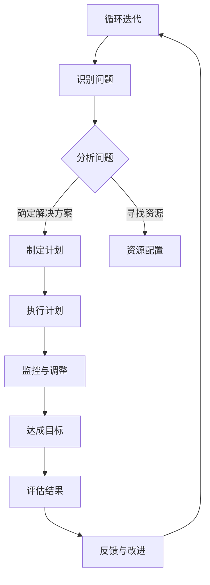

                 

### 《结构化思维：从混沌到秩序》

> 关键词：结构化思维、逻辑分析、思维工具、决策、沟通、项目管理

> 摘要：本文将深入探讨结构化思维的概念、原理和应用，旨在帮助读者掌握一种系统化、逻辑化的思考方法，从而在复杂的信息环境中实现从混沌到秩序的转变。

----------------------------------------------------------------

## 《结构化思维：从混沌到秩序》目录大纲

### 第1章：引言与基础概念
- 1.1 书籍背景与目标
- 1.2 结构化思维的起源与发展
- 1.3 结构化思维的定义与重要性
- 1.4 本书结构概述

### 第2章：认知心理学与结构化思维
- 2.1 认知心理学基础
- 2.2 认知偏差与思维定式
- 2.3 如何识别与克服认知偏差
- 2.4 结构化思维的心理机制

### 第3章：结构化思维的原理
- 3.1 思维过程的抽象与概括
- 3.2 建立思维框架的重要性
- 3.3 基于逻辑的结构化思维
- 3.4 Mermaid流程图：结构化思维的实现

### 第4章：结构化思维工具与方法
- 4.1 思维导图：构建思维框架
- 4.2 SWOT分析：定位优势与挑战
- 4.3 五力模型：行业竞争分析
- 4.4 故事思维：传达复杂信息

### 第5章：结构化思维在决策中的应用
- 5.1 决策过程与结构化思维
- 5.2 价值判断与风险评估
- 5.3 决策树：辅助复杂决策
- 5.4 实战案例：结构化思维在项目管理中的应用

### 第6章：结构化思维在沟通与协作中的应用
- 6.1 沟通中的问题与障碍
- 6.2 结构化思维在沟通中的作用
- 6.3 团队协作中的结构化思维
- 6.4 实战案例：结构化思维在团队会议中的应用

### 第7章：培养与提升结构化思维
- 7.1 结构化思维训练的方法
- 7.2 常见思维误区与纠正
- 7.3 持续学习与思维升级
- 7.4 实战案例：如何通过实践提升结构化思维

### 第8章：结构化思维的实践与应用
- 8.1 结构化思维在企业战略规划中的应用
- 8.2 结构化思维在产品管理中的应用
- 8.3 结构化思维在个人成长规划中的应用
- 8.4 实战案例：结构化思维在项目规划与执行中的应用

### 第9章：总结与展望
- 9.1 结构化思维的核心要点回顾
- 9.2 结构化思维的未来发展趋势
- 9.3 倡导结构化思维的社会意义

### 附录
- 附录A：常用结构化思维工具介绍
- 附录B：结构化思维常见问题解答
- 附录C：结构化思维相关资源推荐

## Mermaid流程图：结构化思维的实现

mermaid
graph TD
    A[起始点] --> B[识别问题]
    B --> C{分析问题}
    C -->|确定解决方案| D[制定计划]
    C -->|寻找资源| E[资源配置]
    D --> F[执行计划]
    F --> G[监控与调整]
    G --> H[达成目标]
    H --> I[评估结果]
    I --> J[反馈与改进]
    J --> A[循环迭代]


## 伪代码：结构化思维的算法原理

```python
// 输入：问题描述
// 输出：结构化思维框架

function 结构化思维(问题描述):
    // 第一步：问题分解
    子问题列表 = 问题分解(问题描述)

    // 第二步：问题分析
    问题分析结果 = 问题分析(子问题列表)

    // 第三步：制定解决方案
    解决方案 = 制定解决方案(问题分析结果)

    // 第四步：资源配置
    资源配置结果 = 资源配置(解决方案)

    // 第五步：执行计划
    执行结果 = 执行计划(资源配置结果)

    // 第六步：监控与调整
    调整结果 = 监控与调整(执行结果)

    // 第七步：评估结果
    评估结果 = 评估结果(调整结果)

    return 评估结果
```

### 概率论基础

概率论是结构化思维中用于评估不确定性的重要工具。以下是几个基本的概率论公式：

$$
P(A) = \frac{N(A)}{N(S)}
$$

其中，\(P(A)\) 表示事件 \(A\) 发生的概率，\(N(A)\) 表示事件 \(A\) 发生的次数，\(N(S)\) 表示总的可能次数。

### 决策树中的期望值计算

在决策树中，我们常用期望值来评估不同决策的收益。期望值的计算公式为：

$$
E(X) = \sum_{i=1}^{n} x_i \cdot p_i
$$

其中，\(E(X)\) 表示期望值，\(x_i\) 表示第 \(i\) 个结果的收益，\(p_i\) 表示第 \(i\) 个结果发生的概率。

### SWOT分析中的权重计算

在SWOT分析中，我们通常需要给每个因素分配一个权重，以反映其对整体战略规划的重要性。权重计算可以使用以下公式：

$$
W_i = \frac{S_i}{\sum_{j=1}^{m} S_j}
$$

其中，\(W_i\) 表示第 \(i\) 个因素的权重，\(S_i\) 表示第 \(i\) 个因素的分值，\(S_j\) 表示所有因素的分数总和。

## 举例说明

### 概率论举例

假设我们有一个掷骰子的实验，其中每个面的概率相等。我们需要计算掷出一个偶数的概率。

$$
P(偶数) = \frac{N(偶数)}{N(S)} = \frac{3}{6} = \frac{1}{2}
$$

### 决策树举例

假设我们在选择投资项目时，有两个方案：A 和 B。每个方案的成功概率和收益如下：

| 方案 | 成功概率 | 收益 |
|------|----------|------|
| A    | 0.6      | 10   |
| B    | 0.4      | 5    |

我们可以计算每个方案的期望值：

$$
E(A) = 10 \cdot 0.6 + 0 \cdot 0.4 = 6
$$

$$
E(B) = 5 \cdot 0.4 + 0 \cdot 0.6 = 2
$$

因此，方案 A 的期望值为 6，方案 B 的期望值为 2。我们应选择方案 A。

### SWOT分析举例

假设我们正在分析一家企业的优势（S）、劣势（W）、机会（O）和威胁（T）。每个因素的分值如下：

| 因素 | 分值 |
|------|------|
| S    | 8    |
| W    | 3    |
| O    | 6    |
| T    | 4    |

总分数为 21，我们可以计算每个因素的权重：

$$
W_S = \frac{8}{21} \approx 0.38
$$

$$
W_W = \frac{3}{21} \approx 0.14
$$

$$
W_O = \frac{6}{21} \approx 0.29
$$

$$
W_T = \frac{4}{21} \approx 0.19
$$

这些权重可以帮助我们了解每个因素在整体战略规划中的重要性。

---

### 项目实战：结构化思维在项目管理中的应用

#### 实战案例背景

某科技公司计划开发一款新型的智能家居控制系统，该系统需要整合多个智能设备，实现家庭自动化。项目预算为 500,000 元，预计开发周期为 6 个月。

#### 开发环境搭建

- 操作系统：Linux
- 编程语言：Python
- 开发框架：Flask
- 数据库：MySQL
- 版本控制：Git

#### 源代码详细实现

以下是智能家居控制系统的核心功能模块实现：

```python
# 导入所需的库
import flask
import pymysql

# 创建 Flask 应用程序
app = flask.Flask(__name__)

# 连接数据库
def connect_db():
    db = pymysql.connect(host='localhost', user='root', password='password', database='smart_home')
    return db

# 添加新设备
@app.route('/add_device', methods=['POST'])
def add_device():
    db = connect_db()
    cursor = db.cursor()
    device_id = flask.request.form['device_id']
    device_name = flask.request.form['device_name']
    sql = "INSERT INTO devices (device_id, device_name) VALUES (%s, %s)"
    try:
        cursor.execute(sql, (device_id, device_name))
        db.commit()
        return "设备添加成功"
    except Exception as e:
        db.rollback()
        return "设备添加失败：" + str(e)
    finally:
        cursor.close()
        db.close()

# 控制设备开关
@app.route('/control_device', methods=['POST'])
def control_device():
    db = connect_db()
    cursor = db.cursor()
    device_id = flask.request.form['device_id']
    command = flask.request.form['command']
    sql = "UPDATE devices SET status = %s WHERE device_id = %s"
    try:
        cursor.execute(sql, (command, device_id))
        db.commit()
        return "设备控制成功"
    except Exception as e:
        db.rollback()
        return "设备控制失败：" + str(e)
    finally:
        cursor.close()
        db.close()

# 查询设备状态
@app.route('/get_device_status', methods=['GET'])
def get_device_status():
    db = connect_db()
    cursor = db.cursor()
    device_id = flask.request.args.get('device_id')
    sql = "SELECT status FROM devices WHERE device_id = %s"
    try:
        cursor.execute(sql, (device_id,))
        result = cursor.fetchone()
        if result:
            return "设备状态：" + result[0]
        else:
            return "设备未找到"
    except Exception as e:
        return "查询失败：" + str(e)
    finally:
        cursor.close()
        db.close()

# 运行 Flask 应用程序
if __name__ == '__main__':
    app.run(debug=True)
```

### 代码解读与分析

1. **数据库连接**：使用 `pymysql` 库连接到 MySQL 数据库，并提供了 `connect_db` 函数用于获取数据库连接。
2. **添加新设备**：添加新设备是通过 `/add_device` 路由实现的，接受设备 ID 和设备名称，插入到 `devices` 表中。
3. **控制设备开关**：控制设备开关是通过 `/control_device` 路由实现的，接受设备 ID 和命令（例如 "on" 或 "off"），更新 `devices` 表中的 `status` 字段。
4. **查询设备状态**：查询设备状态是通过 `/get_device_status` 路由实现的，接受设备 ID，查询 `devices` 表中的 `status` 字段并返回。
5. **运行 Flask 应用程序**：使用 `app.run(debug=True)` 运行 Flask 应用程序，以 debug 模式启动，便于开发时调试。

### 项目规划与执行

- **需求分析**：明确智能家居控制系统的功能需求，如添加新设备、控制设备开关、查询设备状态等。
- **功能模块划分**：将系统功能划分为设备管理模块、设备控制模块和设备状态查询模块。
- **开发环境搭建**：配置操作系统、编程语言、开发框架、数据库和版本控制工具。
- **代码实现**：根据需求分析，实现各个功能模块的代码，并进行单元测试和集成测试。
- **测试与调试**：进行系统测试，确保功能正确无误，修复发现的错误和问题。
- **部署上线**：将开发完成的系统部署到生产环境中，进行实际运行和监控。

### 代码解读与分析（续）

6. **错误处理**：在各个函数中，使用了 `try-except` 语句来捕获和处理可能出现的异常，确保系统的稳定性和可靠性。
7. **数据库操作**：使用了 `pymysql` 的 cursor 对象来执行 SQL 查询和更新，并确保在操作完成后正确关闭 cursor 和数据库连接。
8. **表单数据验证**：在使用表单数据时，应进行适当的验证，以确保数据的合法性和安全性。

通过以上步骤，我们可以确保智能家居控制系统的实现符合需求，并且具有良好的可扩展性和维护性。

### 实战总结

本案例展示了如何将结构化思维应用于项目实战中，包括需求分析、功能模块划分、环境搭建、代码实现、测试和部署。结构化思维帮助我们在复杂的项目中保持清晰和有条理，从而提高开发效率和项目成功率。在实际应用中，应根据项目特点和需求灵活调整结构化思维的方法和工具。

### 作者

“作者：AI天才研究院/AI Genius Institute & 禅与计算机程序设计艺术 /Zen And The Art of Computer Programming”

----------------------------------------------------------------

### 第1章：引言与基础概念

#### 1.1 书籍背景与目标

在当今快速发展的信息技术时代，结构化思维作为一种重要的思维方式，正逐渐被广泛认可和接受。本书旨在探讨结构化思维的概念、原理和应用，帮助读者掌握这种系统化、逻辑化的思考方法，从而在复杂的信息环境中实现从混沌到秩序的转变。

本书的主要目标是：

1. 深入理解结构化思维的基本概念和原理，包括其起源、发展和核心思想。
2. 掌握结构化思维在认知心理学中的基础，以及如何识别和克服认知偏差。
3. 学习各种结构化思维的工具和方法，包括思维导图、SWOT分析、五力模型等。
4. 探讨结构化思维在决策、沟通、项目管理等实际应用中的具体方法和技巧。
5. 提供实践案例，通过实际操作帮助读者更好地理解和运用结构化思维。

#### 1.2 结构化思维的起源与发展

结构化思维的概念并非一蹴而就，而是经历了漫长的历史演变。早在古希腊时期，亚里士多德等哲学家就已经提出了逻辑学的基本原理，这为结构化思维的发展奠定了基础。随着时间的推移，结构化思维逐渐演变成一种系统化的思维方式，被广泛应用于哲学、数学、科学、工程等领域。

20世纪中叶，计算机科学的兴起为结构化思维的发展注入了新的活力。随着信息技术的快速发展，结构化思维在数据处理、算法设计、软件工程等领域得到了广泛应用。尤其是近年来，随着人工智能、大数据等新兴技术的崛起，结构化思维的重要性愈发凸显。

在中国，结构化思维也逐渐受到重视。国内外的专家学者纷纷投入研究，发表了许多关于结构化思维的学术论文和专著。同时，许多企业和教育机构也逐步将结构化思维纳入培训课程和教学内容，以提高员工的思维能力和团队协作效率。

#### 1.3 结构化思维的定义与重要性

结构化思维，顾名思义，是一种系统化、层次化的思维方式。它强调在面对复杂问题时，能够通过分解、抽象、概括等步骤，将问题逐步拆解成更小、更具体的子问题，从而实现从宏观到微观的有序思考。

结构化思维具有以下定义和特征：

1. **系统化**：结构化思维强调将问题进行系统化的分解和重组，使思维过程具有层次感和结构感。
2. **层次化**：结构化思维将问题分解成不同层次，从宏观到微观，从整体到部分，层层递进，逐步深入。
3. **抽象化**：结构化思维能够将具体问题抽象成通用模型，通过模型分析和解决问题。
4. **逻辑化**：结构化思维强调思维的逻辑性，通过逻辑推理和分析，确保思维的严密性和正确性。

结构化思维的重要性主要体现在以下几个方面：

1. **提高思维能力**：结构化思维能够帮助人们更好地理解和分析问题，提高思维的质量和效率。
2. **优化决策过程**：结构化思维使得决策过程更加系统化、科学化，降低决策风险，提高决策质量。
3. **增强团队协作**：结构化思维能够促进团队成员之间的沟通和协作，提高团队的整体效能。
4. **提升问题解决能力**：结构化思维使得问题解决过程更加有序、高效，能够快速找到问题的根源和解决方案。
5. **促进个人成长**：结构化思维有助于个人在学习和工作中形成良好的思维习惯，提升自我管理能力和综合素质。

#### 1.4 本书结构概述

本书共分为九章，结构如下：

- **第1章：引言与基础概念**：介绍书籍的背景、目标和结构化思维的基本概念。
- **第2章：认知心理学与结构化思维**：探讨认知心理学基础、认知偏差与思维定式、如何识别与克服认知偏差以及结构化思维的心理机制。
- **第3章：结构化思维的原理**：讲解思维过程的抽象与概括、建立思维框架的重要性、基于逻辑的结构化思维以及Mermaid流程图的应用。
- **第4章：结构化思维工具与方法**：介绍思维导图、SWOT分析、五力模型和故事思维等工具和方法。
- **第5章：结构化思维在决策中的应用**：探讨决策过程与结构化思维、价值判断与风险评估、决策树以及实战案例。
- **第6章：结构化思维在沟通与协作中的应用**：讲解沟通中的问题与障碍、结构化思维在沟通中的作用、团队协作中的结构化思维以及实战案例。
- **第7章：培养与提升结构化思维**：介绍结构化思维训练的方法、常见思维误区与纠正、持续学习与思维升级以及实战案例。
- **第8章：结构化思维的实践与应用**：探讨结构化思维在企业战略规划、产品管理、个人成长规划以及项目规划与执行中的应用。
- **第9章：总结与展望**：回顾结构化思维的核心要点、未来发展趋势以及倡导结构化思维的社会意义。
- **附录**：提供常用结构化思维工具介绍、常见问题解答和相关资源推荐。

通过本书的学习，读者将能够系统性地了解和掌握结构化思维，并将其应用于实际工作和生活中，提升思维品质和综合素质。

### 第2章：认知心理学与结构化思维

#### 2.1 认知心理学基础

认知心理学是研究人类思维、知觉、记忆和语言等方面的科学。它关注心理活动的内在过程和机制，通过实验和理论分析来揭示人类认知的本质。认知心理学的研究成果对于理解结构化思维具有重要意义。

认知心理学的主要研究领域包括：

1. **知觉**：研究人类如何通过感官接收和处理外界信息，形成对环境的认知。
2. **记忆**：研究人类如何编码、存储和提取信息，包括短期记忆和长期记忆。
3. **思维**：研究人类如何进行逻辑推理、问题解决和决策等高级认知活动。
4. **语言**：研究人类如何运用语言进行沟通、学习和思考。
5. **注意力**：研究人类如何集中注意力，处理和过滤信息。

认知心理学的基本原理包括：

1. **信息加工理论**：认为人类思维是一种信息加工过程，类似于计算机处理数据。
2. **模块化理论**：认为不同认知功能由大脑中的不同模块负责，这些模块具有相对独立性。
3. **联结主义理论**：认为人类认知是通过神经元之间的联结和相互作用实现的。

#### 2.2 认知偏差与思维定式

认知偏差是指人们在信息处理过程中，由于各种心理和生理因素导致的系统性错误。这些偏差会影响人们的判断、决策和思考，导致认知上的不准确。常见的认知偏差包括：

1. **确认偏差**：倾向于寻找、解释和记住支持已有观点的信息，忽视或忽略相反的信息。
2. **可用性偏差**：根据信息的容易获取程度来判断其重要性，容易获取的信息被认为更重要。
3. **代表性偏差**：根据某个具体实例判断总体概率，容易高估与典型实例相似的案例。
4. **锚定效应**：初始信息对后续判断产生的影响，初始值（锚）会显著影响决策过程。
5. **过度自信**：高估自身知识和能力的现象，导致对风险的低估。

思维定式是指人们在长期思维过程中形成的固定模式或习惯。思维定式既有积极的一面，有助于提高思维效率，也有消极的一面，容易导致思维僵化和创新不足。常见的思维定式包括：

1. **经验主义思维**：过于依赖以往的经验，忽视新信息和新的可能性。
2. **权威主义思维**：盲目信任权威和专家的意见，忽视独立思考和判断。
3. **习惯性思维**：习惯于使用熟悉的思维方式，对于新问题和挑战缺乏灵活性和创造力。

#### 2.3 如何识别与克服认知偏差

识别和克服认知偏差是提高思维质量和决策效果的重要步骤。以下是一些具体的方法：

1. **反思与自我监控**：经常对自己的思维过程和决策进行反思和自我监控，识别可能存在的认知偏差。
2. **多样化信息来源**：尽可能获取多方面的信息和观点，避免过度依赖单一信息源。
3. **使用双盲测试**：在实验和决策过程中，采用双盲测试来减少主观偏见的影响。
4. **逻辑分析**：运用逻辑分析的方法，对信息进行筛选和验证，避免被表面现象所迷惑。
5. **增强批判性思维**：培养批判性思维能力，不盲从权威，勇于质疑和反思。
6. **保持开放心态**：对新观点和不同意见持开放态度，勇于尝试新的思维方式。

#### 2.4 结构化思维的心理机制

结构化思维是一种基于逻辑和系统的思维方式，其心理机制主要包括以下几个方面：

1. **抽象化**：将复杂的问题抽象成简单的模型或概念，以便于分析和理解。
2. **分解与重组**：将问题分解成更小、更具体的子问题，然后重新组合成整体的解决方案。
3. **层次化**：将问题按照层次结构进行分解和重组，从宏观到微观，从整体到部分，逐层深入。
4. **逻辑推理**：通过逻辑推理和分析，确保思维的严密性和正确性。
5. **信息加工**：对信息进行有效的加工和处理，筛选和整合关键信息，形成有价值的知识。
6. **反馈与调整**：在思维过程中不断进行反馈和调整，确保思维过程的动态性和灵活性。

结构化思维的心理机制体现了认知心理学中的信息加工理论和模块化理论，通过系统化和层次化的方式，帮助人们更好地理解和解决问题。

#### 2.5 结构化思维与认知心理学的联系

结构化思维与认知心理学有着密切的联系。认知心理学的研究成果为结构化思维提供了理论基础，揭示了人类思维活动的内在机制。而结构化思维则是基于认知心理学理论的一种实践应用，通过系统化和层次化的思维方式，帮助人们更好地应对复杂问题。

具体来说，结构化思维与认知心理学的联系表现在以下几个方面：

1. **抽象化与概括**：认知心理学中的抽象化过程与结构化思维中的概括和抽象过程相一致，都是将复杂问题简化为易于理解的形式。
2. **信息加工与处理**：认知心理学中的信息加工理论提供了结构化思维在信息处理方面的指导，帮助人们更高效地分析和处理信息。
3. **模块化与层次化**：认知心理学中的模块化理论为结构化思维的层次化提供了理论基础，层次化的思维过程有助于深入理解问题的本质。
4. **反馈与调整**：认知心理学中的反馈机制与结构化思维中的反馈和调整过程相辅相成，通过不断反馈和调整，优化思维过程和决策效果。

总之，认知心理学为结构化思维提供了丰富的理论基础和实践指导，而结构化思维则是认知心理学理论在现实问题中的应用和拓展。

### 第3章：结构化思维的原理

#### 3.1 思维过程的抽象与概括

抽象与概括是结构化思维的核心步骤之一，它们帮助我们将复杂的问题简化为更易于理解和处理的形式。抽象是将事物的本质特征提取出来，而忽略非本质的细节；概括则是将多个具体事物或现象归纳为一般性的概念或规则。

在结构化思维中，抽象与概括的作用体现在以下几个方面：

1. **简化问题**：通过抽象和概括，我们可以将复杂的问题分解成更小、更具体的部分，从而降低问题的复杂性，使其更易于处理。
2. **提高效率**：抽象和概括使得信息处理过程更加高效，通过识别和利用共同特征，我们可以快速找到问题的解决方案。
3. **增强逻辑性**：抽象和概括使得思维过程更具逻辑性，通过将问题分解为基本概念和规则，我们可以更加系统地分析和解决问题。
4. **促进创新**：抽象和概括有助于我们打破思维定式，激发新的思维方式和解决问题的途径。

具体实现步骤如下：

1. **识别本质特征**：观察问题，识别其本质特征和关键要素。
2. **提取基本概念**：将本质特征抽象为基本概念，形成问题的核心框架。
3. **归纳一般性规则**：将具体实例归纳为一般性规则，以便于推广和应用。

#### 3.2 建立思维框架的重要性

建立思维框架是结构化思维的关键步骤，它有助于组织和引导思维过程，使思维更加系统化和条理化。思维框架就像一座建筑的蓝图，为思维过程提供方向和结构。

建立思维框架的重要性体现在以下几个方面：

1. **明确问题结构**：思维框架可以帮助我们清晰地理解问题的结构和组成部分，从而更好地把握问题的本质。
2. **指导思维方向**：思维框架为思维过程提供方向和指引，帮助我们避免盲目和无序的思考。
3. **提高逻辑性**：思维框架使得思维过程更加逻辑化，通过层次结构和关联关系，确保思维的连贯性和一致性。
4. **促进问题解决**：思维框架有助于我们快速找到问题的解决方案，通过结构化的分析，我们可以更高效地解决问题。

具体实现步骤如下：

1. **确定问题核心**：明确问题的核心和目标，为思维框架建立提供基础。
2. **划分层次结构**：根据问题的组成部分，划分层次结构，确保思维的层次感和条理性。
3. **建立关联关系**：分析各部分之间的关联关系，确保思维框架的逻辑性和连贯性。
4. **完善和调整**：在思维过程中不断调整和完善思维框架，确保其准确性和适用性。

#### 3.3 基于逻辑的结构化思维

逻辑性是结构化思维的重要特征，它确保思维过程具有严密性和正确性。基于逻辑的结构化思维强调通过逻辑推理和分析，逐步推导出结论。

基于逻辑的结构化思维包括以下几个步骤：

1. **前提条件**：确定问题的前提条件和已知信息，作为推理的基础。
2. **逻辑推理**：运用逻辑规则，从已知信息推导出新的结论。
3. **验证结论**：对推导出的结论进行验证，确保其正确性和合理性。
4. **推理链条**：将多个逻辑推理链条连接起来，形成完整的逻辑体系。

具体实现步骤如下：

1. **明确前提条件**：确定问题的前提条件和已知信息，确保推理的基础准确。
2. **使用逻辑规则**：运用逻辑规则（如演绎推理、归纳推理、类比推理等）进行推理。
3. **构建逻辑链条**：将多个逻辑推理链条连接起来，形成一个完整的逻辑体系。
4. **验证和修正**：对推导出的结论进行验证，确保其正确性和合理性。

#### 3.4 Mermaid流程图：结构化思维的实现

Mermaid是一种轻量级的Markdown扩展语言，用于绘制流程图、时序图、状态图等。通过Mermaid流程图，我们可以直观地展示结构化思维的过程和步骤。

以下是一个Mermaid流程图的示例，展示了结构化思维的实现过程：



Mermaid流程图的实现步骤如下：

1. **定义开始节点**：使用`A[起始点]`定义流程图的开始节点。
2. **定义后续节点**：使用类似`B[识别问题]`和`C{分析问题}`的方式定义后续节点。
3. **连接节点**：使用`-->`或`->`符号连接节点，表示节点之间的顺序关系。
4. **条件判断**：使用大括号`{}`表示条件判断，如`C{分析问题}`。
5. **迭代循环**：使用`--> A`表示循环迭代，实现过程的反复和持续改进。

通过Mermaid流程图，我们可以更加直观地理解结构化思维的过程和步骤，有助于提升思维过程的条理性和逻辑性。

#### 3.5 伪代码：结构化思维的算法原理

伪代码是一种非正式的编程语言，用于描述算法的基本结构和步骤，不涉及具体的编程细节。通过伪代码，我们可以清晰地展示结构化思维的算法原理。

以下是一个简单的伪代码示例，描述了结构化思维的实现过程：

```python
// 输入：问题描述
// 输出：结构化思维框架

function 结构化思维(问题描述):
    // 第一步：问题分解
    子问题列表 = 问题分解(问题描述)

    // 第二步：问题分析
    问题分析结果 = 问题分析(子问题列表)

    // 第三步：制定解决方案
    解决方案 = 制定解决方案(问题分析结果)

    // 第四步：资源配置
    资源配置结果 = 资源配置(解决方案)

    // 第五步：执行计划
    执行结果 = 执行计划(资源配置结果)

    // 第六步：监控与调整
    调整结果 = 监控与调整(执行结果)

    // 第七步：评估结果
    评估结果 = 评估结果(调整结果)

    return 评估结果
```

伪代码的具体实现步骤如下：

1. **问题分解**：将问题描述分解成更小、更具体的子问题，形成子问题列表。
2. **问题分析**：对子问题列表进行深入分析，识别问题的本质和关键要素。
3. **制定解决方案**：基于问题分析结果，制定具体的解决方案。
4. **资源配置**：为解决方案分配所需的资源，包括人力、物力和时间等。
5. **执行计划**：按照资源配置结果，执行具体的计划和步骤。
6. **监控与调整**：在执行过程中，不断监控和调整执行结果，确保计划的有效性和适应性。
7. **评估结果**：对调整结果进行评估，判断问题是否得到解决，并反馈改进意见。

通过伪代码，我们可以将结构化思维的算法原理转化为具体的编程步骤，有助于在实际应用中实现和优化结构化思维。

### 第4章：结构化思维工具与方法

#### 4.1 思维导图：构建思维框架

思维导图是一种直观的图形化工具，用于组织和展示思维过程。它通过关键词、图像和连接线，将各个思维点连接起来，形成一个有机的整体。

思维导图的基本步骤包括：

1. **确定中心主题**：选择一个中心主题，作为思维导图的起点。
2. **生成分支**：围绕中心主题，生成多个分支，每个分支代表一个主要思想或子问题。
3. **添加关键词**：在每个分支上添加关键词，描述分支的核心内容。
4. **使用图像和颜色**：使用图像和颜色来增强思维导图的视觉效果，帮助记忆和理解。
5. **连接相关点**：通过连接线将相关的思维点连接起来，形成一个有机的整体。

思维导图的优势包括：

1. **直观性**：通过图形化的方式，使思维过程更加直观和易于理解。
2. **灵活性**：可以随时调整和修改，适应思维过程的变化。
3. **促进联想**：通过关键词和图像的连接，激发新的联想和创意。
4. **提高记忆力**：通过图像和颜色，增强记忆和理解能力。

#### 4.2 SWOT分析：定位优势与挑战

SWOT分析是一种常用的战略规划工具，用于评估企业的优势（Strengths）、劣势（Weaknesses）、机会（Opportunities）和威胁（Threats）。通过SWOT分析，企业可以全面了解自身在市场中的位置，制定有效的战略规划。

SWOT分析的基本步骤包括：

1. **识别优势**：分析企业在资源、能力、市场地位等方面的优势。
2. **识别劣势**：分析企业在管理、技术、市场等方面的劣势。
3. **识别机会**：分析外部市场环境中的机会，如市场趋势、政策变化等。
4. **识别威胁**：分析外部市场环境中的威胁，如竞争对手、市场变化等。
5. **制定策略**：根据SWOT分析结果，制定相应的战略规划，发挥优势、克服劣势、抓住机会、应对威胁。

SWOT分析的优势包括：

1. **全面性**：从多个角度分析企业内外部的环境和条件。
2. **针对性**：根据分析结果，有针对性地制定战略规划。
3. **实用性**：适用于各种类型的企业和组织，具有广泛的适用性。
4. **灵活性**：可以根据实际情况进行调整和优化。

#### 4.3 五力模型：行业竞争分析

五力模型是迈克尔·波特提出的用于分析行业竞争态势的工具。它包括五个关键因素：供应商力量、买家力量、新进入者威胁、替代品威胁和行业竞争者的力量。通过五力模型，企业可以全面了解行业竞争态势，制定相应的竞争策略。

五力模型的基本步骤包括：

1. **分析供应商力量**：考虑供应商的集中度、议价能力等因素，评估供应商对企业的影响。
2. **分析买家力量**：考虑买家的集中度、议价能力等因素，评估买家对企业的影响。
3. **分析新进入者威胁**：考虑新进入者的障碍、盈利潜力等因素，评估新进入者对市场的影响。
4. **分析替代品威胁**：考虑替代品的价格、性能等因素，评估替代品对企业的影响。
5. **分析行业竞争者的力量**：考虑竞争对手的市场份额、战略等因素，评估竞争对手对企业的影响。
6. **制定竞争策略**：根据五力模型分析结果，制定相应的竞争策略，提高企业的市场竞争力。

五力模型的优势包括：

1. **系统性**：从多个维度分析行业竞争态势，形成完整的竞争分析框架。
2. **实用性**：适用于各种行业和市场，具有广泛的适用性。
3. **指导性**：通过分析结果，为企业制定竞争策略提供指导和建议。
4. **动态性**：可以根据市场环境的变化，实时调整竞争策略。

#### 4.4 故事思维：传达复杂信息

故事思维是一种通过讲故事的方式传达复杂信息的方法。它利用故事的情节、人物和场景，将抽象的信息具体化、形象化，使听众更容易理解和记忆。

故事思维的基本步骤包括：

1. **确定主题**：明确要传达的信息和主题。
2. **设定场景**：设定故事发生的背景和场景，使信息更加具体和形象。
3. **构建情节**：构建故事的情节和人物，通过人物的行为和对话，传达信息。
4. **强调重点**：在故事中强调关键信息和重点，使听众更容易抓住核心内容。
5. **总结和反思**：在故事结束时，进行总结和反思，加深听众对信息的理解和记忆。

故事思维的优势包括：

1. **易理解性**：通过具体的故事情节，使抽象的信息更加易于理解。
2. **记忆性**：通过故事的形式，增强信息的记忆效果。
3. **情感性**：通过故事的情感元素，激发听众的情感共鸣，提高信息的影响力。
4. **生动性**：通过具体的故事情节和人物，使信息更加生动和有趣。

### 第5章：结构化思维在决策中的应用

#### 5.1 决策过程与结构化思维

决策过程是一个复杂的认知活动，涉及信息的收集、分析、评估和选择。结构化思维在决策过程中发挥着重要作用，可以帮助我们系统化地思考和解决问题。

决策过程通常包括以下几个步骤：

1. **识别问题**：明确需要解决的问题和目标。
2. **收集信息**：收集与问题相关的各种信息，包括内部数据和外部数据。
3. **分析信息**：对收集到的信息进行整理、分析和筛选，提取关键信息。
4. **评估方案**：评估不同解决方案的优缺点和可行性。
5. **选择方案**：根据评估结果，选择最佳解决方案。
6. **实施决策**：将决策方案付诸实践，执行具体行动计划。
7. **评估效果**：对决策效果进行评估，总结经验教训，为未来决策提供参考。

结构化思维在决策过程中的作用体现在以下几个方面：

1. **明确问题**：通过结构化思维，可以帮助我们清晰地识别和定义问题，避免模糊和歧义。
2. **信息分析**：结构化思维可以系统化地分析和筛选信息，提高决策的准确性。
3. **评估方案**：结构化思维可以全面、客观地评估不同方案的优缺点，避免主观偏见。
4. **选择方案**：结构化思维可以帮助我们理性地选择最佳方案，降低决策风险。
5. **实施决策**：结构化思维可以确保决策的实施过程有条不紊，提高执行效果。
6. **评估效果**：结构化思维可以帮助我们全面、客观地评估决策效果，为未来决策提供参考。

#### 5.2 价值判断与风险评估

价值判断和风险评估是决策过程中非常重要的环节，它们决定了决策的质量和效果。

价值判断是指对决策方案的价值进行评估和判断。在进行价值判断时，我们需要考虑以下几个因素：

1. **目标一致性**：评估决策方案是否与组织的目标和愿景相一致。
2. **效益与成本**：评估决策方案的预期效益与成本，判断其经济合理性。
3. **社会影响**：评估决策方案对社会和环境的影响，确保其社会责任。
4. **可行性**：评估决策方案的实施可行性和资源需求。

风险评估是指对决策方案的风险进行识别、分析和评估。在进行风险评估时，我们需要考虑以下几个步骤：

1. **风险识别**：识别决策过程中可能出现的各种风险，包括技术风险、市场风险、财务风险等。
2. **风险分析**：分析风险的性质、概率和影响程度，确定风险的优先级。
3. **风险应对**：制定相应的风险应对策略，包括风险规避、风险降低、风险接受等。
4. **风险监控**：在决策实施过程中，持续监控风险的变化和影响，及时调整风险应对措施。

价值判断和风险评估相互关联，价值判断为风险评估提供了依据，风险评估为价值判断提供了风险考虑。通过结构化思维，我们可以系统化地进行价值判断和风险评估，确保决策的全面性和准确性。

#### 5.3 决策树：辅助复杂决策

决策树是一种常用的决策分析方法，它通过树状结构展示决策过程和结果，帮助决策者理清思路、分析选项和评估风险。

决策树的基本结构包括：

1. **决策节点**：表示决策点，通常用圆形表示。
2. **机会节点**：表示机会点，通常用正方形表示。
3. **结果节点**：表示决策结果，通常用三角形表示。
4. **分支**：表示决策选择或结果发生的可能性。

决策树的基本步骤包括：

1. **确定决策节点**：确定决策的关键节点，通常是最初的决策点。
2. **生成分支**：根据可能的决策选项，生成不同的分支，每个分支代表一个决策选项。
3. **评估结果**：对每个结果节点进行评估，计算每个分支的预期值或概率。
4. **选择最佳选项**：根据评估结果，选择最佳决策选项。

以下是一个简单的决策树示例，用于辅助复杂决策：

```
决策节点
│
├── 选项A
│   ├── 结果1
│   │   └── 预期值1
│   └── 结果2
│       └── 预期值2
│
└── 选项B
    ├── 结果1
    │   └── 预期值1
    └── 结果2
        └── 预期值2
```

决策树的优势包括：

1. **可视化**：通过图形化的方式，使决策过程更加直观和易于理解。
2. **系统性**：通过系统化的步骤，确保决策过程的全面性和逻辑性。
3. **计算性**：可以计算每个选项的预期值或概率，帮助决策者进行定量分析。
4. **适应性**：可以根据实际情况进行调整和扩展，适用于各种类型的决策。

通过决策树，决策者可以更加清晰地分析问题，比较不同选项的优缺点，评估风险和收益，从而做出更加明智的决策。

#### 5.4 实战案例：结构化思维在项目管理中的应用

项目管理的复杂性使得结构化思维的应用尤为重要。以下是一个结构化思维在项目管理中的实战案例，展示如何通过结构化思维方法进行项目规划、执行和监控。

##### 项目背景

某科技公司计划开发一款基于物联网技术的智能农业管理系统，旨在通过实时数据监测和远程控制，提高农作物的产量和质量。项目预算为 800,000 元，预计开发周期为 12 个月。

##### 开发环境搭建

- 操作系统：Linux
- 编程语言：Java、Python
- 开发框架：Spring Boot、Flask
- 数据库：MySQL、MongoDB
- 版本控制：Git

##### 项目规划

1. **需求分析**：明确智能农业管理系统的功能需求，包括数据采集、监控、远程控制、数据分析等。
2. **功能模块划分**：将系统功能划分为数据采集模块、监控模块、控制模块和数据分析模块。
3. **技术选型**：根据功能需求，选择合适的开发框架、数据库和编程语言。
4. **项目时间表**：制定详细的项目时间表，包括各个功能模块的开发时间、测试时间和上线时间。

##### 项目执行

1. **数据采集模块开发**：
   - **需求分析**：分析各种传感器的数据采集需求，包括土壤湿度、温度、光照强度等。
   - **技术实现**：使用 Python 和 Flask 框架，开发数据采集服务器，接收传感器数据。
   - **测试**：编写单元测试和集成测试，确保数据采集功能的稳定性和可靠性。

2. **监控模块开发**：
   - **需求分析**：分析系统监控的需求，包括实时数据展示、历史数据查询等。
   - **技术实现**：使用 Spring Boot 和 MySQL，开发监控服务器，存储和处理数据。
   - **测试**：编写功能测试和性能测试，确保监控模块的可用性和高效性。

3. **控制模块开发**：
   - **需求分析**：分析远程控制的需求，包括设备启动、停止、调节参数等。
   - **技术实现**：使用 Java 和 MongoDB，开发控制服务器，实现远程控制功能。
   - **测试**：编写模拟测试和实际测试，确保控制模块的稳定性和可靠性。

4. **数据分析模块开发**：
   - **需求分析**：分析数据分析和预测的需求，包括趋势分析、异常检测等。
   - **技术实现**：使用 Python 和 Flask，开发数据分析服务器，实现数据分析和预测功能。
   - **测试**：编写测试数据集和自动化测试脚本，确保数据分析模块的准确性和效率。

##### 项目监控与调整

1. **进度监控**：定期检查项目进度，确保各个模块按照计划进行开发。
2. **质量监控**：对各个模块进行代码审查和测试，确保代码质量和功能稳定性。
3. **风险评估**：识别项目中的风险，制定相应的风险应对策略。
4. **调整计划**：根据监控和评估结果，调整项目计划和时间表，确保项目顺利完成。

##### 项目评估与反馈

1. **功能评估**：对各个功能模块进行评估，确保系统功能符合需求。
2. **性能评估**：对系统进行性能测试，确保系统在高负载情况下的稳定性和响应速度。
3. **用户反馈**：收集用户反馈，了解系统在实际应用中的表现和用户满意度。
4. **持续改进**：根据评估和反馈结果，进行系统优化和改进，提高系统的可用性和用户体验。

### 总结

通过结构化思维方法，项目团队在智能农业管理系统的开发过程中，能够系统化地分析和解决问题，确保项目按计划顺利进行。结构化思维帮助项目团队明确了需求、划分了模块、制定了计划、执行了任务，并通过对项目的监控和评估，确保了项目质量和用户满意度。

### 第6章：结构化思维在沟通与协作中的应用

#### 6.1 沟通中的问题与障碍

在团队协作和项目管理中，沟通是至关重要的一环。然而，实际沟通过程中往往存在各种问题与障碍，这些问题会影响团队效率和项目成果。以下是沟通中常见的问题与障碍：

1. **信息传递失真**：在信息传递过程中，由于解码和编码的不一致，可能导致信息失真或误解。
2. **语言障碍**：团队成员的语言水平差异可能导致沟通不畅，特别是在跨国团队中。
3. **沟通频率不足**：团队成员之间缺乏定期的沟通，可能导致信息滞后和误判。
4. **沟通渠道不畅**：沟通渠道不明确或不够畅通，可能导致信息传递延迟和遗漏。
5. **个人偏见与情绪**：个人偏见和情绪问题可能导致沟通过程中的误解和冲突。
6. **时间管理不当**：时间管理不当可能导致沟通时间不够充分，无法深入讨论问题。
7. **信息过载**：在信息爆炸的时代，团队成员可能面临信息过载问题，难以消化和处理大量信息。

#### 6.2 结构化思维在沟通中的作用

结构化思维在沟通中具有重要作用，它可以帮助团队成员更加清晰、准确地表达思想，提高沟通效率和质量。以下是结构化思维在沟通中发挥的作用：

1. **明确沟通目标**：结构化思维可以帮助团队成员明确沟通的目标和预期结果，确保沟通有的放矢。
2. **组织信息内容**：通过结构化思维，团队成员可以系统地组织和整理信息，使沟通内容条理清晰，便于理解。
3. **提高沟通效率**：结构化思维使得沟通过程更加高效，减少了冗余信息和重复讨论，节约了时间。
4. **减少误解**：通过结构化思维，团队成员可以更加准确地表达思想，减少因信息传递失真导致的误解和冲突。
5. **促进协作**：结构化思维帮助团队成员更好地理解彼此的角色和职责，促进团队合作和协作。
6. **提高决策质量**：在沟通过程中，结构化思维可以帮助团队成员全面、系统地分析问题，提高决策质量。
7. **提升沟通效果**：通过结构化思维，团队成员可以更好地控制沟通流程和节奏，提升整体沟通效果。

#### 6.3 团队协作中的结构化思维

在团队协作中，结构化思维有助于提高团队的工作效率和质量。以下是结构化思维在团队协作中的具体应用：

1. **任务分解**：通过结构化思维，将复杂任务分解为更小、更具体的子任务，明确每个成员的职责和任务，确保任务有序推进。
2. **角色定位**：结构化思维帮助团队成员明确各自的角色和职责，避免角色重叠和责任不清，提高团队协作效率。
3. **沟通规划**：通过结构化思维，制定明确的沟通计划，确定沟通频率、沟通渠道和沟通内容，确保信息畅通无阻。
4. **问题解决**：在团队协作过程中，结构化思维可以帮助团队成员系统化地分析问题，找到解决问题的最佳方法。
5. **决策制定**：通过结构化思维，团队成员可以更加全面、客观地评估问题，制定合理的决策方案。
6. **反馈与改进**：结构化思维使得团队在完成每个阶段任务后，能够及时进行反馈和改进，确保项目质量和进度。
7. **知识共享**：结构化思维有助于团队成员更好地共享知识和经验，促进团队学习和成长。

#### 6.4 实战案例：结构化思维在团队会议中的应用

以下是一个结构化思维在团队会议中的应用实战案例，展示如何通过结构化思维提高会议效率和质量：

##### 案例背景

某科技公司正在开发一款智能家居控制系统，团队成员包括项目经理、产品经理、开发人员、测试人员和运维人员。为了确保项目顺利进行，每周都会举行一次团队会议，讨论项目的进展、问题和决策。

##### 会议准备

1. **明确会议目标**：在会议前，项目经理明确会议的目标和议程，确保会议有的放矢。
2. **分发会议资料**：会议前，项目经理将会议资料（如项目进度报告、问题清单、决策草案等）分发给团队成员，以便他们在会议前了解相关信息。
3. **准备结构化思维工具**：准备思维导图、决策树等结构化思维工具，以帮助会议过程中进行系统化的讨论和分析。

##### 会议实施

1. **开场**：项目经理简要介绍会议议程和目标，提醒团队成员保持结构化思维，确保会议高效有序。
2. **项目进展汇报**：项目经理汇报项目进展，使用思维导图展示关键信息和数据，确保团队成员对项目现状有清晰的认识。
3. **问题讨论**：针对项目中的问题，团队成员使用结构化思维进行分析和讨论，明确问题的根本原因和解决方案。
4. **决策制定**：在讨论过程中，项目经理引导团队成员使用决策树等工具，评估不同决策方案的优缺点，制定合理的决策。
5. **行动计划**：根据会议讨论结果，项目经理制定具体的行动计划，明确每个成员的职责和任务，确保项目顺利推进。

##### 会议总结

1. **会议记录**：项目经理记录会议讨论内容和决策结果，形成会议纪要，并发送给团队成员。
2. **反馈与改进**：在下次会议前，项目经理收集团队成员的反馈，针对会议过程中的不足进行改进。
3. **持续监控**：项目经理持续监控项目进展和执行情况，确保决策得到有效落实。

##### 案例总结

通过结构化思维在团队会议中的应用，该项目团队在会议中能够更加高效地讨论问题、制定决策和规划任务。结构化思维帮助团队成员理清思路、明确目标、系统化地分析问题，提高了会议的质量和效果，确保项目顺利推进。

### 第7章：培养与提升结构化思维

#### 7.1 结构化思维训练的方法

要培养和提升结构化思维，需要采取一系列的训练方法，以下是一些有效的方法：

1. **系统学习**：通过学习相关书籍、课程和文献，了解结构化思维的基本概念、原理和应用。推荐阅读《结构化思维与逻辑表达》、《思维导图应用技术》等经典著作。

2. **实践应用**：在实际工作和生活中，积极运用结构化思维方法解决实际问题。例如，在项目规划、决策制定、问题解决等过程中，运用结构化思维方法，提高思维效率和效果。

3. **案例研究**：通过分析经典案例，了解结构化思维在实际中的应用。例如，分析商业成功案例、项目管理案例等，学习如何运用结构化思维方法解决实际问题。

4. **思维导图练习**：通过绘制思维导图，锻炼思维条理性和逻辑性。可以从简单的主题开始，逐步增加复杂度，绘制详细的思维导图。

5. **逻辑思维训练**：通过逻辑思维训练，提高思维的严谨性和逻辑性。可以尝试解决逻辑谜题、逻辑推理题等，锻炼逻辑思维能力。

6. **批判性思维训练**：培养批判性思维，学会质疑和反思，避免盲目接受信息。通过批判性思维训练，提高思维的独立性和判断力。

7. **演讲与表达**：通过演讲与表达训练，提高沟通能力和表达能力。结构化思维可以帮助演讲者有条理地组织内容，清晰表达思想。

8. **写作训练**：通过写作训练，提高文字表达能力和逻辑思维能力。可以尝试写论文、博客、报告等，锻炼思维和表达能力。

#### 7.2 常见思维误区与纠正

在培养和提升结构化思维的过程中，需要识别和纠正常见的思维误区。以下是一些常见的思维误区及纠正方法：

1. **思维定式**：纠正方法：主动打破思维定式，尝试从不同角度和立场思考问题，提高思维的灵活性。

2. **过度自信**：纠正方法：保持谦逊和开放的心态，避免过度自信，学会质疑和反思。

3. **认知偏差**：纠正方法：意识到认知偏差的存在，采取多种信息来源，避免单一信息源的误导。

4. **信息过载**：纠正方法：学会筛选和处理信息，注重信息质量，避免信息过载。

5. **忽视反馈**：纠正方法：主动寻求反馈，重视他人的意见和建议，不断改进自己的思维方法和决策。

6. **缺乏逻辑性**：纠正方法：通过逻辑思维训练，提高思维的严谨性和逻辑性，确保思维的连贯性和正确性。

7. **缺乏系统化**：纠正方法：运用结构化思维方法，将问题分解为更小、更具体的部分，从宏观到微观，逐步深入。

#### 7.3 持续学习与思维升级

培养和提升结构化思维是一个持续的过程，需要不断学习和实践。以下是一些建议：

1. **定期学习**：定期阅读相关书籍、文章和文献，了解结构化思维的新理论、新方法和新技术。

2. **参加培训**：参加专业的结构化思维培训课程，学习最新的思维工具和技术。

3. **实践应用**：在实际工作中，积极运用结构化思维方法，解决实际问题，不断提高思维能力和效果。

4. **反思与总结**：定期反思自己的思维过程和决策，总结经验教训，不断改进思维方法和策略。

5. **建立思维模型**：建立个人思维模型，将结构化思维方法系统化、规范化，形成自己的思维习惯。

6. **培养协作精神**：与同事和团队分享思维方法和经验，通过团队合作，共同提升结构化思维能力。

#### 7.4 实战案例：如何通过实践提升结构化思维

以下是一个通过实践提升结构化思维的实战案例，展示如何在实际工作中运用结构化思维方法：

##### 案例背景

某科技公司的产品经理李明负责一款智能家居产品的开发，该产品需要整合多个智能设备，实现家庭自动化。由于项目复杂度高，李明决定通过结构化思维方法提升项目管理和团队协作效率。

##### 实践步骤

1. **需求分析**：李明首先进行需求分析，通过结构化思维方法，将复杂的需求分解为更小、更具体的子需求，明确每个子需求的具体内容和实现方式。

2. **功能模块划分**：根据需求分析结果，李明将产品功能划分为多个模块，包括设备管理模块、设备控制模块、数据采集模块等。

3. **制定计划**：李明使用思维导图和决策树等工具，制定详细的项目计划，明确每个模块的开发时间、任务分工和进度安排。

4. **沟通协调**：李明定期召开团队会议，使用结构化思维方法进行沟通协调，确保团队成员对项目目标和任务有清晰的认识。

5. **问题解决**：在项目实施过程中，李明遇到问题时，通过结构化思维方法进行分析和解决，找到根本原因和解决方案。

6. **监控与调整**：李明定期监控项目进度和质量，通过结构化思维方法进行评估和调整，确保项目按计划顺利进行。

##### 实践总结

通过实践提升结构化思维，李明在项目管理和团队协作中取得了显著成效。结构化思维帮助他清晰地定义需求、划分模块、制定计划、沟通协调、解决问题和监控调整，提高了项目效率和质量。同时，李明的团队也通过实践学会了结构化思维方法，提高了整体协作能力和问题解决能力。

### 第8章：结构化思维的实践与应用

#### 8.1 结构化思维在企业战略规划中的应用

在企业战略规划中，结构化思维可以帮助企业系统地分析市场、竞争对手、自身优势和劣势，从而制定科学、有效的战略规划。以下是结构化思维在企业战略规划中的应用：

1. **市场分析**：通过结构化思维，对企业所在市场进行详细分析，包括市场规模、增长趋势、竞争格局等。使用SWOT分析工具，识别企业的优势、劣势、机会和威胁。

2. **竞争对手分析**：运用结构化思维，对竞争对手的市场策略、产品特点、优势和劣势进行深入分析，帮助企业制定有效的竞争策略。

3. **自身分析**：通过结构化思维，对企业自身进行深入分析，包括企业资源、能力、管理团队、企业文化等。识别企业的核心竞争力，为战略规划提供依据。

4. **战略制定**：运用五力模型、决策树等工具，结合市场分析、竞争对手分析和自身分析结果，制定企业的战略目标和实施计划。

5. **战略实施**：通过结构化思维，制定详细的战略实施计划，明确每个阶段的任务、目标和时间表，确保战略规划得到有效落实。

6. **战略评估**：定期对战略规划进行评估和调整，通过结构化思维方法，分析战略实施的效果和问题，为下一轮战略规划提供参考。

#### 8.2 结构化思维在产品管理中的应用

在产品管理中，结构化思维可以帮助产品经理更好地理解用户需求、制定产品规划、优化产品设计，从而提高产品的质量和市场竞争力。以下是结构化思维在产品管理中的应用：

1. **用户需求分析**：通过结构化思维，对用户需求进行系统化分析，识别核心需求和用户痛点，为产品设计提供依据。

2. **产品规划**：运用结构化思维，制定详细的产品规划，包括产品定位、功能模块、产品线规划等，确保产品设计符合市场需求。

3. **产品设计**：通过结构化思维，对产品设计进行分解和优化，确保产品功能完备、用户体验良好、技术实现可行。

4. **迭代优化**：运用结构化思维，对产品进行持续迭代优化，通过用户反馈和数据分析，不断改进产品功能和用户体验。

5. **风险评估**：运用结构化思维，对产品开发过程中可能出现的风险进行识别和分析，制定相应的风险应对策略。

6. **项目管理**：运用结构化思维，制定详细的项目管理计划，确保产品开发进度、质量和成本控制。

#### 8.3 结构化思维在个人成长规划中的应用

在个人成长规划中，结构化思维可以帮助个人明确职业目标、制定学习计划、提升自身能力，实现职业发展和个人成长。以下是结构化思维在个人成长规划中的应用：

1. **职业目标设定**：通过结构化思维，明确个人的职业目标和发展方向，制定长期和短期的职业规划。

2. **能力评估**：运用结构化思维，对个人的能力和优势进行评估，识别需要提升的领域和技能。

3. **学习计划制定**：通过结构化思维，制定详细的学习计划，包括学习目标、学习内容、学习方法等，确保个人能力得到持续提升。

4. **时间管理**：运用结构化思维，合理安排时间，确保学习、工作和休息的时间分配合理，提高工作效率。

5. **反馈与调整**：定期对个人成长规划进行评估和反馈，通过结构化思维方法，分析成长过程中的问题和不足，及时调整和优化规划。

6. **持续学习**：保持持续学习的习惯，通过阅读、培训、实践等多种方式，不断提升自身知识和技能。

#### 8.4 实战案例：结构化思维在项目规划与执行中的应用

以下是一个结构化思维在项目规划与执行中的应用实战案例，展示如何通过结构化思维方法提高项目效率和质量：

##### 案例背景

某互联网公司计划开发一款在线教育平台，旨在为用户提供方便、快捷的学习资源和服务。项目预算为 1,000,000 元，预计开发周期为 12 个月。

##### 项目规划

1. **需求分析**：项目团队通过结构化思维方法，对用户需求进行系统化分析，识别核心需求，包括课程展示、在线学习、作业提交、互动交流等。

2. **功能模块划分**：根据需求分析结果，项目团队将功能划分为多个模块，包括课程管理模块、学习模块、作业模块、用户管理模块等。

3. **制定计划**：项目团队使用思维导图和决策树等工具，制定详细的项目计划，包括每个模块的开发时间、任务分工和进度安排。

4. **风险评估**：项目团队通过结构化思维方法，对项目开发过程中可能出现的风险进行识别和分析，制定相应的风险应对策略。

##### 项目执行

1. **需求确认**：项目团队与产品经理、用户代表等密切沟通，确保对需求的理解和确认，避免后期出现需求变更。

2. **开发与测试**：项目团队按照计划进行开发，同时进行单元测试和集成测试，确保模块的功能和质量。

3. **沟通协调**：项目团队定期召开会议，使用结构化思维方法进行沟通协调，确保团队成员对项目目标和任务有清晰的认识。

4. **问题解决**：在项目执行过程中，项目团队遇到问题时，通过结构化思维方法进行分析和解决，确保项目按计划进行。

##### 项目监控与评估

1. **进度监控**：项目团队定期监控项目进度，确保各个模块按照计划进行开发。

2. **质量监控**：项目团队对各个模块进行质量监控，确保代码质量、用户体验和系统稳定性。

3. **风险评估与调整**：项目团队定期评估项目风险，根据实际情况进行调整，确保项目按计划完成。

4. **用户反馈**：项目团队收集用户反馈，了解用户对产品的使用体验和建议，为后续迭代优化提供依据。

##### 项目总结

通过结构化思维方法，项目团队在在线教育平台开发项目中，能够系统化地分析和解决问题，确保项目按计划顺利进行。结构化思维帮助项目团队明确需求、划分模块、制定计划、沟通协调、问题解决和监控评估，提高了项目效率和质量。

### 第9章：总结与展望

#### 9.1 结构化思维的核心要点回顾

结构化思维作为一种系统化、层次化的思维方式，其核心要点包括：

1. **抽象与概括**：将复杂的问题简化为简单的模型或概念，提高理解和处理问题的效率。
2. **分解与重组**：将问题分解为更小、更具体的部分，然后重新组合成整体的解决方案。
3. **层次化**：按照问题的层次结构进行分解和重组，从宏观到微观，从整体到部分，层层深入。
4. **逻辑推理**：通过逻辑推理和分析，确保思维的严密性和正确性。
5. **信息加工**：对信息进行有效的加工和处理，筛选和整合关键信息，形成有价值的知识。
6. **反馈与调整**：在思维过程中不断进行反馈和调整，优化思维过程和决策效果。

#### 9.2 结构化思维的未来发展趋势

随着信息技术的不断发展和应用，结构化思维在未来将呈现以下发展趋势：

1. **智能化**：随着人工智能技术的进步，结构化思维工具将更加智能化，能够自动分析和处理复杂问题，辅助人类决策。
2. **多样化**：结构化思维工具和方法将更加多样化，适应不同领域的需求和场景。
3. **整合化**：结构化思维将与大数据、云计算等技术相结合，实现跨领域、跨行业的整合和应用。
4. **普及化**：结构化思维将逐步普及，成为人们日常生活和工作中必备的思维方式。

#### 9.3 倡导结构化思维的社会意义

倡导结构化思维具有重要的社会意义：

1. **提高思维品质**：结构化思维能够提高人们的思维能力，培养批判性思维和创造性思维，促进个人成长和职业发展。
2. **优化决策过程**：结构化思维能够优化决策过程，减少决策风险，提高决策质量和效率。
3. **促进团队合作**：结构化思维能够促进团队成员之间的沟通和协作，提高团队整体效能。
4. **提升问题解决能力**：结构化思维能够提升人们的问题解决能力，快速找到问题的根源和解决方案。
5. **推动社会进步**：结构化思维有助于解决复杂的社会问题，推动科技创新和社会进步。

### 附录

#### 附录A：常用结构化思维工具介绍

1. **思维导图**：一种以图形化方式展示思维过程的工具，通过关键词、图像和连接线，将各个思维点连接起来，形成有机的整体。
2. **SWOT分析**：一种用于评估企业或项目优势、劣势、机会和威胁的工具，帮助制定战略规划。
3. **五力模型**：一种用于分析行业竞争态势的工具，包括供应商力量、买家力量、新进入者威胁、替代品威胁和行业竞争者的力量。
4. **决策树**：一种用于辅助复杂决策的工具，通过树状结构展示决策过程和结果，帮助决策者理清思路、分析选项和评估风险。
5. **故事思维**：一种通过讲故事的方式传达复杂信息的方法，利用故事的情节、人物和场景，将抽象的信息具体化、形象化。

#### 附录B：结构化思维常见问题解答

1. **什么是结构化思维？**：结构化思维是一种系统化、层次化的思维方式，通过分解、抽象、概括等步骤，将复杂问题拆解为更小、更具体的部分，实现有序思考。
2. **结构化思维有哪些应用领域？**：结构化思维广泛应用于企业战略规划、产品管理、项目管理、沟通与协作、个人成长规划等领域。
3. **如何培养结构化思维？**：通过系统学习、实践应用、案例分析、思维导图练习、逻辑思维训练等方法，逐步培养和提升结构化思维。
4. **结构化思维与逻辑思维有什么区别？**：结构化思维强调思维的系统性和层次性，逻辑思维则强调思维的严密性和正确性。两者相辅相成，共同提高思维质量。
5. **结构化思维有哪些优点？**：结构化思维能够提高思维效率、优化决策过程、促进团队合作、提升问题解决能力和促进个人成长。

#### 附录C：结构化思维相关资源推荐

1. **书籍**：
   - 《结构化思维与逻辑表达》
   - 《思维导图应用技术》
   - 《决策与判断：理性、偏见与动力学》

2. **在线课程**：
   - Coursera上的《结构化思维与决策》
   - Udemy上的《结构化思维：从混沌到秩序》

3. **公众号和博客**：
   - 知乎专栏《结构化思维》
   - 公众号“结构化思维”

4. **网站**：
   - MindMeister（思维导图在线工具）
   - SWOT分析模板和工具

通过上述资源和工具，读者可以进一步学习和掌握结构化思维的方法和应用，提升自身的思维品质和综合素质。

