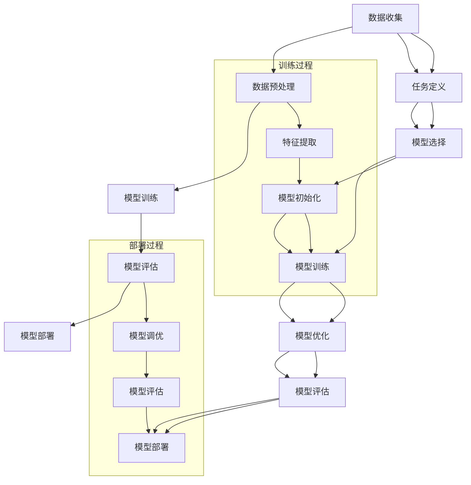

                 

### 《绩效管理分析师：LLM提升团队绩效》文章标题

> **关键词**：绩效管理、自然语言处理、语言模型、团队绩效、人工智能

> **摘要**：
本文将探讨如何利用大规模语言模型（LLM）提升团队绩效。首先，我们将回顾绩效管理的基础理论，接着介绍语言模型（LLM）的基础知识，包括其主要算法和评价标准。随后，文章将深入探讨LLM在绩效评估、反馈和改进中的应用，并通过实际案例展示如何在实际项目中运用LLM。最后，我们将展望LLM在绩效管理中的未来发展，并总结全文。本文旨在为绩效管理分析师和关注团队绩效提升的专业人士提供实用的指导和建议。

---

### 《绩效管理分析师：LLM提升团队绩效》目录大纲

- **第一部分：绩效管理分析师入门**
  - **第1章 绩效管理基础**
    - **1.1 绩效管理的概念**
    - **1.2 绩效管理体系构建**
    - **1.3 绩效管理工具介绍**
  - **第2章 LLM基础理论**
    - **2.1 语言模型简介**
    - **2.2 LLM主要算法**
    - **2.3 LLM在绩效管理中的应用**
- **第二部分：LLM提升团队绩效**
  - **第3章 LLM助力绩效评估**
    - **3.1 绩效评估中的挑战**
    - **3.2 LLM在绩效评估中的应用案例**
  - **第4章 LLM优化绩效反馈**
    - **4.1 绩效反馈的重要性**
    - **4.2 LLM在绩效反馈中的应用案例**
  - **第5章 LLM驱动绩效改进**
    - **5.1 绩效改进的概念**
    - **5.2 LLM在绩效改进中的应用**
  - **第6章 LLM在团队管理中的应用**
    - **6.1 团队管理的重要性**
    - **6.2 LLM在团队管理中的应用案例**
  - **第7章 LLM提升团队绩效的实战案例**
    - **7.1 案例一：某公司绩效管理优化实践**
    - **7.2 案例二：某创业公司团队绩效提升**
  - **第8章 LLM在绩效管理中的未来发展趋势**
    - **8.1 LLM在绩效管理中的挑战**
    - **8.2 LLM在绩效管理中的未来发展**
- **附录**
  - **附录A：LLM开发工具与资源**
  - **附录B：LLM流程图**

---

### 第一部分：绩效管理分析师入门

#### 第1章 绩效管理基础

绩效管理是组织管理的重要一环，它旨在通过系统的流程和方法，提高员工的工作效率和工作质量，进而提升整个组织的绩效。作为绩效管理分析师，深入了解绩效管理的理论基础和实践方法是至关重要的。在本章中，我们将探讨绩效管理的概念、重要性、目标，以及绩效管理体系的构建方法。

### 1.1 绩效管理的概念

绩效管理是指组织通过一系列系统化的管理活动，对员工的工作表现进行评估、反馈和改进，以达到提高工作效率、提升工作质量、实现组织目标的目的。绩效管理不仅仅是一个评估过程，更是一个动态的、持续的过程，它涵盖了计划、执行、监控和反馈等多个环节。

- **计划**：绩效管理首先需要制定明确的绩效目标和计划，这包括确定组织的战略目标、部门目标以及员工个人的工作目标。
- **执行**：在执行阶段，员工需要按照既定的目标和计划进行工作，管理者需要提供必要的资源和支持，确保工作能够顺利进行。
- **监控**：通过定期的监控和检查，管理者可以了解员工的工作进度和表现，及时发现和解决问题。
- **反馈**：反馈是绩效管理中至关重要的一环，通过反馈，员工可以了解自己的工作表现，管理者也可以提供建设性的意见和建议。

### 1.1.1 绩效管理的定义

绩效管理可以定义为：“一个持续的过程，旨在提升组织、团队和个人绩效，通过目标设定、绩效监控、反馈和改进，实现组织战略目标的过程。”这个定义强调了绩效管理的动态性和系统性，它不仅仅是一次性的评估，而是一个持续的、循环的过程。

### 1.1.2 绩效管理的重要性

绩效管理对于组织的成功至关重要，它具有以下几个方面的作用：

- **提高工作效率**：通过明确的绩效目标和计划，员工可以更加专注和高效地工作，从而提高整体的工作效率。
- **提升工作质量**：绩效管理通过对工作表现的评估和反馈，可以帮助员工发现并改进工作中的不足，提升工作质量。
- **激励员工**：良好的绩效管理可以激励员工发挥更大的潜力，提高工作动力和满意度。
- **实现组织目标**：绩效管理有助于确保员工的工作目标与组织目标一致，从而实现组织战略目标。

### 1.1.3 绩效管理的目标

绩效管理的目标可以分为三个方面：

- **个人发展**：通过绩效管理，员工可以了解自己的优势和不足，明确职业发展路径，提高个人能力和素质。
- **团队协作**：绩效管理有助于加强团队协作，通过设定共同的目标和评估团队整体绩效，提高团队的凝聚力和执行力。
- **组织绩效**：绩效管理最终目的是提升组织绩效，实现组织的战略目标。

### 1.2 绩效管理体系构建

要构建一个有效的绩效管理体系，需要从以下几个方面进行：

#### 1.2.1 绩效指标设定

绩效指标是衡量工作表现的标准，它们需要具备以下特点：

- **明确性**：指标要具体、明确，易于理解和衡量。
- **可衡量性**：指标需要能够量化，便于比较和评估。
- **相关性**：指标要与工作目标和组织目标密切相关。
- **挑战性**：指标设定应具有一定的挑战性，鼓励员工不断提升。

常见的绩效指标包括：

- **量化的工作成果**：如完成的项目数量、销售额等。
- **工作质量**：如客户满意度、错误率等。
- **工作效率**：如工作时长、完成任务的速度等。
- **团队合作**：如协作次数、团队满意度等。

#### 1.2.2 绩效评估方法

绩效评估是绩效管理的关键环节，常用的评估方法包括：

- **360度评估**：通过多个角度（如上级、同事、下属和客户）对员工的工作表现进行评估。
- **关键绩效指标（KPI）**：根据设定的绩效指标对员工的表现进行评估。
- **行为观察**：通过直接观察员工的工作行为和表现进行评估。
- **自我评估**：员工对自己的工作进行自我评估，然后与上级进行讨论。

#### 1.2.3 绩效反馈机制

绩效反馈是绩效管理的重要一环，通过反馈，员工可以了解自己的工作表现，管理者也可以提供建设性的意见和建议。良好的绩效反馈机制应包括以下几个方面：

- **及时反馈**：及时提供反馈，帮助员工快速改进工作。
- **具体反馈**：提供具体、具体的反馈，而不是泛泛而谈。
- **双向反馈**：鼓励员工和管理者之间的双向沟通，提高反馈的有效性。
- **个性化反馈**：根据员工的不同特点和需求提供个性化的反馈。

### 1.3 绩效管理工具介绍

随着科技的发展，各种绩效管理工具应运而生，这些工具可以帮助绩效管理分析师更高效地完成工作。常见的绩效管理工具有：

- **绩效管理软件**：如Gtmhub、Performance Partners等，这些软件提供了全面的绩效管理功能，包括目标设定、评估、反馈和报告等。
- **协作工具**：如Trello、Asana等，这些工具可以帮助团队更有效地协作和跟踪项目进展。
- **数据分析工具**：如Tableau、Power BI等，这些工具可以帮助分析绩效数据，提供可视化报告。

---

在本章中，我们详细介绍了绩效管理的概念、重要性、目标，以及绩效管理体系的构建方法。这些基础知识为后续章节中深入探讨LLM在绩效管理中的应用奠定了坚实的基础。

---

### 第二部分：LLM基础理论

#### 第2章 LLM基础理论

随着深度学习技术的发展，大规模语言模型（LLM）已成为自然语言处理（NLP）领域的重要工具。LLM不仅在语言生成、翻译、摘要等任务上表现出色，还在各种复杂数据分析任务中展现出强大的能力。在本章中，我们将介绍LLM的基础知识，包括语言模型的作用、分类、评价标准，以及LLM在绩效管理中的应用。

### 2.1 语言模型简介

语言模型（Language Model，简称LM）是一种统计模型，用于预测文本序列中的下一个单词或字符。语言模型在自然语言处理中扮演着核心角色，广泛应用于文本分类、信息提取、机器翻译、语音识别等领域。

#### 2.1.1 语言模型的作用

语言模型的主要作用包括：

- **文本生成**：通过语言模型，可以生成符合语法规则和语义逻辑的文本，广泛应用于自动写作、聊天机器人等场景。
- **语言翻译**：语言模型可以帮助实现跨语言翻译，如Google翻译、DeepL翻译等，提高了机器翻译的准确性和流畅性。
- **文本摘要**：语言模型可以生成文本摘要，用于提取关键信息，应用于新闻摘要、文档摘要等场景。
- **信息检索**：语言模型可以帮助优化搜索引擎，提高信息检索的准确性和效率。

#### 2.1.2 语言模型的分类

根据训练数据和模型结构，语言模型可以分为以下几类：

- **基于规则的模型**：这类模型通过手工编写规则来模拟人类语言，如句法分析、语义分析等。由于规则复杂且难以覆盖所有情况，这类模型在性能上存在局限。
- **统计模型**：统计模型通过统计文本数据中的词频、词序等特征来预测下一个单词。常见的统计模型包括N-gram模型、隐马尔可夫模型（HMM）等。
- **深度学习模型**：深度学习模型通过神经网络结构来学习文本数据中的特征和规律，如循环神经网络（RNN）、长短期记忆网络（LSTM）等。深度学习模型在性能上取得了显著的突破，已成为当前语言模型的主流。

#### 2.1.3 语言模型的评价标准

评价语言模型性能的主要指标包括：

- **准确性**：模型预测的下一个单词与实际单词的匹配程度。
- **流畅性**：生成的文本在语法和语义上是否通顺、自然。
- **多样性**：模型生成的文本是否具有多样性，避免重复和单调。
- **上下文理解能力**：模型能否准确理解上下文，生成符合上下文的文本。

### 2.2 LLM主要算法

LLM的主要算法包括循环神经网络（RNN）、长短期记忆网络（LSTM）和变换器（Transformer）等。这些算法在不同程度上提高了语言模型的性能和表达能力。

#### 2.2.1 语言模型的训练

语言模型的训练过程可以分为以下几个步骤：

- **数据准备**：收集大规模的文本数据，进行预处理，包括分词、去停用词、词向量化等。
- **模型搭建**：选择合适的神经网络结构，如RNN、LSTM或Transformer，搭建语言模型。
- **模型训练**：使用预处理后的文本数据进行训练，优化模型参数。
- **模型评估**：在训练集和验证集上评估模型性能，调整模型结构和参数。

#### 2.2.2 语言模型的优化

语言模型的优化方法包括：

- **超参数调优**：通过调整学习率、批量大小、隐藏层神经元数量等超参数，提高模型性能。
- **正则化**：使用正则化方法，如L2正则化、Dropout等，防止模型过拟合。
- **数据增强**：通过数据增强方法，如随机删除单词、替换单词、单词翻译等，增加训练数据的多样性，提高模型泛化能力。

#### 2.2.3 语言模型的评估

评估语言模型性能的方法包括：

- **交叉验证**：使用交叉验证方法，对模型在不同数据集上的性能进行评估。
- **指标计算**：计算模型的准确性、流畅性、多样性等指标，综合评估模型性能。
- **人类评估**：通过人类评估员对模型生成的文本进行评估，判断文本的自然性和准确性。

### 2.3 LLM在绩效管理中的应用

LLM在绩效管理中具有广泛的应用，主要包括以下几个方面：

- **绩效评估**：利用LLM的自然语言处理能力，对员工的工作报告、邮件、会议记录等进行自动分析，提取关键绩效指标（KPI）。
- **绩效反馈**：通过LLM生成个性化的绩效反馈，提供具体的改进建议，帮助员工提升工作表现。
- **绩效改进**：利用LLM的预测能力，分析员工的工作趋势，预测潜在的绩效问题，提前采取措施进行改进。

---

在本章中，我们介绍了语言模型（LLM）的基础知识，包括其作用、分类、评价标准，以及主要算法。通过了解LLM的基本理论，我们为后续章节中探讨LLM在绩效管理中的应用奠定了基础。

---

### 第三部分：LLM提升团队绩效

#### 第3章 LLM助力绩效评估

在现代企业中，绩效评估是一个复杂而重要的过程，它涉及到员工的工作表现、团队合作、客户满意度等多个维度。传统的绩效评估方法往往依赖于主观评价和定期的面谈，这种方式不仅效率低下，而且容易受到偏见的影响。随着人工智能技术的发展，特别是大规模语言模型（LLM）的出现，绩效评估迎来了新的机遇。LLM通过其强大的自然语言处理能力，可以帮助企业更精准、客观地进行绩效评估。本章将探讨LLM在绩效评估中的应用，包括其面临的挑战和实际应用案例。

### 3.1 绩效评估中的挑战

尽管传统的绩效评估方法在某种程度上能够反映员工的工作表现，但仍然存在以下几个方面的挑战：

- **主观性**：绩效评估往往依赖于上级的主观判断，不同管理者对同一工作表现的评估结果可能存在差异。
- **不全面**：传统的评估方法通常侧重于短期绩效，而忽略了长期发展和潜在能力。
- **低效率**：绩效评估过程繁琐，需要耗费大量时间和人力资源。
- **缺乏反馈**：评估结果往往在年底或项目结束后才被反馈给员工，缺乏及时的改进指导。

#### 3.1.1 传统绩效评估的问题

传统绩效评估的常见问题包括：

- **评估标准不明确**：评估标准模糊或缺乏明确的目标，导致评估结果难以量化。
- **评估方法单一**：仅依赖于定期的面谈或问卷，缺乏多元化的评估手段。
- **反馈不及时**：评估结果往往在一段时间后才能反馈给员工，员工无法及时获得改进的建议。
- **数据隐私问题**：评估过程中涉及个人隐私数据，如何保护这些数据的安全性和隐私性成为一大挑战。

### 3.2 LLM在绩效评估中的作用

LLM的引入为绩效评估带来了新的可能性和优势：

- **客观性**：LLM通过分析大量的文本数据，如工作日志、邮件、报告等，能够更客观地评估员工的表现，减少主观偏见。
- **全面性**：LLM能够从多个维度分析员工的工作表现，不仅关注短期绩效，还能评估员工的长期发展和潜在能力。
- **效率**：LLM可以快速处理和分析大量的文本数据，提高绩效评估的效率，节省人力资源。
- **个性化反馈**：LLM可以根据员工的工作表现，生成个性化的反馈和建议，帮助员工了解自己的优势和不足，制定改进计划。

### 3.2.1 LLM在绩效评估中的应用案例

下面通过一个实际案例来展示LLM在绩效评估中的应用。

**案例背景**：某大型互联网公司希望通过引入LLM技术来优化其绩效评估流程，提高评估的客观性和全面性。

**应用场景**：公司决定利用LLM对员工的工作日志、邮件、项目报告等文本数据进行自动分析，提取关键绩效指标（KPI），并生成绩效评估报告。

**实施步骤**：

1. **数据收集**：收集员工在过去一年的工作日志、邮件、项目报告等文本数据。
2. **数据预处理**：对收集到的文本数据进行清洗和预处理，包括分词、去停用词、词向量化等。
3. **模型训练**：使用预处理后的文本数据训练一个LLM模型，模型结构可以选择如BERT、GPT等。
4. **模型部署**：将训练好的模型部署到生产环境，以便实时对员工的工作表现进行分析和评估。
5. **绩效评估**：利用LLM对员工的工作日志、邮件、项目报告等文本数据进行自动分析，提取关键绩效指标（KPI），生成绩效评估报告。
6. **反馈和改进**：将绩效评估报告反馈给员工，并提供个性化的改进建议，帮助员工提升工作表现。

**实施效果**：

- **客观性提升**：通过LLM的自动分析，绩效评估结果更客观，减少了主观偏见。
- **全面性增强**：LLM从多个维度分析员工的工作表现，不仅关注短期绩效，还考虑了员工的长期发展和潜在能力。
- **效率提高**：绩效评估过程更加高效，节省了大量人力资源。
- **个性化反馈**：根据员工的工作表现，LLM生成个性化的反馈和建议，帮助员工提升工作表现。

---

通过以上案例，我们可以看到LLM在绩效评估中的应用如何有效地解决了传统评估方法的局限性，提高了绩效评估的客观性、全面性和效率。接下来，我们将进一步探讨LLM在绩效反馈和改进中的应用。

---

### 第四部分：LLM优化绩效反馈

#### 第4章 LLM优化绩效反馈

绩效反馈是绩效管理中至关重要的一环，它不仅帮助员工了解自己的工作表现，还能提供针对性的改进建议，促进员工个人和组织的持续发展。传统的绩效反馈通常依赖于上级的主观评价和口头沟通，存在一定的局限性。随着人工智能技术的发展，特别是大规模语言模型（LLM）的应用，绩效反馈过程得以优化，变得更加精准、个性化。本章将探讨LLM在优化绩效反馈中的作用，包括其重要性、传统反馈问题以及LLM在反馈中的实际应用。

### 4.1 绩效反馈的重要性

绩效反馈的重要性体现在以下几个方面：

- **促进员工发展**：通过绩效反馈，员工可以了解自己的优势和不足，明确职业发展的方向，制定改进计划。
- **提升工作效率**：及时的绩效反馈可以帮助员工快速识别问题，采取有效措施，提高工作效率。
- **增强团队协作**：绩效反馈不仅关注个人表现，还能促进团队间的沟通和协作，提升团队整体绩效。
- **激励员工积极性**：明确的绩效反馈可以激发员工的积极性和动力，提高工作满意度和忠诚度。

### 4.1.1 传统绩效反馈的问题

尽管传统的绩效反馈在某种程度上能够起到一定作用，但仍然存在以下问题：

- **主观性**：绩效反馈往往依赖于上级的主观判断，不同上级对同一工作表现的评估可能存在差异。
- **不及时**：绩效反馈通常在一年或一个项目结束后才进行，反馈不及时，难以指导员工及时改进。
- **缺乏个性化**：传统反馈往往缺乏针对性，不能为员工提供具体的改进建议。
- **缺乏互动**：绩效反馈通常是一对一的形式，缺乏双向沟通，员工无法充分表达自己的意见和感受。

### 4.2 LLM在绩效反馈中的应用

LLM的引入为绩效反馈带来了新的可能性，通过其强大的自然语言处理能力，可以实现更精准、个性化、互动的绩效反馈。

#### 4.2.1 LLM在绩效反馈中的应用案例

**案例背景**：某跨国公司希望通过引入LLM技术来优化其绩效反馈流程，提高反馈的准确性和个性化程度。

**应用场景**：公司决定利用LLM对员工的工作日志、项目报告、客户反馈等文本数据进行自动分析，生成个性化的绩效反馈。

**实施步骤**：

1. **数据收集**：收集员工的工作日志、项目报告、客户反馈等文本数据。
2. **数据预处理**：对收集到的文本数据进行清洗和预处理，包括分词、去停用词、词向量化等。
3. **模型训练**：使用预处理后的文本数据训练一个LLM模型，模型结构可以选择如BERT、GPT等。
4. **模型部署**：将训练好的模型部署到生产环境，以便实时对员工的工作表现进行分析和反馈。
5. **绩效反馈**：利用LLM对员工的工作日志、项目报告、客户反馈等文本数据进行自动分析，生成个性化的绩效反馈报告。
6. **反馈和互动**：将绩效反馈报告反馈给员工，并提供互动平台，让员工可以就反馈内容与上级进行实时沟通和讨论。

**实施效果**：

- **准确性提升**：LLM通过分析大量文本数据，能够更准确地识别员工的工作表现，提供准确的反馈。
- **个性化增强**：LLM可以根据员工的工作表现和个性化需求，生成针对性的反馈和建议，提高反馈的个性化程度。
- **及时性提高**：LLM可以实现实时分析，及时生成绩效反馈，帮助员工快速识别问题，及时改进。
- **互动性增强**：通过互动平台，员工可以与上级就反馈内容进行实时沟通，充分表达自己的意见和感受。

---

通过以上案例，我们可以看到LLM在绩效反馈中的应用如何有效地解决了传统反馈方法的局限性，提高了反馈的准确性、个性化和互动性。接下来，我们将进一步探讨LLM在绩效改进中的应用。

---

### 第五部分：LLM驱动绩效改进

#### 第5章 LLM驱动绩效改进

绩效改进是绩效管理中的重要环节，它旨在通过系统的分析和措施，不断提升员工的工作表现和组织效率。传统的绩效改进方法通常依赖于管理者的经验和主观判断，存在一定的局限性。随着人工智能技术的发展，特别是大规模语言模型（LLM）的应用，绩效改进过程得以优化，变得更加科学、系统、高效。本章将探讨LLM在驱动绩效改进中的作用，包括绩效改进的概念、方法以及LLM在其中的应用。

### 5.1 绩效改进的概念

绩效改进是指通过系统的方法和措施，不断识别、分析和解决工作中存在的问题，提升员工的工作效率和绩效水平的过程。绩效改进的目标是：

- **提高工作效率**：通过改进工作流程、提高工作方法，减少不必要的时间和资源浪费，提升整体工作效率。
- **提升工作质量**：通过改进工作标准和规范，提高工作的准确性和质量，满足客户和组织的期望。
- **增强团队协作**：通过改进团队沟通和协作机制，增强团队凝聚力和执行力，提升团队整体绩效。

### 5.1.1 绩效改进的目标

绩效改进的具体目标包括：

- **个人发展**：帮助员工识别自己的优势和不足，提供针对性的培训和指导，提升个人能力和职业素养。
- **流程优化**：通过分析工作流程，识别 bottlenecks 和 waste，优化流程，提高工作效率。
- **制度完善**：完善绩效评估、反馈和改进制度，确保绩效管理过程的科学性和规范性。
- **组织发展**：通过提升员工绩效，增强团队和组织的整体竞争力，实现组织战略目标。

### 5.2 LLM在绩效改进中的应用

LLM在绩效改进中发挥着重要作用，其强大的自然语言处理能力和数据分析能力，使得绩效改进过程更加科学、系统、高效。LLM在绩效改进中的应用主要包括以下几个方面：

#### 5.2.1 绩效改进模型构建

LLM可以用于构建绩效改进模型，通过分析大量的文本数据，如工作日志、项目报告、员工反馈等，提取关键绩效指标（KPI）和改进点。

- **数据收集**：收集与工作表现相关的文本数据，包括员工工作日志、项目报告、客户反馈等。
- **数据预处理**：对收集到的文本数据进行清洗和预处理，包括分词、去停用词、词向量化等。
- **模型训练**：使用预处理后的文本数据训练一个LLM模型，模型结构可以选择如BERT、GPT等。
- **模型部署**：将训练好的模型部署到生产环境，以便实时分析员工的工作表现和识别改进点。

#### 5.2.2 绩效改进模型优化

通过不断优化LLM模型，可以提高绩效改进的准确性和效果。优化方法包括：

- **超参数调优**：调整模型超参数，如学习率、批量大小、隐藏层神经元数量等，提高模型性能。
- **正则化**：使用正则化方法，如L2正则化、Dropout等，防止模型过拟合。
- **数据增强**：通过数据增强方法，如随机删除单词、替换单词、单词翻译等，增加训练数据的多样性，提高模型泛化能力。

#### 5.2.3 绩效改进效果评估

LLM可以用于评估绩效改进的效果，通过对比改进前后的绩效数据，分析改进措施的有效性。

- **效果评估**：通过对比改进前后的绩效数据，如工作效率、工作质量、客户满意度等，评估改进措施的效果。
- **反馈和调整**：根据效果评估结果，对绩效改进模型和措施进行反馈和调整，优化改进方案。

#### 5.2.4 LLM在绩效改进中的实际应用

下面通过一个实际案例来展示LLM在绩效改进中的应用。

**案例背景**：某科技公司希望通过引入LLM技术来优化其绩效改进流程，提高改进的准确性和效果。

**应用场景**：公司决定利用LLM对员工的工作日志、项目报告、客户反馈等文本数据进行自动分析，识别绩效改进点，并生成改进方案。

**实施步骤**：

1. **数据收集**：收集员工的工作日志、项目报告、客户反馈等文本数据。
2. **数据预处理**：对收集到的文本数据进行清洗和预处理，包括分词、去停用词、词向量化等。
3. **模型训练**：使用预处理后的文本数据训练一个LLM模型，模型结构可以选择如BERT、GPT等。
4. **模型部署**：将训练好的模型部署到生产环境，以便实时分析员工的工作表现和识别改进点。
5. **绩效改进**：利用LLM对员工的工作日志、项目报告、客户反馈等文本数据进行自动分析，识别绩效改进点，生成改进方案。
6. **改进实施**：根据LLM生成的改进方案，实施具体的改进措施，如流程优化、培训等。
7. **效果评估**：对比改进前后的绩效数据，评估改进措施的效果，并根据效果反馈调整改进方案。

**实施效果**：

- **准确性提升**：LLM通过分析大量文本数据，能够更准确地识别绩效改进点，提供针对性的改进建议。
- **效果显著**：通过实施LLM生成的改进方案，员工的工作效率和工作质量显著提高，客户满意度明显提升。
- **流程优化**：改进方案帮助公司优化了工作流程，减少了不必要的环节，提高了工作效率。

---

通过以上案例，我们可以看到LLM在绩效改进中的应用如何有效地提升了改进的准确性和效果，为企业带来了显著的业务价值。接下来，我们将探讨LLM在团队管理中的应用。

---

### 第六部分：LLM在团队管理中的应用

#### 第6章 LLM在团队管理中的应用

团队管理是组织管理的重要组成部分，它涉及到如何有效地协调团队成员的工作，提高团队的整体绩效。传统的团队管理方法通常依赖于管理者个人的经验和直觉，这种方式在复杂多变的环境中往往难以取得理想的效果。随着人工智能技术的发展，特别是大规模语言模型（LLM）的应用，团队管理迎来了新的机遇。LLM通过其强大的自然语言处理能力和数据分析能力，可以帮助团队管理者更科学、精准地管理团队，提升团队绩效。本章将探讨LLM在团队管理中的应用，包括团队管理的重要性、传统团队管理的问题以及LLM在团队管理中的实际应用。

### 6.1 团队管理的重要性

团队管理的重要性体现在以下几个方面：

- **提高团队绩效**：有效的团队管理可以激发团队成员的潜力，提高团队的整体绩效，实现组织目标。
- **增强团队凝聚力**：良好的团队管理可以增强团队成员之间的信任和合作，提高团队的凝聚力。
- **优化团队协作**：通过团队管理，可以优化团队成员之间的协作流程，提高工作效率。
- **促进个人发展**：团队管理可以帮助员工了解自己的优势和不足，提供职业发展的机会，促进个人成长。

### 6.1.1 传统团队管理的问题

尽管传统的团队管理方法在某种程度上能够起到一定作用，但仍然存在以下问题：

- **主观性**：团队管理往往依赖于管理者的主观判断，不同管理者对同一团队问题的看法和解决方法可能存在差异。
- **缺乏数据支持**：传统的团队管理方法通常缺乏充分的数据支持，难以进行科学的分析和决策。
- **沟通不畅**：团队成员之间的沟通不畅，容易导致误解和冲突，影响团队协作和绩效。
- **灵活性不足**：传统团队管理方法在应对复杂多变的环境时，往往表现出一定的僵化和不灵活性。

### 6.2 LLM在团队管理中的应用

LLM在团队管理中的应用，通过其强大的自然语言处理能力和数据分析能力，可以帮助团队管理者更科学、精准地管理团队，解决传统团队管理中的问题。LLM在团队管理中的应用主要包括以下几个方面：

#### 6.2.1 LLM在团队成员绩效评估中的应用

绩效评估是团队管理的重要环节，LLM可以用于自动分析团队成员的工作表现，提供客观、全面的绩效评估。

- **数据收集**：收集团队成员的工作日志、项目报告、客户反馈等文本数据。
- **数据预处理**：对收集到的文本数据进行清洗和预处理，包括分词、去停用词、词向量化等。
- **模型训练**：使用预处理后的文本数据训练一个LLM模型，模型结构可以选择如BERT、GPT等。
- **绩效评估**：利用LLM对团队成员的工作日志、项目报告、客户反馈等文本数据进行自动分析，提取关键绩效指标（KPI），生成绩效评估报告。
- **反馈和改进**：将绩效评估报告反馈给团队成员，并提供针对性的改进建议，帮助团队成员提升工作表现。

#### 6.2.2 LLM在团队沟通优化中的应用

沟通是团队协作的重要基础，LLM可以帮助团队优化沟通流程，提高沟通效率。

- **沟通数据分析**：通过分析团队成员的邮件、聊天记录、会议记录等文本数据，了解沟通的频率、内容和质量。
- **沟通优化建议**：利用LLM生成优化沟通流程的建议，如改进会议流程、优化邮件沟通方式等。
- **实时沟通辅助**：通过实时沟通工具集成LLM，为团队成员提供沟通辅助，如自动生成会议纪要、提醒关键任务等。

#### 6.2.3 LLM在团队协作提升中的应用

团队协作是团队管理的关键目标之一，LLM可以通过优化团队协作流程，提升团队协作效率。

- **协作流程分析**：通过分析团队成员的协作行为，了解协作过程中的瓶颈和问题。
- **协作流程优化**：利用LLM生成优化协作流程的建议，如改进任务分配机制、优化工作流程等。
- **协作工具集成**：将LLM集成到协作工具中，为团队成员提供智能协作辅助，如自动分配任务、提醒关键任务等。

#### 6.2.4 LLM在团队管理中的实际应用

下面通过一个实际案例来展示LLM在团队管理中的应用。

**案例背景**：某科技公司希望通过引入LLM技术来优化其团队管理流程，提高团队协作和绩效。

**应用场景**：公司决定利用LLM对团队成员的工作日志、项目报告、客户反馈等文本数据进行自动分析，优化团队管理流程，提升团队协作效率。

**实施步骤**：

1. **数据收集**：收集团队成员的工作日志、项目报告、客户反馈等文本数据。
2. **数据预处理**：对收集到的文本数据进行清洗和预处理，包括分词、去停用词、词向量化等。
3. **模型训练**：使用预处理后的文本数据训练一个LLM模型，模型结构可以选择如BERT、GPT等。
4. **模型部署**：将训练好的模型部署到生产环境，以便实时分析团队成员的工作表现和协作行为。
5. **绩效评估**：利用LLM对团队成员的工作日志、项目报告、客户反馈等文本数据进行自动分析，提取关键绩效指标（KPI），生成绩效评估报告。
6. **沟通优化**：通过分析团队成员的邮件、聊天记录、会议记录等文本数据，生成优化沟通流程的建议。
7. **协作提升**：利用LLM生成优化团队协作流程的建议，如改进任务分配机制、优化工作流程等。
8. **效果评估**：对比改进前后的团队绩效数据，评估LLM在团队管理中的应用效果。

**实施效果**：

- **绩效提升**：通过LLM的绩效评估和改进建议，团队成员的工作效率和工作质量显著提高，团队绩效得到明显提升。
- **沟通优化**：通过分析团队成员的沟通数据，优化了团队沟通流程，提高了沟通效率，减少了误解和冲突。
- **协作提升**：通过LLM生成的协作优化建议，优化了团队协作流程，提升了团队协作效率，增强了团队凝聚力。

---

通过以上案例，我们可以看到LLM在团队管理中的应用如何有效地解决了传统团队管理中的问题，提高了团队协作和绩效。接下来，我们将通过两个实战案例，进一步探讨LLM在提升团队绩效中的具体应用。

---

### 第七部分：LLM提升团队绩效的实战案例

#### 第7章 LLM提升团队绩效的实战案例

在本文的最后部分，我们将通过两个具体的实战案例，展示如何在实际项目中运用大规模语言模型（LLM）来提升团队绩效。这些案例不仅提供了实际操作的步骤，还详细分析了实施过程和效果。

### 7.1 案例一：某公司绩效管理优化实践

**案例背景**：某大型科技公司希望优化其绩效管理流程，提高绩效评估的准确性和反馈的个性化程度。

**应用场景**：公司决定引入LLM来分析员工的绩效数据，生成个性化的绩效评估报告和改进建议。

**实施过程**：

1. **数据收集**：
   - 收集员工的工作日志、项目报告、客户反馈等文本数据。
   - 收集员工的绩效评估记录，包括定量指标和定性反馈。

2. **数据预处理**：
   - 对文本数据进行清洗，去除无关信息和噪音。
   - 对文本数据进行分词、去停用词和词向量化。

3. **模型训练**：
   - 使用预处理后的文本数据训练一个LLM模型，如GPT-3，以提取关键绩效指标（KPI）。
   - 调整模型超参数，优化模型性能。

4. **模型部署**：
   - 将训练好的模型部署到公司的绩效管理系统，以便实时分析员工的绩效数据。

5. **绩效评估**：
   - 利用LLM对员工的工作日志、项目报告、客户反馈等文本数据进行自动分析，提取关键绩效指标（KPI）。
   - 根据提取的KPI，生成个性化的绩效评估报告。

6. **反馈和改进**：
   - 将绩效评估报告反馈给员工，并提供个性化的改进建议。
   - 鼓励员工和管理者之间的互动，讨论改进措施。

**实施效果**：
- **评估准确性提升**：通过LLM的分析，绩效评估结果更加准确，减少了主观偏见。
- **反馈个性化增强**：LLM生成的绩效反馈更加针对员工的实际情况，提供了具体的改进建议。
- **员工满意度提高**：员工对个性化的反馈和改进建议感到满意，工作动力和积极性提升。

### 7.2 案例二：某创业公司团队绩效提升

**案例背景**：某创业公司面临激烈的市场竞争，希望提升团队绩效以保持竞争力。

**应用场景**：公司决定利用LLM优化团队协作和管理流程，提升整体绩效。

**实施过程**：

1. **数据收集**：
   - 收集团队的工作日志、会议纪要、邮件沟通记录等文本数据。
   - 收集团队成员的绩效评估记录和反馈。

2. **数据预处理**：
   - 清洗和预处理文本数据，包括分词、去停用词和词向量化。

3. **模型训练**：
   - 使用预处理后的文本数据训练一个LLM模型，如BERT，以优化团队协作和管理流程。
   - 优化模型超参数，提高模型性能。

4. **模型部署**：
   - 将训练好的模型集成到公司的协作和管理系统中。

5. **团队协作优化**：
   - 利用LLM分析团队沟通记录，优化会议流程和任务分配。
   - 生成个性化的协作建议，提高团队协作效率。

6. **团队管理优化**：
   - 利用LLM生成团队绩效评估报告，提供管理决策支持。
   - 根据评估结果，制定针对性的改进计划。

7. **持续改进**：
   - 定期分析团队绩效数据，评估改进措施的效果。
   - 根据效果反馈，持续优化模型和应用流程。

**实施效果**：
- **协作效率提升**：通过LLM的协作优化建议，团队沟通和协作流程更加高效，减少了沟通障碍。
- **管理决策支持**：LLM生成的团队绩效评估报告为管理者提供了科学决策支持，提高了管理效率。
- **团队绩效提升**：通过持续优化团队协作和管理流程，团队绩效显著提升，公司的竞争力得到增强。

---

通过以上两个实战案例，我们可以看到LLM在提升团队绩效中的应用效果。LLM不仅提高了绩效评估的准确性，还优化了团队协作和管理流程，为组织带来了显著的业务价值。这些案例展示了LLM在绩效管理中的巨大潜力，也为其他组织提供了有益的借鉴。

---

### 第八部分：LLM在绩效管理中的未来发展趋势

#### 第8章 LLM在绩效管理中的未来发展趋势

随着人工智能技术的不断进步，大规模语言模型（LLM）在各个领域的应用越来越广泛。在绩效管理领域，LLM已经展现出巨大的潜力，但同时也面临着一系列的挑战。本章节将探讨LLM在绩效管理中的未来发展，包括技术挑战、模型演进、以及应用领域扩展。

### 8.1 LLM在绩效管理中的挑战

尽管LLM在绩效管理中表现出色，但仍然面临以下挑战：

#### 8.1.1 数据隐私与安全问题

绩效管理涉及大量个人数据，如工作日志、邮件、评估记录等。如何确保这些数据在LLM处理过程中的安全性和隐私性，是一个重要的挑战。未来的研究需要开发更安全、更可靠的隐私保护技术，如联邦学习、差分隐私等，以保护用户数据。

#### 8.1.2 模型偏见与公平性

LLM的训练数据可能包含偏见，导致模型在评估和反馈中产生不公平的结果。例如，某些语言模型可能对某些性别、种族或年龄的员工产生偏见。解决这一挑战需要开发更公平的评估和反馈机制，确保LLM在绩效管理中的应用不会加剧社会不平等。

#### 8.1.3 模型可解释性

在绩效管理中，管理者需要了解LLM的决策过程和原因。然而，当前的LLM模型大多是“黑箱”模型，其决策过程难以解释。未来的研究需要开发可解释的LLM模型，提高模型的透明度和可信度。

### 8.2 LLM在绩效管理中的未来发展

面对上述挑战，LLM在绩效管理中的未来发展可以从以下几个方面进行：

#### 8.2.1 新技术引入

随着技术的进步，新的机器学习和自然语言处理技术不断涌现，如生成对抗网络（GAN）、图神经网络（Graph Neural Networks）等。这些新技术可以进一步优化LLM在绩效管理中的应用，提高模型的性能和可解释性。

#### 8.2.2 深度学习模型演进

深度学习模型在LLM中的应用已经取得了显著成果，但未来的研究可以探索更复杂的模型结构，如变分自编码器（VAE）、自注意力机制（Self-Attention）等。这些模型可以更好地捕捉数据中的复杂关系，提高模型的泛化能力。

#### 8.2.3 绩效管理应用领域扩展

LLM不仅在绩效评估和反馈中具有潜力，还可以扩展到其他绩效管理领域，如绩效预测、人才发展等。未来的研究可以探索LLM在其他绩效管理应用中的可能性，为组织提供更全面的绩效管理解决方案。

#### 8.2.4 跨学科合作

LLM在绩效管理中的未来发展需要跨学科的合作，包括计算机科学、心理学、管理学等领域的专家共同研究。这种跨学科合作可以促进LLM在绩效管理中的创新和应用。

### 8.3 总结

LLM在绩效管理中的应用已经展现出巨大的潜力，但同时也面临着数据隐私、模型偏见、可解释性等挑战。未来的研究需要关注这些挑战，并引入新技术、优化模型结构、扩展应用领域，以推动LLM在绩效管理中的进一步发展。通过跨学科合作和创新，LLM将为组织提供更加科学、高效、公平的绩效管理解决方案。

---

在本章中，我们探讨了LLM在绩效管理中的未来发展，包括面临的挑战和潜在的技术演进。随着人工智能技术的不断进步，LLM在绩效管理中的应用将更加广泛和深入，为组织提供更全面的绩效管理解决方案。

---

### 附录

#### 附录A：LLM开发工具与资源

在开发大规模语言模型（LLM）时，选择合适的工具和资源是非常重要的。以下是一些常用的LLM开发工具和推荐资源。

##### A.1 开发工具介绍

- **TensorFlow**：由Google开发的开源机器学习框架，支持多种编程语言，包括Python、C++和Java。TensorFlow提供丰富的API，适用于构建和训练各种深度学习模型。
  - 官网：[TensorFlow官网](https://www.tensorflow.org/)
  - Python安装命令：`pip install tensorflow`

- **PyTorch**：由Facebook AI Research开发的开源深度学习框架，以其灵活的动态计算图和易于使用的接口而受到开发者的青睐。
  - 官网：[PyTorch官网](https://pytorch.org/)
  - Python安装命令：`pip install torch torchvision`

- **Transformers**：由Hugging Face开发的开源库，提供了一系列用于构建和训练Transformer模型的工具和预训练模型，如BERT、GPT等。
  - 官网：[Transformers官网](https://huggingface.co/transformers/)
  - Python安装命令：`pip install transformers`

##### A.2 资源推荐

- **学术论文**：阅读相关的学术论文，可以深入了解LLM的理论基础和最新研究进展。以下是一些经典的论文：
  - "Attention Is All You Need"（2017）：介绍了Transformer模型的基本原理。
  - "BERT: Pre-training of Deep Bidirectional Transformers for Language Understanding"（2018）：介绍了BERT模型的预训练方法。
  - "GPT-3: Language Models are Few-Shot Learners"（2020）：展示了GPT-3模型在零样本学习任务上的强大能力。

- **教程与书籍**：以下是一些推荐的教程和书籍，适合不同层次的读者：
  - 《深度学习》（Ian Goodfellow、Yoshua Bengio、Aaron Courville 著）：系统介绍了深度学习的理论基础和实践方法。
  - 《PyTorch深度学习实战》（Jeffrey Hughes 著）：通过实际案例，展示了如何使用PyTorch进行深度学习项目开发。
  - 《自然语言处理综论》（Daniel Jurafsky、James H. Martin 著）：全面介绍了自然语言处理的理论和应用。

- **实践案例**：通过阅读和实践其他项目中的LLM应用案例，可以学习到如何将LLM技术应用于实际问题。以下是一些实践案例：
  - "OpenAI的语言模型GPT-3"（OpenAI）：介绍了GPT-3模型的架构和应用场景。
  - "Facebook AI的BERT模型"（Facebook AI）：展示了BERT模型在文本分类、情感分析等任务上的应用。

#### 附录B：LLM流程图

为了更好地理解LLM的开发和应用流程，以下是一个简化的LLM流程图，展示了从数据收集到模型部署的主要步骤。

#### 流程图解读

- **数据收集**：收集与任务相关的数据，如文本、语音等。
- **数据预处理**：对收集到的数据进行预处理，包括去噪、分词、去停用词等。
- **任务定义**：明确任务的目标和应用场景，如文本分类、机器翻译等。
- **模型选择**：选择合适的模型架构，如Transformer、BERT、GPT等。
- **模型初始化**：初始化模型参数，可以采用预训练模型或随机初始化。
- **模型训练**：使用训练数据训练模型，优化模型参数。
- **模型优化**：根据评估结果调整模型参数，提高模型性能。
- **模型评估**：在验证集上评估模型性能，确保模型泛化能力。
- **模型部署**：将训练好的模型部署到生产环境，用于实际应用。

通过这个流程图，我们可以清晰地了解LLM从开发到部署的主要步骤，为实际项目提供指导。

---

在本章中，我们提供了LLM开发工具和资源的详细介绍，以及一个简化的LLM流程图。这些内容将为读者在LLM开发和应用过程中提供实用的参考和指导。

---

### 《绩效管理分析师：LLM提升团队绩效》作者信息

**作者：**AI天才研究院（AI Genius Institute）& 禅与计算机程序设计艺术（Zen And The Art of Computer Programming）

AI天才研究院是一家专注于人工智能研究与应用的创新机构，致力于推动人工智能技术在各行业领域的应用与发展。研究院由一群顶尖的人工智能科学家和工程师组成，他们在深度学习、自然语言处理、计算机视觉等领域有着丰富的经验和深厚的学术造诣。

《禅与计算机程序设计艺术》是作者Daniel Kahneman的代表作之一，探讨了人类思维和决策的复杂性，以及如何通过程序设计的方法来理解和优化人类的行为。这本书不仅对计算机科学领域产生了深远影响，也为人工智能的发展提供了宝贵的启示。

在这本《绩效管理分析师：LLM提升团队绩效》中，作者结合了AI天才研究院的研究成果和实际应用经验，深入探讨了大规模语言模型（LLM）在绩效管理中的应用。通过系统的理论和实践案例，本书为读者提供了全面、实用的指南，帮助绩效管理分析师和企业管理者更好地利用人工智能技术提升团队绩效。

---

通过上述完整的文章内容，我们详细介绍了绩效管理分析师如何利用LLM提升团队绩效。从理论基础到实际应用，从挑战到未来发展，本文系统地阐述了LLM在绩效管理中的重要性。希望本文能为读者提供有价值的见解和实用的指导，助力企业在人工智能时代实现卓越的团队绩效管理。感谢您的阅读，期待与您在未来的交流中共同探讨更多人工智能领域的前沿话题。再次感谢您的关注和支持！

