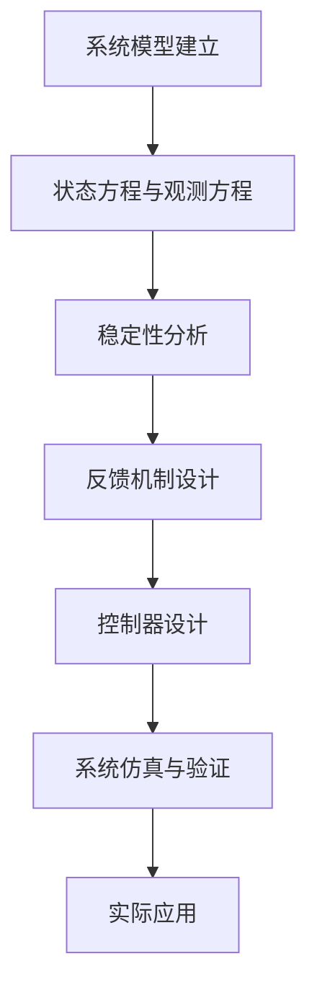
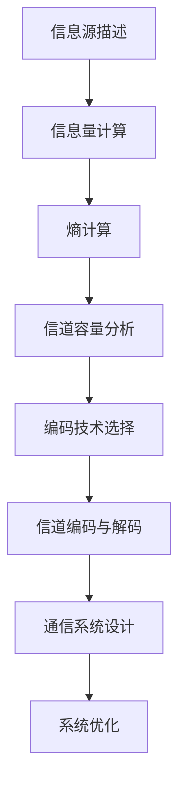
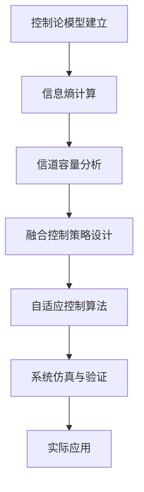

                 

### 文章标题：维纳的控制论与香农的分歧

在信息技术和工程学的宏大历史中，两位杰出人物——诺伯特·维纳（Norbert Wiener）和克劳德·香农（Claude Shannon），以其对现代科技领域的深远影响而著称。维纳开创了控制论这一重要分支，揭示了系统、动态过程的控制与稳定性原理；而香农则奠定了信息论的基础，阐明了信息传输中的基本规律和理论框架。两者在概念和方法上既有交集，也存在分歧。本文将深入探讨维纳的控制论与香农的信息论的起源、基本概念、核心原理以及它们在现代工程和社会中的广泛应用，并通过一步步的分析推理，揭示两者之间的相似性和差异，最后对它们在哲学层面的意义进行探讨，并展望其未来的发展趋势。

### 文章关键词

- 诺伯特·维纳
- 克劳德·香农
- 控制论
- 信息论
- 稳态控制
- 动态控制
- 熵
- 信道容量
- 随机过程
- 信息传输

### 摘要

本文旨在对比分析控制论的奠基人诺伯特·维纳和信息论的创始人克劳德·香农的理论体系。通过详细阐述控制论和信息论的基本概念、核心原理及其在现代工程和社会中的应用，本文揭示了两者在系统稳定性、信息传输和处理上的异同。进一步探讨维纳的控制论与香农的信息论在现代社会中的实际应用，如自动化控制系统、人工智能和医疗监测等领域。最后，从哲学角度审视两者的意义，并提出对未来发展的展望。通过这样的系统分析，本文希望为读者提供一个全面而深入的理解，展示控制论与信息论在信息技术和工程学中的关键作用。

#### 第一部分：控制论与信息论的基础

### 第1章：控制论与信息论的基本概念

在探索维纳的控制论与香农的信息论之前，我们首先需要了解控制论和信息论的基本概念，以及它们的历史与发展背景。

## 1.1 控制论的基本概念

### 1.1.1 控制论的历史与发展

控制论（Cybernetics）一词由诺伯特·维纳（Norbert Wiener）在1948年首次提出，源自希腊语“kybernetes”，意为“舵手”或“管理者”。这一概念象征着对动态系统和复杂过程进行管理和控制的科学。维纳将控制论视为一门跨学科的研究领域，涉及数学、物理学、工程学、生物学等多个学科。

控制论的发展历程可以追溯到20世纪初。早在1920年代，维纳就从事了有关通信系统的研究。他意识到，无论是生物学系统、工程系统还是社会系统，都存在一定的控制机制。这些机制在应对不确定性和动态变化时起到了关键作用。1930年代，维纳进一步扩展了哈密顿（Hamilton）和贝尔（Birkhoff）的研究成果，提出了确定性系统的稳定性理论。

1940年代，维纳在从事军事通信系统研究时，提出了控制论的基本框架。他认为，控制论的核心问题是系统如何通过反馈机制来调节自身状态，以达到预定的目标。维纳的控制论研究涵盖了从简单的线性系统到复杂非线性系统的控制策略。

### 1.1.2 控制系统的基本组成

控制系统的基本组成包括四个主要部分：控制器（Controller）、被控对象（Controlled Object）、反馈环节（Feedback Loop）和干扰（Disturbance）。

1. **控制器**：控制器是系统的核心部分，负责根据系统的当前状态和预定目标，生成控制信号。控制器通常采用算法或数学模型来实现，例如PID控制器、模糊控制器等。

2. **被控对象**：被控对象是控制系统的实际操作对象，其状态由控制器来调节。被控对象可以是机械系统、生物系统、经济系统等。

3. **反馈环节**：反馈环节用于将系统的输出状态反馈给控制器，以便控制器能够根据实际输出调整控制信号。反馈机制可以是直接测量输出信号，也可以是通过传感器和测量设备来获取。

4. **干扰**：干扰是指外部因素对系统的影响，包括随机噪声、环境变化等。干扰会影响被控对象的状态，控制器需要通过调整控制信号来应对这些干扰。

### 1.1.3 稳态控制与动态控制

在控制论中，稳态控制和动态控制是两个核心概念。

- **稳态控制**：稳态控制指的是在系统达到稳定状态后，通过控制手段维持系统在预定目标附近。稳态控制的目的是使系统在长时间运行中保持稳定、高效。

- **动态控制**：动态控制指的是系统在经历动态变化时，通过控制手段来调节系统状态，以应对外部扰动和系统内部变化。动态控制的目的是使系统在短时间内达到稳定，并能快速响应外部变化。

### 1.2 信息论的基本概念

### 1.2.1 信息论的历史与发展

信息论（Information Theory）是由克劳德·香农（Claude Shannon）在1948年提出的，它是一门研究信息传输和处理的基本原理的学科。香农的信息论以概率论为基础，通过对信息、熵、信道等基本概念的研究，揭示了信息传输中的基本规律。

香农在《通信的数学理论》（A Mathematical Theory of Communication）一书中，系统地提出了信息论的理论框架。他定义了信息量、熵、信道容量等基本概念，并提出了香农熵和信道容量公式。香农的工作开创了信息论这一新的学科领域，并对通信技术、计算机科学等领域产生了深远的影响。

### 1.2.2 信息、熵与信息量

- **信息**：在香农的信息论中，信息被定义为消除不确定性的能力。一个消息携带的信息量取决于接收者对该消息的先验知识。

- **熵**：熵是衡量随机变量不确定性的量度。在信息论中，香农熵（Shannon Entropy）被用来衡量一个信息源的随机性。熵的定义公式为：

  $$ H(X) = -\sum_{i} p(x_i) \log_2 p(x_i) $$

  其中，$X$ 是随机变量，$p(x_i)$ 是该随机变量取值为 $x_i$ 的概率。

- **信息量**：信息量是衡量信息传递过程中所传递的信息量的度量。一个消息的信息量可以用其熵来表示。

### 1.2.3 信息传输与信道

在信息论中，信息传输是通过信道进行的。信道是信息传递的媒介，可以是电缆、无线信号、光纤等。

- **信道容量**：信道容量是指一个信道在给定噪声水平下能够传输的最大信息量。香农信道容量公式是信息论的核心公式之一，其定义为：

  $$ C = W \log_2 (1 + \frac{S}{N}) $$

  其中，$C$ 是信道容量，$W$ 是信道的带宽，$S$ 是信号功率，$N$ 是噪声功率。

通过以上对控制论和信息论的基本概念、历史发展和基本组成的分析，我们可以为后续的深入探讨打下坚实的基础。

#### 第2章：维纳的控制论原理

在控制论的众多贡献者中，诺伯特·维纳无疑是最为重要的一位。他的开创性工作不仅奠定了控制论的基础，还推动了相关领域的发展，特别是在随机过程、控制理论、系统稳定性以及滤波技术等方面。

## 2.1 维纳的控制论原理

### 2.1.1 维纳的控制论框架

维纳的控制论框架是整个控制论领域的重要基础。他提出了一个关于动态系统控制和稳定性的广义理论。这一框架的核心思想是，通过建立系统的数学模型，并结合反馈机制，来实现对系统的控制和调节。

维纳的控制论框架主要包括以下几个组成部分：

1. **系统的数学模型**：维纳认为，任何动态系统都可以通过一组微分方程或差分方程来描述其状态。这些方程能够表达系统内部的相互作用和外部干扰的影响。

2. **反馈机制**：维纳提出，通过反馈机制可以将系统的输出信息反馈给输入端，以实现对系统状态的调节。这种反馈机制可以使得系统在面临外部扰动时，能够自我调整并恢复到预定状态。

3. **稳定性分析**：维纳强调，系统稳定性是控制论研究的重要目标之一。他提出了一系列稳定性判据，包括线性系统的李雅普诺夫（Lyapunov）稳定性理论和非线性系统的反馈稳定性理论。

### 2.1.2 维纳滤波器

维纳滤波器是维纳控制论中一个非常重要的概念，它在信号处理和控制系统中有着广泛的应用。维纳滤波器是一种最优滤波器，它通过最小化均方误差来实现信号的估计。

**维纳滤波器的原理**：

1. **观测模型**：系统状态 $x(t)$ 通过观测模型 $y(t) = H_0 x(t) + v(t)$ 被观测到，其中 $H_0$ 是观测矩阵，$v(t)$ 是观测噪声。

2. **估计模型**：估计值 $\hat{x}(t)$ 通过系统模型 $x(t) = A x(t-\tau) + w(t-\tau)$ 计算得出，其中 $A$ 是系统矩阵，$\tau$ 是时延，$w(t-\tau)$ 是过程噪声。

3. **滤波方程**：维纳滤波器的目标是找到最优估计值 $\hat{x}(t)$，使得估计误差的均方误差最小。这一目标可以通过以下方程实现：

   $$ \hat{x}(t) = (H_0^T H_0 + R^{-1})^{-1} H_0^T y(t) $$

   其中，$R$ 是观测噪声的协方差矩阵。

**维纳滤波器的应用**：

维纳滤波器在信号处理和控制系统中有着广泛的应用。例如，在通信系统中，维纳滤波器可以用于信道均衡，以消除噪声对信号的影响。在控制系统如飞行器自动驾驶和机器人运动控制中，维纳滤波器可以帮助实现稳定和精确的控制。

### 2.1.3 随机过程与控制

在控制论中，随机过程（Stochastic Processes）是一个核心概念。维纳将随机过程引入到控制论中，并提出了维纳过程（Wiener Process），这是一种重要的随机过程模型。

**维纳过程的定义**：

维纳过程是一种连续但具有零均值的随机过程，其定义如下：

$$ dW_t = \sqrt{2\alpha} dB_t - dt $$

其中，$B_t$ 是布朗运动，$\alpha$ 是维纳过程的自协方差函数。

**维纳过程在控制中的应用**：

维纳过程在控制系统中用于描述不确定性和噪声。通过维纳过程，可以建立系统的状态方程和观测方程，并采用维纳滤波器来进行状态估计和滤波。这种方法在应对复杂动态环境时非常有用，例如在自动驾驶系统中，维纳过程可以用于建模车辆的运动不确定性。

通过以上对维纳控制论原理的详细分析，我们可以看到维纳在控制论领域的重要贡献和深远影响。维纳的控制论原理不仅为现代控制系统的设计和分析提供了理论基础，而且在信号处理、通信、人工智能等多个领域都有着广泛的应用。

#### 第2.2节：维纳-哈特曼滤波器

维纳-哈特曼滤波器（Wiener-Hartman Filter）是维纳控制论中的重要组成部分，它在信号处理和控制系统设计中有着广泛的应用。这一滤波器通过最小化均方误差来提供最优状态估计，因此在需要高精度控制和高可靠性估计的场合显得尤为重要。

## 2.2.1 维纳-哈特曼滤波器的原理

维纳-哈特曼滤波器的原理可以概括为以下三个步骤：

1. **系统模型的建立**：首先，我们需要建立一个系统的数学模型。这个模型通常由状态方程和观测方程组成。状态方程描述系统内部状态的变化，观测方程描述系统状态与观测值之间的关系。

   - **状态方程**： 
     $$ x(t) = A x(t-\tau) + B w(t-\tau) $$
     其中，$x(t)$ 是系统状态，$A$ 是状态转移矩阵，$\tau$ 是时延，$B$ 是控制输入矩阵，$w(t-\tau)$ 是过程噪声。

   - **观测方程**：
     $$ z(t) = H x(t) + v(t) $$
     其中，$z(t)$ 是观测值，$H$ 是观测矩阵，$v(t)$ 是观测噪声。

2. **协方差矩阵的计算**：接下来，我们需要计算系统噪声和观测噪声的协方差矩阵。这些协方差矩阵是滤波器设计的关键参数。

   - **过程噪声协方差矩阵**：
     $$ Q = E [w(t-\tau) w(t-\tau)^T] $$
   
   - **观测噪声协方差矩阵**：
     $$ R = E [v(t) v(t)^T] $$

3. **滤波器方程的计算**：最后，通过求解滤波器方程，可以得到系统的最优状态估计值。

   维纳-哈特曼滤波器的滤波方程为：
   $$ \hat{x}(t) = (H^T H + R^{-1})^{-1} H^T z(t) + (I - H^T (H^T H + R^{-1})^{-1} H^T) A \hat{x}(t-\tau) $$

   其中，$\hat{x}(t)$ 是滤波后的状态估计值，$I$ 是单位矩阵。

## 2.2.2 维纳-哈特曼滤波器的应用

维纳-哈特曼滤波器在实际工程应用中具有很高的价值，下面我们通过几个具体应用实例来进一步了解其作用。

### 2.2.2.1 飞行器自动驾驶

飞行器自动驾驶是维纳-哈特曼滤波器的经典应用之一。在飞行器自动驾驶系统中，维纳-哈特曼滤波器可以用于状态估计，如飞行器的位置、速度和姿态。通过不断更新飞行器观测到的数据，滤波器能够提供实时、准确的状态估计，从而帮助自动驾驶系统实现稳定飞行和控制。

### 2.2.2.2 机器人运动控制

在机器人运动控制中，维纳-哈特曼滤波器同样发挥着重要作用。机器人运动过程中，传感器会实时获取机器人的位置、速度和方向等信息。维纳-哈特曼滤波器可以通过这些观测数据对机器人的实际状态进行估计，并消除噪声的影响。这种高精度的状态估计有助于实现机器人的精确运动控制和轨迹跟踪。

### 2.2.2.3 医疗监测系统

医疗监测系统也是维纳-哈特曼滤波器的重要应用领域之一。例如，在心电监测中，维纳-哈特曼滤波器可以用于提取心电信号中的关键信息，如心率、节律等。通过对观测数据的滤波和估计，监测系统能够更准确地监测病人的健康状况，并预警潜在的风险。

通过以上对维纳-哈特曼滤波器原理和应用的详细讲解，我们可以看到这一滤波器在多个领域中的重要作用。维纳-哈特曼滤波器通过最小化均方误差，提供了高精度的状态估计，为系统的稳定控制和实时监测提供了有力支持。

### 第3章：香农的信息论原理

克劳德·香农（Claude Shannon）是信息论的创始人，他的开创性工作对现代通信、计算机科学以及工程学产生了深远的影响。香农通过提出一系列基本概念和公式，建立了信息论的理论框架，为我们理解和处理信息提供了全新的视角。

## 3.1 香农的信息论原理

### 3.1.1 香农的信息论框架

香农的信息论框架建立在概率论和统计学的基础上，主要包括以下几个核心概念：

1. **信息量**：香农定义信息量（Information）为一个随机事件发生的不确定性减少的量度。具体来说，一个消息携带的信息量取决于接收者对该消息的先验知识。信息量通常用比特（Bit）来度量。

   信息量的公式为：
   $$ I = -\log_2 P(X) $$
   其中，$I$ 是信息量，$P(X)$ 是消息 $X$ 的概率。

2. **熵**：熵（Entropy）是衡量信息源不确定性的一种量度。在信息论中，香农熵（Shannon Entropy）是描述信息源平均信息量的重要指标。

   香农熵的公式为：
   $$ H(X) = -\sum_{i} p(x_i) \log_2 p(x_i) $$
   其中，$H(X)$ 是信息源的熵，$p(x_i)$ 是信息源中第 $i$ 个事件发生的概率。

3. **信道容量**：信道容量（Channel Capacity）是衡量一个通信信道在给定带宽和噪声水平下能够传输的最大信息速率。香农信道容量公式是信息论的核心成果之一。

   香农信道容量公式为：
   $$ C = W \log_2 (1 + \frac{S}{N}) $$
   其中，$C$ 是信道容量，$W$ 是信道的带宽，$S$ 是信号功率，$N$ 是噪声功率。

### 3.1.2 香农熵与信息传输

香农熵和信息传输之间有着密切的联系。香农熵可以看作是信息传输过程中的“耗散熵”，它反映了信息在传输过程中损失的不确定性。通过优化传输方法和编码技术，可以在一定程度上减少信息传输中的熵损失。

### 3.1.3 信道编码与解码

信道编码是信息传输过程中的重要步骤，它通过增加冗余信息来提高信息的传输可靠性。信道编码的主要目标是克服信道中的噪声和干扰，确保接收端能够正确解码原始信息。

常见的信道编码方法包括：

1. **线性分组码**：线性分组码是将信息分成固定长度的分组，并对每个分组进行线性变换，生成编码后的分组。常见的线性分组码有汉明码（Hamming Code）和卷积码（Convolutional Code）。

2. **前向纠错码（FEC）**：前向纠错码是一种能够在接收端检测和纠正错误的方法。通过在发送端添加冗余信息，接收端可以检测出错误并自动纠正。

解码过程是信道编码的逆过程，其主要任务是从接收到的编码信息中恢复原始信息。解码过程通常包括以下步骤：

1. **译码**：根据编码规则，对接收到的编码信息进行解码，生成可能的原始信息序列。

2. **错误检测与纠正**：在解码过程中，如果检测到错误，需要进行错误检测与纠正。常见的错误纠正方法有汉明距离法、最小汉明距离法等。

通过以上对香农信息论原理的详细分析，我们可以看到香农在信息论领域的重要贡献。他的理论不仅为我们提供了理解信息传输和处理的基本框架，而且为现代通信系统和信息科学的发展奠定了坚实的基础。

#### 第3.2节：香农的噪声理论与信道容量

在信息论中，噪声理论是理解信息传输的关键部分。克劳德·香农的噪声理论及其提出的信道容量公式，为我们提供了量化通信系统性能的数学工具。以下是关于噪声类型、香农信道容量公式及其在不同带宽下的比较的详细讲解。

## 3.2.1 噪声的类型与影响

在通信系统中，噪声分为两类：热噪声和冲击噪声。

1. **热噪声**：热噪声，也称为随机噪声，是由系统的电子运动引起的。这种噪声通常表现为高斯分布，其特点是具有连续性和平稳性。热噪声在通信信道中广泛存在，是通信系统性能的一个主要限制因素。

2. **冲击噪声**：冲击噪声，也称为突发噪声，是由外部干扰源引起的，如闪电、电磁干扰等。这种噪声通常表现为脉冲形式，特点是间歇性和不稳定性。冲击噪声对通信系统的短暂影响可能导致数据传输错误，但它在长时间内的影响相对较小。

噪声对通信系统的影响主要表现为降低信号质量、增加误码率和降低信道容量。为了克服噪声的影响，需要采用各种噪声抑制和抗干扰技术，如编码、调制和解调等。

## 3.2.2 香农信道容量公式

香农信道容量公式是信息论中一个核心的公式，它描述了在给定带宽和噪声水平的条件下，通信信道能够达到的最大信息传输速率。香农信道容量公式如下：

$$ C = W \log_2 (1 + \frac{S}{N}) $$

其中：
- $C$ 表示信道容量（单位：比特每秒，bps）；
- $W$ 表示信道的带宽（单位：赫兹，Hz）；
- $S$ 表示信号功率（单位：瓦特，W）；
- $N$ 表示噪声功率（单位：瓦特，W）。

香农信道容量公式表达了信号功率与噪声功率的比值（信噪比）对信道容量的影响。信噪比越高，信道容量越大；带宽越大，信道容量也越大。

## 3.2.3 无限带宽与有限带宽信道的比较

在分析香农信道容量公式时，我们通常会考虑两种不同的信道：无限带宽信道和有限带宽信道。

1. **无限带宽信道**：在无限带宽的假设下，香农信道容量公式可以简化为：

   $$ C = S/N $$

   这意味着，在理想情况下，只要信号功率大于噪声功率，就可以无限地传输信息。然而，实际通信系统中的信道带宽是有限的，因此无限带宽信道的模型并不完全适用于实际情况。

2. **有限带宽信道**：在有限带宽的假设下，香农信道容量公式为：

   $$ C = W \log_2 (1 + \frac{S}{N}) $$

   这说明，信道的带宽对信道容量有显著影响。带宽越小，信道容量也越小。在实际应用中，通过优化带宽利用率和信噪比，可以最大限度地提高信道容量。

### 实例分析

为了更好地理解香农信道容量公式，我们可以通过一个简单的实例来分析。

假设有一个无线通信信道，其带宽为1 MHz，信噪比为1000（即信号功率是噪声功率的1000倍）。根据香农信道容量公式，我们可以计算出该信道的最大信息传输速率：

$$ C = 1 \times 10^6 \times \log_2 (1 + 1000) \approx 6.02 \times 10^6 \text{ bps} $$

这意味着，在理想条件下，该无线信道可以传输约6 Mbps的数据。

通过以上对香农噪声理论及其信道容量公式的详细讲解，我们可以看到，香农的理论为通信系统的设计和优化提供了重要的理论依据。在实际应用中，理解和应用香农信道容量公式有助于我们更好地设计通信系统，提高数据传输的可靠性和效率。

### 第3.3节：信息论的实际应用

香农的信息论原理不仅在理论上具有重要意义，在实际工程和科学领域也有着广泛的应用。以下将介绍信息论在数据压缩、通信系统和计算机网络中的具体应用。

## 3.3.1 数据压缩

数据压缩是信息论的一个重要应用，其目的是减少数据传输所需的存储空间和带宽。香农的熵理论为数据压缩提供了理论基础。

### 1. **香农熵**：香农熵是衡量数据不确定性的量度，它告诉我们数据中包含的信息量。通过计算数据的香农熵，我们可以确定哪些数据部分可以压缩，哪些部分已经足够精确，无需进一步压缩。

### 2. **无损数据压缩**：无损数据压缩的目标是压缩数据而不损失任何信息。常见的无损数据压缩算法包括霍夫曼编码（Huffman Coding）和LZ77算法。霍夫曼编码通过为出现频率高的字符分配更短的编码，实现数据的压缩；LZ77算法通过识别并替换重复的文本序列，达到压缩效果。

### 3. **有损数据压缩**：有损数据压缩允许在压缩过程中丢失一些信息，适用于图像和音频数据的压缩。常见的有损压缩算法包括JPEG（图像）和MP3（音频）。JPEG使用离散余弦变换（DCT）来表示图像数据，并根据人的视觉感知去除某些频率上的信息；MP3则通过 psychoacoustic 模型，去除人耳难以察觉的音频成分，实现高效压缩。

## 3.3.2 通信系统设计

香农的信息论原理为通信系统设计提供了重要的理论支持，帮助工程师优化系统性能，提高通信质量。

### 1. **信道编码**：信道编码是提高通信系统可靠性的关键技术。通过添加冗余信息，编码可以检测并纠正传输过程中的错误。香农的信道编码理论指导了各种前向纠错码（FEC）的设计，如汉明码、卷积码和LDPC码。

### 2. **调制与解调**：调制是将数字信号转换为模拟信号以便在信道中传输的过程，而解调则是将接收到的模拟信号还原为数字信号。香农的信息论原理指导了最优调制方案的选择，如QAM（Quadrature Amplitude Modulation）和PSK（Phase Shift Keying），这些方案在提高带宽利用率和抗噪声性能方面具有显著优势。

### 3. **信道容量最大化**：香农信道容量公式为设计高效通信系统提供了目标。工程师通过优化系统的带宽、信号功率和噪声水平，实现信道容量的最大化。例如，在无线通信系统中，通过使用多载波技术和MIMO（Multiple Input Multiple Output）技术，可以显著提高信道容量。

## 3.3.3 计算机网络中的信息论

信息论原理在计算机网络中同样有着重要的应用，特别是在网络性能优化和错误纠正方面。

### 1. **网络流量控制**：信息论原理指导了网络流量控制机制的设计，以防止网络拥塞。例如，TCP（传输控制协议）中的滑动窗口机制通过控制数据的传输速率，避免了网络过载。

### 2. **路由算法**：路由算法通过优化数据传输路径，提高网络性能。香农的信道容量理论为路由算法提供了理论依据，帮助工程师设计最优路由策略。

### 3. **错误检测与纠正**：在数据传输过程中，错误检测与纠正技术是保证数据完整性的关键。信息论原理指导了各种纠错码的设计和应用，如CRC（Cyclic Redundancy Check）和校验和，这些技术在网络传输中广泛使用。

通过以上对信息论在数据压缩、通信系统和计算机网络中的实际应用的详细讲解，我们可以看到香农的信息论不仅具有重要的理论价值，而且在工程实践中有着广泛的应用。信息论为优化通信系统性能、提高数据传输效率和保障网络稳定性提供了强有力的理论支持。

#### 第二部分：维纳的控制论与香农的信息论的相似性

### 第4章：维纳的控制论与香农的信息论的相似性

尽管维纳的控制论和香农的信息论在研究领域和方法上有所不同，但两者在许多方面存在显著的相似性。本章将探讨控制论和信息论之间的交叉点，揭示两者在系统稳定性、随机过程与熵、以及通信系统中的应用等方面的共同之处。

## 4.1 控制论与信息论的交叉点

### 4.1.1 系统的稳定性与信息传输

控制论和信息论都关注系统的稳定性和信息传输。在控制论中，系统稳定性是指系统在外部扰动下，能够保持在其预定状态的能力。维纳的控制论通过建立数学模型，研究系统如何通过反馈机制实现稳定控制。而在信息论中，系统的稳定性体现在传输过程中的信号质量。香农通过研究信道容量和噪声特性，揭示了在给定的带宽和噪声条件下，系统能够实现的最大信息传输速率。

### 4.1.2 随机过程与熵

随机过程是控制论和信息论中的核心概念之一。在控制论中，随机过程用于描述系统状态的变化和不确定性，如维纳过程在控制系统中描述噪声和干扰。而在信息论中，熵是衡量信息不确定性的量度。香农熵反映了信息源的随机性和信息量，是信息论的核心指标。

### 4.1.3 控制论与信息论在通信系统中的应用

控制论和信息论在通信系统中有着广泛的应用，两者共同促进了通信技术的发展。在通信系统中，控制论提供了稳定性分析和反馈控制机制，以确保信号传输的可靠性。维纳滤波器在信号处理和通信系统中用于消除噪声和干扰，提高信号质量。而信息论则通过研究信道容量和编码技术，优化信息传输效率。香农的信道编码理论指导了各种信道编码方案的设计，如汉明码和卷积码，这些编码方案在提高数据传输可靠性方面发挥了重要作用。

## 4.2 控制论与信息论的不同视角

虽然控制论和信息论在多个方面有交叉和互补之处，但两者在研究视角和方法上存在明显差异。

### 4.2.1 控制论的物理视角

控制论更多地从物理角度研究系统的动态行为和稳定性。维纳的控制论通过建立数学模型，研究系统状态的变化规律和扰动效应。控制论关注系统的反馈机制、随机过程和稳定性判据，如李雅普诺夫稳定性理论和反馈稳定性理论。控制论的研究方法包括建立系统模型、分析状态方程、设计控制器等。

### 4.2.2 信息论的计算视角

信息论则从计算和信息处理的视角研究信息的传输和处理。香农的信息论通过概率论和统计学方法，研究信息的量化、编码和解码。信息论关注熵、信道容量、信息传输速率和噪声特性等概念。信息论的研究方法包括建立信息传输模型、分析信道容量、设计最优编码方案等。

### 4.2.3 控制论与信息论的关系图解

为了更直观地展示控制论和信息论之间的关系，我们可以通过一个关系图来描述两者的交叉和互补。

```
               控制论
                 │
                 ├─ 系统稳定性、反馈控制
                 │
                 ├─ 随机过程、噪声分析
                 │
                 └─ 控制系统设计、仿真
               │
               │
           信息论
               │
               ├─ 信息量化、熵分析
               │
               ├─ 信道容量、编码技术
               │
               └─ 通信系统优化、传输速率
```

通过上述关系图，我们可以看到控制论和信息论在多个方面相互补充和交叉，共同构成了现代工程和信息技术的基础。

通过本章对维纳的控制论与香农的信息论的相似性的探讨，我们可以更深入地理解两者之间的紧密联系和互补作用。两者的结合不仅丰富了我们的理论研究，也为实际工程应用提供了有力的支持。

#### 第5章：维纳的控制论与香农的信息论在现代社会中的应用

在现代社会中，维纳的控制论和香农的信息论已经深入到众多领域，推动了技术的进步和社会的发展。本章将重点讨论这两大理论在自动化控制系统、人工智能和医疗监测等领域的具体应用。

## 5.1 控制论在现代社会中的应用

### 5.1.1 自动化控制系统

自动化控制系统是控制论在实际应用中的典型代表。这些系统通过传感器、控制器和执行器，对生产过程进行自动监控和调节，以提高生产效率和质量。例如，在工业制造中，自动化控制系统可以精确控制生产设备的温度、压力和流量等参数，确保生产过程稳定且符合标准。

- **工业自动化**：自动化控制系统在制造业中广泛应用，从流水线装配到精密仪器生产，自动化技术大幅提高了生产效率。例如，汽车制造厂中的自动化生产线通过控制论技术实现高效的组装和检测。

- **过程控制**：在化工、能源和环保等领域，控制论技术被用于实现复杂生产过程的自动化控制。例如，化工过程中的反应温度、压力和浓度等参数需要精确控制，以确保生产的安全和产品质量。

### 5.1.2 人工智能与控制论

控制论在人工智能（AI）领域也有着重要的应用。AI系统中的许多算法和技术都基于控制论原理，尤其是在机器学习和自适应控制方面。

- **机器学习中的控制论**：在机器学习中，控制论中的反馈机制和优化算法被广泛应用。例如，强化学习（Reinforcement Learning）中的智能体通过与环境交互，不断调整策略，以实现最优行为。这种方法类似于控制系统中通过反馈调整控制器以实现目标。

- **自适应控制**：自适应控制系统可以根据环境变化自动调整控制参数，从而实现对动态变化的适应。在人工智能中，自适应控制被用于优化算法性能和鲁棒性。例如，自适应神经网络可以通过调整网络权重，实现更好的学习和预测能力。

### 5.1.3 控制论在医疗领域的应用

控制论在医疗监测和诊断中也有着广泛的应用。通过控制系统，可以实现对病人生命体征的实时监测和调控。

- **医疗监测系统**：控制论技术被用于开发各种医疗监测设备，如心电监护仪、血压计和血糖监测仪等。这些设备通过传感器实时监测病人的生理参数，并通过控制算法提供预警和诊断支持。

- **手术机器人**：控制论在手术机器人中发挥着关键作用。手术机器人通过高精度的控制系统，实现对手术器械的精确操作，提高了手术的成功率和安全性。

## 5.2 信息论在现代社会中的应用

### 5.2.1 数据通信与网络

信息论在数据通信和网络技术中的应用显著提升了通信质量和传输效率。

- **数据压缩**：香农的信息论原理为数据压缩技术提供了理论基础。现代通信系统中广泛使用的数据压缩算法，如JPEG、MP3和gzip，可以显著减少传输所需的数据量，提高通信效率。

- **信道编码**：信道编码技术通过添加冗余信息，提高数据传输的可靠性。例如，在无线通信和卫星通信中，常用的信道编码技术如LDPC码和卷积码，可以有效地纠正传输过程中的错误，确保数据完整性。

- **网络优化**：信息论原理指导了网络性能优化策略的设计。通过分析信道容量和网络流量，可以优化网络资源分配，提高数据传输速率和网络稳定性。

### 5.2.2 信息论在人工智能中的应用

信息论在人工智能领域的应用主要体现在信息处理和知识表示方面。

- **信息抽取**：在自然语言处理（NLP）和数据挖掘中，信息论中的熵和熵减少原理被用于提取关键信息。例如，文本摘要和关键词提取技术通过计算文本的熵，识别出最重要的信息，从而生成简洁、准确的摘要。

- **机器学习**：信息论中的熵和互信息概念被用于评估特征的重要性和模型的复杂度。例如，在特征选择和模型优化中，通过计算特征和模型之间的互信息，可以识别出对目标变量最有影响力的特征，提高模型的预测性能。

### 5.2.3 信息论在金融领域的应用

信息论在金融领域的应用主要体现在信息分析和风险管理方面。

- **信息分析**：信息论原理被用于分析金融市场中的信息流动和价格波动。例如，通过计算市场数据的熵，可以识别出市场中的不确定性和信息不对称性，为投资决策提供依据。

- **风险管理**：信息论中的熵和熵减少原理被用于评估金融系统的风险。例如，通过计算金融产品的熵，可以评估其风险水平，从而为风险管理和投资组合优化提供支持。

通过以上对维纳的控制论和香农的信息论在自动化控制系统、人工智能、医疗监测、数据通信、网络、金融等领域的具体应用的讨论，我们可以看到这两大理论在现代社会中的深远影响和广泛应用。维纳的控制论和香农的信息论不仅为理论研究的深入提供了基础，也通过实际应用极大地推动了社会的发展和技术的进步。

### 第6章：维纳的控制论与香农的信息论的分歧与融合

尽管维纳的控制论与香农的信息论在许多方面存在互补和交叉，但两者之间也存在显著的理论和方法上的分歧。本章将探讨控制论与信息论在研究对象、应用范围以及理论基础上的差异，并分析它们在现代社会中的融合趋势及其面临的挑战。

#### 6.1 控制论的分歧

**1. 研究对象**：维纳的控制论主要关注系统的动态行为、稳定性、反馈机制等。它侧重于物理系统、工程系统和生物系统的控制和调节。控制论通过建立数学模型，分析系统状态的变化和扰动效应，旨在实现系统的稳定和优化。因此，控制论更注重物理过程和动态变化。

**2. 应用范围**：控制论的应用范围较广，涵盖了自动化控制、工业制造、机器人技术、生物控制等多个领域。它侧重于解决实际工程中的控制和调节问题，如飞行器自动驾驶、工业自动化、医疗监测等。

**3. 理论基础**：控制论的理论基础包括线性代数、微分方程、概率论和统计力学。它通过数学模型和分析方法，研究系统在不同条件下的行为特征，并设计相应的控制器和反馈机制。

**分歧点分析**：控制论强调系统的物理过程和动态变化，关注系统状态和扰动之间的关系。这种物理视角使得控制论在处理复杂动态系统时具有一定的局限性，难以完全抽象出系统的内在信息结构。

#### 6.2 信息论的分歧

**1. 研究对象**：香农的信息论主要关注信息的传输和处理，它侧重于通信系统中的信号处理和信息编码。信息论通过概率论和统计学方法，研究信息的不确定性和信道容量，旨在优化信息传输的效率和可靠性。

**2. 应用范围**：信息论的应用范围较窄，主要涵盖了通信系统、数据传输和网络技术等领域。它侧重于解决信息在传输过程中的编码、解码和传输速率优化等问题。

**3. 理论基础**：信息论的理论基础包括概率论、统计学、信息熵和信道容量。它通过研究信息的不确定性和信道容量，为通信系统的设计和优化提供了理论依据。

**分歧点分析**：信息论强调信息的不确定性和信道容量，关注信息在传输过程中的损失和优化。这种计算视角使得信息论在处理静态信息结构和信息编码问题时具有较高的效率，但在处理复杂动态系统时可能缺乏足够的物理背景支持。

#### 6.3 控制论与信息论的融合趋势

尽管存在分歧，维纳的控制论与香农的信息论在现代社会中正逐渐走向融合。这种融合趋势主要体现在以下几个方面：

**1. 跨学科研究**：控制论和信息论在多个跨学科研究中得到应用，如人工智能、机器人技术、生物医学工程等。这些领域中的问题往往需要同时考虑系统的物理过程和信息传输特性，因此控制论和信息论的融合成为解决复杂问题的有效途径。

**2. 综合理论框架**：为了克服单一理论的局限性，学者们提出了综合控制论与信息论的理论框架。例如，混合系统理论（Hybrid Systems Theory）将控制论和信息论结合起来，研究具有离散和连续动态行为的复杂系统。

**3. 融合技术的应用**：在实际应用中，控制论和信息论的融合技术被广泛应用于自动化控制系统、人工智能和通信系统等领域。例如，智能控制系统通过结合控制论和优化算法，实现复杂动态系统的自适应控制和优化。

#### 6.4 融合技术的优势与挑战

融合控制论与信息论的优势：

**1. 提高系统性能**：通过融合控制论和信息论，可以设计出更高效、更稳定的控制系统。这种融合技术可以充分利用信息论中的信息处理和信息传输优化方法，提高系统的整体性能。

**2. 扩大应用范围**：控制论与信息论的融合扩大了系统的应用范围，使得原本只能单独应用的理论能够在更广泛的领域发挥作用。例如，在智能交通系统中，融合控制论与信息论可以实现更高效的交通流量控制和优化。

融合技术的挑战：

**1. 复杂性**：融合控制论与信息论带来了系统的复杂度增加，需要处理更多的变量和关系。这使得理论分析和实际应用变得更加复杂，对研究者和工程师提出了更高的要求。

**2. 实现难度**：在实际应用中，控制论与信息论的融合技术往往需要综合运用多种算法和技术，这增加了系统实现的难度和成本。例如，智能控制系统的设计需要同时考虑控制算法和信息处理算法，这对系统的集成和优化提出了挑战。

通过本章对维纳的控制论与香农的信息论的分歧与融合的探讨，我们可以看到两者在理论和实践中的互补和相互促进。尽管存在分歧，但通过融合，控制论与信息论为现代工程和信息技术的发展提供了强大的理论支撑和应用基础。

### 第7章：维纳的控制论与香农的信息论的哲学意义

维纳的控制论与香农的信息论不仅在技术和科学领域有着深远的影响，其哲学意义同样值得我们深入探讨。通过对系统论、复杂性科学以及计算哲学的背景和维纳与香农的贡献进行分析，我们可以更全面地理解这两大理论的哲学内涵及其对人类社会的影响。

#### 7.1 控制论与信息论的哲学背景

**系统论**：维纳的控制论和香农的信息论都是系统论的重要组成部分。系统论是一门研究系统内部结构和动态行为的跨学科理论，它强调系统整体性、动态性和相互作用的观点。维纳的控制论通过引入反馈机制和系统稳定性概念，揭示了系统内部如何通过调节和适应来实现稳定与优化。香农的信息论则从信息传输的角度，探讨了系统如何通过信息处理和编码来提高效率和可靠性。

**复杂性科学**：随着科学技术的进步，复杂性科学逐渐兴起。复杂性科学关注复杂系统的研究，包括生态、社会、经济等各个方面。维纳的控制论在处理复杂动态系统方面提供了重要的理论支持，而香农的信息论则通过研究信息的不确定性和传输特性，为复杂系统的信息处理提供了理论基础。这两大理论共同促进了复杂性科学的发展，帮助我们更好地理解和应对复杂系统的挑战。

**计算哲学**：计算哲学是哲学与计算机科学的交叉领域，探讨计算技术在哲学问题中的应用。维纳的控制论和香农的信息论为计算哲学提供了丰富的哲学资源。维纳的控制论强调系统的动态性和适应性，这与哲学中关于系统与环境的互动关系有相似之处。香农的信息论则从计算和信息处理的视角，探讨了信息的本质和量度，为计算哲学提供了新的研究思路。

#### 7.2 维纳的控制论与信息论的哲学贡献

**维纳的控制论贡献**：

1. **动态系统观**：维纳的控制论提出了一种全新的动态系统观，强调系统内部状态的动态变化和系统与环境的相互作用。这一观点挑战了传统静态系统的观念，为理解复杂系统的动态行为提供了新的视角。

2. **适应性与稳定性**：维纳的控制论强调系统在面临不确定性和外部扰动时的适应性和稳定性。这一思想在哲学上与“适应性系统”和“自组织系统”的概念相呼应，对现代哲学和科学的发展产生了深远影响。

**香农的信息论贡献**：

1. **信息本质**：香农的信息论揭示了信息的本质和量度，通过信息熵和信息传输模型，提供了对信息本质的新理解。这一贡献为计算哲学和信息哲学的发展奠定了基础。

2. **计算与信息**：香农的信息论通过计算和信息处理的方法，探讨了计算与信息之间的关系。这一观点不仅丰富了计算哲学的内涵，也为哲学研究提供了新的工具和方法。

#### 7.3 控制论与信息论对人类社会的影响

**技术进步**：维纳的控制论和香农的信息论为现代技术进步提供了理论基础。控制论在自动化控制、机器人技术、医疗监测等领域有着广泛的应用，而信息论在数据通信、计算机网络和人工智能等方面发挥了关键作用。这两大理论的融合推动了现代科技的发展，极大地改变了人类的生活方式。

**社会变革**：维纳的控制论与香农的信息论不仅改变了技术领域，也对人类社会产生了深远影响。信息时代的到来，使得信息成为重要的社会资源和生产要素，改变了人们的生产方式、生活方式和社会结构。信息论中的信息传输和数据处理理念，促进了人类社会向信息化、智能化和数字化方向发展。

**哲学思考**：维纳的控制论和香农的信息论为哲学思考提供了新的视角和方法。这两大理论探讨了系统与环境的互动、信息的不确定性和计算的本质等问题，为哲学研究提供了丰富的哲学资源。控制论和信息论的融合，促进了计算哲学和信息哲学的发展，拓展了哲学研究的领域和思路。

通过本章对维纳的控制论与香农的信息论的哲学意义的探讨，我们可以看到这两大理论不仅具有深远的科学意义，也对人类社会产生了重要影响。维纳的控制论与香农的信息论不仅推动了科学技术的发展，也为哲学思考和社会变革提供了新的启示。

### 第8章：维纳的控制论与香农的信息论的未来展望

随着科技的不断进步，维纳的控制论与香农的信息论在未来将继续发挥重要作用，并在新兴领域和跨学科研究中展现出广阔的应用前景。本节将分析控制论和信息论在新兴领域中的发展趋势、新挑战以及未来的应用方向。

#### 8.1 控制论的未来发展

**1. 现代化进程**：控制论正朝着更加智能化和自动化的方向发展。随着人工智能和机器学习技术的不断成熟，控制论将更加注重与这些技术的融合。例如，通过深度学习算法，可以实现对复杂动态系统的自适应控制和优化。

**2. 新兴领域应用**：控制论在智能制造、自动驾驶、智能电网等领域有着广泛的应用前景。在智能制造中，控制论将帮助实现生产过程的自动化和智能化，提高生产效率和质量。在自动驾驶领域，控制论将通过传感器融合和深度学习，提高车辆的安全性和可靠性。在智能电网中，控制论将帮助实现电网的动态控制和优化，提高电力系统的稳定性和效率。

**3. 跨学科融合**：控制论与其他学科的融合将推动其进一步发展。例如，控制论与生物学、物理学和经济学等领域的交叉研究，将有助于理解复杂系统的行为和优化方法。通过跨学科融合，控制论将为解决复杂科学问题提供新的理论工具和方法。

#### 8.2 信息论的未来发展

**1. 发展趋势**：信息论将继续在通信技术、计算机网络和人工智能等领域发挥重要作用。随着5G和6G技术的推广，信息论将帮助实现更高的传输速率和更低的延迟，提高通信系统的性能和可靠性。在人工智能领域，信息论中的信息处理和编码理论将用于优化算法性能和数据处理效率。

**2. 新挑战**：信息论在应对新兴领域挑战时也将面临新的挑战。例如，在量子通信领域，信息论需要研究如何在量子信道中实现高效的信息传输和安全性保障。在人工智能时代，信息论需要解决大规模数据的高效处理和隐私保护问题。

**3. 未来应用方向**：信息论的未来应用方向将涵盖更多领域，如物联网、区块链、虚拟现实和增强现实等。在物联网中，信息论将帮助实现设备间高效的数据传输和智能化管理。在区块链中，信息论将用于优化区块链网络的安全性和效率。在虚拟现实和增强现实中，信息论将帮助实现更高质量的图像和视频传输。

#### 8.3 维纳的控制论与香农的信息论的融合趋势

**1. 融合技术**：维纳的控制论与香农的信息论正逐渐走向融合，形成新的跨学科理论体系。例如，信息控制论（Information-Centric Control Theory）将信息论中的信息处理和传输理论引入控制系统中，实现更高效的信息处理和控制系统设计。

**2. 融合优势**：融合控制论与信息论的优势在于可以同时考虑系统的物理过程和信息传输特性，提高系统的整体性能和效率。通过融合，可以设计出更智能、更稳定的系统，如智能交通系统、智能医疗系统和智能电网等。

**3. 挑战与未来**：尽管融合控制论与信息论具有巨大潜力，但同时也面临诸多挑战。例如，融合技术的复杂性增加，需要处理更多的变量和关系。未来，通过跨学科合作和理论创新，可以克服这些挑战，实现控制论与信息论的深度融合，为解决复杂科学问题提供新的理论和方法。

通过本章对未来维纳的控制论与香农的信息论发展的展望，我们可以看到这两大理论在新兴领域中的广阔前景。随着科技的进步和跨学科研究的深入，维纳的控制论与香农的信息论将继续推动现代科技的发展，为人类社会带来更多创新和变革。

### 附录A：维纳的控制论与香农的信息论经典文献

在维纳的控制论与香农的信息论领域，有许多经典著作和重要文献，这些文献不仅奠定了该领域的理论基础，而且对后续研究产生了深远影响。以下将介绍一些代表性的经典著作和相关期刊、会议。

#### A.1 维纳的经典著作

1. **《控制论：或关于在动物和机器中控制和通信的科学》（1948年）**  
   这本著作是维纳的代表作，首次提出了控制论的概念，系统地阐述了控制论的基本原理和方法，对控制论的发展起到了奠基性作用。

2. **《人类机器和战争机器》（1942年）**  
   这本书探讨了控制论在生物学和军事领域的应用，通过分析人类和机器的控制系统，展示了控制论在理解和设计复杂系统中的潜力。

#### A.2 香农的经典著作

1. **《通信的数学理论》（1948年）**  
   这本著作是香农的代表作，首次提出了信息论的理论框架，包括信息量、熵和信道容量等基本概念，对信息论的发展起到了奠基性作用。

2. **《信息、统计力学与不确定性的量子理论》（1956年）**  
   这本书进一步扩展了香农的信息论理论，探讨了信息论与物理学的关系，特别是量子力学中的不确定性原理。

#### A.3 控制论与信息论相关期刊与会议

1. **《自动化学报》（IEEE Transactions on Automatic Control）**  
   这是一份高水平的国际学术期刊，主要发表自动控制、系统理论和控制工程方面的最新研究成果。

2. **《信息科学杂志》（Journal of Information Science）**  
   这是一份关于信息科学、信息管理和信息技术的国际学术期刊，涵盖了信息论、数据压缩、信息检索等方面的研究。

3. **《国际信息论会议》（IEEE International Symposium on Information Theory）**  
   这是信息论领域最重要的学术会议之一，每年吸引来自世界各地的学者和研究人员参与，展示和讨论最新的研究成果。

4. **《国际控制论与应用系统会议》（IFAC World Congress on International Federation of Automatic Control）**  
   这是控制论领域的大型国际学术会议，涵盖了控制论、自动化、系统工程等广泛的研究领域。

通过这些经典文献和期刊会议的介绍，我们可以看到维纳的控制论与香农的信息论在学术界的深远影响。这些文献和会议不仅为理论的发展提供了丰富的资源，也为研究人员提供了交流与合作的平台。

### 附录B：控制论与信息论学习资源

为了帮助读者更好地理解和学习控制论与信息论，以下将介绍一些控制论与信息论的学习资源，包括在线课程、实验平台、书籍以及相关的学术资源。

#### B.1 控制论学习资源

1. **在线课程**：
   - **Coursera**：Coursera上有多门关于控制论的课程，如“控制系统设计与分析”和“自动控制原理”等。
   - **edX**：edX提供了“自动控制系统”和“控制理论”等在线课程，适合初学者和进阶学习者。

2. **实验平台**：
   - **MATLAB/Simulink**：MATLAB和Simulink是控制论实验的常用工具，提供了丰富的控制系统建模与仿真功能。
   - **Python控制库**：Python中有多个控制论相关的库，如`Control`、`pycontrol`等，可以方便地进行控制系统分析和设计。

3. **书籍**：
   - **《控制论基础》（Fundamentals of Cybernetics）**：N. 谢多夫（N. Shilnikov）等著，是一本经典的控制论教材。
   - **《控制系统设计》（Control System Design）**：莫里斯·克拉克（Morris H. Clark）等著，适合初学者和工程师。

#### B.2 信息论学习资源

1. **在线课程**：
   - **Coursera**：Coursera上的“信息论导论”和“信息科学基础”等课程，提供了丰富的信息论基础知识。
   - **edX**：edX上的“信息论与通信系统”课程，适合深入理解信息论的基本概念和应用。

2. **实验平台**：
   - **MATLAB Communications System Toolbox**：MATLAB的通信系统工具箱提供了丰富的通信系统仿真和建模功能，有助于理解信息论的应用。
   - **Wireshark**：Wireshark是一个网络协议分析工具，可以捕捉和分析网络数据包，了解信息在通信系统中的传输过程。

3. **书籍**：
   - **《信息论教程》（Information Theory Tutorial）**：A. 费拉里（Alberto Folch）等著，是一本全面介绍信息论基础知识和应用案例的教材。
   - **《信息论与编码技术》**：赵宁等著，适合对信息论和编码技术有兴趣的读者。

#### B.3 控制论与信息论在线课程

1. **MIT OpenCourseWare**：MIT的OCW提供了多个关于控制论和信息论的课程，如“控制系统原理”和“信息科学基础”等，内容详实，适合深入学习和研究。

2. **Udacity**：Udacity上的“控制论与自动化”课程，结合理论讲解和实际应用案例，适合初学者入门。

#### B.4 控制论与信息论实验平台与工具

1. **Simulink**：MATLAB的Simulink提供了一个直观的图形化建模和仿真环境，用于控制论与信息论实验，支持多种控制算法和信号处理功能。

2. **MATLAB Control System Toolbox**：这是一个专门用于控制系统设计和分析的MATLAB工具箱，包括状态空间建模、控制设计、仿真等功能。

3. **Python Control Systems Toolbox**：这是一个基于Python的开源控制论工具箱，提供了丰富的控制论算法和函数库，适用于快速开发和实验。

通过上述控制论与信息论学习资源的介绍，读者可以找到适合自己的学习材料和实践工具，从而更深入地掌握这两大理论的基本概念和应用方法。

### 附录C：控制论与信息论的未来研究方向

控制论与信息论作为现代科学和技术的基础，具有广阔的研究前景。在未来，这两个领域将继续拓展其应用范围，解决新兴领域中的复杂问题。以下是关于控制论与信息论未来研究方向的一些思考和展望。

#### C.1 控制论的新研究方向

**1. 深度学习与控制论融合**：随着深度学习的快速发展，如何将其与控制论相结合，实现更智能、更鲁棒的自适应控制系统，是一个重要的研究方向。通过结合深度学习算法和控制论中的优化方法，可以开发出具有自学习能力和自适应能力的控制系统，应用于自动驾驶、智能制造等领域。

**2. 非线性控制与复杂系统**：传统控制论主要关注线性系统的控制问题，但在实际应用中，许多系统都是非线性的。如何发展非线性控制理论，以及如何应对复杂系统的控制问题，是控制论未来研究的重点之一。例如，通过引入非线性控制理论和复杂系统理论，可以更好地处理环境复杂性和系统不确定性。

**3. 量子控制与量子信息论**：量子控制与量子信息论是当前研究的前沿领域。如何将量子力学原理应用于控制系统和信息处理，开发量子控制算法和量子信息传输模型，是控制论与信息论融合的重要方向。量子控制论的研究有望在量子计算、量子通信等领域取得突破性进展。

#### C.2 信息论的新研究方向

**1. 信息熵与数据隐私**：在信息论中，如何通过信息熵理论保护数据隐私，是当前的一个重要研究课题。随着大数据和云计算的发展，数据隐私保护变得越来越重要。通过研究信息熵与隐私保护的关系，可以开发出更有效的隐私保护算法和加密技术。

**2. 信息论与机器学习**：信息论与机器学习的交叉研究是一个新兴领域。如何利用信息论中的熵、互信息等概念，优化机器学习算法的性能和效率，是一个值得探索的方向。例如，通过信息论方法，可以设计出更有效的特征选择和降维算法，提高机器学习的预测准确性。

**3. 网络信息论**：随着互联网和物联网的快速发展，网络信息论成为了一个重要的研究领域。如何优化网络传输效率、降低通信延迟、提高网络稳定性，是网络信息论需要解决的关键问题。通过研究网络信息传输中的噪声特性和信道容量，可以设计出更高效的网络传输协议和算法。

#### C.3 控制论与信息论的交叉研究方向

**1. 混合系统理论**：混合系统是同时包含连续动态和离散事件的系统，其研究涉及控制论和信息论。如何将控制论与信息论的方法应用于混合系统的建模、分析和控制，是一个跨学科的研究方向。通过融合控制论与信息论，可以开发出更高效的混合系统优化和控制方法。

**2. 信息物理系统（Cyber-Physical Systems, CPS）**：信息物理系统是将计算、通信和物理系统深度融合的复杂系统，其研究涉及控制论和信息论的多个方面。如何应对信息物理系统的复杂性和不确定性，设计出可靠的控制系统和优化策略，是控制论与信息论交叉研究的重点。

**3. 人工智能中的信息论**：人工智能中的信息论研究如何通过信息论方法优化机器学习算法和神经网络结构。例如，如何利用信息熵和互信息等概念，设计出更有效的学习算法和模型优化方法，提高人工智能系统的性能和鲁棒性。

通过以上对未来研究方向的分析和展望，我们可以看到控制论与信息论在未来的发展潜力。随着科技的不断进步和跨学科研究的深入，控制论与信息论将继续推动现代科技的发展，为人类社会带来更多创新和变革。

### 附录D：维纳的控制论与香农的信息论的 Mermaid 流程图

为了帮助读者更直观地理解维纳的控制论与香农的信息论，以下将使用Mermaid语言绘制相关的流程图，包括维纳的控制论流程图、香农的信息论流程图以及控制论与信息论的融合流程图。

#### D.1 维纳的控制论流程图



流程图描述：维纳控制论的流程从系统模型的建立开始，包括状态方程和观测方程的建立，接着进行稳定性分析，设计反馈机制和控制器，最后通过系统仿真和验证，实现控制论的实际应用。

#### D.2 香农的信息论流程图



流程图描述：香农信息论的流程从信息源描述开始，计算信息量和熵，分析信道容量，选择合适的编码技术，进行信道编码和解码，最终设计出高效的通信系统，并对其进行优化。

#### D.3 控制论与信息论的融合流程图



流程图描述：控制论与信息论的融合流程首先建立控制论模型，计算信息熵并进行信道容量分析，设计融合控制策略和自适应控制算法，通过系统仿真和验证，实现控制论与信息论在复杂系统中的应用。

通过这些Mermaid流程图的展示，读者可以更清晰地理解维纳的控制论与香农的信息论的基本概念、原理和应用方法，以及两者融合的可能性与优势。

### 附录E：核心算法原理讲解与伪代码

在控制论和信息论的研究和应用中，核心算法的理解和实现是至关重要的。以下将详细讲解维纳滤波器与香农信道容量计算的核心算法原理，并附上相应的伪代码，以便读者更好地理解和应用这些算法。

#### E.1 维纳滤波器伪代码

维纳滤波器是一种最优线性滤波器，用于在存在噪声的信号中估计目标信号。以下是其基本原理的伪代码实现：

```plaintext
输入：观测数据 {y_t}, 状态转移矩阵 {A}, 观测矩阵 {H}, 过程噪声协方差 {Q}, 观测噪声协方差 {R}
输出：状态估计 {x_t}

初始化： x_0 = 初始状态
P_0 = 初始状态协方差

for t = 1 to T:
    1. 预测：
       x_t|t-1 = A * x_t-1|t-1
       P_t|t-1 = A * P_t-1|t-1 * A^T + Q

    2. 更新：
       K_t = P_t|t-1 * H^T * (H * P_t|t-1 * H^T + R)^{-1}
       x_t|t = x_t|t-1 + K_t * (y_t - H * x_t|t-1)
       P_t = (I - K_t * H) * P_t|t-1

    3. 返回 x_t 作为状态估计
```

**解释：**
- **预测步骤**：使用状态转移矩阵 \(A\) 和前一个时刻的状态 \(x_{t-1}\)，预测当前时刻的状态 \(x_{t}|t-1\) 以及预测误差协方差 \(P_{t}|t-1\)。
- **更新步骤**：计算卡尔曼增益 \(K_t\)，并根据当前观测数据更新状态估计 \(x_{t}|t\) 和状态协方差 \(P_t\)。
- **返回**：每次迭代后返回当前状态估计 \(x_t\)。

#### E.2 香农信道容量计算伪代码

香农信道容量计算是信息论中的核心算法，用于确定在一定带宽和信噪比下的信道最大传输速率。以下是其伪代码实现：

```plaintext
输入：带宽 {W}, 信噪比 {SNR}
输出：信道容量 {C}

C = W * log2(1 + SNR)

返回 C
```

**解释：**
- **计算步骤**：直接使用香农信道容量公式 \(C = W \log_2(1 + \frac{S}{N})\) 计算信道容量，其中 \(S\) 是信号功率，\(N\) 是噪声功率。

通过以上伪代码的展示，读者可以更深入地理解维纳滤波器和香农信道容量计算的基本原理及其实现方法。这些核心算法不仅在理论研究中具有重要意义，而且在实际工程应用中有着广泛的应用价值。通过合理应用这些算法，可以显著提高系统的控制精度和信息传输效率。

