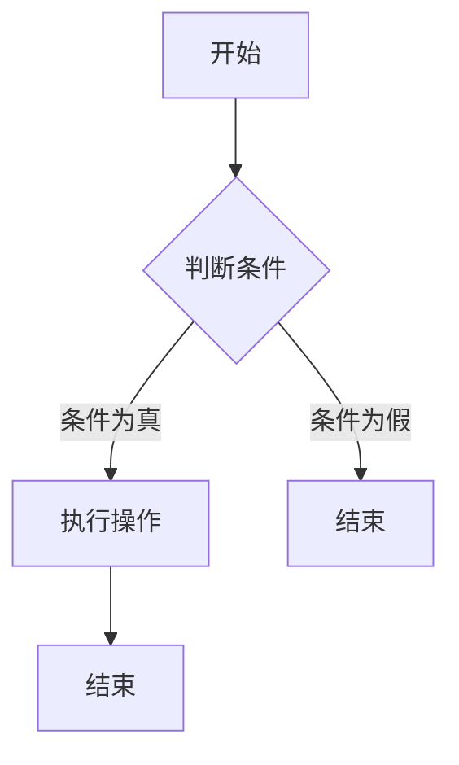

                 

# 2024网易杭州研究院社招面试真题汇总及其解答

## 关键词
2024社招面试、网易杭州研究院、面试真题、编程能力、技术面试、前沿技术

## 摘要
本文旨在为准备参加2024网易杭州研究院社会招聘面试的求职者提供全面的真题汇总及其解答。通过分类梳理面试真题，本文详细解析了编程能力测试、操作系统与网络、数据库与存储、计算机组成与硬件、软件工程与实践以及前沿技术等领域的面试问题，并提供了解题思路与策略。同时，文章还介绍了面试准备与心态调整、面试技巧与应对策略，以帮助读者在面试中脱颖而出。附录部分则提供了相关面试资源与工具，助力求职者更好地准备面试。

## 目录大纲

### 第一部分：面试真题分类与题型分析

#### 第1章：面试真题总体概述
- 1.1 面试题真题来源
- 1.2 面试题真题分类
- 1.3 面试题真题题型分析

#### 第2章：编程能力测试题目解析
- 2.1 编程基础知识
  - 2.1.1 数据结构与算法
  - 2.1.2 编程语言特性
- 2.2 编程实战案例
  - 2.2.1 常见编程题解
  - 2.2.2 实战项目解析

### 第二部分：技术面试真题详解

#### 第3章：操作系统与网络
- 3.1 操作系统基础
  - 3.1.1 进程与线程
  - 3.1.2 内存管理
  - 3.1.3 文件系统
- 3.2 网络协议与架构
  - 3.2.1 TCP/IP协议栈
  - 3.2.2 HTTP与HTTPS
  - 3.2.3 网络安全

#### 第4章：数据库与存储
- 4.1 数据库基础知识
  - 4.1.1 关系型数据库
  - 4.1.2 非关系型数据库
- 4.2 存储技术
  - 4.2.1 磁盘存储
  - 4.2.2 缓存技术

#### 第5章：计算机组成与硬件
- 5.1 计算机组成原理
  - 5.1.1 CPU架构
  - 5.1.2 内存与缓存
  - 5.1.3 输入输出设备
- 5.2 硬件系统设计
  - 5.2.1 硬件选型
  - 5.2.2 硬件调试与优化

#### 第6章：软件工程与实践
- 6.1 软件设计原则
  - 6.1.1 设计模式
  - 6.1.2 架构设计
- 6.2 项目管理与协作
  - 6.2.1 开发流程
  - 6.2.2 团队协作

#### 第7章：前沿技术与趋势
- 7.1 人工智能与机器学习
  - 7.1.1 算法原理
  - 7.1.2 应用案例
- 7.2 云计算与大数据
  - 7.2.1 云服务模型
  - 7.2.2 大数据处理技术
- 7.3 区块链与信息安全
  - 7.3.1 区块链原理
  - 7.3.2 信息安全防护

### 第三部分：面试准备与技巧

#### 第8章：面试准备与心态
- 8.1 面试准备策略
  - 8.1.1 知识点梳理
  - 8.1.2 实战模拟
- 8.2 面试心态调整
  - 8.2.1 应对面试紧张
  - 8.2.2 面试官心态分析

#### 第9章：面试技巧与应对策略
- 9.1 面试常见问题
  - 9.1.1 自我介绍
  - 9.1.2 工作经历
  - 9.1.3 技能与优势
- 9.2 面试实战技巧
  - 9.2.1 提问技巧
  - 9.2.2 面试官提问应对
- 9.3 面试结束后的跟进
  - 9.3.1 发送感谢信
  - 9.3.2 获得反馈与改进

### 附录

#### 附录A：面试资源与工具
- A.1 面试相关书籍与资料
- A.2 在线编程平台与工具
- A.3 面试技巧视频与教程

#### 附录B：面试真题汇总
- B.1 编程能力测试题目
- B.2 操作系统与网络面试题
- B.3 数据库与存储面试题
- B.4 计算机组成与硬件面试题
- B.5 软件工程与实践面试题
- B.6 前沿技术与趋势面试题

### 图表与公式

#### 公式与图表
- $$ 伪代码示例 $$
- Mermaid 流程图示例

## 第一部分：面试真题分类与题型分析

### 第1章：面试真题总体概述

#### 1.1 面试题真题来源

网易杭州研究院作为一家知名的高科技公司，其社会招聘面试真题涵盖了计算机科学领域的各个方向，包括但不限于编程能力测试、操作系统与网络、数据库与存储、计算机组成与硬件、软件工程与实践、前沿技术与趋势等。这些面试题来源于实际工作中的应用场景，也包含了学术研究与理论的考察。

面试真题的来源可以总结为以下几点：

1. **学术研究**：包括计算机科学领域的经典论文和研究课题，如算法分析、数据结构设计、机器学习原理等。
2. **开源项目**：许多面试题来自于流行的开源项目，要求求职者具备一定的编程能力和代码理解能力。
3. **实际工作场景**：部分面试题模拟了实际工作中可能会遇到的问题，如系统性能优化、网络安全防护、数据库查询优化等。
4. **业界趋势**：针对当前热门技术趋势的考察，如人工智能、大数据、区块链等。

#### 1.2 面试题真题分类

面试真题可以按照题型进行分类，常见的分类方法有以下几种：

1. **编程能力测试**：这类题目主要考察求职者的编程基础和算法能力，通常包括数据结构、算法实现、编程语言特性等。
2. **操作系统与网络**：这类题目涉及操作系统原理、网络协议、网络安全等，要求求职者具备一定的系统设计和维护能力。
3. **数据库与存储**：这类题目主要考察数据库管理、存储技术、数据库查询优化等，涉及关系型数据库和非关系型数据库。
4. **计算机组成与硬件**：这类题目关注计算机硬件系统、处理器架构、内存管理、输入输出设备等基础知识。
5. **软件工程与实践**：这类题目侧重于软件设计原则、项目管理、团队协作等实际软件开发过程中的问题。
6. **前沿技术与趋势**：这类题目涉及当前热门技术领域，如人工智能、云计算、大数据、区块链等。

#### 1.3 面试题真题题型分析

面试真题的题型多种多样，常见的题型分析如下：

1. **选择题**：这类题目通常考察基础知识的掌握情况，如数据结构定义、算法复杂度分析等。
2. **填空题**：要求填写代码或公式中的缺失部分，考察对概念和原理的理解。
3. **编程题**：给出一个具体的编程任务，要求编写代码解决问题，考察编程能力和算法思维。
4. **问答题**：提出一个实际问题或理论问题，要求进行阐述和分析，考察逻辑思维和表达能力。
5. **案例分析**：给出一个实际案例，要求分析问题并提出解决方案，考察实际应用能力和综合能力。
6. **面试官提问**：面试官根据求职者的背景和工作经验提出问题，考察求职者的沟通能力和团队合作能力。

通过以上分类和题型分析，我们可以更好地了解面试真题的特点和考察重点，为面试准备提供明确的指导。

### 第2章：编程能力测试题目解析

编程能力测试是面试的重要组成部分，它主要考察求职者的编程基础、算法能力和编程语言掌握情况。本章将详细解析编程能力测试中的常见题目类型，并提供解题思路和策略。

#### 2.1 编程基础知识

编程基础知识是编程能力测试的基础，包括数据结构、算法、编程语言特性等。以下是几个典型的编程基础知识题目：

1. **数据结构定义**

   **题目**：请简要描述链表、栈和队列的定义及其主要特点。

   **解题思路**：链表是一种线性数据结构，通过指针实现，具有插入和删除灵活性的特点；栈是一种后进先出（LIFO）的数据结构，常用作函数调用和递归实现；队列是一种先进先出（FIFO）的数据结构，常用于消息队列和任务调度。

2. **算法复杂度分析**

   **题目**：请分析以下代码的时间复杂度和空间复杂度：
   ```python
   def function(n):
       for i in range(n):
           for j in range(n):
               print(i, j)
   ```

   **解题思路**：该代码包含两层嵌套循环，每层循环的迭代次数都是n，因此时间复杂度为O(n²)。空间复杂度主要受变量使用情况影响，由于只使用了常数级别的变量，因此空间复杂度为O(1)。

3. **编程语言特性**

   **题目**：请描述Python中的列表推导式和生成器的特点。

   **解题思路**：列表推导式是一种简洁的表达列表生成方式，通过一个表达式和一个for循环实现，如`[x*x for x in range(10)]`；生成器是一种惰性求值的数据结构，通过yield关键字生成值，如`def fibonacci(n): for i in range(n): yield fib(i)`。

#### 2.2 编程实战案例

编程实战案例主要考察求职者解决实际问题的能力，通过给出一个具体的编程任务，要求编写代码解决问题。以下是几个典型的编程实战案例：

1. **最长公共子序列**

   **题目**：给定两个字符串`str1`和`str2`，找出它们的最长公共子序列。

   **解题思路**：可以使用动态规划算法求解，定义一个二维数组`dp`，其中`dp[i][j]`表示`str1`的前i个字符和`str2`的前j个字符的最长公共子序列的长度。最终返回`dp[m][n]`的值，其中`m`和`n`分别为两个字符串的长度。

   **伪代码**：
   ```python
   def longest_common_subsequence(str1, str2):
       m, n = len(str1), len(str2)
       dp = [[0] * (n+1) for _ in range(m+1)]
       for i in range(1, m+1):
           for j in range(1, n+1):
               if str1[i-1] == str2[j-1]:
                   dp[i][j] = dp[i-1][j-1] + 1
               else:
                   dp[i][j] = max(dp[i-1][j], dp[i][j-1])
       return dp[m][n]
   ```

2. **二分查找**

   **题目**：给定一个排序数组`nums`和一个目标值`target`，找到`target`在数组中的索引。如果不存在，返回-1。

   **解题思路**：使用二分查找算法，初始化左右边界`left`和`right`，每次循环将中间值`mid`与目标值`target`比较，根据比较结果调整左右边界。当左右边界重叠时，返回`mid`的值或-1。

   **伪代码**：
   ```python
   def binary_search(nums, target):
       left, right = 0, len(nums) - 1
       while left <= right:
           mid = (left + right) // 2
           if nums[mid] == target:
               return mid
           elif nums[mid] < target:
               left = mid + 1
           else:
               right = mid - 1
       return -1
   ```

3. **排序算法**

   **题目**：实现一个快速排序算法，对一个数组进行升序排序。

   **解题思路**：快速排序是一种分治算法，选择一个基准值，将数组分为小于基准值和大于基准值的两个部分，递归地对两个部分进行快速排序。以下是快速排序的伪代码：

   **伪代码**：
   ```python
   def quicksort(arr, low, high):
       if low < high:
           pi = partition(arr, low, high)
           quicksort(arr, low, pi - 1)
           quicksort(arr, pi + 1, high)
   
   def partition(arr, low, high):
       pivot = arr[high]
       i = low - 1
       for j in range(low, high):
           if arr[j] < pivot:
               i += 1
               arr[i], arr[j] = arr[j], arr[i]
       arr[i + 1], arr[high] = arr[high], arr[i + 1]
       return i + 1
   ```

通过以上解析，我们可以看到编程能力测试题目涵盖了基础知识和实战案例，要求求职者具备扎实的编程基础和解决问题的能力。在面试准备过程中，可以通过刷题、做项目和实践来提高自己的编程能力，为面试做好准备。

### 第3章：操作系统与网络

操作系统与网络是计算机科学中重要的领域，涉及系统的运行原理、网络协议的运作方式以及网络安全问题。本章将详细介绍操作系统与网络的基础知识，包括进程与线程、内存管理、文件系统、TCP/IP协议栈、HTTP与HTTPS以及网络安全等。

#### 3.1 操作系统基础

操作系统是计算机系统的核心软件，负责管理和协调计算机硬件与软件资源。以下是一些核心概念：

1. **进程与线程**

   进程是操作系统中运行的程序的实例，具有独立的内存空间和系统资源。线程是进程中的执行单元，共享进程的内存和系统资源。进程与线程的关系如下：

   - **进程**：具有独立的内存空间、系统资源，是程序运行的实例。
   - **线程**：是进程中的执行单元，共享进程的内存和系统资源。

   **进程与线程的区别**：

   - **资源占用**：进程占用独立的内存空间和系统资源，线程共享进程的内存和系统资源。
   - **并发性**：进程之间切换需要较大的开销，线程之间切换开销较小。
   - **独立性**：进程具有独立的地址空间，线程共享地址空间。

2. **内存管理**

   内存管理是操作系统的重要功能之一，包括内存分配、内存回收、内存保护等。以下是一些核心概念：

   - **内存分配**：操作系统根据进程的需求为其分配内存。
   - **内存回收**：操作系统回收不再使用的内存，以供其他进程使用。
   - **内存保护**：操作系统通过内存保护机制防止进程访问非法内存地址。

   **内存管理策略**：

   - **固定分区分配**：将内存划分为固定大小的分区，每个分区分配给一个进程。
   - **动态分区分配**：根据进程的需求动态分配内存，常见的有首次适配、最佳适配、最坏适配等策略。
   - **虚拟内存**：通过将内存与硬盘空间结合使用，实现内存的扩展。

3. **文件系统**

   文件系统是操作系统中用于存储和管理文件的机制。以下是一些核心概念：

   - **文件**：文件是存储在磁盘上的数据集合，具有文件名、大小、创建时间等属性。
   - **目录**：目录是文件的容器，用于组织和管理文件。
   - **文件系统**：文件系统是操作系统中用于管理文件的机制，包括文件的组织结构、存储策略、访问控制等。

   **文件系统类型**：

   - **FAT文件系统**：是最常见的文件系统之一，用于存储可移动磁盘上的文件。
   - **EXT文件系统**：是Linux系统常用的文件系统。
   - **NTFS文件系统**：是Windows系统常用的文件系统，支持大文件和复杂的权限控制。

#### 3.2 网络协议与架构

网络协议是计算机网络中用于数据通信的规则集合。以下是一些重要的网络协议和架构：

1. **TCP/IP协议栈**

   TCP/IP协议栈是互联网的基础协议，包括多个层次：

   - **链路层**：负责数据在网络中的物理传输。
   - **网络层**：负责数据包的路由和传输，包括IP协议。
   - **传输层**：负责端到端的数据传输，包括TCP和UDP协议。
   - **应用层**：负责应用程序的数据通信，包括HTTP、FTP、SMTP等协议。

   **TCP协议**：

   - **三次握手**：建立连接的过程，客户端和服务器通过发送SYN和ACK消息完成握手。
   - **四次挥手**：断开连接的过程，客户端和服务器通过发送FIN和ACK消息完成挥手。

   **UDP协议**：

   - **无连接**：不需要建立连接，数据传输效率高，但不保证数据传输的可靠性。

2. **HTTP与HTTPS**

   HTTP是超文本传输协议，用于Web应用程序的数据传输。HTTPS是基于HTTP的安全传输协议，使用SSL/TLS加密。

   **HTTP工作原理**：

   - 客户端通过URL向服务器发送请求，服务器响应请求并返回数据。
   - HTTP请求包括请求行、请求头和请求体，响应包括状态行、响应头和响应体。

   **HTTPS工作原理**：

   - HTTPS在HTTP基础上添加了SSL/TLS加密层，确保数据传输的安全性。
   - HTTPS使用公钥和私钥进行加密和解密，客户端和服务器通过交换证书验证对方身份。

3. **网络安全**

   网络安全是保护网络系统不受恶意攻击和数据泄露的关键。以下是一些核心概念：

   - **防火墙**：一种网络安全设备，用于监控和控制网络流量。
   - **入侵检测系统（IDS）**：用于检测和响应网络攻击的软件或硬件系统。
   - **加密技术**：用于保护数据传输和存储的安全技术，如SSL/TLS、AES等。
   - **安全协议**：如IPsec，用于在IP层提供安全通信。

通过以上对操作系统与网络的介绍，我们可以看到这两个领域在计算机科学中的重要性。理解操作系统与网络的基础知识对于从事计算机相关工作的求职者至关重要。

### 第4章：数据库与存储

数据库与存储是现代信息系统中不可或缺的一部分，负责数据的存储、管理和查询。本章将详细介绍数据库与存储的基本概念，包括关系型数据库和非关系型数据库、磁盘存储和缓存技术。

#### 4.1 数据库基础知识

数据库是一种用于存储、管理和查询数据的系统，关系型数据库和非关系型数据库是数据库的两种主要类型。

1. **关系型数据库**

   关系型数据库以表格形式存储数据，通过行和列的关系进行组织。以下是一些核心概念：

   - **表（Table）**：表格是关系型数据库的基本结构，包含多行和多列。
   - **记录（Record）**：表中的一行数据，表示一个实体。
   - **字段（Field）**：表中的一列数据，表示实体的一个属性。
   - **关系（Relation）**：表与表之间的关联，通过外键实现。

   **关系型数据库的特点**：

   - **数据结构清晰**：表格形式的数据结构易于理解和维护。
   - **数据完整性**：通过约束和规则保证数据的完整性和一致性。
   - **查询能力强大**：SQL语言提供了强大的数据查询和操作能力。

2. **非关系型数据库**

   非关系型数据库（NoSQL）是一种不同于关系型数据库的数据库，适用于不同类型的数据存储需求。以下是一些核心概念：

   - **文档数据库**：以文档形式存储数据，如JSON或XML，适合存储半结构化和非结构化数据。
   - **键值存储**：通过键和值进行数据存储，如Redis，适合存储小规模和快速访问的数据。
   - **列族存储**：以列族形式存储数据，如HBase，适合存储大规模数据和高并发访问。

   **非关系型数据库的特点**：

   - **灵活性**：适用于多种数据类型和场景，无需预先定义表结构。
   - **性能**：通过分布式存储和高效的数据访问机制，提供高性能的读写操作。
   - **可扩展性**：支持水平扩展，易于处理大规模数据。

#### 4.2 存储技术

存储技术包括磁盘存储和缓存技术，是数据库系统的重要组成部分。

1. **磁盘存储**

   磁盘存储是数据库系统常用的存储介质，以下是一些核心概念：

   - **硬盘（HDD）**：机械硬盘，通过磁头读取和写入数据，具有高容量和较慢的读写速度。
   - **固态硬盘（SSD）**：固态硬盘，通过闪存存储数据，具有高速度和较低的容量。
   - **RAID（独立磁盘冗余阵列）**：通过将多个硬盘组合在一起，提高数据存储的可靠性和性能。

   **磁盘存储的特点**：

   - **高容量**：支持存储大量数据。
   - **持久性**：数据存储在磁盘上，具有较高的可靠性。
   - **读写速度**：硬盘读写速度较慢，影响数据库性能。

2. **缓存技术**

   缓存技术用于提高数据访问速度，以下是一些核心概念：

   - **缓存（Cache）**：临时存储常用数据，以减少对磁盘的访问。
   - **缓存算法**：用于确定缓存中哪些数据应被替换，如LRU（最近最少使用）算法。
   - **缓存层次结构**：将缓存分为多级，如CPU缓存、内存缓存、磁盘缓存等。

   **缓存技术的特点**：

   - **高速访问**：减少对磁盘的访问，提高数据访问速度。
   - **临时存储**：缓存数据仅在内存中暂存，不保证数据的持久性。
   - **缓存一致性**：确保缓存中的数据与磁盘上的数据保持一致。

通过以上对数据库与存储的介绍，我们可以看到数据库与存储在信息系统中的重要性。掌握数据库的基本概念和存储技术对于优化数据库性能和保证数据完整性至关重要。

### 第5章：计算机组成与硬件

计算机组成与硬件是计算机科学的重要基础，涵盖了计算机系统的工作原理、处理器架构、内存与缓存以及输入输出设备等方面。本章将详细介绍这些核心概念，并探讨硬件系统设计中的选型和调试优化策略。

#### 5.1 计算机组成原理

计算机组成原理是理解计算机系统运作的基础，包括以下几个方面：

1. **CPU架构**

   中央处理器（CPU）是计算机的核心部件，负责执行程序指令。以下是一些核心概念：

   - **指令集**：CPU支持的指令集合，分为复杂指令集（CISC）和精简指令集（RISC）。
   - **微架构**：CPU内部的设计和结构，包括数据路径、控制单元、缓存等。
   - **多核处理器**：多个CPU核心集成在一个芯片上，提高计算性能和效率。

2. **内存与缓存**

   内存是计算机存储数据和程序的地方，缓存是提高内存访问速度的技术。以下是一些核心概念：

   - **主存储器（RAM）**：临时存储数据和程序的存储器，读写速度快。
   - **辅助存储器（硬盘、SSD）**：永久存储数据和程序的存储器，容量大但速度相对较慢。
   - **缓存**：位于CPU和主存储器之间的存储器，用于缓存常用数据，减少访问延迟。

3. **输入输出设备**

   输入输出设备是计算机与人交互的接口，包括键盘、鼠标、显示器、打印机等。以下是一些核心概念：

   - **输入设备**：用于将数据输入计算机，如键盘、鼠标。
   - **输出设备**：用于将计算机处理后的数据输出，如显示器、打印机。
   - **I/O接口**：用于连接输入输出设备和主机的电路和协议。

#### 5.2 硬件系统设计

硬件系统设计是计算机硬件工程师的重要任务，涉及硬件选型、系统配置和性能优化。以下是一些核心概念：

1. **硬件选型**

   硬件选型是根据系统需求和预算选择合适的硬件设备。以下是一些核心概念：

   - **处理器**：根据计算性能和功耗选择合适的CPU。
   - **内存**：根据内存容量和速度选择合适的RAM。
   - **存储**：根据数据存储需求选择合适的硬盘或固态硬盘。
   - **主板**：选择支持处理器和内存的主板，并确保兼容其他硬件设备。

2. **系统配置**

   系统配置是安装和配置硬件设备，使其正常运行的过程。以下是一些核心概念：

   - **BIOS/UEFI**：设置计算机的基本启动参数，如硬盘启动顺序。
   - **驱动程序**：安装和配置硬件设备的驱动程序，使其能被操作系统识别和使用。
   - **操作系统**：安装和配置操作系统，确保计算机硬件和软件的正常运行。

3. **硬件调试与优化**

   硬件调试与优化是确保硬件系统稳定运行和性能优化的重要环节。以下是一些核心概念：

   - **故障排查**：通过诊断工具和测试方法找出硬件故障的原因，并修复。
   - **性能优化**：通过调整硬件配置和系统参数，提高硬件性能和效率。
   - **散热管理**：通过优化散热系统，确保硬件设备在合理的温度范围内运行。

通过以上对计算机组成与硬件的介绍，我们可以看到计算机组成与硬件在计算机科学中的重要地位。理解计算机组成原理和硬件系统设计策略对于计算机科学工作者来说至关重要。

### 第6章：软件工程与实践

软件工程是确保软件产品高效、高质量开发和维护的学科。本章将介绍软件设计原则、架构设计、开发流程以及团队协作等方面的内容，旨在帮助读者掌握软件工程的基本方法和实践技巧。

#### 6.1 软件设计原则

软件设计原则是指导软件开发的基本原则，旨在提高软件的可维护性和可扩展性。以下是一些核心设计原则：

1. **单一职责原则（Single Responsibility Principle）**

   单一职责原则是指一个类或者模块应该只有一个职责。这样做的好处是可以降低模块之间的耦合度，提高代码的可读性和可维护性。

2. **开闭原则（Open/Closed Principle）**

   开闭原则是指软件实体应该对扩展开放，对修改关闭。这意味着软件实体应该通过扩展来实现功能的增加，而不是通过修改现有代码。

3. **里氏替换原则（Liskov Substitution Principle）**

   里氏替换原则是指子类可以替换父类出现在任何地方，而不会影响程序的逻辑。这样可以保证代码的灵活性和扩展性。

4. **依赖倒置原则（Dependency Inversion Principle）**

   依赖倒置原则是指高层模块不应依赖于低层模块，二者都应依赖于抽象。通过抽象层将高层模块和低层模块解耦，可以提高代码的灵活性和可维护性。

5. **接口隔离原则（Interface Segregation Principle）**

   接口隔离原则是指应该为不同的客户端定义不同的接口，而不是使用一个单一的接口定义多个功能。这样可以减少客户端与接口之间的依赖，提高代码的灵活性和可维护性。

6. **合成/聚合复用原则（Composition/Aggregation Reuse Principle）**

   合成/聚合复用原则是指优先使用合成/聚合关系来实现复用，而不是使用继承关系。通过合成/聚合关系，可以更好地封装组件，降低组件之间的耦合度。

#### 6.2 架构设计

架构设计是软件设计的一个重要阶段，决定了软件系统的整体结构和性能。以下是一些核心架构设计概念：

1. **分层架构（Layered Architecture）**

   分层架构是将系统划分为多个层次，每个层次负责特定的功能。常见的层次包括表示层、业务逻辑层、数据访问层等。通过分层架构，可以降低模块之间的耦合度，提高系统的可维护性和可扩展性。

2. **微服务架构（Microservices Architecture）**

   微服务架构是将应用程序划分为多个小型、独立的微服务，每个微服务负责特定的功能。通过微服务架构，可以提高系统的可扩展性和容错性，便于分布式部署和运维。

3. **事件驱动架构（Event-Driven Architecture）**

   事件驱动架构是基于事件驱动的系统设计方法，通过事件来触发系统的响应。事件可以是用户操作、系统事件或其他外部事件。通过事件驱动架构，可以提高系统的响应速度和灵活性。

4. **CQRS架构（Command Query Responsibility Segregation）**

   CQRS架构将系统的写操作和读操作分离，分别处理不同的查询和命令。通过CQRS架构，可以提高系统的查询性能和并发能力，适用于高并发场景。

5. **领域驱动设计（Domain-Driven Design, DDD）**

   领域驱动设计是一种软件开发方法，强调理解业务领域并使用面向领域的模型来设计软件。通过DDD，可以提高软件系统的可维护性和业务适应性。

#### 6.3 项目管理与协作

项目管理和协作是确保软件开发顺利进行的重要环节。以下是一些核心项目管理和协作概念：

1. **敏捷开发（Agile Development）**

   敏捷开发是一种迭代和增量的软件开发方法，强调灵活性和适应性。敏捷开发的核心原则包括用户故事、迭代、持续集成、持续交付等。

2. **Scrum框架**

   Scrum是一种敏捷开发方法，包括冲刺（Sprint）、产品待办列表、每日站立会议、评审会议等。通过Scrum框架，可以提高团队的协作效率，确保项目按期完成。

3. **看板（Kanban）**

   看板是一种基于可视化流程的敏捷开发方法，通过看板板面展示项目进展情况，实时监控和优化流程。通过看板，可以提高团队的透明度和协作效率。

4. **敏捷文档（Agile Documentation）**

   敏捷文档强调文档的简洁和及时更新，以适应快速变化的需求。敏捷文档通常包括用户故事、任务列表、代码注释等。

5. **代码审查（Code Review）**

   代码审查是一种通过团队协作审查代码质量的方法，有助于发现潜在的错误和改进代码。通过代码审查，可以提高代码的可维护性和可读性。

6. **持续集成（Continuous Integration, CI）**

   持续集成是一种通过自动化测试和构建来确保代码质量的方法。通过持续集成，可以快速发现和修复代码缺陷，提高软件开发的效率。

通过以上对软件工程与实践的介绍，我们可以看到软件工程在软件开发中的重要性。掌握软件设计原则、架构设计方法、开发流程和团队协作技巧对于成功开发高质量的软件产品至关重要。

### 第7章：前沿技术与趋势

随着科技的不断发展，人工智能、云计算、大数据和区块链等前沿技术正逐渐改变我们的生活方式和工作模式。本章将介绍这些技术的基本原理、应用案例以及发展趋势。

#### 7.1 人工智能与机器学习

人工智能（AI）是模拟人类智能行为的计算机系统，机器学习（ML）是实现人工智能的核心技术之一。以下是一些核心概念：

1. **机器学习算法**

   机器学习算法包括监督学习、无监督学习和强化学习等。监督学习通过训练数据和标签来预测结果，如线性回归、决策树、支持向量机等。无监督学习不使用标签数据，通过发现数据分布和模式来分析数据，如聚类、降维等。强化学习通过奖励机制来优化策略，如深度强化学习、Q学习等。

2. **深度学习**

   深度学习是机器学习的一个重要分支，通过多层神经网络来提取特征和进行预测。常见的深度学习模型包括卷积神经网络（CNN）、循环神经网络（RNN）、生成对抗网络（GAN）等。深度学习在图像识别、自然语言处理、语音识别等领域取得了显著的成果。

3. **应用案例**

   - **图像识别**：利用卷积神经网络实现自动识别和分类，如人脸识别、物体检测等。
   - **自然语言处理**：利用循环神经网络和Transformer模型进行文本生成、机器翻译、情感分析等。
   - **语音识别**：利用深度学习模型实现语音信号到文本的转换，如智能助手、语音控制等。
   - **推荐系统**：利用协同过滤和基于内容的推荐算法为用户提供个性化推荐。

4. **发展趋势**

   - **算法优化**：不断改进和优化机器学习算法，提高模型效率和准确度。
   - **跨学科融合**：与生物学、物理学、心理学等学科相结合，推动人工智能的发展。
   - **边缘计算**：将计算能力从云端转移到边缘设备，实现实时数据处理和智能决策。

#### 7.2 云计算与大数据

云计算是一种通过互联网提供计算资源和服务的技术，大数据则是指数据量巨大且复杂的海量数据。以下是一些核心概念：

1. **云计算服务模型**

   云计算服务模型包括基础设施即服务（IaaS）、平台即服务（PaaS）和软件即服务（SaaS）等。IaaS提供虚拟化的基础设施资源，如服务器、存储、网络等；PaaS提供开发平台和工具，如数据库、开发框架等；SaaS提供应用程序服务，如企业协作工具、客户关系管理软件等。

2. **大数据技术**

   大数据技术包括数据采集、存储、处理和分析等。常用的工具和技术包括Hadoop、Spark、HBase、MongoDB等。Hadoop是一个分布式数据存储和处理框架，用于处理大规模数据；Spark是一个快速通用的分布式计算引擎，适用于大数据处理；HBase是一个分布式存储系统，适用于实时访问和分析大量数据。

3. **应用案例**

   - **企业级应用**：利用云计算和大数据技术实现企业资源优化、业务流程优化和智能决策。
   - **智慧城市**：利用大数据分析技术提高城市管理效率，如交通流量监控、环境监测等。
   - **医疗健康**：利用大数据和人工智能技术实现疾病预测、个性化医疗和健康管理等。

4. **发展趋势**

   - **云计算普及**：云计算技术将进一步普及，推动企业数字化转型的进程。
   - **边缘计算**：边缘计算将计算能力从云端转移到边缘设备，实现实时数据处理和智能决策。
   - **大数据安全**：大数据安全将成为一个重要议题，确保数据隐私和安全。

#### 7.3 区块链与信息安全

区块链是一种分布式账本技术，具有去中心化、不可篡改和安全透明的特点。以下是一些核心概念：

1. **区块链原理**

   区块链由多个区块组成，每个区块包含一定数量的交易记录。区块通过密码学算法连接在一起，形成一个链式数据结构。区块链的关键技术包括共识算法、加密技术、智能合约等。

2. **信息安全**

   区块链技术提供了安全的数据存储和传输机制，通过密码学和共识算法确保数据的安全性和完整性。信息安全包括数据加密、身份认证、访问控制等。

3. **应用案例**

   - **金融领域**：利用区块链技术实现去中心化的支付系统、智能合约等，提高金融交易的安全性和效率。
   - **供应链管理**：利用区块链技术实现供应链的可追溯性和透明性，提高供应链管理效率。
   - **物联网**：利用区块链技术实现物联网设备的安全认证和数据共享。

4. **发展趋势**

   - **区块链2.0**：不断发展和完善区块链技术，实现更高性能、更广泛应用的区块链系统。
   - **跨链技术**：实现不同区块链之间的互操作性和数据共享。
   - **合规与监管**：制定相关法律法规，确保区块链技术的合规性和安全性。

通过以上对前沿技术与趋势的介绍，我们可以看到这些技术正迅速发展，并在多个领域展现出巨大的潜力。了解这些技术的原理和应用对于把握科技发展趋势具有重要意义。

### 第8章：面试准备与心态

面试准备和心态调整是成功面试的关键因素。本章将介绍面试准备策略、心态调整技巧以及面试官心态分析，帮助求职者在面试中表现出色。

#### 8.1 面试准备策略

充分的面试准备能够帮助求职者提升自信心，降低面试过程中的紧张感。以下是一些面试准备策略：

1. **知识点梳理**

   面试涉及多个技术领域，求职者需要梳理相关知识点，确保对每个领域都有深入的理解。以下是一些建议：

   - **基础知识**：回顾操作系统、计算机网络、数据结构与算法等基础知识，确保理解相关概念和原理。
   - **实践项目**：回顾自己参与的项目，梳理项目的技术架构、实现细节和关键技术，为面试官提供具体的案例。
   - **前沿技术**：关注当前热门技术趋势，如人工智能、大数据、区块链等，了解相关技术原理和应用案例。

2. **实战模拟**

   通过模拟面试，求职者可以熟悉面试流程，提高应对面试问题的能力。以下是一些建议：

   - **模拟面试**：请朋友或同事扮演面试官，进行模拟面试，模拟真实面试环境，锻炼自己的表达能力和应对策略。
   - **录制视频**：录制面试视频，回顾自己的表现，找出需要改进的地方，如语速、表达、逻辑性等。
   - **练习题目**：刷题是提高编程能力和解题速度的有效方法，可以选择在线编程平台，如LeetCode、牛客网等，练习编程能力测试题目。

3. **资料准备**

   面试前，求职者需要准备相关资料，包括个人简历、项目介绍、技术博客等。以下是一些建议：

   - **简历**：确保简历清晰、简洁、有条理，突出自己的技术能力和项目经验。
   - **项目介绍**：准备项目的介绍材料，包括项目背景、技术架构、实现细节和成果等。
   - **技术博客**：撰写技术博客，展示自己的技术见解和研究成果，提高个人品牌知名度。

#### 8.2 面试心态调整

心态调整是面试过程中至关重要的一环。以下是一些心态调整技巧：

1. **应对面试紧张**

   面试紧张是正常的心理反应，以下是一些应对方法：

   - **深呼吸**：面试前进行深呼吸，放松身心，缓解紧张情绪。
   - **正面思考**：保持积极的心态，相信自己的准备和能力。
   - **提前准备**：充分准备面试问题，减少面试过程中的不确定性。

2. **面试官心态分析**

   了解面试官的心态有助于更好地应对面试。以下是一些面试官的心态分析：

   - **评估能力**：面试官通过提问评估求职者的技术能力和解决问题的能力。
   - **考察潜力**：面试官关注求职者的学习能力和潜力，以评估其未来发展空间。
   - **沟通技巧**：面试官通过面试了解求职者的沟通能力和团队合作能力。

通过以上对面试准备与心态调整的介绍，求职者可以更好地准备面试，提高面试成功率。

### 第9章：面试技巧与应对策略

面试技巧和应对策略是求职者在面试过程中取得成功的关键。本章将介绍面试常见问题、面试实战技巧、面试官提问应对以及面试结束后的跟进策略。

#### 9.1 面试常见问题

面试常见问题主要集中在自我介绍、工作经历、技能与优势等方面。以下是一些建议：

1. **自我介绍**

   自我介绍是面试的开场白，要求简洁明了地介绍自己的基本信息、教育背景、工作经历等。以下是一些建议：

   - **简明扼要**：自我介绍应控制在1-2分钟内，突出重点。
   - **突出亮点**：强调自己的技术特长、项目经验、科研成果等。
   - **真实自然**：自我介绍应真实反映个人情况，避免夸大或虚假。

2. **工作经历**

   工作经历是面试官关注的重点之一，要求求职者详细描述自己在每个项目或工作中的职责和成果。以下是一些建议：

   - **项目描述**：详细介绍项目的背景、目标、技术架构和实现细节。
   - **职责分工**：清晰描述自己在项目中的职责和角色，如设计、开发、测试等。
   - **成果展示**：展示自己在项目中的实际成果，如代码、文档、测试报告等。

3. **技能与优势**

   技能与优势是面试官评估求职者是否符合职位要求的重要依据。以下是一些建议：

   - **专业技能**：详细描述自己在编程语言、框架、工具等方面的熟练程度。
   - **解决问题的能力**：举例说明自己在遇到技术难题时如何分析和解决问题。
   - **团队协作能力**：强调自己在团队协作中的贡献和协调能力。

#### 9.2 面试实战技巧

面试实战技巧包括提问技巧、回答技巧和表情管理等，以下是一些建议：

1. **提问技巧**

   提问是展示自己兴趣和了解公司的好机会。以下是一些建议：

   - **针对性提问**：根据面试官的回答，提出具体、有针对性的问题。
   - **开放性提问**：避免简单的是否性问题，提出开放性问题，引导面试官进一步解释。
   - **提前准备**：提前准备一些问题，如公司的文化、团队结构、职位发展等。

2. **回答技巧**

   回答是展示自己能力和知识的重要环节。以下是一些建议：

   - **逻辑清晰**：回答问题时要条理清晰，先总结再展开。
   - **具体举例**：用实际案例和具体数据支持自己的观点。
   - **简明扼要**：避免长篇大论，回答要简洁明了。

3. **表情管理**

   表情管理是展示自己自信和专注的重要方面。以下是一些建议：

   - **保持微笑**：微笑可以传递友好和自信的态度。
   - **眼神交流**：与面试官保持眼神交流，展示自信和真诚。
   - **肢体语言**：适当的肢体语言可以增强自己的表达效果。

#### 9.3 面试官提问应对

面试官提问是评估求职者能力和经验的重要环节。以下是一些建议：

1. **常见问题**

   面试官常提出的问题包括技术难题、项目经验、职业规划等。以下是一些建议：

   - **技术难题**：提前准备一些常见的技术难题，如算法、数据库等，确保能够清晰、准确地回答。
   - **项目经验**：详细描述自己在项目中的角色、职责和贡献，突出实际成果。
   - **职业规划**：明确自己的职业目标和发展方向，展示自己的长期发展规划。

2. **提问技巧**

   面试官提问时，求职者可以运用以下技巧：

   - **引导提问**：通过提问引导面试官进一步解释或深入讨论。
   - **开放性回答**：避免简单的“是”或“否”回答，提供具体的分析和见解。
   - **提问反馈**：在回答问题后，可以适当地提出疑问，展示自己的学习能力和思考能力。

3. **面试官心态分析**

   了解面试官的心态有助于更好地应对面试。以下是一些建议：

   - **评估能力**：面试官关注求职者的技术能力和解决问题的能力。
   - **考察潜力**：面试官关注求职者的学习能力和未来发展潜力。
   - **沟通技巧**：面试官关注求职者的沟通能力和团队合作能力。

通过以上对面试技巧与应对策略的介绍，求职者可以更好地应对面试，提高面试成功率。

### 附录

#### 附录A：面试资源与工具

面试准备过程中，可以利用多种资源与工具来提高自己的准备水平。以下是一些推荐的面试资源与工具：

1. **面试相关书籍与资料**

   - 《编程之美》（微软面试题解析）
   - 《剑指Offer：名企面试官精讲典型编程面试题》
   - 《算法导论》
   - 《操作系统概念》
   - 《计算机网络：自顶向下方法》

2. **在线编程平台与工具**

   - LeetCode（编程挑战平台）
   -牛客网（编程面试题库）
   - Codeforces（编程竞赛平台）
   - HackerRank（编程挑战平台）

3. **面试技巧视频与教程**

   - 网易云课堂（面试技巧与案例分析）
   - B站（面试经验分享）
   - Coursera（在线编程课程）
   - Udemy（编程与面试课程）

#### 附录B：面试真题汇总

面试真题是面试准备的重要参考，以下汇总了一些常见面试真题：

1. **编程能力测试题目**

   - 给定一个整数数组，找出其中两个数的和等于目标值。
   - 实现一个排序算法，对数组进行升序排序。
   - 实现一个单例模式，确保一个类只有一个实例。

2. **操作系统与网络面试题**

   - 描述进程与线程的区别。
   - TCP协议的三次握手和四次挥手过程。
   - HTTP协议的工作原理。

3. **数据库与存储面试题**

   - 描述关系型数据库和非关系型数据库的区别。
   - MySQL中的索引是什么，如何创建和使用索引。
   - Redis的常用数据结构和操作。

4. **计算机组成与硬件面试题**

   - 描述CPU的架构和指令集。
   - 计算机的内存层次结构。
   - 硬盘和固态硬盘的区别。

5. **软件工程与实践面试题**

   - 软件设计原则有哪些，如何应用？
   - 微服务架构的优势和挑战。
   - 敏捷开发的方法和原则。

6. **前沿技术与趋势面试题**

   - 人工智能的核心技术是什么？
   - 云计算的主要服务模型有哪些？
   - 区块链的基本原理和应用场景。

通过以上面试资源与真题汇总，求职者可以更好地准备面试，提高自己的面试能力。

### 图表与公式

图表与公式在技术博客中起到了简化和明确复杂概念的作用。以下是一些示例：

#### Mermaid 流程图示例



该流程图描述了一个简单的判断执行过程。

#### 伪代码示例

```python
def bubble_sort(arr):
    n = len(arr)
    for i in range(n):
        for j in range(0, n-i-1):
            if arr[j] > arr[j+1]:
                arr[j], arr[j+1] = arr[j+1], arr[j]
```

这是一个简单的冒泡排序算法的伪代码。

#### 数学公式示例

```latex
$$
E(X) = \int_{-\infty}^{\infty} x f(x) dx
$$

$$
P(A \cap B) = P(A)P(B|A)
$$
```

这些公式分别表示随机变量的期望和两个事件的交集概率。在文章中，适当嵌入这些图表与公式，有助于增强文章的权威性和易读性。

