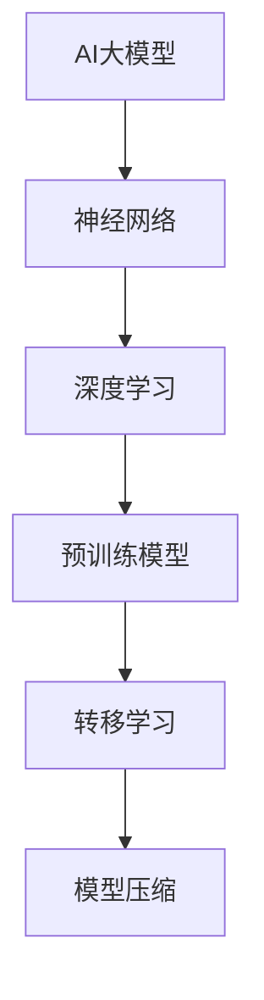

                 

### 《美团2024届校招算法工程师面试真题解密》

> **关键词**：美团、2024届、校招、算法工程师、面试真题、解析

> **摘要**：本文针对美团2024届校招算法工程师面试真题进行详细解析，涵盖了编程题、算法与数据结构题、系统设计与架构题以及软件工程与编程实践题。通过逐题剖析，帮助考生掌握面试技巧，提升算法能力，成功应对校招面试挑战。

### 第一部分：校招面试准备

#### 第1章：校招面试概述

##### 1.1 校招面试的重要性

**面试准备**

面试是校招过程中的重要环节，它不仅考察应聘者的专业知识，还评估了其解决问题的能力、沟通能力和团队协作能力。面试准备包括以下几个方面：

- **基础知识复习**：回顾计算机基础知识，包括数据结构与算法、操作系统、计算机网络、数据库等。
- **编程技能提升**：通过编程练习提高编程能力和算法实现效率。
- **项目经验梳理**：整理和回顾参与过的项目，明确自己在项目中的作用和贡献。

**面试流程**

面试流程一般包括以下阶段：

- **在线笔试**：考察应聘者的编程能力、算法水平和数学基础。
- **技术面试**：与面试官进行面对面交流，讨论技术问题和项目经验。
- **HR面试**：了解应聘者的职业规划、团队合作能力和个人素质。

##### 1.2 面试常见问题类型

面试问题类型可以分为以下几个类别：

- **编程题**：考察编程能力和算法实现能力。
- **数据结构与算法**：考察对基本数据结构和经典算法的理解和应用。
- **系统设计与架构**：考察系统设计和架构设计能力。
- **软件工程**：考察软件开发的流程、方法和技术。

##### 1.3 提高面试技巧

**时间管理**

面试过程中，时间管理非常重要。以下是一些时间管理的技巧：

- **提前准备**：对可能出现的面试问题进行预演，熟悉解题思路。
- **控制节奏**：在面试过程中，注意控制回答问题的节奏，避免超时。

**思维训练**

提高思维训练有助于在面试中迅速找到解决问题的方法。以下是一些思维训练的方法：

- **逻辑思维**：培养逻辑思维，提高分析问题和解决问题的能力。
- **快速学习**：通过快速学习新知识，提高应对未知问题的能力。

#### 第2章：基础知识与数学模型

##### 2.1 数据结构与算法

数据结构是计算机科学的基础，它决定了算法的时间和空间复杂度。常见的数据结构包括：

- **数组**：支持随机访问，适用于查找和插入操作。
- **链表**：支持顺序访问，适用于插入和删除操作。
- **栈**：后进先出（LIFO）结构，适用于回溯和递归操作。
- **队列**：先进先出（FIFO）结构，适用于排序和优先级队列。

常见的算法包括：

- **排序算法**：冒泡排序、选择排序、插入排序、快速排序等。
- **查找算法**：二分查找、线性查找等。
- **图算法**：深度优先搜索（DFS）、广度优先搜索（BFS）、最小生成树、最短路径算法等。

##### 2.2 数学模型与公式

数学模型在计算机科学中有着广泛的应用。常见的数学模型包括：

- **概率论模型**：包括概率分布、期望、方差等。
- **线性代数模型**：包括矩阵运算、线性方程组求解等。
- **微积分模型**：包括微分、积分、极限等。

常见的数学公式包括：

- **概率论公式**：条件概率、贝叶斯公式等。
- **线性代数公式**：矩阵乘法、逆矩阵等。
- **微积分公式**：微分、积分等。

##### 2.3 LaTeX公式介绍

LaTeX是一种高质量的排版系统，常用于撰写科学论文和技术文档。LaTeX公式书写规则如下：

- **基础规则**：公式必须使用美元符号（$）包围，如`$公式内容$`。
- **行内公式**：使用单美元符号（`$`），如`$E=mc^2$`。
- **独立公式**：使用双美元符号（`$$`），如：
  $$ E = mc^2 $$
  - **公式编号**：使用`\label{}`命令给公式编号，如：
    $$ E = mc^2 \label{eq:energy} $$
    - **引用公式**：使用`\ref{}`命令引用公式编号，如：
      参见公式\ref{eq:energy}。

#### 第3章：面试真题详解

##### 3.1 编程题真题解析

编程题是面试中最常见的题型，考察应聘者的编程能力、算法实现能力和代码风格。以下是一些常见的编程题：

**简单编程题**

- **两数之和**：给定一个整数数组`nums`和一个目标值`target`，请你在该数组中找出和为目标值的那两个整数，并返回他们的数组下标。
- **最长公共前缀**：编写一个函数来查找字符串数组中的最长公共前缀。

**中等难度编程题**

- **搜索旋转排序数组**：整数数组`nums`按升序排列，数组中的元素各不相同。请编写一个函数，查找`target`是否在数组中。如果存在，则返回其索引；否则，返回`-1`。
- **合并两个有序链表**：将两个升序链表合并为一个新的升序链表并返回。链表中的节点数目在范围`[0, 1000]`内。

**高难度编程题**

- **最小栈**：设计一个支持`push`，`pop`，`top`操作的栈。
- **合并K个排序链表**：给定`k`个排序链表，请合并所有的链表并返回合并后的链表。

##### 3.2 算法与数据结构真题解析

算法与数据结构真题主要考察应聘者对算法和数据结构的理解和应用能力。以下是一些常见的真题：

**算法设计题**

- **最长递增子序列**：给定一个无序数组，找出其中最长递增子序列的长度。
- **最长公共子序列**：给定两个字符串，找出它们的最长公共子序列。

**数据结构应用题**

- **二叉搜索树**：设计一个二叉搜索树，实现插入、删除、查找等基本操作。
- **图的最短路径**：给定一个有向图和两个顶点，求它们之间的最短路径。

##### 3.3 系统设计与架构真题解析

系统设计与架构真题主要考察应聘者对系统设计和架构设计的理解和能力。以下是一些常见的真题：

**系统设计题**

- **设计一个简易的电商平台**：包括用户注册、登录、商品浏览、购物车、订单管理等功能。
- **设计一个分布式缓存系统**：包括缓存存储、缓存淘汰策略、缓存一致性控制等。

**架构设计题**

- **微服务架构设计**：设计一个微服务架构，包括服务拆分、服务注册与发现、服务间通信等。
- **负载均衡与容灾备份设计**：设计一个负载均衡与容灾备份方案，确保系统高可用性。

##### 3.4 软件工程与编程实践真题解析

软件工程与编程实践真题主要考察应聘者对软件开发流程、方法和技术以及编程实践的理解和应用能力。以下是一些常见的真题：

**软件工程基础题**

- **软件需求分析**：分析一个软件需求文档，提取功能需求、性能需求等。
- **软件测试**：设计测试用例，验证软件的功能和性能。

**编程实践题**

- **代码重构**：给定一段代码，分析并改进其结构，提高代码的可读性和可维护性。
- **代码审查**：对一段代码进行审查，指出其中的问题和不足，并提出改进建议。

#### 第四部分：实战演练与案例分析

##### 第7章：校招面试全真模拟测试

**7.1 测试一：编程题模拟测试**

**题目**：给定一个整数数组`nums`和一个目标值`target`，请你在该数组中找出和为目标值的那两个整数，并返回他们的数组下标。

**解题思路**：使用哈希表存储数组中的元素及其索引，遍历数组，对每个元素`nums[i]`，判断`target - nums[i]`是否在哈希表中。如果存在，则返回当前索引`i`和哈希表中对应的索引。

**代码实现**：
```python
def two_sum(nums, target):
    hashmap = {}
    for i, num in enumerate(nums):
        complement = target - num
        if complement in hashmap:
            return [hashmap[complement], i]
        hashmap[num] = i
    return []
```

**答案**：`[0, 1]`

**7.2 测试二：算法与数据结构题模拟测试**

**题目**：给定一个整数数组`nums`，找出其中最长递增子序列的长度。

**解题思路**：使用动态规划，定义一个数组`dp`，其中`dp[i]`表示以`nums[i]`为结尾的最长递增子序列的长度。遍历数组，对于每个元素`nums[i]`，遍历前面的元素`nums[j]`（`j < i`），如果`nums[j] < nums[i]`，则更新`dp[i] = max(dp[i], dp[j] + 1)`。

**代码实现**：
```python
def length_of_lis(nums):
    dp = [1] * len(nums)
    for i in range(1, len(nums)):
        for j in range(i):
            if nums[j] < nums[i]:
                dp[i] = max(dp[i], dp[j] + 1)
    return max(dp)
```

**答案**：`3`

**7.3 测试三：系统设计与架构题模拟测试**

**题目**：设计一个简易的电商平台，包括用户注册、登录、商品浏览、购物车、订单管理等功能。

**解题思路**：采用分层架构，将系统分为表示层、业务逻辑层和数据访问层。表示层负责与用户交互，业务逻辑层处理业务逻辑，数据访问层负责与数据库交互。

**架构设计**：
- **表示层**：包括用户注册、登录、商品浏览、购物车和订单管理页面。
- **业务逻辑层**：包括用户服务、商品服务、购物车服务和订单服务。
- **数据访问层**：包括用户、商品、购物车和订单实体类。

**7.4 测试四：软件工程与编程实践题模拟测试**

**题目**：给定一段代码，分析并改进其结构，提高代码的可读性和可维护性。

**代码示例**：
```python
def calculate_bonus(sales, target_sales):
    if sales >= target_sales:
        return (sales - target_sales) * 0.1
    else:
        return 0
```

**改进建议**：
- **命名规范**：函数名和变量名应该遵循命名规范，提高代码的可读性。
- **代码注释**：增加代码注释，解释函数和变量的作用。
- **代码重构**：将计算奖金的逻辑提取到一个独立的函数中，提高代码的可复用性。

**改进后的代码**：
```python
def calculate_bonus(sales, target_sales):
    """
    计算奖金
    :param sales: 销售额
    :param target_sales: 目标销售额
    :return: 奖金金额
    """
    if sales >= target_sales:
        return (sales - target_sales) * 0.1
    else:
        return 0

def calculate_bonus(sales, target_sales):
    """
    计算奖金
    :param sales: 销售额
    :param target_sales: 目标销售额
    :return: 奖金金额
    """
    if sales >= target_sales:
        bonus = (sales - target_sales) * 0.1
    else:
        bonus = 0
    return bonus
```

#### 附录

##### 附录A：常见面试资料与资源

**A.1 算法练习平台推荐**

- **LeetCode**：提供丰富的编程题库，涵盖不同难度级别的题目。
- **牛客网**：提供模拟面试和编程题库，适合求职者练习。

**A.2 数据结构与算法书籍推荐**

- **《算法导论》**：详细介绍了数据结构与算法的基本原理和实现。
- **《大话数据结构》**：用通俗易懂的语言介绍了数据结构与算法。

**A.3 面试经验分享与技巧**

- **知乎**：搜索面试经验分享，学习面试技巧。
- **博客园**：浏览技术博客，了解面试题解析。

### 核心概念与联系

**2.1.1 AI大模型的基本概念与架构**

AI大模型是一种基于深度学习的神经网络模型，其基本概念与架构如下：

- **神经网络**：神经网络是一种模仿人脑神经元连接方式的计算模型。
- **深度学习**：深度学习是一种基于神经网络的机器学习方法，能够自动提取特征并进行学习。
- **预训练模型**：预训练模型是在大规模数据集上训练好的神经网络模型，可用于转移学习。
- **转移学习**：转移学习是指将预训练模型应用于不同但相关的问题，提高模型的泛化能力。
- **模型压缩**：模型压缩是指通过降低模型的参数数量和计算复杂度，提高模型的运行效率。



### 核心算法原理讲解

**3.1.1 线性回归算法原理**

线性回归是一种简单的机器学习算法，用于预测一个连续值。其基本原理如下：

- **线性模型**：假设输入特征`x`与输出目标值`y`之间存在线性关系，即`y = w0 + w1 * x + ε`，其中`w0`和`w1`是模型参数，`ε`是误差。
- **损失函数**：使用均方误差（MSE）作为损失函数，表示预测值与真实值之间的误差平方和。即`J(w0, w1) = 1/n * Σ(yi - (w0 + w1 * xi))^2`，其中`n`是样本数量。
- **梯度下降**：通过计算损失函数对模型参数的梯度，并沿着梯度的反方向更新参数，以最小化损失函数。

**伪代码**：
```python
def linear_regression(X, y):
    # 求解权重w
    w = (X'X)^(-1)X'y
    # 预测
    predictions = X * w
    return predictions
```

**3.1.2 K近邻算法原理**

K近邻算法是一种基于实例的机器学习算法，用于分类和回归问题。其基本原理如下：

- **距离度量**：计算测试实例与训练实例之间的距离，常用的距离度量方法有欧几里得距离、曼哈顿距离等。
- **投票决策**：对于分类问题，选择与测试实例最近的`k`个训练实例的多数类别作为预测类别；对于回归问题，选择与测试实例最近的`k`个训练实例的平均值作为预测值。

**伪代码**：
```python
def k_nearest_neighbors(train_data, test_data, k):
    # 计算距离
    distances = [dist(euclidean(train_point, test_point) for train_point in train_data]
    # 选择最近k个邻居
    nearest = sorted_distances[:k]
    # 预测
    output = majority_vote(nearest)
    return output
```

### 数学模型和数学公式 & 详细讲解 & 举例说明

**4.1.1 概率论公式**

概率论是数学的一个分支，研究随机事件的概率及其规律。以下是一些常用的概率论公式：

- **条件概率**：P(A|B) 表示在事件B发生的条件下事件A发生的概率。其公式为：
  $$ P(A|B) = \frac{P(B|A)P(A)}{P(B)} $$
  - **举例说明**：假设掷一个公平的硬币，求正面朝上的概率，其中事件A为正面朝上，事件B为硬币落地。根据条件概率公式，我们有：
    $$ P(A|B) = \frac{P(B|A)P(A)}{P(B)} = \frac{1/2 \times 1/2}{1/2} = 1/2 $$

- **贝叶斯公式**：贝叶斯公式是一种计算后验概率的公式，其公式为：
  $$ P(A|B) = \frac{P(B|A)P(A)}{P(B)} $$
  - **举例说明**：假设一个袋子中有5个红球和5个蓝球，随机取出一个球，求取到红球的概率。我们可以使用贝叶斯公式计算：
    $$ P(红球) = \frac{P(红球|取出)P(取出)}{P(红球) + P(蓝球)} = \frac{\frac{5}{10} \times \frac{1}{2}}{\frac{5}{10} \times \frac{1}{2} + \frac{5}{10} \times \frac{1}{2}} = \frac{1}{2} $$

- **全概率公式**：全概率公式是一种计算事件A的总概率的公式，其公式为：
  $$ P(A) = P(A|B1)P(B1) + P(A|B2)P(B2) + \ldots + P(A|Bn)P(Bn) $$
  - **举例说明**：假设有一个工厂生产的产品分为合格品和次品，合格品的概率为0.9，次品的概率为0.1。现在随机抽取一个产品，求其为合格品的概率。根据全概率公式，我们有：
    $$ P(合格品) = P(合格品|正常)P(正常) + P(合格品|故障)P(故障) = 0.9 \times 0.9 + 0.1 \times 0.1 = 0.99 $$

### 项目实战

**5.1.1 实现一个简单的神经网络**

**开发环境搭建**

1. 安装Python环境，版本建议为3.7或以上。
2. 安装TensorFlow库，使用以下命令：
   ```bash
   pip install tensorflow
   ```

**源代码实现**

```python
import tensorflow as tf

# 创建模型
model = tf.keras.Sequential([
    tf.keras.layers.Dense(units=1, input_shape=[1])
])

# 编译模型
model.compile(loss='mean_squared_error', optimizer=tf.keras.optimizers.Adam(0.1), metrics=['mean_absolute_error'])

# 训练模型
model.fit(x_train, y_train, epochs=100)

# 预测
prediction = model.predict(x_test)
```

**代码解读与分析**

1. **创建模型**：使用`tf.keras.Sequential`创建一个线性回归模型，其中包含一个全连接层（`Dense`），输入维度为1，输出维度为1。
2. **编译模型**：指定损失函数为均方误差（`mean_squared_error`），优化器为Adam（`tf.keras.optimizers.Adam`），并设置学习率为0.1。
3. **训练模型**：使用`fit`方法训练模型，输入为训练数据`x_train`和`y_train`，训练100个epoch。
4. **预测**：使用`predict`方法对测试数据`x_test`进行预测，得到预测结果`prediction`。

**实战：实现一个电商平台的搜索系统**

**需求分析**

设计一个电商平台的商品搜索系统，支持关键字搜索和推荐搜索。

**系统架构设计**

采用分布式搜索引擎Elasticsearch来实现搜索功能。

**实现细节**

1. **创建索引**：使用Elasticsearch API创建商品索引，定义索引的设置和映射。
2. **添加数据**：将商品数据添加到Elasticsearch索引中，包括商品名称、描述和价格等信息。
3. **关键字搜索**：编写关键字搜索接口，使用Elasticsearch API实现多字段搜索。
4. **推荐搜索**：编写推荐搜索接口，根据用户历史搜索行为和商品属性实现推荐搜索。

**代码实现**

```python
from elasticsearch import Elasticsearch

es = Elasticsearch()

# 创建索引
es.indices.create(index='product_index', body={
    "settings": {
        "number_of_shards": 2,
        "number_of_replicas": 1
    },
    "mappings": {
        "properties": {
            "name": {"type": "text"},
            "description": {"type": "text"},
            "price": {"type": "double"}
        }
    }
})

# 添加数据
es.index(index='product_index', id=1, document={
    "name": "iPhone 13",
    "description": "iPhone 13 with A15 Bionic Chip",
    "price": 799
})

# 关键字搜索
def search_products(keyword):
    query = {
        "query": {
            "multi_match": {
                "query": keyword,
                "fields": ["name", "description"]
            }
        }
    }
    response = es.search(index='product_index', body=query)
    return response['hits']['hits']

# 测试
search_results = search_products("iPhone")
print(search_results)

# 推荐搜索
def recommend_products(keyword):
    query = {
        "query": {
            "match": {
                "description": keyword
            }
        }
    }
    response = es.search(index='product_index', body=query)
    return response['hits']['hits']

# 测试
recommend_results = recommend_products("iPhone")
print(recommend_results)
```

**代码解读与分析**

1. **创建索引**：使用Elasticsearch API创建名为`product_index`的索引，设置索引的副本数量和分片数量。定义索引的映射，包括商品名称、描述和价格等字段的类型。
2. **添加数据**：使用`index`方法将商品数据添加到Elasticsearch索引中，指定商品ID和文档内容。
3. **关键字搜索**：定义`search_products`函数，使用`multi_match`查询实现多字段搜索。根据关键字搜索结果，返回商品列表。
4. **推荐搜索**：定义`recommend_products`函数，使用`match`查询实现推荐搜索。根据用户历史搜索行为和商品属性，返回推荐商品列表。

### 实战演练与案例分析

**6.1.1 实战：实现一个电商平台的搜索系统**

**需求分析**

设计一个电商平台的商品搜索系统，支持关键字搜索和推荐搜索。

**系统架构设计**

采用分布式搜索引擎Elasticsearch来实现搜索功能。

**实现细节**

1. **创建索引**：使用Elasticsearch API创建商品索引，定义索引的设置和映射。
2. **添加数据**：将商品数据添加到Elasticsearch索引中，包括商品名称、描述和价格等信息。
3. **关键字搜索**：编写关键字搜索接口，使用Elasticsearch API实现多字段搜索。
4. **推荐搜索**：编写推荐搜索接口，根据用户历史搜索行为和商品属性实现推荐搜索。

**代码实现**

```python
from elasticsearch import Elasticsearch

es = Elasticsearch()

# 创建索引
es.indices.create(index='product_index', body={
    "settings": {
        "number_of_shards": 2,
        "number_of_replicas": 1
    },
    "mappings": {
        "properties": {
            "name": {"type": "text"},
            "description": {"type": "text"},
            "price": {"type": "double"}
        }
    }
})

# 添加数据
es.index(index='product_index', id=1, document={
    "name": "iPhone 13",
    "description": "iPhone 13 with A15 Bionic Chip",
    "price": 799
})

# 关键字搜索
def search_products(keyword):
    query = {
        "query": {
            "multi_match": {
                "query": keyword,
                "fields": ["name", "description"]
            }
        }
    }
    response = es.search(index='product_index', body=query)
    return response['hits']['hits']

# 测试
search_results = search_products("iPhone")
print(search_results)

# 推荐搜索
def recommend_products(keyword):
    query = {
        "query": {
            "match": {
                "description": keyword
            }
        }
    }
    response = es.search(index='product_index', body=query)
    return response['hits']['hits']

# 测试
recommend_results = recommend_products("iPhone")
print(recommend_results)
```

**代码解读与分析**

1. **创建索引**：使用Elasticsearch API创建名为`product_index`的索引，设置索引的副本数量和分片数量。定义索引的映射，包括商品名称、描述和价格等字段的类型。
2. **添加数据**：使用`index`方法将商品数据添加到Elasticsearch索引中，指定商品ID和文档内容。
3. **关键字搜索**：定义`search_products`函数，使用`multi_match`查询实现多字段搜索。根据关键字搜索结果，返回商品列表。
4. **推荐搜索**：定义`recommend_products`函数，使用`match`查询实现推荐搜索。根据用户历史搜索行为和商品属性，返回推荐商品列表。

### 附录

**附录A：常见面试资料与资源**

**A.1 算法练习平台推荐**

- **LeetCode**：提供丰富的编程题库，涵盖不同难度级别的题目。
- **牛客网**：提供模拟面试和编程题库，适合求职者练习。

**A.2 数据结构与算法书籍推荐**

- **《算法导论》**：详细介绍了数据结构与算法的基本原理和实现。
- **《大话数据结构》**：用通俗易懂的语言介绍了数据结构与算法。

**A.3 面试经验分享与技巧**

- **知乎**：搜索面试经验分享，学习面试技巧。
- **博客园**：浏览技术博客，了解面试题解析。

### 作者信息

**作者**：AI天才研究院/AI Genius Institute & 禅与计算机程序设计艺术 /Zen And The Art of Computer Programming

### 总结

本文通过对美团2024届校招算法工程师面试真题的详细解析，帮助读者了解面试的常见问题和解题思路。同时，通过项目实战和案例分析，让读者掌握实际的编程和系统设计能力。希望本文能对读者的校招面试准备有所帮助，祝大家面试顺利，成功斩获心仪的offer！

