                 

### 文章标题

《2025美团社招面试算法题库大全》

### 关键词

- 算法面试
- 数据结构
- 动态规划
- 贪心算法
- 算法实战

### 摘要

本文旨在为准备参加2025年美团社招面试的求职者提供一套全面的算法题库解析。文章将分为三个部分，分别介绍算法基础与概念理解、美团面试算法题库解析、以及实战项目与总结。通过详细讲解核心概念、算法原理、面试技巧和项目实战，帮助读者全面提升算法能力，顺利应对美团社招面试。

## 目录大纲

### 第一部分：算法基础与概念理解

#### 第1章：算法概述与基本概念
1.1 算法的定义与分类
1.2 时间复杂度与空间复杂度
1.3 算法效率分析
1.4 算法设计技巧

#### 第2章：数据结构与基本算法
2.1 基本数据结构
2.2 排序算法
2.3 搜索算法

#### 第3章：算法实践与进阶
3.1 动态规划
3.2 贪心算法
3.3 高级算法与数据结构

### 第二部分：美团面试算法题库解析

#### 第5章：编程语言与工具
5.1 C++基础
5.2 Python基础
5.3 Git版本控制

#### 第6章：常见算法面试题解析
6.1 数组与链表
6.2 栈与队列
6.3 树与图
6.4 排序与搜索
6.5 动态规划

#### 第7章：美团社招面试真题实战
7.1 真题一：最长公共子串
7.2 真题二：在线停车场
7.3 真题三：二叉树的层序遍历

#### 第8章：算法面试技巧与经验分享
8.1 面试准备与心态调整
8.2 算法面试常见问题与回答
8.3 提升算法能力的途径

### 第三部分：实战项目与总结

#### 第9章：项目实战一：在线教育平台
9.1 项目需求分析
9.2 数据结构与算法设计
9.3 代码实现与调试

#### 第10章：项目实战二：电商推荐系统
10.1 项目需求分析
10.2 数据结构与算法设计
10.3 代码实现与调试

#### 第11章：总结与展望
11.1 算法面试的核心能力
11.2 未来算法技术的发展趋势
11.3 自我提升与职业规划

#### 附录
A. 常用数据结构与算法表格
B. 面试常见问题汇总
C. 推荐书籍与学习资源

## 核心概念与联系

为了更好地理解本文的结构，我们将使用 Mermaid 流程图来展示核心概念之间的联系。



通过以上流程图，我们可以清晰地看到算法、数据结构、时间与空间复杂度、算法效率分析、算法设计技巧等核心概念之间的联系。接下来，我们将分别对每个章节进行详细讲解。

## 第一部分：算法基础与概念理解

算法是计算机科学中至关重要的一部分，它是解决问题的一系列明确指令。在面试中，算法的理解和应用能力是评估求职者技术水平的重要标准。本部分将介绍算法的基本概念、时间复杂度与空间复杂度、算法效率分析以及算法设计技巧。

### 第1章：算法概述与基本概念

算法的定义：算法（Algorithm）是一系列定义明确的操作步骤，用于解决特定问题。算法可以看作是一种过程，它通过输入数据产生预期的输出结果。

算法的分类：根据不同的分类标准，算法可以分为多种类型。常见的分类方法包括：

- **按功能分类**：基础算法、排序算法、搜索算法、图算法等。
- **按设计策略分类**：递归算法、迭代算法、动态规划算法、贪心算法等。
- **按应用领域分类**：数学算法、逻辑算法、计算机图形学算法等。

算法的基本特征：

- **确定性**：每一步操作都有明确的执行规则。
- **有穷性**：算法在执行有限步操作后能够终止。
- **有效性**：算法能够在合理的计算时间和资源消耗内解决问题。

### 1.1 算法的定义与分类

算法的定义：算法是一系列定义明确的操作步骤，用于解决特定问题。例如，排序算法用于对一组数据进行排序，搜索算法用于在数据结构中查找特定元素。

算法的分类：算法可以根据不同的分类标准进行分类。常见的分类方法包括按功能分类、按设计策略分类和按应用领域分类。

- **按功能分类**：

  - 基础算法：包括基础数学运算、逻辑判断等。
  - 排序算法：冒泡排序、选择排序、插入排序、快速排序等。
  - 搜索算法：线性搜索、二分搜索、广度优先搜索、深度优先搜索等。
  - 图算法：最短路径算法、最小生成树算法、拓扑排序等。

- **按设计策略分类**：

  - 递归算法：通过递归调用自身来解决问题的算法。
  - 迭代算法：通过循环结构来解决问题的算法。
  - 动态规划算法：将问题分解为子问题，并利用子问题的解来求解原问题的算法。
  - 贪心算法：通过在每个步骤中选择当前最优解来解决问题的算法。

- **按应用领域分类**：

  - 数学算法：如高斯消元法、牛顿迭代法等。
  - 逻辑算法：如逻辑推理、命题证明等。
  - 计算机图形学算法：如图像渲染、图形变换等。

### 1.2 时间复杂度与空间复杂度

算法的性能评估通常涉及时间复杂度和空间复杂度。时间复杂度描述了算法执行时间与输入规模的关系，空间复杂度描述了算法所需存储空间与输入规模的关系。

#### 时间复杂度

时间复杂度的定义：时间复杂度是指算法执行时间与输入规模之间的关系。通常用大O符号表示，如\(O(n)\)、\(O(n^2)\)等。

时间复杂度的常见形式：

- \(O(1)\)：常数时间，不随输入规模增长而增长。
- \(O(n)\)：线性时间，与输入规模成正比。
- \(O(n^2)\)：平方时间，与输入规模的平方成正比。
- \(O(2^n)\)：指数时间，与输入规模的指数成正比。

时间复杂度的分析方法：

- **渐进分析法**：忽略常数项和低阶项，只关注最高阶项。
- **主定理**：用于求解递归关系的时间复杂度。

#### 空间复杂度

空间复杂度的定义：空间复杂度是指算法所需存储空间与输入规模之间的关系。通常也用大O符号表示。

空间复杂度的常见形式：

- \(O(1)\)：常数空间，不随输入规模增长而增长。
- \(O(n)\)：线性空间，与输入规模成正比。
- \(O(n^2)\)：平方空间，与输入规模的平方成正比。

空间复杂度的分析方法：

- **渐进分析法**：忽略常数项和低阶项，只关注最高阶项。
- **递归关系**：通过递归关系的分析来求解空间复杂度。

### 1.3 算法效率分析

算法效率分析是评估算法性能的重要步骤。通过分析时间复杂度和空间复杂度，可以判断算法的效率。

算法效率分析的方法：

- **理论分析**：通过数学方法分析算法的时间复杂度和空间复杂度。
- **实验分析**：通过实际运行算法来测量其时间和空间消耗。

### 1.4 算法设计技巧

算法设计技巧是提高算法效率和可维护性的关键。以下是一些常用的算法设计技巧：

- **分治策略**：将大问题分解为小问题，分别解决，然后合并结果。
- **动态规划**：利用子问题的解来求解原问题。
- **贪心算法**：在每个步骤选择当前最优解。
- **回溯算法**：通过递归尝试所有可能的解，然后回溯到上一个状态。
- **排序与搜索算法**：结合排序和搜索算法来提高效率。

## 第2章：数据结构与基本算法

数据结构是算法的基础，它提供了存储和组织数据的方式。掌握常见的数据结构及其基本算法对于解决实际问题至关重要。本章节将介绍基本数据结构、排序算法和搜索算法。

### 2.1 基本数据结构

常见的基本数据结构包括数组、链表、栈、队列、树和图。每种数据结构都有其独特的特点和应用场景。

#### 2.1.1 数组与链表

数组（Array）：数组是一种线性数据结构，用于存储固定大小的元素序列。数组支持随机访问，时间复杂度为\(O(1)\)。

链表（Linked List）：链表是一种动态数据结构，用于存储元素的序列。链表支持高效的插入和删除操作，时间复杂度为\(O(1)\)。

#### 2.1.2 栈与队列

栈（Stack）：栈是一种后进先出（LIFO）的数据结构，用于存储元素的序列。栈支持高效的插入和删除操作，时间复杂度为\(O(1)\)。

队列（Queue）：队列是一种先进先出（FIFO）的数据结构，用于存储元素的序列。队列支持高效的插入和删除操作，时间复杂度为\(O(1)\)。

#### 2.1.3 树与图

树（Tree）：树是一种层次结构的数据结构，用于表示具有层次关系的数据。树支持高效的插入、删除和查找操作。

图（Graph）：图是一种表示多个实体及其之间关系的数据结构。图支持高效的图算法和路径查找。

### 2.2 排序算法

排序算法是用于对数据进行排序的一系列算法。常见的排序算法包括冒泡排序、选择排序、插入排序和快速排序。

#### 2.2.1 冒泡排序

冒泡排序（Bubble Sort）：冒泡排序是一种简单的排序算法，通过多次遍历数组，比较相邻元素并交换位置，直至整个数组有序。时间复杂度为\(O(n^2)\)。

```python
def bubble_sort(arr):
    n = len(arr)
    for i in range(n):
        for j in range(0, n-i-1):
            if arr[j] > arr[j+1]:
                arr[j], arr[j+1] = arr[j+1], arr[j]
    return arr
```

#### 2.2.2 选择排序

选择排序（Selection Sort）：选择排序是一种简单的排序算法，通过每次选择未排序部分中的最小元素，并将其放到已排序部分的末尾。时间复杂度为\(O(n^2)\)。

```python
def selection_sort(arr):
    n = len(arr)
    for i in range(n):
        min_idx = i
        for j in range(i+1, n):
            if arr[j] < arr[min_idx]:
                min_idx = j
        arr[i], arr[min_idx] = arr[min_idx], arr[i]
    return arr
```

#### 2.2.3 插入排序

插入排序（Insertion Sort）：插入排序是一种简单的排序算法，通过将未排序部分的元素插入到已排序部分的合适位置，直至整个数组有序。时间复杂度为\(O(n^2)\)。

```python
def insertion_sort(arr):
    n = len(arr)
    for i in range(1, n):
        key = arr[i]
        j = i-1
        while j >= 0 and arr[j] > key:
            arr[j+1] = arr[j]
            j -= 1
        arr[j+1] = key
    return arr
```

#### 2.2.4 快速排序

快速排序（Quick Sort）：快速排序是一种高效的排序算法，通过选择一个基准元素，将数组分为两部分，然后递归地对两部分进行排序。时间复杂度为\(O(n\log n)\)。

```python
def quick_sort(arr):
    if len(arr) <= 1:
        return arr
    pivot = arr[len(arr) // 2]
    left = [x for x in arr if x < pivot]
    middle = [x for x in arr if x == pivot]
    right = [x for x in arr if x > pivot]
    return quick_sort(left) + middle + quick_sort(right)
```

### 2.3 搜索算法

搜索算法是用于在数据结构中查找特定元素的一系列算法。常见的搜索算法包括线性搜索和二分搜索。

#### 2.3.1 线性搜索

线性搜索（Linear Search）：线性搜索是一种简单的搜索算法，通过遍历数组或列表，逐个比较元素，直至找到目标元素或到达列表末尾。时间复杂度为\(O(n)\)。

```python
def linear_search(arr, target):
    for i in range(len(arr)):
        if arr[i] == target:
            return i
    return -1
```

#### 2.3.2 二分搜索

二分搜索（Binary Search）：二分搜索是一种高效的搜索算法，通过将数组分为两部分，每次比较中间元素，然后根据比较结果缩小搜索范围。时间复杂度为\(O(\log n)\)。

```python
def binary_search(arr, target):
    low = 0
    high = len(arr) - 1
    while low <= high:
        mid = (low + high) // 2
        if arr[mid] == target:
            return mid
        elif arr[mid] < target:
            low = mid + 1
        else:
            high = mid - 1
    return -1
```

## 第3章：算法实践与进阶

在掌握了算法基础和数据结构后，我们需要将理论应用到实际问题中。本章节将介绍动态规划、贪心算法以及高级算法与数据结构，帮助读者进一步提升算法能力。

### 3.1 动态规划

动态规划（Dynamic Programming，DP）是一种解决优化问题的方法，通过将问题分解为子问题，并利用子问题的解来求解原问题。动态规划的核心思想是“记住已经解决过的子问题的解”，以避免重复计算。

#### 3.1.1 动态规划基本概念

动态规划具有以下基本概念：

- **状态**：表示问题的一个部分，可以用一个或多个变量来描述。
- **状态转移方程**：描述状态之间的关系，即一个状态如何从其他状态转移而来。
- **边界条件**：确定动态规划问题的初始状态和终止条件。

#### 3.1.2 0-1背包问题

0-1背包问题是一个经典的动态规划问题，给定一组物品和它们的重量和价值，以及一个背包的容量，求解如何在背包中放置这些物品，使得背包中的物品总价值最大。

**问题描述**：

给定一个重量为\(w\)的背包和一组物品\(items\)，其中每个物品\(i\)具有重量\(weights[i]\)和价值\(values[i]\)。求解如何选择物品放入背包，使得背包中的物品总价值最大。

**状态转移方程**：

设\(dp[i][j]\)表示前\(i\)个物品放入容量为\(j\)的背包时的最大价值。

- 当不放入第\(i\)个物品时，\(dp[i][j] = dp[i-1][j]\)。
- 当放入第\(i\)个物品时，\(dp[i][j] = dp[i-1][j-weights[i]] + values[i]\)。

最终答案为\(dp[n][w]\)，其中\(n\)为物品数量，\(w\)为背包容量。

**伪代码**：

```python
def knapsack(items, weights, values, w):
    n = len(items)
    dp = [[0] * (w+1) for _ in range(n+1)]

    for i in range(1, n+1):
        for j in range(w+1):
            if j >= weights[i-1]:
                dp[i][j] = max(dp[i-1][j], dp[i-1][j-weights[i-1]] + values[i-1])
            else:
                dp[i][j] = dp[i-1][j]

    return dp[n][w]
```

### 3.2 贪心算法

贪心算法（Greedy Algorithm）是一种在每一步选择当前最优解的算法。贪心算法通常适用于局部最优解能够推出全局最优解的问题。

#### 3.2.1 贪心算法基本概念

贪心算法的基本概念包括：

- **贪心选择**：在每一步选择当前最优解。
- **最优子结构**：问题的最优解包含其子问题的最优解。
- **无后效性**：一旦某个选择被做出，就不会影响之前的选择。

#### 3.2.2 背包问题

背包问题是贪心算法的一个经典应用，给定一组物品和它们的重量和价值，以及一个背包的容量，求解如何选择物品放入背包，使得背包中的物品总价值最大。

**问题描述**：

给定一个重量为\(w\)的背包和一组物品\(items\)，其中每个物品\(i\)具有重量\(weights[i]\)和价值\(values[i]\)。求解如何选择物品放入背包，使得背包中的物品总价值最大。

**贪心策略**：

- 按照价值与重量比（价值/重量）从大到小排序。
- 从大到小依次选择物品，若当前物品放入背包后总重量不超过容量，则放入背包；否则，跳过该物品。

**伪代码**：

```python
def greedy_knapsack(items, weights, values, w):
    items = sorted(zip(values, weights), key=lambda x: x[0]/x[1], reverse=True)
    total_value = 0
    for value, weight in items:
        if w >= weight:
            total_value += value
            w -= weight
        else:
            break
    return total_value
```

### 3.3 高级算法与数据结构

高级算法与数据结构包括哈希表、并查集、线段树等，这些算法在处理复杂问题时具有显著的优势。

#### 3.3.1 哈希表

哈希表（Hash Table）是一种基于散列函数的数据结构，用于快速查找和插入元素。哈希表的实现通常包括哈希函数和冲突解决策略。

**哈希表的基本原理**：

- **哈希函数**：将关键字映射到哈希表中的索引。
- **冲突解决**：当多个关键字映射到相同索引时，采取一定的策略解决冲突。

**哈希表的实现与应用**：

- **实现**：使用数组存储哈希表，每个数组元素存储一个链表，用于解决冲突。
- **应用**：用于快速查找和插入元素，如实现集合、字典等。

#### 3.3.2 并查集

并查集（Union-Find）是一种用于处理动态连通性问题的数据结构。并查集支持两种基本操作：查找和合并。

**并查集的基本原理**：

- **查找**：判断两个元素是否在同一集合中。
- **合并**：将两个元素所在的集合合并。

**并查集的实现与应用**：

- **实现**：使用树结构存储元素，每个节点表示一个集合，根节点表示集合的代表。
- **应用**：用于解决动态连通性问题，如网络拓扑排序、最短路径算法等。

#### 3.3.3 线段树与树状数组

线段树（Segment Tree）是一种用于处理区间查询和更新问题的数据结构。线段树将区间划分为多个子区间，并存储每个子区间的信息。

**线段树的基本原理**：

- **构造**：递归地将区间划分为多个子区间，并计算每个子区间的信息。
- **查询**：根据查询区间的位置，递归地查询对应的信息。
- **更新**：根据更新区间的位置，递归地更新对应的信息。

**线段树的应用**：

- **应用**：用于解决区间查询和更新问题，如求区间和、区间最大值、区间最小值等。

## 第二部分：美团面试算法题库解析

在准备美团社招面试时，掌握常见算法面试题的解题方法和技巧至关重要。本部分将详细介绍编程语言与工具、常见算法面试题解析、美团社招面试真题实战以及算法面试技巧与经验分享。

### 第5章：编程语言与工具

编程语言是解决算法问题的基础，掌握多种编程语言有助于应对不同的面试场景。同时，Git版本控制是程序员必备的技能，它用于管理代码版本和协作开发。

#### 5.1 C++基础

C++是一种多范式编程语言，广泛应用于系统编程、游戏开发、高性能应用等领域。掌握C++基础对于解决算法问题至关重要。

**5.1.1 数据类型与变量**

C++支持多种数据类型，包括基本数据类型（如int、float、double）和自定义数据类型（如类）。变量是存储数据的容器，通过声明变量来定义其类型和名称。

```cpp
int main() {
    int num = 10;
    float f = 3.14;
    return 0;
}
```

**5.1.2 控制语句**

C++提供了多种控制语句，用于控制程序的执行流程。包括条件语句（if、else）、循环语句（for、while、do-while）和跳转语句（break、continue、return）。

```cpp
int main() {
    if (num > 0) {
        cout << "Positive" << endl;
    } else {
        cout << "Negative" << endl;
    }
    for (int i = 0; i < 10; i++) {
        cout << i << endl;
    }
    return 0;
}
```

**5.1.3 函数与面向对象编程**

C++支持函数和面向对象编程。函数是具有特定功能的代码块，可以通过参数传递数据，并返回结果。面向对象编程是一种编程范式，通过类和对象实现数据的封装、继承和多态。

```cpp
#include <iostream>
using namespace std;

class MyClass {
public:
    void display() {
        cout << "Hello, World!" << endl;
    }
};

int main() {
    MyClass obj;
    obj.display();
    return 0;
}
```

#### 5.2 Python基础

Python是一种流行的解释型编程语言，广泛应用于数据科学、机器学习、Web开发等领域。掌握Python基础对于解决算法问题同样重要。

**5.2.1 Python语法基础**

Python具有简洁的语法，包括变量、数据类型、控制语句和函数等。

```python
num = 10
f = 3.14
if num > 0:
    print("Positive")
else:
    print("Negative")
for i in range(10):
    print(i)
```

**5.2.2 Python标准库**

Python标准库提供了丰富的模块和函数，用于处理文件、网络、数据结构等。掌握标准库有助于提高编程效率。

```python
import math
import random
import os
math.sqrt(16)
random.randint(1, 10)
os.chdir("/home/user")
```

#### 5.3 Git版本控制

Git是一种分布式版本控制系统，用于管理代码版本和协作开发。掌握Git基础操作对于团队合作和代码管理至关重要。

**5.3.1 初始化仓库**

```bash
git init
```

**5.3.2 添加文件**

```bash
git add filename.py
```

**5.3.3 提交更改**

```bash
git commit -m "Initial commit"
```

**5.3.4 分支管理**

```bash
git branch featureA
git checkout featureA
git merge main
git branch -d featureA
```

### 第6章：常见算法面试题解析

常见算法面试题包括数组与链表、栈与队列、树与图、排序与搜索、动态规划等。掌握这些面试题的解题方法对于应对美团社招面试至关重要。

#### 6.1 数组与链表

**6.1.1 合并两个有序数组**

给定两个有序数组\(A\)和\(B\)，将它们合并为一个有序数组。

**题目描述**：

```
输入：A = [1, 3, 5], B = [2, 4, 6]
输出：[1, 2, 3, 4, 5, 6]
```

**解题思路**：

- 使用两个指针遍历数组\(A\)和\(B\)，比较当前元素的大小，将较小的元素放入结果数组中。
- 当其中一个数组遍历完毕时，将另一个数组的剩余元素添加到结果数组中。

**代码实现**：

```python
def merge_sorted_arrays(A, B):
    i, j = 0, 0
    result = []
    while i < len(A) and j < len(B):
        if A[i] < B[j]:
            result.append(A[i])
            i += 1
        else:
            result.append(B[j])
            j += 1
    result.extend(A[i:])
    result.extend(B[j:])
    return result
```

**复杂度分析**：

- 时间复杂度：\(O(m+n)\)，其中\(m\)和\(n\)分别为数组\(A\)和\(B\)的长度。
- 空间复杂度：\(O(1)\)。

**6.1.2 两数相加**

给定两个非空链表表示的两个非负整数，将它们相加并返回链表形式的结果。

**题目描述**：

```
输入：(2 -> 4 -> 3) + (5 -> 6 -> 4)
输出：7 -> 0 -> 8
```

**解题思路**：

- 将链表转换为整数，进行整数相加。
- 将结果整数转换为链表。

**代码实现**：

```python
class ListNode:
    def __init__(self, val=0, next=None):
        self.val = val
        self.next = next

def add_two_numbers(l1, l2):
    num1 = num2 = 0
    while l1:
        num1 = num1 * 10 + l1.val
        l1 = l1.next
    while l2:
        num2 = num2 * 10 + l2.val
        l2 = l2.next
    total = num1 + num2
    dummy = ListNode(0)
    current = dummy
    while total:
        current.next = ListNode(total % 10)
        total //= 10
        current = current.next
    return dummy.next
```

**复杂度分析**：

- 时间复杂度：\(O(m+n)\)，其中\(m\)和\(n\)分别为链表\(l1\)和\(l2\)的长度。
- 空间复杂度：\(O(m+n)\)，用于存储结果链表。

#### 6.2 栈与队列

**6.2.1 模拟栈与队列**

栈（Stack）和队列（Queue）是两种基本的数据结构，分别用于实现后进先出（LIFO）和先进先出（FIFO）的操作。

**6.2.2 用栈实现队列**

使用栈实现队列需要两个栈，一个用于存储入队操作，另一个用于存储出队操作。

**题目描述**：

```
输入：[1, 2, 3, 4, 5]
输出：[1, 2, 3, 4, 5]
```

**解题思路**：

- 入队操作：将元素入队到栈1。
- 出队操作：如果栈2为空，将栈1中的元素依次出栈并入栈到栈2，然后从栈2出栈。

**代码实现**：

```python
class MyQueue:
    def __init__(self):
        self.stack1 = []
        self.stack2 = []

    def push(self, x):
        self.stack1.append(x)

    def pop(self):
        if not self.stack2:
            while self.stack1:
                self.stack2.append(self.stack1.pop())
        return self.stack2.pop()

    def empty(self):
        return not self.stack1 and not self.stack2
```

**复杂度分析**：

- 时间复杂度：\(O(1)\)。
- 空间复杂度：\(O(n)\)，其中\(n\)为队列长度。

#### 6.3 树与图

树（Tree）和图（Graph）是两种重要的数据结构，用于表示具有层次关系和复杂关系的数据。

**6.3.1 二叉树的遍历**

二叉树的遍历包括前序遍历、中序遍历和后序遍历。

**6.3.2 图的遍历**

图的遍历包括深度优先搜索（DFS）和广度优先搜索（BFS）。

**6.3.3 图的遍历**

图的遍历包括深度优先搜索（DFS）和广度优先搜索（BFS）。

- **深度优先搜索（DFS）**：递归地访问每个未访问的邻接节点，直至到达叶节点，然后回溯到上一个节点继续访问。
- **广度优先搜索（BFS）**：逐层访问节点的邻接节点，每次访问一层，直至到达叶节点。

**代码实现**：

```python
from collections import defaultdict, deque

def dfs(graph, node, visited):
    visited.add(node)
    print(node)
    for neighbor in graph[node]:
        if neighbor not in visited:
            dfs(graph, neighbor, visited)

def bfs(graph, start):
    visited = set()
    queue = deque([start])
    while queue:
        node = queue.popleft()
        print(node)
        visited.add(node)
        for neighbor in graph[node]:
            if neighbor not in visited:
                queue.append(neighbor)

graph = defaultdict(list)
graph[0] = [1, 2]
graph[1] = [2, 3]
graph[2] = [3, 4]
graph[3] = [4, 5]
graph[4] = [5]

dfs(graph, 0, set())
bfs(graph, 0)
```

**复杂度分析**：

- 时间复杂度：\(O(V+E)\)，其中\(V\)为节点数，\(E\)为边数。
- 空间复杂度：\(O(V)\)，用于存储遍历过的节点。

#### 6.4 排序与搜索

排序与搜索是算法中常用的操作，用于对数据进行排序和查找。

**6.4.1 快速排序**

快速排序（Quick Sort）是一种高效的排序算法，通过递归地将数组分为两部分，然后对两部分进行排序。

**6.4.2 搜索算法**

搜索算法用于在数据结构中查找特定元素。常见的搜索算法包括线性搜索和二分搜索。

**6.4.3 线性搜索**

线性搜索（Linear Search）是最简单的搜索算法，通过遍历数组或列表，逐个比较元素，直至找到目标元素或到达列表末尾。

**代码实现**：

```python
def linear_search(arr, target):
    for i in range(len(arr)):
        if arr[i] == target:
            return i
    return -1
```

**复杂度分析**：

- 时间复杂度：\(O(n)\)，其中\(n\)为数组长度。
- 空间复杂度：\(O(1)\)。

**6.4.4 二分搜索**

二分搜索（Binary Search）是一种高效的搜索算法，通过将数组分为两部分，每次比较中间元素，然后根据比较结果缩小搜索范围。

**代码实现**：

```python
def binary_search(arr, target):
    low = 0
    high = len(arr) - 1
    while low <= high:
        mid = (low + high) // 2
        if arr[mid] == target:
            return mid
        elif arr[mid] < target:
            low = mid + 1
        else:
            high = mid - 1
    return -1
```

**复杂度分析**：

- 时间复杂度：\(O(\log n)\)，其中\(n\)为数组长度。
- 空间复杂度：\(O(1)\)。

### 第7章：美团社招面试真题实战

美团社招面试真题是求职者需要熟练掌握的内容。本章节将介绍几道经典的面试题，包括最长公共子串、在线停车场和二叉树的层序遍历。

#### 7.1 真题一：最长公共子串

给定两个字符串\(A\)和\(B\)，求它们的最长公共子串。

**题目描述**：

```
输入：A = "abcde", B = "ace"
输出："ace"
```

**解题思路**：

- 使用动态规划求解最长公共子串的长度。
- 通过遍历字符串\(A\)和\(B\)，更新动态规划表，记录最长公共子串的长度。
- 找到最长公共子串的结束位置，然后截取子串。

**代码实现**：

```python
def longest_common_substring(A, B):
    m, n = len(A), len(B)
    dp = [[0] * (n+1) for _ in range(m+1)]
    max_len = 0
    end = 0
    for i in range(1, m+1):
        for j in range(1, n+1):
            if A[i-1] == B[j-1]:
                dp[i][j] = dp[i-1][j-1] + 1
                if dp[i][j] > max_len:
                    max_len = dp[i][j]
                    end = i
            else:
                dp[i][j] = 0
    return A[end-max_len:end]
```

**复杂度分析**：

- 时间复杂度：\(O(mn)\)，其中\(m\)和\(n\)分别为字符串\(A\)和\(B\)的长度。
- 空间复杂度：\(O(mn)\)。

#### 7.2 真题二：在线停车场

设计一个在线停车场系统，支持车辆的进入和离开。车辆按照进入停车场的顺序编号，停车场容量有限。

**题目描述**：

```
输入：
[
  ["add", 1, 1],
  ["add", 2, 2],
  ["add", 3, 3],
  ["get", 1],
  ["get", 2],
  ["get", 3],
  ["add", 4, 4]
]
输出：
[
  [1, 1],
  [2, 2],
  [3, 3],
  [4, 4]
]
```

**解题思路**：

- 设计一个`CarPark`类，支持车辆的进入和离开。
- 使用列表存储车辆编号和停车场编号。
- 当车辆进入时，判断停车场是否已满，若不满则添加车辆；否则，返回空列表。
- 当车辆离开时，从列表中删除对应的车辆。

**代码实现**：

```python
class CarPark:
    def __init__(self, capacity):
        self.capacity = capacity
        self.cars = []

    def enter(self, car_id):
        if len(self.cars) < self.capacity:
            self.cars.append(car_id)
            return True
        else:
            return False

    def exit(self, car_id):
        if car_id in self.cars:
            self.cars.remove(car_id)
            return True
        else:
            return False

def parking_system(capacity):
    park = CarPark(capacity)
    results = []
    for op, car_id in operations:
        if op == "add":
            park.enter(car_id)
        elif op == "get":
            park.exit(car_id)
        results.append([park.enter(car_id), park.exit(car_id)])
    return results
```

**复杂度分析**：

- 时间复杂度：\(O(n)\)，其中\(n\)为操作次数。
- 空间复杂度：\(O(n)\)。

#### 7.3 真题三：二叉树的层序遍历

给定一个二叉树，实现层序遍历。

**题目描述**：

```
输入：
     3
    / \
   9  20
     /  \
    15   7
输出：[[3], [9, 20], [15, 7]]
```

**解题思路**：

- 使用广度优先搜索（BFS）实现层序遍历。
- 使用队列存储每一层的节点。

**代码实现**：

```python
from collections import deque

def level_order_traversal(root):
    if not root:
        return []
    queue = deque([root])
    result = []
    while queue:
        level = []
        for _ in range(len(queue)):
            node = queue.popleft()
            level.append(node.val)
            if node.left:
                queue.append(node.left)
            if node.right:
                queue.append(node.right)
        result.append(level)
    return result
```

**复杂度分析**：

- 时间复杂度：\(O(n)\)，其中\(n\)为节点数。
- 空间复杂度：\(O(n)\)。

### 第8章：算法面试技巧与经验分享

在准备美团社招面试时，掌握算法面试的技巧和经验对于成功通过面试至关重要。以下是一些建议和经验分享。

#### 8.1 面试准备与心态调整

- **提前准备**：提前了解面试公司的背景、文化和面试流程，准备相应的简历和作品集。
- **心态调整**：保持积极的心态，相信自己能够通过面试。
- **模拟面试**：进行模拟面试，提高应对面试问题的能力。

#### 8.2 算法面试常见问题与回答

- **常见问题**：

  - 请解释时间复杂度和空间复杂度的概念。
  - 请描述常用的排序算法，并比较它们的时间复杂度。
  - 请解释什么是动态规划，并给出一个动态规划的应用示例。
  - 请解释什么是贪心算法，并给出一个贪心算法的应用示例。

- **回答要点**：

  - 清晰地解释概念。
  - 结合实际例子进行说明。
  - 突出算法的核心思想和应用场景。

#### 8.3 提升算法能力的途径

- **学习算法基础**：通过阅读《算法导论》、《编程之美》等经典教材，掌握算法的基本概念和算法设计技巧。
- **实战练习**：通过在线平台（如LeetCode、牛客网）进行算法练习，提高解决实际问题的能力。
- **参与项目**：参与实际项目，将算法应用到实际问题中，提高实践经验。

## 第三部分：实战项目与总结

通过前面的介绍，我们学习了算法基础、数据结构、常见面试题解析以及实战项目。本部分将总结算法面试的核心能力、未来算法技术的发展趋势以及自我提升与职业规划。

### 第9章：项目实战一：在线教育平台

在线教育平台是一个典型的互联网应用，涉及用户管理、课程管理、内容发布和互动等功能。以下是一个在线教育平台的实战项目分析。

#### 9.1 项目需求分析

- 用户注册与登录
- 课程分类与搜索
- 课程内容发布与更新
- 用户评价与互动

#### 9.2 数据结构与算法设计

- **用户管理**：使用关系型数据库（如MySQL）存储用户信息，使用哈希表实现用户认证。
- **课程管理**：使用树结构存储课程分类，使用B+树索引实现课程搜索。
- **内容发布与更新**：使用内存数据库（如Redis）存储热门课程内容，使用分布式缓存实现内容访问。
- **用户评价与互动**：使用图数据库（如Neo4j）存储用户关系和评价信息，使用图算法实现社交推荐。

#### 9.3 代码实现与调试

- **用户注册与登录**：

```python
class UserManager:
    def __init__(self, db):
        self.db = db

    def register(self, username, password):
        user = self.db.get_user(username)
        if user:
            return "User already exists"
        self.db.create_user(username, password)
        return "User registered successfully"

    def login(self, username, password):
        user = self.db.get_user(username)
        if not user or user.password != password:
            return "Invalid username or password"
        return "Login successful"
```

- **课程分类与搜索**：

```python
class CourseManager:
    def __init__(self, db):
        self.db = db

    def add_course(self, course_name, category):
        self.db.add_course(course_name, category)

    def search_courses(self, keyword):
        return self.db.search_courses(keyword)
```

- **内容发布与更新**：

```python
class ContentManager:
    def __init__(self, cache, db):
        self.cache = cache
        self.db = db

    def publish_content(self, course_id, content):
        self.cache.set_course_content(course_id, content)

    def update_content(self, course_id, content):
        self.cache.update_course_content(course_id, content)
```

- **用户评价与互动**：

```python
class SocialManager:
    def __init__(self, graph_db):
        self.graph_db = graph_db

    def add_evaluation(self, user_id, course_id, rating):
        self.graph_db.add_evaluation(user_id, course_id, rating)

    def recommend_courses(self, user_id):
        return self.graph_db.recommend_courses(user_id)
```

### 第10章：项目实战二：电商推荐系统

电商推荐系统是一个复杂的系统，涉及用户行为分析、商品推荐和个性化推荐等功能。以下是一个电商推荐系统的实战项目分析。

#### 10.1 项目需求分析

- 用户行为分析
- 商品推荐
- 个性化推荐

#### 10.2 数据结构与算法设计

- **用户行为分析**：使用关系型数据库（如MySQL）存储用户行为数据，使用哈希表实现用户行为统计。
- **商品推荐**：使用协同过滤算法（如基于用户的行为和评分）实现商品推荐。
- **个性化推荐**：使用深度学习算法（如基于用户兴趣的深度神经网络）实现个性化推荐。

#### 10.3 代码实现与调试

- **用户行为分析**：

```python
class UserBehaviorAnalyzer:
    def __init__(self, db):
        self.db = db

    def record_user_behavior(self, user_id, behavior):
        self.db.record_user_behavior(user_id, behavior)

    def analyze_user_behavior(self, user_id):
        return self.db.analyze_user_behavior(user_id)
```

- **商品推荐**：

```python
class ProductRecommender:
    def __init__(self, db):
        self.db = db

    def recommend_products(self, user_id):
        user行为的评分矩阵 = self.db.get_user_behavior_matrix(user_id)
        recommended_products = self.db.recommend_products(user行为的评分矩阵)
        return recommended_products
```

- **个性化推荐**：

```python
class PersonalizedRecommender:
    def __init__(self, model, db):
        self.model = model
        self.db = db

    def train_model(self):
        training_data = self.db.get_training_data()
        self.model.train(training_data)

    def recommend_products(self, user_id):
        user_interests = self.db.get_user_interests(user_id)
        recommended_products = self.model.predict(user_interests)
        return recommended_products
```

### 第11章：总结与展望

#### 11.1 算法面试的核心能力

- **算法基础**：掌握常见算法和数据结构，理解算法的原理和实现方法。
- **问题分析**：能够快速理解面试问题的核心，找出解决方案。
- **编程能力**：熟练掌握至少一种编程语言，具备编写高质量代码的能力。
- **逻辑思维**：具备清晰、严谨的逻辑思维能力，能够有效地表达和解释算法。

#### 11.2 未来算法技术的发展趋势

- **人工智能**：随着人工智能技术的发展，算法在图像识别、自然语言处理、推荐系统等领域具有广泛的应用前景。
- **深度学习**：深度学习算法在图像识别、语音识别、自动驾驶等领域取得了显著的成果，未来将继续发展。
- **分布式计算**：随着数据规模的增加，分布式计算和并行算法将成为解决大数据问题的关键技术。
- **区块链**：区块链技术基于密码学和共识算法，具有去中心化、安全可靠的特点，未来将在金融、供应链管理等领域得到广泛应用。

#### 11.3 自我提升与职业规划

- **持续学习**：跟随技术发展趋势，持续学习新知识、新技能。
- **实践经验**：通过实际项目锻炼编程能力和问题解决能力。
- **团队合作**：提高沟通协作能力，适应团队工作环境。
- **职业规划**：根据个人兴趣和优势，规划职业发展方向，如算法工程师、数据科学家、机器学习工程师等。

## 附录

### 附录A：常用数据结构与算法表格

| 数据结构 | 描述 | 优势 | 劣势 |
| --- | --- | --- | --- |
| 数组 | 固定大小的线性数据结构，支持随机访问 | 随机访问速度快，空间利用率高 | 大小固定，动态扩展困难 |
| 链表 | 动态大小的线性数据结构，支持高效插入和删除 | 动态扩展方便，插入和删除速度快 | 随机访问速度慢 |
| 栈 | 后进先出的数据结构，用于处理递归和回溯问题 | 支持快速插入和删除操作 | 只能访问最后一个元素 |
| 队列 | 先进先出的数据结构，用于处理排队问题 | 支持快速插入和删除操作 | 不能高效地访问中间元素 |
| 树 | 表示层次结构的数据结构，用于处理层次数据 | 支持高效的插入、删除和查找操作 | 需要额外的内存来存储指向子节点的指针 |
| 图 | 表示多个实体及其之间关系的数据结构 | 支持高效的图算法和路径查找 | 需要更多的内存来存储图结构 |

### 附录B：面试常见问题汇总

1. 请解释时间复杂度和空间复杂度的概念。
2. 请描述常用的排序算法，并比较它们的时间复杂度。
3. 请解释什么是动态规划，并给出一个动态规划的应用示例。
4. 请解释什么是贪心算法，并给出一个贪心算法的应用示例。
5. 请解释什么是哈希表，并给出一个哈希表的应用示例。
6. 请描述二叉树和图的基本概念和应用。
7. 请解释什么是回溯算法，并给出一个回溯算法的应用示例。

### 附录C：推荐书籍与学习资源

1. 《算法导论》（Introduction to Algorithms）
2. 《编程之美：微软技术面试心得》（Cracking the Coding Interview）
3. 《算法竞赛入门经典》（Algorithmics: The Spirit of Computing）
4. 《剑指 Offer：名企面试官精讲典型编程题》（LeetCode）
5. 《Python编程：从入门到实践》（Python Crash Course）
6. 《C++ Primer》（C++ Primer）
7. 《Git Pro》（Pro Git）
8. 《GitHub入门到实践》（GitHub Essentials）

## 代码解读与分析

在本章节中，我们将对几个关键代码片段进行解读和分析，帮助读者更好地理解算法的实现过程和核心逻辑。

### 二叉树的层序遍历

二叉树的层序遍历是算法面试中的一个经典题目。下面是Python实现的代码，以及对其的详细解读：

```python
from collections import deque

def level_order_traversal(root):
    if not root:
        return []

    queue = deque([root])
    result = []

    while queue:
        level = []
        for _ in range(len(queue)):
            node = queue.popleft()
            level.append(node.val)

            if node.left:
                queue.append(node.left)
            if node.right:
                queue.append(node.right)

        result.append(level)

    return result
```

**代码解读：**

1. **初始化**：首先判断根节点是否为空。如果为空，则直接返回一个空列表。
2. **队列初始化**：使用一个双端队列（deque）来存储每一层的节点。队列初始化时，将根节点添加到队列中。
3. **遍历过程**：进入一个while循环，循环条件是队列不为空。每次循环处理一层的节点：
   - **当前层节点处理**：从队列中依次弹出节点，并将其值添加到当前层列表（level）中。
   - **子节点入队**：将当前节点的左右子节点（如果存在）添加到队列末尾，为下一层遍历做准备。
4. **结果存储**：每层遍历结束后，将当前层的结果添加到最终结果列表（result）中。

**分析：**

- **时间复杂度**：O(n)，其中n是二叉树的节点数。每个节点恰好被访问一次。
- **空间复杂度**：O(n)，队列存储所有节点。

### 动态规划实现

动态规划是一种常用的优化算法，常用于求解最优化问题。以下是一个简单的动态规划实现，用于求解斐波那契数列问题：

```python
def fibonacci(n):
    dp = [0] * (n + 1)
    dp[1] = 1

    for i in range(2, n + 1):
        dp[i] = dp[i - 1] + dp[i - 2]

    return dp[n]
```

**代码解读：**

1. **初始化**：创建一个长度为n+1的数组dp，用于存储斐波那契数列的前n个数。初始化dp[1]为1。
2. **循环计算**：从i=2开始，依次计算dp[i]的值。每个dp[i]的值等于dp[i-1]和dp[i-2]的和。
3. **返回结果**：返回dp[n]，即斐波那契数列的第n个数。

**分析：**

- **时间复杂度**：O(n)，需要计算n次。
- **空间复杂度**：O(n)，存储一个长度为n的数组。

### 0-1背包问题

0-1背包问题是动态规划的一个经典应用。以下是一个简单的实现：

```python
def knapsack(values, weights, W):
    n = len(values)
    dp = [[0] * (W + 1) for _ in range(n + 1)]

    for i in range(1, n + 1):
        for j in range(1, W + 1):
            if j >= weights[i - 1]:
                dp[i][j] = max(dp[i - 1][j], dp[i - 1][j - weights[i - 1]] + values[i - 1])
            else:
                dp[i][j] = dp[i - 1][j]

    return dp[n][W]
```

**代码解读：**

1. **初始化**：创建一个二维数组dp，用于存储子问题的解。第一行和第一列初始化为0。
2. **循环计算**：外层循环遍历物品，内层循环遍历背包容量。
   - **不选择当前物品**：dp[i][j] = dp[i-1][j]。
   - **选择当前物品**：dp[i][j] = dp[i-1][j-weights[i-1]] + values[i-1]。
3. **返回结果**：返回dp[n][W]，即背包能装入的最大价值。

**分析：**

- **时间复杂度**：O(nW)，其中n是物品数量，W是背包容量。
- **空间复杂度**：O(nW)，用于存储二维数组dp。

### 并查集实现

并查集是一种用于处理动态连通性问题的高级数据结构。以下是一个简单的实现：

```python
def find(parent, i):
    if parent[i] == i:
        return i
    return find(parent, parent[i])

def union(parent, rank, x, y):
    x_root = find(parent, x)
    y_root = find(parent, y)

    if rank[x_root] < rank[y_root]:
        parent[x_root] = y_root
    elif rank[x_root] > rank[y_root]:
        parent[y_root] = x_root
    else:
        parent[y_root] = x_root
        rank[x_root] += 1
```

**代码解读：**

1. **查找函数find**：递归查找元素x的根节点。
2. **合并函数union**：根据秩（rank）合并两个集合。如果两个集合的秩相等，则将其中一个集合的秩加1。

**分析：**

- **时间复杂度**：平均情况下，查找和合并操作的时间复杂度分别为O(log n)。
- **空间复杂度**：O(n)，用于存储parent和rank数组。

通过以上代码解读和分析，我们可以更好地理解算法的核心逻辑和实现过程。掌握这些关键代码，有助于在实际面试中迅速找到解决问题的方法。

## 核心概念与联系

为了更好地理解本文的内容，我们将再次使用 Mermaid 流程图来展示核心概念之间的联系。

```mermaid
graph TB
    A[算法] --> B[数据结构]
    B --> C[时间复杂度]
    B --> D[空间复杂度]
    A --> E[算法效率分析]
    E --> F[算法设计技巧]
    G[动态规划] --> H[贪心算法]
    G --> I[高级算法与数据结构]
    J[编程语言与工具] --> K[C++基础]
    J --> L[Python基础]
    J --> M[Git版本控制]
    N[常见算法面试题解析] --> O[数组与链表]
    N --> P[栈与队列]
    N --> Q[树与图]
    N --> R[排序与搜索]
    N --> S[动态规划]
    T[美团社招面试真题实战] --> U[真题一：最长公共子串]
    T --> V[真题二：在线停车场]
    T --> W[真题三：二叉树的层序遍历]
    X[算法面试技巧与经验分享] --> Y[面试准备与心态调整]
    X --> Z[算法面试常见问题与回答]
    X --> AA[提升算法能力的途径]
    BB[实战项目与总结] --> CC[项目实战一：在线教育平台]
    BB --> DD[项目实战二：电商推荐系统]
    BB --> EE[总结与展望]
```


通过以上流程图，我们可以清晰地看到算法、数据结构、时间与空间复杂度、算法效率分析、算法设计技巧等核心概念之间的联系。同时，也展示了动态规划、贪心算法、高级算法与数据结构、编程语言与工具、常见算法面试题解析、美团社招面试真题实战、算法面试技巧与经验分享、实战项目与总结等部分之间的联系。

这样的结构使得本文内容更加清晰、条理更加分明，有助于读者更好地理解和掌握相关知识点。在接下来的部分中，我们将继续深入探讨每个主题，提供更多的实例和详细解释。

## 核心算法原理讲解

在本章节中，我们将详细讲解几个核心算法的原理，包括动态规划、贪心算法和高级算法与数据结构。通过这些讲解，读者将更好地理解这些算法的内部逻辑和应用场景。

### 动态规划

动态规划（Dynamic Programming，DP）是一种在数学、计算机科学和经济学中使用的，通过把复杂问题分解为更小的子问题来解决原始问题的方法。动态规划的核心思想是“记住已经解决过的子问题的解”，以避免重复计算，从而提高算法的效率。

#### 动态规划基本概念

1. **状态**：动态规划中的状态是指问题的一个部分，通常用数组或变量来表示。状态可以代表某个时刻的值、某个步骤的结果等。
   
2. **状态转移方程**：状态转移方程描述了状态之间的关系，即一个状态如何从其他状态转移而来。状态转移方程是动态规划算法的核心。

3. **边界条件**：边界条件是指动态规划问题的初始状态和终止条件。通常，边界条件用于初始化状态数组。

4. **最优子结构**：动态规划问题通常具有最优子结构，即一个问题的最优解包含其子问题的最优解。

5. **重叠子问题**：动态规划问题中，多个子问题会重复出现，这种性质称为重叠子问题。

#### 0-1背包问题

0-1背包问题是动态规划的一个经典应用。给定一组物品和它们的重量和价值，以及一个背包的容量，求解如何选择物品放入背包，使得背包中的物品总价值最大。

**问题描述**：

给定一个重量为\(W\)的背包和一组物品，其中每个物品具有重量\(w_i\)和价值\(v_i\)。求解如何选择物品放入背包，使得背包中的物品总价值最大。

**动态规划解法**：

1. **状态定义**：定义一个二维数组`dp[i][j]`，表示前`i`个物品放入容量为`j`的背包时的最大价值。

2. **状态转移方程**：

   - 当不放入第`i`个物品时，`dp[i][j] = dp[i-1][j]`。
   - 当放入第`i`个物品时，`dp[i][j] = dp[i-1][j-w_i] + v_i`，其中`w_i`和`v_i`分别为第`i`个物品的重量和价值。

3. **边界条件**：

   - `dp[0][j] = 0`，表示不放入任何物品时的价值为0。
   - `dp[i][0] = 0`，表示背包容量为0时，无论放入哪个物品，总价值都为0。

4. **实现代码**：

```python
def knapsack(values, weights, W):
    n = len(values)
    dp = [[0] * (W + 1) for _ in range(n + 1)]

    for i in range(1, n + 1):
        for j in range(1, W + 1):
            if j >= weights[i - 1]:
                dp[i][j] = max(dp[i - 1][j], dp[i - 1][j - weights[i - 1]] + values[i - 1])
            else:
                dp[i][j] = dp[i - 1][j]

    return dp[n][W]
```

**复杂度分析**：

- 时间复杂度：\(O(nW)\)，其中\(n\)是物品数量，\(W\)是背包容量。
- 空间复杂度：\(O(nW)\)。

### 贪心算法

贪心算法（Greedy Algorithm）是一种在每一步选择当前最优解的算法。贪心算法通常适用于局部最优解能够推出全局最优解的问题。

#### 贪心算法基本概念

1. **贪心选择**：在每一步选择当前最优解。
2. **最优子结构**：问题的最优解包含其子问题的最优解。
3. **无后效性**：一旦某个选择被做出，就不会影响之前的选择。

#### 背包问题

背包问题是贪心算法的一个经典应用。给定一组物品和它们的重量和价值，以及一个背包的容量，求解如何选择物品放入背包，使得背包中的物品总价值最大。

**问题描述**：

给定一个重量为\(W\)的背包和一组物品，其中每个物品具有重量\(w_i\)和价值\(v_i\)。求解如何选择物品放入背包，使得背包中的物品总价值最大。

**贪心策略**：

- 按照价值与重量比（价值/重量）从大到小排序。
- 从大到小依次选择物品，若当前物品放入背包后总重量不超过容量，则放入背包；否则，跳过该物品。

**实现代码**：

```python
def greedy_knapsack(values, weights, W):
    items = sorted(zip(values, weights), key=lambda x: x[0] / x[1], reverse=True)
    total_value = 0
    total_weight = 0
    for value, weight in items:
        if total_weight + weight <= W:
            total_value += value
            total_weight += weight
        else:
            break
    return total_value
```

**复杂度分析**：

- 时间复杂度：\(O(n\log n)\)，其中\(n\)是物品数量。排序的时间复杂度是主要影响因素。
- 空间复杂度：\(O(n)\)。

### 高级算法与数据结构

高级算法与数据结构包括哈希表、并查集、线段树等，这些算法在处理复杂问题时具有显著的优势。

#### 哈希表

哈希表（Hash Table）是一种基于散列函数的数据结构，用于快速查找和插入元素。哈希表的实现通常包括哈希函数和冲突解决策略。

1. **哈希函数**：将关键字映射到哈希表中的索引。
2. **冲突解决**：当多个关键字映射到相同索引时，采取一定的策略解决冲突。

**哈希表的基本原理**：

- **哈希函数**：选择一个合适的哈希函数，将关键字映射到哈希表中的索引。
- **冲突解决**：常见的冲突解决策略包括链表法、开放地址法和再散列法。

**哈希表的实现与应用**：

- **实现**：使用数组存储哈希表，每个数组元素存储一个链表，用于解决冲突。
- **应用**：用于快速查找和插入元素，如实现集合、字典等。

**代码示例**：

```python
class HashTable:
    def __init__(self, size):
        self.size = size
        self.table = [[] for _ in range(size)]

    def _hash(self, key):
        return hash(key) % self.size

    def insert(self, key, value):
        index = self._hash(key)
        bucket = self.table[index]
        for pair in bucket:
            if pair[0] == key:
                pair[1] = value
                return
        bucket.append([key, value])

    def get(self, key):
        index = self._hash(key)
        bucket = self.table[index]
        for pair in bucket:
            if pair[0] == key:
                return pair[1]
        return None
```

**复杂度分析**：

- 平均时间复杂度：\(O(1)\)。
- 最坏情况时间复杂度：\(O(n)\)，其中\(n\)是哈希表中元素的个数。

#### 并查集

并查集（Union-Find）是一种用于处理动态连通性问题的数据结构。并查集支持两种基本操作：查找和合并。

1. **查找**：判断两个元素是否在同一集合中。
2. **合并**：将两个元素所在的集合合并。

**并查集的基本原理**：

- **树结构**：每个元素自成一个集合，每个集合用一个根节点表示。
- **查找**：递归地找到元素的根节点，判断两个元素是否在同一集合。
- **合并**：将两个集合的根节点合并，通常使用路径压缩和按秩合并优化。

**代码示例**：

```python
def find(parent, i):
    if parent[i] == i:
        return i
    return find(parent, parent[i])

def union(parent, rank, x, y):
    x_root = find(parent, x)
    y_root = find(parent, y)

    if rank[x_root] < rank[y_root]:
        parent[x_root] = y_root
    elif rank[x_root] > rank[y_root]:
        parent[y_root] = x_root
    else:
        parent[y_root] = x_root
        rank[x_root] += 1
```

**复杂度分析**：

- 平均时间复杂度：查找和合并操作的平均复杂度均为\(O(log n)\)。
- 最坏情况时间复杂度：\(O(n)\)，其中\(n\)是元素个数。

#### 线段树

线段树（Segment Tree）是一种用于处理区间查询和更新问题的数据结构。线段树将区间划分为多个子区间，并存储每个子区间的信息。

1. **构造**：递归地将区间划分为多个子区间，并计算每个子区间的信息。
2. **查询**：根据查询区间的位置，递归地查询对应的信息。
3. **更新**：根据更新区间的位置，递归地更新对应的信息。

**线段树的基本原理**：

- **构造**：将区间\[L, R\]划分为两个子区间\[L, M\]和\[M+1, R\]，递归地进行构造。
- **查询**：递归地查询区间\[L, R\]与查询区间\[ql, qr\]的关系，如果完全包含则返回，否则继续划分。
- **更新**：递归地更新区间\[L, R\]中的信息。

**代码示例**：

```python
def build_tree(nums, tree, node, start, end):
    if start == end:
        tree[node] = nums[start]
        return
    mid = (start + end) // 2
    build_tree(nums, tree, 2 * node, start, mid)
    build_tree(nums, tree, 2 * node + 1, mid + 1, end)
    tree[node] = tree[2 * node] + tree[2 * node + 1]

def update_tree(tree, index, val, node, start, end):
    if start == end:
        tree[node] = val
        return
    mid = (start + end) // 2
    if index <= mid:
        update_tree(tree, index, val, 2 * node, start, mid)
    else:
        update_tree(tree, index, val, 2 * node + 1, mid + 1, end)
    tree[node] = tree[2 * node] + tree[2 * node + 1]

def query_tree(tree, ql, qr, node, start, end):
    if ql > end or qr < start:
        return 0
    if ql <= start and qr >= end:
        return tree[node]
    mid = (start + end) // 2
    left_sum = query_tree(tree, ql, qr, 2 * node, start, mid)
    right_sum = query_tree(tree, ql, qr, 2 * node + 1, mid + 1, end)
    return left_sum + right_sum
```

**复杂度分析**：

- 构造时间复杂度：\(O(n)\)，其中\(n\)是区间的数量。
- 查询时间复杂度：\(O(log n)\)。
- 更新时间复杂度：\(O(log n)\)。

通过以上对动态规划、贪心算法和高级算法与数据结构的讲解，读者可以更好地理解这些算法的原理和应用。这些核心算法在解决复杂问题时具有重要作用，是算法面试和实际项目开发中不可或缺的工具。

## 数学模型和数学公式

在算法领域中，数学模型和数学公式经常用于描述问题，并提供求解问题的数学基础。以下是一些常见的数学模型和数学公式，以及它们的详细讲解和举例说明。

### 0-1背包问题

0-1背包问题是一个经典的优化问题，它涉及在给定一组物品和它们的重量与价值，以及一个背包的容量下，如何选择物品以使背包中的物品总价值最大化。

**问题描述**：

给定一个容量为\(W\)的背包和一组物品，其中每个物品具有重量\(w_i\)和价值\(v_i\)。求解如何选择物品放入背包，使得背包中的物品总价值最大。

**数学模型**：

我们可以使用一个二维数组\(dp[i][j]\)来表示前\(i\)个物品放入容量为\(j\)的背包时的最大价值。状态转移方程如下：

$$
dp[i][j] = 
\begin{cases} 
dp[i-1][j] & \text{如果不选择第 } i \text{ 个物品} \\
dp[i-1][j-w_i] + v_i & \text{如果选择第 } i \text{ 个物品，其中 } w_i \text{ 是第 } i \text{ 个物品的重量，} v_i \text{ 是其价值} \\
0 & \text{如果 } j < w_i \\
\end{cases}
$$

**边界条件**：

- \(dp[0][j] = 0\)，表示不放入任何物品时的价值为0。
- \(dp[i][0] = 0\)，表示背包容量为0时，无论放入哪个物品，总价值都为0。

**代码实现**：

```python
def knapsack(values, weights, W):
    n = len(values)
    dp = [[0] * (W + 1) for _ in range(n + 1)]

    for i in range(1, n + 1):
        for j in range(1, W + 1):
            if j >= weights[i - 1]:
                dp[i][j] = max(dp[i - 1][j], dp[i - 1][j - weights[i - 1]] + values[i - 1])
            else:
                dp[i][j] = dp[i - 1][j]

    return dp[n][W]
```

### 最长公共子序列

最长公共子序列（Longest Common Subsequence，LCS）问题是比较两个序列（通常是字符串）中最长的相同子序列的问题。

**问题描述**：

给定两个序列\(X = [x_1, x_2, ..., x_m]\)和\(Y = [y_1, y_2, ..., y_n]\)，求解它们的最长公共子序列的长度。

**数学模型**：

我们可以使用一个二维数组\(dp[i][j]\)来表示序列\(X\)的前\(i\)个字符和序列\(Y\)的前\(j\)个字符的最长公共子序列的长度。状态转移方程如下：

$$
dp[i][j] = 
\begin{cases} 
dp[i-1][j-1] + 1 & \text{如果 } x_i = y_j \\
\max(dp[i-1][j], dp[i][j-1]) & \text{如果 } x_i \neq y_j \\
0 & \text{如果 } i=0 \text{ 或 } j=0 \\
\end{cases}
$$

**边界条件**：

- \(dp[0][j] = 0\)，表示空序列与任何序列的最长公共子序列长度为0。
- \(dp[i][0] = 0\)，表示任何序列与空序列的最长公共子序列长度为0。

**代码实现**：

```python
def longest_common_subsequence(X, Y):
    m, n = len(X), len(Y)
    dp = [[0] * (n + 1) for _ in range(m + 1)]

    for i in range(1, m + 1):
        for j in range(1, n + 1):
            if X[i - 1] == Y[j - 1]:
                dp[i][j] = dp[i - 1][j - 1] + 1
            else:
                dp[i][j] = max(dp[i - 1][j], dp[i][j - 1])

    return dp[m][n]
```

### 最短路径问题

最短路径问题涉及在图（Graph）中找到两个顶点之间的最短路径。常用的算法包括迪杰斯特拉算法（Dijkstra's Algorithm）和弗洛伊德算法（Floyd's Algorithm）。

**迪杰斯特拉算法**：

迪杰斯特拉算法是一种用于求解单源最短路径的贪心算法。

**问题描述**：

给定一个加权无向图\(G = (V, E)\)和一个起始顶点\(s\)，求解从\(s\)到图中所有其他顶点的最短路径。

**数学模型**：

我们可以使用一个一维数组\(dist[v]\)来表示从起始顶点\(s\)到顶点\(v\)的最短路径长度。算法的核心步骤如下：

1. 初始化：设置\(dist[s] = 0\)，其余\(dist[v] = \infty\)。
2. 对于每个顶点\(v\)，如果\(dist[v] > dist[u] + w(u, v)\)，则更新\(dist[v]\)。
3. 找到未处理顶点中\(dist[v]\)最小的顶点，并将其标记为已处理。

**代码实现**：

```python
def dijkstra(graph, start):
    dist = [float('inf')] * len(graph)
    dist[start] = 0
    visited = [False] * len(graph)

    for _ in range(len(graph)):
        min_dist = float('inf')
        min_index = -1
        for v in range(len(graph)):
            if not visited[v] and dist[v] < min_dist:
                min_dist = dist[v]
                min_index = v
        visited[min_index] = True
        for v in range(len(graph)):
            if graph[min_index][v] and dist[v] > dist[min_index] + graph[min_index][v]:
                dist[v] = dist[min_index] + graph[min_index][v]

    return dist
```

**复杂度分析**：

- 时间复杂度：\(O(E \log V)\)，其中\(E\)是边的数量，\(V\)是顶点的数量。

### 克鲁斯卡尔算法

克鲁斯卡尔算法是一种用于求解最小生成树的算法，它通过逐步添加边来构建最小生成树。

**问题描述**：

给定一个加权无向图\(G = (V, E)\)，求解其最小生成树。

**数学模型**：

我们可以使用一个并查集（Union-Find）数据结构来跟踪已添加的边。算法的核心步骤如下：

1. 初始化：创建一个包含所有顶点的并查集。
2. 按边的权重排序。
3. 对于每条边，如果将其添加到生成树中不会形成环，则将其添加到生成树中。

**代码实现**：

```python
class UnionFind:
    def __init__(self, n):
        self.parent = list(range(n))
        self.rank = [0] * n

    def find(self, x):
        if self.parent[x] != x:
            self.parent[x] = self.find(self.parent[x])
        return self.parent[x]

    def union(self, x, y):
        rootX = self.find(x)
        rootY = self.find(y)
        if rootX != rootY:
            if self.rank[rootX] > self.rank[rootY]:
                self.parent[rootY] = rootX
            elif self.rank[rootX] < self.rank[rootY]:
                self.parent[rootX] = rootY
            else:
                self.parent[rootY] = rootX
                self.rank[rootX] += 1

def kruskal(MST, edges):
    uf = UnionFind(len(edges))
    for edge in sorted(edges, key=lambda x: x[2]):
        if uf.find(edge[0]) != uf.find(edge[1]):
            uf.union(edge[0], edge[1])
            MST.append(edge)

    return MST
```

**复杂度分析**：

- 时间复杂度：\(O(E \log V)\)，其中\(E\)是边的数量，\(V\)是顶点的数量。

通过以上数学模型和数学公式的讲解，读者可以更好地理解算法的核心思想和求解方法。在实际应用中，这些数学模型和数学公式是分析和解决复杂问题的有力工具。

### 项目实战

在实际开发过程中，理解和运用算法是一项重要的技能。通过项目实战，我们可以将理论知识应用到实际场景中，从而提高编程能力和问题解决能力。以下我们将介绍两个项目实战：在线教育平台和电商推荐系统，并详细描述每个项目的需求分析、数据结构与算法设计以及代码实现和调试。

#### 项目实战一：在线教育平台

**项目需求分析**

在线教育平台是一个面向用户提供课程学习、课程管理、内容发布和互动等功能的应用系统。以下是该平台的主要需求：

1. **用户注册与登录**：支持用户注册、登录、找回密码等功能。
2. **课程分类与搜索**：提供课程分类和搜索功能，方便用户查找感兴趣的课程。
3. **课程内容发布与更新**：管理员可以发布和更新课程内容，包括视频、文档和作业等。
4. **用户评价与互动**：支持用户对课程进行评价，以及用户之间的互动交流。

**数据结构与算法设计**

1. **用户管理**：使用关系型数据库（如MySQL）存储用户信息，使用哈希表实现用户认证。用户信息包括用户名、密码、邮箱、角色等。

2. **课程管理**：使用树结构存储课程分类，以便于用户浏览和搜索。每个课程节点包含课程名称、简介、分类、状态（发布、审核中、下架）等属性。使用B+树索引实现课程搜索，提高查询效率。

3. **内容发布与更新**：使用内存数据库（如Redis）存储热门课程内容，以减少数据库压力。内容存储包括视频、文档、作业等，支持缓存和热更新。

4. **用户评价与互动**：使用图数据库（如Neo4j）存储用户关系和评价信息，使用图算法实现社交推荐。用户关系包括关注、点赞、评论等，评价信息包括评分、评论内容等。

**代码实现与调试**

1. **用户注册与登录**：

```python
# 用户注册
def register(username, password, email):
    cursor.execute("INSERT INTO users (username, password, email) VALUES (%s, %s, %s)", (username, password, email))
    connection.commit()
    return "User registered successfully."

# 用户登录
def login(username, password):
    cursor.execute("SELECT * FROM users WHERE username = %s AND password = %s", (username, password))
    user = cursor.fetchone()
    if user:
        return "Login successful."
    else:
        return "Invalid username or password."
```

2. **课程分类与搜索**：

```python
# 添加课程分类
def add_course(category, course_name):
    cursor.execute("INSERT INTO courses (category, course_name) VALUES (%s, %s)", (category, course_name))
    connection.commit()

# 搜索课程
def search_courses(keyword):
    cursor.execute("SELECT * FROM courses WHERE course_name LIKE %s", ('%' + keyword + '%'))
    courses = cursor.fetchall()
    return courses
```

3. **内容发布与更新**：

```python
# 发布课程内容
def publish_content(course_id, content):
    redis_client.set(f"course_{course_id}", content)

# 更新课程内容
def update_content(course_id, content):
    redis_client.set(f"course_{course_id}", content)
```

4. **用户评价与互动**：

```python
# 添加评价
def add_evaluation(user_id, course_id, rating, comment):
    cursor.execute("INSERT INTO evaluations (user_id, course_id, rating, comment) VALUES (%s, %s, %s, %s)", (user_id, course_id, rating, comment))
    connection.commit()

# 社交推荐
def recommend_courses(user_id):
    # 这里可以使用图算法进行推荐，示例代码略。
    pass
```

**调试与优化**

在开发过程中，调试是确保代码正确性的重要环节。以下是一些常见的调试和优化技巧：

- **日志记录**：使用日志记录关键操作和错误信息，帮助定位问题。
- **代码审查**：定期进行代码审查，提高代码质量和可维护性。
- **性能分析**：使用性能分析工具（如cProfile）分析代码执行时间，优化性能瓶颈。

#### 项目实战二：电商推荐系统

**项目需求分析**

电商推荐系统是电商平台的重要组成部分，通过个性化推荐提高用户满意度和购买转化率。以下是该系统的主要需求：

1. **用户行为分析**：收集并分析用户浏览、点击、购买等行为，为推荐算法提供数据支持。
2. **商品推荐**：根据用户行为和历史购买记录，推荐用户可能感兴趣的商品。
3. **个性化推荐**：基于用户兴趣和行为，为用户提供个性化的商品推荐。
4. **推荐策略优化**：不断优化推荐算法，提高推荐准确率和用户满意度。

**数据结构与算法设计**

1. **用户行为分析**：使用关系型数据库（如MySQL）存储用户行为数据，包括用户ID、行为类型、时间戳等。

2. **商品推荐**：使用协同过滤算法（如基于用户的行为和评分）实现商品推荐。协同过滤算法的核心是计算用户之间的相似度，然后根据相似度推荐相似用户喜欢的商品。

3. **个性化推荐**：使用深度学习算法（如基于用户兴趣的深度神经网络）实现个性化推荐。深度学习算法可以捕捉用户行为和兴趣的复杂模式，为用户提供更精准的推荐。

4. **推荐策略优化**：使用A/B测试和机器学习算法不断优化推荐策略，提高推荐效果。

**代码实现与调试**

1. **用户行为分析**：

```python
# 记录用户行为
def record_user_behavior(user_id, behavior, timestamp):
    cursor.execute("INSERT INTO user_behavior (user_id, behavior, timestamp) VALUES (%s, %s, %s)", (user_id, behavior, timestamp))
    connection.commit()
```

2. **商品推荐**：

```python
# 基于用户行为的协同过滤
def collaborative_filter(user_id):
    # 示例代码，具体实现略。
    pass
```

3. **个性化推荐**：

```python
# 基于用户兴趣的深度学习模型
def personalized_recommender(user_id):
    # 示例代码，具体实现略。
    pass
```

4. **推荐策略优化**：

```python
# A/B测试
def ab_test():
    # 示例代码，具体实现略。
    pass
```

**调试与优化**

在开发过程中，调试和优化是确保系统稳定性和性能的关键。以下是一些常见的调试和优化技巧：

- **代码调试**：使用断点、调试器和日志记录功能，逐步调试代码，找到问题所在。
- **性能优化**：使用缓存、异步处理和分布式架构等手段，优化系统性能。
- **代码质量**：遵循良好的编程规范，编写可读性高、可维护性强的代码。

通过以上两个项目实战，我们可以看到如何将算法应用到实际项目中，解决实际问题。在项目开发过程中，不断优化和改进算法，提高系统性能和用户体验，是持续进步的关键。

## 代码解读与分析

在本章节中，我们将对几个关键代码片段进行解读和分析，帮助读者更好地理解算法的实现过程和核心逻辑。

### 二叉树的层序遍历

二叉树的层序遍历是算法面试中的一个经典题目。下面是Python实现的代码，以及对其的详细解读：

```python
from collections import deque

def level_order_traversal(root):
    if not root:
        return []

    queue = deque([root])
    result = []

    while queue:
        level = []
        for _ in range(len(queue)):
            node = queue.popleft()
            level.append(node.val)

            if node.left:
                queue.append(node.left)
            if node.right:
                queue.append(node.right)

        result.append(level)

    return result
```

**代码解读：**

1. **初始化**：首先判断根节点是否为空。如果为空，则直接返回一个空列表。
2. **队列初始化**：使用一个双端队列（deque）来存储每一层的节点。队列初始化时，将根节点添加到队列中。
3. **遍历过程**：进入一个while循环，循环条件是队列不为空。每次循环处理一层的节点：
   - **当前层节点处理**：从队列中依次弹出节点，并将其值添加到当前层列表（level）中。
   - **子节点入队**：将当前节点的左右子节点（如果存在）添加到队列末尾，为下一层遍历做准备。
4. **结果存储**：每层遍历结束后，将当前层的结果添加到最终结果列表（result）中。

**分析：**

- **时间复杂度**：O(n)，其中n是二叉树的节点数。每个节点恰好被访问一次。
- **空间复杂度**：O(n)，队列存储所有节点。

### 动态规划实现

动态规划是一种常用的优化算法，常用于求解最优化问题。以下是一个简单的动态规划实现，用于求解斐波那契数列问题：

```python
def fibonacci(n):
    dp = [0] * (n + 1)
    dp[1] = 1

    for i in range(2, n + 1):
        dp[i] = dp[i - 1] + dp[i - 2]

    return dp[n]
```

**代码解读：**

1. **初始化**：创建一个长度为n+1的数组dp，用于存储斐波那契数列的前n个数。初始化dp[1]为1。
2. **循环计算**：从i=2开始，依次计算dp[i]的值。每个dp[i]的值等于dp[i-1]和dp[i-2]的和。
3. **返回结果**：返回dp[n]，即斐波那契数列的第n个数。

**分析：**

- **时间复杂度**：O(n)，需要计算n次。
- **空间复杂度**：O(n)，存储一个长度为n的数组。

### 0-1背包问题

0-1背包问题是动态规划的一个经典应用。以下是一个简单的实现：

```python
def knapsack(values, weights, W):
    n = len(values)
    dp = [[0] * (W + 1) for _ in range(n + 1)]

    for i in range(1, n + 1):
        for j in range(1, W + 1):
            if j >= weights[i - 1]:
                dp[i][j] = max(dp[i - 1][j], dp[i - 1][j - weights[i - 1]] + values[i - 1])
            else:
                dp[i][j] = dp[i - 1][j]

    return dp[n][W]
```

**代码解读：**

1. **初始化**：创建一个二维数组dp，用于存储子问题的解。第一行和第一列初始化为0。
2. **循环计算**：外层循环遍历物品，内层循环遍历背包容量。
   - **不选择当前物品**：dp[i][j] = dp[i-1][j]。
   - **选择当前物品**：dp[i][j] = dp[i-1][j-weights[i-1]] + values[i-1]。
3. **返回结果**：返回dp[n][W]，即背包能装入的最大价值。

**分析：**

- **时间复杂度**：O(nW)，其中n是物品数量，W是背包容量。
- **空间复杂度**：O(nW)，用于存储二维数组dp。

### 并查集实现

并查集是一种用于处理动态连通性问题的高级数据结构。以下是一个简单的实现：

```python
def find(parent, i):
    if parent[i] == i:
        return i
    return find(parent, parent[i])

def union(parent, rank, x, y):
    x_root = find(parent, x)
    y_root = find(parent, y)

    if rank[x_root] < rank[y_root]:
        parent[x_root] = y_root
    elif rank[x_root] > rank[y_root]:
        parent[y_root] = x_root
    else:
        parent[y_root] = x_root
        rank[x_root] += 1
```

**代码解读：**

1. **查找函数find**：递归查找元素x的根节点。
2. **合并函数union**：根据秩（rank）合并两个集合。如果两个集合的秩相等，则将其中一个集合的秩加1。

**分析：**

- **时间复杂度**：平均情况下，查找和合并操作的时间复杂度分别为O(log n)。
- **空间复杂度**：O(n)，用于存储parent和rank数组。

通过以上代码解读和分析，我们可以更好地理解算法的核心逻辑和实现过程。掌握这些关键代码，有助于在实际面试中迅速找到解决问题的方法。

### 附录

在本章节中，我们将提供一些附录，包括常用数据结构与算法表格、面试常见问题汇总以及推荐书籍与学习资源，以帮助读者巩固知识点，为面试做好准备。

#### 附录A：常用数据结构与算法表格

**数据结构**：

| 名称 | 描述 | 优点 | 缺点 |
| --- | --- | --- | --- |
| 数组 | 固定大小的线性数据结构，支持随机访问 | 随机访问速度快，空间利用率高 | 大小固定，动态扩展困难 |
| 链表 | 动态大小的线性数据结构，支持高效插入和删除 | 动态扩展方便，插入和删除速度快 | 随机访问速度慢 |
| 栈 | 后进先出的数据结构，用于处理递归和回溯问题 | 支持快速插入和删除操作 | 只能访问最后一个元素 |
| 队列 | 先进先出的数据结构，用于处理排队问题 | 支持快速插入和删除操作 | 不能高效地访问中间元素 |
| 树 | 表示层次结构的数据结构，用于处理层次数据 | 支持高效的插入、删除和查找操作 | 需要额外的内存来存储指向子节点的指针 |
| 图 | 表示多个实体及其之间关系的数据结构 | 支持高效的图算法和路径查找 | 需要更多的内存来存储图结构 |

**排序算法**：

| 名称 | 描述 | 时间复杂度 | 稳定性 |
| --- | --- | --- | --- |
| 冒泡排序 | 逐对比较相邻元素，若顺序错误则交换 | \(O(n^2)\) | 稳定 |
| 选择排序 | 找出未排序部分中的最小元素，移到已排序部分的末尾 | \(O(n^2)\) | 不稳定 |
| 插入排序 | 将未排序部分的元素插入到已排序部分的合适位置 | \(O(n^2)\) | 稳定 |
| 快速排序 | 通过递归地将数组分为两部分，然后递归排序两部分 | \(O(n\log n)\) | 不稳定 |
| 归并排序 | 将数组分为若干子数组，递归排序子数组，然后合并 | \(O(n\log n)\) | 稳定 |
| 堆排序 | 使用堆这种数据结构进行排序 | \(O(n\log n)\) | 不稳定 |

**搜索算法**：

| 名称 | 描述 | 时间复杂度 | 适用场景 |
| --- | --- | --- | --- |
| 线性搜索 | 逐个检查数组中的元素，直到找到目标元素 | \(O(n)\) | 查找小数据集 |
| 二分搜索 | 在有序数组中查找目标元素，每次比较中间元素，然后缩小范围 | \(O(\log n)\) | 查找大数据集 |

#### 附录B：面试常见问题汇总

1. **请解释时间复杂度和空间复杂度的概念。**
2. **请描述常用的排序算法，并比较它们的时间复杂度。**
3. **请解释什么是动态规划，并给出一个动态规划的应用示例。**
4. **请解释什么是贪心算法，并给出一个贪心算法的应用示例。**
5. **请解释什么是哈希表，并给出一个哈希表的应用示例。**
6. **请描述二叉树和图的基本概念和应用。**
7. **请解释什么是回溯算法，并给出一个回溯算法的应用示例。**
8. **请解释什么是分治算法，并给出一个分治算法的应用示例。**
9. **请解释什么是图遍历算法，并分别给出深度优先搜索（DFS）和广度优先搜索（BFS）的应用示例。**
10. **请解释什么是递归算法，并给出一个递归算法的应用示例。**

#### 附录C：推荐书籍与学习资源

1. **《算法导论》（Introduction to Algorithms）**：作者Thomas H. Cormen等，是一本经典的算法教材，详细介绍了各种算法和数据结构。
2. **《编程之美：微软技术面试心得》（Cracking the Coding Interview）**：作者Gayle Laakmann McDowell，提供了大量的编程面试问题和解答。
3. **《算法竞赛入门经典》（Algorithmics: The Spirit of Computing）**：作者Titus Brown，适合入门算法竞赛的读者。
4. **《剑指 Offer：名企面试官精讲典型编程题》（LeetCode）**：适合准备面试的读者，包含了大量的面试题目和解答。
5. **《Python编程：从入门到实践》（Python Crash Course）**：作者Eric Matthes，适合初学者学习Python编程。
6. **《C++ Primer》（C++ Primer）**：作者Stanley B. Lippman等，适合学习C++编程语言。
7. **《Git Pro》（Pro Git）**：作者Scott Chacon等，是学习Git版本控制系统的经典教材。
8. **《GitHub入门到实践》（GitHub Essentials）**：适合学习GitHub的使用方法和最佳实践。

通过以上附录的内容，读者可以系统地学习和巩固算法和数据结构的知识，为面试和实际项目开发做好准备。希望这些资源能够帮助大家提高算法能力和技术水平。

