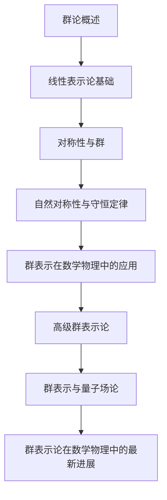

                 

# 群表示论：自然对称性的数学语言

> **关键词：群表示论，对称性，数学语言，自然守恒定律，数学公式，矩阵表示，根空间，Weyl表示，量子场论**

> **摘要：本文将探讨群表示论在自然对称性研究中的应用，从基础概念出发，深入解析线性表示、自然对称性与守恒定律，并探讨其在数学物理领域的重要应用。文章最后将展望群表示论的未来发展趋势。**

## 目录大纲

#### 第一部分：群表示论基础

##### 第1章：群论概述

- 1.1 群的定义与性质
- 1.2 群的子群与商群
- 1.3 群的表示与同态

##### 第2章：线性表示论基础

- 2.1 线性空间与线性变换
- 2.2 矩阵表示与行列式
- 2.3 线性表示的矩阵表示

#### 第二部分：群表示论应用

##### 第3章：对称性与群表示

- 3.1 对称性与群
- 3.2 群表示的应用实例
- 3.3 群表示的分类与构造

##### 第4章：自然对称性与守恒定律

- 4.1 自然对称性与物理守恒定律
- 4.2 守恒定律的数学描述
- 4.3 群论在量子力学中的应用

##### 第5章：群表示在数学物理中的应用

- 5.1 群表示在代数几何中的应用
- 5.2 群表示在拓扑学中的应用
- 5.3 群表示在量子场论中的应用

#### 第三部分：高级群表示论

##### 第6章：根空间与Weyl表示

- 6.1 根空间的基本概念
- 6.2 Weyl表示的构造
- 6.3 Weyl表示的性质与应用

##### 第7章：群表示与量子场论

- 7.1 量子场论中的群论应用
- 7.2 群表示在量子场论中的作用
- 7.3 量子场论中的典型群表示

##### 第8章：群表示论在数学物理中的最新进展

- 8.1 21世纪群表示论的发展趋势
- 8.2 群表示论在数学物理中的前沿应用
- 8.3 群表示论的未来发展方向

### 附录

- 附录A：常用群表示符号与术语
- 附录B：数学公式与定理引用
- 附录C：参考文献与推荐阅读

#### Mermaid 流程图



#### 核心算法原理讲解

**算法：群表示的矩阵表示**

**伪代码：**

```
Input: G，群的生成元
        V，线性空间的基向量
Output: M，群表示的矩阵

1. 初始化矩阵 M 的大小为 |V| x |V|
2. 对于每一个生成元 g ∈ G，做以下操作：
    2.1. 对于每一个基向量 v ∈ V，计算变换 g.v
    2.2. 将 g.v 与 v 进行内积，得到一个标量值
    2.3. 将这个标量值填入矩阵 M 的相应位置
3. 返回矩阵 M
```

**举例说明：**

假设 G 是一个由生成元 g 和 h 生成的群，V 是一个二维线性空间，基向量为 v1 = (1,0) 和 v2 = (0,1)。

矩阵 M 将会是：

$$
\begin{bmatrix}
g.v1 \cdot v1 & g.v1 \cdot v2 \\
g.v2 \cdot v1 & g.v2 \cdot v2
\end{bmatrix}
$$

其中，内积的计算依赖于群的性质和线性空间的结构。

#### 数学模型和数学公式详细讲解

**群表示的定义**

$$
\text{一个群} G \text{在向量空间} V \text{上的表示} \phi : G \rightarrow GL(V) \text{是一个同态，满足：}
$$

$$
\phi(g_1 g_2) = \phi(g_1) \phi(g_2)
$$

其中，$\phi(g)$ 是在向量空间 $V$ 上的线性变换，$GL(V)$ 是 $V$ 上所有线性变换的集合。

**矩阵表示**

$$
[\phi(g)]_{\beta} = M_{\beta\beta'}^{g}
$$

其中，$M_{\beta\beta'}^{g}$ 是表示矩阵，$\beta$ 和 $\beta'$ 是向量空间的基。

**群

