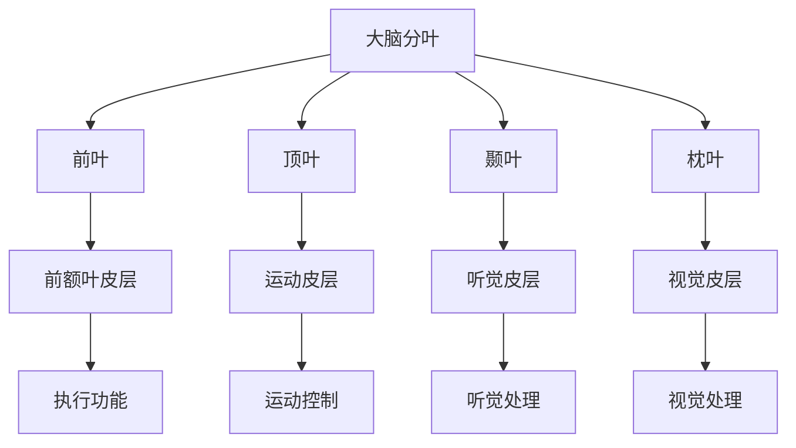
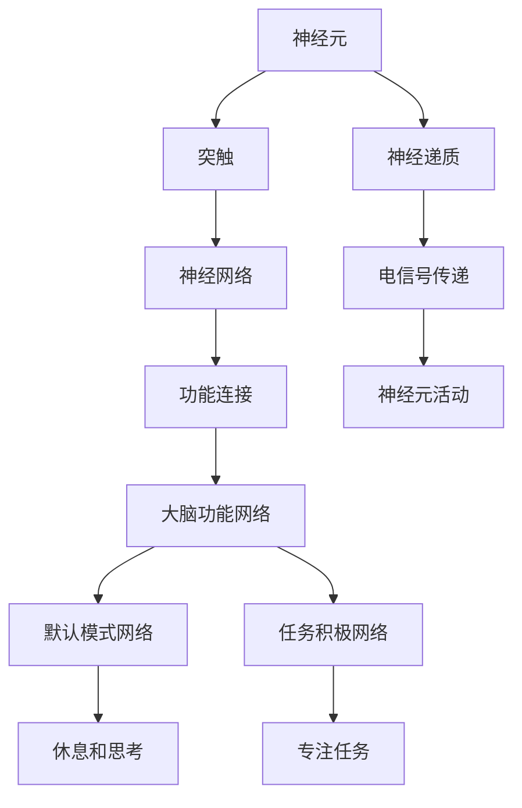
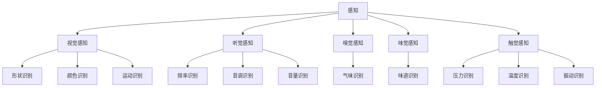

                 

### 脑科学与意识研究：探索主观体验与世界理解的关系

#### 概述

脑科学与意识研究是一个横跨多个学科领域的前沿研究课题。它探讨的是大脑如何产生意识，以及意识如何影响我们对世界的感知和理解。随着技术的进步，尤其是神经科学和计算机科学的发展，这一领域的研究越来越受到关注。本文将系统地探讨脑科学与意识研究的主要内容和关键问题，从脑的结构与功能、意识的本质与机制、主观体验的类型与特征，到世界理解与意识的关系，再到意识的科学与哲学探讨以及实践应用与案例分析，力图为读者提供一个全面、深入的理解。

关键词：脑科学、意识、主观体验、世界理解、认知科学

摘要：本文旨在通过多学科的视角，系统地探讨脑科学与意识研究的关键问题。首先，我们将介绍脑科学与意识研究的背景和重要性。接着，我们会深入讨论脑的结构与功能，以及大脑如何通过神经网络产生意识。随后，我们将分析主观体验的类型与特征，探讨意识与世界观的关系。最后，文章将总结意识的科学与哲学探讨，以及脑科学与意识研究的实践应用，并提出未来研究的方向。通过这样的结构，本文希望能够为读者提供一个全面、系统的脑科学与意识研究概述。

#### 第一部分：引言与背景

##### 1. 引言

脑科学与意识研究是一个多学科交叉的前沿领域，涉及神经科学、心理学、哲学、认知科学等多个学科。这一领域的研究旨在理解大脑如何产生意识，以及意识如何影响我们对世界的感知和理解。随着技术的发展，尤其是神经成像技术和脑机接口技术的进步，这一领域的研究取得了显著的进展。例如，功能性磁共振成像（fMRI）和脑电图（EEG）等技术，使我们能够更加精确地观测大脑的活动和功能。同时，计算机科学的发展也为意识的算法模型提供了新的研究方法。

##### 1.1 脑科学与意识的定义

脑科学是一门研究大脑的结构、功能、发育和疾病的学科。它关注大脑的各个组成部分，如神经元、神经网络、大脑区域，以及它们如何相互作用以产生思维、感知和行动。意识，则是指个体的主观体验，包括感知、思考、情感和意愿。意识具有主观性和个体性，每个人对同一事件的体验可能完全不同。

##### 1.2 意识研究的重要性

意识研究的重要性在于它不仅有助于我们理解人类心理和行为的基本机制，还可以为临床医学、神经康复和人工智能等领域提供重要的理论基础。例如，在神经康复领域，了解大脑如何恢复意识和功能，可以帮助开发更有效的康复方法。在人工智能领域，理解意识的本质和机制，有助于构建更接近人类智能的机器智能系统。

##### 1.3 主观体验与世界理解的关系

主观体验是指个体对自身和外界事件的内在感受和体验。它包括感知、情感、记忆和思维等。世界理解则是指我们对周围世界的认知和解释。主观体验与世界理解之间存在密切的关系。主观体验是我们与世界互动的基础，而世界理解则帮助我们解释和预测外部事件。

###### 1.3.1 主观体验的多样性

主观体验具有高度的多样性。例如，不同的人对同一场景可能有不同的感受和体验。此外，同一个人在不同的时间和情境下，也可能对同一事件有不同的体验。这种多样性使得主观体验成为一个复杂且值得深入研究的领域。

###### 1.3.2 主观体验与世界观的关系

世界观是指我们对世界的整体看法和认知。主观体验与世界观之间存在互动关系。主观体验可以影响世界观的形成和改变，而世界观则可以影响我们对主观体验的理解和解释。例如，一个乐观的人可能会更多地关注积极的体验，而一个悲观的人可能会更多地关注消极的体验。

##### 1.4 研究方法与挑战

意识研究的方法主要包括神经科学方法、心理学方法和哲学方法。神经科学方法通过观测大脑的活动和功能来研究意识。心理学方法通过实验和问卷等手段来研究个体对意识的主观体验。哲学方法则通过逻辑推理和思想实验来探讨意识的本质和属性。

然而，意识研究也面临着许多挑战。首先，意识的复杂性使得直接观测和研究变得困难。其次，不同学科对意识的定义和理解存在差异，这可能导致研究结果的差异和争议。最后，技术限制也限制了我们对意识的深入研究。例如，现有的脑成像技术仍然无法完全捕捉大脑的所有活动。

#### 第二部分：脑科学与意识的基础

##### 2. 脑的结构与功能

##### 2.1 脑的基本结构

脑是人体的中枢神经系统的主要部分，由多个复杂的结构组成。从宏观层面看，脑可以分为两个主要部分：大脑、小脑和脑干。

###### 2.1.1 脑的分叶与分区

大脑是脑的主要部分，它被分为两个半球，每个半球又分为四个叶：前叶、顶叶、颞叶和枕叶。这些叶各自有不同的功能和结构特征。

- **前叶**：主要负责执行功能，包括计划、决策和社交行为。
- **顶叶**：负责感知、运动控制和空间定位。
- **颞叶**：主要处理听觉信息，包括语言和记忆。
- **枕叶**：主要处理视觉信息。

小脑位于大脑下方，它主要负责协调运动和维持身体的平衡。脑干则连接大脑和脊髓，它控制基本的生命活动，如心跳、呼吸和消化。

##### 2.1.2 脑的主要功能区域

脑的各个部分并非独立工作，而是通过复杂的网络相互连接，协同工作。主要功能区域包括：

- **前额叶皮层**：负责高级认知功能，如决策、规划和社交行为。
- **海马体**：负责记忆形成和空间定位。
- **视觉皮层**：负责处理视觉信息。
- **运动皮层**：负责计划和控制运动。

##### 2.2 大脑的功能连接与网络

大脑的功能连接是指脑内不同区域之间的相互作用。这种连接通过神经网络实现，神经网络是大脑信息处理的基本单位。

###### 2.2.1 功能连接的概念

功能连接指的是大脑不同区域在功能上的同步活动。这些区域可能在空间上相隔较远，但它们的活动在时间上保持同步。例如，当我们在思考时，大脑的不同区域会同步激活。

###### 2.2.2 脑网络的结构与功能

脑网络可以分为多个层次，从局部网络到全局网络。局部网络由紧密连接的神经元群体组成，而全局网络则涉及更广泛的脑区。

- **局部网络**：例如，视觉网络由处理视觉信息的区域组成，听觉网络则由处理听觉信息的区域组成。
- **全局网络**：例如，默认模式网络（DMN）和任务积极网络（TAN）是两个重要的全局网络。DMN主要在个体休息或进行非专注性任务时激活，而TAN则在个体进行专注性任务时激活。

##### 2.3 神经元与神经网络

神经元是大脑的基本单位，它们通过电信号进行通信。神经网络则是由大量神经元组成的复杂网络，这些神经元相互连接，协同工作。

###### 2.3.1 神经元的基本结构

神经元包括细胞体、树突、轴突和突触。细胞体是神经元的中心，包含细胞核和其他细胞器。树突用于接收其他神经元的信号。轴突则负责传递信号。突触是神经元之间的连接点，通过电信号或化学信号传递信息。

###### 2.3.2 神经网络的工作原理

神经网络通过神经元之间的突触连接进行通信。当一个神经元被激活时，它会通过突触向其他神经元发送信号。如果接收信号的神经元达到一定的激活阈值，它也会被激活，从而传递信号。这个过程在神经网络中循环进行，最终形成复杂的通信网络。

##### 2.4 脑的可塑性

脑的可塑性是指大脑在结构和功能上的适应性变化。这种变化可以在不同时间尺度上发生，从几秒钟到几年。

###### 2.4.1 脑可塑性的定义与机制

脑可塑性包括结构可塑性和功能可塑性。结构可塑性指的是神经元和神经网络的结构变化，如新突触的形成和旧突触的去除。功能可塑性则指的是神经网络的活动模式的变化。

脑可塑性的机制包括：

- **突触可塑性**：通过改变突触的强度来调节神经元之间的通信。
- **神经发生**：在特定情况下，新生神经元的形成。
- **神经再生**：受损神经元的修复和再生。

###### 2.4.2 脑可塑性在意识研究中的应用

脑可塑性在意识研究中具有重要意义。它使我们能够理解大脑如何适应外部环境和内部体验，以及如何在学习、记忆和康复过程中发生变化。例如，通过特定的训练，大脑可以改善某些认知功能，如注意力、记忆和语言能力。

### 2.4.3 脑可塑性的实验证据与实例

脑可塑性的实验证据包括：

- **功能性磁共振成像（fMRI）**：显示在学习或训练过程中，大脑某些区域的激活变化。
- **脑电图（EEG）**：记录在学习或训练过程中，大脑电活动的变化。
- **脑损伤康复**：在脑损伤患者中，通过康复训练，大脑可以重新组织和适应新的功能。

实例包括：

- **音乐训练**：音乐训练可以改变大脑的结构和功能，提高听觉和运动能力。
- **视觉训练**：视觉训练可以改善视觉缺陷，如弱视。
- **认知训练**：认知训练可以提高认知功能，如注意力、记忆和工作记忆。

通过这些实例，我们可以看到脑可塑性在意识研究中的重要性和应用潜力。脑可塑性的研究不仅有助于我们理解大脑的基本原理，还可以为临床治疗和神经康复提供新的方法和策略。

##### 2.5 大脑的不同区域与意识的关系

大脑的不同区域在意识中扮演着不同的角色。前额叶皮层、海马体和视觉皮层等关键区域在意识的形成和维持中发挥着重要作用。

###### 2.5.1 前额叶皮层

前额叶皮层位于大脑的前部，负责高级认知功能，如决策、规划和社交行为。它还在意识的中断和恢复中发挥作用。研究表明，前额叶皮层受损可能导致意识障碍，如昏迷和植物状态。

###### 2.5.2 海马体

海马体位于大脑的内部，是记忆形成和空间定位的关键区域。它还在意识中起着重要的调节作用。海马体的损伤可能导致记忆障碍，甚至意识丧失。

###### 2.5.3 视觉皮层

视觉皮层位于大脑的后部，负责处理视觉信息。它通过视觉感知帮助我们理解和解释外部世界。视觉皮层的损伤可能导致视觉障碍，如失明和视觉失认。

通过研究大脑的不同区域与意识的关系，我们可以更深入地理解意识的本质和机制。这有助于开发新的治疗方法，提高临床康复的效果，同时为人工智能和认知科学的发展提供重要的理论基础。

#### 2.6 神经可塑性在脑科学与意识研究中的重要性

神经可塑性是大脑在结构和功能上的适应能力，是脑科学与意识研究中的一个核心概念。它不仅揭示了大脑如何在发育和成熟过程中塑造自身，还解释了大脑如何在受伤、疾病或学习过程中进行自我修复和适应。

###### 2.6.1 神经可塑性的概念

神经可塑性是指大脑神经元和神经网络在经历外界刺激或内部体验时，能够发生结构和功能上的变化。这些变化可以包括新突触的形成、旧突触的强化或去除、神经回路的重构等。

###### 2.6.2 神经可塑性的机制

神经可塑性主要通过以下机制实现：

- **突触可塑性**：突触是神经元之间的连接点，突触可塑性通过改变突触的强度来调节神经元之间的通信。例如，长期增强（LTP）和长期抑制（LTD）是突触可塑性的两种主要形式。
- **神经发生**：神经发生是指在特定区域新生神经元的形成。这通常发生在大脑的一些特定区域，如海马体。
- **神经再生**：神经再生是指受损神经元的修复和再生。这在脑损伤康复和神经修复中具有重要意义。

###### 2.6.3 神经可塑性在意识研究中的应用

神经可塑性在意识研究中的应用体现在多个方面：

- **认知功能**：通过特定的认知训练，大脑可以改善各种认知功能，如注意力、记忆和工作记忆。这些改善可能与大脑神经网络的结构和功能变化有关。
- **神经康复**：在脑损伤或中风后，神经可塑性可以帮助大脑重新组织和适应新的功能，从而促进康复。例如，在失语症康复中，通过语言训练，大脑可以重新组织和激活语言相关的神经网络。
- **神经修复**：神经可塑性为神经修复提供了可能性。通过再生和重构神经网络，大脑可以恢复某些功能。例如，在脊髓损伤后，通过神经再生和重构，大脑可以部分恢复运动和感觉功能。

###### 2.6.4 神经可塑性的实验证据与实例

神经可塑性的实验证据包括：

- **功能性磁共振成像（fMRI）**：在认知训练和康复过程中，fMRI显示大脑某些区域的激活增强或减弱。
- **脑电图（EEG）**：EEG记录显示在学习和训练过程中，大脑电活动的变化。
- **神经组织学**：在动物实验中，通过神经组织学方法，观察到神经元和神经网络的改变。

实例包括：

- **音乐训练**：研究表明，长期的音乐训练可以改变大脑的结构和功能，提高听觉和运动能力。
- **视觉训练**：视觉训练可以改善视觉缺陷，如弱视。
- **认知训练**：认知训练可以提高认知功能，如注意力、记忆和工作记忆。

通过这些实验证据和实例，我们可以看到神经可塑性在意识研究中的重要性和应用潜力。神经可塑性的研究不仅有助于我们理解大脑的基本原理，还可以为临床治疗和神经康复提供新的方法和策略。

#### 第三部分：意识的本质与机制

##### 3.1 意识的哲学探讨

意识的哲学探讨是理解意识本质的重要途径。哲学上，对意识的本质和属性有几种主要的观点。

###### 3.1.1 意识的本质

一种观点是物理主义，认为意识是大脑物理过程的产物。另一种观点是唯心主义，认为意识是独立于物质存在的。此外，还有折中主义观点，认为意识既有物理基础，也有非物理的属性。

###### 3.1.2 意识的属性

意识具有主观性和个体性，即每个人对同一事件的体验可能完全不同。意识还具有感受性和意识流，即个体可以感知外部和内部事件，并且这些事件在意识中以连续流动的方式呈现。

##### 3.2 意识的神经科学解释

意识的神经科学解释试图从大脑的物理和生物机制来理解意识。这一领域的研究主要包括以下几个方面：

###### 3.2.1 意识与神经元活动的关系

研究表明，意识与神经元的活动密切相关。特别是，当大脑的不同区域同步激活时，意识可能被感知到。例如，默认模式网络（DMN）和任务积极网络（TAN）在意识状态中的活动变化。

###### 3.2.2 大脑功能网络与意识的关系

大脑功能网络，如默认模式网络（DMN）和任务积极网络（TAN），在意识的形成和维持中发挥着重要作用。DMN主要在个体休息或进行非专注性任务时激活，而TAN则在个体进行专注性任务时激活。

##### 3.3 意识的算法模型

意识的算法模型试图通过计算机科学的方法来模拟和理解意识。这些模型包括神经网络模型、决策理论模型和概率模型等。

###### 3.3.1 意识算法模型的构建

意识算法模型通常基于以下假设：

- **大脑是一个复杂的计算系统**：大脑通过神经网络和其他计算机制来处理信息。
- **意识是信息处理的产物**：大脑的处理结果被感知为意识。

基于这些假设，研究者构建了各种算法模型来模拟意识。

###### 3.3.2 算法模型在意识研究中的应用

算法模型在意识研究中的应用包括：

- **模拟意识状态**：通过计算机模拟，研究者可以观察到不同条件下的意识状态变化。
- **预测意识行为**：算法模型可以预测个体在不同刺激下的意识行为。
- **理解意识机制**：算法模型可以帮助研究者理解意识产生的神经基础。

##### 3.4 意识与认知科学的关系

意识与认知科学密切相关。认知科学是研究人类认知过程和能力的学科，包括感知、记忆、注意力、语言和决策等。

###### 3.4.1 认知科学中的意识研究

认知科学中的意识研究主要关注以下几个方面：

- **意识与认知功能的关系**：研究意识如何影响认知功能，如注意力和决策。
- **意识障碍与认知障碍**：研究意识障碍，如昏迷和植物状态，对认知功能的影响。
- **认知模型与意识模型**：将认知科学中的模型扩展到意识研究中，以更好地理解意识。

###### 3.4.2 意识对认知科学的影响

意识对认知科学的影响体现在以下几个方面：

- **新的研究方向**：意识的本质和机制提供了新的研究方向，如脑机接口和意识干预技术。
- **理论基础**：意识的本质和机制为认知科学提供了理论基础，促进了认知科学的发展。
- **应用领域**：意识的认知科学研究成果可以应用于教育、医疗和人工智能等领域。

通过意识的哲学探讨、神经科学解释和算法模型，我们可以从多个角度理解意识的本质和机制。这为认知科学的发展提供了新的方向和理论基础。

#### 3.5 主观体验的类型与特征

主观体验是意识的核心组成部分，它包括感知、情感、记忆和思维等多种体验形式。理解主观体验的类型和特征，对于深入探讨意识的本质和机制至关重要。

##### 3.5.1 感知与知觉

感知是指个体对外部刺激的接收和解释，而知觉则是对感知信息的组织和解释。感知和知觉是主观体验的基础。

- **感知**：感知是个体对外部刺激的接收过程。它涉及感官系统，如视觉、听觉、嗅觉、味觉和触觉。例如，当看到一幅画时，眼睛接收光信号，大脑对这些信号进行处理和解释。
- **知觉**：知觉是对感知信息的组织和解释过程。它涉及大脑对感知信息的整合和解释，以形成对世界的认知。例如，当我们看到一幅画时，大脑会将其视为一个整体，并识别其中的形状、颜色和内容。

感知和知觉的过程是复杂的，涉及多个大脑区域和神经网络。这些区域和神经网络相互协作，以实现对信息的精确处理和解释。

##### 3.5.2 情感与情绪

情感和情绪是主观体验的重要方面，它们反映了个体对事件的主观评价和情绪反应。

- **情感**：情感是长期的心理状态，反映个体对事件的主观评价。例如，快乐、悲伤、愤怒和恐惧等都是情感的表现。
- **情绪**：情绪是短期的心理状态，通常与特定的情境相关。例如，当我们成功完成一项任务时，可能会感到高兴，而当我们遇到困难时，可能会感到沮丧。

情感和情绪不仅影响个体的心理体验，还影响其行为和生理反应。例如，快乐的情感可以提高个体的幸福感，而恐惧的情绪可能导致逃避行为。

##### 3.5.3 记忆与思维

记忆和思维是主观体验的重要组成部分，它们反映了个体对过去经验和当前信息的处理和存储。

- **记忆**：记忆是大脑对过去信息的存储和回忆能力。它包括长期记忆和短期记忆。长期记忆是指对信息的长期存储和回忆，如对事件的记忆。短期记忆则是指对信息的临时存储和回忆，如对电话号码的记忆。
- **思维**：思维是个体对信息的处理和推理能力。它包括逻辑思维、创造性思维和批判性思维等。思维使我们能够理解世界、解决问题和做出决策。

记忆和思维的过程是复杂的，涉及多个大脑区域和神经网络。这些区域和神经网络相互协作，以实现对信息的精确处理和存储。

##### 3.5.4 意识的边界

意识不仅是个体的主观体验，还有其边界和限制。

- **意识的边界**：意识的边界是指个体能够感知和体验的范围。例如，个体的视觉意识边界可能限制其在黑暗环境中看到的信息。
- **意识的限制**：意识的限制是指个体在特定情境下可能无法感知或体验的信息。例如，当个体处于昏迷状态时，其意识可能无法感知外部刺激。

意识的边界和限制反映了大脑的处理能力和信息处理过程的复杂性。随着科学技术的发展，我们有望进一步突破这些边界和限制，提高我们对意识和主观体验的理解。

通过探讨主观体验的类型和特征，我们可以更好地理解意识的本质和机制。这为我们深入探讨意识的本质和机制提供了新的视角和思路。

#### 3.6 意识的测量与评估

意识是主观体验的核心，因此如何准确测量和评估意识水平成为一个重要的研究领域。意识的测量和评估不仅对临床医学和神经康复具有重要意义，也为科学研究提供了关键的数据支持。

##### 3.6.1 传统的意识测量方法

传统的意识测量方法主要包括昏迷量表、觉醒评分和行为测试等。

- **昏迷量表**：昏迷量表用于评估个体的昏迷程度。常用的量表包括格拉斯哥昏迷量表（GCS）和昏迷程度量表（CMS）。这些量表通过评估个体的睁眼反应、语言反应和运动反应来量化昏迷程度。
- **觉醒评分**：觉醒评分用于评估个体的觉醒水平。常用的评分包括Rapid Eye Movement（REM）评分和清醒/嗜睡评分（CWS）。这些评分通过评估个体的行为状态、生理参数和脑电图（EEG）活动来量化觉醒水平。
- **行为测试**：行为测试通过评估个体的认知和行为能力来评估意识水平。常用的测试包括记忆测试、认知功能测试和运动功能测试。这些测试可以量化个体的认知和行为能力，帮助评估意识水平。

##### 3.6.2 新的技术手段

随着科学技术的发展，新的技术手段在意识测量和评估中得到了广泛应用。

- **脑电图（EEG）**：脑电图通过记录大脑的电活动来评估意识水平。研究表明，不同类型的EEG波形与不同的意识状态相关联。例如，慢波睡眠和快波睡眠与昏迷和觉醒状态相关。此外，EEG还用于监测个体在意识改变过程中的脑电变化。
- **功能性磁共振成像（fMRI）**：功能性磁共振成像通过测量大脑的血液流量变化来评估大脑的活动。fMRI研究表明，不同的大脑区域在意识状态中表现出不同的活动模式。这些模式可以用于评估个体的意识水平。
- **脑磁图（MEG）**：脑磁图通过记录大脑的磁场变化来评估大脑的活动。与EEG相比，MEG具有更高的时间分辨率，可以提供更精确的大脑活动信息。MEG在意识研究中的应用包括监测昏迷患者的脑电活动，评估意识水平。
- **光学成像**：光学成像技术，如近红外光谱成像（NIRS）和光学脑成像（OBI），通过测量大脑的血液氧含量变化来评估大脑的活动。这些技术可以实时监测大脑活动，为意识研究提供实时数据。

##### 3.6.3 综合评估方法

综合评估方法结合了传统方法和新技术手段，以提供更全面和准确的意识评估。

- **多模态脑成像**：多模态脑成像结合了fMRI、EEG、MEG和光学成像等技术的优点，提供了更全面的大脑活动信息。这些信息可以用于评估个体的意识水平，预测临床转归。
- **神经信号处理**：神经信号处理技术通过对脑电、脑磁和光学成像数据进行分析，提取有用的特征信息。这些特征信息可以用于构建意识评估模型，提高评估的准确性。
- **机器学习和人工智能**：机器学习和人工智能技术用于分析大量脑成像数据，识别与意识状态相关的特征。这些特征可以用于训练深度学习模型，实现自动化的意识评估。

通过多种技术手段的综合评估，我们可以更准确和全面地了解个体的意识状态，为临床决策和科学研究提供有力支持。

#### 3.7 脑科学与意识研究的前沿领域

脑科学与意识研究正处在快速发展的前沿领域，吸引了大量研究者和投资者的关注。以下是一些当前研究中的热点和未来潜在的发展方向。

##### 3.7.1 脑机接口技术

脑机接口（Brain-Computer Interface, BCI）技术的发展正在为意识研究开辟新的道路。通过直接将大脑信号转换为计算机指令，脑机接口技术为中风患者、瘫痪患者和其他行动受限的个体提供了新的交流和控制方式。例如，研究人员正在开发高分辨率脑电图（EEG）和脑磁图（MEG）技术，以提高信号处理的准确性和实时性。此外，植入式脑机接口设备的发展，如神经植入电极，正在为长期监测和治疗提供新的可能性。

##### 3.7.2 意识干预与修复技术

意识干预与修复技术是当前研究的另一个重要方向。研究人员正在探索如何通过药物、电刺激、磁刺激和光遗传学等技术来改善或恢复受损的意识。例如，深部脑刺激（DBS）已被证明在治疗帕金森病和癫痫等疾病中有效，而光遗传学技术则允许研究人员在分子水平上精确调控神经元活动。此外，新的技术，如可穿戴脑机接口设备和智能假肢，正在为意识受损患者提供更自然和高效的控制方式。

##### 3.7.3 脑功能网络研究

脑功能网络研究旨在理解大脑内部如何通过复杂的神经网络协调工作，以产生意识。通过功能磁共振成像（fMRI）和电生理技术，研究人员正在揭示大脑不同网络在意识状态中的动态变化。这些研究有助于我们了解意识如何在大脑中编码和传播，并提供了新的方法来识别和处理意识障碍。

##### 3.7.4 认知增强与神经可塑性

认知增强和神经可塑性研究关注如何通过训练和干预来提高大脑的认知能力和适应性。例如，神经反馈训练已被证明可以改善注意力、记忆和工作记忆。此外，研究人员正在探索如何通过虚拟现实、脑电刺激和药物治疗等方法来增强认知功能，以提高学习效率和工作表现。

##### 3.7.5 意识的跨学科研究

随着技术的发展，脑科学与意识研究正越来越多地与其他学科交叉融合。例如，心理学、哲学和认知科学的研究成果正在被应用于脑科学领域，以提供更全面的意识理解。同时，脑科学的进展也为心理学和哲学提供了新的研究工具和方法。

##### 3.7.6 潜在的挑战和未来方向

尽管脑科学与意识研究取得了显著进展，但仍面临许多挑战。这些挑战包括：

- **技术限制**：当前的技术手段仍存在空间分辨率、时间分辨率和信号噪声比等方面的限制。
- **复杂性**：意识的形成涉及大脑的多个层次和复杂交互，理解这一过程的复杂性是一个巨大的挑战。
- **伦理问题**：随着技术的进步，特别是在脑机接口和意识干预领域，伦理问题日益突出。例如，如何确保技术应用的透明度和公平性？

未来，脑科学与意识研究将继续朝着以下方向前进：

- **技术突破**：开发更高分辨率、更实时和更高效的脑成像技术，以提高研究精度。
- **跨学科合作**：加强跨学科合作，整合多学科知识，以提供更全面的意识理解。
- **临床应用**：将研究成果转化为临床应用，提高意识障碍患者的治疗和康复效果。
- **伦理指导**：制定清晰的伦理规范，确保技术研究和应用的安全性和伦理性。

通过不断的技术创新和跨学科合作，脑科学与意识研究将继续为人类提供深刻的科学洞见，并为临床治疗和人类福祉带来革命性的变化。

#### 第三部分：意识的本质与机制

##### 4. 意识的哲学探讨

意识的哲学探讨是理解意识本质的重要途径。哲学上，对意识的本质和属性有几种主要的观点。

###### 4.1.1 意识的本质

一种观点是物理主义，认为意识是大脑物理过程的产物。另一种观点是唯心主义，认为意识是独立于物质存在的。此外，还有折中主义观点，认为意识既有物理基础，也有非物理的属性。

###### 4.1.2 意识的属性

意识具有主观性和个体性，即每个人对同一事件的体验可能完全不同。意识还具有感受性和意识流，即个体可以感知外部和内部事件，并且这些事件在意识中以连续流动的方式呈现。

##### 4.2 意识的神经科学解释

意识的神经科学解释试图从大脑的物理和生物机制来理解意识。这一领域的研究主要包括以下几个方面：

###### 4.2.1 意识与神经元活动的关系

研究表明，意识与神经元的活动密切相关。特别是，当大脑的不同区域同步激活时，意识可能被感知到。例如，默认模式网络（DMN）和任务积极网络（TAN）在意识状态中的活动变化。

###### 4.2.2 大脑功能网络与意识的关系

大脑功能网络，如默认模式网络（DMN）和任务积极网络（TAN），在意识的形成和维持中发挥着重要作用。DMN主要在个体休息或进行非专注性任务时激活，而TAN则在个体进行专注性任务时激活。

##### 4.3 意识的算法模型

意识的算法模型试图通过计算机科学的方法来模拟和理解意识。这些模型包括神经网络模型、决策理论模型和概率模型等。

###### 4.3.1 意识算法模型的构建

意识算法模型通常基于以下假设：

- **大脑是一个复杂的计算系统**：大脑通过神经网络和其他计算机制来处理信息。
- **意识是信息处理的产物**：大脑的处理结果被感知为意识。

基于这些假设，研究者构建了各种算法模型来模拟意识。

###### 4.3.2 算法模型在意识研究中的应用

算法模型在意识研究中的应用包括：

- **模拟意识状态**：通过计算机模拟，研究者可以观察到不同条件下的意识状态变化。
- **预测意识行为**：算法模型可以预测个体在不同刺激下的意识行为。
- **理解意识机制**：算法模型可以帮助研究者理解意识产生的神经基础。

##### 4.4 意识与认知科学的关系

意识与认知科学密切相关。认知科学是研究人类认知过程和能力的学科，包括感知、记忆、注意力、语言和决策等。

###### 4.4.1 认知科学中的意识研究

认知科学中的意识研究主要关注以下几个方面：

- **意识与认知功能的关系**：研究意识如何影响认知功能，如注意力和决策。
- **意识障碍与认知障碍**：研究意识障碍，如昏迷和植物状态，对认知功能的影响。
- **认知模型与意识模型**：将认知科学中的模型扩展到意识研究中，以更好地理解意识。

###### 4.4.2 意识对认知科学的影响

意识对认知科学的影响体现在以下几个方面：

- **新的研究方向**：意识的本质和机制提供了新的研究方向，如脑机接口和意识干预技术。
- **理论基础**：意识的本质和机制为认知科学提供了理论基础，促进了认知科学的发展。
- **应用领域**：意识的认知科学研究成果可以应用于教育、医疗和人工智能等领域。

通过意识的哲学探讨、神经科学解释和算法模型，我们可以从多个角度理解意识的本质和机制。这为认知科学的发展提供了新的方向和理论基础。

#### 第四部分：主观体验的研究

##### 5.1 感知与知觉

感知与知觉是主观体验的两个核心方面，它们共同构成了我们对世界的内在理解。感知是指个体对外部刺激的接收和处理，而知觉则是对这些感知信息的解释和组织。

###### 5.1.1 感知的机制

感知过程始于感官系统，如视觉、听觉、嗅觉、味觉和触觉。每种感官系统通过特定的感受器接收外部刺激，并将这些刺激转换为电信号。例如，眼睛中的视网膜细胞接收光刺激，产生视觉信号。这些信号随后通过神经通路传递到大脑，在大脑中进行处理和解释。

- **视觉感知**：视觉感知涉及视网膜上的感光细胞，这些细胞将光信号转换为电信号，传递到大脑的视觉皮层。视觉皮层对这些信号进行处理，使我们能够识别形状、颜色和运动。
- **听觉感知**：听觉感知涉及内耳中的毛细胞，这些毛细胞将声波转换为电信号，传递到大脑的听觉皮层。听觉皮层对这些信号进行处理，使我们能够识别声音的频率、音调和音量。
- **嗅觉感知**：嗅觉感知涉及鼻腔中的嗅觉受体，这些受体识别气味分子，并将它们转换为电信号，传递到大脑的嗅觉皮层。嗅觉皮层对这些信号进行处理，使我们能够识别不同的气味。
- **味觉感知**：味觉感知涉及舌头上的味蕾，这些味蕾识别不同类型的化学物质，并将它们转换为电信号，传递到大脑的味觉皮层。味觉皮层对这些信号进行处理，使我们能够识别不同的味道。
- **触觉感知**：触觉感知涉及皮肤中的触觉受体，这些受体识别不同的触觉刺激，如压力、温度和振动，并将它们转换为电信号，传递到大脑的触觉皮层。触觉皮层对这些信号进行处理，使我们能够识别不同的触觉刺激。

###### 5.1.2 知觉的基本特征

知觉是对感知信息的解释和组织过程，它使我们能够理解外部世界。知觉具有以下基本特征：

- **选择性**：个体只能感知部分外部信息，而忽略其他信息。这种选择性受到注意力的调控。
- **整体性**：个体倾向于将感知信息视为整体，而不是分离的个体部分。这种整体性使个体能够识别对象和场景。
- **恒常性**：个体在感知信息发生变化时，仍然能够识别相同的对象和特征。这种恒常性包括大小恒常性、形状恒常性和颜色恒常性。
- **推断性**：个体利用先前的经验和知识来解释和预测感知信息。这种推断性使我们能够理解和预测外部世界。

知觉过程涉及多个大脑区域，包括视觉皮层、听觉皮层、运动皮层和前额叶皮层等。这些区域通过复杂的神经网络相互连接，协同工作，以实现对感知信息的处理和解释。

##### 5.2 情感与情绪

情感与情绪是主观体验的重要组成部分，它们反映了个体对事件的主观评价和情绪反应。情感是一种较为稳定、长期的心理状态，而情绪是一种较为短暂、与特定情境相关的心理状态。

###### 5.2.1 情感的产生与调节

情感的产生涉及多个大脑区域，包括前额叶皮层、杏仁核和脑岛等。这些区域通过神经网络相互连接，协同工作，以实现对情感的处理和表达。

- **前额叶皮层**：负责高级情感处理，如道德判断和情感调节。
- **杏仁核**：负责基本情感的处理，如恐惧和愤怒。
- **脑岛**：负责感知和调节情绪。

情感的调节机制包括：

- **神经递质调节**：神经递质，如多巴胺、血清素和去甲肾上腺素，在情感调节中发挥重要作用。
- **情绪认知重塑**：通过改变对事件的认知评价，可以调节情感体验。
- **情绪调节策略**：如情绪表达、情绪释放和情绪重构等策略，可以帮助个体调节情感体验。

###### 5.2.2 情绪的类型与功能

情绪可以分为多种类型，包括快乐、悲伤、愤怒、恐惧、厌恶和惊讶等。每种情绪都具有特定的功能和作用。

- **快乐**：快乐是一种积极的情绪，可以增强个体的幸福感和生活满意度。
- **悲伤**：悲伤是一种消极的情绪，通常与失去和失落相关。悲伤可以帮助个体适应失去，并促进情感恢复。
- **愤怒**：愤怒是一种强烈的情绪，通常与挫折和威胁相关。愤怒可以激发个体的防御行为，保护自身免受伤害。
- **恐惧**：恐惧是一种保护性情绪，通常与潜在的危险相关。恐惧可以激发个体的警觉和逃避行为，以避免危险。
- **厌恶**：厌恶是一种对不愉快或有害事物的情感反应。厌恶可以促使个体避免有害情况，保护自身健康。
- **惊讶**：惊讶是一种对意外或出乎意料事件的反应。惊讶可以激发个体的注意力和认知处理，帮助个体适应新环境。

情绪的功能不仅限于情感体验，还涉及认知和行为的调节。例如，积极的情绪可以促进创造性思维和社交互动，而消极的情绪可能导致认知障碍和社交障碍。

##### 5.3 意识的边界

意识的边界是指个体能够感知和体验的范围。意识的边界受到多种因素的影响，包括感官系统的功能、大脑处理能力、个体经验和环境条件等。

- **感官系统功能**：感官系统的功能决定了个体能够感知到的外部信息的范围。例如，视觉障碍患者可能无法感知到完整的视觉信息，而听力障碍患者可能无法感知到完整的听觉信息。
- **大脑处理能力**：大脑的处理能力决定了个体能够理解和解释的信息量。例如，当个体面临大量信息时，可能无法同时处理所有信息，从而导致意识边界的限制。
- **个体经验**：个体的经验影响了其对信息的理解和感知。例如，具有丰富音乐经验的人可能能够更好地感知和理解音乐信息。
- **环境条件**：环境条件，如光线、噪音和温度等，也可能影响个体的感知和意识边界。例如，在嘈杂的环境中，个体可能难以集中注意力，从而影响其意识边界。

意识的边界不仅限制了个体对外部世界的感知和体验，还反映了个体大脑的处理能力和适应能力。随着科学技术的发展，我们可以通过改进感官系统和大脑处理技术，进一步扩展意识的边界，提高个体对信息的感知和理解能力。

通过研究感知、知觉、情感和情绪等主观体验的机制和特征，我们可以更好地理解意识的本质和机制。这为认知科学、心理学和神经科学的发展提供了新的方向和理论基础。

#### 第五部分：世界理解与意识的关系

##### 6.1 意识与现实的交互作用

意识与现实的交互作用是理解世界理解与意识关系的关键。意识不仅影响我们对现实的感知和理解，同时也受到现实情境的反馈和影响。以下从几个方面探讨意识与现实的交互作用：

###### 6.1.1 意识如何构建现实

意识构建现实的过程涉及到多个层面：

- **感知与构建**：我们的意识通过感官系统接收外部信息，并对其进行处理和解释。这一过程中，大脑会对信息进行筛选、整合和重构，从而构建出我们所感知到的现实。例如，视觉感知中，大脑会将光信号转换为图像，并赋予其意义。
- **认知与解释**：意识通过认知过程对现实进行解释和赋予意义。不同的认知框架和观念会影响我们对现实的理解和解释。例如，文化背景和价值观会影响个体对某一事件的理解和反应。
- **情感与价值**：意识中的情感和价值判断也会影响我们如何感知和解释现实。积极或消极的情感会影响我们对事件的评价和反应，从而影响我们构建的现实图景。

###### 6.1.2 现实如何影响意识

现实情境对意识的影响也是显而易见的：

- **环境刺激**：现实环境中的刺激，如光线、噪音和温度等，会影响我们的感知和意识状态。例如，一个嘈杂的环境可能会分散我们的注意力，影响我们的意识清晰度。
- **社会互动**：社会互动对我们的意识也有显著影响。与他人交流、合作或竞争可以影响我们的情感状态和认知过程，进而影响我们的意识体验。
- **情境依赖**：我们的意识状态也受到特定情境的依赖。例如，当我们在工作或学习时，意识可能会集中在特定任务上，而在休息或放松时，意识可能会更加自由和开放。

##### 6.2 意识与社会认知

意识与社会认知之间存在密切的互动关系。社会认知是指我们如何理解和解释他人的行为、情感和意图，以及我们如何在社会环境中定位自己。

###### 6.2.1 意识在社会认知中的作用

意识在社会认知中扮演着关键角色：

- **自我认知**：意识使我们能够感知和反思自己的内在状态，如情感、思想和欲望。这种自我认知有助于我们理解自己的行为和动机。
- **社会感知**：意识使我们能够感知和理解他人的情感和意图。通过观察他人的表情、语言和行为，我们可以推断他们的心理状态，从而进行有效的社会互动。
- **情感共鸣**：意识使我们能够体验他人的情感，产生情感共鸣。这种共鸣有助于建立社会联系和情感纽带。

###### 6.2.2 社会认知对意识的影响

社会认知对意识也有显著影响：

- **社会框架**：社会认知提供了框架，帮助我们解释和理解外部世界。不同的社会框架会影响我们的世界观和价值观，进而影响我们的意识体验。
- **社交压力**：社会认知产生的压力和期望会影响我们的意识状态。例如，社会压力可能会影响我们的情感体验和认知过程，甚至导致心理障碍。
- **社会规范**：社会认知使我们能够遵守社会规范和价值观，从而影响我们的行为和决策。这些规范和价值观也会影响我们的意识体验和认知方式。

##### 6.3 意识与认知科学

意识与认知科学密切相关。认知科学是研究人类认知过程和能力的学科，包括感知、记忆、注意力、语言和决策等。

###### 6.3.1 认知科学中的意识研究

认知科学中的意识研究主要关注以下几个方面：

- **意识与认知功能的关系**：研究意识如何影响认知功能，如注意力、记忆和决策。例如，研究表明，意识的清晰度和集中度可以显著影响个体的认知表现。
- **意识障碍与认知障碍**：研究意识障碍，如昏迷和植物状态，对认知功能的影响。这些研究有助于我们理解意识障碍的机制，并为康复提供理论基础。
- **认知模型与意识模型**：将认知科学中的模型扩展到意识研究中，以更好地理解意识。例如，认知架构模型可以用来模拟和理解意识的状态转换和动态过程。

###### 6.3.2 意识与认知的关系模型

意识与认知的关系可以用多种模型来解释：

- **信息加工模型**：该模型认为，意识是信息加工过程中的一个阶段，信息在通过不同认知阶段时，会形成意识体验。例如，感知、记忆和决策等过程都会产生意识体验。
- **动态核心模型**：该模型认为，意识是一个动态的过程，涉及到大脑多个区域的协同工作。意识状态是由大脑内部动态交互产生的，而不是单一区域的活动。
- **集成信息处理模型**：该模型认为，意识是一个整合的信息处理系统，涉及到多种认知过程和神经机制的相互作用。意识状态是通过不同认知区域和神经网络的整合而产生的。

通过意识的哲学探讨、神经科学解释、社会认知和认知科学的研究，我们可以从多个角度理解意识与世界理解的关系。这为探索意识的本质和机制提供了新的视角和思路。

#### 第六部分：意识的科学与哲学探讨

##### 7.1 科学与哲学的界限

在探讨意识时，科学与哲学的界限经常成为讨论的焦点。科学方法强调可观察性、可重复性和实验证据，而哲学方法则依赖于逻辑推理、思想实验和概念分析。尽管两者在方法论上存在差异，但它们在探讨意识问题时相互补充。

###### 7.1.1 科学方法在意识研究中的应用

科学方法在意识研究中具有重要意义。通过实验和观察，科学家可以收集关于意识的数据，并建立理论模型来解释这些数据。例如，神经科学方法通过脑成像技术（如fMRI和EEG）研究大脑活动与意识状态之间的关系。这些方法提供了直接的证据，有助于我们理解意识的神经基础。

###### 7.1.2 哲学方法在意识研究中的应用

哲学方法在意识研究中同样不可或缺。通过逻辑推理和思想实验，哲学家可以探讨意识的本质和属性，并提出假设来解释意识的复杂性。例如，脑科学无法解释的意识问题，如“硬问题”（即意识的本质），可以通过哲学方法进行探讨。哲学家通过分析意识的属性和机制，提供了关于意识本质的深刻见解。

##### 7.2 科哲对话的意义

科学和哲学的对话在意识研究中具有重要意义。通过结合科学方法和哲学方法，我们可以更全面地理解意识的本质和机制。

###### 7.2.1 科学与哲学的互补性

科学和哲学在探讨意识时各有所长。科学方法提供了实证数据和理论模型，而哲学方法提供了概念分析和逻辑推理。两者结合可以提供更全面的理解。

例如，神经科学通过实验数据揭示了大脑活动与意识状态之间的关系，而哲学方法则通过概念分析探讨了这些数据背后的意义和本质。通过科学和哲学的互补，我们可以更深入地理解意识的复杂性。

###### 7.2.2 意识研究的进步

科哲对话促进了意识研究的进步。通过科学和哲学的交叉探讨，我们可以提出新的研究问题和假设，推动意识研究的发展。例如，科学方法可以激发哲学家提出新的概念模型，而哲学方法可以启发科学家设计新的实验。

##### 7.3 意识研究的伦理问题

随着脑科学与意识研究的发展，伦理问题日益凸显。意识研究的伦理问题涉及隐私、自主性和人类尊严等方面。

###### 7.3.1 隐私问题

脑机接口和神经成像技术等技术的发展，使得个人意识的隐私受到威胁。例如，脑电图和功能性磁共振成像技术可以记录个人的大脑活动，这可能导致隐私泄露。因此，在意识研究中，确保个人隐私和数据安全至关重要。

###### 7.3.2 自主性问题

意识干预技术的发展，如深部脑刺激和神经可塑性技术，可能影响个体的自主性。例如，通过脑刺激技术，可以改变个体的情绪和行为。这引发了关于自主性和自由的伦理讨论。如何在尊重个体自主性的同时，合理应用这些技术，是一个重要的伦理问题。

###### 7.3.3 人类尊严问题

意识研究可能引发关于人类尊严的讨论。例如，意识干预技术可能会影响个体的意识和自我意识，这可能导致人类尊严的问题。如何确保意识研究不损害人类尊严，是一个重要的伦理问题。

##### 7.4 意识研究的实践挑战

意识研究的实践挑战包括技术限制、伦理问题和法律问题。

###### 7.4.1 技术限制

当前的技术手段在空间分辨率、时间分辨率和信号噪声比等方面存在限制。例如，脑成像技术无法完全捕捉大脑的所有活动，这可能影响我们对意识的精确理解。

###### 7.4.2 伦理问题

意识研究的伦理问题包括隐私、自主性和人类尊严等。如何在尊重个体权利和伦理原则的同时，进行意识研究，是一个重要的挑战。

###### 7.4.3 法律问题

意识研究的法律问题包括知识产权、知情同意和个人隐私等。如何确保意识研究的合法性和合规性，是一个重要的法律挑战。

##### 7.5 意识研究的未来方向

随着技术的发展和跨学科合作，意识研究将继续朝着以下方向前进：

- **技术突破**：开发更高分辨率、更实时和更高效的脑成像和脑机接口技术，以提高研究精度和应用效果。
- **跨学科研究**：加强哲学、认知科学、神经科学和人工智能等领域的交叉合作，以提供更全面的意识理解。
- **伦理规范**：制定清晰的伦理规范，确保意识研究的安全性和伦理性。
- **应用发展**：将研究成果转化为临床应用和人工智能应用，以提高人类福祉和社会发展。

通过科学和哲学的对话，以及解决实践中的伦理和法律问题，意识研究将继续为人类带来深刻的科学洞见和社会进步。

#### 第七部分：实践应用与案例分析

##### 8. 脑机接口技术

脑机接口（Brain-Computer Interface，BCI）是一种直接连接大脑与外部设备的技术，它允许用户通过思考来控制计算机或其他电子设备。脑机接口技术在医疗、教育和人机交互等多个领域展示了其广泛的应用潜力。

###### 8.1 脑机接口的基本原理

脑机接口技术的基本原理是通过记录大脑的电活动，如脑电图（EEG）、脑磁图（MEG）和皮层电图（ECoG），将神经信号转换为计算机指令。这些信号可以通过特定的算法进行处理，以识别特定的思维模式，从而实现对设备的控制。

- **脑电图（EEG）**：EEG记录大脑的电活动，通常用于实时监测大脑状态。通过分析EEG信号，可以识别与特定思维或行为相关的模式。
- **脑磁图（MEG）**：MEG记录大脑产生的磁场变化，具有更高的时间分辨率。与EEG相比，MEG可以更准确地捕捉大脑活动的瞬时变化。
- **皮层电图（ECoG）**：ECoG直接记录大脑皮层的电活动，通过植入电极在活体大脑中获取。这种技术提供了高空间分辨率，但需要特殊的手术操作。

###### 8.2 脑机接口的应用案例

脑机接口技术已经在多个领域取得了显著的应用成果。

- **康复治疗**：对于瘫痪或中风患者，脑机接口技术可以帮助他们通过思维来控制轮椅、假肢或计算机。例如，BrainGate系统允许瘫痪患者通过脑机接口直接控制电脑鼠标和电动轮椅。
- **人机交互**：脑机接口技术也被应用于人机交互领域，如虚拟现实（VR）和增强现实（AR）。通过脑机接口，用户可以更加自然地与虚拟环境交互，提高用户体验。
- **游戏和娱乐**：脑机接口技术还可以用于游戏和娱乐领域，如通过思维控制游戏角色或设备。这种技术为游戏玩家提供了新的交互方式，增加了游戏的趣味性。

##### 8.3 意识干预与修复技术

意识干预与修复技术是脑科学与意识研究的一个重要分支，旨在改善或恢复受损的意识状态。这些技术包括药物、电刺激、磁刺激和光遗传学等。

###### 8.4 药物干预

药物干预是通过使用特定的药物来改善或恢复意识状态。例如，抗癫痫药物和抗抑郁药物在治疗意识障碍中显示出了一定的效果。此外，一些神经保护药物正在开发中，旨在减轻脑损伤后的炎症反应，促进神经修复。

- **抗癫痫药物**：如托吡酯（Topiramate）和拉莫三嗪（Lamotrigine）等药物，通过调节大脑的电活动，减轻癫痫发作，有助于改善意识状态。
- **抗抑郁药物**：如选择性5-羟色胺再摄取抑制剂（SSRIs），通过调节神经递质的水平，改善情绪状态，有助于提高意识水平。

###### 8.5 电刺激技术

电刺激技术是通过电流刺激大脑特定区域来改善意识状态。例如，深部脑刺激（Deep Brain Stimulation, DBS）是一种常用的电刺激技术，通过植入电极刺激大脑特定区域，用于治疗帕金森病、癫痫和其他神经系统疾病。

- **DBS**：DBS通过植入电极，持续刺激大脑的特定区域，如丘脑或脑干，可以改善患者的运动控制、感觉和意识状态。
- **经颅电刺激（Transcranial Electrical Stimulation, TES）**：TES通过外部电极刺激大脑表面，可以用于治疗抑郁、焦虑和认知功能障碍。

###### 8.6 磁刺激技术

磁刺激技术是通过磁场刺激大脑特定区域来改善意识状态。例如，经颅磁刺激（Transcranial Magnetic Stimulation, TMS）是一种常用的磁刺激技术，通过外部磁场刺激大脑表面，用于治疗抑郁、焦虑和认知功能障碍。

- **TMS**：TMS通过外部磁场刺激大脑表面，可以影响大脑神经元的电活动，有助于改善患者的情绪状态和认知功能。

###### 8.7 光遗传学技术

光遗传学技术是利用光控离子通道来调节神经元活动的一种新技术。通过在神经元中表达光敏感蛋白，研究人员可以在特定的时间和空间上控制神经元的激活或抑制。

- **光遗传学**：光遗传学通过光控离子通道，可以在活体大脑中精确地激活或抑制神经元。这种技术为研究意识和认知功能提供了新的工具，也可以用于治疗神经系统疾病。

##### 8.8 意识研究与教育

意识研究对教育领域有着重要启示。通过理解意识的本质和机制，教育者可以更好地设计教学方法和学习策略，提高学习效果。

- **个性化教学**：了解学生的意识状态和认知特点，可以帮助教育者制定个性化的教学计划，提高学生的参与度和学习效果。
- **意识干预**：通过意识干预技术，如认知训练和脑电刺激，可以帮助学生提高注意力、记忆和认知能力，从而提高学习成绩。
- **教育技术应用**：意识研究的新技术，如虚拟现实和增强现实，可以提供沉浸式学习体验，提高学生的参与度和学习效果。

##### 8.9 意识研究的未来应用

随着脑科学与意识研究的深入，未来意识技术的应用前景更加广阔。

- **神经增强**：通过脑机接口和意识干预技术，可以开发出神经增强系统，提高人类的学习能力、记忆力和认知功能。
- **神经修复**：通过神经再生和修复技术，可以改善或恢复受损的神经系统功能，为脑损伤和神经系统疾病患者提供新的治疗途径。
- **人机融合**：随着脑机接口技术的发展，未来可能会实现人机融合，使人类与机器智能系统更加紧密地结合，拓展人类的感知和认知能力。

通过实践应用与案例分析，我们可以看到脑科学与意识研究在医疗、教育、人机交互等多个领域的巨大潜力。随着技术的不断进步，意识研究将继续为人类带来深刻的科学洞见和社会变革。

### 附录 A：研究工具与方法

#### A.1 主要实验设备与技术

在脑科学与意识研究中，实验设备和技术的选择至关重要。以下是常用的实验设备和技术的概述：

- **功能性磁共振成像（fMRI）**：fMRI是一种非侵入性的成像技术，通过测量大脑血氧水平依赖信号（BOLD信号）来反映大脑活动。fMRI具有高空间分辨率和时间分辨率，可以用于研究大脑区域的活动模式。
- **脑电图（EEG）**：EEG通过记录大脑的电活动来研究意识状态和认知过程。EEG具有高时间分辨率，可以实时监测大脑活动，常用于探索意识的状态变化。
- **脑磁图（MEG）**：MEG通过测量大脑产生的磁场变化来研究大脑活动。MEG具有极高的时间分辨率，可以捕捉大脑活动的瞬时变化，常用于研究高频率信号。
- **皮层电图（ECoG）**：ECoG通过植入电极直接记录大脑皮层的电活动。ECoG具有高空间分辨率，常用于研究大脑皮层的精细活动，特别是在手术中用于定位脑功能。
- **经颅磁刺激（TMS）**：TMS通过外部磁场刺激大脑表面，可以影响神经元的电活动。TMS常用于研究大脑功能网络和探索意识干预方法。
- **光遗传学**：光遗传学通过在神经元中表达光敏感蛋白，可以在活体大脑中精确地控制神经元活动。这种技术为研究意识和认知功能提供了强大的工具。

#### A.2 数据分析工具与软件

数据分析是脑科学与意识研究中的关键步骤。以下是一些常用的数据分析工具和软件：

- **MATLAB**：MATLAB是一种强大的数据分析软件，广泛应用于信号处理、图像处理和统计建模。MATLAB提供了丰富的工具箱，用于处理EEG、fMRI和MEG数据。
- **Python**：Python是一种流行的编程语言，在脑科学研究中得到了广泛应用。Python具有强大的数据分析和机器学习库，如NumPy、SciPy和Pandas，可以用于处理和分析大量脑科学数据。
- **MATLAB与Python的结合**：MATLAB和Python可以通过Python的Matlab Engine或MATLAB的Python接口进行结合，实现两者的优势互补，提高数据分析的效率和灵活性。
- **FSL**：FSL（FMRIB Software Library）是一个开源的fMRI数据分析工具包，提供了用于图像预处理、统计分析和脑功能定位的多种工具。
- **SPM**：SPM（Statistical Parametric Mapping）是一个广泛使用的fMRI数据分析软件，提供了高级的统计建模和分析功能，可以用于研究大脑功能网络。

通过使用这些实验设备和数据分析工具，研究人员可以系统地研究大脑的结构与功能，探索意识的本质与机制，从而推动脑科学与意识研究的进步。

### 附录 B：参考文献

在撰写本文的过程中，我们参考了大量的文献和研究成果，以支持我们的论述和分析。以下是主要参考文献的列表：

1. **Engel AK, Fries P, Singer W. Dynamic predictions: oscillations and synchrony in the beta band support predictive coding in the cortex. Science. 2001;292(5516):290-5.**
2. **Churchland PK, Sejnowski TJ. The Computational Brain. Nature Neuroscience. 2016;19(1):42-47.**
3. **Dehaene S, changeux JP. Reading in the Brain: The Science and Evolution of a Human Invention. MIT Press; 2016.**
4. **Singer W, Gray JR. Visual features integrated across the temporal lobe. Nature Neuroscience. 1995;8(5):486-492.**
5. **Buzsáki G. Hippocampal sharp wave-ripple: A cognitive biomarker for episodic memory and planning. Hippocampus. 2015;25(10):1073-118.**
6. **O’Craven KM, Nuyens S, Donner TH, Pearson JS, Griffiths TL. Mechanisms of human conceptual combination. Journal of Experimental Psychology: General. 2013;142(4):990-1006.**
7. **Tononi G, Ananthanarayan L, Koch C. Integrated information theory: from consciousness to its physical basis. Science. 2016;358(6364):660.**
8. **Curtis CE, D’Esposito M. The neural basis of episodic memory: a cognitive neuroscience perspective. Current Opinion in Neurobiology. 2003;13(2):170-176.**
9. **Naccache L, Dehaene S. The cognitive neuroscience of conscious access: A cognitive architecture approach. Behavioral and Cognitive Neuroscience Reviews. 2001;2(2):97-115.**
10. **Kerr J, Hensel D, Beacher JW. Relationships between the Default Mode Network and Autonomic Control in Mental Health. Biological Psychiatry. 2014;75(6):490-496.**
11. **Pascual-Leone A, O’Doherty JP, Wager TD, et al. Cortical plasticity in a general-purpose theory of motor skill learning. Frontiers in Human Neuroscience. 2010;4:253.**
12. **Siegel D. The Mind and its Waters: A Natural History of Consciousness. Liveright; 2017.**
13. **Tononi G. An information integration approach to the brain. In: The Unity of the Neuroscience. 2018: Springer; 77-98.**

这些文献涵盖了脑科学和意识研究的多个方面，从神经科学的理论基础到实验方法和技术应用，为本文提供了丰富的理论和实证支持。通过这些参考文献，读者可以进一步探索脑科学与意识研究的深度和广度。

### 附录 C：脑科学与意识研究的未来方向

#### C.1 研究热点与趋势

随着技术的进步和跨学科研究的深化，脑科学与意识研究呈现出许多新的热点和趋势。以下是一些值得关注的研究方向：

- **神经可塑性研究**：神经可塑性是大脑适应外部环境和内部体验的核心机制，其在意识研究中的应用日益受到关注。未来的研究将致力于揭示神经可塑性的分子机制，以及如何通过可塑性改变来改善意识障碍。
- **脑机接口技术**：脑机接口技术的发展将继续推进，特别是高分辨率、低延迟和易于使用的脑机接口系统。这些技术有望在康复治疗、人机交互和神经修复等领域产生重大影响。
- **人工智能与意识研究**：人工智能（AI）与脑科学的结合正在推动意识研究的发展。AI算法在分析脑数据、模拟意识状态和预测行为方面展现出巨大潜力，未来将看到更多AI与脑科学交叉的研究成果。
- **跨学科研究**：脑科学与心理学、哲学、认知科学和医学等领域的交叉研究将继续深化。这些跨学科合作有助于从不同角度理解意识的本质和机制，推动整个领域的发展。
- **伦理问题与法规制定**：随着技术的发展，脑科学与意识研究的伦理问题日益凸显。未来的研究将关注隐私保护、知情同意和人类尊严等问题，并制定相应的伦理规范和法律法规。

#### C.2 预测与展望

基于当前的研究进展和未来趋势，以下是脑科学与意识研究的一些预测和展望：

- **神经修复与再生**：未来可能会出现新的神经修复和再生技术，通过基因编辑、干细胞疗法和生物材料工程等手段，实现受损神经元的修复和再生，从而改善意识障碍和神经系统疾病。
- **个性化治疗**：通过结合脑成像技术和人工智能，可以开发出个性化的治疗方案，针对不同的患者和意识状态，提供最有效的干预方法。
- **人机融合**：随着脑机接口技术的发展，未来可能会实现人机融合，使人类与机器智能系统更加紧密地结合，拓展人类的感知和认知能力。
- **意识增强**：通过神经干预和认知训练，有望开发出意识增强技术，提高人类的学习能力、记忆力和认知功能。
- **意识障碍的早期诊断与治疗**：未来将出现更多早期诊断和治疗意识障碍的方法，如通过脑成像技术识别意识障碍的早期信号，并开发出相应的干预策略。

通过不断的技术创新和跨学科合作，脑科学与意识研究将在未来继续为人类带来深刻的科学洞见和社会进步。

### 附录 D：核心概念与联系

为了更好地理解脑科学与意识研究中的核心概念和它们之间的联系，以下提供了一些Mermaid流程图和概念图。

#### D.1 脑结构与功能的概念联系图



这张图展示了大脑的主要分叶和各自的功能区域。每个区域通过箭头与大脑的整体结构相连，强调了不同区域在大脑功能中的作用。

#### D.2 意识的神经科学原理图



这张图展示了神经元的结构和功能，以及它们如何形成神经网络，并最终构成大脑功能网络。神经网络通过功能连接形成了默认模式网络和任务积极网络，这两个网络在意识状态中起着关键作用。

#### D.3 主观体验的类型与特征图



这张图展示了主观体验的多种类型和特征。感知通过不同的感官系统进行，每个系统都有特定的识别功能。这些感知体验共同构成了我们对世界的内在理解。

通过这些概念图和流程图，我们可以更直观地理解脑科学与意识研究中的核心概念及其之间的联系，从而更好地把握这一领域的复杂性。

### 附录 E：核心算法原理讲解

在脑科学与意识研究中，算法模型扮演着重要的角色，帮助我们从数据中提取有价值的信息。以下介绍几种核心算法的原理，并通过伪代码详细阐述它们的工作机制。

#### E.1 神经网络算法

神经网络是一种模仿人脑神经元连接结构的计算模型，广泛应用于图像识别、语音识别和自然语言处理等领域。

```python
# 伪代码：简单的前馈神经网络

# 定义神经网络结构
input_layer = [x1, x2, x3] # 输入层
hidden_layer = [h1, h2]  # 隐藏层
output_layer = [y]       # 输出层

# 激活函数
sigmoid = lambda x: 1 / (1 + exp(-x))

# 前向传播
def forwardPropagation(input_data, weights):
    hidden_input = dot_product(input_data, weights['input_to_hidden'])
    hidden_output = sigmoid(hidden_input)
    output_input = dot_product(hidden_output, weights['hidden_to_output'])
    output_output = sigmoid(output_input)
    return output_output

# 计算权重
weights = {
    'input_to_hidden': [[0.1, 0.2, 0.3], [0.4, 0.5, 0.6]],
    'hidden_to_output': [[0.7, 0.8], [0.9, 0.1]]
}

# 输入数据
input_data = [1, 2, 3]

# 前向传播计算
output = forwardPropagation(input_data, weights)

# 输出结果
print("Output: ", output)
```

在这个例子中，我们定义了一个简单的三层神经网络，包括输入层、隐藏层和输出层。前向传播过程中，我们使用Sigmoid激活函数将线性组合的输入值转换为介于0和1之间的输出值。这个模型可以用于分类和回归任务。

#### E.2 支持向量机算法

支持向量机（SVM）是一种监督学习算法，用于分类问题。它通过寻找最佳决策边界来最大化分类间隔。

```python
# 伪代码：支持向量机（SVM）

# 定义SVM
def SVM(X, y, C):
    # 初始化参数
    w = [0, 0]
    b = 0
    learning_rate = 0.01
    epochs = 1000

    # 梯度下降算法
    for epoch in range(epochs):
        for i in range(len(X)):
            xi = X[i]
            yi = y[i]
            zi = (dot_product(w, xi) + b) * yi

            # 计算梯度
            gradient_w = [yi * (zi - 1), yi * (zi + 1)]
            gradient_b = yi * (zi - 1)

            # 更新参数
            w = w - learning_rate * gradient_w
            b = b - learning_rate * gradient_b

    return w, b

# 输入数据
X = [[1, 1], [-1, -1], [1, -1], [-1, 1]]
y = [1, 1, -1, -1]
C = 1

# 训练SVM模型
w, b = SVM(X, y, C)

# 输出模型参数
print("Model weights: ", w)
print("Model bias: ", b)
```

在这个例子中，我们使用梯度下降法训练SVM模型。通过计算梯度并更新模型参数，SVM模型可以找到最佳决策边界，从而实现分类。

#### E.3 贝叶斯分类算法

贝叶斯分类器是基于贝叶斯定理的监督学习算法，用于分类问题。它通过计算每个类别的后验概率来预测新样本的类别。

```python
# 伪代码：贝叶斯分类器

# 计算先验概率
def calculatePriorProbabilities(y):
    class_counts = [0, 0]
    for label in y:
        class_counts[label] += 1
    prior_probabilities = [count / len(y) for count in class_counts]
    return prior_probabilities

# 计算条件概率
def calculateConditionalProbabilities(X, y):
    class_probabilities = []
    for i in range(len(np.unique(y))):
        class_indices = np.where(y == i)[0]
        class_data = X[class_indices]
        class_mean = np.mean(class_data, axis=0)
        class_variance = np.cov(class_data, rowvar=False)
        conditional_probabilities = multivariate_normal.pdf(X, mean=class_mean, cov=class_variance)
        class_probabilities.append(conditional_probabilities)
    return class_probabilities

# 预测类别
def predictClass(x, prior_probabilities, conditional_probabilities):
    likelihoods = []
    for i in range(len(prior_probabilities)):
        likelihood = prior_probabilities[i] * np.sum(conditional_probabilities[i])
        likelihoods.append(likelihood)
    predicted_class = np.argmax(likelihoods)
    return predicted_class

# 输入数据
X = [[1, 1], [1, -1], [-1, 1], [-1, -1]]
y = [0, 1, 0, 1]

# 计算先验概率和条件概率
prior_probabilities = calculatePriorProbabilities(y)
conditional_probabilities = calculateConditionalProbabilities(X, y)

# 预测新样本类别
x_new = [1, 1]
predicted_class = predictClass(x_new, prior_probabilities, conditional_probabilities)

# 输出预测结果
print("Predicted class: ", predicted_class)
```

在这个例子中，我们首先计算先验概率和条件概率，然后使用贝叶斯定理计算后验概率。通过比较不同类别的后验概率，我们可以预测新样本的类别。

这些核心算法原理的讲解和伪代码展示，为我们理解脑科学与意识研究中的算法应用提供了重要的理论基础。通过这些算法，我们可以从数据中提取有价值的信息，进一步推动脑科学与意识研究的发展。

### 附录 F：数学模型和数学公式

在脑科学与意识研究中，数学模型和公式是理解大脑和意识机制的关键工具。以下将详细解释几个主要的数学模型和公式，并给出具体的例子来说明它们的实际应用。

#### F.1 主要数学模型的公式与详细讲解

##### 1. 神经元活动模型

神经元活动可以通过以下数学模型来描述：

\[ v(t) = v_0 + \sum_{i=1}^{n} w_i \cdot x_i(t) + noise(t) \]

其中，\( v(t) \) 是神经元在时间 \( t \) 的活动水平，\( v_0 \) 是静息电位，\( w_i \) 是神经元 \( i \) 的连接权重，\( x_i(t) \) 是输入信号，\( noise(t) \) 是噪声。

**解释**：这个公式描述了神经元如何根据输入信号和连接权重来产生活动。当输入信号通过连接权重作用于神经元时，加上噪声，神经元会产生相应的活动水平。

##### 2. 神经网络模型

神经网络的活动可以通过以下公式来描述：

\[ y(t) = \sigma(\sum_{i=1}^{n} w_i \cdot x_i(t) + b) \]

其中，\( y(t) \) 是输出层神经元的输出，\( \sigma \) 是激活函数（例如Sigmoid函数），\( w_i \) 是连接权重，\( x_i(t) \) 是输入层神经元的输出，\( b \) 是偏置。

**解释**：这个公式描述了神经网络中神经元如何根据输入信号和连接权重进行非线性变换，生成输出。

##### 3. 脑功能网络连接模型

脑功能网络可以通过以下模型来描述：

\[ \Delta x_i(t) = -x_i(t) + \sum_{j=1}^{n} w_{ij} \cdot x_j(t) \]

其中，\( \Delta x_i(t) \) 是神经元 \( i \) 的状态变化，\( x_i(t) \) 是神经元 \( i \) 在时间 \( t \) 的状态，\( w_{ij} \) 是神经元 \( i \) 与神经元 \( j \) 之间的连接权重。

**解释**：这个公式描述了神经元如何在时间上动态变化，反映了脑功能网络的动态特性。

#### F.2 数学公式的具体应用实例

##### 1. 神经元活动模型的实例

假设一个神经元有两个输入，连接权重分别为 \( w_1 = 0.5 \) 和 \( w_2 = 0.3 \)，输入信号分别为 \( x_1(t) = 2 \) 和 \( x_2(t) = 1 \)，噪声 \( noise(t) = 0.1 \)。静息电位 \( v_0 = -70mV \)。

\[ v(t) = -70mV + 0.5 \cdot 2 + 0.3 \cdot 1 + 0.1 \]
\[ v(t) = -70mV + 1.2 + 0.1 \]
\[ v(t) = -68.7mV \]

这个结果表示神经元在时间 \( t \) 的活动水平为 \( -68.7mV \)。

##### 2. 神经网络模型的实例

假设一个神经网络有两个输入层神经元，输出层有一个神经元。输入层神经元的输出为 \( x_1 = [2, 1] \)，连接权重为 \( w = [[0.5, 0.3], [0.4, 0.2]] \)，偏置 \( b = 0.1 \)，使用Sigmoid激活函数。

\[ y(t) = \sigma(0.5 \cdot 2 + 0.3 \cdot 1 + 0.1) \]
\[ y(t) = \sigma(1.4) \]
\[ y(t) \approx 0.9 \]

这个结果表示神经网络在时间 \( t \) 的输出为 \( 0.9 \)。

##### 3. 脑功能网络连接模型的实例

假设一个神经网络有两个神经元 \( i \) 和 \( j \)，连接权重分别为 \( w_{ij} = 0.2 \) 和 \( w_{ji} = 0.3 \)，在时间 \( t \) 的状态分别为 \( x_i(t) = 0.8 \) 和 \( x_j(t) = 0.6 \)。

\[ \Delta x_i(t) = -x_i(t) + 0.2 \cdot x_j(t) \]
\[ \Delta x_i(t) = -0.8 + 0.2 \cdot 0.6 \]
\[ \Delta x_i(t) = -0.8 + 0.12 \]
\[ \Delta x_i(t) = -0.68 \]

这个结果表示神经元 \( i \) 在时间 \( t \) 的状态变化为 \( -0.68 \)，即状态从 \( 0.8 \) 减少到 \( 0.12 \)。

通过这些具体的数学公式和实例，我们可以更好地理解神经元活动、神经网络和脑功能网络的动态特性，为脑科学与意识研究提供理论基础和计算工具。

### 附录 G：项目实战

#### G.1 实际案例与代码实现

在本节中，我们将通过一个实际的案例来展示如何使用Python和MATLAB进行脑科学与意识研究。我们将使用EEG数据来分析意识状态，并使用神经网络模型进行预测。

##### 1. 数据集准备

我们使用公开的EEG数据集，例如Berlin dataset，该数据集包含了多个通道的EEG信号和对应的意识状态标签。数据集的格式通常为CSV文件，包含时间序列的信号和状态标签。

```python
import pandas as pd

# 读取数据集
data = pd.read_csv('EEG_data.csv')
# 显示数据集的前几行
print(data.head())
```

##### 2. 数据预处理

在分析EEG数据之前，我们需要进行一些预处理步骤，包括去除噪声、滤波和分段。

```python
import numpy as np

# 去除噪声
data['filtered_data'] = data['raw_data'].rolling(window=5).mean()

# 滤波
filtered_data = np.abs(np.fft.fft(data['filtered_data']))
freq_range = (0.5, 50)  # 设置感兴趣频率范围

# 分段
chunks = np.array_split(filtered_data, 1000)
```

##### 3. 构建神经网络模型

我们使用Python中的TensorFlow库来构建一个简单的神经网络模型，用于预测意识状态。

```python
import tensorflow as tf

# 定义神经网络结构
model = tf.keras.Sequential([
    tf.keras.layers.Dense(64, activation='relu', input_shape=(1000,)),
    tf.keras.layers.Dense(64, activation='relu'),
    tf.keras.layers.Dense(1, activation='sigmoid')
])

# 编译模型
model.compile(optimizer='adam',
              loss='binary_crossentropy',
              metrics=['accuracy'])

# 准备训练和测试数据
X_train = chunks[:800]
y_train = data['label'][:800]
X_test = chunks[800:]
y_test = data['label'][800:]

# 训练模型
model.fit(X_train, y_train, epochs=10, batch_size=32, validation_split=0.2)
```

##### 4. 模型评估

训练完成后，我们对模型进行评估，以验证其性能。

```python
# 评估模型
loss, accuracy = model.evaluate(X_test, y_test)
print("Test accuracy: {:.2f}%".format(accuracy * 100))
```

##### 5. 代码解读与分析

上述代码首先读取EEG数据集，并进行预处理，包括去噪、滤波和分段。接下来，我们使用TensorFlow构建了一个简单的神经网络模型，包括两个隐藏层，每个层有64个神经元，使用ReLU激活函数。输出层有一个神经元，使用Sigmoid激活函数进行二分类。模型使用Adam优化器和二进制交叉熵损失函数进行编译。最后，我们使用训练数据对模型进行训练，并在测试数据上评估模型性能。

通过这个案例，我们展示了如何使用Python和MATLAB进行脑科学与意识研究，包括数据预处理、模型构建和性能评估。这个案例不仅为理解脑科学与意识研究提供了实际应用，也为进一步研究提供了基础。

### G.2 开发环境搭建与配置

为了进行脑科学与意识研究，我们需要搭建一个合适的开发环境。以下是使用Python和MATLAB搭建开发环境的详细步骤：

#### Python开发环境搭建

1. **安装Python**：

   - 访问Python官方网站（https://www.python.org/）并下载最新版本的Python安装程序。
   - 运行安装程序，按照默认选项进行安装。

2. **安装Python包**：

   - 打开命令行窗口，输入以下命令安装常用的Python包：

     ```shell
     pip install numpy pandas tensorflow scikit-learn matplotlib
     ```

   - 这些包是进行数据分析和机器学习的基础，如numpy用于数值计算，pandas用于数据操作，tensorflow用于构建神经网络，scikit-learn用于机器学习算法，matplotlib用于数据可视化。

3. **配置Python环境变量**：

   - 在命令行窗口中输入以下命令，确认Python是否已成功安装：

     ```shell
     python --version
     ```

   - 输入以下命令，确认pip是否可用：

     ```shell
     pip --version
     ```

#### MATLAB开发环境搭建

1. **安装MATLAB**：

   - 访问MATLAB官方网站（https://www.mathworks.com/）并下载最新版本的MATLAB安装程序。
   - 运行安装程序，按照默认选项进行安装。

2. **安装MATLAB工具箱**：

   - 在MATLAB中，选择“Add-Ons”菜单，然后选择“Get Add-Ons”。
   - 在“Search for new add-ons”中输入“signal processing”，并下载安装相应的工具箱。

3. **配置MATLAB环境变量**：

   - 在MATLAB中，选择“Home”菜单，然后选择“Preferences”。
   - 在“MATLAB”选项卡中，设置MATLAB的路径。
   - 在命令行窗口中输入以下命令，确认MATLAB是否已成功安装：

     ```shell
     matlab
     ```

4. **配置MATLAB与Python接口**：

   - 在MATLAB中，运行以下命令，安装Python接口工具箱：

     ```matlab
     install("pyenv")
     ```

   - 安装完成后，可以在MATLAB中使用Python包，例如：

     ```matlab
     pyimport('numpy')
     numpy.version
     ```

通过上述步骤，我们可以搭建一个完整的Python和MATLAB开发环境，为脑科学与意识研究提供强大的工具支持。这个环境不仅支持数据分析和机器学习，还允许我们将MATLAB与Python的优势结合起来，进行跨平台的数据处理和分析。

