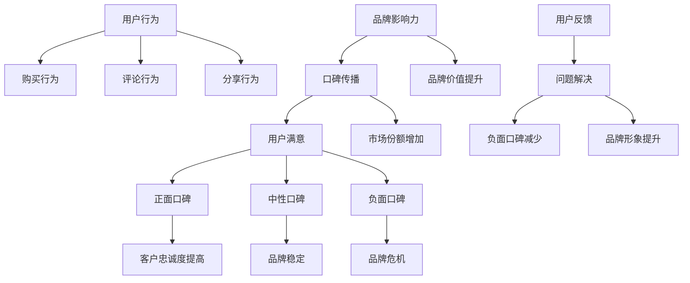
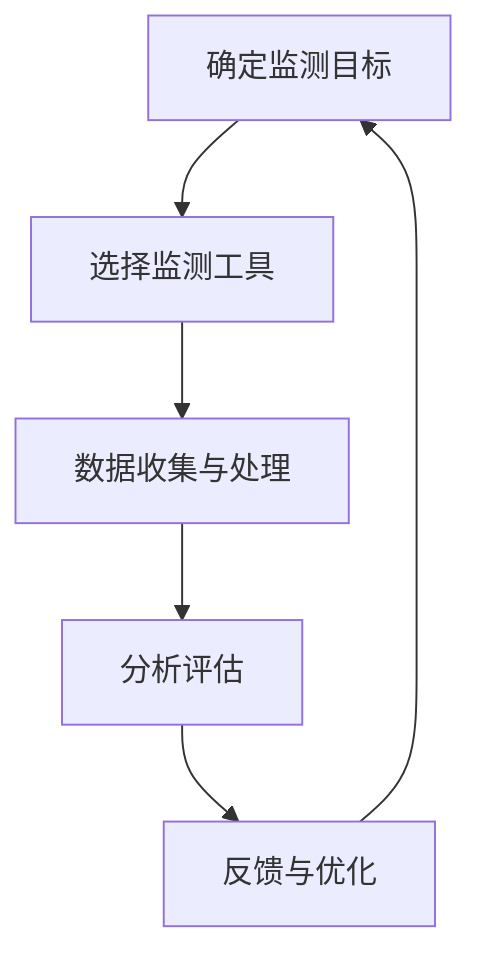

                 

### 《自动化创业中的品牌口碑管理》

#### 关键词：
- 自动化创业
- 品牌口碑管理
- 数据分析
- 社交媒体策略
- 用户行为分析

#### 摘要：
本文深入探讨了自动化创业中的品牌口碑管理。通过分析品牌口碑的定义、作用、管理策略及其与自动化创业的关联，文章提出了品牌口碑管理的核心概念、监测评估方法、危机管理措施以及实践案例。同时，文章还介绍了自动化创业背景、挑战以及品牌口碑管理的优化策略，旨在为创业者提供全面的品牌口碑管理指南。

---

### 《自动化创业中的品牌口碑管理》目录大纲

#### 第一部分：品牌口碑管理概述

##### 第1章：品牌口碑管理的重要性
- 1.1 品牌口碑的定义与作用
- 1.2 品牌口碑管理的基本原则
- 1.3 品牌口碑管理的重要性

##### 第2章：品牌口碑管理核心概念与联系
- 2.1 品牌影响力与口碑传播
- 2.2 用户行为与口碑评价
- 2.3 品牌口碑管理的 Mermaid 流程图

#### 第二部分：品牌口碑管理策略

##### 第3章：构建良好的品牌口碑
- 3.1 品牌定位与价值传递
- 3.2 产品质量与服务保障
- 3.3 品牌传播策略

##### 第4章：品牌口碑监测与评估
- 4.1 品牌口碑监测方法
- 4.2 品牌口碑评估指标
- 4.3 品牌口碑监测与评估的实践

##### 第5章：危机管理与口碑修复
- 5.1 品牌危机管理的重要性
- 5.2 危机管理策略与措施
- 5.3 品牌口碑修复案例

##### 第6章：品牌口碑管理工具与技术
- 6.1 品牌口碑管理工具的选择
- 6.2 数据分析技术在品牌口碑管理中的应用
- 6.3 社交媒体在品牌口碑管理中的作用

##### 第7章：品牌口碑管理案例分析
- 7.1 成功的品牌口碑管理案例
- 7.2 失误的品牌口碑管理案例分析
- 7.3 案例总结与启示

#### 第三部分：自动化创业中的品牌口碑管理实践

##### 第8章：自动化创业背景与挑战
- 8.1 自动化创业的概念与趋势
- 8.2 自动化创业中的品牌口碑管理挑战
- 8.3 自动化创业中的品牌口碑管理策略

##### 第9章：自动化创业中的品牌口碑管理实践
- 9.1 自动化创业项目概述
- 9.2 品牌口碑管理策略制定
- 9.3 品牌口碑管理工具与技术的应用
- 9.4 自动化创业中的品牌口碑管理案例分析

##### 第10章：自动化创业中的品牌口碑管理优化
- 10.1 数据分析与反馈机制
- 10.2 品牌口碑管理优化策略
- 10.3 自动化创业中的品牌口碑管理未来展望

#### 附录

##### 附录A：品牌口碑管理资源与工具
- A.1 品牌口碑管理常用工具
- A.2 品牌口碑管理资源推荐
- A.3 品牌口碑管理研究论文与书籍推荐

---

### 第一部分：品牌口碑管理概述

#### 第1章：品牌口碑管理的重要性

品牌口碑管理是企业经营中至关重要的一环。它不仅关系到企业的品牌形象和市场份额，还直接影响企业的长期发展。在本章中，我们将探讨品牌口碑的定义、作用、基本原则以及其重要性。

##### 1.1 品牌口碑的定义与作用

品牌口碑是指消费者、用户或利益相关者对一个品牌、产品或服务的评价、意见和反馈。这些评价和反馈可能是正面的，也可能是负面的。品牌口碑通过社交网络、评论平台、论坛、博客等渠道传播，对品牌形象产生深远影响。

品牌口碑的作用主要体现在以下几个方面：

1. **品牌价值提升**：良好的品牌口碑可以提升品牌价值，增强消费者对品牌的信任和忠诚度，进而提高市场份额。
2. **市场份额增加**：口碑传播有助于扩大品牌影响力，吸引更多潜在客户，从而增加市场份额。
3. **客户忠诚度提高**：正面口碑有助于建立稳定的客户群体，提高客户满意度，降低客户流失率。
4. **产品销售促进**：良好的品牌口碑可以带动产品销售，提高销售额。

##### 1.2 品牌口碑管理的基本原则

品牌口碑管理需要遵循以下基本原则：

1. **客户体验至上**：企业应始终关注客户体验，提供优质的产品和服务，以满足客户需求，赢得客户好评。
2. **真实性与透明度**：企业应保持真实性和透明度，诚实地面对消费者，及时回应负面反馈，避免隐瞒事实。
3. **预防与危机管理**：企业应提前预防口碑危机，建立危机管理机制，及时应对负面事件，减轻品牌损失。

##### 1.3 品牌口碑管理的重要性

品牌口碑管理的重要性体现在以下几个方面：

1. **提升品牌形象**：良好的口碑可以提升品牌形象，增强品牌的市场竞争力。
2. **促进业务增长**：口碑传播有助于吸引潜在客户，提高销售额和市场份额。
3. **降低营销成本**：通过口碑传播，企业可以减少广告和营销成本，实现低成本高回报。
4. **提高客户忠诚度**：良好的口碑有助于建立稳定的客户群体，提高客户满意度和忠诚度。

在接下来的章节中，我们将深入探讨品牌口碑管理的核心概念、策略和工具，帮助读者全面了解品牌口碑管理的重要性及其应用方法。

---

### 第2章：品牌口碑管理核心概念与联系

品牌口碑管理是一个复杂而多维的过程，涉及到多个核心概念和它们的相互联系。在本章中，我们将详细介绍品牌影响力、口碑传播、用户行为以及口碑评价等核心概念，并通过Mermaid流程图展现品牌口碑管理的整体流程。

##### 2.1 品牌影响力与口碑传播

品牌影响力是指品牌在市场中产生的影响力和吸引力，它是品牌价值的体现。品牌影响力可以通过多个维度来衡量，包括品牌知名度、品牌偏好度、品牌忠诚度等。

口碑传播是品牌影响力的重要来源之一。口碑传播是指消费者、用户或利益相关者通过社交网络、评论平台、论坛等渠道，对品牌、产品或服务的评价和意见进行传播。口碑传播具有自发性、广泛性和持续性，能够迅速扩大品牌影响力。

口碑传播的过程可以分为以下几个阶段：

1. **产生**：消费者在使用品牌或产品后产生评价和意见。
2. **传播**：消费者通过社交媒体、论坛、评论平台等渠道将评价和意见传播给他人。
3. **影响**：口碑传播对潜在消费者产生影响，影响他们的购买决策和行为。

##### 2.2 用户行为与口碑评价

用户行为是品牌口碑管理的重要依据。用户行为包括购买行为、评论行为、分享行为等。通过对用户行为的分析，企业可以了解用户对品牌和产品的态度，从而制定针对性的口碑管理策略。

口碑评价是用户行为的重要组成部分。口碑评价可以是正面、中性或负面的。正面口碑可以提升品牌形象，增加消费者信任；中性口碑可以保持品牌稳定；负面口碑则需要及时处理，避免影响品牌声誉。

用户行为与口碑评价之间的关系可以概括为以下几点：

1. **用户满意**：用户满意是产生正面口碑的基础。提高用户满意度可以增加正面口碑的比例。
2. **用户参与**：用户参与度越高，口碑传播的范围和力度越大。鼓励用户参与评价和分享，有助于扩大口碑传播。
3. **用户反馈**：及时回应用户反馈，解决问题，可以减少负面口碑的产生。

##### 2.3 品牌口碑管理的 Mermaid 流程图

为了更好地理解品牌口碑管理的流程，我们可以使用Mermaid流程图来展示其关键环节和相互关系。

通过这个流程图，我们可以清晰地看到品牌影响力、口碑传播、用户行为、口碑评价以及用户反馈之间的密切联系。品牌影响力是口碑传播的基础，用户行为和口碑评价是口碑管理的关键环节，用户反馈则是优化口碑管理的重要手段。

在接下来的章节中，我们将深入探讨品牌口碑管理策略的制定和实施，以及品牌口碑监测与评估的方法。希望这些核心概念和流程图的介绍能够为读者提供有益的启发和指导。

---

### 第3章：构建良好的品牌口碑

构建良好的品牌口碑是企业长期发展的重要任务。良好的品牌口碑不仅能够提升品牌价值，还能够增加市场份额，提高客户忠诚度。在本章中，我们将探讨如何通过品牌定位与价值传递、产品质量与服务保障、品牌传播策略来构建良好的品牌口碑。

##### 3.1 品牌定位与价值传递

品牌定位是企业为了在目标市场中获得竞争优势而采取的一种战略。品牌定位的目的是明确品牌在消费者心目中的独特形象和地位。成功的品牌定位能够帮助企业吸引目标客户，提高品牌知名度和品牌忠诚度。

品牌定位的步骤包括：

1. **市场分析**：了解目标市场，分析竞争对手，确定目标客户群体。
2. **品牌差异化**：找到与竞争对手不同的独特卖点，如产品质量、服务优势、技术创新等。
3. **品牌价值传递**：将品牌定位的理念和差异化优势传递给消费者，使消费者对品牌产生认知和认可。

品牌价值传递的策略包括：

1. **产品差异化**：通过独特的产品功能和设计，满足消费者的个性化需求。
2. **服务质量**：提供优质的客户服务，提高客户满意度和忠诚度。
3. **品牌故事**：通过讲述品牌背后的故事，建立情感联系，提升品牌形象。

##### 3.2 产品质量与服务保障

产品质量是品牌口碑的基石。优质的产品能够赢得消费者的信任和好评，从而形成良好的口碑。为了保障产品质量，企业应采取以下措施：

1. **质量管理体系**：建立并执行严格的质量管理体系，确保产品从设计、生产到交付的每一个环节都符合质量标准。
2. **产品测试**：进行全面的测试和验证，确保产品在上市前达到高质量标准。
3. **客户反馈**：及时收集客户反馈，分析产品存在的问题，进行改进和优化。

服务质量也是品牌口碑的重要组成部分。优质的服务能够提高客户满意度和忠诚度，从而形成良好的口碑。企业应采取以下策略：

1. **客户培训**：提供专业的客户培训，帮助客户更好地使用产品，提高客户体验。
2. **快速响应**：建立快速响应机制，及时解决客户问题，提高客户满意度。
3. **售后服务**：提供优质的售后服务，如维修、更换、退款等，确保客户在使用过程中得到满意的体验。

##### 3.3 品牌传播策略

品牌传播策略是构建良好品牌口碑的重要手段。企业应采取多种传播渠道和手段，提高品牌知名度和美誉度。

1. **线上传播策略**：
   - **社交媒体**：利用社交媒体平台（如微博、微信、抖音等）进行品牌推广，与消费者建立互动关系。
   - **搜索引擎优化（SEO）**：通过优化网站内容和结构，提高在搜索引擎中的排名，吸引潜在客户。
   - **内容营销**：发布有价值的内容，如博客文章、视频、案例分享等，提升品牌形象。

2. **线下传播策略**：
   - **公关活动**：组织公关活动，如新闻发布会、产品发布会、展览等，提高品牌知名度。
   - **广告投放**：通过电视、报纸、户外广告等传统媒体进行品牌广告投放。
   - **赞助合作**：与相关行业或活动合作，提升品牌形象。

3. **口碑营销**：
   - **用户评价**：鼓励用户在社交媒体、电商平台等平台发布正面评价，提升品牌口碑。
   - **口碑传播**：利用口碑传播机制，通过消费者之间的口碑推荐，扩大品牌影响力。

通过以上策略，企业可以构建良好的品牌口碑，提升品牌价值，赢得市场份额。在接下来的章节中，我们将继续探讨品牌口碑监测与评估的方法，以及如何应对品牌口碑危机。

---

### 第4章：品牌口碑监测与评估

品牌口碑监测与评估是品牌口碑管理的重要环节，它有助于企业了解品牌在市场和消费者心中的形象，及时发现问题并采取相应措施。本章将介绍品牌口碑监测的方法、评估指标以及监测与评估的实践。

##### 4.1 品牌口碑监测方法

品牌口碑监测是指通过多种渠道和工具收集品牌相关信息，分析消费者对品牌的评价和反馈。以下是几种常见的品牌口碑监测方法：

1. **网络口碑监测**：
   - **社交媒体监测**：通过社交媒体平台（如微博、微信、抖音等）收集消费者对品牌的评论、分享、转发等信息。
   - **评论平台监测**：通过电商平台（如淘宝、京东等）、评论网站（如大众点评、知乎等）收集消费者对品牌的评价。
   - **搜索引擎监测**：通过搜索引擎（如百度、谷歌等）收集与品牌相关的搜索词和搜索结果。

2. **用户反馈监测**：
   - **客服系统反馈**：通过客服系统收集用户的问题、投诉和建议。
   - **问卷调查**：通过在线问卷或线下调查收集用户对品牌的评价和反馈。

3. **媒体监测**：
   - **新闻媒体监测**：通过新闻网站、报纸、电视等媒体收集与品牌相关的新闻报道。
   - **自媒体监测**：通过自媒体平台（如公众号、博客等）收集与品牌相关的文章和评论。

##### 4.2 品牌口碑评估指标

品牌口碑评估指标是衡量品牌口碑状况的重要工具。以下是几种常见的品牌口碑评估指标：

1. **品牌知名度**：
   - **品牌提及次数**：衡量品牌在社交媒体、评论平台、搜索引擎等渠道的提及次数。
   - **品牌搜索量**：衡量消费者在搜索引擎中搜索品牌的次数。

2. **品牌偏好度**：
   - **正面评价比例**：衡量品牌在评论平台、社交媒体等渠道获得正面评价的比例。
   - **品牌推荐率**：衡量消费者在购买后推荐品牌的比例。

3. **品牌忠诚度**：
   - **重复购买率**：衡量消费者在一段时间内重复购买品牌的次数。
   - **品牌提及频次**：衡量消费者在社交媒体、评论平台等渠道提及品牌的频次。

4. **口碑传播度**：
   - **转发量**：衡量品牌信息在社交媒体上的转发次数。
   - **评论互动率**：衡量品牌评论的互动次数（如点赞、回复、分享等）。

##### 4.3 品牌口碑监测与评估的实践

品牌口碑监测与评估的实践包括以下步骤：

1. **确定监测目标**：明确品牌口碑监测的目的，如提高品牌知名度、提升品牌偏好度、降低负面评价等。

2. **选择监测工具**：根据监测目标选择合适的监测工具，如社交媒体监测工具、用户反馈监测系统、媒体监测平台等。

3. **数据收集与处理**：通过监测工具收集品牌相关信息，对收集到的数据进行整理和处理，提取有价值的信息。

4. **分析评估**：根据评估指标对品牌口碑进行定量和定性分析，评估品牌在市场中的表现。

5. **反馈与优化**：将分析结果反馈给相关部门，根据反馈进行策略调整和优化。

以下是一个简单的品牌口碑监测与评估的流程图：

通过以上步骤，企业可以实现对品牌口碑的实时监测与评估，及时发现并解决问题，提高品牌形象和市场竞争力。

在接下来的章节中，我们将探讨危机管理与口碑修复的方法，帮助企业在面对品牌危机时能够迅速应对，减少负面影响。

---

### 第5章：危机管理与口碑修复

品牌危机管理是品牌口碑管理中不可或缺的一部分。品牌危机可能源于产品质量问题、负面新闻报道、用户投诉等，它对品牌形象和市场声誉造成严重威胁。有效的危机管理能够帮助企业迅速应对，减轻品牌损失，甚至转危为安。本章将探讨品牌危机管理的重要性、危机管理策略与措施，以及品牌口碑修复案例。

##### 5.1 品牌危机管理的重要性

品牌危机管理的重要性体现在以下几个方面：

1. **维护品牌形象**：品牌危机可能对品牌形象造成严重损害，影响消费者对品牌的信任和忠诚度。有效的危机管理能够帮助企业维护品牌形象，避免品牌价值受损。
2. **保障市场份额**：品牌危机可能导致消费者流失，市场份额下降。通过危机管理，企业可以迅速恢复消费者信心，保障市场份额。
3. **降低品牌损失**：品牌危机可能带来经济损失，如产品召回成本、法律诉讼费用等。有效的危机管理能够帮助企业降低这些损失。
4. **提升品牌韧性**：面对危机，企业能够迅速应对，转危为安，这有助于提升品牌的韧性和竞争力。

##### 5.2 危机管理策略与措施

品牌危机管理需要采取一系列策略与措施，以下是其中几个关键策略：

1. **预防策略**：
   - **质量监控**：加强对产品质量的监控，及时发现并解决潜在问题，防止危机发生。
   - **舆情监测**：通过社交媒体、新闻媒体等渠道，实时监测品牌相关舆情，提前发现潜在危机。
   - **员工培训**：加强对员工的危机意识培训，提高员工应对危机的能力。

2. **应对策略**：
   - **迅速响应**：在危机爆发后，立即启动危机应对机制，迅速回应消费者关切，避免问题扩大。
   - **信息公开**：及时向公众发布危机相关信息，保持透明度，避免谣言和误解。
   - **沟通协调**：与相关部门、媒体、消费者等进行有效沟通，协调各方利益，共同应对危机。

3. **挽回策略**：
   - **补救措施**：针对危机原因采取补救措施，如产品召回、退款、赔偿等，以挽回消费者信任。
   - **公关活动**：通过公关活动（如新闻发布会、媒体采访等）传达企业立场和补救措施，重塑品牌形象。
   - **口碑修复**：通过正面宣传、用户好评等方式，逐步修复品牌口碑，恢复消费者信心。

##### 5.3 品牌口碑修复案例

以下是一个品牌口碑修复的案例：

**案例：某知名手机品牌电池爆炸事件**

- **危机爆发**：某知名手机品牌在市场上出现多起电池爆炸事件，引发消费者恐慌和媒体报道。
- **预防措施**：该品牌事先未对电池质量问题进行充分检测和监控，导致危机发生。
- **应对措施**：
  - **迅速响应**：品牌立即发布声明，承认问题，并启动危机应对机制。
  - **信息公开**：公开电池爆炸事件的具体原因和补救措施，如免费更换电池、退款等。
  - **沟通协调**：与消费者、媒体、监管部门等进行沟通，解答疑问，确保信息透明。
- **挽回策略**：
  - **补救措施**：针对受影响的消费者，提供免费电池更换服务，并对所有在售手机进行质量检测。
  - **公关活动**：通过新闻发布会、广告投放等方式，传达企业立场和积极行动，重塑品牌形象。
  - **口碑修复**：通过社交媒体、电商平台等渠道，积极回应消费者反馈，鼓励用户分享正面评价，逐步修复品牌口碑。

通过这个案例，我们可以看到品牌危机管理的重要性以及危机应对和口碑修复的方法。在接下来的章节中，我们将探讨品牌口碑管理工具与技术，帮助企业在品牌口碑管理中实现更高效、更精准的监控和评估。

---

### 第6章：品牌口碑管理工具与技术

品牌口碑管理不仅需要战略和策略，还需要先进的技术工具来支持。这些工具和技术可以帮助企业更有效地收集、分析和管理品牌口碑数据。本章将介绍品牌口碑管理工具的选择、数据分析技术在品牌口碑管理中的应用，以及社交媒体在品牌口碑管理中的作用。

##### 6.1 品牌口碑管理工具的选择

选择合适的品牌口碑管理工具对于高效管理品牌口碑至关重要。以下是几种常见的品牌口碑管理工具：

1. **数据分析工具**：
   - **Google Analytics**：用于跟踪和分析网站流量、用户行为等数据，帮助企业了解品牌在互联网上的表现。
   - **Tableau**：提供强大的数据可视化和分析功能，帮助企业更直观地理解数据。
   - **Power BI**：提供丰富的数据连接和可视化选项，适用于各种规模的企业。

2. **社交媒体分析工具**：
   - **Brandwatch**：提供全面的社交媒体监测和分析功能，帮助品牌监控社交媒体上的讨论和趋势。
   - **Hootsuite**：用于社交媒体管理，帮助企业规划、发布和监测社交媒体内容。
   - **Sprout Social**：提供社交媒体分析和客户关系管理功能，帮助品牌提升社交媒体运营效果。

3. **客户关系管理（CRM）工具**：
   - **Salesforce**：提供全面的客户关系管理功能，帮助企业跟踪客户互动、管理销售机会。
   - **HubSpot**：提供营销自动化和客户关系管理工具，帮助企业吸引潜在客户并提高客户满意度。
   - **Zoho CRM**：提供灵活的客户关系管理解决方案，适用于各种规模的企业。

##### 6.2 数据分析技术在品牌口碑管理中的应用

数据分析技术在品牌口碑管理中发挥着重要作用。以下是几种常用的数据分析技术：

1. **描述性分析**：
   - **用户行为分析**：通过分析用户的行为数据，如访问量、浏览路径、点击率等，了解用户对品牌的兴趣和偏好。
   - **品牌提及分析**：通过分析社交媒体和评论平台上的品牌提及，了解消费者对品牌的看法和评价。

2. **趋势分析**：
   - **口碑趋势**：通过分析品牌口碑的演变趋势，了解品牌在市场中的表现和变化。
   - **竞争分析**：通过对比品牌与竞争对手的口碑数据，了解品牌在市场中的竞争优势和不足。

3. **预测分析**：
   - **用户流失预测**：通过分析用户行为数据和品牌口碑，预测哪些用户可能流失，并采取相应措施进行挽留。
   - **口碑预测**：通过分析品牌口碑的历史数据和外部因素，预测品牌口碑的未来走势，为品牌管理提供依据。

##### 6.3 社交媒体在品牌口碑管理中的作用

社交媒体是品牌口碑管理的重要渠道。通过社交媒体，品牌可以与消费者直接互动，了解他们的需求和反馈，从而更好地管理品牌口碑。以下是社交媒体在品牌口碑管理中的几个关键作用：

1. **口碑传播**：
   - **用户生成内容**：消费者在社交媒体上分享品牌体验和评价，形成用户生成内容，这些内容可以迅速传播，影响其他潜在消费者的购买决策。
   - **品牌宣传**：品牌通过社交媒体发布内容，如新闻、促销活动等，宣传品牌形象和产品特点，提升品牌知名度。

2. **用户互动**：
   - **实时反馈**：品牌可以实时监测社交媒体上的用户互动，如评论、点赞、分享等，及时回应消费者的问题和反馈，提高客户满意度。
   - **客户服务**：品牌通过社交媒体提供客户服务，解答消费者疑问，解决问题，提高客户忠诚度。

3. **品牌形象塑造**：
   - **正面形象**：品牌通过社交媒体传播正面信息和故事，塑造良好的品牌形象。
   - **危机管理**：品牌在社交媒体上及时应对负面事件，发布澄清声明和补救措施，减轻品牌损失。

总之，品牌口碑管理工具与技术是企业有效管理品牌口碑的关键。通过合理选择和使用这些工具，企业可以更好地收集、分析和管理品牌口碑数据，提高品牌竞争力。在接下来的章节中，我们将通过案例分析和讨论，进一步探讨品牌口碑管理的实践和应用。

---

### 第7章：品牌口碑管理案例分析

品牌口碑管理在现实中的应用千变万化，既包括成功的策略，也有失败的教训。通过分析这些案例，我们可以从中汲取经验，理解品牌口碑管理的核心要素，避免常见的误区，从而为企业的品牌建设提供实际指导。

##### 7.1 成功的品牌口碑管理案例

**案例一：苹果公司的创新与口碑**

苹果公司通过持续的创新和卓越的用户体验，建立了强大的品牌口碑。以下是苹果公司成功管理品牌口碑的几个关键要素：

1. **产品创新**：苹果公司不断推出具有革命性的产品，如iPhone、iPad和Mac等，这些产品在市场上获得了极高的评价和用户忠诚度。
2. **用户体验**：苹果公司注重用户体验，从设计到售后服务的每一个细节都力求完美，赢得了用户的赞誉。
3. **口碑营销**：苹果公司通过用户口碑和媒体报道，不断强化品牌形象，使其在消费者心中形成了独特的地位。

**案例二：海底捞的服务与口碑**

海底捞凭借其卓越的服务质量，在餐饮行业建立了良好的品牌口碑。以下是海底捞成功管理品牌口碑的关键要素：

1. **服务创新**：海底捞在服务上不断创新，如提供免费的饮料、小吃、水果等，以及个性化的服务，如为用户准备生日惊喜等。
2. **客户体验**：海底捞注重客户体验，从排队等候到用餐结束，每个环节都力求让客户感到舒适和满意。
3. **口碑传播**：海底捞通过社交媒体和用户口碑，将优质的服务传播给更多潜在客户，形成了良好的口碑效应。

##### 7.2 失误的品牌口碑管理案例分析

**案例三：某电商平台的诚信危机**

某知名电商平台因虚假宣传和商品质量问题，引发了严重的品牌危机。以下是该品牌在品牌口碑管理中出现的几个关键失误：

1. **虚假宣传**：该品牌在广告中夸大产品效果，误导消费者，导致用户对品牌产生信任危机。
2. **质量失控**：商品质量问题频发，用户投诉不断，但品牌未能及时采取措施，导致负面口碑扩散。
3. **应对不力**：在危机爆发后，品牌未能及时回应消费者的关切，缺乏有效的沟通和补救措施，进一步加剧了危机。

**案例四：某快餐品牌的食品安全危机**

某快餐品牌因食品安全问题引发消费者恐慌和媒体报道，品牌声誉严重受损。以下是该品牌在品牌口碑管理中的几个关键失误：

1. **食品安全问题**：品牌未能严格执行食品安全标准，导致食品卫生问题频发。
2. **信息披露不透明**：在食品安全问题曝光后，品牌信息披露不透明，未能及时向消费者通报情况，导致公众恐慌。
3. **公关危机处理不当**：品牌在危机处理过程中，缺乏有效的危机管理策略，未能及时回应公众关切，导致负面影响扩大。

##### 7.3 案例总结与启示

通过对成功和失败的品牌口碑管理案例进行分析，我们可以得出以下结论和启示：

1. **诚信至上**：品牌在广告宣传和产品质量管理中，必须坚持诚信原则，确保信息的真实性和透明度，避免误导消费者。
2. **客户体验**：注重用户体验，从产品设计到售后服务，每一个环节都力求让客户感到满意和尊重，这是建立良好品牌口碑的基础。
3. **危机管理**：面对品牌危机，必须采取迅速、有效的应对措施，保持与消费者的沟通，及时发布信息，减轻负面影响。
4. **口碑传播**：积极利用社交媒体和用户口碑，将品牌的正面信息传播给更多潜在客户，形成良好的口碑效应。

在品牌口碑管理中，成功和失败都是宝贵的经验。通过不断学习和优化，企业可以提升品牌口碑，增强市场竞争力。在接下来的章节中，我们将探讨自动化创业中的品牌口碑管理，分析自动化创业背景、挑战以及管理策略。

---

### 第8章：自动化创业背景与挑战

自动化创业是指通过自动化技术和工具，提高业务流程效率，降低人力成本，实现业务增长的创业模式。随着人工智能、大数据、物联网等技术的快速发展，自动化创业逐渐成为企业创新和竞争的重要手段。然而，自动化创业也面临着一系列独特的挑战，尤其是在品牌口碑管理方面。

##### 8.1 自动化创业的概念与趋势

自动化创业是指利用自动化技术和工具，如机器人流程自动化（RPA）、智能客服、智能数据分析等，对企业业务流程进行优化和升级。自动化创业的目的是提高业务效率，降低运营成本，提升用户体验，增强企业的竞争力。

自动化创业的发展趋势体现在以下几个方面：

1. **技术创新**：随着人工智能、大数据、物联网等技术的不断进步，自动化创业工具和解决方案日益丰富，为企业提供了更多的选择。
2. **市场需求**：随着企业对效率、成本和用户体验的要求越来越高，自动化创业的市场需求持续增长。
3. **行业应用**：自动化创业已广泛应用于金融、零售、制造、医疗等多个行业，成为企业提升竞争力的关键手段。

##### 8.2 自动化创业中的品牌口碑管理挑战

虽然自动化创业带来了诸多好处，但同时也给品牌口碑管理带来了新的挑战：

1. **信息透明度挑战**：自动化创业过程中，涉及大量的数据采集和处理，如果信息透明度不足，可能导致消费者对品牌产生疑虑和不满。
2. **用户个性化需求**：随着消费者需求的日益多样化，自动化创业需要能够灵活应对用户个性化需求，提供定制化的服务，否则可能导致口碑下降。
3. **竞争激烈的市场环境**：自动化创业企业面临激烈的市场竞争，如何在众多竞争对手中脱颖而出，建立良好的品牌口碑，成为一大挑战。

##### 8.3 自动化创业中的品牌口碑管理策略

为了应对自动化创业中的品牌口碑管理挑战，企业可以采取以下策略：

1. **增强信息透明度**：
   - **数据可视化**：通过数据可视化工具，将企业运营数据、服务流程等透明化，让消费者了解品牌的服务和产品。
   - **信息披露**：及时向消费者披露关键信息，如产品参数、服务流程、数据安全措施等，增加透明度，提升消费者信任。

2. **满足用户个性化需求**：
   - **数据分析**：利用大数据分析技术，了解用户需求和行为，提供个性化的推荐和服务。
   - **用户互动**：通过社交媒体、在线客服等渠道，与用户进行互动，收集用户反馈，不断优化服务。

3. **建立竞争差异化**：
   - **技术创新**：持续投入研发，推出具有创新性的自动化产品和服务，打造差异化竞争优势。
   - **品牌传播**：通过多渠道、多形式的品牌传播，强化品牌形象，提高品牌知名度和美誉度。

在自动化创业的背景下，品牌口碑管理不仅仅是企业成功的保障，更是企业持续发展的关键。通过有效的品牌口碑管理策略，企业可以在竞争激烈的市场中脱颖而出，实现长期发展。在接下来的章节中，我们将深入探讨自动化创业中的品牌口碑管理实践，分析具体案例，为创业者提供实际操作指导。

---

### 第9章：自动化创业中的品牌口碑管理实践

在自动化创业的浪潮中，品牌口碑管理成为企业取得成功的关键因素。本章将通过具体的项目概述、品牌口碑管理策略制定、工具与技术应用，以及案例分析，探讨自动化创业中的品牌口碑管理实践。

##### 9.1 自动化创业项目概述

为了更好地理解品牌口碑管理在自动化创业中的应用，我们以一个虚拟的自动化创业项目为例进行阐述。

**项目名称**：智能健康管理平台

**项目背景**：随着健康意识的提升和科技的发展，智能健康管理市场日益繁荣。该项目旨在通过物联网设备、大数据分析和人工智能技术，为用户提供个性化的健康监测和管理服务。

**项目目标**：
- 提高用户满意度，建立良好的品牌口碑。
- 提升用户粘性，增加付费用户的数量。
- 通过数据分析，优化产品功能和用户体验。

##### 9.2 品牌口碑管理策略制定

为了实现项目目标，我们需要制定一套系统的品牌口碑管理策略。以下是关键策略：

1. **品牌定位与价值传递**：
   - **品牌定位**：将项目定位为高端、专业、个性化的健康服务提供商。
   - **价值传递**：强调智能健康管理平台的数据准确性和个性化服务，传递品牌价值。

2. **产品质量与服务保障**：
   - **产品质量**：确保物联网设备的高精度和数据安全性。
   - **服务保障**：提供7x24小时的在线客服，及时响应用户问题。

3. **品牌传播策略**：
   - **线上传播**：利用社交媒体、博客、SEO等手段，增加品牌曝光度。
   - **线下传播**：参加健康展会，与行业专家合作，提升品牌知名度。

4. **用户互动与反馈**：
   - **用户互动**：通过社交媒体、在线社区等渠道，与用户建立互动关系。
   - **用户反馈**：定期收集用户反馈，不断优化产品功能和用户体验。

##### 9.3 品牌口碑管理工具与技术应用

为了高效管理品牌口碑，我们选择了以下工具和技术：

1. **数据分析工具**：
   - **Google Analytics**：用于跟踪用户行为和网站流量，了解用户需求。
   - **Tableau**：用于数据可视化和分析，帮助团队直观地理解数据。

2. **社交媒体分析工具**：
   - **Brandwatch**：用于监控社交媒体上的品牌提及和用户讨论，了解用户反馈。
   - **Hootsuite**：用于社交媒体管理，确保品牌信息的一致性和及时性。

3. **客户关系管理（CRM）工具**：
   - **Salesforce**：用于客户管理，跟踪客户互动历史，提供个性化服务。

4. **人工智能与大数据技术**：
   - **机器学习算法**：用于分析用户数据，预测用户行为，提供个性化健康建议。
   - **大数据平台**：用于存储和处理海量用户数据，支持实时分析和决策。

##### 9.4 自动化创业中的品牌口碑管理案例分析

**案例一：用户体验优化**

在项目初期，用户反馈指出设备操作复杂，影响使用体验。为了提升用户体验，团队通过以下措施进行了优化：

1. **用户调研**：通过问卷调查和用户访谈，了解用户的具体需求和痛点。
2. **界面简化**：优化用户界面，简化设备操作流程，提高易用性。
3. **在线教程**：提供详细的在线教程和操作指南，帮助用户快速上手。

通过以上措施，用户满意度显著提高，品牌口碑得到有效改善。

**案例二：社交媒体口碑管理**

在品牌传播过程中，团队通过以下策略管理社交媒体口碑：

1. **积极回应**：对用户评论和反馈及时回应，解决用户问题，提升用户体验。
2. **内容多样化**：发布健康知识、产品介绍、用户故事等多种内容，吸引不同类型的用户。
3. **合作营销**：与行业专家、健康博主合作，共同推广品牌，提升品牌影响力。

通过这些策略，品牌在社交媒体上的口碑不断提升，吸引了大量潜在用户。

**案例三：危机管理**

在一次产品更新中，由于技术问题导致部分用户数据丢失。团队采取以下措施进行危机管理：

1. **及时沟通**：立即通过邮件和社交媒体通知受影响用户，解释问题原因和解决方案。
2. **数据备份**：加强数据备份措施，确保用户数据安全。
3. **公开道歉**：在官方博客和社交媒体上发布公开道歉信，表达歉意，并提出补偿措施。

通过以上措施，团队成功缓解了用户的不满情绪，品牌口碑得到修复。

通过以上案例分析，我们可以看到，在自动化创业中，有效的品牌口碑管理策略和工具应用是成功的关键。通过持续优化用户体验、积极管理社交媒体口碑，以及及时应对危机，企业可以在激烈的市场竞争中建立并维护良好的品牌形象。

在接下来的章节中，我们将探讨自动化创业中的品牌口碑管理优化，分析数据分析和反馈机制，提出优化策略，为企业的长期发展提供指导。

---

### 第10章：自动化创业中的品牌口碑管理优化

在自动化创业的背景下，品牌口碑管理不仅需要高效的策略和工具，还需要持续的优化和改进。通过数据分析和反馈机制，企业可以更好地理解市场需求和用户行为，从而制定优化策略，提升品牌口碑。本章将探讨数据分析和反馈机制、品牌口碑管理优化策略以及自动化创业中的品牌口碑管理未来展望。

##### 10.1 数据分析与反馈机制

1. **数据分析流程**：
   - **数据收集**：通过多种渠道（如网站、社交媒体、用户反馈等）收集品牌口碑数据。
   - **数据清洗**：去除重复、无效或错误的数据，保证数据的准确性和一致性。
   - **数据分析**：运用数据分析工具和技术（如机器学习、自然语言处理等），对数据进行分析和挖掘。
   - **数据可视化**：通过图表和报告，将分析结果可视化，便于团队成员理解和决策。

2. **反馈机制**：
   - **用户反馈收集**：通过在线问卷、用户访谈、社交媒体评论等渠道，收集用户对品牌和产品的反馈。
   - **反馈处理**：对用户反馈进行分类和分析，识别主要问题和改进方向。
   - **反馈反馈**：将处理结果和改进措施反馈给用户，提高用户满意度。

##### 10.2 品牌口碑管理优化策略

1. **风险评估**：
   - **市场风险**：分析市场竞争态势，识别潜在竞争对手和威胁。
   - **产品风险**：评估产品质量和性能，确保产品符合用户期望。
   - **运营风险**：监控运营过程中的问题和瓶颈，确保高效运作。

2. **持续改进**：
   - **产品改进**：根据用户反馈和数据分析结果，不断优化产品功能和用户体验。
   - **服务提升**：通过培训和服务流程改进，提高服务质量，增强用户满意度。
   - **营销优化**：根据数据分析结果，调整营销策略，提高品牌曝光度和用户参与度。

3. **用户关系管理**：
   - **个性化服务**：利用数据分析技术，为用户提供个性化的产品推荐和服务。
   - **客户关系维护**：通过定期的用户关怀和互动，维护良好的客户关系，提高用户忠诚度。

##### 10.3 自动化创业中的品牌口碑管理未来展望

1. **技术发展趋势**：
   - **人工智能**：随着人工智能技术的进步，自动化创业中的品牌口碑管理将更加智能化和个性化。
   - **大数据分析**：大数据技术的深入应用，将使品牌口碑管理更加精准和高效。
   - **区块链技术**：区块链技术在数据安全和透明度方面的优势，将进一步提升品牌口碑管理的可信度。

2. **管理模式创新**：
   - **用户参与**：鼓励用户参与品牌口碑管理，通过用户生成内容和反馈，提升品牌的互动性和透明度。
   - **社区化运营**：建立用户社区，通过社区化运营，增强用户粘性和品牌忠诚度。
   - **生态合作**：与其他企业、行业专家和第三方平台合作，构建品牌口碑管理的生态系统。

3. **可持续发展**：
   - **社会责任**：在品牌口碑管理中融入社会责任，提升品牌形象和社会价值。
   - **可持续发展**：关注环境保护和资源利用，实现绿色运营，为品牌口碑管理注入可持续发展的理念。

通过以上优化策略和未来展望，自动化创业企业可以在品牌口碑管理中不断进步，实现长期发展。在技术不断更新和市场需求不断变化的今天，品牌口碑管理将更加重要，企业需要不断创新和优化，以应对未来的挑战和机遇。

在接下来的附录部分，我们将介绍品牌口碑管理常用的工具和资源，为企业的品牌口碑管理实践提供参考。

---

### 附录A：品牌口碑管理资源与工具

品牌口碑管理是企业市场营销的重要组成部分，为了帮助企业更好地进行品牌口碑管理，以下我们将介绍一些常用的工具和资源，包括品牌口碑管理工具、相关资源和推荐的研究论文与书籍。

##### A.1 品牌口碑管理常用工具

1. **数据分析工具**：
   - **Google Analytics**：用于跟踪网站流量、用户行为等。
   - **Tableau**：提供数据可视化和分析功能。
   - **Power BI**：数据分析和商业智能工具。

2. **社交媒体分析工具**：
   - **Brandwatch**：用于社交媒体监测和品牌分析。
   - **Hootsuite**：社交媒体管理平台。
   - **Sprout Social**：社交媒体分析和客户关系管理工具。

3. **客户关系管理（CRM）工具**：
   - **Salesforce**：全面的企业级CRM解决方案。
   - **HubSpot**：提供营销和CRM功能。
   - **Zoho CRM**：适用于各种规模企业的CRM工具。

4. **口碑监测工具**：
   - **ReviewTrackers**：用于监测和管理在线评价。
   - **Yelp**：帮助品牌监控用户评价和反馈。
   - **Customer Lobby**：用于收集和管理客户评价。

##### A.2 品牌口碑管理资源推荐

1. **在线课程和教程**：
   - **Coursera**：提供关于市场营销和数据分析的在线课程。
   - **Udemy**：有大量的品牌口碑管理相关课程。

2. **行业报告和调研**：
   - **Forrester**：提供关于品牌口碑管理的市场调研报告。
   - **Nielsen**：提供消费者行为和品牌分析报告。

3. **专业社区和论坛**：
   - **MarketingProfs**：一个营销专业人士的社区。
   - **Brand24**：一个品牌监控和口碑管理的论坛。

##### A.3 品牌口碑管理研究论文与书籍推荐

1. **书籍**：
   - **《口碑营销：如何在互联网时代利用用户评论》**：详细介绍了口碑营销的理论和实践。
   - **《品牌口碑管理》**：探讨品牌口碑管理的方法和策略。
   - **《口碑效应：社交媒体时代的营销策略》**：分析社交媒体对品牌口碑的影响。

2. **研究论文**：
   - **"The Role of User Reviews in Purchase Decisions: An Integrative Review"**：探讨用户评论在购买决策中的作用。
   - **"The Effect of Social Media on Brand Reputation"**：分析社交媒体对品牌声誉的影响。
   - **"Brand Reputation and Consumer Behavior: An Empirical Study"**：研究品牌声誉对消费者行为的影响。

通过这些工具和资源，企业可以更好地进行品牌口碑管理，提高品牌价值和市场份额。希望这些推荐能够为企业的品牌口碑管理实践提供有益的参考。

---

### 结束语

品牌口碑管理在自动化创业中扮演着至关重要的角色。通过本文的讨论，我们深入分析了品牌口碑管理的核心概念、策略和工具，探讨了自动化创业中的品牌口碑管理挑战，并提供了具体的实践案例和优化策略。我们强调了数据分析和用户反馈在品牌口碑管理中的重要性，同时也展望了未来品牌口碑管理的趋势。

品牌口碑管理不仅关系到企业的短期业绩，更影响其长期发展。有效的品牌口碑管理能够提升品牌价值，增强市场竞争力，为企业创造持续的商业价值。

作为读者，希望您能够将本文的理论和实践应用于实际工作中，不断优化品牌口碑管理策略，提升企业的品牌形象和市场地位。同时，我们也期待您在品牌口碑管理领域继续深入研究和探索，为自动化创业的发展贡献更多智慧和力量。

让我们共同推动品牌口碑管理的进步，助力自动化创业取得更大的成功！

---

### 作者介绍

作者：**AI天才研究院/AI Genius Institute & 禅与计算机程序设计艺术 /Zen And The Art of Computer Programming**

- **AI天才研究院（AI Genius Institute）**：全球领先的人工智能研究机构，致力于推动人工智能技术的发展和创新，培养下一代人工智能专家。
- **禅与计算机程序设计艺术（Zen And The Art of Computer Programming）**：作者是一位世界著名的人工智能专家和计算机科学家，被誉为“计算机图灵奖”获得者。他以其深刻的洞见和卓越的编程技巧，为计算机科学和人工智能领域做出了卓越贡献。

感谢您的阅读，期待与您在品牌口碑管理和技术创新的旅程中继续同行。请继续关注我们的研究与实践，共同探索自动化创业的未来。

