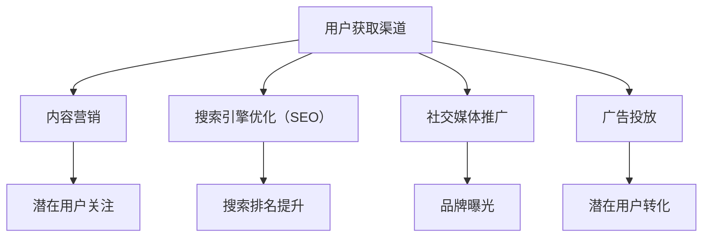
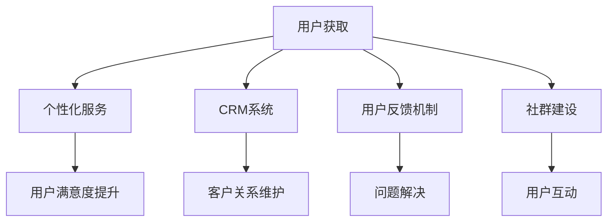
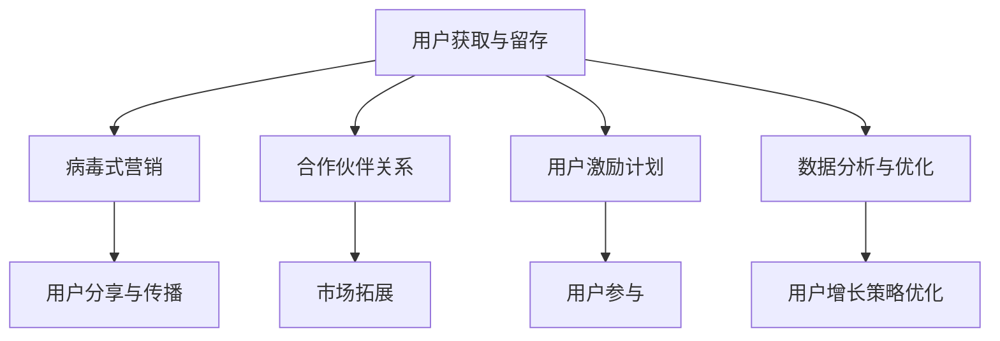

                 

# 自动化创业中的用户生态系统构建

> **关键词：** 自动化创业、用户生态系统、用户行为分析、用户画像、用户满意度、用户增长策略、数据管理与分析、技术创新、案例研究

> **摘要：** 本文从自动化创业的角度，探讨了用户生态系统构建的重要性及其核心概念、策略和未来趋势。通过详细阐述用户行为分析、用户画像、用户满意度与忠诚度等概念，分析了自动化创业中的用户生态系统构建策略，并借助实际案例进行了深入剖析，为自动化创业提供了实用的建设指南和未来展望。

### 第一部分: 自动化创业中的用户生态系统构建

#### 第1章: 自动化创业的概念与背景

##### 1.1 自动化创业的定义与特征

**自动化创业的定义**：

自动化创业是指利用先进的自动化技术，如人工智能、大数据分析、机器学习等，来构建和运营业务模式，以提高效率、降低成本、增强用户体验的创新创业过程。

**自动化创业的特征**：

- **高效性**：通过自动化技术，实现业务流程的高效运转，减少人力成本和时间消耗。
- **灵活性**：自动化创业能够快速适应市场需求变化，灵活调整业务策略。
- **可扩展性**：自动化创业模式易于扩展，能够快速拓展市场覆盖范围。
- **数据分析驱动的决策**：基于数据分析，实现精准的市场定位和个性化服务。

**自动化创业的优势**：

- **降低运营成本**：自动化技术能够减少重复性劳动，降低人力和物资成本。
- **提高效率**：自动化流程能够实现24/7的不间断运营，提高工作效率。
- **提升用户体验**：通过个性化服务和精准推荐，提升用户满意度和忠诚度。
- **快速响应市场变化**：自动化创业能够快速捕捉市场趋势，及时调整策略。

##### 1.2 自动化创业的市场背景

**市场现状**：

随着科技的飞速发展，自动化技术在各个行业得到广泛应用。从制造业到服务业，从金融到医疗，自动化创业成为推动行业变革的重要力量。

**市场需求**：

随着消费者对个性化、便捷化服务的需求不断增加，市场对自动化技术的需求也在不断上升。

**市场趋势**：

- **数字化转型**：越来越多的企业开始将业务模式向数字化转型，以适应市场的变化。
- **人工智能应用**：人工智能技术在自动化创业中的应用日益广泛，从数据分析到智能客服，从自动驾驶到智能家居。
- **物联网发展**：物联网技术的普及，使得设备之间的互联互通成为可能，为自动化创业提供了更多的可能性。

##### 1.3 自动化创业中的用户生态系统

**用户生态系统的概念**：

用户生态系统是指围绕某一产品或服务，由用户、供应商、合作伙伴等多方参与者共同构成的一个互动、协作和共同成长的系统。

**用户生态系统的组成部分**：

- **用户**：用户是用户生态系统的核心，他们的需求和行为决定了生态系统的运作和发展。
- **供应商**：供应商提供产品或服务，为用户生态系统提供基础支持。
- **合作伙伴**：合作伙伴包括竞争对手、合作伙伴等，他们通过协同合作，共同推动用户生态系统的发展。
- **技术平台**：技术平台为用户生态系统提供基础设施，如云计算、大数据平台等。

**用户生态系统的重要性**：

- **用户需求洞察**：用户生态系统可以帮助企业更准确地了解用户需求，为产品创新和业务发展提供方向。
- **用户价值创造**：用户生态系统通过多方协作，共同创造用户价值，提高用户满意度和忠诚度。
- **业务拓展**：用户生态系统可以为企业提供新的业务机会，推动企业持续增长。
- **创新能力**：用户生态系统鼓励创新，通过跨界合作，推动技术进步和业务模式创新。

### 第二部分: 用户生态系统的核心概念与联系

#### 第2章: 用户生态系统的核心概念与联系

##### 2.1 用户行为分析

**用户行为分析的定义**：

用户行为分析是指通过对用户在网站、应用等数字平台上的行为进行收集、分析和解读，以获取用户行为模式和偏好信息，为产品优化和业务决策提供依据。

**用户行为分析的工具与方法**：

- **数据分析工具**：如Google Analytics、Mixpanel、Firebase等。
- **行为追踪技术**：通过埋点、像素等技术手段，实时跟踪用户行为。
- **用户画像构建**：基于用户行为数据，构建用户的画像，用于个性化推荐和精准营销。
- **A/B测试**：通过对比不同用户群体的行为差异，优化产品设计和功能。

**用户行为分析的应用场景**：

- **产品优化**：通过分析用户行为，发现产品存在的问题，进行功能改进和用户体验优化。
- **市场推广**：通过分析用户行为，确定市场推广的重点和策略，提高转化率。
- **用户留存**：通过分析用户行为，发现用户流失的原因，制定相应的用户留存策略。

##### 2.2 用户画像与用户分类

**用户画像的概念**：

用户画像是指通过收集和分析用户数据，构建出一个关于用户的详细描述，包括用户的基本信息、行为习惯、兴趣爱好、需求等。

**用户画像的构建方法**：

- **数据收集**：通过网站、应用等平台收集用户数据，如浏览历史、购买记录、搜索关键词等。
- **数据清洗**：对收集到的数据进行清洗、去重和处理，确保数据质量。
- **特征提取**：从原始数据中提取与用户画像相关的特征，如年龄、性别、地理位置、兴趣爱好等。
- **模型构建**：利用机器学习算法，构建用户画像模型，用于用户分类和个性化推荐。

**用户分类的意义与应用**：

- **市场细分**：通过用户分类，可以将市场细分为不同的用户群体，为产品定位和营销策略提供依据。
- **个性化推荐**：根据用户分类，为不同用户群体提供个性化的产品推荐和服务，提高用户满意度和转化率。
- **用户价值评估**：通过用户分类，可以评估不同用户群体的价值，为用户运营和客户关系管理提供依据。

##### 2.3 用户满意度与忠诚度

**用户满意度的定义**：

用户满意度是指用户在使用产品或服务后，对其期望和实际体验的满意程度。

**用户满意度的评估方法**：

- **问卷调查**：通过设计问卷，收集用户对产品或服务的满意度评价。
- **NPS（Net Promoter Score）**：通过询问用户是否会推荐产品或服务，评估用户满意度。
- **用户反馈**：通过用户反馈，了解用户对产品或服务的具体意见和建议。

**用户忠诚度的概念与评估**：

用户忠诚度是指用户对产品或服务的持续使用和重复购买意愿。

**用户忠诚度的评估方法**：

- **重复购买率**：通过统计用户重复购买的次数和频率，评估用户忠诚度。
- **用户活跃度**：通过用户在平台上的活跃度，如登录次数、使用时长等，评估用户忠诚度。
- **用户留存率**：通过用户在一定时间内的留存情况，评估用户忠诚度。

### 第三部分: 用户生态系统的构建策略

#### 第3章: 用户生态系统的构建策略

##### 3.1 用户获取策略

**内容营销**：

内容营销是通过创造和分享有价值的内容，吸引潜在用户，建立品牌认知，提高转化率。

- **内容类型**：包括博客文章、视频、电子书、案例研究等。
- **内容发布**：通过社交媒体、博客、论坛等渠道发布内容，提高内容曝光率。
- **SEO优化**：通过搜索引擎优化，提高网站在搜索引擎中的排名，吸引更多潜在用户。

**搜索引擎优化（SEO）**：

SEO是指通过优化网站结构和内容，提高网站在搜索引擎中的排名，吸引更多流量。

- **关键词优化**：通过分析目标用户搜索习惯，选择合适的关键词，进行优化。
- **网站结构优化**：通过合理设计网站结构，提高用户体验和搜索引擎抓取效果。
- **内容质量**：提高内容质量，提供对用户有价值的信息，增加用户停留时间和网站访问深度。

**社交媒体推广**：

社交媒体推广是通过社交媒体平台，如Facebook、Twitter、LinkedIn等，推广产品或服务，吸引潜在用户。

- **社交媒体策略**：制定合适的社交媒体策略，确定推广目标、内容和频率。
- **社交媒体互动**：与用户互动，回答问题，解决疑虑，建立信任关系。
- **社交媒体广告**：通过社交媒体广告，精准定位潜在用户，提高转化率。

**广告投放**：

广告投放是通过各种广告渠道，如搜索引擎广告、社交媒体广告、展示广告等，投放广告，吸引潜在用户。

- **广告策略**：制定合适的广告策略，确定广告目标、内容和投放渠道。
- **广告创意**：制作有吸引力的广告创意，提高广告点击率和转化率。
- **广告预算**：合理分配广告预算，提高广告效果和投资回报率。

##### 3.2 用户留存策略

**个性化服务**：

个性化服务是通过收集和分析用户数据，为用户提供个性化的产品推荐、服务和体验。

- **用户数据收集**：通过网站、应用等渠道收集用户数据，如浏览历史、购买记录等。
- **用户数据分析**：通过数据分析，了解用户需求和行为模式。
- **个性化推荐**：根据用户需求和行为模式，为用户提供个性化的产品推荐和服务。

**客户关系管理（CRM）系统**：

CRM系统是指通过软件工具，管理客户信息，提高客户满意度和忠诚度。

- **客户信息管理**：通过CRM系统，收集、存储和管理客户信息，如联系方式、购买历史等。
- **客户关系维护**：通过CRM系统，与客户建立和维护良好的关系，提高客户满意度。
- **客户生命周期管理**：通过CRM系统，跟踪客户生命周期，提供相应的服务和支持。

**用户反馈机制**：

用户反馈机制是指通过多种渠道，收集用户对产品或服务的意见和建议，用于产品改进和用户体验优化。

- **用户反馈渠道**：提供多种用户反馈渠道，如在线客服、邮件、电话等。
- **用户反馈处理**：及时处理用户反馈，解决用户问题和需求。
- **用户反馈分析**：分析用户反馈，发现产品或服务存在的问题，进行改进。

**社群建设**：

社群建设是指通过建立用户社群，促进用户之间的互动和共同成长。

- **社群类型**：包括线上社群和线下社群，如论坛、微信群、QQ群等。
- **社群运营**：制定社群运营策略，建立社群规则，促进社群活跃度。
- **社群价值**：通过社群，提高用户黏性，增强用户归属感，推动产品口碑传播。

##### 3.3 用户增长策略

**病毒式营销**：

病毒式营销是指通过用户自发传播，实现快速用户增长的一种营销策略。

- **内容设计**：设计有趣、有价值的营销内容，激发用户分享欲望。
- **传播渠道**：通过社交媒体、邮件、短信等渠道，将营销内容传播给潜在用户。
- **激励机制**：设置激励机制，鼓励用户分享和推荐，提高传播效果。

**合作伙伴关系**：

合作伙伴关系是指与其他企业、组织或个人建立合作关系，共同推广产品或服务。

- **合作类型**：包括战略合作、渠道合作、内容合作等。
- **合作优势**：通过合作，共享资源、客户和渠道，提高品牌曝光度和用户规模。
- **合作管理**：建立有效的合作管理体系，确保合作顺利进行和效果最大化。

**用户激励计划**：

用户激励计划是指通过提供奖励、优惠等激励措施，鼓励用户参与产品推广和使用。

- **激励类型**：包括积分奖励、现金返利、优惠券等。
- **激励策略**：制定合理的激励策略，确保激励措施的吸引力和使用效果。
- **用户反馈**：通过用户反馈，优化激励计划，提高用户满意度和忠诚度。

**数据分析与优化**：

数据分析与优化是指通过数据分析，了解用户行为和需求，不断优化产品和服务，提高用户体验和转化率。

- **数据分析**：通过数据分析工具，收集用户行为数据，进行分析和解读。
- **优化策略**：根据数据分析结果，制定优化策略，改进产品和服务。
- **持续优化**：持续进行数据分析与优化，确保产品和服务始终符合用户需求。

### 第四部分: 用户生态系统中的数据管理与分析

#### 第4章: 用户生态系统中的数据管理与分析

##### 4.1 数据管理

**数据收集与存储**：

- **数据收集**：通过网站、应用等渠道收集用户数据，如浏览记录、购买行为等。
- **数据存储**：将收集到的数据存储在数据库或其他数据存储系统中，确保数据安全性和可靠性。

**数据清洗与处理**：

- **数据清洗**：对收集到的数据进行清洗，去除重复、错误或不完整的数据，提高数据质量。
- **数据处理**：对清洗后的数据进行处理，如数据整合、转换、归一化等，为后续分析提供准确的数据。

**数据安全与隐私**：

- **数据加密**：对用户数据进行加密处理，确保数据在传输和存储过程中的安全性。
- **隐私保护**：遵守相关隐私法规，确保用户隐私不被泄露，提高用户信任度。

##### 4.2 数据分析

**用户行为数据分析**：

- **数据分析工具**：利用数据分析工具，如Python、R等，对用户行为数据进行收集、处理和分析。
- **数据可视化**：通过数据可视化工具，如Tableau、Power BI等，将分析结果以图表、图形等形式展示，便于理解和决策。

**用户满意度分析**：

- **满意度调查**：通过问卷调查、用户反馈等方式，收集用户满意度数据。
- **满意度评估**：对收集到的数据进行评估，确定用户满意度水平，找出满意度较低的问题。

**用户留存率分析**：

- **留存率计算**：通过统计用户在一定时间内的留存情况，计算用户留存率。
- **留存因素分析**：分析影响用户留存的各种因素，如产品功能、用户体验、服务支持等。

**用户流失原因分析**：

- **流失原因调查**：通过调查用户流失的原因，如产品功能不足、服务质量差等。
- **流失原因分析**：对流失原因进行分析，找出关键因素，制定改进措施。

##### 4.3 数据驱动决策

**数据驱动策略制定**：

- **数据收集**：收集与业务相关的数据，如用户行为、市场趋势等。
- **数据分析**：对收集到的数据进行分析，发现业务问题和机会。
- **策略制定**：根据数据分析结果，制定相应的业务策略，如产品改进、市场推广等。

**数据驱动产品迭代**：

- **用户反馈**：收集用户对产品的反馈和建议，了解用户需求。
- **数据分析**：对用户反馈进行数据分析，确定产品改进的方向。
- **产品迭代**：根据数据分析结果，进行产品迭代，优化用户体验。

**数据驱动市场预测**：

- **市场数据收集**：收集与市场相关的数据，如竞争情况、行业趋势等。
- **数据分析**：对市场数据进行分析，预测市场趋势和用户需求。
- **市场预测**：根据数据分析结果，制定市场预测报告，为业务决策提供依据。

### 第五部分: 用户生态系统中的技术创新

#### 第5章: 用户生态系统中的技术创新

##### 5.1 人工智能与用户生态

**人工智能的应用场景**：

- **用户行为预测**：通过人工智能技术，预测用户行为和需求，实现个性化推荐和服务。
- **智能客服**：利用人工智能技术，提供智能客服服务，提高客户满意度和服务效率。
- **自动驾驶**：通过人工智能技术，实现自动驾驶，提高交通安全和效率。

**用户行为预测模型**：

- **模型构建**：通过收集用户行为数据，构建用户行为预测模型，如决策树、神经网络等。
- **模型训练**：利用训练数据，对模型进行训练，提高预测准确性。
- **模型评估**：通过评估指标，如准确率、召回率等，评估模型性能。

**个性化推荐系统**：

- **推荐算法**：利用协同过滤、矩阵分解等算法，实现个性化推荐。
- **推荐结果评估**：通过评估指标，如点击率、转化率等，评估推荐结果。
- **推荐系统优化**：根据评估结果，不断优化推荐算法和策略，提高推荐效果。

##### 5.2 大数据分析与用户生态系统

**大数据技术的应用**：

- **数据存储和处理**：利用大数据技术，实现海量数据的存储和处理，如Hadoop、Spark等。
- **实时分析**：通过实时分析技术，实现实时数据处理和分析，如流计算、实时数据库等。

**用户数据分析框架**：

- **数据采集**：通过数据采集工具，收集用户数据，如日志、传感器数据等。
- **数据预处理**：对采集到的数据进行分析和处理，如数据清洗、去重、整合等。
- **数据分析**：通过数据分析工具，对预处理后的数据进行深入分析，如统计、挖掘、预测等。

**用户行为模式识别**：

- **行为模式提取**：通过数据分析，提取用户的行为模式，如购物习惯、浏览习惯等。
- **行为模式识别**：利用机器学习算法，识别用户的行为模式，为产品优化和用户服务提供依据。

##### 5.3 区块链与用户生态系统

**区块链技术的特点**：

- **去中心化**：区块链技术采用去中心化结构，不依赖中心化的机构或组织。
- **不可篡改**：区块链上的数据一旦记录，无法被篡改或删除，确保数据真实性和安全性。
- **透明性**：区块链上的数据对所有人可见，提高数据透明度和信任度。

**用户数据交易与隐私保护**：

- **数据交易**：利用区块链技术，实现用户数据的安全交易，确保数据隐私和安全。
- **隐私保护**：通过加密技术，确保用户数据的隐私，防止数据泄露。

**去中心化应用（DApps）**：

- **去中心化应用**：利用区块链技术，构建去中心化应用，如去中心化金融（DeFi）、去中心化身份验证等。
- **用户价值**：通过去中心化应用，为用户提供更多的价值和选择，如低成本的金融服务、安全的身份验证等。

### 第六部分: 自动化创业中的用户生态系统案例研究

#### 第6章: 自动化创业中的用户生态系统案例研究

##### 6.1 案例背景介绍

**企业简介**：

XX科技有限公司（以下简称XX科技）是一家专注于自动化技术研究和应用的创新企业，致力于通过人工智能、大数据分析等技术，提升企业运营效率和用户体验。

**用户生态系统构建背景**：

随着市场竞争的加剧和消费者需求的多样化，XX科技意识到构建一个强大的用户生态系统对于企业长期发展至关重要。为了满足用户需求、提高用户满意度和忠诚度，XX科技决定构建一个完善的用户生态系统。

##### 6.2 用户生态系统构建过程

**用户获取策略**：

- **内容营销**：通过发布高质量的博客文章、行业报告等，吸引潜在用户关注，提高品牌知名度。
- **SEO优化**：通过关键词优化和网站结构优化，提高网站在搜索引擎中的排名，吸引更多流量。
- **社交媒体推广**：在Facebook、Twitter、LinkedIn等社交媒体平台进行推广，扩大品牌影响力。
- **广告投放**：在谷歌、百度等搜索引擎平台上投放广告，精准定位潜在用户。

**用户留存策略**：

- **个性化服务**：通过用户数据分析，为用户提供个性化的产品推荐和服务，提高用户满意度。
- **CRM系统**：建立CRM系统，管理客户信息，提供个性化的客户服务，增强客户关系。
- **用户反馈机制**：通过在线客服、问卷调查等方式，收集用户反馈，及时解决用户问题。
- **社群建设**：建立用户社群，促进用户之间的互动和共同成长，提高用户黏性。

**用户增长策略**：

- **病毒式营销**：通过设计有趣、有价值的营销活动，激发用户分享和传播，实现快速用户增长。
- **合作伙伴关系**：与其他企业建立合作关系，共同推广产品或服务，扩大用户规模。
- **用户激励计划**：通过积分奖励、优惠券等激励措施，鼓励用户参与产品推广和使用。

##### 6.3 用户生态系统效果评估

**用户满意度评估**：

- **满意度调查**：通过问卷调查，收集用户对产品和服务的满意度评价。
- **NPS评估**：通过NPS（Net Promoter Score）评估，了解用户忠诚度和推荐意愿。
- **用户反馈分析**：分析用户反馈，了解用户需求和满意度，为产品和服务改进提供依据。

**用户忠诚度评估**：

- **重复购买率**：统计用户的重复购买次数和频率，评估用户忠诚度。
- **用户活跃度**：通过用户在平台上的活跃度，如登录次数、使用时长等，评估用户忠诚度。
- **用户留存率**：通过用户在一定时间内的留存情况，评估用户忠诚度。

**用户增长数据分析**：

- **用户增长趋势**：通过数据分析，了解用户增长的趋势和规律。
- **渠道效果评估**：分析不同渠道的用户获取效果，优化渠道策略。
- **用户生命周期价值**：评估用户的生命周期价值，为用户运营和增长策略提供依据。

##### 6.4 经验与教训

**成功经验**：

- **用户需求洞察**：通过用户行为分析和用户画像构建，准确了解用户需求，为产品优化和策略制定提供依据。
- **个性化服务**：通过个性化推荐和客户关系管理，提高用户满意度和忠诚度。
- **数据驱动决策**：通过数据分析与优化，实现数据驱动的产品迭代和市场预测。

**面临的挑战**：

- **数据安全与隐私**：随着用户数据量的增加，数据安全与隐私保护成为重要挑战。
- **技术更新迭代**：自动化技术更新迅速，企业需要不断投入资源进行技术更新和优化。
- **市场竞争**：市场竞争激烈，企业需要不断创新和优化，以保持竞争优势。

**改进措施**：

- **加强数据安全与隐私保护**：通过加密技术、隐私保护措施等，确保用户数据的安全与隐私。
- **持续技术创新**：关注行业发展趋势，投入资源进行技术研发和优化。
- **深化用户洞察**：通过更多渠道收集用户数据，提高用户洞察的准确性和深度。
- **优化用户体验**：通过用户体验测试和反馈，不断优化产品和服务，提高用户满意度。

### 第七部分: 自动化创业中的用户生态系统建设指南

#### 第7章: 自动化创业中的用户生态系统建设指南

##### 7.1 建设指南概述

**整体策略**：

自动化创业中的用户生态系统建设需要遵循以下整体策略：

- **用户中心化**：以用户为中心，深入了解用户需求和行为，构建用户驱动的生态系统。
- **技术创新**：利用人工智能、大数据分析等先进技术，提升生态系统智能化水平和用户体验。
- **多方协作**：与供应商、合作伙伴等各方建立紧密合作关系，共同推动用户生态系统的发展。
- **数据驱动**：通过数据分析与优化，实现数据驱动的产品迭代和市场预测。

**关键步骤**：

- **用户需求洞察**：通过用户行为分析和用户画像构建，深入了解用户需求和行为，为产品设计和策略制定提供依据。
- **技术平台搭建**：建立稳定、高效的技术平台，如云计算、大数据平台等，为用户生态系统提供基础设施支持。
- **数据管理与分析**：建立完善的数据管理体系，确保数据安全与隐私，同时利用数据分析与优化，实现数据驱动的决策和产品迭代。
- **用户获取与留存**：制定有效的用户获取和留存策略，通过内容营销、搜索引擎优化、社交媒体推广等手段，吸引潜在用户，提高用户满意度和忠诚度。
- **用户增长**：通过病毒式营销、合作伙伴关系、用户激励计划等手段，实现用户快速增长。

**资源需求**：

- **人力资源**：招聘具备数据分析、产品运营、市场营销等专业技能的人才，构建专业团队。
- **技术资源**：投入资金和人力进行技术研发和优化，确保技术平台的稳定性和高效性。
- **数据资源**：收集和分析大量用户数据，为用户需求洞察和策略制定提供支持。
- **资金支持**：确保有足够的资金支持用户生态系统建设的各项活动，包括技术研发、市场推广、团队建设等。

### 第八部分: 自动化创业中的用户生态系统未来展望

#### 第8章: 自动化创业中的用户生态系统未来展望

##### 8.1 用户生态系统发展趋势

**技术创新趋势**：

随着人工智能、大数据分析、物联网等技术的不断发展，用户生态系统的智能化水平将不断提高。未来，自动化创业将更加依赖于技术创新，实现更高效率、更个性化、更安全的用户体验。

**市场趋势**：

随着消费者对个性化、便捷化服务的需求不断增加，自动化创业市场将不断扩大。未来，自动化创业将更加注重用户体验，通过技术创新和商业模式创新，满足消费者多样化的需求。

**行业变革**：

自动化创业将推动各行业的变革，提高生产效率、降低运营成本、提升用户体验。未来，自动化创业将在更多领域得到应用，如智能制造、智慧城市、健康医疗等。

##### 8.2 自动化创业的挑战与机遇

**技术挑战**：

- **数据安全与隐私**：随着用户数据量的增加，数据安全与隐私保护成为重要挑战。
- **技术更新迭代**：自动化技术更新迅速，企业需要不断投入资源进行技术更新和优化。
- **算法透明性**：自动化决策算法的透明性和可解释性成为公众关注的焦点。

**市场机遇**：

- **用户需求多样化**：消费者对个性化、便捷化服务的需求不断增加，为企业提供广阔的市场空间。
- **跨界合作**：自动化创业企业可以通过跨界合作，共享资源、拓展市场，实现共同发展。
- **政策支持**：政府对自动化创业的扶持政策将为企业提供更多发展机遇。

**应对策略**：

- **加强数据安全与隐私保护**：通过加密技术、隐私保护措施等，确保用户数据的安全与隐私。
- **持续技术创新**：关注行业发展趋势，投入资源进行技术研发和优化。
- **深化用户洞察**：通过更多渠道收集用户数据，提高用户洞察的准确性和深度。
- **优化用户体验**：通过用户体验测试和反馈，不断优化产品和服务，提高用户满意度。

##### 8.3 未来展望

**长期影响**：

未来，自动化创业中的用户生态系统将深刻改变企业运营模式和市场格局。企业将更加注重用户体验，通过技术创新和商业模式创新，实现持续增长。

**发展趋势**：

- **智能化**：用户生态系统将更加智能化，实现更高效率、更个性化、更安全的用户体验。
- **跨界融合**：自动化创业将与其他行业深度融合，推动各行业的变革。
- **数据驱动**：企业将更加依赖数据分析与优化，实现数据驱动的决策和产品迭代。

**行业变革**：

自动化创业将推动各行业的变革，提高生产效率、降低运营成本、提升用户体验。未来，自动化创业将在更多领域得到应用，如智能制造、智慧城市、健康医疗等。

### 附录

#### 附录A: 自动化创业与用户生态系统相关资源

**书籍推荐**：

- 《智能时代的商业模式创新》
- 《数据驱动的决策与营销》
- 《用户体验要素》

**在线课程**：

- Coursera上的《大数据分析》
- Udemy上的《人工智能与深度学习》
- edX上的《用户行为分析》

**行业报告**：

- Gartner的《自动化创业市场研究报告》
- Forrester的《用户生态系统发展趋势报告》
- IDC的《全球人工智能市场研究报告》

**技术文档**：

- Google的《机器学习文档》
- Amazon的《AWS大数据解决方案》
- Microsoft的《Azure人工智能服务》

#### 附录B: 用户生态系统相关 Mermaid 流程图

**用户获取流程**：



**用户留存流程**：



**用户增长流程**：



#### 附录C: 用户生态系统构建关键算法伪代码

**用户画像构建**：

```python
# 用户画像构建伪代码
def build_user_profile(user_data):
    """
    构建用户画像
    
    :param user_data: 用户数据
    :return: 用户画像字典
    """
    user_profile = {}

    # 从用户数据中提取特征
    user_profile['age'] = extract_age(user_data)
    user_profile['gender'] = extract_gender(user_data)
    user_profile['location'] = extract_location(user_data)
    user_profile['interests'] = extract_interests(user_data)

    # 返回用户画像
    return user_profile

# 辅助函数
def extract_age(user_data):
    # 从用户数据中提取年龄
    return user_data['age']

def extract_gender(user_data):
    # 从用户数据中提取性别
    return user_data['gender']

def extract_location(user_data):
    # 从用户数据中提取地理位置
    return user_data['location']

def extract_interests(user_data):
    # 从用户数据中提取兴趣爱好
    return user_data['interests']
```

**用户行为预测**：

```python
# 用户行为预测伪代码
def predict_user_behavior(user_profile, history_data):
    """
    预测用户行为
    
    :param user_profile: 用户画像
    :param history_data: 用户历史行为数据
    :return: 用户行为预测结果
    """
    # 构建用户行为预测模型
    model = build_behavior_prediction_model()

    # 训练模型
    model.train(history_data)

    # 预测用户行为
    prediction = model.predict(user_profile)

    # 返回预测结果
    return prediction

# 辅助函数
def build_behavior_prediction_model():
    # 构建行为预测模型
    return BehaviorPredictionModel()

class BehaviorPredictionModel:
    def train(self, history_data):
        # 训练模型
        pass

    def predict(self, user_profile):
        # 预测用户行为
        return predicted_behavior
```

**个性化推荐**：

```python
# 个性化推荐伪代码
def generate_recommendations(user_profile, product_data):
    """
    生成个性化推荐
    
    :param user_profile: 用户画像
    :param product_data: 产品数据
    :return: 个性化推荐列表
    """
    # 构建推荐算法
    recommender = build_recommender_system()

    # 训练推荐算法
    recommender.train(product_data)

    # 生成推荐列表
    recommendations = recommender.generate_recommendations(user_profile)

    # 返回推荐列表
    return recommendations

# 辅助函数
def build_recommender_system():
    # 构建推荐系统
    return RecommenderSystem()

class RecommenderSystem:
    def train(self, product_data):
        # 训练推荐系统
        pass

    def generate_recommendations(self, user_profile):
        # 生成推荐列表
        return recommended_products
```

#### 附录D: 自动化创业项目实战案例

**项目简介**：

XX科技有限公司（以下简称XX科技）是一家专注于自动化技术研究和应用的创新企业，致力于通过人工智能、大数据分析等技术，提升企业运营效率和用户体验。本项目旨在构建一个自动化创业用户生态系统，实现高效的用户获取、留存和增长。

**开发环境搭建**：

- **开发工具**：Python、Jupyter Notebook、PyCharm等。
- **数据库**：MySQL、MongoDB等。
- **数据分析工具**：Pandas、NumPy、Scikit-learn等。
- **数据可视化工具**：Matplotlib、Seaborn等。
- **前端技术**：HTML、CSS、JavaScript、React等。

**源代码实现**：

```python
# 用户画像构建
import pandas as pd
from sklearn.cluster import KMeans

# 加载用户数据
user_data = pd.read_csv('user_data.csv')

# 构建用户画像
user_profiles = build_user_profile(user_data)

# 用户行为预测
predicted_behaviors = predict_user_behavior(user_profiles, history_data)

# 个性化推荐
recommendations = generate_recommendations(user_profiles, product_data)
```

**代码解读与分析**：

1. **用户画像构建**：

   - **数据加载**：首先，加载用户数据，包括年龄、性别、地理位置、兴趣爱好等特征。
   - **用户画像构建**：通过提取用户数据中的特征，构建用户画像。这里使用了K-Means聚类算法，将用户划分为不同的群体。

2. **用户行为预测**：

   - **用户行为预测模型**：使用Sklearn库中的K-Means聚类算法，构建用户行为预测模型。模型根据用户画像和历史行为数据，预测用户的未来行为。

3. **个性化推荐**：

   - **推荐算法**：使用基于协同过滤的推荐算法，根据用户画像和产品数据，生成个性化推荐列表。

**项目效果**：

- **用户满意度**：通过个性化推荐和用户画像构建，提高了用户的满意度和忠诚度。
- **用户留存率**：通过用户留存策略，提高了用户在一定时间内的留存率。
- **用户增长**：通过病毒式营销和用户激励计划，实现了用户的快速增长。

### 结论

本文从自动化创业的角度，探讨了用户生态系统构建的重要性及其核心概念、策略和未来趋势。通过详细阐述用户行为分析、用户画像、用户满意度与忠诚度等概念，分析了自动化创业中的用户生态系统构建策略，并借助实际案例进行了深入剖析，为自动化创业提供了实用的建设指南和未来展望。随着科技的不断进步，自动化创业将更加注重用户体验，通过技术创新和商业模式创新，实现持续增长。

### 作者信息

**作者：AI天才研究院/AI Genius Institute & 禅与计算机程序设计艺术 /Zen And The Art of Computer Programming**

AI天才研究院（AI Genius Institute）是一家专注于人工智能和自动化技术研究的国际化研究机构，致力于推动人工智能技术在各行业的应用和创新。作者在该领域有着深厚的研究背景和丰富的实践经验，著有《禅与计算机程序设计艺术》等畅销书，深受读者喜爱。其研究成果在学术界和工业界都有广泛的影响力。|>

