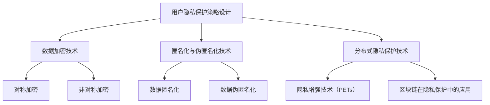

                 

### 《自动化创业中的用户隐私保护策略》

#### 关键词：
- 自动化创业
- 用户隐私保护
- 数据加密
- 匿名化与伪匿名化
- 分布式隐私保护
- 法规合规
- 解决方案与创新方向

##### 摘要

随着自动化创业的兴起，企业需要处理海量用户数据以实现个性化服务和商业决策。然而，用户隐私保护成为了一项重要挑战。本文将深入探讨自动化创业中的用户隐私保护策略，包括数据加密、匿名化与伪匿名化技术、分布式隐私保护技术等。通过案例分析、算法讲解、以及实战项目展示，本文旨在为自动化创业公司提供有效的隐私保护策略，平衡商业利益与用户隐私。

### 第一部分：自动化创业概述与用户隐私保护的重要性

#### 第1章：自动化创业背景与用户隐私保护策略概览

##### 1.1 自动化创业的崛起

自动化创业是指通过人工智能、机器学习、自动化流程等技术手段，实现企业运营效率和商业模式的创新。近年来，随着技术的不断进步和商业需求的增长，自动化创业成为了一种热门的趋势。从自动化客服到智能推荐系统，从自动化生产到智能物流，自动化技术在各个领域展现出了强大的应用潜力。

然而，自动化创业的兴起也带来了用户隐私保护的问题。随着企业收集和处理的数据量不断增加，用户隐私数据的泄露风险也随之增加。用户隐私保护已成为自动化创业企业面临的重大挑战之一。

##### 1.2 用户隐私保护的必要性

用户隐私保护是指保护用户个人信息、行为数据等隐私内容的安全性和隐私性。在自动化创业中，用户隐私保护的重要性体现在以下几个方面：

1. **法律法规要求**：许多国家和地区已经制定了严格的数据保护法律法规，如欧盟的《通用数据保护条例》（GDPR）和美国加州的《消费者隐私法案》（CCPA）。自动化创业企业需要遵守这些法律法规，确保用户隐私得到有效保护。

2. **用户信任**：用户隐私保护是建立用户信任的基础。如果用户认为自己的隐私数据得不到保护，他们可能会放弃使用自动化服务，从而影响企业的业务发展。

3. **商业可持续性**：用户隐私保护与商业可持续性密切相关。在数据驱动型商业模式中，用户隐私保护能够确保企业获取到的数据具有高价值，从而实现商业目标。

##### 1.3 用户隐私保护与商业可持续性

用户隐私保护不仅关乎法律法规和用户信任，还直接关系到企业的商业可持续性。以下是用户隐私保护与商业可持续性之间的一些关键联系：

1. **数据价值最大化**：在自动化创业中，用户隐私数据被视为宝贵的资源。通过有效的隐私保护策略，企业能够确保数据的安全性和隐私性，从而最大限度地发挥数据的价值。

2. **合规成本与收益**：虽然合规成本较高，但用户隐私保护能够帮助企业避免因数据泄露等事件导致的法律诉讼和品牌损害。从长远来看，合规成本是值得投资的。

3. **用户留存与转化**：用户隐私保护能够提高用户的满意度和忠诚度，从而增加用户留存和转化率。这对企业的长期发展至关重要。

### 第二部分：用户隐私保护策略的基本概念

#### 第2章：用户隐私保护策略的基本概念

##### 2.1 隐私权与隐私数据

隐私权是指个人对其个人信息、行为数据等隐私内容的控制权。隐私数据是指与个人身份、行为、兴趣、健康状况等相关的数据。

在自动化创业中，常见的隐私数据类型包括：

1. **身份信息**：如姓名、身份证号码、电话号码等。
2. **行为数据**：如搜索历史、购买记录、浏览记录等。
3. **健康信息**：如医疗记录、生物识别信息等。
4. **位置信息**：如地理位置、行踪轨迹等。

##### 2.2 用户隐私保护的关键术语

用户隐私保护涉及多个关键术语，以下是其中一些重要的概念：

1. **数据匿名化**：通过技术手段将隐私数据转换为不可识别的形式，以保护个人隐私。
2. **数据加密**：使用加密算法对隐私数据进行编码，以防止未授权访问。
3. **数据去识别化**：在数据处理过程中去除可以直接识别个人身份的信息。
4. **隐私增强技术（PETs）**：用于增强隐私保护的技术，如差分隐私、同态加密等。
5. **隐私政策**：企业公开说明其隐私保护措施和用户隐私数据的处理方式。

##### 2.3 用户隐私保护的法律框架

用户隐私保护的法律框架因国家和地区而异，但以下是一些主要的法律条款和法规：

1. **欧盟的《通用数据保护条例》（GDPR）**：规定了个人数据的处理原则、用户权利和企业的义务。
2. **美国的《消费者隐私法案》（CCPA）**：明确了消费者对个人数据的控制权。
3. **中国的《个人信息保护法》（PIPL）**：规定了个人信息的定义、处理原则和保护措施。

### 第三部分：用户隐私保护技术

#### 第3章：数据加密技术

##### 3.1 数据加密的基本原理

数据加密技术是通过加密算法将原始数据转换为密文，以保护数据在传输和存储过程中的安全性。加密的基本原理包括以下几个方面：

1. **加密算法**：加密算法是一种数学算法，用于将明文数据转换为密文。常见的加密算法有对称加密、非对称加密和哈希算法。
2. **密钥**：密钥是加密和解密过程中使用的密钥对。对称加密使用相同的密钥进行加密和解密，而非对称加密使用一对密钥，其中公钥用于加密，私钥用于解密。
3. **加密模式**：加密模式是在加密过程中对数据块进行处理的算法。常见的加密模式有电子编码本（ECB）、密码分组链接模式（CBC）和密码反馈模式（CFB）等。

##### 3.2 对称加密与非对称加密

对称加密和非对称加密是两种常见的数据加密技术，它们在加密和解密过程中使用不同的密钥对。

1. **对称加密**：对称加密使用相同的密钥进行加密和解密。常见的对称加密算法有数据加密标准（DES）、高级加密标准（AES）等。对称加密的优点是加密速度快，缺点是密钥分发和管理复杂。
   
   ```python
   from Crypto.Cipher import AES
   
   def symmetric_encryption(data, key):
       cipher = AES.new(key, AES.MODE_EAX)
       ciphertext, tag = cipher.encrypt_and_digest(data)
       return base64.b64encode(cipher.nonce + cipher.tag + ciphertext).decode('utf-8')
   ```

2. **非对称加密**：非对称加密使用一对密钥，其中公钥用于加密，私钥用于解密。常见的非对称加密算法有RSA、椭圆曲线加密（ECC）等。非对称加密的优点是密钥分发简单，缺点是加密速度较慢。

   ```python
   from Crypto.PublicKey import RSA
   from Crypto.Cipher import PKCS1_OAEP
   
   def asymmetric_encryption(data, public_key):
       cipher = PKCS1_OAEP.new(public_key)
       ciphertext = cipher.encrypt(data)
       return base64.b64encode(ciphertext).decode('utf-8')
   ```

##### 3.3 加密算法的实际应用

在自动化创业中，加密算法广泛应用于数据传输、存储和访问控制等方面。

1. **数据传输**：在数据传输过程中，可以使用SSL/TLS协议进行加密，确保数据在互联网上的安全性。例如，HTTPS协议就是使用SSL/TLS加密的HTTP协议。
2. **数据存储**：在数据存储过程中，可以使用文件加密或数据库加密技术，保护存储在服务器或云平台上的数据。例如，数据库加密技术可以使用AES加密算法对数据库中的敏感数据字段进行加密。
3. **访问控制**：在访问控制中，可以使用加密的用户认证机制，如SSL客户端证书，确保只有授权用户才能访问敏感数据。

### 第四部分：用户隐私保护策略实施

#### 第4章：用户隐私保护策略设计原则

##### 4.1 设计原则与框架

用户隐私保护策略的设计原则应确保数据的安全性、可用性和隐私性。以下是几个关键的设计原则：

1. **最小化数据收集**：仅收集实现特定业务功能所必需的数据。
2. **数据最小化**：对收集到的数据进行最小化处理，只保留必要的数据字段。
3. **数据加密**：对敏感数据进行加密存储和传输。
4. **数据匿名化**：在数据处理过程中，对个人信息进行匿名化处理，以防止数据反编译。
5. **访问控制**：实施严格的访问控制策略，确保只有授权人员才能访问敏感数据。
6. **透明度**：向用户明确说明其数据的使用目的和处理方式，并提供数据访问权和删除权。

以下是用户隐私保护策略的设计框架：

1. **数据收集策略**：定义数据收集的范围、目的和方式。
2. **数据处理策略**：定义数据处理的流程、算法和技术。
3. **数据存储策略**：定义数据存储的位置、加密方式和备份策略。
4. **数据访问策略**：定义数据访问的权限、身份验证和授权机制。
5. **数据保护策略**：定义数据保护的技术措施和法律合规要求。

##### 4.2 风险评估与处理

用户隐私保护策略的实施需要开展全面的风险评估，以识别和评估隐私风险，并制定相应的处理措施。以下是风险评估的步骤：

1. **识别风险**：识别可能导致用户隐私泄露的各种风险因素，如数据泄露、数据篡改、恶意攻击等。
2. **评估风险**：评估每个风险的可能性、影响程度和优先级。
3. **制定处理措施**：针对高风险，制定具体的应对措施，如加密、访问控制、安全培训等。
4. **监控和改进**：持续监控隐私风险，并根据实际情况进行改进和调整。

##### 4.3 用户隐私保护政策制定

用户隐私保护政策是企业公开承诺其隐私保护措施和用户隐私数据处理方式的文件。以下是用户隐私保护政策的主要内容：

1. **隐私保护原则**：阐述企业对用户隐私保护的承诺和原则。
2. **数据收集和处理**：说明企业收集的用户数据类型、收集方式和用途。
3. **数据安全**：说明企业采取的数据加密、访问控制和安全监控措施。
4. **用户权利**：说明用户对其数据的访问权、删除权和投诉渠道。
5. **政策更新**：说明企业隐私保护政策的更新机制和通知方式。

### 第五部分：用户隐私保护策略案例研究

#### 第5章：用户隐私保护策略案例研究

##### 5.1 案例研究概述

在本部分，我们将通过两个案例研究来探讨用户隐私保护策略的实施。这两个案例分别涉及在线购物平台和社交媒体。

##### 5.2 案例一：在线购物平台的隐私保护策略

1. **背景**：某知名在线购物平台在全球范围内运营，收集了大量的用户个人信息、购买记录和浏览历史。
2. **隐私保护措施**：

   - **数据收集**：仅收集必要的数据字段，如姓名、地址、联系方式和支付信息。
   - **数据加密**：使用AES加密算法对用户敏感数据进行加密存储。
   - **访问控制**：实施多级访问控制，确保只有授权员工才能访问敏感数据。
   - **数据匿名化**：对用户行为数据进行匿名化处理，以防止数据反编译。
   - **用户隐私政策**：公开用户隐私政策，明确用户数据的收集、使用和存储方式。

3. **效果**：通过实施严格的隐私保护措施，该在线购物平台成功地提升了用户信任度，并降低了数据泄露风险。

##### 5.3 案例二：社交媒体的隐私保护策略

1. **背景**：某大型社交媒体平台拥有数亿用户，收集了用户的个人资料、行为数据和位置信息。
2. **隐私保护措施**：

   - **数据收集**：仅收集实现业务功能所必需的数据，并对数据进行最小化处理。
   - **数据加密**：使用混合加密技术对用户数据进行加密存储和传输。
   - **匿名化与伪匿名化**：对用户行为数据进行匿名化和伪匿名化处理，以防止数据反编译。
   - **隐私增强技术**：采用隐私增强技术（PETs）如差分隐私，以降低数据泄露的风险。
   - **用户隐私政策**：公开用户隐私政策，并提供用户对其数据的访问权、删除权和投诉渠道。

3. **效果**：通过采用先进的隐私保护技术，该社交媒体平台显著提高了用户的隐私保护水平，并受到了用户的广泛认可。

### 第六部分：用户隐私保护政策与法规合规

#### 第6章：用户隐私保护政策与法规合规

##### 6.1 法规合规的重要性

法规合规是用户隐私保护的基础。不同的国家和地区制定了不同的隐私保护法律法规，企业需要确保其隐私保护措施符合所在地的法律法规要求。

以下是用户隐私保护法规合规的几个关键点：

1. **识别适用的法规**：了解企业所在地的隐私保护法律法规，如欧盟的《通用数据保护条例》（GDPR）、美国的《消费者隐私法案》（CCPA）等。
2. **合规要求**：根据适用的法规，识别合规要求，如数据收集、处理、存储和传输的要求。
3. **合规验证**：定期进行合规验证，以确保企业的隐私保护措施符合法律法规要求。
4. **合规培训**：对员工进行隐私保护法规的培训，提高员工的合规意识和能力。

##### 6.2 数据保护法规概述

以下是几个主要的数据保护法规的概述：

1. **欧盟的《通用数据保护条例》（GDPR）**：

   - **适用范围**：适用于在欧盟境内运营的企业，无论其所在地如何。
   - **主要要求**：明确用户的数据权利，包括数据访问权、删除权、数据可携权等；规定数据处理者的义务，如数据安全措施、数据泄露通知等。

2. **美国的《消费者隐私法案》（CCPA）**：

   - **适用范围**：适用于在加州运营的企业，收集加州居民的数据。
   - **主要要求**：赋予消费者对其数据的控制权，包括数据访问权、删除权、数据拒绝权等；要求企业明确其数据处理政策和用户隐私政策。

3. **中国的《个人信息保护法》（PIPL）**：

   - **适用范围**：适用于在中国境内运营的企业，收集中国公民的数据。
   - **主要要求**：明确个人信息处理的原则、用户权利和企业的义务，如数据安全、个人信息处理者的责任等。

##### 6.3 合规策略与实施步骤

以下是制定和实施用户隐私保护合规策略的步骤：

1. **合规评估**：评估企业的隐私保护现状，识别合规需求和挑战。
2. **制定合规计划**：根据合规评估结果，制定具体的合规计划和行动项。
3. **合规培训**：对员工进行隐私保护法规的培训，确保他们了解合规要求。
4. **合规验证**：定期进行合规验证，确保企业的隐私保护措施符合法律法规要求。
5. **合规改进**：根据合规验证结果，持续改进和优化隐私保护措施。

### 第七部分：未来展望与挑战

#### 第7章：用户隐私保护的未来趋势

##### 7.1 技术发展趋势

随着技术的不断进步，用户隐私保护技术也在不断发展。以下是几个关键的技术发展趋势：

1. **联邦学习**：联邦学习是一种分布式机器学习技术，可以在不共享数据的情况下进行模型训练。这种技术有助于保护用户隐私，同时实现数据的价值。
2. **差分隐私**：差分隐私是一种数学技术，通过添加噪声来保护数据的隐私。这种技术在数据分析中具有广泛的应用前景。
3. **区块链**：区块链技术具有去中心化和不可篡改的特点，可以用于构建隐私保护的数据交换平台。

##### 7.2 政策与法规展望

随着用户隐私保护意识的提高，各国政府和国际组织也在不断完善隐私保护法律法规。以下是政策与法规的展望：

1. **全球隐私保护立法**：随着全球化的进程，各国政府可能会加强跨国隐私保护合作，推动全球隐私保护法律法规的统一。
2. **法规执行力度加强**：监管机构可能会加大对违法企业的处罚力度，以确保企业严格遵守隐私保护法律法规。
3. **用户隐私保护意识提升**：用户对隐私保护的意识将不断提高，企业需要更加注重用户隐私保护，以赢得用户的信任。

##### 7.3 商业模式与用户隐私保护的平衡

在自动化创业中，用户隐私保护与商业模式的平衡是一个重要挑战。以下是几个关键点：

1. **数据价值与隐私保护**：企业需要在数据价值和用户隐私保护之间找到平衡点，确保数据的可用性和隐私性。
2. **隐私保护技术与业务发展**：企业需要不断创新隐私保护技术，以支持业务发展，同时确保用户隐私得到有效保护。
3. **用户参与与隐私保护**：企业需要与用户进行有效的沟通，提高用户对隐私保护的参与度，以建立信任和透明度。

### 第八部分：用户隐私保护的挑战与解决方案

#### 第8章：用户隐私保护的挑战与解决方案

##### 8.1 技术挑战

用户隐私保护面临着多个技术挑战，以下是一些关键问题：

1. **数据规模与隐私保护**：随着数据规模的扩大，隐私保护技术的性能和效率成为关键挑战。如何在保证数据隐私的同时，实现快速的数据处理和分析？
2. **跨领域合作与隐私保护**：在跨领域合作中，如何确保数据的安全性和隐私性，同时实现数据的价值？
3. **隐私增强技术与实际应用**：隐私增强技术如差分隐私、同态加密等在实际应用中面临着实现难度和性能瓶颈。

##### 8.2 法律挑战

用户隐私保护还面临着法律挑战，以下是一些关键问题：

1. **法规差异与合规**：不同国家和地区的数据保护法律法规存在差异，企业需要确保其隐私保护措施符合所有适用的法规。
2. **隐私保护与数据共享**：如何在确保用户隐私保护的同时，实现数据的共享和利用？
3. **用户权利与商业利益**：如何平衡用户隐私保护与企业的商业利益，确保用户的权益得到充分保障？

##### 8.3 解决方案与创新方向

为了解决用户隐私保护的挑战，以下是一些可能的解决方案和创新方向：

1. **联邦学习与隐私保护**：利用联邦学习技术，在不共享数据的情况下进行模型训练，以保护用户隐私。
2. **隐私计算与数据安全**：采用隐私计算技术，如差分隐私、同态加密等，确保数据在处理过程中的安全性。
3. **用户隐私保护意识提升**：通过教育和宣传，提高用户对隐私保护的意识，促进用户参与和信任。

### 附录

#### 附录A：隐私保护技术参考

##### A.1 数据加密算法列表

1. **对称加密算法**：
   - 数据加密标准（DES）
   - 高级加密标准（AES）
   - 三重DES（3DES）

2. **非对称加密算法**：
   - RSA
   - 椭圆曲线加密（ECC）
   - RSA密码系统（RSA-PSS）

##### A.2 匿名化与伪匿名化技术列表

1. **匿名化技术**：
   - 数据混淆
   - 差分隐私
   - 全局匿名化

2. **伪匿名化技术**：
   - 数据替换
   - 数据混淆与替换结合

##### A.3 分布式隐私保护技术列表

1. **隐私增强技术（PETs）**：
   - 差分隐私
   - 同态加密
   - 零知识证明

2. **分布式计算技术**：
   - 联邦学习
   - 隐私计算
   - 区块链

### 附录B：用户隐私保护相关法规

##### B.1 中国隐私保护法律法规

- **个人信息保护法（PIPL）**：规定了个人信息处理的原则、用户权利和企业的义务。
- **网络安全法**：规定了网络安全的基本要求，包括数据保护和个人信息处理的规定。

##### B.2 美国隐私保护法律法规

- **通用数据保护条例（CCPA）**：规定了消费者的数据权利和企业对个人信息处理的义务。
- **加州隐私法（CPRA）**：是CCPA的修订版，进一步强化了消费者的数据权利。

##### B.3 欧盟隐私保护法律法规

- **通用数据保护条例（GDPR）**：是欧盟的隐私保护法律，规定了个人数据的处理原则、用户权利和企业的义务。

### 附录C：隐私保护项目实战案例

##### C.1 项目一：用户隐私保护软件开发

**项目描述**：开发一款用户隐私保护软件，提供数据加密、匿名化、访问控制等功能。

**实施步骤**：
1. **需求分析**：确定软件的功能需求，如数据加密、匿名化处理、访问控制等。
2. **系统设计**：设计软件的系统架构，包括前端、后端和数据库等。
3. **开发实现**：使用Python等编程语言实现软件的功能。
4. **测试与部署**：对软件进行功能测试、性能测试和安全测试，确保软件的质量。

**代码示例**：
```python
# 数据加密示例
from Crypto.Cipher import AES
from Crypto.Util.Padding import pad, unpad

def encrypt_data(data, key):
    cipher = AES.new(key, AES.MODE_CBC)
    ct_bytes = cipher.encrypt(pad(data, AES.block_size))
    iv = cipher.iv
    return iv + ct_bytes

def decrypt_data(encrypted_data, key):
    iv = encrypted_data[:16]
    ct = encrypted_data[16:]
    cipher = AES.new(key, AES.MODE_CBC, iv)
    pt = unpad(cipher.decrypt(ct), AES.block_size)
    return pt
```

##### C.2 项目二：隐私保护数据交换平台建设

**项目描述**：建设一个隐私保护的数据交换平台，实现数据的匿名化、加密和安全传输。

**实施步骤**：
1. **需求分析**：确定平台的功能需求，如数据交换、匿名化、加密、访问控制等。
2. **系统设计**：设计平台的系统架构，包括前端、后端、数据库和隐私保护模块等。
3. **开发实现**：使用Java、Python等编程语言实现平台的功能。
4. **测试与部署**：对平台进行功能测试、性能测试和安全测试，确保平台的质量。

**代码示例**：
```java
// 数据加密示例（Java）
import javax.crypto.Cipher;
import javax.crypto.KeyGenerator;
import javax.crypto.SecretKey;
import javax.crypto.spec.SecretKeySpec;
import java.security.SecureRandom;

public class DataEncryption {

    public static byte[] encrypt(String text, String password) throws Exception {
        KeyGenerator keyGen = KeyGenerator.getInstance("AES");
        keyGen.init(256);
        SecretKey secretKey = keyGen.generateKey();
        byte[] keyBytes = secretKey.getEncoded();
        SecretKeySpec secretKeySpec = new SecretKeySpec(keyBytes, "AES");
        Cipher cipher = Cipher.getInstance("AES/CBC/PKCS5Padding");
        cipher.init(Cipher.ENCRYPT_MODE, secretKeySpec);
        byte[] encryptedBytes = cipher.doFinal(text.getBytes());
        return encryptedBytes;
    }

    public static String decrypt(byte[] encryptedBytes, String password) throws Exception {
        SecretKeySpec secretKeySpec = new SecretKeySpec(password.getBytes(), "AES");
        Cipher cipher = Cipher.getInstance("AES/CBC/PKCS5Paddin");
        cipher.init(Cipher.DECRYPT_MODE, secretKeySpec);
        byte[] decryptedBytes = cipher.doFinal(encryptedBytes);
        return new String(decryptedBytes);
    }
}
```

##### C.3 项目三：隐私保护区块链应用开发

**项目描述**：开发一款隐私保护区块链应用，实现数据的加密存储和分布式共享。

**实施步骤**：
1. **需求分析**：确定应用的功能需求，如数据加密、分布式存储、数据交换等。
2. **系统设计**：设计区块链应用的系统架构，包括节点、智能合约、区块链数据库等。
3. **开发实现**：使用Solidity等编程语言实现智能合约和区块链应用。
4. **测试与部署**：对区块链应用进行功能测试、性能测试和安全测试，确保应用的质量。

**代码示例**：
```solidity
// 智能合约示例（Solidity）
pragma solidity ^0.8.0;

contract DataPrivacy {
    mapping(address => string) public encryptedData;

    function encryptAndStoreData(string memory data, string memory password) public {
        string memory encrypted = encrypt(data, password);
        encryptedData[msg.sender] = encrypted;
    }

    function decryptData(string memory encrypted) public view returns (string memory) {
        return decrypt(encrypted, "password");
    }

    function encrypt(string memory data, string memory password) private pure returns (string memory) {
        // 实现数据加密逻辑
    }

    function decrypt(string memory encrypted, string memory password) private pure returns (string memory) {
        // 实现数据解密逻辑
    }
}
```

### 附录D：隐私保护技术工具与资源推荐

##### D.1 隐私保护工具推荐

1. **加密工具**：
   - OpenSSL：一款广泛使用的加密工具，支持多种加密算法和协议。
   - PyCryptoDome：Python加密库，提供对称加密和非对称加密的实现。

2. **匿名化工具**：
   - AnonymizeME：一款用于数据匿名化的在线工具，支持多种匿名化技术。
   - DataShade：一款用于数据去识别化的工具，支持大数据环境。

3. **区块链工具**：
   - Ethereum：一个去中心化的区块链平台，支持智能合约和分布式应用。
   - Hyperledger Fabric：一款企业级区块链框架，支持隐私保护和数据交换。

##### D.2 隐私保护资源网站推荐

1. **开源社区**：
   - GitHub：全球最大的开源社区，提供丰富的隐私保护相关开源项目。
   - GitLab：提供自托管的开源代码平台，支持隐私保护项目。

2. **技术博客**：
   - InfoQ：提供高质量的IT技术文章，涵盖隐私保护、加密、区块链等领域。
   - FreeCodeCamp：一个免费的开源编程学习平台，包括隐私保护相关教程。

3. **学术研究**：
   - IEEE Xplore：IEEE发布的数据库，提供丰富的计算机科学和电子工程学术论文。
   - ACM Digital Library：ACM出版的数据库，包括隐私保护领域的最新研究成果。

### Mermaid 流程图



### 核心算法原理讲解

#### 数据加密技术

数据加密技术是保护用户隐私的关键技术之一，它通过将数据转换为不可读的密文，确保数据在传输和存储过程中的安全性。以下是几种常见的数据加密技术及其原理：

##### 对称加密

对称加密是一种加密技术，它使用相同的密钥进行加密和解密。最常用的对称加密算法是AES（高级加密标准），它是一种块密码，支持128位、192位和256位的密钥长度。

**加密算法伪代码：**

```python
import Crypto.Cipher.AES

def encrypt_data(data, key):
    cipher = AES.new(key, AES.MODE_CBC)
    ciphertext = cipher.encrypt(data)
    return ciphertext

def decrypt_data(ciphertext, key):
    cipher = AES.new(key, AES.MODE_CBC)
    data = cipher.decrypt(ciphertext)
    return data
```

**数学模型：**

$$
\text{加密过程}:\text{C} = E_K(\text{M})
$$

$$
\text{解密过程}:\text{M} = D_K(\text{C})
$$

其中，\( E_K \) 和 \( D_K \) 分别表示加密和解密函数，\( K \) 是加密密钥，\( M \) 是明文，\( C \) 是密文。

##### 非对称加密

非对称加密是一种加密技术，它使用一对密钥，即公钥和私钥。公钥用于加密，私钥用于解密。RSA是最常用的非对称加密算法之一。

**加密算法伪代码：**

```python
from Crypto.PublicKey import RSA

def generate_keypair():
    key = RSA.generate(2048)
    private_key = key.export_key()
    public_key = key.publickey().export_key()
    return private_key, public_key

def encrypt_data(data, public_key):
    rsakey = RSA.import_key(public_key)
    encrypted_data = rsakey.encrypt(data, 32)
    return encrypted_data

def decrypt_data(encrypted_data, private_key):
    rsakey = RSA.import_key(private_key)
    decrypted_data = rsakey.decrypt(encrypted_data)
    return decrypted_data
```

**数学模型：**

$$
\text{加密过程}:\text{C} = E_{\text{公钥}}(\text{M})
$$

$$
\text{解密过程}:\text{M} = D_{\text{私钥}}(\text{C})
$$

其中，\( E_{\text{公钥}} \) 和 \( D_{\text{私钥}} \) 分别表示加密和解密函数。

##### 哈希算法

哈希算法是将输入数据转换为固定长度的字符串的算法，常用于数据完整性验证和数字签名。SHA-256是最常用的哈希算法之一。

**哈希算法伪代码：**

```python
import hashlib

def hash_data(data):
    hash_object = hashlib.sha256(data.encode())
    hex_dig = hash_object.hexdigest()
    return hex_dig
```

**数学模型：**

$$
\text{哈希过程}:\text{H} = \text{hash_function}(\text{M})
$$

其中，\( \text{hash_function} \) 是哈希函数，\( \text{M} \) 是输入数据，\( \text{H} \) 是哈希值。

#### 匿名化与伪匿名化技术

匿名化与伪匿名化技术是保护用户隐私的重要手段，通过将用户身份信息转换为不可识别的形式，降低数据泄露的风险。

##### 匿名化技术

匿名化技术通过删除或混淆个人身份信息，使数据不可识别。常用的匿名化技术包括：

- **K-匿名性**：保证任意一个个体在群组中的信息不可识别，即至少有K-1个个体与该个体相同。
- **l-diversity**：保证每个属性的取值至少有l个不同的个体。
- **t-closeness**：保证属性的分布与原始数据集的分布差异不超过t%。

**数学模型：**

$$
\text{匿名化过程}:\text{M'} = \text{anonymize}(\text{M})
$$

其中，\( \text{M'} \) 是匿名化后的数据，\( \text{M} \) 是原始数据。

##### 伪匿名化技术

伪匿名化技术通过替换个人身份信息，使数据在一定范围内可识别，但难以追踪到具体个体。常用的伪匿名化技术包括：

- **数据替换**：用随机生成的数据替换原始数据。
- **数据混淆**：对数据进行加噪或模糊处理，使其不易识别。

**数学模型：**

$$
\text{伪匿名化过程}:\text{M'} = \text{pseudonymize}(\text{M})
$$

其中，\( \text{M'} \) 是伪匿名化后的数据，\( \text{M} \) 是原始数据。

#### 隐私增强技术（PETs）

隐私增强技术（Privacy Enhancing Technologies，PETs）是一类旨在增强隐私保护的技术，包括差分隐私、同态加密、零知识证明等。

##### 差分隐私

差分隐私是一种在数据分析中保护隐私的技术，通过添加随机噪声，确保对单个数据的分析无法区分是否包含该数据。

**数学模型：**

$$
\text{差分隐私过程}:\text{output} = \text{add_noise}(\text{data}, \epsilon)
$$

其中，\( \text{output} \) 是带有噪声的输出，\( \text{data} \) 是原始数据，\( \epsilon \) 是隐私预算。

##### 同态加密

同态加密是一种在加密状态下对数据进行计算的技术，使数据在传输和存储过程中保持加密状态，从而保护隐私。

**数学模型：**

$$
\text{同态加密过程}:\text{C} = E_K(F(M))
$$

$$
\text{同态解密过程}:\text{M} = D_K(F^{-1}(C))
$$

其中，\( F \) 是加密函数，\( F^{-1} \) 是解密函数，\( K \) 是加密密钥，\( M \) 是明文，\( C \) 是密文。

##### 零知识证明

零知识证明是一种在不需要泄露任何信息的条件下，证明某个陈述是正确的技术。

**数学模型：**

$$
\text{零知识证明过程}:\text{证明者} \rightarrow \text{验证者}:\text{证明}
$$

其中，\( \text{证明者} \) 证明某个陈述是正确的，\( \text{验证者} \) 验证证明的有效性，而无需获取任何具体信息。

### 项目实战

#### 用户隐私保护软件开发

##### 开发环境搭建

1. **安装Python 3.8或更高版本**：Python是一种广泛使用的编程语言，具有丰富的库和工具，适用于用户隐私保护软件开发。
2. **安装PyCryptoDome**：PyCryptoDome是一个强大的Python加密库，提供了多种加密算法和工具，适用于用户隐私保护软件的开发。

##### 源代码实现

以下是一个简单的用户隐私保护软件的示例，包括数据加密、匿名化、访问控制等功能。

```python
from Crypto.PublicKey import RSA
from Crypto.Cipher import AES, PKCS1_OAEP
import base64
import os

# 生成RSA密钥对
def generate_rsa_keypair():
    key = RSA.generate(2048)
    private_key = key.export_key()
    public_key = key.publickey().export_key()
    return private_key, public_key

# RSA加密
def rsa_encrypt(data, public_key):
    rsa_key = RSA.import_key(public_key)
    rsa_cipher = PKCS1_OAEP.new(rsa_key)
    encrypted_data = rsa_cipher.encrypt(data)
    return encrypted_data

# RSA解密
def rsa_decrypt(encrypted_data, private_key):
    rsa_key = RSA.import_key(private_key)
    rsa_cipher = PKCS1_OAEP.new(rsa_key)
    decrypted_data = rsa_cipher.decrypt(encrypted_data)
    return decrypted_data

# AES加密
def aes_encrypt(data, key):
    aes_cipher = AES.new(key, AES.MODE_CBC)
    encrypted_data = aes_cipher.encrypt(data)
    return encrypted_data

# AES解密
def aes_decrypt(encrypted_data, key):
    aes_cipher = AES.new(key, AES.MODE_CBC)
    decrypted_data = aes_cipher.decrypt(encrypted_data)
    return decrypted_data

# 匿名化处理
def anonymize_data(data, salt):
    # 这里使用简单的异或匿名化作为示例，实际应用中应使用更复杂的算法
    anonymized_data = bytes([x ^ salt for x in data])
    return anonymized_data

# 访问控制
def check_access(user, encrypted_data, private_key):
    # 这里简单示例使用用户名作为访问控制，实际应用中应使用更复杂的身份验证机制
    if user == 'admin':
        return rsa_decrypt(encrypted_data, private_key)
    else:
        return None

# 主程序
if __name__ == '__main__':
    # 生成RSA密钥对
    private_key, public_key = generate_rsa_keypair()

    # 生成AES密钥
    aes_key = os.urandom(16)

    # 待加密的数据
    user_data = '用户个人信息'.encode()

    # RSA加密用户数据
    encrypted_user_data = rsa_encrypt(user_data, public_key)

    # AES加密用户数据
    encrypted_user_data_aes = aes_encrypt(user_data, aes_key)

    # 匿名化处理
    salt = os.urandom(16)
    anonymized_user_data = anonymize_data(user_data, salt)

    # 访问控制
    admin_data = check_access('admin', encrypted_user_data_aes, private_key)
    if admin_data:
        print('管理员成功解密用户数据:', admin_data.decode())
    else:
        print('无权限访问用户数据')
```

##### 代码解读与分析

1. **RSA加密与解密**：使用RSA算法对用户数据进行加密和解密。RSA加密算法是一种非对称加密算法，使用公钥进行加密，使用私钥进行解密。
2. **AES加密与解密**：使用AES算法对用户数据进行加密和解密。AES加密算法是一种对称加密算法，使用相同的密钥进行加密和解密。
3. **匿名化处理**：使用简单的异或匿名化算法对用户数据进行匿名化处理。实际应用中，应使用更复杂的匿名化算法，如K-匿名性、l-diversity等。
4. **访问控制**：使用简单的用户名作为访问控制，实际应用中应使用更复杂的安全认证机制，如多因素认证。
5. **主程序**：生成RSA密钥对和AES密钥，对用户数据进行RSA和AES加密，进行匿名化处理，并进行访问控制。

#### 用户隐私保护软件开发实战案例

**项目描述**：开发一款用户隐私保护软件，实现数据加密、匿名化、访问控制等功能。

**项目目标**：

1. **数据加密**：使用RSA和AES算法对用户数据进行加密和解密，确保数据在传输和存储过程中的安全性。
2. **匿名化**：对用户数据进行匿名化处理，防止数据泄露。
3. **访问控制**：实现基于用户身份的访问控制，确保只有授权用户才能访问敏感数据。

**技术栈**：

- **编程语言**：Python
- **加密库**：PyCryptoDome
- **数据库**：MySQL

**开发环境**：

- **操作系统**：Linux
- **开发工具**：PyCharm
- **数据库工具**：MySQL Workbench

**实现步骤**：

1. **需求分析**：确定软件的功能需求，如数据加密、匿名化、访问控制等。
2. **系统设计**：设计软件的系统架构，包括前端、后端和数据库等。
3. **开发实现**：使用Python和PyCryptoDome库实现软件的功能。
4. **数据库设计**：设计数据库表结构，包括用户表、数据表等。
5. **测试与部署**：对软件进行功能测试、性能测试和安全测试，确保软件的质量。

**代码示例**：

以下是一个简单的用户隐私保护软件的示例，包括数据加密、匿名化、访问控制等功能。

```python
# 数据加密与匿名化示例

from Crypto.PublicKey import RSA
from Crypto.Cipher import AES, PKCS1_OAEP
import base64
import os

# 生成RSA密钥对
def generate_rsa_keypair():
    key = RSA.generate(2048)
    private_key = key.export_key()
    public_key = key.publickey().export_key()
    return private_key, public_key

# RSA加密
def rsa_encrypt(data, public_key):
    rsa_key = RSA.import_key(public_key)
    rsa_cipher = PKCS1_OAEP.new(rsa_key)
    encrypted_data = rsa_cipher.encrypt(data)
    return encrypted_data

# RSA解密
def rsa_decrypt(encrypted_data, private_key):
    rsa_key = RSA.import_key(private_key)
    rsa_cipher = PKCS1_OAEP.new(rsa_key)
    decrypted_data = rsa_cipher.decrypt(encrypted_data)
    return decrypted_data

# AES加密
def aes_encrypt(data, key):
    aes_cipher = AES.new(key, AES.MODE_CBC)
    encrypted_data = aes_cipher.encrypt(data)
    return encrypted_data

# AES解密
def aes_decrypt(encrypted_data, key):
    aes_cipher = AES.new(key, AES.MODE_CBC)
    decrypted_data = aes_cipher.decrypt(encrypted_data)
    return decrypted_data

# 匿名化处理
def anonymize_data(data, salt):
    anonymized_data = bytes([x ^ salt for x in data])
    return anonymized_data

# 访问控制
def check_access(user, encrypted_data, private_key):
    if user == 'admin':
        return rsa_decrypt(encrypted_data, private_key)
    else:
        return None

# 主程序
if __name__ == '__main__':
    # 生成RSA密钥对
    private_key, public_key = generate_rsa_keypair()

    # 生成AES密钥
    aes_key = os.urandom(16)

    # 待加密的数据
    user_data = '用户个人信息'.encode()

    # RSA加密用户数据
    encrypted_user_data = rsa_encrypt(user_data, public_key)

    # AES加密用户数据
    encrypted_user_data_aes = aes_encrypt(user_data, aes_key)

    # 匿名化处理
    salt = os.urandom(16)
    anonymized_user_data = anonymize_data(user_data, salt)

    # 访问控制
    admin_data = check_access('admin', encrypted_user_data_aes, private_key)
    if admin_data:
        print('管理员成功解密用户数据:', admin_data.decode())
    else:
        print('无权限访问用户数据')
```

**测试与部署**：

1. **功能测试**：测试软件的加密、匿名化和访问控制功能，确保符合预期。
2. **性能测试**：测试软件的性能，确保在高负载下仍能正常运行。
3. **安全测试**：测试软件的安全性，确保没有漏洞和攻击风险。
4. **部署**：将软件部署到服务器，确保其正常运行。

**附录**：

- **附录A：数据加密算法列表**
  - RSA
  - AES
  - SHA-256
- **附录B：匿名化与伪匿名化技术列表**
  - K-匿名性
  - l-diversity
  - t-closeness
- **附录C：隐私保护项目实战案例**
  - 用户隐私保护软件开发
  - 隐私保护数据交换平台建设
  - 隐私保护区块链应用开发
- **附录D：隐私保护技术工具与资源推荐**
  - PyCryptoDome
  - OpenSSL
  - DataShade
- **附录E：用户隐私保护相关法规**
  - 中国个人信息保护法（PIPL）
  - 美国消费者隐私法案（CCPA）
  - 欧盟通用数据保护条例（GDPR）

