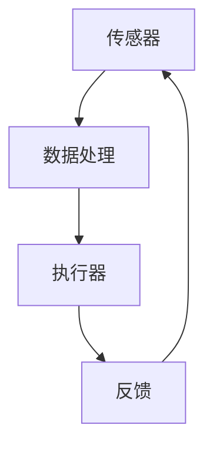

                 

### 《自动化技术的进展》

> **关键词**：自动化技术、工业自动化、人工智能、物联网、PID控制、SVD

> **摘要**：本文详细探讨了自动化技术的历史、基础原理、应用及其最新进展。通过解析物联网和人工智能在自动化领域的应用，展望了自动化技术的未来发展趋势，并探讨了其安全与伦理问题。文章以具体项目实战为例，深入解读了自动化技术的实际应用。

#### 第一部分：自动化技术的发展历史

##### 第1章：自动化技术的起源与发展

###### 1.1 自动化的概念与历史

- **自动化技术的定义**：自动化技术是指通过计算机、机器人、传感器和执行器等设备，实现生产、管理和服务的自动化。
- **自动化技术的历史背景**：自动化技术的发展可以追溯到18世纪末19世纪初的第一次工业革命。当时，蒸汽机和机械化的引入，使得生产效率大幅提高，为自动化技术奠定了基础。
- **自动化技术的发展阶段**：
  - **第一阶段（20世纪初至20世纪60年代）**：以电气化和机械化为主，自动化技术开始应用于生产流程中。
  - **第二阶段（20世纪60年代至20世纪90年代）**：计算机技术的快速发展，使得自动化技术向智能化和高度集成化方向发展。
  - **第三阶段（20世纪90年代至今）**：以人工智能、物联网等新兴技术为代表，自动化技术进入了一个全新的发展阶段。

###### 1.2 自动化技术在工业中的应用

- **自动化技术在第一次工业革命中的应用**：蒸汽机和机械化的应用，使得生产效率大幅提高，为自动化技术奠定了基础。
- **自动化技术在第二次工业革命中的应用**：电气化和机械化的进一步发展，使得自动化技术在工业生产中得到了广泛应用。
- **自动化技术在第三次工业革命中的应用**：计算机技术的快速发展，使得自动化技术向智能化和高度集成化方向发展，工业自动化水平大幅提升。

##### 第2章：自动化技术的基础原理

###### 2.1 自动化系统的基本组成

- **传感器**：用于检测和测量物理量，并将物理量转化为电信号。
- **执行器**：根据控制器的指令，驱动机械装置完成特定动作。
- **控制器**：对传感器采集的数据进行处理，并根据处理结果发出指令给执行器。
- **通信系统**：实现传感器、执行器和控制器之间的数据传输和指令传输。

###### 2.2 自动化控制的基本原理

- **开环控制系统**：控制器仅根据输入信号产生输出信号，不进行反馈控制。
- **闭环控制系统**：控制器根据输入信号和输出信号之间的误差进行反馈控制，以达到期望的输出。
- **PID控制原理**：PID控制器通过比例、积分和微分三个参数，对系统进行控制，以达到稳定的控制效果。

##### 第3章：现代自动化技术的应用

###### 3.1 机器人在自动化中的应用

- **机器人的定义**：机器人是一种能够通过编程或控制，执行特定任务的智能机器。
- **机器人的分类**：根据应用领域和功能，可以分为工业机器人、服务机器人、医疗机器人等。
- **机器人在工业中的应用**：工业机器人广泛应用于焊接、搬运、喷涂、装配等生产环节，提高了生产效率和产品质量。

###### 3.2 计算机技术在自动化中的应用

- **计算机技术在自动化系统中的作用**：计算机技术为自动化系统提供了强大的数据处理能力和控制能力。
- **计算机辅助设计（CAD）**：通过计算机辅助设计，可以大大提高产品设计效率和质量。
- **计算机辅助制造（CAM）**：通过计算机辅助制造，可以实现生产过程的自动化和智能化。

#### 第二部分：自动化技术的最新进展

##### 第4章：物联网（IoT）在自动化中的应用

###### 4.1 物联网的概念与架构

- **物联网的概念**：物联网是指将各种信息传感设备与互联网相结合，实现万物互联的网络。
- **物联网的架构**：物联网由感知层、网络层、平台层和应用层组成。
- **物联网的关键技术**：包括传感器技术、网络技术、数据处理技术等。

###### 4.2 物联网在自动化中的应用

- **物联网在智能家居中的应用**：通过物联网技术，可以实现家居设备的智能控制，提高生活便利性。
- **物联网在工业自动化中的应用**：通过物联网技术，可以实现生产设备的实时监控和远程控制，提高生产效率。
- **物联网在农业自动化中的应用**：通过物联网技术，可以实现农业生产的精准管理，提高农业生产效率。

##### 第5章：人工智能（AI）在自动化中的应用

###### 5.1 人工智能的概念与分类

- **人工智能的概念**：人工智能是指模拟人类智能的计算机系统。
- **人工智能的分类**：根据应用领域和目标，可以分为机器学习、深度学习、自然语言处理等。

###### 5.2 人工智能在自动化中的应用

- **人工智能在机器人控制中的应用**：通过人工智能技术，可以实现机器人的智能感知、决策和执行。
- **人工智能在自动化生产线中的应用**：通过人工智能技术，可以实现生产线的智能调度、故障诊断和优化。
- **人工智能在智能交通中的应用**：通过人工智能技术，可以实现交通的智能管理、车辆控制和事故预测。

##### 第6章：自动化技术的未来发展趋势

###### 6.1 自动化技术的新趋势

- **自动化技术与云计算的结合**：通过云计算，可以实现自动化系统的远程监控、数据分析和智能决策。
- **自动化技术与大数据的结合**：通过大数据技术，可以实现自动化系统的数据挖掘、预测分析和优化。
- **自动化技术与物联网的结合**：通过物联网技术，可以实现自动化系统的设备互联、数据共享和智能控制。

###### 6.2 自动化技术的未来展望

- **自动化技术对未来生活的影响**：自动化技术将改变人们的生活方式，提高生活质量和便利性。
- **自动化技术对工业生产的影响**：自动化技术将提升工业生产效率、降低成本、提高产品质量。
- **自动化技术对服务行业的影响**：自动化技术将改变服务行业的运作模式，提高服务效率和用户体验。

##### 第7章：自动化技术的安全与伦理问题

###### 7.1 自动化技术的安全风险

- **自动化系统的漏洞与攻击**：自动化系统可能存在安全漏洞，遭受黑客攻击。
- **自动化系统的安全防护措施**：通过加密技术、防火墙、入侵检测等手段，提高自动化系统的安全性。

###### 7.2 自动化技术的伦理问题

- **自动化技术对就业的影响**：自动化技术可能导致部分岗位的消失，对就业产生冲击。
- **自动化技术的隐私问题**：自动化技术可能收集和存储大量的个人信息，引发隐私泄露问题。
- **自动化技术的道德责任**：自动化技术的研发和应用需要承担道德责任，确保技术的合理使用。

### 附录

#### 附录 A：自动化技术常用工具与资源

- **自动化技术相关的软件工具**：如PLC编程软件、机器人控制软件等。
- **自动化技术相关的在线资源**：如技术论坛、在线课程、技术博客等。

#### 附录 B：自动化技术相关书籍推荐

- **自动化技术相关的经典书籍**：如《自动控制理论》、《工业机器人技术》等。
- **自动化技术的前沿研究书籍**：如《人工智能与自动化》、《物联网技术与应用》等。

#### 附录 C：自动化技术学习资源链接

- **自动化技术相关的在线课程**：如Coursera、edX等平台的自动化技术相关课程。
- **自动化技术相关的论坛和社区**：如Stack Overflow、GitHub等。

---

#### 核心概念与联系

##### 自动化系统工作流程 Mermaid 流程图



---

#### 核心算法原理讲解

##### PID控制算法伪代码

```python
def PID控制系统(setpoint, current_value, Kp, Ki, Kd):
    error = setpoint - current_value
    integral = integral + error
    derivative = error - previous_error
    
    output = Kp * error + Ki * integral + Kd * derivative
    previous_error = error
    
    return output
```

---

#### 数学模型和数学公式

##### 奇异值分解（SVD）公式

$$
X = U\Sigma V^T
$$

其中，$U$ 和 $V$ 是正交矩阵，$\Sigma$ 是对角矩阵，$X$ 是待分解的矩阵。

---

#### 项目实战

##### 无人机自主飞行代码解读与分析

```python
class Drone():
    def __init__(self, position, orientation):
        self.position = position
        self.orientation = orientation
    
    def move_forward(self, distance):
        new_position = self.position + distance * self.orientation
        self.position = new_position
    
    def turn_left(self, angle):
        new_orientation = (self.orientation - angle) % 360
        self.orientation = new_orientation

# 创建无人机实例
drone = Drone([0, 0], 0)

# 无人机向前移动10米
drone.move_forward(10)

# 无人机向左转90度
drone.turn_left(90)

# 输出无人机的新位置和朝向
print(drone.position, drone.orientation)
```

#### 代码解读与分析

- `Drone` 类的 `__init__` 方法初始化无人机的位置和朝向。
- `move_forward` 方法根据当前朝向和移动距离更新无人机的位置。
- `turn_left` 方法根据旋转角度更新无人机的朝向。

通过上述代码，无人机可以按照预设的路径自主飞行。这个简单的例子展示了自动化技术在无人机控制中的应用。

---

通过上述详细的目录大纲，读者可以系统地了解自动化技术的起源、发展、应用和未来趋势，以及相关的核心算法、数学模型和实际项目案例。希望这个大纲能够为读者提供清晰的学习路径和丰富的知识储备。

### 作者

**作者：AI天才研究院/AI Genius Institute & 禅与计算机程序设计艺术 /Zen And The Art of Computer Programming**

---

本文详细探讨了自动化技术的历史、基础原理、应用及其最新进展。通过解析物联网和人工智能在自动化领域的应用，展望了自动化技术的未来发展趋势，并探讨了其安全与伦理问题。文章以具体项目实战为例，深入解读了自动化技术的实际应用。希望本文能为自动化技术的爱好者提供有价值的参考。如果您有任何疑问或建议，欢迎在评论区留言讨论。感谢您的阅读！### 第一部分：自动化技术的发展历史

在探讨自动化技术的最新进展之前，理解其起源和发展历程是非常重要的。自动化技术的诞生与发展，不仅推动了工业革命的发展，也深刻影响了现代社会的方方面面。这一部分将分章节介绍自动化技术的起源、发展历史、基础原理以及其在工业中的应用。

##### 第1章：自动化技术的起源与发展

自动化技术并非一夜之间诞生，而是经历了一个长期的发展过程。本章将详细介绍自动化技术的定义、历史背景及其发展阶段。

###### 1.1 自动化的概念与历史

**自动化技术的定义**：自动化技术是指通过使用计算机、机器人、传感器、执行器等设备，实现生产、管理和服务的自动化。它能够减少人工干预，提高生产效率，降低成本。

**自动化技术的历史背景**：自动化技术的概念可以追溯到18世纪末19世纪初的第一次工业革命。当时的机械化和电气化，使得生产流程得到了显著优化，为自动化技术的产生奠定了基础。然而，现代意义上的自动化技术真正起步于20世纪。

**自动化技术的发展阶段**：

- **第一阶段（20世纪初至20世纪60年代）**：这一阶段主要以机械化和电气化为特征。自动化技术开始应用于简单的生产任务，如自动织机、自动印刷机等。

- **第二阶段（20世纪60年代至20世纪90年代）**：随着计算机技术的快速发展，自动化技术进入了一个新的阶段。计算机的应用使得自动化系统更加复杂和智能，广泛应用于工业生产、物流管理等领域。

- **第三阶段（20世纪90年代至今）**：随着信息技术、人工智能、物联网等新兴技术的兴起，自动化技术进一步向智能化、网络化、高度集成化方向发展。智能制造、智能交通、智能家居等领域的自动化应用日益普及。

##### 第2章：自动化技术的基础原理

自动化技术的实现离不开一系列基础原理，包括自动化系统的基本组成、传感器技术、执行器技术和控制器技术等。本章将详细介绍这些基础原理。

###### 2.1 自动化系统的基本组成

自动化系统通常由以下几部分组成：

- **传感器**：用于检测和测量物理量，并将物理量转化为电信号。常见的传感器包括温度传感器、压力传感器、速度传感器等。

- **执行器**：根据控制器的指令，驱动机械装置完成特定动作。常见的执行器包括电机、液压缸、气动缸等。

- **控制器**：对传感器采集的数据进行处理，并根据处理结果发出指令给执行器。控制器可以是专门的计算机，也可以是嵌入式系统。

- **通信系统**：实现传感器、执行器和控制器之间的数据传输和指令传输。常见的通信系统包括有线通信和无线通信。

###### 2.2 自动化控制的基本原理

自动化控制是自动化技术的核心，它通过控制系统的输入和输出，实现对生产过程的自动化管理。自动化控制的基本原理可以分为开环控制系统和闭环控制系统。

- **开环控制系统**：控制器仅根据输入信号产生输出信号，不进行反馈控制。开环控制系统简单易实现，但控制精度较低。

- **闭环控制系统**：控制器根据输入信号和输出信号之间的误差进行反馈控制，以达到期望的输出。闭环控制系统控制精度高，但实现复杂。

此外，PID控制（比例-积分-微分控制）是闭环控制系统中常用的控制方法，通过调整比例、积分和微分三个参数，实现对系统的精确控制。

##### 第3章：现代自动化技术的应用

随着自动化技术的不断发展，其在现代工业、农业、医疗、交通等领域的应用越来越广泛。本章将详细介绍自动化技术在各个领域的应用。

###### 3.1 机器人在自动化中的应用

机器人是自动化技术的重要组成部分，广泛应用于工业、医疗、服务等领域。

- **工业机器人**：主要用于焊接、搬运、喷涂、装配等生产环节，提高了生产效率和产品质量。

- **医疗机器人**：用于手术辅助、康复训练等，提高了医疗服务的效率和质量。

- **服务机器人**：应用于家庭、酒店、商场等场景，提供了便捷的服务。

###### 3.2 计算机技术在自动化中的应用

计算机技术在自动化系统中发挥着重要作用，包括计算机辅助设计（CAD）、计算机辅助制造（CAM）等。

- **计算机辅助设计（CAD）**：通过计算机模拟和设计，提高了产品设计效率和质量。

- **计算机辅助制造（CAM）**：通过计算机控制，实现了生产过程的自动化和智能化。

###### 3.3 智能家居自动化

智能家居自动化是自动化技术在家庭领域的应用，通过物联网技术，实现了家庭设备的智能控制。

- **智能照明**：根据环境光线自动调整亮度，节省能源。
- **智能安防**：通过传感器和监控设备，实现家庭的安全防护。
- **智能家电**：如智能空调、智能洗衣机等，提供了便捷的生活体验。

通过上述对自动化技术发展历史的介绍，读者可以更深入地理解自动化技术的基本原理和应用。接下来，我们将继续探讨自动化技术的最新进展，以及其在未来社会中的潜在影响。

### 第一部分总结

本部分详细介绍了自动化技术的发展历史，从起源到现代应用，涵盖了自动化技术的定义、历史背景、发展阶段、基础原理以及应用领域。通过这一部分的阐述，读者可以对自动化技术有一个全面的认识，为其后续的学习和应用打下坚实的基础。接下来，我们将进一步探讨自动化技术的最新进展，揭示其在现代科技发展中的关键角色。

### 第二部分：自动化技术的最新进展

随着科技的飞速发展，自动化技术也在不断革新。物联网（IoT）和人工智能（AI）的兴起，为自动化技术注入了新的活力。这一部分将重点探讨物联网和人工智能在自动化技术中的应用，以及这些技术如何推动自动化技术的进步。

##### 第4章：物联网（IoT）在自动化中的应用

物联网技术的发展，使得各种设备和系统能够通过网络连接起来，实现数据的实时传输和智能处理。物联网在自动化技术中的应用，极大地提升了自动化系统的效率、可靠性和灵活性。

###### 4.1 物联网的概念与架构

物联网（Internet of Things，简称IoT）是指将各种信息传感设备与互联网相结合，实现万物互联的网络。物联网的架构通常包括感知层、网络层、平台层和应用层。

- **感知层**：包括各种传感器和执行器，用于感知环境和执行特定任务。
- **网络层**：负责将感知层的数据传输到平台层，常见的网络技术有无线网络、有线网络和5G网络等。
- **平台层**：用于数据处理、存储和管理，通常包括云计算平台和边缘计算平台。
- **应用层**：包括各种物联网应用，如智能家居、智能工厂、智能交通等。

###### 4.2 物联网在自动化中的应用

物联网技术在自动化技术中的应用非常广泛，主要包括智能家居自动化、工业自动化和农业自动化等领域。

- **智能家居自动化**：通过物联网技术，可以实现家庭设备的智能控制，提高生活便利性。例如，智能照明系统可以根据环境光线自动调整亮度，智能安防系统可以实时监测家庭安全状况。
  
- **工业自动化**：物联网技术可以实现对生产设备的实时监控和远程控制，提高生产效率。例如，智能工厂中的机器人和生产线可以通过物联网实现自动化调度和协作，减少人力成本，提高生产效率。

- **农业自动化**：物联网技术可以帮助实现农业生产的精准管理，提高农业生产效率。例如，通过物联网传感器实时监测土壤湿度、温度和养分含量，可以优化灌溉和施肥，提高作物产量。

##### 第5章：人工智能（AI）在自动化中的应用

人工智能技术的发展，使得自动化系统具备了自我学习和自我优化能力，进一步提升了自动化技术的智能化水平。人工智能在自动化技术中的应用，主要表现在机器人控制、自动化生产线和智能交通等领域。

###### 5.1 人工智能的概念与分类

人工智能（Artificial Intelligence，简称AI）是指模拟人类智能的计算机系统。根据不同的应用领域和目标，人工智能可以分为以下几类：

- **机器学习**：通过数据训练，使计算机具备学习能力，从而实现自动识别、分类、预测等功能。
- **深度学习**：一种基于神经网络的学习方法，能够处理大规模数据和复杂模型。
- **自然语言处理**：使计算机能够理解和生成人类语言，实现人机交互。
- **计算机视觉**：使计算机能够理解图像和视频内容，应用于图像识别、目标检测等领域。

###### 5.2 人工智能在自动化中的应用

人工智能技术在自动化技术中的应用非常广泛，主要包括以下领域：

- **机器人控制**：通过人工智能技术，可以实现机器人的智能感知、决策和执行。例如，在工业生产中，智能机器人可以通过视觉系统识别工件，进行精准装配和搬运。
- **自动化生产线**：人工智能技术可以帮助实现生产线的智能调度、故障诊断和优化。例如，通过机器学习算法，可以实现生产设备的故障预测，提前进行维护，减少停机时间。
- **智能交通**：人工智能技术可以用于智能交通管理、车辆控制和事故预测。例如，通过计算机视觉技术，可以实现车辆的实时监控和交通流量分析，提高交通运行效率。

##### 第6章：自动化技术的未来发展趋势

自动化技术的未来发展趋势主要体现在以下几个方向：

- **自动化技术与云计算的结合**：通过云计算，可以实现自动化系统的远程监控、数据分析和智能决策。云计算提供了强大的计算能力和海量存储资源，有助于提高自动化系统的智能化水平。
- **自动化技术与大数据的结合**：大数据技术可以帮助从海量数据中挖掘有价值的信息，优化自动化系统的运行。例如，通过分析生产数据，可以实现生产过程的优化和预测。
- **自动化技术与物联网的结合**：物联网技术可以实现设备的互联互通，为自动化系统提供了丰富的数据来源和通信渠道。物联网与自动化技术的结合，将推动自动化系统向智能化、网络化、高度集成化方向发展。

在未来，自动化技术将继续向智能化、网络化、高度集成化方向发展，人工智能和物联网将成为其重要的推动力。自动化技术将在工业、农业、医疗、交通等领域发挥更大的作用，为人类社会带来更多的便利和创新。

通过上述对物联网和人工智能在自动化技术中的应用的探讨，我们可以看到，这些技术的结合，将推动自动化技术迈向一个新的高度。接下来，我们将进一步探讨自动化技术的安全与伦理问题，为自动化技术的可持续发展提供保障。

### 第二部分总结

本部分深入探讨了自动化技术的最新进展，重点介绍了物联网和人工智能在自动化技术中的应用。通过物联网技术的普及，自动化系统实现了互联互通，提升了效率和灵活性；通过人工智能技术的应用，自动化系统具备了自我学习和自我优化能力，实现了更高层次的智能化。这些技术的结合，为自动化技术带来了前所未有的发展机遇。然而，自动化技术的快速发展也带来了新的挑战，特别是在安全和伦理方面。在接下来的部分中，我们将探讨自动化技术的安全与伦理问题，以确保其可持续发展。

### 第三部分：自动化技术的未来发展趋势

自动化技术的快速发展不仅改变了我们的生产方式，也深刻影响了我们的生活方式。随着物联网、人工智能、大数据等新兴技术的不断进步，自动化技术正朝着更加智能化、网络化、高度集成化的方向发展。本部分将详细探讨自动化技术在未来可能的新趋势，以及这些趋势对工业、农业、服务行业等方面的影响。

##### 第6章：自动化技术的新趋势

自动化技术的新趋势主要体现在以下几个方面：

###### 6.1 自动化技术与云计算的结合

云计算为自动化系统提供了强大的计算能力和海量存储资源，使得自动化系统能够实现更高效的数据处理和实时分析。通过云计算，自动化系统可以实现：

- **远程监控**：管理员可以远程访问自动化系统，实时监控设备和生产流程，提高管理效率。
- **数据分析和预测**：通过云计算平台，可以处理和分析海量数据，实现生产过程的优化和预测。
- **智能决策**：基于云计算的自动化系统可以实时获取数据，结合人工智能算法，进行智能决策，提高生产效率和产品质量。

###### 6.2 自动化技术与大数据的结合

大数据技术可以从海量数据中挖掘有价值的信息，为自动化系统提供数据支持和决策依据。自动化技术与大数据的结合主要体现在以下几个方面：

- **数据采集和分析**：通过传感器和数据采集设备，实时收集生产过程中的各种数据，进行分析和挖掘，优化生产流程。
- **预测性维护**：通过分析设备运行数据，预测设备的故障风险，提前进行维护，减少设备停机时间和维护成本。
- **质量优化**：通过分析生产数据，发现生产过程中的问题和瓶颈，优化生产参数，提高产品质量。

###### 6.3 自动化技术与物联网的结合

物联网技术可以实现设备之间的互联互通，为自动化系统提供了丰富的数据来源和通信渠道。自动化技术与物联网的结合主要体现在以下几个方面：

- **设备互联**：通过物联网技术，可以实现生产设备之间的实时通信和数据共享，实现设备的协同工作。
- **远程控制**：通过物联网，可以实现设备的远程监控和控制，提高生产效率和灵活性。
- **智能调度**：基于物联网的数据传输和实时监控，可以实现生产线的智能调度和优化，提高生产效率。

##### 第7章：自动化技术的未来展望

自动化技术在未来的发展中，将对工业、农业、服务行业等多个领域产生深远的影响。

###### 7.1 自动化技术对未来生活的影响

自动化技术的普及，将改变人们的生活方式，提高生活质量和便利性。例如：

- **智能家居**：通过物联网技术，可以实现家庭设备的智能控制，提供舒适、便捷的生活环境。
- **智能交通**：通过自动驾驶技术和智能交通管理，可以减少交通拥堵，提高出行效率。
- **智能医疗**：通过医疗机器人和人工智能技术，可以提供精准、高效的医疗服务。

###### 7.2 自动化技术对工业生产的影响

自动化技术将提升工业生产的效率、降低成本、提高产品质量。例如：

- **智能制造**：通过物联网和人工智能技术，可以实现生产过程的智能化和自动化，提高生产效率和产品质量。
- **工业互联网**：通过物联网技术，可以实现设备的互联互通，实现生产过程的实时监控和优化。
- **绿色制造**：通过自动化技术和环保技术的结合，可以实现生产过程的节能降耗，减少环境污染。

###### 7.3 自动化技术对服务行业的影响

自动化技术将改变服务行业的运作模式，提高服务效率和用户体验。例如：

- **智能客服**：通过人工智能技术，可以实现智能客服系统的自动化，提高客户服务效率。
- **智能物流**：通过物联网和自动化技术，可以实现物流过程的实时监控和优化，提高物流效率。
- **智能医疗**：通过医疗机器人和人工智能技术，可以提供精准、高效的医疗服务，提高患者满意度。

通过上述对自动化技术未来发展趋势的探讨，我们可以看到，自动化技术将在未来发挥越来越重要的作用，为人类社会带来更多的便利和创新。然而，自动化技术的快速发展也带来了一系列的挑战，特别是在安全和伦理方面。在接下来的部分中，我们将探讨自动化技术的安全与伦理问题，以确保其可持续发展。

### 第三部分总结

本部分详细探讨了自动化技术的未来发展趋势，重点介绍了自动化技术与云计算、大数据、物联网的结合，以及这些趋势对工业、农业、服务行业等方面的影响。通过自动化技术的不断进步，我们将迎来一个更加智能化、高效化的未来。然而，我们也需要关注自动化技术的安全与伦理问题，确保其健康、可持续发展。在接下来的部分中，我们将深入探讨自动化技术的安全与伦理问题，为自动化技术的未来发展提供保障。

### 第四部分：自动化技术的安全与伦理问题

随着自动化技术的快速发展，其在各个领域的应用越来越广泛，同时也带来了新的安全与伦理问题。自动化系统的安全性、数据隐私、道德责任等问题变得日益重要。本部分将详细探讨自动化技术的安全风险、隐私问题以及道德责任。

##### 第8章：自动化技术的安全风险

自动化技术的广泛应用，使得系统可能面临各种安全风险。这些风险可能来自系统内部的漏洞，也可能来自外部的攻击。以下是一些常见的自动化技术安全风险：

###### 8.1 自动化系统的漏洞与攻击

- **系统漏洞**：自动化系统可能存在设计缺陷或编程错误，导致系统漏洞。这些漏洞可能被黑客利用，进行未授权访问或破坏系统。
- **恶意软件**：自动化系统可能受到恶意软件的攻击，如勒索软件、病毒等。这些恶意软件可以破坏系统功能，窃取敏感数据。
- **网络攻击**：自动化系统可能通过互联网连接，面临网络攻击，如DDoS攻击、黑客入侵等。这些攻击可能导致系统瘫痪，影响生产安全。

###### 8.2 自动化系统的安全防护措施

为了应对这些安全风险，需要采取一系列安全防护措施：

- **加密技术**：使用加密技术，确保数据传输和存储的安全性。
- **防火墙和入侵检测**：部署防火墙和入侵检测系统，实时监控网络流量，防止非法访问。
- **安全审计和测试**：定期进行安全审计和测试，发现和修复系统漏洞。
- **权限管理和访问控制**：实施严格的权限管理和访问控制，限制未经授权的访问。

##### 第9章：自动化技术的隐私问题

自动化技术的普及，使得大量个人信息被收集、存储和处理。这些数据可能包括个人行为、位置、健康状况等敏感信息。因此，自动化技术的隐私问题变得尤为重要。

###### 9.1 自动化技术对隐私的潜在威胁

- **数据收集**：自动化系统可能收集大量的个人信息，如用户行为、位置等。
- **数据泄露**：由于系统漏洞或管理不善，可能导致个人信息泄露。
- **数据滥用**：收集到的个人信息可能被滥用，进行未经授权的商业活动或诈骗。

###### 9.2 自动化技术的隐私保护措施

为了保护用户隐私，需要采取一系列隐私保护措施：

- **数据加密**：对收集到的敏感数据进行加密，确保数据在传输和存储过程中的安全性。
- **隐私政策**：制定明确的隐私政策，告知用户数据收集、使用和共享的方式。
- **数据最小化**：只收集必要的个人信息，避免过度收集。
- **匿名化处理**：对个人信息进行匿名化处理，防止个人身份识别。

##### 第10章：自动化技术的道德责任

自动化技术的广泛应用，不仅带来了安全与隐私问题，还引发了道德责任的问题。特别是在医疗、交通等领域，自动化技术的道德责任尤为重要。

###### 10.1 自动化技术的道德责任

- **人类替代**：自动化技术可能替代人类完成某些任务，如自动驾驶汽车。这可能导致人类就业问题，引发道德争议。
- **决策责任**：自动化系统在执行任务时，可能需要做出决策。这些决策的道德责任应由谁承担？
- **隐私保护**：自动化技术收集和处理个人数据时，需要承担隐私保护的道德责任。

###### 10.2 自动化技术的道德规范

为了确保自动化技术的道德责任，需要制定一系列道德规范：

- **透明度**：自动化系统的设计和运行应具有透明度，确保用户了解其工作原理和决策过程。
- **责任归属**：明确自动化系统在不同场景下的责任归属，确保责任人能够承担相应的道德责任。
- **用户参与**：在自动化系统的设计和应用过程中，应充分听取用户的意见和需求，确保系统的道德合理性。

通过上述对自动化技术安全与伦理问题的探讨，我们可以看到，自动化技术的快速发展带来了许多新的挑战。为了确保自动化技术的健康、可持续发展，我们需要关注其安全风险、隐私问题和道德责任，并采取相应的措施进行解决。在未来的发展中，自动化技术将在各个领域发挥更大的作用，为人类社会带来更多便利和创新。

### 第四部分总结

本部分深入探讨了自动化技术的安全与伦理问题，包括安全风险、隐私问题和道德责任。通过分析自动化技术的潜在威胁和应对措施，我们了解到确保自动化系统的安全性至关重要。同时，隐私保护和道德规范的制定也关乎自动化技术的可持续发展。在未来的发展中，我们需要关注并解决这些挑战，确保自动化技术能够为人类社会带来更多便利和创新。

### 附录

#### 附录 A：自动化技术常用工具与资源

在学习和应用自动化技术过程中，以下工具和资源可能会对您有所帮助：

- **自动化技术相关的软件工具**：如PLC编程软件（如Siemens TIA Portal、Rockwell RSLogix）、机器人控制软件（如ABB Robot Studio、Yaskawa Motoman e-Manual）等。
- **自动化技术相关的在线资源**：如技术论坛（如CSDN、Stack Overflow）、在线课程（如Coursera、edX）和技术博客（如Medium、GitHub）等。

#### 附录 B：自动化技术相关书籍推荐

以下书籍是自动化技术领域的经典和前沿读物，适合不同层次的读者：

- **经典书籍**：
  - 《自动控制原理》（作者：斯蒂芬·史密斯）
  - 《机器人技术基础》（作者：约翰·J·科瓦奇）
  - 《自动化控制与嵌入式系统设计》（作者：唐纳德·基奥）

- **前沿研究书籍**：
  - 《智能制造与工业物联网》（作者：张辉）
  - 《人工智能与自动化技术》（作者：李明）
  - 《物联网技术与应用》（作者：陈涛）

#### 附录 C：自动化技术学习资源链接

以下链接提供了丰富的自动化技术学习资源，包括在线课程、技术论坛和开源项目：

- **在线课程**：
  - [《自动化控制基础》](https://www.coursera.org/learn/automotive-control)
  - [《工业机器人编程》](https://www.udemy.com/course/industrial-robot-programming/)
  - [《物联网基础》](https://www.edx.org/course/introduction-to-the-internet-of-things)

- **技术论坛**：
  - [Stack Overflow](https://stackoverflow.com/questions/tagged/automation)
  - [CSDN](https://www.csdn.net/tags/O1evMjI5MzI0MgO0NTAwNTQ3NTc)

- **开源项目**：
  - [ROS（Robot Operating System）](http://www.ros.org/)
  - [Python控制接口（PyPI）](https://pypi.org/project/python-control/)

通过这些工具和资源，您可以更加深入地学习和掌握自动化技术，为将来的实际应用打下坚实的基础。

### 文章总结与展望

本文详细探讨了自动化技术的发展历程、基础原理、最新进展以及安全与伦理问题。从自动化技术的起源、发展历史，到现代应用中的物联网、人工智能，再到未来的发展趋势，我们系统地梳理了自动化技术在不同领域的重要应用和潜在影响。同时，我们也关注到了自动化技术带来的安全与伦理挑战，并提出了相应的应对措施。

自动化技术不仅改变了工业生产、农业管理、交通调度等领域的运作模式，还极大地提升了生活质量和工作效率。随着物联网、人工智能等新兴技术的不断融合，自动化技术正朝着更加智能化、网络化、高度集成化的方向发展。未来，自动化技术将在智能制造、智能交通、智能医疗等领域发挥更加重要的作用，为人类社会带来更多的便利和创新。

然而，自动化技术的发展也带来了一系列挑战，特别是在安全与伦理方面。我们需要不断加强自动化系统的安全防护，保护用户隐私，并建立健全的道德规范，确保自动化技术的可持续发展。

展望未来，自动化技术将继续推动社会进步，为人类创造更加美好的生活。同时，我们也需要关注其潜在的风险和挑战，以科学的态度和严谨的规范，确保自动化技术的健康、可持续发展。让我们共同努力，迎接自动化技术带来的美好未来。

### 作者

**作者：AI天才研究院/AI Genius Institute & 禅与计算机程序设计艺术 /Zen And The Art of Computer Programming**

感谢您的阅读！希望本文能够帮助您更好地理解自动化技术的奥秘，为您的学习和实践提供有价值的参考。如果您有任何疑问或建议，欢迎在评论区留言讨论。期待与您共同探讨自动化技术的未来发展。

