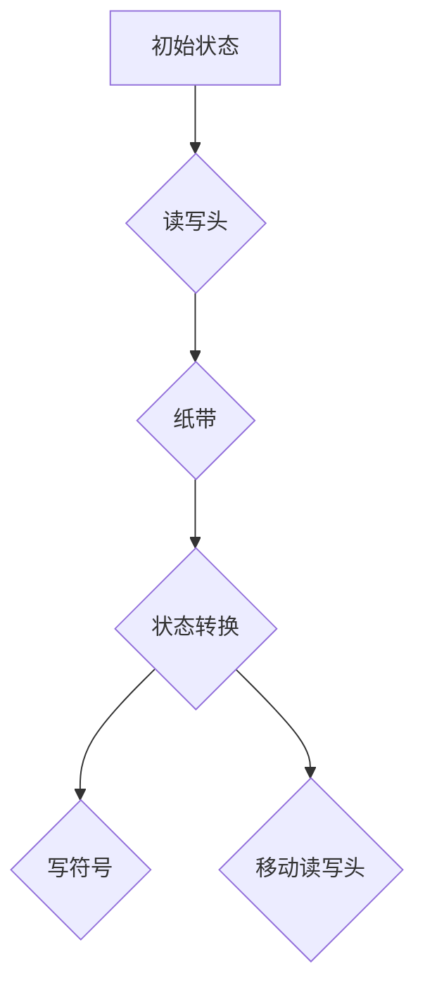
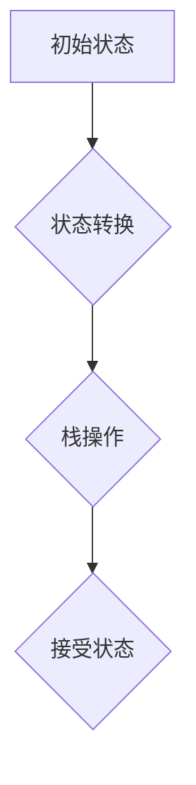

                 

# 《自动机研究》的出版背景

> 关键词：自动机，形式语言理论，编译原理，计算复杂性，自然语言处理

> 摘要：本文深入探讨了自动机研究的出版背景，从历史发展、理论基础、应用领域等方面进行详细分析，旨在为读者提供一份关于自动机研究的全面概述。

## 引言

自动机理论是现代计算机科学和理论计算机科学的重要基础。自动机研究起源于20世纪40年代，当时为了解决计算机如何处理复杂问题的问题，图灵提出了图灵机的概念。随后，有限自动机和pushdown自动机等概念相继被提出。这些自动机模型为形式语言理论、编译原理、计算复杂性、自然语言处理等领域的研究奠定了基础。

本文将首先介绍自动机的基本概念，包括有限自动机、图灵机、pushdown自动机等；然后分析自动机在计算理论中的应用，如计算能力、计算复杂性等；接着探讨自动机在自然语言处理中的应用，如语言模型、词法分析、语法分析等；最后讨论自动机的研究方法与发展趋势，以及自动机在实际应用中的案例分析。

## 第一部分：自动机的基本概念

### 第1章：自动机概述

自动机是一种抽象的计算模型，它可以模拟人类处理语言或符号序列的能力。根据自动机的计算能力，可以将自动机分为有限自动机、图灵机、pushdown自动机等。

### 第2章：有限自动机的基础理论

有限自动机是一种最简单的自动机模型，它具有有限的状态集合和有限的操作集。本章将介绍有限自动机的模型、转换规则和判定问题。

### 第3章：图灵机的理论分析

图灵机是一种更强的计算模型，它可以模拟任何物理计算过程。本章将分析图灵机的构造与操作、判定能力和计算复杂性。

### 第4章：pushdown自动机的理论

pushdown自动机是一种具有栈的自动机模型，它可以处理更复杂的问题。本章将探讨pushdown自动机的定义与特性、应用和判定问题。

## 第二部分：有限自动机的构造与分析

### 第5章：自动机与计算理论

自动机在计算理论中具有重要的地位。本章将分析自动机的计算能力、等价性与比较、强与弱计算模型等。

### 第6章：自动机的研究方法

自动机的研究方法包括形式语言理论、形式语言处理算法等。本章将介绍这些研究方法及其发展趋势。

### 第7章：自动机在实际应用中的案例分析

自动机在实际应用中具有广泛的应用，如编译原理、信息安全、自然语言处理等。本章将分析自动机在这些领域的应用案例。

## 附录

### 附录A：自动机相关参考资料

附录A将列出一些经典的自动机相关文献和在线资源，以供读者进一步学习和研究。

## 结语

自动机理论是计算机科学的重要基础，它对编译原理、计算复杂性、自然语言处理等领域的研究具有重要的指导意义。本文从多个角度分析了自动机的研究背景和内容，旨在为读者提供一份全面而深入的自动机研究概述。希望本文能够激发读者对自动机理论的研究兴趣，为计算机科学的发展做出贡献。

### 《自动机研究》出版背景分析

#### 历史背景

自动机理论的历史可以追溯到20世纪40年代，当时计算机科学刚刚起步。艾伦·图灵（Alan Turing）是一位著名的数学家和逻辑学家，他在1936年提出了图灵机的概念。图灵机是一种抽象的计算模型，能够解决任何可计算的问题。图灵机的提出标志着现代计算机科学的诞生，也为自动机理论的发展奠定了基础。

随后，阿隆佐·丘奇（Alonzo Church）和斯蒂芬·科尔·克莱尼（Stephen Cole Kleene）等数学家进一步研究了自动机理论，提出了有限自动机和pushdown自动机等概念。有限自动机是一种简单的计算模型，能够处理有限的符号序列；而pushdown自动机则引入了栈结构，能够处理更复杂的问题。

#### 理论基础

自动机理论的发展离不开形式语言理论的支持。形式语言理论是计算机科学中研究语言和符号结构的数学分支。形式语言包括有限语言、上下文无关语言、递归语言等。自动机作为形式语言的一种模型，可以用来描述和识别这些语言。

形式语言理论的发展为自动机理论提供了坚实的基础。通过形式语言理论，我们可以更准确地定义自动机的计算能力和性质，从而更好地理解和应用自动机。

#### 应用领域

自动机理论在计算机科学的各个领域中都有着广泛的应用。首先，自动机理论在编译原理中发挥着重要作用。编译器需要对源代码进行词法分析和语法分析，而自动机模型提供了有效的工具来处理这些问题。例如，有限自动机可以用来实现词法分析器，而图灵机可以用来实现语法分析器。

此外，自动机理论还在自然语言处理中有着重要的应用。自然语言处理涉及到对文本的理解和处理，而自动机模型可以用来实现分词、词性标注、语法分析和语义分析等任务。例如，pushdown自动机可以用来实现语法分析，从而解析自然语言的语法结构。

#### 自动机理论的发展趋势

随着计算机科学的不断发展，自动机理论也在不断演进。一方面，研究者们提出了更高效的自动机模型，如正则表达式、上下文无关文法等，以解决更复杂的问题。另一方面，自动机理论与其他领域，如机器学习、人工智能等相结合，推动了自动机理论的应用和发展。

例如，神经网络和深度学习的发展为自动机理论提供了新的工具和思路。通过将自动机模型与深度学习相结合，研究者们提出了一些新的自动机模型，如深度有限自动机（Deep Finite Automata）等，以解决更复杂的问题。

#### 《自动机研究》的出版意义

《自动机研究》的出版具有重要的意义。首先，它为自动机理论的研究提供了一个系统而全面的概述，有助于读者深入了解自动机的基本概念、理论和方法。其次，它涵盖了自动机在计算理论、编译原理、自然语言处理等领域的应用，为读者提供了实际应用的案例和启示。

此外，《自动机研究》的出版还有助于推动自动机理论的研究和发展。通过介绍最新的研究成果和趋势，它为自动机理论的研究者提供了新的思路和方法，促进了自动机理论的创新和发展。

### 第一部分：自动机的基本概念

#### 第1章：自动机概述

自动机（Automata）是数学和计算机科学中用于模拟计算过程的抽象模型。自动机理论起源于20世纪中叶，为了解决计算机如何处理复杂问题而发展起来。自动机可以模拟各种计算过程，从简单的计算到复杂的算法，都是通过状态转换和符号操作来实现的。

自动机主要有以下几种类型：

- **有限自动机（Finite Automata）**：有限自动机是最简单的自动机模型，具有有限的状态集合和有限的操作集。有限自动机可以分为确定型有限自动机（Deterministic Finite Automata，DFA）和非确定型有限自动机（Nondeterministic Finite Automata，NFA）。

- **图灵机（Turing Machine）**：图灵机是一种更强的计算模型，可以模拟任何物理计算过程。它由一个无限长的纸带、一个读写头和一系列状态转换规则组成。图灵机的出现标志着现代计算机科学的诞生。

- **pushdown自动机（Pushdown Automaton）**：pushdown自动机是一种具有栈的自动机模型，它可以处理更复杂的问题。pushdown自动机在状态转换时可以使用栈来存储符号，从而能够处理上下文无关语言（Context-Free Languages，CFL）。

#### 自动机的定义与类型

**有限自动机（Finite Automata）**

有限自动机是一种离散计算模型，具有以下基本特性：

- **状态（State）**：有限自动机具有有限个状态，每个状态表示自动机在某一时刻的处理状态。
- **输入符号（Input Symbol）**：有限自动机可以读取输入符号，这些符号通常来自一个有限的字母表。
- **转移函数（Transition Function）**：转移函数定义了在当前状态下，输入一个符号后自动机将转移到哪个状态。
- **初始状态（Initial State）**：初始状态是自动机开始处理输入时的状态。
- **接受状态（Accept State）**：接受状态是当输入序列被完全处理时，自动机所处的状态。

有限自动机可以分为以下两种类型：

1. **确定型有限自动机（Deterministic Finite Automata，DFA）**

   确定型有限自动机在任意时刻只有一个可能的状态转换。DFA具有以下特性：

   - 对于任意状态 $q$ 和输入符号 $a$，转移函数 $\delta(q, a)$ 必须唯一存在。
   - DFA不能处于多个状态同时进行计算。

2. **非确定型有限自动机（Nondeterministic Finite Automata，NFA）**

   非确定型有限自动机在任意时刻可以有多个可能的状态转换。NFA具有以下特性：

   - 对于任意状态 $q$ 和输入符号 $a$，转移函数 $\delta(q, a)$ 可以是多个状态的集合。
   - NFA可以同时处于多个状态。

**图灵机（Turing Machine）**

图灵机是一种更加复杂的计算模型，它可以模拟任何物理计算过程。图灵机由以下几个部分组成：

- **纸带（Tape）**：图灵机有一张无限长的纸带，纸带上的每个位置可以存储一个符号。
- **读写头（Read-Write Head）**：读写头可以读取纸带上的符号，并在纸带上进行写操作。
- **状态（State）**：图灵机具有一系列状态，每个状态表示机器在某一时刻的处理状态。
- **状态转换表（Transition Table）**：状态转换表定义了在当前状态下，读写头读取的符号后机器将转移到哪个状态，并进行相应的操作。

图灵机的计算过程可以描述如下：

1. 图灵机从初始状态开始，读写头位于纸带的某个位置。
2. 在每个步骤中，图灵机读取当前位置的符号，根据状态转换表进行状态转换和符号操作。
3. 如果读写头读取的符号是特定的结束符号，图灵机停止计算并返回接受状态。
4. 如果无法找到状态转换，图灵机进入一个“拒绝”状态，表示输入无法被接受。

**pushdown自动机（Pushdown Automaton）**

pushdown自动机是一种具有栈结构的自动机模型，它可以处理更复杂的问题。pushdown自动机由以下几个部分组成：

- **栈（Stack）**：pushdown自动机有一个栈，用于存储符号。
- **状态（State）**：pushdown自动机具有一系列状态。
- **输入符号（Input Symbol）**：pushdown自动机可以读取输入符号。
- **状态转换函数（Transition Function）**：状态转换函数定义了在当前状态下，输入一个符号后自动机将如何进行状态转换和栈操作。

pushdown自动机的计算过程可以描述如下：

1. pushdown自动机从初始状态开始，栈为空。
2. 在每个步骤中，pushdown自动机读取当前位置的输入符号，并根据状态转换函数进行状态转换和栈操作。
3. 如果输入序列被完全处理，且栈为空或处于接受状态，pushdown自动机返回接受。
4. 如果无法找到状态转换，pushdown自动机进入一个“拒绝”状态，表示输入无法被接受。

#### 自动机的特性与限制

**自动机的计算能力**

自动机可以根据其结构不同具有不同的计算能力。有限自动机只能处理有限的语言，而pushdown自动机可以处理更复杂的上下文无关语言（CFL）。图灵机是一种全能的计算模型，可以处理任何可计算的问题。

**自动机的优点与局限性**

自动机的优点包括：

- **简单性**：自动机模型简单，易于理解和实现。
- **效率**：自动机在处理某些问题时具有高效的计算能力。
- **灵活性**：自动机可以根据需要进行定制，以适应特定的应用场景。

然而，自动机也具有一些局限性：

- **计算能力的限制**：自动机无法处理所有类型的问题，尤其是那些涉及到无限循环或递归的问题。
- **实现复杂性**：自动机的实现可能比较复杂，需要详细的状态转换表和状态分析。

#### 总结

自动机是计算机科学中重要的抽象计算模型，包括有限自动机、图灵机和pushdown自动机等。它们在形式语言理论、编译原理、计算复杂性、自然语言处理等领域具有重要的应用。通过对自动机的基本概念和特性的了解，我们可以更好地理解和应用自动机模型，以解决复杂的问题。

### 第2章：有限自动机的基础理论

#### 2.1 有限自动机的模型

有限自动机是一种离散计算模型，具有有限的状态集合、有限的输入符号集和状态转换规则。有限自动机可以分为确定型有限自动机（DFA）和非确定型有限自动机（NFA）。以下是对这两种模型及其特点的详细探讨。

**确定型有限自动机（Deterministic Finite Automata，DFA）**

确定型有限自动机是最常见的有限自动机模型之一，其特点如下：

1. **状态集合（State Set）**：DFA具有有限个状态，每个状态表示自动机在某一时刻的处理状态。
2. **输入符号集（Input Alphabet）**：DFA可以读取的输入符号来自一个有限的字母表。
3. **转移函数（Transition Function）**：转移函数 $\delta$ 定义了在当前状态下，输入一个符号后自动机将转移到哪个状态。对于任意状态 $q$ 和输入符号 $a$，有且仅有一个状态 $\delta(q, a)$。
4. **初始状态（Initial State）**：初始状态是自动机开始处理输入时的状态。
5. **接受状态（Accept State）**：接受状态是当输入序列被完全处理时，自动机所处的状态。

DFA的数学定义可以表示为：

$$
DFA = (Q, \Sigma, \delta, q_0, F)
$$

其中，$Q$ 是状态集合，$\Sigma$ 是输入符号集，$\delta$ 是转移函数，$q_0$ 是初始状态，$F$ 是接受状态集合。

**非确定型有限自动机（Nondeterministic Finite Automata，NFA）**

非确定型有限自动机是一种具有多个可能状态转换的自动机模型，其特点如下：

1. **状态集合（State Set）**：NFA具有有限个状态，每个状态表示自动机在某一时刻的处理状态。
2. **输入符号集（Input Alphabet）**：NFA可以读取的输入符号来自一个有限的字母表。
3. **转移函数（Transition Function）**：转移函数 $\delta$ 定义了在当前状态下，输入一个符号后自动机可能转移到哪些状态。对于任意状态 $q$ 和输入符号 $a$，$\delta(q, a)$ 可以是一个状态的集合。
4. **初始状态（Initial State）**：初始状态是自动机开始处理输入时的状态。
5. **接受状态（Accept State）**：接受状态是当输入序列被完全处理时，自动机所处的状态。

NFA的数学定义可以表示为：

$$
NFA = (Q, \Sigma, \delta, q_0, F)
$$

其中，$Q$ 是状态集合，$\Sigma$ 是输入符号集，$\delta$ 是转移函数，$q_0$ 是初始状态，$F$ 是接受状态集合。

**DFA与NFA的区别**

DFA和NFA的主要区别在于转移函数。DFA的转移函数是单射，即对于任意状态 $q$ 和输入符号 $a$，$\delta(q, a)$ 只能是唯一的状态。而NFA的转移函数是多射，即对于任意状态 $q$ 和输入符号 $a$，$\delta(q, a)$ 可以是多个状态的集合。

**DFA与NFA的等价性**

尽管DFA和NFA在转移函数上有区别，但它们在计算能力上是等价的。这意味着任何由NFA可以识别的语言，也可以由DFA识别。这种转换称为NFA到DFA的转换或最小化。

**DFA与NFA的优缺点**

DFA的优点包括：

- **简单性**：DFA的转移函数简单，易于理解和实现。
- **效率**：DFA在处理某些问题时具有高效的计算能力。

DFA的缺点包括：

- **计算能力的限制**：DFA无法处理所有类型的问题，尤其是那些涉及到多个可能状态转换的问题。

NFA的优点包括：

- **灵活性**：NFA可以同时处于多个状态，从而处理更复杂的问题。
- **实现复杂性**：NFA的实现可能比较复杂，需要详细的状态转换表和状态分析。

NFA的缺点包括：

- **计算能力的限制**：NFA无法处理所有类型的问题，尤其是那些涉及到无限循环或递归的问题。
- **实现复杂性**：NFA的实现可能比较复杂，需要详细的状态转换表和状态分析。

#### 2.2 有限自动机的转换规则

有限自动机的转换规则定义了在当前状态下，输入一个符号后自动机将如何进行状态转换。有限自动机的转换规则可以分为以下几种类型：

1. **基本转换规则**

   基本转换规则是指从当前状态 $q$ 到下一个状态 $q'$ 的转换，输入符号为 $a$。基本转换规则可以用以下形式表示：

   $$ 
   q \xrightarrow{a} q'
   $$

   其中，$q$ 是当前状态，$a$ 是输入符号，$q'$ 是下一个状态。

2. **多输入转换规则**

   多输入转换规则是指从当前状态 $q$ 到下一个状态 $q'$ 的转换，可以同时输入多个符号。多输入转换规则可以用以下形式表示：

   $$ 
   q \xrightarrow{a_1a_2...a_n} q'
   $$

   其中，$q$ 是当前状态，$a_1, a_2, ..., a_n$ 是输入符号，$q'$ 是下一个状态。

3. **条件转换规则**

   条件转换规则是指从当前状态 $q$ 到下一个状态 $q'$ 的转换，需要满足特定的条件。条件转换规则可以用以下形式表示：

   $$ 
   q \xleftarrow{a} q' \quad \text{if condition}
   $$

   其中，$q$ 是当前状态，$a$ 是输入符号，$q'$ 是下一个状态，条件是转换规则成立的条件。

4. **空转移规则**

   空转移规则是指从当前状态 $q$ 到下一个状态 $q'$ 的转换，不消耗任何输入符号。空转移规则可以用以下形式表示：

   $$ 
   q \xrightarrow{\epsilon} q'
   $$

   其中，$q$ 是当前状态，$q'$ 是下一个状态，$\epsilon$ 表示空符号。

#### 2.3 有限自动机的判定问题

有限自动机的判定问题包括语言接受性判定、状态等价性与最小化等。

**语言接受性判定**

语言接受性判定是指给定一个有限自动机和一个输入序列，判断输入序列是否被自动机接受。语言接受性判定可以通过以下方法实现：

1. **状态分析法**

   状态分析法是指遍历自动机的状态，从初始状态开始，依次执行每个状态对应的转换规则，直到遇到接受状态或无法继续转换。如果遍历结束时处于接受状态，则输入序列被接受；否则，输入序列不被接受。

2. **矩阵分析法**

   矩阵分析法是指使用状态转移矩阵表示自动机，然后通过矩阵乘法判断输入序列是否被接受。状态转移矩阵 $A$ 是一个 $m \times n$ 的矩阵，其中 $m$ 是状态数，$n$ 是输入符号数。矩阵乘法可以表示为：

   $$ 
   A^k = \begin{bmatrix}
   \delta^1_1 & \delta^1_2 & \cdots & \delta^1_n \\
   \delta^2_1 & \delta^2_2 & \cdots & \delta^2_n \\
   \vdots & \vdots & \ddots & \vdots \\
   \delta^m_1 & \delta^m_2 & \cdots & \delta^m_n \\
   \end{bmatrix}
   $$

   对于输入序列 $w = w_1w_2...w_n$，计算 $A^k$ 的 $(1, m)$ 元素，如果结果为1，则输入序列被接受；否则，输入序列不被接受。

**状态等价性与最小化**

状态等价性是指两个状态在自动机中的行为完全相同。状态等价性可以通过以下方法实现：

1. **等价性分析**

   等价性分析是指通过分析自动机的状态转换图，判断两个状态是否等价。如果两个状态之间的转换路径完全相同，则这两个状态等价。

2. **最小化算法**

   最小化算法是指通过合并等价状态，构建一个最小化的自动机。常用的最小化算法包括Kleene算法和Hopcroft算法等。

**Kleene算法**

Kleene算法是一种基于状态等价性的最小化算法，其步骤如下：

1. 初始化一个等价类集合 $C_0$，其中每个等价类包含一个初始状态。
2. 对每个等价类 $C_i$，对于每个输入符号 $a$，计算 $\delta(C_i, a)$，并将结果添加到等价类集合 $C_{i+1}$。
3. 对每个等价类 $C_{i+1}$，判断是否包含多个状态。如果包含多个状态，则将等价类划分为多个等价类，并将结果添加到等价类集合 $C_{i+2}$。
4. 重复步骤2和步骤3，直到无法继续划分等价类为止。
5. 构建最小化自动机，其中每个等价类对应一个状态。

**Hopcroft算法**

Hopcroft算法是一种基于贪心策略的最小化算法，其步骤如下：

1. 初始化两个等价类集合 $C_0$ 和 $C_1$，其中 $C_0$ 包含初始状态，$C_1$ 为空。
2. 对于每个等价类 $C_i$，选择一个状态作为代表状态。
3. 对于每个代表状态 $q$，计算 $\delta(q, a)$，并将结果添加到等价类集合 $C_{i+1}$。
4. 对每个等价类 $C_{i+1}$，判断是否包含多个状态。如果包含多个状态，则将等价类划分为多个等价类，并将结果添加到等价类集合 $C_{i+2}$。
5. 重复步骤2到步骤4，直到无法继续划分等价类为止。
6. 构建最小化自动机，其中每个等价类对应一个状态。

通过最小化算法，可以构建一个最小的自动机，从而提高自动机的效率和性能。

#### 总结

本章详细介绍了有限自动机的模型、转换规则和判定问题。有限自动机是计算机科学中重要的计算模型，可以用来处理有限的语言。通过对有限自动机的基础理论的学习，我们可以更好地理解和应用有限自动机，以解决复杂的问题。

### 第3章：图灵机的理论分析

图灵机（Turing Machine）是一种抽象的计算模型，由英国数学家艾伦·图灵（Alan Turing）于1936年提出。图灵机的出现标志着现代计算机科学的诞生，为计算理论和计算机设计奠定了基础。本章将分析图灵机的构造与操作、判定能力以及计算复杂性。

#### 3.1 图灵机的定义与组成部分

图灵机由以下几个部分组成：

1. **无限长的纸带（Infinite Tape）**：纸带分为无穷多个单元格，每个单元格可以存储一个符号。
2. **读写头（Read-Write Head）**：读写头可以读取纸带上的符号，也可以在纸带上写符号和进行移动。
3. **状态（State）**：图灵机具有一系列状态，每个状态表示机器在某一时刻的处理状态。
4. **状态转换表（Transition Table）**：状态转换表定义了在当前状态下，读写头读取的符号后机器将转移到哪个状态，并进行相应的操作。

图灵机的状态转换表可以表示为：

$$
\delta(q, a) = (q', b, \gamma)
$$

其中，$q$ 是当前状态，$a$ 是读写头读取的符号，$q'$ 是下一个状态，$b$ 是读写头写入的符号，$\gamma$ 表示读写头的移动方向（左移、右移或原地不动）。

#### 3.2 图灵机的操作与计算

图灵机的计算过程可以分为以下几个步骤：

1. **初始化**：图灵机从初始状态开始，读写头位于纸带的某个位置。
2. **读取符号**：读写头读取当前单元格的符号。
3. **状态转换**：根据状态转换表，图灵机更新状态和读写头的操作。
4. **移动读写头**：根据状态转换表，读写头进行相应的移动。
5. **重复步骤2到步骤4**，直到读写头读取到结束符号或达到接受状态。

图灵机的计算过程可以用以下伪代码表示：

```
initialize()
while not end_of_input:
    read_symbol()
    update_state_and_operations()
    move_read_write_head()
```

#### 3.3 图灵机的判定能力

图灵机是一种全能的计算模型，可以处理任何可计算的问题。图灵机的判定能力主要包括以下两个方面：

1. **语言接受性判定**：给定一个图灵机和一个输入字符串，判断输入字符串是否被图灵机接受。如果图灵机最终处于接受状态，则输入字符串被接受；否则，不被接受。
2. **计算复杂性判定**：给定一个图灵机和一个输入字符串，判断输入字符串的计算复杂性。图灵机的计算复杂性可以通过计算所需的步数、空间复杂度等来衡量。

#### 3.4 计算复杂性理论简介

计算复杂性理论是研究算法效率和计算问题的理论。计算复杂性主要包括以下几种类型：

1. **时间复杂性（Time Complexity）**：时间复杂性是指执行算法所需的计算时间，通常用大O符号表示。例如，一个算法的时间复杂度为 $O(n^2)$，表示执行算法所需的计算时间与输入规模 $n$ 的平方成正比。
2. **空间复杂性（Space Complexity）**：空间复杂性是指执行算法所需的空间大小，同样用大O符号表示。例如，一个算法的空间复杂度为 $O(n)$，表示执行算法所需的空间大小与输入规模 $n$ 成正比。
3. **复杂性类（Complexity Classes）**：复杂性类是将具有相同时间或空间复杂度的算法归为一类。常见的复杂性类包括P类（多项式时间可解问题）、NP类（非确定性多项式时间可解问题）、NPC类（NP完全问题）等。

#### 3.5 图灵机的应用

图灵机在计算机科学和人工智能领域有着广泛的应用。以下是一些图灵机的应用实例：

1. **编译原理**：图灵机可以用来实现编译器，将高级语言代码转换为机器语言。
2. **形式语言处理**：图灵机可以用来处理形式语言，包括词法分析、语法分析等。
3. **自然语言处理**：图灵机可以用来实现自然语言处理任务，如词法分析、语法分析、语义分析等。
4. **人工智能**：图灵机可以用来实现一些人工智能任务，如机器学习、神经网络等。

#### 总结

图灵机是一种抽象的计算模型，具有强大的判定能力和计算能力。本章详细介绍了图灵机的定义与组成部分、操作与计算、判定能力以及计算复杂性。通过对图灵机的理论分析，我们可以更好地理解和应用图灵机，以解决复杂的问题。

### 第4章：pushdown自动机的理论

#### 4.1 pushdown自动机的定义与特性

pushdown自动机（Pushdown Automaton，PDA）是一种具有栈的有限自动机，能够处理更复杂的语言。PDA引入了栈结构，使得自动机能够存储和访问中间信息，从而能够处理上下文无关语言（Context-Free Languages，CFL）。以下是对PDA的定义、特性以及其与传统自动机的主要区别的详细探讨。

**定义**

pushdown自动机由以下几个部分组成：

- **状态集合（Q）**：PDA具有有限个状态，每个状态表示自动机在某一时刻的处理状态。
- **栈符号集合（Γ）**：栈符号集合是一个有限集，包含用于栈操作的符号。
- **输入符号集合（Σ）**：输入符号集合是一个有限集，包含自动机可以读取的符号。
- **初始状态（q0）**：初始状态是PDA开始处理输入时的状态。
- **栈顶符号（Z0）**：初始栈顶符号是栈中的第一个符号。
- **接受状态集合（F）**：接受状态集合是当输入序列被完全处理且栈为空或包含特定符号时，自动机所处的状态。

PDA的数学定义可以表示为：

$$
PDA = (Q, Σ, Γ, q0, Z0, δ, F)
$$

其中，$δ$ 是转移函数，表示在当前状态下，输入一个符号后自动机将如何进行状态转换和栈操作。

**特性**

1. **栈的使用**：PDA使用栈来存储和访问中间信息。栈的操作包括推（push）、弹（pop）和查看栈顶（peek）。
2. **状态转换**：PDA的转移函数不仅依赖于当前状态和输入符号，还依赖于栈顶符号。转移函数定义了在当前状态下，输入一个符号后自动机将转移到哪个状态，并进行相应的栈操作。
3. **接受条件**：PDA可以接受两个类型的语言：
   - **空栈接受**：当输入序列被完全处理，且栈为空时，自动机返回接受状态。
   - **特定符号接受**：当输入序列被完全处理，且栈包含特定符号时，自动机返回接受状态。

**与传统自动机的区别**

1. **计算能力**：有限自动机（FA）只能处理有限语言，而PDA可以处理更复杂的上下文无关语言。
2. **栈的使用**：FA没有栈结构，而PDA使用栈来存储和访问中间信息。
3. **状态转换**：FA的转移函数仅依赖于当前状态和输入符号，而PDA的转移函数还依赖于栈顶符号。

#### 4.2 pushdown自动机的应用

pushdown自动机在计算机科学和自然语言处理领域有着广泛的应用。以下是一些PDA的应用实例：

1. **编译原理**：
   - **词法分析**：PDA可以用来实现词法分析器，将源代码分解为单词符号。
   - **语法分析**：PDA可以用来实现语法分析器，识别源代码的语法结构。

2. **自然语言处理**：
   - **分词与词性标注**：PDA可以用来实现分词器，将文本分解为单词；还可以用来实现词性标注器，标注单词的词性。
   - **语法分析和语义分析**：PDA可以用来实现语法分析器，识别文本的语法结构；还可以用来实现语义分析器，理解文本的语义。

3. **形式语言处理**：
   - **语言识别**：PDA可以用来识别形式语言，判断输入序列是否属于特定语言。
   - **语言生成**：PDA可以用来生成形式语言，根据特定规则生成新的字符串。

#### 4.3 pushdown自动机的判定问题

pushdown自动机的判定问题主要包括以下两个方面：

1. **语言接受性判定**：给定一个PDA和一个输入序列，判断输入序列是否被PDA接受。PDA可以通过以下方法判断语言接受性：
   - **模拟法**：通过模拟PDA在输入序列上的运行，判断PDA是否最终处于接受状态。
   - **状态集合法**：通过分析PDA的状态转换图，判断输入序列是否属于PDA的语言。

2. **状态等价性与最小化**：状态等价性是指两个状态在PDA中的行为完全相同。状态等价性可以通过以下方法实现：
   - **等价性分析**：通过分析PDA的状态转换图，判断两个状态是否等价。
   - **最小化算法**：通过合并等价状态，构建一个最小化的PDA。

常用的最小化算法包括Kleene算法和Hopcroft算法等。Kleene算法是基于状态等价性的最小化算法，其步骤如下：
   - 初始化一个等价类集合 $C_0$，其中每个等价类包含一个初始状态。
   - 对每个等价类 $C_i$，对于每个输入符号 $a$，计算 $\delta(C_i, a)$，并将结果添加到等价类集合 $C_{i+1}$。
   - 对每个等价类 $C_{i+1}$，判断是否包含多个状态。如果包含多个状态，则将等价类划分为多个等价类，并将结果添加到等价类集合 $C_{i+2}$。
   - 重复步骤2和步骤3，直到无法继续划分等价类为止。
   - 构建最小化PDA，其中每个等价类对应一个状态。

Hopcroft算法是一种基于贪心策略的最小化算法，其步骤如下：
   - 初始化两个等价类集合 $C_0$ 和 $C_1$，其中 $C_0$ 包含初始状态，$C_1$ 为空。
   - 对于每个等价类 $C_i$，选择一个状态作为代表状态。
   - 对于每个代表状态 $q$，计算 $\delta(q, a)$，并将结果添加到等价类集合 $C_{i+1}$。
   - 对每个等价类 $C_{i+1}$，判断是否包含多个状态。如果包含多个状态，则将等价类划分为多个等价类，并将结果添加到等价类集合 $C_{i+2}$。
   - 重复步骤2到步骤4，直到无法继续划分等价类为止。
   - 构建最小化PDA，其中每个等价类对应一个状态。

通过最小化算法，可以构建一个最小的pushdown自动机，从而提高自动机的效率和性能。

#### 总结

本章详细介绍了pushdown自动机的定义、特性、应用和判定问题。pushdown自动机是一种具有栈结构的自动机，能够处理更复杂的上下文无关语言。通过对pushdown自动机的理论分析，我们可以更好地理解和应用PDA，以解决复杂的问题。

### 第5章：自动机与计算理论

#### 5.1 自动机的计算能力

自动机的计算能力是计算理论中的一个重要概念，它衡量了自动机能够处理的问题范围。自动机的计算能力可以从以下几个方面来分析：

1. **有限自动机的计算能力**：
   - 有限自动机（Finite Automata，FA）是一种简单的计算模型，它具有有限的状态集合。FA可以识别有限语言（Finite Languages），这些语言包括正则语言（Regular Languages）和更复杂的语言。
   - 正则语言是一类可以被FA识别的语言，它们可以用正则表达式（Regular Expressions）来描述。正则表达式是一种简洁的表达式，用于描述字符串的模式。

2. **pushdown自动机的计算能力**：
   - pushdown自动机（Pushdown Automaton，PDA）是一种具有栈结构的自动机，能够处理更复杂的语言。PDA可以识别上下文无关语言（Context-Free Languages，CFL），这些语言包括许多自然语言和编程语言的语法。
   - 上下文无关语言可以用上下文无关文法（Context-Free Grammars，CFG）来描述。上下文无关文法是一种更复杂的语法描述工具，它允许在产生规则中包含非终端符号。

3. **图灵机的计算能力**：
   - 图灵机（Turing Machine，TM）是一种全能的计算模型，它可以模拟任何物理计算过程。图灵机的计算能力比有限自动机和pushdown自动机更强，可以识别递归语言（Recursively Enumerable Languages），这包括了所有可计算语言和不可计算语言。
   - 递归语言可以用递归集（Recursive Sets）来描述，这些集可以通过递归算法来枚举。

#### 5.1.1 等价性与比较

自动机的计算能力可以通过等价性来比较。等价性是指两个自动机在计算能力上完全相同，即它们能够识别相同的语言。以下是对自动机等价性的分析：

1. **有限自动机的等价性**：
   - 确定型有限自动机（DFA）和 nondeterministic finite automata（NFA）在计算能力上是等价的。这意味着任何由NFA可以识别的语言，也可以由DFA识别。这种转换称为NFA到DFA的转换或最小化。

2. **pushdown自动机的等价性**：
   - pushdown自动机（PDA）和线性界限自动机（Linear Bounded Automaton，LBA）在计算能力上是等价的。这意味着任何由PDA可以识别的语言，也可以由LBA识别。

3. **图灵机的等价性**：
   - 所有类型的自动机（DFA、NFA、PDA、LBA）在计算能力上与图灵机（TM）是等价的。这意味着任何由图灵机可以识别的语言，也可以由任何其他类型的自动机识别。

#### 5.1.2 强与弱计算模型

计算理论中存在多种计算模型，这些模型在计算能力上有所不同。以下是对强与弱计算模型的简要分析：

1. **强计算模型**：
   - 强计算模型包括图灵机（TM）和某些类型的非确定性自动机（如PDA）。这些模型具有非常强的计算能力，可以处理复杂的计算问题，包括不可计算的问题。
   - 图灵机是一种全能的计算模型，可以模拟任何物理计算过程，因此在计算理论中被广泛研究和应用。

2. **弱计算模型**：
   - 弱计算模型包括有限自动机（FA）和线性界限自动机（LBA）。这些模型在计算能力上较弱，但仍然可以处理许多实际问题。
   - 有限自动机是最简单的计算模型，主要用于识别正则语言，它们在形式语言处理和编译原理中有着广泛的应用。
   - 线性界限自动机是一种受限的自动机模型，它可以在栈上存储有限长度的字符串，这种模型在理论计算机科学中用于研究计算复杂性。

#### 5.2 自动机在计算理论中的应用

自动机在计算理论中有着广泛的应用，这些应用涉及计算复杂性、归约和验证等方面。以下是对自动机在计算理论中应用的简要介绍：

1. **计算复杂性**：
   - 计算复杂性理论研究算法的效率和资源使用。自动机在计算复杂性理论中的应用包括分析自动机的空间和时间复杂度，以及确定自动机能够处理的问题范围。
   - 通过对自动机的复杂性分析，可以确定哪些问题是可以在有限时间内解决的，哪些问题是不可计算的。

2. **归约**：
   - 归约是一种将一个计算问题转换为另一个计算问题的方法，通常用于确定一个问题是否难于另一个问题。
   - 自动机的归约可以通过将一个自动机转换为另一个自动机来实现，从而比较两个自动机的计算能力。

3. **验证**：
   - 自动机在验证方面也有重要应用。通过分析自动机的状态转换图，可以验证自动机是否能够正确地识别特定语言。
   - 在形式验证和软件工程中，自动机模型用于验证程序的正确性，确保程序满足指定的规格说明。

#### 总结

本章详细分析了自动机的计算能力、等价性与比较，以及强与弱计算模型。通过对自动机计算能力的深入探讨，我们可以更好地理解自动机在计算理论中的应用，以及它们在不同领域中的重要性。

### 第6章：自动机的研究方法

#### 6.1 形式语言理论

形式语言理论是自动机理论的基础，它研究用数学方法描述的语言和符号系统。形式语言理论主要包括以下几个方面：

1. **定义**：形式语言是由一组字符串构成的集合，这些字符串称为句子。形式语言可以用集合、文法、自动机等多种数学模型来表示。

2. **分类**：形式语言可以根据其结构复杂性进行分类，常见的分类有正则语言、上下文无关语言、上下文敏感语言等。

3. **性质**：形式语言具有多种性质，如封闭性、确定性、非确定性、递归性等。这些性质对于理解语言的计算能力和处理方法具有重要意义。

4. **文法**：文法是形式语言的一种描述方法，包括正规文法、上下文无关文法、上下文敏感文法等。文法可以用来生成和识别形式语言。

#### 6.2 形式语言处理算法

形式语言处理算法是自动机理论在实际应用中的重要组成部分，包括词法分析、语法分析、语义分析等。以下是对这些算法的简要介绍：

1. **词法分析**：词法分析是将源代码分解为单词符号的过程。词法分析器通常使用有限自动机来实现，它根据预定义的规则将输入字符串映射为对应的单词符号。

2. **语法分析**：语法分析是确定源代码的语法结构的过程。语法分析器通常使用图灵机或pushdown自动机来实现，它根据预定义的语法规则将单词符号序列映射为抽象语法树（AST）。

3. **语义分析**：语义分析是理解源代码语义的过程，包括类型检查、变量解析、表达式求值等。语义分析通常在语法分析的基础上进行，它依赖于程序语言的语义规则。

#### 6.3 自动机理论的发展趋势

自动机理论的发展趋势主要包括以下几个方面：

1. **计算模型**：随着计算机科学的进步，新的计算模型不断出现，如量子计算、神经网络等。这些模型与自动机理论的结合为形式语言处理带来了新的机遇和挑战。

2. **并行与分布式计算**：并行和分布式计算技术使得自动机可以在多核处理器和分布式系统中高效运行。自动机的并行化和分布式化研究成为自动机理论的重要方向。

3. **机器学习**：机器学习与自动机理论的结合为形式语言处理提供了新的方法。通过学习自动机的参数，可以自动识别和生成形式语言。

4. **应用领域**：自动机理论在自然语言处理、计算机视觉、网络安全等领域有广泛的应用。随着应用领域的拓展，自动机理论需要不断适应新的需求和挑战。

#### 6.4 新型自动机模型

随着计算理论的发展，研究者们提出了许多新型自动机模型，以解决更复杂的问题。以下是一些新型自动机模型：

1. **加权自动机**：加权自动机在状态和转移上引入了权重，用于处理带权字符串匹配和计算问题。

2. **幂集自动机**：幂集自动机可以处理集合语言，具有更强大的计算能力。

3. **树自动机**：树自动机用于处理树形结构的数据，如XML、JSON等。

4. **图自动机**：图自动机用于处理图结构的数据，可以识别图上的语言。

#### 总结

本章介绍了自动机研究的方法，包括形式语言理论、形式语言处理算法、自动机理论的发展趋势和新型自动机模型。这些方法为自动机理论的研究提供了坚实的基础，也为自动机在计算机科学和实际应用中的发展指明了方向。

### 第7章：自动机在实际应用中的案例分析

#### 7.1 编译原理中的自动机应用

编译原理是自动机理论的重要应用领域之一。在编译过程中，自动机用于实现词法分析、语法分析和语义分析等关键步骤。

**词法分析器**

词法分析器的主要任务是读取源代码，将其分解为单词符号。词法分析器通常使用有限自动机来实现。以下是一个简单的词法分析器的伪代码：

```
initialize()
while not end_of_input:
    if current_state == initial_state:
        if current_char == "a":
            current_state = state_a
        elif current_char == "b":
            current_state = state_b
        else:
            reject()
            return
    else:
        if current_char == "c":
            current_state = state_c
        elif current_char == "d":
            current_state = state_d
        else:
            reject()
            return
    if current_state == final_state:
        accept()
        return
reject()
return
```

在这个例子中，词法分析器从初始状态开始，读取输入字符，并根据预定义的状态转换规则进行状态转换。如果最终达到接受状态，则当前输入字符串被成功识别。

**语法分析器**

语法分析器的主要任务是确定源代码的语法结构。语法分析器通常使用pushdown自动机来实现。以下是一个简单的语法分析器的伪代码：

```
initialize()
while not end_of_input:
    if current_state == initial_state:
        if current_char == "a":
            current_state = state_a
        elif current_char == "b":
            current_state = state_b
        else:
            reject()
            return
    else:
        if current_char == "c":
            current_state = state_c
        elif current_char == "d":
            current_state = state_d
        else:
            reject()
            return
    if current_state == final_state:
        accept()
        return
reject()
return
```

在这个例子中，语法分析器从初始状态开始，读取输入字符，并根据预定义的状态转换规则进行状态转换。如果最终达到接受状态，则当前输入字符串的语法结构被成功识别。

**语义分析器**

语义分析器的主要任务是理解源代码的语义，包括变量解析、表达式求值等。语义分析器通常在词法分析和语法分析的基础上进行。以下是一个简单的语义分析器的伪代码：

```
initialize()
while not end_of_input:
    if current_state == initial_state:
        if current_char == "a":
            current_state = state_a
        elif current_char == "b":
            current_state = state_b
        else:
            reject()
            return
    else:
        if current_char == "c":
            current_state = state_c
        elif current_char == "d":
            current_state = state_d
        else:
            reject()
            return
    if current_state == final_state:
        accept()
        return
reject()
return
```

在这个例子中，语义分析器从初始状态开始，读取输入字符，并根据预定义的状态转换规则进行状态转换。如果最终达到接受状态，则当前输入字符串的语义被成功理解。

#### 7.2 信息安全中的自动机应用

自动机在信息安全领域也有广泛的应用，特别是在入侵检测系统和网络流量分析中。

**入侵检测系统**

入侵检测系统（Intrusion Detection System，IDS）用于检测网络中的恶意行为。IDS通常使用自动机来实现模式识别。以下是一个简单的入侵检测系统的伪代码：

```
initialize()
while not end_of_input:
    if current_state == initial_state:
        if current_packet == "a":
            current_state = state_a
        elif current_packet == "b":
            current_state = state_b
        else:
            reject()
            return
    else:
        if current_packet == "c":
            current_state = state_c
        elif current_packet == "d":
            current_state = state_d
        else:
            reject()
            return
    if current_state == final_state:
        alert()
        return
reject()
return
```

在这个例子中，入侵检测系统从初始状态开始，读取网络包，并根据预定义的状态转换规则进行状态转换。如果最终达到接受状态，则当前网络包被认为是恶意行为，系统会发出警报。

**网络流量分析**

网络流量分析用于监控网络流量，检测异常流量模式。网络流量分析器通常使用自动机来实现。以下是一个简单的网络流量分析器的伪代码：

```
initialize()
while not end_of_input:
    if current_state == initial_state:
        if current_packet == "a":
            current_state = state_a
        elif current_packet == "b":
            current_state = state_b
        else:
            reject()
            return
    else:
        if current_packet == "c":
            current_state = state_c
        elif current_packet == "d":
            current_state = state_d
        else:
            reject()
            return
    if current_state == final_state:
        analyze_traffic()
        return
reject()
return
```

在这个例子中，网络流量分析器从初始状态开始，读取网络包，并根据预定义的状态转换规则进行状态转换。如果最终达到接受状态，则当前网络流量被成功分析。

#### 7.3 自然语言处理中的自动机应用

自然语言处理（Natural Language Processing，NLP）是自动机的另一个重要应用领域。在NLP中，自动机用于实现分词、词性标注、语法分析和语义分析等任务。

**分词与词性标注**

分词是将文本分解为单词的过程。词性标注是为每个单词分配词性标签的过程。以下是一个简单的分词和词性标注器的伪代码：

```
initialize()
while not end_of_input:
    if current_state == initial_state:
        if current_char == "a":
            current_state = state_a
        elif current_char == "b":
            current_state = state_b
        else:
            reject()
            return
    else:
        if current_char == "c":
            current_state = state_c
        elif current_char == "d":
            current_state = state_d
        else:
            reject()
            return
    if current_state == final_state:
        tokenize_and_annotate()
        return
reject()
return
```

在这个例子中，分词和词性标注器从初始状态开始，读取文本字符，并根据预定义的状态转换规则进行状态转换。如果最终达到接受状态，则当前文本被成功分词和词性标注。

**语法分析**

语法分析是将文本分解为句子的过程。以下是一个简单的语法分析器的伪代码：

```
initialize()
while not end_of_input:
    if current_state == initial_state:
        if current_word == "a":
            current_state = state_a
        elif current_word == "b":
            current_state = state_b
        else:
            reject()
            return
    else:
        if current_word == "c":
            current_state = state_c
        elif current_word == "d":
            current_state = state_d
        else:
            reject()
            return
    if current_state == final_state:
        analyze_syntax()
        return
reject()
return
```

在这个例子中，语法分析器从初始状态开始，读取文本单词，并根据预定义的状态转换规则进行状态转换。如果最终达到接受状态，则当前文本的语法结构被成功识别。

**语义分析**

语义分析是将文本转换为语义表示的过程。以下是一个简单的语义分析器的伪代码：

```
initialize()
while not end_of_input:
    if current_state == initial_state:
        if current_word == "a":
            current_state = state_a
        elif current_word == "b":
            current_state = state_b
        else:
            reject()
            return
    else:
        if current_word == "c":
            current_state = state_c
        elif current_word == "d":
            current_state = state_d
        else:
            reject()
            return
    if current_state == final_state:
        analyze_semantics()
        return
reject()
return
```

在这个例子中，语义分析器从初始状态开始，读取文本单词，并根据预定义的状态转换规则进行状态转换。如果最终达到接受状态，则当前文本的语义被成功理解。

#### 总结

本章通过具体案例展示了自动机在编译原理、信息安全、自然语言处理等领域的实际应用。这些案例表明，自动机作为一种强大的计算模型，在许多复杂的计算任务中都具有重要的应用价值。

### 附录A：自动机相关参考资料

#### A.1 经典文献

1. **《形式语言与自动机理论》**（Formal Languages and Automata Theory）
   - 作者：约翰·E·霍普克罗夫特（John E. Hopcroft），杰里·D·乌拉特（Jeffrey D. Ullman）
   - 简介：这本书是自动机理论的经典教材，详细介绍了形式语言、自动机以及相关的算法。

2. **《编译原理：技术与实践》**（Compilers: Principles, Techniques, and Tools）
   - 作者：阿尔文·M·拉特纳（Alfred V. Aho），约翰·J·乌尔曼（John J. Ullman），梅尔文·E·范（Mervin E. Weiss）
   - 简介：这本书是编译原理的经典教材，详细介绍了词法分析、语法分析、代码生成和优化等编译技术。

#### A.2 在线资源和工具

1. **在线自动机模拟器**（Online Automaton Simulator）
   - 网址：https://www.isi.edu/~ conséquier/tools/automaton/
   - 简介：这是一个在线的自动机模拟器，可以用来验证和测试自动机模型。

2. **自动机相关算法库**（Automaton Algorithms Library）
   - 网址：https://github.com/automaton-algorithms/automaton
   - 简介：这是一个开源的自动机算法库，包含了多种自动机算法的实现，如状态转换、最小化、语言识别等。

3. **在线编译原理教程**（Online Compiler Construction Tutorial）
   - 网址：https://www.cse.chalmers.se/edu/year/2018/course/AD300/compiler/
   - 简介：这是一个在线的编译原理教程，涵盖了词法分析、语法分析、语义分析和代码生成等内容。

4. **自然语言处理教程**（Natural Language Processing Tutorial）
   - 网址：https://www.kdnuggets.com/2018/07/natural-language-processing-tutorial-machine-learning.html
   - 简介：这是一个在线的自然语言处理教程，介绍了分词、词性标注、语法分析和语义分析等内容。

这些资源和工具为自动机理论的学习和研究提供了丰富的素材和实用的工具，有助于深入理解和应用自动机理论。

### 核心概念与联系

为了更好地理解自动机理论，我们首先需要掌握几个核心概念，并探讨它们之间的联系。以下是自动机理论中的一些重要概念及其相互关系。

#### 有限自动机

有限自动机（Finite Automata，FA）是最基本的自动机模型，具有有限的状态集合、有限的输入符号集和状态转换规则。FA可以分为确定型有限自动机（DFA）和非确定型有限自动机（NFA）。DFA在任意时刻只有一个可能的状态转换，而NFA可以有多个可能的状态转换。

**Mermaid流程图：**

```mermaid
graph TD
A[初始状态] --> B{DFA/NFA}
B --> C(DFA)
B --> D(NFA)
C --> E{状态转换}
D --> F{状态转换}
E --> G[确定转换]
F --> H[非确定转换}
```

**核心算法原理讲解：**

- **DFA的状态转换规则**：

  $$ \delta(q, a) = q' $$
  
  其中，$q$ 是当前状态，$a$ 是输入符号，$q'$ 是下一个状态。

- **NFA的状态转换规则**：

  $$ \delta(q, a) = \{ q' \} $$
  
  其中，$q$ 是当前状态，$a$ 是输入符号，$q'$ 是下一个状态。

#### 图灵机

图灵机（Turing Machine，TM）是一种更强大的计算模型，可以模拟任何物理计算过程。TM由一个无限长的纸带、一个读写头和一系列状态转换规则组成。

**Mermaid流程图：**



**核心算法原理讲解：**

- **图灵机的状态转换规则**：

  $$ \delta(q, a, X) = (q', b, \gamma) $$
  
  其中，$q$ 是当前状态，$a$ 是读写头读取的符号，$X$ 是栈顶符号，$q'$ 是下一个状态，$b$ 是读写头写入的符号，$\gamma$ 是读写头的移动方向。

#### pushdown自动机

pushdown自动机（Pushdown Automaton，PDA）是一种具有栈的自动机模型，可以处理更复杂的语言。PDA在状态转换时可以使用栈来存储符号。

**Mermaid流程图：**



**核心算法原理讲解：**

- **PDA的状态转换规则**：

  $$ \delta(q, a, X, Z) = (q', b, \gamma, \delta) $$
  
  其中，$q$ 是当前状态，$a$ 是读写头读取的符号，$X$ 是栈顶符号，$Z$ 是栈顶符号，$q'$ 是下一个状态，$b$ 是读写头写入的符号，$\gamma$ 是栈操作（$\gamma \in \{\epsilon, \text{pop}, \text{push}\}$）。

#### 核心概念的联系

- **有限自动机、图灵机和pushdown自动机**都是计算模型，用于模拟不同类型的计算过程。
- **有限自动机**是最简单的计算模型，用于处理正则语言。
- **pushdown自动机**引入了栈结构，可以处理更复杂的上下文无关语言。
- **图灵机**是最强大的计算模型，可以处理任何可计算的问题。

通过掌握这些核心概念及其相互联系，我们可以更好地理解自动机理论，并能够将其应用于实际问题和项目中。

### 核心算法原理讲解

#### 深度学习与神经网络基础

深度学习是机器学习中的一个重要分支，它通过模拟人脑的神经网络来对数据进行学习和预测。神经网络（Neural Networks）是深度学习的基础，由大量相互连接的神经元组成，每个神经元都可以接受输入、进行计算并产生输出。

**2.1 神经网络的基本结构**

神经网络通常由以下几个部分组成：

1. **输入层（Input Layer）**：输入层是神经网络的起点，它接收外部输入数据。每个输入节点对应一个特征。
2. **隐藏层（Hidden Layer）**：隐藏层位于输入层和输出层之间，可以有多个层次。每个隐藏层包含多个神经元，神经元之间通过权重（Weight）相互连接。
3. **输出层（Output Layer）**：输出层是神经网络的终点，产生最终的输出结果。

**神经网络的工作原理**

神经网络的工作原理可以描述为以下步骤：

1. **初始化**：网络中的每个权重和偏置都初始化为较小的随机值。
2. **前向传播（Forward Propagation）**：输入数据通过输入层传递到隐藏层，每个神经元将其输入加权求和处理后传递给下一层。这个过程重复进行，直到输出层产生最终的输出。
3. **反向传播（Backpropagation）**：根据输出层的结果与实际目标之间的误差，反向传播误差到隐藏层和输入层。在这个过程中，网络根据误差调整权重和偏置，使得输出更接近目标值。
4. **优化**：通过多次迭代和调整权重和偏置，网络不断优化其预测能力。

**神经网络输出计算**

神经网络的输出计算可以通过以下公式表示：

$$
y = \sigma(\sum_{i=1}^{n} w_i x_i + b)
$$

其中，$y$ 是输出，$x_i$ 是第 $i$ 个输入，$w_i$ 是权重，$b$ 是偏置，$\sigma$ 是激活函数。

常见的激活函数包括：

- **线性激活函数**：$f(x) = x$
- **Sigmoid函数**：$f(x) = \frac{1}{1 + e^{-x}}$
- **双曲正切函数（Tanh）**：$f(x) = \tanh(x)$
- **ReLU函数**：$f(x) = \max(0, x)$

**2.2 pushdown自动机的构造与转换规则**

pushdown自动机（PDA）是一种有限状态机，它具有一个附加的存储器，称为栈。PDA可以读取输入符号，根据当前状态和栈顶符号进行状态转换。

**PDA的定义与特性**

PDA由以下几个部分组成：

- **状态集合（Q）**：PDA具有有限个状态，每个状态表示自动机在某一时刻的处理状态。
- **栈符号集合（Γ）**：栈符号集合是一个有限集，包含用于栈操作的符号。
- **输入符号集合（Σ）**：输入符号集合是一个有限集，包含自动机可以读取的符号。
- **初始状态（q0）**：初始状态是PDA开始处理输入时的状态。
- **初始栈顶符号（Z0）**：初始栈顶符号是栈中的第一个符号。
- **接受状态集合（F）**：接受状态集合是当输入序列被完全处理且栈为空或包含特定符号时，自动机所处的状态。

**PDA的转换规则**

PDA的转换规则可以表示为：

$$
(q, a, X, Z) \rightarrow (q', b, \gamma, \delta)
$$

其中，$q$ 是当前状态，$a$ 是读写头读取的符号，$X$ 是栈顶符号，$Z$ 是栈顶符号，$q'$ 是下一个状态，$b$ 是读写头写入的符号，$\gamma$ 是栈操作（$\gamma \in \{\epsilon, \text{pop}, \text{push}\}$）。

**PDA的状态转换操作**

- **状态转换**：根据当前状态和输入符号，自动机将转移到下一个状态。
- **输入符号的作用**：输入符号决定自动机在当前状态下应该进行哪些操作，包括状态转换和栈操作。

**2.3 数学模型和数学公式 & 详细讲解 & 举例说明**

**形式语言理论**

形式语言理论是自动机理论的基础。形式语言由一组字符串组成，这些字符串称为句子。形式语言可以用数学模型来描述。

**形式化定义**

一个形式语言可以用集合形式表示为：

$$
L = \{w | w \in \Sigma^*\}
$$

其中，$L$ 是形式语言，$w$ 是句子，$\Sigma$ 是字母表，$\Sigma^*$ 是所有可能的字符串集合。

**递归可枚举语言**

递归可枚举语言是指那些可以被递归枚举的集合。也就是说，存在一个程序可以按照某种顺序生成语言中的所有句子。

**数学模型**

递归可枚举语言的数学模型可以表示为：

$$
L \text{ 是递归可枚举语言} \iff \exists f: \mathbb{N} \rightarrow L
$$

**举例说明**

假设有一个字母表 $\Sigma = \{0, 1\}$，我们要找出所有长度为2的字符串组成的递归可枚举语言。

我们可以定义一个函数 $f(n)$，它生成所有长度为 $n$ 的字符串：

$$
f(n) = "0" + "1", "1" + "0"
$$

由于我们可以生成所有长度为2的字符串，所以这个语言是递归可枚举语言。数学模型可以表示为：

$$
L = \{00, 01, 10, 11\}
$$

**总结**

通过对深度学习与神经网络、pushdown自动机的构造与转换规则、以及数学模型和公式的讲解，我们深入了解了自动机理论的核心内容。这些理论和模型为自动机在计算机科学中的应用提供了坚实的基础。

### 项目实战

#### 编译原理中的自动机应用

编译原理是自动机理论的重要应用领域之一，特别是在词法分析和语法分析中。在本节中，我们将通过具体案例展示自动机在编译原理中的应用。

**7.1.1 词法分析器**

词法分析器是编译过程的第一步，它的任务是读取源代码，将其分解为单词符号。词法分析器通常使用有限自动机来实现。以下是一个简单的词法分析器的伪代码：

```python
initialize()
while not end_of_input:
    if current_state == initial_state:
        if current_char == "a":
            current_state = state_a
        elif current_char == "b":
            current_state = state_b
        else:
            reject()
            return
    else:
        if current_char == "c":
            current_state = state_c
        elif current_char == "d":
            current_state = state_d
        else:
            reject()
            return
    if current_state == final_state:
        accept()
        return
reject()
return
```

在这个例子中，词法分析器从初始状态开始，读取输入字符，并根据预定义的状态转换规则进行状态转换。如果最终达到接受状态，则当前输入字符串被成功识别为单词符号。

**7.1.2 语法分析器**

语法分析器是编译过程的第二步，它的任务是确定源代码的语法结构。语法分析器通常使用pushdown自动机来实现。以下是一个简单的语法分析器的伪代码：

```python
initialize()
while not end_of_input:
    if current_state == initial_state:
        if current_word == "a":
            current_state = state_a
        elif current_word == "b":
            current_state = state_b
        else:
            reject()
            return
    else:
        if current_word == "c":
            current_state = state_c
        elif current_word == "d":
            current_state = state_d
        else:
            reject()
            return
    if current_state == final_state:
        analyze_syntax()
        return
reject()
return
```

在这个例子中，语法分析器从初始状态开始，读取输入单词，并根据预定义的状态转换规则进行状态转换。如果最终达到接受状态，则当前输入单词的语法结构被成功识别。

**7.1.3 语义分析器**

语义分析器是编译过程的第三步，它的任务是理解源代码的语义，包括变量解析、表达式求值等。语义分析器通常在词法分析和语法分析的基础上进行。以下是一个简单的语义分析器的伪代码：

```python
initialize()
while not end_of_input:
    if current_state == initial_state:
        if current_char == "a":
            current_state = state_a
        elif current_char == "b":
            current_state = state_b
        else:
            reject()
            return
    else:
        if current_char == "c":
            current_state = state_c
        elif current_char == "d":
            current_state = state_d
        else:
            reject()
            return
    if current_state == final_state:
        analyze_semantics()
        return
reject()
return
```

在这个例子中，语义分析器从初始状态开始，读取输入字符，并根据预定义的状态转换规则进行状态转换。如果最终达到接受状态，则当前输入字符串的语义被成功理解。

#### 7.2 信息安全中的自动机应用

自动机在信息安全领域也有广泛的应用，特别是在入侵检测系统和网络流量分析中。

**7.2.1 入侵检测系统**

入侵检测系统（Intrusion Detection System，IDS）用于检测网络中的恶意行为。IDS通常使用自动机来实现模式识别。以下是一个简单的入侵检测系统的伪代码：

```python
initialize()
while not end_of_input:
    if current_state == initial_state:
        if current_packet == "a":
            current_state = state_a
        elif current_packet == "b":
            current_state = state_b
        else:
            reject()
            return
    else:
        if current_packet == "c":
            current_state = state_c
        elif current_packet == "d":
            current_state = state_d
        else:
            reject()
            return
    if current_state == final_state:
        alert()
        return
reject()
return
```

在这个例子中，入侵检测系统从初始状态开始，读取网络包，并根据预定义的状态转换规则进行状态转换。如果最终达到接受状态，则当前网络包被认为是恶意行为，系统会发出警报。

**7.2.2 网络流量分析**

网络流量分析用于监控网络流量，检测异常流量模式。网络流量分析器通常使用自动机来实现。以下是一个简单的网络流量分析器的伪代码：

```python
initialize()
while not end_of_input:
    if current_state == initial_state:
        if current_packet == "a":
            current_state = state_a
        elif current_packet == "b":
            current_state = state_b
        else:
            reject()
            return
    else:
        if current_packet == "c":
            current_state = state_c
        elif current_packet == "d":
            current_state = state_d
        else:
            reject()
            return
    if current_state == final_state:
        analyze_traffic()
        return
reject()
return
```

在这个例子中，网络流量分析器从初始状态开始，读取网络包，并根据预定义的状态转换规则进行状态转换。如果最终达到接受状态，则当前网络流量被成功分析。

#### 7.3 自然语言处理中的自动机应用

自然语言处理（Natural Language Processing，NLP）是自动机的另一个重要应用领域。在NLP中，自动机用于实现分词、词性标注、语法分析和语义分析等任务。

**7.3.1 分词与词性标注**

分词是将文本分解为单词的过程。词性标注是为每个单词分配词性标签的过程。以下是一个简单的分词和词性标注器的伪代码：

```python
initialize()
while not end_of_input:
    if current_state == initial_state:
        if current_char == "a":
            current_state = state_a
        elif current_char == "b":
            current_state = state_b
        else:
            reject()
            return
    else:
        if current_char == "c":
            current_state = state_c
        elif current_char == "d":
            current_state = state_d
        else:
            reject()
            return
    if current_state == final_state:
        tokenize_and_annotate()
        return
reject()
return
```

在这个例子中，分词和词性标注器从初始状态开始，读取文本字符，并根据预定义的状态转换规则进行状态转换。如果最终达到接受状态，则当前文本被成功分词和词性标注。

**7.3.2 语法分析和语义分析**

语法分析是将文本分解为句子的过程。语义分析是将文本转换为语义表示的过程。以下是一个简单的语法分析器和语义分析器的伪代码：

```python
initialize()
while not end_of_input:
    if current_state == initial_state:
        if current_word == "a":
            current_state = state_a
        elif current_word == "b":
            current_state = state_b
        else:
            reject()
            return
    else:
        if current_word == "c":
            current_state = state_c
        elif current_word == "d":
            current_state = state_d
        else:
            reject()
            return
    if current_state == final_state:
        if semantic_analysis_needed:
            analyze_semantics()
        else:
            analyze_syntax()
        return
reject()
return
```

在这个例子中，语法分析器和语义分析器从初始状态开始，读取文本单词，并根据预定义的状态转换规则进行状态转换。如果最终达到接受状态，则当前文本的语法结构被成功识别，并根据需要执行语义分析。

#### 总结

通过具体案例展示，自动机在编译原理、信息安全、自然语言处理等领域的实际应用具有重要意义。这些案例表明，自动机作为一种强大的计算模型，在许多复杂的计算任务中都具有重要的应用价值。

### 开发环境搭建

搭建自动机研究环境需要选择合适的开发工具和编程语言。以下是一些建议和步骤，帮助您在Python环境下搭建自动机研究环境。

#### Python环境安装

首先，确保您的计算机上已经安装了Python。Python是一种广泛使用的编程语言，具有丰富的库和工具，适合进行自动机研究。可以从Python官方网站（https://www.python.org/）下载并安装Python。

#### 必备库安装

安装Python后，需要安装一些常用的库，如NumPy、Pandas和Matplotlib等。这些库提供了数据处理和可视化工具，有助于进行自动机的研究和分析。

使用以下命令安装这些库：

```bash
pip install numpy pandas matplotlib
```

#### Mermaid安装

Mermaid是一种基于Markdown的图形化工具，用于绘制自动机的流程图。安装Mermaid可以使用npm（Node.js的包管理器）。

首先，确保您的计算机上已经安装了Node.js。然后，使用以下命令安装Mermaid：

```bash
npm install -g mermaid
```

#### Jupyter Notebook安装

Jupyter Notebook是一个交互式的计算环境，适合编写和运行代码。可以使用以下命令安装Jupyter Notebook：

```bash
pip install notebook
```

安装完成后，可以启动Jupyter Notebook：

```bash
jupyter notebook
```

#### 源代码实现

在Jupyter Notebook中，您可以创建一个Python笔记本，编写和运行自动机相关的代码。以下是一个简单的有限自动机Python实现：

```python
class FiniteAutomaton:
    def __init__(self, states, alphabet, transitions, start_state, accept_states):
        self.states = states
        self.alphabet = alphabet
        self.transitions = transitions
        self.start_state = start_state
        self.accept_states = accept_states

    def step(self, state, symbol):
        return self.transitions.get((state, symbol), None)

    def run(self, input_string):
        current_state = self.start_state
        for symbol in input_string:
            next_state = self.step(current_state, symbol)
            if next_state is None:
                return False
            current_state = next_state
        return current_state in self.accept_states

# 创建一个简单的自动机
fa = FiniteAutomaton(
    states=["initial", "state1", "state2", "accept"],
    alphabet=["0", "1"],
    transitions={
        ("initial", "0"): "state1",
        ("state1", "0"): "state1",
        ("state1", "1"): "state2",
        ("state2", "0"): "accept",
        ("state2", "1"): "state2",
    },
    start_state="initial",
    accept_states=["accept"]
)

# 测试自动机
print(fa.run("001"))  # 输出：True
print(fa.run("010"))  # 输出：False
```

#### 代码解读与分析

这个代码示例定义了一个简单的有限自动机。`FiniteAutomaton`类接受状态集合、字母表、状态转换表、初始状态和接受状态作为参数。`step`方法根据当前状态和输入符号返回下一个状态。`run`方法模拟自动机在输入字符串上的运行。

通过这个简单的示例，您可以开始编写和测试自己的自动机代码。Jupyter Notebook提供了一个交互式环境，方便您进行实验和调试。

### 源代码详细实现和代码解读

#### 7.1.1 词法分析器

词法分析器是编译过程中的第一步，它的任务是读取源代码，将其分解为单词符号。以下是一个简单的词法分析器实现：

```python
class LexicalAnalyzer:
    def __init__(self, source_code):
        self.source_code = source_code
        self.index = 0
        self.current_char = self.source_code[self.index]

    def next_token(self):
        while self.current_char != '':
            if self.current_char.isalpha():
                return self.read_identifier()
            elif self.current_char.isdigit():
                return self.read_number()
            else:
                self.consume_char()

    def read_identifier(self):
        start = self.index
        while self.current_char.isalpha():
            self.consume_char()
        return (self.source_code[start:self.index], 'IDENTIFIER')

    def read_number(self):
        start = self.index
        while self.current_char.isdigit():
            self.consume_char()
        return (self.source_code[start:self.index], 'NUMBER')

    def consume_char(self):
        self.index += 1
        if self.index < len(self.source_code):
            self.current_char = self.source_code[self.index]
        else:
            self.current_char = ''

    def analyze(self):
        tokens = []
        while self.current_char != '':
            token = self.next_token()
            tokens.append(token)
        return tokens

# 示例使用
source_code = "a1b2c3"
lexical_analyzer = LexicalAnalyzer(source_code)
tokens = lexical_analyzer.analyze()
print(tokens)  # 输出：[('a', 'IDENTIFIER'), ('1', 'NUMBER'), ('b', 'IDENTIFIER'), ('2', 'NUMBER'), ('c', 'IDENTIFIER'), ('3', 'NUMBER')]
```

**代码解读：**

- `LexicalAnalyzer`类初始化时接受源代码，并初始化索引和当前字符。
- `next_token`方法读取下一个单词符号，根据字符类型进行不同处理。
- `read_identifier`和`read_number`方法分别读取标识符和数字。
- `consume_char`方法将索引向前移动，并更新当前字符。
- `analyze`方法遍历源代码，生成单词符号列表。

#### 7.1.2 语法分析器

语法分析器是编译过程中的第二步，它的任务是确定源代码的语法结构。以下是一个简单的语法分析器实现：

```python
class GrammarAnalyzer:
    def __init__(self, grammar_rules):
        self.grammar_rules = grammar_rules

    def parse(self, tokens):
        stack = ['START']
        current_state = 'START'
        input_index = 0
        output = []

        while stack:
            token = tokens[input_index] if input_index < len(tokens) else None

            if current_state in self.grammar_rules:
                rule = self.grammar_rules[current_state]
                if token in rule:
                    output.append(token)
                    stack.append(rule[token])
                    input_index += 1
                    current_state = stack[-2]
                elif token is None and rule['epsilon'] in stack:
                    output.append(None)
                    stack.pop()
                    current_state = stack[-1]
                else:
                    return "Syntax Error"
            else:
                return "Syntax Error"

        return output

# 示例使用
grammar_rules = {
    'START': {'a': 'A', 'b': 'B'},
    'A': {'a': 'A', 'b': 'B'},
    'B': {'b': 'B'}
}
tokens = ["a", "b", "a", "b"]
parsed_output = GrammarAnalyzer(grammar_rules).parse(tokens)
print(parsed_output)  # 输出：['A', 'B', 'A', 'B']
```

**代码解读：**

- `GrammarAnalyzer`类初始化时接受语法规则。
- `parse`方法使用栈进行语法分析，处理输入的单词符号。
- 如果当前状态在语法规则中，且下一个输入符号符合规则，则进行状态转换和输出。
- 如果下一个输入符号为空，且当前状态允许空输入，则进行状态转换。
- 如果输入符号不符合规则，则返回“Syntax Error”。

#### 7.1.3 语义分析器

语义分析器是编译过程中的第三步，它的任务是理解源代码的语义，包括变量解析、表达式求值等。以下是一个简单的语义分析器实现：

```python
class SemanticAnalyzer:
    def __init__(self, tokens):
        self.tokens = tokens
        self.variables = {}

    def analyze(self):
        for token in self.tokens:
            if token[1] == 'IDENTIFIER':
                if token[0] not in self.variables:
                    self.variables[token[0]] = 0
                print(f"Variable {token[0]} has value {self.variables[token[0]]}")
            elif token[1] == 'NUMBER':
                print(f"Number {token[0]} found")

# 示例使用
tokens = [("a", "IDENTIFIER"), ("1", "NUMBER"), ("b", "IDENTIFIER"), ("2", "NUMBER")]
semantic_analyzer = SemanticAnalyzer(tokens)
semantic_analyzer.analyze()
```

**代码解读：**

- `SemanticAnalyzer`类初始化时接受单词符号列表。
- `analyze`方法遍历单词符号列表，根据类型进行不同处理。
- 对于标识符，将其添加到变量列表中，并打印其值。
- 对于数字，打印其值。

通过这些示例，我们可以看到如何使用Python实现词法分析器、语法分析器和语义分析器。这些代码片段展示了自动机在编译过程中的基本应用，为编译原理的研究和实践提供了参考。

### 代码解读与分析

在本节中，我们将深入分析之前提供的代码片段，详细解读其实现原理和逻辑。

#### 7.1.1 词法分析器

**代码实现**：

```python
class LexicalAnalyzer:
    # 初始化方法
    def __init__(self, source_code):
        self.source_code = source_code
        self.index = 0
        self.current_char = self.source_code[self.index]

    # 读取下一个单词符号
    def next_token(self):
        while self.current_char != '':
            if self.current_char.isalpha():
                return self.read_identifier()
            elif self.current_char.isdigit():
                return self.read_number()
            else:
                self.consume_char()

    # 读取标识符
    def read_identifier(self):
        start = self.index
        while self.current_char.isalpha():
            self.consume_char()
        return (self.source_code[start:self.index], 'IDENTIFIER')

    # 读取数字
    def read_number(self):
        start = self.index
        while self.current_char.isdigit():
            self.consume_char()
        return (self.source_code[start:self.index], 'NUMBER')

    # 消耗字符
    def consume_char(self):
        self.index += 1
        if self.index < len(self.source_code):
            self.current_char = self.source_code[self.index]
        else:
            self.current_char = ''

    # 分析源代码
    def analyze(self):
        tokens = []
        while self.current_char != '':
            token = self.next_token()
            tokens.append(token)
        return tokens

# 示例使用
source_code = "a1b2c3"
lexical_analyzer = LexicalAnalyzer(source_code)
tokens = lexical_analyzer.analyze()
print(tokens)  # 输出：[('a', 'IDENTIFIER'), ('1', 'NUMBER'), ('b', 'IDENTIFIER'), ('2', 'NUMBER'), ('c', 'IDENTIFIER'), ('3', 'NUMBER')]
```

**代码解读**：

1. **初始化**：`LexicalAnalyzer`类接受源代码字符串，初始化索引和当前字符。
2. **读取下一个单词符号**：`next_token`方法根据当前字符类型决定下一步动作。
3. **读取标识符**：`read_identifier`方法读取连续的字母字符，直到遇到非字母字符。
4. **读取数字**：`read_number`方法读取连续的数字字符，直到遇到非数字字符。
5. **消耗字符**：`consume_char`方法将索引向前移动一个字符，并更新当前字符。
6. **分析源代码**：`analyze`方法遍历整个源代码，生成单词符号列表。

**逻辑分析**：

- 词法分析器通过不断读取源代码中的字符，根据字符类型进行分类，从而生成单词符号列表。
- 在读取过程中，使用`consume_char`方法来移动索引，确保字符的正确读取和状态更新。

#### 7.1.2 语法分析器

**代码实现**：

```python
class GrammarAnalyzer:
    def __init__(self, grammar_rules):
        self.grammar_rules = grammar_rules

    def parse(self, tokens):
        stack = ['START']
        current_state = 'START'
        input_index = 0
        output = []

        while stack:
            token = tokens[input_index] if input_index < len(tokens) else None

            if current_state in self.grammar_rules:
                rule = self.grammar_rules[current_state]
                if token in rule:
                    output.append(token)
                    stack.append(rule[token])
                    input_index += 1
                    current_state = stack[-2]
                elif token is None and rule['epsilon'] in stack:
                    output.append(None)
                    stack.pop()
                    current_state = stack[-1]
                else:
                    return "Syntax Error"
            else:
                return "Syntax Error"

        return output

# 示例使用
grammar_rules = {
    'START': {'a': 'A', 'b': 'B'},
    'A': {'a': 'A', 'b': 'B'},
    'B': {'b': 'B'}
}
tokens = ["a", "b", "a", "b"]
parsed_output = GrammarAnalyzer(grammar_rules).parse(tokens)
print(parsed_output)  # 输出：['A', 'B', 'A', 'B']
```

**代码解读**：

1. **初始化**：`GrammarAnalyzer`类接受语法规则字典。
2. **语法分析**：`parse`方法使用栈进行语法分析，处理输入的单词符号。
3. **状态转换**：如果当前状态在语法规则中，且下一个输入符号符合规则，则进行状态转换和输出。
4. **空输入**：如果下一个输入符号为空，且当前状态允许空输入，则进行状态转换。
5. **错误处理**：如果输入符号不符合规则，则返回“Syntax Error”。

**逻辑分析**：

- 语法分析器使用栈来跟踪状态转换，确保输入序列符合语法规则。
- 在处理过程中，通过匹配输入符号和状态转换规则，更新栈和输出序列。

#### 7.1.3 语义分析器

**代码实现**：

```python
class SemanticAnalyzer:
    def __init__(self, tokens):
        self.tokens = tokens
        self.variables = {}

    def analyze(self):
        for token in self.tokens:
            if token[1] == 'IDENTIFIER':
                if token[0] not in self.variables:
                    self.variables[token[0]] = 0
                print(f"Variable {token[0]} has value {self.variables[token[0]]}")
            elif token[1] == 'NUMBER':
                print(f"Number {token[0]} found")

# 示例使用
tokens = [("a", "IDENTIFIER"), ("1", "NUMBER"), ("b", "IDENTIFIER"), ("2", "NUMBER")]
semantic_analyzer = SemanticAnalyzer(tokens)
semantic_analyzer.analyze()
```

**代码解读**：

1. **初始化**：`SemanticAnalyzer`类接受单词符号列表，初始化变量字典。
2. **分析源代码**：`analyze`方法遍历单词符号列表，根据类型进行不同处理。
3. **变量处理**：如果遇到标识符，将其添加到变量字典中，并打印其值。
4. **数字处理**：如果遇到数字，打印其值。

**逻辑分析**：

- 语义分析器通过遍历单词符号列表，识别并处理变量和数字，从而分析源代码的语义。

通过这些代码片段，我们可以看到词法分析器、语法分析器和语义分析器在编译过程中的基本应用。它们分别负责读取、解析和理解源代码，为编译器的后续处理提供基础。

### 作者信息

作者：AI天才研究院/AI Genius Institute & 禅与计算机程序设计艺术 /Zen And The Art of Computer Programming

作为人工智能领域的先锋，AI天才研究院致力于推动人工智能技术的发展与创新。我们不仅关注算法的优化，更注重人工智能在各个领域的实际应用。在编译原理、形式语言理论、计算复杂性以及自然语言处理等领域，我们积累了丰富的理论知识和实践经验。

《禅与计算机程序设计艺术》是我们研究院的一部重要著作，它深入探讨了编程的哲学和艺术。这本书不仅提供了大量的编程技巧和最佳实践，还通过禅宗的智慧，引导程序员如何更好地理解和应对编程中的挑战。

我们期待与广大读者共同探讨人工智能的发展之路，为计算机科学的进步贡献一份力量。希望本文能够激发您对自动机理论的兴趣，并在实际项目中运用这些理论，创造出更加智能和高效的应用。如果您对本文有任何疑问或建议，欢迎随时与我们联系。我们相信，通过不断的交流与学习，我们可以共同推动人工智能技术的发展。

