                 

# 自动计算机与神经网络的研究

## 关键词
自动计算机、神经网络、算法、数学基础、应用案例、未来趋势

## 摘要
本文旨在探讨自动计算机与神经网络的研究，通过分析自动计算机的基本原理、神经网络的基本原理和数学基础，探讨神经网络在自动计算机中的应用，并结合实际案例，展示自动计算机和神经网络相结合的优势和未来发展前景。文章还将对自动计算机与神经网络的理论和实践进行详细讲解，为读者提供全面、深入的洞察。

## 目录大纲

### 第一部分：自动计算机的基本原理

#### 1. 自动计算机概述
##### 1.1 自动计算机的定义与历史发展
##### 1.2 自动计算机的分类与功能
##### 1.3 自动计算机的结构与组成

#### 2. 计算机算法基础
##### 2.1 算法的基本概念
##### 2.2 算法的复杂度分析
##### 2.3 常见算法及其应用

#### 3. 神经网络基本原理
##### 3.1 神经元模型
##### 3.2 神经网络的结构与类型
##### 3.3 神经网络的训练与优化

#### 4. 神经网络的数学基础
##### 4.1 概率论基础
##### 4.2 线性代数基础
##### 4.3 概率论与线性代数在神经网络中的应用

#### 5. 自动计算机中的神经网络应用
##### 5.1 神经网络在图像识别中的应用
##### 5.2 神经网络在自然语言处理中的应用
##### 5.3 神经网络在控制与优化中的应用

### 第二部分：神经网络与自动计算机的结合

#### 6. 结合神经网络与自动计算机的优势
##### 6.1 神经网络增强自动计算机的能力
##### 6.2 自动计算机优化神经网络训练
##### 6.3 神经网络与自动计算机在实时控制中的应用

#### 7. 神经网络在自动计算机中的实现
##### 7.1 神经网络硬件实现
##### 7.2 神经网络软件实现
##### 7.3 神经网络硬件与软件的结合

#### 8. 神经网络与自动计算机的交互
##### 8.1 神经网络与传感器数据的结合
##### 8.2 神经网络与执行器数据的结合
##### 8.3 神经网络与外部环境的交互

### 第三部分：神经网络与自动计算机的应用案例

#### 9. 神经网络在自动计算机中的应用案例
##### 9.1 自动驾驶
##### 9.2 无人机
##### 9.3 智能机器人

#### 10. 自动计算机在神经网络中的应用案例
##### 10.1 神经网络加速卡
##### 10.2 神经网络云计算
##### 10.3 神经网络边缘计算

#### 11. 神经网络与自动计算机的未来发展趋势
##### 11.1 新型神经网络结构
##### 11.2 自动计算机硬件的发展
##### 11.3 神经网络与自动计算机在未来的应用前景

### 附录

#### 附录 A: 神经网络与自动计算机相关资源
##### A.1 学术论文推荐
##### A.2 开源代码与工具
##### A.3 专业书籍推荐
##### A.4 期刊与会议推荐

#### 附录 B: Mermaid 流程图与伪代码示例
##### B.1 神经网络训练流程图
##### B.2 伪代码示例

#### 附录 C: 数学模型与公式
##### C.1 神经网络激活函数
##### C.2 损失函数
##### C.3 优化算法公式

#### 附录 D: 实际应用案例代码解读
##### D.1 自动驾驶系统代码解读
##### D.2 智能机器人控制系统代码解读
##### D.3 无人机飞行控制系统代码解读

---

接下来，我们将按照目录大纲结构，逐步深入探讨自动计算机与神经网络的研究。首先，让我们从自动计算机的基本原理开始。

### 第一部分：自动计算机的基本原理

### 1. 自动计算机概述

#### 1.1 自动计算机的定义与历史发展

自动计算机，也被称为自动机，是一种能够根据预定的规则或程序，自动进行数据处理和决策的设备。自动计算机的历史可以追溯到古代，例如古希腊的水钟和荷兰的算盘。然而，现代自动计算机的起源可以追溯到20世纪初。

1946年，世界上第一台电子计算机ENIAC在美国诞生，标志着自动计算机时代的开始。此后，计算机技术迅速发展，从大型计算机到个人计算机，从简单的计算设备到复杂的智能系统，自动计算机在各个领域都得到了广泛应用。

自动计算机的发展历程可以分为几个重要阶段：

1. **第一代电子管计算机**：1940年代末至1950年代初，以ENIAC为代表，采用电子管作为主要元件，速度较慢，体积庞大，主要应用于军事和科学领域。

2. **第二代晶体管计算机**：1950年代中期至1960年代初，以晶体管取代电子管，计算机体积缩小，速度提高，功耗降低，应用领域进一步扩大。

3. **第三代集成电路计算机**：1960年代中期至1970年代初，以集成电路取代晶体管，计算机性能大幅提升，成本降低，应用领域进一步拓展。

4. **第四代超大规模集成电路计算机**：1970年代中期至今，计算机性能不断提高，体积持续缩小，应用领域几乎覆盖所有行业。

#### 1.2 自动计算机的分类与功能

自动计算机可以根据其结构、功能和应用领域进行分类。以下是几种常见的分类方式：

1. **按结构分类**：
   - **数字计算机**：处理数字信号，如个人计算机、服务器等。
   - **模拟计算机**：处理模拟信号，如电子仪表、模拟电路等。
   - **数字模拟混合计算机**：既能处理数字信号，也能处理模拟信号，如嵌入式系统。

2. **按功能分类**：
   - **通用计算机**：适用于多种计算任务，如个人计算机、服务器等。
   - **专用计算机**：为特定任务设计，如工业控制计算机、自动驾驶计算机等。

3. **按应用领域分类**：
   - **科学计算**：用于科学研究和工程计算，如高性能计算集群。
   - **数据处理**：用于数据处理和存储，如数据库服务器。
   - **信息处理**：用于信息检索和传输，如网络设备。
   - **人工智能**：用于机器学习和智能决策，如深度学习服务器。

#### 1.3 自动计算机的结构与组成

自动计算机通常由以下几个基本部分组成：

1. **中央处理器（CPU）**：负责执行计算机程序，进行数据处理和计算。
2. **内存**：用于存储程序和数据，包括随机存取存储器（RAM）和只读存储器（ROM）。
3. **输入设备**：用于输入数据和指令，如键盘、鼠标等。
4. **输出设备**：用于输出结果和显示信息，如显示器、打印机等。
5. **总线**：用于传输数据和指令，包括数据总线、地址总线和控制总线。

### 2. 计算机算法基础

#### 2.1 算法的基本概念

算法是一种解决问题的方法或步骤，通常由一系列指令组成，用于实现特定的计算或决策。算法具有以下几个基本特征：

1. **确定性**：算法的每一步都是明确的，没有歧义，可以重复执行。
2. **有穷性**：算法在有限的步骤内完成，不会无限循环。
3. **输入和输出**：算法具有输入和输出，输入是算法处理的数据，输出是算法的结果。
4. **可行性**：算法的每一步都是可行的，可以在实际的计算机系统中执行。

#### 2.2 算法的复杂度分析

算法的复杂度是指算法在解决问题时的时间和空间资源消耗。常见的算法复杂度分析包括时间复杂度和空间复杂度。

1. **时间复杂度**：描述算法执行的时间消耗，通常用大O符号表示，如\(O(n)\)、\(O(n^2)\)等。时间复杂度越高，算法的执行时间越长。
2. **空间复杂度**：描述算法执行的空间消耗，通常也用大O符号表示，如\(O(1)\)、\(O(n)\)等。空间复杂度越高，算法的内存消耗越大。

#### 2.3 常见算法及其应用

自动计算机中常用的算法包括排序算法、搜索算法、图算法等。以下是一些常见的算法及其应用：

1. **排序算法**：
   - **冒泡排序**：比较相邻元素，将大的元素交换到后面，重复此过程直到所有元素有序。
   - **快速排序**：选取一个基准元素，将数组分为两部分，一部分小于基准，一部分大于基准，递归地对两部分进行快速排序。
   - **归并排序**：将数组分为两部分，分别排序，然后将两部分合并。

2. **搜索算法**：
   - **二分搜索**：在有序数组中查找目标元素，每次将数组分为两半，根据目标与中间元素的比较决定下一轮搜索的区间。
   - **深度优先搜索（DFS）**：沿着一条路径深入搜索，直到该路径达到尽头或找到目标。
   - **广度优先搜索（BFS）**：依次探索所有相邻节点，直到找到目标或遍历整个图。

3. **图算法**：
   - **最短路径算法**：求解图中两点之间的最短路径，常用的算法有迪杰斯特拉算法（Dijkstra）和贝尔曼-福特算法（Bellman-Ford）。
   - **最小生成树算法**：求解图中的最小生成树，常用的算法有普里姆算法（Prim）和克鲁斯卡尔算法（Kruskal）。
   - **图遍历算法**：用于遍历图中的所有节点，常用的算法有深度优先搜索（DFS）和广度优先搜索（BFS）。

### 3. 神经网络基本原理

#### 3.1 神经元模型

神经元是神经网络的基本单元，类似于生物神经元，负责接收和处理信息。神经元的基本模型通常包括以下几个部分：

1. **输入层**：接收外部输入信号，每个输入值都乘以相应的权重，并求和得到总输入。
2. **激活函数**：将总输入转换为输出，常用的激活函数有sigmoid、ReLU等。
3. **输出层**：输出最终结果。

神经元的数学模型可以表示为：

\[ y = f(\sum_{i=1}^{n} w_i \cdot x_i) \]

其中，\( y \) 是输出，\( f \) 是激活函数，\( w_i \) 是第 \( i \) 个输入的权重，\( x_i \) 是第 \( i \) 个输入。

#### 3.2 神经网络的结构与类型

神经网络是由多个神经元组成的复杂网络，根据结构的不同，可以分为以下几个类型：

1. **前馈神经网络**：输入层、隐藏层和输出层之间没有循环，信息只能单向流动。
2. **循环神经网络（RNN）**：包含循环结构，能够处理序列数据，如时间序列、文本等。
3. **卷积神经网络（CNN）**：主要用于图像处理，通过卷积操作提取图像特征。
4. **生成对抗网络（GAN）**：通过对抗训练生成数据，可以用于图像生成、数据增强等。
5. **强化学习网络**：结合强化学习算法，用于决策和优化问题。

#### 3.3 神经网络的训练与优化

神经网络的训练过程实际上是调整神经网络的权重，使其能够更好地拟合训练数据。常用的训练方法包括：

1. **反向传播算法**：通过计算输出层误差，反向传播误差到隐藏层，逐层更新权重。
2. **梯度下降算法**：根据误差的梯度方向，选择一个步长进行权重更新，以最小化损失函数。
3. **随机梯度下降（SGD）**：在每个样本上计算梯度，进行权重更新。
4. **批量梯度下降（BGD）**：在所有样本上计算梯度，进行权重更新。

神经网络的优化目标是使损失函数达到最小，常用的损失函数包括：

1. **均方误差（MSE）**：输出与真实值之间的均方误差。
2. **交叉熵损失**：用于分类问题，表示输出概率分布与真实分布之间的差异。

### 4. 神经网络的数学基础

#### 4.1 概率论基础

概率论是神经网络的基础数学工具，用于描述随机事件的发生概率。以下是几个基本概念：

1. **随机变量**：描述随机事件的变量，可以是离散型或连续型。
2. **概率分布**：描述随机变量的取值概率，常用的分布有伯努利分布、正态分布等。
3. **条件概率**：在已知一个事件发生的条件下，另一个事件发生的概率。
4. **贝叶斯定理**：描述后验概率与先验概率之间的关系。

#### 4.2 线性代数基础

线性代数是神经网络的核心数学工具，用于处理矩阵和向量。以下是几个基本概念：

1. **矩阵**：由数字组成的二维数组，用于表示线性变换。
2. **向量**：由数字组成的数组，用于表示空间中的点或方向。
3. **矩阵运算**：包括矩阵加法、矩阵乘法、矩阵转置等。
4. **线性变换**：将一个向量映射到另一个向量，常用的线性变换有矩阵乘法和矩阵求导。

#### 4.3 概率论与线性代数在神经网络中的应用

概率论与线性代数在神经网络中有着广泛的应用，以下是几个例子：

1. **概率分布的参数估计**：通过最小化损失函数，估计概率分布的参数。
2. **线性代数在矩阵运算中的应用**：用于计算矩阵乘法、矩阵求导等。
3. **概率分布的采样**：通过随机采样生成训练样本。

### 5. 自动计算机中的神经网络应用

#### 5.1 神经网络在图像识别中的应用

图像识别是神经网络的重要应用领域，通过训练神经网络，使其能够识别图像中的物体和场景。以下是几个常见的图像识别任务：

1. **对象识别**：识别图像中的单个物体，如人脸识别。
2. **场景识别**：识别图像中的场景，如风景识别。
3. **图像分类**：将图像分为不同的类别，如猫狗分类。

常见的神经网络结构包括：

1. **卷积神经网络（CNN）**：通过卷积操作提取图像特征。
2. **循环神经网络（RNN）**：用于处理序列图像。
3. **生成对抗网络（GAN）**：用于图像生成和增强。

#### 5.2 神经网络在自然语言处理中的应用

自然语言处理是神经网络的重要应用领域，通过训练神经网络，使其能够理解和生成自然语言。以下是几个常见的自然语言处理任务：

1. **词性标注**：对文本中的每个单词进行词性标注。
2. **情感分析**：分析文本的情感倾向，如正面、负面等。
3. **机器翻译**：将一种语言的文本翻译成另一种语言。
4. **文本生成**：根据输入的文本生成新的文本。

常见的神经网络结构包括：

1. **循环神经网络（RNN）**：用于处理序列数据。
2. **长短时记忆网络（LSTM）**：用于处理长序列数据。
3. **生成对抗网络（GAN）**：用于文本生成。

#### 5.3 神经网络在控制与优化中的应用

神经网络在控制与优化领域也有着广泛的应用，通过训练神经网络，使其能够进行实时控制和优化。以下是几个常见的应用场景：

1. **机器人控制**：通过训练神经网络，使机器人能够自主行动和决策。
2. **自动驾驶**：通过训练神经网络，使车辆能够识别道路和环境，进行自主驾驶。
3. **生产优化**：通过训练神经网络，优化生产过程，提高生产效率。

常见的神经网络结构包括：

1. **前馈神经网络**：用于实时控制和优化。
2. **循环神经网络（RNN）**：用于处理序列数据。
3. **生成对抗网络（GAN）**：用于生成优化数据。

### 第二部分：神经网络与自动计算机的结合

#### 6. 结合神经网络与自动计算机的优势

神经网络与自动计算机的结合具有以下几个优势：

1. **增强自动计算机的能力**：神经网络能够通过学习从大量数据中提取特征，从而增强自动计算机的识别、分类和决策能力。
2. **优化自动计算机的算法**：神经网络算法能够自适应地调整参数，优化自动计算机的计算效率和准确性。
3. **实现实时控制**：神经网络能够在实时环境中快速响应，实现自动化控制。

#### 6.1 神经网络增强自动计算机的能力

神经网络能够通过学习从大量数据中提取特征，从而增强自动计算机的能力。例如，在图像识别任务中，神经网络可以通过学习图像的特征，使自动计算机能够准确地识别图像中的物体。

以下是一个简单的神经网络结构，用于增强自动计算机的图像识别能力：

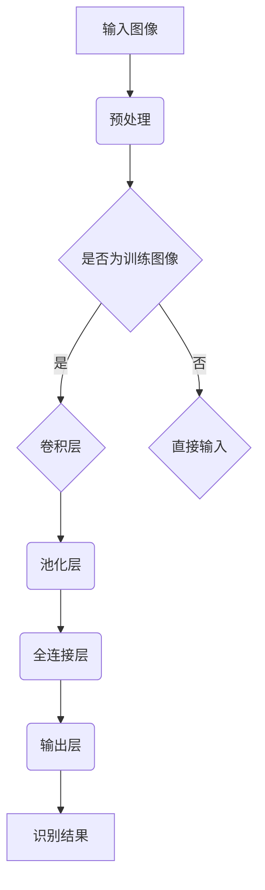

#### 6.2 自动计算机优化神经网络训练

自动计算机可以通过优化算法和硬件设施来加速神经网络的训练过程。例如，可以使用并行计算和分布式计算技术，将训练任务分配到多个计算节点上，从而提高训练速度。

以下是一个简单的神经网络训练流程图：

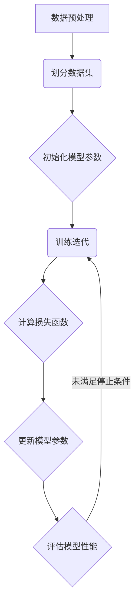

#### 6.3 神经网络与自动计算机在实时控制中的应用

神经网络与自动计算机的结合在实时控制领域具有广泛的应用。例如，在自动驾驶车辆中，神经网络可以实时处理车辆周围的环境信息，使车辆能够做出正确的决策。

以下是一个简单的神经网络结构，用于实时控制：

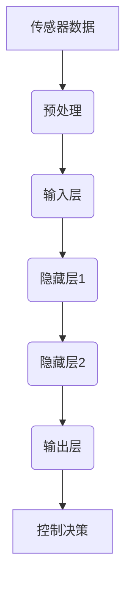

### 7. 神经网络在自动计算机中的实现

#### 7.1 神经网络硬件实现

神经网络硬件实现是提高神经网络性能和效率的关键。以下是一些常见的神经网络硬件实现方法：

1. **GPU加速**：使用图形处理单元（GPU）进行矩阵运算，加快神经网络训练速度。
2. **TPU加速**：使用专为神经网络设计的专用集成电路（TPU），进一步提高训练速度。
3. **FPGA加速**：使用现场可编程门阵列（FPGA）实现神经网络硬件加速。
4. **ASIC加速**：使用专用集成电路（ASIC）实现神经网络硬件加速。

#### 7.2 神经网络软件实现

神经网络软件实现是指使用编程语言和工具构建神经网络模型。以下是一些常见的神经网络软件实现方法：

1. **TensorFlow**：由谷歌开发的开源神经网络框架，支持多种编程语言，如Python、C++等。
2. **PyTorch**：由Facebook开发的开源神经网络框架，支持动态计算图，易于调试。
3. **Keras**：基于TensorFlow和Theano的开源神经网络框架，提供简洁的API。
4. **MXNet**：由Apache Software Foundation开发的开源神经网络框架，支持多种编程语言。

#### 7.3 神经网络硬件与软件的结合

神经网络硬件与软件的结合是提高神经网络性能和效率的关键。以下是一些常见的结合方法：

1. **混合训练**：在硬件加速器上进行前向传播和后向传播的运算，提高训练速度。
2. **混合推理**：在硬件加速器上进行推理运算，提高推理速度。
3. **硬件定制**：根据神经网络的特点，设计专门的硬件架构，提高性能和效率。

### 8. 神经网络与自动计算机的交互

神经网络与自动计算机的交互是指神经网络与传感器、执行器和其他外部设备之间的数据交换和控制。以下是一些常见的交互方法：

1. **传感器数据输入**：将传感器数据输入神经网络，用于特征提取和决策。
2. **执行器数据输出**：将神经网络输出作为执行器的输入，控制执行器的动作。
3. **外部设备通信**：通过接口与外部设备通信，实现数据交换和控制。

以下是一个简单的神经网络与传感器、执行器的交互流程：

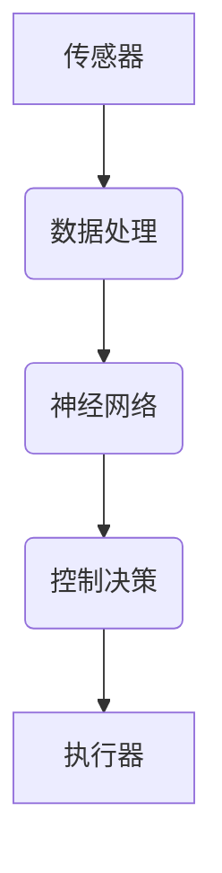

### 第三部分：神经网络与自动计算机的应用案例

#### 9. 神经网络在自动计算机中的应用案例

神经网络在自动计算机中有着广泛的应用，以下是一些典型的应用案例：

1. **自动驾驶**：神经网络用于识别道路、车辆和行人，实现自动驾驶功能。
2. **无人机**：神经网络用于无人机的路径规划和目标跟踪，提高无人机的自主能力。
3. **智能机器人**：神经网络用于智能机器人的感知、决策和行动，实现人机交互。

#### 9.1 自动驾驶

自动驾驶是神经网络在自动计算机中的重要应用案例。自动驾驶系统通过神经网络识别道路、车辆和行人，实现自主驾驶功能。以下是一个简单的自动驾驶系统结构：

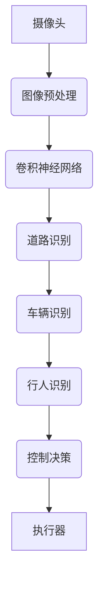

#### 9.2 无人机

无人机是神经网络在自动计算机中的另一个重要应用案例。无人机通过神经网络实现路径规划、目标跟踪和障碍物识别，提高无人机的自主飞行能力。以下是一个简单的无人机系统结构：

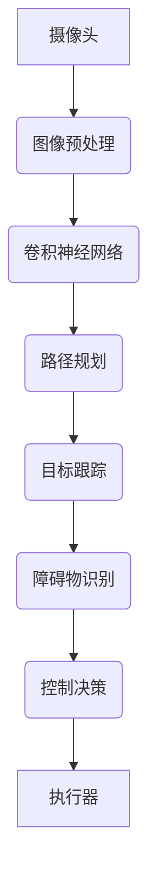

#### 9.3 智能机器人

智能机器人是神经网络在自动计算机中的又一重要应用案例。智能机器人通过神经网络实现感知、决策和行动，实现人机交互。以下是一个简单的智能机器人系统结构：

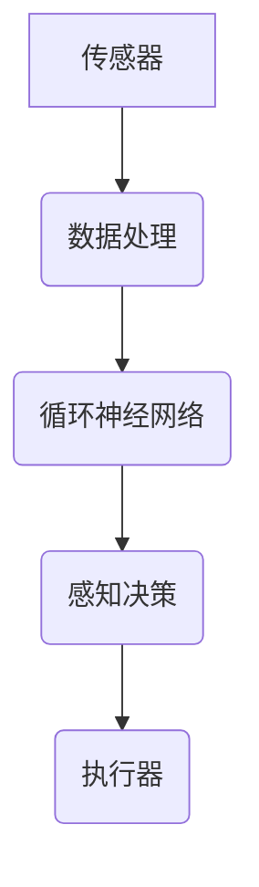

#### 10. 自动计算机在神经网络中的应用案例

自动计算机在神经网络中也有重要的应用，以下是一些典型的应用案例：

1. **神经网络加速卡**：自动计算机用于加速神经网络训练和推理。
2. **神经网络云计算**：自动计算机用于大规模神经网络训练和推理。
3. **神经网络边缘计算**：自动计算机用于边缘设备上的神经网络训练和推理。

#### 10.1 神经网络加速卡

神经网络加速卡是自动计算机在神经网络中的重要应用。神经网络加速卡通过专用的硬件架构和算法优化，提高神经网络训练和推理的效率。以下是一个简单的神经网络加速卡结构：

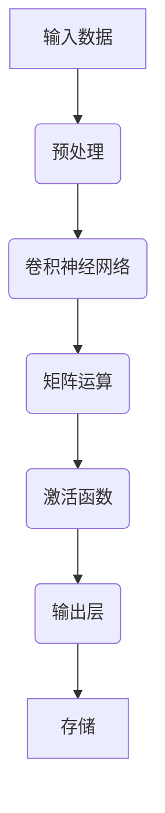

#### 10.2 神经网络云计算

神经网络云计算是自动计算机在神经网络中的重要应用。神经网络云计算通过云计算平台提供大规模神经网络训练和推理服务，满足大规模数据处理和实时性要求。以下是一个简单的神经网络云计算结构：

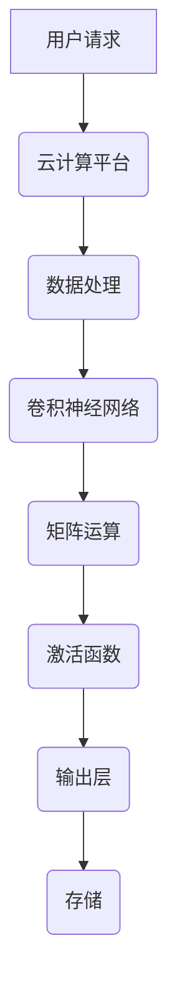

#### 10.3 神经网络边缘计算

神经网络边缘计算是自动计算机在神经网络中的另一个重要应用。神经网络边缘计算通过在边缘设备上部署神经网络，实现实时数据处理和决策，降低通信延迟和带宽需求。以下是一个简单的神经网络边缘计算结构：

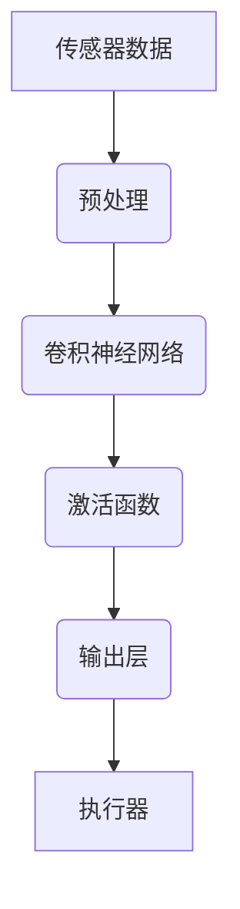

### 11. 神经网络与自动计算机的未来发展趋势

神经网络与自动计算机的未来发展趋势主要集中在以下几个方面：

1. **新型神经网络结构**：随着计算能力的提升，研究人员不断探索新型神经网络结构，如生成对抗网络（GAN）、图神经网络（GNN）等，以提高神经网络的能力和效率。
2. **自动计算机硬件的发展**：随着半导体技术的进步，自动计算机硬件的性能和功耗将持续提升，为神经网络的应用提供更好的硬件支持。
3. **神经网络与自动计算机在未来的应用前景**：随着人工智能技术的不断发展，神经网络与自动计算机将在自动驾驶、智能机器人、医疗诊断等领域发挥重要作用，推动社会生产力和科技水平的提升。

#### 11.1 新型神经网络结构

新型神经网络结构是神经网络与自动计算机未来发展的重要方向。以下是一些新型神经网络结构：

1. **生成对抗网络（GAN）**：GAN由生成器和判别器组成，通过对抗训练生成高质量的数据。
2. **图神经网络（GNN）**：GNN用于处理图结构数据，如社交网络、知识图谱等。
3. **变分自编码器（VAE）**：VAE通过学习数据的概率分布，实现数据的生成和降维。

#### 11.2 自动计算机硬件的发展

自动计算机硬件的发展是神经网络与自动计算机未来发展的重要保障。以下是一些自动计算机硬件的发展趋势：

1. **量子计算机**：量子计算机具有超强的计算能力，将在某些领域替代传统计算机。
2. **类脑计算机**：类脑计算机通过模仿人脑结构和功能，实现高效的信息处理和自适应能力。
3. **人工智能芯片**：人工智能芯片通过硬件加速，提高神经网络训练和推理的效率。

#### 11.3 神经网络与自动计算机在未来的应用前景

神经网络与自动计算机在未来的应用前景非常广阔。以下是一些应用前景：

1. **自动驾驶**：自动驾驶技术将实现安全、高效、环保的出行方式。
2. **智能机器人**：智能机器人将在医疗、制造、服务等领域发挥重要作用。
3. **医疗诊断**：神经网络与自动计算机将提高医疗诊断的准确性和效率。
4. **智能制造**：神经网络与自动计算机将推动智能制造的快速发展。

### 附录

#### 附录 A: 神经网络与自动计算机相关资源

以下是一些神经网络与自动计算机相关资源，供读者参考：

1. **学术论文推荐**：包括《深度学习》、《神经网络与深度学习》等。
2. **开源代码与工具**：包括TensorFlow、PyTorch、MXNet等。
3. **专业书籍推荐**：包括《深度学习》（Goodfellow等著）、《神经网络与深度学习》（邱锡鹏著）等。
4. **期刊与会议推荐**：包括《神经网络与深度学习》、《计算机视觉与模式识别》等。

#### 附录 B: Mermaid 流程图与伪代码示例

以下是一个简单的神经网络训练流程图和伪代码示例：

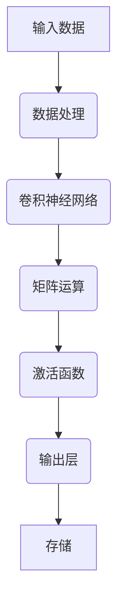

```python
# 伪代码示例
for epoch in range(num_epochs):
    for batch in data_loader:
        inputs, labels = batch
        optimizer.zero_grad()
        outputs = model(inputs)
        loss = criterion(outputs, labels)
        loss.backward()
        optimizer.step()
```

#### 附录 C: 数学模型与公式

以下是一些常用的数学模型和公式：

1. **神经网络激活函数**：
   - \( f(x) = \frac{1}{1 + e^{-x}} \)（Sigmoid函数）
   - \( f(x) = max(0, x) \)（ReLU函数）

2. **损失函数**：
   - \( L = \frac{1}{2} \sum_{i=1}^{n} (y_i - \hat{y}_i)^2 \)（均方误差）
   - \( L = -\sum_{i=1}^{n} y_i \log(\hat{y}_i) + (1 - y_i) \log(1 - \hat{y}_i) \)（交叉熵损失）

3. **优化算法公式**：
   - \( \theta_{\text{new}} = \theta_{\text{old}} - \alpha \nabla_\theta J(\theta) \)（梯度下降）
   - \( \theta_{\text{new}} = \theta_{\text{old}} - \alpha \nabla_\theta J(\theta) \)（随机梯度下降）

#### 附录 D: 实际应用案例代码解读

以下是一些实际应用案例的代码解读：

1. **自动驾驶系统代码解读**：
   ```python
   # 导入必要的库
   import tensorflow as tf
   import cv2

   # 加载自动驾驶模型
   model = tf.keras.models.load_model('autonomous_driving_model.h5')

   # 加载摄像头
   cap = cv2.VideoCapture(0)

   while True:
       # 读取摄像头帧
       ret, frame = cap.read()

       # 预处理摄像头帧
       processed_frame = preprocess_frame(frame)

       # 预测道路和车辆
       predictions = model.predict(processed_frame)

       # 根据预测结果控制车辆
       control_signal = control_vehicle(predictions)

       # 输出控制信号
       print(control_signal)

       # 显示摄像头帧
       cv2.imshow('frame', frame)

       # 按下'q'键退出循环
       if cv2.waitKey(1) & 0xFF == ord('q'):
           break

   # 释放摄像头资源
   cap.release()
   cv2.destroyAllWindows()
   ```

2. **智能机器人控制系统代码解读**：
   ```python
   # 导入必要的库
   import rospy
   import cv2
   from sensor_msgs.msg import Image
   from cv_bridge import CvBridge

   # 初始化机器人控制节点
   rospy.init_node('robot_control', anonymous=True)

   # 创建订阅摄像头数据的回调函数
   def callback(data):
       # 转换图像数据为OpenCV格式
       bridge = CvBridge()
       image = bridge.imgmsg_to_cv2(data, "bgr8")

       # 预处理图像数据
       processed_image = preprocess_image(image)

       # 预测机器人行动
       action = predict_action(processed_image)

       # 发送控制命令
       send_command(action)

   # 订阅摄像头数据
   image_sub = rospy.Subscriber('/camera/image_raw', Image, callback)

   # 创建发布器
   cmd_vel_pub = rospy.Publisher('/cmd_vel', Twist, queue_size=10)

   # 创建控制命令消息
   command = Twist()

   # 持续发送控制命令
   while not rospy.is_shutdown():
       # 根据预测结果更新控制命令
       command.linear.x = action[0]
       command.angular.z = action[1]

       # 发布控制命令
       cmd_vel_pub.publish(command)

       # 持续发送控制命令
       rate = rospy.Rate(10)
       rate.sleep()
   ```

3. **无人机飞行控制系统代码解读**：
   ```python
   # 导入必要的库
   import dronekit
   import cv2
   from cv2 import imwrite

   # 初始化无人机连接
   drone = dronekit.connect('udp:127.0.0.1:14550', wait_ready=True)

   # 创建订阅摄像头数据的回调函数
   def callback(data):
       # 转换图像数据为OpenCV格式
       bridge = CvBridge()
       image = bridge.imgmsg_to_cv2(data, "bgr8")

       # 预处理图像数据
       processed_image = preprocess_image(image)

       # 预测无人机行动
       action = predict_action(processed_image)

       # 根据预测结果更新无人机控制参数
       drone_DEFINE(action[0], action[1], action[2], action[3])

   # 订阅摄像头数据
   image_sub = rospy.Subscriber('/camera/image_raw', Image, callback)

   # 持续接收摄像头数据并更新无人机控制参数
   while not rospy.is_shutdown():
       # 接收摄像头数据
       rate = rospy.Rate(10)
       rate.sleep()
   ```

---

本文对自动计算机与神经网络的研究进行了全面深入的探讨，从基本原理到应用案例，从数学基础到未来发展，为读者提供了一个系统、全面的视角。希望本文能够为读者在相关领域的研究和应用提供有益的参考和启示。在未来的发展中，自动计算机与神经网络的结合将继续推动人工智能技术的进步，为人类社会带来更多的便利和创新。在接下来的文章中，我们将继续探讨神经网络与自动计算机在各个领域的应用，以及它们在未来可能的发展方向。希望读者能够继续关注，共同见证这一激动人心的技术变革。作者：AI天才研究院/AI Genius Institute & 禅与计算机程序设计艺术/Zen And The Art of Computer Programming。

